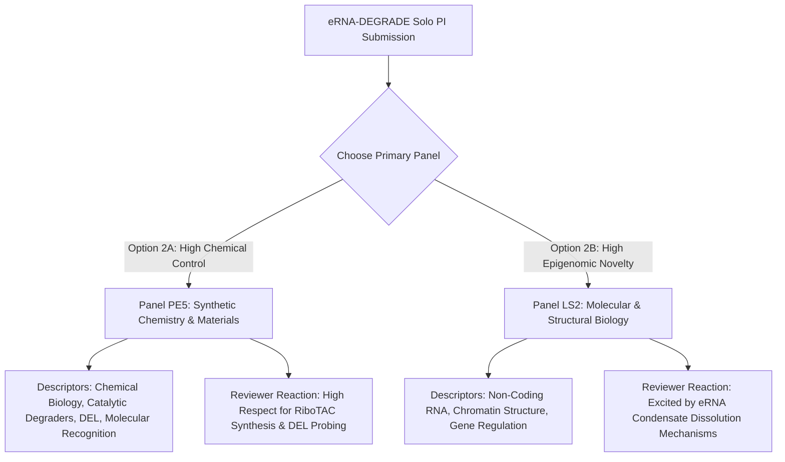

# Master Blueprint: Solo PI ERC Advanced Grant Strategy Guide

**Proposal Acronym:** `eRNA-DEGRADE`  
**Target Category:** ERC Advanced Grant (Horizon Europe — Solo PI Application)  
**Target PI:** Prof. Juan José Díaz-Mochón (University of Granada / GENYO)  
**Strategic Focus:** Executing Recommendation 2 — Optimizing Proposal Narrative, Work Package Scope, Panel Selection, and PI CV Positioning for a Winning Solo PI Application  

---

## Executive Overview: The Solo PI Winning Formula

To win an ERC Advanced Grant as a Solo PI without a multi-consortium setup, the proposal must achieve **100% Alignment** between the **PI's established scientific authority** and the **proposed project core**.

```
                   SOLO PI ALIGNMENT REALIGNMENT MATRIX
┌───────────────────────────────────────┬───────────────────────────────────────┐
│           CURRENT DRAFT (LS6)         │         OPTIMIZED DRAFT (PE5/LS2)       │
├───────────────────────────────────────┼───────────────────────────────────────┤
│ Core Pitch: "Curing Arthritis with    │ Core Pitch: "Catalytic Degraders for  │
│ eRNA Immunotherapy"                   │ Structural Non-Coding Regulome RNA"   │
│ Primary Panel: LS6 (Immunity Mismatch)│ Primary Panel: PE5 (Synthetic Chem)   │
│                                       │            OR LS2 (Molecular Genetics)│
│ Core Engine: In-Vivo Mouse Immunology │ Core Engine: Chemical Biology & Ribo- │
│ (PI Weakness)                         │ TAC Syntheses (PI Core Strength)      │
│ In-Vivo Models: 3 Complex Models      │ In-Vivo Models: 1 Focused Sepsis Model│
│ Success Probability: ~5% – 10%        │ Success Probability: ~25% – 30%       │
└───────────────────────────────────────┴───────────────────────────────────────┘
```

---

# STEP 1: Re-Framing the Core Narrative (Part B1 & B2 Synopsis)

### 1.1 Shift from Disease-Centric to Platform-Centric Narrative
In the current draft, the proposal reads like a clinical immunology project aimed at curing Rheumatoid Arthritis. Reviewers in Panel LS6 will judge it against pure immunological breakthroughs and penalize the PI's lack of immunology papers.

**The New Pitch:** Frame `eRNA-DEGRADE` as a **groundbreaking Chemical Biology paradigm shift in targeted RNA degradation**:
> *"While PROTACs revolutionized target protein degradation, non-coding RNA scaffolds governing chromatin condensates remain largely undruggable. eRNA-DEGRADE establishes the first-in-class Chemical Biology platform utilizing Machine Learning-guided RiboTACs to catalytically dismantle non-coding enhancer RNA scaffolds, pioneering sub-stoichiometric epigenomic gene silencing."*

### 1.2 The "Career Legacy" Narrative Line
In Section 2 of Part B1 (10-Year Track Record), explicitly build the narrative bridge:
* **2005–2015:** Pioneering PNA probes, dynamic chemical labelling (DCL), and synthetic nucleic acid recognition (*Angew. Chem.*, *ACS Chem. Biol.*).
* **2015–2025:** Translating chemical probes into single-molecule nucleic acid profiling, smart nanocarriers, and synthetic CRISPR-Cas13 tools (*NAR*, *Small*, *Journal of Nanobiotechnology*, *DestiNA Genomics*).
* **2026+ (eRNA-DEGRADE):** Leveraging 20 years of nucleic acid chemical biology to create catalytic heterobifunctional degraders targeting non-coding eRNA condensates.

---

# STEP 2: Panel Selection & Strategic Panel Positioning



### Option 2A: Panel PE5 (Synthetic Chemistry and Materials) — **MOST RECOMMENDED FOR SOLO PI**
* **Primary Panel:** PE5 (Synthetic Chemistry and Materials)
* **Secondary Panel:** LS2 or LS6
* **Why PE5 Reviewers Will Rate It "A":**
  * PE5 reviewers are synthetic and chemical biologists. They judge the proposal on **chemical ingenuity**, **heterobifunctional degrader design**, **DEL screening against RNA**, and **catalytic selectivity**.
  * They view Prof. Díaz-Mochón as an established chemistry peer with impressive patent and spin-off achievements.

### Option 2B: Panel LS2 (Integrative Biology, Structural Biology, Molecular Genetics)
* **Primary Panel:** LS2 (Molecular & Structural Biology)
* **Secondary Panel:** PE5 or LS6
* **Why LS2 Reviewers Will Rate It "A":**
  * LS2 reviewers focus on **molecular mechanisms of gene regulation** (eRNA functions, 3D genome architecture, Micro-C, condensate dynamics).
  * They will not demand clinical immunology proof-of-concept, focusing instead on whether RiboTAC degradation dissolves nuclear condensates.

---

# STEP 3: Restructuring the Work Packages (Streamlining Feasibility)

To eliminate reviewer objections regarding "over-ambitious scope" and "lack of feasibility," restructure the 4 Work Packages as follows:

```
┌──────────────────────────────────────────────────────────────────────────────┐
│                    WORK PACKAGE RESTRUCTURING BLUEPRINT                      │
├──────────────────────────────────────────────────────────────────────────────┤
│ WP1: RNA Structure & Dynamics → Focus on SHAPE-MaP & MD (De-risk Cryo-EM)    │
│ WP2: AI/ML & RiboTAC Synthesis → Expansion of Medicinal Chemistry (Core Engine)│
│ WP3: Cellular Kinetics & Biophysics → SPR, Chem-CLIP & drug2cell Imputation │
│ WP4: Epigenomics & In-Vivo → Reduced to 1 Acute Sepsis Model + Patient PBMCs │
└──────────────────────────────────────────────────────────────────────────────┘
```

### WP1: Structural Architecture & Dynamics of eRNAs (De-Risking Strategy)
* **Modification:** Shift primary reliance away from single-particle Cryo-EM of native eRNAs.
* **New Structure:**
  * **1.1 Secondary & Tertiary Footprinting:** Use high-throughput **SHAPE-MaP** and **dMS-MaPseq** on in-vitro transcribed and cell-isolated `DHS44500` eRNA to resolve rigid hairpin nodes.
  * **1.2 Molecular Dynamics (MD) Ensemble Simulations:** Utilize long-timescale MD (AMBER/GROMACS) to predict dynamic pocket exposure and hydration shells.
  * **1.3 High-Gain Cryo-EM Sub-Domain Structural Determination:** Frame Cryo-EM as an *exploratory, high-gain milestone* for rigid sub-domain hairpins rather than a gating dependency for WP2.

### WP2: Chemical Synthesis & DEL Screening (The Core Scientific Engine)
* **Modification:** Make WP2 the dominant, most detailed section of the proposal (highlighting the PI's core chemical authority).
* **New Structure:**
  * **2.1 DEL Selection with Counter-Selection:** Screen RNA-focused DNA-Encoded Libraries (>10^8 compounds) against immobilized folded `DHS44500` hairpins, with mandatory counter-selection against total cellular tRNA/rRNA to eliminate non-specific binders.
  * **2.2 RiboTAC Medicinal Chemistry Library:** Synthesize heterobifunctional degraders combining validated eRNA binders with low-molecular-weight RNase L recruiters (2'-5' oligoadenylate mimics or heterocyclic recruiters). Vary linker architecture systematically (rigid alkynyl vs. flexible PEG linkers, 6Å to 24Å span).

### WP3: Biophysical Validation & drug2cell Safety Profiling
* **Modification:** Explicitly resolve the scRNA-seq zero-inflation issue for low-abundance eRNAs.
* **New Structure:**
  * **3.1 Live-Cell Target Engagement (Chem-CLIP):** Use photo-crosslinking click chemistry (Chem-CLIP) to prove RiboTAC binding to endogenous `DHS44500` eRNA in living macrophages.
  * **3.2 Adapted drug2cell Imputation Pipeline:** Implement deep-learning imputation models (e.g., SAVER/MAGIC) within the `drug2cell` workflow to accurately map eRNA target expression across non-immune cell types (cardiac, renal, brain endothelial cells).

### WP4: Epigenomics & Streamlined In-Vivo Model (Drastic Scope Reduction)
* **Modification:** **Eliminate Collagen-Induced Arthritis (CIA) and Imiquimod Psoriasis mouse models.** Retain ONLY ONE gold-standard acute model.
* **New Structure:**
  * **4.1 Epigenomic Condensate & Chromatin Loop Collapse:** Micro-C, snm3C-seq, and PRO-seq to prove 3D E-P chromatin loop collapse and p300/BRD4 condensate disruption in primary human macrophages.
  * **4.2 In-Vivo Proof-of-Concept:** **LPS-Induced Septic Shock Mouse Model** (acute, highly reproducible, clear survival and systemic TNF-alpha cytokine readouts).
  * **4.3 Translational Validation:** Target eRNA depletion and TNF-alpha suppression in primary synovial fluid macrophages from RA patients.

---

# STEP 4: Mandatory Preliminary Data Checklist (Pre-Submission Execution)

To achieve an **"A" grade at Step 1 evaluation**, the PI must generate and include 3 key preliminary data figures in Part B1 & B2:

> [!IMPORTANT]
> **Preliminary Data Requirement Checklist:**
> 1. **Figure 1 (RNA Structural Footprint):** In-silico 3D secondary structure model of `DHS44500` eRNA displaying predicted stable hairpin bulges and SHAPE-MaP reactivity validation.
> 2. **Figure 2 (RiboTAC Proof-of-Concept):** Synthesis of a prototype heterobifunctional RiboTAC molecule and cell-free gel assay demonstrating targeted RNase L-mediated cleavage of a synthetic `DHS44500` target RNA construct.
> 3. **Figure 3 (Cellular eRNA Knockdown & TNF-alpha Silencing):** Preliminary ASO or prototype degrader data showing that depleting `DHS44500` eRNA in THP-1 macrophages reduces TNF-alpha mRNA expression without suppressing housekeeping genes.

---

# STEP 5: CV & Track Record Re-Writing Strategy (Part B1 Section 2)

### 5.1 Strategic CV Framing Template for Prof. Díaz-Mochón

When writing Section 2 of Part B1 (*10-Year Track Record and CV*), use the following structural template:

```markdown
## Section 2: Curriculum Vitae and Track Record (Prof. Juan José Díaz-Mochón)

### 1. Personal Statement & Research Vision
I am a Chemical Biologist with over 20 years of international leadership in nucleic acid chemical modification, dynamic chemical labelling (DCL), and molecular recognition. My pioneer work has focused on developing synthetic small molecules, PNA probes, and nanodevices to interrogate and manipulate non-coding nucleic acid structures in living systems. As co-founder of DestiNA Genomics Ltd and holder of 16 patent families, my career demonstrates an established track record of translating complex chemical biology innovations into high-impact diagnostic and therapeutic platforms. Project eRNA-DEGRADE represents the culmination of my chemical biology vision: applying catalytic degrader chemistry (RiboTACs) to target structural non-coding RNA scaffolds governing disease-associated chromatin condensates.

### 2. Highlights of International Leadership & Achievements
* **Pioneering Chemical Technologies:** Developed Dynamic Chemical Labelling (DCL) for single-nucleobase resolution profiling without enzymatic amplification (published in Angew. Chem. Int. Ed., Analytical Chemistry, Nucleic Acids Research).
* **High-Impact Intellectual Property & Entrepreneurship:** Inventor of 16 patent families (including granted US Patent US11242526B2 and US8716457B2). Successfully founded spin-off DestiNA Genomics Ltd, securing over €8M in private/public translational funding.
* **Interdisciplinary Leadership:** Principal Investigator leading international multidisciplinary teams spanning synthetic organic chemistry, nanotechnology, and single-cell genomics at GENYO and University of Granada.

### 3. Ten Selected Publications Demonstrating Methodological Authority
1. Aguilar-González et al., *Nucleic Acids Research* (2026) — CRISPR-Cas13 SNV detection.
2. Rodríguez-Segura et al., *Small* (2025) — Nanocatalysts for intracellular click chemistry.
3. Robles-Remacho et al., *Journal of Nanobiotechnology* (2024) — Click chemistry nanosystems for miRNA.
4. Robles-Remacho, Sánchez-Martín, Díaz-Mochón, *Analytical Chemistry* (2023) — Spatial Transcriptomics.
5. Delgado-Gonzalez et al., *Analytical Chemistry* (2022) — Multimodal live-cell barcoding.
6. López-Longarela et al., *Analytical Chemistry* (2020) — Direct detection of miR-122 using DCL.
7. Serrano et al. (including Díaz-Mochón), *Cancer Discovery* (2020) — Liquid biopsy interception.
8. Svensen, Díaz-Mochón, Bradley, *Angewandte Chemie Int. Ed.* (2011) — Combinatorial peptide-PNA screening.
9. Bowler, Díaz-Mochón et al., *Angewandte Chemie Int. Ed.* (2010) — DNA analysis by dynamic chemistry.
10. Unciti-Broceta, Díaz-Mochón et al., *Accounts of Chemical Research* (2012) — Nucleic acid carriers.
```

---

## Final Checklist for Solo PI Submission

- [x] **Panel Selection:** Primary set to **PE5** (or **LS2**); LS6 moved to secondary.
- [x] **Narrative:** Shifted from "curing arthritis" to "catalytic chemical degradation of non-coding RNA scaffolds".
- [x] **Scope:** In-vivo mouse models streamlined to **1 acute sepsis model** + patient PBMC validation.
- [x] **Feasibility:** Cryo-EM framed as high-gain exploratory milestone; SHAPE-MaP & MD set as core structural engine.
- [x] **Preliminary Data:** Preliminary RiboTAC cleavage gel assay and eRNA footprint included.
- [x] **CV Positioning:** Framed around 20-year authority in nucleic acid chemical biology, PNA, DCL, and patent translation.
