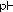
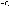
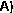
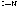

This is a self-archived – parallel-published version of an original article. This  version may differ from the original in pagination and typographic details.  When using please cite the original. 

|AUTHOR |Aapo Aho, Mika Sulkanen, Heidi Korhonen, Pasi Virta |
|---|---|
|TITLE |Conjugation of Oligonucleotides to Peptide Aldehydes via a  pH-Responsive N-Methoxyoxazolidine Linker |
|YEAR |2020. August 17th.  |
|DOI |https://doi.org/10.1021/acs.orglett.0c01815|
|VERSION |Final Draft.  |
|CITATION |Org. Lett. 2020, 22, 17, 6714–6718   Publication Date:August 17, 2020   https://doi.org/10.1021/acs.orglett.0c01815  Copyright © 2020 American Chemical Society |

Conjugation of oligonucleotides to peptide aldehydes via pH-responsive N-methoxyoxazolidine linker

Aapo Aho, Mika Sulkanen, Heidi Korhonen, Pasi Virta*

Department of Chemistry, University of Turku, 20014 Turku, Finland Supporting Information Placeholder

ABSTRACT: The formation of N-methoxyoxazolidines in the preparation of oligonucleotide-peptide conjugates was evaluated. The reaction occurred between unprotected 2’-N-(methoxy)amino-modified oligonucleotides and peptide aldehydes in reasonable yields when isolated. The reaction is reversible in slightly acidic conditions, and it is pH-responsive. The rate and the equilibrium constant may be varied with structurally different aldehydes, allowing an optimization of the ligation and cleavage rate of the resultant conjugates. Therefore, this concept can be considered a cleavable linker.

The interest to conjugate oligonucleotides (ONs) with peptides is currently undergoing a renaissance in order to development new tools for targeted delivery of ON therapeutics.1 Of particular interest are peptides that in conjunction with large macromolecular delivery vehicles (e.g. nanoparticles, extracellular vesicles2 and antibodies3) would recognize appropriate cell surface receptors and/or facilitate penetration of ONs through cellular barriers,4,5 which, for example, is needed for endosomal escape.6 As an example, antibodies are powerful tools to provide tissue-specific targeting of ONs,7-9 but lead to endosomal entrapment of the ONs. In addition, membrane penetrating auxiliaries are needed, in which certain peptides may be utilized.611 Similar needs may be required in nanoparticle-loaded ONs. While construction of these multifunctional constructs in the polydisperse form  may be straightforward, synthesis of such uniform and covalently conjugated constructs is complex. In these scenarios you would need an efficient ligation to load ONs to antibodies or nanoparticles and then another orthogonal ligation, with nearly similar requirements, to conjugate ONs to peptides. Furthermore, cleavable linkers may be required to release the active ON cargo from the delivery vehicles.12 Ideally the ligation chemistry itself would be reversible enough in the intracellular compartments but stable at physiological  conditions. Therefore, eliminating the need of extra modifications in the structure to provide these characteristics. Examples of conventional linkages are: disulfide-13 and hydrazone-ligation.14,15 The first reaction is reversible in reducing conditions found in the cytoplasm and the latter in slightly acidic conditions, such as in endosomes (pH 5.5-6.2) and tumor tissues.12 Both reactions are practically orthogonal allowing robust and efficient conjugation

between  appropriately  functionalized  unprotected  ONs  and peptides.

Despite the existing technologies, there is an obvious need for alternative conjugation chemistries that allow straightforward  and  orthogonal  ligation  between  unprotected ONs  and peptides. Plausible biodegradability of the linkage would be an additional benefit. Furthermore, it would be advantageous if the reactive moieties may be readily converted to a solid supported reagent. This would enable an automated synthesis of both reactive constituents (i.e. appropriately modified ONs and peptides). In order to meet the above mentioned needs and requirements, the present study describes a novel conjugation strategy, based on a pH responsive N-methoxyoxazolidine-formation between  readily  available  2’-N-(methoxy)amino-modified  ONs and peptide aldehydes.

The rational for this design of ligation may be attributed to a combined chemistry  of neoglycosides16 and oxazolidines.17-20 Neoglycosylation is an acid catalyzed reaction that occurs between sugar hemiacetals and N-methyl alkoxyamines.16 It has been applied to the synthesis of various carbohydrate conjugates,21-26 due to its orthogonality and good isosteric similarity to native glycan structures. However, the equilibrium constant of this reaction is relatively small (in aqueous solution < 100 L mol-1, pH < 6).27,28 By applying this same  alkoxyamine-promoted acid catalyzed O,N-acetalization to form a 5-membered oxaozolidine  ring,17-20  the equilibrium  constant  may  increase with the same favorable pH-profile of the reaction. To verify this hypothesis, the reaction with small molecular models was first  studied.  For  this  purpose,  2’-deoxy-2’-(N-methoxy-

amino)uridine (1) was synthesized from anhydrouridine 3 following the procedure by Ogawa et al.29 (Scheme 1) and mixed with buffered solutions of different small molecular aldehydes (Table 1). The reaction rates and equilibrium constants were determined at pH 4, 5 and 6 using 5 mmol L-1 1 and 5 mmol L-1 each aldehyde (at 22 ºC). As seen in Table 1, the reaction behaved like a neoglycosylation: the reaction was accelerated by lowering the pH from 6 to 4, but notably there was a relatively high equilibrium yield (K = 0.4 – 9.0 × 103 L mol-1). In each case, a dynamic equilibrium of (R/S)-stereoisomers of the oxazolidines was obtained (Figure 1). The reaction rate and equilibrium constant could be tuned by using different aldehydes. Relatively fast reaction rates were observed with aliphatic nonhindered  aldehydes  (acetaldehyde,  butyraldehyde,  t0.5 ca  10 min. at pH 4.0). The highest equilibrium constant was observed with N-Bz-glycinaldehyde (K =  9.0 × 103 L mol-1, at pH 5.0). In our initial tests (data not shown) only trace of products was observed with ketones (e.g. acetone and levulinic acid) and reaction  with  conjugated  aldehydes  (benzaldehyde, p-methoxybentsaldehyde, pyridine-2-carboxaldehyde, cinnamaldehyde) was sluggish. Each product in Table 1 was also isolated, exposed to the same conditions, and the reverse reaction was studied. The decay rates with aliphatic aldehydes (acetaldehyde, butyraldehyde: t0.5decay ca. 3 – 5 h, 22 ºC) were comparable to hydrazones at pH 5.014,15, but the decays with benzyloxypropionaldehyde  and N-Bz-glycinaldehyde  were  markedly  slower. The formation obeyed a mixed reversible 2nd and 1st order rate law (cf. Equation S3). However, variation of the experimentally determined reaction rates extracted from the formation and decay was observed. This may be explained by partial obfuscating side reactions of the aldehydes.30-32

The reaction with N-Bz-glycinaldehyde was studied further to find optimal conditions to conjugate ONs with peptide aldehydes. Changing the solvent from H2O to DMSO improved the equilibrium yield, as expected, but the reaction rate could be accelerated by mineral salts (NaCl, NaI, LiCl).33 In optimized conditions  (5.0 mM 1  +  7.5  mM N-Bz-glycinaldehyde,  1.5 equiv. in DMSO/AcOH/H2O, 73:24:3, v/v/v, 2 M LiCl, 50 °C) the product was obtained in near quantitative yield (> 98%) in 15 min.

Solid support 2, applicable to an automated synthesis of 2’(N-methoxy)amino modified ONs, was next prepared (Scheme 1). 5´-O-(4,4´-dimethoxytrityl)-2´-deoxy-2´-(N-methoxyamino)uridine (5) was converted to a succinate and immobilized to a long-chain alkylamino-modified controlled pore glass (LCAA-CPG,  loading  of  21 µmol g-1)  using  a  PyBOP-promoted amide coupling. The unreacted amino groups and the 3’OH group on the support were capped by acetic anhydride treatment. The Weinreb amide of 2 is cleavable by concentrated ammonia, which simplified the support preparation. To verify this prior to ON synthesis, a small aliquot of 2 was exposed to concentrated ammonia (5 h at 55 ºC), and the quantitative release of 5 was confirmed by LC-MS analysis. 2 was then used for the automated assembly of 2’-deoxy-2’-N-(methoxy)amino uridine (UNOMe ) extended ONs (Scheme 1): T6UNOMe, AON-ISE-UNOMe (with  the  phosphorothioate  backbone)  and  its  bicyclononyne derivative  BCN-AON-ISE-UNOMe  (with  the  native  phosphodiester backbone). While T6 is just a model, AON-ISE prevents expression of an androgenic receptor variant (AR-V7) as a potential therapeutic option for the treatment of castration-resistant prostate cancer.34 The oligonucleotides were synthesized under standard conditions on 1.0 µmol scale  using  commercially available phosphoramidite building blocks (Scheme 1).

3-phenyl-1,2,4-dithiazoline-5-one (POS) was used as a sulfurization agent for AON-ISE-UNOMe. Cleavage with concentrated ammonia, followed by RP HPLC purification (Figure S7) gave the  desired  2’-N-methoxamino-modified  oligonucleotides  in isolated yields of 32% (T5UNOMe), 26% (AON-ISE-UNOMe) and 17% (BCN-AON-ISE-UNOMe). No premature reaction with aldehyde impurities was encountered during the purification (pH above 7). This is in contrast to what is typical for hydrazine-35 or oxyamine-36 modified oligonucleotides.

Scheme  1. Synthesis  of  CPG-immobilized 2´-deoxy-2´-(Nmethoxyamino)uridine (2) and the 2’-deoxy-2’-(N-methoxyamine)-modified oligonucleotides

O

O

NH

1) CDI, 1.5 equiv, pyridine, overnight at rt

N O O

DMTrO

2) MeONH2, 4 equiv, pyridine, overnight at rt,

DMTrO O

N O

3) DBU, 0.2 equiv, THF 60%

O N

OMe

OH

3

O

4

1) succinic anhydride, 1.4 equiv, DMAP (cat), pyridine

O

2) PyBOP, 1 equiv, DIEA, 2 equiv, LCAA-CPG, DMF, overnight at rt

NH

Cs2CO3, 3 equiv, MeOH, overnight at rt

3) Ac2O, lutidine, 1 -methylimidazole, THF, 2 x 15 min at rt

N O O

RO

O

39%

NH

OH HN

OMe

N O O

DMTrO

5 R = DMTr 1 R = H

HCl, methanol, 2h at rt

OAc N

56%

OMe O

O

2

NH

NH

O P O-

O

N O O

O

Automated Oligonucleotide synthesis

UNOMe =

OH HN

OMe

the rest bold letters are 2'-Omethylribonucleotides

T6UNOMe: TTTTTTUNOMe

AON-ISE-UNOMe: CUAGUAUGAAAGAGAGACAUUGU NOMe

O

BCN-AON-ISE-UNOMe: O P CUAGUAUGAAAGAGAGACAUUGU NOMe

O-

1,0

0,9

0,8

0,7

0,6

X / Xitot

0,5

0,4

0,3

0,2

0,1

0,0

t0.5 = (4.84 ± 0.02) h

Total

Major product

Minor product

0 10 20 30 40

Reaction time (h)

Figure 1. N-(Methoxy)oxazolidine formation between 1 and N-Bz-glycinaldehyde. A) Reaction profile ofN-Bz-glycinaldehyde ligation at pH 4 (Table 1, entry 7) B) RP HPLC profile of the  reaction  at  35 h  Cf.  conditions  in  the  Supporting  Information.

Scheme 2. Synthesis of peptide aldehydes for the conjugation of oligonucleotides

Table 1. Formation and decay of N-Methoxyoxazolidines between 2’-deoxy-2’-(N-methoxy)amino uridine and aldehydes

entrya R pH t0.5 formationb t0.5 decayc equilibrium yield (%) equilibrium constant, K (M-1) 1 Me 4 (7.90 ± 0.27) min (1.54  ± 0.30) h 59 693 ± 29 2 “ 5 (25.8 ± 0.6) min (3.32 ± 0.40) h 62 856 ± 27 3 “ 6 (3.93 ± 0.09) h (43.1 ± 2.7) h 67 1211 ± 39 4 Pr 4 (11.8 ± 0.6) min (1.50 ± 0.34) h 62 835 ± 49 5 “ 5 (40.1 ± 0.6) min (5.29 ± 0.58) h 54 499 ± 7 6 “ 6 (4.14 ± 0.04) h n/a 49 379 ± 3 7 BzNHCH2 4 (4.84 ± 0.02) h (16.1 ± 0.7) h 82 4958 ± 50 8 “ 5 (33 h ± 1.3) h (75.5 ± 16.3) h 86 9038 ± 1265 9 “ 6 (12.8 ± 0.6) d n/a 74 2224 ± 183 10 BnOCH2CH2 4 (21.6 ± 0.5) min (2.00 ± 0.14) h 64 959 ± 28 11 “ 5 (1.92 ± 0.05) h (9.98 ± 0.38) h 66 1144 ± 39 12 “ 6 (25.0 ± 0.7) h (88.2 ± 6.8) h 63 939 ± 34

a22 °C, 50 mM buffer (cf. supporting information).  b5 mM 1 and 5 mM aldehyde. c5 mM ligation product

Scheme  3. N-methoxyoxazolidine  ligation  of  oligonucleotides to peptide aldehydes.

biomaterials, though immunogenicity issues should be resolved prior to drug delivery applications.40 THR binds to transferrin receptor,41 and it has been applied to deliver RNA nanoparticles through blood brain barrier.42,43 The peptides were cleaved from the support using common TFA–scavenger cocktails (cf. supporting information), precipitated in Et2O and purified by RP HPLC to give the desired peptide aldehydes in 9% (SpyTag(AEEA)2-Gly-H) and 11% (THR-Gly-H) isolated yields.

Three ON-peptide conjugates (C1, C2 and C3, Scheme 3) were prepared by mixing the 2’-(N-methoxy)amino modified ONs (4 mM T6UNOMe or AON-ISE-UNOMe) with peptide aldehydes  (8  mM,  SpyTag-(AEEA)2-Gly-H  or  THR-Gly-H,  2 equiv.) in a mixture of AcOH/DMSO 1:3, v/v, 2 M LiCl. The mixtures were incubated at 50 °C for 1 h, purified by RP HPLC (Figure S12) and lyophilized to dryness to give the desired ONpetide conjugates as white powders in 41% (C1), 12% (C2) and 28% (C3) isolated yields. No premature degradation of the Nmethoxy oxazolidine-linkage occurred during HPLC purification or lyophilization. According to MS(ESI), no depurination or marked S→O conversion of the phosphorothioates44 were detected in the ligation conditions. One bis-peptide-ON conjugate was also prepared by exposing BCN-AON-ISE-UNOMe first to strain promoted azide-alkyne cyclo addition with an azide modified  endosomal  escaping  peptide  (N3-AEEA-Phe-Trp-PheNH2, to yield conjugate C4)6, and then to N-methoxy oxazolidine formation (experimental details in the supporting information). A higher 10 equiv. excess of SpyTag-(AEEA)2-Gly-H was used to give the desired bis-peptide-ON conjugate (C5) in 38% isolated yield (Scheme 3A).

 pH 4  pH 6  pH 5  pH 7

100

Oligonucleotide released (%)

80

t0.5 = (5.80 ± 0.52 ) h

60

t0.5 = (41.7 ± 2.3) h

t0.5 = (222 h ± 20) h

40

25 % 11 %

20

0

1 10 100 1000

Reaction time (h)

Notation: A) An example of RP HPLC profile of crude product mixture (C5), B) Oligonucleotide release profiles from the conjugate C3 at pH 4-7. C) RP HPLC profiles of the cleavage. ON = AON-ISE-UNOMe (cf. conditions in the supporting information)

For the synthesis of peptide aldehydes, a published protocol37,38was applied to immobilize freshly prepared Fmoc-GlyH to L-threonine modified ChemMatrix-resin via an oxazolidine linkage  (Scheme  2).  This  support  and  automatic  Fmoc/tBuchemisty were used to assemble two model peptides: SpyTag(AEEA)2-Gly-H and THR-Gly-H . SpyTag peptide, originally discovered by Zakeri et al,39 binds irreversibly to its target protein (Spy-Catcher) forming an isopeptide bond between these peptide-protein components. This spontaneous and fast reaction has recently been found to have many applications in protein engineering. It may be applied for the development of modern

Finally, deconjugation rates were studied by incubating the conjugate (C3, 10 µM) in a buffered solution at pH 4, 5, 6, and 7 and at 37 °C. HPLC and MS analysis of the released payload matched with the unconjugated AON-ISE-UNOMe (but with partial desulfurization). Consistent with the small molecule model

studies (Table 1), C3 was fully degraded in two weeks at pH 5 and four weeks at pH 6, whereas only 11% and 25% of the ON was  released  in  two  and  four  weeks  (respectively)  at  pH  7 (Scheme 3B and 3C).

In conclusion, the reversible N-methoxyoxazolidine linkage was found to be a viable option for the preparation ON–peptide conjugates.  This  reaction  occurred  readily  in  slightly  acidic conditions between 2’-N-(methoxy)amino-modified ONs  and peptide  aldehydes.  The  2’-N-(methoxy)amino-modified  ONs needed for the conjugation are readily available by using an au-

ASSOCIATED CONTENT

Supporting Information

Experimental details and for the synthesis of 2, 2’-N-methoxymodified oligonucleotides, peptide aldehydes and the conjugates C1C5. Reaction profiles and characterization of the N-methoxy oxazolidines in Table 1.

AUTHOR INFORMATION

Corresponding Author

* E-mail: pamavi@utu.fi

(1) Dowdy, S. F. Nature Biotech. 2017, 35, 222.

(2) Yerneni, S. S., Lathwal, S.; Shrestha, P.; Shirwan, H.; Matyjaszewski, K.; Weiss, L.; Yolcu, E. S.; Campbell, P. G.; Das, S. R. ACS Nano 2019, 13, 10555.

(3) Dovgan, I.; Koniev, O.; Kolodych, S.; Wgner, A. Bioconjugate Chem. 2019, 30, 2483.

(4) Oller-Salvia, B.; Sánchez-Navarro, M.; Giralt, E.; Teixidó, M. Chem. Soc. Rev. 2016, 45, 4690.

(5) McClorey, G.; Banerjee, S. Biomedicines 2018, 6, 51.

(6) Lönn, P.; Kacsinta, A. D.; Cui, X.-S.; Hamil, A. S.; Kaulich, M.; Gogoi, K.; Dowdy, S. F. Sci. Rep. 2016, 6: 32301.

(7) Shi, S.-J.; Wang, L.-J.; Han, D.-H.; Wu, J.-H.; Jiao, D.; Zhang, K.-L.; Chen, J.-W.; Li, Y.; Yang, F.; Zhang, J.-L.; Zheng, G.-X.; Yang, A.-G.; Zhao, A.-Z.; Quin, J.-W.; Wen, W.-H. Theranostics 2019, 9, 1247.

(8) Cuellar, T. L.; Barnes, D.; Nelson, C.; Tanguay, J.; Yu, S.-F.; Wen, X.; Scales,  S.  J.;  Gesch,  J.;  Davis,  D.;  van  Brabant  Smith,  A.;  Leake,  D.; Vandlen, R.; Sieber, C. W. Nucleic Acids Res. 2015, 43, 1189.

(9) Arnold, A. A.; MAlek-Adamian, E.; Le, P. U.; Meng, A.; MArtinezMontero, S.; Petrecca, K.; Damha, M. J.; Shoichet, M. S. Mol. Ther. Nucleic Acids 2018, 11, 518.

(10) Takayama, K.; Hirose, H.; Tanaka, G.; Pujals, S.; Katayama, S.; Nakase, I.; Futaki, S. Mol. Pharm. 2012, 9, 1222.

(11) Rydberg, H. A.; Matson, M.; Amand, H. L.; Esbjörner, E. K.; Nordén, B. Biochemistry 2012, 51, 5531.

(12) Bargh, J. D.; Isidro-Llobet, A.; Parker, J. S.; Spring, D. R. Chem. Soc. Rev. 2019, 48, 4361.

(13) Chu, B. C. F.; Orgel, L. Nucleic Acids Res. 1988, 16, 3671.

(14) Ollivier, N.; Olivier, C.; Gouyette, C.; Huynh-Dinh, T.; Gras-Masse, H.; Melnyk, O. Tetrahedron Lett. 2002, 43, 997.

(15) Zatsepin, T. S.; Stetsenko, D. A.; Arzumanov, A. A.; Romanova, E. A.; Gait, M. J.; Oretskaya, T. S. Bioconjugate Chem. 2002, 13, 822.

(16) Peri, F.; Dumy, P.; Mutter, M. Tetrahedron 1998, 54, 12269. (17) Fife, T. H.; Hutchins, J. E.C. J. Org. Chem. 1978, 100, 7620. (18) Walker, R. B.; Huang, M.-J.; Leszczynski, J. J. Mol. Struct. 2001, 549, 137.

(19) Johansen, M.; Bundgaard, H. J. Pharm. Sci. 1983, 72, 1294.

(20) Moloney, G. P.; Iskander, M. N.; Craik, D. J. J. Pharm. Sci, 2010, 99, 3362.

(21)  Ishida,  J.;  Hinou,  H.;  Naruchi,  K.;  Nishimuda,  S.-I. Bioorg.  Med. Chem. Lett. 2014, 24, 1197.

tomated synthesis and an appropriate solid support. Small molecule examinations demonstrated that the reaction favors aliphatic  nonhindered  aldehydes.  The  rate  and  the  equilibrium constant of the reaction may be varied with structurally different aldehydes. The reaction is reversible and dynamic in slightly acidic conditions, whereas the products showed only marginal decay at pH 7. Therefore, the reaction showed on/off-characteristics. The decay rates proved slow, considering the idea of the cleavable linker, but the data derived from small molecule examinations suggest that there are other options for the peptide aldehydes, allowing an optimization of the cleavage rate, and the ligation itself.

ORCID

Pasi Virta: 0000-0002-6218-2212

Author Contributions

The manuscript was written through contributions of all authors.

ACKNOWLEDGMENT

The financial support from the Academy of Finland (308931) and Business Finland (448/31/2018) is acknowledged.

REFERENCES

(22) Langenhan, J. M.; Endo, M. M.; Engle, J. M.; Fukumoto, L. L.; Rogalsky, D. R.; Slevin, L. K.; Fay, L. R.; Lucker, R. W.; Rohlwing, J. R.; Smith, K. R.; Tjaden, A. E.; Werner, H. M. Carbohydrate Res. 2011, 346, 2663.

(23) Teze, D.; Dion, M.; Daligault, F.; Tran, V.; André-Miral, C.; Tellier, C. Bioorg. Med. Chem. Lett. 2013, 23, 448.

(24) Bohorov, O.; Andersson-Sand, H.; Hoffman, J.; Blixt, O. Glycobiology 2006, 16, 21C.

(25) Huang, M. L.; Cohen, M.; Fisher, C. J.; Schooley, R. T.; Gagneux, P.; Godula, K. Chem. Commun. 2015, 51, 5326.

(26) Cló, E.; Blixt, O. Jensen, K. J. Eur. J. Org. Chem. 2010, 3, 540.

(27) Österlund, T.; Korhonen, H.; Virta, P. Org. Lett. 2018, 20, 1496.

(28) Baudendistel, O. R.; Wieland, D. E.; Schmidt, M. S.; Wittmann, V. Chem.-Eur. J. 2016, 22, 17359.

(29) Ogawa, A.; Tanaka, M.; Sasaki, T.; Matsuda, A. J. Med. Chem. 1998, 41, 5094.

(30) Kalia, J.; Raines, R. T. Angew. Chem. Int. Ed. 2008, 47, 7523.

(31) Gambaryan, N. P.; Kaitmazova, G. S.; Kagramanova, É. M.; Simonyan L. A.; Safronova Z. V. Russ. Chem. Bull. 1984, 33, 1012.

(32) Moon, J. B.; Hanlick, R. P.; Biochim. Biophys. Acta. 1987, 1, 1.

(33) Wang, S.; Nawale, G. N.; Kadekar, S.; Oommen, O. P.; Jena, N. K.; Chakraborty, S.; Hilborn, J.; Varghese, O. P.; Sci. Rep. 2018, 8, 2193.  (34)  Velez,  M.  V. L.,  Verhaegh,  G.  W.,  Smith, F.,  Sedelaar, J.  P.  M., Schalken, J. A. Oncogene 2019, 38, 3696.

(35) Zatsepin, T. S.; Gait, M. J.; Oretskaya, T. S.; Stetsenko, D. A. Tetrahedron Lett. 2006, 47, 5515.

(36) Salo, H.; Virta, P.; Hakala, H.; Prakash, T. P.; Kawasaki, A. M.; Manoharan, M.; Lönnberg, H. Bioconjugate Chem. 1999, 10, 815 (37) Ede, N. J.; Bray, A. M. Tetrahedron Lett. 1997, 38, 7119. (38) Ede, N. J.; Eagle, S. N.; Wickham, G.; Bray, A. M.; Warne, B.; Shoemaker, K.; Rosenberg, S. J. Pept. Sci. 2000, 6, 11-18.

(39) Zakeri, B., Fierer, J. O., Celik, E., Chittock, E. C., Schwartz-Linek, U., Moy, V. T., Howarth, M. PNAS 2012, E690.

(40) Ma, W.; Liu, Z.; Zhou, X.; Guo, Z.; Zhang, J.; Zhu, P.; Yao, S.; Zhu, M. Nanomedicine 2019, 16, 69.

(41) Lee, J. H.; Engler, J. A.; Collawn, J. F.; Moore, B. A. Eur. J. Biochem. 2001, 268, 2004.

(42) Prades, R.; Guerrero, S.; Araya, E.; Molina, C.; Salas, E.; Zurita, E.; Selva, J.; Egea, G.; López-Iglesias, C.; Teixidó, M.; Kogan, M. J.; Giralt, E. Biomaterials 2012, 33, 7194.

(43) Oller-Salvia, B.; Sánchez-Navarro, M.; Giralt, E.; Teixidó, M. Chem. Soc. Rev. 2016, 45, 4690.

(44) Oivanen, M.; Ora, M.; Almer, H.; Stromberg, R., Lönnberg, H.; J. Org. Chem. 1995, 60, 5620.

