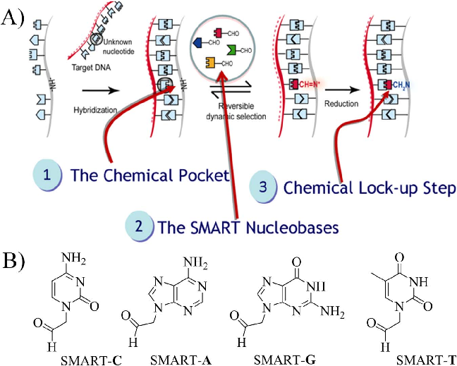
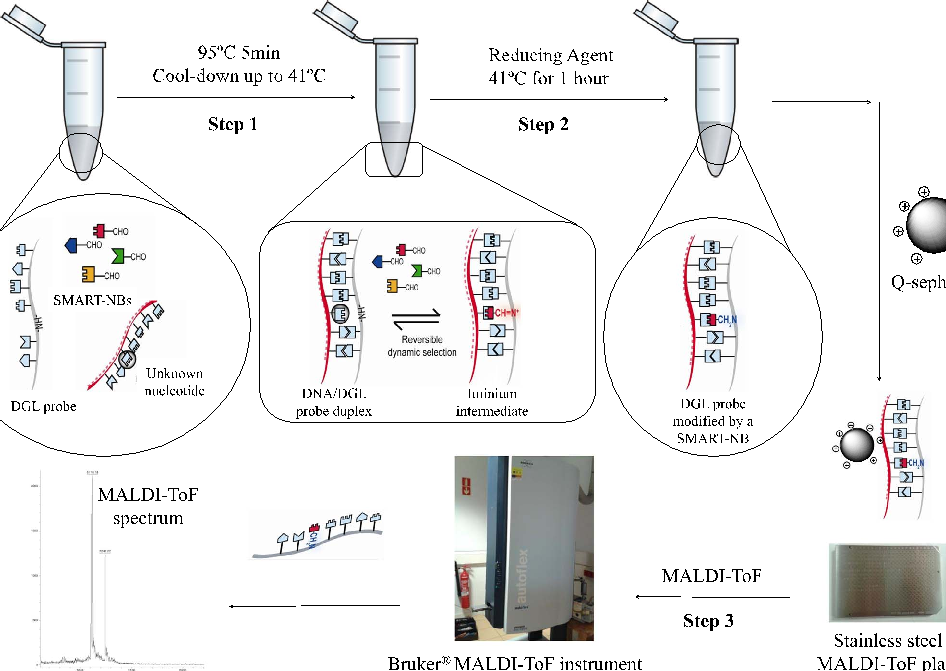
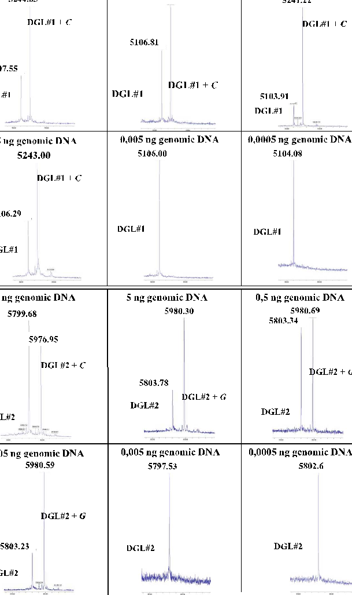
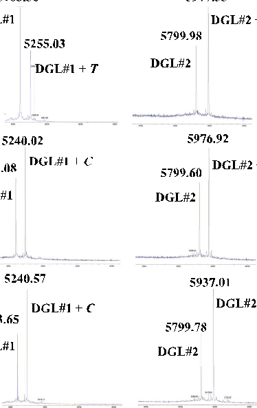

Talanta 176 (2018) 299–307

Contents lists available at ScienceDirect

## Talanta

journal homepage: www.elsevier.com/locate/talanta

Identification of Trypanosomatids by detecting Single Nucleotide Fingerprints using DNA analysis by dynamic chemistry with MALDI-ToF

# MARK

María Angélica Luque-Gonzáleza,b, Mavys Tabraue-Chávezd, Bárbara López-Longarelad, Rosario María Sánchez-Martína,b, Matilde Ortiz-Gonzáleza,c, Miguel Soriano-Rodrígueza,c, José Antonio García-Salcedoa,c, Salvatore Pernagallod,e,⁎, Juan José Díaz-Mochóna,b,e,⁎

- a Pfizer-Universidad de Granada-Junta de Andalucía Centre for Genomics and Oncological Research (GENYO), Parque Tecnológico de Ciencias de la Salud (PTS), Avenida de la Ilustración 114, 18016 Granada, Spain
- b Department of Medicinal and Organic Chemistry, School of Pharmacy, University of Granada, Campus Cartuja s/n, 18071 Granada, Spain
- c Unidad de Enfermedades Infecciosas y Microbiología, Instituto de Investigación Biosanitaria ibs. GRANADA, Hospitales Universitarios de Granada / Universidad de Granada, Granada, Spain
- d DestiNA Genomica S.L. Parque Tecnológico Ciencias de la Salud (PTS), Avenida de la Innovación 1, Edificio BIC, 18016 Armilla, Granada, Spain
- e DestiNA Genomics Ltd., 7-11 Melville St, Edinburgh EH3 7PE, United Kingdom

### A R T I C L E I N F O

### A B S T R A C T

Protozoan parasites of the Trypanosomatidae family can cause devastating diseases in humans and animals, such as Human African Trypanosomiasis or Sleeping Sickness, Chagas disease and Leishmaniasis. Currently, there are molecular assays for detecting parasitic infections and their post-treatment monitoring based on nucleic acid amplification, but there are still certain limitations which limit the development of assays that can detect and discriminate between parasite infections with a single test. Here, we present the development of a novel molecular assay for the rapid identification of Trypanosomatids, integrating DNA analysis by dynamic chemistry in conjunction with Matrix-Assisted Laser Desorption Ionization – Time-of-Flight Mass Spectrometry (MALDI-ToF). Differentiation of Trypanosoma cruzi, Trypanosoma brucei and Leishmania spp. is now possible using a single reaction tube, and enables rapid identification of Trypanosomatids. The test is based on a singleplex PCR, using a specific primer pair that amplifies a 155 base pair segment of the 28S ribosomal RNA gene, within a conserved homology region of Trypanosomatidae species. Amplified fragments are analysed by dynamic chemistry using two abasic PNA probes and the four reactive nucleobases – containing an aldehyde functional group - with MALDI-ToF to identify unique molecular patterns created by each specie due to their single base differences (Single Nucleotide Fingerprint ‘SNF’) in this highly homologous region. This novel assay offers the possibility to expand routine diagnostic testing for Trypanosomatids, and monitoring of therapeutic responses to these infectious diseases.

Keywords: Trypanosomatids Single Nucleotide Fingerprint (SNF) Dynamic Chemistry Peptide Nucleic Acid (PNA) MALDI-ToF

- 1. Introduction

Protozoan parasites of the Trypanosomatidae family cause a range of serious diseases, such as Sleeping Sickness, Chagas disease and Leishmaniasis, which affect millions of people worldwide. Leishmaniasis alone is estimated to affect about 12 million people worldwide, mostly in developing countries [1–5]. Although these diseases are commonly found in tropical and sub-tropical regions, in the last decades there has been a more global expansion, including developed countries, such as Europe

and North America [1]. The epidemiologic reasons for the growing number of reports of Trypanosomatidae infections are due to increasing numbers of patients, migrations, and individuals traveling overseas from/ to countries with high prevalence of these diseases [1,6].

Trypanosomatidae diagnosis is normally undertaken by microscopic examination of tissues or cultures, and also by immunological techniques which detect antibodies in response to parasitic infections [2,3,7].

More recently, with the successful completion of genome sequencing of many pathogenic species, demand for new molecular diagnostic methods

Abbreviations and acronym: SNF, Single Nucleotide Fingerprint; PNA, Peptide Nucleic Acids; DGL probes, peptide nucleic acid-based probes containing an abasic position; CDS, Coding DNA sequences; ssDNA, single strand DNA; dsDNA, double strand DNA; gDNA, genomic DNA; SMART-NB, reactive aldehyde-modified nucleobases; PCR, Polymerase Chain Reaction; sPCR, symmetric PCR; aPCR, asymmetric PCR; NAATs, Nucleic Acid Amplification Tests; SBE, Single Base Extension; NAT, Nucleic Acid Testing; Lm, L. major, Leishmania major; Tb, T. brucei, Trypanosoma brucei; Tc, T. cruzi, Trypanosoma cruzi

⁎ Corresponding authors at: DestiNA Genomics Ltd., 7-11 Melville St, Edinburgh EH3 7PE, United Kingdom. E-mail addresses: salvatore@destinagenomics.com (S. Pernagallo), juanjose.diaz@genyo.es (J. José Díaz-Mochón).

http://dx.doi.org/10.1016/j.talanta.2017.07.059 Received 19 May 2017; Received in revised form 18 July 2017; Accepted 20 July 2017

Available online 21 July 2017 0039-9140/ © 2017 Elsevier B.V. All rights reserved.

Fig. 1. A) General scheme of the steps involved in DNA analysis by dynamic chemistry: 1) hybridisation between a DGL probe and a complementary target nucleic acid that contains a nucleotide under interrogation; 2) dynamic incorporation of SMART-NB into the abasic position driven by the nucleotide under interrogation creating a reversible intermediate; 3) chemical lock-up of the reversible intermediate to give rise to a DGL probe modified by a SMART-NB. B) Chemical structure of the SMART-NBs.

has drastically increased. Although a considerable number of manuscripts describing novel and promising molecular detection methods for the diagnosis of parasites using blood or tissue biopsies have been described, only a very few of those have so far reached clinical applications [2].

Molecular diagnostic techniques for detecting nucleic acids are now in common practice in clinical laboratories for routine diagnosis, bringing significant improvements in parasite detection [2,3]. In particular, nucleic acid amplification tests (NAATs) such as conventional polymerase chain reaction (PCR) and real-time PCR have demonstrated their capacity to play a key role in detecting infections and post-treatment monitoring [3,8].

Conventional DNA sequencing has emerged as good diagnosis tool to detect parasite infections at high sensitivity and specificity. The method is based on PCR amplification using generic primers that amplify highly conserved ribosomal gene sequences from multiple parasite species. DNA sequencing analysis is performed on the amplified fragment for species identification. However, currently available DNA sequencing methods suffer from disadvantages such as high cost and complex protocols which require expert's operators [9].

Several single base resolution methods developed to date for detecting and distinguishing between parasite infections are based on single base extension (SBE). These methods enable single nucleotide analysis by extending oligonucleotide primers, which hybridize to a complementary nucleic acid region with the primer's terminal 3′ end directly adjacent to the nucleotide base under interrogation. Although, overall, the SBE methods show good diagnostic utility, there are still certain concerns with the primer-extensions generating false readings, due to mis-priming in amplification reactions [10]. In the analysis of DNA by dynamic chemistry, mis-priming is not an issue.

Amongst commonly used molecular technologies for nucleic acid testing (NAT), DNA analysis by dynamic chemistry is one of the most recent and promising technologies [11–16]. Nucleic acid analysis by dynamic chemistry harnesses Watson-Crick base pairing to template a dynamic reaction on a strand of abasic peptide nucleic acid (PNA)based probes (DGL probes). DGL probes are capable of hybridising with complementary target sequences, such that the abasic position on

the DGL probe lies opposite to a nucleotide on the nucleic acid strand under interrogation (Fig. 1A, step 1). A reversible reaction, between reactive aldehyde-modified nucleobases (SMART-NBs) (Fig. 1A, step 2 and Fig. 1B) and the free secondary amine on the DGL probes, generates an iminium intermediate, which can be reduced (Fig. 1A, step 3) to a stable tertiary amine (chemical lock-up). Four iminium species (one for each base) will be thus generated, but the one with the correct hydrogen bonding motif (obeying Watson–Crick base-pairing) will be the most thermodynamically stable product. Finally, DGL probes which are modified by a specific SMART-NB are read, allowing determining the DNA nucleobase under interrogation [11,12].

In previous works, we used this technology to genotype 12 cystic fibrosis patients [12] as well as to direct detect unlabelled nucleic acids through Single Nucleobase Labelling [14,16].

Herein, a proof-of-concept study which integrates DNA analysis by dynamic chemistry with Matrix-Assisted Laser Desorption Ionization – Time-of-Flight Mass Spectrometry (MALDI-ToF) [17–23] to identify Trypanosomatids species is described. The novel molecular method is based on a singleplex PCR that amplifies a highly conserved region of the 28S ribosomal RNA gene of Trypanosomatidae species (Leishmania spp. (L. major), Trypanosoma cruzi (T. cruzi), Trypanosoma brucei (T. brucei)) [24–29] (Supplemental Fig. S1).

This region contains different Single Nucleotide Fingerprint (SNF) markers, defined as specific positions within conserved nucleic acid regions of different species where single nucleotide variations occur. When these regions are analysed by dynamic chemistry using two DGL probes and the four SMART-NBs then each of the PCR products create a unique mass pattern which is used to identify each parasite species (Fig. 2).

2. Materials and methods

2.1. General

DGL probes were designed and synthesized by DestiNA Genomica S.L. (Spain). The synthesis was carried out by standard solid phase

Fig. 2. Work flow of DNA analysis by dynamic chemistry using MALDI-ToF.

chemistry on an INTAVIS MultiPrep Synthesiser (Intavis AG GmbH, Germany). DGL Probes are composed of the right combination of 4 peptide nucleic acid monomers –according to the sequence we want to interrogate- plus a “blank” or abasic position that has the same backbone as the previous monomers except for lacking the nitrogenous base. As a result, a free secondary amine is left at the abasic site, enabling a reaction with the complementary SMART-NBs to the opposite nucleotide in the target sequence. SMART-NBs and custom PNA probes with an abasic position were first described and synthesized by Bowler [11] and Liu [30]. Aqueous solutions of DGL probes were prepared and concentrations determined by measuring the absorbance at 260 nm on a Nanodrop® ND-1000 Spectrophotometer version 3.3.1 (Thermo Fisher Scientific) using as extinction coefficient values (Ɛ260) 6.6, 8.8, 13.7, 11.7 and 2.5 (mM−1 cm−1) for C, T, A, G and the triphenylphosphonium tag, respectively. The triphenylphosphonium charge tag at the N-terminal of DGL probes was used to enhance MALDI-ToF detection limit [31]. SMART-NBs C, T, A and G were prepared by DestiNA Genomica S.L. (Spain) as reported elsewhere [15]. Synthetic short Oligo DNAs: DNA-1TbTc, DNA-1Lm, DNA-2LmTc, DNA-2Tb were purchased from Sigma-Aldrich Inc (Table 1).

Synthetic double strand DNAs (gBlocks® Gene Fragments): Lm rRNA28S-delta, Tb rRNA28S-delta, Tc rRNA28S-delta were purchased from Integrated DNA Technologies (IDT) (Table 2).

Two genomic DNAs (gDNA) were purchased from ATCC®: a) gDNA from T. cruzi strain Tulahuen with ATCC® ID 30266D™ and b) gDNA from L. major with ATCC® ID 30012D™. gDNA from T. brucei was isolated from parasites.

2.2. Genomic DNA extraction from parasite cultures

Genomic DNA from T. cruzi and L. major were bought from ATCC, whereas genomic DNA from T. brucei was extracted from parasites in culture. T. brucei 427 MIT at 1.2 bloodstream forms were cultivated in HMI-9 medium with 10% fetal bovine serum (Sigma- Aldrich) at 37 °C and 5% CO2. Parasites were quantified by counting in a Neubauer chamber.

T. brucei parasites were counted and approximately 2×107 were put in a 15 mL centrifuge tubes and centrifuged at 2500 r.p.m. for 10 min at 4 °C. After removing the supernantant, the pellet was resuspended in 1 mL of sterile PBS and transferred to a new 1.5 mL Eppendorf. The solution was centrifuged at 13,000 r.p.m. for 1 min at 4 °C and the supernatant was removed. 70 µL of buffer A (10 mM Tris, 10 mM E.D.T.A., 10 mM E.G.T.A.), 80 µL of buffer B (10 mM Tris, 10 mM E.D.T.A., 10 mM E.G.T.A., 2% S.D.S.) and 40 µL of NaCl 5 M were added to the pellet and mixed by pipetting up and down a couple of

Table 1 DNA oligomers complementary to DGL probes. Nucleotides under interrogation are highlighted in bold.

|Reference|Oligo DNAs sequences (5′-3′)|
|---|---|
|DNA-1Lm|CGTGCCTCTAGTTTCTGG|
|DNA-1TbTc|CGTGCCTCTGGTTTCTGG|
|DNA-2LmTc|GTTTGTCGAACGGCAAGTGC|
|DNA-2Tb|GTTTGTCGAAGGGCAAGT GC|

- Table 2 Synthetic double strand DNAs (gBlocks® Gene Fragments). SNF are highlighted in bold.

Name and IDT Sense DNA strand sequence (5′-3′)

Lm rRNA28S-delta GTGAGATTGTGAAGGGATCTCGCAGGTATCGTGAGGGAAGTATGGGGTAGTACGAGAGGAACTCCCATGCCGTGCCTCTAGTTTCTGGGGTTTGTCGAACGGCAAGTGCCCCGAAGCCATCGCACGGTGGTTCTCGGCTGAACGCCTCTAAGCCAGAAGCCAATCCCAAGACCAGATGCCCAC

- Tb rRNA28S-delta GTGAGATTGTGAAGGGATCTCGCAGGCATCGTGAGGGAAGTATGGGGTAGTACGAGAGGAACTCCCATGCCGTGCCTCTGGTTTCTGGAGTTTGTCGAAGGGCAAGTGCTCCGACGCTATCGCACGGTGGTTCTCGGCTGAACGCCTCTAAGCCAGAAACCAGTCCCAAGACCGGGTGCCCGT
- Tc rRNA28S-delta GATTGTGAAGGGATCTCGCAGGTATCGTGAGGGAAGTATGGGGTAGTACGAGAGGAACTCCCATGCCGTGCCTCTGGTTTCTGGAGTTTGTCGAACGGCAAGTGCTCCGACGCTATCGCACGGTGGTTCTCGGCTGAACGCCTCTAAGCCAGAAGCCAGTCCCAAGACCAGATGCCC

times and left overnight on ice. The solution was centrifuged at 10,000 r.p.m. for 10 min at 4 °C, the supernatant transferred to a new 1.5 mL Eppendorf and an equal volume of phenol:chloroform:isoamyl alcohol (25:24:1) solution was added for a first extraction. After centrifuging at 14,000 r.p.m. for 5 min at 4 °C, the aqueous phase (upper one) was transferred to a new 1.5 mL Eppendorf. The same extraction procedure was repeated two more times. After the third extraction, all the aqueous solution was transferred to a new 1.5 mL Eppendorf and a new extraction was performed by adding chloroform:isoamyl alcohol (24:1). The solution was centrifuged at 14,000 r.p.m. for 5 min at 4 °C. The aqueous phase was transferred to a new 1.5 mL Eppendorf. DNA was precipitated by adding twice the volume of the aqueous phase of cold absolute ethanol. The solution was left for 2 h at −20 °C, centrifuged at 14,000 r.p.m. for 5 min at 4 °C, and the supernatant removed. 1 mL of 70% ethanol was added and the Eppendorf was centrifuged at 14,000 r.p.m. for 5 min at 4 °C. The supernatant was removed and the pellet left drying. Approximately 20 µL of MilliQ water and 1 µL of RNase A at 10 mg/mL were added, the DNA solution was left for 1 h at 37 °C and then stored at 4 °C until their use.

- 2.3. Target nucleic acid selection

L. major (Lm, LmjF.27.rRNA.31), T. brucei (Tb, Tb927.2.1407) and T. cruzi (Tc, TcCLB.419169.10) 28S ribosomal RNA delta gene sequences were aligned using EMBL-EMI tool for multiple sequence alignment Clustal Omega (http://www.ebi.ac.uk/Tools/msa/clustalo/) (Supplemental Figs. S2-S3 and Supplemental Table S1 for more details about sequences and strains).

Analysis of primer self-dimers and heterodimers formation was carried out using the Oligo analyzer 3.1 tool (IDT). PCR products were confirmed by sequencing analyses using capillary electrophoresis (Sanger method 3130 Genetic Analyzers, Applied Biosystems, US)[4] (see Supplemental Figs. S4 and S5).

- 2.4. Double PCR to produce single strand templates

Primer sequences: Forward 5′-GATTGTGAAGGGATCTCGCAG-3′ and Reverse 5′-TCTGGCTTAGAGGCGTTCA-3′ were purchased from Sigma-Aldrich Inc. PCR amplifications were performed on a Veriti® 96well Thermal cycler (Thermo Fisher Scientific). Two consecutive PCR amplifications were performed; the first one, symmetric PCR (sPCR) to generate dsDNA amplicon, followed by an asymmetric PCR (aPCR) (with higher concentration of forward primer) to afford ssDNA.

sPCR: either 3 µL of synthetic dsDNA at 5·108 copies/µL (gBlocks® Gene Fragments) or 5 µL with different amounts of ATCC® gDNA solution for L. major or T. cruzi and gDNA extracted from T. brucei in culture were amplified using 1X PCR master mix (Thermo Fisher Scientific), 0.15 µM forward and reverse primers per reaction with a final volume of 50 µL. DNA templates were replaced with water for negative controls. Cycling conditions were as follows: 1) initial denaturation at 96 °C for 3 min; 2) 40 cycles of a) denaturation 96 °C for 30 s, b) annealing at 61 °C for 30 s, and (c) extension at 72 °C for 30 s; 3) final extension at 72 °C for 10 s; 4) final hold at 4 °C.

aPCR: 2 µL of the first sPCR crude mixture was amplified using the

1X PCR mastermix (Thermo Fisher Scientific), 0.15 µM forward primer and 0.015 µM reverse primer per reaction with a final volume of 50 µL. Negative controls were performed using 2 µL of the negative controls from the first sPCR. Cycling conditions were identical to the sPCR. The PCR products were analysed using the Agilent 2100 Bioanalyzer and DNA 1000 Kit (Agilent Technologies Inc.) (Figs. S4 and S5).

- 2.5. DNA analysis by dynamic chemistry using MALDI-ToF as for scheme in Fig. 2

Prior to use, Q Sepharose® Fast Flow (GE Healthcare; 1 mL of a suspension in ethanol) was centrifuged and the supernatant removed. The resin was subsequently washed centrifugally with H2O (1 mL) and 10 mM phosphate buffer, pH 7 (2 × 1 mL), before re-suspending in the same buffer (0.5 mL). Then a 10-fold dilution was made by adding 100 µL of pre-equilibrated Q Sepharose® to 900 µL of 10 mM phosphate buffer, pH 7. Immediately before use, the pre-equilibrated Q Sepharose® was agitated to resuspend the resin beads [11,12].

45 µL of aPCR product, without any further purification steps was acidified to pH 6 using HCl. Then, a DGL probe (1.5 µL, 40 µM) and SMART-NB mixture containing the four nucleobases (6 µL, each SMART-NB at 500 µM each) were added. The resulting mixtures were heated in a Thermocycler (TC-312 Techne) at 96 °C for 5 min, shaking at 1400 r.p.m., then cooled to 41 °C at 3 °C/min without agitation and once the temperature was reached, sodium cyanoborohydride (NaBH3CN) (6 µL, 100 mM) was added and the reaction was left at 41 °C for 60 min while shaking at 1400 r.p.m.

Once the reaction was completed, 5 µL of pre-treated Q Sepharose® Fast Flow resin was added and the mixtures were kept shaking at room temperature (25 °C) for 20 min. The solution was centrifuged, the supernatant removed, and the resin washed by centrifugation (3 min at 13,400 rpm) with 3% aqueous acetonitrile (3 × 200 µL; acetonitrile (Fisher Scientific)). Finally, 20 µL of OS buffer (Acetonitrile: 2.5% TFA in water, 1:1) were added to the resin. 2 µL of sinapinic acid matrix (saturated solution of sinapinic acid in Acetonitrile: 0.1% TFA in water, 1:2) were mixed with 2 µL of resin. 2 µL of the resulting mixture were spotted onto the Bruker® 384 stainless steel MALDI-ToF plate for analysis. Sinapinic acid matrix was chosen following references of previously settled methods [11,12].

- 2.6. Sensitivity and specificity of the assay

sPCRs using decreasing amounts of T. cruzi gDNA as starting material were carried out. Six concentration points plus negative controls were used in triplicate. PCR products were then analysed by capillary electrophoresis (see Material and Methods) to determine the amount of amplicons generated (Supplemental Table S2). Amplicons of the expected size at different concentrations were detected when using the four highest amounts of gDNA while when using 0.1 and 0.01 pg/µL no bands were identified (Supplemental Fig. S6). Each of these products were then amplified by aPCR and analysed by dynamic chemistry and MALDI-ToF (Fig. 3). Spectra were assessed semi-automatically (see Material and Methods) and the samples which started from the four highest amounts of gDNA (12 samples in total) were unequivocally

| | | |
|---|---|---|
| | | |

Fig. 3. MALDI-ToF spectra obtained from different starting concentrations of gDNA from T. cruzi: A) Using DGL#1; B) Using DGL#2.

called as T. cruzi (Supplemental Table S2 and Fig. 3). However, samples which started from 0.1 and 0.01 pg/µL of gDNA were called as parasite free, hence being false negative. Replicates of negative controls were all called as parasite free. Therefore, the limit of detection of this assay is linked to the sensibility of the PCR amplification of gDNA, being 1 pg/ µL, equivalent to 8.7 copies per /µL, of gDNA the lowest amount could be analysed by the presented method (Detailed data of the number of copies, the amount of gDNA used, the mass peaks detected either by capillary electrophoresis and by dynamic chemistry are shown in Supplemental Tables S3, S4 and Fig. S7).

2.7. MALDI-ToF data analysis

Mass spectra were recorded on a BRUKER AUTOFLEX MALDIToF MS using a weight range from 4500 to 10,000 Da. Spectra were acquired for each sample in positive ionization reflector mode (delay 270 ns, 19 kV accelerating voltage, variable laser intensity, typically more than 200 shots). The unreacted DGL probe of lowest mass was used as an internal calibrator. SNFs were determined by both visual inspection, and also by input of the peak table data into a Microsoft Excel file. Raw peak table data obtained from the MALDI spectra was

analysed using a ‘LOOKUP’ formula, which converted numerical massto-charge ratio peak values (m/z) within a set range and above a certain intensity threshold into an output parasite specie. Peaks with a Signal/ Noise ratio (S/N) lower than 5 and a relative intensity lower than 10% were disregarded [12] (see Supplemental Tables S5, S6 and S7 that have been extracted from the original excel file in which “LOOKUP” formula with the above mentioned requirements was used).

Optimization studies were carried out using synthetic Oligo DNAs. Oligo DNAs were used with a concentration of 0.25 µM (See Supplemental Tables S5, S8, S9 and Fig. S8).

- 3. Results

- 3.1. Conserved region amplification

PCR optimization experiments were initially carried out using gBlocks® Gene Fragments which mimic the coding DNA sequences (CDS) for the 28S ribosomal RNA delta genes of L. major, T. brucei and T. cruzi before using gDNA from parasite. A single PCR primer pair was designed to amplify the target sequence regardless of the parasite present in the clinical sample (Supplemental Fig. S9). PCR involved two consecutive rounds of PCR amplification. The first round of amplification performed generated dsDNA amplicons. After this initial sPCR, dsDNA amplicons were used as templates for the aPCR [32]. PCR products were analysed by capillary electrophoresis (Supplemental Figs. S4 and S5) confirming their expected sizes (183 bp for both L. major and T. brucei and 178 bp for T. cruzi) when using both gBlocks® and gDNA. aPCR products were then used without any further purification to be genotyped by dynamic chemistry.

- 3.2. Design of DGL probes for SNF identification of Trypanosomatids

The two DGL probes were designed to allow antiparallel hybridisation with the complementary asymmetric amplicons. DGL probes hybridised with target sequences containing the SNFs (Table 3, Fig. 4). A reversible reaction then guides the specific SMART-NB incorporation into the DGL#1 and DGL#2 (Supplemental Fig. S9). The combined analyses of the two DGL probes will thus enable an unequivocal identification of the parasite present in the amplicon sample, as each parasite gives a unique pattern of SMART-NB incorporation for each DGL probe (Fig. 4). Table 3 shows the theoretical unique mass pattern that each species would create using when analysed with the two probes design.

- 3.3. Trypanosomatids discrimination by dynamic chemistry and MALDI-ToF

Protocols were again optimised using synthetic DNA oligomers and amplicons coming from gBlocks® Gene Fragments (Supplemental Tables S5, S6, S9, S10 and Figs. S8 and S10).

Once all reagents and protocols were validated, analysis of PCR products obtained from 1 ng/µL of gDNA were performed. Experiments of each species were carried out in triplicate. Fig. 5 shows one representative spectra of each species for each DGL. Data analysis

were carried out by measuring the mass difference between the two main peaks of the MALDI-ToF spectra: (i) peaks which correspond to unreacted DGL probes (borane adducts were also detected), which act as internal calibrator, and (ii) peaks which correspond to a DGL probe plus a specific SMART-NB, which were covalently bound to the “blank” position, forming a tertiary amine (Supplemental Tables S3, S9, S10). By identifying that SMART-NB, the target nucleic acid under interrogation can be easily called as it has to contain the nucleobase complementary to the SMART-NB (Fig. 4). Calling was performed using both ‘manual’ and a semi-automated assessment (see material and methods for details) of the resulting MALDI spectra. Similar results to those with synthetic DNA oligomers were obtained, which were in full agreement, in each case, with expected data (Representative spectra of each species are shown in Fig. 5 and Supplemental Figs. S8, S10). In all cases, each species was unequivocally assessed using the mass spectra coming from the two DGL probes used in this study.

In terms of time to results, once DNA is isolated, the work-flow lasts around 5 h 30 min. However, many samples can be run in parallel, depending on the instrument availability in the testing laboratory: thermomixers have a capacity of for 24, 48 or 96 tubes and centrifuge capacities vary from 12 up to 96 tubes. The stainless steel MALDI-ToF plate has 386 wells for samples to be analysed. The process itself is very simple, and very suited for automatic liquid handling. Finally, analysis of the MALDI-ToF spectra is straightforward thanks to the LOOKUP formula we have developed, which automatically assign the parasite species after introducing the mass peak from the spectra. This process can be also automatised by programing a simple macro.

3.4. Sensitivity and specificity of the assay

After assessing the feasibility of the study using 1 ng/µL of gDNA of each specie, a study to determine the limit of detection of the assay and their technical sensitivity and specificity was performed. Overall, apart from the data obtained using ssDNA and PCR products obtained from gBlocks dsDNA, 27 PCR reactions were analysed by this method. There were 3 negative controls, 18 T. cruzi positives, 3 L. major positives and

- 3 T. brucei positives. Following assignments of MALDI-ToF spectra using the LOOKUP formula (see Material and Methods and Supplemental Tables S5, S6 and S7), the method presented 0 false positives, 21 true positives, 3 true negative and 6 false negatives. In any of the assays no mis-calls between the 3-different species occurred. False negatives were linked to the inability of the PCR amplification step to create enough copies of amplicons. Further tests to assess the sensitivity and the specificity of the assay using more complex matrixes will need to be performed.
- 4. Discussion

Trypanosomatids can cause diseases that can be fatal if not treated [1–3]. Clinical symptoms associated with the infection are fairly unspecific, reported as fever and malaise, so doctors are unable relying on the clinical symptoms alone in order to accurately diagnose Trypanosomatids diseases [2]. Moreover, diagnostics tests have chan-

- Table 3 DGL probes #1 and #2, their complementary synthetic oligo DNA sequences and the incorporated SMART-NB depending on parasite specie.

DGL probes DGL probe sequence (N-C)* Target DNA sequences (5′——3′) complementary to the DGL probe

SMART-NB to be incorporated

|DGL#1 (Ph)3P+-cca gaa ac_ aga ggc acg-NH2 CGT GCC TCT AGT TTC TGG|SMART-T|
|---|---|
|CGT GCC TCT GGT TTC TGG|SMART-C|
|DGL#2 (Ph)3P+-gca ctt gcc _tt cga caa ac-NH2 GTT TGT CGA ACG GCA AGT GC|SMART-G|

GTT TGT CGA AGG GCA AGT GC SMART-C

‘_’ represents an abasic position. Lowercase letters (a, t, c, g) represent nucleobase with a PNA backbone.

* DGL probes are capped at their N-terminal with 3-(carboxypropyl)triphenylphosphonium bromide and have a C-terminal primary amide.

Fig. 4. Illustration of the principle of SNF detection. A) The three Trypanosomatids can be distinguished using two DGL probes (DGL#1 and DGL#2). The unique pattern of SMART-NB incorporation into each DGL indicates unequivocally the parasite: SMART-T incorporation into DGL#1 and SMART-G incorporation into DGL#2 indicates the presence of L. major; SMART-C incorporation into both DGL#1 and DGL#2 calls for T. brucei; and SMART-C incorporation into DGL#1 and SMART-G incorporation into DGL#2 relates to T. cruzi. B) Graphical representation of the unique pattern created by a specific parasite when interrogated with DGL#1 and DGL#2 and SMART-NB. Black dot indicate incorporation of that SMART-NB onto the abasic site of a DGL probe.

Fig. 5. Representative MALDI-TOF spectra obtained when analysing aPCR products prepared from parasite gDNA by dynamic chemistry with DGL #1 and #2 and SMART-NBs.

ged little, being mainly microscopic observation, and blood tests that detect antibodies in response to the parasitic infections [2,7,33]. We propose here a unique approach that with a single test permits a rapid detection of T. cruzi, T. brucei and L. major, without running three separate independent tests. The test allows rapid, accurate diagnosis and treatment decisions for the patient, as well as appropriate aftercare. The method consists of a singleplex PCR amplification and a

subsequent amplicon interrogation via dynamic chemistry and MALDIToF spectroscopy [12]. We introduce here the novel concept of Single Nucleotide Fingerprinting (SNF), which identifies single nucleotide differences within highly conserved sequence regions of different species, such as L. major, T. brucei and T. cruzi. To select the target region, four conditions were applied (i) finding target sequences that are highly conserved among the different species under interrogation

(ii) to be able to amplify them with a single set of primers (forward and reverse) for each parasite, (iii) to find single nucleotide differences within those amplicons that can create a unique mass spectra pattern using just a few probes and (iv) to avoid homology with any human gDNA region. For this study, the CDS for 28S ribosomal RNA delta gene was chosen as it fulfilled all the above four conditions [24– 26,28,33]. By using the SNF approach, we have been able to identify and discriminate the three-parasite species with certain advantages over conventional molecular technologies for nucleic acid testing. In this method, a single set of primers able to amplify through a PCR reaction the target sequence of all three species was designed, as well as two customised DGL probes that can hybridize with their target sequences (Supplemental Fig. S9). Fig. 4 shows the unique mass pattern that these two probes generated with the different species. Briefly, T. cruzi and T. brucei amplicons template the incorporation of SMART-C on DGL#1, as both gDNAs present a guanosine in front of the abasic position. L. major, however, templates the incorporation on DGL#1 of SMART-T, since it has an adenosine in front of the abasic position. In the case of DGL#2, T. brucei amplicons template SMARTC incorporation, whereas there are either L. major or T. cruzi amplicons, SMART-G will be incorporated. This novel approach allows the identification of these three Trypanosomatids, due to the unique combinations of SMART-NB incorporated into each DGL probe, depending on the parasite under study (Fig. 4).

There are several differences, when compared to other single base resolution technologies, and distinct characteristics that highlight the value of this new methodology: firstly, the target nucleic acid does not have to be tagged, as it is the technology itself through the dynamic chemistry process that determines how targets are detected. Therefore, amplicons do not need to bear any label themselves as it is in the case of probe hybridisation and primer extension approaches which require using labelled primers, labelled dNTP or labelled ddNTP to create tagged amplicons which thus require the PCR step to be very accurate, so as to avoid final reading errors. The presented assay falls within the category of molecular assays which offer the highest specificity, as for relying on a third level of sequence detection of the products. For example, TaqMan, Molecular Beacons and Scorpions technologies which require of 3 binding events (2 primers and a probe) to create a signal. Secondly, there is a unique combination of SMART-NBs to be incorporated into each customised DGL probe according to the parasite species to be in the sample which avoid false positives using just a single set of primers. This is particularly important when compared to gold standard SBE technologies where allele specific primer extension is required for each possible variant, hence increasing the complexity of the assay. Finally, the four nucleobases can be read in a single tube. While there are many platforms with very high multiplexing capacity, being able of detecting large number of analytes per sample such as microarrays, there are not many that can achieve looking at the four possible bases in a single position of different targets. Most of the approaches which use fluorescence reading, such as technologies which rely on third molecules, i.e TaqMan and Scorpion, read two variants per position rather than four. More sophisticated fluorescence readers are needed to be able to have four fluorescence channels. On top of that, these technologies are limited in their multiplexing capacity. The technology which can achieve both is NGS, but this is in a very different category in terms of cost and would face very significant challenges in adapting routine parasite detection under ‘developing country’ laboratory settings, even if the high cost per patient was economically sustainable. In order to achieve this by this novel assay, once its feasibility has been validated here, we need to adapt it to lower cost platforms, such as colorimetric based platforms.

The method needs for a PCR step as enough templating nucleic acid is required to modify specifically DGL probes with SMART-NBs. When amplicons are detected by capillary electrophoresis then these ampli-

cons create specific modifications at complementary DGL probes via reacting with specific SMART-NBs. These modified DGL probes can then be read by MALDI-ToF to call the parasite species present in the sample.

In summary, in this manuscript we have described the development of a novel molecular test for the rapid identification of Trypanosomatids infections. The current assay presents a limit of detection of 8.7 copies of gDNA per µL. No false positives were detected while its sensitivity depends on the PCR amplification step. Therefore, improving the PCR efficiency will give rise to a more sensitive assay suitable to differentiate highly homologous sequences in a single tube. This study represents another example in merging DNA analysis by dynamic chemistry and MALDI-ToF. A suite of novel medical diagnostic assays is possible, capable of delivering diagnostic tests for the rapid detection of infectious diseases, with high sensitivity and specificity. Benefits in terms of reliability, cost effectiveness, high sensitivity and specificity are positive outcomes from this new detection method.

Contribution of each co-author

SP, JAGS, MGS, RMSM and JJD-M designed the experiments. JAGS, MGS, MOG cultured the parasites. BLL did PCRs. MALG performed MALDI experiments. SP, JJD-M, MTC, BLL, RMSM and MALG analysed the data. MALG, SP and JJD-M wrote the paper.

Acknowledgements

This research work has received funding from Junta de Andalucía, Consejería de Economía e Innovación (project number 2012BIO1778), the Spanish Ministerio de Economía y Competitividad (Grants CTQ2012-34778, BIO2016-80519-R, FPI Grant BES-2013063020). This research was partially supported by the 7th European Community Framework Program (FP7-PEOPLE-2012-CIG-Project Number 322276).

The authors thank DestiNA Genomica S.L. for assistance during the process of isolation of the genomic DNA, PCR amplification and dynamic chemistry reaction. We also thank Carlos Rodrigues-Poveda for technical advice and Mr. Hugh Ilyine for proof-reading.

Appendix A. Supplementary material

Supplementary data associated with this article can be found in the online version at http://dx.doi.org/10.1016/j.talanta.2017.07.059.

References

- [1] A. Ricciardi, M. Ndao, Diagnosis of parasitic infections: what's going on?, J. Biomol. Screen. 20 (2015) 6–21.
- [2] R. Duncan, Advancing molecular diagnostics for trypanosomatid parasites, J. Mol. Diagn.: JMD 16 (2014) 379–381.
- [3] C. Hernández, J.D. Ramírez, Molecular diagnosis of vector-borne parasitic diseases, Air Water Borne Dis. 2 (2013).
- [4] A. Selvapandiyan, K. Stabler, N.A. Ansari, S. Kerby, J. Riemenschneider, P. Salotra, R. Duncan, H.L. Nakhasi, A novel semiquantitative fluorescence-based Multiplex polymerase chain reaction assay for rapid simultaneous detection of bacterialand parasitic pathogens from blood, J. Mol. Diagn. 7 (2005) 268–275.
- [5] A.H. Lopes, T. Souto-Padrón, F.A. Dias, M.T. Gomes, G.C. Rodrigues, L.T. Zimmermann, T.L. Alves e Silva, A.B. Vermelho, Trypanosomatids odd organisms devastating diseases, Open Parasitol. J. 4 (2010) 30–59.
- [6] C. Sanchez-Ovejero, F. Benito-Lopez, P. Diez, A. Casulli, M. Siles-Lucas, M. Fuentes, R. Manzano-Roman, Sensing parasites: proteomic and advanced biodetection alternatives, J. Proteom. 136 (2016) 145–156.
- [7] M. Ndao, Diagnosis of parasitic diseases: old and new approaches, Interdiscip. Perspect. Infect. Dis. 2009 (2009) 278246.
- [8] K. Ranjan, P. Minakshi, G. Prasad, Application of Molecular and Serological Diagnostics in Veterinary Parasitology, J. Adv. Parasitol. 2 (2016) 80–99.
- [9] C. Cantacessi, F. Dantas-Torres, M.J. Nolan, D. Otranto, The past, present, and future of Leishmania genomics and transcriptomics, Trends Parasitol. 31 (2015) 100–108.

- [10] D.D. Giusto, G.C. King, Single base extension (SBE) proofreading polymerases and phosphorothioate primers: improved fidelity in single-substrate assays, Nucleic Acid Res. 31 (2003) 12.
- [11] F.R. Bowler, J.J. Diaz-Mochon, M.D. Swift, M. Bradley, DNA analysis by dynamic chemistry, Angew. Chem. 49 (2010) 1809–1812.
- [12] F.R. Bowler, P.A. Reid, A.C. Boyd, J.J. Diaz-Mochon, M. Bradley, Dynamic chemistry for enzyme-free allele discrimination in genotyping by MALDI-TOF mass spectrometry, Anal. Methods 3 (2011) 1656.
- [13] S. Pernagallo, G. Ventimiglia, C. Cavalluzzo, E. Alessi, H. Ilyine, M. Bradley, J.J. Diaz-Mochon, Novel biochip platform for nucleic acid analysis, Sensors 12

(2012) 8100–8111.

- [14] S. Venkateswaran, M.A. Luque-Gonzalez, M. Tabraue-Chavez, M.A. Fara, B. LopezLongarela, V. Cano-Cortes, F.J. Lopez-Delgado, R.M. Sanchez-Martin, H. Ilyine, M. Bradley, S. Pernagallo, J.J. Diaz-Mochon, Novel bead-based platform for direct detection of unlabelled nucleic acids through Single Nucleobase Labelling, Talanta 161 (2016) 489–496.
- [15] M. Bradley, J.J. Diaz-Mochón, Nucleobase characterisation, in: PCT/GB2008/ 003185, 2009.
- [16] D.M. Rissin, B. Lopez-Longarela, S. Pernagallo, H. Ilyine, A.D.B. Vliegenthart, J.W. Dear, J.J. Diaz-Mochon, D.C. Duffy, Polymerase-free measurement of microRNA-122 with single base specificity using single molecule arrays: detection of drug-induced liver injury, PLoS One 12 (2017) e0179669.
- [17] M. van Puijenbroek, J.W.F. Dierssen, P. Stanssens, R. van Eijk, A.M. CletonJansen, T. van Wezel, H. Morreau, Mass spectrometry-based loss of heterozygosity analysis of single-nucleotide polymorphism loci in paraffin embedded tumors using the MassEXTEND assay, J. Mol. Diagn. 7 (2005) 623–630.
- [18] E.N. Ilina, A.D. Borovskaya, M.M. Malakhova, V.A. Vereshchagin, A.A. Kubanova, A.N. Kruglov, T.S. Svistunova, A.O. Gazarian, T. Maier, M. Kostrzewa, V.M. Govorun, Direct bacterial profiling by matrix-assisted laser desorptionionization time-of-flight mass spectrometry for identification of pathogenic Neisseria, J. Mol. Diagn.: JMD 11 (2009) 75–86.
- [19] W. Thongnoppakhun, S. Jiemsup, S. Yongkiettrakul, C. Kanjanakorn, C. Limwongse, P. Wilairat, A. Vanasant, N. Rungroj, P.T. Yenchitsomanus, Simple, efficient, and cost-effective multiplex genotyping with matrix assisted laser desorption/ionization time-of-flight mass spectrometry of hemoglobin beta gene mutations, J. Mol. Diagn.: JMD 11 (2009) 334–346.
- [20] D.H. Farkas, N.E. Miltgen, J. Stoerker, D. van den Boom, W.E. Highsmith, L. Cagasan, R. McCullough, R. Mueller, L. Tang, J. Tynan, C. Tate, A. Bombard, The suitability of matrix assisted laser desorption/ionization time of flight mass spectrometry in a laboratory developed test using cystic fibrosis carrier screening as a model, J. Mol. Diagn.: JMD 12 (2010) 611–619.
- [21] S. Yang, L. Xu, H.M. Wu, Rapid genotyping of single nucleotide polymorphisms influencing warfarin drug response by surface-enhanced laser desorption and

ionization time-of-flight (SELDI-TOF) mass spectrometry, J. Mol. Diagn.: JMD 12

(2010) 162–168.

- [22] S. Schubert, K. Weinert, C. Wagner, B. Gunzl, A. Wieser, T. Maier, M. Kostrzewa, Novel, improved sample preparation for rapid, direct identification from positive blood cultures using matrix-assisted laser desorption/ionization time-of-flight (MALDI-TOF) mass spectrometry, J. Mol. Diagn.: JMD 13 (2011) 701–706.
- [23] P.R. Murray, What is new in clinical microbiology-microbial identification by MALDI-TOF mass spectrometry: a paper from the 2011 William Beaumont Hospital Symposium on molecular pathology, J. Mol. Diagn.: JMD 14 (2012) 419–423.
- [24] J.A. Lake, V.F. De. La Cruz, P.C.G. Ferreira, C. Morel, L. Simpson, Evolution of parasitism: kinetoplastid protozoan history reconstructed from mitochondrial rRNA gene sequences, Proc. Natl. Acad. Sci. USA 85 (1988) 4779–4783.
- [25] A.P. Fernandes, K. Nelson, S.M. Beverley, Evolution of nuclear ribosomal RNAs in kinetoplastid protozoa: perspectives on the age and origins of parasitism, Proc. Natl. Acad. Sci. USA 90 (1993) 11608–11612.
- [26] W. Deng, D. Xi, H. Mao, M. Wanapat, The use of molecular techniques based on ribosomal RNA and DNA for rumen microbial ecosystem studies: a review, Mol. Biol. Rep. 35 (2008) 265–274.
- [27] S.M. Thumbi, F.A. McOdimba, R.O. Mosi, J.O. Jung'a, Comparative evaluation of three PCR base diagnostic assays for the detection of pathogenic trypanosomes in cattle blood, Parasites Vectors 1 (2008) 46.
- [28] A.L. Torres-Machorro, R. Hernandez, A.M. Cevallos, I. Lopez-Villasenor, Ribosomal, RNA genes in eukaryotic microorganisms: witnesses of phylogeny?, FEMS Microbiol. Rev. 34 (2010) 59–86.
- [29] P. Srivastava, S. Mehrotra, P. Tiwary, J. Chakravarty, S. Sundar, Diagnosis of Indian visceral leishmaniasis by nucleic acid detection using PCR, PLoS One 6

(2011).

- [30] J.M. Heemstra, D.R. Liu, Templated synthesis of peptide nucleic acids via sequence-selective base-filling reactions, J. Am. Chem. Soc. 131 (2009) 11347–11349.
- [31] B. Boontha, J. Nakkuntod, N. Hirankarn, P. Chaumpluk, T. Vilaivan, Multiplex mass spectrometric genotyping of single nucleotide polimorphisms employing pyrrolidinyl peptide nucleic acid in combination with ion-exchange capture, Anal. Chem. 80 (2008) 8178–8186.
- [32] K. Tomioka, M. Peredelchuk, X. Zhu, R. Arena, D. Volokhov, A. Selvapandiyan, K. Stabler, J. Mellquist-Riemenschneider, V. Chizhikov, G. Kaplan, H. Nakhasi, R. Duncan, A multiplex polymerase chain reaction microarray assay to detect bioterror pathogens in blood, J. Mol. Diagn. 7 (2005) 486–494.
- [33] D. Pakalapati, S. Garg, S. Middha, J. Acharya, A.K. Subudhi, A.P. Boopathi, V. Saxena, S.K. Kochar, D.K. Kochar, A. Das, Development and evaluation of a 28S rRNA gene-based nested PCR assay for P. falciparum and P. vivax, Pathog. Glob. Health 107 (2013) 180–188.

