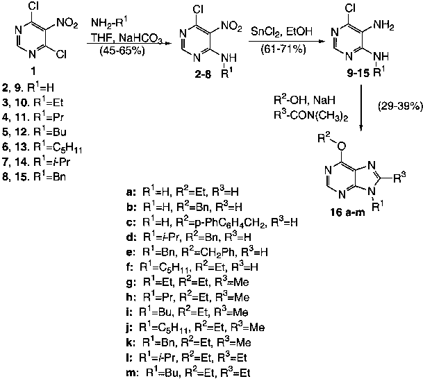
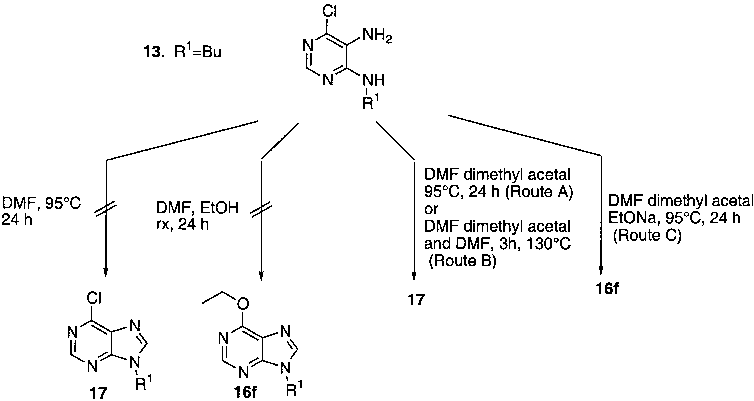

Tetrahedron 58 (2002) 7607–7611

# An efficient one-pot synthesis of 6-alkoxy-8,9-dialkylpurines via reaction of 5-amino-4-chloro-6-alkylaminopyrimidines with N,N-dimethylalkaneamides and alkoxide ions

Pier Giovanni Baraldi,a,* Asier Unciti Broceta,b Maria Jose` Pineda de las Infantas,b Juan Jose` Dı`az Mochun,b Antonio Espinosab and Romeo Romagnolia

aDipartimento di Scienze Farmaceutiche, Universita` di Ferrara, via Fossato di Mortara 17/19, I-44100 Ferrara, Italy bDepartamento de Quimica Organica y Farmaceutica, Facultad de Farmacia, Campus de Cartuja s/n, Granada, Spain

Received 24 April 2002; revised 28 June 2002; accepted 18 July 2002

Abstract—The synthesis of a number of new 6-alkoxy-8,9-(disubstituted)purines has been accomplished by the cyclization of the corresponding intermediate 5-amino-4-chloro-6-(alkylamino)pyrimidines promoted by alkoxides and various N,N-dimethyl amides, where the latter act as solvent–reagents. By this three-component condensation reaction we are able to introduce an alkyl group in the 8 position of the purine ring with the concomitant nucleophilic replacement of the 6-chloro group with an alkoxy moiety. q 2002 Elsevier Science Ltd. All rights reserved.

1. Introduction

Purines are involved in a large number of biological processes, and the purine scaffold is a component of guanine and adenine, and therefore appears in nucleic acids and cofactors that play an essential role in the modulation of protein function and signal transduction.1 Over the past years, purine derivatives substituted in position 9 with an alkoxy group constitute an important class of pharmacologically active compounds for which different targets can be postulated, such as platelet activating factor (PAF)2 and cyclin-dependent kinase (CDK)3 involved in asthma and cancer, respectively.

The synthetic strategy for the synthesis of 6-alkoxy-8,9dialkyl purines involve a simple and straightforward threestep approach which consists in the treatment of 4-alkyl-

- amino-5-amino-6-chloropyrimidines with an alkyl orthoester in presence of acetic anhydride,4 or catalytic amounts of ethanesulfonic acid,5 to yield the corresponding 6-chloro8,9-dialkyl purines. These derivatives were subsequently transformed in the 6-trimethylammonio, 6-[1-azabicyclo[2,2,2]octane] (quinuclidine) or 6-[[1,4-diazabicyclo[2,2,2]octane]] (DABCO) purines, which undergo facile displacement reactions with alkoxides in dimethyl sulfoxide to afford the corresponding 6-alkoxy purines.6 This

Keywords: purine; cyclization; dimethylformamide dimethyl acetal; one-pot reaction; amides.

* Corresponding author. Tel.: þ39-532-291293; fax: þ39-532-291296; e-mail: pgb@dns.unife.it

methodology suffers from drawbacks such as low overall yield, long reaction times, cumbersome product-isolation procedures and the limited availability of the appropriate orthoester which allows the introduction of the substituent in the 8 position of the purine ring. The preparation of 6-benzyloxypurine from 6-chloropurine by reaction with benzyl alcohol under phase-transfer conditions has been also reported.7,8 The subsequent N-alkylation of this 6-alkoxy purine with alkyl and benzyl halides furnished an equimolar mixture of two N7 and N9 alkylated regioisomer products. Recently, Dang and co-workers reported that 6-chloro-8,9-dialkylsubstituted purine analogues were efficiently synthesized in good yields and under mild reaction conditions via cyclization of 4-alkylamino-5amino-6-chloropyrimidines and various aldehydes promoted by FeCl3–SiO2.9

In this article, we report a new preparation of 6-alkoxy-8,9alkyl purines which were obtained in moderate yields by the one-pot cyclocondensation reaction of 4-alkylamino-5amino-6-chloropyrimidines promoted by different combinations of N,N-dimethylamides and alkoxides.

2. Results and discussion

The purines with general formula 16 were prepared from 1 following the procedure outlined in Scheme 1. Amination of commercially available 4,6-dichloro-5-nitropyrimidine 1 with ammonia or different alkyl amines in the presence of an equimolar amount of sodium bicarbonate and THF as

0040–4020/02/$ - see front matter q 2002 Elsevier Science Ltd. All rights reserved. PII: S0040-4020(02)00867-0

- Scheme 1.

- Scheme 2.

solvent afforded the corresponding 4-alkylamino-5-nitro-6chloropyrimidines 2–8 in 45–65% yields, which were used without purification for the next reaction. The subsequent reduction of the nitro group using stannous chloride as reductant furnished the corresponding 4-alkylamino-5amino-6-chloropyrimidines 9–15 which were cyclized by treatment for 24 h at 958C with a mixture constituted from the appropriate alkoxide (generate in situ by the corresponding alcohol and sodium hydride) and a large excess of the suitable N,N-dimethyl amide, to give exclusively the corresponding 6-alkoxy-8,9-disubstituted alkyl purines 16a–m in acceptable yields. By this strategy, it is possible to introduce simultaneously two different substituents in the

6 and 8 position of the purine ring. The structures of these products were established by nuclear magnetic resonance (NMR) spectra and mass spectra analysis.

The cyclization reaction that furnished 6,8,9-trisubstituted purines 16a–m may proceed through the addition of the 6-chloro/alkoxy-4,5-diamino pyrimidine with the acetal of the corresponding amide used (generated in situ by reaction of the amide with the alkoxide). This hypothesis has been corroborated by reference to the reaction of the 4-npentylamino-5-amino-6-chloropyrimidine 13 with a strong excess (50 equiv.) of dimethylformamide (DMF) at 958C for 24 h or with a mixture of DMF and ethanol (50 equiv. of

each reagent)) at reflux for 24 h which failed to yield the desired 6-chloropurine 17 and 6-ethoxypurine 16f, respectively (Scheme 2). The failure of several amides to yield the purine ring system starting from the derivative 13 led us to try the commercially available N,N-dimethylformamide dimethyl acetal as a possible cyclizing agent, in view of the successful synthesis of 6-chloro-8,9-disubstituted adenines via condensation of the 4-alkylamino-5-

- amino-6-chloropyrimidines using alkylorthoesters. In fact, when the compound 13 was treated with N,N-dimethylformamide dimethyl acetal (10 equiv.) as solvent/reagent at 958C for 24 h (Route A) or with a mixture of N,N-dimethylformamide dimethyl acetal (5 equiv.) and DMF (10 equiv.) at 1308C for 3 h (Route B), the 6-chloropurine 17 was formed with a 65 and 68% of yield, respectively. Finally, the reaction of compound 13 with a ten-fold excess both of N,N-dimethylformamide dimethyl acetal (as solvent/reagent) and sodium ethoxide (generated in situ by EtOH and NaH) at 958C for 24 h (Route C) afforded 16f in good yield (57%).

In conclusion, a one-step cyclization reaction with concomitant introduction of an alkoxy group in the 6-position of 6-chloro-4,5-diaminopyrimidines with various amides as solvent/reagent and by the presence of a ten-fold excess of alkoxides was developed. This reaction is suitable for synthesis of 6-alkoxy-8,9-disubstituted purines, and the strategy described herein can be also utilized to generate large combinatorial libraries containing the purine scaffold.

- 3.1. General

3. Experimental

Reaction courses and product mixtures were routinely monitored by TLC on silica gel (precoated F254 Merck plates) and visualized with aqueous KMnO4. Chromatography was performed with Merck 60–200 mesh silica gel. Melting points were determined on a Buchi-Tottoli apparatus and are uncorrected. 1H NMR spectra were obtained in CD3OD, (CD3)2CO, CDCl3 or d6-DMSO solutions on a Bruker AC 200 spectrometer. Infrared (IR) spectra were measured with a Jasco A-102 diffraction grating IR spectrometer. Chemical shifts (d) are given in ppm upfield from tetramethylsilane. All products reported showed 1H and 13C NMR spectra in agreement with the assigned structures. Mass spectra were obtained by electron impact at 70 eV with a Fisons MD 800 instrument.

3.2. General procedure for the preparation of compounds (2–8)

To a stirred solution of commercially available 4,6-dichloro-5-nitropyrimidine 1 (10 mmol) in anhyd. THF (15 mL) was added NaHCO3 (11 mmol, 1.1 equiv.). The mixture was then heated to 558C and at this temperature the appropriate amine (11 mmol, 1.1 equiv.) dissolved in THF (5 mL) was added dropwise. After 1 h, the mixture was cooled at room temperature, filtered and evaporated to give a crude product, which was directly used for the next step without purification.

- 3.3. General procedure for the preparation of compounds (9–15)

A solution of 2–8 (5 mmol) in EtOH (10 mL) containing SnCl2·2H2O (25 mmol, 5 equiv.) was refluxed for 1 h, monitoring the reaction by TLC. The mixture was then cooled at room temperature and NaHCO3 was added until pH 8 was reached. After two extractions with EtOAc (10 mL for each one), the organic phase was washed with an aq. saturated solution of NaCl (2£5 mL) and dried on Na2SO4. Evaporation under vacuum gave a solid that was purified by column chromatography eluting with ethyl acetate/petroleum ether solutions.

- 3.3.1. 4,5-Diamino-6-chloropyrimidine (9). Light tan needles; yield 67%; mp 241–2428C (lit.10 mp 236–2388C).
- 3.3.2. 4-Ethylamino-5-amino-6-chloropyrimidine (10). Yellow solid; yield 71%; mp 145–1478C (lit.11 mp 148– 1498C); dH (200 MHz, CD3OD): 7.72 (1H, s, NCHN), 3.12 (2H, m, NCH2CH3), 0.96 (3H, t, J¼7.1 Hz, NCH2CH3).
- 3.3.3. 4-n-Propylamino-5-amino-6-chloropyrimidine

(11). Light yellow solid; yield 68%; mp 111–1148C (lit.12 mp 113–1148C).

- 3.3.4. 4-n-Butylamino-5-amino-6-chloropyrimidine (12). Yellow solid; yield 61%; mp 75–778C (lit.12 mp 80–818C); nmax (KBr): 3310 cm21; dH (200 MHz, CDCl3): 7.71 (1H, s, NCHN), 5.62 (1H, t, J¼7.1 Hz, NHCH2), 3.68 (2H, s, NH2), 3.31 (2H, m, NHCH2), 1.63 (4H, m, NCH2CH2CH2CH3),

- 0.86 (3H, t, J¼7.4 Hz, NCH2CH2CH2CH3).

3.3.5. 4-n-Pentylamino-5-amino-6-chloropyrimidine

- (13). Yellow solid; yield 66%; mp 81–838C (lit.12 mp 84–858C); nmax (KBr): 3330 cm21; dH (200 MHz, CDCl3): 8.05 (1H, s, NCHN), 5.06 (1H, t, J¼7.2 Hz, NHCH2), 3.41 (4H, m, NH2 and NHCH2), 1.61 (2H, m, NCH2CH2), 1.33 (4H, m, NCH2CH2CH2CH2CH3), 0.88 (3H, t, J¼7.2 Hz, NCH2CH2CH2CH2CH3).

3.3.6. 4-Isopropylamino-5-amino-6-chloropyrimidine

- (14). Light yellow solid; yield 73%; mp 185–1868C (lit.13 mp 188–1898C); nmax (KBr): 3310 cm21; dH (200 MHz, CD3OD): 7.76 (1H, s, NCHN), 4.28 (1H, m, CH(CH3)2),

- 1.26 (6H, d, J¼6.5 Hz, CH(CH3)2).

- 3.3.7. 4-Benzylamino-5-amino-6-chloropyrimidine (15). Yellow solid; yield 65%; mp 205–2068C (lit.14 mp 207–

2098C); nmax (KBr): 3330 cm21; dH (200 MHz, CD3OD): 7.71 (1H, s, NCHN), 7.30 (5H, m, Ph), 4.61 (2H, d, J¼

5.6 Hz, CH2Ph).

- 3.4. General procedure for the preparation of compounds (16a–m)

A suspension of NaH (50%) in mineral oil (10 mmol, 10 equiv.) was dissolved in a mixture cooled at 08C constituted both from the appropriate alcohol (10 mmol, 10 equiv.) and amide (50 mmol, 10 equiv.). The solution was stirred at room temperature. for 30 min and then at 908C for the same time. At 908C, compounds 9–15 (1 mmol) dissolved in the appropriate amide (50 mmol, 50 equiv.)

were added dropwise and the mixture heated for 24 h. The reaction mixture, quenched to pH 7 with an aq saturated NH4Cl solution, was then extracted with CH2Cl2 (3£ 15 mL), the combined organic extracts dried (Na2SO4) and the solvent evaporated. The residue was chromatographed on silica gel using ethyl acetate/petroleum ether (3/1; v/v).

- requires C, 61.52; H, 7.74; N, 23.91. Found: C, 61.36; H, 7.58; N, 23.77.

- 3.4.7. 6-Ethoxy-8-methyl-9-(ethyl)-9H-purine (16g). Light brown solid; yield 39%; mp 145–1478C; dH (200 MHz, CD3OD): 8.41 (1H, s, NCHN); 4.64 (2H, q, J¼7.1 Hz, OCH2), 4.31 (2H, q, J¼7.2 Hz, NCH2CH3), 2.64 (3H, s, CCH3), 1.48 (3H, t, J¼7.1 Hz, OCH2CH3), 1.42 (3H, t, J¼7.2 Hz, NCH2CH3). dC (75 MHz, CD3OD): 160.8, 154.2, 153.5, 142.3, 120.7, 64.1, 39.0, 15.1, 14.8, 13.6. MS

(70 eV) m/z (%): 206 (Mþ); 191; 162; 123; 107. C10H14N4O requires C, 58.24; H, 6.84; N, 27.17. Found: C, 58.01; H,

- 6.67; N, 27.03.

3.4.8. 6-Ethoxy-8-methyl-9-(n-propyl)-9H-purine (16h). Light brown solid; yield 29%; mp 163–1658C; dH (200 MHz, CD3OD): 8.41 (1H, s, NCHN), 4.62 (2H, q, J¼7.1 Hz, OCH2), 4.21 (2H, t, J¼7.4 Hz, NCH2CH2), 2.62 (3H, s, CCH3), 1.85 (2H, m, NCH2CH2), 1.47 (3H, t, J¼

- 7.1 Hz, OCH2CH3), 0.95 (3H, t, J¼7.4 Hz, NCH2CH2CH3). dC (75 MHz, CD3OD): 160.8, 154.3, 153.7, 152.3, 120.7, 64.1, 45.5, 23.9, 14.8, 13.8, 11.3. MS (70 eV) m/z (%): 221.3

- 3.4.9. 6-Ethoxy-8-methyl-9-(n-butyl)-9H-purine (16i). Light yellow solid; yield 33%; mp 265–2678C; dH

- (200 MHz, CD3OD): 8.41 (1H, s, NCHN), 4.61 (2H, q,

- J¼7.1 Hz, OCH2), 4.23 (2H, t, J¼7.4 Hz, NCH2CH2), 2.60 (3H, s, CCH3), 1.78 (2H, m, NCH2CH2), 1.46 (3H, t, J¼ 7.1 Hz, OCH2CH3), 1.36 (2H, m, NCH2CH2CH2CH3), 0.95 (3H, t, J¼7.4 Hz, NCH2CH2CH2CH3). dC (75 MHz, CD3OD): 160.8, 154.3, 153.7, 152.3, 120.8, 64.1, 43.9, 32.7, 20.9, 14.8, 14.0, 13.9. MS (70 eV) m/z (%): 235.2 (Mþ1),

257.1, 229.1.C12H18N4O requires C, 61.52; H, 7.74; N, 23.91. Found: C, 61.28; H, 7.55; N, 23.78.

3.4.10. 6-Ethoxy-8-methyl-9-(n-pentyl)-9H-purine (16j). Light brown solid; yield 29%; mp 153–1558C; dH (200 MHz, CD3OD): 8.42 (1H, s, NCHN), 4.63 (2H, q,

- J¼7.1 Hz, OCH2), 4.24 (2H, t, J¼7.4 Hz, NCH2CH2), 2.62 (3H, s, CCH3), 1.82 (2H, m, NCH2CH2), 1.48 (3H, t, J¼

- 3.4.11. 6-Ethoxy-8-methyl-9-(benzyl)-9H-purine (16k). Light brown solid; yield 34%; mp 294–2958C; dH (200 MHz, CD3OD): 8.49 (1H, s, NCHN), 7.34 (5H, m, Ph); 5.52 (2H, s, NCH2Ph), 4.68 (2H, q, J¼7.1 Hz, OCH2CH3), 2.52 (3H, s, CCH3), 1.51 (3H, t, J¼7.1 Hz, OCH2CH3). dC (75 MHz, CD3OD): 160.9, 154.6, 153.9, 152.7, 137.2, 130.1, 130.0, 129.1, 128.1, 127.9, 120.8, 64.3, 46.9, 14.8, 14.0. MS (70 eV) m/z (%): 268 (Mþ); 253; 149;

131; 103; 91. C15H16N4O requires C, 67.15; H, 6.01; N, 20.88. Found: C, 66.97; H, 5.89; N, 20.77.

- 3.4.12. 6-Ethoxy-8-ethyl-9-(isopropyl)-9H-purine (16l). Yellow viscous oil; yield 29%; viscous oil; dH (200 MHz,

(Mþ1), 243.2. C11H16N4O requires C, 59.98; H, 7.32; N, 25.44. Found: C, 59.78; H, 7.04; N, 25.12.

- 7.1 Hz, OCH2CH3), 1.35 (4H, m, NCH2CH2CH2CH2CH3), 0.91 (3H, t, J¼6.9 Hz, NCH2CH2CH2CH2CH3).dC (75 MHz, CD3OD): 160.7, 154.2, 153.6, 152.3, 120.7, 64.1, 44.1, 30.3, 29.9, 23.3, 14.9, 14.2, 13.8. MS (70 eV) m/z (%): 248 (Mþ);

233; 219; 205; 191; 177; 163; 149; 134; 123. C13H20N4O requires C, 62.88; H, 8.12; N, 22.56. Found: C, 62.67; H,

- 8.00; N, 22.44.

- 3.4.1. 6-Ethoxy-9H-purine (16a). Colorless crystals; yield 34%; mp 228–2308C (lit.15 mp 223–2248C).
- 3.4.2. 6-Benzyloxy-9H-purine (16b). Light brown solid; yield 39%; mp 170–1718C (lit.7 mp 170–1728C); dH (200 MHz, d6-DMSO): 13.5 (1H, s, NH), 8.52 (1H, s, NCHN), 8.36 (1H, s, NHCHN), 7.42 (5H, m, Ph), 5.62 (2H,

s, CH2Ph). dC (75 MHz, d6-DMSO): 160.7, 154.6, 153.1, 142.4, 137.3, 130.2, 130.08, 129.5, 128.5, 128.3, 120.9, 64.5. MS (70 eV) m/z (%): 227.09 (Mþ1), 135.05.

- C12H10N4O requires C, 63.71; H, 4.46; N, 24.77. Found: C, 63.46; H 4.28; N, 24.77.

- 3.4.3. 6-(Biphenyl-4-ylmethoxy)-9H-purine (16c). White solid; yield 32%; mp 215–2168C;dH (200 MHz, d6-DMSO):

- 13.5 (1H, s, NH), 8.53 (1H, s, NCHN), 8.40 (1H, s, NHCHN), 7.66 (4H, m, CH2C6H4Ph), 7.44 (5H, m, Ph), 5.67 (2H, s, CH2C6H4). dC (75 MHz, d6-DMSO): 160.7,

- 154.5, 153.0, 142.4, 138.1, 137.8, 136.7, 131.3, 131.0, 130.2 130.0, 129.5, 129.4, 129.1, 128.9, 128.8, 120.9, 64.4. MS (70 eV) m/z (%): 303.12 (Mþ1), 135.05. C18H14N4O

- requires C, 71.51; H, 4.67; N, 18.53. Found: C, 71.25; H

4.59; N, 18.34.

- 3.4.4. 6-Benzyloxy-9-(isopropyl)-9H-purine (16d). White

solid; yield 38%; mp 167–1698C; dH (200 MHz, CDCl3): 8.55 (1H, s, NCHN), 7.99 (1H, s, NHCHN); 7.54 (1H, m, 1H

of Ph), 7.34 (4H, m, 4H of Ph), 5.68 (2H, s, CH2C6H5),

- 4.90 (1H, d, J¼6.9 Hz, CH(CH3)2), 1.63 (6H, d, J¼6.9 Hz, CH(CH3)2). dC (75 MHz, CDCl3): 160.7, 154.6, 153.1, 142.4, 137.2, 130.2, 130.1, 129.5, 128.5, 128.3, 120.9, 64.4,

13.6, 11.2, 10.9. MS (70 eV) m/z (%): 268.13 (Mþ1), 225.1, 177.08. C15H16N4O requires C, 67.15; H, 6.01; N, 20.88. Found: C, 67.02; H, 5.89; N, 20.67.

- 3.4.5. 6-Benzyloxy-9-(benzyl)-9H-purine (16e). White solid; yield 28%; mp 125–1278C (lit.8 mp 127–1288C);

dH (200 MHz, CD3OD): 8.55 (1H, s, NCHN), 8.34 (1H, s, NHCHN), 7.53 (2H, m, 2H of Ph), 7.35 (8H, m, 3H of Ph

and 5H of the other Ph), 5.67 (2H, s, OCH2C6H4), 5.52 (2H,

- s, NCH2C6H4). dC (75 MHz, CD3OD): 161.7, 155.4, 153.3, 144.8, 137.6, 137.4, 130.0, 129.8, 129.5, 129.5, 129.4, 129.4, 129.2, 129.1, 128.9, 128.8, 121.9, 69.7, 48.4. MS

(70 eV) m/z (%): 317.36 (Mþ1), 339.15. C19H16N4O requires C, 72.13; H, 5.10; N, 17.71. Found: C, 71.89; H,

- 4.86; N, 17.52.

3.4.6. 6-Ethoxy-9-(n-pentyl)-9H-purine (16f). Light yellow viscous oil; yield 32%; oil; dH (200 MHz, CD3OD): 8.42

- (1H, s, NCHN), 7.77 (1H, s, NCHN), 4.63 (2H, q, J¼7.1 Hz, OCH2), 4.22 (2H, t, J¼7.2 Hz, NCH2), 1.80 (2H, m, NCH2CH2), 1.49 (3H, t, J¼7.1 Hz, OCH2CH3), 1.34 (4H, m, NCH2CH2CH2CH3), 0.91 (3H, t, J¼7.2 Hz, NCH2CH2CH2CH3). dC (75 MHz, CD3OD): 160.6, 154.3,

- 153.5, 152.3, 120.6, 64.2, 44.16, 30.2, 29.8, 23.2, 14.8, 14.3. MS (70 eV) m/z (%): 235.15 (Mþ1), 206.1. C12H18N4O

CD3OD): 8.35 (1H, s, NCHN), 4.80 (1H, d, J¼6.8 Hz, NCH(CH3)2), 4.58 (2H, q, J¼7.1 Hz, OCH2CH3), 2.94

- (2H, q, J¼7.5 Hz, CCH2CH3), 1.67 (6H, d, J¼6.8 Hz, NCH(CH3)2), 1.42 (3H, t, J¼7.1 Hz, OCH2CH3), 1.36 (3H,

- t, J¼7.5 Hz, CCH2CH3). dC (75 MHz, CD3OD): 160.5,

- 155.8, 154.6, 150.8, 121.8, 62.8, 48.9, 22.0, 21.2, 21.0, 14.8,

11.8. MS (70 eV) m/z (%): 235.1 (Mþ1), 257.1. C12H18N4O requires C, 61.52; H, 7.74; N, 23.91. Found: C, 61.44; H, 7.62; N, 23.77.

- 3.4.13. 6-Ethoxy-8-ethyl-9-(n-butyl)-9H-purine (16m). Yellow viscous oil; yield 31%; viscous oil; dH (200 MHz, CD3OD): 8.42 (1H, s, NCHN), 4.59 (2H, q, J¼7.1 Hz, OCH2CH3), 4.23 (t, J¼7.4 Hz, 2H), 2.93 (2H, q, J¼7.5 Hz, CCH2CH3), 1.79 (2H, m, NCH2CH2), 1.43 (3H, t, J¼ 7.1 Hz, OCH2CH3), 1.39 (3H, t, J¼7.5 Hz, CCH2CH3), 1.38 (2H, m, 2H, NCH2CH2CH2), 0.93 (3H, t, J¼7.4 Hz, NCH2CH2CH2CH3). dC (75 MHz, CD3OD): 160.3, 156.3,

- 154.7, 151.4, 121.1, 62.9, 42.9, 32.5, 21.3, 20.5, 14.8, 13.9, 11.4. MS (70 eV) m/z (%): 249.2 (Mþ1); 271.1; 221.1.

- C13H20N4O requires C, 62.88; H, 8.12; N, 22.56. Found: C, 62.76; H, 8.01; N, 22.48.

- 3.4.14. Synthesis of 6-chloro-9-(n-pentyl)-9H-purine

(17). Route A. A mixture of 4-n-pentylamino-5-amino-6chloro-pyrimidine 13 (214 mg, 1 mmol) and N,N-dimethylformamide dimethyl acetal (1.34 mL, 1.19 g, 10 mmol, 10 equiv.) was heated at 958C for 24 h. The solution was evaporated and the residue purified by flash chromatography (eluent EtOAc/petroleum ether, 4/1, v/v) furnished the compound 17 as yellow viscous oil (146 mg, 65% yield); dH (CDCl3): 8.31 (1H, s, NCHN), 7.68 (1H, s, NCHNCH2),

- 4.12 (2H, t, J¼7.4 Hz, NCH2), 1.84 (2H, m, NCH2CH2), 1.29 (4H, m, NCH2CH2CH2CH2CH3), 0.84 (3H, t, NCH2CH2CH2CH2CH3).

Route B. A mixture of the compound 13 (214 mg, 1 mmol), N,N-dimethylformamide dimethyl acetal (0.67 mL, 600 mg, 5 mmol, 5 equiv.) and DMF (0.77 mL, 730 mg, 10 mmol, 10 equiv.) was heated at 1308C for 3 h. After this time, the work-up of the reaction and the purification of the crude product was performed following the same procedure as reported in Route A. The compound 17 was isolated as viscous oil (153 mg, 68% yield).

3.4.15. Synthesis of 6-ethoxy-9-n-pentylamino-9H-purine (compound 16f) using DMF-dimethylacetal and sodium ethoxide. Route C. A suspension of NaH (50%) in mineral oil (480 mg of suspension, 10 mmol, 10 equiv.) was dissolved in a mixture cooled at 08C constituted from ethanol (0.58 mL, 10 mmol, 10 equiv.) and N,N-dimethylform-

amide dimethyl acetal (1.34 mL, 1.19 g, 10 mmol, 10 equiv.). The reaction was stirred at room temperature for 30 min and at the same temperature, compound 13 (215 mg, 1 mmol) dissolved in DMF-dimethylacetal (1 mL) was added dropwise and the mixture heated for 24 h at 958C. The reaction quenched to pH 7 with an aqueous saturated NH4Cl solution was then extracted with CH2Cl2 (3£15 mL), the combined organic extracts dried (Na2SO4) and the solvent evaporated. The residue chromatographed on silica gel using ethyl acetate/petroleum ether (3/1; v/v) as solvent furnished 16f as a viscous oil (133 mg, 57% yield).

References

- 1. Jacobson, K. A.; Daly, J. W.; Manganiello, V. Purines in Cellular Signaling: Targets for New Drugs. Springer: New York, 1990.
- 2. Cooper, K.; Fray, M. J.; Parry, M. J.; Richardson, K.; Steele, J. Med. Chem. 1992, 35, 3115–3129.
- 3. Arris, C. E.; Boyle, F. T.; Calvert, A. H.; Curtin, N. J.; Endicott, J. A.; Garman, E. F.; Gibson, A. E.; Golding, B. T.; Grant, S.; Griffin, R. J.; Jewsbury, P.; Johnson, L. N.; Lawrie, A. M.; Newell, D. R.; Noble, M. E. M.; Sausville, E. A.; Schultz, R.; Yu, W. J. Med. Chem. 2000, 43, 2797–2804.
- 4. Greenberg, S. M.; Ross, L. O.; Robins, R. K. J. Org. Chem. 1959, 24, 1314–1317.
- 5. Kelley, J. L.; McLean, E. W.; Linn, J. A.; Krochmal, M. P.; Ferris, R. M.; Howard, J. L. J. Med. Chem. 1990, 33, 196–202.
- 6. Lembicz, N. K.; Grant, S.; Clegg, W.; Griffin, R. J.; Heath, S. L.; Golding, B. T. J. Chem. Soc., Perkin Trans. 1 1997, 185–186.
- 7. Ramzaeva, N.; Goldberg, Yu.; Alksnis, E.; Lidaks, M. Synth. Commun. 1989, 10, 1669–1676.
- 8. Ramzaeva, N.; Goldberg, Yu.; Lidaks, M.; Alksnis, E.; Jure, M.; Gudriniece, E. Zh. Org. Chim. 1989, 25, 1780–1783.
- 9. Dang, Q.; Brown, S. B.; Erion, M. D. Tetrahedron Lett. 2000, 41, 6559–6562.
- 10. Albert, A.; Brown, D. J.; Cheeseman, G. J. Chem. Soc. 1952, 4219–4232.
- 11. Montgomery, J. A.; Temple, C. J. Am. Chem. Soc. 1957, 79, 5239–5241.
- 12. Kelly, J. L.; Bullock, R. M.; Krochmal, M. P.; McLean, E. W.; Linn, J. A.; Durcan, M. J.; Cooper, B. R. J. Med. Chem. 1997, 40, 3207–3216.
- 13. Israel, M.; Tinter, S. K.; Trites, D. H.; Modest, E. J. J. Heterocycl. Chem. 1970, 7, 1029–1035.
- 14. Greenberg, S. M.; Ross, L. O.; Robins, R. K. J. Org. Chem. 1959, 24, 1314–1317.
- 15. Seela, F.; Leonard, P. Helv. Chim. Acta 1998, 12, 2244–2263.

