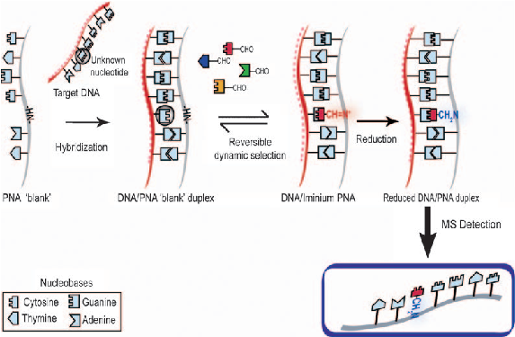
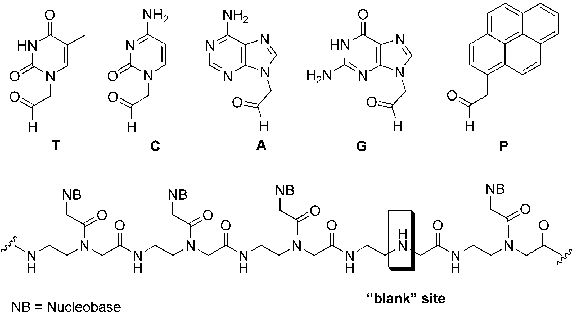
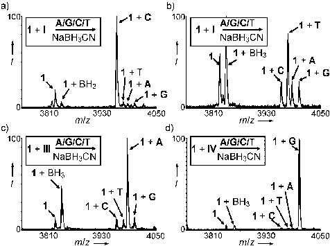
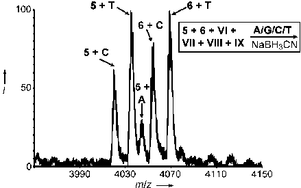
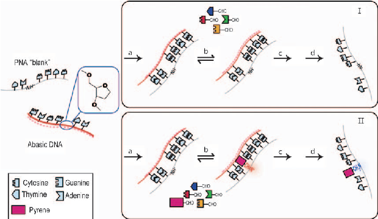

DNA Analysis DOI: 10.1002/anie.200905699

## DNA Analysis by Dynamic Chemistry**

Frank R. Bowler, Juan J. Diaz-Mochon,* Michael D. Swift, and Mark Bradley*

A single-nucleotide polymorphism (SNP) is a genetic variation for which two or more alternative alleles are present at appreciable frequency in the human population.[1] Methods for SNP analysis[2] are multifarious, but typically rely on an enzymatic primer extension[2b] with fluorescence and mass spectrometric (MS) detection. Several nonenzymatic methods of DNA analysis have been reported. One approach is based on the differential melting temperatures of allele-specific probes[2c] while another has been to use DNA mimics such as peptide nucleic acids (PNAs)[3] in a number of ligation-based chemical approaches, most notably in the elegant work of Seitz et al.[4] Nonenzymatic ligation has also been achieved in a DNA–DNA sense by Kool et al.,[5] who ligated DNA strands containing a 3’-phosphorothioate with a 5’-iodothymidine, and Richert et al.,[6] who reacted nucleotides possessing an activated phosphate with a DNA strand containing a free 3’amino group. DNA-templated dynamic chemistry has attracted interest for the preparation of stimuli-responsive polymers and for gaining insight into the chemistry of primordial self-replicating systems.[7] Most recently, Liu and Heemstra have reported PNA-templated base-filling reactions on PNA strands.[7h]

Scheme 1. Dynamic chemistry applied to SNP analysis.

complementary iminium nucleobase. Subsequent reduction and MALDI-TOF mass spectrometry would allow rapid determination of base incorporation.

The first question that arises relates to the degree of selection achievable through this dynamic approach. This was addressed by the synthesis of the 15-mer PNA 1 with a single “blank” position (Table 1 and Figure 1), complementary to

Herein we report the application of dynamic chemistry[8] to DNA analysis, offering the prospect of nonenzymatic genotyping of genomic DNA amplified by polymerase chain reaction (PCR). This was achieved by the synthesis of a PNA strand that contained a “blank” position opposite the nucleobase under analysis in a complementary DNA template. A reversible reaction, between this PNA/DNA duplex (specifically the secondary amine of the “PNA blank”) and four aldehyde-modifed nucleobases (Scheme 1), means that the templating power of Watson–Crick base pairing and base stacking[9] would be expected to drive the selection of the fully

Table 1: PNA sequences used for DNA analysis. PNA oligomer Sequence (N–C)[a,b] 1 Ac-TAC TAC ATC _CT TCC

- 2[c] phosphonium-PEG-GTG GAG _TC AAC GA
- 3[c] phosphonium-PEG-GTG GAG _ _C AAC GA
- 4[c] phosphonium-PEG-GTG GAG _ _ _ AAC GA
- 5 phosphonium-CT TTC CT _ CAC TGT
- 6 phosphonium-TC GTT GA _ CTC CAC

[a] _ Represents a blank site (see Figure 1). [b] All PNA oligomers were synthesized by solid-phase synthesis and had a C-terminal primary amide. [c] See the Supporting Information for structures of the phosphonium-polyethylene glycol (-PEG) units.

[*] F. R. Bowler, Dr. J. J. Diaz-Mochon, Dr. M. D. Swift, Prof. M. Bradley School of Chemistry, University of Edinburgh EH9 3JJ, Edinburgh (UK) Fax: (+44)131-650-4820 E-mail: jj.diaz@ed.ac.uk

four 21-mer DNA templates I–IV (see Table 2). Treatment of PNA 1 with one of the complementary DNA oligomers and equimolar amounts of the four nucleobase aldehydes T, C, A, and G (Figure 1), followed by reduction, addition of Q Sepharose[10] and MALDI-TOF MS analysis (see Figure 2 for representative spectra), demonstrated highly selective incorporation of the nucleobase complementary to the SNP position on the DNA template (see Table 3). As anticipated for iminium ion formation, conversions were optimal at mildly acidic pH (i.e. 5 pH 7; see the Supporting Infor-

mark.bradley@ed.ac.uk Homepage: http://www.combichem.co.uk [**] This concept was first described in a UK patent entitled “Nucleo-

base Characterisation” GB 0718255.3 filed on September 19, 2007 by Juan J. Diaz-Mochon and Mark Bradley (University of Edinburgh) and published on March 26, 2008 (WO/2009/037473). This project is funded by Scottish Enterprise. We are grateful to Dr. K. Finlayson and Dr. Ann-Marie Stannard for their continuing support.

Supporting information for this article is available on the WWW under http://dx.doi.org/10.1002/anie.200905699.

Angew. Chem. Int. Ed. 2010, 49, 1809 –1812 2010 Wiley-VCH Verlag GmbH & Co. KGaA, Weinheim 1809

or thymine (attributed to the greater number of templating hydrogen bonds). Furthermore, purine bases were incorporated with greater selectivity than pyrimidines (A>T, G>C by approximately twofold). The selectivity of the incorporation could be further improved by altering the starting ratio of the bases (see Figure S15 and Table S1 in the Supporting Information). The reversibility of the nucleobase incorporation (prior to reduction) was demonstrated by analyzing the reaction of PNA/DNA (1/IV). In the absence of G small levels of misprimed incorporation were detected after reduction; however, when G was added to the reaction mixture (immediately before reduction) the removal of virtually all misprimed binding resulted, showing the reversibility of the selection process (see Figures S22 and S23 in the Supporting Information).

- Figure 1. Top: The four aldehyde-modified nucleobases (T, C, A, and G) and 1-pyreneacetaldehyde (P). Bottom: General structure of a modified “blank” PNA strand.

- Table 2: DNA oligomers subjected to analysis. DNA oligomer Sequence (5’–3’)[a,b]

- I TTT TTT GGA AGG GAT GTA GTA
- II TTT TTT GGA AGA GAT GTA GTA
- III TTT TTT GGA AGT GAT GTA GTA
- IV TTT TTT GGA AGC GAT GTA GTA
- V TCG TTG ACC TCC AC
- VI wt codon 551 GTG GAG GTC AAC GA
- VII (G551D mutant) GTG GAG ATC AAC GA
- VIII wt codon 1282 ACA GTG GAG GAA AG
- IX (W1282X mutant) ACA GTG AAG GAA AG
- X abasic GTG GAG ZTC AAC GA

[a] DNA/PNA hybridize with the 3’-end of the DNA matched to the N terminus of the PNA. [b] Nucleobase subjected to analysis is in bold. Z=abasic site.

- Figure 2. Mass spectra recorded after DNA-templated reductive aminations using an unoptimized equimolar ratio of the four aldehydes. a) DNA template I directs incorporation of C, b) DNA template II directs incorporation of T, c) DNA template III directs incorporation of A, and d) DNA template IV directs incorporation of G. I=percentage intensity.

To serve as a technique for SNP analysis, any approach must permit the genotyping of heterozygous individuals who possess two different alleles of a particular gene. Heterozygotes present a greater challenge than homozygotes, as the signals associated with each allele should ideally be detected with approximately equal intensity to facilitate confident genotyping. To allow “heterozygous” SNP analysis, the relative concentrations of the four aldehyde monomers were altered to normalize the selection ratio between the bases (see Figure S24 in the Supporting Information for a representative spectrum).

SNPs are important in determining the severity of cystic fibrosis (CF), a life-threatening inherited disease. DNA oligomers representing CF-linked SNPs (W1282X and G551D; see Table 2) were analyzed[11] using PNAs 5 and 6, respectively, which employed a triphenylphosphonium tag[10] that improved the detection limit of MALDI-TOF MS by an order of magnitude (compared to PNA 1; see the Supporting Information). The resulting mass spectra permitted confident “calling” of the homo- and heterozygous models for both SNPs (see Figures S25–S30 in the Supporting Information). Simultaneous analysis was also performed by combining all four DNA strands (VI–IX) and profiling with PNAs 5 and 6, thereby modeling the situation for an individual heterozygous at both SNP locations. The resulting mass spectra showed the highly selective incorporation of the expected nucleobases (Figure 3).

The dynamic incorporation of nucleobases into multiple consecutive “blanks” was explored using PNAs 2–4 (Table 1) with DNA V (Table 2). The resulting mass spectra showed selective incorporation of the correct bases in all cases (see Figures S32–S34 in the Supporting Information). These results offer the possibility of indel (insertion and deletion of one or more nucleobases within a DNA strand) analysis.[12]

Abasic sugars are found naturally in the genome as a result of spontaneous lesions, or chemical or physical damage.[13] Kool and Matray observed that pyrene nucleoside triphosphate (dPTP) could be enzymatically incorporated opposite a templating abasic site.[14] A DNA template X containing an abasic site (see Table 2 and Scheme 2) was

mation for details). Under these conditions guanine and cytosine were found to be incorporated more efficiently and (approximately fivefold) more selectively than either adenine

the selective incorporation of the specific nucleobase aldehyde. Analysis with the addition of P (Scheme 2) gave clean incorporation of only P (see Figure S36 in the Supporting Information).

- Table 3: MALDI signal ratios for nucleobase incorporation (all ratios reported to the nearest integer).

DNA oligomer Templating base MALDI signal ratios[a] C/T/A/G

Dynamic chemistry has thus been developed as an effective method of DNA analysis, demonstrating high base selectivity and the potential for enzyme-free SNP genotyping of PCR-amplified DNA. MALD-TOF MS enabled the dual analysis of “heterozygous” samples. Variations in base selectivity were attributed primarily to the number of hydrogen bonds templating the incorporation reaction; G and C were incorporated approximately fivefold more selectively than A and T. Within these subsets, purine bases were incorporated around two times more selectively than the pyrimidines (i.e. A>T, G>C); this is attributed to differences in p-stacking interactions. The approach also raises the possibility of analyzing other sources of genetic variation and mutation, such as indels and abasic sites, in a manner simply not possible with current approaches. Moreover, it offers an approach to identify nucleobase mimics to expand the genetic alphabet.[15] The approach has also demonstrated the templating role of DNA in promoting selective nucleobase incorporation.

- I G 19:1:1:1
- II A 1:4:1:1
- III T 1:1:8:1
- IV C 1:1:1:39

[a] Based upon relative intensities of most common isotope. The nucleobase complementary to the position under interrogation on the DNA template is in bold.

Experimental Section

- Figure 3. Profiling of CF-relevant sequences with oligonucleotides VI–IX and PNAs 5 and 6, illustrating the potential for dual analysis of SNPs by dynamic chemistry. In this case the ratio of PNAs 5 and 6 was 10:6 to allow approximately equal product peak intensities (see Figure S31 in the Supporting Information). I=percentage intensity.

Typical protocol for DNA-templated reductive aminations: A PNA blank (2.5 mL, 40 mm aq.), DNA template (1 mL, 100 mm aq.), aldehydes A, G, C, and T (1.6 mL of each, 1.7 mm aq.), and pH 6 phosphate buffer (8.1 mL, 10 mm aq.) were combined in a 1.5 mL Eppendorf tube and placed in an Eppendorf Thermomixer comfort at 808C and 1200 rpm for 5 min. The reaction mixture was then cooled to 408C (at 38Cmin 1) before NaBH3CN (2 mL, 1m aq.) was added and shaking continued for 1 h. Pre-equilibrated Q Sepharose Fast Flow (5 mL, see the Supporting Information) was added before the reaction mixture was agitated at room temperature for 20 min. The reaction tube was centrifuged and the supernatant removed, then the Q Sepharose was washed centrifugally with 3% MeCN in water (3  200 mL). Sinapinic acid matrix (10 mL) was added to the resin, and this mixture was spotted (1 mL in duplicate) onto a stainless steel MALDI plate. Reactions were performed in duplicate, and five MALDI

therefore analyzed by dynamic incorporation with PNA 6 and aldehydes T, C, G, and A with and without the pyrene base analogue 1-pyreneacetaldehyde P (Figure 1). In the absence of P this yielded minimal base-incorporation products (see Figure S35 in the Supporting Information). The major signal corresponded to starting material, demonstrating the role of the complementary base of the DNA template in promoting

spectra acquired for each. Spectra are presented unprocessed. Relative peak intensities were determined for the most common isotopes of the PNA-incorporation products. Product signal ratios were determined by averaging over the ten spectra. A control reaction was performed without DNA (see Figure S37 in the Supporting Information).

Received: October 9, 2009 Revised: December 3, 2009 Published online: February 12, 2010

.Keywords:DNAanalysis· dynamic chemistry · genotyping · peptide nucleic acids · single-nucleotide polymorphisms

Scheme 2. Analysis of abasic DNA without (top) and with (bottom) 1-pyreneacetaldehyde, P. a) Hybridization, b) dynamic reversible incorporation, c) reduction, and d) MS detection.

[1] A.-C. Syv nen, Nat. Genet. 2005, 37, S5– S10.

Angew. Chem. Int. Ed. 2010, 49, 1809 –1812 2010 Wiley-VCH Verlag GmbH & Co. KGaA, Weinheim www.angewandte.org 1811

- [2] a) J. Perkel, Nat. Methods 2008, 5, 447–453; b) J. Zhang, K. Li, J. R. Pardinas, S. S. Sommer, K.-T. Yao, Trends Biotechnol. 2005, 23, 92–96, and references therein; c) T. LaFramboise, Nucleic Acids Res. 2009, 37, 4181–4193, and references therein.
- [3] a) P. E. Nielsen, M. Egholm, R. H. Berg, O. Buchardt, Science 1991, 254, 1497–1500; b) L. M. Wilhelmsson, N. Bengt, M. Kaushik, M. T. Dulay, R. N. Zare, Nucleic Acids Res. 2002, 30, e3.
- [4] a) S. Ficht, C. Dose, O. Seitz, ChemBioChem 2005, 6, 2098– 2103; b) T. N. Grossmann, L. R glin, O. Seitz, Angew. Chem. 2008, 120, 7228–7231; Angew. Chem. Int. Ed. 2008, 47, 7119– 7122; c) A. Mattes, O. Seitz, Angew. Chem. 2001, 113, 3277– 3280; Angew. Chem. Int. Ed. 2001, 40, 3178–3181; d) S. Ficht, A. Mattes, O. Seitz, J. Am. Chem. Soc. 2004, 126, 9970–9981.
- [5] Y. Xu, N. B. Karalkar, E. T. Kool, Nat. Biotechnol. 2001, 19, 148– 152.
- [6] N. Griesang, K. Gießler, T. Lommel, C. Richert, Angew. Chem. 2006, 118, 6290–6294; Angew. Chem. Int. Ed. 2006, 45, 6144– 6148.
- [7] a) J. T. Goodwin, D. G. Lynn, J. Am. Chem. Soc. 1992, 114, 9197– 9198; b) Z.-Y. J. Zhan, D. G. Lynn, J. Am. Chem. Soc. 1997, 119, 12420–12421; c) D. T. Hickman, N. Sreenivasachary, J.-M. Lehn, Helv. Chim. Acta 2008, 91, 1–20; d) X. Li, Z.-Y. J. Zhan, R. Knipe, D. G. Lynn, J. Am. Chem. Soc. 2002, 124, 746–747; e) X. Li, D. R. Liu, Angew. Chem. 2004, 116, 4956–4979; Angew. Chem. Int. Ed. 2004, 43, 4848–4870; f) D. M. Rosenbaum, D. R. Liu, J. Am. Chem. Soc. 2003, 125, 13924–13925. While this

- article was in preparation two papers were published in which authors used dynamic chemistry to understand prebiotic chemistry: g) Y. Ura, J. M. Beierle, L. J. Leman, L. E. Orgel, M. R. Ghadiri, Science 2009, 325, 73–77; and h) J. M. Heemstra, D. R. Liu, J. Am. Chem. Soc. 2009, 131, 11347–11349.
- [8] P. T. Corbett, J. Leclaire, L. Vial, K. R. West, J.-L. Wietor, J. K. M. Sanders, S. Otto, Chem. Rev. 2006, 106, 3652–3711.
- [9] A. Sen, P. E. Nielsen, Biophys. Chem. 2009, 141, 29–33.
- [10] B. Boontha, J. Nakkuntod, N. Hirankarn, P. Chaumpluk, T. Vilaivan, Anal. Chem. 2008, 80, 8178–8186.
- [11] a) J. M. DeMarchi, C. S. Richards, R. G. Fenwick, R. Pace, A. L. Beaudet, Hum. Mutat. 1994, 4, 281–290; b) M. Nemeti, J. P. Johnson, Z. Papp, E. Louie, Hum. Genet. 1992, 89, 245–246; c) M. T. Cronin, R. V. Fucini, S. M. Kim, R. S. Masino, R. M. Wespi, C. G. Miyada, Hum. Mutat. 1996, 7, 244–255.
- [12] N. Axelrod et al., Nucl. Acids Res. 2009, 37, D1018–D1024.
- [13] a) L. A. Loeb, B. D. Preston, Annu. Rev. Genet. 1986, 20, 201– 230; b) J. Lhomme, J.-F. Constant, M. Demeunynck, Biopolymers 1999, 52, 65–83.
- [14] T. J. Matray, E. T. Kool, Nature 1999, 399, 704–708.
- [15] a) G. T. Hwang, A. M. Leconte, F. E. Romesberg, ChemBioChem 2007, 8, 1606–1611; b) B. M. O Neill, J. E. Ratto, K. L. Good, D. C. Tahmassebi, S. A. Helquist, J. C. Morales, E. T. Kool, J. Org. Chem. 2002, 67, 5869–5875; c) F. Seela, K. Xu, Org. Biomol. Chem. 2008, 6, 3552–3560; d) A. T. Krueger, E. T. Kool, Chem. Biol. 2009, 16, 242–248.

