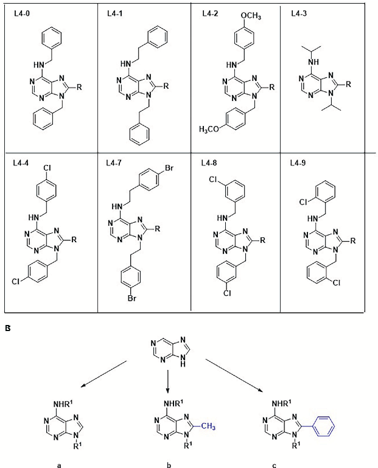
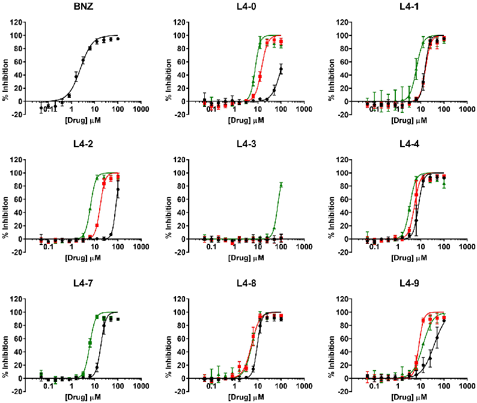
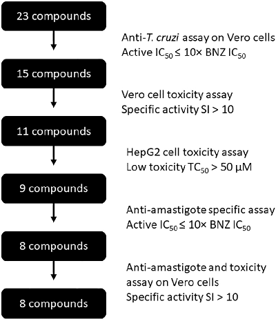
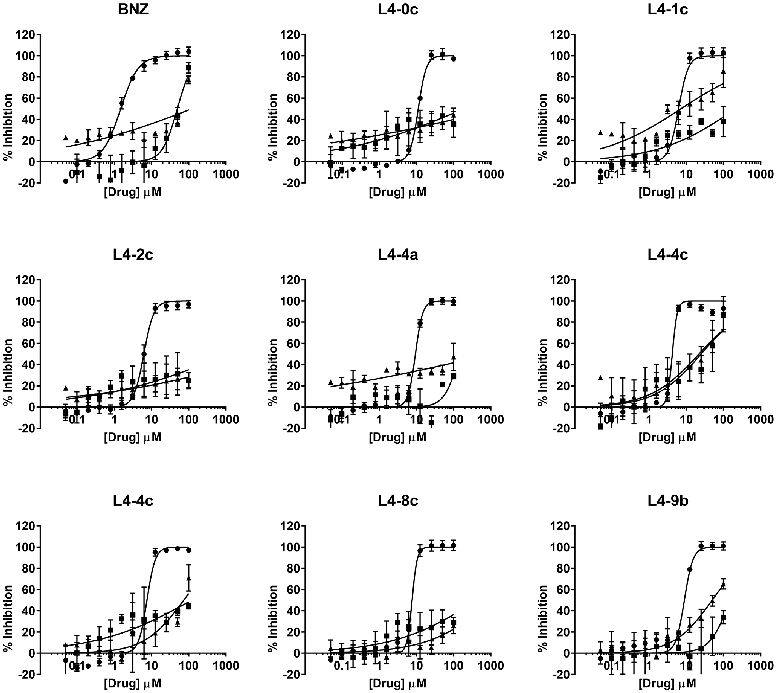
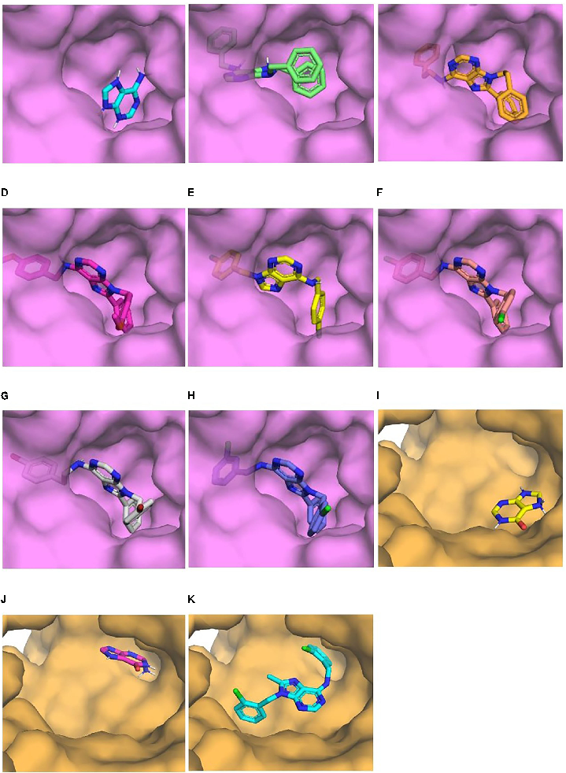
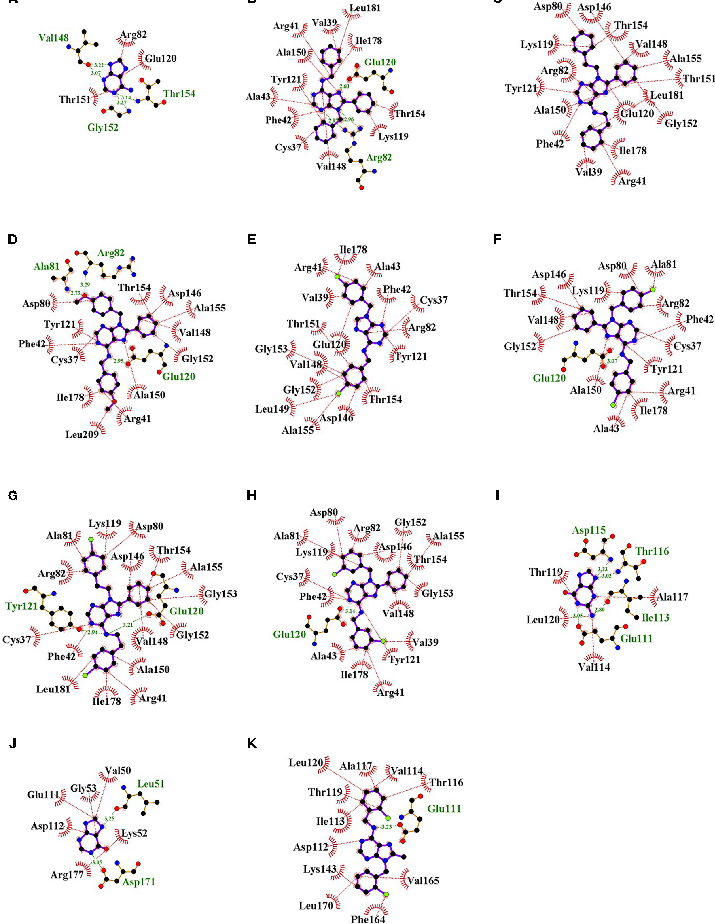

TYPE Original Research PUBLISHED 13 January 2023 DOI 10.3389/fcimb.2022.1067461

OPEN ACCESS

EDITED BY

Nobuko Yoshida, Federal University of São Paulo, Brazil

REVIEWED BY

Bianca Zingales, University of São Paulo, Brazil Vilma G. Duschak, Consejo Nacional de Investigaciones Cient´ıficas y Te´ cnicas (CONICET), Argentina

*CORRESPONDENCE

Julio Alonso-Padilla julio.a.padilla@isglobal.org Mar´ıa Jose´ Pineda de las Infantas y Villatoro mjpineda@ugr.es

SPECIALTY SECTION

This article was submitted to Parasite and Host, a section of the journal Frontiers in Cellular and Infection Microbiology

RECEIVED 11 October 2022 ACCEPTED 11 November 2022 PUBLISHED 13 January 2023

CITATION

Barnadas-Carceller B, Martinez-Peinado N, Go´ mez LC, Ros-Lucas A, Gabaldo´ n-Figueira JC, Diaz-Mochon JJ, Gascon J, Molina IJ, Pineda de las Infantas y Villatoro MJ and Alonso-Padilla J (2023) Identification of compounds with activity against Trypanosoma cruzi within a collection of synthetic nucleoside analogs. Front. Cell. Infect. Microbiol. 12:1067461. doi: 10.3389/fcimb.2022.1067461

# Identification of compounds with activity against Trypanosoma cruzi within a collection of synthetic nucleoside analogs

Berta Barnadas-Carceller1, Nieves Martinez-Peinado1,2, Laura Co´ rdoba Go´ mez3, Albert Ros-Lucas1,4, Juan Carlos Gabaldo´ n-Figueira1, Juan J. Diaz-Mochon3,5,6, Joaquim Gascon1,4, Ignacio J. Molina7, Mar´ıa Jose´ Pineda de las Infantas y Villatoro3* and Julio Alonso-Padilla1,4*

1Barcelona Institute for Global Health (ISGlobal), Hospital Clinic - University of Barcelona, Barcelona, Spain, 2Seccio´ de Parasitologia, Departament de Biologia, Sanitat i Medi Ambient, Facultat de Farmàcia i Ciències de l’Alimentacio´ , Universitat de Barcelona, Barcelona, Spain, 3Department of Medicinal & Organic Chemistry and Excellence Research Unit of “Chemistry Applied to Biomedicine and the Environment”, Faculty of Pharmacy, University of Granada, Granada, Spain, 4CIBER de Enfermedades Infecciosas, Instituto de Salud Carlos III (CIBERINFEC, ISCIII), Madrid, Spain, 5GENYO, Centre for Genomics and Oncological Research, Pfizer/University of Granada/Andalusian Regional Government, PTS Granada, Granada, Spain, 6Biosanitary Research Institute of Granada (ibs.GRANADA), University Hospitals of Granada-University of Granada, Granada, Spain, 7Institute of Biopathology and Regenerative Medicine, Centre for Biomedical Research, University of Granada, Granada, Spain

Introduction: Chagas disease is caused by the protozoan parasite Trypanosoma cruzi, and it is the most important neglected tropical disease in the Americas. Two drugs are available to treat the infection, but their efficacy in the chronic stage of the disease, when most cases are diagnosed, is reduced. Their tolerability is also hindered by common adverse effects, making the development of safer and efficacious alternatives a pressing need. T. cruzi is unable to synthesize purines de novo, relying on a purine salvage pathway to acquire these from its host, making it an attractive target for the development of new drugs.

Methods: We evaluated the anti-parasitic activity of 23 purine analogs with different substitutions in the complementary chains of their purine rings. We sequentially screened the compounds' capacity to inhibit parasite growth, their toxicity in Vero and HepG2 cells, and their specific capacity to inhibit the development of amastigotes. We then used in-silico docking to identify their likely targets.

Results: Eight compounds showed specific anti-parasitic activity, with IC50 values ranging from 2.42 to 8.16 mM. Adenine phosphoribosyl transferase, and hypoxanthine-guanine phosphoribosyl transferase, are their most likely targets.

Discussion: Our results illustrate the potential role of the purine salvage pathway as a target route for the development of alternative treatments against T. cruzi infection, highlithing the apparent importance of specific substitutions, like the presence of benzene groups in the C8 position of the purine ring, consistently associated with a high and specific anti-parasitic activity.

KEYWORDS

Chagas disease, Trypanosoma cruzi, purine derivates, antiparasitic assays, cytotoxicity assays, drug discovery cascade

## Introduction

Chagas disease, also known as American trypanosomiasis, is a Neglected Tropical Disease (NTD) that affects 6-7 million people worldwide (Lidani et al., 2019; WHO, 2021). It is caused by the hemoflagellate protozoan parasite Trypanosoma cruzi (T. cruzi), which is mostly transmitted by reduviid insects from the subfamily Triatominae (triatomine bugs), endemic to the Americas. Alternative transmission routes include the consumption of parasite contaminated food and water, blood transfusions, organ transplants, and vertical transmission from infected mothers to their newborns, the three latter being also of relevance in non-endemic regions of North America, Europe, Australia, and Japan (Pérez-Molina and Molina, 2018; Lidani et al., 2019).

The initial stage of the infection is usually asymptomatic or courses with mild flu-like symptoms, so it mostly goes undiagnosed and untreated. Following this stage, the infection becomes chronic, and the parasite persists for several years without causing overt clinical signs. However, it is estimated that up to 30% of those chronically infected will develop lifethreatening cardiac and/or digestive manifestations such as dilated cardiomyopathy, heart failure, megacolon or megaesophagus (Pérez-Molina and Molina, 2018; Lidani et al., 2019; CDC Chagas Disease, 2021). As a consequence, Chagas disease is a major public health problem in Latin America, where it is considered the main driver of non-ischemic heart failure, leading to ~10,000 deaths per year (CDC - Chagas Disease, 2021).

There are two antiparasitic drugs - benznidazole (BNZ) and nifurtimox (NFX) - available to treat the infection. Although they are highly efficient during the acute stage of the disease, their efficacy is reduced in the chronic stage, when the majority of patients are diagnosed. Moreover, frequent adverse effects and long administration regimens hinder their acceptability and

patients adherence to treatment (Jackson et al., 2010; Aldasoro et al., 2018; Pérez-Molina and Molina, 2018). Thus, the development of new drugs, particularly for the chronic stage of the infection, is urgently needed (Beltran-Hortelano et al., 2022).

In the last decade, drug discovery efforts have been based on the screening of large chemical collections, mostly relying on phenotypic assays (Kratz, 2019; Garcıa-Huertaś and CardonaCastro, 2021). Nonetheless, the identification of targets to elucidate compounds´ mechanisms of action will greatly contribute to the rational design for less toxic effects and it is highly desirable (Garcıa-Huertaś and Cardona-Castro, 2021). Ideally, molecular targets need to be essential for parasite growth or survival, have a druggable active site, lack homology with proteins present in humans to anticipate reduced toxicity, and have no isoforms within the same parasite species to avoid the occurrence of resistance. Up to date, several studies on targetbased anti-T. cruzi drug discovery have been published, mostly related to the ergosterol biosynthesis pathway, the cysteinepeptidase cruzain, the proteosome and the enzyme trypanothione reductase (Santos et al., 2020). Among those, posaconazole and E-1224, a prodrug of ravuconazole, both C14a-demethylase (CYP51) inhibitors, reached clinical trials but failed as monotherapy and were less effective than BNZ (Santos et al., 2020). Fexinidazole, a 5-nitroimidazole derivative in use for African trypanosomiasis, has been more recently clinically evaluated for Chagas disease in a proof-of-concept study, but safety concerns led to enrollment interruption (Torrico et al., 2022). GNF6702 which is an azabenzoxazole compound that acts as an allosteric proteasome inhibitor, matched efficacy with BNZ in a chronic in vivo model and is being evaluated in preclinical toxicity studies (Vermelho et al., 2020). Some oxaborole compounds have also been nominated as clinical candidates for the treatment of Chagas disease. For instance,

Padilla et al. reported that the benzoxaborole prodrug AN15368, which targets the mRNA processing pathway in T. cruzi, was uniformly curative in non-human primates with long-term naturally acquired infections (Padilla et al., 2022). Besides, the oxaborole DNDI-6148 showed high curative rates in mouse models of infection and is currently being evaluated in phase I clinical trials (De Rycker et al., 2022).

Despite being a major public health problem, the development of new therapies against Chagas disease is hindered by its limited financial incentives, leading to most research being carried out directly in academic institutions. Medicinal chemistry in pair with bioinformatic approaches provide valuable tools to advance in this direction (Santos et al., 2020; Garcıa-Huertaś and Cardona-Castro, 2021). In this regards, whole genome sequencing of T. cruzi and the generation of novel biochemical data have been important in the search for new antiparasitic drugs. A pathway of interest is that of purine metabolism, as it is known to hold remarkable differences between T. cruzi and mammals (Berg et al., 2010). Purines are of great importance to all organisms since they are the precursors of fundamental components of DNA and RNA macromolecules, act as second messengers, and constitute several coenzymes. T. cruzi parasites are unable to synthesize purines de novo since they cannot produce inosine monophosphate (IMP) from glycine. Because of that, they need a purine salvage pathway, a route in which purines are synthetized from endogenous and exogenous substrates (Gutteridge and Gaborak, 1979; Berens et al., 1981). Enzymes involved in the salvage pathway show little homology with its mammal counterparts and have already been identified as potential targets of compounds with specific activity against kinetoplastid parasites, including T. cruzi. (Tran et al., 2017; Hulpia et al., 2018; Bouton et al., 2021; Martinez-Peinado et al., 2021b).

To further investigate the antiparasitic role of purine analogs, we screened a collection of 23 synthetic compounds for in vitro activity against T. cruzi. These compounds are based on a collection previously tested against T. cruzi and P. falciparum, whose solubility has been improved by increasing their hydrophilicity (Martinez-Peinado et al., 2021b).

## Materials and methods

Chemical collection

The collection comprised twenty-three 6-aminopurine analogs belonging to eight families differentiated by the R1 substituents presented at the exocyclic amino at positions 6 and 9 of the purine ring (L0-L4 & L7-L9). Members of each family present the same R1 at both positions and they were further divided into subtypes a, b or c according to the radical at position 8, which can be H (subfamily a), methyl (subfamily b)

and phenyl (subfamily c). All compounds were synthesized from their 4,6-dialky/diarylalkylamino -5-nitropyrimidine derivatives (See Synthesis and characterization of the chemical collection Supplementary Material for full details). Briefly, following the reduction of the 5-nitro group with tin (II) chloride the final cyclization steps were carried out with the corresponding trialkylorthoesthers and methanesulfonic to yield the twentythree members library. All compounds were purified by column chromatography and characterized by nuclear magnetic resonance (1h-NMR, 13C-NMR) and high-resolution mass spectrometry (HRMS). They share a common purine structure, attached to two different functional groups on carbons C6, C8 and nitrogen N9, as shown in Figure 1. The absence of a functional group in C8, or the presence of either a methyl or a benzyl group, respectively classified the compounds in scaffold groups a, b, or c. Compounds were provided at a concentration of 100 mM in dimethyl sulfoxide (DMSO) and aliquoted upon arrival. The stock was long term stored at -20°C and daily use aliquots at 4°C. To ensure good solubility of the compounds before running the assays, they were placed in a thermoblock at 40°C for about 10 - 15 minutes in advance of their addition to the assay plates.

Host cells and T. cruzi parasite cultures

Vero (green monkey kidney epithelial cells), LLC-MK2 (rhesus monkey kidney epithelial cells), and HepG2 cells (human liver epithelial cells) were maintained in T75 or T175 flasks with high-glucose/glutamine Dulbecco’s Modified Eagle Medium Phenol Red (DMEM-PR) supplemented with 1% penicillin-streptomycin (PS) and 10% inactivated fetal bovine serum (FBS) (Martinez-Peinado et al., 2020). HepG2 cultures were additionally supplemented with 1× non-essential amino acids solution (NEAA) (Martinez-Peinado et al., 2020).

T. cruzi parasites from the Tulahuen strain (DTU VI) expressing b-galactosidase (Buckner et al., 1996) were grown using LLC-MK2 cells as hosts and DMEM-PR supplemented with 2% FBS and 1% PS. Trypomastigotes were isolated for the maintenance of the cycle and for the performance of the antiparasitic assays, respectively. Briefly, medium containing free swimming trypomastigotes was harvested in falcon tubes and centrifuged at 2,500 rpm for 10 minutes to remove cell debris. Supernatant was then carefully aspirated and either replaced with DMEM-PR supplemented with 2% FBS and 1% PS, or with DMEM without PR supplemented with 1% penicillin-streptomycin-glutamine (PSG), 4-2-hydroxyethyl-1piperazineethanesulfonic acid (HEPES) 25 mM and sodiumpyruvate 1mM in addition to 2% FBS and 1% PS (assay medium) (Martinez-Peinado et al., 2020). In the second case, another centrifugation was made to get rid of any PR remnants that may interfere in the assay readout. Supernatant excess was discarded, and the tubes were incubated at 37°C for at least 1.5 h to allow

|  A B   FIGURE 1  Chemical structures and classification of compounds evaluated in this work. Numbers 0-4 & 7–9 identify the eight different chemical families (A), while their accompanying letters depict scaffold subgroups (B).|
|---|

the trypomastigotes to swim out of the pellet (Buckner et al., 1996).

T. cruzi growth inhibition assay

Anti-T. cruzi assays were performed using Vero cells and T. cruzi Tulahuen parasites (Martinez-Peinado et al., 2020). Compounds were added to a flat 96-well cell culture plate (SPL Life Sciences, Pocheon-si, Korea) and diluted in assay medium following a 1:2 dose-response pattern. Vero cells were detached, washed and counted using a Neubauer chamber. On the other side, T. cruzi trypomastigotes were collected and counted. Then, 50,000 trypomastigotes and 50,000 Vero cells

were simultaneously added to each well to reach a final volume of 200 ml per well (multiplicity of infection or MOI = 1). Negative (untreated Vero cells and parasites, indicating 0% inhibition) and positive controls (trypomastigotes alone, indicating 100% inhibition or minimum growth) were included in each run (Martinez-Peinado et al., 2020). Note that trypomastigotes are unable to multiply and therefore they mark the enzymatic time zero. In addition to those controls, BNZ-treated wells were also included as a positive control of drug inhibition. Plates were incubated at 37°C for 96 h. After that, chlorophenol red-b-D-galactopyranoside (CPRG) substrate was added to detect the enzymatic activity of bgalactosidase expressed by the parasites. For this, a PBS dilution with 0.25% of detergent NP-40 and 500 mM of CPRG

were added to each well and incubated at 37°C for another 4 h (Bettiol et al., 2009). Absorbance was measured at 590 nm in an Epoch Gene5 Microplate Spectrophotometer (BioTek, Winooski, USA).

Cytotoxicity assays

Compounds were added to the plates and diluted following a dose-response pattern in assay medium. Vero cells were prepared in assay medium and added to each well as described (Martinez-Peinado et al., 2020). Each test plate contained its own negative (untreated cells) and positive (medium alone) control wells (Martinez-Peinado et al., 2020). BNZ and digitoxin (DTX) were included as non-toxicity and toxicity drug controls, respectively. Parallel assays with HepG2 cells were carried out to evaluate the toxicity of compounds in a human cell line as described (Martinez-Peinado et al., 2020). Plates were incubated at 37°C for 96 (Vero) or 48 hours (HepG2). Vitality was measured with Alamar Blue (Thermo Fischer Scientific, Waltham, USA) to detect metabolically active (live) cells by fluorimetry. For this, a PBS dilution with 10% Alamar Blue was added to each well and the plates were incubated at 37°C for 6 h. Readout was performed on a TECAN Infinite M Nano+ reader (Tecan Trading AG, Männedorf, Switzerland) using i-control™ 2.0 software and setting excitation at 530 nm and emission at 590 nm.

Amastigotes growth inhibition assay

To address compounds activity against amastigotes, Vero cells were seeded in T-175 flasks (5×106 cells) and cultured for 24 h in DMEM-PR supplemented with 10% FBS and 1% PS. Upon washing the monolayers with PBS, purified trypomastigotes were added at a concentration of 1×107 trypomastigotes per flask (MOI = 1) and infected monolayers were kept in assay medium. After 18 h, infected Vero cells were PBS-washed and trypsin-detached, diluted at a concentration of 5×105 cells per ml in assay medium and 100 ml of that solution (50000 cells) added to 96-well test plates already containing the compounds. Plates were incubated at 37°C for another 72 h and read with CPRG, as described for the anti-T. cruzi assay (Martinez-Peinado et al., 2021a; Martinez-Peinado et al., 2021b; Martinez-Peinado et al., 2021c).

Computational analysis

It was performed to address the potential mechanism behind the effect of compounds specifically inhibiting T. cruzi growth. We focused on evaluating the interactions of prioritized compounds with enzymes TcADSL, TcAK, TcAPRT,

TcHGPRT, TcIAGNH, TcIGNH, TcIMPDH, and TcMTAP, given their key role in the purine salvage pathway. Computer generated models of these proteins were obtained from the AlphaFold Database (Jumper et al., 2021). Due to the lack of properly annotated protein sequences for the Tulahuen strain, we used protein models of the CL Brener Esmeraldo-like strain of T. cruzi. Tridimensional structures of the compounds were created using Avogadro editor software (Hanwell et al., 2012), and the molecular geometry was optimized to obtain the lowest energy values. Natural ligands were obtained from PubChem (Kim et al., 2019) as MOL files, namely adenine, adenosine, adenyl succinate, guanine, guanosine, hypoxanthine, inosine, IMP, SAICAR, and methylthioadenosine. All structures were prepared for docking simulations by adding polar hydrogens and formatting them as PDBQT files using AutoDockTools 1.5.7 (Forli et al., 2016).

Docking was performed with AutoDock Vina 1.1.2 (Eberhardt et al., 2021). The binding box used was sized and centered on the active site of each receptor based on predictions of P2Rank, a prediction algorithm of binding sites based on machine learning, via the PrankWeb server (https://prankweb. cz/; Jendele et al., 2019). Exhaustiveness and energy range were set to 8 and 2, respectively. In each docking round, we generated

- 9 binding modes, from which the one with the lowest binding energy (in Kcal/mol) was selected. This last step was performed
- 10 times for each natural ligand and compound, using different random launches. The best binding modes were chosen and LigPlot+ 2.2.4 was used to analyze the protein-ligand interactions with default parameters (Wallace et al., 1996). Visualization of the protein-ligand complexes was done with PyMOL (v. 2.4.1) (Schrödinger et al., 2020), and images were taken showing the enzymes surface and the ligands as sticks.

Statistical analysis and interpretation of results

Absorbance and fluorescence values in the parasite growth inhibition and cytotoxicity assays were normalized to controls (Peña et al., 2015) using the following equation 1:

% inhibition: 100 − 100

absorbance=fluorescence of well − positive control mean negative control mean −positive control mean

Half maximum inhibitory (IC50) and half maximum toxicity concentration (TC50) values were determined with GraphPad Prism 7 software (version 7.00, San Diego, USA) using a nonlinear regression analysis model defined by equation 2:

Y =

100

1+XHillSlope IC50HIllSlope

Compounds with an IC50 >10× that of BNZ were considered inactive against T. cruzi. These values were used to calculate the selectivity index (SI) of each compound (TC50/IC50). A SI > 10

was interpreted as evidence of specific activity against T. cruzi, in accordance with previous works (Peña et al., 2015). Values were expressed as means with standard deviations (SD) of at least three independent experiments.

## Results

Synthesis of 23 member 6-aminopurinebased library

The synthetic pathway designed to obtain poly-substituted derivatives of 6-aminopurine started from eight different 4,6dialky/diarylalkylamino-5-nitropyrimidine derivatives (L2 (0-4 & 7-9)). These symmetric poly-substituted pyrimidines were then reduced to obtain the symmetric 4,6-dialky/ diarylalkylamino -5-aminopyrimidine derivatives (L3 (0-4 &79)) using tin (II) chloride in excellent yields. At this point, we decided to carry out the cyclization step with orhtoesthers as it

allows introducing structural variation in the library in a straightforward manner. Therefore, pyrimidines L3 reacted with methasulfonate and either orthoformate, trimethyl orthoformate or triphenyl orthoformate to give rise to the subfamilies a, b and c, respectively (L4 (0-4 &7-9) (a-c)) (Supplementary material, Scheme 1). To note that compound L4-7b could not be isolated from this run of reactions so the final size of the library was twenty-three rather than twenty-four as expected. These reactions were carried out at 110°C for 24 h presenting yields ranging from 10% to 82%.

Inhibition of T. cruzi growth

Compounds IC50 values were determined following a 1:2 dilution pattern encompassing twelve data points to construct their dose-response curves (Figure 2). BNZ, included as the reference drug, showed an average IC50 value of 2.42 ± 0.16 mM which correlated with that previously reported (Martinez-

|  FIGURE 2  Dose-response curves of the compounds in the anti-T. cruzi assay. The activity curves retrieved for the three different scaffold subgroups (each identified with a letter) are shown in colors: black: a; red: b; green: c.|
|---|

Peinado et al., 2020; Martinez-Peinado et al., 2021a; MartinezPeinado et al., 2021b).

After evaluating the twenty-three compounds, eight of them presented an IC50 that was at least ten times higher than that of BNZ and were therefore considered inactive and excluded from further studies. In contrast, the other fifteen inhibited T. cruzi growth when compared to the reference drug BNZ (IC50 ≤10× that of BNZ; Table 1). The four most active compounds yielded IC50 values of 3.31 ± 0.17 μM (L4-4c), 5.16 ± 0.28 μM (L4-8b), 5.22 ± 0.24 μM (L4-4b), and 5.41 ± 0.32 μM (L4-8c), but none was superior to BNZ (Table 1 and Figure 2).

Identification of compounds with specific activity against the parasite

Those fifteen compounds that inhibited T. cruzi growth were furtherly assessed to determine whether such inhibition was specific against the parasite by means of a Vero cell toxicity assay. The recorded TC50 value of BNZ in this assay was 196.90 ± 30.67 μM

(Table 1 and Figure S1), which matches previously reported results (Martinez-Peinado et al., 2020).

Eleven compounds (L4-0c, L4-1c, L4-2c, L4-4a, L4-4c, L47c, L4-8a, L4-8b, L4-8c, L4-9b and L4-9c) had SI values > 10. However, only eight had SI values higher than that of BNZ (SI = 81.36) (Table 1).

HepG2 cell toxicity assay

Toxicity to HepG2 of the eleven compounds that were specifically active against the parasite was then evaluated (Figure S2) (Cho et al., 2015; Martinez-Peinado et al., 2021b). TC50 values of BNZ and DTX in this cell line were respectively 490.90 ± 267.10 μMand1.29±0.40mM(Table1).WhilefivecompoundsL4-1c,L44c, L4-8a, L4-8b and L4-9b presented a TC50 lower than BNZ, only compounds L4-8a (TC50 = 35.21 ± 5.52 mM) and L4-8b (TC50 = 17.77 ± 0.71 mM) were found to be more toxic than the established 50 mM threshold (Martinez-Peinado et al., 2021b) and thus were excluded from being further evaluated (Table 1).

- TABLE 1 IC50 (mM), TC50 (mM), and SI values of the evaluated compounds against T. cruzi. Compound Vero cells assays HepG2 assay Anti-amastigote assay

[IC50] mM [TC50] mM SI [TC50] mM [IC50] mM SI

BNZ 2.42 ± 0.16 196.90 ± 30.67 81.36 490.90 ± 267.10 1.47 ± 0.08 133.67

- L4-0a 101.8 ± 5.84 – – – – –
- L4-0b* 14.34 ± 0.58 68.16 ± 12.00 4.75 – – –
- L4-0c* 7.64 ± 0.39 > 1,000 185.73 > 10,000 11.15 ± 0.35 127.26

- L4-1a* 15.11 ± 0.56 39.26 ± 4.81 2.59 – – –
- L4-1b* 15.89 ± 0.66 55.91 ± 5.64 3.52 – – –
- L4-1c* 6.397 ± 0.51 > 1,000 248.09 53.96 ± 12.33 6.21 ± 0.29 255.76

- L4-2a 81.37 ± 2.36 – – – – –
- L4-2b 24.90 ± 0.51 – – – – –
- L4-2c* 6.52 ± 0.17 > 1,000 > 1,000 > 10,000 6.19 ± 0.21 > 1,000

- L4-3a > 10,000 – – – – –
- L4-3b > 10,000 – – – – –
- L4-3c 70.99 ± 1.29 – – – – –

- L4-4a* 7.83 ± 0.37 > 1,000 139.14 > 1,000 9.36 ± 0.40 116.45
- L4-4b* 5.22 ± 0.24 27.01 ± 2.00 5.17 – – –
- L4-4c* 3.31 ± 0.17 187.50 ± 54.14 56.61 164.80 ± 38.82 4.20 ± 0.21 44.70

- L4-7a* 25.17 ± 0.69 – – – – –

- L4-7c* 6.06 ± 0.22 909.20 ± 564.00 150.06 550.60 ± 130.00 7.51± 0.79 121.08

- L4-8a* 9.33 ± 0.35 346.30 ± 189.30 37.12 35.21 ± 5.52 – –

- L4-8b* 5.16 ± 0.28 60.11 ± 8.50 11.65 17.77 ± 0.71 – –
- L4-8c* 5.41 ± 0.32 > 1,000 600.78 > 1,000 7.61 ± 0.36 427.33

- L4-9a 36.84 ± 2.38 – – – – –

- L4-9b* 8.16 ± 0.35 > 1,000 137.56 372.20 ± 51.70 8.87 ± 0.42 126.59
- L4-9c* 12.19 ± 0.67 > 10,000 > 10,000 >10,000 28.70 ± 2.34 –

*Compounds with an IC50 ≤ 10x that of BNZ.

Inhibition of amastigotes growth

The nine anti-T. cruzi compounds found to be non-toxic to HepG2 cells were tested to determine their specific activity against amastigotes (Figure 3), the intracellular replicative form of T. cruzi in mammals and a major target for any prospective drug against chronic Chagas disease. The IC50 of BNZ in these assays was 1.47 ± 0.08 mM (Table 1). Out of the nine compounds studied, eight were found to be active against amastigotes (IC50 ≤ 10× that of BNZ): L4-0c, L4-1c, L4-2c, L44a, L4-4c, L4-7c, L4-8c and L4-9b. On the other hand, compound L4-9c was inactive. None of the compounds was discarded due to unspecific activity against amastigotes (Table 1), and none was found to be more active than BNZ (Figure 4). Remarkably, when comparing Vero cells TC50 toxicities and anti-amastigote IC50 values, L4-1c, L4-2c and

- L4-8c showed higher SI windows than BNZ (Table 1).

Computational analysis

The final eight compounds with specific anti-amastigote activity were studied in silico to identify their probable targets in the purine salvage pathway. For this, we compared the free binding energies and docking positions between compounds and the enzymes natural ligands, as these would compete for the active binding site. All compounds showed lower binding energies than the natural ligands when docked to TcHGPRT,

|  FIGURE 3  Flow-chart describing the compounds progression steps.|
|---|

TcAPRT, TcAK, TcIGNH and TcMTAP (Table S1). Among them, L4-8c exhibited the lowest energy values when docked to TcIGNH (DG = -10.8 Kcal/mol) and TcMTAP (DG = -10.7 Kcal/mol) (Table S1). Compounds L4-0c, L4-1c, L4-4a and L48c exhibited the lowest energy value when docked against TcIGNH, whereas compounds L4-2c, L4-4c and L4-7c did it against TcMTAP enzyme. Compound L4-9b showed the lowest binding energy values against both TcIGNH and TcMTAP. However, the binding energy values of the natural ligands of both enzymes were similar to that of the compounds, which led to low energy differences between both. While most compounds showed the capacity to interact with several enzymes of the pathway, the highest energy differences were shown with TcAPRT (Table 2), except for compound L4-9b for which it was with TcHGPRT (Table 2), suggesting that these two enzymes are preferentially inhibited.

Visualization of the interactions of compounds and those two enzymes showed that compounds bound to the active site occupying a larger fraction of the cavity than natural ligands (Figure 5). Interestingly, substitutions at C8 and N9 of the purine ring of all compounds except L4-0c filled the location of adenine in TcAPRT (Figure 5). Similarly, the substitution at C6 of compound L4-9b was found in the binding site of hypoxanthine or guanine in TcHGPRT (Figure 5). In general, compounds showed more hydrophobic interactions and less hydrogen bonds than the natural ligands. In the TcAPRT model, its natural ligand (adenine) formed three hydrophobic interactions with arginine R82, glutamic acid E120 and threonine T151, and four hydrogen bonds with valine V148, glycine G152 and T154 (Figure 6A). Residues R82 and E120 formed hydrophobic interactions, whereas in L4-0c and L4-2c these residues were involved in hydrogen bonds (Figures 6A, B, D). These two amino acids were also found in the interactions with L4-1c, L4-4a, L4-4c,L4-7c and L4-8c (Figures 6C, E–H). Compounds L4-1c and L4-4a did not present hydrogen bonds (Figures 6C, E). In the TcHGPRT model, hypoxanthine and guanine did not interact with the same residues since they were located at different sites of the enzyme cavity and only shared the interaction with E111 (Figures 6I, J). Compound L4-9b shared several interactions with hypoxanthine and guanine, such as those observed with residues E111, aspartic acid D112, isoleucine I113, and T116 of the enzyme (Figure 6K).

## Discussion

The purine metabolism holds striking differences between T. cruzi and its mammalian hosts. Therefore, it has been considered a niche of potential therapeutic targets. Several studies have reported anti-T. cruzi activity of purine analogs in in vitro and in vivo models. Some of those compounds decreased parasitemia and reduced mortality but were unable to induce sterile cure in mouse models (Hulpia et al., 2018, Cardoso-Santos et al., 2021).

|  FIGURE 4  Dose-response curves of selected compounds based on their anti-parasitic activity. Anti-amastigote activity is represented by circles, Vero cell toxicity by squares, and HepG2 cells toxicity by triangles.|
|---|

- TABLE 2 Differences between the free binding energies of natural ligands and “hit” compounds with enzymes from the purine salvage pathway of T. cruzi.

|Enzyme Natural Ligand|Energy Differences with the Compounds (Kcal/mol)|
|---|---|
|L4-0c|L4-1c L4-2c L4-4a L4-4c L4-7c L4-8c L4-9b|

TcHGPRT Hypoxanthine -3.1 -3.0 -3.0 -3.1 -3.1 -2.7 -3.6 -3.1

Guanine -2.6 -2.5 -2.5 -2.6 -2.6 -2.2 -3.1 -2.6 TcAPRT Adenine -3.1 -3.2 -3.5 -3.1 -3.5 -3.6 -4.0 -2.5 TcAK Adenosine -1.6 -1.6 -1.4 -0.8 -1.4 -1.6 -1.8 -1.5 TcIGNH Inosine -1.6 -1.6 -0.6 -1.5 -1.0 -1.3 -2.5 -1.6

Guanosine -1.2 -1.2 -0.2 -1.1 -0.6 -0.9 -2.1 -1.2 TcIMPDH IMP 2.7 3.8 3.6 2.0 3.2 3.8 2.9 3.5 TcIAGNH Inosine 2.3 1.9 2.1 2.2 2.0 1.8 1.7 2.9

Adenosine 2.3 1.9 2.1 2.2 2.0 1.8 1.7 2.9 Guanosine 2.4 2.0 2.2 2.3 2.1 1.99 1.8 3.0

TcADSL Adenylosuccinate 0.7 2.0 0.6 1.1 1.0 1.7 0.3 1.0 SAICAR 0.5 1.8 0.4 0.9 0.8 1.5 0.1 0.8 TcMTAP Methylthioadeno-sine -1.1 -2.7 -2.5 -1.7 -2.7 -2.8 -3.1 -2.3

|  A B  D E F  G H I  J K  C  FIGURE 5  Binding of natural ligand and “hits” with the enzymes on which they had the highest energy differences. Surface view of the binding pocket of TcAPRT (purple) and TcHGPRT (orange). Adenine (A), L4-0c (B), L4-1c (C), L4-2c (D), L4-4a (E), L4-4c (F), L4-7c (G), L4-8c (H), Hypoxanthine (I), Guanine (J), L4-9b (K).|
|---|

Thus, new purine chemotypes would be very welcome to progress in the development of new therapeutic options for Chagas disease.

The collection evaluated in this paper is partly based on that reported by Martinez-Peinado (Martinez-Peinado et al., 2021b)

but with 6 aminopurine as the core structure of the library. We hypothesized that the nitrogen in position 6 could improve the molecular interaction of these compounds with their target enzyme as it can act as both hydrogen bond donor and acceptor while the oxygen at that position in the previous

|  A B  D E F  G H I  J K  C  FIGURE 6  Interactions of the active site residues of the enzymes TcAPRT and TcHGPRT with the natural ligands and “hit” compounds. Representative hydrophobic interactions and hydrogen bonds are represented in red and green dot lines, respectively. Adenine (A), L4-0c (B), L4-1c (C), L4-2c (D), L4-4a (E), L4-4c (F), L4-7c (G), L4-8c (H), Hypoxanthine (I), Guanine (J), L4-9b (K). Ligands A-H are interacting with TcAPRT and I-K with TcHGPRT.|
|---|

library can act just as hydrogen bond acceptor. Previously, two out of eighty-one compounds (2.47%) were identified as potential drug candidates (Lorente et al, 2021; MartinezPeinado et al., 2021b). In the current study, eight out of twenty-three (34.78%) molecules demonstrated specific activity against T. cruzi amastigotes (Figure 3), indicating that the amino group at position 6 favored the anti-parasitic activity of the

purine analogs in vitro, possibly by improving diffusion in the cytoplasm and extracellular medium as well as facilitating the formation of water-mediated hydrogen bonds between compounds and their molecular targets.

Interestingly, all compounds from the L4-3 family, characterized by the absence of benzene rings in positions C6 and N9, showed no activity against the parasite (Figure 1).

Similarly, all compounds belonging to group c, characterized by the presence of a benzyl group in C8 of the purine ring, showed low toxicity on Vero cells and were active against the parasite. Taken together, these findings suggest that the presence of benzene rings in positions C6 and N9, and a benzyl group at C8, are important for the selective interaction of inhibitors with T. cruzi enzymes in the purine salvage pathway, but not with its mammal counterparts, thus leading to specific anti-parasitic activity. Aromatic rings are known to increase the activity of purine analogues against malaria parasites (Harmse et al., 2001), and Trypanosoma brucei (Pineda de las Infantas et al., 2015). The presence of benzyl groups in position C6 of the purine ring has also been previously identified in active analogs against T. cruzi (Martinez-Peinado et al., 2021b).

Among the eight compounds selected, five carried the benzene ring group at position C8 illustrating the relevance of this substituent. Family by family, L4-0c was the only selected from L4-0. Characterized by the presence of three benzene rings in positions C6, C8 and N9, it had some of the poorer anti-amastigote IC50 retrieved (11.15 ± 0.35 mM),as well as out offitting range TC50 values on Vero and HepG2 cells (Table 1). Surprisingly, microscopy-based observation of the compound in assay medium revealed that it failed to be completely dissolved (Figure S3). Similarly, the presence of crystals was observed in assay mediumdissolved compounds L4-8c and L4-9b, likely affecting the reliability of the activity results retrieved with all three of them.

Compared to L4-0c, L4-1c substitutions in C6 and N9 contain an extra carbon atom that confers a larger chemical structure, which may benefit its solubility. Compared to L4-1c, L4-1a and L4-1b showed poorer anti-T. cruzi activity and higher toxicity to Vero cells highlighting the importance of the extra C8-benzyl (Table 1). Regarding family L4-2, only compound L42c, again in the scaffold group c, displayed specific anti-T. cruzi activity. In comparison with L4-1c, L4-2c has two pmethoxyphenyl radicals in positions C6 and N9 (Figure 1).

Two components of family L4-4, L4-4a and L4-4c showed specific anti-amastigote activity. Both have p-chlorobenzyl substituents at positions C6 and N9, but again it was L4-4C with a benzene ring in position C8 which yielded better results (Figure 1). In fact, it was the most active against T. cruzi, performing very close to BNZ in the primary antiparasitic assay of the cascade (Table 1). In contrast, L4-4b presented a similar anti-T. cruzi IC50 to that of L4-4a and L4-4c, but the presence of a methyl group at C8 seemed to increase toxicity on Vero cells and it was discarded for not complying with the SI threshold.

L4-7c has a similar structure to that of L4-1c, but with benzyl p-bromide groups instead of a benzyl p-chloride substitution at C6 and N9 positions. Both compounds showed similar IC50 values (Table 1).

Our in silico results suggest that TcAPRT and TcHGPRT are the two most likely targets of the studied compounds. Visualization of docking results revealed that compounds tend to cover a larger room of the active site than the natural ligands

(Figure 5). For instance, in TcAPRT model, compounds aromatic groups in positions C8 and N9, linked to specific anti-parasitic effects, seem to occupy a similar position in the active site of TcAPRT as adenine aromatic groups. The larger purine analogs tested here could be filling the site for natural ligands adenine and phosphate, preventing their entry to the active site and their catalysis to form AMP. Compounds interactions with TcAPRT were characterized by the presence of hydrophobic interactions with representative residues such as T154 and R82. Our hypothesis about the nitrogen in position 6 that can act as both hydrogen bond donor and acceptor can be clearly seen with compound L4-7c, one of the most potent compounds of the library that would form two hydrogen bonds between the exocyclic nitrogen at position 6 and residues Y121 and E120 of the enzyme TcAPRT according to LigPlot predictions (Figure 6). That means that the amino group act as hydrogen bonding donor and acceptor. Moreover, exocyclic amino groups at position 6 of active inhibitors as L42c, L4-4c and L4-8c act as hydrogen bonding donor in their interaction with E120 of TcAPRT (Figure 6).

Adenine metabolism plays a key role in several cellular processes, including energy production, nucleic acid metabolism and synthesis of NAD+ and coenzyme A, and stress responses (Garcıa-Huertaś et al., 2017). An imbalance in adenine can lead to alterations in energy metabolism that play an important role in mediating stress tolerance. This indicates a connection between purine, ROS, and stress responses, all of them identified as suitable molecular targets in T. cruzi (BeltranHortelano et al., 2022). The inhibition of this particular reaction is therefore likely to indirectly disrupt other essential metabolic pathways, apart from nucleic acid synthesis. Interestingly, Garcia-Huertas and co-authors found that APRT enzyme was down-regulated in BNZ resistant T. cruzi parasites (Garcıa-́ Huertas et al., 2017). Thus, the activity of these compounds on BNZ resistant strains should be further studied.

Regarding TcHGPRT, the docking results suggest that L4-9b would bind in a similar fashion as active analogs formerly described (Martinez-Peinado et al., 2021b). Other work identified purine analogs with electronegative atoms such as chlorine that also produced similar bindings (Eakin et al., 1997). However, experimental output of L4-9b might not be totally reliable due to the observation of crystals when dissolved in assay medium. Anyhow, according to the docking analysis, all the prioritized compounds would be acting as true inhibitors instead of alternative substrates as they presented substitutions at N9 which would not allow the incorporation of phosphoribosyl pyrophosphate to the purine base in both APRT and HGPRT enzymes.

Models indicate that compounds generally established more hydrophobic interactions than hydrogen bonds with TcAPRT and TcHGPRT. However, this is likely influenced by the noninclusion of water molecules in our docking analysis. Since the "hit" compounds lack polar hydrogens but have a large number

of heteroatoms, they may form water-mediated hydrogen bonds with other amino acids.

Collectively, our results confirm that inhibitors of the purine salvage pathway are promising candidates for the development of alternative treatments for Chagas disease. Before moving to in vivo experiments, it will be very important to address their activity against other genetically diverse strains of the parasite as well as against BNZ-resistant isolates. Additionally, experimental confirmation that the compounds are acting as specific inhibitors of these two enzymes should also be pursued.

Institute (ISCIII), RICET Network for Cooperative Research in Tropical Diseases (ISCIII; RD16/0027/0004), and FEDER. NMP and JG’s work was supported by the ISCIII project PI18/01054. We also acknowledge support from the Spanish Ministry of Science, Innovation, and Universities through the “Centro de Excelencia Severo Ochoa 2019–2023′′ Program (CEX2018– 000,806-S), and from the Generalitat of Catalonia through the “CERCA Program”. JCGF received the support of a fellowship from “la Caixa” Foundation (ID 100010434, fellowship code: LCF/BQ/DI21/11860037).

## Data availability statement

The original contributions presented in the study are included in the article/Supplementary Material. Further inquiries can be directed to the corresponding authors.

## Conflict of interest

The authors declare that the research was conducted in the absence of any commercial or financial relationships that could be construed as a potential conflict of interest.

## Author contributions

Conceptualization: JA-P, NM-P. Data curation: BB, JG-F, NM-P. Data analysis: BB, JG-F, NM-P. Supervision of activities: JA-P, NM-P, MJPdlIyV, IM. Methodology: BB, JG-F, NM-P, JAP. Chemical Library synthesis: LG, MJPdlIyV, JD-M. Laboratory investigation: BB, JG-F, NM-P. Software: BB, AR-L. Resources: JA-P, JG. Wrote the draft manuscript: BB, JG-F, AR-L, NM-P, JA-P, MJPdlIyV, JD-M. Review and editing of manuscript: BB, JG-F, AR-L, NM-P, JA-P, LG, MJPdlIyV, JD-M. All authors read and approved the final manuscript.

## Funding

The present work has received funding from the Generalitat of Catalonia Universities and Research Department, Spain (AGAUR; 2017SGR00924), and from the Carlos III Health

## Publisher’s note

All claims expressed in this article are solely those of the authors and do not necessarily represent those of their affiliated organizations, or those of the publisher, the editors and the reviewers. Any product that may be evaluated in this article, or claim that may be made by its manufacturer, is not guaranteed or endorsed by the publisher.

## Supplementary material

The Supplementary Material for this article can be found online at: https://www.frontiersin.org/articles/10.3389/ fcimb.2022.1067461/full#supplementary-material

SCHEME 1

Synthetic pathway to obtain the twenty three member library based on 6-aminopurine.

## References

Aldasoro, E., Posada, E., Requena-Méndez, A., Calvo-Cano, A., Serret, N., Casellas, A., et al. (2018). What to expect and when: Benznidazole toxicity in chronic Chagas’ disease treatment. J. Antimicrob. Chemother. 73, 1060–1067. doi: 10.1093/jac/dkx516

Beltran-Hortelano, I., Alcolea, V., Font, M., and Pérez-Silanes, S. (2022). Examination of multiple Trypanosoma cruzi targets in a new drug discovery approach for chagas disease. Bioorg Med. Chem. 58, 116577. doi: 10.1016/j.bmc.2021.116577

Berens, R. L., Marr, J. J., LaFon, S. W., and Nelson, D. J. (1981). Purine metabolism in Trypanosoma cruzi. Mol. Biochem. Parasitol. 3, 187–196. doi: 10.1016/0166-6851(81)90049-9

Berg, M., van der Veken, P., Goeminne, A., Haemers, A., and Augustyns, K. (2010). Inhibitors of the purine salvage pathway: A valuable approach for antiprotozoal chemotherapy? Curr. Med. Chem. 17, 2456–2481. doi: 10.2174/ 092986710791556023

Bettiol, E., Samanovic, M., Murkin, A. S., Raper, J., Buckner, F., and Rodriguez, A. (2009). Identification of three classes of heteroaromatic compounds with activity against intracellular Trypanosoma cruzi by chemical library screening. PloS Negl. Trop. Dis. 3, 384. doi: 10.1371/journal.pntd.0000384

Bouton, J., Maes, L., Karalic, I., Caljon, G., and Van Calenbergh, S. (2021). Synthesis and evaluation of a collection of purine-like c-nucleosides as antikinetoplastid agents. Eur. J. Med. Chem. 212, 113101. doi: 10.1016/j.ejmech.2020.113101

Buckner, F. S., Verlinde, C. L., La Flamme, A. C., and Van Voorhis, W. C. (1996). Efficient technique for screening drugs for activity against Trypanosoma cruzi using parasites expressing beta-galactosidase. Antimicrob. Agents Chemother. 40, 2592– 2597. doi: 10.1128/AAC.40.11.2592

Cardoso-Santos, C., Ferreira de Almeida Fiuza, L., França da Silva, C., Mazzeti, A. L., Donola Girão, R., Melo de Oliveira, G., et al. (2021). 7-Aryl-7-deazapurine 3'-deoxyribonucleoside derivative as a novel lead for Chagas' disease therapy: In

vitro and in vivo pharmacology JAC Antimicrob Resist. 3, dlab168. doi: 10.1093/ jacamr/dlab168

Cdc.gov (2021) CDC - Chagas disease - biology. Available at: https://www.cdc. gov/parasites/chagas/biology.html.

Cho, J. M., Oh, S. J., Lee, S. Y., Im, J. H., Oh, J. M., Ryu, C. S., et al. (2015). HepG2 cells as an in vitro model for evaluation of cytochrome P450 induction by xenobiotics. Arch. Pharm. Res. 38, 691–704. doi: 10.1007/s12272-014-0502-6

De Rycker, M., Wyllie, S., Horn, D., Read, K. D., and Gilbert, I. H. (2022). Antitrypanosomatid drug discovery: Progress and challenges. Nat. Rev. Microbiol., 1–

16. doi: 10.1038/s41579-022-00777-y

Eakin, A. E., Guerra, A., Focia, P. J., Torres-Martinez, J., and Craig, S. P.3rd (1997). Hypoxanthine phosphoribosyltransferase from Trypanosoma cruzi as a target for structure-based inhibitor design: Crystallization and inhibition studies with purine analogs. Antimicrob. Agents Chemother. 41, 1686–1692. doi: 10.1128/ AAC.41.8.1686

Eberhardt, J., Santos-Martins, D., Tillack, A. F., and Forli, S. (2021). AutoDock vina 1.2.0: new docking methods, expanded force field, and Python bindings. J. Chem. Inf Model. 61, 3891–3898. doi: 10.1021/acs.jcim.1c00203

Forli, S., Huey, R., Pique, M. E., Sanner, M. F., Goodsell, D. S., and Olson, A. J.

- (2016). Computational protein–ligand docking and virtual drug screening with the AutoDock suite. Nat. Protoc. 11, 905–919. doi: 10.1038/nprot.2016.051

Garcıa-Huertas,́ P., and Cardona-Castro, N. (2021). Advances in the treatment of Chagas disease: Promising new drugs, plants and targets. BioMed. Pharmacother. 142, 112020. doi: 10.1016/j.biopha.2021.112020

Garcıa-Huertas, P., Mej́ ıa-Jaramillo, A. M., Gonzá ́lez, L., and Triana-Chávez, O.

- (2017). Transcriptome and functional genomics reveal the participation of adenine phosphoribosyltransferase in Trypanosoma cruzi resistance to benznidazole. J. Cell Biochem. 118, 1936–1945. doi: 10.1002/jcb.25978

Gutteridge, W. E., and Gaborak, M. (1979). A re-examination of purine and pyrimidine synthesis in the three main forms of Trypanosoma cruzi. Int. J. Biochem. 10, 415–422. doi: 10.1016/0020-711x(79)90065-x

Hanwell, M. D., Curti, D. E., Lonie, D. C., Vandermeersch, T., Zurek, E., and Hutchison, G. R. (2012). Avogadro: An advanced semantic chemical editor, visualization, and analysis platform. J. Cheminform. 4, 17. doi: 10.1186/17582946-4-17

Harmse, L., Van Zyl, R., Gray, N., Schultz, P., Leclerc, S., Meijer, L., et al. (2001). Structure-activity relationships and inhibitory effects of various purine derivatives on the in vitro growth of Plasmodium falciparum. Biochem. Pharmacol. 62, 341– 348. doi: 10.1016/s0006-2952(01)00644-x

Hulpia, F., Van Hecke, K., França Da Silva, C., da Gama Jaen Batista, D., Maes, L., Caljon, G., et al. (2018). Discovery of novel 7-aryl 7-deazapurine 3′-deoxyribofuranosyl nucleosides with potent activity against Trypanosoma cruzi. J. Med. Chem. 61, 9287–9300. doi: 10.1093/jacamr/dlab168

Jackson, Y., Alirol, E., Getaz, L., Wolff, H., Combescure, C., and Chappuis, F.

(2010). Tolerance and safety of nifurtimox in patients with chronic chagas disease. Clin. Infect. Dis. 51, 69–75. doi: 10.1086/656917

Jendele, L., Krivak, R., Skoda, P., Novotny, M., and Hoksza, D. (2019). PrankWeb: A web server for ligand binding site prediction and visualization. Nucleic Acids Res. 47, 345–349. doi: 10.1093/nar/gkz424

Jumper, J., Evans, R., Pritzel, A., Green, T., Figurnov, M., Ronneberger, O., et al.

(2021). Highly accurate protein structure prediction with AlphaFold. Nature 596, 583–589. doi: 10.1038/s41586-021-03819-2

Kim, S., Chen, J., Cheng, T., Gindulyte, A., He, J., He, S., et al. (2019). - PubChem in 2021: New data content and improved web interfaces. Nucleic Acids Res. 47, 1388–1395. doi: 10.1093/nar/gkaa971

Kratz, J. M. (2019). Drug discovery for chagas disease: A viewpoint. Acta Trop. 198, 105–107. doi: 10.1016/j.actatropica.2019.105107

Lidani, K., Andrade, F., Bavia, L., Damasceno, F., Beltrame, M., Messias-Reason,

I., et al. (2019). Chagas disease: From discovery to a worldwide health problem. Front. Public Health 7. doi: 10.3389/fpubh.2019.00166

Lorente, A., Iañez, I., Jiménez López, M. C., Benitez, M., Torres, S., DiazMochón, J. J., et al. (2021). Synthesis and screening of 6-alkoxy purine analogs as cell-type selective apoptotic inducers in jurkat cells. Archiv der Pharmazie. 354, e2100095. doi: 10.1002/ardp.202100095

Martinez-Peinado, N., Cortes-Serra, N., Torras-Claveria, L., Pinazo, M. J., Gascon, J., Bastida, J., et al. (2020). Amaryllidaceae alkaloids with anti-Trypanosoma cruzi activity. Parasit Vectors. 13, 299. doi: 10.1186/s13071-020-04171-6

Martinez-Peinado, N., Cortes-Serra, N., Sherman, J., Rodriguez, A., Bustamante, J. M., Gascon, J., et al. (2021a). Identification of Trypanosoma cruzi growth inhibitors with activity in vivo within a collection of licensed drugs. Microorganisms 9, 406. doi: 10.3390/microorganisms9020406

Martinez-Peinado, N., Lorente-Macıas, Á ́ ., Garcıa-Salguero, A., Cortes-Serra, N.,́ Fenollar-Collado, Á ., Ros-Lucas, A., et al. (2021b). Novel purine chemotypes with activity against Plasmodium falciparum and Trypanosoma cruzi. Pharmaceuticals 14, 638. doi: 10.3390/ph14070638

Martinez-Peinado, N., Martori, C., Cortes-Serra, N., Sherman, J., Rodriguez, A., Gascon, J., et al. (2021c). Anti-Trypanosoma cruzi activity of metabolism modifier compounds. Int. J. Mol. Sci. 22, 688. doi: 10.3390/ijms22020688

Padilla, A. M., Wang, W., Akama, T., Carter, D. S., Easom, E., Freund, Y., et al. (2022). Discovery of an orally active benzoxaborole prodrug effective in the treatment of chagas disease in non-human primates. Nat. Microbiol. 7, 1536– 1546. doi: 10.1038/s41564-022-01211-y

Peña, I., Pilar Manzano, M., Cantizani, J., Kessler, A., Alonso-Padilla, J., Bardera, A. I., et al. (2015). New compound sets identified from high throughput phenotypic screening against three kinetoplastid parasites: An open resource. Sci. Rep. 5, 8771. doi: 10.1038/srep08771

Pérez-Molina, J. A., and Molina, I. (2018). Chagas disease. Lancet 391, 82–94. doi: 10.1016/S0140-6736(17)31612-4

Pineda de las Infantas, M. J., Unciti-Broceta, J., Contreras-Montoya, R., GarciaSalcedo, J. A., Gallo Mezo, M. A., Unciti-Broceta, A., et al. (2015). Amidecontrolled, one-pot synthesis of tri-substituted purines generates structural diversity and analogues with trypanocidal activity. Sci. Rep. 5, 9139. doi: 10.1038/ srep09139

Santos, S. S., de Araújo, R. V., Giarolla, J., Seoud, O. E., and Ferreira, E. I. (2020). Searching for drugs for Chagas disease, leishmaniasis and schistosomiasis: A review. Int. J. Antimicrob. Agents. 55, 105906. doi: 10.1016/j.ijantimicag.2020.105906

Schrödinger, L., DeLano, W.PyMOL (2020). Available at: http://www.pymol. org/pymol (Accessed September 30, 2022).

Sukrong, S., Yun, K. Y., Stadler, P., Kumar, C., Facciuolo, T., Moffatt, B. A., et al.

(2021). Improved growth and stress tolerance in the arabidopsis oxt1 mutant triggered by altered adenine metabolism. Mol. Plant 5, 1310–1332. doi: 10.1093/mp/sss065

Torrico, F., Gascón, J., Ortiz, L., Pinto, J., Rojas, G., Palacios, A., et al (2022). A phase-2, randomized, multicenter, placebo-controlled, proof-of-concept trial of oral fexinidazole in adults with chronic indeterminate Chagas disease. Clin Infect Dis. ciac579. doi: 10.1093/cid/ciac579

Tran, H. A., Zheng, Z., Wen, X., Manivannan, S., Pastor, A., Kaiser, M., et al.

(2017). Synthesis and activity of nucleoside-based antiprotozoan compounds. Bioorg. Med. Chem. 25, 2091–2104. doi: 10.1016/j.bmc.2017.02.016

Vermelho, A. B., Rodrigues, G. C., and Supuran, C. T. (2020). Why hasn't there been more progress in new Chagas disease drug discovery? Expert Opin. Drug Discovery 15 (2), 145–158. doi: 10.1080/17460441.2020.1681394

Wallace, A. C., Laskowski, R. A., and Thornton, J. M. (1996). LIGPLOT: A program to generate schematic diagrams of protein-ligand interactions. Protein Eng. 8, 127–134. doi: 10.1093/protein/8.2.127

World Health Organization (2021) WHO fact sheets, Chagas disease. Available at: https://www.who.int/news-room/fact-sheets/detail/chagas-disease-(americantrypanosomiasis (Accessed September 30, 2022).

COPYRIGHT

© 2023 Barnadas-Carceller, Martinez-Peinado, Gomez, Ros-Lucas,́ Gabaldon-Figueira, Diaz-Mochon, Gascon, Molina, Pinedá de las Infantas y Villatoro and Alonso-Padilla. This is an open-access article distributed under the terms of the Creative Commons Attribution License (CC BY). The use, distribution or reproduction in other forums is permitted, provided the original author(s) and the copyright owner(s) are credited and that the original publication in this journal is cited, in accordance with accepted academic practice. No use, distribution or reproduction is permitted which does not comply with these terms.

