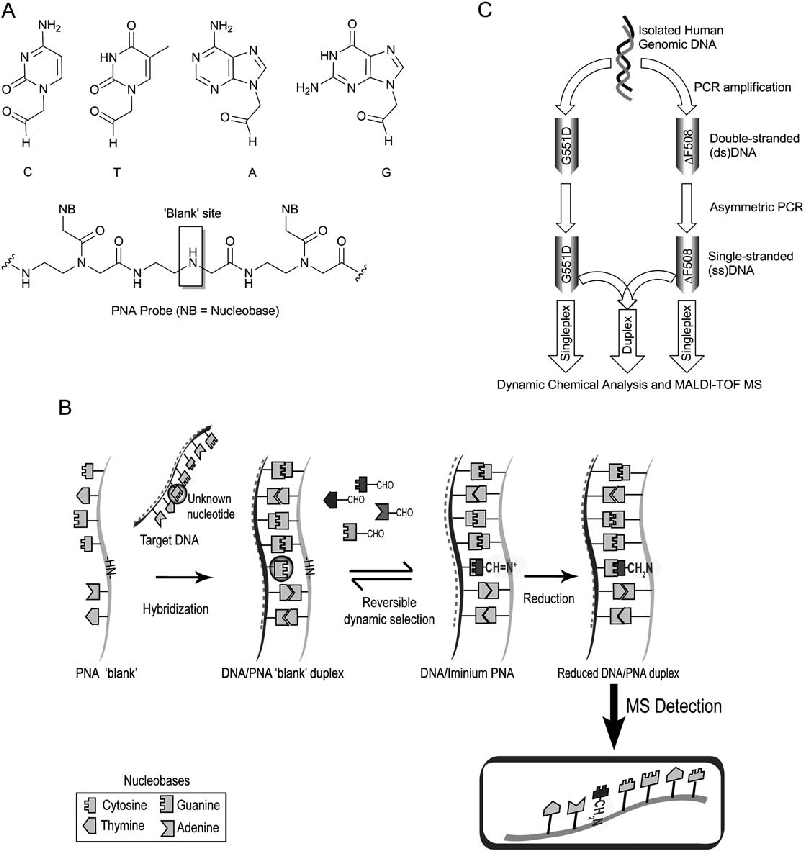
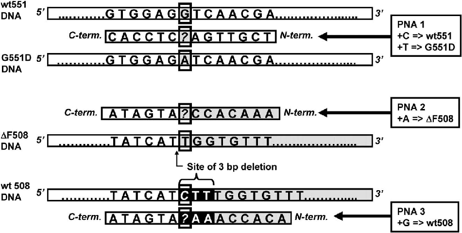
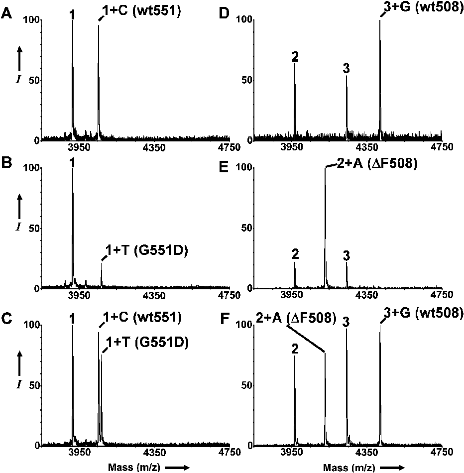
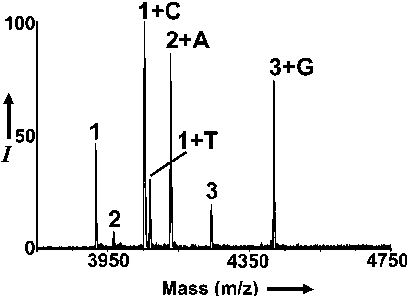

Published on 02 June 2011. Downloaded by Universidad de Granada on 3/3/2024 7:27:45 PM.

View Article Online / Journal Homepage / Table of Contents for this issue

Analytical Dynamic Article LinksC< Methods Cite this: Anal. Methods, 2011, 3, 1656 www.rsc.org/methods PAPER

# Dynamic chemistry for enzyme-free allele discrimination in genotyping by MALDI-TOF mass spectrometry†

Frank R. Bowler,a Philip A. Reid,b A. Christopher Boyd,b Juan J. Diaz-Mochon*a and Mark Bradley*a

Received 24th March 2011, Accepted 19th May 2011 DOI: 10.1039/c1ay05176h

Single nucleotide polymorphisms (SNPs) and insertions/deletions (indels) constitute important sources of genetic variation which provide insight into disease origins and differences in drug responses. The analysis of such genetic variation relies upon the generation of allele-specific products, typically by enzymatic extension or alternatively by the hybridization of DNA probes. MALDI-TOF mass spectrometry (MS) has been widely used as a read-out tool. We developed a distinct enzyme-free, dynamic chemistry-based method of producing allele-specific products for genotyping. In a blind trial, peptide nucleic acid (PNA) probes and aldehyde-modified nucleobases were employed to genotype twelve cystic fibrosis patients for two mutations (one SNP and one indel) linked to this disease. MALDI-TOF MS reported the resulting allele-specific products. Enzyme-free dynamic chemistry permitted the genotyping of twelve individuals for the DF508 (indel) and G551D (SNP) mutations. No false positives or negatives were observed, and analysis could be performed in both singleplex and duplex formats. Dynamic chemistry provides a distinct method of allele discrimination with certain advantages over those reported previously. Although PCR amplification is required, the analysis stage is performed without enzymes, and there is no need for the stringent optimization and control of conditions associated with hybridization-based methods of allele discrimination.

Introduction

Watson–Crick base pairing to template a dynamic reaction on a strand of peptide nucleic acid (PNA; a DNA mimic in which the sugar-phosphate backbone is replaced with N-(2-aminoethyl) glycine).12 This is achieved by hybridizing a PNA probe to the template DNA such that a nucleobase-free position on the PNA (a so-called ‘blank’ position) lies opposite to the nucleotide under interrogation on the DNA strand. The reversible reaction, between an aldehyde-modified nucleobase and a free secondary amine on the PNA probe (Fig. 1A), generates an iminium intermediate which can be reduced and analyzed (Fig. 1B). Four iminium species (one for each base) will be generated, but the one with the correct hydrogen bonding motif (obeying Watson–Crick base-pairing) will be the most stable and this is reflected in the product ratios measured using MALDI-TOF mass spectrometry.

Association studies which attempt to link particular phenotypes with underlying genetic variations have been widely undertaken with a view to understanding the etiology of complex disorders and idiosyncratic differences in drug response.1–4 The most common sources of genetic variation are single nucleotide polymorphisms (SNPs) which involve a one-base change in the genetic code. There are approximately 10 million common SNPs (with a minor frequency (MAF) $ 0.05) in the human genome.5 Of the myriad technologies available for SNP analysis, virtually all require a PCR amplification of the genomic DNA, incorporating, or prior to, some means of allele discrimination.6 A readout tool is then needed to determine genotype. In this regard MALDI-TOF mass spectrometry has emerged as a commonly used detection method with advantages in terms of cost and multiplexing capability.7–10

Although prior work had validated this approach with synthetic DNA,11 the question remained as to whether dynamic chemistry could be reliably applied as a means of allele discrimination for genotyping (both SNPs and indels). To address this, the DNA of individuals (of previously determined genotype) with cystic fibrosis (CF) was analyzed. CF is the most prevalent lethal recessive genetic disease among Caucasians, and arises from mutations in the gene coding for the cystic fibrosis transmembrane regulator (CFTR).13 This 1480-amino-acid protein is responsible for the transport of chloride ions across epithelial cell membranes. Over 800 disease-associated mutations (mostly SNPs) have been found in the CFTR gene, but around two-thirds of CF cases are linked to a single mutation, namely

We recently reported the application of dynamic chemistry to the sequence analysis of synthetic DNA.11 This method harnesses

aSchool of Chemistry, University of Edinburgh, West Mains Road, Edinburgh, UK EH9 3JJ. E-mail: mark.bradley@ed.ac.uk; juan@ destinagenomics.com; Tel: +44(0)131 650 4820

bMedical Genetics Section, Molecular Medicine Centre, Institute of Genetics and Molecular Medicine, University of Edinburgh, Crewe Road, Edinburgh, UK EH4 2XU

† Electronic supplementary information (ESI) available. See DOI: 10.1039/c1ay05176h

Published on 02 June 2011. Downloaded by Universidad de Granada on 3/3/2024 7:27:45 PM.

Fig. 1 Dynamic chemistry as a means of allele discrimination. (A) Structures of the nucleobase-aldehydes and the ‘blank’ section (with neighbouring bases) of a PNA probe. (B) Schematic of the stages involved in the production of allele-specific products prior to mass spectrometric detection. (From F. R. Bowler, J. J. Diaz-Mochon, M. D. Swift and M. Bradley: DNA Analysis by Dynamic Chemistry, Angew. Chem., Int. Ed., 2010, 49, 1809–1812. Copyright Wiley-VCH Verlag GmbH & Co. KGaA, Reproduced with permission).11 (C) PCR steps used to generate single-stranded DNA for analysis.

DF508, which constitutes a 3 base-pair deletion.14,15 This indel was selected as a suitably challenging target to validate the new method, since the loss of 3 bases from the templating DNA necessitates a modification of the original probe design. As a more straightforward test, the G551D CF-linked SNP was also targeted for analysis. This SNP accounts for around 1–2% of CF cases worldwide, and is one of just four mutations other than DF508 which account for >1% of CF s.13

In order to genotype individuals for these mutations, it was anticipated that a PCR step would be required (an earlier protocol had established a detection limit of around 1 picomole for synthetic DNA).11 However, given that canonical PNA (containing all four bases) is unable to invade linear (B-form) double-stranded (ds) DNA,16 a second asymmetric PCR step was planned to generate sufficient single-stranded (ss)DNA for analysis (Fig. 1C). PNA probes were designed to ‘clamp’ the region around the amplified

ssDNA (Table1), selectedtorepresent the sense sequence (the PNA probes were thus antisense, such that the PNA N-terminus lined up with the 30 end of the sense DNA). For the chosen SNP (G551D), this was straightforward as the sequence either side of the point mutation remains constant. However, in the case of the indel (DF508), the removal of 3 bases causes a frameshift which prohibits analysiswithasingleprobe(Fig.2).Thesimplestwaytoaddressthis was to employ two PNA probes for the analysis of DF508 which differed in their N-terminal sequence; one to clamp the wild-type sequence, and one the mutant.

Experimental

Materials

PNA probes were prepared as described previously and characterized by MALDI-TOF mass spectrometry.11 Aqueous

Published on 02 June 2011. Downloaded by Universidad de Granada on 3/3/2024 7:27:45 PM.

Table 1 CF-linked mutations and the corresponding PNA probes Mutation Reference dbSNP Allele Change PNA Probe PNA Sequence (N–C)a Mass (Da)

G551D rs75527207 G / A 1 TCG TTG A_C TCC AC 3916.6 DF508 rs113993960 del CTT 2 AAA CAC C_A TGA TA 3966.6

3 ACA CCA AA_ ATG ATA 4241.8

a ‘_’ represents a blank site. All PNA oligomers were prepared by solid-phase synthesis and had a C-terminal amide and N-terminal triphenylphosphonium charge tag.11 To allow for a possible duplex genotyping of G551D and DF508, the masses of all three PNA probes were chosen to prevent overlap in the mass spectrum.

solutions were prepared and concentrations determined by measuring the absorbance at 260 nm (A260nm) on an Agilent 8453 spectrophotometer using 3260 values of 6.6, 8.6, 13.7, 11.7 and 2.5 mLmmol 1cm 1 for C, T, A, G and the triphenylphosphonium tag respectively.17,18 Aqueous solutions of the aldehydemodified nucleobases C, T, A and G (Fig. 1A) were prepared as reported.11

Human genomic DNA samples

Subjects were identified from the Western General Hospital Adult Cystic Fibrosis Unit database. This database consists of 159 adults with CF; 147 have fully identified genotypes, of whom 17 possess the G551D mutation and 63 are DF508 homozygotes. Inclusion criteria included ability to provide written informed consent. Ethical approval was granted by Lothian Regional Ethics Committee. 13 Patients were approached to participate in the study on attendance at CF outpatient clinic with an invitation letter and patient information sheet. 12 (6 male) agreed to provide a sample. 7 of these were homozygous or heterozygous for G551D and 5 were DF508 homozygotes. The genotyping

reported herein was performed by individuals who were blind to the previously determined patient genotypes. All participants provided written consent before a buccal swab was taken from each using a medical wire (MWE) Dryswab. All swabs were taken by the same CF clinical research fellow (P.A.R.) and stored at -20 C until isolation. Genomic DNA was isolated from buccal swabs using a buccal DNA isolation kit (Isohelix) and kept at -20 C in the storage buffer provided until analysis. The concentrations of DNA in the samples were determined using a GE Healthcare NanoVue.

PCR amplification

PCR primers were selected from a previous publication and purchased from Microsynth.19 Two consecutive PCR amplifications were performed for each mutation; the first to generate dsDNA, followed by an asymmetric PCR (with only a forward primer) to afford ssDNA. For the G551D SNP, primer sequences were: forward 50-CTTGGAGAAGGTGGAATCAC30, reverse 50-AAATGCTTGCTAGACCAATA-30. For the DF508 indel, primer sequences were: forward

Fig. 2 Illustration of the principle for SNP and indel allele discrimination. G551D and wt551 can be distinguished using a single PNA probe (PNA 1); incorporation of C and/or T will indicate the presence of the wild-type and/or mutant s respectively. The frameshift caused by a 3 base-pair deletion means that two probes are required to differentiate DF508 and wt508 s (PNA 2 and 3 respectively). Incorporation of A into PNA 2 indicates DF508, whilst incorporation of G into PNA 3 indicates wt508. ‘?’ denotes the blank position on a PNA probe.

Published on 02 June 2011. Downloaded by Universidad de Granada on 3/3/2024 7:27:45 PM.

50-AGTTTTCCTGGATTATGCCT-30, reverse 50TTGGGTAGTGTGAAGGGTTC -30. PCR amplifications were performed on a Techne TC-312 Thermocycler and all water was nuclease free.

For the first PCR step (final volume, 50 mL), 2 mL of isolated genomic DNA solution was amplified (for DNA concentrations see ESI Table 1; these were not normalized) and reagent concentrations were: 1X PCR mastermix (Promega), 0.4 mM forward and reverse primers. The genomic DNA was replaced with water for negative controls. Cycling conditions were an initial denaturation at 95 C for 3 min, 40 cycles of 95 C for 30 s, annealing at 47 C for 45 s, and extension at 72 C for 45 s, a final extension at 78 C for 5 min, and a final hold at 4 C.

For the subsequent asymmetric PCR (final volume, 50 mL), 3 mL of the first crude PCR mixture was used. Reagent concentrations were: 1X PCR mastermix (Promega), 1 mM forward primer. Negative controls were performed with 3 mL of the negative controls from the first PCR stage. Cycling conditions were identical to the first PCR step. For individual mutation analysis, crude PCR products were purified individually into 28 mL of 10 mM pH 7.4 PBS using a QIAGEN QIAquick PCR purification kit. For duplex analysis, the ssDNA PCR products for both G551D and DF508 were combined and purified together into 28 mL of 10 mM pH 7.4 PBS as above.

Allele discrimination by dynamic chemistry

Prior to use, Q Sepharose Fast Flow (GE Healthcare; 1 mL of a suspension in ethanol) was centrifuged and the supernatant removed. The resin was subsequently washed centrifugally with H2O (1 mL) and 10 mM phosphate buffer, pH 7 (2 1 mL), before resuspending in the same buffer (0.5 mL). Immediately before use, the pre-equilibrated Q Sepharose was agitated to resuspend the resin beads.

Depending upon the analysis (i.e. G551D, DF508 or duplex), the following were added to the purified, amplified DNA (28 mL; see Table 1 for PNA sequences and Fig. 1A for the structures of the nucleobase aldehydes C, T, A and G):

G551D analysis - 1 mL of PNA probe 1 (40 mM), 1.8 mL C (2.2 mM), 7.8 mL T (5.6 mM), and 15.4 mL water.

DF508 analysis - 1 mL of PNA probes 2 and 3 (40 mM), 1.8 mL G (1.7 mM), 7.8 mL A (3.3 mM), and 14.4 mL water.

Duplex G551D and DF508 analysis - 1 mL of PNA probes 1, 2 and 3 (40 mM), 1.8 mL G (1.7 mM), 1.8 mL C (2.2 mM), 7.8 mL T (5.6 mM), 7.8 mL A (3.3 mM), and 3.8 mL water.

The resulting mixtures were heated (in a Techne TC-312 Thermocycler) at 95 C for 5 min, then cooled to 40 C at 3 C/ min. 6 mL of freshly prepared 1M aqueous sodium cyanoborohydride (Acros Organics) was added (final volume 60 mL) and the mixture left at 40 C for 1 h, then 10 mL of pre-treated Q sepharose Fast Flow was added and the mixture left to shake at room temperature (20 C) for 20 min. The resin was then centrifuged, the supernatant removed, and the resin washed centrifugally (for 30 s at 13,000 rpm) with 3% aqueous acetonitrile (3 200 mL; acetonitrile from Fisher Scientific). Finally, 10 mL of sinapic acid matrix (10 mg mL 1 sinapic acid in 50% aqueous acetonitrile with 0.1% TFA; sinapic acid from Fluka, TFA from Acros Organics) was added to the resin, and 1 mL of

the resulting mixture spotted in duplicate directly onto a stainless steel MALDI-TOF plate (Applied Biosystems) for analysis.

MALDI-TOF MS analysis

Mass spectra were recorded on an Applied Biosystems VoyagerDE STR MALDI-TOF MS. Five spectra were recorded for each sample in positive ionization reflector mode (delay 175 ns, 20 kV accelerating voltage, variable laser intensity, typically 200 shots or fewer). The unreacted PNA probe of lowest mass was used as an internal calibrant. Genotypes were determined by both visual inspection of the unprocessed MALDI spectra, and also by input of the peak table data into a Microsoft Excel file (briefly, raw peak table data obtained from the MALDI spectra were analyzed using a LOOKUP formula, which converted numerical peak m/z values within a set range and above a certain intensity threshold into an output genotype). Peaks of relative intensity <5% of the most intense peak were disregarded.

Results

Singleplex genotyping

The genomic DNA used in this study was isolated and purified from buccal swabs using an Isohelix kit. No further purification was performed, and the concentration of DNA was not normalized prior to input into the first PCR cycle. This made no discernable difference to the quality of the final mass spectra, despite the concentration of genomic DNA ranging from 5.5 ng mL 1 to 377 ng mL 1 across the samples (nearly two orders of magnitude; see ESI Table 1). Samples of genomic DNA extracted from the buccal swabs of 12 individuals were genotyped for the CF-linked mutations G551D and DF508. Analysis was performed in singleplex fashion for both mutations (Fig. 1C); five were found to be DF508 homozygotes, four were G551D/DF508 heterozygotes, two were G551D heterozygotes who did not possess the DF508 , and one was a G551D homozygote (for a full list see ESI Table 1). The results were in complete agreement with the known genotypes determined using established technologies. Both ‘manual’ and semi-automated calling (i.e. using Microsft Excel, see decription above) of the resulting MALDI spectra were in agreement in each case. Spectra representative of each genotype are shown in Fig. 3A–F. Peaks were always observed for unreacted PNA probes which were used as internal calibrants. For control reactions in the absence of any DNA template (see ESI Fig. 1A and B), no nucleobase incorporation products were detected.

Mean allelic ratios for heterozygotes (averaged across the 5 spectra recorded for each singleplex analysis) were 0.46 (SD ¼ 0.12; n ¼ 30) for G551D (A/G) and 0.79 (SD ¼ 0.25; n ¼ 20) for DF508 (C/T) analysis. Peaks resulting from DNA-templated incorporation were always >5% relative intensity. No peaks corresponding to nucleobase incorporation were observed with lower intensities, with one exception. In this case, when analyzing a sample for DF508, a peak of mass corresponding to ‘2 + A’ (indicating the presence of the DF508 mutant ) was observed at <5% relative intensity in 3 of the 5 recorded spectra. However, given the low signal strength, the peak was disregarded and the genotype was called as homozygous wild-type. Furthermore,

Published on 02 June 2011. Downloaded by Universidad de Granada on 3/3/2024 7:27:45 PM.

Fig. 3 Representative MALDI-TOF spectra for singleplex genotyping. (A) C incorporation into PNA 1 (1 + C) shows an individual homozygous for the wild-type 551 (wt551). (B) PNA 1 + T shows an individual homozygous for the G551D mutant . (C) PNA 1 + C and 1 + T together show an individual is heterozygous for the G551D mutation. (D) PNA 3 + G shows an individual homozygous for the wt508 . (E) PNA 2 + A shows an individual homozygous for the DF508 mutant . (F) PNA 2 + A and PNA 3 + G together show an individual heterozygous for the DF508 mutation. C, T, A and G incorporation results in a mass increase of 137, 152, 161 and 177 Da respectively. I ¼ Relative intensity (%).

repeat analysis of this sample for DF508 firmly corroborated this assertion (see Fig. 3D)

Duplex genotyping

The duplex analysis of one of the G551D/DF508 heterozygous samples was performed by repeating the singleplex amplification of ssDNA for G551D and DF508, then combining the final crude PCR mixtures and purifying them into a single batch for analysis with all three PNA probes. The resulting mass spectrum permitted clear determination of the genotype for both

mutations (see Fig. 4). Again, a control reaction showed no incorporation in the absence of DNA template (see ESI Fig. 1C). Allelic ratios for this duplex analysis (averaging peak intensities across the 5 spectra) were 0.28 (SD ¼ 0.03; n ¼ 5) for G551D (G/ A) and 0.86 (SD ¼ 0.09; n ¼ 5) for DF508 (C/T).

Discussion

At present there exist four approaches to allele discrimination; primer extension, hybridization, ligation and cleavage. Of these, methods based upon primer extension or the hybridization

Published on 02 June 2011. Downloaded by Universidad de Granada on 3/3/2024 7:27:45 PM.

Fig. 4 Representative MALDI-TOF spectrum for duplex genotyping of G551D and DF508. The spectrum reports an individual heterozygous for both mutations, as peaks are observed for all four possible incorporation products (PNA 1 + C and 1 + T show wt551 and G551D s respectively; PNA 2 + A and PNA 3 + G show DF508 and wt508 s respectively). I ¼ Relative intensity (%).

of -specific oligonucleotide (ASO) probes have become the more widely adopted. Once allele-specific products have been generated, fluorescence detection and mass spectrometry (most often MALDI-TOF) are commonly used as read-out tools. Whilst fluorescence detection has been successfully coupled with hybridization-based methods (for example, in the TaqMan and GeneChip systems marketed by Life Technologies and Affymetrix respectively),6 mass spectrometry assays normally rely upon an enzymatic primer extension approach for allele discrimination. This can involve a single base extension (SBE) with dideoxynucleoside triphosphates (ddNTPs), as used in the PinPoint,20 solid-phase capture (SPC)-SBE,21 iPLEX (Sequenom),22 GenoSNIP 23 and GOOD assays.24,25 Alternatively, multiple base extensions may be obtained through the use of mixtures of ddNTPs and dNTPs which give rise to better mass discrimination between allele-specific products. Examples of such systems include the MassEXTEND (Sequenom)26 and VSET27 assays. A variation on this theme is the NUDGE assay which uses just 3 of the 4 dNTPs to obtain allele-specific products varying in length by more than one nucleotide.28

We now propose that dynamic chemistry be added to the lexicon of methods to generate allele-specific products for genotyping. 12 individuals were successfully genotyped for the G551D and DF508 CF-linked mutations in a blind trial of this approach with no false negatives or positives. Dynamic chemistry was shown to be applicable to the genotyping of SNPs and indels, both in a singleplex and duplex manner. This distinct method holds several advantages over the established allele discrimination assays. Specifically, there is no need for the stringent optimization and control of conditions associated with the hybridization of ASO probes and subsequent washing steps, because the PNA ‘blank’ probes clamp either side of the polymorphic nucleotide position irrespective of the present. When compared to methods which rely upon enzymatic extension for allele discrimination, dynamic chemistry removes the need for an enzyme. This is of particular advantage in assays that use ddNTPs, as these unnatural triphosphates are not incorporated as selectively as dNTPs by natural enzymes, and modified

enzymes are often required to overcome this. Furthermore, assays like iPLEX and SPC-SBE require an additional enzymatic step with shrimp alkaline phosphatase (SAP) to degrade dNTPs before a final extension with a mixture of ddNTPs; dynamic chemistry obviates these enzymatic reactions, with concomitant advantages in terms of cost and analysis time.

When compared to other methods relying upon MALDI-TOF for read-out, dynamic chemical allele discrimination with PNA has an additional advantage over DNA-based assays, in that PNA is particularly well suited to detection by MALDI using matrices suitable for peptide analysis.29,30 DNA and RNA are more difficult to analyze; indeed, the GOOD assay uses an additional alkylation step and a permanent charge tag to address this. The application of PNA to genotyping by MALDI-TOF MS has been reported by others, but these assays used ASO probes for discrimination, with the associated disadvantages touched on above.31

The American College of Medical Genetics recommends testing for a panel of 23 mutations for CF carrier screening, which between them account for the majority of cases.32 The assay reported herein analyzes for two of the more important mutations, which is evidently insufficient for full CF carrier screening. Indeed, a recent test was reported which screened for 108 CF-linked mutations, using enzymatic primer extension and MALDI-TOF MS.33 We do not propose therefore that this assay per se be utilized for this purpose. Instead, we have demonstrated that dynamic chemistry can be applied to the generation of allelespecific products for genotyping, and propose that the scope of this method of allele discrimination merits further investigation. Given a successful duplex analysis, it is reasonable to expect that the multiplex analysis of several mutations will be possible with probes designed to prevent overlap in the mass spectrum. In this respect, peaks due to the presence of unreacted PNA probes can be regarded as an advantage in the sense that they serve as useful internal calibrants. However, they also ‘clutter’ the spectrum, which might limit the number of mutations which could be multiplexed. Although manual or semi-automatic approaches have been used herein for genotype ‘calling’, we envisage that the method of allele discrimination described will be easily addressable using commercially available software for fully automated genotyping (e.g. GenoTools SNP-Manager from Bruker, or Data Explorer from Applied Biosystems).34,35

We have shown that indels can be analyzed by dynamic chemistry if two PNA probes are used. This is a disadvantage when compared to primer extension assays which could achieve this with a single probe. However, indels are much rarer than SNPs in the genome, and the use of an additional probe for each is unlikely to limit the utility of dynamic chemistry for allele discrimination. Furthermore, we hypothesize that indel analysis would be possible with the use of a single probe if universal bases (e.g. hypoxanthine) were built in to the N-terminal side of the ‘blank’ position of the PNA.36 A second alternative could involve incorporation of the ‘blank’ site directly at the N-terminus, but this has been shown to give poorer dynamic selection by others investigating dynamic chemistry on PNA/PNA duplexes.37

The mean allelic peak ratios for the heterozygous individuals genotyped in this study differed substantially from unity. However, the detection of an incorporation product clearly signified the presence of the associated , so we saw no need to

Published on 02 June 2011. Downloaded by Universidad de Granada on 3/3/2024 7:27:45 PM.

address this. We have shown previously in model systems, however, that the peak ratios for ‘heterozygotes’ can be brought closer to unity by varying the initial concentrations of the aldehyde-modified nucleobases. The allelic ratio showed greater variation for DF508 analysis than for G551D. This is to be expected given the additional probe needed for indel detection, and we would anticipate it to be more difficult to improve the peak ratios by altering aldehyde concentrations in this case.

MALDI-TOF allows direct read-out of allele-specific products for multiplex genotyping. However, we see no reason why dynamic chemistry would not also be amenable to indirect fluorescence detection using labelled nucleobase aldehydes, so long as the hydrogen bonding motif is still available for selection through Watson–Crick base-pairing. Furthermore, we hypothesize that the method for allele discrimination reported herein could be readily extended to direct RNA analysis, without the need for reverse transcription into cDNA libraries. RNA provides a source of single stranded nucleic acid for analysis by PNA probes, and PNA/RNA hybridization has been reported widely.38

The assay described here relies upon polymerase chain reaction (PCR), with all of its inherent problems, for DNA amplification.39 Since nucleobase incorporation will only occur in the presence of templating DNA, any false positives or negatives will arise from the enzymatic amplification stage. However, this dependence on PCR is shared by virtually all genotyping technologies currently available. A notable exception is the INVADER assay,40 although it is important to note that this method requires the input of an often prohibitively large amount of genomic DNA.41 The need for ssDNA necessitates an additional step, although one which is also a drawback for other assays. An example is the SPC-SBE method, which overcomes this through the use of biotinylated primers and expensive streptavidin-functionalized solid supports. Asymmetric PCR may be performed in a single step as opposed to the two reported here,42 although multiplex asymmetric PCR is harder to achieve. Direct analysis of dsDNA may be possible through the use of conditions which favour PNA/DNA over DNA/DNA hybridization (such as low salt concentrations),43 or modifications to the PNA backbone which have been shown to result in helical pre-organization of the PNA to favour duplex invasion.16

The need for a PCR step in genotyping by dynamic chemistry is dependent on the sensitivity of the detection method and the concentration of the templating nucleic acid. We foresee, for example, that a realistic improvement in the detection limit to the femtomole level would allow direct profiling of the more highly expressed miRNAs by this dynamic chemical approach.44

Acknowledgements

The authors thank Dr Michael D. Swift for assistance during the isolation of several of the genomic DNA samples, and Mr. Hugh Ilyine for his continuing support.

References

- 1 X. Ke, M. S. Taylor and L. R. Cardon, Eur. J. Hum. Genet., 2008, 16, 506–515.
- 2 A. C. Syvanen, Nat. Genet., 2005, 37, Suppl, S5–10.

- 3 M. Eichelbaum, M. Ingelman-Sundberg and W. E. Evans, Annu. Rev. Med., 2006, 57, 119–137.
- 4 J. C. Barrett and L. R. Cardon, Nat. Genet., 2006, 38, 659– 662.
- 5 K. A. Frazer, D. G. Ballinger, D. R. Cox, D. A. Hinds, L. L. Stuve,

- R. A. Gibbs, J. W. Belmont, A. Boudreau, P. Hardenbol, S. M. Leal,
- S. Pasternak, D. A. Wheeler, T. D. Willis, F. Yu, H. Yang, C. Zeng, Y. Gao, H. Hu, W. Hu, C. Li, W. Lin, S. Liu, H. Pan, X. Tang, J. Wang, W. Wang, J. Yu, B. Zhang, Q. Zhang, H. Zhao, H. Zhao,

- J. Zhou, S. B. Gabriel, R. Barry, B. Blumenstiel, A. Camargo, M. Defelice, M. Faggart, M. Goyette, S. Gupta, J. Moore, H. Nguyen, R. C. Onofrio, M. Parkin, J. Roy, E. Stahl, E. Winchester, L. Ziaugra, D. Altshuler, Y. Shen, Z. Yao, W. Huang, X. Chu, Y. He, L. Jin, Y. Liu, Y. Shen, W. Sun, H. Wang, Y. Wang, Y. Wang, X. Xiong, L. Xu, M. M. Waye,

- S. K. Tsui, H. Xue, J. T. Wong, L. M. Galver, J. B. Fan,

K. Gunderson, S. S. Murray, A. R. Oliphant, M. S. Chee,

- A. Montpetit, F. Chagnon, V. Ferretti, M. Leboeuf, J. F. Olivier,

- M. S. Phillips, S. Roumy, C. Sall ee, A. Verner, T. J. Hudson, P. Y. Kwok, D. Cai, D. C. Koboldt, R. D. Miller, L. Pawlikowska, P. Taillon-Miller, M. Xiao, L. C. Tsui, W. Mak, Y. Q. Song, P. K. Tam, Y. Nakamura, T. Kawaguchi, T. Kitamoto,

T. Morizono, A. Nagashima, Y. Ohnishi, A. Sekine, T. Tanaka, T. Tsunoda, P. Deloukas, C. P. Bird, M. Delgado, E. T. Dermitzakis, R. Gwilliam, S. Hunt, J. Morrison, D. Powell, B. E. Stranger, P. Whittaker, D. R. Bentley, M. J. Daly, P. I. de Bakker, J. Barrett, Y. R. Chretien, J. Maller, S. McCarroll,

- N. Patterson, I. Pe’er, A. Price, S. Purcell, D. J. Richter, P. Sabeti,

- R. Saxena, S. F. Schaffner, P. C Sham, P. Varilly, D. Altshuler,

L. D. Stein, L. Krishnan, A. V. Smith, M. K. Tello-Ruiz,

- G. A. Thorisson, A. Chakravarti, P. E. Chen, D. J. Cutler,

C. S. Kashuk, S. Lin, G. R. Abecasis, W. Guan, Y. Li,

- H. M. Munro, Z. S. Qin, D. J. Thomas, G. McVean, A. Auton, L. Bottolo, N. Cardin, S. Eyheramendy, C. Freeman, J. Marchini,

- S. Myers, C. Spencer, M. Stephens, P. Donnelly, L. R. Cardon,

- G. Clarke, D. M. Evans, A. P. Morris, B. S. Weir, T. Tsunoda, J. C. Mullikin, S. T. Sherry, M. Feolo, A. Skol, H. Zhang, C. Zeng,
- H. Zhao, I. Matsuda, Y. Fukushima, D. R. Macer, E. Suda, C. N. Rotimi, C. A. Adebamowo, I. Ajayi, T. Aniagwu, P. A. Marshall, C. Nkwodimmah, C. D. Royal, M. F. Leppert,

M. Dixon, A. Peiffer, R. Qiu, A. Kent, K. Kato, N. Niikawa,

- I. F. Adewole, B. M. Knoppers, M. W. Foster, E. W. Clayton,
- J. Watkin, R. A. Gibbs, J. W. Belmont, D. Muzny, L. Nazareth,

- E. Sodergren, G. M. Weinstock, D. A. Wheeler, I. Yakub, S. B. Gabriel, R. C. Onofrio, D. J. Richter, L. Ziaugra, B. W. Birren, M. J. Daly, D. Altshuler, R. K. Wilson, L. L. Fulton, J. Rogers, J. Burton, N. P. Carter, C. M. Clee, M. Griffiths, M. C. Jones, K. McLay, R. W. Plumb, M. T. Ross, S. K. Sims,

D. L. Willey, Z. Chen, H. Han, L. Kang, M. Godbout, J. C. Wallenburg, P. L’Archev^eque, G. Bellemare, K. Saeki, H. Wang, D. An, H. Fu, Q. Li, Z. Wang, R. Wang, A. L. Holden, L. D. Brooks, J. E. McEwen, M. S. Guyer, V. O. Wang, J. L. Peterson, M. Shi, J. Spiegel, L. M. Sung, L. F. Zacharia,

- F. S. Collins, K. Kennedy, R. Jamieson and J. Stewart, Nature, 2007, 449, 851–861.

- 6 S. Kim and A. Misra, Annu. Rev. Biomed. Eng., 2007, 9, 289–320.
- 7 J. Tost and I. G. Gut, Clin. Biochem., 2005, 38, 335–350.
- 8 S. Sauer, J. Biochem. Biophys. Methods, 2007, 70, 311–318.
- 9 J. Tost and I. G. Gut, Mass Spectrom. Rev., 2002, 21, 388–418.
- 10 J. Ragoussis, G. P. Elvidge, K. Kaur and S. Colella, PLoS Genet., 2006, 2, e100.
- 11 F. R. Bower, J. J. Diaz-Mochon, M. D. Swift and M. Bradley, Angew. Chem., Int. Ed., 2010, 49, 1809–1812.
- 12 P. E. Nielsen, M. Egholm, R. H. Berg and O. Buchardt, Science, 1991, 254, 1497–1500.
- 13 M. J. Welsh, B. W. Ramsey, F. Accurso and G. R. Cutting, in The Metabolic and Molecular Bases of Inherited Diseases, ed. C. R. Scriver, A. L. Beaudet, W. S. Sly and D. Valle, McGraw-Hill, New York, 8th edn., 2001, vol. 3, ch. 21, pp. 5121–5188.
- 14 D. C. Gadsby, P. Vergani and L. Csanady, Nature, 2006, 440, 477– 483.
- 15 J. R. Riordan, J. M. Rommens, B.-S. Kerem, N. Alon, R. Rozmahel, Z. Grzelczak, J. Zielenski, S. Lok, N. Plavsic, J.-L. Chou, M. L. Drumm, M. C. Iannuzzi, F. S. Collins and L.-C, Science, 1989, 245, 1066–1072.

Published on 02 June 2011. Downloaded by Universidad de Granada on 3/3/2024 7:27:45 PM.

- 16 G. He, S. Rapireddy, R. Bahal, B. Sahu and D. H. Ly, J. Am. Chem. Soc., 2009, 31, 12088–12090.
- 17 M. Egholm, T. Bentin and P. E. Nielsen, in Peptide Nucleic Acids: Protocols and Applications, ed. P. E. Nielsen, Horizon Bioscience, Wymondham, 2004, p. 308.
- 18 A. Muratovska, R. N. Lightowlers, R. W. Taylor, D. M. Turnbull, R. A. J. Smith, J. A. Wilce, S. W. Martin and M. P. Murphy, Nucleic Acids Res., 2001, 29, 1852–1863.
- 19 N. Thelwell, S. Millington, A. Solinas, J. Booth and T. Brown, Nucleic Acids Res., 2000, 28, 3752–3761.
- 20 L. A. Haff and I. P. Smirnov, Genome Res., 1997, 7, 378–388.
- 21 S. Kim, J. R. Edwards, L. Deng, W. Chung and J. Ju, Nucleic Acids Res., 2002, 30, e85.
- 22 S. Gabriel, L. Ziaugra and D. Tabbaa, Curr. Protoc. Hum. Genet., 2009, 60, 2.12.1–2.12.18.
- 23 T. Wenzel, T. Elssner, K. Fahr, J. Bimmler, S. Richter, I. Thomas and M. Kostrzewa, Nucleosides, Nucleotides Nucleic Acids, 2003, 22, 1579–1581.
- 24 S. Sauer, D. H. Gelfand, F. Boussicault, K. Bauer, F. Reichert and

I. G. Gut, Nucleic Acids Res., 2002, 30, e22.

- 25 S. Sauer, D. Lechner, K. Berlin, H. Lehrach, J.-L. Escary, N. Fox and

- I. G. Gut, Nucleic Acids Res., 2000, 28, e13.

26 K. H. Buetow, M. Edmonson, R. MacDonald, R. Clifford, P. Yip,

- J. Kelley, D. P. Little, R. Strausberg, H. Koester, C. R. Cantor and A. Braun, Proc. Natl. Acad. Sci. U. S. A., 2001, 98, 581–584.

- 27 X. Sun,H. Ding, K. Hung andB.Guo,Nucleic Acids Res., 2000, 28, e68.
- 28 T. Blondal, B. G. Waage, S. V. Smarason, F. Jonsson, S. B. Fjalldal, K.Stefansson,J.GulcherandA.V.Smith,NucleicAcidsRes.,2003,31,e155.
- 29 J. M. Butler, P. Jiang-Baucom, M. Huang, P. Belgrader and J. Girard, Anal. Chem., 1996, 68, 3283–3287.
- 30 O. Bauer, A. Guerasimova, S. Sauer, S. Thamm, M. Steinfath, R. Herwig, M. Janitz, H. Lehrach and U. Radelof, Rapid Commun. Mass Spectrom., 2004, 18, 1821–1829.

- 31 B. Boontha, J. Nakkuntod, N. Hirankarn, P. Chaumpluk and T. Vilaivan, Anal. Chem., 2008, 80, 8178–8186.
- 32 W. W. Grody, G. R. Cutting and M. S. Watson, Genet. Med., 2007, 9, 739–744.
- 33 D. H. Farkas, N. E. Miltgen, J. Stoerker, D. van den Boom, W. E. Highsmith, L. Cagasan, R. McCullough, R. Mueller, L. Tang, J. Tynan, C. Tate and A. Bombard, J. Mol. Diagn., 2010, 12, 611–619.
- 34 W. Pusch, K.-O. Kraeuter, T. Froehlich, Y. Stalgies and M. Kostrzewa, Biotechniques, 2001, 30, 210–215.
- 35 S. Paracchini, B. Arredi, R. Chalk and C. Tyler-Smith, Nucleic Acids Res., 2002, 30, e27.
- 36 X. Sun and J. K. Lee, J. Org. Chem., 2010, 75, 1848–1854.
- 37 J. M. Heemstra and D. R. Liu, J. Am. Chem. Soc., 2009, 131, 11347– 11349.
- 38 M. Egholm, O. Buchardt, L. Christensen, C. Behrens, S. M. Freier, D. A. Driver, R. H. Berg, S. K. Kim, B. Norden and P. E. Nielsen, Nature, 1993, 365, 566–568.
- 39 F. Pompanon, A. Bonin, E. Bellemain and P. Taberlet, Nat. Rev. Genet., 2005, 6, 847–859.
- 40 J. G. Hall, P. S. Eis, S. M. Law, L. P. Reynaldo, J. R. Prudent, D. J. Marshall, H. T. Allawi, A. L. Mast, J. E. Dahlberg, R. W. Kwiatkowski, M. de Arruda, B. P. Neri and V. I. Lyamichev, Proc. Natl. Acad. Sci. U. S. A., 2000, 97, 8272– 8277.
- 41 Y. Ohnishi, T. Tanaka, K. Ozaki, R. Yamada, H. Suzuki and Y. Nakamura, J. Hum. Genet., 2001, 69, 471–477.
- 42 J. A. Sanchez, K. E. Pierce, J. E. Rice and L. J. Wangh, Proc. Natl. Acad. Sci. U. S. A., 2004, 101, 1933–1938.
- 43 H. Perry-O’Keefe, X.-W. Yao, J. M. Coull, M. Fuchs and M. Egholm, Proc. Natl. Acad. Sci. U. S. A., 1996, 93, 14670–14675.
- 44 J. M. Lee, H. Cho and Y. Jung, Angew. Chem., Int. Ed., 2010, 49, 8662–8665.

