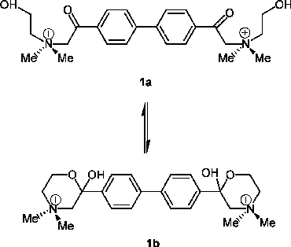
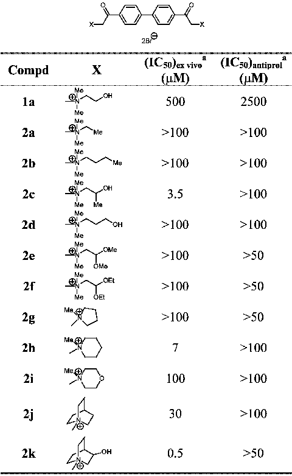
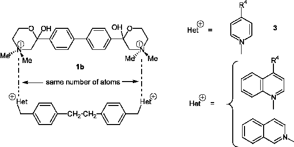
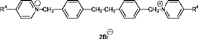
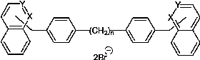
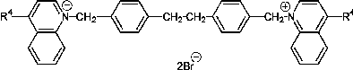

Il Farmaco 58 (2003) 221 /229

www.elsevier.com/locate/farmac

# Anticancer bisquaternary heterocyclic compounds: a ras-ional design

Joaquı´n Campos*, Carmen Nu´n˜ez, Juan J. Dı´az, Rosario M. Sa´nchez, Miguel A. Gallo, Antonio Espinosa

Departamento de Quı´mica Farmace´utica y Orga´nica, Facultad de Farmacia, Universidad de Granada, c/ Campus de Cartuja, s/n 18071 Granada, Spain Accepted 4 July 2002

Abstract

A new family of symmetrical bisquaternary compounds with semirigid linkers have shown to be highly specific for Choline Kinase (ChoK) inhibition and to exert antitumoural activity in cell lines and in mice. A three-parameter regression equation has been derived which satisfactorily describes the ex vivo inhibitory potency of ChoK of the title compounds. The electronic effect of the group at position 4 of the cationic head plays a critical role although the hydrophobic contribution, especially that of the linker, favors the ChoK inhibitory activity. The antiproliferative activity (in vitro assay) is correlated with the ChoK inhibition (ex vivo assay) through the electronic effect and a squared term of the overall lipophilicity of the molecules. We also provide in vivo evidence that ChoK is a novel target for the design of antitumoural drugs. All these results suggest that ChoK plays a crucial role in the onset of carcinogenesis.

# 2003 E´ditions scientifiques et me´dicales Elsevier SAS. All rights reserved.

Keywords: Choline kinase; HT-29; Bisquaternary heterocyclic compounds; QSAR; sR and sR parameters

- 1. Introduction

Cancer is one of the most formidable afflictions in the world. Despite immense advances in the field of basic and clinical research, which have resulted in higher cure rates for a number of malignancies, cancer remains one of the leading causes of death in the Western world [1,2]. Although cancer mortality is second to heart disorders, the first is steadily increasing, while the latter is leveling off.

The ease and success of finding better drugs for any illness depend upon how best we can rationalize the design of the drugs. The rational design of an agent with specific activity towards a selected target requires this objective to be so precisely defined that it can be hit selectively in the presence of other identical or similar targets. Increasing knowledge of the biological complexities of cancer and the molecular genetic defects underlying tumorigenesis has provided new opportunities for rational anticancer drug discovery and development. By focusing on the primary genetic alterations in cancer

* Corresponding author. E-mail address: jmcampos@ugr.es (J. Campos).

cells there is a greater likehood that the biological effects of drugs against these targets will be confined to the tumor cells rather than affecting both tumor and normal cell processes (biological specificity) [3].

1.1. Ras signal transduction

The development of human cancer is thought to be the result of mutations in multiple genes that control normal cell proliferation, differentiation and apoptosis. Genes that are often found mutated in malignancies are referred to as proto-oncogenes. Activation of these proto-oncogenes to oncogenes and/or the loss of function of tumor suppressor genes may cause deranged intracellular signaling [2,4]. One of the most commonly altered gene products in human solid tumors include Ras proteins. The ras (an acronym for rat sarcoma, the source of the prototypic viral gene) gene encodes 21kDa proteins, which play an important role in signal transduction. They pass on stimuli from external growth factors to the cell nucleus in a process, which is called signal transduction. Cells respond to extracellular mitogenic signals during the first (G1) phase of the cell cycle [2,5,6]. Ras mutations, which are found in approxi-

0014-827X/03/$ - see front matter # 2003 E´ ditions scientifiques et me´dicales Elsevier SAS. All rights reserved. doi:10.1016/S0014-827X(03)00020-X

mately 25% of all human malignancies, lead to an increase in cell proliferation and tumor formation [7,8].

- 1.2. ChoK: a precursor of second messengers

Choline kinase (ChoK), a cytosolic enzyme present in various tissues, catalyses the phosphorylation of choline to form phosphorylcholine (PCho). ChoK has recently gained attention as a potential relevant component in signaling pathways involved in the regulation of cell growth. This latter function was noticed by the discovery of elevated levels of PCho in cells transformed by ras oncogenes [9]. It has been demonstrated that the generation of PCho from choline by ChoK is an essential process for growth factors, such as plateletderived growth factor (PDGF) or fibroblast growth factor (FGF), to exert their mitogenic action in mouse fibroblasts [10]. This conclusion is based on the fact that growth factors are unable to stimulate DNA synthesis if ChoK is inhibited. Furthermore, the exogenous addition of PCho, the product of ChoK activity, has mitogenic activity in murine fibroblasts [11].

- 1.3. The role of ChoK in the carcinogenesis process

The evidence that ChoK and PCho play a role in malignant transformation comes from the demonstration that ras-transformed cell lines show higher PCho levels than their normal counterparts as a consequence of an increased ChoK activity [10]. Evidence for a role of PCho in cell transformation and tumourigenesis comes from NMR studies performed in human tumors [12].

Hemicholinium-3 (HC-3, 1), a choline homologue, has been described as a ChoK inhibitor in in vitro studies using immortalized cell lines (IC50 /600 mM) in intact mammalian cells [10]. Nevertheless, HC-3 has a potent inhibitory effect on the high-affinity choline transport system with drastic toxic effects on cholinergic nerve terminals [13]. Since HC-3 has a potent paralyzing respiratory effect, it is a poor candidate for use in the clinic. Furthermore, HC-3 induces non-specific effects on signaling pathways that can be overcome with more specific molecules [10]. However, in spite of its negative effects, HC-3 has been used as a model structure for the further development of more active and specific ChoK inhibitors.

- 2. Results and discussion 2.1. Design considerations

The HC-3, 1 structure contains a central biphenyl system to which two choline-like chains containing the quaternary groups are attached. HC-3 was represented

Fig. 1. Acyclic bis(hydroxycarbonyl) and cyclic bis(hemiketal) forms of hemicholinium-3 (HC-3).

in early literature as structure 1a (Fig. 1). However, interpretation of infrared spectral data led Schueler [14] to conclude that this compound exists as the bishemiketal 1b (Fig. 1).

In the daily practice of medicinal chemistry, the analogical approach is currently used, in which the global complexity of the system is not affected and generally yields close analogues (or ‘me-too’ compounds) of the original active principle. Several modifications have been carried out on the cationic heads of the prototype HC-3, 1a yielding symmetrical hemicholinium-like derivatives with the bisphenacyl moiety linking several ammonium groups (2a /k). Table 1 summarizes the structures of these open-chain-’me-too’ compounds in order to test the significance of the tautomer 1a in its inhibitory action against ChoK. All the modifications affect the hydroxyethyl moiety bearing the quaternary nitrogen atoms and are essentially the following:

- a) Oxidation level of the hydroxylated carbon (2a, 2b, 2e and 2f).
- b) Its length and/or the presence of branching (2c, 2d).
- c) Finally, compounds 2g /k show the substitution of the lateral chain of the prototype 1a by a five- or sixmembered saturated heterocycle (2g /i) or by a bicyclic system (2j /k).

The analysis of the effect of the defined modifications of the HC-3, 1a structure was tested in an ex vivo system using a purified ChoK preparation from yeast as a target. The deduced sequence comprises 582 aminoacid residues with a molecular mass of 66316 Da and bears local sequence similarity to various protein kinases and bacterial antibiotic phosphotransferases [15]. The antiproliferative activity has been determined with the HT29 human cell line, a colon cancer that is resistant to chemotherapy and that expresses multidrug resistance (MDR). The MDR phenomenon has been shown to be

- Table 1 Structure and biological results for symmetrical compounds 1 and 2

a All values are the mean of two independent determinations performed in duplicate.

associated with reduced drug accumulation, which has been attributed to two different phenomena. One involves drug extrusion by an energy-dependent efflux pump that is more effective in resistance cells [16]. The other mode of action suggests the existence of an energydependent permeability barrier, which effectively restricts drug entry into the cells [17].

Between the eleven compounds tested (Table 1), the 1,1?-[biphenyl-4,4?-bis(carbonylmethyl)]bis-(3-hydroxyquinuclidinium) dibromide 2k was the most active compound so far described [10]. It is 1000-fold more active than HC-3, 1 (IC50 /0.5 mM against ChoK; IC50 /500 mM of HC-3, 1). The presence of the hydroxy group is not necessary for the molecular recognition between the enzyme and its ligand, because 1,1?-[biphenyl-4,4?-bis(carbonylmethyl)]bis(quinuclidinium) dibromide 2j shows an IC50 /30 mM, although its presence

notably increases the inhibitory activity against ChoK. Nevertheless 2k, the most active compound against ChoK, shows a nearly null antiproliferative activity against the HT-29 human cell line (IC50 /50 mM). Possibly, the compound is not lipophilic enough to cross the cytosolic membranes.

We then decided to modify more drastically both the spacer and the two cationic heads of the prototype: maintaining the bisquaternary character of the newly synthesized molecules, the 1,4-oxazonium moieties of HC-3, 1 were changed for the more lipophilic pyridinium [18], quinolinium and isoquinolinium rings. Furthermore, in order to keep the number of atoms between the two positive-charged nitrogen atoms of the cyclocetalic form of HC-3, 1 we used the 1,2-ethylene(bisbenzyl) moiety as a linker. If the substituents of the pyridinium moieties are located at position 4, the aromatic system allows the study of the electronic influence between them and the positive charge (Fig. 2).

Afterwards, the modification of the spacer connecting the two cationic heads (by modifying the number of methylene groups between the two phenyl rings) was carried out (see Table 3).

The QSAR study tries to explain the variations observed in the biological activities of a group of congeners in terms of molecular variations caused by a change of the substituents. Two important applications of QSAR studies can be stated: the predictive aspect1 and the diagnostic one. The former deals with the extrapolation and interpolation of a correlation study and the latter answers mechanistic aspects.

2.2. The predictive aspect

Table 2 shows the structure, biological results and clog P values for compounds 3. clog P Values were calculated by using the Ghose /Crippen modified atomic contribution system [19] (ATOMIC5 option) of the PALLAS 2.0 programme.2 In a recent publication [20] we have estimated by 13C NMR spectroscopy the previously unknown sR and sR descriptors for the diallylamino, pyrrolidino, piperidino and perhydroazepino groups in a simple, fast and reproducible manner.

The substituents at position 4 of the pyridinium moiety were electron-releasing, neutral or electron-withdrawing groups (negative values of sR and sR denote

- 1 Although sometimes taken as a criterion, prediction is not the

primary goal of QSAR analyses. It is results from interpolation, it is often trivial; if extrapolation goes too far outside the included parameter space, it usually fails. QSAR helps to understand structure /activity relationship in a quantitative manner to find the borders of certain properties.

- 2 PALLAS FRAME MODULE, a prediction tool of

physicochemical parameters, is supplied by CompuDrug Chemistry, Ltd, PO Box 23196, Rochester, NY 14692, USA.

Fig. 2. Molecular variations carried out on the cyclic bis(hemiketal) form of hemicholinium-3 (HC-3).

the electron-donating character and positive value, the electron-withdrawing character of the substituent). To start with, the selection of the substituents to be introduced in position 4 of the pyridinium nucleus was dictated by criteria of minimum effort and maximum informative content. Following this line, we chose the smallest number of easily synthetically accessible compounds which could give the maximum spread and orthogonality of the main physicochemical properties, i.e. the electronic and hydrophobic ones. From the results obtained it is clear that the presence of electron-

withdrawing groups ( /COOH, 3e and /CN, 3f) leads to inactive compounds as ChoK inhibitors. Although the exact (IC50)ex vivo value of 3f is not available, follows the general trend from a qualitative point of view. On the other hand, the presence of a strong electron-releasing group seems to be important, since the electron-neutral bearing compounds (3c and 3d) are less potent than 3a. The amino ( /NH2) group participates in the delocalization of the ring charge, and makes a substantial contribution for ChoK inhibitory activity. Its replacement by other groups and QSAR on the resultant

- Table 2

- Structure, biological results and parameter values for compounds 3

Comp R4 (IC50)ex vivo (mM) a (IC50)antiprol (mM) a sR b sR c clog P d pR4 e

- 3a /NMe2 17.0 2.00 /0.88 /1.22 /2.83 0.18 f

- 3b /NH2 23.0 4.00 /0.80 /1.10 /4.67 /1.23 f
- 3c /CH2OH 100 /100 /0.07 /0.15 /4.25 /1.03 f
- 3d /CH3 100 20.0 /0.16 /0.25 /1.82 0.56 f
- 3e /COOH 136.7 /1000 0.11 g /3.50 /0.32 f
- 3f /C˜/?N /1000 200 0.08 0.13 /3.15 /0.57 f
- 3g /N(Allyl)2 17.0 0.55 /0.80 h /1.09 h /0.44 1.34 e
- 3h /NC4H8 i 20.0 1.00 /0.85 h /1.16 h /1.94 0.59 e 3I /NC5H10 j 9.60 0.40 /0.89 h /1.21 h /0.93 0.85 e

- 3j /NC6H12 k 15.0 0.40 /0.86 h /1.18 h 0.09 1.60 e
- 3k /NmePh 6.4 0.34 /0.78 h /1.07 h 0.37 1.67 e

- a All values are the mean of two independent determinations performed in duplicate.
- b sR: Electronic parameter for resonance effects (ref. [21]).
- c sR : Electronic parameter where a positive charge is delocalized between substituent and reaction center via ‘through resonance’ (ref. [21]).
- d Predicted by using the Ghose /Crippen modified atomic contribution system (ATOMIC5 option, ref. [19]) of the PALLAS 2.0 programme.
- e pR4 /clog PR4 /clog PH; clog P values have been calculated using the CDR option of PALLAS 2.0 programme.
- f see ref. [22].
- g Not available.
- h These values were estimated by 13C NMR spectroscopy (see ref [20]).
- i Pyrrolidino.
- j Piperidino.
- k Perhydroazepino.

- Table 3 Structures, activity data and parameter used for the derivation of the QSAR Eq. (8)

Comp X Y n (IC50)ex vivo (mM) a (IC50)antiprol (mM) a clog P b

- 4a /N / /CH / 0 50 10 /0.71
- 4b /N / /CH / 1 100 6.02 /0.86
- 4c /N / /CH / 2 34 4 /0.43
- 4d /N / /CH / 3 9 2.5 0.08
- 4e /CH / /N / 0 /100 ND c /0.85
- 4f /CH / /N / 1 60 20 /1.00
- 4g /CH / /N / 2 60 20 /0.57
- 4h /CH / /N / 3 20 2 /0.06

- a All values are the mean of two independent determinations performed in duplicate.
- b Predicted by using the Ghose /Crippen modified atomic contribution system (ATOMIC5 option, ref. [19]) of the PALLAS 2.0 programme.
- c ND: Not determined.

compounds suggests that an electronic effect remains the prime factor, probably via delocalization of the positive charge of the pyridinium ring. When replaced by the dimethylamino ( /NMe2) group (compound 3a) it does not lose potency. It is clear that the more electronreleasing that R4 is, the more potent is the compound. In principle this result seems contradictory: the essential positive charge on the nitrogen will be increased by the electron-withdrawal by the substituents, and thus, the interaction of nitrogen with a putative anionic site of the enzyme will be increased. We will explain this apparent inconsistency in the ‘Section 2.3. The diagnostic aspect’. The inhibitory potency of the compounds does correlate with the resonance effect of R4. This is consistent with conventional chemical concepts. R4 is in direct conjugation with the positively charged ring nitrogen. The greater resonance effect of R4 would obviously cause better delocalization of the positive charge. This trend can be quantified using the resonance electronic effect of R4, sR [21,22]:

p(IC50)ex vivo 3:92(90:00) 0:92(90:06)sR

n 5; r 0:994; s 0:052; F1;3 250:13 (significance at aB0:001) (1)

where, pIC50 / /log IC50, bearing in mind that the higher the value of pIC50 the more potent is the compound, n is the number of compounds, r is the correlation coefficient, s is the standard deviation, F is the F ratio between the variances of observed and calculated activities, and data within parentheses are standard errors of estimate.

On the other hand, the correlation between the

inhibitory potency and the descriptor sR [21,22] is to be studied (eq 2):

p(IC50)ex vivo 3:85(90:04) 0:73(90:04)sR n 4; r 0:996; s 0:042; F1;2

281:06 (significance at aB0:001) (2)

The parameter sR was defined for systems where a positive charge is delocalized between substituent and reaction center via ‘through resonance’. Eqs 1 and 2 represent highly significant correlations. Though the number of data points is small, the high correlation coefficients establish the importance of electronic characters (sR and sR ) of the substituents. Accordingly, substituents with higher or similar electron-releasing effects than the /NH2 and /NMe2 groups were sought. Therefore, an acyclic amino group such as the diallylamino one, and endocyclic amino groups such as the pyrrolidino, piperidino, and perhydroazepino moieties, could exert a favorable electron-releasing effect [20]. Even the N-methylanilino group was tried [20]. Moreover their higher lipophilicities compared with those of the /NH2 and /NMe2 groups will help in the antiproliferative activities of even more potent compounds [20]. All the compounds showed in Table 2 give rise to eqs 3 and 4:

p(IC50)ex vivo 3:92(90:11) 1:09(90:15)sR n 10; r 0:928; s 0:181; F1;8

49:78 (significance at aB0:001) (3) p(IC50)ex vivo 3:84(90:16) 0:87(90:16)sR n 9; r 0:896; s 0:194; F1;7

28:53 (significance at aB0:001) (4) The quality of the two eqs 3 and 4 is similar and this is

largely due to the high collinearity between sR and sR [r /0.999 for the groups shown in Table 2, n /9].

Accordingly, eq 3 is preferred since it has a slightly better standard deviation (s) and in all the following reasoning we will quantify the electronic properties of the R4 group with the sR parameter.

- 2.3. The diagnostic aspect

Details of the chemistry of drug /enzyme interactions are usually not known; hence, the type of parameter needed to model this interaction is not properly defined. The electronic influence of R4 on 3 alters its charge distribution (data not shown) and molecular orbital (MO) energies. During the past three decades most of the QSARs derived for biological systems have relied on the use of Hammett-type s constants to account for electronic variation associated with changes in molecular structure. As a result, these studies have often been limited to sets of congeners that could be treated by using Hammett-type substituent constants. Moreover, the Hammett constants do not reflect which portion of the drug molecule would actually be involved in the interaction with the enzyme. A quantum chemical treatment of electronic effects does provide some help in this direction and is potentially more powerful than the Hammett-type approach since it allows greater flexibility in the construction of the data set. Thus, MO calculations were made [23]. To simplify the computational problem, the calculations were made on model compounds consisting of only one of the two substituted pyridinium moieties and in which the spacer between the two charged nitrogen atoms was replaced by a methyl group. When we related p(IC50)ex vivo with the energy of the frontier orbitals, it was found that the higher the energies of the HOMO or the LUMO are (i.e. get closer to zero), the more potent the compound. If HOMO is considered to contribute at the level of interaction of the compound with ChoK, it follows that the compound acts as an electron donor, with the enzyme acting as an ‘electron sink’. Fundamental chemical concepts are in discordance with this because these compounds are electron deficient and could not act as electron donors. It is, therefore, difficult to attribute a chemical meaning to the EHOMO correlation.

- 2.4. Solvation of the model compounds

However, if LUMO is assumed to contribute at the level of interaction of the compound with ChoK, it is necessary to consider the possibility of the formation of a charge transfer interaction of the HOMO of ChoK with the LUMO of the compound. With the solvent (H2O) molecules acting as electron donors, the bispyridinium compounds 2 act as electron acceptors. The increase of the ELUMO of the molecule would result in its weaker solvation, and thus, a stronger interaction with ChoK. A possible chemical meaning for the ELUMO

correlation is, therefore, offered by the hypothesis that a higher value for ELUMO indicates a weaker solvation of the compound [23].

2.5. QSAR studies between ex vivo ChoK inhibition and clog P

In order to study the possible influence of lipophilicity on the inhibition of ChoK under ex vivo conditions, we selected structures with the following characteristics:

- 1) Cationic heads that allow the dispersion to a great extent of the positive charge with a ‘zero electronic effect’, i.e. with no substituents at position 4. To this end we have used unsubstituted quinolinium and isoquinolinium rings.
- 2) Aralkyl spacers with different number of methylene groups.

Table 3 shows the structure, clog P values and biological values of bissalts 4. Very recently we have unequivocally assigned all the 1H and 13C NMR resonances of 4a /h by the concerted application of one- and two-dimensional NMR techniques [24].

For these compounds, the ChoK inhibition activity is found to be correlated with lipophilicity as shown in Eq.

(5): p(IC50)ex vivo 4:83(90:09) 0:81(90:15)clog P n 7; r 0:922; s 0:151;F1;5

28:57 (significance at aB0:005) (5)

We suggest, on the basis of this equation 5, that hydrophobic interactions may occur between the bissalts 4 and ChoK. The greatest contribution of QSAR study is that it has provided a systematic and fairly complete understanding in quantitative terms of the role of hydrophobicity in drug action [25]. Hydrophobicity is not only related to absorption and distribution phenomena but also to the interactions with the active site of ChoK. It seems that besides the electrostatic interactions, the cationic heads and the spacers between the two positive nitrogen atoms appear to hydrophobically bind more strongly to the enzyme. Hydrophobic interactions are most important for non-covalent interactions in aqueous solution. Loosely associated water molecules at hydrophobic surfaces have a degree order and are, thus, in an unfavorable entropic state. The association of the hydrophobic areas of a drug and its binding site releases the ordered water molecules, which leads to a gain in entropy. It has been reported that the planar quinolinium and isoquinolinium cations bind to artificial receptors having aromatic rings more strongly than the alkylammonium cations do [26]. It must kept in mind that we have tested all compounds in an ex vivo system using purified ChoK from yeast (in a test tube

without cells) as a target. This assay allows us to evaluate the effect on 1 /4 activities without considering the possible effects on other properties such as permeability into intact cells, specific cellular environments, putative intracellular modifications of the synthesized compounds or enzyme compartmentalization.

The electrostatic interaction occurs between ChoK and the bissalts 1 /4 and the immediate environment (water structure) can dramatically affect the occurrence of this phenomenon. What is also apparent is the fact that the biological effect cannot be solely attributed to the electrostatic interaction. This does not diminish the importance of the phenomenon, but rather reaffirms the need for investigators to visualize the drug as a composite of several physicochemical properties which contribute to its overall character.

Due to the fact that both the electron-donating ability of the substituent at position 4 of the heteroaromatic cationic head (Table 2) and the lipophilicity of the bissalts (Table 3) play a very significant role in the inhibition of ChoK, we tried to put together these two features in the same molecule, and prepared compounds

- 4i and 4j (Table 4) with the idea of obtaining even more potent ChoK inhibitors. It must be pointed out that the

/NH2 group is a strong electron-donating group while the pivaloylamino moiety should be a weak one; for the latter its sR value is not available and we used the corresponding value of the very similar acetamido group (sR / /0.35) [21]. The results came up to our expectations and we next attempted to correlate the ChoK inhibitory potency with the two descriptors, obtaining eq 6, including all the compounds of Tables 2 /4:

p(IC50)ex vivo 4:44 0:73(90:14)sR 0:12(90:04)clog P

n 19; r 0:836; s 0:241; F2;16 18:61 (significance at aB0:001) (6)

Interestingly, our QSAR studies showed that the potency of inhibitors does not necessarily depend on overall log P but on p at a specific site on the molecules.

The use of such site-specific p factors fits very well in Eq. (7): p(IC50)ex vivo 0:55 1:04(90:13)sR 0:63(90:15)pspacer

0:30(90:08)pcat head n 19; r 0:917; s 0:181; F3;15

26:46 (significance at aB0:001) (7)

In deriving eq 7 we must know that pcat head is zero (p2H due to the H-2 and H-3 protons of the pyridinium moiety) for compounds 3a /j, while is 1.27

(pCH2 CH CH CH2 is the contribution of the benzene ring fused to the pyridinium one) for the bisquinolinium

and bisisoquinolinium structures 4. pspacer is the substituent constant of the /CH2 /C6H4 /(CH2)n /C6H4 / CH2 / grouping, ranging from 5.14 (n /0 of the spacer) and 6.28 (n /3 of the spacer). Both the higher coefficient and values of pspacer compared with those of pcat head lead to the conclusion that the former hydrophobicity component is far more important than the latter. In conclusion, the positive coefficients of the p terms means that hydrophobic moieties and electron-donating groups favor the ChoK inhibitory activity, at least within the spanned range of spacers and heteroaromatic rings used.

2.6. Relationship between ChoK inhibition and antiproliferative activity

As our ultimate goal is to find a good antiproliferative drug, we next evaluated the parameters that influence the anticancer activity of the symmetrical compounds 2 /4 (Tables 2 /4) and the relationship between the antiproliferative potency in vitro and the inhibitory

- Table 4

- Structure, biological results and parameter values for compounds 4i and 4j

Comp R4 (IC50)ex vivo (mM) a (IC50)antiprol (mM) a sR b clog P c pR4 d

|4i /NH2 10.0|2.00|/0.80 /2.13 /1.23|
|---|---|---|
|4j /NHCOBut 10.5|4.74|/0.35 e 1.40 2.18|

- a All values are the mean of two independent determinations performed in duplicate.
- b sR: Electronic parameter for resonance effects (ref. [22]).
- c Predicted by using the Ghose /Crippen modified atomic contribution system (ATOMIC5 option, ref. [19]) of the PALLAS 2.0 programme.
- d pR4 /clog PR4 /clog PH; clog P values have been calculated using the CDR option of PALLAS 2.0 programme.
- e Since the sR value of the pivaloylamino group is unavailable, we have used the acetamido one instead (see ref. [21]).

potency ex vivo of ChoK was obtained by means of Eq.

(8): p(IC50)antiprol

2:14 0:68(90:25)p(IC50)ex vivo 0:04(90:02) (clog P)2 0:90(90:25)sR n 17; r 0:909; s 0:276; F3;13 20:65 (significance at aB0:001) (8)

moiety of HC-3. In an attempt to understand the ChoK inhibitory activity, a quantitative structure /activity relationship was developed. The QSAR equations have described the forces involved in quantitative terms. Here we provide in vivo evidence that ChoK is a novel target for the design of antitumoural drugs.

Acknowledgements

The presence of the hydrophobicity term was to be expected because eq (8) correlates an in vitro activity (against the HT-29 cell line) with an ex vivo one (against ChoK).

We thank the Spanish CICYT (project SAF98-0112C02-01) for financial support.

Our recent findings suggest that these drugs not only induce cytostatic effects, but also induce an apoptotic response in tumoral cells without toxic effects on non tumoral cell lines (unpublished results). Half-molecule derivatives of 1, 2, 3, 4c, 4g, 4i and 4j were highly toxic and much less potent as ChoK inhibitors (unpublished results). These observations correlate with the postulated multimeric form of the enzyme [27], suggesting that the bisphenyl structure of these inhibitors simultaneously interacts with two subunits of the enzyme, and thus, is more efficient for complete inhibition of ChoK.

References

- [1] M.B. Sporn, The war on cancer, Lancet 347 (1996) 1377 /1381.
- [2] A. Levitzki, Signal transduction therapy. A novel approach to disease managment, Eur. J. Biochem. 226 (1994) 1 /13.
- [3] J.B. Gibbs, A. Oliff, Pharmaceutical research in molecular oncology, Cell 19 (1994) 193 /198.
- [4] J.M. Bishop, Molecular themes in carcinogenesis, Cell 64 (1991) 235 /248.
- [5] T.G. Krontiris, Molecular medicine, oncogenes, New Eng. J. Med. 333 (1995) 303 /306.
- [6] T. Pawson, Protein modules and signaling networks, Nature 373

(1995) 573 /580.

- [7] M. Barbacid, ras genes, Annu. Rev. Biochem. 56 (1987) 779 /827.
- [8] E. Sinn, W. Muller, P. Pattengale, I. Tepler, R. Walace, P. Leder, Coexpression of MMTV/v-Ha-ras and MMTV/v-myc genes in transgenic mice: synergistic action of oncogenes in vivo, Cell 49

(1987) 465 /475.

- [9] J.C. Lacal, J. Moscat, S.A. Aaronson, Novel source of 1,2diacylglicerol elevated in cells transformed by Ha-ras oncogene, Nature 330 (1987) 269 /271.
- [10] R. Herna´ndez-Alcoceba, L. Saniger, J. Campos, M.C. Nu´n˜ez, F. Khaless, M.A. Gallo, A. Espinosa, J.C. Lacal, Choline kinase inhibitors as a novel approach for antiproliferative drug design, Oncogene 15 (1997) 2289 /2301.
- [11] B. Jime´nez, L. del Peso, S. Montaner, P. Esteve, J.C. Lacal, Generation of phosphorylcholine as an essential event in the activation of Raf-1 and MAP-Kinases in growth factors-induced mitogenic stimulation, J. Cell Biochem. 57 (1995) 141 /149.
- [12] K. Nakagami, T. Uchida, S. Ohwada, Y. Koibuchi, Y. Suda, T. Sekine, Y. Morishita, Increased choline kinase activity and elevated phosphocholine levels in human colon cancer, Jpn. J. Cancer Res. 90 (1999) 419 /424.
- [13] J.G. Cannon, Structure /activity aspects of hemicholinium-3 (HC-39 and its analogues and congeners, Med. Res. Rev. 14

(1994) 505 /531.

- [14] F.W. Schueler, A new group of respiratory paralyzants. I. The hemicholiniums, Pharmacol. Exp. Therap. 115 (1955) 127.
- [15] S. Yamashita, K. Hosaka, Choline kinase from yeast, Biochim. Biophys. Acta (1997) 63 /69.
- [16] K. Dano, Active outward transport of daunomycin in resistant Ehrlich ascites tumor cells, Biochim. Biophys. Acta 323 (1973) 466 /483.
- [17] J.L. Beidler, R.H.F. Peterson, Molecular Actions and Targets for Cancer Chemotherapeutic Agents, Academic, New York, 1981, p. 453.
- [18] J. Campos, M.C. Nu´n˜ez, V. Rodrı´guez, M.A. Gallo, A. Espinosa, QSAR of 1,1?-(1,2-ethylenebisbenzyl)bis(4-substitutedpyridinium)

- 2.7. In vivo antiproliferative activity

Some of the new ChoK inhibitors including 4j3 were well tolerated at 5 /10 mg/kg in mice, injected for five consecutive days [28]. Subsequent assays determined that the maximum tolerated dose for 4j was 35 mg/kg. This compound was selected to be tested as antitumoural agent in vivo, due to its high antiproliferative activity and relative low toxicity. The effect of 4j on HT29 tumor xenografts (tumors were induced in nude mice by s.c. inoculation of HT-29 cells) using a schedule consisting of six daily doses of 35 mg/kg, separated by 1 week. Such a schedule caused an inhibition of 50% in the tumor growth [28].

- 3. Concluding remarks

In conclusion, it was particularly interesting to find that the enhanced antiproliferative activity of the new compounds was not accompanied by a potentiation of the neurological toxicity of HC-3. We successfully increased both the ChoK inhibitory and antiproliferative activities by substituting the oxazonium moiety of HC-3 by pyridinium, and quinolinium rings with different groups on their position 4, and using the 1,2ethylene(bisbenzyl) moiety instead of the 4,4?-biphenyl

3 Compound 4j corresponds to MN168B of ref. [28]. dibromides as choline kinase inhibitors: a different approach for

antiproliferative drug design, Bioorg. Med. Chem. Lett. 10 (2000) 767 /770.

- [19] V.N. Viswanadhan, A.K. Ghose, G.R. Revankar, R.K.J. Robins, Atomic physicochemical parameters for three dimensional structure directed quantitative structure /activity relationships. 4. Additional parameters for hydrophobic and dispersive interactions and their application for an automated superposition of certain naturally ocurring nucleoside antibiotics, Chem. Inf. Comput. Sci. 29 (1989) 163 /172.
- [20] J. Campos, M.C. Nu´n˜ez, R.M. Sa´nchez, J.A. Go´mez-Vidal, A. Rodrı´guez-Gonza´lez, M. Ba´n˜ez, M.A. Gallo, J.C. Lacal, A. Espinosa, Quantitative structure /activity relationships for a series of symmetrical bisquaternary anticancer compounds, Bioorg. Med. Chem. 10 (2002) 2215 /2231.
- [21] M. Charton, Electrical effect substituent constants for correlation analysis, Prog. Phys. Org. Chem. 13 (1981) 119 /251.
- [22] C. Hansch, A. Leo, Substituent Constants for Correlation Analysis in Chemistry and Biology, Wiley, New York, 1979, pp. 51 /52.
- [23] J. Campos, M.C. Nu´n˜ez, V. Rodrı´guez, A. Entrena, R. Herna´ndez-Alcoceba, F. Ferna´ndez, J.C. Lacal, M.A. Gallo, A. Espi-

- nosa, LUMO energy of model compounds of bispyridinium compounds as an index for the inhibition of choline kinase, Eur. J. Med. Chem. 36 (2001) 215 /225.
- [24] J. Campos, J.J. Dı´az, M.C. Nu´n˜ez, A. Entrena, M.A. Gallo, A. Espinosa, 1H and 13C chemical shifts for bis(benzopyridinium) dibromides with semirigid aromatic linkers, Magn. Reson. Chem.

(2002) 000.

- [25] S.P. Gupta, QSAR studies on enzyme inhibitors, Chem. Rev. 87

(1987) 1183 /1253.

- [26] P.C. Kearney, L.S. Mizoue, R.A. Kumpf, J.E. Forman, A. Mccurdy, D.A. Dougherty, Molecular recognition in aqueous media. New binding studies provide further insight into the cation /p interaction and related phenomena, J. Am. Chem. Soc. 115 (1993) 9907 /9919.
- [27] D.E. Monks, J.H. Goode, R.E. Dewey, Characterization of soybean choline kinase cDNAs and their expression in yeast and Escherichia coli, Plant Physiol. 110 (1996) 1197 /1205.
- [28] R. Herna´ndez-Alcoceba, F. Ferna´ndez, J.C. Lacal, In vivo antitumor activity of choline kinase inhibitors: a novel target for anticancer drug discovery, Cancer Res. 59 (1999) 3112 /3118.

