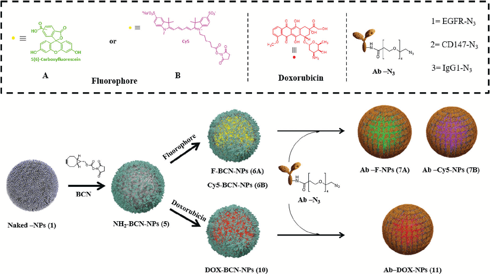
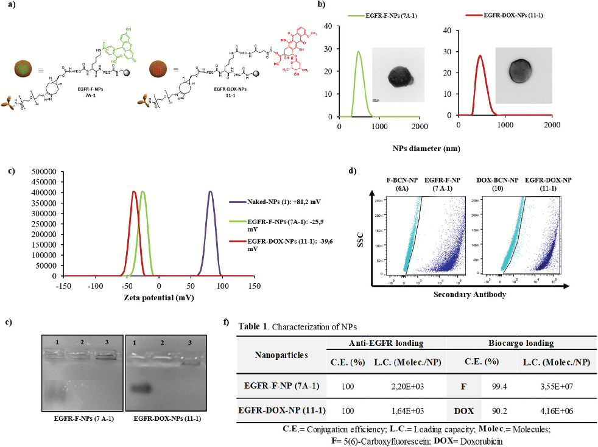
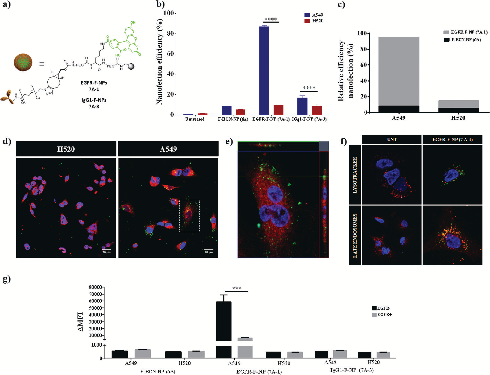
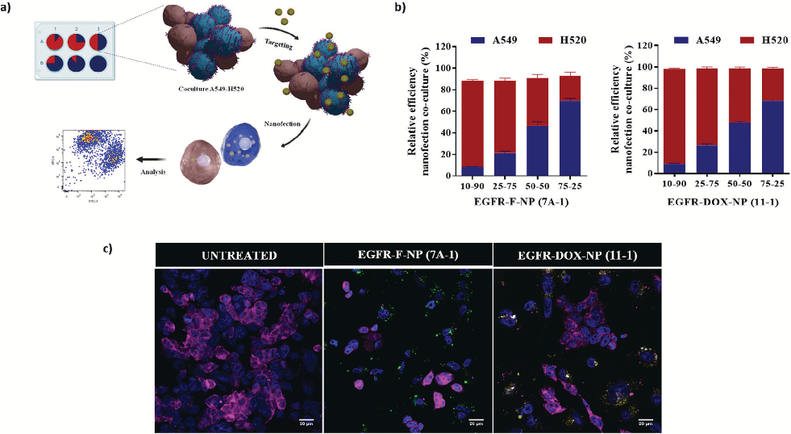
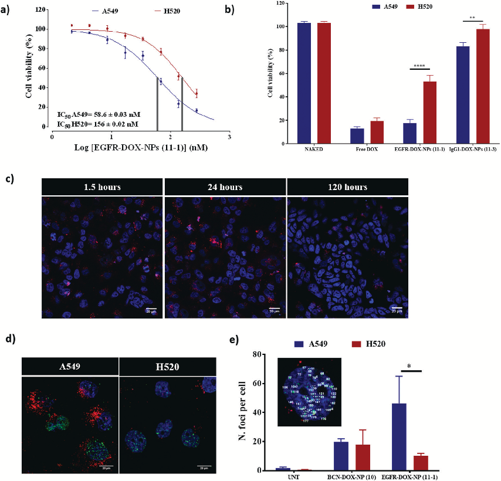
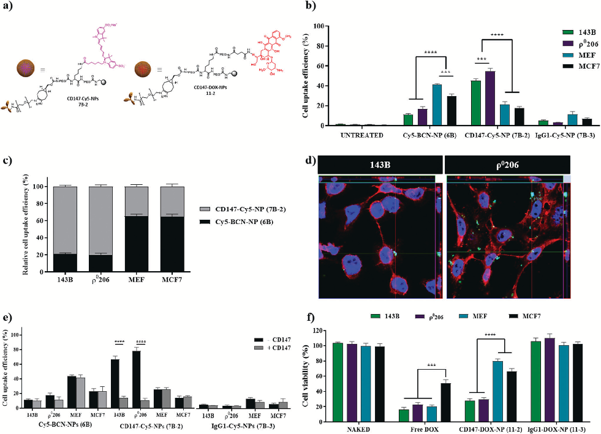

# Nanoscale

This article is licensed under aCreative Commons Attribution-NonCommercial 3.0 Unported Licence.

Open Access Article. Published on 02 February 2021. Downloaded on 3/3/2024 7:26:44 PM.

|COMMUNICATION View Article OnlineView Journal| View Issue|
|---|

Cite this: Nanoscale, 2021, 13, 3500

Received 6th October 2020, Accepted 26th January 2021

DOI: 10.1039/d0nr07145e rsc.li/nanoscale

## An effective polymeric nanocarrier that allows for active targeting and selective drug delivery in cell coculture systems†

Maria Victoria Cano-Cortes,‡a,b,c Patricia Altea-Manzano,‡a,d Jose Antonio Laz-Ruiz,‡a,b,c Juan Diego Unciti-Broceta,e Francisco Javier Lopez-Delgado,a,f Jose Manuel Espejo-Roman, a,b,c Juan Jose Diaz-Mochon *a,b,c and Rosario M. Sanchez-Martin *a,b,c

In this manuscript, we report the development of a versatile, robust, and stable targeting nanocarrier for active delivery. This nanocarrier is based on bifunctionalized polymeric nanoparticles conjugated to a monoclonal antibody that allows for active targeting of either (i) a fluorophore for tracking or (ii) a drug for monitoring specific cell responses. This nanodevice can efficiently discriminate between cells in coculture based on the expression levels of cell surface receptors. As a proof of concept, we have demonstrated efficient delivery using a broadly established cell surface receptor as the target, the epidermal growth factor receptor (EGFR), which is overexpressed in several types of cancers. Additionally, a second validation of this nanodevice was successfully carried out using another cell surface receptor as the target, the cluster of differentiation 147 (CD147). Our results suggest that this versatile nanocarrier can be expanded to other cell receptors and bioactive cargoes, offering remarkable discrimination efficiency between cells with different expression levels of a specific marker. This work supports the ability of nanoplatforms to boost and improve the progress towards personalized medicine.

aGENYO, Centre for Genomics and Oncological Research, Pfizer/University of Granada/Andalusian Regional Government, PTS Granada, Avda. Ilustración 114, 18016 Granada, Spain. E-mail: rmsanchez@go.ugr.es, juandiaz@go.ugr.es

bDepartment of Medicinal & Organic Chemistry and Excellence Research Unit of “Chemistry applied to Biomedicine and the Environment”, Faculty of Pharmacy, University of Granada, Campus de Cartuja s/n, 18071 Granada, Spain

cBiosanitary Research Institute of Granada (ibs.GRANADA), University Hospitals of Granada-University of Granada, Granada, 18071, Spain dLaboratory of Cellular Metabolism and Metabolic Regulation, VIB-KU Leuven Center for Cancer Biology, Campus Gasthuisberg´Herestraat 49, 3000 Leuven, Belgium eNanogetic S.L. Avda de la Innovacion 1, PTS, Edificio BIC, 18016 – Granada, Spain fDestiNA Genomica S.L. PTS Granada, Avenida de la Innovación 1, Edificio BIC, 18016, Granada, Spain

†Electronic supplementary information (ESI) available: Fig. S1–S11; general experimental methods; protocols for preparation and characterization of reported nanoparticles, general protocols for: cellular nanofection, cell viability, determination of DNA damage and quantitative PCR. See DOI: 10.1039/ d0nr07145e

‡These authors contributed equally.

Introduction

Standard anti-cancer therapies use cytotoxic agents that target proliferative (malignant and non-malignant) cells. However, despite the improved efficacy and enhanced survival offered by these chemotherapies, there are still many side effects linked to the lack of specific delivery to tumor cells. Therefore, there is a real clinical demand for targeted approaches to improve patient outcomes. Cellular surface receptors play a fundamental role in the progression of various diseases, including cancer. In fact, cancer cells overexpress numerous surface receptors that become important targets for the diagnosis and treatment of cancer.1–3 Depending on the level of expression of a specific receptor, cancer cells can respond with different efficacy to a particular treatment. Building a cost-effective and versatile nanodevice, which carries out targeted delivery of a particular treatment depending on the level of expression of a specific receptor, can have a relevant impact on the development of personalized medicine.4–7 Currently, several approaches aimed at achieving targeted delivery based on nanotechnology are in development.8,9 In particular, targeted nanoparticles as vehicles for the release of drugs and biomolecules to cancer cells that overexpress a particular cell surface receptor have been widely used.10–12 One of the most popular strategies to achieve active targeting is inspired by the antibody–drug conjugates (ADCs), which have delivered five FDA-approved compounds to the market.13 The conjugation of a monoclonal antibody to nanoparticles (Ab-NPs) allows for the targeting of specific antigens overexpressed in tumor cells and other cells present in the tumor microenvironment. This approach provides a successful means to deliver cytotoxic treatments to specific cancer types.14–16

We have previously reported the use of cross-linked polystyrene-based nanoparticles for the efficient conjugation of bioactive molecules of different nature such as small drugs, sensors, proteins, and nucleic acids. These polystyrene nanoparticles have been implemented for imaging, biosensing,

This article is licensed under aCreative Commons Attribution-NonCommercial 3.0 Unported Licence.

Open Access Article. Published on 02 February 2021. Downloaded on 3/3/2024 7:26:44 PM.

tracking of cellular proliferation, metallofluorescent nanoparticles for multimodal applications, and in cellulo proteomics using drug-loaded fluorescent nanoparticles.17–19 These polymeric particles are inherently attractive as a delivery system because of certain advantages, such as being easy to handle, and robust with a defined drug loading capacity, tunability, and lack of toxicity. These nanosystems can achieve efficient delivery through a passive but rapid mechanism, without significant alterations involving cellular gene profiling or proteomics.20,21 Recently, a theranostic multifunctional nanodevice for breast cancer treatment and monitoring was successfully developed.22 Based on the results of the previous studies, we hypothesized that active targeting for selective drug delivery applications could be efficiently achieved using these polymeric nanoparticles.

Here, we propose the development of a robust and stable targeting nanocarrier for active delivery based on bifunctionalized polymeric nanoparticles (NPs) conjugated to a monoclonal antibody (Ab). This nanodevice allows for active targeting of either (i) a fluorophore for active tracking or (ii) a drug for monitoring specific cell responses depending on the expression levels of surface proteins. This approach has been successfully validated using two different antibodies that specifically recognize two receptors commonly overexpressed on the cell surface of several types of tumors, the epidermal growth factor receptor (EGFR)23 and the cluster of differentiation 147 (CD147),24,25 and that have been involved in cancer progression and poor prognosis. Additionally, we demonstrate the robust implementation of this nanodevice in cocultures

for evaluating the efficacy of cell internalization based on the levels of these receptors. Therefore, we propose an effective polymeric nanocarrier that specifically recognizes tumorspecific cell surface markers and can potentially target tumor cells without affecting normal tissues. This feasible and versatile conjugation protocol is broadly applicable and can be applied to other drug cargoes or tumor markers, demonstrating its potential as a powerful tool for developing personalized medicine.

### Results and discussion

Preparation of Ab-NPs

We selected commonly overexpressed surface markers in tumors based on gene expression profiles across diverse human cancer and normal tissues to develop the targeted nanodevice.26 Here, we identified EGFR as a potential cell surface receptor, which is overexpressed among several types of cancers (Fig. S1a, see ESI†). Next, a strategy to couple a specific antibody to polymeric NPs for targeting delivery, together with (i) a fluorophore to allow cell tracking (Fig. 1, top panel) or (ii) an FDA-approved antitumoral drug (Fig. 1, bottom panel) was designed. These nanoparticles were prepared following standard and easy to handle protocols based on Fmoc solid-phase chemistry with oxyma and N,N′-diisopropylcarbodiimide (DIC) as coupling reagents (see synthetic details in Scheme S1†). The core scaffold for this nanoformulation is a nanoparticle bifunctionalized, NH2-BCN-NPs (5), that

Fig. 1 Schematic illustration for the synthesis of bifunctional-targeted nanoparticles (Ab-NPs and Ab-DOX-NPs).

This article is licensed under aCreative Commons Attribution-NonCommercial 3.0 Unported Licence.

Open Access Article. Published on 02 February 2021. Downloaded on 3/3/2024 7:26:44 PM.

contains a free amino group for further conjugation of the desired bioactive cargo, a fluorophore or a drug, and a cyclooctyne moiety (BCN), for further conjugation of the selected antibody to achieve targeted delivery. BCN allows for copper-free 1,3-cycloadditions with azide-labeled biomolecules in aqueous conditions (see synthetic details Scheme S1, ESI†).27 These NH2-BCN-NPs (5) were obtained from amino-functionalized cross-linked polystyrene nanoparticles (Naked-NPs (1) by (i) PEGylation (to improve their biocompatibility), (ii) conjugation of orthogonally-protected lysine (Fmoc-Lysine(Dde)-OH) to achieve bifunctionalization,28 and (iii) BCN functionalization of one of the arms of the lysine scaffold by reacting its NHSactivated ester (BCN-NHS) (details in Scheme S2, see ESI†). Different synthetic routes can be utilized following amine deprotection of the second arm from NH2-BCN-NPs (5), depending on the bioactive cargo to be delivered. To obtain fluorescent-labeled NPs, BCN-NPs (6), a standard conjugation of the fluorophore via amide formation was carried out using carboxyfluorescein (CBF) or Cy5 to obtain F-BCN-NPs (6A) or Cy5BCN-NPs (6B), respectively. Conversely, to obtain drug-loaded NPs, DOX-BCN-NPs (10), doxorubicin was conjugated by hydrazone bond formation (which allows for pH-selective delivery in the future).29 Once the desired bioactive cargo was loaded onto the nanoparticle, a final step for decoration of the NPs with the antibody was efficiently carried out following an efficient one-step click chemistry approach in aqueous conditions, in particular a 1,3-cycloaddition. Thus, the azide functionalized antibody (Ab-N3) was conjugated to the NP by the BCN moiety to yield Ab-loaded nanoparticles. A set of nanoparticles to target EGFR (EGFR-F-NPs (7A-1), EGFR-Cy5-NPs (7B-1), and EGFR-DOX-NPs (11-1) and a second set of nanoparticles to target an irrelevant antibody, IgG1 (IgG1-F-NPs (7A-3), IgG1Cy5-NPs (7B-3), and Ig-G1-DOX-NPs (11-3) were prepared using this designed protocol (Fig. 1, Schemes S1 and S3, see ESI†) proving the reproducibility of the protocol. While different combinations of antibodies with fluorophore and drug have been conjugated to validate the process, other small molecules and bioactive cargoes could be conjugated following similar chemical strategies, which demonstrates the versatility of this nanoformulation.

Characterization of Ab-NPs

A full characterization of the obtained nanoformulations was performed. Fig. 2 shows the data obtained for EGFR-F-NPs (7A-1) and EGFR-DOX-NPs (11-1) and their chemical structure (Fig. 2a). Size distribution was determined by Dynamic Light Scattering (DLS), showing the homogeneous size and low polydispersity (Fig. 2b). Transmission microscopy images show a smooth surface without any aggregation of EGFR-NPs and corroborate their size (insets in Fig. 2b). Fig. 2c shows the zeta potential values in aqueous environments at pH 7.4, which shows negative values of NPs. These results also confirm the ability of zeta potential measurements to monitor chemical reactions performed on NPs.30 The concentration of NPs was calculated according to the method developed by our research group, and it was found to be 2.2 × 106 nanoparticles per mL

(Fig. S11, see calculation details in ESI†).31 Next, the efficacy of conjugation of the antibody was checked by (i) immunofluorescence and (ii) gel electrophoresis using Coomassie staining performed on anti-EGFR-conjugated NPs (7A-1 and 11-1), using nanoparticles without antibody, F-BCN-NPs (6A) and DOX-BCN-NPs (10) as negative controls. The results qualitatively confirmed the presence of the antibody conjugated to NPs (Fig. 2d and e). Then, the conjugation efficiency and loading capacity (LC) of the antibody and biocargo on the NPs were determined (Fig. 2f, Fig. S12, S13 and Table S3, and details of the calculations of these parameters are available in the ESI†). As expected, the number of molecules of anti-EGFR per nanoparticle was lower than the number of small molecules. We hypothesized that this resulted from the larger size of the antibody compared with the size of the fluorophores or the drug. The efficient conjugation of these bioactive cargoes was corroborated by flow cytometry (Fig. S2, see ESI†). The efficiency of the pH-sensitive release of DOX from EGFR-DOX-NPs (11-1) was also determined (Fig. S14, see ESI†). Additionally, the characterization of EGFR-Cy5-NPs (7B-1) was carried out, showing effective conjugations (Fig. S3, see ESI†).

Evaluation of specific nanofection capacity

To validate the efficacy of EGFR-F-NPs (7A-1) for active targeting, the nanofection capacity was evaluated by testing EGFR-FNP (7A-1) internalization in lung cancer cells expressing different levels of EGFR. After quantifying gene expression, two lung cancer cell lines were selected: A549 with high-level expression of EGFR (EGFR high), and H520 with low levels of EGFR expression (EGFR low) (see qPCR analysis of EGFR in A549 and H520 in Fig. S15a, see ESI†). Nanoparticles without a conjugated antibody (F-BCN-NPs (6A)) together with nanoparticles conjugated with a nonspecific antibody of the same isotype, IgG1 (IgG1-F-NPs (7A-3)) were used as negative controls (details of the preparation of 7A-3 NPs are available in section 4 of ESI†). The nanofection efficiency was evaluated using flow cytometry (Fig. 3b and c). As expected, a greater internalization of EGFR-F-NPs (7A-1) was observed in the A549 cells compared with the H520 cells. Notably, the nanofection capacity of EGFR-F-NPs (7A-1) increased when EGFR levels were increased, while the nanofection capacity of the control IgG1-F-NPs (7A-3) remained constant in both cases. Therefore, cell internalization of EGFR-F-NPs (7A-1) is significantly dependent on EGFR expression levels. Additionally, the relative nanofection efficiency of EGFR-F-NPs (7A-1) compared with NPs without antibody (F-BCN-NPs (6A)) reinforces the fact that the internalization of these NPs is directly related to the presence of the surface receptor (Fig. 3c). In order to prove cell internalization, different time points of nanofection were tested (Fig. S4, see ESI†). An increase of fluorescence intensity over time was observed indicating that the efficient internalisation of these nanoparticles was achieved. Based on these results, 1.5 hours was chosen as the optimal incubation time. Efficient internalization was further corroborated by confocal microscopy analysis, where we demonstrated intracellular EGFR-F-NP (7A-1) internalization in the high EGFR expression

This article is licensed under aCreative Commons Attribution-NonCommercial 3.0 Unported Licence.

Open Access Article. Published on 02 February 2021. Downloaded on 3/3/2024 7:26:44 PM.

Fig. 2 Characterization of EGFR-F-NPs (7A-1) and EGFR-DOX-NPs (11-1). (a) Schematic representation of NPs; (b) hydrodynamic diameter values of DLS and TEM image; (c) zeta potential value; (d) immunofluorescence of EGFR-F-NPs (7A-1) and EGFR-DOX-NPs (11-1) versus F-BCN-NPs (6A) and DOX-BCN-NPs (10) respectively; (e) coomassie staining of electrophoresis gel; (f) determination of conjugation efficiency and loading capacity of anti-EGFR and F/DOX per nanoparticle.

cell line (A549) (Fig. 3d and e). Additionally, the evaluation of cellular uptake of EGFR-loaded nanoparticles labeled with Cy5 instead of CBF (EGFR-Cy5-NPs (7B-1)) was also successfully carried out, showing the same qualitative results (Fig. S5, see ESI†). Fig. 3f shows EGFR trafficking through endosomal/lysosomal compartments for the internalization of EGFR-F-NPs (7A-1) upon binding of active NPs to the receptor. This result is in accordance with the previously reported EGFR-mediated internalization process.32

To further verify the specificity of the EGFR-F-NP (7A-1) internalization resulting from targeting of the EGFR, competitive binding experiments were performed. To that end, cells were preincubated in the presence of the free EGFR antibody before incubation with the antibody-loaded NPs, EGFR-F-NPs (7A-1), F-BCN-NPs (6A), and IgG1-F-NPs (7A-3) as negative controls (EGFR + bars, Fig. 3g). In parallel, a negative control where cells were incubated with the set of nanoparticles without EGFR pretreatment in solution was carried out (EGFR − bars, Fig. 3g). These results showed that pretreating cells

with the antibody (EGFR+) effectively blocked cell-binding sites preventing the recognition of epitopes from the nanodevices and significantly reducing EGFR-F-NPs (7A-1) uptake. Cellular internalization of EGFR-F-NPs (7A-1) in A549 (EGFR high) with the preincubated anti-EGFR antibody was significantly reduced to values slightly higher than the controls (F-BCN-NPs (6A) and IgG1-F-NPs (7A-3)). In contrast, the degree of internalization of these control nanoparticles remained constant despite preincubation with the antibody (Fig. 3g). Therefore, these results confirm that the nanofection of EGFR-F-NPs (7A-1) resulted from specific receptor-mediated binding. This finding validated the ability of EGFR-F-NPs (7A-1) to discriminate between cells with different receptor expression levels and showed their potential for use in active targeting. Additionally, we wanted to monitor whether the internalization of EGFR-F-NPs (7A-1) impacted cell viability using the resazurin assay. To that end, cells were incubated for 72 h with different concentrations of EGFR-F-NPs (7A-1) and control NPs (maximum concentration = 40 000 NPs per cell).

This article is licensed under aCreative Commons Attribution-NonCommercial 3.0 Unported Licence.

Open Access Article. Published on 02 February 2021. Downloaded on 3/3/2024 7:26:44 PM.

Fig. 3 Selective nanofection and viability assays of EGFR-F-NPs (7A-1). The A549 and H520 cell lines were incubated with 5000 NPs per cell for 1.5 h in nanofection experiments and the results were analyzed using flow cytometry; (a) schematic representation of NPs; (b) comparison of the efficacy of nanofection of EGFR-F-NPs (7A-1) against the controls used; (c) uptake of EGFR-F-NPs (7A-1) related to F-BCN-NPs (6A); (d) confocal microscopy of the cellular uptake behavior of EGFR-NPs (7A-1); (e) orthogonal view (xy, xz, and yz) of the confocal microscope images showing the intersection planes at the position of the cross-line. Maximum intensity projection of the z-stack from blue (DAPI, nuclei), red (CellTracker™ Deep Red, cytoplasm) and green (EGFR-F-NPs (7A-1)) in A549 cell line is displayed; (f) confocal images of the co-localization study of EGFR-F-NPs (7A-1) with lysosomes (top) employing Lysotracker Red and with late endosomes (bottom) using antiCD63 primary antibody followed by A647-secondary antibody for late endosomes staining in A549 cell line. Lysosomes or late endosomes (red), and EGFR-F-NPs (7A-1) (green) can be seen co-localized (orange) after 1.5 h of incubation. Nuclei (blue) were stained with DAPI; (g) competitive binding assay. Comparison of cellular nanofection between EGFR-F-NPs (7A-1) and F-BCN-NPs (6A) and IgG1-F-NPs (7A-3) as negative controls. 5000 NPs per cell were incubated with (EGFR+) and without (EGFR−) the presence of free anti-EGFR (2.5 µm). The experiments have been carried out in triplicate and the results have been expressed with the values of the mean ± SEM. The statistical significance was determined by the Student’s T-test (*p-value < 0.05, ****p-value < 0.0001).

Our results showed that cell viability values above 95% in all the cases tested, corroborating that high NPs per cell concentrations do not affect cell viability (Fig. S6, see ESI†).

Evaluation of EGFR-NPs as active targeting nanocarriers using a cell coculturing approach

After demonstrating the efficacy of this nanoplatform to discriminate between cells with high and low expression of surface receptors, we sought to assess its efficiency for active targeting using a coculturing approach. For this purpose, an in vitro A549/H520 coculture model was used to evaluate

selectivity and active targeting of EGFR-F-NPs (7A-1). H520 cells were pre-stained with CellTracker™ Deep Red to be able to track them and then cocultured in vitro at different ratios of A549 cells (EGFR high)/H520 cells (EGFR low) (10% : 90%, 25% : 75%, 50% : 50%, and 75% : 25%). Cocultures were incubated with EGFR-F-NPs (7A-1) at a concentration of 5000 added NPs per cell for 90 min and analyzed by flow cytometry (Fig. 4a). A correlation between the ratio of CellTracker™ labeling of H520 and EGFR-F-NPs (7A-1) nanofection of A549 cells was established. These results show that uptake of EGFR-FNPs (7A-1) is specific for EGFR in a coculture model, highlight-

This article is licensed under aCreative Commons Attribution-NonCommercial 3.0 Unported Licence.

Open Access Article. Published on 02 February 2021. Downloaded on 3/3/2024 7:26:44 PM.

Fig. 4 EGFR-F-NP (7A-1) and EGFR-DOX-NP (11-1) efficacy in coculture. (a) Schematic illustration of the A549 (EGFR high) and H520 (EGFR low) coculture model; (b) relative efficiency of nanofection in coculture of EGFR-F-NPs (7A-1) and EGFR-DOX-NPs (11-1) by flow cytometry analysis; (c) confocal microscope images of cocultures with NPs.

ing the potential use of EGFR-F-NPs (7A-1) (Fig. 4b). Additionally, this result was corroborated by confocal microscopy analysis (Fig. 4c). As expected, the cellular internalization of EGFR-labeled nanoparticles (indicated as green dots) inside H520 cells labeled with cell membrane staining (EGFR low) is significantly lower than inside A549 cells (EGFR high). Remarkably, when the same experiment was carried out with EGFR-labeled NPs loaded with doxorubicin (Fig. 4c), the correlation between the proportion of internalization was kept the same as that with NPs loaded with the fluorophore. These results reinforce the reproducibility and reliability of this nanoplatform, as two different formulations, EGFR-DOX-NPs (11-1) and EGFR-F-NPs (7A-1), showed the same ratio of internalization (%) based on EGFR expression levels. Previous results of active targeting nanocarriers based on the encapsulation of the bioactive cargo in a co-culture system have been reported.33 Alternatively, our approach leads the covalent conjugation of the bioactive cargo allowing efficient co-culture evaluation in shorter incubation time.

Evaluation of EGFR-DOX-NPs (11-1) efficacy as drug delivery nanocarrier

We evaluated the ability of EGFR-DOX-NPs (11-1) as selective drug delivery nanocarriers. First, the cytotoxic activity of EGFR-DOX-NPs (11-1) was evaluated by measuring cell viability of both A549 (EGFR high) and H520 (EGFR low) cells, incubated with a range of concentrations of NPs, using the resazurin cell viability assay. The IC50 of EGFR-DOX-NPs (11-

1) was calculated to be 58.6 nM for A549 cells and 156 nM for the H520 cell line. Therefore, EGFR-DOX-NPs (11-1) had approximately three times lower IC50 values for A549 when compared with H520 cells (Fig. 5a), showing the robustness of active targeting in improving the drug anti-proliferative capacity (Fig. S7†). When we compared the cytotoxic activity of free DOX using an equivalent amount to those loaded on EGFR-DOX-NPs (11-1) and IgG1-DOX-NPs (11-3), a similar cytotoxic effect is observed between DOX-loaded onto nanoparticles and the same doses of free DOX in the A549 cell line (EGFR high), whereas IgG1-DOX-NPs (11-3) show no cell damage. The lower internalization of IgG1-DOX-NPs (11-3) shows that there is a specific receptor mediated internalization of EGFR-DOX-NPs (11-1). However, while free DOX also reduced the cell viability of the H520 cell line, the effect of EGFR-DOX-NPs (11-1) was more moderate because of their lower cellular uptake as a direct consequence of the lower presence of EGFR on the cell surface (Fig. 5b). Finally, to corroborate the selective therapeutic effect of EGFR-DOX-NPs (11-1), H520 and A549 were cocultured and treated with these NPs for 1.5, 24, and 120 h. Confocal microscopy analysis revealed how the proportion of A549 cells loaded with nanoparticles was similar to the proportion of H520 cells at 1.5 h and 24 h. However, following 120 h of treatment, the cytotoxic effect can be clearly observed as the number of cells loaded with a high number of nanoparticles dramatically decreases and the number of cells without nanoparticles increases (Fig. 5c).

This article is licensed under aCreative Commons Attribution-NonCommercial 3.0 Unported Licence.

Open Access Article. Published on 02 February 2021. Downloaded on 3/3/2024 7:26:44 PM.

Fig. 5 Therapeutic evaluation of EGFR-DOX-NPs (11-1) on A549 (EGFR high)/H520 (EGFR low) cells. (a) Dose–response curves (percentage of cell viability versus concentration) of treatment with EGFR-DOX-NPs (11-1), represented in nM; (b) therapeutic effect of EGFR-DOX-NPs (11-1) compared with the corresponding concentration of free doxorubicin (500 nM) and IgG1-DOX-NPs (11-3) as negative control. Statistical significance was determined by Student’s t-test (*p value < 0.0001). (c) Confocal microscopy results of coculture (50 : 50) following 1.5, 24, and 120 h of treatment with EGFR-DOX NPs (11-1); (d) determination of DNA damage caused by treatment with EGFR-DOX-NPs (11-1) by immunostaining of γ-H2Ax analyzed by confocal microcopy (63x magnification). Blue, DAPI for the nucleus staining; red, EGFR-DOX-NPs (11-1) and green, for H2Ax staining with Alexa488-antiphospho-H2Ax; (e) quantitative analysis of the number of foci per cell by H2AX staining following treatment with EGFR-DOX-NPs (111) compared with DOX-BCN-NPs (10).

Doxorubicin is a genotoxic drug that can be related to the histone variant H2A·X phosphorylation in response to the damage of DNA. Therefore, we decided to comprehensively study the cytotoxic effect and the selectivity conferred by the antibody on EGFR-DOX-NPs (11-1) by measuring the level of DNA damage by γ-H2Ax staining. Active targeting would lead to a significant accumulation of DOX in the high EGFR cell line (A549), which would be translated into an increased level of DNA damage. For that purpose, cells were stained with antiphospho-H2A·X antibody to visualize DNA damage by confocal microscopy analysis (Fig. 5d and e). Then, the number of H2A·X foci were used to quantify DNA damage (Fig. 5e).34–36

Based on the fact that a higher number of H2A·X foci per nuclei are observed in A549 compared with H520 cells, we confirmed that nanofection of EGFR-DOX-NP (11-1) induced more damage in A549 compared with H520 cells. When A549 and H520 cells were incubated with NPs without the conjugated antibody (DOX-BCN-NP (10)), a similar number of H2A·X foci per nuclei were observed in both cell lines, but this value was lower than what was achieved by active targeting with EGFR-DOX-NP (11-1) (Fig. 5e).37 This result reinforces the remarkable selectivity for drug delivery of this nanocarrier EGFR-DOX-NP (11-1) to cells that overexpress EGFR on the cell surface.

This article is licensed under aCreative Commons Attribution-NonCommercial 3.0 Unported Licence.

Open Access Article. Published on 02 February 2021. Downloaded on 3/3/2024 7:26:44 PM.

Validation of the nanocarrier versatility for active targeting – evaluation of NPs to tag the CD147 receptor

To further validate the versatility of this nanocarrier for targeted delivery, a different cell surface receptor was selected as the target, the cluster of differentiation 147 (CD147). CD147 is upregulated in various tumors, including breast, bladder, colorectal, ovarian cancer, melanoma, and osteosarcoma (Fig. S1b, see ESI†). The antibody CD147 has been reported to be involved in cancer progression and lactate metabolism and is also a useful therapeutic target for malignant tumor cells.38–40 Nanoparticles labeled with the antiCD147 antibody were prepared following the same protocols previously described for nanoparticles labeled with the antiEGFR antibody (Fig. 1). CD147-Cy5-NPs (7B-2) and CD147-DOX-NPs (11-2) (Fig. 6a) were

successfully synthesized and characterized (see Scheme S2 and Fig. S8,† respectively). To carry out the in vitro evaluation of this specific nanocarrier decorated with the antiCD147 moiety, four established cell lines based on CD147 expression levels were selected: two bone cancer cell lines classified as high CD147 (143B and ρ0206), one breast cancer cell line with lower levels of expression of CD147 (MCF-7), and immortalized mouse embryonic fibroblast (MEF) as an absolute negative control because the selected anti-CD147 antibody only recognizes the human epitope of the CD147 protein. In line with the CD147 density on the cell surface, there was a significant enhancement in the uptake of cellular CD147-Cy5-NPs (7B-2) in 143B and ρ0206 cells compared with MCF-7 and MEF (Fig. 6b and c, S9†). Not only was the percentage of nanofected cells increased, but there was also increased accumulation of CD147-Cy5-NPs (7B-2) pro-

Fig. 6 Selective nanofection and viability assays of CD147-Cy5-NPs (7B-2). The A549 and H520 cell lines were incubated with 5000 NPs per cell for 1.5 h to nanofection experiments and the results were analyzed by flow cytometry; (a) schematic representation of NPs; (b) comparison of the efficacy of nanofection of CD147-Cy5-NPs (7B-2) against the controls used; (c) uptake of CD147-Cy5-NPs (7B-2) related to BCN-Cy5-NPs (6B); (d) orthogonal view (xy, xz, and yz) of the confocal microscope images showing the intersection planes at the position of the cross-line. Maximum intensity projection of the z-stack from blue (DAPI, nuclei) and green for CD147-Cy5-NPs (7B-2) in 143B and ρ0206 cells are displayed; (e) competitive binding assay. Comparison of cellular nanofection between CD147-Cy5-NPs (7B-2), BCN-Cy5-NPs (6B), and IgG1-Cy5-NPs (7B-3) as negative controls. 5000 NPs per cell were incubated with (CD147+) and without (CD147−) the presence of free anti-CD147 (2.5 µm). (f) Therapeutic effect of CD147-DOX-NPs (11-2) compared with the corresponding concentration of free doxorubicin (500 nM). Statistical significance was determined by one-way analysis of variance (ANOVA) with a Bonferroni’s multiple comparison post-hoc (*p value < 0.05, ***p value < 0.001). The experiments have been carried out in triplicate and the results have been expressed with the values of the mean ± SEM.

This article is licensed under aCreative Commons Attribution-NonCommercial 3.0 Unported Licence.

Open Access Article. Published on 02 February 2021. Downloaded on 3/3/2024 7:26:44 PM.

portional to the CD147 expression. This change was reflected in the increased median fluorescence intensity (MFI). However, IgG1-Cy5-NP (7B-3) treatment did not cause a change in MFI (Fig. 6b). Efficient internalization was further corroborated by confocal microscopy analysis, where we demonstrated intracellular CD147-Cy5-NPs (7B-2) internalization in the high CD147 expression cell line (143B and ρ0206) (Fig. 6d).

Similar to EGFR-F-NPs (7A-1) or EGFR-Cy5-NPs (7B-1), the uptake of CD147-Cy5-NPs (7B-2) by 143B and ρ0206 cells (CD147 high) was significantly reduced after preincubation with anti-CD147 to levels similar to those observed in Cy5BCN-NPs (6B) and IgG1-Cy5-NPs (7B-3) (Fig. 6e). Interestingly, cellular uptake efficiency was maintained in cells with minimal CD147 expression (MCF-7 and MEF).

As previously described for EGFR loaded NPs, evaluation of fluorescent labelled CD147-Cy5-NPs (7B-2) has proven non-significant effect on cell viability (Fig. S10, see ESI†). Additionally, to further validate the efficiency of CD147-DOX-NPs (11-2) based on cell type-specific targeting, 143B and ρ0206 cells (CD147 high) and MCF-7 and MEF (CD147 low) cells were treated with CD147-DOX-NPs (11-2). Similar results were obtained using CD147-DOX-NPs (11-2), with the viability of CD147 high cell lines significantly more affected than CD147 low cell lines (Fig. S11†). Remarkably, the correlation between the proportion of Ab-DOX-NP internalization and CD147 expression remains constant compared with NPs loaded with Ig1 (Fig. 6f).

Altogether, these results reinforce the reproducibility and reliability of this nanoplatform, as three different formulations, Ab-DOX-NPs (11) Ab-F-NPs (7A) and Ab-Cy5-NPs (7B), showed the same percentage of internalization based on cell surface markers levels. Considering the number of technological barriers that need to be examined when developing more efficient and cost-effective active targeting, our results suggest that this approach can overcome the current challenges related to technical feasibility issues in the formulation and characterization of nanocarriers. Current strategies used to formulate active targeting nanocarriers are based in the encapsulation of drugs and trackers in the core of the NP while targeted delivery is achieve by conjugating the antibody to the surface of the NP.41 Our approach is reproducible between different formulations with different cargoes, demonstrating the robustness and versatility of the formulation of these Ab-targeted nanodevices.

### Experimental section

Materials and methods

All solvents, chemicals, and monoclonal antibodies were purchased from Sigma-Aldrich. Dulbecco’s modified Eagle’s medium (DMEM), Roswell Park Memorial Institute medium (RPMI), L-glutamine, 1% penicillin/streptomycin, trypsinEDTA, and fetal bovine serum (FBS) were purchased from Gibco (Thermo Fisher Scientific). Flow cytometry experiments were performed on a FACSCanto II system (Becton Dickinson & Co., NJ, USA) using the Flowjo® 10 software for analysis. Cell

viability was assayed using an M200 Nanoquant microplate reader to measure absorbance. Confocal microscopy images were obtained using a Zeiss LSM 710 confocal laser scanning microscope and Zeiss ZEN 2010 software for image acquisition. Transmission electron microscopy was performed on an FEI Titan G2 high-resolution microscope.

Preparation of Ab-NPs

Preparation of EGFR-F-NPs (7A-1) and CD147-Cy5-NPs (7B-2). Bifunctionalized NPs (Fmoc-Dde-NPs, 4) were obtained using protocols described previously (see ESI†).22 Next, the Fmoc group was removed from Fmoc-Dde-NPs (4), and a solution with 10 equivalents of cyclooctin BCN in anhydrous DMF with 1 equivalent of DIPEA was added, and the suspension was mixed on the Thermomixer at 1400 rpm for 15 h at 25 °C. Finally, Dde deprotection was carried out to yield NH2BCN-NPs (5).

Next, labeling of NPs was carried out by conjugation of 5(6)carboxyfluorescein (15 eq.) to obtain F-BCN-NPs (6A) (for conjugation of Cy5 see ESI†). The coupling of NPs with anti-EGFR functionalized with azide group was optimized for 3 × 1010 NPs (quantified by the spectrophotometric method, see ESI†)42 and 2.5 µM of antibody dissolved in PBS, and the suspension was mixed on the Thermomixer at 1000 rpm for 12 h at 25 °C. When the reaction concluded, the NPs were washed with sterile PBS and EGFR-F-NPs (7A-1), EGFR-Cy5-NPs (7B-1), and CD147Cy5-NPs (7B-2). The IgG1 antibody was conjugated using the same functionalization and conjugation process followed by the anti-EGFR antibody to finally obtain the IgG1-F-NPs (7A-3) and IgG1-Cy5-NPs (7B-3) (Schemes S1 and S2, see ESI†).

Preparation of Ab-DOX-NPs

First, the conjugation of succinic anhydride (15 eq.) with DIPEA (7.5 eq.) was carried out to obtain COOH-BCN-NPs (8). Then, the NPs (8) were activated with oxyma (15 eq.) and DIC (15 eq.) for 4 h, centrifuged, and a solution of hydrazine in DMF (55% v/v) was added. This was left stirring for 15 h at 25 °C. Next, the Hydrazine-BCN-NPs (9) were washed and conditioned in 1 mL of PBS pH 6. Then, DOX (1 equivalent) was dissolved in PBS at pH 6 and added to the NPs, and the resulting mixture was mixed for 15 h at 50 °C to yield DOX-BCN-NPs (10). Finally, the conjugation of antibody with DOX-BCN-NPs (10) was carried out to obtain EGFR-DOX-NPs (11-1), CD147-DOX-NPs (11-2), and IgG1-DOX-NPs (11-3) (Scheme S4, see ESI†).

Functionalization of the antibody with N3-PEG4-NHS

To functionalize the antibody with N3-PEG4-NHS reagent, a 500 mM solution of N3-PEG4-NHS in PBS was prepared, where 1 mM stock solution (20× M excess) was added to 2.5 µM of antibody. The reaction was incubated for 2 h at 4 °C and concentrated using 30 KDa MWCO purification columns following the manufacturer’s specifications (Scheme S1b, see ESI†).

Characterization of Ab-NPs

Particle mean size, size distribution, and zeta potential of NPs were determined by dynamic light scattering (DLS) and were

This article is licensed under aCreative Commons Attribution-NonCommercial 3.0 Unported Licence.

Open Access Article. Published on 02 February 2021. Downloaded on 3/3/2024 7:26:44 PM.

measured on a Zetasizer Nano ZS ZEN. The shape and morphology of the NPs were observed by transmission electron microscopy (TEM). The conjugation of fluorophores was checked by flow cytometry using FACSCanto II (Becton Dickinson & Co.) and Flowjo® 10 software for data analysis. The antibody conjugation efficiency was determined by agarose gel electrophoresis, immunofluorescence, and BCA assay (see ESI†).

Evaluation of doxorubicin conjugation of Ab-DOX-NPs

DOX loading capacity (LC) and DOX conjugation efficiency (CE; %) were calculated using the formulas described previously. The release profile of doxorubicin was analyzed by high-performance liquid chromatography (HPLC) (see ESI†).

Cell culture

The CIC cell bank provided cell lines at the University of Granada. The non-small cell lung cancer cell line H520 was cultured in RPMI; A549, MCF-7, immortalized MEF and 143B cell lines (lung cancer, breast cancer, mouse embryonic fibroblasts, and osteosarcoma, respectively) were cultured in DMEM, supplemented with 10% (vol/vol), FBS, 1% L-glutamine and 1% penicillin/streptomycin. Miguel Martin’s laboratory kindly provided ρ0206 cells. ρ0206 cells were cultured in similar media supplemented with 2% pyruvate (GIBCO) and 50 μg mL−1 of uridine (SIGMA). Cells were maintained at 37 °C, 5% CO2, and 95% relative humidity, and were regularly tested negative for mycoplasma infection.

Cellular nanofection by flow cytometry and confocal microscopy

After incubation with NPs, the medium was aspirated, and the cells were washed with 1× PBS and separated with trypsinEDTA at 37 °C for 5 min. Then, each sample was fixed in 2% paraformaldehyde (PFA) at room temperature for 10 min and protected from light. Samples were analyzed by flow cytometry and confocal microscopy. Each experiment was performed in duplicate by ratio and time of incubation and repeated at least three times. The study of the nanofection of Ab-NPs and control NPs was carried out using different cell : NP ratios at the established incubation times. The dot plots and the cytometry statistics were obtained using the FlowJo software. The analysis of confocal microscopy images was subsequently carried out with the ZEN 2012 program Blue Edition or ImageJ version 1.49b (open-source software).

Cellular nanofection in coculture

H520 cells were identified by staining with CellTracker (0.5 µM) for 45 min, according to the manufacturer’s protocol. Stained H520 cells were washed twice. Then, A549 and stained H520 cells were seeded in different proportions getting a total of 105 cells per well: 10% : 90%; 25% : 75%; 50% : 50%; and 75% : 25%. Eighteen hours after seeding, EGFR-F-NPs (7A-1) or EGFR-DOX-NPs (11-1) were added to each well at a concentration of 5000 NPs per cell and incubated for 1.5 h.

Cell viability

The cellular cytotoxicity of NPs was evaluated using the resazurin assay protocol.

Determination of DNA damage in cancer cells by immunostaining of phospho-H2A·X foci

A549 and H520 cells were cultured on coverslips in 24-well plates. Cells were incubated with 5000 EGFR-DOX-NPs (11-1) per cell. After 24 h of incubation, the cells were fixed with 4% PFA, washed, and incubated with primary antiphospho-H2A·X antibodies in blocking buffer at +4 °C overnight. The next day, cells were stained with secondary Alexa Fluor 488 conjugated antibodies for 1 h at room temperature. After washing with PBS, the preparations were mounted with a mounting medium including antifade and DAPI (Invitrogen).36 For automatic H2A·X foci counting, ImageJ® analysis was performed.

Statistical analysis

The data are presented as the mean ± the standard deviation. The sample size (n) indicated the experimental repeats of a single representative experiment and was set at 3 unless otherwise specified. The results of the experiments were validated by independent repetitions. Graph plotting and statistical difference calculation were performed using GraphPad Prism 6.0 (Graphpad Software Inc.). Statistical significance was determined using the Student’s t-test in paired groups of samples with a known median. A p-value of ≤0.05 was considered significant.

### Conclusions

An innovative and versatile approach for active targeted delivery based on the use of antibody-decorated nanoparticles has been presented. For this proof of concept, the targeted delivery in EGFR- and CD147-overexpressing cancer cells has been evaluated. NPs targeting EGFR or CD147 and decorated with either fluorophores for tracking (EGFR-F-NPs (7A-1)), (EGFR-Cy5-NPs (7B-1), and CD147-Cy5-NPs (7B-2) or with a drug for assessing drug efficacy (EGFR-DOX-NPs (11-1) and CD147-DOX-NPs (112)) were prepared and characterized. In vitro validation was successfully achieved using several cancer cell lines with different expression levels for the specific membrane receptors. Remarkably, to our knowledge, this is the first nanocarrier that has demonstrated a great selectivity in the coculturing assay at short incubation times, with a clear ability to efficiently discriminate between cell lines based on their surface marker expression levels.

In conclusion, this manuscript describes procedures and protocols that can be used to develop any combination of robust nanoparticles conjugated to other antibodies and bioactive molecules of interest. Therefore, we believe we are offering an alternative therapeutic tool that can be potentially used in personalized medicine.

This article is licensed under aCreative Commons Attribution-NonCommercial 3.0 Unported Licence.

Open Access Article. Published on 02 February 2021. Downloaded on 3/3/2024 7:26:44 PM.

### Conflicts of interest

There are no conflicts to declare.

### Acknowledgements

This work was supported by grants from the Health Institute Carlos III (ISCIII) (Projects of technological development in health - ref DTS18/00121) and from the Junta de AndalucíaFEDER, Ministry of Economy, Knowledge, Companies and University (FEDER 2018: ref. B-FQM-475-UGR18, PAIDI2020: project ref. PT18-TP-1490 and project ref AT17_6096- OTRI of the University of Granada). The authors thank the network NANOCARE (RED2018-102469-T), funded by the Spanish State Research Agency, for support. J. A. L. R. thanks to the Fundación Benéfica Anticancer San Francisco Javier y Santa Candida for PhD funding. F. J. L. D. thanks Spanish Ministry of Economy and Competitiveness for a Torres Quevedo fellowship (PTQ-1608597). JMER thanks the Spanish Ministry of Education for PhD funding (scholarship FPU 16/02061). Fig. 1 has been designed using the open source 3D creation suite Blender (version 2.83.1.).

### References

- 1 T. Shi, M. Wang, H. Li, M. Wang, X. Luo, Y. Huang, H. H. Wang, Z. Nie and S. Yao, Sci. Rep., 2018, 8, 5551.
- 2 J. Yoo, C. Park, G. Yi, D. Lee and H. Koo, Cancers, 2019, 11, 640.
- 3 Q. Guo, Z. Wu, Y. Peng, W. Peng, Q. Huang, M. Peng, N. Huang, X. Hu, T. Fu, Z. Zhao and W. Tan, Anal. Chem., 2019, 91, 13349–13354.
- 4 A. Ahmad, F. Khan, R. K. Mishra and R. Khan, J. Med. Chem., 2019, 62, 10475–10496.
- 5 D. Rosenblum, N. Joshi, W. Tao, J. M. Karp and D. Peer, Nat. Commun., 2018, 9, 1410.
- 6 D. E. Large, J. R. Soucy, J. Hebert and D. T. Auguste, Adv. Ther., 2019, 2, 1800091.
- 7 A. Zenych, L. Fournier and C. Chauvierre, Biomaterials, 2020, 258, 120297.
- 8 L. Zhang, C. Jiang, F. Zeng, H. Zhou, D. Li, X. He, S. Shen, X. Yang and J. Wang, Biomater. Sci., 2020, 8, 2255–2263.
- 9 Y. Xu, H. De Keersmaecker, K. Braeckmans, S. De Smedt, P. D. Cani, V. Préat and A. Beloqui, Biomaterials, 2020, 255, 120209.
- 10 K. W. Yong, D. Yuen, M. Z. Chen, C. J. H. Porter and A. P. R. Johnston, Nano Lett., 2019, 19, 1827–1831.
- 11 J. F. Stefanick, D. T. Omstead, T. Kiziltepe and B. Bilgicer, Nanoscale, 2019, 11, 4414–4427.
- 12 P. Wang, T. Kim, M. Harada, C. Contag, X. Huang and B. R. Smith, Nanoscale Horiz., 2020, 5, 628–653.
- 13 P. Zhao, Y. Zhang, W. Li, C. Jeanty, G. Xiang and Y. Dong, Acta Pharm. Sin. B, 2020, 10, 1589–1600.
- 14 Y. Liu, L. Scrivano, J. D. Peterson, M. H. A. M. Fens,

I. B. Hernández, B. Mesquita, J. S. Toraño, W. E. Hennink,

C. F. Van Nostrum and S. Oliveira, Mol. Pharm., 2020, 17, 1276–1292.

- 15 M. Colombo, M. A. Rizzuto, C. Pacini, L. Pandolfi, A. Bonizzi, M. Truffi, M. Monieri, F. Catrambone, M. Giustra, S. Garbujo, L. Fiandra, F. Corsi, D. Prosperi and S. Mazzucchelli, Bioconjugate Chem., 2018, 29, 3817–3832.
- 16 H. Jin, J. Pi, Y. Zhao, J. Jiang, T. Li, X. Zeng, P. Yang, C. E. Evans and J. Cai, Nanoscale, 2017, 9, 16365–16374.
- 17 P. Altea-Manzano, J. D. Unciti-Broceta, V. Cano-Cortes, M. P. Ruiz-Blas, T. Valero-Griñan, J. J. Diaz-Mochon and R. Sanchez-Martin, Nanomedicine, 2017, 12, 1591–1605.
- 18 T. Valero, A. Delgado-González, J. D. Unciti-Broceta, V. Cano-Cortés, A. M. Pérez-López, A. Unciti-Broceta and R. M. Sánchez-Martín, Bioconjugate Chem., 2018, 29, 3154– 3160.
- 19 A. Delgado-Gonzalez, E. Garcia-Fernandez, T. Valero, M. V. Cano-Cortes, M. J. Ruedas-Rama, A. Unciti-Broceta, R. M. Sanchez-Martin, J. J. Diaz-Mochon and A. Orte, ACS Omega, 2018, 3, 144–153.
- 20 L. M. Alexander, S. Pernagallo, A. Livigni, R. M. SánchezMartín, J. M. Brickman and M. Bradley, Mol. Biosyst., 2010, 6, 399–409.
- 21 L. Pietrovito, V. Cano-Cortés, T. Gamberi, F. Magherini, L. Bianchi, L. Bini, R. M. Sánchez-Martín, M. Fasano and A. Modesti, Proteomics, 2015, 15, 34–43.
- 22 M. V. Cano-Cortes, S. A. Navarro-Marchal, M. P. Ruiz-Blas, J. J. Diaz-Mochon, J. A. Marchal and R. M. Sanchez-Martin, Nanomedicine, 2020, 24, 102120.
- 23 M. Gao, H. Su, G. Lin, S. Li, X. Yu, A. Qin, Z. Zhao, Z. Zhang and B. Z. Tang, Nanoscale, 2016, 8, 15027–15032.
- 24 X. Xin, X. Zeng, H. Gu, M. Li, H. Tan, Z. Jin, T. Hua, R. Shi and H. Wang, Sci. Rep., 2016, 6, 1–12.
- 25 R. Chen, K. Wang, Z. Feng, M. Y. Zhang, J. Wu, J. J. Geng and Z. N. Chen, Cell. Mol. Immunol., 2020, DOI: 10.1038/ s41423-019-0353-7.
- 26 S. J. Park, B. H. Yoon, S. K. Kim and S. Y. Kim, BMC Med. Genomics, 2019, 12, 1–8.
- 27 H. Y. Yoon, M. L. Shin, M. K. Shim, S. Lee, J. H. Na, H. Koo, H. Lee, J. H. Kim, K. Y. Lee, K. Kim and I. C. Kwon, Mol. Pharm., 2017, 14, 1558–1570.
- 28 J. J. Díaz-Mochón, L. Bialy and M. Bradley, Org. Lett., 2004, 6, 1127–1129.
- 29 M. V. Cano-Cortes, J. A. Laz-Ruiz, J. J. Diaz-Mochon and R. M. Sanchez-Martin, Polymers, 2020, 12, 1–15.
- 30 F. Thielbeer, E. M. V. Johansson, S. V. Chankeshwara and M. Bradley, Macromol. Biosci., 2013, 13, 682–686.
- 31 J. D. Unciti-Broceta, V. Cano-Cortes, P. Altea-Manzano, S. Pernagallo, J. J. Diaz-Mochon and R. M. Sanchez-Martin, Sci. Rep., 2015, 5, 1–10.
- 32 F. Capuani, A. Conte, E. Argenzio, L. Marchetti, C. Priami, S. Polo, P. P. Di Fiore, S. Sigismund and A. Ciliberto, Nat. Commun., 2015, 6, 7999.
- 33 J. Bruniaux, E. Allard-Vannier, N. Aubrey, Z. Lakhrif, S. Ben Djemaa, S. Eljack, H. Marchais, K. Hervé-Aubert,

I. Chourpa and S. David, Int. J. Pharm., 2019, 569, 118572.

This article is licensed under aCreative Commons Attribution-NonCommercial 3.0 Unported Licence.

Open Access Article. Published on 02 February 2021. Downloaded on 3/3/2024 7:26:44 PM.

- 34 N. Kong, X. Ji, J. Wang, X. Sun, G. Chen, T. Fan, W. Liang, H. Zhang, A. Xie, O. C. Farokhzad and W. Tao, Nano Lett., 2020, 20, 3943–3955.
- 35 J. Ji, Y. Zhang, C. E. Redon, W. C. Reinhold, A. P. Chen, L. K. Fogli, S. L. Holbeck, R. E. Parchment, M. Hollingshead, J. E. Tomaszewski, Q. Dudon, Y. Pommier, J. H. Doroshow and W. M. Bonner, PLoS One, 2017, 12, e0171582.
- 36 F. Canfarotta, L. Lezina, A. Guerreiro, J. Czulak, A. Petukhov, A. Daks, K. Smolinska-Kempisty, A. Poma and S. Piletsky, Nano Lett., 2018, 18, 4641–4646.
- 37 E. Moeglin, D. Desplancq, S. Conic, M. Oulad-Abdelghani, A. Stoessel, M. Chiper, M. Vigneron, P. Didier, L. Tora and E. Weiss, Cancers., 2019, 11, 355.

- 38 J. Wang, Z. Wu, G. Pan, J. Ni, F. Xie, B. Jiang, L. Wei, J. Gao and W. Zhou, Nanomedicine, 2018, 14, 1949–1961.
- 39 X. Li, Y. Zhang, W. Ma, Q. Fu, J. Liu, G. Yin, P. Chen, D. Dai, W. Chen, L. Qi, X. Yu and W. Xu, Cancer Immunol. Immunother., 2020, 69, 535–548.
- 40 M. Li, L. Deng, J. Li, W. Yuan, X. Gao, J. Ni, H. Jiang, J. Zeng, J. Ren and P. Wang, ACS Appl. Mater. Interfaces, 2018, 10, 41107–41117.
- 41 A. Ahmad, F. Khan, R. K. Mishra and R. Khan, J. Med. Chem., 2019, 62, 10475–10496.
- 42 J. D. Unciti-Broceta, V. Cano-Cortes, P. Altea-Manzano, S. Pernagallo, J. J. Diaz-Mochon and R. M. Sanchez-Martin, Sci. Rep., 2015, 5, 10091.

