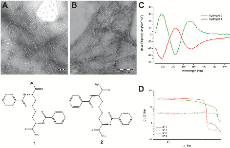
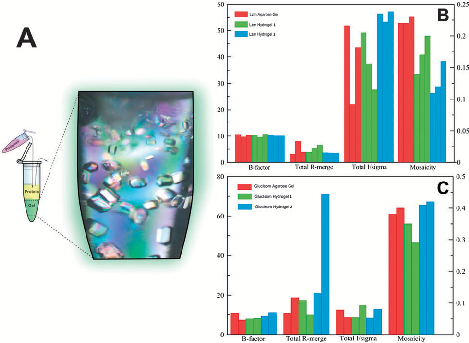
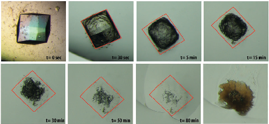

This article is licensed under aCreative Commons Attribution-NonCommercial 3.0 Unported Licence.

Open Access Article. Published on 29 January 2015. Downloaded on 3/3/2024 11:35:31 PM.

# ChemComm

| | | |
|---|---|---|
|C|OMMUNICATION View Article Online| |
| |View Journal | View Issue| |

Cite this: Chem. Commun., 2015, 51, 3862

Received 12th November 2014, Accepted 23rd January 2015

DOI: 10.1039/c4cc09024a www.rsc.org/chemcomm

Influence of the chirality of short peptide supramolecular hydrogels in protein crystallogenesis†

Mayte Conejero-Muriel,a Jose´ A. Gavira,*a Estela Pineda-Molina,a Adam Belsom,b Mark Bradley,b Mo´nica Moral,c Juan de Dios Garcı´a-Lo´pez Dura´n,c Ange´lica Luque Gonza´lez,d Juan J. Dı´az-Mocho´n,*d Rafael Contreras-Montoya,e A´ngela Martı´nez-Perago´n,e Juan M. Cuervae and Luis A´lvarez de Cienfuegos*e

the process of protein crystallization since gels are used as excellent media for crystallization.5 It is known that peptide hydrogels are able to form stereochemically well-defined 3D ordered structures6 and, therefore, the inherent chirality of peptides can interact diastereoisomerically with proteins, thus expecting different behaviors. It is worth noting that the structural simplicity of short peptides is essential for this purpose, allowing an easy access to their corresponding enantiomers. This property is not feasible with other common macromolecular hydrogels, which either have no stereocenters (polyacrylamide) or are constituted by the natural chiral product (agarose).

For the first time the influence of the chirality of the gel fibers in protein crystallogenesis has been studied. Enantiomeric hydrogels 1 and 2 were tested with model proteins lysozyme and glucose isomerase and a formamidase extracted from B. cereus. Crystallization behaviour and crystal quality of these proteins in both hydrogels are presented and compared.

Chirality is ubiquitous in nature and has major implications in cell interactions and biological processes. Within this topic, chiral discrimination on chiral surfaces has significant effects in protein adsorption and cellular adhesion and proliferation.1 It would be expected that similar chiral discrimination was relevant in 3D-enviroments, such as in protein crystallogenesis. Remarkably, the expected influence of the chirality in protein crystallogenesis remains unexplored probably owing to the difficulty in obtaining a pair of enantiomeric environments suitable for crystallization. In this sense, stereochemically welldefined fiber hydrogels can be used as ideal media to study the influence of the chirality in the process of crystal growth. Recently, peptide hydrogels have found useful applications in biology due to their biocompatible and biodegradable nature.2 It has been shown that these supramolecular fibrous aggregates interact selectively with proteins3 and also reduce denaturation.4 Considering this, we wondered if supramolecular hydrogels based on the self-assembly of short peptides could be compatible with

To test this hypothesis we selected two cysteine-based peptides, compound 1 (N,N0-di(benzoyl)-L-cysteine diamide) and its corresponding D enantiomer 2 (N,N0-di(benzoyl)-D-cysteine diamide) (Fig. 1) due to their capacity to self-assemble in neat water to give the corresponding hydrogels.7 They were tested with two model proteins, chicken HEWL lysozyme and glucose isomerase, and one target protein, a formamidase extracted from B. cereus being the first time that supramolecular peptide based hydrogels are used for this purpose. Additionally, the results were compared with crystal

- a Laboratorio de Estudios Cristalogra´ficos, Instituto Andaluz de Ciencias de la Tierra (CSIC-UGR), Av. de las Palmeras 4, 18100 Armilla, Granada, Spain. E-mail: jgavira@iact.ugr-csic.es
- b School of Chemistry, University of Edinburgh, West Mains Road, EH9 3JJ Edinburgh, UK
- c Dpt. de Fı´sica Aplicada, Facultad de Ciencias (UGR), 18071-Granada, Spain
- d Facultad de Farmacia, Dpt. de Quı´mica Farmace´utica y Orga´nica (UGR), Centre for Genomics and Oncological Research, Pfizer/UGR/Andalusian Regional Government, PTS Granada, Av. de la Ilustracio´n 114, 18016 Granada, Spain. E-mail: juandiaz@ugr.es
- e Dpt. de Quı´mica Orga´nica, Facultad de Ciencias (UGR), Spain. E-mail: lac@ugr.es † Electronic supplementary information (ESI) available: General experimental details, 1H NMR and 13C NMR of 1 and 2, VT-NMR and DSC spectra of hydrogels 1 and 2 and crystallization and crystallography data. See DOI: 10.1039/c4cc09024a

Fig. 1 Characterization of hydrogels 1 and 2 by TEM microscopy, circular dichroism and rheology. TEM images of negatively stained dried hydrogels at 3 mM: (A) 1; (B) 2. Scale bar at 0.2 mm. (C) CD spectra and (D) rheology of hydrogels 1 and 2.

This article is licensed under aCreative Commons Attribution-NonCommercial 3.0 Unported Licence.

Open Access Article. Published on 29 January 2015. Downloaded on 3/3/2024 11:35:31 PM.

growth in agarose gels to investigate their potential in protein crystallization.

Compounds 1 and 2 were selected from a family of 22 cysteine derivatives7 based on its capacity to form a stable and completely transparent hydrogel. TEM images of hydrogel 1 showed selfassembled nanofibers of diameters ranging from 10 to 20 nm and lengths that go up to mm in size (Fig. 1).8 Fibrous aggregates co-exist with regions where fibers are more dispersed. Hydrogel 2 presented fibers of the same aspect. To gain insight into the molecular arrangement of these hydrogels circular dichroism (CD) spectra were recorded (Fig. 1). Hydrogel 1 exhibited a negative band near 218 nm (np* transition), a positive band near 250 nm (ns* disulfide band and/or pp* of the aryl groups) and a negative band near 280 nm (pp* of the aryl groups) in good agreement with the CD spectrum from other oligopeptide hydrogels9 identified as the b-sheet conformations. The CD spectrum of hydrogel 2 is the specular image of hydrogel 1 showing that the chirality of the peptides is conserved and transferred supramolecularly to the fibers. Hydrogels 1 and 2 were also analyzed using a regime of simple oscillatory shear stress through frequency (see ESI†) and amplitude sweep tests. Both hydrogels showed G0 values (elastic modulus) higher than G00 values (viscous modulus) indicating the predominant elastic behavior of the gels (Fig. 1). Based on the magnitude of the values of G0, G00 and sc (G0 E 30 Pa; G00 E 4 Pa; sc o 1 Pa) we can conclude that these hydrogels are extremely weak. The similar values of G0 and G00 for hydrogels 1 and 2 confirm that both enantiomeric hydrogels have the same rheological properties. VT-NMR studies on both hydrogels showed that the signals of the aromatic region were shifted 0.5 ppm downfield as the temperature increased from 25 1C to 70 1C. The small values of T2 (1.84 s for the 7.74 ppm signal) and the negative values of nOe indicated that the 1H-NMR signals corresponded to aggregates of the di-peptide which are not higher enough to be NMR-silent.10 The stability of these aggregates indicated that Tgel should be higher than 70 1C. In fact in the 75/25 H2O/DMSO mixture, the reported value of Tgel for 1 was above 90 1C.8 DSC scans in both directions of hydrogels9c 1 and 2 did not show any endothermic or exothermic peaks. These results indicated continuous gel to sol and sol to gel transitions (see ESI†).

The two enantiomeric hydrogels 1 and 2 were then tested as the supramolecular media for protein crystallization. Following the procedure described in ESI,† protein was allowed to diffuse in the gel prior to the addition of the precipitant. Fig. 2A shows a typical counter-diffusion pattern of lysozyme crystals grown in hydrogel 1. The effect of hydrogels 1 and 2 on the quality of lysozyme crystals was evaluated from a set of lysozyme crystals prepared at beam-lines Xaloc (ALBA) following the standard quality criterion.11

Lysozyme crystals grown in hydrogel 2 were better than those obtained in hydrogel 1, reaching the resolution limit of the detector (0.95 Å) and having the best quality indicators in terms of I/s(I), Rmerge and mosaicity (Fig. 2B). The excellent reproducibility of crystals grown in hydrogel 2 (Fig. S1 and Table S2, ESI†) is also worth mentioning. Moreover crystal quality indicators of crystals grown in agarose (able to produce protein crystals of high quality5a,d)

Fig. 2 (A) Crystallization of lysozyme in hydrogel 1 using the 2L configuration of the counterdiffusion technique set-up in Eppendorf tubes schematically represented. The evolution of the supersaturation is easily followed from top to bottom as an increase of crystal size and the reduction of the nucleation density (right: optical microscopic picture under polarized light). (B) and (C) The average values of standard quality indicators of lysozyme and glucose isomerase crystals, respectively, grown in hydrogels 1, 2 and agarose from cryo-protected crystals diffracted at Xaloc beam-line (ALBA). Data sets were collected at 100 K keeping constant all data acquisition configuration set-up and analysis parameters.

were similar to those obtained in hydrogel 1 but still inferior to those in hydrogel 2. The agarose gel has been proven to facilitate the soaking of different compounds5a including cryoprotectants.12 In order to evaluate the possible cryo-protection capacity of these new hydrogels we compared the crystal quality of cryo-protected and ‘‘naked’’ (flash frozen without cryoprotectants) lysozyme crystals grown in hydrogel 1 and agarose from two data sets collected at beam-lines ID23 and BM30 (ESRF). It is important to notice that the polymeric nature of both agarose and hydrogel 1 allowed us to collect full data sets without the need to use any additive (Fig. S2, S3 and Table S3, ESI†).

A similar analysis was performed with glucose isomerase crystals grown in hydrogels 1, 2 and agarose. In this case crystals obtained in hydrogel 1 and agarose were more homogeneous and of better quality than those grown in hydrogel 2 (Fig. 2C, Table S4 and Fig. S4, ESI†). However, a second crystal form (P21212) was identified only in the experiments run with hydrogel 2 that co-exist with the other polymorph (I222), the form normally found under similar crystallization conditions. Dauter and co-workers have described a new crystal form (P21212) of glucose isomerase and have solved its structure (PDB ID. 1OAD).13,14 Remarkably, the polymorph found in hydrogel 2 presents different unit cell parameters (Å): 86.00, 93.68, 99.22 versus 98.45, 129.59, 78.33 for a, b and c, respectively (Fig. S4, ESI†). To date there has been only one PDB entry (PDB ID. 1O1H) with a similar unit cell and space group but obtained under different crystallization conditions.

The quality of this primitive orthorhombic crystal was the highest of all glucose isomerase crystals tested, with the structure determined at 1.20 Å and refined to R/Rfree values of 10.73/13.22 (%) (Table S5, ESI†). When compared with the model used for molecular replacement (PDB. ID 1OAD) the deviation of the main chain

This article is licensed under aCreative Commons Attribution-NonCommercial 3.0 Unported Licence.

Open Access Article. Published on 29 January 2015. Downloaded on 3/3/2024 11:35:31 PM.

ChemComm Communication

is minimal (rmsd of 0.3). It is worth mentioning that this new polymorph has only been obtained in free solution using other precipitants, as in the case of PDB ID. 1O1H that crystallized using MPD, or in the presence of high agarose concentration.5a In our case, under identical crystallization conditions, the P21212 polymorph was obtained only with hydrogel 2 and not in agarose at 0.5% (w/v), our control, suggesting a novel interaction between the chiral gel fibers and the protein at the nucleation stage. It has been previously demonstrated that the nature of the gel fibers, such as agarose15 and silica,16 affect protein nucleation density (promoted and inhibited, respectively) with no effect on the final crystal packing i.e. formation of new polymorphs. To date, the correlation between the protein–fiber interaction and polymorphism has been unknown. Taking into account that both chemical composition and the physical properties of the media are identical (hydrogels 1 and 2), we hypothesized that the formation of a different polymorph has to have an effect on the chirality at the nucleation state in terms of stabilization or induction of the second polymorph.

It is also known that the incorporation of hydrogel fibers into the protein crystal lattice occurs with agarose, silica and PEG hydrogels.5a,15a,16a,c,17 To prove that the same effect also occurs with peptide hydrogels, dissolution experiments of lysozyme crystals grown in hydrogel 1 were carried out (Fig. 3). This result showed that effectively the peptide fibers are incorporated within the protein crystals. The uncorrelated behavior of incorporation and nucleation effects opens a question on the different roles that gel nature can have in the whole process of protein crystallogenesis.

Finally, formamidase extracted from B. cereus was selected as a target protein to test its crystallizability using hydrogels 1, 2, and agarose as controls. Good diffracting crystals were already obtained by the capillary counter diffusion method diffracting to a maximum resolution of 1.78 Å (Table S6, ESI†). From previous experiments we knew that agarose used in combination with capillary counterdiffusion did not improve or even fully impeded crystallization. Crystals grown under three different crystallization conditions (Table S7, ESI†) were evaluated. Only cryo-protected crystals obtained in hydrogel 2 under the condition C18 of the GSK crystallization screening kit (Triana S&T, Granada, Spain) produced the best crystals to date (1.4 Å resolution limit, Table S6, ESI†). On the other hand, hydrogel 1 inhibited nucleation while crystals

Fig. 3 Dissolution sequence of a lysozyme crystal grown in hydrogel 1. Crystal extracted from the gel was placed in a water drop and allowed to dissolve (t = 0 s). A red square is drawn around the remaining hydrogel. The last picture was taken after partially drying the remaining gel framework.

grown in agarose were of low quality proving the different behavior of these hydrogels.

To sum up, we present the novel use of supramolecular hydrogels based on short-peptides in neat water for protein crystallization. These hydrogels, made of symmetrical L and D di-cysteine derivatives, were used to grow protein crystals of high quality. Differences in crystal quality and packing for the three proteins have been observed using enantiomeric hydrogels 1 and 2, suggesting a significant influence of the fibers’ chirality in the crystallization process. The formation of the orthorhombic polymorph of glucose isomerase and the growth of the highest quality crystals of formamidase exclusively in hydrogel 2 support this hypothesis. This fact highlights the relevance that chirality may have in protein crystallogenesis for X-ray structural determination. Moreover these supramolecular peptide based hydrogels are excellent mediators for protein crystallization producing lysozyme and glucose isomerase and formamidase crystals with excellent quality indicators. Peptide based hydrogels also acted as cryo-protectants avoiding the use of additives. Hence, these novel chiral gels would expand the field of protein crystallogenesis.

This research was funded by the MICINN (Spain) projects BIO2010-16800 (JAG), CTQ-2011.22455 (LAC & JMC), CTQ201234778 (JJDM & ALG), ‘‘Factorı´a Espan˜ola de Cristalizacio´n’’ Consolider-Ingenio 2010 (JAG & MCM) and EDRF Funds (JAG, LAC & JMC), P12-FQM-2721 (LAC) Junta de Andalucı´a. JJDM thanks MICINN for a R&C Fellowship and MCM thanks CSIC for her JAE Fellowship. We would like to thank Dr S. MartinezRodriguez for providing the plasmids of formamidase and B. Morel and E. Sa´nchez-Cobos for their help with the CD studies. We are very grateful to the staff at beam-line BM30, ID29 (ESRF) and Xaloc (ALBA) for support during X-ray data collection.

## Notes and references

- 1 W. Wei, C. Xu, N. Gao, J. Ren and X. Qu, Chem. Sci., 2014, 5, 4367–4374; G. Qing, S. Zhao, Y. Xiong, Z. Lv, F. Jiang, Y. Liu, H. Chen, M. Zhang and T. Sun, J. Am. Chem. Soc., 2014, 136, 10736–10742; K. Benson, H.-J. Galla and N. S. Kehr, Macromol. Biosci., 2014, 14, 793–798; Z. Li, A. Ko¨witsch, G. Zhou, T. Groth, B. Fuhrmann, M. Niepel, E. Amado and J. Kressler, Adv. Healthcare Mater., 2013, 2, 1377–1387; J. El-Gindi, K. Benson, L. De Cola, H.-J. Galla and N. S. Kehr, Angew. Chem., Int. Ed., 2012, 51, 3716–3720; M. Zhang, G. Qing and T. Sun, Chem. Soc. Rev., 2012, 41, 1972–1984.
- 2 J. Shi, X. Du, D. Yuan, J. Zhou, N. Zhou, Y. Huang and B. Xu, Biomacromolecules, 2014, 15, 3559–3568; A. Dasgupta, J. H. Mondal

- and D. Das, RSC Adv., 2013, 3, 9117–9149; N. Javid, S. Roy, M. Zelzer, Z. Yang, J. Sefcik and R. V. Ulijn, Biomacromolecules, 2013, 14, 4368–4376; R. Orbach, L. Adler-Abramovich, S. Zigerson, I. Mironi-Harpaz, D. Seliktar
- and E. Gazit, Biomacromolecules, 2009, 10, 2646–2651; F. Zhao, M. L. Ma and B. Xu, Chem. Soc. Rev., 2009, 38, 883–891.

- 3 Y. Kuang, D. Yuan, Y. Zhang, A. Kao, X. Du and B. Xu, RSC Adv., 2013, 3, 7704–7707; Y. Gao, M. J. C. Long, J. Shi, L. Hedstrom and B. Xu, Chem. Commun., 2012, 48, 8404–8406.
- 4 S. Kiyonaka, K. Sada, I. Yoshimura, S. Shinkai, N. Kato and

- I. Hamachi, Nat. Mater., 2004, 3, 58–64.

5 (a) S. Sugiyama, M. Maruyama, G. Sazaki, M. Hirose, H. Adachi, K. Takano, S. Murakami, T. Inoue, Y. Mori and H. Matsumura, J. Am. Chem. Soc., 2012, 134, 5786–5789; (b) Y. Diao, K. E. Whaley, M. E. Helgeson, M. A. Woldeyes, P. S. Doyle, A. S. Myerson, T. A. Hatton and B. L. Trout, J. Am. Chem. Soc., 2012, 134, 673–684; (c) J. A. Foster, M.-O. M. Piepenbrock, G. O. Lloyd, N. Clarke, J. A. K. Howard and

- J. W. Steed, Nat. Chem., 2010, 2, 1037–1043; (d) B. Lorber, C. Sauter,

- A. Theobald-Dietrich, A. Moreno, P. Schellenberger, M.-C. Robert,
- B. Capelle, S. Sanglier, N. Potier and R. Giege, Prog. Biophys. Mol. Biol.,

This article is licensed under aCreative Commons Attribution-NonCommercial 3.0 Unported Licence.

Open Access Article. Published on 29 January 2015. Downloaded on 3/3/2024 11:35:31 PM.

2009, 101, 13–25; (e) R. I. Petrova and J. A. Swift, J. Am. Chem. Soc., 2004, 126, 1168–1173; ( f ) C. Daiguebonne, A. Deluzet, M. Camara, K. Boubekeur, N. Audebrand, Y. Ge´rault, C. Baux and O. Guillou, Cryst. Growth Des., 2003, 3, 1015–1020.

- 6 G. Qing, X. Shan, W. Chen, Z. Lv, P. Xiong and T. Sun, Angew. Chem., Int. Ed., 2014, 53, 2124–2129; S. Marchesan, C. D. Easton, K. E. Styan, L. J. Waddington, F. Kushkaki, L. Goodall, K. M. McLean, J. S. Forsythe and P. G. Hartle, Nanoscale, 2014, 6, 5172–5180; S. Marchesan, Y. Qu, L. J. Waddington, C. D. Easton, V. Glattauer, T. J. Lithgow, K. M. McLean, J. S. Forsythe and P. G. Hartley, Biomaterials, 2013, 34, 3678–3687; J. Li, Y. Kuang, Y. Gao, X. Du, J. Shi and B. Xu, J. Am. Chem. Soc., 2013, 135, 542–545; S. Marchesan, C. D. Easton, F. Kushkaki, L. Waddington and P. G. Hartley, Chem. Commun., 2012, 48, 2195–2197; Y. Huang, Z. Qiu, Y. Xu, J. Shi, H. Lin and Y. Zhang, Org. Biomol. Chem., 2011, 9, 2149–2155; X. Yan, P. Zhu and J. Li, Chem. Soc. Rev., 2010, 39, 1877–1890.
- 7 A. Belsom, Doctor of Philosophy, PhD thesis, School of Chemistry, University of Edinburgh, 2010.
- 8 F. M. Menger and K. L. Caran, J. Am. Chem. Soc., 2000, 122, 11679–11691.
- 9 (a) S. Marchesan, L. Waddington, C. D. Easton, F. Kushkaki, K. M. McLean, J. S. Forsythe and P. G. Hartley, BioNanoScience, 2013, 3, 21–29; (b) S. Marchesan, L. Waddington, C. D. Easton, D. A. Winkler, L. Goodall, J. Forsythe and P. G. Hartley, Nanoscale, 2012, 4, 6752–6760; (c) S. Maity, P. Kumar and D. Haldar, Soft Matter, 2011, 7, 5239–5245.

- 10 D. C. Duncan and D. G. Whitten, Langmuir, 2000, 16, 6445–6452; B. Escuder, M. LLusar and J. F. Miravet, J. Org. Chem., 2006, 71, 7747–7752.
- 11 D. Maes, C. Evrard, J. A. Gavira, M. Sleutel, C. Van De Weerdt, F. Otalora, J. M. Garcia-Ruiz, G. Nicolis, J. Martial and K. Decanniere, Cryst. Growth Des., 2008, 8, 4284–4290.
- 12 C. Biertumpfel, J. Basquin, D. Suck and C. Sauter, Acta Crystallogr., Sect. D: Biol. Crystallogr., 2002, 58, 1657–1659.
- 13 U. A. Ramagopal, M. Dauter and Z. Dauter, Acta Crystallogr., Sect. D: Biol. Crystallogr., 2003, 59, 868–875.
- 14 C. M. Gillespie, D. Asthagiri and A. M. Lenhoff, Cryst. Growth Des., 2013, 14, 46–57.
- 15 (a) J. A. Gavira and J. M. Garcia-Ruiz, Acta Crystallogr., Sect. D: Biol. Crystallogr., 2002, 58, 1653–1656; (b) O. Vidal, M. C. Robert and F. Boue´, J. Cryst. Growth, 1998, 192, 257–270.
- 16 (a) J. A. Gavira, A. E. S. V. Driessche and J. M. Garcia-Ruiz, Cryst. Growth Des., 2013, 13, 2522–2529; (b) O. Vidal, M. C. Robert and F. Boue´, J. Cryst. Growth, 1998, 192, 271–281; (c) J. M. Garcı´a-Ruiz, J. A. Gavira, F. Ota´lora, A. Guasch and M. Coll, Mater. Res. Bull., 1998, 33, 1593–1598.
- 17 J. A. Gavira, A. Cera-Manjarres, K. Ortiz, J. Mendez, J. A. JimenezTorres, L. D. Patin˜o-Lopez and M. Torres-Lugo, Cryst. Growth Des., 2014, 14, 3239–3248.

