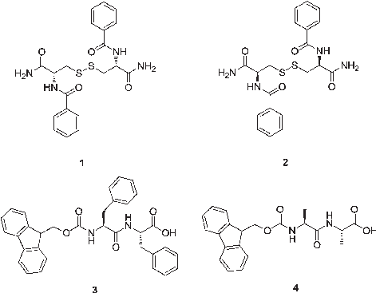
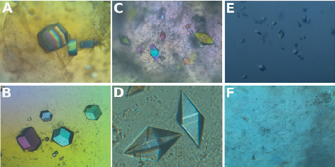
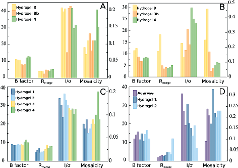
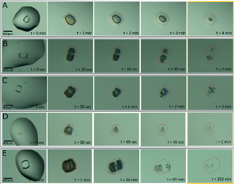
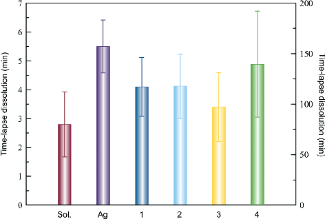
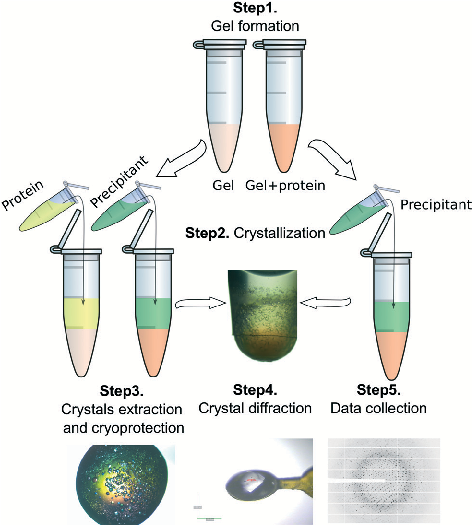

This article is licensed under aCreative Commons Attribution-NonCommercial 3.0 Unported Licence.

Open Access Article. Published on 08 June 2015. Downloaded on 3/3/2024 11:36:28 PM.

# CrystEngComm

| | | |
|---|---|---|
| | | |

#### View Article Online

## PAPER

View Journal | View Issue

Cite this: CrystEngComm, 2015, 17, 8072

## Protein crystallization in short-peptide supramolecular hydrogels: a versatile strategy towards biotechnological composite materials†

Mayte Conejero-Muriel,a Rafael Contreras-Montoya,b Juan J. Díaz-Mochón,*c Luis Álvarez de Cienfuegos*b and José A. Gavira*a

Received 30th April 2015, Accepted 8th June 2015

DOI: 10.1039/c5ce00850f

www.rsc.org/crystengcomm

Protein crystallization in hydrogels has been explored with the main purpose of facilitating the growth of high quality crystals while increasing their size to enhance their manipulation. New avenues are currently being built for the use of protein crystals as source materials to create sensors and drug delivery vehicles, to name just a few. In this sense, short-peptide supramolecular hydrogels may play a crucial role in integrating protein crystals within a wider range of applications. In this article, we show that protein crystallization in short-peptide supramolecular hydrogels is feasible and independent of the type of peptide that forms the hydrogel and/or the protein, although the output is not always the same. As a general trend, it is confirmed that hydrogel fibers are always incorporated within crystals so that novel composite materials for biotechnological applications with enhanced properties are produced.

### Introduction

Indeed, crystals of exceptional size and quality are obtained within hydrogels when compared with other traditional crystallization techniques. This can be explained by (i) the physical properties of the hydrogel which eliminates sedimentation, convection current7 and acts as impurity filter media,8 and (ii) their molecular influence, as hydrogel fibers can interact directly with protein molecules,9,10 having a final composite formed by polymeric fibers of agarose,11 silica,12,13 and PEG-based hydrogels,14 incorporated within the crystal lattices of protein crystals. This incorporation occurs during the growth process, thus influencing crystal polymorphism,15 enantiomorphism,16 habits17 and stabilities.18

The field of protein crystallization is of crucial importance to unveil the secrets of biological systems at the molecular level.1 It has an immediate impact in structural proteomic/ genomic projects as well as in rational drug design. For this reason, growing crystals of adequate size and quality for X-ray diffraction is often the major bottleneck. Many different factors have an influence on the whole process of protein crystallization and therefore a multitude of methods, strategies and techniques have been developed to attain success.1–3 In most cases, the optimal strategy to obtain crystals of a particular protein is found serendipitously.4 One emerging strategy in this field employs the use of hydrogels as media or carriers for the growth of protein crystals.5 It has been demonstrated that the use of conventional macromolecular hydrogels such as agarose, polyacrylamide, silica and sephadex has a direct impact on the formation of protein crystals and their quality.6

Considering this, very recently we have shown that novel short-peptide supramolecular hydrogels serve as convective free media to grow protein crystals of high quality.19 This family of supramolecular hydrogels, which have already been used successfully in a wide range of biomedical applications due to their biocompatibility,20–24 has been now revealed as excellent media for protein crystallization, thus expanding the number of biotechnological applications that these materials can be developed for. Since polymeric hydrogel fibers are incorporated within the crystal structures of proteins, we reasoned that the peptidic nature of supramolecular hydrogel fibers could act as a native environment for proteins. More importantly, given that these peptide fibers are chiral, we thought that they would be ideal media to study the influence of chirality in the process of protein crystallization. Although there are scarce examples in the literature about this influence, recently, the group of Asherie has proved that the chirality of small additives has an effect on the crystal

aLaboratorio de Estudios Cristalográficos, Instituto Andaluz de Ciencias de la Tierra (Consejo Superior de Investigaciones Científicas-Universidad de Granada), Avenida de las Palmeras 4, 18100 Armilla, Granada, Spain. E-mail: jgavira@iact.ugr-csic.es bDepartamento de Química Orgánica, Facultad de Ciencias, (UGR), Spain. E-mail: lac@ugr.es cDepartamento de Química Farmacéutica y Orgánica, Facultad de Farmacia (UGR), Centre for Genomics and Oncological Research: Pfizer/University of Granada/Andalusian Regional Government, PTS Granada, Avenida de la Ilustración 114, 18016 Granada, Spain. E-mail: juandiaz@ugr.es † Electronic supplementary information (ESI) available: Crystallization, dissolution and crystallography data. See DOI: 10.1039/c5ce00850f

This article is licensed under aCreative Commons Attribution-NonCommercial 3.0 Unported Licence.

Open Access Article. Published on 08 June 2015. Downloaded on 3/3/2024 11:36:28 PM.

quality of lysozyme25 and the habit of thaumatin.26 Similarly, we have also found a chiral influence on the crystal growth and quality of model proteins using homochiral peptidic hydrogels. To reinforce these preliminary results and to study in more detail the influence of chirality in protein crystallization, the use of a bigger number of homochiral hydrogels was required. There is a wide range of low molecular weight gelators (LMWG) that could be tested for protein crystallization showing different strengths and fiber properties as a function of their composition and preparation conditions.27 In the present article, we have extended the process of protein crystallization using short-peptide supramolecular hydrogels of the well-known Fmoc-dipeptides family28–31 and tested them with different proteins. These types of hydrogels have already been used to produce silver crystalline nanoclusters as an elegant application of peptide-based hydrogels for green chemistry applications.32 Peptide-based hydrogels have the advantages of generating hydrogels at room temperature under mild conditions, thus allowing direct mixing of the protein with the hydrogel.

Our results show that short-peptide-based hydrogels are alternative media to obtain high quality protein crystals. Moreover, some particular protein–hydrogel combinations produced crystals that diffract X-ray at atomic resolution, therefore justifying the use of novel peptide-based hydrogels. As the incorporation of the hydrogel is proven in all tested proteins, this is a versatile strategy to produce novel composite materials with potential biotechnological applications.

### Results and discussion

We have recently shown that cysteine-based peptide IJN,N′diIJbenzoyl)-L/D-cysteine diamide) hydrogels 1 and 2 are not only compatible with protein crystallogenesis producing crystals that diffract X-ray to a very high resolution, but also effectively behave as homochiral defined media that allow the study of chirality in crystallogenesis.19 These novel results bring new expectations to the field of protein crystallization and can generate an enormous interest for this kind of material. To increase the applicability of these media and to make them user-friendly to structural laboratories, these peptides have to be commercially available and their respective hydrogels have to be easily prepared. With this idea in mind, in this work we tested two commercially available short peptides, Fmoc-FF-OH and Fmoc-AA-OH, capable of forming supramolecular hydrogels (3 and 4, respectively) under mild conditions following a simple protocol, as well as the already tested hydrogels 1 and 2 (Fig. 1). We then selected four model proteins, namely lysozyme, thaumatin, glucose isomerase and insulin, to cover a wider range of molecular masses and isoelectric points (Table 1), and a formamidase from B. cereus that produced a crystal with the highest resolution ever reported using the dicysteine-based peptide hydrogel 2 as media. With these selected media (hydrogels 1 to 4), we studied the influence that both chemical compositions (3 vs. 4

Fig. 1 Short peptide derivatives that are able to form supramolecular hydrogels.

and vs. cysteine-dipeptides) and chirality (L vs. D-dicysteine) has in protein crystallogenesis.

The selected Fmoc-dipeptide hydrogels 3 and 4 can be easily prepared by solvent switch as it has been previously described by the group of Gazit,33 and as explained in the Experimental section (see below). The possibility of generating the hydrogels at room temperature with a mixture of water and 1,1,1,3,3,3-hexafluoro-2-propanol (HFIP) allowed, for the first time, the in situ formation of hydrogel using a protein solution. We selected hydrogel 3 to set-up two types of experimental protocols: (i) diffusion of protein solution placed on top of the hydrogel (3) and (ii) in situ mixing of the protein solution and hydrogel precursor (3b).

Our results showed that the four selected peptide-based hydrogels (1–4) were compatible with protein crystallization (Table 1). In Fig. 2, examples of well-faceted crystals of all selected proteins in hydrogels 1–4 are shown. For each protein, crystals grown in different hydrogels always presented the same shape, varying only in number and size. Preliminary crystallization experiments with insulin also produced crystals in hydrogels 1, 2 and 4.

Following our previous work, lysozyme was first assayed to study the influence of hydrogel chirality (1 vs. 2) and chemical composition (3 vs. 4 and vs. cysteine-dipeptides). Taking into account the fact that counter-diffusion experiments produce a supersaturation gradient, crystal number and size vary along the hydrogel tube with the biggest crystals appearing at the bottom of the Eppendorf tube. Therefore, we compared the crystals of the biggest size from each hydrogel. In all experiments, a typical development of the counter-diffusion technique was observed. Crystal obtained in hydrogels 1 and

- 2 were of similar size of around 350 to 400 μm in their longer axis (Table S1†). However, crystals grown in hydrogel 4 were bigger (489 μm) than those grown in 3 (167 μm), as expected from the higher nucleation density. Nucleation induction in
- 3 was even higher than in agarose, a well-known nucleation promoter of tetragonal lysozyme.10 This behavior was

This article is licensed under aCreative Commons Attribution-NonCommercial 3.0 Unported Licence.

Open Access Article. Published on 08 June 2015. Downloaded on 3/3/2024 11:36:28 PM.

- B factor, while crystals obtained in hydrogel 3 diffracted X-ray beyond 1.1 Å, even higher than our previous results with hydrogels 1 and 2, and agarose (Table S3†). From these results we could not infer any chirality effect, while a clear influence of the chemical composition was observed on the evolution of nucleation (i.e. crystal size).

Glucose isomerase was previously studied in hydrogels 1 and 2 showing a strong chirality influence on polymorphism. Here, a clear effect on the evolution of the crystallization was also found. In 1, a higher nucleation density, giving rise to crystals (48 μm) smaller than 2 (196 μm), was observed (Table S1†). Chemical compositions also had a role in the control of the nucleation as deduced from the difference in average maximum crystal size, being 346 μm and 209 μm in 3 and 4, respectively. In this case, crystals obtained in hydrogel 3 had a similar quality to crystals grown in 1 and 2, as published previously.19 The best quality crystals were obtained in those grown in hydrogels 4 and 3b. It is also remarkable that in both cases, with lysozyme and glucose isomerase, crystals obtained with the in situ mixed set-up were of the highest quality among all the tested hydrogels even in the presence of HFIP (Fig. 3B and Table S4†).

Thaumatin was also studied. Its crystallization behaviour was also affected by the hydrogel nature. Crystals obtained in hydrogels 2 and 3 and agarose were of similar size with a maximum length of approximately 400 μm, while in the case of crystals grown in 1 and 4 the maximum length was 143 μm which corresponded to a higher nucleation density. Therefore, both the chirality and chemical composition influenced the nucleation behaviour of thaumatin. In this case, the in situ mixed set-up did not produce any crystal but a full aggregation of the mix. This may be due to either the presence of the solvent HFIP or the interaction between the protein and the hydrogel precursor.

Thaumatin crystal qualities were remarkably good in all hydrogels. Small differences were observed at the resolution limit level. For instance, crystals from 1 and 2 are comparable to the best crystals grown in agarose,6 diffracting X-ray at the attainable limit with the used configuration 1.05 Å (Fig. 3C and Table S5†).

Once more, there were clear effects arising from chirality and chemical composition. It is worth noting that crystals of similar size obtained in hydrogels 1 and 4 (two chemical

Table 1 Summary of the main characteristics of all tested proteins, initial crystallization conditions and hydrogels assayed

Protein information Protein conc. (mg ml−l) Precipitant

T MW pI Chargeb (°C) Agarose 1 2 3 3b 4

Lysozyme 14313 9.04 13.0 200 91a 6% w/v NaCl, 50 mM sodium acetate (pH 4.5) 20 C C C X X X Glucose isomerase

43227 5.17 16.6 120 90/50/40a 10% PEG 1 K, 0.2 M MgCl2, 0.1 M Hepes (pH 7.0) 20 C C C X X X

Thaumatin 22205 7.93 2.0 100 160/50a 45% IJw/v) potassium sodium tartrate (pH 7.56) 20 C X X X X X Formamidase 38632 5.93 16.4 28 14.5a 25% PEG 4 K, 0.2 M NH4 sulphate, 0.1 M sodium

acetate (pH 4.6)

20 C X C O O O

Insulin 17260 5.59 −5.1 6 0.9/1.8/2.7a 30% acetone, 2 mM ZnCl2, 28 mM sodium citrate (pH 7.0)

4 X X X O O C

- C: crystals were obtained, X: crystals were characterized by X-ray diffraction, O: no crystals. a Final protein concentration after mixing with the hydrogel precursor. b Net charge at the crystallization pH.

observed using both experimental set-ups 3 and 3b. In terms of X-ray diffraction, there were no remarkable differences among all the hydrogels (Fig. 3A). However, it is worth mentioning that crystals obtained in hydrogel 4 showed a slightly lower quality, i.e. lower resolution limit, higher mosaicity and

Fig. 2 Crystals of lysozyme (A), glucose isomerase (B), thaumatin (C and D), insulin (E) and FASE (F) grown in hydrogels 4, 3, 2, 4, 2 and 1, respectively.

Fig. 3 Average values of the X-ray standard quality indicators for lysozyme (A), glucose isomerase (B), thaumatin (C) and insulin (D) crystals grown in different peptide-based hydrogels and in agarose from data sets collected at Xaloc beam-line (ALBA) or ID23-1 (ESRF) (Tables S2–S6†).

This article is licensed under aCreative Commons Attribution-NonCommercial 3.0 Unported Licence.

Open Access Article. Published on 08 June 2015. Downloaded on 3/3/2024 11:36:28 PM.

environments) were of different qualities, while those grown in 1 and 2 have the same chemical environment but different chiralities; their crystal sizes were different but their qualities were comparable.

Preliminary experiments with insulin were also carried out using hydrogels 1 and 2 and agarose. Crystals were obtained in all the cases in low number and of small size (Fig. 2E). The low nucleation density after several months indicates that the range of concentration selected (supersaturation) was too low. Still, all crystals grown in hydrogels 1 and 2 were of similar quality to crystals grown in agarose, diffracting X-ray to a high resolution of 1.5 Å (Fig. 3D and Table S6†).

A new set of experiments has been conducted including

- hydrogel 3 (using both experimental set-ups) and 4. Until now, crystals of similar size have been obtained in 4 but no nucleation has been observed with 3 for the same period of time, which can be attributed to an inhibition effect when compared with 1, 2, 4 and agarose.

We also studied the target protein FASE which produced the best crystals ever obtained in hydrogel 219 in order to test the potential of hydrogels 3 and 4, including hydrogel 1 which did not produce good diffracting crystals in our previous study. Surprisingly, in this case, crystals were only obtained in hydrogel 1. More interestingly, the crystals were flat hexagonal plates (Fig. 2F), which diffracted X-ray to a resolution of 2.7 Å (Table S7†); the polymorph obtained, P622, was different than the previous one, C121, obtained in hydrogel 2.19 This new polymorph obtained only in 1 reinforces the role of chirality in polymorphism and agrees with our previous finding with glucose isomerase. This result needs to be confirmed upon structural determination from improved crystals of FASE.

We also studied the influence of the different hydrogels on the dissolution of lysozyme, glucose isomerase and thaumatin. We initially characterized the dissolution behaviour of the model protein crystals obtained in solution by transferring the crystals into pure MilliQ water (see the Experimental section for details). Lysozyme crystals of 290 μm dissolved almost completely in approximately 100 seconds (Fig. S1A†). Unexpectedly, glucose isomerase crystals lasted for more than 4 hours (Fig. S1B†) and in the case of thaumatin crystals, the complete dissolution required 24 hours (Fig. S1C†). As pointed out by Jones and Ulrich, protein crystals may be considered as solvates of salts,34 which may explain the complex dissolution behaviour observed with the lysozyme polymorph.35,36

Lysozyme crystals grown in agarose and hydrogels 1, 2 and 3 dissolved, in average, slower than hydrogel-free grown crystals (Fig. 4). This can be simply explained by the fact that protein crystals incorporate hydrogel fibers during their growth11,14,37 and therefore, proteins have to diffuse through the protein-free hydrogel. Surprisingly, the crystal obtained in

- hydrogel 4 lasted for 2 hours and a half, and this long time could not be explained by the crystal size, since both were of similar size (Fig. 4 and Table S1†). We repeated the dissolution experiment four more times for crystals grown in

- Fig. 4 Time-lapse dissolution experiments of lysozyme crystals obtained in agarose (A), hydrogel 1 (B), 2 (C), 3 (D) and 4 (E). The first column shows the cleaned crystals in a 2 μL isotonic precipitant solution. Note the bar size scale at the bottom left of the first pictures. The second column and subsequent columns correspond to the dissolution of each crystal when transferred to a 200 μL drop of MilliQ water. The time evolution is shown in each image. For comparison purposes, the last column is grouped in a yellow border, and the time of the almost final dissolution step is noted in the same time unit.

- Fig. 5 Average dissolution time of tetragonal lysozyme crystals grown in a hydrogel-free solution and in hydrogels including agarose. Since crystals from hydrogel 4 lasted much longer, we have plotted their dissolution time separately at the right axis.

hydrogel 4 and three more times for crystals grown in agarose, giving out an average dissolution time of 139.6 ± 52.4 min and 5.5 ± 0.91 min for 4 and agarose, respectively (Fig. 5 and Table S8†).

We followed a similar protocol to study the dissolution experiments of glucose isomerase (Fig. S2†). As already mentioned, the dissolution of hydrogel-free crystals lasted longer than expected. Surprisingly, the presence of the hydrogels in all the cases seems to accelerate the dissolution process. This effect was evidently less pronounced in the case of 2 (Table S8 and Fig. S4A†) and also in crystals grown in 1 if we correlate the size of the crystal with the dissolution time. The

This article is licensed under aCreative Commons Attribution-NonCommercial 3.0 Unported Licence.

Open Access Article. Published on 08 June 2015. Downloaded on 3/3/2024 11:36:28 PM.

same correlation for 3 and 4 showed that the dissolution rate (aprox. 3.2 μm min−1) was the same in both hydrogels, and faster than that for 1 and 2 (approx. 0.7 μm min−1).

Thaumatin represented an extreme case in this study. The dissolution of the hydrogel-free crystals took more than one day for crystals of 390 μm. These results also conditioned the dissolution experiments for all hydrogels (Fig. S3†). Table S8 and Fig. S4B† show that the dissolution time of crystals from 1 and 2 were similar among them but different than those from hydrogels 3 and 4, which both quadrupled the dissolution time compared to the hydrogel-free crystals. From these results, it is clear that chirality does not have an effect on protein crystal dissolution, while subtle changes in the chemical composition have a major impact on the crystal dissolution.

### Experimental

All materials were of analytical grade and used without further purification. Compounds 1 and 2 were synthesized by the solid phase protocol previously described by us.19 FmocFF and Fmoc-AA were bought from Bachem.

Gel preparation

Hydrogels 1 and 2 (0.1% w/v) were prepared in MilliQ water by heating in a closed vial, as previously described.19 Hydrogels 3 and 4 (0.5% w/v) were prepared by dissolving the peptide in 5 μL of DMSO to a final concentration of 100 mg mL−1 followed by the addition of 100 μL of MilliQ water. The excess DMSO in the formed hydrogels was then removed by the addition of an excess of MilliQ water in each Eppendorf tube for 12 hours. This process was repeated several times for a week.

Since DMSO is not compatible with protein crystallization, HFIP was selected for the in situ protein–hydrogel formation.

For the in situ protein–hydrogel incorporation, hydrogels 3 and 4 were prepared by dissolving the peptide (50 mg mL−1) in 10 μL of HFIP followed by the addition of 100 μL of protein solution in MilliQ water to generate hydrogels at the same final concentration (0.5% w/v). The proteins and concentrations used for these experiments are summarized in Table 1.

Protein preparation and production

Several commercial proteins and FASE from B. cereus were selected to cover a wider range of molecular masses and isoelectric points (Table 1).

Lysozyme (chicken HEWL), thaumatin from Thaumatococcus daniellii and recombinant human insulin were purchased as lyophilized powders from Sigma (L6876, T7638 and I2643, respectively). Glucose isomerase IJD-xylose-ketol-isomerase) from S. rubiginosus was purchased as a crystal suspension from Hampton Research (HR7-100). Lysozyme was dissolved and dialyzed in 50 mM sodium acetate (pH 4.5). Glucose isomerase crystals were dissolved in water and extensively dialyzed against 100 mM Hepes (pH 7.0). Thaumatin was dissolved in water. Insulin was dissolved in 6 mM HCl, 5 mM ZnCl2 and 28 mM sodium citrate (pH 7.0).

B. cereus formamidase (FASE) was expressed in E. coli BL21 (DE3) and purified following an already described protocol. Concentrated protein in 20 mM Tris-HCl (pH 8.0) was used for crystallization assays.

Crystallization experiments

Counter-diffusion technique with a two layer configuration (2 L)38 was used to set-up crystallization experiments in Eppendorf tubes (Fig. S5†). Two different set-ups were tested. In the first case the protein was allowed to diffuse within a preset hydrogel column (50 μL) for one week while in the second case protein solutions were directly mixed with the hydrogel precursor to a final volume of 50 μL, as explained above, and allowed to gel. Then, 50 μL of the precipitant solution was added on top of the hydrogel plus the protein layer to start the crystallization experiment. A schematic representation of both procedures is illustrated in Fig. 6 and the crystallization conditions are summarized in Table 1.

Experiments were performed at 20 °C except for the insulin experiments that were performed at 4 °C.

Crystal dissolution

Crystals were extracted from the hydrogels and deposited in a plastic Petri dish. The bigger range sized protein crystals

Fig. 6 Crystallization set-ups: step 1, (left) protein is allowed to diffuse within a preset hydrogel for 1 week or (right) directly mixed with the hydrogel precursor; step 2, protein is removed (left) and the precipitant is allowed to diffuse within the hydrogel containing protein; step 3, crystals are extracted from the Eppendorf tube and collected with the help of a LithoLoop; step 4, crystals are cryo-protected with 15/20% v/v glycerol prior to flash-cooling in liquid nitrogen; step 5, data collection is carried out at a synchrotron source.

This article is licensed under aCreative Commons Attribution-NonCommercial 3.0 Unported Licence.

Open Access Article. Published on 08 June 2015. Downloaded on 3/3/2024 11:36:28 PM.

were selected to carry out the dissolution experiments. Crystals were first cleaned with their recovered precipitant solution and finally placed in a 2 μL drop of isotonic precipitant solution. After that, the crystals were transferred to a 200 μL drop of MilliQ water (t = 0 s) and the dissolution evolution was monitored with an optical microscope at room temperature. The Petri dish was kept sealed with vacuum grease to avoid evaporation. In experiments with a higher nucleation density, a group of small crystals contained in the hydrogel was transferred to the 200 μL drop of MilliQ. Pictures were acquired with a ProgRes® CapturePro 2.8 detector (JENOPTIK optical systems, GmbH). Selected crystals were measured and used to determine the average crystal size. For comparison purposes, we have used the longest dimensions of each measurement.

X-ray data collection and analysis

Crystal quality was determined using X-ray diffraction data collected at beam-lines Xaloc (ALBA) and ID23-1 (ESRF) of the Spanish and European synchrotron radiation sources. Briefly, crystals were extracted from the hydrogel using a Pipetman (200 μL) with the tip-end cut and deposited in a plastic Petri dish. Drops of the recovered precipitant or the precipitant plus a cryoprotectant (20% v/v glycerol) were deposited nearby. Selected crystals were transferred to either the precipitant solution for final cleaning, or directly to the cryoprotectant solution with the help of a LithoLoop (Molecular Dimensions Inc.). Crystals were then flash-cooled in liquid nitrogen and saved for data collection. Data collection configuration was kept constant (Table S2†) for each series and protein except for glucose isomerase which was completed from data collected at the ESRF (Tables S3 to S7†).

### Conclusions

Our results demonstrate that short-peptide supramolecular hydrogels are excellent media to obtain high-quality protein crystals. The incorporation of supramolecular hydrogels to the standard chemical toolbox, used to obtain protein crystals, needs to be considered. The influence of the hydrogels on the crystallogenesis of proteins overcomes the structural influence of the hydrogel, since all tested hydrogels can be considered identical from the structural point of view, highlighting the chemical relevance to the point of stereochemical contribution. As demonstrated in this work, enantiomeric hydrogels influence differently the nucleation and growth of the same protein. Dramatic effects were also observed when the chemical differences between hydrogels are considered. We have further investigated the possibility of mixing in situ the protein solution with the hydrogel precursor in the case of Fmoc-FF-OH (3) and showed that, except for thaumatin, this preparation procedure is feasible, facilitating the use of peptide-based hydrogels as a tool to improve crystal quality. The influence of the hydrogel on the final crystal size could not be correlated with the final crystal quality as characterized from the X-ray diffraction experiments.

We have proven that it is possible to find the right protein–gel couple to produce materials of specific composition with particular properties, dissolution rate, polymorphism, etc., which may be exploited either technologically or pharmaceutically.

### Acknowledgements

This research was funded by the MICINN (Spain) projects BIO2010-6800 (JAG), CTQ2012-34778 (JJDM), and “Factoría Española de Cristalización” Consolider-Ingenio 2010 (JAG & MCM), and by Junta de Andalucía (Spain) project P12-FQM2721 (LAC). EDRF funds JAG, LAC & JMC. JJDM thanks MICINN for a Ramon y Cajal Fellowship and MCM thanks CSIC for her JAE Fellowship. We would like to thank Dr. S. Martinez-Rodriguez for providing us with the plasmid for the production and purification of formamidase. We are very grateful to the staff at beam-line Xaloc of ALBA (Spain) and ID23-1 of the ESRF (France) synchrotron radiation sources for support during data collection.

### Notes and references

- 1 A. McPherson and J. A. Gavira, Acta Crystallogr., Sect. F: Struct. Biol. Cryst. Commun., 2014, 70, 2–20.
- 2 V. M. Bolanos-Garcia and N. E. Chayen, Prog. Biophys. Mol. Biol., 2009, 101, 3–12.
- 3 E. Saridakis, S. Khurshid, L. Govada, Q. Phan, D. Hawkins, G. V. Crichlow, E. Lolis, S. M. Reddy and N. E. Chayen, Proc. Natl. Acad. Sci. U. S. A., 2011, 108, 11081–11086.
- 4 A. Garcia-Caballero, J. A. Gavira, E. Pineda-Molina, N. E. Chayen, L. Govada, S. Khurshid, E. Saridakis, A. Boudjemline, M. J. Swann, P. Shaw Stewart, R. A. Briggs, S. A. Kolek, D. Oberthuer, K. Dierks, C. Betzel, M. Santana, J. R. Hobbs, P. Thaw, T. J. Savill, J. R. Mesters, R. Hilgenfeld, N. Bonander and R. M. Bill, Cryst. Growth Des., 2011, 11, 2112–2121.
- 5 S. Sugiyama, N. Shimizu, G. Sazaki, M. Hirose, Y. Takahashi, M. Maruyama, H. Matsumura, H. Adachi, K. Takano, S. Murakami, T. Inoue and Y. Mori, Cryst. Growth Des., 2013, 13, 1899–1904.
- 6 B. Lorber, C. Sauter, A. Theobald-Dietrich, A. Moreno, P. Schellenberger, M.-C. Robert, B. Capelle, S. Sanglier, N. Potier and R. Giege, Prog. Biophys. Mol. Biol., 2009, 101, 13–25.
- 7 H. K. Henisch and J. M. García-Ruiz, J. Cryst. Growth, 1986, 75, 195–202.
- 8 A. E. S. Van Driessche, F. Otálora, J. A. Gavira and G. Sazaki, Cryst. Growth Des., 2008, 8, 3623–3629.
- 9 O. Vidal, M. C. Robert and F. Boue, J. Cryst. Growth, 1998, 192, 271–281.
- 10 O. Vidal, M. C. Robert and F. Boué, J. Cryst. Growth, 1998, 192, 257–270.
- 11 J. A. Gavira and J. M. García-Ruiz, Acta Crystallogr., Sect. D: Biol. Crystallogr., 2002, 58, 1653–1656.

This article is licensed under aCreative Commons Attribution-NonCommercial 3.0 Unported Licence.

Open Access Article. Published on 08 June 2015. Downloaded on 3/3/2024 11:36:28 PM.

- 12 J. M. García-Ruiz, J. A. Gavira, F. Otálora, A. Guasch and M. Coll, Mater. Res. Bull., 1998, 33, 1593–1598.
- 13 J. A. Gavira, A. E. S. V. Driessche and J.-M. Garcia-Ruiz,

- Cryst. Growth Des., 2013, 13, 2522–2529.

14 J. A. Gavira, A. Cera-Manjarres, K. Ortiz, J. Mendez, J. A. Jimenez-Torres, L. D. Patiño-Lopez and M. Torres-Lugo,

- Cryst. Growth Des., 2014, 14, 3239–3248.

- 15 C. Daiguebonne, A. Deluzet, M. Camara, K. Boubekeur, N. Audebrand, Y. Gérault, C. Baux and O. Guillou, Cryst. Growth Des., 2003, 3, 1015–1020.
- 16 R. I. Petrova and J. A. Swift, J. Am. Chem. Soc., 2004, 126, 1168–1173.
- 17 R. I. Petrova, R. Patel and J. A. Swift, Cryst. Growth Des., 2006, 6, 2709–2715.
- 18 S. Sugiyama, M. Maruyama, G. Sazaki, M. Hirose, H. Adachi, K. Takano, S. Murakami, T. Inoue, Y. Mori and H. Matsumura, J. Am. Chem. Soc., 2012, 134, 5786–5789.
- 19 M. Conejero-Muriel, J. A. Gavira, E. Pineda-Molina, A. Belsom, M. Bradley, M. Moral, J. D. D. G.-L. Durán, A. L. González, J. J. Díaz-Mochón, R. Contreras-Montoya, Á. Martínez-Peragón, J. M. Cuerva and L. Álvarez de Cienfuegos, Chem. Commun., 2015, 51, 3862–3865.
- 20 J. Shi, X. Du, D. Yuan, J. Zhou, N. Zhou, Y. Huang and B. Xu, Biomacromolecules, 2014, 15, 3559–3568.
- 21 A. Dasgupta, J. H. Mondal and D. Das, RSC Adv., 2013, 3, 9117–9149.
- 22 N. Javid, S. Roy, M. Zelzer, Z. Yang, J. Sefcik and R. V. Ulijn, Biomacromolecules, 2013, 14, 4368–4376.
- 23 R. Orbach, L. Adler-Abramovich, S. Zigerson, I. MironiHarpaz, D. Seliktar and E. Gazit, Biomacromolecules, 2009, 10, 2646–2651.

- 24 F. Zhao, M. L. Ma and B. Xu, Chem. Soc. Rev., 2009, 38, 883–891.
- 25 M. Stauber, J. Jakoncic, J. Berger, J. M. Karp, A. Axelbaum, D. Sastow, S. V. Buldyrev, B. J. Hrnjez and N. Asherie, Acta Crystallogr., Sect. D: Biol. Crystallogr., 2015, 71, 427–441.
- 26 N. Asherie, J. Jakoncic, C. Ginsberg, A. Greenbaum, V. Stojanoff, B. J. Hrnjez, S. Blass and J. Berger, Cryst. Growth Des., 2009, 9, 4189–4198.
- 27 J. Raeburn, A. Zamith Cardoso and D. J. Adams, Chem. Soc. Rev., 2013, 42, 5143.
- 28 L. Adler-Abramovich and E. Gazit, Chem. Soc. Rev., 2014, 43, 6881–6893.
- 29 G. Fichman and E. Gazit, Acta Biomater., 2014, 10, 1671–1682.
- 30 V. Jayawarna, M. Ali, T. A. Jowitt, A. F. Miller, A. Saiani, J. E. Gough and R. V. Ulijn, Adv. Mater., 2006, 18, 611–614.
- 31 B. Adhikari and A. Banerjee, J. Indian Inst. Sci., 2011, 91, 471–483.
- 32 B. Adhikari and A. Banerjee, Chem. – Eur. J., 2010, 16, 13698–13705.
- 33 A. Mahler, M. Reches, M. Rechter, S. Cohen and E. Gazit, Adv. Mater., 2006, 18, 1365–1370.
- 34 M. J. Jones and J. Ulrich, Chem. Eng. Technol., 2010, 33, 1571–1576.
- 35 C. Müller and J. Ulrich, Cryst. Res. Technol., 2011, 46, 646–650.
- 36 C. Müller and J. Ulrich, Cryst. Res. Technol., 2012, 47, 169–174.
- 37 J. A. Gavira, A. E. S. Van Driessche and J.-M. Garcia-Ruiz, Cryst. Growth Des., 2013, 13, 2522–2529.
- 38 F. Otalora, J. A. Gavira, J. D. Ng and J. M. Garcia-Ruiz, Prog. Biophys. Mol. Biol., 2009, 101, 26–37.

