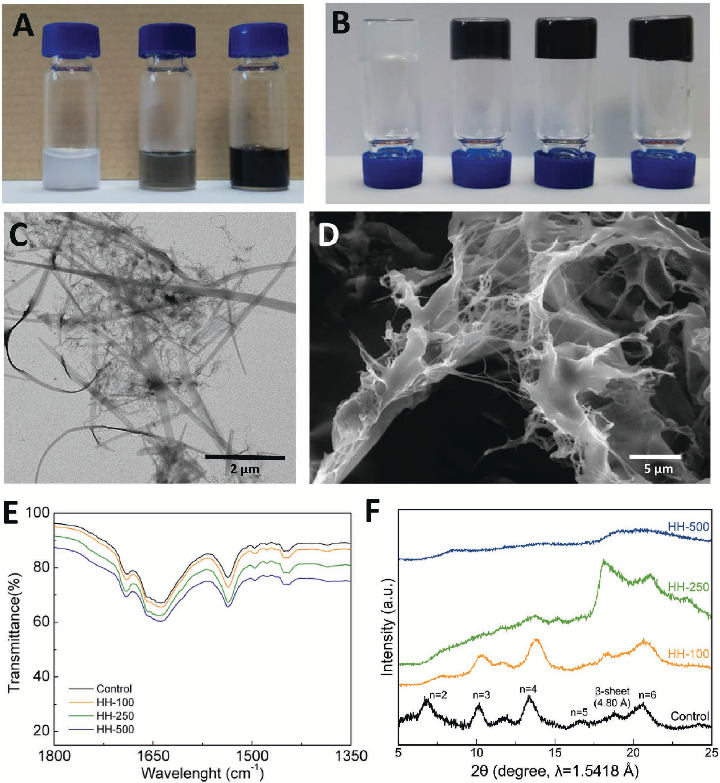
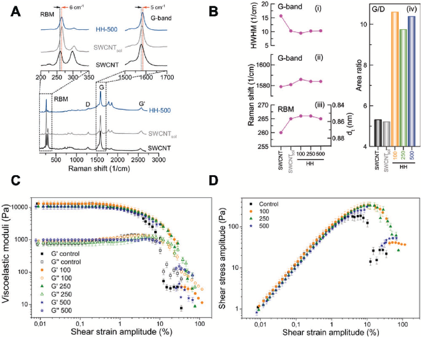
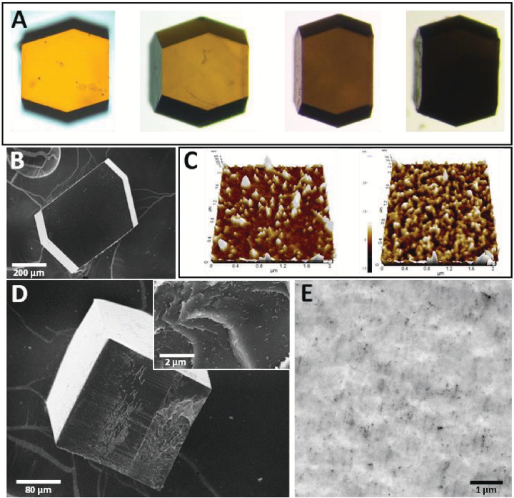
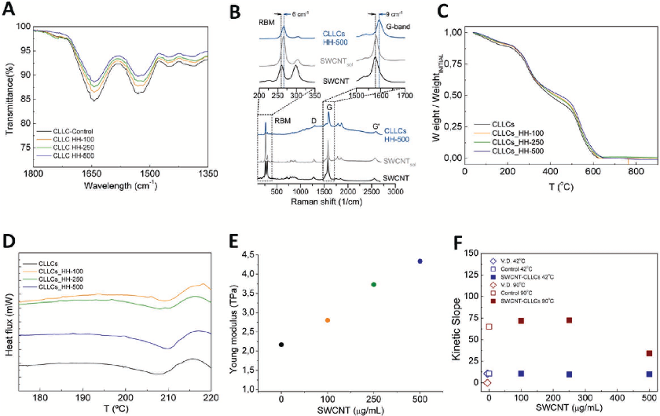
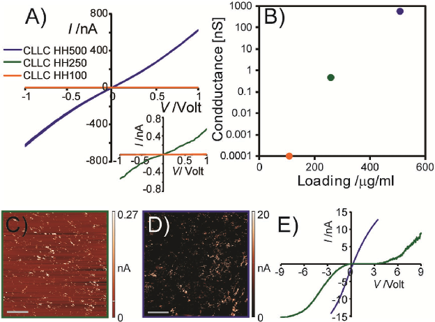

### FULL PAPER

Composite Materials

www.afm-journal.de

# Catalytic and Electron Conducting Carbon Nanotube–Reinforced Lysozyme Crystals

## Rafael Contreras-Montoya, Guillermo Escolano, Subhasish Roy, Modesto T. Lopez-Lopez, Jose M. Delgado-López, Juan M. Cuerva, Juan J. Díaz-Mochón, Nurit Ashkenasy,* José A. Gavira,* and Luis Álvarez de Cienfuegos*

Novel reinforced cross-linked lysozyme crystals containing homogeneous dispersions of single-walled carbon nanotubes bundles (SWCNTs) are produced and characterized. The incorporation of SWCNTs inside lysozyme crystals gives rise to reinforced composite materials with tunable mechanical strength and electronic conductivity, while preserving the crystal quality and morphology. These reinforced crystals show increased catalytic activity at higher temperatures, being active even above the denaturation temperature. The electron transport through the crystals is linked to the content and distribution of SWCNT bundles inside the crystals. The electron conduction through the crystals is isotropic and very efficient, presenting high conductivity values up to 600 nS at very low (0.05 wt%) SWCNT concentration. To obtain these crystals, a new protocol based on the in situ crystallization of lysozyme in composite SWCNT–peptide hydrogels is developed. These peptide hydrogels are able to homogeneously disperse bundles of hydrophobic SWCNTs allowing first, the crystallization of the enzyme lysozyme and second, transferring the new properties of the inorganic component to the crystals. Taken together, these composite crystals represent an example of the versatility of proteins as biological substrates in the generation of novel functional materials, opening the door to use them in catalysis and bioelectronics at macroscale.

#### 1. Introduction

The multifunctional nature of (bio) organic–inorganic hybrid materials is attracting a significant attention for applications in diverse fields including, environment, energy, health, micro-optics, and microelectronics.[1] Among the different organic molecules used for the production of such materials, proteins seem to be particularly attractive due to their sophisticated bioactivity and their ability to assembly into functional nanostructures.[2] Furthermore, the possibility to form porous protein cages and crystals makes it possible to design well-ordered supramolecular structures to encapsulate different substrates.[3] One of the most attractive protein substrates is lysozyme, a highly stable 129 amino acid residues’ long protein, which can be easily crystalized, forming macroscopic scale (average crystal size is dozens of micrometers) crystals.[4] Indeed, functional hybrid materials prepared by in situ synthesis of metallic colloids and semiconducting

R. Contreras-Montoya, Prof. J. M. Cuerva, Dr. L. Álvarez de Cienfuegos Departamento de Química Orgánica Facultad de Ciencias Universidad de Granada (UGR) C. U. Fuentenueva, Avda. Severo Ochoa s/n, E-18071 Granada, Spain E-mail: lac@ugr.es G. Escolano, Dr. J. A. Gavira Laboratorio de Estudios Cristalográficos Instituto Anda luz de Ciencias de la Tierra (Consejo Superior de Investigaciones Científicas – Universidad de Granada) Avenida de las Palmeras 4, 18100 Armilla, Granada, Spain E-mail: jgavira@iact.ugr-csic.es Dr. S. Roy[+] Department of Materials Engineering Ben-Gurion University of the Negev P.O.B. 653, Beer-Sheva 84105, Israel

Dr. M. T. Lopez-Lopez Departamento de Física Aplicada Facultad de Ciencias (UGR) C. U. Fuentenueva, Avda. Severo Ochoa s/n, E-18071 Granada, Spain Dr. J. M. Delgado-López Departamento de Química Inorgánica Facultad de Ciencias (UGR) C. U. Fuentenueva, Avda. Severo Ochoa s/n, E-18071 Granada, Spain Dr. J. J. Díaz-Mochón Departamento de Química Farmacéutica y Orgánica Facultad de Farmacia (UGR) Centre for Genomics and Oncological Research: Pfizer/University of Granada/Andalusian Regional Government PTS Granada Avenida de la Ilustración 114, 18016 Granada, Spain Prof. N. Ashkenasy Department of Materials Engineering and The Ilse Katz Institute for Nanoscale Science and Technology Ben-Gurion University of the Negev P.O.B. 653, Beer-Sheva 84105, Israel E-mail: nurita@bgu.ac.il

The ORCID identification number(s) for the author(s) of this article can be found under https://doi.org/10.1002/adfm.201807351.

[+]Present address: Department of Chemistry, BITS-Pilani, K. K. Birla Goa Campus, NH 17B, Bypass Road, Zuarinagar, Sancoale, Goa 403726, India

DOI: 10.1002/adfm.201807351

quantum dots have been demonstrated.[5] Post crystallization, cross-linking process improves the mechanical and chemical stability of the protein crystals, making them more accessible for manipulation and improves their practical usefulness. Encapsulation of Ag,[6] Au,[6b,c,7] Ru complexes,[8] magnetic CoPt nanoparticles,[9] and CdS quantum dots[10] in cross-linked lysozyme crystals (CLLCs) has resulted in novel macroscopic metalized composite materials with potential applications in catalysis[6a,7b,8a] and optical devices.[6b,c,10] Electronic conductivity has been introduced to CLLCs that have been used as a template for the polymerization of pyrrole.[11]

Despite of the promising applicability, the use of protein crystals as a media to obtain novel composite materials has been limited due to several constrains. One of the main constrains is related to the delicate process of protein crystallization that is extremely sensitive to alterations of the crystallization conditions, such as the incorporation of metallic cations, which as a result can easily frustrate the production of good quality protein crystals. This limitation can be overcome by soaking preformed protein crystals in a homogeneous solution of the cationic metal precursor.[5] However, this method is constrained to small molecules solutions, and therefore, cannot be used for incorporation of large molecules. An additional limitation stems from the disability to assimilate water insoluble molecules. Due to these limitations, the encapsulation of hydrophobic, water insoluble, single-walled carbon nanotubes (SWCNTs) within CLLCs, which is expected to result in superior composite materials, introduces a significant challenge.

In the present work, a method to prepare CLLCs containing controlled amounts of bundles of SWCNTs is presented by crystallization of lysozyme within a composite SWCNT– peptide hydrogel. The peptide hydrogel used in this novel protocol, serves to, first, disperse the SWCNTs in an aqueous media; second, prevent the tendency of lysozyme to adsorb very efficiently onto the surface of the nanotubes;[12] and third, facilitate protein crystallization. Detailed characterizations show that the intrinsic properties of SWCNTs such as strength and electron conduction are transferred to the macroscopic composite crystalline material. Hence, CLLCs containing increasing amounts of SWCNTs (SWCNT@CLLCs) present a linear increase in the mechanical strength (Young’s modulus) and an exponential increase in electrical conductivity; while at the same time retain their crystal size, morphology, and quality. Moreover, SWCNT@CLLCs are extremely stable and exhibit improved catalytic activity at 90 °C, which has no bibliographic precedents. These composite crystals significantly expand the field of biomaterials and pave the way for using them in novel catalytic, optic, and bioelectronic applications.

#### 2. Results and Discussion

The introduction of carbon nanotubes into protein crystals should give rise to a composite material, so called reinforced crystals,[4] that may exhibit high conductivity in addition. This may be relevant in future integration of enzymes in electronic devices. However, a medium for the growth of protein crystals containing SWCNTs should be able to disperse homogeneously SWCNTs, avoiding any surfactant molecules that may hamper

protein crystallization. We have postulated that supramolecular peptide hydrogels[13] could be used as a medium that meets these challenges. We have previously proven the ability to produce protein crystals using different types of gels (agarose, poly(ethylene glycol), silica, etc.).[14] Peptide-based hydrogels have proven to be an excellent media for protein crystallization as well.[15] We reasoned that this behavior combined with the ability to form SWCNTs contacting peptide hydrogels[16] would make these gels excellent candidates to form SWCNT@CLLCs.

As a first step to obtain SWCNT@CLLCs, the incorporation of SWCNTs into peptide supramolecular hydrogels was characterized. Fmoc-diphenylalanine (Fmoc-FF) hydrogels containing different concentrations of SWCNTs were prepared using a pH switch protocol.[17] Homogeneous composite hydrogels at a final peptide concentration of 0.5 wt% containing 0.1, 0.25, and 0.5 mg mL−1 of SWCNTs (HH-100, HH-250, and HH-500, respectively) were obtained (Figure 1A,B). Thermogravimetric analysis (TGA) was used to verify the amount of SWCNTs incorporated in the gel of HH-500-lyophilized samples (Figure S.1, Supporting Information). To quantify the amount of SWCNTs in the samples we have selected a temperature of 440 °C at which Fmoc-FF nanotubes are decomposed, a process that occurs at 250 °C while CNTs remain.[18] An estimated wt% loss of 8.4 ± 1.6 at 440 °C compared to the control Fmoc-FF hydrogel was found, in good agreement with the expected value of 9.1 wt%. This value corresponds to a concentration of ≈0.4 mg mL−1 in HH-500. Transmission electron microscopy (TEM) of all hydrogel samples showed the preferential formation of peptide nanofibers and nanotapes of 10 to 150 nm in diameter, characteristic of these peptides.[19] The analysis of the microscopy images suggested that the aspect ratio and morphology of the peptide fibers were not altered by the presence of the SWCNTs (Figure 1C and Figure S.2 (Supporting Information)). Environmental scanning electron microscopy (ESEM) studies under cryo-conditions[20] were performed on the hydrogels to analyze in more details their 3D structures. The aspect ratio and morphology of the sheets, nanotapes, and nanofibers in all the samples showed the same morphology and dimensions (Figure 1D and Figure S.2 (Supporting Information)). The image of HH-500 (Figure 1D) showed the presence of long filaments interconnecting peptides sheets. The interconnecting filaments observed in higher number in the most concentrated SWCNTs sample (HH-500) could be assigned to composite aggregates comprised of the SWNTs or bundles of them coated by the peptide nanotubes, similar to previously reported SWCNT–polymer aggregates.[21]

Fourier transform infrared (FTIR) spectroscopy was used to analyze the peptide fibrils secondary structure in the presence of SWCNTs (Figure 1E). The FTIR spectra of HH-100, HH-250, and HH-500 hydrogels were found to be identical to the control Fmoc-FF hydrogel without SWCNTs; the two amide bands (amide I at 1638 cm−1 and amide II at 1536 cm−1) indicated a preference for a β-sheet conformation with the band at 1690 cm−1, suggesting an antiparallel β-sheet arrangement. The amide I bands in all the hydrogel samples were redshifted with respect to all the xerogels by 17 cm−1 (from 1638 to 1655 cm−1, Figure S.3, Supporting Information), indicating the formation of peptide hydrogen bonds with the water solvent.[22] To further study the conservation of the antiparallel β-sheet structure of

16163028, 2019, 5, Downloaded from https://onlinelibrary.wiley.com/doi/10.1002/adfm.201807351 by Universidad De Granada, Wiley Online Library on [03/03/2024]. See the Terms and Conditions (https://onlinelibrary.wiley.com/terms-and-conditions) on Wiley Online Library for rules of use; OA articles are governed by the applicable Creative Commons License

- Figure 1. Structural characterization of SWCNT–peptide hydrogels. A) Photo of (from left to right) Fmoc-FF solution, Fmoc-FF + SWCNT diluted solution (25 µg mL−1), and HH-500. B) Photo of (from left to right) Fmoc-FF gel and HH-100, HH-250, and HH-500. C) TEM image of HH-500. D) ESEM image of the HH-500. E) FTIR of Fmoc-FF control hydrogel (black) and HH-100, HH-250, and HH-500. F) XRD of Fmoc-FF control hydrogel (black) and HH-100, HH-250, and HH-500.

Fmoc-FF peptide hydrogels in the presence of SWCNTs, X-ray diffraction (XRD) was collected on Fmoc-FF xerogels. The spacing between peptides within the β-sheet structures, which typically ranges between 4 and 5 Å depending on the peptide sequence,[23] appears at d-spacing of 4.8 Å (2θ = 18.79°), in agreement with our previous work.[20] XRD patterns of pristine (control) and HH-100 hydrogels show a series of periodic diffraction peaks (2 < n < 6), which is consistent with the presence of flat ribbons formed by the parallel stacking of single fibrils, as previously observed for Fmoc-FF hydrogels.[20,23] However, the corresponding reflections are very weak and completely negligible on the patterns of HH-250 and HH-500 composites, respectively (Figure 1F). This suggests the gradual loss of the supramolecular structure of the gels when increasing the amount of the SWCNTs, likely due to the interaction between the peptides and the SWCNTs. Note that the observed variations in the diffraction pattern cannot be due to an increase of the diffuse scattering of the SWCNTs, since the diffraction

peaks of the pristine SWCNTs appear at 15.80 and 24.80 2θ angles (Figure S.4, Supporting Information).

Raman spectroscopy was used to evaluate the intermolecular interactions between Fmoc-FF peptides and the SWCNTs. We found that the G+ band shifts from 1579 to 1582 cm−1 for solutions of SWCNTs dispersed in water using Fmoc-FF monomers (black and gray spectra in Figure 2A and panel (ii) in Figure 2B). This finding indicates that the SWCNTs are transferring electrons to the peptide. The upshift is more evident (5 cm−1) once the Fmoc-FF hydrogel is formed (blue spectrum in Figure 2A and panel (ii) in Figure 2.B). Hence, in the presence of the peptide molecules, and more pronouncedly, in the case of the hydrogel, the SWCNTs become p-type doped. Such doping may improve their electronic conductivity.[24]

The analysis of the radial breathing mode (RBM) bands in the commercial sample showed two major bands at ωRBM = 260 and 298 cm−1 corresponding with average diameters (dt) of 0.76 and 0.87 nm, respectively (being dt = 234/(ωRBM + 10)[25]).

16163028, 2019, 5, Downloaded from https://onlinelibrary.wiley.com/doi/10.1002/adfm.201807351 by Universidad De Granada, Wiley Online Library on [03/03/2024]. See the Terms and Conditions (https://onlinelibrary.wiley.com/terms-and-conditions) on Wiley Online Library for rules of use; OA articles are governed by the applicable Creative Commons License

- Figure 2. Electronic and mechanical properties of composite hydrogels. A) Raman spectra of commercial SWCNTs (black line), Fmoc-FF + SWCNT solution (gray line), and HH-500 (blue line). B) Raman shifts, HWHM, and G/D area ratio of commercial SWCNTs, Fmoc-FF + SWCNT solution, and HH-100, HH-250, and HH-500. C) G′and G″versus shear strain amplitude and D) shear stress amplitude versus shear strain amplitude of hydrogel control and HH-100, HH-250, and HH-500.

Surprisingly, the intensity ratio of these two RBM bands was strongly affected by the addition of the peptide (Figure 2A). Specifically, the intensity of the band at ωRBM = 260 was maintained, while the band at ωRBM = 298 cm−1 practically disappeared. This suggests a process of diameter-selective SWCNT enrichment mediated by Fmoc-FF peptide. The increase in the G/D area ratio (panel (iv) in Figure 2B), and the decrease of the halfwidth at half maximum (HWHM) of the G-band of the gel samples (panel (i) in Figure 2B), highlighting the increase of purity of the SWCNTs incorporated in the hydrogel (Figure 2B). Moreover, the addition of the peptide also resulted in an upshift of the peak at 260 cm−1 (panel (iii) in Figure 2B), which indicates a slight decrease of dt, likely due to mechanical compression induced by the hydrogel.

The rheological properties of hydrogels were analyzed under oscillatory shear strain (Figure 2C and Figure S.5 (Supporting Information)). All samples demonstrated a behavior typical for a cross-linked system, characterized by approximately constant values of both G′(storage modulus) and G″(loss modulus), as well as G′ >> G″at low γ0 (shear strain amplitude). No differences were detected in the linear regime for all the hydrogel samples (Figure 2C). This suggests that for such small amounts of SWCNTs in the hydrogels, which contain a maximum of 0.05 wt% for HH-500, mechanical properties do not depend on the SWCNT concentration. This is in good agreement with previous results observed by Roy and Banerjee for composite hydrogels with similar SWCNT concentrations.[16a]

Nevertheless, we observed a different behavior in the nonlinear regime (Figure 2C). These studies indicated that the shear strength (maximum in shear stress) was about twice as high for samples containing SWCNTs with respect to the Fmoc-FF hydrogel control sample (Figure 2D). Furthermore, the strain amplitude corresponding to the shear strength was also higher for samples containing SWCNTs. This mechanical behavior is similar to the behavior of CNT-reinforced gelatin methacrylate (GelMA) hydrogels at similar concentration range.[21] These results suggest that long SWCNTs can twist easily under low shear strain, not contributing appreciably to the G′ and G″ values corresponding to the viscoelastic regime. However, at larger shear strain, within the nonlinear viscoelastic regime, the resistance to deformation is larger.

Crystallization experiments were carried out following a two-step counterdiffusion protocol.[15a] Shortly, the protein solution was allowed to diffuse into the composite hydrogel for one week prior to the incorporation of the precipitant solution (buffered sodium chloride). Even though strong interactions between protein molecules and SWCNTs have been described,[12,26] peptide-hydrogel composite crystals were observed after several days, even in the most CNT-concentrated HH-500 hydrogel. Crystals were found to exhibit a darker color as the concentration of SWCNTs in the hydrogels were increased (Figure 3A), indicating the expected concentrationdependent incorporation of SWCNTs within the crystal lattice. The optical images showed that crystals formed from the three

16163028, 2019, 5, Downloaded from https://onlinelibrary.wiley.com/doi/10.1002/adfm.201807351 by Universidad De Granada, Wiley Online Library on [03/03/2024]. See the Terms and Conditions (https://onlinelibrary.wiley.com/terms-and-conditions) on Wiley Online Library for rules of use; OA articles are governed by the applicable Creative Commons License

- Figure 3. A) From left to right: optical pictures of a CLLC control, CLLC_HH-100, CLLC_HH-250, and CLLC_HH-500. B) SEM image of a full CLLC_HH-500. C) AFM topography of CLLC control (left) and CLLC_HH-500 (right). D) SEM image of the interior of CLLC_HH-500 (cut through its X-axis). E) TEM image of a thin section of CLLC_HH-500.

hydrogels adapt a tetragonal prismatic morphology with a wide range of sizes and aspect ratios (a = b/c axes), as expected from the supersaturation evolution in counterdiffusion experiments, and independently of the SWCNT concentration. Nevertheless, we observed a clear reduction of the average crystal size compared to the control experiment of crystals grown from Fmoc-FF hydrogel; the larger dimension of crystals obtained in the control hydrogel was 40–90 µm, while the dimensions of crystals grown in HH-100 were 25–80 µm, and of 25–65 µm in HH-250 and HH-500. This result suggests that SWCNTs are affecting the growth of lysozyme crystals, probably by lowering the supersaturation level due to interactions between the proteins and the nanotubes during the whole experiment.

Further characterizations of the lysozyme crystals containing the composite hydrogels were obtained from cross-linked crystals using glutaraldehyde (SWCNT@CLLCs). The morphology of SWCNT@CLLCs were analyzed using SEM and atomic force microscopy (AFM). SEM images showed a smooth surface for all the crystals (Figure 3B and Figure S.6 (Supporting Information)). AFM topography characterizations showed a similar roughness (≈3.3 nm) for all the samples. This roughness can be owed to small amounts of hydrogel remnants over the crystal surface (Figure 3C and Figure S.6 (Supporting

Information)). To confirm the presence and distribution of the SWCNT–peptide fibers within the crystals, samples cuts along the X-axis were imaged by SEM. The resulting microscopy images clearly showed the presence of small filaments only for samples containing SWCNT (Figure 3D and Figure S.6 (Supporting Information)). TEM images of thin sections of SWCNT@CLLCs showed high density of dark spots, of ≈5 nm in diameter, identified as small bundles of SWCNTs (Figure 3E and Figure S.7 (Supporting Information)). These spots, not presented in CLLC control, were homogeneously distributed through the entire cross-section. Hence, the SEM and TEM images confirmed a homogeneous distribution of the SWCNTs within the entire volume of the crystals.

Interactions between protein molecules within the crystals and the SWCNTs were investigated using FTIR. Spectra of SWCNT@CLLCs showed that the characteristic protein amide I (1654 cm−1) and amide II (1535 cm−1) bands were not shifted compared to CLLC control, indicating the preservation of the protein secondary structure (Figure 4A). Raman spectroscopy of SWCNT@CLLCs showed an upshift of the G+ band (up to 1595 cm−1) with respect to SWCNT–peptide composite hydrogels values (Figure 4B). This further upshifting implies additional and stronger interactions between SWCNTs and protein acceptors

16163028, 2019, 5, Downloaded from https://onlinelibrary.wiley.com/doi/10.1002/adfm.201807351 by Universidad De Granada, Wiley Online Library on [03/03/2024]. See the Terms and Conditions (https://onlinelibrary.wiley.com/terms-and-conditions) on Wiley Online Library for rules of use; OA articles are governed by the applicable Creative Commons License

- Figure 4. A) FTIR of CLLCs. B) Raman spectra of commercial SWCNTs (black line), Fmoc-FF + SWCNT solution (gray line), and CLLC_HH-500 (blue line). C) TGA of CLLCs. D) DSC of CLLCs. E) Young’s modulus of CLLCs. F) Catalytic activity of lysozyme at 42 °C (blue color) and 90 °C (burgundy color), CLLCs grown by vapor diffusion (V.D.) (rhombus), CLLC grown in peptide hydrogel control (square), and SWCNTs@CLLCs (solid square).

groups. This result shows that CNTs, probably due to their high aspect ratio, are not completely coated by the peptide leaving regions for interaction with the lysozyme molecules. Interestingly, this direct contact between the protein and the SWCNTs did not hamper the crystallization process, neither affected crystal quality. Remarkably, two separate types of interactions from the peptide and protein modulate the electronic properties of SWCNTs separately. Presumably, aromatic groups of both the Fmoc-peptide molecules and the proteins wrap SWCNTs within the protein crystals. These dual interactions produce a synergic effect since both groups act as acceptors p-doping the SWCNTs.

The effect of SWCNT incorporation into the protein crystals was characterized using synchrotron X-ray diffraction since the random distribution of the SWCNTs inside the protein crystals made them invisible (Table S.1, Supporting Information). Following standard quality criterion, in all the cases, crystals diffracted to a very high-resolution limit, better than 1.2 Å, and showed B factors values in the range of 10 Å2, comparable to the highest quality crystals obtained in other type of hydrogels.[15a] Interestingly, the mosaicity, also a measurement of the crystal internal order, was much higher than the corresponding values of the crystal grown in the control Fmoc-FF hydrogel. This correlates with a slight increase of the unit cell dimensions as the amount of the incorporated SWCNTs increases, suggesting interactions between the protein and carbon nanotubes, in agreement with the results obtained by Raman spectroscopy. This shows that while the incorporation of the peptide fibers within the crystal does not affect the internal order of the crystals, the inclusion of SWCNTs does, even at very low concentration.

The thermal stabilities of the new SWCNT@CLLC composite crystals were monitored by TGA (Figure 4C). Four steps of weight lost described for lysozyme crystals[6a] were observed, without any additional remarkable feature other than a slight reduction of the decomposition rate between 400 and 500 °C which correspond to the thermal decomposition of the hydrogel (Figure S.1, Supporting Information). The denaturation process of protein crystals was evaluated by differential scanning calorimetry (DSC) at a constant heat rate of 5 °C min−1 (Figure 4D). It was found that while the denaturation of lysozyme occurs in solution at a temperature of 60 °C, CLLCs denature at around 208 °C with no clear influence of the SWCNTs incorporated in the crystals.

AFM PinPoint mode was used to compare the mechanical properties of the SWCNT@CLLCs with the CLLC (Figure 4E). A gradual increase of the Young’s modulus as the concentration of nanotubes increases was observed. In particular, the Young’s modulus value was doubled; 4.3 TPa for CLLC–HH-500 versus 2.1 TPa for the control CLLCs. This result also suggests that SWCNTs are interacting directly with the proteins and not only with the peptides fibers, as observed by Raman spectroscopy. SWCNTs are acting as cross-linkers increasing the number of contacts between the protein and the hydrogel and therefore improving the mechanical strength of the crystals.

Since it is known than cross-linked enzyme crystals (CLECs) are able to retain their enzymatic activity,[27] we decided to study the influence of SWCNTs on the catalytic activity of SWCNT@CLLCs (Figure 4F). Following a standard procedure,[28] we measured by fluorescence spectroscopy the degradation of 4-methylumbelliferyl β-d-N,N′,N″-triacetylchitotrioside produced

16163028, 2019, 5, Downloaded from https://onlinelibrary.wiley.com/doi/10.1002/adfm.201807351 by Universidad De Granada, Wiley Online Library on [03/03/2024]. See the Terms and Conditions (https://onlinelibrary.wiley.com/terms-and-conditions) on Wiley Online Library for rules of use; OA articles are governed by the applicable Creative Commons License

HH-250 and HH-500 are somewhat above the conductivity percolation threshold of the SWCNT@CLLC samples, indicating a percolation threshold below 0.05 wt%, which is much lower that the percolation threshold commonly found for CNT–polymer composites.[29] We would like to note that the currents observed for SWCNT@CLLCs of HH-500 are much higher than those observed for CLLCs loaded with polypyrrole.[11] Further confirmation of the formation of conduction pathways within the SWCNT@CLLCs samples was obtained by conductive atomic force microscopy (c-AFM) measurements (Figure 5C,D). The current maps of the samples indicated that while most of the top surface of the crystal is not conductive, spots with higher conductivity are spread over the surface. No current spots were detected for CLLC control and for SWCNT@CLLCs of HH-100 (data not shown). These observations confirm that the conduction occurs through localized conduction pathways comprised by continuous CNTs- channels crossing the entire crystals from the bottom to the top electrode. The density of conduction pathways was found to be only somewhat larger for HH-500.

by cross-linked lysozyme crystals grown by vapor diffusion (CLLCs-V.D.), by CLLCs-control, and by SWCNT@CLLCs at 42 and 90 °C. It was found that all the SWCNT@CLLC samples were catalytically active, maintaining the same catalytic activity at 42 °C as the CLLCs-V.D. and CLLCs-control. Since the denaturation temperature observed for the reinforced CLLCs crystals was around 210 °C, we decided to test the activity of the protein at the experimental limit allowed in water (90 °C). Remarkably, the catalytic activities of reinforced SWCNT@CLLCs were not only kept at 90 °C but also even increased, in contrast to the total loss of activity of CLLCs-V.D. It is also well known that CLECs are stable at higher temperatures than the enzyme in solution, showing a higher catalytic activity,[27] although, as far as we know, this is the first report of CLLCs being active at such a high temperature. This behavior can only be explained by a dramatic increase of the CLLCs’ functional stability sustained by their composite nature.

As a final step, we set to test the influence of the incorporation of SWCNTs into the lysozyme crystal on its conductivity. Conductivity was monitored by measuring current–voltage (I–V) curves for the different samples at room temperature (RT) under vacuum (Figure 5A,B). While no current was observed for HH-100, a conductivity in the range of 0.5 nS was found for SWCNT@CLLCs of HH-250, and a significantly increase up to ≈600 nS for SWCNT@CLLCs of HH-500. The p-type doping of SWCNTs is obviously the origin of hole charge carriers in the system that give rise to the conductivity of the SWCNT@CLLCs. The remarkable increase of orders of magnitude in the conductivity for small changes in SWCNT loading suggests that CLLC

However, the current at each conducting spot was found to be at least two orders of magnitude higher for the most loaded sample. Furthermore, I–V curve obtained with the conductive AFM tip contacting the edge of a conduction channel presented Ohmic behavior for SWCNT@CLLCs of HH-500, whereas the local I–V of SWCNT@CLLCs of HH-250 was found to be extremely nonlinear (Figure 5E). A similar behavior was observed previously for a CNT–polymer composite.[30] These results indicate the presence of tunneling barriers along the channel at low SWCNTs loading, near the percolation threshold.

Increasing the SWCNT loading results in a more direct contact between CNTs, leading to an overall lower resistivity of the contacts between the CNTs that reduces the overall resistivity of the conduction pathway, and leads to an Ohmic-like conduction behavior. The low resistivity of the CNT–CNT contacts is also evident from the low activation threshold of 0.015 eV measured for SWCNT@CLLCs of HH-500 (Figure S.8, Supporting Information). Overall, the ability to form homogeneous dispersion of CNTs within the CLLCs turns the protein crystals to be highly conductive. Measurements of crystals halved through the X- and Z-axes indicated similar values in both the directions (data not shown), confirming a uniform CNT dispersion and imply that these crystals perform as 3D semiconductors.

#### 3. Conclusions

Figure 5. Electronic properties of SWCNT@CLLCs. A) I–V curves of the SWCNT@CLLCs. The currents of CLLC HH-250 and HH-100 are shown at higher resolution in the inset. B) Conductance of the SWCNT@CLLCs. The conductance was extracted from the slope of the I–V curves. C,D) c-AFM current map of SWCNT@CLLCs of HH-250 and HH-500, respectively. Current maps were obtained by c-AFM using a tip bias of 5 V. Scale bar is 2 µm. E) Local I–V curves of SWCNT@CLLCs. Each I–V curve was obtained on conductive spot in the current image. The saturation observed for SWCNT@CLLCs of HH-500 is due to saturation of the measuring amplifier. Color code is the same as in (A).

This work demonstrates the controlled fabrication of a novel bioorganic–inorganic composite material comprised of SWCNTs incorporated in protein crystals. These unique materials combine the strength and electron conduction of carbon nanotubes with the catalytic activity of enzymes in a single

16163028, 2019, 5, Downloaded from https://onlinelibrary.wiley.com/doi/10.1002/adfm.201807351 by Universidad De Granada, Wiley Online Library on [03/03/2024]. See the Terms and Conditions (https://onlinelibrary.wiley.com/terms-and-conditions) on Wiley Online Library for rules of use; OA articles are governed by the applicable Creative Commons License

composite material. The introduction of SWCNTs improves the stability of the crystals and maintains their enzymatic activity even under elevated temperature of 90 °C. Isotropic electron conduction through the crystal is observed, opening the possibility to use these materials as 3D semiconducting materials. Moreover, these crystals present high conductivity values up to 600 nS at very low percolation threshold of only 0.05 wt%, exhibiting an Ohmic-like behavior as soon as the percolation point is reached, implying the formation of effective conduction channels mediated by bundles of CNTs very well distributed along the crystal lattice. In conclusion, peptide hydrogels were found to be an ideal media to introduce hydrophobic and water insoluble materials homogeneously into protein crystals. The resulting unique composite materials exhibit the combination of the enzymatic activity of the proteins with the mechanical and electronic properties of the SWCNTs. The methodology suggested here could be of use as a general strategy to develop novel composite crystals.

#### 4. Experimental Section

Hydrogel Control Preparation: Hydrogel preparation was performed following a described protocol.[20] Very briefly, to an aqueous basic solution of Fmoc-FF peptide (pH ≈ 10.5), 2 molar equivalents of gluconoδ-lactone (GdL) was added and mixed by vortexing. Full gelification was achieved after 12 h at room temperature.

Composite Hydrogel Preparation: To prepare hydrogels with SWCNT, a stock suspension of SWCNT was prepared weighting 0.5 mg of SWCNT (SWCNT (6,5) chirality, CAS: 308068-56-6, provided by SigmaAldrich, USA: https://www.sigmaaldrich.com/content/dam/sigmaaldrich/docs/Aldrich/Bulletin/1/773735bul.pdf) into a sample tube. The carbon nanotubes were suspended in 1 mL of an aqueous basic solution of Fmoc-FF 0.5% w/v (prepared as above). The resulting suspension was then sonicated for 2 h in a cold ultrasonic bath and then centrifuged for 5 min at 10.000 rpm (Sigma 1-14 centrifuge); afterward, the supernatant was collected carefully. To obtain the HH-100, the SWCNT stock suspension was diluted five times with the Fmoc-FF 0.5% basic solution and was vortexed to achieve a homogeneous suspension. For the HH-250, the SWCNT stock suspension was diluted twice following the same procedure. Gelation was then carried out following the same method described above for the hydrogel control.

SWCNT Quantification in Hydrogels: Real concentration of SWCNT in hydrogels was obtained by freeze drying samples of 2 mL of stock suspension of SWCNT prepared as above in accurately weighted glass vials. The solid residues were weighted after drying and studied by TGA. The aqueous basic solution of Fmoc-FF 0.5% w/v was also freeze dried and studied by TGA. Fmoc-FF completely disappeared at 440 °C (Figure S.1, Supporting Information). At that temperature, the measured SWCNT wt% in the solid residues was 8.4 ± 1.6, in good agreement with the expected value of 9.1 wt%. The average value was obtained from

###### 5 samples.Crystallization Protocol: Lysozyme (chicken HEWL) was purchased as a

lyophilized powder from Sigma, dissolved in 50 × 10−3 m sodium acetate pH 4.5 and the concentration was determined spectrophotometrically at 280 nm using ε = 2.65 mL mg−1 cm−1. The counterdiffusion technique in the two-chambers configuration was used to set up crystallization experiments in Eppendorf tubes following the protocol already described elsewhere.[15] Hydrogels and composite hydrogels were dialyzed against 100 µL of Milli-Q water for a week, changing the water every day. Then, 100 µL of the buffered protein solution, at 200 mg mL−1, was poured on the top of the hydrogels and allowed to diffuse at 20 °C for one week. The solution was then removed and the remaining protein concentration measured spectrophotometrically. Finally, 100 µL of precipitant solution

(sodium chloride 6% w/v in 50 × 10−3 m sodium acetate pH 4.5) was allowed to diffuse at 20 °C. The experiments were kept in incubators at 20 °C and followed periodically with the help of an optical microscope. First crystals appeared after 24 h, reaching their maximum size in one week. Three crystallization experiments were performed with each type of hydrogels, each one of these experiments were performed in triplicate, obtaining the same results. Lysozyme crystals free of gel and SWCNT were grown following standard vapor diffusion technique. Several lysozyme (from 70 to 100 mg mL−1) and precipitant (NaCl from 3% to 8% w/v) concentrations were assayed to obtain crystals of appropriate and comparable sizes.

Cross-Linking Protocol: CLLCs were obtained by gently diffusing the cross-linker along the crystallization chamber. The precipitant solution was substituted by an isotonic solution containing 5% v/v of glutaraldehyde as cross-linker and allowed to diffuse at 20 °C for 24 h. The hydrogel column containing the crystals was extracted on a Petri dish filled with Mili-Q water. Crystals were gently removed from the gel with the help of a paint brush and microtools, collected one by one and stored in Mili-Q water in an Eppendorf tube at 20 °C for three days. The water was changed every day. Finally, crystals were lyophilized and stored in a dry environment.

Enzymatic Activity Protocol: Lysozyme activity was determined following the hydrolysis of 4-methylumbelliferyl N,N′,N″-tracetyl-βchitotrioside ((GlcNAc)3-MeU)) to 4-methylunbelliferone (4-MeU) spectrophotometrically at excitation of 355 nm and emission of 460 nm using a FLUOstar Ω BMG LABTECH fluorimeter, as described by Yang and Hamaguchi.[28] The reference lysozyme solution was prepared in AcOK 20 × 10−3 m pH 5.3 and KCl I = 0.1 at 10 mg mL−1 and diluted to at 4.31 × 10−2 mg mL−1 for the activity assays. To emulate the protocol, the same amount of crystals was weighed using a COBOS BM-22 ultrabalance (0.65 mg) prior to adding the same volume of the corresponding buffer. The substrate was prepared at 2.55 × 10−4 m, dissolving it in a mix of dimethylformamide and AcOK 20 × 10−3 m pH 5.3 (KCl I = 0.1) and the concentration was measured spectrophotometrically (λ = 316 nm, ε = 1.23 × 104). To carry on the experiments, the substrate was diluted at a final concentration of 2.84 × 10−5 m with AcOK 20 × 10−3 m pH 5.3 (KCl I = 0.1). In all cases, blank solutions were composed of AcOK 20 × 10−3 m pH 5.3 (KCl I = 0.1) containing (GlcNAc)3-MeU at 2.84 × 10−5 m. The enzymatic reactions were set in 2.0 mL Eppendorf tubes attached to a thermoshaker block. At programed time, 100 µL aliquots were extracted and mixed with 50 µL of 100 × 10−3 m glycine pH 12 prior measurement. Experiments with crystals were done at 42 and 90 °C, while lysozyme in solution was assayed only at 42 °C.

FTIR Spectroscopy: Spectra were recorded using a Perkin-Elmer Two FTIR attenuated total reflectance spectrometer. The hydrogels, xerogels, and protein crystals were compressed onto the diamond crystal. All spectra were scanned over the range between 4.000 and 450 cm−1.

XRD of Hydrogels: XRD patterns were collected Bruker D2-PHASER diffractometer using CuKαradiation (λ = 1.5418 Å) and a LYNXEYE as detector. The 2θrange was from 5° to 25° with a step size of (2θ) 0.02°. The fresh-prepared gels were deposited on a zero diffraction silicon plate and dried overnight at room temperature before the measurement.

ESEM Images of Hydrogels: Hydrogel images were performed using a FEI Quanta 400 ESEM equipped with a Peltier effect cooling stage.

TEM Images: The hydrogels (xerogels) and crystals used in this work were studied with a LIBRA 120 PLUS Carl Zeiss. A drop of an aqueous suspension of the hydrogel was placed on a 300-mesh copper grid and dried at room temperature for 30 min. The CLLCs were dehydrated with ethanol and embedded in Embed 812 resin. Ultrathin sections (50–70 nm) were prepared using a Reichert Ultracut S microtome (Leica Microsystems GmbH, Wetzlar, Germany) after which the sections were deposited onto copper grids.

Raman Microscopy: Raman spectra of xerogels and protein crystals were collected on a Raman microscope NRS-5100 (JASCO, Japan) equipped with a Peltier cooled charge-couple device (CCD) (1064 × 256 pixels) detector. The excitation line, provided by a diode laser emitting at 785 nm and 500 mW, was focused on the surface of

16163028, 2019, 5, Downloaded from https://onlinelibrary.wiley.com/doi/10.1002/adfm.201807351 by Universidad De Granada, Wiley Online Library on [03/03/2024]. See the Terms and Conditions (https://onlinelibrary.wiley.com/terms-and-conditions) on Wiley Online Library for rules of use; OA articles are governed by the applicable Creative Commons License

the sample through a 100× objective lens. The spectral resolution was 2.0 cm−1 (using a grating with 600 grooves mm−1) and each spectrum resulted from the average of 3 acquisitions, with 100 s of accumulation each. The samples were deposited on glass slides and dried overnight at room temperature before data collection.

Rheological Characterization: For the characterization of the rheological properties of the hydrogels, a Haake Mars III controlledstress rheometer (Thermo Fisher Scientific, Waltham, MA, USA), provided with parallel plates of 35 mm of diameter, was used. In order to ensure reproducibility and minimize experimental errors due to manipulation of the samples, the hydrogels were generated directly on the lower plate of the rheometer, under water-saturated atmosphere and at room temperature. The hydrogels were left 24 h to complete the gelation process and immediately afterward, they were characterized under water-saturated atmosphere at a temperature of 25 °C, without any prior preshear or manipulation. Two different protocols were executed for the characterization of the rheological properties of the hydrogels under oscillatory shear strain. First, the hydrogels were subjected to oscillatory shear strains of constant frequency (1 Hz) and stepwise increasing shear strain amplitude, γ0, and the corresponding oscillatory shear stress was monitored. From these data, the storage modulus (G′) and the loss modulus (G″) were obtained as functions of γ0, which characterized the viscoelastic response of the hydrogels at constant frequency. Independently, the samples were subjected to oscillatory shear strains of constant amplitude (2 × 10−4) and stepwise increasing frequency, and the corresponding oscillatory shear stress was monitored. From these data, the curves of G′and G″were obtained as functions of frequency of oscillation. For each formulation, at least three different samples were measured to ensure statistical significance of the results. The mean values and standard deviations of each magnitude were provided in this work.

AFM Studies: All the measurements were performed with an atomic force microscope Park NX20 (Park Systems, South Korea) operating at 25 °C and at atmospheric pressure.

Topographical images were obtained scanning a surface of 2 µm × 2 µm with probe ACTA with a resonant frequency about 300 kHz and a force constant (K) of 40 N m−1.

Nanomechanical properties were performed with the gentle PinPoint mode which was the key to acquiring reproducible and reliable topography and elastic module, adhesion, and stiffness maps on the crystal’s surfaces. The measurement procedure could be explained in three steps: 1 – the XY scanner stopped during acquisition; 2 – the tip approached the surface, measured mechanical properties, and retracted from the surface over few milliseconds (2 ms) to achieve an interaction force preset (3.3 nN); 3 – the approach height was recorded and the Z distance was maintained. With this procedure, the force was held constant while properties are measured, then the tip was retracted and moved to the next pixel. Probes used were NSC-14 with a resonant frequency about 166.76 kHz and a spring constant of 5.0 N m−1. The nanomechanical values were obtained from the force–distance curves (F–d curves) after the contact of the tip with the surface. The measures were performed using the same probe to allow comparison between the samples. The values obtained could not be considered as quantitative but yes as relative values.

Conductive Measurements (c-AFM): CONTSPt probes were used. These probes are 225 µm long, with a resonant frequency of about 25 kHz and a spring constant 0.2 N m−1. Electrical contact was made by applying a drop of Ag paste to one corner of the crystal and to the metallic chuck. The current was measured directly using a preamplifier with a gain of 109 to 1011 V A−1 (I-AFM (internal variable gain current amplifier)). c-AFM imaging was performed with an applied bias of 5 V.

SEM Images of CLLCs: SWCNT@CLLCs cut with a scalpel were put on an adhesive surface, coat with a fine carbon layer and examined by SEM using a field emission scanning electron microscope (FESEM) GEMINI, LEO 1500 Carl Zeiss.

Synchrotron X-ray Diffraction of Protein Crystals: Crystal quality was evaluated by X-ray diffraction at Xaloc beam-line of the ALBA Spanish Synchrotron light source. The hydrogel containing the crystals was

extracted on a plastic Petri dish containing the precipitant solution previously recovered from the Eppendorf. Selected crystals were transferred to a clean drop of precipitant containing 20% v/v glycerol as cryoprotectant. Crystals were flash cooled in liquid nitrogen and stored until data collection. For data acquisition, all configuration parameters, beam line, distance, exposure time, and oscillation were kept constant (Table S.1, Supporting Information). Data sets were indexed and integrated with iMosflm[31] and reduced and scaled with Aimless[32] of the CCP4 suit software package.[33]

TGA of Protein Crystals: Thermogravimetric measurements were recorded on a Mettler-Toledo TGA/DSC1. Approximately 5 mg of lysozyme crystals were placed on a TGA cell and subjected to decomposition by heating the sample to 900 °C at a constant rate of 5 °C min−1.

DSC of Protein Crystals: Calorimetric measurements were recorded on a METTLER-TOLEDO DSC1. In all the cases, ≈4 mg of crystals was placed on a DSC aluminum cell and sealed. Thermograms were obtained in the range of RT to 300 °C at a constant heating rate of 2 °C min−1.

Current–Voltage (I–V) Characterizations in Two Electrode Mode: Conduction through the composite crystals was obtained by monitoring conductivity using a simple two electrodes measurement setup. Simple devices were fabricated by pasting sticky silver epoxy glue on silicon wafer substrate by using sandwich configuration. The crystals were gently pressed onto the silver epoxy glue and another top contact on the crystal was made by using silver epoxy glue. A schematic of the device with a mounted crystal is presented in Figure S.8 (Supporting Information). Samples were placed in a probe station chamber. To eliminate effects of humidity, I–V measurements were conducted under vacuum. The conductance of the crystals was calculated from the slope of the I–V curve (G = I/V).

#### Supporting Information

Supporting Information is available from the Wiley Online Library or from the author.

#### Acknowledgements

This study was supported by the projects BIO2016-74875-P and FIS201785954-R (Ministerio de Economía, Industria y Competitividad, MINECO, and Agencia Estatal de Investigación, AEI, Spain, co-funded by Fondo Europeo de Desarrollo Regional, FEDER, European Union) and by the Junta de Andalucía (Spain) projects P12-FQM-2721 and P12-FQM-790. The authors also thank the “Unidad de Excelencia Química aplicada a Biomedicina y Medioambiente” (UGR) for funding. The authors are very grateful to the staff at Xaloc (ALBA) for support during data collection and CIC (Centro de Instrumentación Científíca) for the help during c-AFM measurements.

#### Conflict of Interest

The authors declare no conflict of interest.

#### Keywords

biomaterials, carbon nanotubes, composite materials, protein crystals, supramolecular hydrogels

Received: October 18, 2018 Revised: November 22, 2018

Published online: December 7, 2018

16163028, 2019, 5, Downloaded from https://onlinelibrary.wiley.com/doi/10.1002/adfm.201807351 by Universidad De Granada, Wiley Online Library on [03/03/2024]. See the Terms and Conditions (https://onlinelibrary.wiley.com/terms-and-conditions) on Wiley Online Library for rules of use; OA articles are governed by the applicable Creative Commons License

- [1] a) C. Sanchez, P. Belleville, M. Popall, L. Nicole, Chem. Soc. Rev. 2011, 40, 696; b) M. Faustini, L. Nicole, E. Ruiz-Hitzky, C. Sanchez, Adv. Funct. Mater. 2018, 28, 1704158; c) E. Ruiz-Hitzky, M. Darder, P. Aranda, K. Ariga, Adv. Mater. 2010, 22, 323.
- [2] a) B. O. Okesola, A. Mata, Chem. Soc. Rev. 2018, 47, 3721; b) Q. Luo, C. Hou, Y. Bai, R. Wang, J. Liu, Chem. Rev. 2016, 116, 13571.
- [3] a) M. Uchida, M. T. Klem, M. Allen, P. Suci, M. Flenniken, E. Gillitzer, Z. Varpness, L. O. Liepold, M. Young, T. Douglas, Adv. Mater. 2007, 19, 1025; b) S. Abe, H. Tabe, H. Ijiri, K. Yamashita, K. Hirata, K. Atsumi, T. Shimoi, M. Akai, H. Mori, S. Kitagawa, T. Ueno, ACS Nano 2017, 11, 2410; c) S. Abe, B. Maity, T. Ueno, Chem. Commun. 2016, 52, 6496.
- [4] J. A. Gavira, Arch. Biochem. Biophys. 2016, 602, 3.
- [5] Y. Ding, L. Shi, H. Wei, J. Mater. Chem. B 2014, 2, 8268.
- [6] a) M. Liang, L. Wang, R. Su, W. Qi, M. Wang, Y. Yu, Z. He, Catal. Sci. Technol. 2013, 3, 1910; b) M. Guli, E. M. Lambert, M. Li, S. Mann, Angew. Chem., Int. Ed. 2010, 49, 520; c) O. L. Muskens, M. W. England, L. Danos, M. Li, S. Mann, Adv. Funct. Mater. 2013, 23, 281.
- [7] a) H. Wei, Z. Wang, J. Zhang, S. House, Y.-G. Gao, L. Yang, H. Robinson, L. H. Tan, H. Xing, C. Hou, I. M. Robertson, J.-M. Zuo, Y. Lu, Nat. Nanotechnol. 2011, 6, 93; b) H. Wei, Y. Lu, Chem. - Asian J. 2012, 7, 680.
- [8] a) H. Tabe, S. Abe, T. Hikage, S. Kitagawa, T. Ueno, Chem. - Asian J. 2014, 9, 1373; b) H. Tabe, K. Fujita, S. Abe, M. Tsujimoto, T. Kuchimaru, S. Kizaka-Kondoh, M. Takano, S. Kitagawa, T. Ueno, Inorg. Chem. 2015, 54, 215.
- [9] S. Abe, M. Tsujimoto, K. Yoneda, M. Ohba, T. Hikage, M. Takano, S. Kitagawa, T. Ueno, Small 2012, 8, 1314.
- [10] H. Wei, S. House, J. Wu, J. Zhang, Z. Wang, Y. He, E. J. Gao, Y. Gao, H. Robinson, W. Li, J. Zuo, I. M. Robertson, Y. Lu, Nano Res. 2013, 6, 627.
- [11] M. W. England, E. M. Lambert, M. Li, L. Turyanska, A. J. Patil, S. Mann, Nanoscale 2012, 4, 6710.
- [12] a) F. Bomboi, A. Bonincontro, C. La Mesa, F. Tardani, J. Colloid Interface Sci. 2011, 355, 342; b) D. Nepal, K. E. Geckeler, Small 2006, 2, 406.
- [13] a) K. Tao, A. Levin, L. Adler-Abramovich, E. Gazit, Chem. Soc. Rev. 2016, 45, 3935; b) S. Fleming, R. V. Ulijn, Chem. Soc. Rev. 2014, 43, 8150.
- [14] a) J. M. García-Ruiz, J. A. Gavira, F. Otálora, A. Guasch, M. Coll, Mater. Res. Bull. 1998, 33, 1593; b) J. A. Gavira, A. Cera-Manjarres, K. Ortiz, J. Mendez, J. A. Jimenez-Torres, L. D. Patiño-Lopez, M. Torres-Lugo, Cryst. Growth Des. 2014, 14, 3239; c) J. A. Gavira, J. M. Garcia-Ruiz, Acta Crystallogr., Sect. D: Biol. Crystallogr. 2002, 58, 1653; d) J. A. Gavira, A. E. S. Van Driessche, J.-M. Garcia-Ruiz, Cryst. Growth Des. 2013, 13, 2522.

- [15] a) M. Conejero-Muriel, R. Contreras-Montoya, J. J. Díaz-Mochón, L. Álvarez de Cienfuegos, J. A. Gavira, CrystEngComm 2015, 17, 8072; b) M. Conejero-Muriel, J. A. Gavira, E. Pineda-Molina, A. Belsom, M. Bradley, M. Moral, J. d. D. G.-L. Durán, A. Luque González, J. J. Díaz-Mochón, R. Contreras-Montoya, Á. Martínez-Peragón, J. M. Cuerva, L. Álvarez de Cienfuegos, Chem. Commun. 2015, 51, 3862.
- [16] a) S. Roy, A. Banerjee, RSC Adv. 2012, 2, 2105; b) B. G. Cousins, A. K. Das, R. Sharma, Y. Li, J. P. McNamara, I. H. Hillier,

I. A. Kinloch, R. V. Ulijn, Small 2009, 5, 587; c) D. Iglesias, M. Melle-Franco, M. Kurbasic, M. Melchionna, M. Abrami, M. Grassi, M. Prato, S. Marchesan, ACS Nano 2018, 12, 5530.

- [17] E. R. Draper, D. J. Adams, Chem 2017, 3, 390.
- [18] X. Gong, C. Branford-White, L. Tao, S. Li, J. Quan, H. Nie, L. Zhu, Mater. Sci. Eng., C 2016, 58, 478.
- [19] R. Huang, W. Qi, L. Feng, R. Su, Z. He, Soft Matter 2011, 7, 6222.
- [20] R. Contreras-Montoya, A. B. Bonhome-Espinosa, A. Orte, D. Miguel, J. M. Delgado-López, J. D. G. Duran, J. M. Cuerva, M. T. Lopez-Lopez, L. Álvarez de Cienfuegos, Mater. Chem. Front. 2018, 2, 686.
- [21] S. R. Shin, H. Bae, J. M. Cha, J. Y. Mun, Y.-C. Chen, H. Tekin, H. Shin, S. Farshchi, M. R. Dokmeci, S. Tang, A. Khademhosseini, ACS Nano 2012, 6, 362.
- [22] a) B. Adhikari, G. Palui, A. Banerjee, Soft Matter 2009, 5, 3452; b) A. Banerjee, G. Palui, A. Banerjee, Soft Matter 2008, 4, 1430.
- [23] A. M. Smith, R. J. Williams, C. Tang, P. Coppo, R. F. Collins, M. L. Turner, A. Saiani, R. V. Ulijn, Adv. Mater. 2008, 20, 37.
- [24] R. S. Lee, H. J. Kim, J. E. Fischer, A. Thess, R. E. Smalley, Nature 1997, 388, 255.
- [25] M. S. Dresselhaus, G. Dresselhaus, R. Saito, A. Jorio, Phys. Rep. 2005, 409, 47.
- [26] a) Q. Mu, W. Liu, Y. Xing, H. Zhou, Z. Li, Y. Zhang, L. Ji, F. Wang, Z. Si, B. Zhang, B. Yan, J. Phys. Chem. C 2008, 112, 3300; b) D. Nepal, K. E. Geckeler, Small 2007, 3, 1259; c) G. Zuo, S.-g. Kang, P. Xiu, Y. Zhao, R. Zhou, Small 2013, 9, 1546.
- [27] A. L. Margolin, M. A. Navia, Angew. Chem., Int. Ed. 2001, 40, 2204.
- [28] Y. Yang, K. Hamaguchi, J. Biochem. 1980, 88, 829.
- [29] W. Bauhofer, J. Z. Kovacs, Compos. Sci. Technol. 2009, 69, 1486.
- [30] A. Trionfi, D. A. Scrymgeour, J. W. P. Hsu, M. J. Arlen, D. Tomlin, J. D. Jacobs, D. H. Wang, L. S. Tan, R. A. Vaia, J. Appl. Phys. 2008, 104, 083708.
- [31] T. G. G. Battye, L. Kontogiannis, O. Johnson, H. R. Powell, A. G. W. Leslie, Acta Crystallogr., Sect. D: Biol. Crystallogr. 2011, 67, 271.
- [32] P. R. Evans, G. N. Murshudov, Acta Crystallogr., Sect. D: Biol. Crystallogr. 2013, 69, 1204.
- [33] Collaborative Computational Project, Number 4, Acta Crystallogr., Sect. D: Biol. Crystallogr. 1994, 50, 760.

16163028, 2019, 5, Downloaded from https://onlinelibrary.wiley.com/doi/10.1002/adfm.201807351 by Universidad De Granada, Wiley Online Library on [03/03/2024]. See the Terms and Conditions (https://onlinelibrary.wiley.com/terms-and-conditions) on Wiley Online Library for rules of use; OA articles are governed by the applicable Creative Commons License

