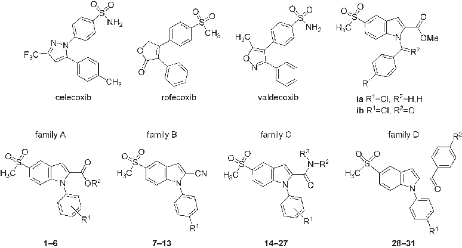
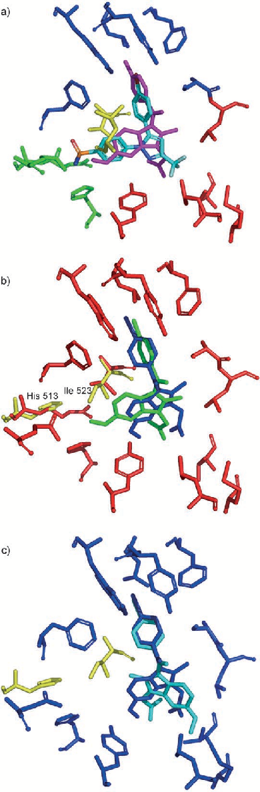
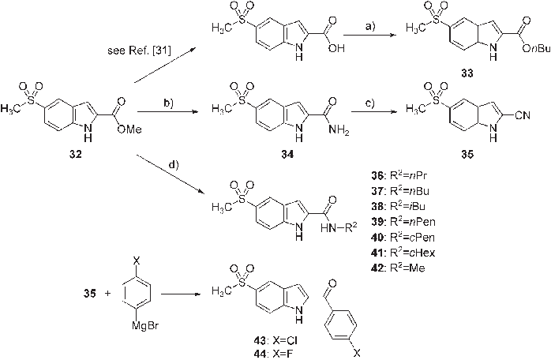
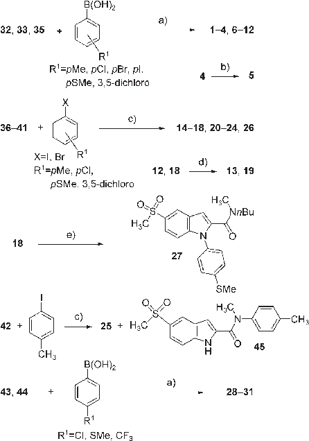
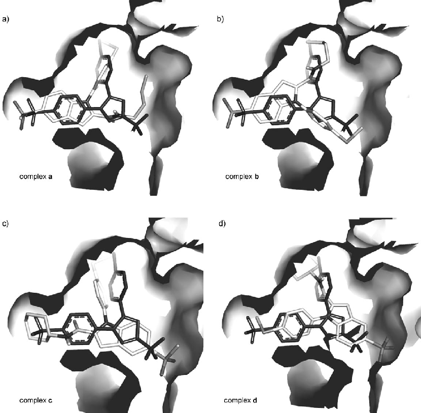
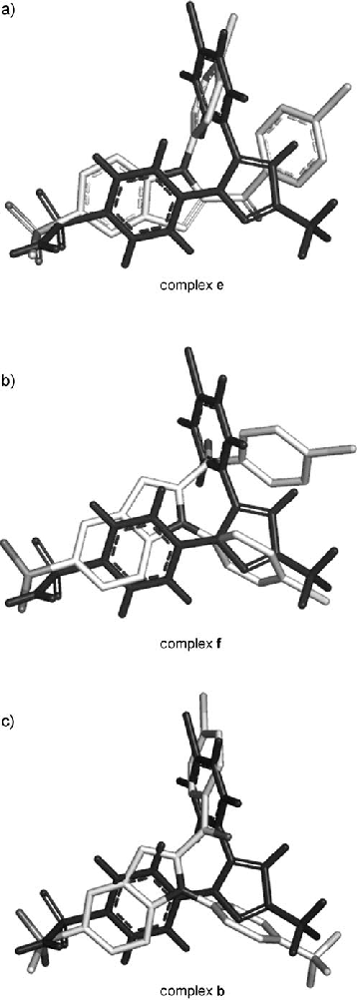

## MED

DOI: 10.1002/cmdc.200600179

# Design, Syntheses, Biological Evaluation, and Docking Studies of 2-Substituted 5Methylsulfonyl-1-Phenyl-1H-Indoles: Potent and Selective in vitro Cyclooxygenase-2 Inhibitors

Olga Cruz-L pez,[a] Juan Jos  D az-Moch n,[a] Joaqu n M. Campos,[a] Antonio Entrena,[a] Mar a T. NfflÇez,[b] Luis Labeaga,[b] Aurelio Orjales,[b] Miguel A. Gallo,[a] and Antonio Espinosa*[a]

indomethacin, with the insertion of the substituent at the 2-position in the hydrophobic pocket of the enzyme and the 1-position phenyl ring in the trifluoromethyl zone. Among the group of compounds evaluated, 2-(4-chlorobenzoyl)-1-(4-chlorophenyl)-5methylsulfonyl-1H-indole and 2-(4-chlorophenyl)-5-methylsulfonyl-1-(4-trifluoromethylphenyl)-1H-indole emerged as the most potent (respective IC50 values: 46 and 43 nm), and selective (respective selectivity indexes: >2163 and >2331) COX-2 inhibitors.

Four series of 5-methylsulfonyl-1-phenyl-1H-indole-2-carboxylic acid alkyl esters (family A), -2-carbonitriles (family B), -2-carboxamides (family C), and 2-benzoyl-5-methylsulfonyl-1-phenyl-1H-indoles (family D) were prepared and evaluated for their ability to inhibit purified cyclooxygenase-2 (COX-2) and cyclooxygenase-1 (COX-1). Family D compounds have the best COX-1/COX-2 inhibition ratios and potencies. According to docking studies, these molecules appear to bind the COX-2 binding site differently than

Introduction

Cyclooxygenases (COXs) are key enzymes in the synthesis of prostaglandin H2, which is a precursor for the biosynthesis of prostaglandins (PGs), thromboxanes, and prostacyclin.[1] COX enzymes are present in two isoforms: cyclooxygenase-1 (COX1) and cyclooxygenase-2 (COX-2).[2] Both COX-1[3] and COX-2[4] are constitutively expressed. COX-1 is essential for the protection of gastric mucosa, platelet aggregation, and renal blood flow, whereas COX-2 is expressed during inflammation, pain, and oncogenesis.[3] Because COX-2 is involved in inflammation and pain, molecules that inhibit its activity would be of therapeutic value. Many nonsteroidal anti-inflammatory drugs (NSAIDs) have been found to interact with these enzymes and inhibit their activity.[5] NSAIDs include aspirin and indomethacin, which are nonselective and inhibit both COX-1 and COX-2. Aspirin inhibits COX-1 more strongly than it does COX-2,[5] and the inhibition of COX-1 by aspirin decreases the production of PGE2 and PGI2, leading to an adverse ulcerogenic effect.[6]

Current research has focused on the development of safer NSAIDs: selective COX-2 inhibitors. Several COX-2 inhibitors such as celecoxib,[7] rofecoxib (Vioxx),[8,9] and valdecoxib[10] have been marketed as a new generation of NSAIDs (Figure 1).

The indole ring constitutes an important template for drug design, as exemplified by the classical NSAIDs indomethacin and indoxole.[11] We recently reported novel COX-2-selective inhibitors by using pharmacophore models with the basic structure of esters of 1-benzyl- or 1-benzoyl-5-sulfonylindoles i (Figure 1).[12a] Structures similar to i that bear a 2-(heterocycle– alkyl) substituent were reported by Matsuoka et al,[12b] and 1,2-

diarylindoles were previously patented[12c] as COX-2 inhibitors. 3-Substituted-1-(4-fluorophenyl)-1H-indoles were described as centrally acting dopamine D2 and serotonin 5-HT2 antagonists.[12d] Herein we report the development of a series of 5-sulfonylindole COX-2 inhibitors, in which the benzoyl or benzyl fragments and the ester group of i have been replaced with para-substituted phenyl rings and other carboxylic acid functional groups, respectively. These changes have allowed us to synthesize and biologically evaluate the following four families of compounds: family A (alkyl 1-phenyl-5-sulfonyl-1H-indole-2carboxylates), 1–6; family B (5-methylsulfonyl-1H-indole-1phenyl-2-carbonitriles), 7–13; and family C (5-methylsulfonyl-1phenyl-1H-indole-2-carboxamides), 14–27 (Figure 1 and Table 1). Family D (2-benzoyl-5-methylsulfonyl-1-phenyl-1H-indoles), 28–31 (Figure 1 and Table 1) were designed from the

- [a] Dr. O. Cruz-L pez, Dr. J. J. D az-Moch n, Prof. J. M. Campos, Prof. A. Entrena, Prof. M. A. Gallo, Prof. A. Espinosa Departamento de Qu mica Farmac utica y Org nica Facultad de Farmacia, c/Campus de Cartuja s/n, 18071 Granada (Spain) Fax: (+34) 958 243845 E-mail: aespinos@ugr.es
- [b] Dr. M. T. NfflÇez, Dr. L. Labeaga, Dr. A. Orjales FAES FARMA, S.A., Departamento de Investigaci n Apartado 555, 48080 Bilbao (Spain)

Supporting information for this article is available on the WWW under http://www.chemmedchem.org or from the author: docking and binding energies, 1H NMR data, and elemental analyses of final compounds 1–31, 45 and intermediates 33 and 44, and elemental analyses of all new compounds.

88 2007 Wiley-VCH Verlag GmbH&Co. KGaA, Weinheim ChemMedChem 2007, 2, 88–100

- Figure 1. Structures of celecoxib, rofecoxib, and valdecoxib. Structure i is the starting point for the modifications carried out on the molecules reported herein, which give rise to families A, B, C, and D.

Table 1. In vitro inhibition of purified COX-2 and COX-1 by compounds 1–31.

Compd R1 R2 R3 Inhibition [%][a] COX-2 COX-1

- 1 4-Me Me – 23.97 3.83 9.72 2.20
- 2 4-Cl Me – 25.68 2.59 0
- 3 3,5-dichloro Me – 22.02 7.16 3.91 3.93
- 4 4-SMe Me – 32.48 3.28 11.83 4.58
- 5 4-SO2Me Me – 27.63 3.13 27.63 2.20
- 6 4-SMe nBu – 31.85 3.66 27.47 6.75
- 7 Me – – 10.01 4.68 3.90 6.55
- 8 Et – – 6.48 5.62 4.79 13.44
- 9 Cl – – 7.17 3.28 8.93 3.62
- 10 Br – – 7.30 2.15 35.44 2.72
- 11 I – – 26.93 1.90 44.50 6.03
- 12 SMe – – 0 31.20 8.14
- 13 SO2Me – – 13.06 3.17 16.76 3.98
- 14 4-Me H nBu 27.90 5.66 23.77 1.37
- 15 4-Cl H nBu 19.82 3.13 0
- 16 3,5-dichloro H nBu 0 0
- 17 4-OMe H nBu 37.50 2.08 19.72 2.84
- 18 4-SMe H nBu >40 0
- 19 4-SO2Me H nBu 14.92 1.85 19.51 3.62
- 20 4-SMe H nPr 39.43 2.76 12.71 3.04
- 21 4-SMe H iBu 36.76 5.26 22.23 4.86
- 22 4-SMe H nPen >40 0
- 23 4-SMe H cPen 33.48 0.96 13.58 5.64
- 24 4-SMe H cHex 27.34 2.47 4.71 3.29
- 25 4-Me Me 4-(C6H4)OH 19.18 6.38 9.46 3.10
- 26 4-SMe nBu 4-(C6H4)SMe 31.03 3.75 28.26 7.18
- 27 4-SMe Me nBu 34.99 11.83 6.31 4.80
- 28 SMe Cl – >40 0
- 29 Cl Cl – >40 0
- 30 Cl F – >40 0
- 31 CF3 Cl – >40 0

[a] Data reported as percent SEM (n=4) at an inhibitor concentration of 10 mm.

docking studies and biological assays performed on compounds belonging to families A–C, and they have demonstrated higher values in terms of both selectivity and potency.

Design strategy

It is well known that COX-1/COX-2 substrate selectivity[13] is due to amino acid side chain variation at two positions: Ile523 in COX-1 and Val523 in COX-2, and His513 in COX-1 and Arg513 in COX-2. The smaller volume of the Val residue at position 523 opens an additional pocket in COX-2 (the so-called selectivity pocket) to ligand binding, whereas the larger volume of the Ile523 in COX-1 prevents the ligand from reaching this pocket. Arg513 is situated at the end of the selectivity pocket in COX-2 and forms additional hydrogen bonds with the ligand, thus reinforcing the binding. Figure 2 shows the binding sites of both enzymes and compares the binding modes of SC558 and indomethacin. Compound SC558 is a selective inhibitor and fills the COX-2 selectivity pocket, whereas indomethacin is a nonselective inhibitor and remains in the entrance to the selectivity pocket.[13] Two crystal structures of the 4-iodo analogue of indomethacin (iodoindomethacin) in complex with the COX-1 isoenzyme have been published,[14] showing two indistinguishable binding modes for the ligand (cis and trans models). In both cases, the N-benzoyl moiety is inserted into the hydrophobic pocket, yet the orientation of the indole ring is different (Figure 2).[14] Nevertheless, in both complexes, iodoindomethacin adopts a slightly different geometry from that of indomethacin in the COX-2 isoform, remaining even more distant from the narrow binding pocket (Figure 2). SC558 is too large to be accommodated into the COX-1 binding site.

Previously we demonstrated the importance of the 5-methylsulfonyl moiety in compounds of general formula i in the

- Figure 2. a) The binding site of COX-2 showing the amino acids that interact with the selective inhibitor SC558 (blue-green), taken from the crystal structure (PDB ID: 6COX);[13] four zones can be clearly defined: 1) a hydrophobic pocket allocated to the bromophenyl moiety (blue), 2) a zone that surrounds the trifluoromethyl group (red), 3) the phenyl zone (yellow) that is responsible for the COX-2 selectivity, and 4) the selectivity pocket (green) that is filled by the selective ligands. Indomethacin (magenta), a nonselective inhibitor, does not fill the selectivity pocket (PDB ID: 4COX).[13] b) Comparison of

preparation of COX-2-selective inhibitors.[12] These compounds are derived from the indomethacin structure, but they act as COX-2-selective inhibitors, especially compound ia (R1=Cl, R2=H,H). The high selectivity of compound ia could be due to two factors: 1) the presence of the 5-methylsulfonyl moiety and 2) the greater flexibility of the molecule that results from the presence of a CH2 group in place of the carbonyl group and the loss of conjugation between the indole and benzene rings. Because ib still bears a benzoyl moiety and also shows a good COX-1/COX-2 selectivity ratio, it seems that selectivity is due to the presence of the 5-methylsulfonyl group.

In our pharmacophore model derived from molecules of type i,[12] the 5-methylsulfonyl group can be perfectly superimposed over the celecoxib sulfanilide moiety. Moreover, the phenyl ring of i superimposes over the p-tolyl fragment of celecoxib, and the 2-methoxycarbonyl group of i onto the celecoxib trifluoromethyl moiety. Consequently, compounds ia and ib probably bind COX-2 with the 5-methylsulfonyl group deeply inserted into the COX-2 selectivity pocket in a manner similar to SC558, celecoxib, and other selective inhibitors.

Almost all known COX-2-selective inhibitors have a relatively rigid tricyclic structure (an important exception is lumiracoxib, the most COX-2-selective inhibitor on the market[15]), inhibitors of general structure i are more flexible. The design strategy for the preparation of all compounds described herein was to impart rigidity in the molecule by removing the carbon atom (CO or CH2) between the indole and phenyl moieties. All compounds described herein have a 1-phenyl substituent and several diverse substituents at C2.

Chemistry

The key step in the synthesis of all the compounds described herein is the N-arylation reaction performed on the appropriate 5-methylsulfonylindole derivatives. Scheme 1 shows the preparation of all intermediates from the commercially available methyl 5-methylsulfonyl-1H-indole-2-carboxylate 32.

The syntheses of compounds belonging to families A and B were carried out under the same reaction conditions as those described by Chan et al.[16a] and Lam and co-workers.[16b] Phenylboronic acids, used for the coupling reaction, were obtained from a commercially available source.

Compound 32 was used as an intermediate in the syntheses of compounds 1–4, while 33 was the precursor for compound 6. Compound 5 was obtained from 4 by oxidation of the sulfur atom to a sulfone group with monosulfate potassium perman-

the crystal structures of both complexes COX-2–indomethacin (green, PDB ID: 4COX) and COX-1–iodoindomethacin (blue, cis model, PDB ID: 1PGF);[14] COX-1 and COX-2 residues are represented in yellow and red, respectively. Side chain variation at two positions determines selectivity: Ile523 in COX-1 and Val523 in COX-2, and His513 in COX-1 and Arg513 in COX-2. The greater steric bulk of Ile523 in COX-1 prevents the ligand from interacting with the end of the selectivity pocket. c) Comparison of the alternative and indistinguishable binding modes of iodoindomethacin in the COX-1 binding pocket (blue: cis model, blue-green: trans model; PDB ID: 1PGG); His513 and Ile523 are highlighted in yellow, and remaining COX-1 residues are in blue.[14]

Scheme 1. Syntheses of intermediates needed for the preparation of all compounds in families A, B, C, and D: a) nBuOH, H2SO4; b) NH4OH, NH4Cl; c) POCl3; d) R2NH2, MeOH/THF, 508C, 48–72 h.

tions. Reaction times and yields were variable, with the lower yields obtained for 15, 20 and 24. The remaining compounds were synthesized with medium yields. The low yield of 20 (14%) could be due to the long reaction time (96 h) at an elevated temperature (1508C). In all cases the duration of the reaction was determined until no starting material remained, as determined by TLC. Compound 18 was also obtained with 37 and 4-methylthiophenylboronic acid in a higher yield (85%) than that obtained using the Ullmann process (52%). Slight impurities (~5%) were observed in the 1H and 13C NMR spectra of compounds 15 and 16, the syntheses of which were carried out under Ullmann conditions with

ganate (Oxonetm) and a methodology previously reported by us.[17]

Nitrile derivative 35 was treated with the Grignard reagents p-chlorophenylmagnesium bromide and p-fluorophenylmagnesium bromide to produce the 2-benzoyl-5-methylsulfonyl-1Hindoles 43 and 44. 5-Methylsulfonyl-1-phenyl-1H-indole-2-carbonitriles 7–13 (family B) and 2-benzoyl-5-methylsulfonyl-1phenyl-1H-indoles 28–31 (family D) were obtained by arylating the indole NH group from the intermediates 35, 43, and 44 using the same strategy followed in the preparation of compounds 1–4 and 6 (family A) (Scheme 2).

Compound 13 was obtained by oxidation of 12 with ZnCl2 and KMnO4 using the procedure previously reported by Xie et al.[18] The preparation of the bis(methylsulfonyl) derivative 13 was attempted according to the procedure followed for the preparation of 5 which used Oxonetm as the oxidant, but the yield was lower (50%).

We also tried to synthesize compounds 7–10 by means of the Ullmann coupling conditions (CuBr, DBU, NMP, 1508C)[19] by using 35 and several 4-disubstituted benzene derivatives (4-methylphenyl iodide, 4-ethylphenyl bromide, and 4-chlorophenyl bromide) as starting materials. In this way, 7 and 8 were obtained in very low yields (10 and 7%, respectively), whilst the reaction between 35 and 4-chlorophenyl bromide produced an inseparable 50% mixture of 9 and 10 (overall yield 5%). This fact may be explained by the similar reactivity of the two halogens (chlorine and bromine) under the harsh conditions of the Ullmann reaction, which would justify the formation of the two possible 1-phenylindole derivatives.

The chemistry involved in the synthesis of compounds that belong to family C is also shown in Scheme 2. Compounds 14– 18 and 20–24 were obtained from the corresponding intermediates 36–41 under the Ullmann coupling reaction condi-

Scheme 2. Syntheses of all target molecules belonging to families A, B, C,

and D from the corresponding intermediates: a) Cu(OAc)2, py, CH2Cl2, molecular sieves (4  ), room temperature; b) Oxonetm; c) CuBr, DBU, NMP, 1508C,

12–96 h; d) ZnCl2, KMnO4, (CH3)2CO (anhyd); e) MeI, KOH, Bu4NBr. DBU=1,8diazabicyclo[5.4.0]undec-7-ene, NMP=N-methyl-2-pyrrolidinone.

- 4-chlorophenyl bromide and 1-bromo-3,5-dichlorobenzene, respectively. These impurities could correspond to the analogous products as a consequence of the 1-arylation coupling processes through the chlorine atoms of the phenyl halides. It has to be pointed out that these side-reactions are far less important for the 1-arylation of the indole-2-carboxamides than for the indole-2-carbonitriles (compare the syntheses of 15 and 16 (family B) versus 7–10 (family C)). Compound 19 was obtained from 18 following the same procedure used for the preparation of 12 under previously reported conditions.[19] Finally, N-arylation of 42 under these conditions gave rise to 25 and 45, which correspond to the doubly arylated indole and amidic nitrogen atoms (compound 25), and the monoarylation product on the amidic nitrogen atom (compound 45).

The doubly arylated derivate 26 was obtained (12%) when the Ullmann reaction was carried out with 37 and 4-methylthiophenyl bromide using K2CO3 as the base (instead of DBU). From 18, N-methylation of the secondary amidic nitrogen atom was undertaken with MeI, KOH, and Bu4NBr under the phase-transfer conditions reported by Stauffer et al.[20] to produce 27.

The structures of all compounds were established by 1H and 13C NMR spectroscopy, high resolution liquid secondary ion mass spectrometry (HR LSIMS) and elemental analyses.

Docking studies

Docking studies were performed on the binding site of COX-2 using all compounds described herein. A table containing the number of clusters found for each compound, the number of the more populated clusters, and the binding and docking energies of each complex found for each compound is available in the Supporting Information.

In general, two main types of orientation inside the binding pocket were found for compounds 1–27: complexes a and b.

- Figure 3 shows both orientations for compound 18 (one of the more potent compounds of family C) and compares them with the orientation of the known inhibitor SC558 co-crystallized with the enzyme.

In the complex type a, the 4-methylthiobenzene moiety of 18 is accommodated inside the hydrophobic pocket of COX-2 in an orientation similar to that of the bromophenyl moiety of SC550; the N-butylcarboxamide group is oriented toward the trifluoromethyl zone. In complex type b, the relative positions of both the 4-methylthiobenzene and N-butylcarboxamide groups are exactly opposite to that of complex a. In both complexes, the 5-methylsulfonyl group is deeply inserted into the COX-2 selectivity pocket, similarly to the sulfonamide moiety of SC558, and the indole ring is situated in the COX-2 zone that accommodates the SC558 phenyl group.

The hydrophobic pocket seems to be large enough to accommodate both fragments (4-methylthiobenzene and N-butylamide) of 18 in both of the complexes. Nevertheless, there is an important difference between the general shape of SC558 and those of the molecules reported herein. In SC558, the angle between the axes of both phenyl rings is about 758, whereas in compounds 1–27 the angle between the indole

and benzene axes is considerably larger, about 1208. Consequently, the benzene moiety of compounds 1–27 adopts a quite different orientation inside the COX-2 hydrophobic pocket relative to the SC558 bromophenyl moiety, as can be observed in the geometry of complex a. Due to this fact, the 4-substituent is oriented toward the lateral of the hydrophobic pocket, and an increase in its volume should destabilize complex a. In complex b the 4-methylthiophenyl group seems to be better accommodated in the trifluoromethyl zone. On the other hand, the flexible 2-N-butylcarboxamide group seems to be well accommodated in both complexes. For compound 18 complex b is dominant, and there are three different clusters for this complex owing to the flexibility of the N-butylcarboxamide substituent (see Supporting Information).

In compounds 1–5 (family A), the influence of the 4-substituent is clear, as an increase in its volume clearly favors the population of complex b. Thus, in compounds 1 and 2 (4-Me and 4-Cl, respectively) complex a is the more populated, whereas in compounds 4 and 5, (4-SMe and 4-SO2Me) complex b becomes practically unique. It is interesting to note that in compound 3 (3,5-dichloro) only complex a is observed, and this could be due to the fact that the 3-chloro substituent is oriented toward the end of the hydrophobic pocket, and hence can be better accommodated in complex a.

In compounds 7–13 (family B), similar behavior is observed: a greater volume of the 4-substituent favors the population of complex b. This trend is clearly observed in the case of compounds 9–11: a 4-chloro substituent stabilizes only complex a, while a 4-iodo substituent favors only complex b. Similarly, for compound 7 (4-Me) only complex a is found, while for compound 8 (4-Et) complex b dominates.

Compounds belonging to family C bear an N-substituted or N,N-disubstituted 2-carboxamide group, and it is more difficult to generalize its behavior because the volume of the 2-substituent also varies widely within this family. Nevertheless, some tendencies can be observed:

- 1. Compounds 14–19 bear a flexible 2-CONH-nBu group, and in all of them an increment of the complex b population is observed when the volume of the 4-substituent grows.
- 2. Compound 24 bears a 2-CONH-C6H11 moiety, and this substituent is so large that it can be accommodated into the trifluoromethyl zone; thus complex b is not found for this molecule. Two new types of complexes have been observed (Figure 3, Supporting Information) for compound

24. In complex c the 2-N-cyclohexylcarboxamide group is situated in the selectivity pocket, while in complex d the 2substituent fills the hydrophobic pocket. Similar solutions have also been found for 21 and 25.

- 3. Finally, for compound 26 only complex types a and b have been found, but the low values of both binding and docking energies seem to indicate that these solutions are probably more an artifact of the program than real solutions to the problem.

Regarding family D, compounds 28–31 are characterized by the presence of a 4-substituted 2-benzoyl moiety. In these mol-

- Figure 3. Complexes type a (a) and b (b) found for 18, and complexes type c (c) and d (d) found for 24, in comparison with the crystal structure of the COX-2 complex with SC558 (dark).

ecules complex b (Figure 4) is the more populated in all cases, probably owing to the fact that the aromatic moiety is inserted into the COX-2 hydrophobic pocket. On the other hand, the size and shape of the 2-substituent is not appropriate for its insertion into the trifluoromethyl zone, and complex a is no longer present for these molecules. Instead, two new types of complex were found. In complex e (Figure 4) the N-phenyl group is inserted into the hydrophobic pocket as in complex type a, but the 2-benzoyl moiety is rotated and is accommodated between the hydrophobic pocket and the trifluoromethyl zone. In complex f (Figure 4) the N-phenyl group is inserted into the COX-2 trifluoromethyl zone (as in complex b) and the 2-benzoyl moiety is rotated.

Results and Discussion

The compounds reported herein were evaluated for their ability to inhibit purified enzymes COX-1 and COX-2 with exoge-

nous substrate (arachidonic acid).[21,22] The details of these assays are described in the Experimental Section. The activity results are expressed as a percentage of the inhibition of the purified enzymes at 10 mm in comparison with the vehicle (DMSO) and are shown in Table 1. The negative values obtained are not significant because these mean that DMSO shows an inhibition percentage higher than the tested compound. For compounds that exhibit inhibition >40%, the IC50 values and their selectivity indexes were calculated, establishing the concentration curves and responses by means of the PRISM program.[23]

To systematize the research, only one structural characteristic of our initial derivatives of the general formula i (Figure 1) was modified at a time. Hence, the first modification we carried out was the introduction of rigidity in the molecule by replacing the 1-benzyl or 1-benzoyl group with a 1-phenyl ring bearing several electronic groups. This transformation led to the family A of compounds in which the 2-alkoxycarbonyl

study of the COX-2–indomethacin complex crystal structure. Nevertheless, the n-butyl ester 6 shows about 32% inhibition (even if it is not selective), near the threshold value of 40% established for further studies, and our docking studies indicate that these compounds can bind into the binding pocket in a manner similar to that of SC558 or other selective inhibitors. Because this compound is neither too potent nor too selective, two interesting findings can be drawn from the biological assays performed in this family. The first is that the 4-methylthiophenyl substituent at the indole nitrogen atom is better in terms of activity. The second is that a high-volume substituent is preferred in the indole 2-position.

In spite of these discouraging results we decided to modify the functional group at position 2 of the heterocycle, introducing a cyano group to give compounds 7–13. This provided the possibility of studying the influence of a small electron-withdrawing group such as the nitrile fragment. The results turned out to be negative again (Table 1), as none of the compounds 7–13 inhibited at least 40% of the COX-2 enzyme. Also the percentage of COX-2 inhibition for these molecules is lower than those of compounds 1–5, supporting the previous hypothesis regarding the volume of the 2-substituent, which must have greater steric bulk than CN.

Recent studies concerning ester and amide derivatives of indomethacin have found very highly potent and selective compounds.[24] On the basis of this background, we decided to introduce a 2-carboxamide moiety in the 5-methylsulfonyl-1phenyl-1H-indole scaffold to obtain family C of our compounds that have shown better results as selective COX-2 inhibitors. Within this family, compounds 18 and 22 were the only two that showed >40% COX-2 inhibition, but other compounds (17, 20, 21, and 23) also showed a percentage of inhibition close to this value. The IC50 value against purified COX-1 and COX-2 enzymes was determined for compounds 18 and 22, showing some selectivity for the COX-2 isoform, although none of these compounds are potent inhibitors (Table 2).

Almost all compounds 1–27 showed only a low activity and this fact must be attributed to a inappropriate shape of the molecules. Our docking studies indicate that these compounds can bind COX-2 mainly in two different modes. In complex a, the 1-phenyl moiety is inserted in the COX-2 hydrophobic pocket, but does not seem appropriate for the fulfillment of

- Figure 4. Complexes type e (a) and f (b) for compound 29, and complex b (c) for compound 31, in comparison with the crystal structure of the COX-2

complex with SC558 (dark). Table 2. In vitro IC50 values of compounds 18, 22, 28–31, indomethacin, and rofecoxib toward COX-1 and COX-2.

Compd IC50 [mm] SI[a] COX-1 COX-2

moiety is conserved. Unfortunately, neither the indole-2-carboxylic acid methyl esters 1–5 nor the n-butyl compound 6 proved to be very active or selective (Table 1). These results could suggest that the 1-benzyl or 1-benzoyl substitutions at the 5-methylsulfonyl-1H-indole-2-carboxylic acid methyl ester[12] play a very important role in activity. It can be argued that the greater mobility of the benzyl or benzoyl groups in compounds type i would allow a better binding of the benzene ring into the hydrophobic pocket of the enzyme, as can be deduced from our pharmacophore model and from the

18 101 1.11 91.0 22 101 1.83 55.2

- 28 >100 0.223 >449
- 29 >100 0.046 >2163
- 30 >100 0.086 >1162
- 31 >100 0.043 >2331

indomethacin 0.0692 0.54 0.128

rofecoxib 101 0.40 252 [a] Selectivity index: ratio of [IC50(COX-1)]/[IC50(COX-2)].

this zone of the binding site. On the other hand, in complex b, the 2-substituent is inserted into the hydrophobic pocket and almost all compounds that show some degree of inhibition prefer this binding mode in the enzyme. In fact, for compounds 18 and 22, complex b shows a population of 53% and 71%, respectively (Supporting Information), and complex b is also important in compounds 6, 17, 20, and 21, which show a relatively high percent inhibition. Hence, it seems that these molecules can inhibit COX-2 by binding in this second binding mode (complex b) rather than in that of indomethacin (complex a).

It is significant that compounds 18 and 22 bear a flexible 2CONH-R substituent (for which R is an alkyl chain of 4 and 5 carbon atoms, respectively) that is inserted into the COX-2 hydrophobic pocket. Compounds 17, 20, and 21 also bear such a substituent, and compound 6 (the most potent in family A) has a 2-COO-nBu group. Hence, it seems that a functional group of the general formula CO-Y-C3–5 (where Y=O or NH) is the best substituent in this position of the molecule. Nevertheless, four of the six residues that form the hydrophobic pocket are aromatic (Phe381, Tyr385, Trp387, and Phe518), and this fact suggests that an aromatic moiety in the 2-carboxamide substituent should be more suitable for a strong stabilization of complex b. Such an aromatic substituent is present only in compounds 25 and 26; the former is almost inactive and the latter shows only 30% inhibition, probably due to the fact that 26 has an N,N-disubstituted 2-carboxamide group, and the steric bulk of the substituent is too great.

Compounds 28–31 were designed with the objective of favoring the stability of complex b. In these compounds, the 2substituent bears an aromatic moiety that should be interact favorably with the hydrophobic pocket of the binding site, and there is only one carbon atom linking the indole system and the aromatic moiety. Consequently, the 2-substituent occupies a smaller volume than that of compounds 25 and 26 and also has a more appropriate shape to fill the hydrophobic pocket, giving rise to a very stable complex b in all cases.

Compounds 28–31 have proven to be potent and selective COX-2 inhibitors. Inhibition in all cases is >40% (Table 1). For each compound the in vitro IC50 value is in the nanomolar range, and the selectivity index is considerably higher than that of rofecoxib (Table 2).

A 1-(4-methylthiophenyl) substituent is present in compound 28 as in compounds 18 and 22, and hence its high potency and selectivity is clearly due to the 2-(4-chlorobenzoyl) substituent, supporting the hypothesis of the formation of complex b. Compounds 29 and 30 bear a 1-(4-chlorophenyl) substituent, and the selectivity index for both molecules is higher than that of compound 28, indicating that a electronegative substituent is preferred in the phenyl ring. Finally, compound 31 is the best of all these new inhibitors. This molecule bears 2-(4-chlorobenzoyl) group that is very well suited for the filling of the hydrophobic pocket and a polar 1-(4-trifluoromethylphenyl) moiety (similar to SC558) that is accommodated in the polar COX-2 trifluoromethyl zone.

Conclusions

2-Substituted-5-methylsulfonyl-1-phenyl-1H-indoles constitute a new template for the development of COX-2-selective inhibitors. As reported in our previous paper,[12a] the presence of the 5-methylsulfonyl moiety in these molecules is crucial for both selectivity and potency. Docking studies suggest that these molecules could bind to the COX-2 binding site in a manner different to that of indomethacin, by inserting the 2-substituent into the hydrophobic pocket and the 1-phenyl ring into the trifluoromethyl zone. All compounds that have shown some selectivity and potency prefer this binding mode, represented by complex b. The more potent and selective inhibitors (compounds 28–31) were designed to favor the stability of this binding mode. All of them bear a para-substituted benzoyl substituent at position 2, as its volume, nature, and shape are most appropriate for stable binding inside the COX-2 hydrophobic pocket. The most potent and selective compound 31 bears a 1-(4-trifluoromethylphenyl) substituent on the indole ring, as this electronegative group is better stabilized by the polar COX-2 trifluoromethyl zone, similar to the case of the inhibitor SC550. Compounds 28–31 show higher in vitro potency and selectivity indexes than rofecoxib.

Experimental Section

Computational methodology. Ligand preparation. Ligands were built and optimized using the Sybyl program.[25] For this purpose, appropriate fragments from the Sybyl libraries were used to build each molecule, and partial atomic charges were calculated by the Gasteiger–Marsili method.[26] The Tripos force field[27] was used in the calculations, and each molecule was optimized by the method of Powell[28] until the energy gradient was less than 0.05 kcalmol 1 2. The optimized geometry was transferred to the Autodock Tools (ADT) program[29] to prepare the appropriate file needed for the docking study. For this purpose, the nonpolar hydrogen atoms were deleted, and their partial atomic charges were merged onto the heavy atom to which they were bonded.

Enzyme setup. Chain A of the crystal structure of COX-2 in complex with SC558 (PDB code: 6COX)[13] was selected for the docking studies. The ligand and heme group were deleted, and polar hydrogen atoms, partial atomic charges, and solvation parameters were added using the ADT program.

Docking procedure. Potential maps were generated using the AUTOGRID program,[30] available in the AUTODOCK package, using a grid centered in the SC558 binding pocket with a size of 60 60  60 points and a grid spacing of 0.375  . 100 runs of GA (genetic algorithm) were performed for each ligand using the standard conditions defined in the Autodock program. Final geometries of each run were compared with the initial geometry and clustered as a function of the free energy of binding. Table 1 summarizes the total number of clusters found for each compound, the order of the more populated clusters, the number of conformations in the more populated clusters, and the docking and binding energies of the more favored conformation of each cluster.

Chemistry. Melting points (mp) were taken in open capillaries on an electrothermal melting point apparatus and are uncorrected. All moisture-sensitive reactions were performed in flame-dried glass-

ware equipped with rubber septa under a positive pressure of dry argon. Organic extracts were dried over MgSO4 and Na2SO4. Thin layer chromatography (TLC) was performed on Merck Kieselgel 60 F254, and the spots were observed under UV light. 1H NMR spectra were recorded on a Bruker instrument at 300.13 and 400.1 MHz, in CDCl3, [D6]DMSO, and CD3COCD3. Chemical shifts are reported in d and referenced to CDCl3 (d=7.25 ppm), [D6]DMSO (d=2.50 ppm), and CD3COCD3 (d=2.05 ppm). Accurate mass determination was carried out in an AutoSpec-Q mass spectrometer arranged in a EBE geometry (Micromass Instruments, Manchester, UK) and equipped with a liquid secondary ion mass spectra (LSIMS) source. The instrument was operated at 8 kV accelerating voltage and Cs+ cations were used as primary ions. Solvents were obtained dry as follows: THF was distilled from benzophenone ketyl, toluene was distilled from CaH2, CH2Cl2 was refluxed over and distilled from P2O5 and then stored over molecular sieves (4  ), methanol and ethanol were refluxed from Mg/I and distilled. Acetone was dried with anhydrous CaSO4, filtered, and fractionated.

- 5-Methylsulfonyl-1H-indole-2-carboxylic acid n-butyl ester 33.

Concentrated H2SO4 (1 mL) was added to a suspension of 5-methylsulfonyl-1H-indole-2-carboxylic acid[31] obtained from 32 (500 mg, 2.09 mmol) in n-butanol (14 mL), and the resulting solution was held at reflux (1008C) for 20 h. The solvent was evaporated under vacuum and neutralized with a solution of 1n NaOH. After extraction (EtOAc) the organic phase was dried (Na2SO4), filtered, and concentrated to give a solid that was recrystallized from a mixture of EtOH and hexanes to give 33 as a white solid (522 mg, 85%); mp: 109–1108C; HR LSIMS calcd for C14H18NO4S [M+H]+ 296.0959, found 296.0958; anal. (C14H17NO3S) C, H, N.

5-Methylsulfonyl-1H-indole-2-carboxamide 34. A suspension of 32 (600 mg, 2.37 mmol), a 32% aqueous solution of NH4OH (10 mL) and NH4Cl (40 mg) was warmed at 308C for 12 h. The solid was filtered and purified by flash chromatography (CH2Cl2/MeOH, 9:1) to give 34 as a light-yellow solid (450 mg, 80%); mp: 270– 2718C; HR LSIMS calcd for C10H10N2O3SNa [M+Na]+ 261.0308, found 261.0309; anal. (C10H10N2O3S) C, H, N.

5-Methylsulfonyl-1H-indole-2-carbonitrile 35. POCl3 (0.8 mL, 8.49 mmol) was added to a suspension of 34 (185 mg, 0.78 mmol) in anhydrous toluene (6 mL) at room temperature, under an argon atmosphere. It was held at reflux (1208C) for 5 h. Then the suspension was concentrated and extracted with EtOAc and a saturated solution of NaHCO3. The organic phase was dried (Na2SO4), filtered, and concentrated. The solid obtained was purified by flash chromatography (hexanes/EtOAc, 1:1) to give 34 as a white solid (160 mg, 94%); mp: 231–2328C; HR LSIMS calcd for C10H8N2O2SNa [M+Na]+ 243.0204, found 243.0204; anal. (C10H8N2O2S) C, H, N.

General procedure for the preparation of N-alkyl-5-methylsulfonyl-1H-indole-2-carboxamides 36–42. 32 (300 mg, 1.18 mmol) was placed in a round-bottomed flask into which a septum was placed. Anhydrous MeOH (4 mL), anhydrous THF (3 mL), and an excess of the corresponding amine were added under argon. The reaction mixture was warmed at 508C for 48–72 h while stirring. The mixture was cooled, concentrated (except for 39, which was filtered), and purified to give the corresponding amides with yields of 32–73%.

N-n-Propyl-5-methylsulfonyl-1H-indole-2-carboxamide 36. It was obtained from 32 and n-propylamine (5 mL), reaction time 48 h,

- and purified by flash chromatography (hexanes/EtOAc, 1:1) to give 36 as a white solid (280 mg, 64%); mp: 258–2608C; HR LSIMS calcd for C13H16N2O3SNa [M+Na]+ 303.0776, found 303.0776; anal. (C13H16N2O3S) C, H, N.

N-n-Butyl-5-methylsulfonyl-1H-indole-2-carboxamide 37. It was obtained from 32 and n-butylamine (5 mL), reaction time 72 h, and purified by flash chromatography (hexanes/EtOAc, 1:1) to give 37 as a white solid (255 mg, 73%); mp: 227–2288C; HR LSIMS calcd

- for C14H18N2O3SNa [M+Na]+ 317.0934, found 317.0935; anal. (C14H18N2O3S) C, H, N.

N-Isobutyl-5-methylsulfonyl-1H-indole-2-carboxamide 38. It was obtained from 32 and isobutylamine (4 mL), reaction time 72 h, and purified by recrystallization from acetone to give 38 as a white solid (250 mg, 72%); mp: 287–2888C; HR LSIMS calcd for

- C14H18N2O3SNa [M+Na]+ 317.0935, found 317.0935; anal.

- (C14H18N2O3S) C, H, N.

N-n-Pentyl-5-methylsulfonyl-1H-indole-2-carboxamide 39. It was obtained from 32 and n-pentylamine (6 mL), reaction time 48 h, filtered, and washed thoroughly several times with Et2O to give 39 as a white solid (250 mg, 69%); mp: 213–2148C HR LSIMS calcd for C15H21N2O3S [M+H]+ 309.1273, found 309.1273; anal. (C15H20N2O3S) C, H, N.

N-Cyclopentyl-5-methylsulfonyl-1H-indole-2-carboxamide 40. It was obtained from 32 and cyclopentylamine (4 mL), reaction time 72 h, filtered, and purified by recrystallization from MeOH to give 40 as a white solid (130 mg, 36%); mp: >3008C; HR LSIMS calcd for C15H18N2O3SNa [M+Na]+ 329.0939, found 329.0939; anal.

- (C15H18N2O3S) C, H, N.

N-Cyclohexyl-5-methylsulfonyl-1H-indole-2-carboxamide 41. It was obtained from 32 and cyclohexylamine (6 mL), reaction time 72 h, and purified by flash chromatography (hexanes/EtOAc, 2:1) to give 41 as a white solid (120 mg, 32%); mp: 295–2968C; HR LSIMS calcd for C16H20N2O3SNa [M+Na]+ 343.1093, found 343.1092; anal. (C16H20N2O3S) C, H, N.

N-Methyl-5-methylsulfonyl-1H-indole-2-carboxamide 42. It was obtained from 32 and methylamine in THF (2m), reaction time 48 h, and purified by flash chromatography (hexanes/EtOAc, 1:1) to give 42 as a white solid (184 mg, 62%); mp: >3008C; HR LSIMS calcd for C11H12N2O3S 252.0564, found 252.0564; anal. (C12H12N2O3S) C, H, N.

General procedure for the preparation of 2-benzoyl-5-methylsulfonyl-1H-indoles 43 and 44: The corresponding phenylmagnesium bromide solution (3 equiv) was added dropwise to a solution of 35 (1 equiv) in anhydrous THF (4 mLmmol 1), under an argon atmosphere and at 08C, and the resulting solution was left for 2 h. The mixture was treated with HCl (2n), left to stir at room temperature overnight, extracted with CH2Cl2, washed several times (HCl 2n and H2O), dried (Na2SO4), filtered, and concentrated. The crude product obtained was purified by flash chromatography using mixtures of hexanes/EtOAc.

2-(4-Clorobenzoyl)-5-methylsulfonyl-1H-indole 43. It was obtained from 35 (100 mg, 0.45 mmol) and 4-chlorophenylmagnesium bromide, purified by flash chromatography (hexanes/EtOAc, 3:1) to give 43 as a white solid (130 mg, 86%); mp: 246–2488C; HR LSIMS calcd for C16H12ClNO3SNa [M+Na]+ 356.0124, found 356.0124; anal. (C16H12ClNO3S) C, H, N.

2-(4-Fluorobenzoyl)-5-methylsulfonyl-1H-indole 44. It was obtained from 35 (500 mg, 2.27 mmol) and 4-fluorophenylmagnesium bromide, purified by flash chromatography (hexanes/EtOAc, 3:2) to give 44 as a yellow solid (500 mg, 70%); mp: 222–2238C; HR LSIMS calcd for C16H12FNO3SNa [M+Na]+ 340.0420, found 340.0419; anal. (C16H12FNO3S) C, H, N.

General procedure for the preparation of N-alkyl-5-methylsulfonyl-1-phenyl-1H-indole-2-carboxylates 1–6. A spatula end containing molecular sieves (4  ) was added to an oven-dried roundbottomed flask. A septum was inserted, the flask was left to cool down, and indole derivative (1 equiv), the corresponding phenylboronic acid (3 equiv), and anhydrous copper(II)acetate were added. Next, anhydrous THF or anhydrous CH2Cl2 were added depending on the solubility of the starting materials, and finally pyridine (4 equiv) was added to the previous solution. The reaction was left at room temperature for 22–48 h. Afterward, the mixture was filtered on Celitetm and washed with CH2Cl2 and acetone. The filtrate was concentrated, and the crude product obtained was purified by flash chromatography using mixtures of hexanes/EtOAc.

5-Methylsulfonyl-1-(4-methylphenyl)-1H-indole-2-carboxylic acid

- methyl ester 1. It was obtained from 32 (50 mg, 0.20 mmol) and

- 4-methylphenylboronic acid (81.6 mg, 0.60 mmol), reaction time 28 h, and purified by flash chromatography (hexanes/EtOAc, 3:1) to give 1 as a white solid (50 mg, 73%); mp: 176–1788C; HR LSIMS calcd for C18H17NO4SNa [M+Na]+ 366.0778, found 366.0778; anal. (C18H17NO4S) C, H, N.
- 5-Methylsulfonyl-1-(4-chlorophenyl)-1H-indole-2-carboxylic acid

- methyl ester 2. It was obtained from 32 (50 mg, 0.20 mmol) and

- 4-chlorophenylboronic acid (93 mg, 0.60 mmol), reaction time 22 h, and purified by flash chromatography (hexanes/EtOAc, 3:1) to give 2 as a white solid (64 mg, 88%); mp: 178–1808C; HR LSIMS calcd for C17H14ClNO4SNa [M+Na]+ 386.0222, found 386.0222; anal. (C17H14NO4S) C, H, N.
- 5-Methylsulfonyl-1-(3,5-dichlorophenyl)-1H-indole-2-carboxylic

- acid methyl ester 3. It was obtained from 32 (50 mg, 0.20 mmol) and 3,5-dichlorophenylboronic acid (114.5 mg, 0.60 mmol), reaction time 22 h, and purified by flash chromatography (hexanes/EtOAc,

- 3:1) to give to give 3 as a white solid (70 mg, 88%); mp: 228– 2298C; HR LSIMS calcd for C17H13Cl2NO4SNa [M+Na]+ 419.9840, found 419.9840; anal. (C17H13Cl2NO4S) C, H, N.

5-Methylsulfonyl-1-(4-methylthiophenyl)-1H-indole-2-carboxylic acid methyl ester 4. It was obtained from 32 (100 mg, 0.40 mmol) and 4-methylthiophenylboronic acid (202 mg, 1.20 mmol), reaction time 48 h, and purified by flash chromatography (hexanes/EtOAc,

- 3:1) to give to give 4 as a white solid (95 mg, 65%); mp: 127– 1288C; HR LSIMS calcd for C18H17NO4S2Na [M+Na]+ 398.0495, found 398.0495; anal. (C18H17NO4S2) C, H, N.

5-Methylsulfonyl-1-(4-methylsulfonylphenyl)-1H-indole-2-carboxylic acid methyl ester 5. A solution of Oxonetm (160 mg,

- 0.26 mmol) in H2O (1 mL) was added dropwise to a suspension of

4 (50 mg, 0.13 mmol) in MeOH (3 mL) and was left stirring for

- 1.5 h. MeOH was concentrated, the aqueous suspension was neutralized with a saturated solution of NaHCO3, and extracted (CH2Cl2). The organic phase was dried (Na2SO4), filtered, and concentrated to give 5 as a white solid (53 mg, 100%); mp: >3008C; HR LSIMS calcd for C18H17NO6S2Na [M+Na]+ 430.0397, found 430.0397; anal. (C18H17NO6S2) C, H, N.

5-Methylsulfonyl-1-(4-methylthiophenyl)-1H-indole-2-carboxylic acid n-butyl ester 6. It was obtained from 33 (100 mg, 0.34 mmol) and 4-methylthiophenylboronic acid (171 mg, 1.02 mmol), reaction time 40 h, and purified by flash chromatography (hexanes/EtOAc, 3:1) to give to give 6 as a white solid (102 mg, 72%); mp: 124– 1258C; HR LSIMS calcd for C21H23NO4S2Na [M+Na]+ 440.0971, found 440.0971; anal. (C21H23NO4S2) C, H, N.

General procedure for the preparation of 5-methylsulfonyl-1phenyl-1H-indole-2-carbonitriles 7–12. CuBr (1.1 equiv), DBU

(1.1 equiv), and the corresponding phenyl halide (3 equiv) were added to a solution of the indole derivative (1 equiv) in NMP (6 mLmmol 1). The mixture was introduced in an oil bath at 1508C and was left for 12–96 h. The mixture was treated with a solution of HCl (5%) and EtOAc after cooling down, filtered on Celitetm, and the filtrate was extracted. The organic phase was washed several times with a saturated solution of NaCl, dried (Na2SO4), filtered, and concentrated. The crude product obtained was purified by flash chromatography using mixtures of hexanes/EtOAc.

1-(4-Methylphenyl)-5-methylsulfonyl-1H-indole-2-carbonitrile 7. It was obtained from 35 (200 mg, 0.91 mmol) and 4-iodotoluene (594 mg, 2.72 mmol), reaction time 22 h, and purified by flash chromatography (hexanes/EtOAc, 4:1) to give to give 7 as an off-white solid (28 mg, 10%). Compound 7 was also obtained according to the general procedure from 35 (20 mg, 0.09 mmol) and 4-methylphenylboronic acid (37 mg, 0.27 mmol). Reaction time was 6 h, and after a flash chromatography, 7 was obtained (21 mg, 75%); mp: 243–2448C; HR LSIMS calcd for C17H14N2O2SNa [M+Na]+ 333.0670, found 333.0670; anal. (C17H14N2O2S) C, H, N.

1-(4-Ethylphenyl)-5-methylsulfonyl-1H-indole-2-carbonitrile 8. It was obtained from 35 (200 mg, 0.91 mmol) and 4-bromoethylbenzene (414 mg, 2.72 mmol), reaction time 40 h, and purified by flash chromatography (hexanes/EtOAc, 3.5:1) to give 8 as an off-white solid (20 mg, 7%). Compound 8 was also obtained according to the general procedure from 35 (12 mg, 0.05 mmol) and 4-ethylphenylboronic acid (24.5 mg, 0.16 mmol). Reaction time was 4 h and the crude product was purified by flash chromatography (hexanes/ EtOAc, 3:1) to give 8 as a white solid (17 mg, 98%); mp: 173– 1748C; HR LSIMS calcd for C18H16N2O2SNa [M+Na]+ 347.0771, found 347.0772; anal. (C18H16N2O2S) C, H, N.

1-(4-Chlorophenyl)-5-methylsulfonyl-1H-indole-2-carbonitrile 9. It was obtained from 35 (80 mg, 0.36 mmol) and 4-chlorophenylboronic acid (169 mg, 1.08 mmol), reaction time 4 h, and purified

- by flash chromatography (hexanes/EtOAc, 4:1) to give 9 as a white solid (115 mg, 97%); mp: 228–2298C; HR LSIMS calcd for C16H12ClN2O2S [M+H]+ 331.0309, found 331.0309; anal. (C16H11ClN2O2S) C, H, N.

1-(4-Bromophenyl)-5-methylsulfonyl-1H-indole-2-carbonitrile 10. It was obtained from 35 (100 mg, 0.45 mmol) and 4-bromophenylboronic acid (271 mg, 1.35 mmol), reaction time 6 h, and purified

- by flash chromatography (hexanes/EtOAc, 4:1) to give 10 as a white solid (140 mg, 83%); mp: 226–2288C; HR LSIMS calcd for C16H13BrN2O2SNa [M+Na]+ 398.9774, found 398.9774; anal. (C16H11BrN2O2S) C, H, N.

1-(4-Iodophenyl)-5-methylsulfonyl-1H-2-indole-2-carbonitrile 11. It was obtained from 35 (20 mg, 0.09 mmol) and 4-iodophenylboronic acid (67.4 mg, 0.27 mmol), reaction time 6 h, and purified by flash chromatography (hexanes/EtOAc, 3:1) to give 11 as a white solid (36 mg, 95%); mp: 248–2498C; HR LSIMS calcd for C16H11IN2O2SNa [M+Na]+ 444.9485, found 444.9485; anal.

- (C16H11IN2O2S) C, H, N.

5-Methylsulfonyl-1-(4-methylthiophenyl)-1H-indole-2-carbonitrile 12. It was obtained from 35 (20 mg, 0.09 mmol) and 4-methylthiophenylboronic acid (45.7 mg, 0.27 mmol), reaction time 5 h, and purified by flash chromatography (hexanes/EtOAc, 3:1) to give 12 as a white solid (22 mg, 72%); mp: 207–2088C; HR LSIMS calcd for C17H14N2O2S2Na [M+Na]+ 365.0397, found 365.0397; anal.

- (C17H14N2O2S2) C, H, N.

5-Methylsulfonyl-1-(4-methylsulfonylphenyl)-1H-indole-2-carbonitrile 13. A suspension of 12 (95 mg, 0.28 mmol) and ZnCl2

(76 mg, 0.56 mmol) in anhydrous acetone (5 mL) under an argon atmosphere was cooled to 258C. Next, KMnO4 (88 mg, 0.56 mmol) was added, and the resulting suspension was left stirring for 4 h. After concentrating, the solid residue was washed (H2O) and extracted (EtOAc). The organic phase was dried (Na2SO4), filtered, and concentrated. The solid obtained was washed with Et2O, CH2Cl2, and acetone to give 13 as a white solid (73 mg, 70%); mp: >3008C; HR LSIMS calcd for C17H14N2O4S2Na [M+Na]+ 397.0289, found 397.0289; anal. (C17H14N2O4S2) C, H, N.

General procedure for the preparation of N-alkyl 5-methylsulfonyl-1-phenyl-1H-indole-2-carboxamides 14–18, 20–27, and 45. CuBr (1.1 equiv), DBU (1.1 equiv), and the corresponding phenyl halide (3 equiv) were added to a solution of the indole derivative (1 equiv) in NMP (6 mLmmol 1 of the indole derivative). The mixture was introduced in an oil bath at 1508C and maintained at this temperature for 12–96 h. Afterward, it was cooled and treated with

- 5% aqueous HCl and EtOAc. The mixture was filtered on Celitetm, and the filtrate was extracted (EtOAc). The organic layer was

washed with brine, dried (Na2SO4), filtered, and concentrated, and the crude product was purified by flash chromatography by using mixtures of hexanes/EtOAc.

N-n-Butyl-1-(4-methylphenyl)-5-methylsulfonyl-1H-indole-2-car-

- boxamide 14. It was obtained from 37 (200 mg, 0.68 mmol) and 4iodotoluene (445 mg, 2.04 mmol), reaction time 14 h, and purified by flash chromatography (hexanes/EtOAc, 2:1) to give 14 as a white solid (200 mg, 77%); mp: 175–1768C; HR LSIMS calcd for

C21H25N2O3S [M+H]+ 385.1583, found 385.1583; anal. (C21H24N2O3S) C, H, N.

N-n-Butyl-1-(4-chlorophenyl)-5-methylsulfonyl-1H-indole-2-car-

- boxamide 15. It was obtained from 37 (295 mg, 1.00 mmol) and 4bromochlorobenzene (574 mg, 3.00 mmol), reaction time 18 h, and purified by flash chromatography (hexanes/EtOAc, 2:1) to give 15 as a white solid (110 mg, 14%); mp: 170–1738C; HR LSIMS calcd

- for C20H21ClN2O3SNa [M+Na]+ 427.0858, found 427.0858; anal.

- (C20H21ClN2O3S) C, H, N. N-n-Butyl-1-(3,5-dichlorophenyl)-5-methylsulfonyl-1H-indole-2-

- carboxamide 16. It was obtained from 37 (200 mg, 0.68 mmol) and 3,5-dichloro-5-iodobenzene (557 mg, 2.04 mmol), reaction time 12 h, and purified by flash chromatography (hexanes/EtOAc, 2:1) to give 16 as a white solid (100 mg, 35%); mp: 194–1958C; HR LSIMS calcd for C20H20Cl2N2O3SNa [M+Na]+ 461.0470, found 461.0469; anal. (C20H20Cl2N2O3S) C, H, N. N-n-Butyl-1-(4-methoxyphenyl)-5-methylsulfonyl-1H-indole-2-
- carboxamide 17. It was obtained from 37 (200 mg, 0.68 mmol) and 4-bromoanisol (0.26 mL, 2.04 mmol), reaction time 41 h, and purified by flash chromatography (CH2Cl2/MeOH, 100:0.2) to give

- 17 as a white solid (80 mg, 30%); mp: 167–1688C; HR LSIMS calcd

for C21H24N2O4SNa [M+Na]+ 423.1356, found 423.1356; anal. (C21H24N2O4S) C, H, N.

N-n-Butyl-5-methylsulfonyl-1-(4-methylthiophenyl)-1H-indole-2-

carboxamide 18. It was obtained from 37 (200 mg, 0.68 mmol) and 4-bromothioanisol (414 mg, 2.04 mmol), reaction time 40 h, and purified by flash chromatography (hexanes/EtOAc, 2:1) to give

- 18 as an off-white solid (145 mg, 52%). Compound 18 was also obtained from 37 (76 mg, 0.26 mmol) and 4-methylphenylboronic acid (131 mg, 0.78 mmol), reaction time 36 h, and 18 was obtained (92 mg, 85%); mp: 172–1738C; HR LSIMS calcd for C21H25N2O3S2 [M+H]+ 417.1307, found 417.1307; anal. (C21H24N2O3S2) C, H, N.

5-Methylsulfonyl-1-(4-methylthiophenyl)-N-n-propyl-1H-indole2-carboxamide 20. It was obtained from 36 (150 mg, 0.54 mmol)

and 4-bromothioanisol (329 mg, 1.62 mmol), reaction time 96 h, and purified by flash chromatography (hexanes/EtOAc, 2:1) to give

- 20 as a yellow solid (30 mg, 14%); mp: 191–1928C; HR LSIMS calcd for C20H22N2O3S2Na [M+Na]+ 425.0971, found 425.0971; anal.

- (C20H22N2O3S2) C, H, N. N-isoButyl-5-methylsulfonyl-1-(4-methylthiophenyl)-1H-indole-2-

- carboxamide 21. It was obtained from 38 (200 mg, 0.68 mmol) and 4-bromothioanisol (414 mg, 2.04 mmol), reaction time 46 h, and purified by flash chromatography (hexanes/EtOAc, 2:1) to give

21 as an off-white solid (160 mg, 57%); mp: 204–2058C; HR LSIMS calcd for C21H24N2O3S2Na [M+Na]+ 439.1126, found 439.1126; anal. (C21H24N2O3S2) C, H, N.

5-Methylsulfonyl-1-(4-methylthiophenyl)-N-n-pentyl-1H-indole-2-

- carboxamide 22. It was obtained from 39 (100 mg, 0.32 mmol) and 4-methylthiophenylboronic acid (163 mg, 0.73 mmol), reaction

time 46 h, and purified by flash chromatography (CH2Cl2/MeOH, 100:0.1) to give 22 as a white solid (92 mg, 65%); mp: 205–2068C;

- HR LSIMS calcd for C22H26N2O3S2Na [M+Na]+ 453.1286, found 453.1286; anal. (C22H26N2O3S2) C, H, N. N-Cyclopentyl-5-methylsulfonyl-1-(4-methylthiophenyl)-1H-

- indole-2-carboxamide 23. It was obtained from 40 (110 mg, 0.36 mmol) and 4-bromothioanisol (219 mg, 1.08 mmol), reaction time 22 h, and purified by flash chromatography (hexanes/EtOAc, 2:1) to give 23 as a white solid (65 mg, 42%); mp: 204–2058C; HR LSIMS calcd for C22H24N2O3S2Na [M+Na]+ 451.1123, found 451.1123; anal. (C22H24N2O3S2) C, H, N. N-Cyclohexyl-5-methylsulfonyl-1-(4-methylthiophenyl)-1H-
- indole-2-carboxamide 24. It was obtained from 41 (90 mg, 0.28 mmol) and 4-bromothioanisol (171 mg, 0.84 mmol), reaction time 44 h, and purified by flash chromatography (hexanes/EtOAc, 2.5:1) to give 24 as a white solid (20 mg, 16%); mp: 203–2058C;

- HR LSIMS calcd for C23H26N2O3S2Na [M+Na]+ 465.1287, found 465.1287; anal. (C23H26N2O3S2) C, H, N.

N-Methyl-5-methylsulfonyl-N,1-bis(4-methylphenyl)-1H-indole-2-

carboxamide 25 and N-methyl-5-methylsulfonyl-N-(4-methylphenyl)-1H-indole-2-carboxamide 45. Compounds 25 and 45 were obtained from 42 (200 mg, 0.79 mmol) and 4-iodotoluene (519 mg, 2.38 mmol), reaction time 36 h, and purified by flash chromatography (hexanes/EtOAc, 2.5:1) to produce 25 and 45. 25 was isolated as a white solid (67 mg, 20%); mp: 205–2068C; HR LSIMS calcd for C25H24N2O3SNa [M+Na]+ 455.1404, found 455.1404; anal. (C25H24N2O3S) C, H, N. Compound 45 was isolated as a white solid (60 mg, 22%); mp: 258–2598C; HR LSIMS calcd for C18H19N2O3S [M+H]+ 343.1112, found 343.1112; anal. (C18H18N2O3S) C, H, N.

N-n-Butyl-5-methylsulfonyl-N,1-bis(4-methylthiophenyl)-1H-

- indole-2-carboxamide 26. It was obtained from 37 (200 mg, 0.68 mmol) and 4-bromothioanisol (414 mg, 2.04 mmol), reaction

time 55 h, and purified by flash chromatography (CH2Cl2/MeOH, 100:0.1) to give 26 as a white solid (44 mg, 12%); mp: 258–2608C;

HR LSIMS calcd for C28H30N2O3S3Na [M+Na]+ 561.1323, found 561.1323; anal. (C28H30N2O3S3) C, H, N.

N-n-Butyl-N-methyl-5-methylsulfonyl-1-(4-methylthiophenyl)-1H-

- indole-2-carboxamide 27. A solution of MeI (22 mL, 0.36 mmol) in anhydrous toluene (1.5 mL) was added dropwise to a suspension of 18 (48 mg, 0.12 mmol), KOH (13 mg, 0.24 mmol) and n-tetrabutylammonium bromide (1.8 mg, 0.006 mmol) in anhydrous toluene, at room temperature and under an argon atmosphere. The mixture was warmed at 808C for 12 h. After cooling, the mixture was washed (H2O) and the organic phase was washed with a saturated solution of NaCl, dried (Na2SO4), filtered, and concentrated. The re-

sulting mixture was purified by flash chromatography (hexanes/ EtOAc, 2:1) and 27 was obtained as a colorless oil (26 mg, 53%). HR LSIMS calcd for C22H26N2O3S2Na [M+Na]+ 453.1292, found 453.1292; anal. (C22H26N2O3S2) C, H, N.

N-n-Butyl-5-methylsulfonyl-1-(4-methylsulfonylphenyl)-1H-

indole-2-carboxamide 19. A suspension of 18 (95 mg, 0.23 mmol) and ZnCl2 (62 mg, 0.46 mmol) in anhydrous acetone (5 mL) under an argon atmosphere, was cooled to 258C. Next, KMnO4 (72 mg, 0.46 mmol) was added, and the resulting suspension was left stirring for 30 min. After concentrating, the solid residue was washed (H2O) and extracted (CH2Cl2). The organic phase was dried (Na2SO4), filtered, and concentrated. This crude product was purified by flash chromatography (hexanes/EtOAc, 1:3) to give 19 as a white solid (95 mg, 93%); mp: 227–2288C; HR LSIMS calcd for C21H24N2O5S2Na [M+Na]+ 471.1025, found 471.1025; anal. (C21H24N2O5S2) C, H, N.

2-(4-Chlorobenzoyl)-5-methylsulfonyl-1-(4-methylthiophenyl)-

- 1H-indole 28. It was obtained from 43 (82 mg, 0.25 mmol) and 4methylthiophenylboronic acid (124 mg, 0.75 mmol) as described for the preparation of 1–6, reaction time 5 h, and purified by flash chromatography (hexanes/EtOAc, 4:1). Compound 28 was obtained as a microcrystalline white solid (114 mg, 100%); mp: 103– 1048C; HR LSIMS calcd for C23H18ClNO3S2Na [M+Na]+ 478.0314, found 478.0313; anal. (C23H18ClNO3S2) C, H, N.
- 2-(4-Chlorobenzoyl)-1-(4-chlorophenyl)-5-methylsulfonyl-1H-

- indole 29. It was obtained from 43 (100 mg, 0.30 mmol) and 4chlorophenylboronic acid (140 mg, 0.90 mmol) as described for the

- preparation of 1–6, reaction time 4 h, and purified by flash chro-

- matography (hexanes/EtOAc, 4:1). Compound 29 was obtained as a microcrystalline white solid (133 mg, 100%); mp: 152–1538C; HR LSIMS calcd for C22H15Cl2NO3SNa [M+Na]+ 466.0043, found 466.0043; anal. (C22H15Cl2NO3S) C, H, N.

- 1-(4-Chlorophenyl)-2-(4-fluorobenzoyl)-5-methylsulfonyl-1H-

indole 30. It was obtained from 44 (100 mg, 0.32 mmol) and 4chlorophenylboronic acid (150 mg, 0.96 mmol) as described for the preparation of 1–6, reaction time 5 h, and purified by flash chromatography (hexanes/EtOAc, 4:1). Compound 30 was obtained as a microcrystalline white solid (136 mg, 100%); mp: 908C (decomp); HR LSIMS calcd for C22H16ClFNO3S [M+H]+ 428.0526, found 428.0525; anal. (C22H15ClFNO3S) C, H, N.

- 2-(4-Chlorophenyl)-5-methylsulfonyl-1-(4-trifluoromethylphenyl)-1H-indole 31. It was obtained from 44 (100 mg, 0.30 mmol) and 4-trifluoromethylphenylboronic acid (170 mg, 0.90 mmol) as described for the preparation of 1–6, reaction time 7 h, and purified by flash chromatography (hexanes/EtOAc, 4:1). Compound 31 was obtained as a microcrystalline white solid (143 mg, 100%); mp: 191–1928C; HR LSIMS calcd for C23H16ClF3NO3S [M+H]+ 478.0490, found 478.0488; anal. (C23H15ClF3NO3S) C, H, N.

same conditions, the reaction was stopped by the addition of 50 mL 1n HCl followed by neutralization with 50 mL of Tris base (1m). 50 mL of the final solution were diluted to a final volume of 500 mL with the immunoenzymatic assay buffer, and 50 mL of the diluted sample were taken to test prostaglandin E2 (PGE2) by enzyme immunoassay (EIA) (Amersham). Detection was carried out in a microplate reader (Labsystems multiscan MS) at l=450 nm, and data were processed by means of GENESIS-LITE program (Windows-based Microplate Software). Results were expressed as the percent COX-1 or COX-2 inhibition relative to vehicle and calculated by:

([PGE2]vehicle [PGE2]drug)   100/[PGE2]vehicle

For compounds with which COX-2 inhibition exceeded 40%, IC50 values were calculated by the GraphPad software PRISM.[23] Selec-

tivity indexes were defined as the ratio: [IC50(COX-1)]/[IC50(COX-2)].

Acknowledgements

Generous financial support from FAES FARMA S.A. is gratefully acknowledged, as is the grant from the Junta de Andaluc a to O.C.-L.

Keywords: COX-2 selectivity · cyclooxygenase inhibitors · docking studies · heterocycles · ketones

Pharmacology. In vitro assay of purified COX-1 and COX-2 with exogenous substrate (arachidonic acid). The method described by Futaki et al.[21] and by Janusz et al.[22] was followed with some modifications. Briefly, the assay was carried out in a final volume of 0.5 mL with Tris-HCl buffer (100 mm, pH 8) as the reaction medium containing hematin (1 mm) and phenol (2 mm) as cofactors, and EDTA (5 mm). After adding 50 mL of the test compound (10 mm), the reference compound (1 or 100 mm) or the vehicle (DMSO, 1%), a unit of ovine purified COX-1 or COX-2 (Cayman Chemical) was suspended in the reaction medium and preincubated at 378C with continuous stirring for 10 min. The reaction was initiated with 50 mL of arachidonic acid (100 mm). After 5 min incubation in the

- [1] M. Hamberg, B. Samuelsson, Proc. Natl. Acad. Sci. USA 1973, 70, 899– 903.
- [2] J. Y. Fu, J. L. Masferrer, K. Seibert, A. Raz, P. Needleman, J. Biol. Chem. 1990, 265, 16737–16740.
- [3] a) W. L. Smith, D. L. DeWitt, Adv. Immunol. 1996, 62, 167–215; b) H. R. Herschman, Biochim. Biophys. Acta 1996, 1299, 125–140.
- [4] C. Porcher, B. Horowitz, O. Bayguinov, S. M. Ward, K. M. Kenton, Gastroenterology 2002, 122, 1442–1454.
- [5] E. A. Meade, W. L. Smith, D. L. DeWitt, J. Biol. Chem. 1993, 268, 6610– 6614.
- [6] M. C. Allison, A. G. Howatson, C. J. Torrance, F. D. Lee, R. I. Russell, N. Engl. J. Med. 1992, 327, 749–754.
- [7] T. D. Penning, J. J. Talley, S. R. Bertenshaw, J. S. Carter, P. W. Collins, S. Docter, M. J. Graneto, L. F. Lee, J. W. Malecha, J. M. Miyashiro, R. S. Rogers, D. J. Rogier, S. S. Yu, G. D. Anderson, E. G. Burton, J. N. Cogburn, S. A. Gregory, C. M. Koboldt, W. E. Perkins, K. Seibert, A. W. Veenhuizen, Y. Y. Zhang, P. C. Isakson, J. Med. Chem. 1997, 40, 1347–1365.
- [8] P. Prasit, Z. Wang, C. Brideau, C. C. Chan, S. Charleson, W. Cromlish, D. Ethier, J. F. Evans, A. W. Ford-Hutchinson, J. Y. Gauthier, Bioorg. Med. Chem. Lett. 1999, 9, 1773–1778.
- [9] D. A. Nicoll-Griffith, J. A. Yergey, L. A. Trimble, J. M. Silva, C. Li, N. Chauret, J. Y. Gauthier, E. Grimm, S. Leger, P. Roy, M. Therien, Z. Wang, P. Prasit, R. Zamboni, R. N. Young, C. Brideau, C. C. Chan, J. Mancini, D. Riendeau, Bioorg. Med. Chem. Lett. 2000, 10, 2683–2686.
- [10] J. J. Talley, D. L. Brown, J. S. Carter, M. J. Graneto, C. M. Koboldt, J. L. Masferrer, W. E. Perkins, R. S. Rogers, A. F. Shaffer, Y. Y. Zhang, B. S. Zweifel, K. Seibert, J. Med. Chem. 2000, 43, 775–777.
- [11] A. F rstner, A. Hupperts, A. Ptock, E. Jansenn, J. Org. Chem. 1994, 59, 5215–5229.
- [12] a) A. Palomer, F. Cabr , J. Pascual, J. Campos, M. A. Trujillo, A. Entrena, M. A. Gallo, L. Garc a, D. Maule n, A. Espinosa, J. Med. Chem. 2002, 45, 1402–1411; b) H. Matsuoka, N. Kato, T. Takahashi, N. Maruyama, T. Ishizawa, Y. Suzuki (Chugai Seiyaku Kabushiki Kaisha), WO 9961436, 1999 [Chem. Abstr. 2000, 132, 12319]; c) T. Gungor, J. M. Teulon (Laboratories UPSA), WO 9805639, 1998 [Chem. Abstr. 1998, 128, 180330]; d) J. Perregaard, J. Arnt, K. P. Bøgesø, J. Hyttel, C. S nchez, J. Med. Chem. 1992, 35, 1092–1101.

- [13] R. G. Kurumbail, A. M. Stevens, J. K. Gierse, J. J. McDonald, R. A. Stegeman, J. Y. Pak, D. Gildehaus, J. M. Iyashiro, T. D. Penning, K. Seibert, P. C. Isakson, W. C. Stallings, Nature 1996, 384, 644–648.
- [14] P. J. Loll, D. Picot, O. Ekabo, R. M. Garavito, Biochemistry 1996, 35, 7330– 7340.
- [15] K. A. Lyseng-Williamson, P. M. Curran, Drugs 2004, 64, 2237–2246.
- [16] a) D. T. Chan, K. L. Monaco, R.-U. Wang, M. P. Winters, Tetrahedron Lett. 1998, 39, 2933–2936; b) P. Y. S. Lam, C. G. Clark, S. Saubern, J. Adams, M. P. Winters, D. M. T. Chan, A. Combs, Tetrahedron Lett. 1998, 39, 2941– 2944.
- [17] M. C. NfflÇez, A. Entrena, F. Rodr guez-Serrano, J. A. Marchal, A. Ar nega, M. A. Gallo, A. Espinosa, J. M. Campos, Tetrahedron 2005, 61, 10363– 10369.
- [18] N. Xie, R. A. Binstead, E. Block, W. D. Chandler, D. G. Lee, T. J. Meyer, M. Thiruvazhi, J. Org. Chem. 2000, 65, 1008–1015.
- [19] a) F. Ullmann, Ber. Dtsch. Chem. Ges. 1903, 36, 2382–2384; for reviews, see: b) R. G. R. Bacon, H. A. O. Hill, J. Chem. Soc. 1964, 1097–1107; c) P. E. Fanta, Synthesis 1974, 9–21; d) M. Sainsbury, Tetrahedron 1980, 36, 3327–3359; e) J. Lindley, Tetrahedron 1984, 40, 1433–1456, and references therein.
- [20] S. R. Stauffer, J. Sun, B. S. Katzenellenbogen, J. Katzenellenbogen, Bioorg. Med. Chem. 2000, 8, 1293–1316.
- [21] N. Futaki, S. Takahashi, M. O. Yokoyama, Y. Arai, S. O. Higuchi, S. Otomo, Prostaglandins 1994, 55–59.
- [22] J. Janusz, P. Young, J. Ridgeway, M. Scherz, K. Enzweiler, J. Med. Chem. 1998, 41, 1112–1123.

- [23] GraphPad PRISM, version 4.0; GraphPad Software, Inc.; San Diego, CA, 2003.
- [24] A. S. Kalgutkar, A. B. Marnett, B. C. Crews, R. P. Remmel, L. J. Marnett, J. Med. Chem. 2000, 43, 2860–2870.
- [25] SYBYL Molecular Modelling Software is available from Tripos Inc., 1699 S. Hanley Road, St.Louis, MO 63144–2913 (USA): http://www.tripos.com.
- [26] a) J. Gasteiger, M. Marsili, Tetrahedron 1980, 36, 3219–3222; b) J. Gasteiger, M. Marsili, Org. Magn. Reson. 1981, 15, 353–360.
- [27] M. Clark, R. D. Cramer III, N. Van Opdenbosch, J. Comput. Chem. 1989, 10, 982–1012.
- [28] M. J. D. Powell, Math. Prog. 1977, 12, 241–254.
- [29] AutoDock Tools (ADT) program is available from the Molecular Graphics Laboratory at The Scripps Research Institute: http://www.scripps.edu/ mb/olson/index.html.
- [30] G. M. Morris, D. S. Goodsell, R. S. Halliday, R. Huey, W. E. Hart, R. K. Belew, A. J. Olson, J. Comput. Chem. 1998, 19, 1639–1662.
- [31] L. Lawrence, A. Rugby, H. Sangenee, B. Springthorpe, WO 2001077101, 2001 [Chem. Abstr. 2001, 135, 318419].

Received: July 20, 2006 Revised: September 8, 2006 Published online on November 28, 2006

