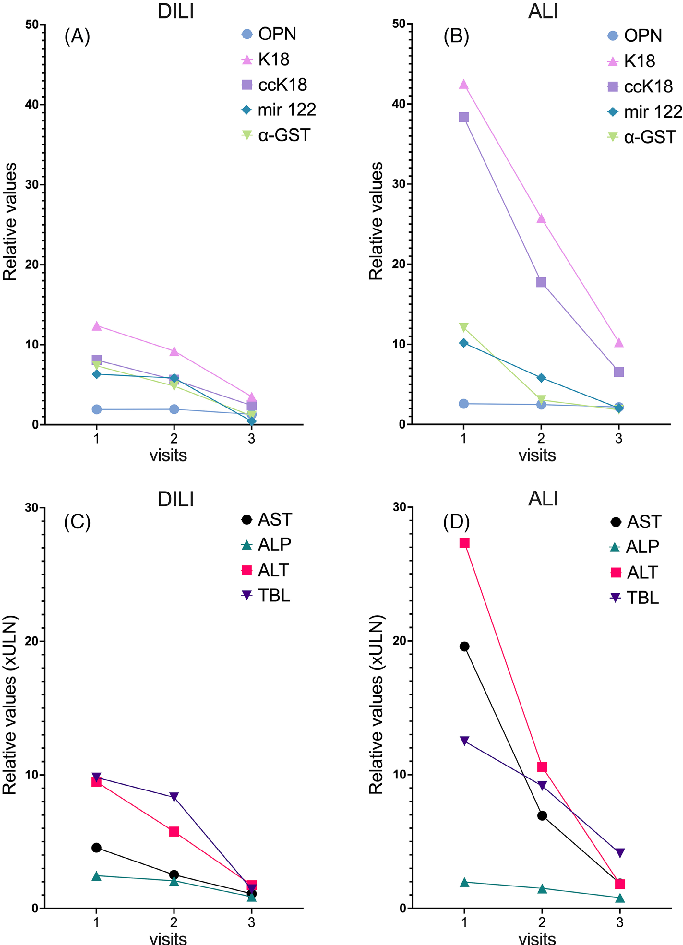
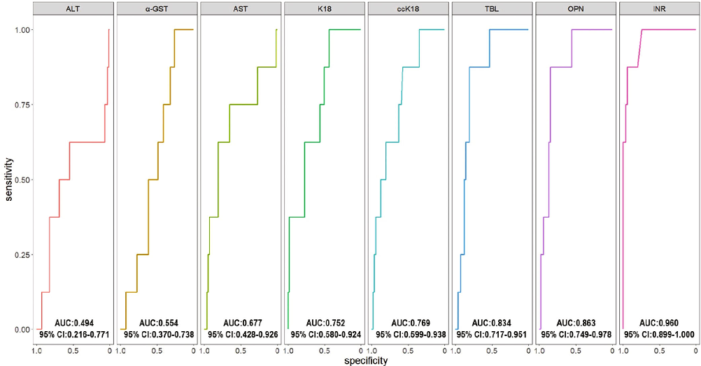
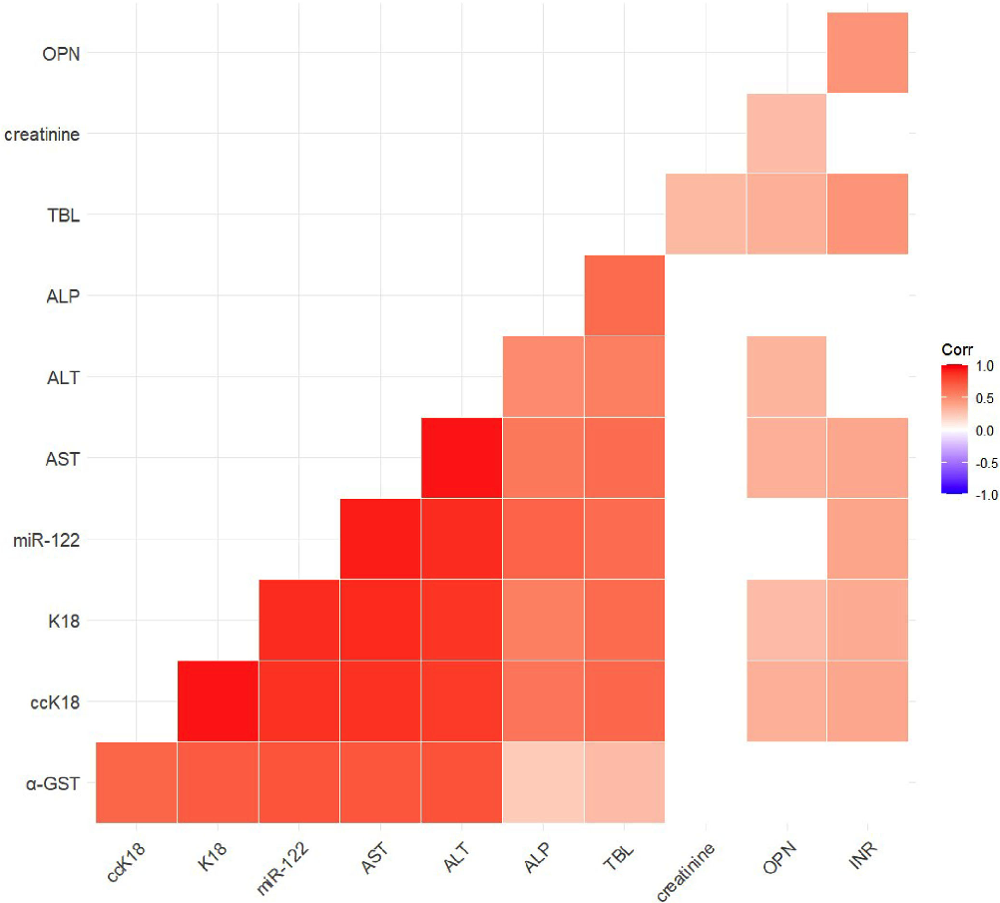

Received: 13 February 2023 Revised: 13 March 2023 Accepted: 15 March 2023 DOI: 10.1111/bcp.15724

O R I G I N A L A R T I C L E

# Evaluation of diagnostic and prognostic candidate biomarkers in drug-induced liver injury vs. other forms of acute liver damage

Alejandro Cueto-Sánchez1 | Hao Niu1,2 | Ismael Alvarez-´ Alvarez´ 1,2 | Bárbara L opez-Longarela3 | Enrique Del Campo-Herrera1 | Aida Ortega-Alonso1,2 | Miren García-Cortés1,2 | José Pinazo-Bandera1 | Judith Sanabria-Cabrera1 | Juan José Díaz-Moch on3,4 | M. Isabel Lucena1,2 | Raúl J. Andrade1,2 | Camilla Stephens1,2 | Mercedes Robles-Díaz1,2

1UGC de Aparato Digestivo, Servicio de Farmacología Clínica, Instituto de Investigaci on Biomédica de Málaga-IBIMA Plataforma BIONAND, Hospital Universitario Virgen de la Victoria, Universidad de Málaga, Málaga, Spain 2Centro de Investigaci on Biomédica en red, Enfermedades Hepáticas y digestivas (Ciberehd), Madrid, Spain 3Destina Genomica S.L., Granada, Spain 4Pfizer-Universidad de Granada-Junta de Andalucia Centre for Genomics and Oncological Research (GENYO), Granada, Spain

Aims: Detection and characterization of idiosyncratic drug-induced liver injury (DILI) currently rely on standard liver tests, which are suboptimal in terms of specificity, sensitivity and prognosis. Therefore, DILI diagnosis can be delayed, with important consequences for the patient. In this study, we aimed to evaluate the potential of osteopontin, cytokeratin-18 (caspase-cleaved: ccK18 and total: K18), α-glutathioneS-transferase and microRNA-122 as new DILI biomarkers.

Methods: Serial blood samples were collected from 32 DILI and 34 non-DILI acute liver injury (ALI) cases and a single sample from 43 population controls without liver injury (HLC) and analysed using enzyme-linked immunosorbent assay (ELISA) or single-molecule arrays.

Correspondence Raúl J. Andrade, Departamento de Medicina, Facultad de Medicina, Boulevard Louis Pasteur 32, Universidad de Málaga, 29071, Málaga, Spain. Email: andrade@uma.es

Results: All biomarkers differentiated DILI and ALI from HLC with an area under receiver operator characteristic curve (AUC) value of >0.75 but were less efficient in distinguishing DILI from ALI, with ccK18 (0.79) and K18 (0.76) demonstrating highest potential. However, the AUC improved considerably (0.98) for ccK18 when comparing DILI and a subgroup of autoimmune hepatitis cases. Cytokeratin-18, microRNA122 and α-glutathione-S-transferase correlated well with traditional transaminases, while osteopontin correlated most strongly with the international normalized ratio (INR).

M. Isabel Lucena, Departamento de Farmacología y Pediatría Facultad de Medicina, Boulevard Louis Pasteur 32, Universidad de Málaga, 29071, Málaga, Spain. Email: lucena@uma.es

Funding information Consejería de Salud y Familia de la Junta de Andalucía, Grant/Award Numbers: PI0274-2016, P18-RT-3364; Instituto de Salud Carlos III (ISCIII) cofounded by Fondo Europeo de Desarrollo Regional - FEDER, Grant/Award Numbers: PI19/00883, PI18/00901, UMA18-FEDERJA-193; Universidad de Málaga/CBUA

Conclusions: ccK18 appears promising in distinguishing DILI from autoimmune hepatitis but less so from other forms of acute liver injury. Osteopontin demonstrates prognostic potential with higher levels detected in more severe cases regardless of aetiology.

Camilla Stephens and Mercedes Robles-Díaz should be considered joint senior author. This paper has no Principal Investigator as no interventions with human subjects/patients were performed and no substances were administered.

This is an open access article under the terms of the Creative Commons Attribution-NonCommercial-NoDerivs License, which permits use and distribution in any medium, provided the original work is properly cited, the use is non-commercial and no modifications or adaptations are made. © 2023 The Authors. British Journal of Clinical Pharmacology published by John Wiley & Sons Ltd on behalf of British Pharmacological Society.

Br J Clin Pharmacol. 2023;89:2497–2507. wileyonlinelibrary.com/journal/bcp 2497

K E Y W O R D S

cytokeratin 18, DILI, hepatotoxicity, liver biomarkers, microRNA-122, osteopontin, α-glutathione-S-transferase

## 1 | INTRODUCTION

The pathogenesis of hepatic adverse drug reactions is so far largely unknown. Idiosyncratic drug-induced liver injury (DILI) is a complex, multistep process in which the interplay between the toxic potential of drugs, environmental and host factors determines susceptibility and occurrence.1 Currently, the diagnosis of this condition is a challenge due to the lack of specific biomarkers. The diagnosis is made by excluding other liver diseases and identifying a compatible temporal relationship between a drug and liver damage. A fraction of DILI cases are thought to go undiagnosed resulting in drug continuation and consequently worsening of liver damage or increased risk of re-exposure to the drug with new DILI episodes.2,3 Thus, the search for biomarkers is a central issue in the study of this condition. Thanks to an international collaborative effort, the Safer and Faster Evidence-based Translation Consortium evaluated different biomarkers resulting in the identification of some potentially useful candidates in DILI assessment. The results of this study showed that osteopontin (OPN), cytokeratin-18 (total [K18] and caspase-cleaved [ccK18]), α-glutathione-S-transferase (α-GST) and microRNA-122 (miR-122), among others are promising candidate biomarkers.4

OPN is a sialoprotein that was first identified in the osteoblast matrix. Studies have since identified the presence of OPN in other cell types, including liver-related cells such as Kupffer cells, infiltrated macrophages, stellate cells and hepatocytes. In addition to its structural role in the extracellular matrix, OPN also acts as a proinflammatory cytokine and seems to play an important role in a number of hepatic disorders such as steatosis, autoimmune hepatitis (AIH), viral hepatis (VH) and hepatocellular carcinoma.5 Although the exact role of OPN in hepatic diseases is not fully elucidated, increased levels have been detected in peripheral blood from DILI patients, in particularthose with a poor outcome.4

Another DILI candidate biomarker is cytokeratin-18, an epithelial cytoskeleton protein, both in its complete and caspase-cleaved form. The latter is associated with cellular apoptosis, while the former is released from the cell during necrosis.6 Cytokeratin-18, particularly ccK18, has been considered a possible biomarker for detection of fibrosis in children with non-alcoholic fatty liver disease and nonalcoholic steatohepatitis (NASH) in adult populations.7–9 It has also been reported that patients with alcohol-related liver injury have higher serum levels of cytokeratin-18 than healthy controls.10 Regarding DILI, there is evidence that cytokeratin-18 serum levels rise both in patients with intrinsic DILI (paracetamol overdose)11 and in patients with idiosyncratic DILI.4 Furthermore, the magnitude of serum K18 and ccK18 has been reported to correlate with clinical severity in hepatic conditions such as acute decompensation and acute-onchronic liver failure.12

||What is already known about this subject  • No specific biomarkers are available for drug-induced liver injury (DILI), which is currently detected using conventional liver biomarkers. • Several candidate biomarkers have been reported and compared between patients with DILI and healthy controls. However, the specificity of these potential biomarkers with regard to DILI has not been analysed comparatively.   What this study adds  • We compared the performance of five potential biomarkers between patients with DILI and other forms of acute liver injury to evaluate their specificity. • All candidate biomarkers demonstrated limited specificity for DILI, with caspase-cleaved cytokeratin-18 presenting the highest potential in distinguishing DILI from autoimmune hepatitis. |
|---|
|
|---|

Alpha-GST is a phase II metabolic enzyme responsible for forming conjugates with reduced glutathione. This enzyme is distributed predominantly in the liver and kidneys, and comprises 5%–10% of soluble hepatic proteins. Plasma elevations of α-GST have been detectedin patients presenting both acute and chronic liver damage, showing a positive correlation with alanine aminotransferase (ALT) and aspartate aminotransferase (AST).13 Alpha-GST has a shorter half-life than AST and ALT and consequently could be a more responsive biomarker allowing for faster detection of liver injury improvement or worsening.14

Another potential biomarker that has been proposed for early detection of DILI is miR-122. MicroRNAs are small RNA molecules that participate in numerous cellular processes such as proliferation, differentiation and cell death, among other processes, and alterations in serum miRNAs levels have been associated with both chronic and acute liver diseases.15 Among the miRNAs, miR-122 stands out as being liver-specific, representing approximately 70% of the total miRNA content of the liver.16 MicroRNAs can be actively released from the cell at an early stage of cell damage prior to injury detection by conventional biochemistry. This has been observed for miR-122 in paracetamol-induced liver damage, where a large increase in miR-122 was observed before detection of liver damage symptoms or even

13652125, 2023, 8, Downloaded from https://bpspubs.onlinelibrary.wiley.com/doi/10.1111/bcp.15724 by Universidad De Granada, Wiley Online Library on [03/03/2024]. See the Terms and Conditions (https://onlinelibrary.wiley.com/terms-and-conditions) on Wiley Online Library for rules of use; OA articles are governed by the applicable Creative Commons License

aminotransferase elevations.11 Thus, miR-122 is a potentially more sensitive DILI biomarker than traditional ALT and AST.

New specific diagnostic and prognostic biomarkers in DILI will not only affect patient care in the clinical setting but could also benefit the pharmaceutical industry in the development of new safer drugs. Hence, our main objective was to evaluate the utility of OPN, K18, ccK18, α-GST and miR-122 as diagnostic and prognostic DILI biomarkers by comparing the levels of these potential candidates in DILI patients with those of patients with non-DILI acute liver damage and healthy volunteers without liver conditions. In this study, and for the first time, we aimed to assess biomarker specificity by including an additional group of non-DILI acute liver injury (ALI).

- 2 | METHODS

- 2.1 | Subjects and study protocol

The DILI cases were selected from those submitted to the Spanish DILI Registry,a collaborative networkestablished in 1994 to prospectively identify cases of DILI in a standardized manner. The criteria for DILI at the time of subject inclusions in the study were as follows: ALT ≥5 upper limit of normal (ULN) or ALT ≥3 ULN + total bilirubin (TBL) >2 ULN or alkaline phosphatase (ALP) ≥2 ULN. Serological and biochemical tests were performed to rule out liver damage from VH (hepatitis A virus, hepatitis B virus, hepatitis C virus, hepatitis E virus, cytomegalovirus and Epstein–Barr virus) and imaging tests to rule out bile duct disorders, vascular diseases and tumours. Alternative causes of liver injury, such as AIH and metabolic diseases, were also ruled out. All submitted cases were evaluated for causality, initially through clinical assessment by the physician in charge and through adjudication undertaken by a panel of three experts and later by applying the Roussel Uclaf Causality Assessment Method. The pattern of liver damage was defined as hepatocellular, cholestatic or mixed based on the R value, quotient value of ALT and ALP, both expressed as a multiple of ULN according to Aithal et al.17 The ALI group used in this study met the same biochemical inclusion criteria as the DILI cases, but after a complete evaluation, they were diagnosed with an acute liver disease different from DILI. The selection of DILI and ALI cases for this study was based only on available samples collected between 2015 and 2021 and completely unbiased with regard to demographics and clinical features.

Healthy liver controls (HLC) presented a normal liver profile at the time of sample collection and had not suffered from any DILI episode previously. This group consisted of Malaga University employees, who underwent their annual medical examination. The study protocol, which conforms to the ethical guidelines of the Declaration of Helsinki, was approved by the local Ethical Committee at the Virgen de la Victoria University Hospital in Malaga, Spain. All patients and controls signed inform consent before inclusion in the study.

- 2.2 | Sample collection and preparation

Serial samples from DILI and ALI patients were collected on Day 1 (recognition), Day 7 and ≥30 days after DILI recognition, when possible. At the third sample collection time point, 52% of the DILI and 43% of the ALI patients presented normal liver profile values. Among those with liver profile elevations at this time point, the vast majority had decreased liver profile values compared with earlier time points, apart from those with a fatal or liver transplant outcome. In the case of HLC, only one blood sample was collected at a single visit. After extraction, the samples were aliquoted into plasma and serum and stored at 80 C until the analyses were performed.

- 2.3 | Biomarker analyses

OPN, K18, ccK18 and α-GST were analysed using commercial ELISA kits. OPN was analysed in plasma samples from 29 DILI, 34 ALI and 31 HLC subjects using the Enzo ADI-900-142 Osteopontin (human) kit (Enzo Life Sciences, Farmingdale, NY). Cytokeratin-18 was analysed in serum samples from 32 DILI, 33 ALI and 43 HLC subjects using PEVIVA M65 EpiDeath ELISA kit (VLVbio, Nacka, Sweden), which measures total soluble K18 released from dead cells (necrotic and apoptotic), whereas the PEVIVA M30 Apoptosense ELISA kit (VLVbio, Nacka, Sweden) was used to detect ccK18 (apoptosis only). Alpha-GST was measured in plasma samples from 30 DILI, 31 ALI and 33 HLC subjects using TE 1056 Human alpha-GST ELISA (TECO medical group, Sissach, Switzerland). Levels of miR-122 were analysed in collaboration with DestiNA Genomics, which has developed a single probe method for detecting microRNA from human serum using single molecule arrays, as previously described.18,19 Additional information on the assays can be found in supporting information Table S1. This analysis was performed in a subset of the total cohort, consisting of samples collected between 2015 and 2018 from 13 DILI, 20 ALI and 25 HLC subjects. Clinical and demographic characteristics of the subjects included in this subset are available in supporting information Table S2. Candidate biomarker values obtained using ELISA (OPN, ccK18, K18 and α-GST) were converted to relative values (fold change) by dividing each individual sample concentration by the mean concentration of the corresponding HLC samples. Conventional biomarker values (amino transferases, ALP, TBL, international normalized ratio [INR] and creatinine) were obtained from blood analysis performed as part of clinical management on the same days as the sample extractions.

- 2.4 | Statistics

The performance potential of the biomarkers was determined using receiver operator characteristic (ROC) analyses. The diagnostic potential of the candidate biomarkers was analysed by comparing the area under the ROC curve (AUC) between the three groups, whereas the

13652125, 2023, 8, Downloaded from https://bpspubs.onlinelibrary.wiley.com/doi/10.1111/bcp.15724 by Universidad De Granada, Wiley Online Library on [03/03/2024]. See the Terms and Conditions (https://onlinelibrary.wiley.com/terms-and-conditions) on Wiley Online Library for rules of use; OA articles are governed by the applicable Creative Commons License

prognostic potential was analysed by comparing AUCs between patients (DILI and ALI) who died or required a liver transplant and patients who recovered spontaneously. Associations between the candidate biomarkers and conventional biochemical parameters were determined using a Spearman correlation analysis. All statistical tests were two-sided hypotheses performed at the 0.05 level of significance and were performed using GraphPad Prism (9.3.1) and RStudio (4.0.5).

- 3 | RESULTS

in combination with conventional medications. In the ALI group, the mean age was 49 years and 50% were women. The aetiologies of ALI were mainly VH (59%) and AIH (26%). The latter group were newly diagnosed AIH; however, 44% of the cases presented various stages of fibrosis. More details on causative agents and aetiology of the DILI and ALI groups, respectively, can be found in supporting information Tables S3 and S4. The HLC group had a mean age of 50 years, and 56% were women. Clinical and demographic characteristics of the total study population are shown in Table 1.

- 3.1 | Study cohort description

3.2 | Biomarker performance

In this study, we analysed blood samples from 32 DILI patients, 34 ALI patients and 43 HLC subjects. The mean age of the DILI patients was 50 years and 34% were women. Most DILI episodeswere caused by conventional medications, mainly antibiotics. Only seven patients developed DILI due to the use of herbal and dietary supplements (HDS) including androgenic anabolic steroids, alone or

The candidate biomarker results at visit 1 were compared using ROC curve analyses (Table 2). All the biomarkers were able to distinguish DILI from HLC with an AUC of >0.75. miR-122 presented the highest AUC (1.0) due to very limited detection in the HLC group followed by ccK18 (0.97), K18 (0.96), OPN (0.77) and α-GST (0.75). Similarly, all the biomarkers were able to distinguish between ALI and HLC with an

TABLE 1 Comparison of demographics and clinical characteristics between patients with drug-induced liver injury (DILI), non-DILI acute liver injury (ALI) and control patients with healthy livers (HLC).

DILI n = 32 ALI n = 34 HLC n = 43 Age (years), mean ± SD 50 ± 16 49 ± 21 50 ± 10 Female, % 34 50 56 BMI (kg/m2), mean ± SD 26 ± 3.2 25 ± 4.5 25 ± 4.1 Diabetes mellitus, % 13 18 4.7 Hypertension, % 25 26 2.3 Liver episode characteristics, %

Jaundice 59 85 NA Hospitalization 66 84 NA

Type of liver injury, %

Hep 52 79 NA Chol 19 8.8 NA Mix 29 12 NA

Laboratory parameters at visit 1 (mean ± SD) TBL, mg/dL 9.8 ± 13 12 ± 8.9 0.6 ± 0.3 AST, IU/L 182 ± 165 784 ± 756 23 ± 4.6 ALT, IU/L 379 ± 324 1093 ± 1119 22 ± 7.1 ALP, IU/L 287 ± 286 232 ± 139 54 ± 16 INR 1.1 ± 0.2 1.3 ± 0.4 ND MELD 14 ± 6.1 19 ± 7.3 ND

Severity, %

Mild 38 2.9 NA Moderate 59 47 NA Severe 0 29 NA Death/liver transplant 3.1 21 NA

Abbreviations: ALP, alkaline phosphatase; ALT, alanine aminotransferase; AST, aspartate aminotransferase; BMI, body mass index; Chol, cholestatic liver injury; Hep, hepatocellular liver injury; INR, international normalized ratio; MELD, model for end-stage liver disease; Mix, mixed liver injury; NA, not applicable; ND, no data; SD, standard deviation.

13652125, 2023, 8, Downloaded from https://bpspubs.onlinelibrary.wiley.com/doi/10.1111/bcp.15724 by Universidad De Granada, Wiley Online Library on [03/03/2024]. See the Terms and Conditions (https://onlinelibrary.wiley.com/terms-and-conditions) on Wiley Online Library for rules of use; OA articles are governed by the applicable Creative Commons License

TABLE 2 Biomarker performance analysed by receiver operator characteristic (ROC) curves in visit 1 samples from patients with druginduced liver injury (DILI) and non-DILI acute liver injury (ALI) in addition to healthy controls without any liver condition (HLC).

Biomarker Groups (n) AUC 95% CI Youden's index Sensitivitya Specificitya ALT DILI (32) vs. HLC (40) 1.000b 1.000–1.000b 52.5b 1b 1b

ALI (34) vs. HLC (40) 1.000b 1.000–1.000b 54b 1b 1b DILI (32) vs. ALI (34) 0.760 0.643–0.877 280.5 0.824 0.625

OPN DILI (29) vs. HLC (31) 0.771 0.645–0.897 1.2 0.774 0.793 ALI (33) vs. HLC (31) 0.758 0.641–0.874 1.3 0.806 0.606 DILI (29) vs. ALI (33) 0.507 0.360–0.654 1.2 0.394 0.759

ccK18 DILI (32) vs. HLC (43) 0.970 0.939–1.000 1.2 0.814 1.000 ALI (33) vs. HLC (43) 0.992 0.980–1.000 2.4 0.977 0.939 DILI (32) vs. ALI (33) 0.794 0.684–0.904 12.6 0.667 0.844

K18 DILI (32) vs. HLC (43) 0.958 0.914–1.000 4.7 1 0.813 ALI (33) vs. HLC (43) 0.979 0.953–1.000 4.2 0.976 0.909 DILI (32) vs. ALI (33) 0.768 0.649–0.887 32.7 0.545 0.969

α-GST DILI (30) vs. HLC (33) 0.752 0.623–0.881 1.7 0.939 0.633 ALI (31) vs. HLC (33) 0.893 0.812–0.974 1.2 0.818 0.871 DILI (30) vs. ALI (31) 0.645 0.506–0.783 2.9 0.710 0.567

miR-122 DILI (13) vs. HLC (25) 1.000c 1.000–1.000c 0.5c 1.000c 1.000c ALI (20) vs. HLC (25) 0.998c 0.991–1.000c 0.3c 1.000c 0.950c DILI (13) vs. ALI (20) 0.531 0.332–0.729 9.3 0.400 0.923

Abbreviations: α-GST, α-glutathione-S-transferase; ALT, alanine aminotransferase; AUC, area under the ROC curve; ccK18, caspase-cleaved cytokeratin18; CI, confidence interval; K18, total cytokeratin-18; miR-122, microRNA-122, OPN, osteopontin. aAt optimal cut-off point. bALT was used to define liver injury (DILI and ALI). cResult from limited detection in HLC.

AUC of >0.75. However, the ability to distinguish between DILI and ALI was less promising for all the candidate biomarkers. The largest AUCs were detected for cck18 (0.79) and K18 (0.77), followed by ALT (0.76). Subdividing the ALI cases into VH (n = 20) and AIH (n = 9) substantially improved the ability of ccK18 (0.98) and K18 (0.97) to distinguish DILI from AIH, while DILI vs. VH resulted in AUCs of 0.71 and 0.69, respectively. No noteworthy differences were detected for the other candidate biomarkers (Table 3).

- 3.3 | Biomarker progression profiles during the liver episode

Progression of the biomarkers over time, that is, in visits 1, 2 and 3, is depicted in Figure 1. The levels of all candidate biomarkers decreased notably after the first visit in parallel with decreasing traditional biomarkers (ALT, AST, ALP and TBL) reflecting liver profile normalization, approaching HLC biomarker levels. Cytokeratin-18 (K18 and ccK18) presented the highest increases compared with HLC in both DILI and ALI, which in fact were higher than those of both ALT and AST in the corresponding groups. In contrast, OPN presented a moderate increase compared with HLC but likewise in both DILI and ALI. All the

TABLE 3 Biomarker performance analysed by receiver operator characteristic (ROC) curves in visit 1 samples from patients with druginduced liver injury (DILI), autoimmune hepatitis (AIH) and viral hepatitis (VH).

Biomarker Groups (n) AUC 95% CI ALT DILI (32) vs. AIH (9) 0.875 0.766–0.984

DILI (32) vs. VH (20) 0.764 0.630–0.898 OPN DILI (29) vs. AIH (9) 0.540 0.327–0.753

DILI (29) vs. VH (20) 0.591 0.419–0.764 ccK18 DILI (32) vs. AIH (8) 0.977 0.933–1.000

DILI (32) vs. VH (20) 0.705 0.556–0.855 K18 DILI (32) vs. AIH (8) 0.969 0.906–1.000

DILI (32) vs. VH (20) 0.686 0.525–0.847 α-GST DILI (30) vs. AIH (8) 0.633 0.460–0.807

DILI (30) vs. VH (18) 0.640 0.481–0.800 miR-122 DILI (13) vs. AIH (3) 0.641 0.123–1.000

DILI (13) vs. VH (18) 0.526 0.318–0.733

Abbreviations: α-GST, α-glutathione-S-transferase; ALT, alanine aminotransferase; AUC, area under the ROC curve; ccK18, caspasecleaved cytokeratin-18; CI, confidence interval; K18, total cytokeratin-18; miR-122, microRNA-122, OPN, osteopontin.

13652125, 2023, 8, Downloaded from https://bpspubs.onlinelibrary.wiley.com/doi/10.1111/bcp.15724 by Universidad De Granada, Wiley Online Library on [03/03/2024]. See the Terms and Conditions (https://onlinelibrary.wiley.com/terms-and-conditions) on Wiley Online Library for rules of use; OA articles are governed by the applicable Creative Commons License

FIGURE 1 Biomarker progression over time. (A) Relative values of candidate biomarkers osteopontin (OPN), total cytokeratin-18 (K18), caspase-cleaved cytokeratin-18 (ccK18), α-glutathione-Stransferase (α-GST) and microRNA-122 (miR-122) at visits 1 (day of detection), 2 (7 days after detection) and 3 (>30 days after detection) in 32 drug-induced liver injury (DILI) patients. (B) Relative values of (OPN, K18, ccK18, α-GST and miR-122 at visits 1, 2 and 3 in 34 non-DILI acute liver injury (ALI) patients. (C) Relative values of traditional liver biomarkers aspartate aminotransferase (AST), alanine aminotransferase (ALT), alkaline phosphatase (ALP) and total bilirubin (TBL) at visits 1, 2 and 3 in 32 DILI patients. (D) Relative values of traditional liver biomarkers AST, ALT, ALP and TBL at visits 1, 2 and 3 in 34 ALI patients.

candidate biomarker elevations at the three visits were higher in the ALI group than in the DILI group. However, this was also true for the levels of traditional biomarkers.

- 3.4 | Prognostic potential

To determine the prognostic potential of the biomarkers, we compared AUCs at visit 1 between DILI and ALI patients who died or required a liver transplant (n = 8, one DILI and seven ALI patients) and those who recovered spontaneously (n = 58, 31 DILI and 27 ALI patients). miR-122 was not included in this study as this biomarker was analysed in a smaller subpopulation, which only included patients who recovered spontaneously. In addition to K18, ccK18, OPN and α-GST, we also analysed the performance of traditional liver injury

biomarkers such as AST, ALT, TBL and INR (Figure 2). The highest AUC value was seen for INR (0.96), whereas ALT (0.49) and α-GST (0.55) presented the lowest prognostic potentials. Among the candidate biomarkers, OPN yielded the highest AUC (0.86). Comparing the AUCs of OPN and INR, no statistically significant difference was found, suggesting that OPN is a promising prognostic biomarker for liver injury severity.

3.5 | Correlations between candidate biomarkers and traditional biochemistry parameters

Correlation analyses between the candidate biomarkers and traditional biochemical biomarkers (AST, ALT, ALP, TBL, creatinine and INR) were determined using Spearman's rank correlation coefficient

13652125, 2023, 8, Downloaded from https://bpspubs.onlinelibrary.wiley.com/doi/10.1111/bcp.15724 by Universidad De Granada, Wiley Online Library on [03/03/2024]. See the Terms and Conditions (https://onlinelibrary.wiley.com/terms-and-conditions) on Wiley Online Library for rules of use; OA articles are governed by the applicable Creative Commons License

- FIGURE 2 Receiver operator characteristic (ROC) analyses to determine the prognostic potential of candidate biomarkers osteopontin (OPN), total cytokeratin-18 (K18), caspase-cleaved cytokeratin-18 (ccK18) and α-glutathione-S-transferase (α-GST); traditional liver biomarkers aspartate aminotransferase (AST), alanine aminotransferase (ALT), alkaline phosphatase (ALP) and total bilirubin (TBL) and international normalized ratio (INR). Biomarker values at liver injury detection were compared between eight drug-induced liver injury (DILI) and non-DILI acute liver injury (ALI patients) who died or required a liver transplant and 58 DILI and ALI patients who recovered spontaneously. Areas under ROC curve (AUC) with 95% confidence interval (CI) were calculated to determine the prognostic potential of each biomarker.

(Figure 3). The biomarkers miR-122, K18 and ccK18 all demonstrated strong correlation with AST (ρ = 0.86–0.92, p < .0001) and ALT (ρ = 0.83–0.88, p < .0001). Similarly, α-GST was significantly correlated with AST and ALT, although the strength of the correlations was weaker (ρ = 0.72–0.74, p < .0001) than noted for miR-122, K18 and ccK18. None of the candidate biomarkers correlated strongly with ALP. The highest correlation was seen for miR-122 (ρ = 0.67, p < .0001). Significant correlations among miR-122, K18, ccK18 and α-GST were also detected. Very strong correlations between K18 and ccK18 (ρ = 0.94, p < .0001) as well as miR-122 and K18 (ρ = 0.88, p < .0001) and ccK18 (ρ = 0.86, p < .0001) were detected. The correlations between α-GST and miR-122, K18 and ccK18 were slightly weaker but still significant (ρ = 0.66–0.73, p < .0001). OPN differed from the other candidate biomarkers in that no very strong correlations were detected with any of the other candidate or traditional biomarkers. The strongest correlation was seen with INR (ρ = 0.46, p < .001).

## 4 | DISCUSSION

This study evaluates the performance of a panel of candidate biomarkers previously identified,4 to determine their diagnostic and prognostic potential in DILI. Traditional liver profile biomarkers are able to identify liver conditions including DILI but are unable to distinguish

DILI specifically. It is therefore of high importance to include ALI when testing new candidate biomarkers, to determine DILI detection rather than liver injury detection. This issue has been addressed in our study as we compared biomarker performance in DILI with that of other liver aetiologies and controls without liver profile alterations and that enabled us to determine aetiology-based biomarker profiles. This is an important aspect that has been overlooked in biomarker studies to date.

Our results confirm the findings of Church et al. in that all the tested candidate biomarkers were able to distinguish DILI from HLC (AUC > 0.75). However, while we found the highest AUC for miR122, followed by ccK18 and K18, Church et al. reported ccK18 to have the highest AUC followed by K18 and miR-122.4 These differences may stem from cohort differences between the two studies, such as differences in DILI causative agents and subsequent variations in the proportion of hepatocellular, cholestatic and mixed type of live injury. In addition, miR-122 was analysed in a smaller subpopulation in the current study using a different technique than what was used by Church et al.,4 although the single molecule array method used in the current study has been demonstrated to correlate well with conventional qRT-PCR in terms of miR-122 detection in serum samples.18

In terms of distinguishing DILI from other liver injuries, all the individual candidate biomarkers demonstrated less capacity. ccK18 and K18 had the highest potentials with regard to AUC, which were similar to that of ALT. The similarity to ALT in the ROC analyses may

13652125, 2023, 8, Downloaded from https://bpspubs.onlinelibrary.wiley.com/doi/10.1111/bcp.15724 by Universidad De Granada, Wiley Online Library on [03/03/2024]. See the Terms and Conditions (https://onlinelibrary.wiley.com/terms-and-conditions) on Wiley Online Library for rules of use; OA articles are governed by the applicable Creative Commons License

- FIGURE 3 Spearman correlation heatmap of candidate biomarkers osteopontin (OPN), total cytokeratin-18 (K18), caspase-cleaved cytokeratin-18 (ccK18), α-glutathione-S-transferase (α-GST) and microRNA-122 (miR-122) and traditional biomarkers, including aspartate aminotransferase (AST), alanine aminotransferase (ALT), alkaline phosphatase (ALP) and total bilirubin (TBL), creatinine and international normalized ratio (INR) at visit 1. Red indicates positive correlation, blue negative correlation. Non-significant correlations are left blank.

be explained by the strong correlation of ccK18 and K18 with ALT. Full-length and caspase-cleaved cytokeratin-18 are released into the bloodstream during necrosis and apoptosis, respectively, and can accumulate over time, similar to what happens to ALT during cell membrane rupture.6 That ccK18, K18 and ALT were able to distinguish between DILI and ALI with an AUC value of around 0.75 should be interpreted with caution as it may stem from the fact that the ALI patients had in general higher ALT values at onset. Nevertheless, this is not an unusual feature when comparing early ALT values during acute liver conditions like VH and AIH with those of DILI patients.

The diagnostic potential of ccK18, which presented the highest AUC value when comparing DILI and ALI, is illustrated in the following

example. Donaghy et al. reported that 15% of 881 patients with hepatocellular jaundice attending the Jaundice Hotline clinic after referral from primary care physicians were DILI cases.20 Considering a DILI prevalence of 15% in the secondary care clinical setting together with specificity and sensitivity at the optimal cut-off point for ccK18 based on our analysis, the positive and negative predictive values for DILI would be 0.430 and 0.935, respectively. Hence, in patients with jaundice and a positive ccK18 test, the pre-test probability of a DILI diagnosis of 15% increases to a post-test probability of 43%.

Interestingly though, we found that K18 and ccK18 distinguished AIH from DILI better than VH from DILI. This could be related to the fact that the difference in median ALT value was larger between AIH

13652125, 2023, 8, Downloaded from https://bpspubs.onlinelibrary.wiley.com/doi/10.1111/bcp.15724 by Universidad De Granada, Wiley Online Library on [03/03/2024]. See the Terms and Conditions (https://onlinelibrary.wiley.com/terms-and-conditions) on Wiley Online Library for rules of use; OA articles are governed by the applicable Creative Commons License

and DILI than between VH and DILI. Another explanation could be a higher proportion of fibrosis in the AIH patients than in the VH patients. Although all AIH patients were considered to have first presenting AIH, some may have had undiagnosed AIH for an indeterminate time period leading to fibrosis. The proportion of fibrosis may therefore have been higher among the AIH patients compared with the acute VH patients. Serum cytokeratin-18 (both K18 and ccK18) has been described in the progression of liver fibrosis in NASHpatients.21 In the current cohort, 44% of the AIH patients had biopsyproven fibrosis of varying degrees.

The findings of Church et al. suggested that K18 and ccK18 could have prognostic potential as at an early stage they were able to detect patients who died or required a liver transplant.4 Our results were less encouraging with lower AUC values. However, our cohort included notably fewer patients with a worst outcome, which could have led to the ‘true’ prognostic potential of K18 and ccK18 not being accurately reflected in our analysis.

It should be pointed out that K18 and ccK18 are not liver-specific proteins and serum levels therefore rise with other organ conditions as well as with a variety of adenocarcinomas.22 Despite this, K18 and ccK18 could be potentially useful for early DILI detection, particularly during drug development, based on the fact that serum elevations of cytokeratin-18, in particular uncleaved protein, appear earlier than ALT in acetaminophen-induced liver injury and consequently is more sensitive.23 These candidate biomarkers can also provide mechanistic insights due to their reflection of necrotic and apoptotic cell death. Thus, these candidate biomarkers as well as OPN and microRNAs have been accepted into the Food and Drug Administration's Biomarker Qualification Program as part of the Translational Safety Biomarker Pipeline Consortium's DILI work package.24

Alpha-GST and miR-122 presented lower potential to distinguish between DILI and ALI patients. This is perhaps not too surprising considering that both have been reported to increase in different liver conditions.14,16 Interestingly though, both have also been reported to be more sensitive than ALT and AST and therefore detectable in serum samples prior to transaminase elevations as well as providing more precise indications of liver injury progression due to having shorter half-lives.14,25 The design of the current study did not enable us to determine whether α-GST and miR-122 appear prior to transaminase elevations in DILI and ALI patients. Nevertheless, this could be a valuable characteristic during clinical trials where patients are closely monitored while being under new drug treatments.

OPN differed from the other candidate biomarkers in this study in that it had the lowest potential to differentiate between DILI and ALI patients. Furthermore, it was seen to be weakly correlated with ALT and AST, while being more strongly correlated with INR. This is in line with previous proposals of OPN having a prognostic potential in DILI and additional liver conditions,4,26 which our ROC analysis between patients that recovered spontaneously and patients with fatal/liver transplant outcome also supports.

Although it has been demonstrated that OPN is detectable during many liver diseases, its function is not fully understood. It is believed that when liver damage occurs, Kupffer cells and T lymphocytes

release OPN and other cytokines that attract neutrophils and macrophages. This generates an inflammatory environment that can cause tissue necrosis and plays an important role in the development of liver fibrosis.27 Other studies suggest that OPN could play an important regenerative role during immune responses. This is supported by a study on serum OPN levels in acute liver failure patients of different aetiologies, which found that those who survived in fact had higher OPN levels than those who died or required a liver transplant.28 In contrast, a study of 43 fulminant hepatic failure patients (FHF, of which 28 died) and 45 patients with acute self-limited hepatitis found serum OPN to be significantly higher in non-survivors and that patients with elevated serum OPN had a poorer prognosis. The authors suggested that high levels of OPN in acute FHF reflected more active regeneration of hepatic stem cells compared with subacute liver injury and that OPN can be associated with both inflammatory cell activation and liver regeneration.29 The fact that limited differences were detected in OPN between DILI and ALI in the current study may suggest similarities in the underlying immune mechanisms between the groups. In an earlier study, we demonstrated that the adaptive immune response is an important component in DILI development similar to many other liver conditions, and similarities between DILI and VHhave since been highlighted in the literature.30,31 More studies are warranted to determine the exact role of OPN in liver injury.

A limitation to our study is the relatively small number of cases included in the analyses. In order to reach the highest possible statistical power, we opted for using all cases in the original analyses, at the expense of not having an independent validation cohort, given the exploratory nature of this comparison (DILI vs. ALI). This resulted in good statistical power (>90%) for ccK18, K18 as well as ALT when comparing DILI and ALI in the biomarker performance analysis, but limited statistical power for the results of the remaining biomarkers (<80%). In addition, the analysis of ALI subgroups compared with DILI only yielded high statistical power (>90%) for ccK18, K18 as well as ALT when focusing on AIH. All the candidate biomarkers compared between VH and DILI yielded less statistical power (<80%). Similarly, the prognostic potential of the candidate biomarkers is based on few cases with a death/liver transplant outcome, and our results should therefore be considered as preliminary. Nevertheless, the statistical power was noteworthy (>90%) for TBL, OPN, ccK18, K18 and INR, while being <80% for AST, ALT and α-GST. Hence, our findings require further confirmation, which we hope will be performed in future studies.

Another limitation is the heterogeneity in the ALI cohort, which included various aetiologies. In addition, the ALI group was associated with higher severity (lower proportion of mild and moderate cases and higher proportion of severe and fatal/liver transplant cases) than detected in the DILI group. Nevertheless, such differences have also been found in a recent analysis of the ProEuroDILI registry. This registry currently includes more than 200 DILI cases and 100 ALI cases, with a similar trend of higher severity among the ALI cases.32

In summary, this study evaluated the performance of various previously identified candidate biomarkers as new tools in DILI diagnosis

13652125, 2023, 8, Downloaded from https://bpspubs.onlinelibrary.wiley.com/doi/10.1111/bcp.15724 by Universidad De Granada, Wiley Online Library on [03/03/2024]. See the Terms and Conditions (https://onlinelibrary.wiley.com/terms-and-conditions) on Wiley Online Library for rules of use; OA articles are governed by the applicable Creative Commons License

and prognosis. The inclusion of anALI group enabled us to better characterize the specificity of the candidate biomarkers. All five candidate biomarkers, K18, ccK18, OPN, α-GST and miR-122, clearly distinguished patients with liver injury from those without any liver injury. However, they were less successful in differentiating DILI from ALI. ccK18 demonstrated the highest ability to distinguish between DILI and ALI. In addition, both ccK18 and K18 demonstrated high ability to distinguish DILI from AIH, encouraging results that require confirmation. This study also corroborates previous findings of OPN having the highest prognostic potential of the biomarkers. Nevertheless, all the candidate biomarkers in the current study require further validation in large independent studies in order to determine their true potential. New biomarkers that enable more efficient DILI detection and prognosis will not only facilitate clinical management of DILI but could also improve the way in which hepatic safety is monitored during drug development.

AUTHOR CONTRIBUTIONS

Study concept and design: M. Isabel Lucena, Raúl J. Andrade, Camilla Stephens and Mercedes Robles-Díaz. Case recruitments: Mercedes Robles-Díaz, Miren García-Cortés, Aida Ortega-Alonso, Enrique Del Campo-Herrera, José Pinazo-Bandera and Judith Sanabria-Cabrera Case diagnosis: Mercedes Robles-Díaz, Miren García-Cortés, Aida Ortega-Alonso, M. Isabel Lucena and Raúl J. Andrade. Biomarker analyses: Alejandro Cueto-Sánchez and Bárbara L opez-Longarela. Statistical analyses: Alejandro Cueto-Sánchez, Hao Niu and Ismael Alvarez-´ Alvarez.´ Interpretation of data: Camilla Stephens, Mercedes Robles-Díaz, Alejandro Cueto-Sánchez, Juan José Díaz-Moch on, M. Isabel Lucena and Raúl J. Andrade. Drafting of the manuscript: Camilla Stephens, Mercedes Robles-Díaz and Alejandro Cueto-Sánchez. Critical revision of the manuscript: M. Isabel Lucena and Raúl J. Andrade.

ACKNOWLEDGEMENTS

We are grateful to Palex Medical S.A. for providing some of the ELISA kits used in this study and to Salvatore Pernagallo (DestiNA Genomics) for his help with the miR-122 analysis. The graphical abstract was created with BioRender.com. CIBERehd is funded by ISCIII. A.C.-S. holds a I-PFIS (IFI18/00047), I.A.-A. a Sara Borell (CD20/00083), J.P.-B. a Rio Hortega (CM21/00074) and J.S.-C. a Joan Rodes (JR21/00066) research contract from ISCIII. H.N. holds a postdoctoral research contract (POSTDOC_21_00780) funded by Junta de Andalucía. The funding sources had no involvement in the study design; in the collection, analysis and interpretation of data; in the writing of the report or in the decision to submit the manuscript for publication. Funding for open access charge: Universidad de Málaga/CBUA.

CONFLICT OF INTEREST STATEMENT The authors declare no conflicts of interest.

DATA AVAILABILITY STATEMENT The data that support the findings of this study are available from the corresponding author upon reasonable request.

ORCID M. Isabel Lucena https://orcid.org/0000-0001-9586-4896

REFERENCES

- 1. Chen M, Suzuki A, Borlak J, Andrade RJ, Lucena MI. Drug-induced liver injury: interactions between drug properties and host factors. J Hepatol. 2015;63(2):503-514. doi:10.1016/j.jhep.2015.04.016
- 2. Andrade RJ, Chalasani N, Björnsson ES, et al. Drug-induced liver injury. Nat Rev Dis Primers. 2019;5(1):58. doi:10.1038/s41572-0190105-0
- 3. Hunt CM, Papay JI, Stanulovic V, Regev A. Drug rechallenge following drug-induced liver injury. Hepatology. 2017;66(2):646-654. doi:10. 1002/hep.29152
- 4. Church RJ, Kullak-Ublick GA, Aubrecht J, et al. Candidate biomarkers for the diagnosis and prognosis of drug-induced liver injury: an international collaborative effort. Hepatology. 2019;69(2):760-773. doi:10. 1002/hep.29802
- 5. Wen Y, Jeong S, Xia Q, Kong X. Role of osteopontin in liver disease. Int J Biol Sci. 2016;12(9):1121-1128. doi:10.7150/ijbs.16445
- 6. Cummings J, Hodgkinson C, Odedra R, et al. Preclinical evaluation of M30 and M65 ELISAs as biomarkers of drug induced tumor cell death and antitumor activity. Mol Cancer Ther. 2008;7(3):455-463. doi:10. 1158/1535-7163.MCT-07-2136
- 7. Mandelia C, Collyer E, Mansoor S, et al. Plasma cytokeratin-18 level as a novel biomarker for liver fibrosis in children with nonalcoholic fatty liver disease. J Pediatr Gastroenterol Nutr. 2016;63(2):181-187. doi:10.1097/MPG.0000000000001136
- 8. He L, Deng L, Zhang Q, et al. Diagnostic value of CK-18, FGF-21, and related biomarker panel in nonalcoholic fatty liver disease: a systematic review and meta-analysis. Biomed Res Int. 2017;2017:9729107. doi:10.1155/2017/9729107
- 9. Tada T, Saibara T, Ono M, et al. Predictive value of cytokeratin-18 fragment levels for diagnosing steatohepatitis in patients with nonalcoholic fatty liver disease. Eur J Gastroneterol Hepatol. 2021;33(11): 1451-1458. doi:10.1097/MEG.0000000000002176
- 10. Gonzalez-Quintela A, García J, Campos J, et al. Serum cytokeratins in alcoholic liver disease: contrasting levels of cytokeratin-18 and cytokeratin-19. Alcohol. 2006;38(1):45-49. doi:10.1016/j.alcohol. 2006.01.003
- 11. Antoine DJ, Dear JW, Starkey Lewis P, et al. Mechanistic biomarkers provide early and sensitive detection of acetaminophen-induced acute liver injury at first presentation to hospital. Hepatology. 2013; 58(2):777-787. doi:10.1002/hep.26294
- 12. Macdonald S, Andreola F, Bachtiger P, et al. Cell death markers in patients with cirrhosis and acute decompensation. Hepatology. 2018; 67(3):989-1002. doi:10.1002/hep.29581
- 13. Czuczejko J, Mila-Kierzenkowska C, Szewczyk-Golec K. Plasma α-glutathione-S-transferase evaluation in patients with acute and chronic liver injury. Can J Gastroenterol Hepatol. 2019;2019:5850787. doi:10. 1155/2019/5850787
- 14. Maina I, Rule JA, Wians FH, Poirier M, Grant L, Lee WM. α-Glutathione S-transferase: a new biomarker for liver injury? J Appl Lab Med. 2016;1(2):119-128. doi:10.1373/jalm.2016.020412
- 15. Mohr AM, Mott JL. Overview of microRNA biology. Semin Liver Dis. 2015;35(01):3-11. doi:10.1055/s-0034-1397344
- 16. Wang X, He Y, Mackowiak B, Gao B. MicroRNAs as regulators, biomarkers and therapeutic targets in liver disease. Gut. 2021;70(4): 784-795. doi:10.1136/gutjnl-2020-322526
- 17. Aithal GP, Watkins PB, Andrade RJ, et al. Case definition and phenotype standardization in drug-induced liver injury. Clin Pharmacol Ther. 2011;89(6):806-815. doi:10.1038/clpt.2011.58
- 18. Rissin DM, L opez-Longarela B, Pernagallo S, et al. Polymerasefree measurement of microRNA-122 with single base specificity using single molecule arrays: detection of drug-induced liver

13652125, 2023, 8, Downloaded from https://bpspubs.onlinelibrary.wiley.com/doi/10.1111/bcp.15724 by Universidad De Granada, Wiley Online Library on [03/03/2024]. See the Terms and Conditions (https://onlinelibrary.wiley.com/terms-and-conditions) on Wiley Online Library for rules of use; OA articles are governed by the applicable Creative Commons License

injury. PLoS ONE. 2017;12(7):e0179669. doi:10.1371/journal.pone. 0179669

- 19. L opez-Longarela B, Morrison EE, Tranter JD, et al. Direct detection of miR-122 in hepatotoxicity using dynamic chemical labeling overcomes stability and isomiR challenges. Anal Chem. 2020;92(4):3388-

3395. doi:10.1021/acs.analchem.9b05449

- 20. Donaghy L, Barry FJ, Hunter JG, et al. Clinical and laboratory features and natural history of seronegative hepatitis in a nontransplant centre. Eur J Gastroenterol Hepatol. 2013;25(10):1159-1164. doi:10. 1097/MEG.0b013e3283610484
- 21. Lee J, Vali Y, Boursier J, et al. Accuracy of cytokeratin 18 (M30 and M65) in detecting non-alcoholic steatohepatitis and fibrosis: a systematic review and meta-analysis. PLoS ONE. 2020;15(9):e0238717. doi:10.1371/journal.pone.0238717
- 22. Korver S, Bowen J, Pearson K, et al. The application of cytokeratin-18 as a biomarker for drug-induced liver injury. Arch Toxicol. 2021; 95(11):3435-3448. doi:10.1007/s00204-021-03121-0
- 23. Dear JW, Clark JI, Francis B, et al. Risk stratification after paracetamol overdose using mechanistic biomarkers: results from two prospective cohort studies. Lancet Gastroenterol Hepatol. 2018;3(2):104-113. doi: 10.1016/S2468-1253(17)30266-2
- 24. US Food AND Drug Administartion. DDT-BMQ-000113, Safety biomarker to identify drug-induced liver injury biomarker panel. https:// fda.force.com/ddt/s/ddt-project?ddtprojectid=138. Accessed July 11, 2022.
- 25. Starkey Lewis PJ, Dear J, Platt V, et al. Circulating microRNAs as potential markers of human drug-induced liver injury. Hepatology. 2011;54(5):1767-1776. doi:10.1002/hep.24538
- 26. Zhang Y, Gao J, Bao Y, et al. Diagnostic accuracy and prognostic significance of osteopontin in liver cirrhosis and hepatocellular carcinoma: a meta-analysis. Biomarkers. 2022;27(1):13-21. doi:10.1080/ 1354750X.2021.2008009
- 27. Nagoshi S. Osteopontin: versatile modulator of liver diseases. Hepatol Res. 2014;44(1):22-30. doi:10.1111/hepr.12166

- 28. Srungaram P, Rule JA, Yuan HJ, et al. Plasma osteopontin in acute liver failure. Cytokine. 2015;73(2):270-276. doi:10.1016/j.cyto.2015. 02.021
- 29. Arai M, Yokosuka O, Kanda T, et al. Serum osteopontin levels in patients with acute liver dysfunction. Scand J Gastroenterol. 2006; 41(1):102-110. doi:10.1080/00365520510024061
- 30. Cueto-Sanchez A, Niu H, Del Campo-Herrera E, et al. Lymphocyte profile and immune checkpoint expression in drug-induced liver injury: an immunophenotyping study. Clin Pharmacol Ther. 2021; 110(6):1604-1612. doi:10.1002/cpt.2423
- 31. Watkins PB. Liver injury due to drugs and viruses: mechanistic similarities and implications for AAV gene therapy. Clin Pharmacol Ther. 2021;112(4):751-753. doi:10.1002/cpt.2500
- 32. Björnsson ES, Stephens C, Atallah E, et al. A new framework for advancing in drug-induced liver injury research. The prospective European DILI registry. Liver Int. 2023;43(1):115-126. doi:10.1111/ liv.15378

SUPPORTING INFORMATION Additional supporting information can be found online in the Supporting Information section at the end of this article.

|How to cite this article: Cueto-Sánchez A, Niu H, Alvarez-´ Alvarez I, et al. Evaluation of diagnostic and´ prognostic candidate biomarkers in drug-induced liver injury vs. other forms of acute liver damage. Br J Clin Pharmacol. 2023;89(8):2497‐2507. doi:10.1111/bcp.15724|
|---|

13652125, 2023, 8, Downloaded from https://bpspubs.onlinelibrary.wiley.com/doi/10.1111/bcp.15724 by Universidad De Granada, Wiley Online Library on [03/03/2024]. See the Terms and Conditions (https://onlinelibrary.wiley.com/terms-and-conditions) on Wiley Online Library for rules of use; OA articles are governed by the applicable Creative Commons License

