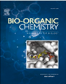
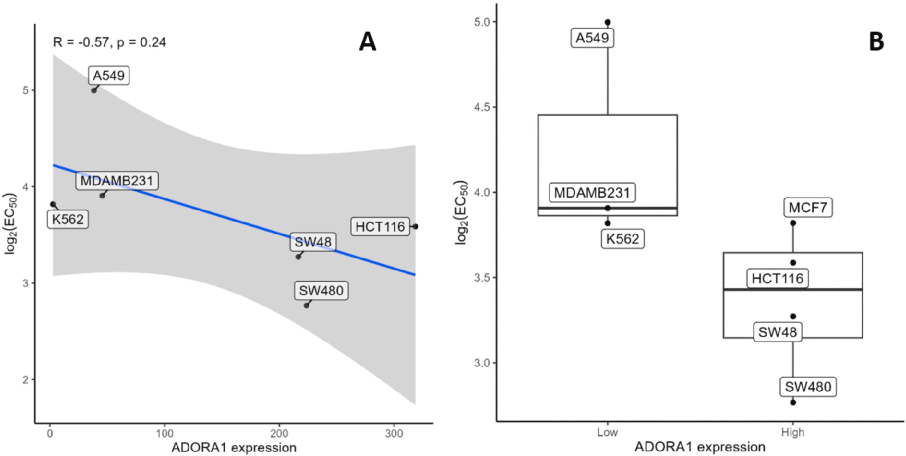
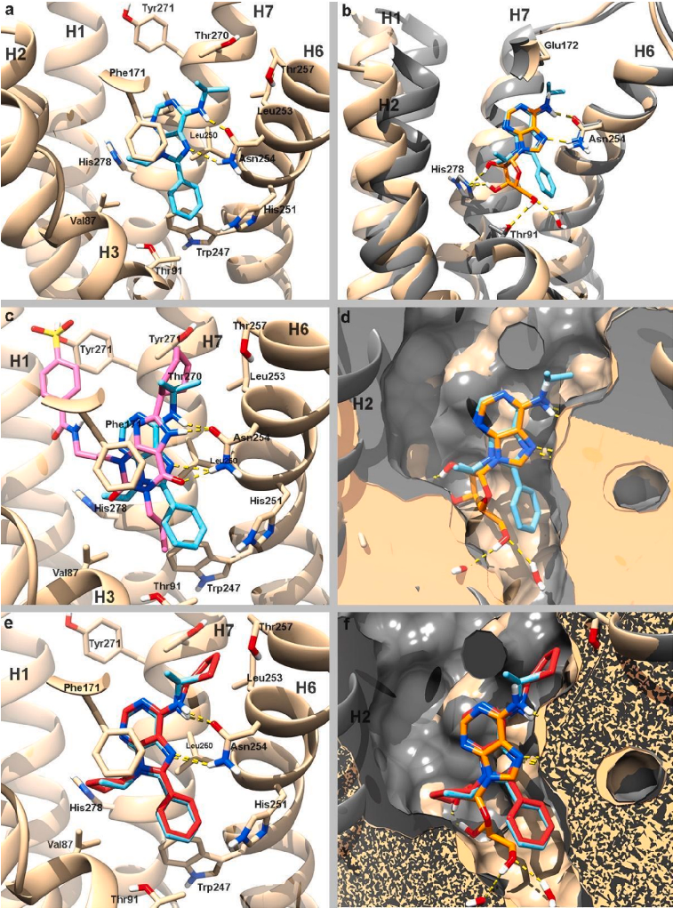
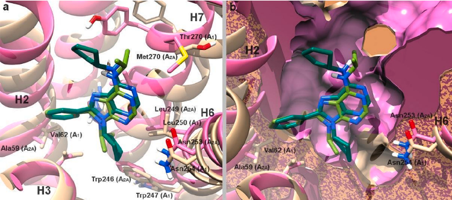

Bioorganic Chemistry 159 (2025) 108395 

Contents lists available at ScienceDirect

## Bioorganic Chemistry

journal homepage: www.elsevier.com/locate/bioorg

# Exploring Trisubstituted adenine derivatives as adenosine A1 receptor  ligands with antagonist activity: Synthesis, biological evaluation and  molecular modelling

Laura B. Cordoba-G´ omez´ a a Departamento Química Farmac´eutica y Organica, Facultad de Farmacia, Universidad de Granada, Spain´ , Alvaro Lorente-Macías´ b b Edinburgh Cancer Research, Institute of Genetics and Cancer, The University of Edinburgh, Crewe Road South, Edinburgh EH4 2XR, UK ,c c Cancer Research UK Scotland Centre, UK , María Isabel Lozad d Departamento de Farmacología, Farmacia y Tecnología Farmac´eutica, Facultad de Farmacia, CIMUS Research Center, Santiago de Compostela, Spain , Jos´e Bread,   Anton Leandro Martínez´ d, Jonathon Mokb,c, Ben Kingb,c, Francisco Franco-Montalbana,   Antonio Gonzalez García´ a, Juan Jos´e Guardia-Monteagudoi i DESTINA Genomica SL, Avenida de la Innovacion 1, 18016 Granada, Spain.´ , Maria J. Matose e Departamento de Química Organica, Facultad de Farmacia, Universidade de Santiago de Compostela, 15782 Santiago de Compostela, Spain´ ,* * Correspondence to: Departamento de Química Org´anica, Facultad de Farmacia, Universidade de Santiago de Compostela, 15782 Santiago de Compostela, Spain. ,   Asier Unciti-Brocetab,c, Juan Jos´e Díaz-Mochon´ a,f f GENYO Centre for Genomics and Oncological Research, Pfizer/University of Granada/Andalusian Regional Government. PTS Granada - Avenida de la Ilustraci´on, 114,  18016, Granada, Spain ,g g Unit of Excellence in Chemistry Applied to Biomedicine and the Environment of the University of Granada, Granada, Spain ,h h Instituto de Investigaci´on Biosanitaria ibs.GRANADA, Granada, Spain ,** ** Correspondence to: Campus Cartuja s/n, 18071 Granada, Facultad de Farmacia, Universidad de Granada, Spain. E-mail addresses: mariajoao.correiapinto@usc.es (M.J. Matos), juandiaz@go.ugr.es (J.J. Díaz-Mochon), ´ mjpineda@ugr.es (M.J.P. Las Infantas).  , Maria Jose Pineda de Las Infantasa,**

## A R T I C L E  I N F O

## A B S T R A C T

### Keywords:

The therapeutic potential of adenosine receptor (AR) ligands is becoming increasingly important as our understanding of the physio-pathological functions of ARs advances. This study presents the synthesis and biological screening of six novel trisubstituted adenine analogues, expanding a previously reported series. The AR  binding affinity and antiproliferative activity were evaluated for both the new and previously reported compounds, leading to the discovery of derivatives that displaying selective binding affinity towards hA1AR. Compounds were synthesized using a cyclization approach by combining 4,6-bisalkylamino-5-aminopyrimidines with  three different trialkyl/arylorthoesters, thereby generating adenines featuring three different substituents at the  8 position: H, methyl or phenyl. Most promising derivatives presented a phenyl ring at such position and displayed selective antagonistic activity against  hA1AR.  N6,9-diisopropyl-8-phenyl-9H-purin-6-amine (14c) was  identified as the most potent compound with a Ki of 2 nM, motivating the synthesis of new derivatives including  N6,9-dicyclopentyl-8-phenyl-9H-purin-6-amine (19c). Docking modelling predicted key interactions between the  lead compounds and hA1AR. Determination of their anti-proliferative activity on six cancer cell lines found 19c  to be the most potent derivative with low micromolar EC50  values. Our findings support further exploration  around the adenine scaffold for cancer research and AR drug development.

Adenine scaffold

Docking simulation

cancer cell lines

Antiproliferation

Orthosteric binding site

Selectivity index

Pharmacokinetic properties

## 1. Introduction

Adenosine receptors (ARs) are a family of purinergic G protein-  coupled receptors (GPCRs) widely distributed in human tissues. Adenosine, the endogenous agonist, activates four different AR subtypes: A1,  A2A, A2B, and A3, each with diverse physiological functions. Purines are  privileged structures because they are one of the most widely occurring  heterocycles in nature [1]. They have a low cost, commercial availability, and a range of well-established synthetic protocols existing in  the literature. Additionally, purines have potential pharmacological  properties that make them attractive for use in drug discovery.

Furthermore, their structure allows for the generation of new purine  analogues through a range of different reactions, making them an efficient chemical  “navigator”  towards novel compounds with desired  biological activities [2]. To date, numerous purine-based drugs have  been approved by regulatory agencies, including fludarabine, cladribine  and regrelor [3]. While purines are privileged structures and ARs are  highly targeted biological entities [4], the development of clinically  successful AR-modulating drugs has proven difficult. Despite the therapeutic use of adenosine and the approval of the A2A receptor agonist  regadenoson (for myocardial perfusion imaging) and the A2A receptor  antagonist istradefylline (for Parkinson’s disease), many promising AR-  targeting drug candidates have failed in clinical trials due to issues such  as limited efficacy, poor selectivity, or undesirable side effects. This  highlights  the  ongoing  need  for  novel,  selective  AR  ligands  with  improved therapeutic properties.

https://doi.org/10.1016/j.bioorg.2025.108395

Received 28 January 2025; Received in revised form 27 February 2025; Accepted 17 March 2025  

Available online 21 March 2025 

0045-2068/© 2025 Elsevier Inc. All rights are reserved, including those for text and data mining, AI training, and similar technologies. 

Fig. 1. General structure of the trisubstituted adenine derivatives presented in  this study. The adenine scaffold is numbered according to standard purine  nomenclature. R1 represents varied alkyl or arylalkyl substituents at the N6 and  9 positions, while R2 represents hydrogen, methyl, or phenyl at the 8 position.

## 2. Results

### 2.1. Synthesis of N6,8,9-trisubstituted adenines

Small molecules that interact with AR have been shown to be anti-  inflammatory, cytotoxic, and modulators of neurological, cardiac and  kidney diseases. In the early 1990s, an adenine derivative, N6-endonorbonan-2-yl-9-methyladenine  (N-0861)  [5],  was  introduced  with  great promise as an antagonist of ARs, but clinical trials did not yield the  expected results. Since them other small molecules, in particular, xanthines have been used as hA1AR antagonists [6] in clinical trials. For  instance, Biogen Inc. brought to clinical trials a xanthine derivative,  tonapofylline  (BG9928,  ClinicalTrials.gov Identifier:  NCT00745316,  NCT00709865 &  NCT00858156) for treating heart failure and renal  insufficiency. Unfortunately, Biogen stopped the trials in phase 2b.  While there have been great efforts to develop new hA1AR antagonist  drugs, there are just few of them with high affinity for human A1AR  (hA1AR) and high selectivity index over other hAR types [7–9].

The commercially available compound 4,6-dichloro-5-nitropyrimidine  was  employed  as  the  starting  material  to  obtain  the  propargyloxy-substituted pyrimidine 1 in good yield through a reaction  with propargyloxy alcohol [17]. Subsequently, pyrimidine 1 was reacted with primary amines at room temperature, giving rise, initially, to  the symmetric disubstituted 4,6-bis(alkyl/arylalkyl)amino-5-nitropyrimidines 2–7 via pre-reactive molecular complexes [17]. The reduction  of these pyrimidines was performed using tin(II) chloride, resulting in  the  formation  of  4,6-bis(alkyl/arylalkyl)amino-5-aminopyrimidines  11–15. These compounds were cyclized with three distinct trialkyl  orthoesters  (trimethyl  orthoformate,  trimethyl  orthoacetate,  or  trimethyl orthobenzoate) and methanesulfonic acid (Scheme 1) to obtain  purines with H (family a), methyl (family b) and phenyl (family c) at 8-  position (Scheme 1) to obtain their derivatives  11a-15c, that were  previously presented by our group as antiparasitic compounds [18]. For  the purposes of the present study, we expanded the library of compounds to include derivatives with a tert-butyl group, an ethyl group, an  isobutyl group and a cyclopentyl group in positions 6 and 9. The synthesis of these novel compounds, specifically 16a-c, 17c, 18c, and 19c,  was achieved via cyclization with trimethyl orthobenzoate to obtain  purines with phenyl (family c) at 8-position (Scheme 1).

Not only xanthine but also polysubstituted adenines have been  shown to target AR. Some of them, as it was the case of SLV320, went  into clinical trials [10] for treatment of congestive heart failure. Moreover, other groups, in particular the groups of Prof. Cristalli and Prof.  Volpini have kept developing these chemotypes based on adenine as  antagonists of AR [9,11]. In addition, the regulation of purinergic signalling contributes to several important pathologies such as cancer [3].

Our group has focused on developing new synthetic methods to  produce a wide range of polysubstituted purines. We introduced a one-  pot synthesis of trisubstituted 6-alkoxypurines to obtain libraries with  structural [12–14]. The use of these preciously developed libraries  allowed us to identify key structural features of 6-alkoxy-purine analogues that induce programmed cell death in several types of cancer cell  lines, in particular T cell cancer lines [15] and two novel purine-based  chemotypes that could be further optimized to generate antiparasitic  drugs  against  both  Plasmodium  falciparum  and  Trypanosoma  cruzi  [12,16]. Further to that, a novel synthetic route [17] for the synthesis of  polysubstituted adenines was developed. Following this synthetic route,  a library of small molecules was prepared and compounds with IC50  values as low as 2.42  ± 0.16 mM, which target specific enzymes  involved in purine metabolism within the parasite, were identified [18].

All compounds were purified by column chromatography and characterized by nuclear magnetic resonance (1H NMR and 13C NMR), high-  resolution mass spectrometry (HRMS) and HPLC. As illustrated in Fig. 2,  the synthesized compounds share a purine ring, presenting two substituents at positions N6/9, containing either aromatic or non-aromatic  chains, and a substituent at 8-position.

### 2.2. Evaluation of the binding affinities of the purine library to hA1, hA2A,  hA2B and hA3 ARs

A series of seventeen adenine derivatives was evaluated in vitro for  affinity and selectivity against the four hAR, using radioligand binding  assays (Table 1). Biological results are expressed as Ki (nM, n = 3) or as  percentage inhibition of specific binding at 10 μM (n = 2, average) for  those compounds that did not fully display specific radioligand binding.  Ki values were obtained by non-linear regression fitting of the data using  Prism 7.0 software (GraphPad, San Diego, CA). Four known hAR ligands  (XAC, CGS-15943, ZM241385, and MRS1220) were used as reference  compounds, and the results are shown in Table 1.

As these compounds were found to target enzymes of the trypanosome purine salvage pathway, whose ligands include adenine and  adenosine [18], we were interested in exploring whether this library  might also exhibit affinity for human ARs subtypes, which also utilize  adenosine as a natural ligand. Throughout the course of this project, our  design strategy was further inspired by modifications of the adenine  scaffold reported for the known hA1AR antagonist N-08615 and the work  of Lambertucci [9]. Herein, we present our latest findings on the use of  modified adenines (Fig. 1) as ligands of the hAR family, that showed  potent binding for the hA1AR as well as antagonist activity in a cAMP  assay. The interaction with the  hA1AR was also simulated through  docking computational analysis. We also investigated the cytotoxic effects of these modified adenine ligands on cancer cells, as there is evidence that the ARs play a role in cancer [11,19,20].

Out of the seventeen compounds, four compounds stood out due to  their affinity for one or two ARs. All these four compounds (11c, 12c,  14c and 15c, Fig. 2) shared a common structural feature, a phenyl group  at position 8 of the adenine scaffold. 6/9-Bisarylalkyl derivatives, such  as  N,9-diphenethyl-8-phenyl-9H-purin-6-amine  (12c)  and  N,9-bis(4-  chlorobenzyl)-8-phenyl-9H-purin-6-amine (15c), proved to be selective  against hA1AR, with low percentages of inhibition of the three other ARs  at 10  μM, the highest concentration tested. The dibenzyl derivative  without substituents on the aromatic rings at positions N6 and 9, N6,9-  dibenzyl-8-phenyl-9H-purin-6-amine (11c) showed a dual profile as  hA1/hA2BAR ligand, with a selectivity index of 2.4. This is the only  molecule within the series that can be considered a dual hA1/hA2BAR  ligand (Ki = 458.8 nM and 1091 nM, respectively).

Scheme 1. Synthetic methodology. Reagents and conditions: a) Propargyl alcohol, DBU, THF, rt., 1 h; b) R [1]-NH2, TEA, DCM, rt., 30 min.; c) SnCl2. 2H2O, EtOH,  reflux, 1 h, d) (CH3)3CR [2], CH3SO3H, 110 ◦C, 24 h. cP = cyclopentyl. The synthesis of compounds 11–15 (a-c) and their intermediates is described elsewhere [18].

Fig. 2. The first series of adenine 11–16(a-c) derivatives tested to measure their binding affinity to human ARs. R2 = H (family a), methyl (family b), and phenyl  (family c) [18].

Table 1  Binding affinity results for the four hAR (A1, A2A, A2B and A3) of the adenine derivatives (see Fig. 1) and reference standards (XAC, CGS-15943, ZM241385, and  MRS1220) presented in the manuscript.

|Compounds|Receptors| | | | | | | |
|---|---|---|---|---|---|---|---|---|
| |hA1| |hA2A| |hA2B| |hA3| |
| |% Inhib.|Ki (nM)|% Inhib.|Ki (nM)|% Inhib.|Ki (nM)|% Inhib.|Ki (nM)|
|11a|43 ± 1|8 ± 3|32 ± 4|45 ± 4| | | | |
|11b|41 ± 1|4 ± 2|44 ± 3|35 ± 1| | | | |
|11c|458.8 ± 13|33 ± 4|1091.0 ± 35|28 ± 1| | | | |
|12a|49 ± 2|7 ± 1|12 ± 1|30 ± 3| | | | |
|12b|38 ± 1|5 ± 2|18 ± 3|21 ± 3| | | | |
|12c|620.4 ± 25|8 ± 3|44 ± 1|48 ± 5| | | | |
|13a|27 ± 2|16 ± 2|2 ± 2|11 ± 3| | | | |
|13b|29 ± 2|17 ± 4|17 ± 2|24 ± 2| | | | |
|13c|880.2 ± 31|24 ± 1|3 ± 1|37 ± 4| | | | |
|14a|55 ± 5|11 ± 3|22 ± 3|21 ± 1| | | | |
|14b|36 ± 2|4 ± 2|26 ± 4|20 ± 1| | | | |
|14c|2.0 ± 0.3|33 ± 2|55 ± 5|211.2 ± 53| | | | |
|15a|20 ± 2|23 ± 3|1 ± 1|30 ± 5| | | | |
|15c|71.9 ± 36.6|27 ± 1|8 ± 3|5 ± 2| | | | |
|16a|36 ± 5|23 ± 3|2 ± 1|13 ± 4| | | | |
|16b|24 ± 1|11 ± 3|5 ± 3|14 ± 3| | | | |
|16c|20 ± 1|2 ± 2|4 ± 1|7 ± 3| | | | |
|17c|28 ± 4|2664 ± 42|1503 ± 22|1482 ± 34| | | | |
|18c|20 ± 2|30 ± 1|764 ± 60|334 ± 13| | | | |
|19c|46 ± 10|42 ± 2|57 ± 4|42 ± 1| | | | |
|XAC|13.9 ± 2.2a| | | | | | | |
|CGS-15943|1.4 ± 0.3b| | | | | | | |
|ZM 241385|28.3 ± 4.4c| | | | | | | |
|MRS 1220|3.6 ± 0.7d| | | | | | | |
|a Ki = 29.1 nM, reported by Klotz et al. [36]| | | | | | | | |
|b Ki = 4.3 nM, reported by Fredholm et al. [37]| | | | | | | | |
|c Ki = 32.0 nM, reported by Fredholm et al. [37]| | | | | | | | |
|d Ki = 1.7 nM, reported by Gao & Jacobson [38]. n = 3. Note: Compound 15b has been synthetized, but the yield has been very low. Therefore, and because its  substituents do not belong to the most active series, this molecule was no further evaluated.| | | | | | | | |

From the initial screening, it was clear that the most promising  compounds had a very specific and selective interaction with hA1AR.  Therefore, the four most active compounds (11c, 12c, 14c and 15c,  Fig. 2) were selected to further investigate whether they act as agonists  or antagonists of hA1AR, using a cAMP assay. The results of the hA1AR  adenosinergic profile are shown in Table 2.

These results clearly show that compound 14c, with isopropyl substituents, is the most promising candidate due to its low KB  value,  indicating higher potency as an antagonist against the hA1AR.

Out of the two N6,9-dialkyladenines, N,9-diisopropyl-8-phenyl-9H-  purin-6-amine (14c) proved to be the most active compound within the  series, with a hA1AR Ki  of 2.0 ± 0.3 nM (Table 1). This compound  showed an affinity for the hA3AR, with a Ki of 211.2 ± 53 nM, meaning a  selectivity index of 105.6. Therefore, 14c was considered as a hA1AR  selective ligand. Compound 16c, a similar compound than 14c but with  a tert-butyl substituent rather than isopropyl at N6 and 9 positions, was  found to be non-active.

### 2.4. Evaluation of new compounds based on 14c as lead compound

Adenine 14c was thus chosen as the lead compound from the library  presented above, and the influence of the alkyl substituents at N6 and 9  positions in this scaffold was further investigated, while keeping the  phenyl group at position 8, which is critical for maintaining activity.  Derivatives 17c and 18c were then synthesized, using the same synthetic pathway shown above (Scheme 1) to introduce ethyl and isobutyl  substituents at these positions as less bulky groups than  tert-butyl.  Moreover,  the  N,9-dicyclopentyl-8-phenyl-9H-purin-6-amine  (19c,  Fig.  3)  was  synthesized  based  on  N6-endonorbonan-2-yl-9-methyladenine (N-0861), which was developed in the early 1990s [5,21]; and  the most recent work by Lambertucci et al. [9], which reports that these  scaffolds,  containing  a  cycloalkylamine  substituent  at  N6-position  (Fig. 3), were found to be antagonists of hA1AR with IC50 values at the  nanomolar level.

### 2.3. Evaluation of the antagonist potency (KB) of the best ligands to  hA1AR

Table 2  Antagonist potency (KB) against hA1AR of the adenine derivatives 11c, 12c, 14c,  15c, 17c, 18c and 19c and the reference standard XAC.

After successfully synthesizing the three new compounds (Fig. 3),  they were screened for binding affinity to the four hARs (A1, A2A, A2B,  and A3). The three compounds have a Ki  for  hA1AR below 50 nM  (Table 1), which is the lowest within the whole library, along with their  lead compound  14c. Furthermore,  19c, which contains cyclopentyl  substituents, exhibits high specificity for hA1AR with very low affinity  for the three remaining hARs at 10 μM. In contrast, 17c and 18c exhibit  Ki  values in the low micromolar range against some of the other receptors, indicating that 19c has the highest binding specificity of the  compounds presented here towards hA1AR among all the ARs. Finally,  their antagonist potency (KB) against  hA1AR was measured showing  values below 100 nM for 17c, 18c and 19c (Table 2).

|hA1AR| | | | |
|---|---|---|---|---|
|Compound|R1|KB (nM)| | |
| |11c|Bn-|1272.2 ± 268.5| |
| | |12c|PhEt|550.7 ± 232.6|
|14c| | |iPr|24.9 ± 19.4|
| |15c| |pClBn|687.2 ± 32.7|
| | |17c|Et|50.7 ± 9.45|
|18c| | |iBu|83.6 ± 28.2|
| |19c| |cP|99.7 ± 10.4|
| | |XACa|37.9 ± 20.2| |
| | | | | |
| | | | | |

Fig. 3. Bisalkyl compounds synthesized based on  14c  as the lead structure and the well-known  hA1AR inhibitors  N-0861  and  N-cyclopentyl-9-methyl-8-  phenyl-adenine.

Table 4  EC50 (μM) values of compounds as antiproliferative agents across various cancer  cell lines. n = 3.

Having  established  that the bisalkyl-substituted  purines  with a  phenyl in position 8 of the purine ring have the highest affinity and  antagonist activity for hA1AR, we decided to phenotypically screen them  against several cell lines to determine their antiproliferative activity.

|Compound|SW480|SW48|HCT116|K562|MDA-  MB-231|A549|
|---|---|---|---|---|---|---|
|14c|40 ± 12.14|79 ± 35.65|78 ± 37.99|35 ± 0.93|37 ± 11.33|62 ± 33.56|
|17c|>100|>100|>100|>100|30 ± 0.61|77 ± 40.41|
|18c|13 ± 3.77|>100|>100|17 ± 8.82|53 ± 40.41|>100|
|19c|7 ± 0.71|10 ± 0.27|12 ± 2.63|13 ± 9.01|15 ± 5.06|39 ± 9.48|
|Abbreviations: AR: Adenosine Receptor; GPCR: G protein-coupled receptor;  hA1AR: human adenosine A1 receptor; hA2AAR: human adenosine A2A receptor;  hA2BAR: human adenosine A2B receptor; hA3AR: human adenosine A3 receptor;  N-0861: N6-endonorbonan-2-yl-9-methyladenine; TLC: Thin-Layer Chromatography; NMR: Nuclear Magnetic Resonance; CDCl3: Deuterated Chloroform; ES:  Electrospray Ionization; HPLC: High-Performance Liquid Chromatography; TEA:  Triethylamine; DPCPX: 1,3-dipropyl-8-cyclopentylxanthine; NECA: 5′-(N-ethylcarboxamido)adenosine;  R-PIA:  R-Phenylisopropyladenosine;  Tris-HCl:  Tris  (hydroxymethyl)aminomethane hydrochloride; EDTA: Ethylenediaminetetraacetic acid; cAMP: cyclic adenosine monophosphate; EIA: Enzyme Immunoassay;  FSK:  Forskolin;  XAC:  8-Cyclopentyl-1,3-dipropylxanthine;  DMSO:  Dimethyl Sulfoxide; AD4: AutoDock 4 PDB: Protein Data Bank; RMSD: Root-  Mean-Square Deviation; TSPA: Total Solvent-Accessible Surface Area cLogP:  Calculated octanol-water partition coefficient; ADME: Absorption, Distribution,  Metabolism, and Excretion; DMPK: Drug Metabolism and Pharmacokinetics;  BBB: Blood-Brain Barrier; Fu: Fraction Unbound in Human Plasma; IC50: Half  maximal inhibitory concentration; EC50: Half-maximal effective concentration;  mRNA: messenger ribonucleic acid.| | | | | | |

### 2.5. Phenotypic screening for antiproliferative effects across six different  cell lines

To study the antiproliferative effects of the four bisalkyl-substituted  purines (14c, 17c, 18c and 19c), we selected six different cell lines  shown in Table 3. Each of these cell lines provides a good model for  testing the efficacy of anticancer drugs against highly prevalent cancers  such as colon, breast, lung and leukemia.

Table 4 presents the antiproliferative EC50  values in micromolar  concentrations. 19c showed significant potency across all tested cell  lines, with the lowest EC50 value of 7 μM observed in SW480 cells. The  range of EC50 values, varying from 7 μM to 39 μM, across different cell  lines.

On the other hand, 18c showed high EC50 values in most cell lines,  except for SW-480 and K562, where they had lower EC50 values of 13 μM  and 17 μM, respectively. Finally, 17c presented very low or no antiproliferative activity in most cell lines, except in the case of MDA-MB-  231, which had a moderately low EC50 value of 30 μM.

### 2.6. Correlation analysis of mRNA expression and sensitivity to lead  compound 19c using RNAseq data from DepMap

To understand whether the antiproliferative effects of the lead  compound  19c  are  due  to  its  antagonistic  action  on  hA1ARs,  a  correlation analysis was carried out. The analysis looked at the relationship between ADORA1 mRNA expression levels, which encode the  adenosine hA1AR, across various cell lines (Table 3) and their sensitivity  to 19c. The expression data were sourced from RNAseq datasets provided by the DepMap project.

Table 3  Cell lines used for phenotypic screening of compounds 14c, 17c, 18c, and 19c.

|Cell line|Origin|Field of use|
|---|---|---|
|SW480,  SW48|Primary colorectal  adenocarcinomas|Colorectal cancer research|
|HCT116|Colorectal carcinoma|Colorectal cancer research|
|K562|Chronic myelogenous leukemia  (CML)|Hematological research,  leukemia,|
|MDA-MB-  231|Breast adenocarcinoma (triple-  negative)|TNBC research (highly  aggressive)|
|A549|Human lung carcinoma|Non-small cell lung cancer  (NSCLC) research|

The results obtained are shown in Fig. 4A, which shows scatter plots  with linear regression lines, representing the relationship between  ADORA1  expression  levels  and  the  log-transformed  EC50  of  19c.  Although there was a negative correlation observed in both cases (R = � 0.57, p = 0.24; R = � 0.47, p = 0.29), the associations did not reach  statistical significance.

On the other hand, Fig. 4B shows a boxplot where cell lines are  stratified by median expression levels of ADORA1, categorized into  ‘Low’ and ‘High’ expression groups based on median cutoff values (left  = 217, right = 131). t-tests indicate no statistically significant difference  in compound sensitivity between the two groups (left p-value = 0.2318,  right p-value = 0.1966).

Fig. 4. A) scatter plot showing the correlation between median-of-ratio normalized ADORA1 mRNA expression and the log-transformed half-maximal inhibitory  concentration (EC50) of 19c across various cancer cell lines. The Pearson correlation coefficient (R = � 0.57) indicates a negative correlation, but it is not statistically  significant (p = 0.24). The blue line represents the linear regression, and the gray shaded area represents the 95 % confidence interval. B) Boxplot separating cell lines  based on their median ADORA1 expression, with a left cutoff of 217 and a right cutoff of 131. The corresponding log-transformed half-maximal inhibitory concentration (EC50) of 19c is also shown. (For interpretation of the references to colour in this figure legend, the reader is referred to the web version of this article.)

The preferred binding pose of 14c  on hA1AR (PDB ID: 5UEN) is  shown in Fig. 5a. The adenine ring is set between Leu250 and Phe171  forming stacking interactions with both residues and matching the  binding orientation seen on the adenine moiety of the natural agonist  adenosine in the hA1AR active conformation (PDB ID: 7LD4) (Fig. 5b).23,  [24] Similarly, this orientation allows the formation of a double H-bond  interaction between the hydrogen of the 6-amine (hydrogen donor) and  the N7 (hydrogen acceptor) in the adenine ring with the side chain of  Asn254, as does adenosine in the hA1AR active conformation (see PDB  ID: 7LD4). Similarly, in the inactive conformation (PDB ID: 5UEN), the  antagonist DU172 establishes a hydrogen bond interaction with the side  chain of Asn254 (Fig. 5c), but in a different orientation when compared  with 14c binding pose. The 8-position and N6 substituents at 14c, are  both facing hydrophobic pockets that are closed on the active conformation of hA1AR (Fig. 5d). The phenyl ring on 8-position is displayed in  the same region as the N1-propyl substituent in DU172, in a pocket  deeper in the orthosteric site created by Val87, Thr91, Asn184, Thr277,  Trp247, and His251, and shows a significant π-stacking interaction with  Trp247. The side-chain movement of this residue, together with Val87,  Thr91, Asn184, and Thr277, is responsible for the partial closure of this  pocket on the hA1AR active conformation. As for the N6-isopropyl substituent, it is displayed in a hydrophobic cleft towards the extracellular  end of the receptor (Fig. 5a and c). This cleft, located between helix5  (H5), helix6 (H6), and helix7 (H7), is also occupied by the cyclohexane  moiety of cognate ligand DU172 and is established by residues Glu172,  Met180, Leu253, Thr257 and Thr270. This last residue is hA1AR specific  and has been suggested to act as a gatekeeper for ligand access to the  orthosteric site [25]. On the other hand, the isopropyl substituent at 9 on  14c occupies the same position as the ribose ring of the adenosine in the  hA1AR active conformation (PDB ID: 7LD4), stablishing van der Waals  interactions with Val87. In an identical manner, the most active compound, ligand 19c, adopts the same spatial arrangement as 14c on the  inactive conformation of receptor hA1AR (Fig. 5e). The difference between these two ligands is their substituents at N6 and 9-position with  two isopropyl chains on 14c and two cyclopentyl rings on 19c. The two,  more voluminous and hydrophobic residues, on 19c are inserted in the  pocket created by Val87, Thr91, Asn184, Thr277, Trp247, and His251,  as well as in the hydrophobic cleft between H5, H6, and H7, superimposing the spatial disposition of the isopropyl substituents on 14c. In  both locations, the cyclopentyl rings stablish van der Waals interactions  with the residues involved (Fig. 5e and f).

### 2.7. Molecular modelling

Based on our screenings, we established that a phenyl ring at the 8-  position and alkyl groups at the  N6  and 9-positions on the adenine  scaffold are significant for selective antagonism of the hA1AR. Specifically, adenine with substituents of either isopropylamine or cyclopentyl  at positions 6 and 9 showed high binding affinity and selectivity towards  hA1AR. This suggests an optimal fit within the hA1AR binding pocket. To  explain the molecular basis of this interaction, we performed docking  simulations to investigate the specific interaction between the ligand  and receptor.

The best performing compounds, 14c and 19c, were thus investigated to assess the molecular interactions of these compounds in the A1  subtype G-protein-coupled receptor (hA1AR) and the A2A subtype. The  crystal structure of hA1AR (PDB ID: 5UEN) was chosen to perform the  docking analysis [22]. This structure represents an inactive conformation of hA1AR with a covalently-bound selective antagonist (DU172),  and exhibits an open site binding cavity capable of accommodating both  orthosteric and allosteric ligands.

Only minor differences define the active and inactive conformation  of hA1AR These are the inward movement of transmembrane helix1  (H1) and helix2 (H2), upward movement of helix3 (H3), the displacement of H7 towards H6, and side-chain variations of Trp247, His278,  Val87, Leu88, Thr91 and Thr277 [23]. As a result, the inactive conformation shows a more open orthosteric binding site when compared to  the active one. As described above, the preferred docking poses of 19c  and 14c take advantages of this open orthosteric binding site in the  inactive conformation, by inserting their N6 substituents in the hydrophobic cleft generated by the extracellular outward movement of H7,  and its 8-phenyl ring in the pocket generated by residues Trp247, Val87,  Leu88, and Thr91. Hence, this wider and more exposed orthosteric  binding site observed in the inactive conformation could explain the  higher affinity of ligands 19c and 14c towards this conformation that, in  combination with the molecular interactions established with important  catalytic and conformational-dependent residues, might account for the  experimental low nanomolar Ki values observed in this AR subtype and  its antagonist activity.

Fig. 5. (a) Predicted binding pose of 14c (blue) on hA1AR (PDB ID: 5UEN, tan); (b) Superposition of the active conformation of hA1AR (PDB ID: 7LD4, dark gray)  with the natural agonist adenosine (orange) and the predicted binding pose of 14c (blue) on hA1AR (PDB ID: 5UEN, tan); (c) superimposition of the covalently bound  hA1AR-selective antagonist DU172 (pink) and the predicted binding pose of 14c (blue) on the inactive conformation of hA1AR (PDB ID: 5UEN, tan); (d) Surface  superposition of active (PDB ID: 7LD4, dark gray) and inactive (PDB ID: 5UEN, tan) conformations of hA1AR with the predicted binding pose of 14c (blue) and the  natural agonist adenosine (orange); (e) Predicted binding poses of 14c (blue) and 19c (red) on hA1AR (PDB ID: 5UEN, tan); (f) Surface superposition of active (PDB  ID: 7LD4, dark gray) and inactive (PDB ID: 5UEN, tan) conformations of hA1AR with the predicted binding pose of 14c (blue) and 19c (red). Hydrogen bonds are  shown as dashed yellow lines. (For interpretation of the references to colour in this figure legend, the reader is referred to the web version of this article.)

As for the differences between A1 and A2A receptors, they are mainly  focused on conformational variations in the extracellular ends of H1,  H2, H3, and H7, as well as the orientation of extracellular loop 2 (ECL2).  These differences determine that the extracellular region of the orthosteric binding site on hA1AR is more open than that of hA2AAR. Some  minor differences are also found on their binding pockets, where only  four residues change: Val62, Asn70, Glu170, and Thr270 in  hA1AR  (corresponding to Ala59, Ser67, Leu170, and Met270 in hA2AAR) [25]  When ligands 19c and 14c were docked on hA2AAR (PDB ID: 4EIY), an  inactive conformation of the receptor with antagonist ZM241385 bound  to its orthosteric binding site, substantially different bonding poses were  found compared to those seen on hA1AR. The adenine ring is displayed  with its 8 phenyl ring pointing towards a hydrophobic pocket located  between H2 and H3 and enabled by the presence of the less bulky,  hA2AAR specific, Ala59 residue at H2. Moreover, the inward movement  of the extracellular end of H7 in  hA2AAR also prevents the  hA1AR  adenine orientation, disallowing the H-bonds with Asn253 (hA2AAR  numbering) and an effective stacking interaction with Leu249 (Leu250  in hA1AR). In addition, the presence of the hA2AAR specific Met270  residue at H7 blocks the cleft that allowed the insertion of the N6-isopropyl and cyclohexyl substituents in hA1AR, forcing the adenine into  the new orientation (Fig. 6a and b). In summary, the different poses  observed for ligands 19c and 14c on both receptors due to the extracellular  conformational  variations, as  well  as  the  receptor-specific  binding site residues, could explain the experimentally observed AR  subtype selectivity in these ligands.

Next, the compounds and control molecules were further analyzed  for their drug metabolism and pharmacokinetics (DMPK) properties  using the pkCSM web tool [27]. Relevant DMPK parameters, including  CaCo2 permeability, intestinal absorption, BBB permeability (log BB),  fraction unbound (human) (Fu), and predicted clearance, were calculated. These parameters provided additional information about the  compounds’  bioavailability, distribution, and elimination characteristics. The parameters obtained for the four most promising compounds  within the studied series are shown in Table SI-2.

To analyse these results, we focused on 14c, the compound with the  lowest Ki and KB for hA1R, and 19c the highest selectivity index for hA1R  and the best antiproliferative performance of the entire library presented here. The pharmacokinetic profiles of these two compounds  present several similarities. Both compounds exhibit an identical TPSA  of 55.63 Å2  as well as very similar high intestinal absorption rates.  However, there are also notable differences. Compound 14c present a  higher Caco2 permeability (1.32 Log Papp) in comparison to 19c (0.64  Log Papp), indicating a superior intestinal permeability. On the other  hand,  19c  present  markedly  elevated  blood-brain  barrier  (BBB)  permeability (0.78 Log BB) in comparison to  14c  (� 0.03 Log BB),  indicating a greater chance for 19c to go through the BBB. Furthermore,  19c  shows a higher fraction unbound (0.42) in comparison to  14c  (0.17), indicating that a greater proportion of 19c is present in its free  form. Lastly, 19c has a higher predicted clearance (0.82 log mL/min/kg)  than 14c (0.59 log mL/min/kg), indicating a potentially more rapid  clearance from the body.

The predicted binding energies and inhibitory constants of 19c, 14c  and the natural ligand adenosine against 5UEN (hA1AR inactive), 7LD4  (hA1AR active), 4EIY (hA2AAR inactive) and 5G53 (hA2AAR active) are  presented in Table SI-1. The data indicate that 19c is the most effective  ligand in terms of binding strength and inhibitory potency among the  proteins under study. These findings suggest that 19c may be a promising candidate for further drug development targeting these ARs.

## 3. Discussion

The described synthetic route provides access to a library of eighteen  6,8,9-trisubstituted adenine derivatives, demonstrating structural diversity generated through an efficient cyclization reaction. To note, the  formation of 4,6-bis(alkyl/arylalkyl)amino-5-nitropyrimidines (2–7) via  pre-reactive molecular complexes, a phenomenon that has rarely been  reported in SNAr reactions. This finding was recently presented by our  research [17].

### 2.8. Physicochemical and pharmacokinetic characterization of the  adenine derivatives and reference standards

Finally, the adenine library and reference standards were characterized for their physicochemical and pharmacokinetic properties using  chemical informatics tools to evaluate their potential as drug candidates.  The total solvent-accessible surface area (TSPA), partition coefficient  (cLogP), were calculated using the SwissADME web-based tools [26].  The TSPA and cLogP values provided insight into the molecules’ size,  shape and lipophilicity. Based on these results, we observed that despite  sharing the same TSPA, modification of positions 6 and 9 in the purine  ring have a great impact in the lipophilicity of the molecules and  therefore can influence the absorption, distribution, metabolism, and  excretion (ADME) profile of these compounds.

Given that our compounds were initially designed to target enzymes  of the trypanosome purine salvage pathway, a metabolic pathway that  relies on adenine and adenosine as substrates we hypothesized that they  might also have affinity for human ARs, which also use adenine as a  natural ligand. This hypothesis led us to investigate the interaction of  these compounds with hAR subtypes. Therefore, we began this study by  screening our previously published library of compounds, including  molecules 11a-15c, to interrogate their binding affinity towards the four  human adenosine receptor subtypes (A1, A2A, A2B, and A3) [18]. This  initial screen identified several compounds with interesting affinity and  selectivity profiles for hARs (Table 1). In particular, the presence of a  phenyl group at position 8-position was confirmed to be crucial for  obtaining high-affinity ligands for hA1AR. Moreover, the nature of the  substituents at positions 6 and 9 was found to be important for achieving  selectivity, as bisarylalkyl derivatives such as 12c and 15c showed selective binding affinity towards hA1AR. The dibenzyl derivative without  substituents on the aromatic rings 11c showed a dual profile for hA1AR  and hA2BAR subtypes. Among the bisalkyl derivatives, compound 14c,  with isopropyl substituents at positions 6 and 9, was identified as the  most potent binder, with a Ki of 2 nM, lower than that obtained with  reference compound XAC, and a selectivity index of 105.6 against the  hA3AR receptor subtype. Therefore, 14c has a high binding affinity for  the hA1AR with similar or slightly lower affinity comparable to other  potent ligands (compound 17 in Reference 9 (Ki = 2.8 nM) [9] and CCPA  (Ki = 0.83 nM) [28] and KW3902 (Ki = 0.72 nM)28 in Reference 23).

Fig. 6. (a) Superposition of hA1AR (PDB ID: 5UEN, tan) and hA2AAR (PDB ID: 4EIY, purple) with predicted binding pose of 19c (dark green) and 14c (light green) on  hA2AAR; (b) surface representation of the inactive conformation of hA2AAR (PDB ID: 4EIY, purple) and hA1AR (PDB ID: 5UEN, tan) with predicted binding poses of  19c (dark green) and 14c (light green). Hydrogen bonds are represented by dashed yellow lines. (For interpretation of the references to colour in this figure legend,  the reader is referred to the web version of this article.)

Molecular modelling studies suggest that the adenine ring is stabilized by stacking interactions with Leu250 and Phe171, while the N6 and  8 substituents interact with specific residues within the orthosteric  pocket. The binding orientation seen on the adenine moiety matches  that of the natural agonist adenosine. Importantly, the  N6-isopropyl  group of 14c and the 9-isopropyl group of 14c occupied analogous positions to the ribose and the cyclohexane moiety of known hA1AR ligands, which suggests a role for these groups in the binding process. The  higher activity of 19c, with cyclopentyl substituents, could be due to the  higher hydrophobicity and volume of these groups, as they occupied the  same pocket as the isopropyl substituents in 14c, but with stronger van  der Waals interactions with surrounding residues.

Differences in binding poses in the hA1AR and the hA2AAR receptors  could be attributed to conformational variations and the different specific residues of their orthosteric binding sites. For example, the extracellular end of H7 in hA2AAR prevents the adenine orientation seen in  the hA1AR, while a more opened hydrophobic pocket, which is specific  to the A2A subtype, allows the phenyl group to fit. The different binding  poses observed are consistent with the observed selectivity profile.  While our modelling studies suggest the positioning of the substituents  within  the  receptor  binding  site,  additional  experimental  data  is  required to confirm those interactions, as well as the preferred poses of  the various molecules.

Finally, the in silico analysis of the physicochemical and pharmacokinetic profiles of these compounds suggested that both 14c and 19c  may be potentially useful for drug development, presenting a good  balance between their absorption, distribution, metabolism and excretion  profiles,  and  showing  high  intestinal  absorption  rates.  These  properties suggest that 14c and 19c may be a potentially useful compound for further development as drug candidates with excellent oral  bioavailability.

Functional studies of the most promising candidates confirmed that  these molecules acted as antagonists at the hA1AR. In addition, using  compound 14c as the lead structure and based on previous work with  hA1AR antagonists and inspired by N-08615,21  and the work of Lambertucci [9], that presented cycloalkyl groups at N6 of the adenine ring  four new derivatives, 16c, 17c, 18c and 19c, were designed and synthesized. While compounds  17c  and  18c  showed a slightly higher  binding affinity for the hA1AR, compound 19c, containing two cyclopentyl groups, showed the highest selectivity for the hA1AR of the three  new compounds, with a very low affinity for the other AR subtypes at 10  μM (Table 1), confirming the importance of the substituents at positions  N6 and 9 for the selectivity profile. In addition, these new compounds  presented Kb  values below 100 nM, thus indicating them as very  promising lead compounds.

## 4. Conclusion

In summary, the results presented here highlight the potential of  trisubstituted adenine derivatives as high-affinity and highly selective  hA1AR antagonists. The identification of 19c as a potent and selective  hA1AR  antagonist,  with  good  bioavailability  and  significant  antiproliferative effects, provides a strong foundation for further research  and development of trisubstituted adenines as potent and selective  hA1AR antagonists. The data obtained in docking simulations also suggest that ligand 19c may be a promising candidate for further drug  development targeting these ARs. These compounds, and particularly  compound 19c, show promise for future therapeutic applications.

The phenotypic screening (Table 4) of the most promising compounds (14c, 17c, 18c and 19c) across six different human cell lines  (Table  3)  revealed  that  compound  19c  had  an  interesting  antiproliferative effect, exhibiting the lowest EC50 values, and a particularly  strong effect on SW480, a colorectal cancer cell line, for which an EC50  of 7 μM was determined. When comparing the EC50 values of 19c and  14c  across the six cancer cell lines, both compounds exhibit antiproliferative activity. However, 19c consistently shows greater potency.  The similar proportional effect of 14c and 19c across the cell lines could  suggest that they target similar pathways, with 19c being more effective  at inhibiting those pathways. The difference in efficacy between 19c and  14c may be due to several factors, such as 19c higher affinity for the  target in the cellular environment or better cellular uptake. It is also  possible that 19c engages additional targets or pathways contributing to  its enhanced potency. These results indicate that this type of bisalkyl-  substituted adenines can be further developed as potential anticancer  agents, with a focus on colorectal cancer models. Further mechanistic  studies would then be required.

## 5. Material and methods

### 5.1. Synthesis of purine library

Reaction courses and products mixtures where routinely monitored  by TLC on silica gel Merck 60–200 mesh silica gel. Melting points were  determined on a Stuart Scientific SMP3 apparatus and are incorrected.  1H NMR spectra were obtained in CDCl3, solution on a Varian Direct  Drive (400 MHz and 500 MHz). Chemical shifts (δ) are given in ppm  upfield from tetramethylsilane.  13C NMR spectra were obtained in  CDCl3, on a Varian Direct Drive (125 MHz). All products reported  showed 1H NMR and 13C NMR spectra in agreement with the assigned  structures. Mass spectra were obtained by electrospray (ES) with a LCT  Premier XE Micromass Instrument (High resolution mass spectrometry).  All final compounds are >95 % pure by HPLC analysis (see Supporting  Information).

In contrast, 18c, and especially 17c, had poor or no antiproliferative  activity in most of the cell lines.

While  not  achieving  statistical  significance,  a  trend  towards  a  negative  correlation  between  ADORA1  mRNA  expression  and  the  sensitivity to compound 19c was observed. This result suggests that  ADORA1 expression may potentially serve as a biomarker for responsiveness to these families of compounds, although further investigation  with more cell lines and samples would be necessary to confirm this  potentiality.

The synthesis of compounds 11–15 (a-c) and their intermediates 1–6  are described elsewhere [18].

#### 5.1.1. General procedure for the preparation of compounds 7–1018

A solution of 1 (7 mmol) in CH2Cl2 (15 mL) was treated with triethylamine (TEA; 14 mmol, 2.0 equiv.). To this mixture, the appropriate  amine (14 mmol, 2.0 equiv.) dissolved in CH2Cl2 (5 mL) was added at  room temperature, and the reaction mixture was stirred for 30 min. The  solvent was removed under reduced pressure, and the resulting solid  was purified by column chromatography on silica gel using a stepwise  gradient elution of ethyl acetate/petroleum ether progressing from 1:4  (v/v) to 1:2 (v/v) and finally to 1:1 (v/v).

N4,N6-di-tert-butyl-5-nitropyrimidine-4,6-diamine (7):  Product  7 was not isolated, it was used as is in the following reaction to give  compound 16 (section.5.1.2).

N4,N6-diethyl 5-nitropyrimidine-4,6-diamine (8):  Yellow solid,  yield 89 %, mp: 85 ◦C. δH (400.45 MHz, CDCl3): 9.29 (2H, bs, NH x2),  8.09 (1H, s, NCHN), 3.63 (4H, q, J = 7.2 -CH2- x2), 1.28 (6H, t, J = 7.3,  -CH3  × 2). δC  (100.70 MHz, CDCl3): 159.59, 157.16, 112.59, 36.38,  14.43. ES + HRMS: Calculated M + H = 212.1147 C8H14N5O2. Obtained: 212.1148.

N,9-Di-tert-butyl-9H-purin-6-amine  (16a). White solid, yield 83  %, δH (400.45 MHz, CDCl3): 8.34 (s, 1H), 7.76 (s, 1H), 5.71 (bs, 1H),  1.76 (s, 9H), 1.55 (s, 9H). δC  (100.70 MHz, CDCl3): 154.89, 151.62,  149.11, 136.88, 121.68, 57.24, 52.24, 29.30, 29.20. ES  + HRMS:  Calculated M + H = 248.1875 C13H22N5. Obtained 248.1862.

N,9-Di-tert-butyl-8-methyl-9H-purin-6-amine (16b). Yellow solid,  yield 28 %, δH (400.45 MHz, CDCl3): 8.30 (s, 1H), 5.69 (bs, 1H), 2.73 (s,  3H), 1.85 (s, 9H), 1.55 (s, 9H). δC (100.70 MHz, CDCl3): 153.90, 151.15,  150.85, 147.99, 123.57, 60.04, 52.20, 30.56, 29.35, 19.99. ES + HRMS:  Calculated M + H = 262.2032 C14H24N5. Obtained: 262.2029.

N4,N6-diisobutyl  5-nitropyrimidine-4,6-diamine  (9):  Yellow  solid, yield 83 %, mp: 78 ◦C. δH (400.45 MHz, CDCl3): 9.43 (2H, bs, NH  x2), 8.05 (1H, s, NCHN), 3.42 (4H, dd, J = 1.2 and 5.6 -CH2- x2), 1.94  (2H, m, CH x2), 0.97 (12H, d, J = 3.9, � (CH3)2 × 2). δC (100.70 MHz,  CDCl3): 159.75, 157.67, 112.87, 48.99, 28.28, 20.29. ES  + HRMS:  Calculated M + H = 268.1774 C12H22N5O2. Obtained: 268.1774.

N,9-Di-tert-butyl 8-phenyl-9H-purin-6-amine (16c): Yellow solid,  yield 80 %, mp: 100 ◦C. δH (400.45 MHz, CDCl3): 8.39 (1H, s, NCHN),  7.52–7.40 57 (5H, m, Ph), 5.78 (1H, bs, NH), 1.63 (9H, s), 1.55 (9H, s).  δC (100.70 MHz, CDCl3): 151.30, 129.95, 129.59, 128.22, 60.46, 52.28,  49.82, 31.03, 29.31. ES  + HRMS: Calculated M  + H  = 324.2188  C19H26N5. Obtained: 324.2164.

N4,N6-diciclopentyl-5-nitropyrimidine-4,6-diamine (10): Yellow  solid 76 %, mp: 79 ◦C. δH (400.45 MHz, CDCl3): 9.37 (2H, bs, NH x2),  8.10 (1H, s, NCHN), 4.56 (2H, m, -CH cyclopentyl x2), 2.69 (4H, m, -CH2  cyclopentyl x2), 1.77 (4H, m, -CH2 cyclopentyl x2), 1.67 (4H, m, -CH2  cyclopentyl x2), 1.53 (4H, m, -CH2 cyclopentyl x2). δC  (100.70 MHz,  CDCl3): 159.76, 157.05, 112.84, 53.29, 33.42, 23.87. ES  + HRMS:  Calculated M + H = 292.1762 C14H22N5O2. Obtained: 292.1785.

N,9-Diethyl-8-phenyl-9H-purin-6-amine (17c): Yellow solid, yield  38 %, mp: 108 ◦C. δH (400.45 MHz, CDCl3): 8.41 (1H, s, NCHN), 7.67  (2H, m, Ph), 7.52 (3H, m, Ph), 4.31 (2H, q, J = 7.1 and 7.3, N-CH2), 3.73  (2H, m, NH-CH2), 1.42 (3H, t, J = 7.2, -CH3), 1.33 (3H, t, J = 7.2, -CH3).  δC  (100.70 MHz, CDCl3): 150.52, 147.33, 132.07, 130.20, 129.09,  127.49, 119.64, 39.00, 29.83, 15.57, 15.17. ES + HRMS: Calculated M  + H = 268.1774 C15H18N5. Obtained: 268.1757.

N,9-Diisobutyl-8-phenyl-9H-purin-6-amine  (18c):  White  solid,  yield 57 %, mp: 155 ◦C. δH (400.45 MHz, CDCl3): 8.41 (1H, s, NCHN),  7.64 (2H, m, Ph), 7.51 (3H, m, Ph), 5.85 (1H, bs, NH), 4.13 (2H, d, J = 7.6, N-CH2), 3.49 (2H, bs, NH-CH2), 2.06 (1H, m, CH(CH3)2), 1.98 (1H,  m, CH(CH3)2), 1.02 (6H, d, J = 6.7, -CH(CH3)2), 0.73 (6H, d, J = 6.7, -CH  (CH3)2).  δC  (100.70 MHz, CDCl3): 155.06, 152.93, 150. 94, 130.82,  129.99, 129.03, 119.59, 50.91, 48.34, 28.81, 28.69, 20.40, 19.91. ES + HRMS: Calculated M + H = 324.2188 C19H26N5. Obtained: 324.2169.

#### 5.1.2. General procedure for the preparation of compounds 16–19

A solution of 7–10 (5 mmol, 1 equiv.) in EtOH (10 mL) containing  SnCl2. 2H2O (25 mmol, 5 equiv.), was refluxed for 1 h, monitoring the  reaction by TLC. The mixture was then cooled at room temperature and  NaHCO3 was added until pH 8 was reached. After two extractions with  EtOAc (10 mL for each one), the organic phase was washed with an aq.  saturated solution of NaCl (2 × 25 mL) and dried on Na2SO4. Evaporation under vacuum gave a solid that was purified by column chromatography eluting with ethyl acetate/petroleum ether solutions.

N,9-dicyclopentyl-8-phenyl-9H-purin-6-amine  (19c):  White  solid, yield 28 %, mp: 67 ◦C. δH  (400.45 MHz, CDCl3): 8.39 (1H, s,  NCHN), 7.59 (2H, m, Ph), 7.52 (3H, m, Ph), 5.80 (1H, bs, NH), 4.69 (2H,  m, CH cyclopentyl), 2.57 (2H, m, CH2 cyclopentyl), 2.07 (4H, m, CH2  cyclopentyl), 1.98 (2H, m, CH2  cyclopentyl), 1.63(8H, m, CH2  cyclopentyl).  δC  (100.70 MHz, CDCl3): 154.47, 151.11, 150.13, 130.76,  129.96, 129.48, 128.95, 120.30, 58.06, 49.80 33.53, 31.02, 24.75,  23.81. ES + HRMS: Calculated M + H = 348.2182 C21H26N5. Obtained:  348.

N4,N6-di-tert-butylpyrimidine-4,5,6-triamine  (16):  Pink  solid,  yield 43 %. δH (400.45 MHz, CDCl3): 8.04 (1H, s, NCHN), 3.88 ((2H, bs,  NH x2), 1.44 (18H, s, -C(CH3)3 × 2).

N4,N6-diethylpyrimidine-4,5,6-triamine (17): Purple solid, yield  32 %, mp: 150 ◦C. δH (400.45 MHz, CDCl3): 8.12 (1H, s, NCHN), 4.81  (2H, bs, NH x2), 3.46 (4H, q, J = 7.2, -CH2- x2), 2.24 (2H, bs, NH2), 1.22  (6H, t, J = 7.2, -CH3  x2). δC  (100.70 MHz, CDCl3): 157.84, 153.96,  101.19, 36.09, 15.66. ES  + HRMS: Calculated M  + H  = 182.1406  C8H16N5. Obtained: 182.1393.

### 5.2. Biological assays

N4,N6-diisobutylpyrimidine-4,5,6-triamine (18): Brown oil, yield  59 %. δH (400.45 MHz, CDCl3): 8.09 (1H, s, NCHN), 5.00 (2H, bs, NH  x2), 3.24 (4H, t, J = 5.6 -CH2- x2), 2.14 (2H, bs, NH2), 1.85 (2H, m, CH  x2), 0.95 (12H, d, J = 5.4, � (CH3)2 × 2). δC  (100.70 MHz, CDCl3):  158.17, 153.76, 100.70, 48.76, 28.85, 20.37. ES + HRMS: Calculated M  + H = 238.2032 C12H24N5. Obtained: 238.2026.

#### 5.2.1. Competition binding in hA1AR

hA1AR competition binding experiments were carried out in a  multiscreen GF/C 96-well plate (Millipore, Madrid, Spain) pretreated  with binding buffer (Hepes 20 mM, NaCl 100 mM, MgCl2  10 mM,  adenosine deaminase 2 U/mL, pH = 7.4). In each well was incubated 5  μg of membranes from Euroscreen CHO-A1 cell line and prepared in our  laboratory (Lot: A002/13-04-2011, protein concentration = 5864 μg/  mL),  1  nM  [3H]-DPCPX  (140  Ci/mmol,  1  mCi/mL,  PerkinElmer  NET974001MC) and compounds studied. Non-specific binding was  determined in the presence of 10 μM R-PIA (Sigma P4532). The reaction  mixture (Vt: 200 μL/well) was incubated at 25 ◦C for 60 min, after was  filtered and washed four times with 250 μL wash buffer (Hepes 20 mM,  NaCl 100 mM, MgCl2 10 mM pH = 7.4), before measuring radioactivity  in a microplate beta scintillation counter (Microbeta Trilux, PerkinElmer, Madrid, Spain). Data was fitted to a 4-parameter logistic curve  with GraphPad Prism 10 and Ki values were derived from the Cheng-  Prussof equation [29].

N4,N6-dicyclopentylpyrimidine-4,5,6-triamine  (19):  Purple  solid, yield 45 %, mp: 265 ◦C. δH (400.45 MHz, CDCl3): 8.31 (2H, bs, NH  x2), 8.12 (1H, s, NCHN), 4.33 (2H, m, -CH cyclopentyl x2), 2.04 (4H, m,  -CH2 cyclopentyl x2), 1.86 (8H, m, -CH2 cyclopentyl x2), 1.40 (4H, m,  -CH2 cyclopentyl x2). δC (100.70 MHz, CDCl3): 159.76, 157.05, 112.84,  53.29, 33.42, 23.87. ES  + HRMS: Calculated M  + H  = 262.2026  C14H24N5. Obtained: 262.2052.

#### 5.1.3. General procedure for the preparation of compounds 16(a-c), 17c,  18c and 19c

A solution of 16–19 (1 equiv.), with un excess (500 μL) of the corresponding  trialkylorthoesthers  or  triarylorthoesthers  and  methanesulfonic acid (0.2 equiv) was heatd to 110 ◦C for 24 h, monitoring the  reaction by TLC. The mixture was then cooled at room temperature.  After two extractions with CH2Cl2 the organic phase was washed with an  aq. saturated solution of NaCl and dried on Na2SO4. Evaporation under  vacuum gave a solid that was purified by column chromatography  eluting with ethyl acetate/petroleum ether solutions.

#### 5.2.2. Competition binding in hA2AAR

hA2AAR competition binding experiments were carried out in a  multiscreen GF/C 96-well plate (Millipore, Madrid, Spain) pretreated  with binding buffer (Tris-HCl 50 mM, EDTA 1 mM, MgCl2  10 mM,  adenosine deaminase 2 U/mL, pH = 7.4). In each well was incubated 5  μg of membranes from Hela-A2A cell line and prepared in our laboratory  (Lot: A002/17-04-2018, protein concentration = 2058 μg/mL), 3 nM  [3H]-ZM241385 (50 Ci/mmol, 1 mCi/mL, ARC-ITISA 0884) and compounds studied. Non-specific binding was determined in the presence of  50 μM NECA (Sigma E2387). The reaction mixture (Vt: 200 μL/well) was  incubated at 25 ◦C for 30 min, after was filtered and washed four times  with 250 μL wash buffer (Tris-HCl 50 mM, EDTA 1 mM, MgCl2 10 mM,  pH = 7.4), before measuring radioactivity in a microplate beta scintillation counter (Microbeta Trilux, PerkinElmer, Madrid, Spain). Data was  fitted to a 4-parameter logistic curve with GraphPad Prism 10 and Ki  values were derived from the Cheng-Prussof equation [29].

Adherent HCT-116, HKH2 (HCT116 with KRAS knockout), SW480,  SW48, A549, MDA-MB-231 and MCF7 cells were maintained in DMEM  supplemented with 10 % FBS, and 2 mM L-Glutamine, and incubated at  5 % CO2  at 37 ◦C in a Heracell 240i tissue culture incubator. Semi-  adherent K562 cells were maintained in RPMI 1640 supplemented  with 10 % FBS, and incubated at 5 % CO2 at 37 ◦C in a Heracell 240i  tissue culture incubator. Cells were passaged when 80–90 % confluent  for maintenance.

#### 5.2.7. Phenotypic screening

#### 5.2.3. Competition binding in hA2BAR

Cells were seeded into 96-well plates at the following densities with a  working volume of 100  μL: HCT116, SW480, HKH2, MDA-MB-231,  MCF7, and A549 at 1000 cells/well, and SW48 at 4500 cells/well.  K562 cells were seeded at 3000 cells/well, in a 95 μL working volume.  Seeding densities were decided using prior seeding density assays. All  plates were incubated for 2 days, prior to treatment, apart from K562  which was seeded and treated on the same day. Drugs were prepared in  DMSO with a working volume of 50 μL with a concentration range from  100 mM – 0.001 mM, by serial dilution. To dilute drugs to the desired  concentrations before adding to the cell plates, intermediate plates were  freshly prepared, using 245 μL of DMEM and RPMI media and 5 μL of  drug at each concentration. 5 μL of this solution was then added to 95 μL  media in the cell plate to achieve a final dilution of 1000× and 0.01 %  DMSO from the initial drug plates.

hA2BAR competition binding experiments were carried out in a  multiscreen GF/C 96-well plate. In each well was incubated 25 μg of  membranes from Euroscreen HEK-A2B  cell line and prepared in our  laboratory (Lot: A009/14-02-2020, protein concentration = 5254.8 μg/  mL),  25  nM  [3H]-DPCPX  (137  Ci/mmol,  1  mCi/mL,  PerkinElmer  NET974001MC) and compounds studied. Non-specific binding was  determined in the presence of 1000 μM NECA (Sigma E2397). The reaction mixture (Vt: 250 μL/well) was incubated at 25 ◦C for 30 min, 200  μL was transferred to GF/C 96-well plate (Millipore, Madrid, Spain)  pretreated with binding buffer (Tris-HCl 50 Mm, EDTA 1 mM, MgCl2 5  mM, Bacitracin 100 μg/μL, adenosine deaminase 2 U/mL, pH = 6.5),  after was filtered and washed four times with 250 μL wash buffer (Tris-  HCl 50 mM, EDTA 1 mM, MgCl2 5 mM, pH = 6.5), before measuring  radioactivity in a microplate beta scintillation counter (Microbeta Trilux, PerkinElmer, Madrid, Spain). Data was fitted to a 4-parameter logistic curve with GraphPad Prism 10 and Ki values were derived from  the Cheng-Prussof equation [29].

On day 2, media was aspirated and replaced with 95 μL fresh media  before adding 5 μL of each drug from freshly prepared intermediate  plates. Plates were then incubated for a further 5 days for drug treatment. Prestoblue dye was added to an additional seeded cell plate for  each cell line to normalize for viability from the 2-day incubation.  Prestoblue dye was incubated for 90 min. After incubation, absorbance  was read on a PerkinElmer Envision 2101 plate reader at an emission  wavelength of 580 nm. After 5 days of drug treatment, all plates were  incubated with Prestoblue. All drug concentrations were transformed  into logarithmic scales, with all conditions being converted into percentage viability compared to untreated cells (100 % viability). Percentage viability values were used to calculate EC50  values for each  condition, using non-linear regression variable slope (four parameters)  in GraphPad Prism 9. The conditions were carried out in triplicate.

#### 5.2.4. Competition binding in hA3AR

hA3AR competition binding experiments were carried out in a  multiscreen GF/B 96-well plate (Millipore, Madrid, Spain) pretreated  with binding buffer (Tris-HCl 50 mM, EDTA 1 mM, MgCl2  5 mM,  adenosine deaminase 2 U/mL, pH = 7.4). In each well was incubated 30  μg of membranes from Hela-A3 cell line and prepared in our laboratory  (Lot: A006/17-01-2020, protein concentration = 3408 μg/mL), 10 nM  [3H]-NECA (22.4 Ci/mmol, 1 mCi/mL, PerkinElmer NET811250UC)  and compounds studied. Non-specific binding was determined in the  presence of 100 μM R-PIA (Sigma P4532). The reaction mixture (Vt: 200  μL/well) was incubated at 25 ◦C for 180 min, after was filtered and  washed six times with 250 μL wash buffer (Tris-HCl 50 mM pH = 7.4),  before measuring radioactivity in a microplate beta scintillation counter  (Microbeta Trilux, PerkinElmer, Madrid, Spain). Data was fitted to a 4-  parameter logistic curve with GraphPad Prism 10 and Ki values were  derived from the Cheng-Prussof equation [29]. The conditions were  carried out in triplicate.

### 5.3. Docking protocol

Docking analysis was carried out with Autodock 4.2.6 (AD4) [31] on  the hA1AR (hA1AR, pdb IDs 5UEN, subunit B) and hA2AAR (hA2AAR, pdb  IDs 4EIY). Ligands structures were built on Avogadro [32] and optimized using Gaussian software (HF/6-31G(d,p)) [Frisch et al. 2009]  [33]. Once optimized, ligands PDB files were prepared for docking using  the prepare_ligand4.py script included MGLTools 1.5.4 [31]. Protein  structure, were prepared for docking using the PDB2PQR tools [34].  Water and ligand molecules were removed and charges and non-polar  hydrogen atoms were added at pH 7.0. The produced structures were  saved as a pdb files and prepared for docking using the prepare_receptor4.py script from MGLTools. AD4 was used to dock the ligands  into the hA1 and hA2AAR orthosteric binding site. The docking grid was  centered on the orthosteric site and set with the following grid parameters: 70 Å × 60 Å × 70 Å with 0.375 Å spacing. In all calculations, AD4  parameter file was set to 100 GA runs, 2.500.000 energy evaluations and  a population size of 150. The Lamarckian genetic algorithm local search  (GALS) method was used for the docking calculations. All dockings were  performed with a population size of 250 and a Solis and Wets local  search of 300 rounds was applied with a probability of 0.06. A mutation  rate of 0.02 and a crossover rate of 0.8 were used. The docking results  from each of the 100 calculations were clustered based on root-mean  square deviation (RMSD) solutions differing by less than 2.0 Å between the Cartesian coordinates of the atoms and ranked based on free  energy  of  binding.  The  obtained  conformations  were  individually  inspected and figures were created with UCSF Chimera 1.15 [35].

#### 5.2.5. Functional study of seven adenine derivatives (Table 2) in hA1AR

hA1AR functional experiments were carried out in CHO-A1 cell line.  The day before the assay, the cells were seeded on the 96 well culture  plate  (Falcon  353,072).  The  cells  were  washed  with  wash  buffer  (Nutrient Mixture F12 Ham’s (Sigma N6658), 25 mM Hepes; pH = 7.4).  Wash buffer was replaced by incubation buffer (Mixture F12 Ham’s  (Sigma N6658), 25 mM Hepes, 20 μM Rolipram (Sigma R6520); pH = 7.4). Test compounds and XAC as reference compound (Sigma X103)  were added and incubated at 37 ◦C for 15 min. After, a concentration  response curve of 5′-(N-ethylcarboxamido)adenosine (NECA) (Sigma  E2387) was added and incubated at 37 ◦C for 10 min. 10 μM FSK (Sigma  F3917) was added and incubated at 37 ◦C for 5 min. After incubation,  the amount of cAMP is determined using cAMP Biotrak Enzymeimmunoassay (EIA) System Kit (GE Healthcare RPN225). Data was fitted to a 4-  parameter logistic curve with GraphPad Prism 10 and KB values were  derived from the derivation of Cheng-Prusoff equation proposed by Leff  and Dougall [30]. The conditions were carried out in triplicate.

#### 5.2.6. Cell based assays

## CRediT authorship contribution statement

- [1] M.E. Welsch, S.A. Snyder, B.R. Stockwell, Privileged scaffolds for library design  and drug discovery, Curr. Opin. Chem. Biol. 14 (3) (2010) 347–361, https://doi.  org/10.1016/j.cbpa.2010.02.018.
- [2] J. Kim, H. Kim, S.B. Park, Privileged structures: efficient chemical “navigators”  toward unexplored biologically relevant chemical spaces, J. Am. Chem. Soc. 136  (42) (2014) 14629–14638, https://doi.org/10.1021/ja508343a.
- [3] Z. Huang, N. Xie, P. Illes, et al., From purines to purinergic signalling: molecular  functions and human diseases, Signal Transduct. Target. Ther. 6 (1) (2021) 162,  https://doi.org/10.1038/s41392-021-00553-z.
- [4] T. Klabunde, G. Hessler, Drug design strategies for targeting G-protein-coupled  receptors, ChemBioChem 3 (10) (2002) 928–944, https://doi.org/10.1002/1439-  7633(20021004)3:10<928::AID-CBIC928>3.0.CO;2-5.
- [5] J.C. Shryock, H.C. Travagli, L. Belardinelli, Evaluation of N-0861, (+� )-N6-  endonorbornan-2-yl-9-methyladenine, as an A1 subtype-selective adenosine  receptor antagonist in the guinea pig isolated heart, J. Pharmacol. Exp. Ther. 260  (3) (1992) 1292–1299. Accessed December 5, 2024, https://jpet.aspetjournals.org  /content/260/3/1292.
- [6] S. Chaparro, H.C. Dittrich, W.W. Tang, Rolofylline (KW-3902): a new adenosine  A1-receptor antagonist for acute congestive heart failure, Futur. Cardiol. 4 (2)  (2008) 117–123, https://doi.org/10.2217/14796678.4.2.117.
- [7] R.F. Bruns, J.H. Fergus, E.W. Badger, et al., Binding of the A1-selective adenosine  antagonist 8-cyclopentyl-1,3-dipropylxanthine to rat brain membranes, Naunyn  Schmiedeberg’s Arch. Pharmacol. 335 (1) (1987), https://doi.org/10.1007/  bf00165037.
- [8] L.C.W. Chang, J.K.V.F.D. Künzel, T. Mulder-Krieger, et al., 2,6,8-Trisubstituted 1-  Deazapurines as adenosine receptor antagonists, J. Med. Chem. 50 (4) (2007),  https://doi.org/10.1021/jm0607956.
- [9] C. Lambertucci, G. Marucci, D. Dal Ben, et al., New potent and selective A1  adenosine receptor antagonists as potential tools for the treatment of  gastrointestinal diseases, Eur. J. Med. Chem. 151 (2018) 199–213, https://doi.org/  10.1016/j.ejmech.2018.03.067.
- [10] P. Kalk, B. Eggert, K. Relle, et al., The adenosine A1 receptor antagonist SLV320  reduces myocardial fibrosis in rats with 5/6 nephrectomy without affecting blood  pressure, Br. J. Pharmacol. 151 (7) (2007) 1025–1032, https://doi.org/10.1038/sj.  bjp.0707319.
- [11] C. Lambertucci, G. Marucci, D. Catarzi, et al., A 2A adenosine receptor antagonists  and their potential in NeurologicalDisorders, Curr. Med. Chem. 29 (28) (2022)  4780–4795, https://doi.org/10.2174/0929867329666220218094501.
- [12] Pineda de las Infantas y Villatoro MJ, J.D. Unciti-Broceta, R. Contreras-Montoya, et  al., Amide-controlled, one-pot synthesis of tri-substituted purines generates  structural diversity and analogues with trypanocidal activity, Sci. Rep. 5 (1) (2015)  9139, https://doi.org/10.1038/srep09139.
- [13] A. Lorente-Macías, M. Benítez-Quesada, I.J. Molina, A. Unciti-Broceta, J.J. Díaz- ´ Mochon, Pineda de las Infantas Villatoro MJ, 1 H and 13 C assignments of 6-, 8-, 9- ´ substituted purines, Magn. Reson. Chem. 56 (9) (2018) 852–859, https://doi.org/  10.1002/mrc.4743.
- [14] A. Lorente-Macías, J.J. Díaz-Mochon, M.J. Pineda, A. Unciti-Broceta, Design and ´ synthesis of 9-Dialkylamino-6-[(1H-1,2,3-Triazol-4-Yl)Methoxy]-9H-purines,  ChemRxiv. Published online February 1 (2021).
- [15] A. Lorente-Macías, I. Ia´ nez, M.C. Jim˜ ´enez-Lopez, et al., Synthesis and screening of ´ 6-alkoxy purine analogs as cell type-selective apoptotic inducers in Jurkat cells,  Arch Pharm Weinh. 354 (2021) 2100095.
- [16] N. Martinez-Peinado, A. Lorente-Macías, A. García-Salguero, et al., Novel purine ´ Chemotypes with activity against plasmodium falciparum and Trypanosoma cruzi,  Pharmaceuticals 14 (7) (2021) 638, https://doi.org/10.3390/ph14070638.
- [17] Gomez LC, Lorente-Macias A, Villatoro MJP de las I y, Garzon-Ruiz A, Diaz-  Mochon JJ. Symmetric 4,6-Dialkyl/arylamino-5-nitropyrimidines: Theoretical  Explanation of Why Aminolysis of Alkoxy Groups Is Favoured over Chlorine  Aminolysis in Nitro-Activated Pyrimidines. Published online May 4, 2023. doi:10.2  6434/chemrxiv-2023-gkl0q.
- [18] B. Barnadas-Carceller, N. Martinez-Peinado, L.C. Gomez, et al., Identification of ´ compounds with activity against Trypanosoma cruzi within a collection of  synthetic nucleoside analogs, Front. Cell. Infect. Microbiol. (2023) 12. Accessed  March 2, 2023, https://www.frontiersin.org/articles/10.3389/fcimb.2022.  1067461.
- [19] E. Asgharkhah, M.S. Jazi, J. Asadi, S.M. Jafari, Role of A1 adenosine receptor in  survival of human lung cancer, Gene Rep. 28 (2022) 101649, https://doi.org/  10.1016/j.genrep.2022.101649.
- [20] R.D. Leone, L.A. Emens, Targeting adenosine for cancer immunotherapy,  J. Immunother. Cancer 6 (1) (2018) 57, https://doi.org/10.1186/s40425-018-  0360-8.
- [21] A. Pelleg, C.M. Hurt, Effects of N6-endonorbornan-2-yl-9-methyladenine, N0861,  on negative chronotropic and vasodilatory actions of adenosine in the canine heart  in vivo, Can. J. Physiol. Pharmacol. 70 (11) (1992) 1450–1456, https://doi.org/  10.1139/y92-205.
- [22] A. Glukhova, D.M. Thal, A.T. Nguyen, et al., Structure of the adenosine A1 receptor  reveals the basis for subtype selectivity, Cell 168 (5) (2017) 867–877.e13, https://  doi.org/10.1016/j.cell.2017.01.042.
- [23] C.J. Draper-Joyce, M. Khoshouei, D.M. Thal, et al., Structure of the adenosine-  bound human adenosine Al receptor-Gi complex, Nature 558 (2018) 559–563.
- [24] C.J. Draper-Joyce, R. Bhola, J. Wang, et al., Positive allosteric mechanisms of  adenosine A1 receptor-mediated analgesia, Nature 597 (7877) (2021) 571–576,  https://doi.org/10.1038/s41586-021-03897-2.
- [25] R.K.Y. Cheng, E. Segala, N. Robertson, et al., Structures of human a 1 and a 2A  adenosine receptors with Xanthines reveal determinants of selectivity, Structure 25  (8) (2017) 1275–1285.e4, https://doi.org/10.1016/j.str.2017.06.012.
- [26] A. Daina, O. Michielin, V. Zoete, SwissADME: a free web tool to evaluate  pharmacokinetics, drug-likeness and medicinal chemistry friendliness of small  molecules, Sci. Rep. 7 (2017) 42717.
- [27] D.E.V. Pires, T.L. Blundell, D.B. Ascher, pkCSM: predicting small-molecule  pharmacokinetic and toxicity properties using graph-based signatures, J. Med.  Chem. 58 (9) (2015) 4066–4072, https://doi.org/10.1021/acs.  jmedchem.5b00104.
- [28] C.E. Müller, K.A. Jacobson, Recent developments in adenosine receptor ligands and  their potential as novel drugs, Biochim. Biophys. Acta Biomembr. 1808 (5) (2011)  1290–1308, https://doi.org/10.1016/j.bbamem.2010.12.017.
- [29] Y. Cheng, W.H. Prusoff, Relationship between the inhibition constant (K1) and the  concentration of inhibitor which causes 50 per cent inhibition (I50) of an  enzymatic reaction, Biochem. Pharmacol. 22 (23) (1973) 3099–3108, https://doi.  org/10.1016/0006-2952(73)90196-2.
- [30] P. Leff, I.G. Dougall, Further concerns over Cheng-Prusoff analysis, Trends  Pharmacol. Sci. 14 (4) (1993) 110–112, https://doi.org/10.1016/0165-6147(93)  90080-4.
- [31] G.M. Morris, R. Huey, W. Lindstrom, et al., AutoDock4 and AutoDockTools4:  automated docking with selective receptor flexibility, J. Comput. Chem. 30 (16)  (2009) 2785–2791, https://doi.org/10.1002/jcc.21256.
- [32] M.D. Hanwell, D.E. Curtis, D.C. Lonie, T. Vandermeersch, E. Zurek, G.R. Hutchison,  Avogadro: an advanced semantic chemical editor, visualization, and analysis  platform, J. Chemother. 4 (1) (2012) 17, https://doi.org/10.1186/1758-2946-4-  17.
- [33] M.J. Frisch, G. Trucks, H.B. Schlegel, et al., Gaussian 09 Revision A.1, Gaussian  Inc., 2009. Published online.
- [34] T.J. Dolinsky, J.E. Nielsen, J.A. McCammon, N.A. Baker, PDB2PQR: an automated  pipeline for the setup of Poisson-Boltzmann electrostatics calculations, Nucleic  Acids Res. 32 (Web Server) (2004) W665–W667, https://doi.org/10.1093/nar/  gkh381.
- [35] E.F. Pettersen, T.D. Goddard, C.C. Huang, et al., UCSF chimera? A visualization  system for exploratory research and analysis, J. Comput. Chem. 25 (2004)  1605–1612.
- [36] K.N. Klotz, J. Hessling, J. Hegler, et al., Comparative pharmacology of human  adenosine receptor subtypes – characterization of stably transfected receptors in  CHO cells, Naunyn Schmiedeberg’s Arch. Pharmacol. 357 (1) (1997) 1–9, https://  doi.org/10.1007/PL00005131.
- [37] B.B. Fredholm, A.P. Ijzerman, K.A. Jacobson, K.N. Klotz, J. Linden, International  Union of Pharmacology. XXV. Nomenclature and classification of adenosine  receptors, Pharmacol. Rev. 53 (4) (2001) 527–552. Accessed December 26, 2024,  https://www.ncbi.nlm.nih.gov/pmc/articles/PMC9389454/.
- [38] Z. Gao, K.A. Jacobson, 2-Chloro-N6-cyclopentyladenosine, adenosine A1 receptor  agonist, antagonizes the adenosine A3 receptor, Eur. J. Pharmacol. 443 (2002)  39–42.

Laura  B.  Cordoba-G´ omez: ´ Methodology,  Investigation,  Formal  analysis.  Alvaro ´ Lorente-Macías:  Methodology,  Formal  analysis,  Conceptualization.  María  Isabel  Loza:  Methodology.  Jose ´ Brea:  Methodology, Formal analysis. Anton Leandro Martínez: ´ Methodology. Jonathon Mok: Methodology, Investigation. Ben King: Methodology,  Investigation.  Francisco  Franco-Montalban:  Software,  Methodology, Investigation. Antonio Gonzalez García: ´ Methodology.  Juan  Jose ´ Guardia-Monteagudo:  Methodology.  Maria  J.  Matos:  Writing  –  review  &  editing, Writing  –  original draft, Supervision,  Funding acquisition, Formal analysis, Conceptualization. Asier Unciti-  Broceta:  Writing  –  review  &  editing, Supervision, Formal analysis,  Conceptualization. Juan Jose Díaz-Moch´ on: ´ Writing – review & editing,  Writing  –  original  draft,  Supervision,  Project  administration,  Funding acquisition, Formal analysis, Conceptualization. Maria Jose  Pineda de Las Infantas: Writing – review & editing, Writing – original  draft, Formal analysis, Conceptualization.

## Declaration of generative AI and AI-assisted technologies in the  writing process

During the preparation of this work, we used DeepL Write and AI  Studio (Google) in order to provide language refinement and proofreading purposes during the preparation of this manuscript. These tools  were used to improve clarity and coherence without changing the scientific content or interpretations. All intellectual contributions and the  final responsibility for the content remain solely with us. After using this  tool/service, we reviewed and edited the content as needed and take full  responsibility for the content of the publication.

## Declaration of competing interest

The authors declare the following financial interests/personal relationships which may be considered as potential competing interests:  Maria J. Matos reports financial support was provided by Spain Ministry  of Science and Innovation. If there are other authors, they declare that  they have no known competing financial interests or personal relationships that could have appeared to influence the work reported in  this paper.

## Acknowledgments

M.J.M.  thanks  Ministerio  de  Ciencia  e  Innovacion ´ (PID2020-  116076RJ-I00/AEI/10.13039/501100011033) for the financial support. The authors thank the Centro de Servicios de Informatica y Redes ´ de Comunicacion (CSIRC), Universidad de Granada, for providing the ´ computing  time.  Funding  for  open  access  charge:  Universidad  de  Granada / CBUA.

## Appendix A. Supplementary data

Supplementary data to this article can be found online at https://doi.  org/10.1016/j.bioorg.2025.108395.

## Data availability

Data will be made available on request.

## References

