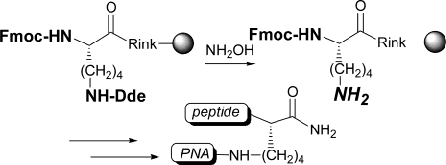
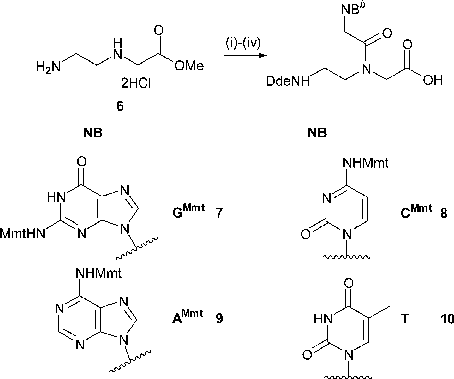
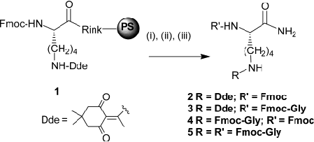
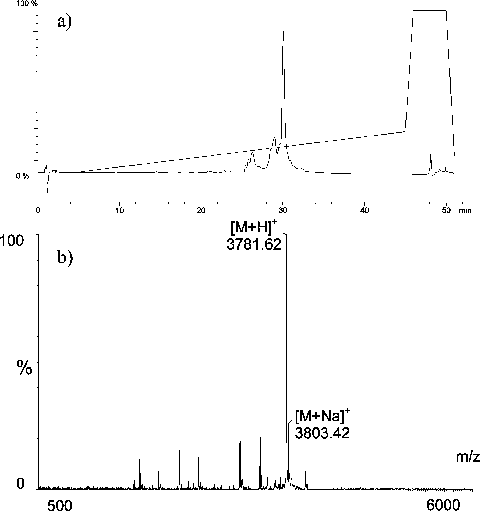
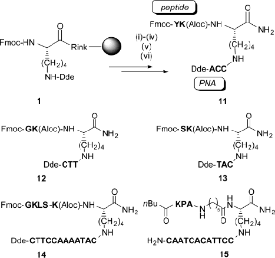

See https://pubs.acs.org/sharingguidelines for options on how to legitimately share published articles.

Downloaded via UNIV DE GRANADA on March 4, 2024 at 15:02:01 (UTC).

# ORGANIC LETTERS

## 2004 Vol. 6, No. 7 1127-1129

School of Chemistry, UniVersity of Southampton, Highfield, Southampton SO17 1BJ, United Kingdom

mb14@soton.ac.uk

Over the past decade, a DNA mimic known as Peptide Nucleic Acid (PNA) has been developed, which hybridizes to complementary DNA or RNA sequences with higher affinity than its oligonucleotide counterpart.1,2 This, together with its stability and ease of synthesis and manipulation, has turned PNA into a major tool in the biomolecular and biotechnology fields.3 PNA is seen as a promising tool for gene therapy in antisense or antigene applications.4 However, cellular uptake has been one of the main pitfalls and has given rise to a number of PNA conjugates in attempts to try to improve cellular permeability.5

In the context of our research program, a highly flexible strategy for the synthesis of branched PNA-peptide conjugates was required. To use commercially available Fmocprotected amino acid monomers carrying acid-labile protecting groups, PNA monomers with an N-terminal protecting

- (1) Nielsen, P. E.; Egholm, M.; Berg, R. H.; Buchardt, O. Science 1991,

245, 1497.

- (2) Uhlmann, E.; Peyman, A.; Breipohl, G.; Will, D. Ang. Chem., Int.

Ed. 1998, 37, 2796. Antsypovitch, S. I.; Russ. Chem. ReV. 2002, 71, 71.

- (3) Nielsen, P. E. Curr. Opin. Biotechnol. 2001, 12, 16. Lovrinovic, M.;

Seidel, R.; Wacker, R.; Schroeder, H.; Seitz, O.; Engelhard, M.; Goody, R. S.; Niemeyer, C. M. Chem. Commun. 2003, 822. Rosenbaum, D. M.; Liu, D. R.; J. Am. Chem. Soc. 2003, 125, 13924.

(4) Pooga, M.; Langel, U¨ . Curr. Cancer Drug Targets 2001, 1, 231.

©

group completely orthogonal to Fmoc were required. The use of the palladium-labile allyloxycarbonyl (Aloc) group gave unsatisfactory results with poor repetitive yields, severely restricting the length of PNA that could be made. Our attention was attracted to the 1-(4,4-dimethyl-2,6dioxacyclohexylidene)ethyl (Dde) group.6 Dde has been used as a protecting group for primary amines in solid-phase chemistry and classically is cleaved under nucleophilic conditions using 2% v/v hydrazine in DMF.6 Dde is stable under Fmoc and Boc deprotection conditions; unfortunately, Fmoc is readily deprotected with 2% v/v hydrazine in DMF, therefore limiting the potential of a dual Dde/Fmoc protecting group strategy.

The aim of this study was to develop novel Dde deprotection conditions that were completely orthogonal to Fmoc

- (5) Li, X.; Zhang, L.; Lu, J.; Chen, Y.; Min, J.; Zhang, L. Bioconjugate Chem. 2003, 14, 153. Cutrona, G.; Carpento, E. M.; Ulivi, M.; Roncella, S.; Landt, O.; Ferrarini, M.; Boffa, L. C. Nat. Biotechnol. 2000, 18, 300. Branden, L. J.; Mohamed, A. J.; Smith, C. I. Nat. Biotechnol. 1999, 17, 784. Stock, R. P.; Olvera, A.; Sanchez, R.; Saralegui, A.; Scarfi, S.; SanchezLopez, R.; Ramos, M. A.; Boffa, L. C.; Benatti, U.; Alagon, A. Nat. Biotech. 2001, 19, 231. Zhou, P.; Wang, M.; Du, L.; Fisher, G. W.; Waggoner, A.; Ly, D. H. J. Am. Chem. Soc. 2003, 125, 6878.
- (6) Bycroft, B. W.; Chan, W. C.; Chanabra, S. R.; Hone, N. D. Chem. Commun. 1993, 778.

verified. For this purpose, novel PNA monomers 7-10 with Dde as an N-terminal protecting group and 4-methoxytrityl (Mmt) as an acid-labile nucleobase protecting group (for thymine, no protecting group was needed) were synthesized in good overall yields starting from the known amine 6 (Scheme 2).9,10

and apply these to the synthesis of branched PNA-peptide conjugates. We reasoned that this should be possible given the different mechanisms of deprotection for both protecting groups. While Fmoc is cleaved by basic elimination, Dde is cleaved by nucleophiles (trans enamination).6,7 A set of new deprotection conditions and reagents were evaluated using Fmoc-Lys(Dde)-Rink-PS resin (1) as a simple model compound. Following deprotection, amino groups were coupled with Fmoc-Gly-OH as an analytical tag. After cleavage from the resin with TFA/CH2Cl2/TIS (90/5/5), the crude product was analyzed by RP-HPLC. As expected, the use of hydrazine led to both Fmoc and Dde deprotection (after 1 min of hydrazine treatment, products 2-5 were detected, Scheme 1). Alternative bivalent nucleophiles with reduced

Scheme 2.11 Synthesis of Dde-Protected PNA Monomersa

### Scheme 1a

a Reagents: (i) DdeOH, DIPEA, CH2Cl2/MeOH, 15 h, 71%; (ii) CMmtCH2COOH, AMmtCH2COOH, or GMmtCH2COOH, PyBrOP, NEt(iPr)2, DMF, 15 h (7-9); (iii) T-CH2COOH, DCC, HOBt, NMM, DMF, 15 h (10); (iv) 1 M Cs2CO3 MeOH/H2O 1/1, 90 min, overall yields from 6: 25% (7), 75% (8), 45% (9), 37% (10). bNB ) nucleobases.

a Reagents: (i) deprotection mixture; (ii) Fmoc-Gly-OH, HOBt/ DIC, DMF; (iii) TFA/CH2Cl2/TIS (90/5/5).

basicity were investigated. Unfortunately, most of them (1,2ethanedithiol, 2-mercaptoethanol, guanidine, 4-hydrazinobenzoic acid, diaminomaleonitrile, o-phenylenediamine) did not deprotect Dde.

The synthesis of the conjugates was carried out on PEGA, PS, and TG resins on the Rink linker using the new Dde deprotection conditions and traditional Fmoc chemistry in a stepwise manner. The new conditions were also compatible with acid-labile (Mmt) and palladium-labile groups (Aloc).12 Of particular interest was the perfect stability of the PNA nucleobases toward our deprotection conditions, as hydroxylamine has been used to extensively modify nucleobases in DNA chemistry.13

Attention was then turned toward screening mixtures of NH2OH‚HCl along with different bases (N,N-diisopropylethylamine, pyridine, imidazole) using a range of solvents (CH2Cl2, N,N-dimethylformamide (DMF), N-methyl-2-pyrrolidone (NMP)).

The best results in terms of reactivity and selectivity were achieved using a mixture of NH2OH‚HCl/imidazole in NMP/ CH2Cl2.8 After 3 h, the Dde group was cleaved cleanly while the Fmoc group was completely stable, yielding 4 as the only compound with a quantitative yield. The applicability of these deprotection conditions to other types of resins (PEGA and TentaGel (TG)) was then explored. The selectivity was excellent, while the deprotection proved to be markedly faster on PEGA resin (1 h in NMP/DMF) than on TentaGel (3 h in NMP/CH2Cl2).

Although all the resins gave good results, PEGA displayed the fastest cleavage kinetics and therefore was particularly

- (9) Heimer, E. P.; Gallo-Torres, H. E.; Felix, A. M.; Ahmad, M.;

Lambros, T. J.; Scheidl, F.; Meienhofer, J. Int. J. Pept. Protein Res. 1984, 23, 203.

- (10) Breipohl, G.; Knolle, J.; Langner, D.; O’Malley, G.; Uhlmann, E.

Bioorg. Med. Chem. Lett. 1996, 6, 665.

- (11) Side-chains of Fmoc-amino acid monomers were Boc- and tBu-

protected. Abbreviations: DIC (N,N -diisopropylcarbodiimide), HOBt (1hydroxybenzotriazole), NEM (N-ethylmorpholine), NMM (N-methylmorpholine), NMP (N-methyl-2-pyrrolidone), PyBOP ((benzotriazol-1-yloxy)tripyrrolidinophosphonium hexafluorophosphate), PyBrOP (bromotripyrrolidinophosphonium hexafluorophosphate), TFA (trifluoroacetic acid), TIS (triisopropylsilane).

The applicability of these new deprotection conditions to the synthesis of a branched PNA-peptide conjugate was then

- (7) Rubinov, D. B.; Rubinova, I. L.; Akhrem, A. A. Chem. ReV. 1999,

99, 1046.

- (8) Deprotection mixture was prepared as follows: 1.25 g (1.80 mmol)

- (12) Hydrazine partially reduces the double-bonds of Aloc groups:

Rohwedder, B.; Mutti, Y.; Dumy, P.; Mutter, M. Tetrahedron Lett. 1998, 39, 1175

- (13) Blackburn, G. M.; Jarvis, S.; Ryder, M. C.; Solan, V. J. Chem. Soc.,

of NH2OH‚HCl and 0.918 g (1.35 mmol) of imidazole were suspended in 5 mL of NMP, and the mixture was sonicated until complete dissolution. This solution can be stored for at least 2 weeks at -20 C. Just before reaction, 5 volumes of this solution were diluted with 1 volume of CH2Cl2 (polystyrene and tentagel resin) or DMF (PEGA resin).

Perkin Trans. 1 1975, 370. Rubin, C. M.; Schmid, C. W. Nucleic Acids Res. 1980, 8, 4613. Shugar, D.; Huber, C. P.; Birnbaum, G. I. Biochim. Biophys. Acta 1976, 447, 274.

Scheme 3.11 PNA Conjugate Synthesisa

a Reagents: (i) NH2OH‚HCl/imidazole;8 (ii) Dde-PNA-OH (5.5 equiv), PyBop (5 equiv), NEM (11 equiv) in DMF (0.1 M), 3 h; (iii) 20% piperidine in DMF; (iv) Fmoc-aa-OH (5.5 equiv), PyBop (5 equiv), DIPEA (11 equiv), HOBt (5.5 equiv) in DMF (0.1 M), 3 h; (v) Repeat steps i-iv. (vi) TFA/TIS/CH2Cl2 (90/5/5).

Figure 1. (a) HPLC trace and acetonitrile gradient (0% for 5 min; from 0 to 25% over 40 min and then to 90% over 1 min, 90% for 4 min. (b) MALDI-TOF MS of crude conjugate 15.

suited for the synthesis of longer sequences of PNA, as demonstrated by the synthesis of longer conjugates 14 and 15 (12-mers). The quality of the method was confirmed by the high purity of the crude compounds, which were analyzed by HPLC and MALDI-TOF (Figure 1). Conjugates 11-15 were obtained with purities equating to over 99% per chemical step (Scheme 3). The overall yields of isolated compounds varied between 50 and 67%.

In conclusion, we have shown that hydroxylamine is the reagent of choice for mild and orthogonal deprotection of the Dde group. This was demonstrated by a highly flexible synthesis of PNA-peptide conjugates. Our new conditions are milder than hydrazine and compatible with a larger number of functional groups and solid supports and should therefore greatly extend the scope of the Dde group to other

fields of organic chemistry. Furthermore we have demonstrated that Dde can be employed as an N-terminal groupfor PNA synthesis. To the best of our knowledge, this is also the first report of the synthesis of PNA on PEGA resin.

Acknowledgment. This research was supported by BBRSC (EBS). L.B. is grateful to the DAAD for a scholarship. J.J.D. is grateful to the University of Granada for a scholarship and the BBRSC.

Supporting Information Available: HPLC and MS (ES or MALDI-TOF) of crude compounds 11-14. This material is available free of charge via the Internet at http://pubs.acs.org.

OL049905Y

