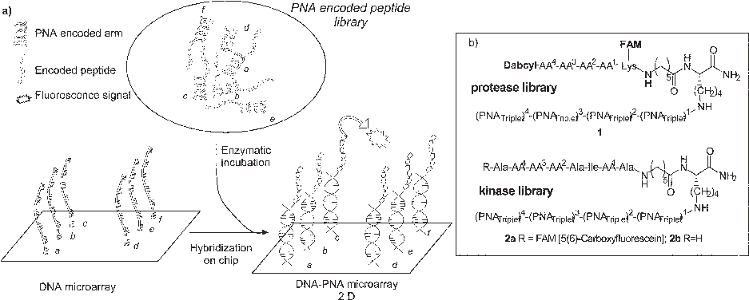
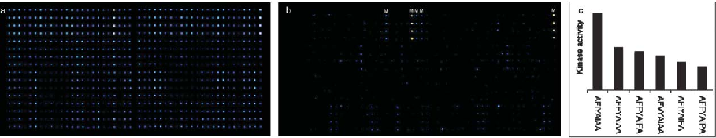

Published on 17 January 2005. Downloaded by Universidad de Oviedo on 27/10/2014 13:48:25.

View Article Online / Journal Homepage / Table of Contents for this issue

COMMUNICATION www.rsc.org/chemcomm | ChemComm

# Combinatorial libraries – from solution to 2D microarrays{

Juan Jose´ Dı´az-Mocho´n, Laurent Bialy, Lise Keinicke and Mark Bradley*

Received (in Cambridge, UK) 14th October 2004, Accepted 24th November 2004 First published as an Advance Article on the web 17th January 2005 DOI: 10.1039/b415847d

a synthetic protocol involving Dde and Fmoc which totally fulfilled these requirements7 (other routes involving multiple Aloc removal, in our laboratories failed after two or three couplings and had to be abandoned).5,8 In this paper we describe the first screening of true split and mix PNA encoded libraries with every member of the library being encoded by its own, unique, PNA oligomer, which directs it (and its attached partner) to a specific known location on a DNA microarray, thus allowing the whole library to be arranged on a microarray by virtue of PNA–DNA hybridization (Fig. 1).9 In essence this allows a solution mixture (3D) to be converted into a 2D array.

Enzymatic modifications of split and mix libraries were followed by ‘‘pulling down’’ onto a 2-dimensional DNA microarray, via PNA tagging; this allowed complete library interrogation of all members of the split and mix library.

Many high-throughput strategies can be applied to the rapid synthesis of small molecule inhibitors, enzyme substrates, or catalysts.1 Although split and mix synthesis has proven to be one of the most successful approaches in generating huge numbers of compounds,2 the screening and identification of the active compounds from these so-called libraries have been much more challenging. In order to facilitate these processes a variety of tagging3 chemistries have been developed. However a number of major problems still remain and it has to date been generally impossible to analyse all members of a split and mix library. In the early days of peptide based split and mix chemistry DNA encoding was utilised,4 although severe problems of stability and chemical orthogonality were evident.

Two 625-membered libraries (four variable positions with five possible building blocks each) designed to act as general substrates for proteases (library 1) or for the kinase abl (library 2b, Fig. 1b) were prepared. Each randomised amino acid was encoded by a PNA triplet, thus each peptide was encoded by a 12-mer PNA.10 Success of the split and mix syntheses was confirmed by hybridization assays. Fig. 2a shows the hybridisation of a control library 2a onto a DNA array.11 The selectivity of the hybridization was also tested by including DNA oligomers on the microarray which were not complementary to any of the PNA sequences of the library as well as by hybridising a single member of the PNA– peptide conjugate library which was synthesized separately. Hybridization onto microarrays occurred selectively at the complementary DNA oligo positions. Signals were not detected on non-complementary DNA spots (see Supporting Information). Moreover, the melting curve of a 125-membered pool of the PNA– peptide library 2b and a mixture of 125 complementary DNA oligos showed the expected sigmoidal shape, while no such melting

A logical extension to this method is PNA encoding, a much more robust tagging methodology, but one which could also then allow these libraries to be interfaced with DNA microarrays.

PNA has been used as a tagging molecule for both peptides5 and proteins,6 but split and mix synthesis requires truly orthogonal chemistries for peptide and PNA synthesis. Recently, we developed

{ Electronic supplementary information (ESI) available: experimental details of library syntheses, DNA microarray fabrication and hybridization conditions. PNA code and AA used in the libraries. See http:// www.rsc.org/suppdata/cc/b4/b415847d/

*mb14@soton.ac.uk

Fig. 1 (a) The general concept; (b) general structure of split and mix libraries.

Published on 17 January 2005. Downloaded by Universidad de Oviedo on 27/10/2014 13:48:25.

Fig. 2 Kinase library micro-array screen. Each spot was printed as 4 6 1 sub-array, some fluorescently labeled DNA oligos were printed as controls (M). a) Fluorescently labeled PNA–peptide control library 2a; b) PNA–peptide library after kinase treatment and detection with a fluorescent labeled anti-phosphotyrosine antibody; c) peptide sequences of the most heavily phosphorylated library members.

curve could be observed when a PNA–peptide library was treated with a set of non-complementary DNA oligos (see Supporting Information).

The protease library was based on the FRET principle12 using 5(6)-carboxyfluorescein (FAM) and the internal quencher Dabcyl. Fluorescence intensities pre and post protease treatment were determined from the microarrays hybridized with the proteaseencoded library. Relative changes in fluorescence resulting from protease activity were readily measured, from which the substrate specificity of the protease could be determined (see Supporting Information). Importantly ALL members of the library were analyzed (cleaved or non-cleaved).

A second library, with four variable positions embedded in an octapeptide (peptide template 2) was used to study the tyrosine kinase abl. Tyrosine was chosen as a variable amino acid (AA2) in order to introduce a control in the library and was encoded by two triplets (TAA and ATA) so two identical peptides would be encoded by two different PNA tags, thereby providing an internal control. One pool of the split and mix library 2b (AA4 5 Phe) containing 125 members was thus incubated with the kinase abl before hybridization onto the microarray and treatment with an FITC-labeled anti-phosphotyrosine antibody (Fig. 2b) (see Supporting Information for experimental details). To quantify the level of phosphorylation each signal was normalized according to the hybridization signal of the control fluorescently labeled library 2a (Fig. 2a). Analysis of the array showed that the kinase was predominantly selective for six sequences (Fig. 2c), while other tyrosine containing peptides were only weakly phosphorylated (Fig. 2b). No signals corresponding to nontyrosine containing peptides were detected. The internal controls, which corresponded to the same peptide but with different PNA tags gave similar intensities on the array. These findings underline the reliability of the method. A preference for Ile, Val and Phe was found at the AA3 position, while Ala, Phe and Pro were the preferred amino acids for AA1. A similar preference for Ile and Val for the AA3 position was previously reported.13

The data generated show the huge potential of the method. Variation in substrate specificity here compared to conventional techniques could be the result of a number of factors. Thus, the PNA tag could interfere with the enzymes or it could be the result of looking at multiple substrates competitively modulating the enzymes’ activity and selectivity.

In conclusion, we have successfully demonstrated how a solution assay can be converted into a 2D array by the application of PNA encoding. Two different examples, shown here, were used

to determine the substrate specificity of a protease and the kinase abl using DNA arrays. For the first time, this combines microarray technology with the power of split and mix chemistry and enzyme assays.9 The use of larger DNA arrays (10–20,000) will allow much larger libraries to be tagged and screened. The successful establishment of this technique, as shown here, enables a much more thorough analysis of split and mix libraries than is currently possible and is applicable far beyond the scope of enzymatic substrate-selectivity screening. The method shown here allows all library members to be analyzed in a split and mix library, something that has not really been achievable before. The method presented shows the practicability for solution assays, but it should also be applicable to assays directly on the chip. The potential, now the method has been put into practice, is to apply this method to different areas of biology, e.g. phosphatases or peptide arrays for binding studies.

LB is grateful to DAAD. This research was supported by the BBSRC (EBS).

Juan Jose´ Dı´az-Mocho´n, Laurent Bialy, Lise Keinicke and Mark Bradley* School of Chemistry, University of Southampton, Southampton, UK SO17 1BJ. E-mail: mb14@soton.ac.uk

Notes and references

- 1 H. Koinuma and I. Takeuchi, Nat. Mater., 2004, 3, 429; J. Y. Ortholand and A. Ganesan, Curr. Opin. Chem. Biol., 2004, 8, 271; P. Arya, D. T. Chou and M. G. Baek, Angew. Chem., Int. Ed., 2001, 40, 339.
- 2 A. Furka, Drug Discovery Today, 2002, 7, 1.
- 3 H. P. Nestler, P. A. Bartlett and W. C. Still, J. Org. Chem., 1994, 59, 4723; V. Swali and M. Bradley, Anal. Commun., 1997, 34, 15; V. Swali, L. G. Langley and M. Bradley, Curr. Opin. Chem. Biol., 1999, 3, 337.
- 4 S. Brenner and R. A. Lerner, Proc. Natl. Acad. Sci. USA, 1992, 89, 5381.
- 5 N. Winssinger, J. L. Harris, B. J. Backes and P. G. Schultz, Angew. Chem., Int. Ed., 2001, 40, 3152; N. Winssinger, S. Ficarro, P. G. Schultz and J. L. Harris, Proc. Natl. Acad. Sci. USA, 2002, 99, 11139.
- 6 M. Lovrinovic, R. Seidel, R. Wacker, H. Schroeder, O. Seitz, M. Engelhard, R. S. Goody and C. M. Niemeyer, Chem. Commun.,

- 2003, 7, 822.

7 J. J. Dı´az-Mocho´n, L. Bialy and M. Bradley, Org. Lett., 2004, 6, 1127. 8 F. Debaene, L. Mejias, J. L. Harris and N. Winssinger, Tetrahedron,

- 2004, 60, 8677.

- 9 P. E. Nielsen, M. Egholm, R. H. Berg and O. Buchardt, Science, 1991, 254, 1497; E. Uhlmann, A. Peyman, G. Breipohl and D. W. Will, Angew. Chem., Int. Ed., 1998, 37, 2796; after submission of this manuscript, a similar approach was reported independently: N. Winssinger, R. Damoiseaux, D. C. Tully, B. H. Geierstanger, K. Burdick and J. L. Harris, Chem. Biol., 2004, 11, 1351.

This journal is The Royal Society of Chemistry 2005 Chem. Commun., 2005, 1384–1386 | 1385

Published on 17 January 2005. Downloaded by Universidad de Oviedo on 27/10/2014 13:48:25.

- 10 Tags were designed to avoid (a) single-mismatch pairs of PNA, (b) purine contents of more than 66% for each PNA (to avoid solubility problems of the final library), (c) ‘‘reverse’’ PNA oligomers in the library, (d) self-complementary stretches over more than 5 monomeric units.
- 11 39-Amino-modified 18 mer DNA oligos (6-mer CTCTCT spacer was introduced at the 59 end) were printed onto aldehyde slides, using a Robotic Microarrayer (Genetix UK) equipped with solid pins following standard protocols (see Supporting Information).

- 12 M. J. Olsen, D. Stephens, D. Griffiths, P. Daugherty, G. Georgiou and B. L. Iverson, Nat. Biotech., 2000, 18, 1071.
- 13 L. Rychlewski, M. Kschischo, L. Dong, M. Schutkowski and U. Reimer, J. Mol. Biol., 2004, 336, 307; Z. Songyang, K. L. Carraway, M. J. Eck, S. C. Harrison, R. A. Feldmann, M. Mohammadi, J. Schlessinger, S. R. Hubbard, D. P. Smith, C. Eng, M. J. Lorenzo, B. A. J. Ponder, B. J. Mayer and L. C. Cantley, Nature, 1995, 373, 536.

