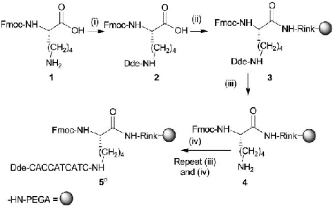
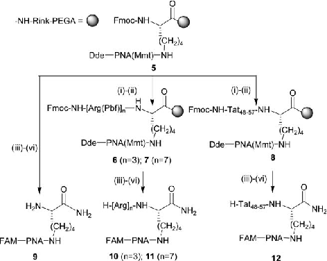
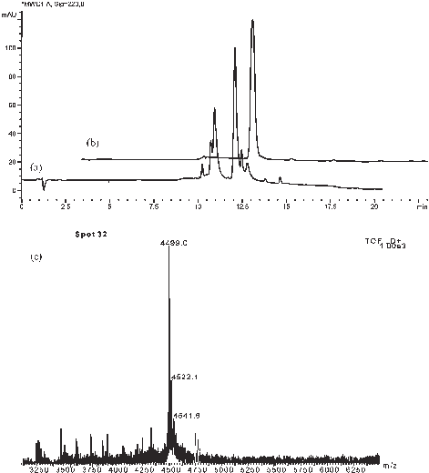
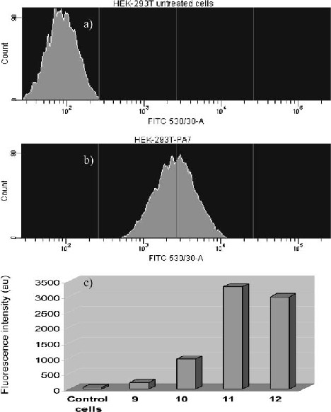

Published on 01 June 2005. Downloaded by University of Illinois at Chicago on 23/10/2014 19:53:18.

View Article Online / Journal Homepage / Table of Contents for this issue

COMMUNICATION www.rsc.org/chemcomm | ChemComm

# Synthesis and cellular uptake of cell delivering PNA–peptide conjugates{

Juan J. Dı´az-Mocho´n, Laurent Bialy, Jon Watson, Rosario M. Sa´nchez-Martı´n and Mark Bradley*

Received (in Cambridge, UK) 15th March 2005, Accepted 28th April 2005 First published as an Advance Article on the web 1st June 2005 DOI: 10.1039/b503777h

with full control of termini labelling of either the PNA and/or the peptide.

The synthesis and cellular uptake of fluorescently labelled PNA–peptide conjugates is described; Dde/Mmt protected PNA monomers, fully orthogonal to Fmoc chemistry, were used to develop a flexible strategy to give Peptide Nucleic Acids conjugated to tri- and hepta-arginine and the short basic Tat48–57 peptide as examples of cellular penetrating peptides, thereby allowing efficient cellular delivery of PNA into cells.

To prepare these conjugates Fmoc-Lys(Dde)-OH12 was coupled to amino-Rink-PEGA resin (Scheme 1)13 and the Dde group was cleanly and selectively deprotected at pH 6 with hydroxylamine hydrochloride/imidazole (1/0.75 equiv.) in NMP/DMF (5/1) to give rise to 4.14 This was coupled to a series of Dde/Mmt protected PNA monomers which were then rapidly and cleanly extended to give the 10 mer PNA construct 5 with complete retention of the Fmoc protecting group.

Peptide Nucleic Acids (PNAs) are used extensively as DNA mimics1 and have become one of the most important of DNA analogues due to their hybridisation abilities with complementary DNA sequences (following standard Watson–Crick base paring rules), together with their relatively simple chemical synthesis and their chemical and biological robustness. Indeed the binding affinities of PNA with DNA, under physiological conditions, are greater than for the corresponding DNA/DNA counterparts, mainly due to the absence of electrostatic repulsion forces present in DNA/DNA or DNA/RNA interactions.

Resin 5 was then used for the construction of four different PNA conjugates in a parallel fashion. One of the pools (control sample) was thus labelled on the terminus of the PNA strand with fluorescein prior to cleavage from the resin. The other three samples were used in standard Fmoc chemistry protocols to give tri-arginine, hepta-arginine and the short basic Tat48–57 decapeptide (Scheme 2),11 before labelling the end of the PNA sequence with 5(6)-carboxyfluorescein (FAM).

DNA delivery into cells, for a variety of applications such as gene therapy2,3 and cellular modulation,4 can be accomplished using a number of transfection agents which are typically cationic lipid based. These work by DNA compaction and neutralisation of the negatively charged DNA backbone and delivery into cells following the formation of lipoplexes. However, PNA lacks the formal charges found in DNA and thus classical transfection agents are often unable to deliver PNA into cells. A number of different approaches5 have therefore been undertaken in order to improve their cellular uptake including, for example, the incorporation of multiple positive charges into the PNA backbone.6 Other methods used for delivery have been the conjugation of the PNA to cellular penetrating peptides, which themselves are often of a polycationic nature, such as the Tat peptide from HIV or Anntenapedia peptide derivatives.5,7–9

Conjugates 9–12 were obtained following Fmoc deprotection and acidic cleavage (TFA/TIS/DCM: 90/5/5) from the solid support, with all acid-labile side chain protecting groups (peptide and PNA) cleaved concomitantly.15 Fig. 1 shows the HPLC16 trace of the crude PNA–peptide conjugate 12 showing the degree of purity and homogeneity of the final compound and the efficiency of synthesis.

However the combined and orthogonal synthesis of PNA– peptide conjugates has been far from ideal due to the combination of sets of monomer which were not truly orthogonal and which rely on using traditional solid phase chemistry with the coupling of amino acids followed by PNA monomers or vice versa6 or ligation through disulfide bonds.8,10 Here we report the flexible synthesis of fluorescently labelled PNA conjugates to arginine-rich peptides7 and the Tat48–57 decapeptide11 based on a branched lysine core which was derivatised with two orthogonal protecting groups, Fmoc and Dde. This allowed a highly flexible approach to synthesis, with the peptide or PNA strands being prepared at will,

Scheme 1 Synthesis of a 10 mer PNA using Dde/Mmt protected PNA monomers.14 Reagents and conditions: (i) Dde-OH (2 equiv., 26 mM), TFA (0.1 equiv.) in EtOH, reflux, 2 days;12 (ii) H2N-Rink-PEGA (1 equiv.), PyBop (5 equiv., 0.1 M), DIPEA (11 equiv.) in DMF, 3 h; (iii) 20% NH2OH.HCl/imidazole (1/0.75 equiv.), in NMP/DMF (5/1), 1 h;14 (iv) Dde-PNA-OH (5.5 equiv., 0.11 M), PyBop (5 equiv.), NEM (11 equiv.) in DMF, 3 h. Adenine and cytosine are Mmt protected.

{ Electronic supplementary information (ESI) available: experimental details. See http://www.rsc.org/suppdata/cc/b5/b503777h/

*Mark.Bradley@ed.ac.uk

Published on 01 June 2005. Downloaded by University of Illinois at Chicago on 23/10/2014 19:53:18.

Scheme 2 Fluorescein labelled PNA–peptide conjugates synthesis. Reagents and conditions: (i) 20% piperidine in DMF (2 6 5 min); (ii) Fmoc-AA-OH (5.5 equiv.), PyBop (5 equiv.), DIPEA (11 equiv.), HOBt (5.5 equiv.) in DMF, 3 h; Repeat (i) and (ii) as necessary. (iii) NH2OH.HCl/imidazole, in DMF/NMP, 1 h;11 (iv) FAM-OH (5.5 equiv.), PyBop (5 equiv.), DIPEA (11 equiv.) in DMF, 3 h; (v) 20% piperidine in DMF; (vi) TFA/TIS/CH2Cl2 (90/5/5), 1.5 h. PNA sequence = -CACCATCATC. Tat48–57 = -HN-Gly-Arg-Lys-Lys-Arg-Arg-Gln-ArgArg-Arg-CO- (in 8 side chains protected with acid labile protecting groups, Arg(Pbf), Lys(Boc) and Gln(Trt)); FAM = 5(6)-carboxyfluorescein.

Fig. 1 HPLC16 analysis of 12 (a) crude and (b) purified (l = 220 nm). (c) MALDI-TOF MS.

The cellular internalisation of these PNA conjugates at a concentration of 500 nM was determined by flow cytometry using HEK293T cells.17 Fig. 2 shows FACS analysis histograms of both untreated cells (Fig. 2a) and cells incubated with hepta-arginine conjugate 11 (Fig. 2b). Fluorescence intensity displayed by cells

treated with 11 was on average 30-fold higher than for untreated cells, demonstrating the high efficiency of the conjugates as carrier systems of PNA oligomers. The relative fluorescence intensities displayed by cells incubated with all the conjugates 9–12 are shown in Fig. 2c. The highest levels of uptake were shown by conjugates 11 and 12 while conjugate 10, having the shortest polycationic chain (tri-arginine), displayed the poorest uptake. As expected, the lack of any peptide delivery conjugate resulted in no uptake (control PNA 9). The efficiencies of uptake by both the polycationic conjugate 11 and the Tat conjugate 12 were comparable, suggesting a similar mechanism of cellular uptake.

In conclusion, the synthesis of branched PNA–peptide conjugates and their intracellular delivery have been demonstrated. The strategy presented exploits the newly found orthogonality between Dde and Fmoc chemistries to allow fluorescent, branched PNA conjugates to be prepared using parallel synthesis, and allowed a set of fluorescent PNA-conjugated compounds to be synthesised and tested on HEK293T cells. Conjugates bearing a hepta-arginine peptide 11 and the Tat48–57 decapeptide 12 were taken up by cells with high efficiency and show that the Dde/Fmoc approach to PNA and peptide synthesis is a powerful alternative to currently used methods, allowing high flexibility in order to modify at will either branch of the conjugates. In addition, since the fluorophore is on the PNA (rather than the peptide) we have unequivocally demonstrated the delivery of PNA into cells.

This research was supported by the BBRSC (EBS) and the EPSRC. LB is grateful to the DAAD for a scholarship.

Fig. 2 FACS analysis of both untreated cells (a) and cells incubated with 11 (b) and relative fluorescence intensities (c).

This journal is The Royal Society of Chemistry 2005 Chem. Commun., 2005, 3316–3318 | 3317

Published on 01 June 2005. Downloaded by University of Illinois at Chicago on 23/10/2014 19:53:18.

Juan J. Dı´az-Mocho´n, Laurent Bialy, Jon Watson, Rosario M. Sa´nchez-Martı´n and Mark Bradley* School of Chemistry, Edinburgh University, Joseph Black Buildings, Edinburgh, UK EH9 3JJ. E-mail: Mark.Bradley@ed.ac.uk; Tel: 0131-6504280

Notes and references

- 1 P. E. Nielsen, M. Egholm, R. H. Berg and O. Buchardt, Science, 1991, 254, 1497.
- 2 G. Brooks, Gene Ther., 2002, 1.
- 3 K. Ciftci and P. Trovitch, Adv. Drug Delivery Rev., 2000, 43, 57.
- 4 X. Jiao, R. Y.-H. Wang, Z. Feng, H. J. Alter, W. Shih and J. Wai-Kuo, Hepatology, 2003, 37, 452.
- 5 U. Koppelhus and P. E. Nielsen, Adv. Drug Delivery Rev., 2003, 55, 267.
- 6 A. Dragulescu-Andrasi, P. Zhou, G. He and D. H. Ly, Chem. Commun., 2005, 244; P. Zhou, M. Wang, L. Du, G. W. Fisher, A. Waggoner and D. H. Ly, J. Am. Chem. Soc., 2003, 125, 6878.
- 7 S. Futaki, I. Nakase, T. Suzuki, Z. Youjun and Y. Sugiura, Biochemistry, 2002, 41, 7925; S. Futaki, T. Suzuki, W. Ohashi, T. Yagami, S. Tanaka, K. Ueda and Y. Sugiura, J. Biol. Chem., 2001, 276, 5836.
- 8 U. Koppelhus, S. K. Awasthi, V. Zachar, H. U. Holst, P. E. Ebbesen and P. E. Nielsen, Antisense Nucleic Acid Drug Dev., 2002, 12, 51.
- 9 L. Good, S. K. Awasthi, R. Dryselius, O. Larsson and P. E. Nielsen, Nat. Biotechnol., 2001, 19, 360; G. Cutrona, E. M. Carpaneto, M. Ulivi,

- S. Roncella, O. Landt, M. Ferrarini and L. C. Boffa, Nat. Biotechnol., 2000, 18, 300; M. Pooga, U. Soomets, M. Hallbrink, M. Valkna, K. Saar, K. Rezaei, U. Kahl, J. X. Hao, X. J. Xu, Z. Wiesenfeld-Hallin,
- T. Hokfelt, T. Bartfai and U. Langel, Nat. Biotechnol., 1998, 16, 857.

- 10 M. C. de Koning, D. V. Filippov, N. Meeuwenoord, M. Overhand, G. A. van der Marel and J. H. van Boom, Tetrahedron Lett., 2002, 43, 8173.
- 11 E. Vives, J. Mol. Recognit., 2003, 16, 265.
- 12 S. R. Chhabra, B. Hothi, D. J. Evans, P. D. White, B. W. Bycroft and C. Chan, Tetrahedron Lett., 1998, 39, 1603.
- 13 M. Meldal, Tetrahedron Lett., 1992, 33, 3077.

- 14 J. J. Diaz-Mochon, L. Bialy and M. Bradley, Org. Lett., 2004, 6, 1127.
- 15 Analysis by MALDI-TOF MS, following precipitation with ice-cold ether, centrifugation and purification by semipreparative HPLC16 gave molecular ions which agreed, in all cases, with the proposed structures. MALDI-TOF MS Analysis: 9 C132H157N57O36, 3118 (average mass), mass found m/z: 3119.3 [M + H]+; 10 C150H193N69O39, 3586.5 (average mass), mass found m/z: 3589.6 [M + H]+; 11 C174H241N85O43, 4211.3 (average mass), mass found m/z: 4213.4 [M + H]+; 12 C187H264N88O47, 4496.6 (average mass), mass found m/z: 4499.0 [M + H]+.
- 16 HPLC analysis was carried out on an HP1100 equipped with a Phenomenex column (Prodigy 5 mm ODS(3); 150 mm 6 2 mm). Mobile phases were HPLC grade, water containing 0.1% TFA and MeCN.

Method: 100% H2O for 5 min, then increasing from 0% to 60% MeCN over 10 min.

- 17 HEK-293T (human embryonic kidney) cells were grown in Dulbecco’s modified Eagle’s medium (DMEM) supplemented with 4 mM glutamine, 10% fetal calf serum (FCS) and 100 units/ml penicillin/ streptomycin until 80% confluency. Cells were suspended using trypsin/ EDTA and counted. Cells were then seeded in 24 well plates at 4 6 104 cells per well and incubated overnight. Then cells were washed with warm PBS buffer and preincubated in 350 ml serum free medium (SFM) at 37 uC for 30 min. Compounds 9–12 were mixed with serum free medium at a final concentration of 500 nM. To each well different samples of 9–12 were added and incubated at 37 uC for 2 h. Each experiment was performed in triplicate. The internalisation of free fluorescein, under the same conditions, was tested simultaneously and untreated cells were used as negative control. After incubation, cells were washed twice with PBS, harvested with trypsin/EDTA, washed again and resuspended in 1% FCS in PBS buffer. To analyze the internalisation of fluorescein-labeled PNA conjugates, cell-associated fluorescence was determined by flow cytometry analysis using a FACSAria flow cytometer (Becton Dickinson). A total of 10 000 events per sample were analyzed. FITC (530/30 nm) band pass filters were used for fluorescence analysis of the cell suspensions. None of the conjugates 9–12 assayed was found to be toxic as verified by an MTT toxicity and a trypan blue assay to determine cell viability (see Supplementary Information).

