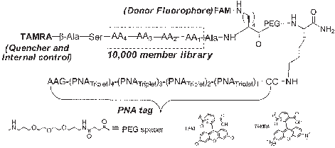
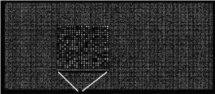
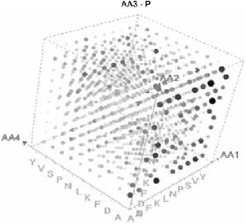
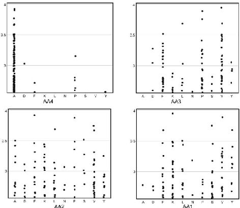

Published on 08 September 2006. Downloaded by University of Hong Kong Libraries on 22/10/2014 03:48:22.

View Article Online / Journal Homepage / Table of Contents for this issue

COMMUNICATION www.rsc.org/chemcomm | ChemComm

# Dual colour, microarray-based, analysis of 10 000 protease substrates{

Juan J. Dı´az-Mocho´n, Laurent Bialy and Mark Bradley*

Received (in Cambridge, UK) 26th June 2006, Accepted 22nd August 2006 First published as an Advance Article on the web 8th September 2006 DOI: 10.1039/b609029j

An alternative approach, described here, involves the use of a Peptide Nucleic Acid (PNA) encoded split and mix FRET based peptide library. In this library PNA was used as an encoding device, with a one-to-one correspondence between specific peptides and tags.10 Following incubation with proteases (or in other cases kinases) in solution, PNA tagging allowed the whole library to be deciphered via hybridisation onto a DNA microarray. In essence this allows the conversion from a 3D solution assay to a ‘‘2D’’ microarray.10 This method is potentially very powerful as not only are large number of compounds readily made and screened by split and mix methods but the approach allows the entire library to be analysed. Clearly for the PNA approach to be successful there is a need for very robust and totally orthogonal chemistries for peptide (ideally Fmoc based) and PNA synthesis and this has been enabled by a number of recent advances in PNA synthesis.11

A 10 000 member PNA-encoded library of FRET based peptides was synthesised for global analysis of protease cleavage specificity; analysis was achieved using a DNA microarray and consumed minimal quantities of enzyme (60 pmole) and library (3.5 nmole).

A starting point in protease research is often the determination of the substrate specificity of the specific protease under investigation. This is a crucial step in developing new potential protease inhibitors as determination of substrate profiles can help ensure specific and selective inhibition in relation to other proteases. It is also important in the analysis of mutant profiles (e.g. variants of HIV proteases) as well as in unveiling the physiological role and natural substrates of orphan enzymes.1 A number of approaches, based on combinatorial or parallel synthesis methods, have been used to study and unravel the substrate specificity of novel proteases. Thus, the original methods of Meldal2 used resin based peptides incorporating a pair of fluorophores for FRET (fluorescence resonance energy transfer) analysis and this approach has since undergone a number of subsequent improvements and modifications.3,4

There are a number of precedents to nucleic acid encoding of libraries, for example, the report by Lerner12 of encoding peptide libraries with DNA, but the logical extension of DNA tagging to the chemically more robust PNA chemistry offers a significant number of advantages. These are further enhanced by the application of DNA microarrays, a technology which was not available in the early days of encoded combinatorial chemistry. This makes the approach inherently more attractive since analysis on a DNA microarray, designed to hybridise all tags within a library, would allow the entire library to be screened and analysed in a single pass. In addition, the advent of inkjet printing based synthesis of DNA means arrays can be prepared with any user defined sequences.

The use of fluorogenic mixtures of substrates and the application of deconvolution techniques5 has been another successful approach used to study substrate specificity. Other approaches include the use of internally quenched dendrimer substrates6 and peptide cocktails.7 In terms of mixture screening and deconvolution a number of different strategies have been followed, being positional scanning libraries (PSL) perhaps the most successful.5 However, although these libraries give consensus peptide sequences the cooperative effects between amino acids can not always be predicted. Furthermore, many of these methods rely on cleavage of a specific C-terminal fluorophore in order to give a signal, such that cleavage anywhere else in the peptide chain would go unnoticed and only one half of the peptide recognition site can ever be screened.

Initial reports of this approach by Harris and ourselves provided proof of principle studies.10,13 However these studies were very limited and a number of problems existed, most notably the lack of a dual colour internal control and the analysis of large numbers of peptides. This is essential as a broad range of melting temperatures, variations in hybridisation efficiency, differences in concentrations between library members and any variations across the microarray itself in terms of DNA synthesis mean some type of internal control is necessary in any microarray screen. In conventional mRNA profiling experiments these issues are addressed by the use of dual colour labelling with fluorescent ratios rather than absolute intensities providing an inherent internal control allowing determination of gene over- or under-expression regardless of the Tm.14 Likewise in our experiments analysis had to automatically take into account different PNA melting temperatures and any variations in concentration (something that is inevitable when 10 000 different PNAs are being prepared and presented to an array). A dual colour approach was therefore utilised by the incorporation of a FRET pair into the library (see Fig. 1). This consisted of FAM and TAMRA, the former being quenched by the latter which is also a fluorophore in its own right. Thus, ratios

Recent approaches include single compound analysis with the covalent attachment of immobilised fluorogenic substrates onto surfaces8 and glycerol based arrays using PSL, with reactions initiated by enzyme aerosol spraying.9 However, in all of these array approaches there are serious issues with respect to quantification and the lack of internal controls, an issue of paramount importance in any microarray application.

University of Edinburgh, School of Chemistry, Joseph Black Buildings, Midlothian, UK EH9 3JJ. E-mail: mark.bradley@ed.ac.uk; Fax: +44(0)1316506453

{ Electronic supplementary information (ESI) available: Experimental details; PNA encoding triplets with their corresponding amino acids; DNA oligomers used on OGT arrays; parameters used for data analysis and full data. See DOI: 10.1039/b609029j

Published on 08 September 2006. Downloaded by University of Hong Kong Libraries on 22/10/2014 03:48:22.

of FAM/TAMRA allowed relative quantification of all unmodified library members following hybridisation. Cleavage, which would disrupt the FRET pair, would alter this ratio and readily allow identification of any ‘‘hits’’.

The first task in preparing the 10 000 member library was to address a number of issues in relation to PNA design in order to ensure a robust and practical screening approach.

The encoding strategy was thus designed to eliminate the problem of producing oligomers with closely related sequences. Therefore, PNA triplets were based on a ‘‘comma-less’’ code in order to prevent any frame shifts binding (see ESI for details{).15 Tags were also designed such that binding would take place only in one orientation, while self complementary and dimer issues were also eliminated. These issues were guaranteed by the common PNA monomers used at both ends of the oligomers. PNA oligomers would hybridise their DNA counterparts in an antiparallel fashion (PNA N-termini facing DNA 39-end which was covalently linked to the glass slide). Common PNA monomers were also used to reduce the possibility of unselective hybridisation, since it is known that single mismatches found in these points tend to have a less destabilising effect than those found in the middle of the oligomer.16 An Excel Macro was written to generate the 10 000 different hexapeptides (4 random positions using 10 different amino acids, 104), together with their corresponding PNA tags and their complementary DNA oligomers (see ESI{). Peptides were spaced from their PNA tags to avoid potential interference between tags and the cleavage site of the enzyme. Following all these points the library (Fig. 1, see ESI for a list of amino acids and the corresponding PNA triplets used in this library{) was designed and synthesised using split and mix methods.11

Due to their PNA tags every member of the library could be arranged in a defined position on a DNA microarray containing complementary sequences. This was achieved using customised 22 575 feature DNA microarrays from OGT (fabricated using inkjet technology with a PEG spacer between the substrate and base, see ESI for details{). These consisted of 10 000 user defined sequences, printed in a 39 A 59 direction, with duplicates of each oligomer prepared on distant coordinates of the 2D array. It also included 2575 control DNA oligomers (having the same length as the designed probes but being non-complementary to any of the PNA library members). Analyses of the microarray experiments (BlueFuse 3.2) allowed elimination of any ‘‘spots’’ from consideration which showed a high deviation and was essential in order to generate experiments with high levels of confidence and biologically meaningful data (i.e. all duplicate spots were compared and only accepted if their SD’s were less than 0.25).

Fig. 1 General structure of the 10 000 member PNA-encoded FRETbased peptide library.

Proteases were analysed following the steps described below:

(1). Hybridisation of unmodified libraries on the custom DNA microarrays was used as a control. Following hybridisation of the unmodified library, slides were scanned using both TAMRA and FAM filter sets. Analysis of the images showed none of the 2575 controls had any binding, thus ruling out unselective binding. As expected, fluorescence intensities were not homogenous over the array (Fig. 2). However, the ratios between the two dyes made every single point valuable and independent of its melting temperature and concentration, and all points (peptides) fell within the two identity lines (see ESI{).

- (3). Scans were obtained following hybridisation of the

enzymatically modified peptide libraries onto the DNA microarrays and the images were analysed (see ESI for details{). FAM and TAMRA intensities were plotted in an x–y format, giving rise to a typical two channel microarray graph. Points representing peptides with a higher FAM/TAMRA ratio than the average corresponded to peptides which were cleaved and were readily identified by falling below the so-called identity lines. Each point which fell below this line corresponded to a specific DNA/PNA sequence and by virtue of the correspondence of the PNA tag to the peptide sequence, cleaved peptides could be readily identified.

- (4). Finally, the data were represented in two different ways.

Often substrate specificities are expressed using 2D plots. However, this is obviously impossible with 10 000 different data points having four positions as variables. Therefore, data were visualised using 3D cube formats where three of the amino acid positions were plotted on the X, Y and Z axes using 40 different cubes for each protease, with each cube representing a defined amino acid in a specific position. (Fig. 3 shows a representative example—see ESI for 40 cubes of each protease{). The second form of representation was achieved by plotting the distribution of amino acids found within the top cleaved peptide sequences (Fig. 4).

Chymopapain was the first protease to be analysed following this protocol. Using the methodology described above many conclusions can be drawn concerning the cooperative effects of the different amino acids and specific cleavage profiles (Fig. 3 and Fig. 4). Thus Ala-Pro-Val-AA1 (found six times) and Ala-(Val/ Phe)-(Xaa)-(Val/Lys) were two of the common sequences found within the top 100 cleaved peptides for chymopapain. These results can be compared to those found by Ellman17 who reported the use of Ac-Ala-P3-P2-Lys-ACC-NH2 (ACC = coumarin fluorogenic

Fig. 2 A 10 000 member un-cleaved PNA-encoded library hybridised onto a 22 575 custom DNA microarray. Empty circles represent spots containing DNA oligomers that were not complementary to any PNA oligomer in the library and were used as controls for selectivity of hybridisation. Each spot here represents a single, known peptide–PNA conjugate binding to the array.

This journal is The Royal Society of Chemistry 2006 Chem. Commun., 2006, 3984–3986 | 3985

Published on 08 September 2006. Downloaded by University of Hong Kong Libraries on 22/10/2014 03:48:22.

Fig. 3 Cube plot with AA3 fixed as Pro with chymopapain. These cube visualisations readily allow the determination of substrate specificity while looking at 1000 different substrates simultaneously (see ESI{).

Fig. 4 Representation of the top peptides from the library (1%) cleaved by chymopapain in the 10 000 peptide library. Each panel represents the presence of a certain amino acid at each position of the most cleaved peptides. Chymopapain showed very strong specificity for Ala at AA4 and Phe/Pro/Val at AA3.

substrate) as template for chymopapain analysis and found a preponderance of Val in the P3 position. However their approach only detects cleavage at the lysine residue, whereas we detect cleavage anywhere in the peptide and thus direct comparison is impossible.

In the case of subtilisin the observed substrate specificity from the top 100 peptides corresponded to (Phe/Asp)-(Ala/Phe/Val)(Xaa)-(Ala/Leu/Val) (Xaa = promiscuous) (see ESI for details{). These results can be compared with studies carried out on this serine protease by Meldal which have shown its preferences for Phe and Leu in the P1 position, somewhat undefined in the P3 position and for hydrophobic amino acids such as Phe and Val in position P4 (P2 was defined in these studies as Pro).2 Interestingly,

there were a number of peptides in the top 100 that had the sequence Asp-Phe-Xaa-Ala/Leu/Val (9). The presence of Asp is unusual for this protease but it should be noted that in our studies we can look at all individual sequences, whereas other studies have usually had to look at general consensus sequences.

In conclusion, a 10 000 member split and mix PNA encoded FRET-based peptide library was successfully used to interrogate two different proteases. Dual labelling avoided biasing of the data due to variations in DNA loading on the arrays, different Tm’s between members and other experimental variables. Selective hybridisation was proven and the different proteases studied generated different profiles. The approach allows all 10 000 peptides to be cleaved and analysed under identical conditions, requires minute quantities of protein (60 pmole) and library (the library we prepared will allow over 1500 chip based assays!) and gives data comparable to existing methods. In the approach described above the library was unbiased, but can be readily adapted to specific proteases (e.g. by the incorporation of a proline or arginine residue into a defined position of the peptide; indeed the PNA encoding approach allows us to data-mine and ‘‘pullout’’ all peptides containing, for example, proline in any of the four library positions). Clearly the method is applicable to other enzymes, thus kinases can also be analysed in this way, but using fluorescent antibodies rather than FRET reporters (and again dual colour controls). This approach offers a powerful tool for the rapid analysis of orphan proteases or to probe the subtle substrate portfolios of specific enzymes.

This research was supported by the BBSRC.

Notes and references

- 1 K. R. Acharya, E. D. Sturrock, J. F. Rirodan and M. R. W. Ehlers, Nat. Rev. Drug Discovery, 2003, 2, 891 and references within.
- 2 M. Meldal, I. Svendsen, K. Breddam and F. I. Auzanneau, Proc. Natl. Acad. Sci. U. S. A., 1994, 91, 3314.
- 3 C. W. Tornoe, S. J. Sanderson, J. C. Mottram, G. H. Coombs and M. Meldal, J. Comb. Chem., 2004, 6, 312.
- 4 M. Meldal, Biopolymers, 2002, 66, 93.
- 5 B. J. Backes, J. L. Harris, F. Leonetti, C. S. Craik and J. A. Ellman, Nat. Biotechnol., 2000, 18, 187.
- 6 J. M. Ellard, T. Zollitsch, W. J. Cummins, A. L. Hamilton and M. Bradley, Angew. Chem., Int. Ed., 2002, 41, 3233.
- 7 Y. Z. Yang and J. L. Reymond, Mol. BioSyst., 2005, 1, 57.
- 8 C. M. Salisbury, D. J. Maly and J. A. Ellman, J. Am. Chem. Soc., 2002, 124, 14868.
- 9 D. N. Gosalia and S. L. Diamond, Proc. Natl. Acad. Sci. U. S. A., 2003, 100, 8721.
- 10 J. J. Diaz-Mochon, L. Bialy, L. Keinicke and M. Bradley, Chem. Commun., 2005, 1384.
- 11 J. J. Diaz-Mochon, L. Bialy and M. Bradley, Org. Lett., 2004, 6, 1127.
- 12 S. Brenner and R. A. Lerner, Proc. Natl. Acad. Sci. U. S. A., 1992, 89, 5381.
- 13 N. Winssinger, R. Damoiseaux, D. C. Tully, B. H. Geierstanger, K. Burdick and J. L. Harris, Chem. Biol., 2004, 11, 1351 and references therein.
- 14 J. L. DeRisi, V. R. Iyer and P. O. Brown, Science, 1997, 278, 680.
- 15 F. H. C. Crick, J. S. Griffith and L. E. Orgel, Proc. Natl. Acad. Sci. U. S. A., 1957, 43, 416.
- 16 J. Weiler, H. Gausepohl, N. Hauser, O. N. Jensen and J. D. Hoheisel, Nucleic Acids Res., 1997, 25, 2792.
- 17 D. N. Gosalia, C. M. Salisbury, J. A. Ellman and S. L. Diamond, Mol. Cell Proteomics, 2005, 4, 626.

