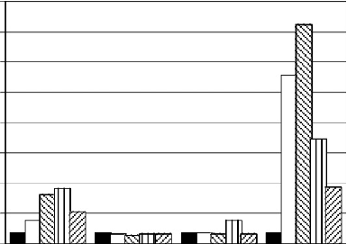
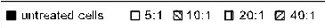
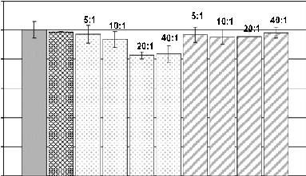

Available online at www.sciencedirect.com

Tetrahedron Letters 49 (2008) 923–926

# Peptoid dendrimers—microwave-assisted solid-phase synthesis and transfection agent evaluation

Juan J. Diaz-Mochon, Mario A. Fara, Rosario M. Sanchez-Martin, Mark Bradley*

School of Chemistry, Joseph Black Building, West Mains Road, University of Edinburgh, EH9 3JJ Edinburgh, United Kingdom Received 3 October 2007; revised 31 October 2007; accepted 9 November 2007 Available online 21 December 2007

Abstract

Three generations of peptoid-based dendrimers were synthesised by solid-phase methods, using N-Fmoc–N-(6-N0-Fmoc-aminohexyl)glycine as both the initiator core and the monomer unit, which offer an unusual dendrimeric periphery composed of both secondary and primary amines. The third generation compound proved to be an efficient mediator of transfection while displaying minimal cytotoxicity.

2007 Elsevier Ltd. All rights reserved.

Dendrimers are fascinating compounds, offering many of the properties of more conventional polymers but with a highly defined shape, molecular mass and with a structure which displays a large number of functional groups on the periphery, while ‘hiding’ much internal functionality. Two dominant synthetic methodologies have been used to generate dendrimers: (i) a linear approach as initially described by Vo¨gtle,1 where surface functionalities grow at an exponential rate while the numbers of synthetic steps increases linearly and (ii) a convergent synthesis strategy as introduced by Fre´chet,2 where dendrimeric fragments are synthesised before condensation to give the full dendrimeric structure.

Polyamidoamines (PAMAMs) can be regarded as the classical dendrimeric material and are typically constructed by the reaction of methyl acrylate with an initiation unit such as ammonia, with subsequent treatment with diamines followed by repetitive treatment with methyl acrylate and diamine. Such dendrimers display multiple primary amines on their external surface which can vary from 4 (generation 0) to 4096 (generation 10) as well as having a host of primary amides and tertiary amines within the global structure.

* Corresponding author. Tel.: +44 131 650 4820; fax: +44 131 650 6453. E-mail address: mark.bradley@ed.ac.uk (M. Bradley).

0040-4039/$ - see front matter 2007 Elsevier Ltd. All rights reserved. doi:10.1016/j.tetlet.2007.11.122

PAMAM dendrimers have found extensive practical application in the area of gene delivery3 and a number of other biomedical applications such as magnetic resonance imaging (MRI)4,5 and delivery of RNAi into mammalian cells.6 Another family of dendrimers, which have seen practical application, are those based on repeating and amplifying amino acid residues, most notably the lysine dendrimers introduced by Tam7 which offer a chemical route to the development of high-density antigenic peptides.8

A new step forward, as reported in this Letter, is a hybrid combination of PAMAM and peptide dendrimers in which peptoids (N-alkylglycines) are used both as an initiator and a monomer unit. In this Letter, we describe the solid-phase synthesis of peptoid dendrimers9–11 using NFmoc–N-(6-N0-Fmoc-aminohexyl)-glycine 5 (rather than Fmoc-Lys(Fmoc) or methyl acrylate and diamine) and their evaluation as transfection agents. The monomer unit 5 was prepared10,11 by mono protection of 1,6-diaminohexane 1 with Boc2O before alkylation with ethyl bromoacetate to give ester 3. Saponification of the ester followed by N-Fmoc protection with Fmoc-succinimide gave acid 4. Boc deprotection with TFA followed by NFmoc protection with Fmoc-succinimide gave rapid access to 512 (Scheme 1).

The dendrimers were assembled with high efficiency using monomer 5 on PS-Rink amide resin 6 using HOBt/

O O

NH

O

O O

O O

O

6

NH2 6

O

NH

NH

(i) (ii) (iii) (iv)

NH

- (v)
- (vi) N

N O

O

OH

6 HN

O

6

6

O

NH2

NH2

O

OH

OEt

O

#### 1 2 3 4 5

- Scheme 1. Synthesis of N-Fmoc–N-(6-N0-Fmoc-aminohexyl)-glycine 5.10,12 Reagents and conditions: (i) Boc2O (0.3 equiv), dioxane, 24 h, 91%; (ii) ethyl bromoacetate (1 equiv), Et3N (3 equiv), THF, 24 h, 55%; (iii) NaOH (1 equiv), CH3OH/H2O/dioxane (3:1:8); (iv) Fmoc–OSu (1 equiv) H2O/CH3CN (1:1), pH 8.5–9.0, 45 min, 40%; over two steps; (v) TFA/DCM (1:1), 2 h; (vi) Fmoc–OSu (1.2 equiv), DIPEA (2 equiv), THF/H2O (9:1), 16 h, 64% over two steps.

H2N Rink PS

- (i)
- (ii)
- (iii)
- (iv)

Peptoid dendrimers G1, G2 and G3

N

X NH O

NH2

O HN

NH2

X

O

NH

NH2

X

O

N H

NH2

X

N

X NH O

NH2

O N

HN

X

O

N

NH X

O

HN

H2N

X

O

NH

X NH2

O

HN

X NH2

O

N

NH

X

N

O X NH

NH2

O N

HN

X

O

N

NH X

O

- N

HN

X

O

N N H

X

- O

N

X NH

O

H N

H2N

X

O HN

NH2

X

O HN

NH2

X

O

HN

NH2

X

O H

N NH2

X O

HN

H2N

O X

NH

NH2

X

O

N H

H2N X

Peptoid dendrimer G1 Peptoid dendrimer G2 Peptoid dendrimer G3

6

- Scheme 2. Solid-phase synthesis of peptoid dendrimers using monomer 5.11 Reagents and conditions: (i) acid 5 (3 equiv), DIC (3 equiv) and HOBt (3 equiv) in DMF at 0.1 M; microwave irradiation at 60 C for 20 min; (ii) Fmoc deprotection: 20% piperidine in DMF (2 10 min) at room temperature; (iii) repeat (i) and (ii); (iv) TFA/TIS/DCM (90:5:5) for 2 h. X = (CH2)6.

DIC chemistry and microwave irradiation11 (Scheme 2). More generally, microwave irradiation offers huge promise in dendrimer synthesis, allowing reactions to be readily forced. To ensure coupling completion two colorimetric tests were used: (i) The Kaiser test for primary amines13 and (ii) a chloranil test for detecting secondary amines.14 The first generation dendrimer gave, not unexpectedly, negative tests after a single coupling, but subsequent generations required second couplings to ensure 100% reaction.

to the final compounds in crude yields of 85% (see Fig. 1) displaying 4, 8 and 16 primary and secondary amines on their surface just after 1, 2 and 3 coupling steps. MS analysis of the peptoid dendrimers gave the following data: positive ES G1 calcd (C24H51N7O3) 485.7, found m/z: 486.3 [M+H]+, 243.7 [M+2H]2+; MALDI-TOF G2 calcd (C56H115N15O7), 1109.91, found m/z: 1110.64 [M+H]+; MALDI-TOF G3 calcd (C120H243N31O15), 2358.92, found m/z: 2359.94 [M+H]+.

Following final Fmoc removal the polyamidoamines were cleaved from the resin using TFA/TIS/DCM (90:5:5) and precipitated with cold diethyl ether to give rise

To evaluate the properties of these compounds as transfection agents, their complexes with pEGFP-N1 (a plasmid which carries the gene that encodes green fluorescence

J. J. Diaz-Mochon et al./Tetrahedron Letters 49 (2008) 923–926 925

ADC1 A, ADC1 (ELSD 2007-08-21 HPLC NO 223\072-0501.D)

PMP1 , Solvent B

Norm

Area: 199991

4.623

14000

12000

10000

8000

6000

4000

2000

0

min

0 2 4 6 8 10 12 14 16

- Fig. 1. HPLC trace of crude peptoid dendrimer G3. HPLC conditions:

Gradient from 5% CH3CN to 95% CH3CN over 12 min on a C18 prodigy column (150 4.60 mm; 5 lm) with evaporative light scattering (ELS) detection.

0

500

1000

1500

2000

2500

3000

3500

4000

Fluorescence intensity

(Transfectionactivity)

untreated cells 5:1 10:1 20:1 40:1

G2

PAMAM Peptoid-dendrimers

G1 G2 G3

- Fig. 2. Transfection activity of peptoid dendrimers G1–G3 and PAMAM 2.0 with HEK293T.18 Ninety-six well plates were used, with each well containing 0.2 lg of DNA plasmid with different molar ratios16,17 of transfection agents/DNA.16

protein (GFP)) were incubated with human embryonic kidney (HEK293T) cells. PAMAM 2.015 was used as a control as it also possesses 16 amino groups.

Cells were incubated for 48 h with the dendrimer mixed with the plasmid at various molar ratios16,17 (5:1, 10:1, 20:1 and 40:1). Analysis showed that while generations 1 and 2 had no noticeable effect, G3 was able to transfect HEK293T cells with high efficiency (Fig. 2).

Figure 3 shows the viability of HEK293T cells when treated with peptoid dendrimers G3 and PAMAM 2.0 complexes with the plasmid.19 The peptoid dendrimers were found to be non-toxic at all of the ratios tested, reinforcing the use of these molecules as gene delivery agents.

In conclusion, peptoid dendrimers containing primary and secondary amines on their periphery have been successfully synthesised by solid phase and microwave mediated methods using a ‘lysine-type’ peptoid monomer. The higher generation peptoid dendrimers were able to transfect cells with higher efficiency than the PAMAM counterpart and

120

5:1

5:1

10:1 40:1

10:1

100

20:1

40:1

20:1

## % Cell viability

80

60

40

20

0

|  Untreated cells DNA G2 PAMAM G3 Peptoiddendrimer|
|---|

Fig. 3. Cytotoxicity of G3 peptoid dendrimer with HEK293T cells compared to PAMAM G2 as measured by the MTT assay.19 Viability was expressed as the percentage of the untreated control cells. Each bar represents the mean ± SD; n = 3.

were also non-toxic. This can be rationalised by the fact that a combination of primary and secondary amines is known to generate a proton sponge effect which can facilitate the DNA transfection process, by facilitating the release of the plasmid from the cytoplasmic lysosome.20 Finally, in areas outside transfection, peptoid dendrimers could also offer a solution to one of the known problems of peptide dendrimers, namely their very rapid biodegradation.21

Acknowledgements

J.J.D.-M. (EPSRC) R.M.S.-M. thank the Royal Society for the award of a Dorothy Hodgkin Fellowship. References and notes

- 1. Buhler, E.; Wehner, W.; Vo¨gtle, F. Synthesis 1978, 155–158.
- 2. Hawker, C. J.; Fre´chet, J. M. J. J. Am. Chem. Soc. 1990, 112, 7638.
- 3. Sanclimens, G.; Shen, H.; Giralt, E.; Albericio, F.; Saltzman, M. W.; Royo, M. Biopolymers 2005, 80, 800–814.
- 4. (a) Kobayashi, H.; Brechbiel, M. W. Adv. Drug Deliv. Rev. 2005, 57, 2271–2286; (b) Venditto, V. J.; Regino, C. A. S.; Brechbiel, M. W. Mol. Pharm. 2005, 2, 302–311.
- 5. Stiriba, S.-E.; Frey, H.; Haag, R. Angew. Chem., Int. Ed. 2002, 41, 1329–1334.
- 6. (a) Zhou, J.; Wu, J.; Hafdi, N.; Behr, J.; Erbacher, P.; Peng, L. Chem. Commun. 2006, 2362–2364; (b) Lesniak, W. G.; Kariapper, M. S. T.; Nair, B. M.; Tan, W.; Hutson, A.; Balogh, L. P.; Khan, M. K. Bioconjugate Chem. 2007, 18, 1148–1154.
- 7. Sadler, K.; Tam, J. P. Rev. Mol. Biotechnol. 2002, 90, 195–229.
- 8. Tam, J. P. Proc. Natl. Acad. Nat. Sci. U.S.A. 1988, 85, 5409–5413.
- 9. (a) Basso, A.; Bradley, M.; Evans, B.; Pegg, N. Chem. Commun. 2001, 697–698; (b) Cummins, W. J.; Hamilton, A. L.; Bradley, M.; Ellard, J.; Zollitsch, T.; Briggs, M. S. J.; WO 03014743; 2003; Chem. Abstract 2003, 138, 166223; (c) Lebreton, S.; How, S.-E.; Buchholz, M.; Yingyongnarongkul, B.-E.; Bradley, M. Tetrahedron 2003, 59, 3945– 3953; (d) Swali, V.; Wells, N. J.; Langley, G. J.; Bradley, M. J. Org. Chem. 1997, 62, 4902–4903; (e) Ternon, M.; Diaz-Mochon, J. J.; Belsom, A.; Bradley, M. Tetrahedron 2004, 60, 8721–8728; (f) Wells, N. J.; Basso, A.; Bradley, M. Biopolymers 1999, 47, 381–396.
- 10. Peretto, I.; Sanchez-Martin, R. M.; Wang, X.; Ellard, J.; Mittoo, S.; Bradley, M. Chem. Commun. 2003, 2312–2313.
- 11. (a) Fara, M. A.; Diaz-Mochon, J. J.; Bradley, M. Tetrahedron Lett. 2006, 47, 1011–1014; (b) Collins, J. M.; Leadbeater, N. E. Org. Biomol. Chem. 2007, 5, 1141.

- 12. Acid 4 (1 g, 2 mmol) was dissolved in TFA/DCM (1:1, 20 mL), and stirred for 2 h to remove the Boc protecting group. The solution was concentrated in vacuo and the crude compound precipitated with diethyl ether to give a sticky oil. The compound was dissolved in

THF/H2O (9:1, 20 mL) before adding Fmoc-OSu (0.8 g, 2.4 mmol) and DIPEA (0.64 mL, 4 mmol). The reaction mixture was stirred at room temperature for 16 h. 1 N HCl (20 mL) was added to the solution before removing the THF in vacuo. The compound was extracted with DCM (3 30 mL), the organic phase was washed with brine (3 20 mL), dried with magnesium sulfate and then concentrated in vacuo. The crude material was purified by column chromatography on silica gel, eluting with DCM to DCM/MeOH (9:1, Rf = 0.3) to give acid 5 as a white powder (800 mg, 64%). 1H NMR (CDCl3, 250 MHz): 1.09–1.46 (m, 8H), 3.12 and 3.35 (two br m, 4H), 3.86 and 3.95 (two br s, 2H), 4.17 (m, 2H), 4.39 and 4.50 (two m, 4H), 7.23–7.34 (m, 8H), 7.52–7.60 (m, 4H), 7.70–7.76 (m, 4H). 13C NMR (CDCl3, 62.9 MHz): two rotamers d 26.1 and 26.2, 27.7, 28.1, 29.7, 40.9, 47.3, 48.5, 67.8, 120.0, 124.8 and 125.0, 127.1, 127.7, 141.4, 143.9, 156.1, 156.8, 174.2; mp = 95–100 C; ES+ MS C38H38N2O6 (618) m/z (%): 619 [M+H]+ (100), 641 [M+Na]+ (25); HRMS (ESI): [M+NH4]+ calcd for C38H42N3O6, 636.3068; found, 636.3067.

- 13. (a) Kaiser, E.; Colescott, R. L.; Bossinger, C. D.; Cook, P. I. Anal. Biochem. 1970, 34, 595–598; (b) Egner, B. J.; Bradley, M. Drug Discovery Today 1997, 2, 102–109.
- 14. Vojkovsky, T. Peptide Res. 1995, 8, 236–237.
- 15. PAMAM dendrimer, 1,4-diaminobutane core, generation 2.0 solution 20% wt. in methanol was purchased from Sigma–Aldrich.

- 16. The molar ratio is equal to mols of transfection agent/number of plasmid equivalents. Plasmid equivalents is equal to the mass of plasmid used/average mass of a single nucleotide and is approximately equal to the number of moles of phosphate within the plasmid.
- 17. N:P ratios used (and the correspond to molecular ratios); were: 5:1, 10:1, 20:1, 40:1; G1 (20:1, 40:1, 80:1, 160:1); G2 (40:1, 80:1, 160:1, 320:1); G3 (80:1, 160:1, 320:1, 640:1) PAMAM 2.0 (80:1, 160:1, 320:1, 640:1). We feel that N:P ratio should be treated with caution as not all the external nitrogens (amines) are protonated at physiological pH’s.
- 18. HEK293T cells were seeded in a 96 well plate and incubated in DMEM complete media, 10% FCS, until 70% confluence one day prior to transfection. 10 lL of transfection cocktail [2.5 lL DNA (4.7Kb plasmid pEGFP-N1) containing 0.20 lg of DNA (0.6 nequiv in TE buffer) were mixed with different molar ratios of dendrimer16 (5 mM stock solutions in PBS) for 30 min before addition to each well containing 90 lL of DMEM complete media. Transfection activities were measured following 48 h of incubation by FACS analysis to measure relative levels of GFP expression.
- 19. Mosman, T. J. Immunol. Meth. 1983, 65, 55–63.
- 20. (a) Boussif, O.; Lezoualc’h, F.; Zanta, M. A.; Mergny, M. D.; Scherman, D.; Demeneix, B.; Behr, J. P. Proc. Natl. Acad. Sci. U.S.A 1995, 92, 7297–7301; (b) Liu, Y.; Wu, D.; Ma, Y.; Tang, G.; Wang, S.; He, C.; Chung, T.; Goh, S. Chem. Commun. 2003, 2630–2631.
- 21. Boyd, B. J.; Kaminskas, L. M.; Karellas, P.; Krippner, G.; Lessene, R.; Porter, C. J. H. Mol. Pharm. 2006, 3, 614–627.

