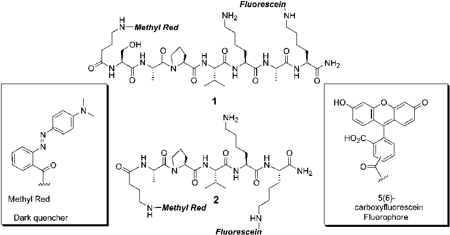
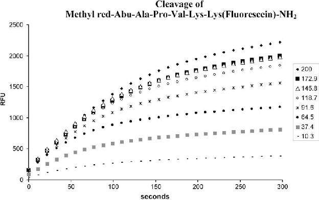
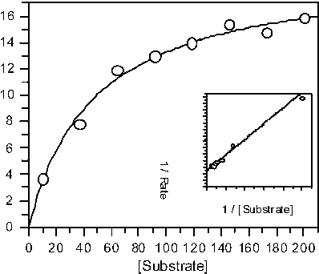
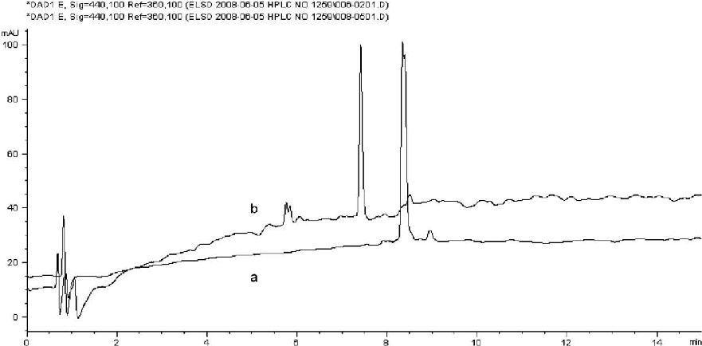
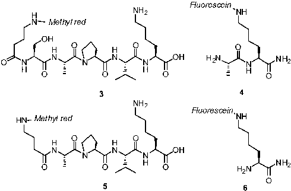

Analytical Biochemistry 384 (2009) 101–105

Contents lists available at ScienceDirect

# Analytical Biochemistry

journal homepage: www.elsevier.com/locate/yabio

From 10,000 to 1: Selective synthesis and enzymatic evaluation of fluorescence resonance energy transfer peptides as specific substrates for chymopapain

Juan J. Diaz-Mochon, Songsak Planonth, Mark Bradley*

Department of Chemistry, University of Edinburgh, Edinburgh EH9 3JJ, UK

a r t i c l e i n f o

a b s t r a c t

Article history: Received 24 June 2008 Available online 7 September 2008

The synthesis and detailed enzymatic analysis of fluorescence resonance energy transfer (FRET)-based peptides as substrates for chymopapain are reported. The design of these substrates arose from a massively parallel high-throughput microarray screening process using peptide nucleic acid (PNA) encoding technology, allowing the identification of detailed substrate specificities of any protease. Two peptides so identified with chymopapain were observed to be excellent substrates with low micromolar Km values and turnover numbers on the order of hundreds per second. Mass spectroscopy studies showed unequivocally the specificity of chymopapain toward Ala, Pro, Val, and Lys for positions P4 to P1 while not presenting high specificity for residues in position P10.

Keywords: FRET Proteases Enzymatic kinetic Chymopapain Substrate specificity PNA encoding

2008 Elsevier Inc. All rights reserved.

Chymopapain is a cysteine protease, obtained from the plant Carica papaya, that is used for a number of biomedical applications. It is used for pain relief in the treatment of herniated invertebral disks (chymodiactin) by inducing chemonucleolysis of the nucleous pulposus [1,2], thereby reducing pressure on the nerve root, whereas orally administered chymopapain is used to cure intestine cuticles produced by neumatoids [3]. It is also one of the components of contact lens cleaning liquids.

Currently, nonspecific probes such as N-a-benzoyl-l-arginine ethyl ester [4] and N-a-benzoyl-DL-arginine-p-nitroanilide [5] and a more specific fluorogenic dipeptide such as N-a-benzoylphenylalanine-arginine-4-methylcoumarin-7-amide [6] are used to access enzyme activity [7]. However, highly specific peptides have not been used as probes to measure chymopapain activity. Recently, this protease was used to validate a number of highthroughput methods for the determination of protease specificity [8,9], unveiling in some detail the substrate specificity of this important enzyme. Here the design, synthesis, and biological evaluation of two novel fluorescence resonance energy transfer (FRET)1

* Corresponding author. Fax: +44 131 650 6453. E-mail address: mark.bradley@ed.ac.uk (M. Bradley).

1 Abbreviations used: FRET, fluorescence resonance energy transfer; RP–HPLC, reverse-phase high-performance liquid chromatography; TFA, trifluoroacetic acid; ESI–MS, electrospray ionization mass spectrometry; QMS, quadrupole mass spectrometer; Rink amide linker, 4-[(2,4-dimethoxyphenyl) (amino) methyl]-phenoxyacetic acid; HOBt, N-hydroxybenzotriazole; DIC, diisopropylcarbodiimide; DMF, N,Ndimethylformamide; Boc, tert-butyloxycarbonyl; Dde, 1-(4,4-dimethyl-2,6-dioxacyclohexylidene)ethyl; DCM, dichloromethane; TIS, triisopropylsilane; DMSO, dimethyl sulfoxide; PBS, phosphate-buffered saline; EDTA, ethylenediaminetetraacetic acid; PNA, peptide nucleic acid; LC–MS, liquid chromatography mass spectrometry.

0003-2697/$ - see front matter 2008 Elsevier Inc. All rights reserved. doi:10.1016/j.ab.2008.08.032

peptides [10,11] are reported, the first FRET-based peptide substrates for this enzyme.

Materials and methods

All amino acid derivatives were obtained from GL Biochem (China). 5(6)-Carboxyfluorescein was purchased from Sigma–Aldrich (UK). Chymopapain, chromatographically purified from C. papaya, was purchased from Sigma–Aldrich (C8526, EC 3.4.22.6) as lyophilized powder and used without further purification. Analytical reverse-phase high-performance liquid chromatography (RP–HPLC) was performed on an HP1100 system equipped with a Discovery C18 reverse-phase column (5 cm 4.6 mm, 5 lm) with a flow rate of 1 mL/min and eluting with 0.1% trifluoroacetic acid (TFA) in H2O (A) and 0.042% TFA in acetonitrile (B), with a gradient of 5 to 95% B over 8 min, holding at 95% B for 4 min. Semipreparative RP–HPLC was performed on an HP1100 system equipped with a Phenomenex Prodigy C18 reverse-phase column (250 10 mm, 5 lm) with a flow rate 2.5 mL/min and eluting with 0.1% TFA in H2O (A) and 0.042% TFA in acetonitrile (B), with an initial isocratic period of 4 min at 0% B followed by a gradient of 0 to 50% B over 25 min and 50 to 100% B over 10 min, holding at 100% B for 5 min. Electrospray ionization mass spectrometry (ESI–MS) analyses were carried out on an Agilent Technologies LC/MSD Series 1100 quadrupole mass spectrometer (QMS) in an ESI mode. Fluorescence assays were recorded on a Biotek FLx800 fluorescence plate reader (UK). Microwave reactions were carried out in a single-mode microwave from Biotage (Sweden).

Peptide synthesis

Peptides were synthesized using microwave-assisted solidphase peptide synthesis protocols [12] with polystyrene beads and a Rink amide linker. Amino acids were coupled using 3 eq of N-hydroxybenzotriazole (HOBt)/diisopropylcarbodiimide (DIC) and Fmoc-protected amino acids in N,N-dimethylformamide (DMF, 0.2 M) at 60 C for 10 min under microwave irradiation as described elsewhere [12]. Reactions were monitored for completion by the Kaiser test, and Fmoc deprotection was carried out using 20% piperidine in DMF. Fmoc-Lys(Dde)-OH was the first amino acid to be loaded on the resin. The other amino acids were then coupled in a stepwise manner with the side chain of lysine residues protected with a Boc group. Following the final coupling with Fmoc-c-aminobutyric acid, peptides were ready to be labeled. Firstly, the Fmoc group at the N-terminus end was removed and methyl red was coupled using HOBt/DIC as described elsewhere [12], and then hydroxylamine hydrochloride/imidazole deprotec-

tion mixture was used to remove the Dde group [13,14] followed by coupling with 5(6)-carboxyfluorescein. Before cleavage, resins were washed with 20% piperidine to remove any fluorescein phenol esters. Finally, peptides were cleaved from the resin with simultaneous Boc deprotection by application of a cocktail of TFA/dichloromethane (DCM)/triisopropylsilane (TIS) (90:5:5).

Following evaporation of the solvents, the peptides were precipitated with cold diethyl ether and purified by semipreparative HPLC before lyophilization [peptide 1: 8.2 min retention time, m/ z 1393 (M + H)+ and 697 (M + 2H)2+; peptide 2: 8.6 min retention time, m/z 1235 (M + H)+, 1257 (M + Na)+, and 618 (M + 2H)2+].

Enzymatic assays

Enzyme concentrations were calculated by UV spectroscopy using kmax = 280 nm and E1% = 18.7 [15]. Stock solutions (10 mM) of both FRET peptides were prepared in dimethyl sulfoxide (DMSO). Before the assay, the peptides were diluted in the two as-

Fig. 1. Structure of the FRET peptides designed as substrates for chymopapain: Peptide 1 methyl red-Abu-Ser-Ala-Pro-Val-Lys-Ala-Lys(fluorescein)-NH2 and peptide 2 methyl red-Abu-Ala-Pro-Val-Lys-Lys(fluorescein)-NH2. Methyl red and 5(6)-carboxyfluorescein were used as quencher and fluorophore, respectively.

Fig. 2. Fluorescence profiles (relative fluorescence units [RFU] vs. time [s]) following the hydrolysis of peptide 2 by chymopapain (0.1 M PBS, pH 7.4, at 37 C).

say buffers (assay buffer 1: 0.1 M phosphate-buffered saline [PBS], pH 7.4; assay buffer 2: 10 mM sodium acetate, 0.1 mM ethylenediaminetetraacetic acid [EDTA], and 1 mM cysteine, pH 6.2) at a range of concentrations, keeping the DMSO level below 3.5%. Chymopapain (0.3 lM in enzyme buffer (10 mM sodium acetate, 0.1 mM EDTA, and 1 mM cysteine, pH 6.2) was added to the reaction mixture to a final concentration of 30 nM. Enzymatic reactions were carried out at 37 C, and data analysis was carried out using GraFit.

Results and discussion

Design of substrates

The substrates were designed based on the results obtained from enzymatic assays carried out using a high-throughput peptide nucleic acid (PNA)-encoded peptide library approach developed in our laboratories [8,16,17], that allowed 10,000 peptides to be accessed as substrates for chymopapain in a single experiment.

Using this methodology, many conclusions could be drawn concerning the cooperative effects of the different amino acids. For example, Ala-Pro-Val-AA1 and Ala-Val-Lys-AA1 were two common sequences found to be most readily cleaved by chymopapain. One recurrent theme was the presence of the dipeptide Val-Lys at either AA3-AA2 or AA2-AA1 in a large number of hits [8]. These results were clearly comparable to those found by Gosalia and coworkers [9], who screened a library Ac-Ala-P3-P2-Lys-ACC-NH2 (ACC = coumarin fluorogenic substrate) with chymopapain and showed strong specificity for Val in the P2 position. With all of these results in mind, the hexapeptide Ser-Ala-Pro-Val-Lys-Ala and the tetrapeptide Ala-Pro-Val-Lys were designed as potential substrates for chymopapain (Fig. 1).

The absorption spectra of methyl red overlaps with the emission spectra of fluorescein, making it a good candidate as a dark quencher [18,19]. Fluorescein was coupled to the peptides through a lysine side chain, whereas methyl red was bound through a camino butyric acid unit that acted as a spacer between the peptide and the quencher. All peptides were synthesized using microwaveassisted peptide chemistry in high purity [20–22].

Enzymatic studies

Both peptides were subjected to enzymatic digestion using chymopapain from C. papaya with cleavage quantified using a fluores-

cence plate reader equipped with 480 nm/20 excitation and 520 nm/20 emission filters (see Fig. 2). Kinetic studies at pH 6.2 and pH 7.4 were carried out (chymopapain has a broad working pH range) with a range of peptide concentrations (10–200 lM), allowing determination of both Km and kcat (in duplicate). Initial rates were calculated by Biotek Gen5 data analysis software, whereas Km and Vmax were determined using GraFit. Fig. 2 depicts the fluorescence profiles obtained from the hydrolysis of peptide 2 at pH 7.4, whereas Fig. 3 shows the initial rate versus concentration plots used to calculate Km and Vmax (Kcat).

Table 1 gives the kinetic parameters for each peptide at two different pH values, demonstrating the excellent properties that both peptides show as substrates for chymopapain. These results are highly relevant when compared with the current probes used to currently monitor chymopapain activity. Therefore, the peptides presented here can be considered as the first specifically designed substrates for chymopapain with Km values in the micromolar range. Analyzing the results more closely shows that pH did not influence specificity given that Km values remain very similar but that at acidic pH the Kcat values of both peptides decrease. Peptide 2 was also cleaved twice as rapidly as peptide 1.

Papain was also used [23] to see whether these peptides presented any selectivity between these two cysteine proteases. Table 2 shows the kinetic data obtained using papain and peptides 1 and 2 at pH 6.2 and pH 7.4. Comparing the kinetic data obtained with both proteases, it can be concluded that papain had a higher turnover number than chymopapain. Looking at the data closely, it can be seen that both substrates have higher affinity for chymopapain than for papain. Finally, the studies carried out at pH 6,2 and pH 7,4 showed highest turnover number of both enzymes at basic pH, but that the affinities of both substrates toward chymopapain remain the same whereas with papain, these affinities decrease remarkably.

Finally, peptides 1 and 2, following enzymatic hydrolysis, were analyzed by analytical HPLC. Fig. 4 shows the two HPLC traces (recorded at 440 nm) of peptide 1 before (trace a) and after (trace b) enzymatic incubation, showing complete hydrolysis after 10 min. (Similar results were obtained with peptide 2 [data not shown].)

To define the scissile bond of these substrates, samples digested by chymopapain were analyzed by liquid chromatography mass spectrometry (LC–MS) and showed clearly full hydrolysis of both peptides into two fragments after 10 min. These two fragments (Fig. 5) were identified as 3 methyl red-Abu-Ser-Ala-Pro-Val-LysOH (m/z 835 [M H] 1) and 4 NH2-Ala-Lys(fluorescein)-NH2 (m/ z 573 [M H] 1), when peptide 1 was used, confirming the specificity of chymopapain with this peptide. Mass spectra also showed

Fig. 3. Initial rate versus substrate concentration obtained from Fig. 2. The inset is the Lineweaver–Burk plot.

- Table 1 Kinetic values of the FRET peptides 1 and 2 used as chymopapain substrates Substrate pH Km (lM) Kcat (s 1) Kcat/Km (mM 1 s 1)

- Peptide 1 6.2 23 ± 7 133 ± 1.2 5797
- Peptide 1 7.4 26 ± 10 360 ± 0.3 13,845

- Peptide 2 6.2 50.6 ± 12 246 ± 0.5 4874
- Peptide 2 7.4 50.2 ± 18 590 ± 1.7 11,767

- Table 2 Kinetic values of the FRET peptides 1 and 2 used as papain substrates Substrate pH Km (lM) Kcat (s 1) Kcat/Km (mM–1 s 1)

- Peptide 1 6.2 27 ± 10 243 ± 22 9000
- Peptide 1 7.4 101.5 ± 30 1503 ± 5 14,811

- Peptide 2 6.2 119 ± 5 475 ± 10 3992
- Peptide 2 7.4 200 ± 18 1773 ± 3 6250

Fig. 4. HPLC traces recorded at 440 nm of peptide 1 before enzymatic incubation (a) and following treatment with 30 nM chymopapain at pH 7.4 and 37 C (b).

Fig. 5. Fragments found by mass spectroscopy (ES ) after incubation with chymopapain.

two fragments corresponding to 5 methyl red-Abu-Ala-Pro-ValLys-OH (m/z 748 [M H] 1) and 6 NH2-Lys(fluorescein)-NH2 (m/ z 502 [M H] 1) when peptide 2 was hydrolised by chymopapain.

These results show that chymopapain does not have high specificity for residues in position P10, whereas for residues found in position P1 the specificity toward lysine seems to be clear. To see whether chymopapain also had specificity for positions P4 to P2, peptide 7 (methyl red-Abu-Ser-Ala-Phe-Lys-Tyr-Ala-Lys(fluorescein)-NH2) was synthesized and tested. Enzymatic studies showed no hydrolysis by chymopapain after 5 min incubation. These data show unequivocally the specificity of this cysteine protease toward Ala, Pro, Val, and Lys for positions P4 to P1.

Conclusion

The first specific peptides as substrates for chymopapain have been presented. These FRET peptides were used to monitor chymopapain activity by traditional fluorescence measurements showing micromolar affinity toward chymopapain. This affinity, together with their high Kcat and complete hydrolysis after 10 min, makes them perfect candidates as new standards for chymopapain stud-

ies. These results also confirmed the success of the design of protease substrates based on PNA-encoding peptide technology.

Acknowledgment

The authors thank the Engineering and Physical Sciences Research Council (EPSRC) and the Biotechnology and Biological Science Research Council (BBSRC) for financial support and the Thai government for a scholarship to S.P.

References

- [1] J.R. Jenner, D.J. Buttle, A.K. Dixon, Mechanism of action of intradiscal chymopapain in the treatment of sciatical: a clinical, biochemical, and radiological study, Ann. Rheum. Dis. 45 (1986) 441–449.
- [2] J.W. Simmons, E.J. Nordby, A.G. Hadjipavlou, Chemonucleolysis: the state of the art, Eur. Spine J. 10 (2001) 192–202.
- [3] J. Huet, Y. Looze, K. Bartik, V. Raussens, R. Wintjens, P. Boussard, Structural characterization of the papaya cysteine proteinases at low pH, Biochem, Biophys. Res. Commun. 341 (2006) 620–626.
- [4] B.S. Baines, K. Brocklehurst, P.R. Carey, M. Jarvis, E. Salih, A.C. Storer, Chymopapain A: purification and investigation by covalent chromatography and characterization by two-protonic-state reactivity-probe kinetics, steadystate kinetics, and resonance Raman spectroscopy of some dithioacyl derivatives, Biochem. J. 233 (1986) 119–129.
- [5] G.W. Robinson, Isolation and characterization of papaya peptidase A from commercial chymopapain, Biochemistry 14 (1975) 3695–3700.
- [6] S. Zucker, D.J. Buttle, M.J.H. Nicklin, A.J. Barrett, The proteolytic activities of chymopapain, papin, and papaya proteinase-III, Biochim. Biophys. Acta 828

(1985) 196–204.

- [7] M. Azarkan, D. Maes, J. Bouckaert, M.H.D. Thi, L. Wyns, Y. Looze, Thiol pegylation facilitates purification of chymopapain leading diffraction studies at 1.4 Å over-circle resolution, J. Chromatogr. A 749 (1996) 69–72.
- [8] J.J. Diaz-Mochon, L. Bialy, M. Bradley, Dual colour, microarray-based analysis of 10,000 protease substrates, Chem. Commun. (2006) 3984–3986.
- [9] D.N. Gosalia, C.M. Salisbury, J.A. Ellman, S.L. Diamond, High throughput substrate specificity profiling of serine and cysteine proteases using solutionphase fluorogenic peptide microarrays, Mol. Cell Proteomics 4 (2005) 626–636.
- [10] A. Yaron, A. Carmel, E. Katchalskikatzir, Intermolecularly quenched fluorogenic substrates for hydrolytic enzymes, Anal. Biochem. 95 (1979) 228–235.
- [11] M. Meldal, I. Svendsen, K. Breddam, F.I. Auzanneau, Portion-mixing peptide libraries of quenched fluorogenic substrates for complete substrate mapping of endoprotease specificity, Proc. Natl. Acad. Sci. USA 91 (1994) 3314–3318.
- [12] M.A. Fara, J.J. Diaz-Mochon, M. Bradley, Microwave-assisted coupling with DIC/HOBt for the synthesis of difficult peptoids and fluorescently labelled peptides: a gentle heat goes a long way, Tetrahedron Lett. 47 (2006) 1011– 1014.
- [13] J.J. Diaz-Mochon, L. Bialy, M. Bradley, Full orthogonality between Dde and Fmoc: the direct synthesis of PNA–peptide conjugates, Org. Lett. 6 (2004) 1127–1129.

- [14] L. Bialy, J.J. Diaz-Mochon, E. Specker, L. Keinicke, M. Bradley, Dde-protected PNA monomers, orthogonal to Fmoc, for the synthesis of PNA–peptide conjugates, Tetrahedron 61 (2005) 8295–8305.
- [15] M. Ebata, K.T. Yasunobu, Chymopapain I: isolation, crystallization, and preliminary characterization, J. Biol. Chem. 237 (1962) 1086–1094.
- [16] J.J. Diaz-Mochon, L. Bialy, L. Keinicke, M. Bradley, Combinatorial libraries: from solution to 2D microarrays, Chem. Commun. (2005) 1384–1386.
- [17] D. Pouchain, J.J. Diaz-Mochon, L. Bialy, M. Bradley, A 10,000 member PNAencoded peptide library for profiling tyrosine kinases, ACS Chem. Biol. 2 (2007) 799–809.
- [18] C.H. Wang, S. Leffler, D.H. Thompson, C.A. Hrycyna, A general fluorescencebased coupled assay for S -adenosylmethionine-dependent methyltransferases, Biochem. Biophys. Res. Commun. 331 (2005) 351–356.

- [19] A. Solinas, L.J. Brown, C. McKeen, J.M. Mellor, J.T.G. Nicol, N. Thelwell, T. Brown, Duplex Scorpion primers in SNP analysis and FRET applications, Nucleic Acids Res. 29 (2001) e96.
- [20] M. Erdelyi, A. Gogoll, Rapid microwave-assisted solid phase peptide synthesis, Synthesis (Stuttgart) 11 (2002) 1592–1596.
- [21] F. Al-Obeidi, R.E. Austin, J.F. Okonya, D.R.S. Bond, Microwave-assisted solidphase synthesis (MASS): parallel and combinatorial chemical library synthesis, Mini-Rev. Med. Chem. 3 (2003) 449–460.
- [22] J.K. Murray, S.H. Gellman, Application of microwave irradiation to the synthesis of 14-helical (-peptides, Org. Lett. 7 (2005) 1517–1520.
- [23] P.M. St. Hilaire, M. Willert, M.A. Juliano, L. Juliano, M. Meldal, Fluorescencequenched solid phase combinatorial libraries in the characterization of cysteine protease substrate specificity, J. Comb. Chem. 1 (1999) 509–523.

