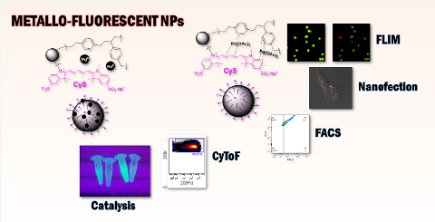
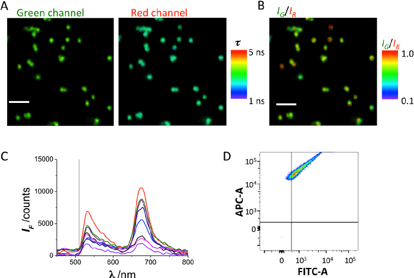
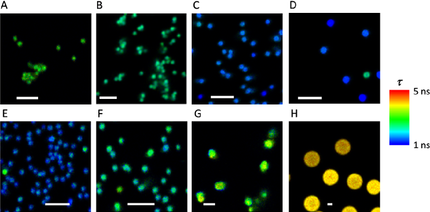
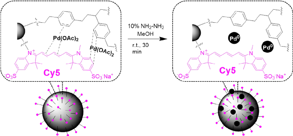
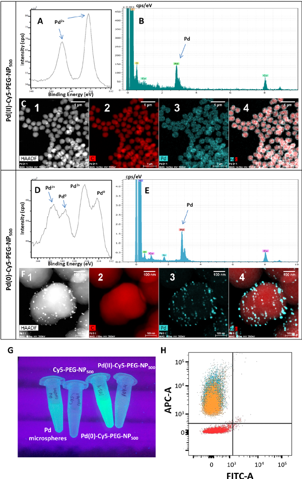
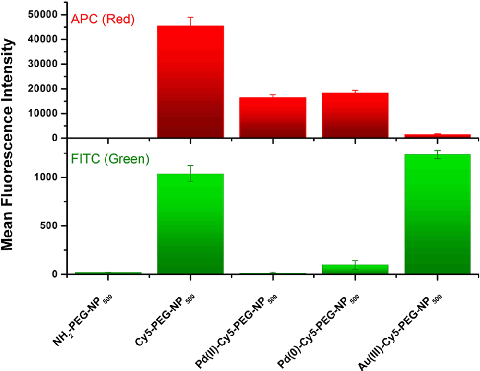
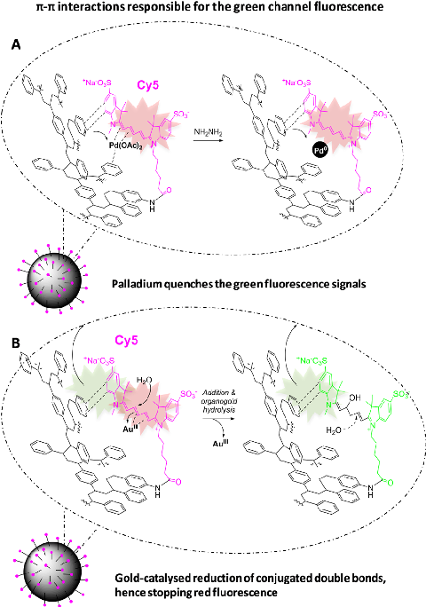
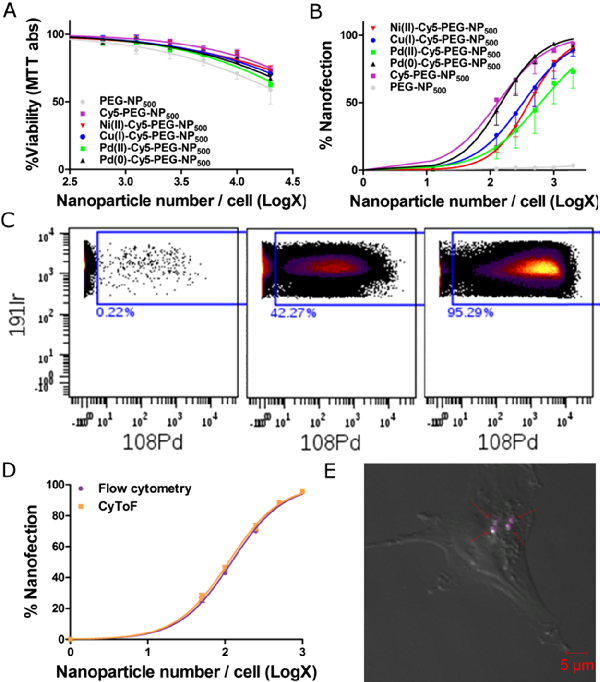

This is an open access article published under an ACS AuthorChoice License, which permits copying and redistribution of the article or any adaptations for non-commercial purposes.

Article

Cite This: ACS Omega 2018, 3, 144−153

## Metallofluorescent Nanoparticles for Multimodal Applications

Antonio Delgado-Gonzalez,†,‡ Emilio Garcia-Fernandez,§ Teresa Valero,†,‡,⊥ M. Victoria Cano-Cortes,‡ Maria J. Ruedas-Rama,§ Asier Unciti-Broceta,∥ Rosario M. Sanchez-Martin,†,‡ Juan J. Diaz-Mochon,*,†,‡ and Angel Orte*,§

†Department of Medicinal and Organic Chemistry, Faculty of Pharmacy, and §Department of Physical Chemistry, Faculty of Pharmacy, University of Granada, Campus Cartuja, 18071 Granada, Spain ‡GENYO, Pfizer-University of Granada-Junta de Andalucía Centre for Genomics and Oncological Research, Avda. Ilustracion 114. PTS, 18016 Granada, Spain ∥Cancer Research UK Edinburgh Centre, Institute of Genetics and Molecular Medicine, The University of Edinburgh, Crewe Road South, Edinburgh EH4 2XR, U.K.

See https://pubs.acs.org/sharingguidelines for options on how to legitimately share published articles.

*S Supporting Information

Downloaded via 87.221.74.178 on March 10, 2024 at 11:48:51 (UTC).

ABSTRACT: Herein, we describe the synthesis and application of cross-linked polystyrene-based dual-function nano- and microparticles containing both fluorescent tags and metals. Despite containing a single dye, these particles exhibit a characteristic dual-band fluorescence emission. Moreover, these particles can be combined with different metal ions to obtain hybrid metallofluorescent particles. We demonstrate that these particles are easily nanofected into living cells, allowing them to be used for effective fingerprinting in multimodal fluorescence-based and mass spectrometry-based flow cytometry experiments. Likewise, the in situ reductions of the metal ions enable other potential uses of the particles as heterogeneous catalysts.

# ■ INTRODUCTION

these conditions, fluorescence detection platforms based on NPs can achieve enhanced sensitivity, stability, and biological compatibility compared with other traditional approaches.2,7 For instance, very bright entities can be obtained by encapsulating organic fluorophores into particle matrices or by covalently attaching multiple fluorophores onto particles. Because particles can be decorated with thousands of units of a particular dye, issues such as photobleaching are minimized. This improves particle stability and facilitates intricate experiments, such as single-particle tracking.8

Recent advances in materials science and nanotechnology have actively fostered the development of smart nanomaterials capable of tackling key challenges in nanomedicine, including advanced diagnostics tools, imaging agents, and therapeutic modalities. The use of varied synthetic and surface chemistry approaches has enabled the rapid development of biocompatible particles comprising different materials, such as polymers, semiconductors, gold, magnetite, and carbon, among many others, for a variety of applications, for example, from biolabeling and sensing to targeted drug delivery.1−5 In this context, multimodal nanoparticles (NPs) can be rationally designed to carry out a myriad of different functions. These multimodal particles contain components that facilitate their use in different imaging techniques, such as fluorescence microscopy, magnetic resonance imaging, and positron emission tomography−computed tomography.5,6 Similarly, particles featuring imaging capabilities for diagnostics and the ability to carry therapeutic agents have expanded the field of theranostics.6

Additional applications of fluorescent NPs beyond live cell imaging include foreign gene expression at the single cell level (e.g., DNA-functionalized NPs) and fluorescence-based flow cytometry (e.g., fluorescence-activated cell sorting, FACS). To this end, the local nanofection of cells with targeted NPs enables the tracking and barcoding of cells in FACS experiments.9

Although these features make fluorescent NPs very attractive tools for cell biology, they still present a few drawbacks. One disadvantage is that the number of simultaneous parameters that can be studied in FACS experiments is frequently limited because of the spectral characteristics of the fluorescent dyes

Among a wide variety of imaging techniques available, fluorescence microscopy methods have become the tools of choice in most biological labs to study biomolecules and physiological processes at the intracellular level. These methods provide real-time, in situ, dynamic information of these processes in a simple and minimally invasive manner. Under

Received: December 13, 2017 Accepted: December 25, 2017 Published: January 5, 2018

© 2018 American Chemical Society 144 DOI:10.1021/acsomega.7b01984

Table 1. Design of Different Particles Prepared in This Work

entry particlea diameter/nm spacer dye additional components

- 1 NH2-PEG-NP500 500 PEG
- 2 Cy5-PEG-NP500 500 PEG Cy5
- 3 Cy5-PEG2-NP500 500 (PEG)2 Cy5
- 4 Cy5-PEG3-NP500 500 (PEG)3 Cy5
- 5 Fmoc-Lys(Cy5)-NP500 460 lysine Cy5
- 6 Fmoc-Lys(Cy5)-NP900 900 lysine Cy5
- 7 Strp-Lys(Cy5)-NP1200 1200 lysine Cy5 streptavidin
- 8 Pd(0)-Cy5-PEG-NP500 500 PEG Cy5 Pd(0)
- 9 Pd(II)-Cy5-PEG-NP500 500 PEG Cy5 Pd(II)

aAll NPs were covalently bound to their cargo through amide bonds. PEG = 1-amino-4,7,10-trioxa-13-tridecanamine succinamyl.

- Figure 1. (A) Dual-color FLIM images of Cy5-PEG-NP500 in the green and red emission channels. The pseudocolor scale indicates the average fluorescence lifetime of the emission in each pixel. The scale bar represents 2.5 μm. (B) IG/IR ratio image of the images shown in (A). The pseudocolor scale indicates the IG/IR value in each pixel. (C) Fluorescence emission spectra of different particles in the image. (D) FACS correlogram of detected fluorescence in the red (APC-A) and green (FITC-A) channels of Cy5-PEG-NP500 particles.

and the limited excitation and detection capabilities of available instruments. Another issue that has not been extensively studied is the physicochemical interactions between solidsupported fluorophores and polymeric chains of NPs. These interactions can lead to unique fluorescence profiles different than those of free fluorophores in solution, giving rise to unexpected cross-talk channel interactions.

simultaneously carry a well-established red fluorophore and metal ions for the multiplex tagging of live cells. These novel NPs can be used simultaneously in FACS and CyToF as a new and versatile method for cell barcoding.

# ■ RESULTSANDDISCUSSION

Fluorescent, Dual-Band-Emitting Particles. We synthesized cross-linked polystyrene nano- and microparticles (Figure S1 in the Supporting Information) conjugated with the sulfoCy5 dye (Table 1, entries 2 to 9, and Scheme S1), a member of the cyanine family, for use in fluorescence microscopy and flow cytometry applications. Remarkably, fluorescence analyses of the resulting NPs showed two distinctive emission bands under the same excitation wavelength: the characteristic red fluorescence emission band of the Cy5 dye and an unexpected band within the green range of the spectrum. The dual-band behavior of these particles was confirmed using different techniques: fluorescence confocal microscopy, dual-color fluorescence lifetime imaging microscopy (FLIM) with spectrographic capabilities (Figure S2), and FACS flow cytometry. FLIM images of Cy5-PEG-NP500 clearly showed fluorescence emission from the particles in both green and red channels

Recently, our capacity to perform complex multiplexing studies was expanded by combining flow cytometry with precise mass spectrometry detection using metal atoms as markers instead of fluorophores. This novel mass cytometry technique (termed cytometry by time of flight, CyToF) can simultaneously analyze up to 40 different cell parameters through the use of several metal atoms and isotopes.10,11 However, the manifestation of unexpected spectral properties resulting from interactions between the structural components of solid supports and conjugated dye units has not been comprehensively investigated.

We aimed to study fluorophore−polymer interactions to better understand unexpected fluorescence profiles found in Cy5-functionalized polystyrene NPs. This study allowed us to develop a new type of multimodal cell-penetrating NPs that

- Figure 2. FLIM images in the red emission channel of Cy5- and A647-loaded particles. The pseudocolor scale indicates the average fluorescence lifetime in each pixel. The scale bars represent 2.5 μm. (A) Cy5-PEG-NP500; (B) Cy5-PEG2-NP500; (C) Fmoc-Lys(Cy5)-NP900; (D) StrpLys(Cy5)-NP1200; (E) A647-PEG-NP500; (F) Fmoc-Lys(A647)-NP900; (G) Fmoc-Lys(A647)-NP2500; and (H) Fmoc-Lys(A647)-NP5000.

On the basis of these results, we first hypothesized that dye aggregation could account for the altered spectral features. Indeed, H- and J-aggregation of cyanine dyes are known to cause changes in their spectroscopic properties by altering their topological arrangements; furthermore, aggregation can be driven by high dye concentrations. Aggregation can also be fostered by certain templating structures. For example, H- and J-aggregates of cyanine dyes have been detected in the major and minor grooves of double-stranded DNA,12 in NPs,13 and in other structures. To test this hypothesis, we synthesized a set of Cy5-PEG-NP500 particles with different loadings of Cy5. The concentration of the N-hydroxysuccinimide (NHS) ester, the activated acid form of the dye in the reaction, ranged from 1.3 × 10−4 to 1.3 × 10−7 M. FACS experiments clearly showed that when the concentration of the dye in the reaction chamber was 1.3 × 10−6 M or lower, the emission in the green channel decreased to noise levels (Figure S5). The percentage of detected events showing notable green fluorescence decreased from 94% at the highest concentration of fluorophore to 5% at the lowest concentration. However, additional effects can be seen in the FACS results. A decrease in the concentration of the red dye by 1 order of magnitude caused a notable decrease in the red emission. However, the green emission did not decrease by the same factor and was more persistent. This effect resulted in an increased ratio of green fluorescence to red fluorescence at lower dye loadings. We further investigated this effect in dual-channel fluorescence confocal microscopy experiments. The results showed the same trend in the IG/IR ratio, that is, an increased ratio with decreased dye loading (Figure S6). Thus, the hypothesis of dye aggregation independently causing green emission was disproved. In such a case, a reduction of the green emission with respect to that of the red emission was expected as the dye concentration decreased. Therefore, we considered the possibility of an intermolecular interaction between the Cy5 moiety and the NP components. The close proximity of the cyanine dye aromatic rings and conjugated system (alternating double bonds) to the polystyrene aromatic groups was considered to promote π−π stacking interactions, causing a charge transfer that would result in the green emissive transition. Figure S7 in the Supporting Information shows the aromatic interactions that could cause the green fluorescence

when excited at 470 nm (Figure 1A). The ratio of fluorescence intensities between the green and red channels (IG/IR) was 0.5 ± 0.1, averaged over different images with several particles. We also reconstructed IG/IR images to identify particles exhibiting high green fluorescence (Figure 1B). Emission spectra obtained directly from some of the particles found in the image field of view also showed the dual-band behavior with two maxima, one centered at approximately 670 nm (characteristic of free Cy5) and a second band centered at approximately 530 nm (Figure

- 1C). These particles were also analyzed using an FACS instrument at excitations of 488 and 633 nm. Events (particles) were recorded in the red allophycocyanin (APC) and green fluorescein isothiocyanate (FITC) channels. Plotting these events in a fluorescence correlogram showed that the green and red channel events were proportionally correlated (Figure 1D). To confirm that the green fluorescence signal did not originate from other components of the particles, unlabeled particles,

that is, NH2-PEG-NP500, were prepared using the same protocol (except for the Cy5 conjugation). FLIM analysis showed no detectable fluorescence from the NPs, whereas FACS analysis showed events only in the random noise quadrant (Figure S3).

To expand the applicability of our particles, we substituted the polyethylene glycol (PEG) spacer with a lysine unit, which enabled the production of bivalent particles featuring a first arm that could be conjugated to other polypeptides or proteins, such as streptavidin through its Nα amino group, and a second arm that could be conjugated to sulfo-Cy5 dyes through its Nε amino group. Thus, in these particles, that is, Fmoc-Lys(Cy5)NP500, Fmoc-Lys(Cy5)-NP900, and Strp-Lys(Cy5)-NP1200, the Cy5 units were conjugated to the lysine side chains without PEG spacers (Schemes S2 and S3). These particles also exhibited the dual-band green/red emission behavior (Figure S4), thereby confirming that PEG molecules were not involved in the generation of the green fluorescent band. Notably, this effect was less prominent for larger particles. This can be attributed to the lower density of the polymer network in the larger particles, which minimized the interactions that cause the green fluorescence. Therefore, particle size is an important factor in controlling the dual-band emission of Cy5-labeled particles.

Scheme 1. Reduction Reaction To Prepare Pd(0)-Cy5-PEG-NP500

We then investigated whether the unexpected green fluorescence emission observed was specific to the Cy5 dye. We synthesized particles according to the same protocol (see the Supporting Information and Scheme S4), except that the Cy5 dye was substituted with another red fluorophore, Atto 647N (A647). A647 is spectrally equivalent to Cy5 (Figure S8) but has a different chemical structure. Cy5 is a carbocyanine dye, whereas A647 is a carbopyronin dye.16 Dual-channel FLIM and FACS studies of A647-loaded NPs showed negligible green fluorescence emission (Figure S9), exhibiting IG/IR values generally below 0.1 (Figure S10). Similar to previous experiments, we prepared particles using different loadings of the A647 dye. FACS measurements showed that the number of events exhibiting green fluorescence was always lower than 10% (Figure S11). Thus, we confirmed that the unexpected green fluorescence and the dual-band behavior of the particles were specific effects of the chemical structure of the Cy5 dye and likely due to stacking interactions between the dye and the aromatic-rich network of the particle (Figure S7). Moreover, we confirmed that this effect was not related to any factor in the synthesis of the conjugates.

emission. Additional insights into this model is described in the next section.

An additional effect that may be behind the different trends in the relative emissions in the green and the red spectral regions is the presence of fluorescence resonance energy transfer (FRET) from the green emission emitters (i.e., the donors) to the red dyes (i.e., the acceptors; Figure S7). The FRET process would result in a lower green fluorescence when high loadings of the acceptor Cy5 dye are present. This energy transfer explains why a decrease in the number of acceptors resulted in an apparent increase in green emission. Experimental proof for the presence of FRET was obtained by investigating the average fluorescence lifetime, τ, profiles of the red-emitting dyes in the particles using FLIM microscopy. To test the potential energy transfer from green emission emitters to the red dyes, we employed a 470 nm excitation laser and collected FLIM images in the red channel (Figure S2). For small particles carrying Cy5 with short linkers, such as Cy5PEG-NP500 (Figure 1A) and Cy5-PEG2-NP500, the Cy5 τ value was surprisingly longer than that of the dye in solution (1.0 ns).14 For Cy5-PEG-NP500, the average τ value was 2.3 ns, and for Cy5-PEG2-NP500, it was 1.9 ns (Figure 2A,B, respectively). This enhancement in the fluorescence lifetime correlated with the appearance of the green fluorescence emission. Interestingly, as the linker was lengthened, the fluorescence lifetime decreased. Similarly, for larger particles, the green emission was considerably reduced, and the fluorescence lifetime of Cy5 approached that of the dye in solution. For example, the average τ values of Cy5 in Fmoc-Lys(Cy5)-NP900 and StrpLys(Cy5)-NP1200 were 1.4 and 1.2 ns, respectively (Figure

FLIM imaging also showed opposite behaviors in the Cy5and A647-loaded particles. The fluorescence lifetime τ of the A647 dye in the NPs remarkably varied from one particle to another but followed a different trend. In small particles (A647PEG-NP500), the average τ value was 1.3 ns (Figure 2E), which was much shorter than the reported value of τ of the dye in solution (3.5 ns),17 providing evidence for a quenching process. In large particles carrying polypeptide chains, the A647 lifetime indicated a quenching behavior; the quenching effect reduced as the size of the particles increased. The average τ value was 1.8 ns in Fmoc-Lys(A647)-NP900 (Figure 2F) and 2.8 ns in Fmoc-Lys(A647)-NP2500 (Figure 2G). For Fmoc-Lys(A647)NP5000 (Figure 2H), the average lifetime of the dye of 3.7 ns was close to that of the free dye in solution. This quenching effect was likely related to a homo-FRET process between different moieties of the dye on the NPs that were brought close together. The homomolecular energy transfer was facilitated by the spectral overlap between the emission and absorption of the dye (Figure S8). As the interdye distance lengthened due to increased particle area, the homo-FRET quenching was reduced. This showed the valuable information that FLIM provides to probe the environment of the dyes used in fluorescence microscopy.18

- 2C,D), similar to those of the dye in solution. This behavior was primarily due to the energy transfer from the greenemitting donors to the Cy5 red fluorophores, acting as acceptors. Indeed, spectral analyses showed a clear overlap between the green emission of the aggregates in the absorption region of free Cy5 (Figures 1 and S8). This overlap may have fostered FRET between the two fluorescent forms. FRET resulted in an increased fluorescence lifetime of the acceptor dye, that is, Cy5, because the excitation source of the dye was not a direct laser pulse but the donor species. Thus, the fluorescence decay of the acceptor was a convolution of its natural decay law with that of the donor.15 Therefore, when the acceptor was at larger distances or when there was a lower surface loading of the acceptor in large particles, the FRET process was impeded, and the dye fluorescence value returned to its unaffected state.

Metallofluorescent Particles for Flow Cytometry and Catalysis. The next step was to construct metallofluorescent particles to produce multimodal particles for fingerprinting in

- Figure 3. (A−C) XPS and EDX−HRTEM analysis of Pd(II)-Cy5-PEG-NP500 particles. (D−F) XPS and EDX−HRTEM analyses of Pd(0)-Cy5PEG-NP500 particles. (A,D) XPS high-resolution spectra for Pd. (B,E) EDX analyses showing the presence of Pd in Pd(II)-Cy5-PEG-NP500 and Pd(0)-Cy5-PEG-NP500. (C,F) EDX−HRTEM composite: high-angle annular dark field (HAADF) (1), carbon (2), palladium (3), and the stacked

image palladium−carbon (4). (G) Evidence of the Pd(0)-catalytic activity of Pd(0)-Cy5-PEG-NP500 particles from the fluorogenic reaction consisting of the removal of allyloxycarbonyl groups. The fluorogenic emission is compared with a control using Pd microspheres as a catalyst. Cy5-

PEG-NP500 and Pd(II)-Cy5-PEG-NP500 particles are not capable of catalyzing the reaction. (H) FACS counting of Pd(II)-Cy5-PEG-NP500 (cyan), Pd(0)-Cy5-PEG-NP500 (orange), and blank control NH2-PEG-NP500 (red) particles.

the Pd2+ ions to Pd(0) via hydrazine treatment (Schemes 1 and S6)20 was employed to obtain Pd(0)-Cy5-PEG-NP500.

fluorescence-based and mass spectrometry-based approaches. Palladium polystyrene NPs have been previously prepared by coordinating palladium ions with free amino groups and aromatic rings of polymer networks.19 Herein, we exploited the conjugated polymethine chain of the Cy5 dye to create, with the polystyrene aromatic rings, an electron-rich network to coordinate metal ions. Cy5-PEG-NP500 was mixed with Pd(OAc)2, and after 24 h of incubation, excess metal ions were washed away, leaving only metal ions that had been effectively coordinated with the particles, thereby yielding Pd(II)-Cy5-PEG-NP500 (Scheme S5). An in situ reduction of

The metallofluorescent NPs were then analyzed by energydispersive X-ray spectroscopy and high-resolution transmission electron microscopy (EDX−HRTEM) (Figures 3, S13, and S14). Both sets of particles, Pd(II)-Cy5-PEG-NP500 and Pd(0)-Cy5-PEG-NP500, clearly presented Pd(II) and Pd(0), respectively, in the structure. The presence of the metal was evident when compared with the EDX−HRTEM results of the control Cy5-PEG-NP500 particles (Figure S12). An additional test to prove the effective reduction of Pd(II) to Pd(0) within

the NPs was performed by probing the catalytic activity of these particles, using a well-known reaction catalyzed by Pd(0), that is, removing allyloxycarbonyl protecting groups.20,21 We used a fluorogenic version of this reaction, wherein the nonfluorescent bis-allyloxycarbonyl rhodamine was transformed into fluorescent rhodamine 110 once the protecting groups were removed (Scheme S9). The Pd(0)-Cy5-PEG-NP500 particles were capable of catalyzing the fluorogenic reaction (Figure 3G) to an even larger extent than the Pd microspheres used as controls.20 This improved catalytic activity can be explained by the fact that Pd(0) nanoclusters were found within the NPs (Figures 3F and S14), thereby exhibiting a larger specific area than the Pd(0) microspheres. By contrast, Pd(II)-Cy5-PEGNP500 and Cy5-PEG-NP500, that is, particles carrying the Pd2+ cation and particles not carrying any metal at all, respectively, were not capable of facilitating the removal of the allyloxycarbonyl groups.

As another control, H2N-NP500 and Ac-HN-NP500 (Table S1 and Schemes S7 and S8) were used to confirm if the electronrich polymethine chain played a role in coordinating Pd ions. The H2N-NP500 and Ac-HN-NP500 particles possessed glycine spacers, but the former presented an electron-rich environment due to the free amino groups, whereas the latter presented aromatic rings as electron-rich groups because they contained amide groups rather than free amines. These particles were treated with Pd(OAc)2, following the same protocol as that described for fabricating Pd(II)-Cy5-PEG-NP500 and Pd(0)Cy5-PEG-NP500. All sets of particles, with and without Cy5, were characterized by X-ray photoelectron spectroscopy (XPS)

- Figure 4. APC (red) and FITC (green) channels mean fluorescence intensities from FACS experiments of NH2-PEG-NP500, Cy5-PEGNP500, Pd(II)-Cy5-PEG-NP500, Pd(0)-Cy5-PEG-NP500, and NPs incubated with HAuC4·3H2O [Au(III)-Cy5-PEG-NP500].

- Figure 5. π−π interactions taking place within polystyrene and Cy5.

- (Figure S15). The XPS spectra showed that Ac-HN-NP500 contained lower levels of Pd(II) and traces of Pd(0), whereas the treated H2N-NP500 contained similar levels of Pd(II) and Pd(0) compared with Pd(II)-Cy5-PEG-NP500 (Figures 3A and

S15) and Pd(0)-Cy5-PEG-NP500 (Figures 3D and S15), respectively. This indicated that polystyrene rings were not sufficient to strongly coordinate Pd ions and require additional electron-rich functional groups to enhance coordination of Pd species to NPs. Polymethine groups of the Cy5 dye coupled to polystyrene NPs offered an optimal environment to coordinate metals such as Pd.

Interestingly, the coordination of Pd2+ ions in the electronrich network of the conjugated double bonds of the cyanine dye and the polystyrene rings was found to have an effect on the green fluorescence emission caused by the direct interaction between these moieties of the NPs. Indeed, FACS experiments showed that the green fluorescence emission was completely removed upon coordination of Pd2+ ions (Figures 3H and 4), supporting the proposed model for the π−π-stacking interaction causing the green emission (Figure S7) and the model for the coordination of Pd2+ (Figure 5A). Moreover, the reduction of Pd2+ to Pd(0) in the Pd(0)-Cy5-PEG-NP500 particles did not considerably change the fluorescent properties of the particle (Figures 3H and 4), confirming that the reduction did not alter the spatial arrangement of the metal (Figure 5A). Two others metal ions, Ni2+ and Cu+, were also used to produce more metallofluorescent NPs following the same approach. A dim quenching effect of the Cy5 fluorescence in the red channel was observed by FACS for all metal particles

- (Figure S16). Most importantly, the presence of these metal ions caused the fluorescence emission in the green channel to mostly disappear when analyzed by FACS, suggesting a similar coordination mechanism as that of Pd2+ ions.

(A) Pd(OAc)2 and Pd(0) particles hinder the π−π interactions. (B) Gold catalyzes the reduction of Cy5-conjugated double bonds.

To provide further insights into the role of the polymethine chain in the interactions behind the manifestation of green fluorescence from red-emitting dyes, we studied whether the interruption of the electronic conjugation of the system could affect the fluorescent properties of the NPs. To this end, we

Figure 6. (A) Cellular viability (MTT assay) of MDA-MB-231 cells nanofected for 6 days with metallofluorescent NPs expressed as a percentage of the control nonnanofected cells. Data are reported as the mean ± SEM of four independent experiments conducted in triplicate. (B) Analysis of metallofluorescent NP cellular uptake by MDA-MB-231 cells at different ratios per cell measured using flow cytometry. Data are reported as the mean ± SEM of four independent experiments. (C) Representative CyToF scatterplots of the Pd(0)-Cy5-PEG-NP500 uptake percentage as the number of NPs increases (0, 100, and 1000 NPs/cell). 191Ir was used for nuclei staining. (D) Comparison of Pd(0)-Cy5-PEG-NP500 uptake curves in the same cells using flow cytometry and CyToF. Data are reported as the mean ± SEM of four independent experiments. Two-way ANOVA analysis followed by Bonferroni post hoc test showed no differences between techniques. (E) Confocal microscopy image of a representative nanofected cell at a ratio of 3000 Pd(0)-Cy5-PEG-NP500/cell. Arrows point to single NPs in the cell cytoplasm.

tested the effect of gold ions (HAuCl4·3H2O) over the Cy5 fluorophore. Au(III) ions are capable of catalyzing addition reactions to alkenes.22 We found that Au(III) ions catalyzed the breakage of the polymethine chain conjugation in Cy5, as evidenced by an immediate color loss from blue to transparent, when Au(III) was added to an aqueous solution of the dye. This color loss was supported by the total disappearance of the typical Cy5 absorption spectrum, after treatment with Au(III)

polymethine chain (Figure 5B). With these experiments, we clearly identified the source of the double-band fluorescence emission behavior in Cy5-loaded NPs.

We previously reported the versatility of cross-linked polystyrene-based nano-/microparticles for the nanofection of a plethora of cell lines and primary cultures.9,20,23 To prove the feasibility of using these novel metallofluorescent NPs to nanofect mammalian cells in live cell cultures, breast cancer cell line MDA-MB-231 was used. Cells were incubated with these particles for up to 6 days before measuring cell viability. Cells nanofected with metallofluorescent particles presented viability similar to those nanofected with the control, NH2-PEG-NP500, even at high NP loadings (Figure 6A). This indicated that the metal ions did not leach out in the cells. The efficient uptake of the metallofluorescent NPs was also confirmed by FACS analysis. As shown in Figure 6B, a greater number of NPs employed during nanofection resulted in a higher percentage of cells containing the metallofluorescent NPs. The multiplicity of nanofection 50 (MNF50) values24 of the different metallofluorescent particles was the same order of magnitude as that of the control Cy5-PEG-NP500 (Figure 6B).

- (Figure S17). With these properties in mind, we treated Cy5-

PEG-NP500 particles with HAuCl4·3H2O. Following treatment, NPs were washed and analyzed by FACS and XPS. Remarkably, the FACS analysis showed the disappearance of the red fluorescence signal, whereas the green fluorescence signal remained unmodified compared with untreated Cy5-PEGNP500 (Figure 4). XPS analyses of these particles showed traces of gold. This indicated that the disappearance of red fluorescence was not due to metal quenching but due to gold catalyzing addition reactions to the conjugated double bonds of the Cy5 dye, thereby breaking the electronic conjugation of the polymethine chain (Figure 5B). However, green fluorescence signals were unaltered, suggesting that this signal comes from aromatic interactions between the heterocyclic moieties of the dye and polystyrene chains without intervention from the

To validate the multimodal applications of the metallofluorescent NPs and confirm that these particles transported

developed in this work can be found in the Supporting Information (Schemes S1−S8).

metals into cells, Pd(0)-Cy5-PEG-NP500 was used at different concentrations. MDA-MB-231 cells were incubated with

General Method for Metallofluorescent Particle Loading. All chemical reactions were performed over dried NPs. When the reactions were finished, the NPs were washed three times using suspension−centrifugation cycles. The 500, 900, and 1200 nm aminomethyl cross-linked polystyrene NPs were functionalized with chemical spacers, such as Fmocprotected PEG and Fmoc-lysine-Dde(OH), using oxyma and N,N′-diisopropylcarbodiimide (DIC), at 60 °C for 2 h. Subsequent Fmoc and Dde removal was performed using a 20% piperidine solution in dimethylformamide (DMF) and using a mixture of hydroxylamine hydrochloride/imidazole in N-methyl-2-pyrrolidone/DMF.25 The fluorophore conjugation step was carried out using a sulfo-Cy5 NHS ester solution in DMF with N,N-diisopropylethylamine at room temperature for 14 h. Afterward, the fluorescent NPs were mixed with a palladium diacetate (Pd(OAc)2) solution in DMF and were stirred at room temperature for 14 h. To generate the in situ reduction of Pd2+ into Pd0, the Pd2+ metallofluorescent NPs were mixed with a 10% hydrazine solution in methanol at room temperature for 30 min.20,21 Finally, to obtain streptavidinconjugated NPs, the fluorescent NPs were functionalized with a 25% glutaraldehyde solution in H2O and a streptavidin solution in phosphate buffer saline (PBS), at room temperature for 14 h. Subsequently, the NPs were mixed with a NaBH3CN solution in PBS/EtOH (3:1) and washed with ethanolamine in bovine serum albumin solution in PBS.

Pd(0)-Cy5-PEG-NP500, split into two aliquots, and analyzed using flow cytometry and CyToF. For cells analyzed using CyToF, a DNA marker labeled with iridium was used to record instances, when both iridium (cell nuclei marker) and palladium (present in NPs) were present in the nanofected cells as a positive event (Figures 6C and S18). CyToF dot plots confirmed that cells were nanofected with particles carrying Pd(0) without any evident toxic effects. Moreover, a comparison of the percentages of nanofected cells (Figure 6D) showed no differences between the values from flow cytometry detection and those from CyToF detection. These results confirmed that Pd(0)-Cy5-PEG-NP500 was a suitable dual marker for flow cytometry and CyToF in living cells and did not negatively affect the cell growth. Moreover, an NP size of 500 nm guaranteed cellular uptake and the complete burning and ionization of the beads in the inductively coupled plasma (ICP) torch for CyToF. As shown in Figures 6E and S19, these particles were detectable by confocal microscopy, enabling localization or colocalization studies and the direct counting of NPs in a cell (Figure S20). The practical combination of redemitting particles with different metals served to provide different fingerprinting options for CyToF applications, facilitating cell barcoding for cell-based multiplexing assays.

# ■ CONCLUSIONS

Fluorescence Lifetime Imaging Microscopy (FLIM) and Spectroscopy. A MicroTime 200 (PicoQuant GmbH, Germany) was used to collect FLIM images in two different detection channels, green and red, after a 470 nm pulsed excitation. The system was equipped with an Andor Shamrock 303i-A spectrograph and an ultrasensitive Andor Newton electron multiplying CCD camera to simultaneously collect the entire fluorescence emission spectrum from different points of the images. Further instrumental details can be found in the Supporting Information and Figure S2.

The synthesis and characterization of multimodal particles featuring fluorophores and metals were reported. We validated the use of these particles as cell trackers detectable by fluorescence microscopy, CyToF, and FACS. The Cy5-labeled particles presented characteristic dual-band emission, in which the fluorescence originated exclusively from a single dye in two different states. This characteristic emission profile may be considered a fingerprint of our particles for FACS and fluorescence microscopy experiments. The particles carrying both Cy5 and metal cations enabled multiplex fingerprinting and cell barcoding using tandem FACS and CyToF. Finally, the possibility of reducing Pd2+ ions to Pd(0) in situ provides new possibilities for multimodal particles, such as carrying a red fluorophore for fluorescence applications while acting as in situ catalysts for Pd chemistry.

Confocal Fluorescence Microscopy. A Leica DMi8 confocal microscope was used for dual-color fluorescence imaging, equipped with a Lumencore solid-state white light source, a PL Apo CS2 oil immersion objective (63×, 1.4 NA), and an Andor Zyla CSMOS camera for imaging. The green channel was collected with a 480/40 nm excitation bandpass filter, a 505 nm dichroic mirror, and a 527/30 nm emission bandpass filter, whereas the red channel was obtained using a 620/60 nm bandpass filter for the excitation, a 660 nm dichroic mirror, and a 700/75 nm bandpass emission filter.

# ■ EXPERIMENTALSECTION

Multimodal, Red-Emitting Particles and Metallofluorescent NPs. We prepared an extensive series of modified particles, including red-emitting fluorophores, such as sulfo-Cy5 or A647. The fluorophores were attached to the particles via PEG spacers of different lengths or via spacers suitable for secondary modifications, including those featuring either Fmocprotected amino acids or streptavidin. Additionally, different metallofluorescent particles containing the red fluorophore sulfo-Cy5 and different metal isotopes were prepared by exploiting the chelating properties of π bonds in the dye and PEG units to the metals. Tables 1 and S1 summarize the nomenclature and design of the particles prepared in this work. The initial 500, 900, and 1200 nm aminomethyl cross-linked polystyrene NPs (Figure S1) were synthesized according to our established protocols.9 Then, different reactions allowed the incorporation of the fluorescent dyes and other modifications. Further details on the synthetic steps of all particle structures

Fluorescence-Activated Cell Sorting (FACS). The fluorescence emission of the particles carrying red dyes (either Cy5 or A647) was assessed using flow cytometry analysis with BD FACSCanto II (Becton Dickinson & Co., NJ, USA) equipped with a solid-state Coherent Sapphire blue laser refrigerated by air (488 nm and 20 mW power), a JDS uniphase HeNe red laser (633 nm and 17 mW), and eight detectors (six fluorescence detectors and two morphologic parameters). The red emission fluorescence was detected in the APC channel (660/20 nm). Unexpected “green emission” was measured using the FITC channel (530/30 nm).

Mass Cytometry. Mass cytometry analysis was performed using Helios CyTOF2 (DVS Sciences, Fluidigm Co., CA, USA). This instrument used an ICP time-of-flight mass spectrometer to detect a mass range of 75−209 amu in 135

# ■ ACKNOWLEDGMENTS

different channels at an average event rate of 500 events/s, a highest rate of 2000 events/s, and a sensitivity of 0.3% for 159Tb.

This work was funded by the Consejeria de Economia, Innovacion, Ciencia y Empleo (Junta de Andalucia, grant BIO-1778), the Spanish Ministry of Economy and Competitiveness (grants BIO2016-80519-R and CTQ2014-56370-R) and the Fundacioń Ramoń Areces. A.D.-G. acknowledges scholarships from the Spanish Ministry of Education (grant FPU14/02181) and the University of Granada, PhD programme in Biomedicine. T.V. thanks the Talentia Postdoc Fellowship Programme (grant 267226, co-funded by the Andalusian Knowledge Agency and the 7th Framework Program of the European Union). A.U.-B. is grateful to the EPSRC (EP/N021134/1) for funding. The authors thank the staff at the microscopy facility of the Centre for Integrative Biology (CIBIO) of the University of Trento (Italy), the staff at the electron microscopy facilities of the Centre for Scientific Instrumentation (CIC) of the University of Granada, and the staff at the Flow Cytometry unit at the Pfizer-University of Granada-Junta de Andalucia Centre for Genomics and Oncological Research (GENYO).

X-ray Photoelectron Spectroscopy. The presence of palladium was determined by monitoring the profile of Pd 3d photoemission. XPS spectra were obtained using a Kratos Axis Ultra-DLD X-ray photoelectron spectrometer equipped with an Al monochromatic X-ray source, over powdered nanoparticle samples. General spectra were obtained with a pass energy of 160 eV, the X-ray source was operated at 75 W, the highresolution spectra were obtained with a pass energy of 20 eV, and the X-ray source was operated at 225 W.

High-Resolution Transmission Electron Microscopy (HRTEM) and Energy-Dispersive X-ray (EDX) Analyses. Transmission electron microscopy experiments were carried out using an ultrahigh-resolution FEI Titan G2 microscope with an XFEG field emission gun operating at 300 kV. The microscope was fitted with a high-angle annular dark field (HAADF) detector to operate in scanning transmission electron microscopy (STEM) mode and with an FEI microanalysis system for EDX. The microscope reached maximum resolutions of 0.8 Å in the TEM mode and 2 Å in the STEM mode. To analyze samples, the NPs were suspended in absolute ethanol and supported on ultra-thin carbon 200 mesh Cu grids.

# ■ REFERENCES

- (1) Freeman, R.; Willner, I. Chem. Soc. Rev. 2012, 41, 4067−4085.
- (2) Ruedas-Rama, M. J.; Walters, J. D.; Orte, A.; Hall, E. A. H. Anal.

Chim. Acta 2012, 751, 1−23.

- (3) Yeh, Y.-C.; Creran, B.; Rotello, V. M. Nanoscale 2012, 4, 1871−

1880.

- (4) Blanco, E.; Shen, H.; Ferrari, M. Nat. Biotechnol. 2015, 33, 941−

951.

- (5) Chen, G.; Roy, I.; Yang, C.; Prasad, P. N. Chem. Rev. 2016, 116,

2826−2885.

- (6) Lee, D.-E.; Koo, H.; Sun, I.-C.; Ryu, J. H.; Kim, K.; Kwon, I. C.

Chem. Soc. Rev. 2012, 41, 2656−2672.

- (7) Goesmann, H.; Feldmann, C. Angew. Chem., Int. Ed. 2010, 49,

1362−1395.

- (8) Kusumi, A.; Tsunoyama, T. A.; Hirosawa, K. M.; Kasai, R. S.;

Fujiwara, T. K. Nat. Chem. Biol. 2014, 10, 524−532.

- (9) Sanchez-Martin, R. M.; Muzerelle, M.; Chitkul, N.; How, S. E.;

Mittoo, S.; Bradley, M. ChemBioChem 2005, 6, 1341−1345.

- (10) Tanner, S. D.; Baranov, V. I.; Ornatsky, O. I.; Bandura, D. R.;

George, T. C. Cancer Immunol. Immunother. 2013, 62, 955−965.

- (11) Spitzer, M. H.; Nolan, G. P. Cell 2016, 165, 780−791.
- (12) Armitage, B. A. Top. Curr. Chem. 2005, 253, 55−76.
- (13) Lim, I.-I. S.; Goroleski, F.; Mott, D.; Kariuki, N.; Ip, W.; Luo, J.;

Zhong, C.-J. J. Phys. Chem. B 2006, 110, 6673−6682.

- (14) Buschmann, V.; Weston, K. D.; Sauer, M. Bioconjugate Chem.

2003, 14, 195−204.

- (15) Zhao, M.; Huang, R.; Peng, L. Opt. Express 2012, 20, 26806−

26827.

- (16) Stennett, E. M. S.; Ciuba, M. A.; Levitus, M. Chem. Soc. Rev.

2014, 43, 1057−1075.

- (17) ATTO 647N Product Datasheet. http://www.atto-tec.com

(accessed March 2017).

- (18) Ruedas-Rama, M.; Alvarez-Pez, J.; Crovetto, L.; Paredes, J.;

# ■ ASSOCIATEDCONTENT

*S Supporting Information

The Supporting Information is available free of charge on the ACS Publications website at DOI: 10.1021/acsomega.7b01984.

Table of synthesized particles; experimental details on the synthesis and loading of polystyrene NPs, metallofluorescent NPs, and glycine and capped glycine NPs, fluorescence lifetime imaging microscopy (FLIM) and spectroscopy, additional results of Cy5-carrying NPs, scheme of stacking interactions causing green fluorescence and FRET, additional results of Atto 647Ncarrying NPs, fluorogenic reaction catalyzed by Pd(0), additional results of metallofluorescent NPs, Au(III) ions catalyze the breakage of the polymethine chain of Cy5, and live cell metallofluorescent particle uptake (PDF)

# ■ AUTHORINFORMATION

Corresponding Authors

- *E-mail: juandiaz@ugr.es (J.J.D.-M.).
- *E-mail: angelort@ugr.es. Phone: (+34) 958243825 (A.O.). ORCID Maria J. Ruedas-Rama: 0000-0003-0853-187X Asier Unciti-Broceta: 0000-0003-1029-2855 Angel Orte: 0000-0003-1905-4183 Present Address ⊥School of Pharmacy, University of Bradford, Bradford, West Yorkshire, BD7 1DP, United Kingdom (T.V.). Author Contributions The manuscript was written through contributions of all authors. All authors have given approval to the final version of the manuscript. Notes The authors declare no competing financial interest.

Orte, A. Advanced Photon Counting; Kapusta, P., Wahl, M., Erdmann, R., Eds.; Springer International Publishing, 2015; pp 191−223.

- (19) Weiss, J. T.; Dawson, J. C.; Fraser, C.; Rybski, W.; Torres-

Sanchez,́ C.; Bradley, M.; Patton, E. E.; Carragher, N. O.; UncitiBroceta, A. J. Med. Chem. 2014, 57, 5395−5404.

- (20) Unciti-Broceta, A.; Johansson, E. M. V.; Yusop, R. M.; Sanchez-́

Martín, R. M.; Bradley, M. Nat. Protoc. 2012, 7, 1207−1218.

- (21) Yusop, R. M.; Unciti-Broceta, A.; Johansson, E. M. V.; Sanchez-́

Martín, R. M.; Bradley, M. Nat. Chem. 2011, 3, 239−243.

- (22) Rezsnyak, C. E.; Autschbach, J.; Atwood, J. D.; Moncho, S. J.

Coord. Chem. 2013, 66, 1153−1165.

- (23) Unciti-Broceta, A.; Díaz-Mochon,́ J. J.; Sanchez-Martín,́ R. M.;

Bradley, M. Acc. Chem. Res. 2012, 45, 1140−1152.

- (24) Unciti-Broceta, J. D.; Cano-Cortes,́ V.; Altea-Manzano, P.;

Pernagallo, S.; Díaz-Mochon,́ J. J.; Sanchez-Martín,́ R. M. Sci. Rep. 2015, 5, 10091.

- (25) Díaz-Mochon,́ J. J.; Bialy, L.; Bradley, M. Org. Lett. 2004, 6,

1127−1129.

