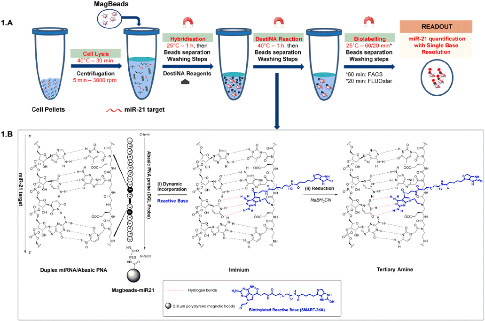
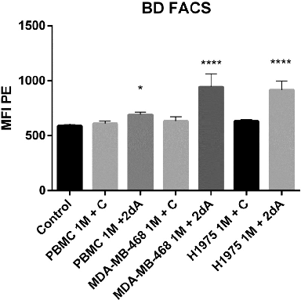
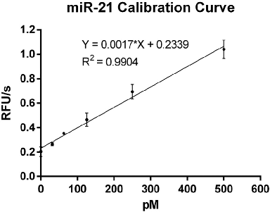
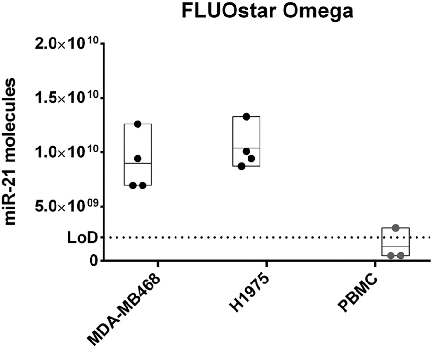

Talanta 200 (2019) 51–56

Contents lists available at ScienceDirect

# Talanta

journal homepage: www.elsevier.com/locate/talanta

## PCR-free and chemistry-based technology for miR-21 rapid detection directly from tumour cells

### T

Antonio Delgado-Gonzaleza,b, Agustin Robles-Remachoa,b, Antonio Marin-Romeroa,b,c, Simone Detassisd, Barbara Lopez-Longarelac, F. Javier Lopez-Delgadoc, Diego de Miguel-Pereza,e, Juan J. Guardia-Monteagudoc, Mario Antonio Farac, Mavys Tabraue-Chavezc, Salvatore Pernagalloc, Rosario M. Sanchez-Martina,b, Juan J. Diaz-Mochona,b,⁎

- a Pfizer/Universidad de Granada/Junta de Andalucia Centre for Genomics and Oncological Research (GenYo), PTS Granada, Avenida de la Ilustracion, 114, 18016 Granada, Spain
- b Department of Medicinal and Organic Chemistry, Faculty of Pharmacy, University of Granada – Campus Cartuja, 18071 Granada, Spain
- c DestiNA Genomica S.L. PTS Granada, Avenida de la Innovación 1, Edificio BIC, 18100 Armilla, Granada, Spain
- d Laboratory of RNA Biology and Biotechnology, Centre for Integrative Biology, University of Trento, Trento, Italy
- e Department of Legal Medicine, Toxicology and Physical Antropology, Faculty of Medicine, University of Granada, Avenida de la Investigación 11, 18016 Granada, Spain

##### A R T I C L E I N F O

A B S T R A C T

miRNAs are well known for being implicated in a myriad of biological situations, including those related to serious diseases. Amongst miRNAs, miRNA-21 has the spotlight as it is reported to be up-regulated in multiple severe pathological conditions, being its quantification a key point in medicine. To date, most of the techniques for miRNA quantification have shown to be less effective than expected; thus, we herein present a novel, rapid, cost-effective, robust and PCR-free approach, based on dynamic chemistry, for the identification and quantification of miRNA directly from tumour cells using both FACS and a fluorescent microplate. This dynamic chemistry novel application involves bead based reagents and allows quantifying the number of miR-21 molecules presented in MDA-MB-468 and H1975 tumour cells.

Keywords: Dynamic chemistry Peptide nucleic acid (PNA) Nucleic acid testing (NAT) MiRNA quantification Flow Cytometry (FACS) Fluorescence Microplate

#### 1. Introduction

MicroRNAs (miRNAs) are small non-coding RNAs of 18–24 nucleotides in length that regulate gene expression by directly interacting with the 3′ untranslated region (UTR) of a target gene. This interaction leads to degradation and/or translational repression of that gene [1–4]. miRNAs are implicated in the regulation of cell growth, differentiation, and apoptosis (and their deregulation is associated with multiple serious diseases [4].

Since the discovery of miRNAs, miR-21 has become one of the most studied and cited miRNAs, as it has been reported to be up-regulated in a lot of pathological conditions, such as glioblastoma, pancreatic cancer, breast cancer, lung cancer, and colon cancer. Besides, miR-21 up-regulation is directly related to cell proliferation, migration and invasion, and to the generation of chemoresistance in lung cancer [5], in breast cancer [5] and in ovarian cancer [6]. For that, it is considered an OncomiR [7]. Thus, miR-21 has emerged as one of the miRNA most frequently associated with poor outcome in cancer, being considered as

a very promising therapeutic target for cancer [8,9]. As a matter of fact, CRISPR/CAS9 based gene therapies targeting miR-21 are being developed nowadays [6,7].

To date, miRNA analysis is mostly done by standard RT-qPCR. However, these tools are not particularly suitable for detecting small RNA species, since they require elongation of the target molecules (ligation step with an extension sequence), conversion of the target molecule into cDNA, as well as amplification steps. There are other approaches which are based on just a hybridisation step between targets and capture probes which tend to be long and increase the probability of obtaining false positives [10]. Therefore, the rapid and cost-effective detection and quantification of miRNAs, which will represent a huge advance and amelioration in diagnosis as it provides a high valuable knowledge to physicians, is still an unmet need. Real-time monitoring of miRNAs will become a key tool in personalised medicine [11].

An alternative approach for nucleic acid testing by dynamic chemistry (also known as Chem-NAT), which harnesses Watson-Crick base pairing to template a dynamic reaction on a strand of abasic peptide

⁎ Corresponding author. E-mail address: juanjose.diaz@genyo.es (J.J. Diaz-Mochon).

https://doi.org/10.1016/j.talanta.2019.03.039 Received 6 December 2018; Received in revised form 5 March 2019; Accepted 7 March 2019

Available online 08 March 2019 0039-9140/ © 2019 Elsevier B.V. All rights reserved.

Fig. 1. Direct detection of miRNAs from tumour cells using dynamic chemistry (Chem-NAT). A) Workflow scheme: 1) Lysis of the cell pellets; 2) Magnetic beads (Magbeads) functionalised with abasic PNA probes (DGL probes) are added to the supernatant and a hybridisation step takes place; then, washings are performed; 3) biotinylated SMART-NB and reducing agent are added for the dynamic incorporation step, and washing steps are performed; 4) Afterwards and previous to the readout step, the biotinylated SMART-NB is labelled with Streptavidin-Phycoerythrin (SAPE) conjugate or Streptavidin-β-Galactosidase conjugates; and washing steps are performed; 5) Readout by Flow Cytometry or by a Plate Reader. B) Schematic representation of the dynamic incorporation step where the specific biotinylated SMART-NB is incorporated into the abasic position of the PNA.

nucleic acid (PNA) probes [12] and using reactive nucleobases (SMART-NBs) has been developed by our group. During the past years, we have validated this approach to detect DNA mutations [13–16] and miRNAs without the need of using PCR [17–20]. Hence, new applications that fitted into the actual chemical biological and biomedicine demands are being developed. Herein, we aimed to develop a novel PCR-free method, based on Chem-NAT, for the rapid detection and quantification of miR-21 directly from tumour cell lines.

In our work, we have selected two widely and commonly used cancer cell lines, obtained by cell culturing, MDA-MB-468 (breast cancer mammalian cell line) and H1975 (lung cancer cell line), both overexpressing miR-21, and Peripheral Blood Mononuclear Cells (PBMCs) as control cell line due to its miR-21 lack of expression. For the purpose of quantification the levels of miRNA presented in those cells, magnetic microspheres (Dynabeads m270) were covalently bound to abasic PNA complementary to miR-21 to afford Magbeads-miR21, comprising both dynamic chemistry and bead-based reagents. This combination has been shown to be very effective and promising for miRNA detection from biological sources [19,20]. To develop the protocol for miR-21 direct detection and quantification from cell lines, we firstly focused on the detection of miR-21 using fluorescence-activated cell sorting (FACS) as the reading platform. Afterwards, and once the protocol to use Chem-NAT with bead-based reagents to detect miR21 was validated using FACS, we aimed to go one step further and quantify the number of miR-21 per cell. We decided to use a fluorescent

microplate reader (FLUOstar Omega) rather than FACS to do miR-21 quantification as it offers higher throughput capacity.

This new application allows using cell pellets directly, avoiding miRNA isolation and purification steps, which reduces the possibility of contamination, and using fluorescent-based readout platforms (Fig. 1). This new proof-of-concept opens up the possibility for not only singlepoint miRNA quantification but for multiple points quantification, enabling miRNA level changes to be detected, and quantified, within cellbased assays. This approach, although it requires optimisation and further experiments, could represent a starting point for real monitoring of miRNA, what, as aforementioned, becomes a key tool in personalised medicine.

#### 2. Materials and Methods

2.1. General

DGL probes were designed and synthesised by DestiNA Genomica S.L. (Spain), following standard solid phase chemistry protocols, using an INTAVIS MultiPrep Synthesizer (Intavis AG Gmb H, Germany). Mimic sequences of miRNA were purchased from Integrated DNA Technologies (IDT) as ssDNA (Table 1).

The microspheres Dynabeads® M-270 Carboxylic Acid were purchased from Thermofisher Scientific. 1-ethyl-3-(3-dimethylaminopropyl) carbodiimide (EDC) was purchased from Sigma-Aldrich.

Table 1 Sequences used in the experiments.

| | | |
|---|---|---|
| | | |
| | | |
| | | |
| | | |
| | | |
| | | |

xx = amino-PEG-linker; Tglu = thymidine containing a propanoic acid side chain at the gamma position; *GL* = abasic “blank” monomer containing a propanoic acid side chain at the gamma position. In yellow, the nucleotides located in front of the PNA abasic position.

Streptavidin-R-Phycoerythrin (SAPE) conjugate was purchased from Fisher. miRNeasy Mini Kit was purchased from Qiagen (Cat No.: 217004); TaqMan™ Advanced miRNA cDNA Synthesis Kit (Cat. No.: A28007) and TaqMan™ Universal PCR Master Mix (Cat. No.: 4304437) were both purchased from Thermofisher Scientific.

Dulbecco's modified Eagle's medium, RPMI 1640 medium and Trypsin-EDTA 0.05% were purchased from Gibco.

PBS-Tween® 0.1%, DestiNA Stablitech proprietary lysis buffer and Buffer A (2X SSC and 0.1% SDS buffer (pH 6)) are homemade.

The thermoshaker (Biometra TS1 ThermoShaker), magnet rack (MagnaRack™) and 96-black well plates (Nunc™ MicroWell™) were purchased from ThermoFisher Scientific. 7900 Fast Real-Time PCR System was purchased from Applied Biosystems. The Automated Peptide Synthesizer is a property of DestiNA Genomica SL., as well as the SmartNucleobases. FLUOstar Omega was purchased from BMG Labtech. Flow Cytometer BD FACSCanto II ™ was purchased from BD Biosciences.

- 2.2. Magbeads-miR21

DGL-miR21 coupling to Dynabeads M-270 Carboxylic Acid® to achieve Magbeads-miR21 was done following established protocols described elsewhere [19,20].

- 2.3. Cell culturing and cell pelleting

MDA-MB-468 cell line was maintained in Dulbecco's modified Eagle's medium supplemented with L-alanyl-L-glutamine, penicillin/ streptomycin, pyruvate, HEPES buffer and 10% (v/v), fetal bovine serum (FBS) in a standard incubator (95% humidity, 5% CO2, 37 °C) and subcultured twice per week. H1975 cell line was maintained in RPMI 1640 medium supplemented with L-alanyl-L-glutamine, penicillin/streptomycin, pyruvate, HEPES buffer and 10% (v/v) fetal bovine serum (FBS) in a standard incubator (95% humidity, 5% CO2, 37 °C) and subcultured twice per week. Peripheral Blood Mononuclear Cells (PBMC) were obtained from 10 mL of venous blood samples that were collected from healthy volunteers in EDTA tubes (BD, Franklin Lakes, NJ, USA), isolating them by density gradient centrifugation (for 45 min at 700 RFC without brake) using Histopaque-119 (Sigma Aldrich, UK). PBMC were then washed with PBS1X, counted in a Bright-Line™ Hemacytometer (Sigma-Aldrich, UK) and pelleted in serial concentrations by centrifugation for 10 min at 350 RCF.

For cell pelleting, cells were grown to 70–80% confluence in a T75 flask. Then, the medium was removed, the cells were washed with PBS and they were trypsinised with Trypsin-EDTA 0.05% for 10 min; after that, they were neutralised with the correspondent medium, and they were counted using a Neubauer chamber. According to the number of cells required, specific volumes were transferred to 15 mL Falcon tubes and they were centrifuged for 5 min at 1100 rpm. The supernatants were removed and the cell pellets were suspended in 1 mL of cold PBS

and transferred to 1.5 mL eppendorf tubes. The eppendorf tubes were then centrifuged for 5 min at 1100 rpm, subsequently, the supernatants were removed and the cell pellets were suspended in cold PBS and centrifuged again. At last, the supernatants were removed and the cell pellets were stored at − 80 °C.

- 2.4. Flow Cytometry (FACS) and FLUOstar Omega procedures

110 µL of a mixture of a lysis buffer are added to the cell pellets and the tubes are stirred at 1200 rpm, for 1 h at 40 °C. Then, the tubes are centrifuged at 3000 rpm for 5 min, transferring 100 µL to new 1.5 mL eppendorf tubes.

Afterwards, the cell lysates are incubated with 250,000 MagbeadsmiR21 at 1200 rpm, for 1 h at room temperature. Then, the tubes are centrifuged for 10 s at 6000 rpm and placed on a magnet for 10 s and the supernatants are removed. Subsequently, 200 µL of Buffer A are added to the tubes and the Magbeads-miR21 are suspended, as a washing step. After that, the Magbeads-miR21 are centrifuged for 10 s and 6000 rpm and placed on a magnet and the supernatants are removed. This washing step is done three times.

Then, the dried Magbeads-miR21 are suspended in buffer A, and the Smart-Nucleobase and reducing agent NaBH3CN are added, to reach a final 50 µL volume. Then, Smart-Nucleobase dynamic incorporation takes place when the mixture is stirred at 1200 rpm for 1 h at 41 °C. Subsequently, 150 µL of PBS-Tween®20 0.1% are added to each tube and the washing steps described above are performed, but using PBSTween®20 0.1% instead of Buffer A.

For FACS, the dried Magbeads-miR21 are suspended in 100 µL of PBS-Tween®20 0.1% and 20 µL of 60 µg/mL Streptavidin-RPhycoerythrin conjugate (SAPE) in PBS-Tween®20 0.1% are added. The mixture is stirred at 1200 rpm, for 1 h at room temperature in darkness. Afterwards, the Magbeads-miR21 are washed as described above and finally suspended in 200 µL of Buffer A and transferred to cytometry tubes.

For FLUOstar Omega, the dried Magbeads-21 are suspended in 100 µL of Streptavidin-β-Galactosidase (SbG), and the mixture is stirred at 1200 rpm, for 20 min at room temperature. Afterwards, the Magbeads-miR21 are washed as described above. Subsequently, the Magbeads-miR21 are suspended in 200 µL of PBS-Tween®20 0.1% and transferred to a black 96 well plate, which is placed on a magnet for 1 min, removing the supernatants then. Finally, 200 µL of substrate Resorufin-β-D-Galactopyranoside are added to each well and mixed with the Magbeads-miR21, letting a 10 min fluorescent reaction described elsewhere [20] to take place inside the FLUOstar Omega.

- 2.5. miR-21 spike-in calibration curve

A calibration curve was done using spike-in solutions of synthetic mimic of miR-21 (500 pM, 250 pM, 125 pM, 62.5 pM, 31.25 pM and

- 0 pM). For that, two master-mix solutions were prepared: 1) Master-mix
- 1, containing 500 pM of synthetic mimic miR-21 and 250,000 Magbeads-miR21 in lysis buffer; and 2) Master-mix 2, containing 250,000 Magbeads-miR21 in lysis buffer.

From Master-mix 1, serial dilution solutions were prepared by mixing them with Master-mix 2, affording 6 solutions covering the concentration range indicated above, with a total volume of 100 µL for each solution. Then, a hybridisation step took place at 1200 rpm, for 1 h at room temperature. Afterwards, washing steps, dynamic incorporation step, labelling step and relative fluorescence measurement by FLUOstar Omega were performed as previously mentioned (Section

- 2.4).

#### 3. Results and discussion

- 3.1. Flow Cytometry (FACS)

Cell lines were lysated and incubated with Magbeads-miR21 for miR-21 hybridisation (Hybridisation - Fig. 1). After pelleting out and washing Magbeads-miR21 from the cell lysate buffer, dynamic chemistry reaction was performed, using biotinylated aldehyde-modified SMART-NBs, which could be covalently attached to the abasic probe into the abasic position, through the templating role of complementary miRNA strand (DestiNA reaction – Fig. 1). Finally, bead labelling was performed using Streptavidin-R-Phycoerythrin conjugate (SAPE), which allowed the fluorescent labelling of the biotinylated Magbeads-miR21 (Biolabelling – Fig. 1) and their analysis by FACS (Readout – Fig. 1). For this study, we designed a DGL probe which was complementary to mature miR-21, positioning the abasic position in front of a uracil so that it would template the incorporation of a reactive adenine (Table 1). In order to increase the dynamic reaction efficiency, a biotinylated SMART-NB containing the 2-diamino-deazapurine as nucleobase analogue of adenine was used. It is well known that 2,6diaminopurine:thymine/uracil base pair proceed through three hydrogen bonds rather than the two that occurs between natural adenine and thymine/uracil, increasing their base pair stability. Moreover, Brown et al. demonstrated that modified 7-deaza 2,6-diaminopurines significantly stabilize DNA duplexes [21]. Therefore, we prepared the SMART-Nucleobase containing the 2-diamino deazapurine analogue (SMART-2dA), which, as expected, incorporated more efficiently than standard SMART-Adenine in the presence of a uracil template (data not shown). As the negative control, biotinylated SMART-Cytosine was used [19,20]. FACS data were analysed and Mean fluorescence intensities (MFI) was chosen as the readout parameter per each experimental condition. MFI obtained from cell lysates of both cancer cell lines MDA-MB-468 and H1975 were significantly higher than values obtained when PMBC cells were analysed (Fig. 2). These data show the high specificity of the dynamic chemistry approach as when using the biotinylated SMART-Cytosine rather than SMART-2dA, fluorescence signals were equal to background levels, as uracil do not template the incorporation of a cytosine nucleobase.

- 3.2. miR-21 calibration curve

As aforementioned, a calibration curve spiking synthetic miR21 at different concentrations was done (500 pM, 250 pM, p.M., 125 pM, 62.5 pM, 31.25 pM and 0 pM.The protocol for miR-21 quantification directly from tumour cells using a microplate reader is the same than the one described above until the biolabelling step (Fig. 1). In this case, biolabelling was performed with Streptavidin-β-Galactosidase (SbG) rather than SAPE, which creates a fluorescent solution upon enzymatic hydrolysis of resorufin-β-D-galactopyranoside (RGP). Relative fluorescence units (RFU) were recorded during a 9 min period with a FLUOstar Omega instrument (Readout - Fig. 1) equipped with 544 ± 10 nm excitation and 590 ± 10 nm emission filters and the slope of the linear region of the reaction time course was calculated. Resorufin

- Fig. 2. BD FACS results. Mean Fluorescence Intensity (MFI) of PE channel (585/ 42 nm) for 1 million MDA-MB-468, H1975, and PBMCs, with SMART-C and SMART-2dA using BD FACS. One-Way ANOVA analysis was performed comparing the cell samples (n = 4) with a control: Magbeads-miR21 that did not undergo any chemical reaction. As expected, MDA-MB-468 and H1975 tumour cells with 2dA showed a strong MFI increase compared with the control (p < 0.0001), being “extremely significant”.

- Fig. 3. miR-21 calibration curve by synthetic miR-21 spike-in. Dots represent Mean+SEM (n = 3) at different synthetic miR-21 concentration (500 pM, 250 pM, 125 pM, 62.5 pM, 31.25 pM and 0 pM).

fluorescence signals are directly proportional to the amount of SbG presented in the Magbeads-miR21 [20]. To ensure the analytical capability of this platform and in order to correlate the amount of miR-21 presented in cells with the Units of Fluorescence by Second (RFU/s) produced in the kinetic measurement, a titration curve using a synthetic miR-21 was carried out calculating a LoD of 35.84 ± 2.4 pM in 100 µL of hybridisation volume (3.58 fmol), corresponding to 2.16E + 9 molecules of synthetic mimic miR-21 (Fig. 3).

3.3. FLUOstar Omega

In order to determine the amount of miR-21 in cancer cell lines, 100,000 cells of MDA-MB-468 and H1975 were evaluated in quadruplicate. One million of PBMC, in triplicate, were tested as negative control. RFU/s values for each condition were determined and the concentration of miR-21 per condition was calculated using the calibration curve previously established. As expected, the calculated concentration of miR-21 presented in 1 million PBMCs was below the LoD of the assay. Knowing the concentration of miR-21 for each condition, the reaction volume and the number of cells, the number of miR-21

Fig. 4. FLUOstar Omega results. In black dots, the total number of miR-21 molecules calculated by FLUOstar Omega for 100,000 MDA-MB-468 and H1975 cells (n = 4). In grey dots, total number of miR-21 molecules corresponding to 1 million PBMCs (n = 3).

molecules per cell could be calculated (see ESI for formula). In the case of MDA-MB-468 cells, 89,834 ± 16% copies of miR-21 per cell were obtained while in the case of H1975 the copies number per cell were 104,003 ± 11% (Fig. 4). These numbers are coherent with our RTqPCR data which showed a higher expression of miR-21 in H1975 than in MDA-MB-468 (see ESI for RT-qPCR data). These numbers also fall within expected ranges reported in literature for some of the tumour cell lines [22].

#### 4. Conclusions

We have presented a new Chem-NAT application which allows quantifying the number of miRNA per cell, without the need for miRNA isolation, following an easy-to-implement protocol in any cell biology lab. Concretely, we were able to detect and quantify the number of molecules of miR-21 per cell, a key miRNA involved in tumorigenic processes, in two tumour cancer cell lines, MDA-MB-468 and H1975, in less than 3 h and a half. Likewise, we have also confirmed that the expression of miR-21 in PBMCs is so low that it is hardly detectable, as the signals obtained were below the LoD of our assay. Additionally, we have developed the implementation of the Chem-NAT with two beadbased readout platforms, one based on direct fluorescence detection (FACS) and the other based on an enzyme-assisted fluorescence assay (FLUOstar Omega microplate reader).

Although further experimentation and optimisation has still to be done, this application could be implemented in routine practice during the first phases of drug development for miRNA level monitoring. This novel use of the Chem-NAT technology for cell based assays is the latest addition to the Chem-NAT set of applications, as it has already been used to detect circulating miRNAs found in body fluids with the goal of creating IVD assays for the liquid biopsy market [18–20]. Moreover, the technology is suitable to both detect and quantify any other RNA molecules such as rRNA, lncRNA and circRNA without the need of isolating nor reverse transcript them and with single base resolution. Actually, some of these assays are under development in our group.

#### Acknowledgements

This research was supported by the Regional Government, Spain (BIO-1778) and the Ministry of Economy and Competitiveness, Spain (BIO2016-80519-R – FJLD is supported by Torres Quevedo fellowship, Spain PTQ-16-08597). ADG and ARR are supported by Spanish Ministry of Education, Spain (PhD scholarships FPU14/02181 and FPU15/

06418, respectively). AMR thanks DestiNA Genomics, Spain and the University of Granada, Spain for a PhD scholarship (P26 Knowledge Transfer Programme) DMP acknowledges the University of Granada for his predoctoral research contract. SD's work was supported by intramural funding from the University of Trento, Italy. DestiNA's staff and SD thank the miRNADisEASY Consortium (EU, European Union H2020-MSCA-RISE 2015 (Grant no. 690866)). We would also like to thank all the healthy volunteers who participated in this study.

#### Contribution on each co-author

ADG: Designed, performed most of the experiments and wrote the

paper ARR: PCR experiments AMR: Protocol optimisation with FLUOstar Omega SD: Beads conjugation for FACS studies FJLD: Synthesis of SMART-Nucleobases DMP: PBMCs collection JJGM: Probe synthesis and purification MAF: Designed synthesis pathways for SMART Nucleobases and

optimisation of protocols for abasic PNA synthesis

BLL & MTC: miR-21 probes validation and Dynamic incorporation

optimisation SP: Designed the experiments RMSM: Designed the experiments JJDM: Designed the experiments, wrote and edited the paper

#### Conflicts of interest

JJDM is shareholder and Director of DestiNA Genomics Ltd. SP is shareholder of DestiNA Genomics Ltd.

#### Appendix A. Supporting information

Supplementary data associated with this article can be found in the online version at doi:10.1016/j.talanta.2019.03.039.

#### References

- [1] R.C. Lee, R.L. Feinbaum, V. Ambros, The C. elegans heterochronic gene lin-4 encodes small RNAs with antisense complementarity to lin-14, Cell 75 (1993) 843–854, https://doi.org/10.1016/0092-8674(93)90529-Y.
- [2] V. Ambros, The functions of animal microRNAs, Nature (2004), 〈https://www. nature.com/articles/nature02871〉 (accessed 17 January 2018).
- [3] D.P. Bartel, MicroRNAs: genomics, biogenesis, mechanism, and function, Cell 116

(2004) 281–297, https://doi.org/10.1016/S0092-8674(04)00045-5.

- [4] C.E. Stahlhut Espinosa, F.J. Slack, The role of microRNAs in cancer, Yale J. Biol. Med. 79 (2006) 131–140.
- [5] C. Gong, Y. Yao, Y. Wang, B. Liu, W. Wu, J. Chen, F. Su, H. Yao, E. Song, Upregulation of miR-21 mediates resistance to Trastuzumab therapy for breast cancer, J. Biol. Chem. 286 (2011) 19127–19137, https://doi.org/10.1074/jbc.M110. 216887.
- [6] W. Huo, G. Zhao, J. Yin, X. Ouyang, Y. Wang, C. Yang, B. Wang, P. Dong, Z. Wang, H. Watari, E. Chaum, L.M. Pfeffer, J. Yue, Lentiviral CRISPR/Cas9 vector mediated miR-21 gene editing inhibits the epithelial to mesenchymal transition in ovarian cancer cells, J. Cancer 8 (2017) 57–64, https://doi.org/10.7150/jca.16723.
- [7] W. Ji, B. Sun, C. Su, Targeting microRNAs in cancer gene therapy, Genes 8 (2017) 21, https://doi.org/10.3390/genes8010021.
- [8] F. Sicard, M. Gayral, H. Lulka, L. Buscail, P. Cordelier, Targeting miR-21 for the therapy of pancreatic cancer, Mol. Ther. 21 (2013) 986–994, https://doi.org/10. 1038/mt.2013.35.
- [9] K. Gumireddy, D.D. Young, X. Xiong, J.B. Hogenesch, Q. Huang, A. Deiters, Smallmolecule inhibitors of microRNA miR-21 function, Angew. Chem. Int. Ed. 47 (2008) 7482–7484, https://doi.org/10.1002/anie.200801555.
- [10] E.A. Hunt, D. Broyles, T. Head, S.K. Deo, MicroRNA detection: current technology and research strategies, Annu. Rev. Anal. Chem. 8 (2015) 217–237, https://doi.org/ 10.1146/annurev-anchem-071114-040343.
- [11] N.J. Schork, Personalized medicine: time for one-person trials, Nat. News 520

(2015) 609, https://doi.org/10.1038/520609a.

- [12] P.E. Nielsen, M. Egholm, R.H. Berg, O. Buchardt, Sequence-selective recognition of DNA by strand displacement with a thymine-substituted polyamide, Science 254

(1991) 1497–1500, https://doi.org/10.1126/science.1962210.

- [13] F.R. Bowler, J.J. Diaz-Mochon, M.D. Swift, M. Bradley, DNA analysis by dynamic chemistry, Angew. Chem. Int. Ed. 49 (2010) 1809–1812, https://doi.org/10.1002/

anie.200905699.

- [14] F.R. Bowler, P.A. Reid, A.C. Boyd, J.J. Diaz-Mochon, M. Bradley, Dynamic chemistry for enzyme-free allele discrimination in genotyping by MALDI-TOF mass spectrometry, Anal. Methods 3 (2011) 1656, https://doi.org/10.1039/c1ay05176h.
- [15] M. Bradley, J.J. Diaz-Mochon, Nucleobase characterisation, 2014, US8716457B2. 〈https://patents.google.com/patent/US8716457/en〉.
- [16] M. Angélica Luque-González, M. Tabraue-Chávez, B. López-Longarela, R. María Sánchez-Martín, M. Ortiz-González, M. Soriano-Rodríguez, J. Antonio GarcíaSalcedo, S. Pernagallo, J. José Díaz-Mochón, Identification of trypanosomatids by detecting single nucleotide fingerprints using DNA analysis by dynamic chemistry with MALDI-ToF, Talanta 176 (2018) 299–307, https://doi.org/10.1016/j.talanta. 2017.07.059.
- [17] S. Pernagallo, G. Ventimiglia, C. Cavalluzzo, E. Alessi, H. Ilyine, M. Bradley, J.J. Diaz-Mochon, Novel biochip platform for nucleic acid analysis, Sensors 12

(2012) 8100–8111, https://doi.org/10.3390/s120608100.

- [18] S. Venkateswaran, M.A. Luque-González, M. Tabraue-Chávez, M.A. Fara, B. LópezLongarela, V. Cano-Cortes, F.J. López-Delgado, R.M. Sánchez-Martín, H. Ilyine, M. Bradley, S. Pernagallo, J.J. Díaz-Mochón, Novel bead-based platform for direct

- detection of unlabelled nucleic acids through single nucleobase labelling, Talanta 161 (2016) 489–496, https://doi.org/10.1016/j.talanta.2016.08.072.
- [19] D.M. Rissin, B. López-Longarela, S. Pernagallo, H. Ilyine, A.D.B. Vliegenthart, J.W. Dear, J.J. Díaz-Mochón, D.C. Duffy, Polymerase-free measurement of microRNA-122 with single base specificity using single molecule arrays: detection of drug-induced liver injury, PLOS ONE 12 (2017) e0179669, https://doi.org/10. 1371/journal.pone.0179669.
- [20] A.M. Romero, A.R. Remacho, M. Tabraue-Chávez, R.M. Sánchez-Martín, J.J.G. Monteagudo, M.A. Fara, F.J. López-Delgado, S. Pernagallo, J.J. Diaz-Mochon, A. PCR-free, technology to detect and quantify microRNAs directly from human plasma, Analyst (2018), https://doi.org/10.1039/C8AN01397G.
- [21] J. Booth, W.J. Cummins, T. Brown, An analogue of adenine that forms an “A:T” base pair of comparable stability to G:C, Chem. Commun 0 (2004) 2208–2209, https:// doi.org/10.1039/B409155H.
- [22] Y. Song, D. Kilburn, J.H. Song, Y. Cheng, C.T. Saeui, D.G. Cheung, C.M. Croce, K.J. Yarema, S.J. Meltzer, K.J. Liu, T.-H. Wang, Determination of absolute expression profiles using multiplexed miRNA analysis, PLOS ONE 12 (2017) e0180988, https://doi.org/10.1371/journal.pone.0180988.

