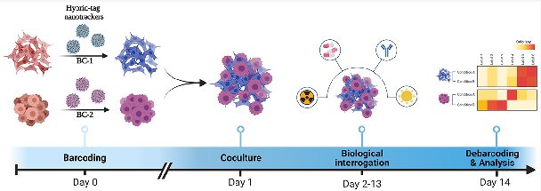
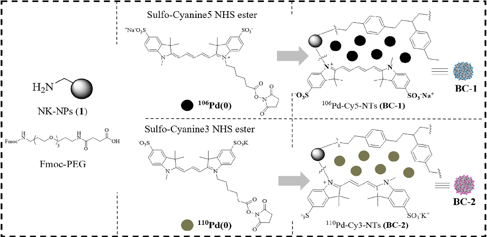
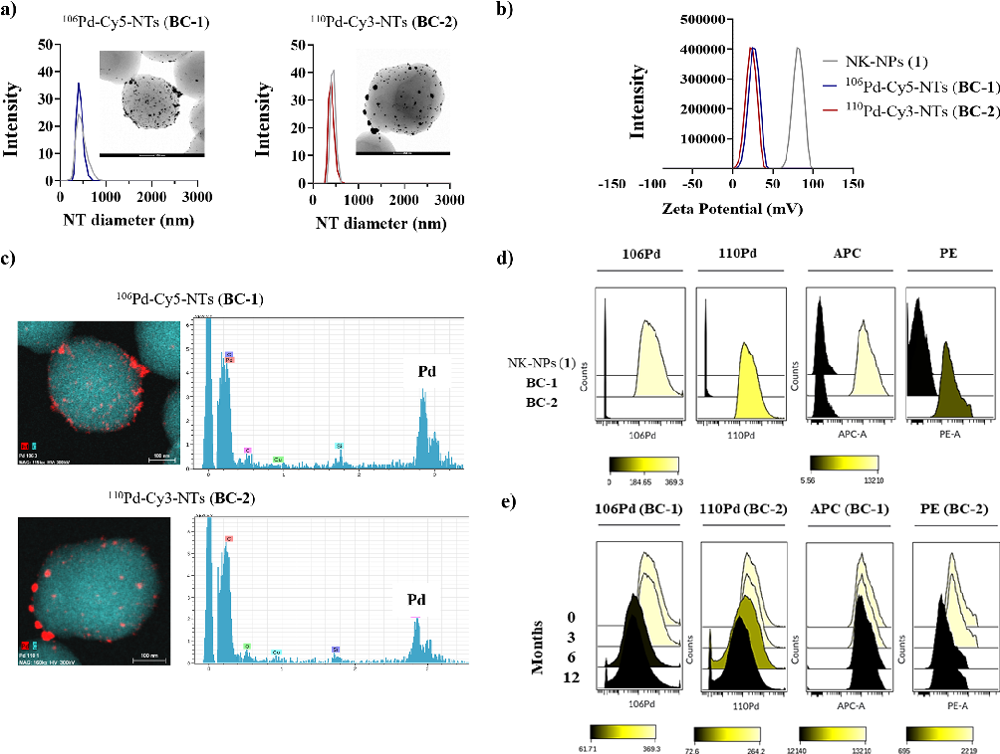
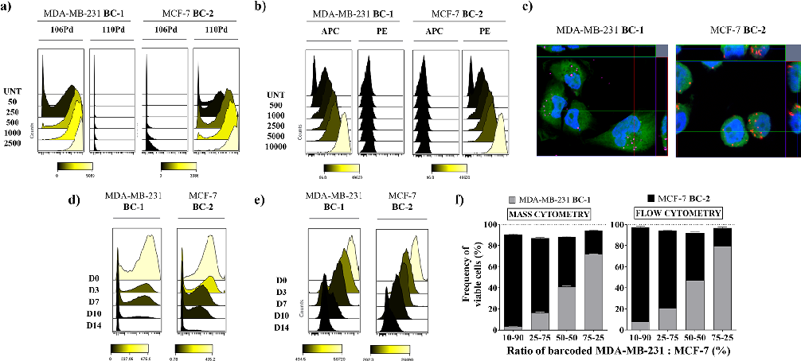
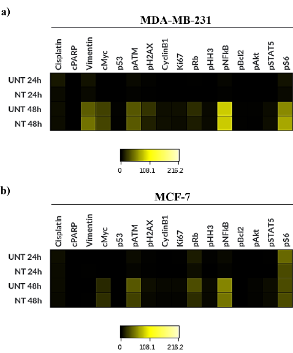
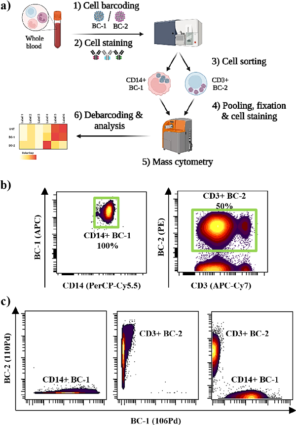
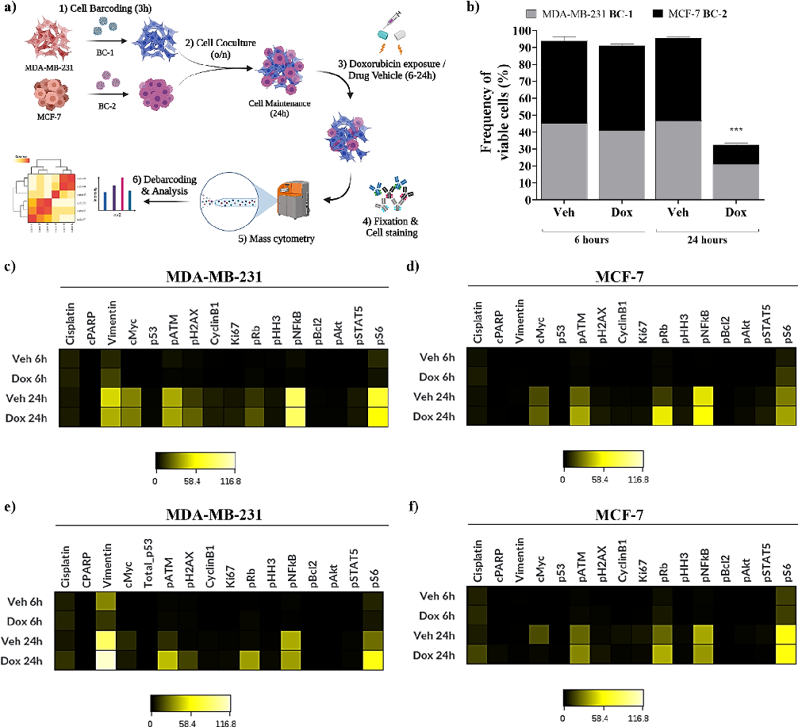

pubs.acs.org/ac Article

## Hybrid Fluorescent Mass-Tag Nanotrackers as Universal Reagents for Long-Term Live-Cell Barcoding

### Antonio Delgado-Gonzalez,○ Jose Antonio Laz-Ruiz,○ M. Victoria Cano-Cortes, Ying-Wen Huang, Veronica D. Gonzalez, Juan Jose Diaz-Mochon, Wendy J. Fantl,* and Rosario M. Sanchez-Martin*

Cite This: Anal. Chem. 2022, 94, 10626−10635 Read Online

ACCESS Metrics & More Article Recommendations *sı Supporting Information

ABSTRACT: Barcoding and pooling cells for processing as a composite sample are critical to minimize technical variability in multiplex technologies. Fluorescent cell barcoding has been established as a standard method for multiplexing in flow cytometry analysis. In parallel, mass-tag barcoding is routinely used to label cells for mass cytometry. Barcode reagents currently used label intracellular proteins in fixed and permeabilized cells and, therefore, are not suitable for studies with live cells in long-term culture prior to analysis. In this study, we report the development of fluorescent palladium-based hybrid-tag nanotrackers to barcode live cells for flow and mass cytometry dual-modal readout. We describe the preparation, physicochemical characterization, efficiency of cell internalization, and durability of these nanotrackers in live cells cultured over time. In addition, we demonstrate their compatibility with standardized cytometry reagents and protocols. Finally, we validated these nanotrackers for drug response assays during a long-term coculture experiment with two barcoded cell lines. This method represents a new and widely applicable advance for fluorescent and mass-tag barcoding that is independent of protein expression levels and can be used to label cells before longterm drug studies.

# ■ INTRODUCTION

molecule probes,1,17−22 polymer-dots,23 inorganic nanoparticles,12,24−27 and polystyrene particles.13,28,29

Barcoding is essential for multiplex technologies to enhance sample consistency by minimizing technical issues arising from antibody staining, sample cross-contamination in the loading loop, and fluctuations in machine sensitivity. Additionally, a composite sample requires less time in the instrument together with reduced reagent consumption.1 Fluorescent cell barcoding has been established as a standard method to allow multiplexing in flow cytometry analysis.2−4 In parallel, mass cytometry (aka, cytometry by time-of-flight, CyTOF), a hybrid technology between flow cytometry and time-of-flight mass spectrometry, has enabled the implementation of alternative methods for efficient cell barcoding and multiplexing.5−7 Using antibodies tagged with stable metal isotopes (originally lanthanides), mass cytometry enables measurements of up to 60 parameters per single cell, with its greatest impact on revealing previously unrecognized levels of detail in heterogeneous cell populations.8−13 The mass cytometer readout spans 79−209 atomic mass units (amu) and measures many nonlanthanide metal isotopes in an ever-increasing number of reagents: antibody tags,14,15 metallointercalators,16 small-

The first generation of mass cytometry barcodes used lanthanides, with the limitation that the number of lanthanides available for tagging antibodies was reduced.30 The second generation of mass cytometry barcoding reagents used routinely and commercially available palladium isotopes whose atomic weights are well separated from those of the lanthanides. Using the six most abundant palladium isotopes, 20 unique barcodes were created using a doublet-free strategy (6-choose-3).17 However, these and other barcoding reagents created with different metals23 are intracellular labels and require fixation and permeabilization. This fact makes these reagents unsuitable for long-term culture assays. To overcome

Received: February 17, 2022 Accepted: July 8, 2022 Published: July 22, 2022

© 2022 The Authors. Published by American Chemical Society

10626

https://doi.org/10.1021/acs.analchem.2c00795 Anal. Chem. 2022, 94, 10626−10635

this issue, a large number of reagents were developed to barcode cell surface molecules such as CD45, the βmacroglobulin subunit of major histocompatibility complex (MHC) class 1, and the β-3 subunit of the sodium/potassium ATPase.31−34 On the other hand, cell-compatible small probes have been investigated such as osmium and ruthenium in the form of oxides35 or maleimide-functionalized tellurophene probe, TeMal,36−38 allowing cell barcoding not only in live cells but also in permeabilized cells. Notably, none of the barcoding reagents described above can be used in long-term drug response studies, whereby cells need to be prebarcoded just before a mass cytometry study begins.39,40 Some efforts have been focused on the development of dual reagents, but none has been reported so far for flow and mass cytometry dual-modal readout in longitudinal cell assays and multiplexed drug studies.41,42

The narrow size and highly uniform metal-loading capacity with minimal particle-to-particle variation of nanoparticles make them ideal analytes for mass cytometry. In this context, lanthanides have been conjugated into nanoparticles for cell labeling.43 On the other hand, lanthanide-infused polystyrene beads are routinely used in mass cytometry for instrument calibration and normalization.13 We previously reported the efficient conjugation and delivery of a variety of bioactive molecules such as drugs, proteins, nucleic acids, and other small molecules, using cross-linked polystyrene-based nanoparticles (NPs). These nanoparticles are characterized by their tunability, robustness with a defined loading capacity, and innocuousness. Polymeric nanoparticles have been used for imaging,44,45 biosensing,46 tracking of cellular proliferation,47 in cellulo proteomics,48 and for selective delivery in a coculture approach based on the expression levels of cell surface receptors.49 In addition, we previously reported the preparation and validation of polystyrene beads containing palladium for intracellular catalysis, demonstrating their efficient transport into cells and innocuousness.50,51 Furthermore, a simplified synthesis protocol was optimized to generate dual polystyrene beads with a metal and a fluorophore to achieve efficient cellular analysis by mass cytometry and flow cytometry.29

Based on our expertise in generating versatile and biocompatible nanoparticles, we report the synthesis of fluorescent and palladium-based nanotrackers as hybrid-tag reagents for use in long-term cell culture as barcoding tools. We describe the methodology for the chemical synthesis and physicochemical characterization of these barcoding reagents and evaluate their compatibility with standard mass and flow cytometry reagents and their performance in biological systems. Then, we evaluated the suitability of nanotrackers for heterogeneous cell populations together with their dual application for mass and flow cytometry readout. Finally, a proof-of-principle study was carried out using two hybrid-tag nanotrackers to barcode two different cell populations in coculture by monitoring the biological response during longterm drug exposure. We found that our hybrid-tag nanotrackers are robust and versatile non-toxic live-cell barcoding reagents, compatible with protein characterization, and suitable tools for multiplexed drug studies and longitudinal cell assays.

# ■ EXPERIMENTALSECTION

Materials. All solvents, chemicals, and reagents used in this work are detailed in the Supporting Information (SI).

Preparation and Characterization of Hybrid-Tag Nanotrackers. Aminomethyl cross-linked polystyrene nanoparticles (NK-NPs (1)) were PEGylated; then, following Fmoc removal, cyanine conjugation step was carried out. Next, isotopically pure 10 mM Pd(NO3)2 (106Pd (99.3%) or 110Pd (99.4%)) in H2O was added to NPs. Pd(II) was reduced to Pd(0) by treatment with 10% hydrazine in methanol (MeOH) to achieve hybrid-tag nanotrackers. The physical−chemical characterization was achieved by measuring the particle mean size, size distribution, and ζ-potential of nanotrackers (NTs) by dynamic light scattering (DLS) and measured on a Zetasizer Nano ZS ZEN. The shape and morphology of the NTs were observed by ultrahigh-resolution transmission electron microscopy (HRTEM). Palladium presence was determined by HRTEM with an FEI microanalysis system for energy-dispersive X-ray (EDX), monitoring the profile of Pd 3d photoemission by obtaining its X-ray photoelectron spectra (XPS), and by mass cytometry. The fluorescence signal of nanotrackers was detected by flow cytometry and confocal microscopy.

Live-Cell Barcoding Assays. Cells were incubated with a 2,500 NTs/cell ratio for 3 h. Then, cells were stained with cisplatin solution and fixed in 1.6% final concentration paraformaldehyde (PFA) in PBS. Cells were washed with cell staining medium (CSM) solution, permeabilized with icecold MeOH for 20 min, and stained with a cocktail of metallabeled antibodies at RT for 1 h. Cells were labeled overnight with Intercalator-Ir (Fluidigm) (final concentration of 125 nM) in 1.6% PFA in PBS. Cells were washed with CyTOF water and resuspended in 0.1x normalization beads prior introduction into the mass cytometer. Flow cytometry standard (FCS) data sets were analyzed using Cytobank Community software. To assess the performance of these nanotrackers as live-cell barcodes of a heterogeneous population of blood cells, this protocol was slightly modified. Briefly, a preliminary step was carried out to lyse the erythrocytes with Quicklysis buffer (Cytognos), isolating the peripheral blood mononuclear cells (PBMCs). Then, following the barcoding step with either BC-1 or BC-2 (25,000 NTs/cell for 30 min), cells were incubated with CD45-FITC, CD3APC-Cy7, and CD14-PerCP-Cy5.5 antibodies and sorted. Barcoded CD45+/CD3+ (T cells) and CD45+/CD14+ (monocytes) cells were isolated, then pooled and analyzed by mass cytometry, as described above. Monocytes and T cells without barcoding were used as control. The human blood samples from healthy donors were provided by the Biobank of the Andalusian Public Health System (agreement number S2100107) and approved by the Committee of Ethics of Biomedical Research of Andalusia (study code: 0679-N-21).

Live-Cell Barcoding for Long-Term Drug Assays. Following live-cell barcoding, cells were cocultured for 24 h before the addition of doxorubicin (12.5 μM final) in complete media. After 6 and 24 h of doxorubicin exposure, cells were fixed, stained with antibodies, and processed for mass cytometry, as described.10,52 A gating strategy for selecting singlets (total cell population) was carried out (Figure S1).

Statistical Analysis. Each experiment was performed in triplicate. Data sets are presented as mean ± standard deviation. Statistical significance was determined using multiple comparisons by a two-way analysis of variance (ANOVA). p-values ≤ 0.05 were considered significant. GraphPad Prism 8.0 (GraphPad Software Inc.) was used for graph plotting and statistics.

- Figure 1. General scheme for hybrid-tag nanotracker preparation.

# ■ RESULTSANDDISCUSSION

for BC-1 and BC-2 (Figure 2b), respectively. Morphology of the hybrid-tag nanotrackers was analyzed by HRTEM which confirmed their characteristic spherical shape (Figure 2a, insets). The effective incorporation of Pd isotopes was evaluated by EDX analysis (Figure 2c) and XPS (Figure S2a). Pd and fluorescence signals of hybrid-tag nanotrackers were successfully detected by mass and flow cytometry (Figure 2d). Noteworthy was the absence of any spillover between the 106Pd and 110Pd channels in mass cytometry. Despite a slight drop in the Pd signal observed overtime, the stability and robustness of the hybrid-tag nanotrackers, stored in water at 4 °C for 12 months, were proven by mass and flow cytometry (Figure 2e). A complete characterization of additional hybridtag nanotrackers (BC-S1 and BC-S2) is shown in the SI (Figures S2b and S3).

Preparation and Characterization of Hybrid-Tag Nanotrackers. For proof of concept, two different barcoded polystyrene hybrid-tag nanotrackers carrying different palladium isotopes and fluorophores were produced using a previously reported solid-phase chemistry protocol.29 Briefly, a Fmoc-protected poly(ethylene glycol) (Fmoc-PEG) spacer was conjugated to amino-functionalized cross-linked polystyrene nanoparticles, as previously reported.51 After Fmoc deprotection, a cyanine fluorophore (Cy3 or Cy5) was conjugated to PEGylated NPs. In the next step, isotopically enriched palladium 106Pd and 110Pd were coordinated to the electron-rich network formed between the cyanine polymethine chain and the polystyrene aromatic rings. Two different hybrid-tag nanotrackers, 106Pd-Cy5-NTs (Barcode-1, BC-1) and 110Pd-Cy3-NTs (Barcode-2, BC-2), were obtained (Figure 1) after the reduction of Pd(II) to Pd(0). A detailed synthetic scheme is shown in the SI. Two additional hybrid-tag nanotrackers (BC-S1 and BC-S2) were produced by recombination of the metal and fluorophore labels to prove the robustness and reproducibility of this protocol (Scheme S1). Importantly, the versatility of this protocol is not limited to the palladium isotopes and cyanine fluorophores reported here but has versatility toward other metals and fluorophores.

Long-Term Stability and Cytotoxicity of Intracellular Hybrid-Tag Nanotrackers. Many studies have confirmed that polymeric nanoparticles are readily internalized by a wide variety of cells with no significant signs of toxicity.29,44−47,49,50,53−55 Internalization efficiency and cytotoxicity of all prepared hybrid-tag nanotrackers were assessed in two breast cancer cell lines, MDA-MB-231 and MCF-7, by mass and flow cytometry (details in the SI). For that, cells were incubated with hybrid-tag nanotrackers 106Pd-Cy5-NTs (BC1) and 110Pd-Cy3-NTs (BC-2), at different concentrations of NTs/cell (from 50 to 2,500) at RT for 3 h. The gating strategy used for the analysis is specified in Figure S1. The internalization of hybrid-tag nanotrackers was measured by quantifying the Pd-mass signal by mass cytometry. Hybrid-tag nanotrackers BC-1 and BC-2 showed similar uptake efficiency in MDA-MB-231 and MCF-7 cell lines by mass cytometry (Figures 3 and S5a,b). Additional hybrid-tag nanotrackers BCS1 and BC-S2 showed similar behavior (Figure S5a,b). An internalization efficiency of 100% was obtained at 2,500 NTs/ cell in both cell lines (Figures 3a and S5a,b). The dual readout of nanotrackers (mass and fluorescence) enabled the analysis of hybrid-tag nanotrackers by traditional fluorescence-based flow cytometry. Cellular uptake evaluated by flow cytometry

The physicochemical characterization of the polymeric hybrid-tag nanotrackers 106Pd-Cy5-NTs (BC-1) and 110PdCy3-NTs (BC-2) was performed by DLS, HRTEM, XPS, and mass cytometry (Figure 2). As a control, we used a nonconjugated polystyrene nanoparticle (NK-NPs (1)). The hydrodynamic size of NK-NPs (1) and hybrid-tag nanotrackers was measured by DLS, being 410.3 nm with a polydispersity index (PDI) of 0.095 for NK-NPs (1), 412.6 nm and a PDI of 0.109 for BC-1, and 401.5 nm and a PDI of 0.075 for BC-2 (Figure 2a). These results show that these nanoparticles are monodisperse populations and that the labeling with Pd and fluorophore does not affect their monodispersity. ζ-Potential values were +25.4 and +21.3 mV

- Figure 2. Physical−chemical characterization of hybrid-tag nanotrackers 106Pd-Cy5-NTs (BC-1) and 110Pd-Cy3-NTs (BC-2). (a) Histograms show hydrodynamic diameter values of hybrid-tag nanotrackers with and without (gray) Pd, determined by DLS, of BC-1 (left) and BC-2 (right) nanotrackers. Inset images are representative TEM images of the corresponding hybrid-tag nanotracker; (b) ζ-potential values; (c) EDX-HRTEM images and EDX analysis of BC-1 (top) and BC-2 (bottom) of the Pd signal from the developed hybrid-tag nanotrackers (carbon signal in blue, palladium signal in red); (d) histograms of Pd and fluorophore channels measured by mass (left) and flow cytometry (right). APC channel for Cy5 and PE for Cy3; (e) signal of Pd isotopes and fluorophores conjugated to hybrid-tag nanotrackers after 0, 3, 6, and 12 months of BC-1 and BC-2 measured by mass (left) and flow cytometry (right). Freshly prepared nanotrackers were used as control (0 months).

showed similar results to those obtained by mass cytometry (Figures 3b and S5c,d), demonstrating the compatibility of these hybrid-tag nanotrackers with fluorescent techniques such as flow cytometry. We additionally confirmed the internalization of the hybrid-tag reagents by confocal microscopy. Zstack images showed that nanotrackers were inside cells (Figure 3c). These results are consistent with published studies from our and other groups about the cellular uptake of polystyrene nanoparticles by many types of cells: adherent, suspension, stem, and primary.56,57 To assess the duration of hybrid-tag nanotracker cellular internalization, we used optimized conditions (2,500 NTs/cell for 3 h) to barcode MDA-MB-231 and MCF-7 cell lines with 106Pd-Cy5-NTs (BC-1) and 110Pd-Cy3-NTs (BC-2), respectively. Then, we measured the Pd and fluorescence signals at different time points (0, 3, 7, 10, and 14 days) by mass and flow cytometry. Histograms of Pd-mass and fluorescence intensity corresponding to each hybrid-tag nanotracker are shown in Figure 3d,e.

Our results showed that the Pd-mass signal and fluorescence signal of barcoded cells could be detected for the entire time

course (Table S1). However, over time, we observed a decrease in intensity due to cell division according to their known cell doubling time, as previously reported.47 We estimate that our nanotrackers could be traceable for 15−20 days.

To assess the cytotoxic properties of the hybrid-tag nanotrackers 106Pd-Cy5-NTs (BC-1) and 110Pd-Cy3-NTs (BC-2), MDA-MB-231 and MCF-7 cell lines were incubated with hybrid-tag nanotrackers (range from 156 to 20,000 NTs/ cell) for 72 h. Cell viability was evaluated with the resazurin assay, and data were normalized with respect to untreated cells (100%). Even with a nanotracker concentration of 10-fold higher than that used in our experiments, we did not detect any cytotoxic effects (Figure S5e,f). We therefore conclude that these nanotrackers are innocuous, in accordance with our previously developed nanodevices.29,44−47,49,50,53−55

A critical attribute of barcoding reagents is that the signal should be stable inside barcoded cells over time when they are mixed in a coculture. Thus, we mixed MDA-MB-231 cells barcoded with 106Pd-Cy5-NTs (BC-1) and MCF-7 cells

- Figure 3. Cell assays performed with 106Pd-Cy5-NTs (BC-1) and 110Pd-Cy3-NTs (BC-2) after 3 h of incubation in MDA-MB-231 and MCF-7 breast cancer cell lines, respectively. (a) Cellular uptake of hybrid-tag nanotrackers BC-1 and BC-2 analyzed by mass cytometry; (b) cellular uptake of hybrid-tag nanotrackers BC-1 and BC-2 analyzed by flow cytometry. APC channel for Cy5 and PE for Cy3; (c) orthogonal views (xy, xz, and yz planes) of representative confocal microscopy images showing intersection planes at cross-line positions. MDA-MB-231 barcoded with BC-1 (left) and MCF-7 cells with BC-2 (right). The cytoplasm was stained using CellTracker Green, and the nuclei were stained with DAPI (blue); (d) palladium mass signal monitored by mass cytometry for a time course (days 3, 7, 10, and 14) after nanotracker incubation; (e) fluorescent signal monitored by flow cytometry for a time course (days 3, 7, 10, and 14) after nanotracker incubation; and (f) frequency of viable cells analyzed from cocultures by mass cytometry (left) and flow cytometry (right).

- Figure 4. Heatmaps depict protein expression levels (median counts) of barcoded cell lines after 24 and 48 h of incubation with hybrid-tag nanotrackers by mass cytometry: (a) MDA-MB-231 cells barcoded with BC-1 and (b) MCF-7 cells with BC-2.

barcoded with 110Pd-Cy3-NTs (BC-2) at different ratios (10− 90, 25−75, 50−50, and 75−25%). After 24 h of coculture, cells were harvested and processed for mass cytometry. Yields of viable cells were comparable to their starting numbers, which indicates that nanotrackers have nondetectable toxicity, confirming their suitability as reagents for live-cell barcoding (Figures 3f, left, and S6). In parallel, fluorescence-based flow cytometry confirmed that there was no intercellular transfer of the hybrid-tag nanotrackers (Figure 3f, right).

Compatibility of Hybrid-Tag Nanotrackers for LiveCell Barcoding with Mass Cytometry Sample Processing. The previous sections demonstrated that the nanotrackers are efficiently internalized and possess long-term stability in live cells, in addition to being innocuous. Our next experiments were designed to test the compatibility of nanotrackers with other mass cytometry reagents and ensure there would be no adverse effects on protein readouts. MDA-MB-231 and MCF-7 cell lines were individually barcoded with 106Pd-Cy5-NTs (BC1) and 110Pd-Cy3-NTs (BC-2), respectively, and processed after 24 and 48 h in culture.

Cells were stained with a previously validated mass cytometry antibody panel designed to measure intracellular protein expression levels in epithelial cancers.10,52 The panel included a set of different proteins according to their biological functions: (i) cancer-related proteins (vimentin, p53, and cMyc) and (ii) cell cycle proteins (cyclin B1, pRb, and pHH3), apoptosis-related signaling pathways (pBCL-2, NF-κB), and STAT5 (Table S2). Cisplatin (Sigma-Aldrich) was used as a live−dead stain,18 and an antibody against cleaved PARP (cPARP) was used to quantify apoptotic cells (Figure S4). We observed that barcoded cell populations channels 106Pd and 110Pd for MDA-MB-231 and MCF-7 cells, respectively

presented negligible platinum and cPARP levels and were

- Figure 5. Compatibility of developed hybrid-tag nanotrackers with heterogeneous cell populations such as whole blood. (a) Schematic methodology to barcode different blood cell populations for flow and mass cytometry analysis; (b) evaluation of barcoding efficiency by fluorescence-activated cell sorting (FACS): dot plots of monocytes CD14+ (left), and T cells CD3+ (right) after the barcoding step. Barcoded cell populations were sorted (green gate); (c) evaluation of sorting efficiency by mass cytometry of BC-1/CD14+, BC-2/CD3+, and pooled barcoded populations.

similar to untreated cells. Notably, both proteomic profiles of barcoded cells and untreated cells were similar in both tested cell lines after 24 and 48 h, showing no significant alteration associated with cell damage (Figure 4).

These data reveal that the hybrid-tag nanotrackers do not interfere with the readout channels chosen for viability and metal-tagged antibodies used in this experiment. Nonrelevant changes in the expression of interrogated proteins are observed over time, independently of the barcode. No significant differences in protein expression are observed between control and barcoded cells. Based on these results, these hybrid-tag nanotrackers represent a new reagent that can be used for barcoding cells for long-term culture without any negative effects on experimental readouts in mass cytometry experiments.

Given that our barcoding nanosystem does not interfere with cellular proteins, fulfilling the main criteria for a universal

cell barcoding, we believe that it could be compatible with other live-cell barcoding reagents, such as TeMal,36 platinumlabeled antibodies targeting b2m and CD298,33 and ratiometric barcoding with Pdots.58

Assessing the Compatibility of Hybrid-Tag Nanotrackers on Heterogeneous Cell Populations by Flow and Mass Cytometry Dual-Modal Readout. Given that multiplexing studies are especially powerful on heterogeneous cell samples such as whole blood, further compatibility studies were carried out to evaluate the labeling efficiency of the hybrid-tag nanotrackers in non-cancer cells. Briefly, the whole blood sample was treated to isolate PBMCs and they were barcoded with hybrid-tag nanotrackers 106Pd-Cy5-NTs (BC-1) or 110Pd-Cy3-NTs (BC-2) prior to fluorescent antibody staining to sort them into monocytes (CD45+/CD14+) and T cells (CD45+/CD3+) barcoded with BC-1 (Cy5+) and BC2 (Cy3+), respectively.

- Figure 6. Tracking cell damage of barcoded cells in coculture after exposure to doxorubicin at 6 and 24 h by mass cytometry. (a) Schematic protocol for a cell-based drug assay using hybrid-tag nanotrackers; (b) frequencies of debarcoded cells recovered after doxorubicin exposure; (c) heatmap of protein expression levels in monocultured MDA-MB-231 and (d) MCF-7 debarcoded cells (raw median counts); and (e) heatmap of protein expression in cocultured debarcoded MDA-MB-231 and (f) MCF-7 cells.

Then, a mass cytometry analysis of a 50−50% pool of barcoded monocytes and T cells was performed, identifying each population according to their barcodes BC-1 (106Pd+) and BC-2 (110Pd+) (Figure 5a). Flow cytometry analysis shows a different degree of internalization based on the cell type, being 100 and 50% for monocytes and T cells, respectively. Interestingly, a higher intensity signal in barcoded monocytes compared to that in barcoded T cells can be observed, corroborating the different labeling efficiency in these two cell types (Figure 5b). Next, sorted barcoded monocytes and T cells were pooled and successfully tracked by mass cytometry thanks to the dual-modal signal of the hybridtag nanotrackers (Figure 5c). Toxicity assessment after nanotracker internalization showed no significant alteration associated with barcoding compared to cells without barcoding (Figure S7). These results confirm that our hybrid-tag

nanotrackers are as suitable barcoding reagents for heterogeneous cell populations such as blood cells as other reported mass cytometry reagents.6,11,17,22,32,33 However, a key differential aspect of our approach is that these hybrid-tag nanotrackers integrate both fluorescence and mass cytometry cell barcoding in a single device and allow a dual-modal readout. Based on these results, we can conclude that these hybrid-tag nanotrackers are suitable for barcoding of both heterogeneous and homogeneous cell populations. However, higher barcoding efficiency is achieved in homogeneous samples.

Live-Cell Barcoding for Drug Assays. A series of experiments were carried out to evaluate the utility of hybrid-tag nanotrackers in cocultures of individually barcoded cells exposed to the chemotherapeutic agent doxorubicin.59,60 To select the optimal concentration of doxorubicin, we

performed dose−response curves with MDA-MB-231 and MCF-7 cell lines (Figure S8). No damage was observed following 6 h of treatment measured by resazurin assay (Figure

- S8a). However, significant differences in doxorubicin potency were observed between the two cell lines when exposed to 12.5 μM of doxorubicin for 24 h. The viability was 30 and 70% for MCF-7 and MDA-MB-231 cell lines, respectively (Figure
- S8b). We designed the experiment shown in Figure 6a. Briefly, we

barcoded MDA-MB-231 cells with BC-1 and MCF-7 cells with BC-2 and cocultured them. Then, cells were treated with doxorubicin or sodium chloride (vehicle control) for 6 and 24 h. Cells were stained with an antibody panel against intracellular proteins and processed for mass cytometry (Table S2).

We determined the viability of each barcoded cell line by analyzing 106Pd or 110Pd -positive signals for MDA-MB-231 and MCF-7 cells, respectively. We observed that the number of viable MDA-MB-231 and MCF-7 cells following treatment with doxorubicin was approximately reduced by 60 and 76%, respectively, compared to cells treated with drug vehicle (untreated) (Figure 6b). Responses to doxorubicin (6 and 24 h) of each barcoded cell line in the coculture were comparable to those observed for each individually barcoded cell line (Figure S9). To complement the viability determination, we compared measurements of protein expression in coculture versus individually barcoded cells. Following debarcoding, expression levels of proteins expected to change in response to doxorubicin treatment were visualized on a heatmap. Our results showed concordance in the levels of the parameters reported in heatmaps of debarcoded cells with cells treated individually (Figure 6c−f). The expression patterns are similar in both monoculture and coculture for both cell lines, demonstrating that this approach does not interfere with the protein signature changes induced by drug treatment. Therefore, our method can be used to barcode live cells from the beginning of the assay, allowing monitoring of the cellular response to the drug treatment over time after debarcode is completed.

# ■ CONCLUSIONS

In summary, we have developed fluorescent and mass hybridtag nanotrackers as new reagents that can be used for longterm live-cell barcoding and multiplexed drug assays and can be detected by flow and mass cytometry. These reagents have key advantages for cell barcoding such as fluorescence and mass dual-modality, durability (up to 14 days) without any appreciable cellular damage, stability over time, and universality since it does not interfere with cellular protein expression. Despite the use of only two hybrid-tag nanotrackers, this proofof-principle barcoding strategy could be extended using other metal isotopes as tags.

Successful proteomic profiling of single cells was achieved with a 14-antibody panel in the presence of the hybrid-tag nanotrackers. These nanotrackers provide robust barcoding of live cells compatible with existing mass cytometry reagents (metal-labeled antibodies, DNA intercalators, and cisplatin) and cell processing protocols for mass cytometry, allowing the barcoding of heterogeneous cells together with flow and mass cytometry dual-modal readout.

This barcoding approach does not rely on proteins; therefore, it is not affected when proteomic changes are induced after exogenous perturbations, e.g., drug treatments.

Simultaneous measurements of cocultures with cells barcoded with nanotrackers over time following doxorubicin treatment have been successfully performed. Notably, the hybrid-tag nanotrackers have a significant advantage over other barcoding reagents in that they can be used for drug-sensitive and/or minority cell populations used in cocultures, avoiding harsh treatments or conditions that could mask cells under low signal intensities close to background. To the best of our knowledge, this is the first dual fluorescent and mass cytometry barcoding reagent compatible with long-term live-cell barcoding and multiplexed drug assays. In addition, these hybrid nanotrackers are also compatible with fluorescence-based techniques, such as confocal microscopy, opening the range of applications of this barcoding method.

# ■ ASSOCIATEDCONTENT

*sı Supporting Information

The Supporting Information is available free of charge at https://pubs.acs.org/doi/10.1021/acs.analchem.2c00795.

Additional experimental details, materials, and methods for the development and evaluation of hybrid-tag nanotrackers (PDF)

# ■ AUTHORINFORMATION

Corresponding Authors

Wendy J. Fantl − Department of Urology, Stanford University School of Medicine, Stanford, California 94305, United States; Stanford Cancer Institute, Stanford University School of Medicine, Stanford, California 94305, United States; Department of Obstetrics and Gynecology, Stanford University School of Medicine, Stanford, California 94304, United States; Email: wjfantl@stanford.edu

Rosario M. Sanchez-Martin − GENYO, Centre for Genomics and Oncological Research, Pfizer/University of Granada/ Andalusian Regional Gov-ernment, PTS Granada, 18016 Granada, Spain; Department of Medicinal & Organic Chemistry and Excellence Research Unit of “Chemistry applied to Biomedi-cine and the Environment”, Faculty of Pharmacy, University of Granada, 18071 Granada, Spain; Biosanitary Research Institute of Granada (ibs.GRANADA), University Hospitals of Granada-University of Grana-da, 18012 Granada, Spain; orcid.org/0000-0001-89129799; Email: rmsanchez@go.ugr.es

Authors

Antonio Delgado-Gonzalez − GENYO, Centre for Genomics and Oncological Research, Pfizer/University of Granada/ Andalusian Regional Gov-ernment, PTS Granada, 18016 Granada, Spain; Department of Medicinal & Organic Chemistry and Excellence Research Unit of “Chemistry applied to Biomedi-cine and the Environment”, Faculty of Pharmacy, University of Granada, 18071 Granada, Spain; Biosanitary Research Institute of Granada (ibs.GRANADA), University Hospitals of Granada-University of Grana-da, 18012 Granada, Spain; Department of Urology, Stanford University School of Medicine, Stanford, California 94305, United States

Jose Antonio Laz-Ruiz − GENYO, Centre for Genomics and Oncological Research, Pfizer/University of Granada/ Andalusian Regional Gov-ernment, PTS Granada, 18016 Granada, Spain; Department of Medicinal & Organic Chemistry and Excellence Research Unit of “Chemistry

applied to Biomedi-cine and the Environment”, Faculty of Pharmacy, University of Granada, 18071 Granada, Spain; Biosanitary Research Institute of Granada (ibs.GRANADA), University Hospitals of Granada-University of Grana-da, 18012 Granada, Spain; orcid.org/0000-0002-09415857

M. Victoria Cano-Cortes − GENYO, Centre for Genomics and Oncological Research, Pfizer/University of Granada/ Andalusian Regional Gov-ernment, PTS Granada, 18016 Granada, Spain; Department of Medicinal & Organic Chemistry and Excellence Research Unit of “Chemistry applied to Biomedi-cine and the Environment”, Faculty of Pharmacy, University of Granada, 18071 Granada, Spain; Biosanitary Research Institute of Granada (ibs.GRANADA), University Hospitals of Granada-University of Grana-da, 18012 Granada, Spain; orcid.org/0000-0003-15085476

Ying-Wen Huang − Department of Urology, Stanford University School of Medicine, Stanford, California 94305, United States

Veronica D. Gonzalez − Department of Urology, Stanford University School of Medicine, Stanford, California 94305, United States; Present Address: 10X Genomics, Pleasanton, California 94588, United States

Juan Jose Diaz-Mochon − GENYO, Centre for Genomics and Oncological Research, Pfizer/University of Granada/ Andalusian Regional Gov-ernment, PTS Granada, 18016 Granada, Spain; Department of Medicinal & Organic Chemistry and Excellence Research Unit of “Chemistry applied to Biomedi-cine and the Environment”, Faculty of Pharmacy, University of Granada, 18071 Granada, Spain; Biosanitary Research Institute of Granada (ibs.GRANADA), University Hospitals of Granada-University of Grana-da, 18012 Granada, Spain; orcid.org/0000-0002-35991954

Complete contact information is available at: https://pubs.acs.org/10.1021/acs.analchem.2c00795

Author Contributions

○A.D.-G. and J.A.L.-R. contributed equally to this work.

Notes

The authors declare no competing financial interest.

# ■ ACKNOWLEDGMENTS

This research was supported by funding from the Spanish Ministry of Economy and Competitiveness (BIO2016-80519, PID2019.110987RB.I00); the Health Institute Carlos III (DTS18/00121); the Andalusian Regional GovernmentFEDER (PT18-TP-4160, B-FQM-475-UGR18, A-FQM-760UGR20); the Department of Defense (W81XWH-12-1-0591); NCI (1R01CA234553, R21CA231280); the 2019 Cancer Innovation Award, supported by the Stanford Cancer Institute, an NCI-designated Comprehensive Cancer Center; BRCA Foundation and the V Foundation for Cancer Research; a gift from the Gray Foundation; the Department of Urology at Stanford University; NHLBI (P01HL10879709); NIAID (U19AI057229); and a PICI Bedside to Bench grant.

- R.M.S.-M., J.J.D.-M., M.V.C.-C., and J.A.L.-R. are members of the network NANOCARE (RED2018-102469-T) funded by the Spanish State Research Agency. W.J.F. thanks the BRCA Foundation and the V Foundation for Cancer Research, a gift from the Gray Foundation and the Department of

Urology at Stanford University. A.D.-G. thanks the Spanish Ministry of Education for PhD funding (scholarship FPU14/ 02181), the University of Granada for postdoctoral research contract, and the Fundación Alfonso Martín Escudero for his postdoctoral fellowship. J.A.L.-R. thanks the Fundación Benéfica Anticancer San Francisco Javier y Santa Candida for PhD funding. M.V.C.-C. thanks the Andalusian Regional Government for her postdoctoral fellowship (POSTDOC_21_00118). The authors thank the technical support from the Cytometry unit of GENYO. The graphical abstract and Figures 5,,a and 6a have been created with BioRender.com.

# ■ REFERENCES

- (1) Zunder, E. R.; Finck, R.; Behbehani, G. K.; Amir, E. A. D.;

Krishnaswamy, S.; Gonzalez, V. D.; Lorang, C. G.; Bjornson, Z.; Spitzer, M. H.; Bodenmiller, B.; Fantl, W. J.; Pe’Er, D.; Nolan, G. P. Nat. Protoc. 2015, 10, 316−333.

- (2) Reisman, B. J.; Barone, S. M.; Bachmann, B. O.; Irish, J. M.

Cytometry, Part A 2021, 99, 946−953.

- (3) Giudice, V.; Feng, X.; Kajigaya, S.; Young, N. S.; Biancotto, A.

Cytometry, Part A 2017, 91, 694−703.

- (4) Krutzik, P. O.; Clutter, M. R.; Trejo, A.; Nolan, G. P. Curr.

Protoc. Cytom. 2011, 55, 6.31.1−6.31.15.

- (5) Bendall, S. C.; Simonds, E. F.; Qiu, P.; Amir, E. A. D.; Krutzik, P.

- O.; Finck, R.; Bruggner, R. V.; Melamed, R.; Trejo, A.; Ornatsky, O.

I.; Balderas, R. S.; Plevritis, S. K.; Sachs, K.; Pe’er, D.; Tanner, S. D.; Nolan, G. P. Science 2011, 332, 687−696.

- (6) Bjornson, Z. B.; Nolan, G. P.; Fantl, W. J. Curr. Opin. Immunol. 2013, 25, 484−494.
- (7) Spitzer, M. H.; Nolan, G. P. Cell 2016, 165, 780−791.
- (8) Bandura, D. R.; Baranov, V. I.; Ornatsky, O. I.; Antonov, A.; Kinach, R.; Lou, X.; Pavlov, S.; Vorobiev, S.; Dick, J. E.; Tanner, S. D. Anal. Chem. 2009, 81, 6813−6822.
- (9) Harmsen, S.; Coskun, A. F.; Ganesh, S.; Nolan, G. P.; Gambhir, S. S. Adv. Mater. Technol. 2020, 5, No. 2000098.
- (10) Gonzalez, V. D.; Huang, Y. W.; Delgado-Gonzalez, A.; Chen, S. Y.; Donoso, K.; Sachs, K.; Gentles, A. J.; Allard, G. M.; Kolahi, K. S.; Howitt, B. E.; Porpiglia, E.; Fantl, W. J. Cell Rep. 2021, 36, No. 109632.
- (11) Han, G.; Spitzer, M. H.; Bendall, S. C.; Fantl, W. J.; Nolan, G.

- P. Nat. Protoc. 2018, 13, 2121−2148.

- (12) Zhang, Y.; Zabinyakov, N.; Majonis, D.; Bouzekri, A.; Ornatsky,

O.; Baranov, V.; Winnik, M. A. Anal. Chem. 2020, 92, 5741−5749.

- (13) Liu, J.; Jarzabek, J.; Majonis, D.; Watson, J.; Baranov, V.;

Winnik, M. A. Anal. Chem. 2020, 92, 999−1006.

- (14) Lou, X.; Zhang, G.; Herrera, I.; Kinach, R.; Ornatsky, O.;

Baranov, V.; Nitz, M.; Winnik, M. A. Angew. Chem., Int. Ed. 2007, 46, 6111−6114.

- (15) Cho, H.; Liu, P.; Pichaandi, J.; Closson, T. L. L.; Majonis, D.;

Leighton, P. L. A.; Swanson, E.; Ornatsky, O.; Baranov, V.; Winnik, M. A. Eur. Polym. J. 2019, 120, No. 109175.

- (16) Ornatsky, O. I.; Lou, X.; Nitz, M.; Schäfer, S.; Sheldrick, W. S.;

Baranov, V. I.; Bandura, D. R.; Tanner, S. D. Anal. Chem. 2008, 80, 2539−2547.

- (17) Behbehani, G. K.; Bendall, S. C.; Clutter, M. R.; Fantl, W. J.;

Nolan, G. P. Cytometry, Part A 2012, 81 A, 552−566.

- (18) Fienberg, H. G.; Simonds, E. F.; Fantl, W. J.; Nolan, G. P.;

Bodenmiller, B. Cytometry, Part A 2012, 81 A, 467−475.

- (19) Majonis, D.; Ornatsky, O.; Kinach, R.; Winnik, M. A.

Biomacromolecules 2011, 12, 3997−4010.

- (20) Park, H.; Edgar, L. J.; Lumba, M. A.; Willis, L. M.; Nitz, M. Org.

Biomol. Chem. 2015, 13, 7027−7033.

- (21) Behbehani, G. K.; Thom, C.; Zunder, E. R.; Finck, R.;

Gaudilliere, B.; Fragiadakis, G. K.; Fantl, W. J.; Nolan, G. P. Cytometry, Part A 2014, 85, 1011−1019.

- (22) Mei, H. E.; Leipold, M. D.; Maecker, H. T. Cytometry, Part A

2016, 89, 292−300.

- (23) Wu, X.; DeGottardi, Q.; Wu, I. C.; Yu, J.; Wu, L.; Ye, F.; Kuo,

C. T.; Kwok, W. W.; Chiu, D. T. Angew. Chem., Int. Ed. 2017, 56, 14908−14912.

- (24) Ha, M. K.; Kwon, S. J.; Choi, J. S.; Nguyen, N. T.; Song, J.; Lee,

Y.; Kim, Y. E.; Shin, I.; Nam, J. W.; Yoon, T. H. Small 2020, 16, No. 1907674.

- (25) Pichaandi, J.; Zhao, G.; Bouzekri, A.; Lu, E.; Ornatsky, O.;

Baranov, V.; Nitz, M.; Winnik, M. A. Chem. Sci. 2019, 10, 2965−2974.

- (26) Schulz, A. R.; Stanislawiak, S.; Baumgart, S.; Grützkau, A.; Mei,

H. E. Cytometry, Part A 2017, 91, 25−33.

- (27) Yang, Y. S. S.; Atukorale, P. U.; Moynihan, K. D.; Bekdemir, A.;

Rakhra, K.; Tang, L.; Stellacci, F.; Irvine, D. J. Nat. Commun. 2017, 8, No. 14069.

- (28) Abdelrahman, A. I.; Dai, S.; Thickett, S. C.; Ornatsky, O.;

Bandura, D.; Baranov, V.; Winnik, M. A. J. Am. Chem. Soc. 2009, 131, 15276−15283.

- (29) Delgado-Gonzalez, A.; Garcia-Fernandez, E.; Valero, T.;

Victoria Cano-Cortes, M.; Ruedas-Rama, M. J.; Unciti-Broceta, A.; Sanchez-Martin, R. M.; Diaz-Mochon, J. J.; Orte, A. ACS Omega 2018, 3, 144−153.

- (30) Bodenmiller, B.; Zunder, E. R.; Finck, R.; Chen, T. J.; Savig, E.

S.; Bruggner, R. V.; Simonds, E. F.; Bendall, S. C.; Sachs, K.; Krutzik, P. O.; Nolan, G. P. Nat. Biotechnol. 2012, 30, 858−867.

- (31) Mei, H. E.; Leipold, M. D.; Schulz, A. R.; Chester, C.; Maecker,

H. T. J. Immunol. 2015, 194, 2022−2031.

- (32) Muftuoglu, M.; Li, L.; Liang, S.; Mak, D.; Lin, A. J.; Fang, J.;

Burks, J. K.; Chen, K.; Andreeff, M. Sci. Rep. 2021, 11, No. 12388.

- (33) Hartmann, F. J.; Simonds, E. F.; Bendall, S. C. Sci. Rep. 2018, 8,

No. 10770.

- (34) Charmsaz, S.; Gross, N.; Jaffee, E.; Ho, W. J. JCI Insight 2021,

6, No. e143283.

- (35) Catena, R.; Özcan, A.; Zivanovic, N.; Bodenmiller, B.

Cytometry, Part A 2016, 89, 491−497.

- (36) Willis, L. M.; Park, H.; Watson, M. W. L.; Majonis, D.; Watson,

J. L.; Nitz, M. Cytometry, Part A 2018, 93, 685−694.

- (37) Qin, X.; Sufi, J.; Vlckova, P.; Kyriakidou, P.; Acton, S. E.; Li, V.

S. W.; Nitz, M.; Tape, C. J. Nat. Methods 2020, 17, 335−342.

- (38) Sufi, J.; Qin, X.; Rodriguez, F. C.; Bu, Y. J.; Vlckova, P.;

Zapatero, M. R.; Nitz, M.; Tape, C. J. Nat. Protoc. 2021, 16, 4897− 4918.

- (39) Teh, C. E.; Gong, J. N.; Segal, D.; Tan, T.; Vandenberg, C. J.;

Fedele, P. L.; Low, M. S. Y.; Grigoriadis, G.; Harrison, S. J.; Strasser, A.; Roberts, A. W.; Huang, D. C. S.; Nolan, G. P.; Gray, D. H. D.; Ko, M. E. Cell Death Differ. 2020, 27, 2217−2233.

- (40) Georgopoulou, D.; Callari, M.; Rueda, O. M.; et al. Nat.

Commun. 2021, 12, No. 1998.

- (41) Majonis, D.; Ornatsky, O.; Weinrich, D.; Winnik, M. A.

Biomacromolecules 2013, 14, 1503−1513.

- (42) Xu, H.; Zhang, Z.; Wang, Y.; Zhang, X.; Zhu, J.-J.; Min, Q.

Anal. Chem. 2022, 94, 6329−6337.

- (43) Pich, A.; Zhang, F.; Shen, L.; Berger, S.; Ornatsky, O.; Baranov,

V.; Winnik, M. A. Small 2008, 4, 2171−2175.

- (44) Sanchez-Martin, R. M.; Muzerelle, M.; Chitkul, N.; How, S. E.;

Mittoo, S.; Bradley, M. ChemBioChem 2005, 6, 1341−1345.

- (45) Cano-Cortes, M. V.; Navarro-Marchal, S. A.; Ruiz-Blas, M. P.;

Diaz-Mochon, J. J.; Marchal, J. A.; Sanchez-Martin, R. M. Nanomedicine 2020, 24, No. 102120.

- (46) Bradley, M.; Alexander, L.; Duncan, K.; Chennaoui, M.; Jones,

A. C.; Sánchez-Martín, R. M. Bioorg. Med. Chem. Lett. 2008, 18, 313− 317.

- (47) Altea-Manzano, P.; Unciti-Broceta, J. D.; Cano-Cortes, V.;

Ruiz-Blas, M. P.; Valero-Griñan, T.; Diaz-Mochon, J. J.; SanchezMartin, R. Nanomedicine 2017, 12, 1591−1605.

- (48) Valero, T.; Delgado-González, A.; Unciti-Broceta, J. D.; Cano-

Cortés, V.; Pérez-López, A. M.; Unciti-Broceta, A.; Sánchez Martín, R. M. Bioconjugate Chem. 2018, 29, 3154−3160.

- (49) Cano-Cortes, M. V.; Altea-Manzano, P.; Laz-Ruiz, J. A.; Unciti-

Broceta, J. D.; Lopez-Delgado, F. J.; Espejo-Roman, J. M.; Diaz-

Mochon, J. J.; Sanchez-Martin, R. M. Nanoscale 2021, 13, 3500− 3511.

- (50) Yusop, R. M.; Unciti-Broceta, A.; Johansson, E. M. V.; Sánchez-

Martín, R. M.; Bradley, M. Nat. Chem. 2011, 3, 239−243.

- (51) Unciti-Broceta, A.; Johansson, E. M. V.; Yusop, R. M.; Sánchez-

Martín, R. M.; Bradley, M. Nat. Protoc. 2012, 7, 1207−1218.

- (52) Gonzalez, V. D.; Samusik, N.; Chen, T. J.; Savig, E. S.;

Aghaeepour, N.; Quigley, D. A.; Huang, Y. W.; Giangarra,̀ V.; Borowsky, A. D.; Hubbard, N. E.; Chen, S. Y.; Han, G.; Ashworth, A.; Kipps, T. J.; Berek, J. S.; Nolan, G. P.; Fantl, W. J. Cell Rep. 2018, 22, 1875−1888.

- (53) Alexander, L. M.; Pernagallo, S.; Livigni, A.; Sánchez-Martín, R.

M.; Brickman, J. M.; Bradley, M. Mol. Biosyst. 2010, 6, 399−409.

- (54) Cano-Cortes, M. V.; Laz-Ruiz, J. A.; Diaz-Mochon, J. J.;

Sanchez-Martin, R. M. Polymers 2020, 12, 1265.

- (55) Unciti-Broceta, J. D.; Cano-Cortés, V.; Altea-Manzano, P.;

Pernagallo, S.; Díaz-Mochón, J. J.; Sánchez-Martín, R. M. Sci. Rep. 2015, 5, No. 10091.

- (56) Gennet, N.; Alexander, L. M.; Sánchez-Martín, R. M.;

Behrendt, J. M.; Sutherland, A. J.; Brickman, J. M.; Bradley, M.; Li, M. New Biotechnol. 2009, 25, 442−449.

- (57) Tsakiridis, A.; Alexander, L. M.; Gennet, N.; Sanchez-Martin,

- R. M.; Livigni, A.; Li, M.; Bradley, M.; Brickman, J. M. Biomaterials 2009, 30, 5853−5861.

- (58) Wu, X.; Degottardi, Q.; Wu, I. C.; Wu, L.; Yu, J.; Kwok, W. W.; Chiu, D. T. Anal. Chem. 2018, 90, 10688−10694.
- (59) Tran, Q. H.; Hoang, D. H.; Song, M.; Choe, W.; Kang, I.; Kim,

- S. S.; Ha, J. Exp. Mol. Med. 2021, 53, 1413−1422.

- (60) Hurvitz, S. A.; McAndrew, N. P.; Bardia, A.; Press, M. F.;

Pegram, M.; Crown, J. P.; Fasching, P. A.; Ejlertsen, B.; Yang, E. H.; Glaspy, J. A.; Slamon, D. J. npj Breast Cancer 2021, 7, No. 134.

