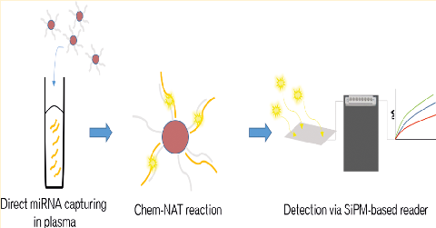
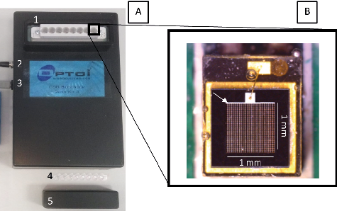
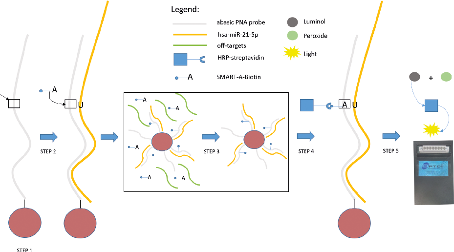
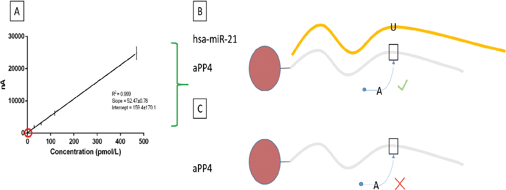
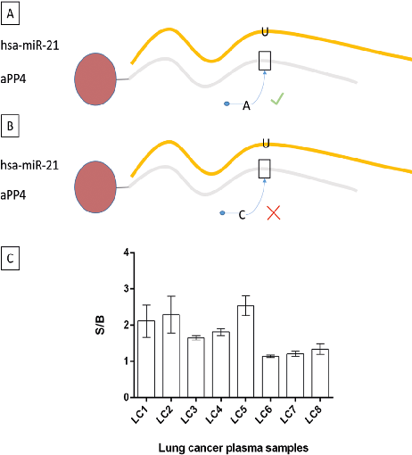
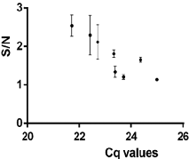
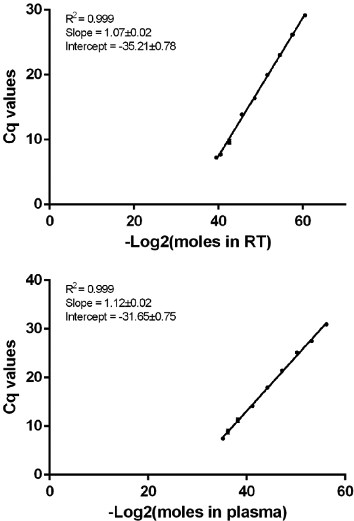

Article Cite This: Anal. Chem. 2019, 91, 5874−5880 pubs.acs.org/ac

New Platform for the Direct Profiling of microRNAs in Biofluids

Simone Detassis,† Margherita Grasso,† Mavys Tabraue-Chavez,́ ‡ Antonio Marín-Romero,‡,⊥,# Barbará Lopez-Longarela,́ ‡ Hugh Ilyine,‡,§ Cristina Ress,∥ Silvia Ceriani,∥ Mirko Erspan,∥ Alfredo Maglione,∥ Juan J. Díaz-Mochon,́ ‡,§,⊥,# Salvatore Pernagallo,*,‡,§ and Michela A. Denti*,†

†Department of Cellular, Computational and Integrative Biology (CIBIO), Via Sommarive 9, 38123 Trento, Italy ‡DestiNA Genomica S.L. Parque Tecnologicó de la Salud (PTS), Avenida de la Innovacioń 1, 18016 Granada, Spain §DestiNA Genomics Ltd., 7-11 Melville St, Edinburgh EH3 7PE, United Kingdom ∥Optoelettronica Italia Srl, Via Vienna 8, 38121 Trento, Italy ⊥Centro Pfizer-Universidad de Granada-Junta de Andalucía de Genomicá e Investigacioń Oncologicá (GENYO), Parque Tecnologicó de la Salud (PTS), Avenida de la Ilustracioń 114, Granada 18016, Spain #Faculty of Pharmacy, University of Granada, Campus Cartuja s/n, Granada 18016, Spain

See https://pubs.acs.org/sharingguidelines for options on how to legitimately share published articles.

Downloaded via UNIV DE GRANADA on May 20, 2019 at 13:53:53 (UTC).

*S Supporting Information

ABSTRACT: Circulating microRNAs have been identified as potential biomarkers for early detection, prognosis, and prediction of several diseases. Their use in clinical diagnostics has been limited by the lack of suitable detection techniques. Most of the current technologies suffer from requiring complex protocols, not yet able to deliver robust and costeffective assays in the field of clinical diagnostics. In this work, we report the development of a breakthrough platform for profiling circulating microRNAs. The platform comprises a novel silicon photomultiplier-based reader in conjunction with a chemical-based method for nucleic acid detection. Accurate microRNAs profiling without extraction, pre-amplification, or pre-labeling of the target is now achievable. We designed and synthesized a set of reagents that combined the chemical-based method with a chemiluminescent reaction. The signals generated were read out using a novel, compact silicon photomultiplier-based reader. The platform sensitivity was determined by measuring known concentrations of hsa-miR-21-5p spike-ins. The limit of detection was calculated as 4.7 pmol/L. The platform was also successfully used to directly detect hsa-miR-21-5p in eight non-small cell lung cancer plasma samples. Levels of plasma hsa-miR-21-5p expression were also measured via TaqMan RT-qPCR. The successful integration of the unique chemical-based method for nucleic acid detection with the novel silicon photomultiplier-based reader created an innovative product (ODG platform) with diagnostic utility, for the direct qualitative and quantitative analysis of microRNA biomarkers in biological fluids.

## M

into clinical diagnostics. Current analytical tools require several and laborious sample preparation steps, such as RNA extraction, conversion to cDNA, labeling and amplification of targets, all of which introduce undesired variability.18 They have been and remain the major obstacles to develop miRNAs as clinically valuable biomarkers. Among all the technologies available, a unique chemical-based approach for nucleic acid testing (Chem-NAT) has been developed recently.19 miRNA analysis by Chem-NAT is based on combining aldehydemodified SMART nucleobases with modified PNA capture probes synthesized with an abasic position (abasic PNA probe). Chem-NAT applies a dynamic chemistry reaction to

icroRNAs (miRNAs) are a group of small RNA molecules involved in several diseases, such as human

cancers,1−4 neurodegenerative diseases5,6 and inflammation.7−9 miRNAs, while present in biological fluids in a stable and reproducible manner, are differentially expressed under pathological conditions, such that the expression patterns of circulating miRNAs can thus be used as diagnostically relevant biomarker signatures.10−15 They enable pathology staging and diagnosis as well as prognosis, providing important information for clinical treatment decision making.16,17 Over the last two decades, several techniques have been reported for measuring miRNAs’ expression in biological fluids, such as RT-qPCR, microarrays, and more recently, next generation sequencing (NGS) and digital droplet PCR (ddPCR).18 Despite advances, conventional technologies still present unique analytical challenges when attempting to translate the use of miRNAs

Received: January 12, 2019 Accepted: April 17, 2019 Published: April 17, 2019

© 2019 American Chemical Society 5874 DOI:10.1021/acs.analchem.9b00213

netic beads. Briefly, 100 μL of beads (containing 2 × 1006 beads) were washed by adding 100 μL of 0.01 mol/L NaOH. The beads were pelleted, supernatant was removed, and the beads were washed once in 100 μL of 0.01 mol/L NaOH and three times in 100 μL of distilled water. The beads were activated in 150 μL of freshly prepared 50 mg/mL 1-ethyl-3(3-(dimethylamino)propyl) carbodiimide (EDC) in water and incubated with slow tilt rotation at 23 °C for 30 min. After activation, the beads were washed with 100 μL of cold water and with 100 μL of cold MES buffer (50 mmol/L, pH 5.0). 100 μL of a solution containing 2100 pmol abasic PNA probe in MES buffer 50 mmol/L (pH 5) was added to the activated beads. The mixture of probes and beads was incubated at 4 °C for 4 h with slow tilt rotation, followed by washing with 50 mmol/L MES buffer (pH 5). The remaining activated carboxyl groups were quenched by incubating the beads with 100 μL of 50 mmol/L ethanolamine in PBS (pH 8) for 1 h, followed by three washes with 100 μL of 10% PEG10K and 0.1% Tween-20 in PBS. The coupled beads were stored at 4 °C in 100 μL 0.1% Tween-20 in PBS.

abasic PNA probes, enabling interrogation of complementary miRNAs by an entirely novel chemical method, with single base resolution accuracy. The major feature of Chem-NAT is that false positives are difficult if not impossible to create. Chem-NAT requires two specific molecular events to generate a signal: a) perfect hybridization between miRNA strands and the abasic PNA probe and (b) specific molecular recognition by the SMART nucleobase, according to Watson−Crick basepairing rules (Figure S1).20 Chem-NAT has been validated by profiling the expression of circulating hsa-miRNA-122 in serum samples of drug-induced liver injury patients using bead-based technologies21,23 as well as for profiling hsa-miRNA-451a in blood samples.19 In an effort to make this novel technology suitable for routine screenings in a clinical setting, we merged Chem-NAT with a novel silicon photomultiplier (SiPM)-based reader to create the innovative ODG platform, for detection and quantification of miRNAs without requiring extraction, pre-amplification, or pre-labeling of the target from their biological sources. In this study, we demonstrate how this platform can be used to profile hsa-miR-21-5p, a putative cancer marker detectable in plasma of non-small cell lung cancer (NSCLC) patients. With its compact benchtop format, the ODG platform promises to transform and expand routine testing and screening of circulating miRNAs in clinical diagnostic practice, including cancer diagnosis. Benefits for healthcare providers will be cost savings, reliability, shorter protocols, and ease of use.

Patients. Plasma samples from eight different NSCLC patients were retrieved from the archives of the Trentino Biobank, at the Unit of Surgical Pathology of the S. Chiara Hospital, Trento, Italy. All cases were fully anonymized, and the use of the samples had been approved by the Ethical Committee of the Santa Chiara Hospital, Trento. After the informed consent was signed, 8 mL of blood was collected in EDTA tubes, and plasma was obtained by centrifugation at 1200g for 15 min and then 3000g for 10 min. Each plasma sample was stored at −80 °C.

# ■ EXPERIMENTALSECTION

Materials and Instrumentation. RNA oligomer mimic miRNAs were purchased HPLC-purified from Exiqon. Unless specified differently, all chemicals and solvents were obtained from Sigma-Aldrich and used as received. Dynabeads M-270 2.8-μm diameter superparamagnetic beads presenting carboxylic acid groups (catalog# 14305D), Pierce high sensitivity streptavidin-HRP (horseradish peroxidase ) (catalog# 21132), and SuperSignal ELISA femto substrate (catalog# 37075) were obtained from Thermo Fisher Scientific. The HRP enzyme was diluted in HRP-StabilPLUS from Kementec (catalog# 4530L). The reaction buffer was prepared from 2× saline sodium citrate (SSC) and 0.1% sodium dodecyl sulfate (SDS) with the pH adjusted to 6.0 using HCl. Concentrations of RNA oligomers and abasic PNA probes solutions were determined using a Thermo Fisher NanoDrop 1000 spectrophotometer. Chem-NAT was conducted in a Techne Thermal cycler (TC5000). A TECAN multimode microplate reader was used as the final read out together with an SiPM-based reader provided by Optoelettronica Italia S.R.L (Italy). The RT-qPCR reaction was detected with a CFX96 Real-Time PCR Detection System (BIO-RAD).

Generation of Calibration Curves with ODG Platform and RT-qPCR. Synthetic RNA oligos (RNA-cel-miR-39 - 5′ AGC UGA UUU CGU CUU GGU AAU A 3′; RNA-hsa-miR21-5p - 5′ UAG CUU AUC AGA CUG AUG UUG A 3′) were stored at −80 °C. All experiments were run in triplicates, and negative controls were included in each assay.

a) Calibration Curve with ODG Platform. The calibration curve was generated with RNA oligos dilutions of 29, 59, 117, and 469 pmol/L (final concentration) in DNase and RNase free water. Briefly, a Master Mix (Vf = 50 μL) was first added to perform a Chem-NAT reaction for 1 h at 41 °C and 1200 r.p.m. For each oligo dilution, the Master Mix contain: 2× SSC + 0.1% SDS buffer, SMART-A-Biotin (2 umol/L), sodium cyanoborohydride (reducing agent, 4.5 mmol/L), 2.5 × 1005 of functionalized-beads with the abasic PNA probe aPP4, and synthetic RNA mimic hsa-miR-21-5p with concentration reported above. The negative control signal (NCS) was performed by adding DNase and RNase free water instead of the oligo. After the Chem-NAT reaction, the beads were washed three times with PBS + 0.1% Tween20 (200 uL) and once with HRP-StabilPLUS using a magnetic rack to separate the beads from the supernatant. 100 μL HRP-streptavidin (1:8000) was added and incubated for 5 min at room temperature. Three washings with PBS + 0.1% Tween20 (200 uL) were performed. Detection was carried out by a chemiluminescent reaction using 100 μL of SuperSignal ELISA femto substrate according to the manufacturer’s instructions. The generated signal was measured using a multi-mode microplate reader and the SiPM-based reader. Linear fit was generated considering five points, the four positive signals and the NCS. The limit of detection (LOD) was calculated by interpolating the background signal (NCS + 3*Standard Deviation of NCS) into the linear fit.

DestiNA Abasic PNA Probes Synthesis. Four abasic PNA probes terminated with amino-PEG linkers were synthesized (Table S1) by DestiNA Genomica S.L. (Spain), using standard solid phase chemistry on a MultiPep synthesizer (Intavis AG GmbH, Germany). All the sequences were designed to allow antiparallel hybridization with hsa-miR-215p. Aldehyde-modified cytosine (SMART-C-Biotin) and adenine (SMART-A-Biotin), tagged with biotin via a 12 ethylene glycol unit spacer (Figures S2 and S3), were prepared by DestiNA Genomica S.L. (Spain) using a synthetic route described elsewhere.20

Coupling of Magnetic Beads with Abasic PNA Probes. Abasic PNA probes were coupled to superparamag-

b) Calibration Curves with RT-qPCR. The calibration curves were generated using RNA oligos spiked into both

base [SMART-C-Biotin (5 μmol/L) instead of SMART-ABiotin (2 μmol/L)], which cannot be incorporated by the abasic PNA probe, but which would still generate a signal in case of unspecific binding.

- (a) 15 μL of aqueous solutions used for the reverse transcription and (b) into 200 μL of plasma samples undergoing RNA extraction before being reverse transcripted.

- For (a), 2 μL of RNA oligos (6.4 × 10−13; 3.20 × 10−13; 8.00 × 10−14; 1.00 × 10−14; 1.25 × 10−15; 1.56 × 10−16; 1.95 × 10−17;

- 2.44 × 10−18; and 3.05 × 10−19 mol/μL) diluted in DNase and RNase free water were spiked in a TaqMan reverse transcription step together with 0.15 μL of dNTPs mix, 1.5 μL of 10× reaction buffer, 0.19 μL of RNase inhibitor, 1 μL of enzyme from the TaqMan microRNA Reverse Transcription Kit (catalog# 4366596, Thermo Fisher), 3 μL of either TaqMan microRNA assay cel-miR-39 (catalog# 464312_mat) or TaqMan microRNA assay hsa-miR-21-5p (catalog# 4427975), and DNase and RNase free water up to 15 μL of the total reaction volume. The TaqMan qPCR step was performed with 1.33 μL of cDNA product, 5 μL of the Faststart TaqMan probe master (catalog# 4673409001, SigmaAldrich) buffer, 1 μL of the TaqMan microRNA assay cel-miR-

- 39 or TaqMan microRNA assay hsa-miR-21-5p, and DNase and RNase free water up to 10 μL of the total reaction volume.

For (b), 750 μL of Qiazol plus 1.25 μL of 800 ng/VL MS2 were added to 200 μL of plasma; subsequently, 40 μL of RNA oligos (6.4 × 10−13; 3.20 × 10−13; 8.00 × 10−14; 1.00 × 10−14; 1.25 × 10−15; 1.56 × 10−16; 1.95 × 10−17; 2.44 × 10−18; and 3.05 × 10−19 mol/μL) diluted in DNase and RNase free water was spiked in the plasma−QIAzol mix. RNA was recovered in

- 40 μL of DNase and RNase free water. Two microliters of extracted RNA was used for the TaqMan reverse transcription step, as previously described. The TaqMan qPCR step was performed as previously described. The RT-qPCR steps were performed with a Biorad CFX 96 system with the following conditions, reverse transcription at 16 °C for 30 min, 42 °C for 30 min, and 85 °C for 5 min; qPCR at 95 °C for 10 min, followed by 40 cycles of 95 °C for 15 s and 60 °C for 1 min.

RNA Extraction and RT-qPCR. RNA from plasma samples (200 μL) was extracted using the miRNeasy Mini Kit (Qiagen) according to the manufacturer’s instructions and collected in 40 μL of DNase and RNase free water. In brief, the plasma was mixed with QIAzol lysis reagent and MS2 RNA (0.8 μg/μL). After the addition of chloroform, the aqueous phase was loaded onto RNeasy mini spin columns, where several washing steps were performed according to the manufacturer’s protocol. The RNA was eluted in 40 μL of DNase and RNase free water. TaqMan RT-qPCR for hsa-miR-21-5p was performed using 2 μL of extracted RNA as explained above in Calibration Curves with RT-qPCR.

Chem-NAT Reaction for Plasma Sample Analysis. In order to detect hsa-miR-21-5p from plasma samples of NSCLC patients, 100 μL of plasma was analyzed in technical triplicates. DestiNA’s proprietary lysis buffer was added to the plasma aliquots in a 2:1 ratio. The 2.5 × 1005 functionalized-beads with the aPP4 (Table S1) were added to the crude lysate. The solutions were incubated under slow tilt rotation for 1 h at room temperature. The vials were placed on a magnetic rack and washed as follows: a) removing the supernatant and

- (b) washing the beads three times using the magnetic rack to separate the beads from the supernatant (lysate debris) with buffer 2 × SSC + 0.1% SDS (200 μL). The Master Mix was added, and the Chem-NAT reaction was performed as explained above in Calibration Curve with ODG Platform. A negative control was generated by adding a wrong SMART-

# ■ RESULTSANDDISCUSSION

Development of a Novel Microwell Strip Silicon Photomultiplier (SiPM)-Based Reader. In this study, a novel chemiluminescent microwell strip reader based on SiPM technology was designed by integrating 8 SiPMs into a 12 cm × 20 cm × 5 cm support (Figure 1A). The single detector is 1

Figure 1. (A) Microwell Strip Silicon Photomultiplier (SiPM)-Based Reader. A plastic support contains the electronic acquisition system with an array of 8 SiPM NUV (1). The reader is turned on via a power adapter (2). An USB connector (3) connects the reader to a laptop with a dedicated ODG software. The samples are loaded into the sample holder strip (4) and covered with a plastic case (5). (B) SiPM sensor, where the white arrow indicates the 1 mm × 1 mm active area.

mm × 1 mm (active area, containing single optical cells of few microns) inserted into a near ultraviolet (NUV) silicon photomultiplier capable of single photon resolution, with signal amplification (Figure 1B). The SiPM consists of an array of avalanche photodiodes reverse-biased in the Geiger mode. The arrival of a single photon generates an “avalanche event” due to impact ionization, enabling good photon resolution in dark conditions by returning a strongly amplified signal. The SiPM brings the advantages of creating a high gain with low bias voltage (about 30 V against 1−2 kV of a PMT), enabling the detection of low intensity light signals. The SiPM-based reader is able to analyze 8 samples simultaneously, using a 8well strip. The read-out is reported via live monitoring and recording by a software associated to a laptop (Figure S4). The analytical sensitivity of the reader was determined by creating a calibration curve using an HRP enzyme in an HRP substrate (Figure S5). As shown in Figure S5, the curve was obtained by plotting the average of photocurrent generated versus different concentrations of HRP. The LOD was calculated as 0.16 pmol/L in 35 μL of HRP substrate.

ODG Platform. To achieve the merging of Chem-NAT and the SiPM-based reader, an abasic PNA probe (aPP) complementary to hsa-miRNA-21-5p was covalently bound to magnetic beads (Figure 2, Step 1). The complementary hsamiR-21-5p is captured by the aPP, templating the incorporation into the duplex of a biotinylated aldehyde-modified adenine (SMART-A-Biotin) (Figure 2, Step 2). Following this recognition, washing steps are performed to eliminate off-

- Figure 2. ODG platform workflow. aPPs are bound to magnetic beads (Step 1, the arrow shows the abasic position). The target hybridizes to the probe, and the SMART-nucleobase enters the pocket (Step 2); off-targets are washed away (Step 3); HRP-strep binds the biotin of the SMARTnucleobase (Step 4). Chemiluminescent substrate is added, and the signal generated by the oxidation of the luminol with peroxide via HRP catalysis is analyzed via the SiPM-based reader (Step 5).

- Figure 3. (A) The photocurrent signals generated (y-axis) correlate linearly with the concentration of RNA-hsa-miR-21-5p (x-axis). Standard deviations in bars. Positive signals (green bracket) are given by the incorporation of the SMART-A-Biotin after hybridization of the target (B), while the negative control (red circle) signals are represented by incubation of aPP4 with water, such that no SMART-A-Biotin is able to enter into the pocket (C).

magnetic beads (aPP-beads). As described by our group elsewhere,22 aPP under immobilization onto magnetic beads have been found to lack stability and can exhibit a degree of undesirable deformation, affecting the performance (e.g., specificity and/or sensitivity) of the aPP in this assay, and prevent proper miRNAs detection. To overcome risks of poor probe performance, four aPPs (aPP1, aPP2, aPP3, and aPP4) were synthesized, containing a sequence of nucleobases to allow for the hybridization to the mature hsa-miR-21-5p strand. aPP1, aPP2, and aPP3 used sequences of 17-mer and aPP4 of 19-mer. The aPP1 incorporated two PNA monomers

targets (Figure 2, Step 3). Magnetic beads allow an effective phase-separation and an efficient washing process by using magnetic separation racks.23 The labeling is achieved via HRPstreptavidin (HRP-strep), which specifically recognizes the biotin in the duplex (Figure 2, Step 4). A luminol-peroxidase substrate is added to generate a chemiluminescent signal. The oxidation of luminol by the peroxide is catalyzed by the HRP producing light. The read-out is performed by the SiPM-based reader (Figure 2, Step 5).

aPP Optimization. aPPs were synthesized with aminopegylated groups in order to be covalently bound onto

containing propanoic acid modifications at gamma positions.23 The abasic site was positioned +8 from the C-terminal, so that, post-hybridization, the mature hsa-miR-21-5p strands presented a guanidine at position +11 (from the 5′), thereby allowing incorporation of a SMART-C-Biotin into the abasic pocket (Table S1). The other three aPPs (aPP2, aPP3, and aPP4) carried two PNA monomers containing propanoic acid modifications differently distributed (Table S1). The abasic monomer sites were positioned respectively at +9, +8, and +12 from the C-terminal, so that, post-hybridization, the mature hsa-miR-21-5p strands presented a uracil, respectively, at positions +14, +8, and +14 (from the 5′), thereby allowing incorporation of a SMART-A-Biotin into the abasic pocket (Table S1). Among the four sequences synthesized and tested, the aPP4 was selected, showing the best hybridization to the complementary hsa-miR-21-5p, as well as an improved SMART-A-Biotin incorporation (data not shown).

Analytical Sensitivity and LOD of the ODG Platform. The analytical sensitivity of the ODG platform was determined by creating a calibration curve using known concentrations of synthetic RNA-hsa-miR-21, respectively, at 29, 59, 117, and 469 pmol/L (final concentration) in a total reaction volume of 50 μL (water was used as negative control). Chemiluminescent signals were detected by the SiPM-based reader. The average output signals show a linear correlation (Figure 3) according to the concentrations of RNA-hsa-miR21. The LOD was calculated as 4.7 pmol/L. In parallel, a comparative calibration curve was created using a conventional multi-mode microplate reader for the read-out with an LOD of 7.4 pmol/L (Figure S6).

- Figure 4. Direct detection of hsa-miR-21-5p in the plasma of NSCLC patients. The positive signal (A) is given by the SMART-A-Biotin incorporated into the aPP4 after hybridization of hsa-miR-21-5p, while the SMART-C-Biotin, which cannot pair with the nucleobase in front of the pocket (U) in aPP4, generates the background (B) of the platform. (C) Signal to background ratio generated by the ODG platform for patients’ samples.

- Figure 5. Signal to background ratios generated by the ODG platform

Hsa-miR-21-5p Profiling Using ODG Platform for Plasma of Lung Cancer Patients. Following the generation of calibration curves and determination of LOD, the ODG platform was tested for the direct detection of hsa-miR-21-5p in plasma samples from eight NSCLC patients. The 2.5 × 1005 aPP4-beads were dispersed directly into the plasma samples along with DestiNA’s proprietary lysis buffer. The beads were incubated for 1 h with the samples to allow the capture of free hsa-miR-21-5p. The Chem-NAT reaction and protocol was performed as explained in Chem-NAT Reaction for Plasma Samples Analysis. The positive signal corresponds to the SMART-A-Biotin incorporation into the probe’s abasic site upon hybridization with the hsa-miR-21-5p (Figure 4A), while the negative signal corresponds to an aliquot of the same sample incubated with a cytosine-SMART-Biotin (SMART-CBiotin) that cannot be incorporated (Figure 4B). As shown in Figure 4C, the ODG platform was able to directly detect hsamiR-21-5p in plasma samples. Values of the signal to background ratio (S/B) varied depending on the concentration of the target into the samples (Figure 4C). Interpolating the S/ B with the LOD curve generated previously with the ODG reader, we calculated an approximative range of concentration between 14 and 45 pmol/L (Table S2), an expected value for highly expressed circulating miRNAs.24 Hsa-miR-21-5p expression of the eight plasma samples was also assessed via the RT-qPCR gold standard method for miRNA analysis. As shown by Figure 5, the ODG platform showed a positive correlation with Cq values generated by RT-qPCR (R2 = 0.75, p = 0.005), demonstrating that the ODG platform can generate qualitative and quantitative data.

correlate with TaqMan Cq values of the same plasma samples. Each dot represents the average of three independent measures (standard deviations in bars).

generated using cel-miR-39 spike-ins. (1) Nine quantities of synthetic RNA-cel-miR-39 were reverse transcripted directly in 15 μL of aqueous solution, and (2) nine quantities of synthetic RNA-cel-miR-39 were spiked into 200 μL of plasma, with extraction and reverse transcription (Figure 6). Calibration curves for hsa-miR-21-5p were performed to confirm the equal efficiency of TaqMan probes of the two selected miRNAs (Figure S7). Average RNA extraction efficiency was evaluated by studying the difference between the Cq values of the two curves. The error in slope and in intercept of the regression lines were taken into account, to provide approximate absolute concentrations (Table S3), spanning the pmol/L range (100− 800 pmol/L). Importantly, the efficiency of RT-qPCR varies greatly from assay to assay, with an inverse proportional trend with the concentration of the miRNA under investigation. As a matter of fact, the smaller the amount of synthetic RNA spiked-in, the higher the loss in efficiency of RT-qPCR, either due to loss of RNA or presence of contaminants after the RNA

Hsa-miR-21 Quantitative Evaluation in Plasma of

NSCLC Patients via RT-qPCR. To translate the Cq values into the number of moles, two calibration curves were

automated system, providing clinicians with a rapid tool for liquid biopsy screening.

# ■ ASSOCIATEDCONTENT

*S Supporting Information

The Supporting Information is available free of charge on the ACS Publications website at DOI: 10.1021/acs.analchem.9b00213.

Scheme of Chem-NAT, specifics and purification of SMART-Nucleobases, sequences of abasic PNA probes, SiPM-based reader association to a laptop, analytical sensitivity of the SiPM-based reader, Chem-NAT analytical sensitivity with a conventional microplate reader, approximative absolute concentrations of hsamiR-21 in the NSCLC plasma samples, and specifics of RT-qPCR calibration curves of hsa-miR-21 and cel-miR39 (PDF)

# ■ AUTHORINFORMATION

Corresponding Authors

- *E-mail: salvatore@destinagenomics.com; Tel: +34 958 84 64 63.
- *E-mail: michela.denti@unitn.it; Tel: +39 0461 283820; Fax:

Figure 6. RT-qPCR calibration curves for cel-miR-39. Nine quantities of RNA-cel-miR-39 were directly reverse transcripted (left), and nine quantities of RNA-cel-miR-39 were spiked in plasma before RNA extraction (right). Each dot represents the average of triplicate measures (standard deviations in bars).

+39 0461 283937.

ORCID

Simone Detassis: 0000-0001-6310-6994

Author Contributions

S.P., M.A.D., S.D., C.R. and J.J.D.M. contributed to the design of the experiments of this work. S.D., M.G., M.T.C., A.M.R.,

extraction (Tables S4 and S5). Therefore, the whole procedure for performing standard RT-qPCR fails partially in its inherent reproducibility, and so, the calculation of the absolute amount of molecules with this technique has critical limitations. For this reason, the direct detection performed by the ODG platform is desirable.

- B.L.L., S.C., and M.E. performed the experiments. S.D., M.A.D., and S.P. wrote the manuscript. S.D., M.A.D., S.P.,
- C.R., A.M., and H.I. critically revised the manuscript. Notes The authors declare the following competing financial interest(s): J.J.D.M. and H.I are shareholders and Directors of DestiNA Genomics Ltd. S.P. is a shareholder of DestiNA Genomics Ltd. A.M. is the owner and President of Optoelettronica Italia Srl.

# ■ CONCLUSION

Inspired by the relevant problems in preparing and analyzing clinically valuable miRNA biomarkers, in this work, we successfully merge two innovative technologies, creating the ODG platform. The Chem-NAT allows a specific, sensitive, and rapid method for the direct detection of miRNAs in patients’ plasma samples. This method enables read-outs of the absolute number of mature miRNAs without pre-amplification or pre-labeling of target, delivering a significant improvement over many current methods. The assay is faster (∼2 h) compared to standard methods (full-day) of miRNA analysis and combines this rapidity with ease of use. Its single-base specificity delivers an accurate single mismatch discrimination. Moreover, the aPP design can be customized, enabling the analysis of potential future miRNA biomarkers of diagnostic and prognostic clinical relevance. On the other hand, the SiPM-based reader brings the advantages of being low cost, compact, and having a high degree of miniaturization. In conclusion, the novel ODG platform promises to provide a reliable, rapid, cost-effective, and straightforward method for screening of miRNAs, not only those associated with cancer (such as hsa-miR-21-5p), but also with cardiac diseases, as well as drug safety/toxicology testing. The ODG platform may be tailored for profiling miRNAs in carrier vessels, such as exosomes, whose interest in the diagnostic field is expanding.25 In the future, the technology could be integrated in an

# ■ ACKNOWLEDGMENTS

This project has received funding from the European Union’s Horizon 2020 research and innovation program under the Marie Skłodowska-Curie grant agreement 690866. The authors thank DestiNA Genomica SL and Optoelettronica Italia Srl for supporting the technology development and Chapecó Investimentos SA that has contributed to fund this development. M.A.D., M.G., and S.D. acknowledge research funding from CIBIO-University of Trento.

# ■ REFERENCES

- (1) Cimmino, A.; Calin, G. A.; Fabbri, M.; Iorio, M. V.; Ferracin, M.;

Shimizu, M.; Wojcik, S. E.; Aqeilan, R. I.; Zupo, S.; Dono, M.; et al. Proc. Natl. Acad. Sci. U. S. A. 2005, 102 (39), 13944−13949.

- (2) Huang, X.; Lu, S. Mol. Cell. Biochem. 2017, 431 (1−2), 45−54.
- (3) Li, L.; Luo, Z. Oncol. Rep. 2017, 37 (5), 2679−2687.
- (4) Ramalho-Carvalho, J.; Graca, I.; Gomez, A.; Oliveira, J.;

Henrique, R.; Esteller, M.; Jeronimo, C. J. Hematol. Oncol. 2017, 10

(1), 43.

(5) Ham, S.; Kim, T. K.; Ryu, J.; Kim, Y. S.; Tang, Y.-P.; Im, H.-I. Int. Neurourol. J. 2018, 22 (4), 237−245.

- (6) Maldonado-Lasuncion, I.; Atienza, M.; Sanchez-Espinosa, M. P.;

Cantero, J. L. Cereb. Cortex 2018, bhy323 DOI: 10.1093/cercor/ bhy323.

- (7) Zhou, T.; Chen, Y. Med. Sci. Monit. 2019, 25, 40−51.
- (8) Bardua, M.; Haftmann, C.; Durek, P.; Westendorf, K.; Buttgereit,

A.; Tran, C. L.; McGrath, M.; Weber, M.; Lehmann, K.; Addo, R. K.; et al. Front. Immunol. 2018, 9, 2813.

- (9) Li, C.; Deng, M.; Hu, J.; Li, X.; Chen, L.; Ju, Y.; Hao, J.; Meng, S.

Oncotarget 2016, 7 (13), 17021−17034.

- (10) Rosenfeld, N.; Aharonov, R.; Meiri, E.; Rosenwald, S.; Spector,

Y.; Zepeniuk, M.; Benjamin, H.; Shabes, N.; Tabak, S.; Levy, A.; et al. Nat. Biotechnol. 2008, 26 (4), 462−469.

- (11) Yanaihara, N.; Caplen, N.; Bowman, E.; Seike, M.; Kumamoto,

K.; Yi, M.; Stephens, R. M.; Okamoto, A.; Yokota, J.; Tanaka, T.; et al. Cancer Cell 2006, 9 (3), 189−198.

- (12) Lu, J.; Getz, G.; Miska, E. A.; Alvarez-Saavedra, E.; Lamb, J.;

Peck, D.; Sweet-Cordero, A.; Ebert, B. L.; Mak, R. H.; Ferrando, A. A.; et al. Nature 2005, 435 (7043), 834−838.

- (13) Saucier, D.; Wajnberg, G.; Roy, J.; Beauregard, A.-P.; Chacko,

S.; Crapoulet, N.; Fournier, S.; Ghosh, A.; Lewis, S. M.; Marrero, A.; et al. Brain Res. 2019, 1708, 100−108.

- (14) Gu, H.; Chen, L.; Xue, J.; Huang, T.; Wei, X.; Liu, D.; Ma, W.;

Cao, S.; Yuan, Z. Biomed. Pharmacother. 2019, 109, 823−830.

- (15) Zorofchian, S.; Iqbal, F.; Rao, M.; Aung, P. P.; Esquenazi, Y.;

Ballester, L. Y. J. Clin. Pathol. 2019, 72, 271.

- (16) Chen, X.; Ba, Y.; Ma, L.; Cai, X.; Yin, Y.; Wang, K.; Guo, J.;

Zhang, Y.; Chen, J.; Guo, X.; et al. Cell Res. 2008, 18 (10), 997−1006.

- (17) Del Vescovo, V.; Denti, M. A. Adv. Exp. Med. Biol. 2015, 889,

153−177.

- (18) Detassis, S.; Grasso, M.; Del Vescovo, V.; Denti, M. A. Front.

Cell Dev. Biol. 2017, 5, 86.

- (19) Marín-Romero, A.; Robles-Remacho, A.; Tabraue-Chavez,́ M.;

Lopez-Longarela,́ B.; Sanchez-Martín,́ R. M.; Guardia-Monteagudo, J. J.; Fara, M. A.; Lopez-Delgado, F. J.; Pernagallo, S.; Díaz-Mochó n, J. J.́ Analyst 2018, 143 (23), 5676−5682.

- (20) Bowler, F. R.; Diaz-Mochon, J. J.; Swift, M. D.; Bradley, M.

Angew. Chem., Int. Ed. 2010, 49 (10), 1809−1812.

- (21) Rissin, D. M.; Lopez-Longarela,́ B.; Pernagallo, S.; Ilyine, H.;

Vliegenthart, A. D. B.; Dear, J. W.; Díaz-Mochon,́ J. J.; Duffy, D. C. PLoS One 2017, 12 (7), No. e0179669.

- (22) Venkateswaran, S.; Luque-Gonzalez,́ M. A.; Tabraue-Chavez,́

M.; Fara, M. A.; Lopez-Longarela,́ B.; Cano-Cortes, V.; Lopez-́ Delgado, F. J.; Sanchez-Martín,́ R. M.; Ilyine, H.; Bradley, M.; et al. Talanta 2016, 161, 489−496.

- (23) Hansenová Manasková ,́ S.; van Belkum, A.; Endtz, H. P.;

Bikker, F. J.; Veerman, E. C. I.; van Wamel, W. J. B. J. Immunol. Methods 2016, 436, 29−33.

- (24) Max, K. E. A.; Bertram, K.; Akat, K. M.; Bogardus, K. A.; Li, J.;

Morozov, P.; Ben-Dov, I. Z.; Li, X.; Weiss, Z. R.; Azizian, A.; et al. Proc. Natl. Acad. Sci. U. S. A. 2018, 115 (23), E5334−E5343.

- (25) Zhang, J.; Li, S.; Li, L.; Li, M.; Guo, C.; Yao, J.; Mi, S. Genomics,

Proteomics Bioinf. 2015, 13 (1), 17−24.

