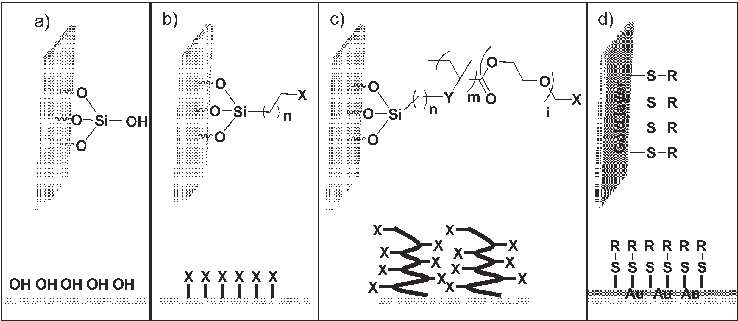
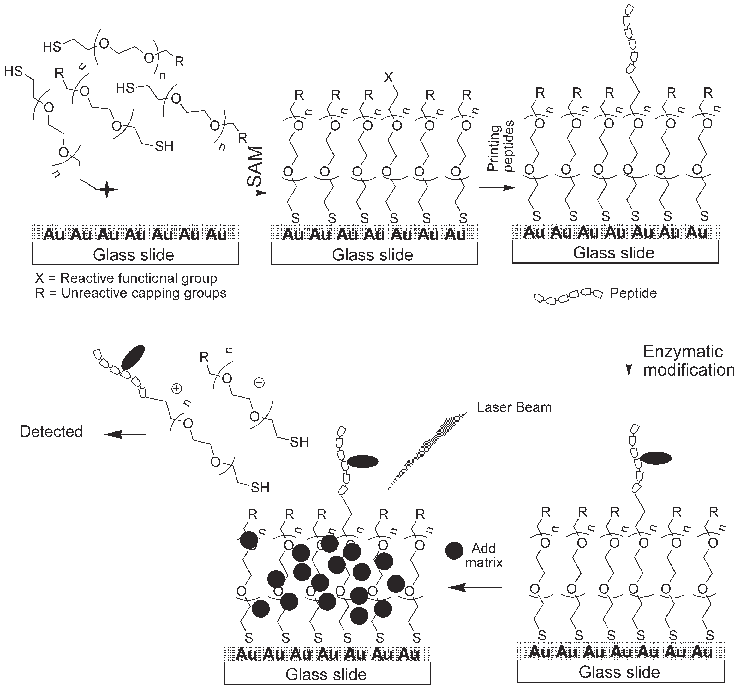
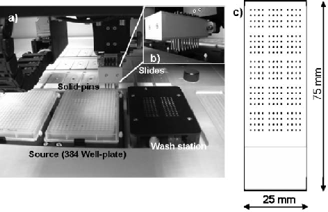
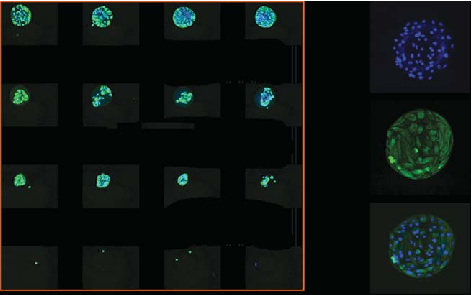
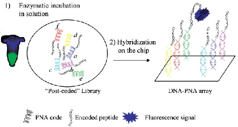
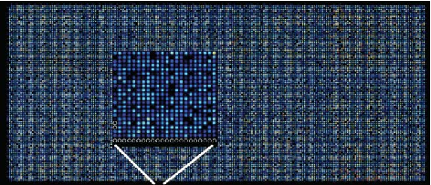
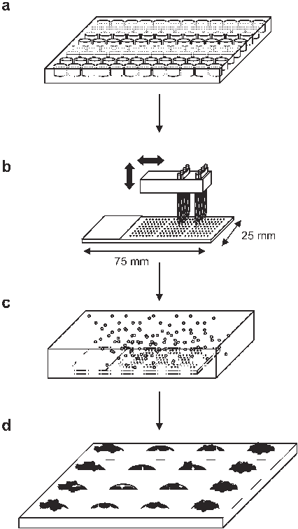

Published on 16 October 2006. Downloaded by University of North Carolina at Charlotte on 19/07/2013 12:07:58.

View Article Online / Journal Homepage / Table of Contents for this issue

TUTORIAL REVIEW www.rsc.org/csr | Chemical Society Reviews

# Microarray platforms for enzymatic and cell-based assays

Juan J. Dı´az-Mocho´n, Guilhem Tourniaire and Mark Bradley*

Received 1st June 2006 First published as an Advance Article on the web 16th October 2006 DOI: 10.1039/b511848b

This tutorial review introduces the uninitiated to the world of microarrays (or so-called chips) and covers a number of basic concepts such as substrates and surfaces, printing and analysis. It then moves on to look at some newer applications of microarray technology, which include enzyme analysis (notably kinases and proteases) as well as the growing enchantment with so-called cell-based microarrays that offer a unique approach to high-throughput cellular analysis. Finally, it looks forwards and highlights future possible trends and directions in the microarray arena.

in the development of this technology with the need for new reagents, surfaces, fluorophores and attachment strategies.

Abbreviations

ECM Extra Cellular Matrix FRET Fluorescence Resonance Energy Transfer PNA Peptide Nucleic Acids RNAi RNA interference SAM Self-assembled monolayer

Microarrays consist of a 2D grid of a large number of unique materials deposited at known or defined locations on a solid substrate (originally glass or silicon). The original materials deposited were peptides, giving rise to peptide arrays.1 However, it has been arrays prepared by the deposition of known DNA sequences, which have been used for massive parallel genomic analysis, for example looking at large numbers of genes sets simultaneously, that have really ignited the area.2 The scale of the parallelisation that this technology can offer can be appreciated by the fact that the number of features (different materials spotted on the array) can easily exceed 10,000. Importantly, each feature can be interrogated in its own right, acting as an independent assay. Additional advantages are the fact that microarray platforms are inherently self-consistent and internally competitive since all the experiments are being carried out under essentially identical reaction conditions, while only using minute amounts of material. Within the field of chemical biology, where biological entities are being increasingly perturbed on a global scale (e.g., libraries of RNAi), microarrays offer huge opportunities to study a wide portfolio of outputs in response

1 Introduction

Over the past decade, advances in the fields of combinatorial chemistry, genomics and proteomics have necessitated the development of a variety of high-throughput methodologies that allow multiple assays to be carried out in parallel. Among the most successful of these new screening tools are microarrays. This tutorial review briefly introduces the basic concepts behind microarray technologies before reviewing two important recent avenues being exploited using this powerful tool, namely the interrogation of enzymes and cells. It should be emphasised that chemists have a key role to play

School of Chemistry, University of Edinburgh, Kings Buildings, West Mains Road, Edinburgh, UK EH9 3JJ. E-mail: mark.bradley@ed.ac.uk

Guilhem Tourniaire was born in 1978 in Toulouse, France. He obtained his DUT in C h e m i s t r y f r o m t h e University of Montpellier in 1999. He then moved to the United Kingdom, and completed an MChem course at Kingston University, which included a year-long placement in industry (BASF, Gosport). He commenced his PhD, sponsored by Asahi Kasei, under the supervision of Professor Mark Bradley in 2002. His PhD research is

Juanjo was born in 1973 in the Andalusian town of Jae´n, Spain. He obtained his degree in Pharmacy Sciences from the University of Granada in 1996. He received an Erasmus scholarship to join the Pellicari group in Perugia, Italy. Then he started his PhD studies in the Department of Organic and Medicinal Chemistry in Granada under the supervision of Prof. Espinosa, obtaining his PhD in 2001. In 2002, he joined the Bradley group in Southampton with a Spanish government scholarship,

Juan J. Dı´az-Mocho´n Guilhem Tourniaire

focused on the development of high-throughput methods for the evaluation of the biocompatibility of polymer libraries.

moving to Edinburgh in 2005. His initial project with Prof. Bradley focused on the use of DNA microarray technologies and their interfacing with PNA-encoded combinatorial libraries.

Published on 16 October 2006. Downloaded by University of North Carolina at Charlotte on 19/07/2013 12:07:58.

Fig. 1 Schematic representation of glass slides. (a) ‘‘Naked’’ glass slide. (b) Chemically modified glass slide where X can be an amine, aldehyde, carboxylic acid, epoxide, halide, hydroxyl etc. (c) Glass slides coated with polymers which add a 3D structure to the glass surface where X can be a range of functional groups such as amines or carboxylic acids or active esters. Acrylamides and PEG-based polymers are the most widely used. (d) Glass slides coated with gold.

to chemical insult or perturbation while generating a plethora of data of either a static or kinetic origin. There are, however, a number of caveats that must be considered, notably the need for internal controls, for appropriate replicates of all experiments on the same chip (remote to each other to avoid issues of surface variations) and for duplicates (at least) of all experiments.

2 The preparation of microarrays

2.1 The substrate and coatings

The surfaces of choice for many microarray applications are traditional glass slides (typically measuring 75 mm 6 25 mm),

Professor Mark Bradley was awarded a first class degree in chemistry from the University of Oxford in 1986 and his D.Phil., awarded in 1989, was performed under the supervision of Professor Sir Jack Baldwin in the area of penicillin biosynthesis. This was followed by a period of postdoctoral research at Harvard Medical School with Professor Chris Walsh in the areas of molecular biology and protein chemistry. He was at the University of Southampton

Mark Bradley

from 1992–2004, initially as an independent Royal Society University Research Fellow (1992–1999), during which time he was awarded a personal chair in Combinatorial Chemistry (1997). In 2005 he took up his current position as Professor of High-Throughput Chemical Biology in Edinburgh. His group has published over 160 articles in the form of papers, reviews and book chapters. Professor Bradley is the European associate editor of the ACS Journal of Combinatorial Chemistry, a founder member of the European Society of Combinatorial Sciences and co-founder of the spin-out Ilika Technologies.

which can be modified using a variety of chemistries (e.g., aminopropyl silanes, gold etc.) to give a range of chemically derivatised surfaces (Fig. 1). Glass surfaces can be globally modified to make them hydrophilic or hydrophobic to prevent/ reduce non-specific binding of proteins, cells or DNA or they can be modified to allow the specific attachment and immobilisation of the desired molecules or materials. Of particular note here are aldehyde surfaces which have been used to immobilise a variety of materials via oxime formation and amines via reductive amination.3 In order to enhance the biological and chemical accessibility of materials attached to the glass surface numerous spacers have been tried and tested, presenting more accessible and mobile ligands on the array. Spacers based on PEG have particularly found application.

Self-assembled monolayer (SAM) arrays based on the ability of both thiols and disulfides to spontaneously organise themselves on gold surfaces have also found application in microarray chemistry4 (Fig. 1d). Well-packed self-assembled monolayers can prevent interactions between ‘‘naked’’ surfaces and enzymes and substrates, while the Au–S bond, although strong, can be cleaved via irradiation, allowing molecules attached onto the gold surfaces to be desorbed and detected by mass spectrometry (MALDI-TOF MS) (Fig. 2).

Glass slides can also be polymer coated, often to give a socalled 3D hydrogel layer.5 These polymer coatings are such that they may contain reactive functional groups to allow covalent immobilisation of the desired target molecule onto the array. The advantage of such coatings is that the material of each feature is now presented in a 3D manner, offering more material for analysis and often better biological accessibility and stability (Fig. 1c). A number of companies have commercialised such slides and typical examples include CodeLink, based on a cross-linked polyacrylamide coating, but a wide range of other coatings based on PEGMA (polyethylene glycol methacrylate) have been reported (Fig. 1c).6

2.2 Printing

To generate microarrays, materials have to be spotted or deposited at defined xy coordinates onto the substrate of

Published on 16 October 2006. Downloaded by University of North Carolina at Charlotte on 19/07/2013 12:07:58.

Fig. 2 Microarrays formed on gold slides through self-assembled monolayers (SAMs). MALDI-TOF can be used to detect enzyme based modification of immobilised substrates.

choice, generally a glass slide which has been modified or coated in some manner. This is typically achieved in one of three ways: contact printing (split pins, solid pins or micropatterned stamps), inkjet printing or photolithography, although a number of other approaches have been demonstrated (e.g., Combimatrix prepare arrays by electrochemical synthesis). This process has to be highly precise (¡2 mm) and robotics are typically used to transport solutions from sources (e.g., 384 well plates) to slides (Fig. 3). The amount of solution deposited per spot is typically a few nanolitres and thus 10 mL of a solution will provide sufficient material for over 2000 chips or microarrays. The fact that such tiny amounts of material are required is one of the major advantages of microarrays, although this scale has some downsides such as the rapid evaporation of solvents from printed spots.

Following spotting, physical or chemical attachment to the surface can take place. In the original DNA arrays this was achieved by either covalent attachment of oligonucleotides to the substrate (e.g., amino modified oligos and reaction with aldehydes or epoxides on the glass slide); direct synthesis (e.g., photolithography or inkjet based synthesis onto the substrate); or absorption (PCR products spotted onto a poly-cationic glass surface).

Several groups have utilised self-assembled monolayers (SAM)4 and masking methods in order to pattern different

functionalities on a surface which are subsequently utilised to immobilise the molecules of choice (an example of such a technique is shown in Fig. 1d).

Fig. 3 (a) Robotic microarrayer (Genetix). (b) Enlarged image of the printing head containing solid pins. The solid pins are dipped into wells containing the solutions of the desired material and are transferred onto slides by contact printing. (c) Schematic representation of a printed slide (actual size 75 mm 6 25 mm). Every point represents a spot or feature which can vary in size (typically a few mm– 250 mm). Distances between the spots or features are controlled by the software.

Published on 16 October 2006. Downloaded by University of North Carolina at Charlotte on 19/07/2013 12:07:58.

All these various ‘‘printing’’ methods have been adopted for the many newer applications discussed in this review, but the basic philosophy remains in essence the same: the printing or deposition of small molecules, polymers, enzymes or cells onto the surface of the array in an addressable manner.

- 2.3 Feature density (number of spots)

DNA arrays typically have high densities of features (100– 2000 spots/mm2 for example). Cell-based microarrays are however normally limited by the size necessary to allow a statistically relevant number of cells to be bound and analysed to provide relevant and meaningful results. On the whole feature density is a compromise between the enhanced signals generated by larger features, the permissible separation between features (usually the separation is the same size as the spot size itself) and the number of materials that need arraying. The actual number of molecules attached to the surface and associated with any specific feature also needs to be considered.

This also brings up another crucial, yet often ignored point. Printing different types of molecules on an array can lead to radically different loadings (numbers of molecules) between the various features on the array. This means that internal controls are essential to achieve meaningful results. This is achieved in the area of DNA arrays by dual labelling, with relative, rather than absolute, levels of fluorescence being important but this is a common concern and should always be considered and addressed.

- 2.4 Examples of deposition

- 2.4.1 Protein immobilisation. Matrices of various types have been employed to both trap proteins and to maintain them in a viable, hydrated state. Hydrogels of various types and guises have been widely used for protein immobilisation, adding an extra dimension to the array (not only physically but chemically too!). Hydrogels in this case have been prepared from modified amino acids, polymers and carbohydrates.7 Hamachi,8 for example, used low-molecular weight hydrogelators based on a glycosylated bis-(cyclohexylmethyl) glutamate derivative, with the hydrogel trapping enzymes or peptides, giving rise to a semi-wet platform. Hydrogels have also been prepared from sol-gels made from colloidal suspensions of silicon oxide, which spontaneously generate a porous gel and encapsulate functional enzymes.9
- 2.4.2 Cell binding. Cellular membranes are composed of many different molecules and as a result, the principles underlying the immobilisation of cells are far more complex than for the immobilisation of single proteins. Cellular recognition provides a gentle, selective, route to cellular immobilisation based on the interaction of proteins present on the outer surface of the cells with complementary biomolecules on the substrate, e.g., antibodies or integrins. These types of interactions are the cornerstone of several cellbased microarray formats.

Other approaches have used surfaces that promote general cell adhesion where a monolayer of cells grows indifferently on both the substrate and the arrayed biomolecules. Such an

Fig. 4 Left panel: sub-array of 16 polymer spots using a composite image from two different filter sets (blue and green) after incubation with human epithelial cells. Right panel: an individual spot (300 mm diameter) scanned with a 206 objective using two different filter sets (upper and middle pictures) and the merged image (lower picture).10

approach has been used in the development of reverse transfection arrays. Another approach uses specific surfaces that are designed to prevent the binding of cells outside the deposited spots, resulting in a regular patterned array of cells.10 This has been achieved by a variety of methods such as coating slides with hydrophilic gels (polyacrylamide or agarose) or with proteins blocking cellular adsorption. The main advantage of this latter approach is that it facilitates subsequent detection and analysis as cells are only present on the spotted features, whereas in the monolayer approach analysis can be biased by the positioning and size of the analysed spots (see Fig. 4).

2.4.3 Synthetic lipids. Synthetic phospholipid bilayers have been designed to mimic the structural and functional characteristics and behaviour of in vivo cell membranes. Biologically active molecules of interest have been embedded within these membranes to allow the study of biological processes ranging from simple ligand–receptor interactions to complex cell–cell signalling and the study of interactions in which dimerisation or oligomerisation of the analytes of interest is necessary for a given biological signalling event. Several groups have investigated the multiplexing of lipid bilayer-supported assays by creating patterned arrays of lipid bilayer membranes. Yamazaki developed arrays of membranes on fused silica through lithographic procedures and successfully utilised these membrane arrays for the study of mammalian membrane proteins responsible for adhesion, antigen presentation and subsequent activation of intact T-cells.11

3 Detection methods, imaging and analysis

Most of the detection and imaging systems used in the field of microarrays rely on fluorescence detection, although mass spectrometry (MALDI-TOF),12 autoradiography13 and a variety of electrochemical based detection methods have been reported.14 This will undoubtedly see major changes and improvements in the coming years, with bright field imaging, surface plasma resonance and other non-labelling based methods having many advantages.

Published on 16 October 2006. Downloaded by University of North Carolina at Charlotte on 19/07/2013 12:07:58.

The specific fluorescent technology used for array imaging depends on the level of resolution necessary for the particular application and can be conveniently divided into two.

Low resolution systems (each pixel corresponding to approximately 5–10 mm) are based on standard DNA microarray scanners which are compatible with a range of fluorophores. These generate a single image of the whole microarray, with subsequent analysis generally carried out with commercial software (usually provided with the scanner) allowing quantification of fluorescence and identification of each spot. Traditionally, laser based scanners have been used, but for the chemist with the ability to modify and play with fluorophores, scanners with white light sources and dial-up filters offer much greater flexibility.

High resolution systems (down to 0.2 mm) are typically based on a conventional microscope fitted with a motorised stage that allows the automatic capture of a single high resolution image for each feature/spot and are ideal for cellbased work. A major issue comes from the handling and analysis of the very large data sets generated by these systems with GigaB’s of data easily being generated from a single scan of a 1000-feature microarray at a single fixed time-point on an XY stage with a couple of fluorophores. The use of pseudoconfocal imaging (3D spot analysis) with multiple fluorophores and real-time imaging leads potentially to Terabytes levels of data and offers major challenges to bioinformaticians. With developments in the field of high content screening several software packages (e.g., Pathfinder Imstar, CellProfiler etc.) have been developed to carry out automated image analysis. Such packages allow rapid analysis of multiple parameters (cell number, shape and size, fluorescent intensities, cellular localization of markers…) from hundreds of images in order to provide accurate and meaningful interpretations of various assays (Fig. 4).

4 Microarrays as tools for enzymatic analysis – kinases and proteases

There is a need to decipher the substrate specificities of a variety of enzymes (notably kinases and proteases) in an efficient manner. Although combinatorial methods have been used for some time in this area, microarray technologies have begun to play an important role in this deorphaning process.

4.1 Immobilised substrates

Ellman15 has studied a variety of proteases via the synthesis and immobilisation of a positional-scanning peptide library synthesised using traditional solid-phase peptide chemistry with all library members containing both a 7-aminocoumarin as a fluorogenic reporter and an alkoxyamino group at the C-terminus to allow immobilisation onto aldehyde groups on the glass slides. Treatment of these arrays with proteases allowed the protease to ‘‘scan’’ all the immobilised substrates and cleave those with the strongest recognition, with cleavage resulting in fluorescence signals. Major concerns regarding these assays are enzyme accessibility (see section 2), nonspecific binding as well as issues concerning the actual amounts of material printed on each spot and the essential need for

duplicates.16 Similar alkoxyamino peptides were prepared by SPOT synthesis, microarrayed and used to study kinases.17 In this case radioactive 32P-ATP and microarray autoradiography imaging were used for analysis but a variety of kinase assays have been developed on a microarray based format using fluorescently labelled antibodies for (phosphotyrosine and phosphoserine/threonine).18,19 Mrksich has used selfassembled monolayer arrays to immobilise peptides terminating in a PEG-spacer attached to a free thiol. c-Src kinase was used to phosphorylate tyrosine residues with autoradiography4 or MALDI-TOF12 (Fig. 2) used to look at substrate specificities. However, MS is not quantitative (unless specific factors are addressed) and this approach needs to be treated with caution. SAM of tailored peptides were developed by Corn20 to generate peptide microarrays within a microfluidic system which allowed the determination of the proteolytic activity of protein factor Xa and used surface plasmon resonance (SPR) imaging, an example of a free-label detection system.

Another approach to studying enzymes in a microarray format was reported by Diamond who contact printed a fluorescence reporting peptide library, in a glycerol rich buffer, onto a microscope slide. This allowed individual members of the peptide library to remain localised at defined positions in a solvated environment, without the possibility of desiccation (glycerol has very low volatility). Enzyme nanodrops were delivered to all elements of the array via ultrasonic aerosol spraying, simultaneously initiating all the reactions across the whole chip. Obviously, enzyme kinetics were perturbed (glycerol), but enzymes retained their catalytic properties. The authors recently profiled a large number of proteases21 using this methodology and developed this platform under the name of DiscoveryDot2.

A similar approach was used by Angenendt who used a contact robotic printer rather than an aerosol to initiate the reactions,22 although this method relies on the high accuracy of the robotic equipment during the two independent spotting steps.

Another way of determining the substrate specificity of enzymes is to use their natural substrates. This was reported by Kersten23 to study mitogen-activated protein kinases (MAPK) by printing 1690 purified proteins from Arabidopsis (a plant used as a model organism in plant biology and whose entire genome has been sequenced) onto nitrocellulose. These proteins were used as substrates for MAPK using radioactive ATP with phosphorylated proteins detected by autoradiography.

The issues of quantification and duplication are important and should again be highlighted here. Good robust microarray practice requires all spots to be quantified internally and duplicated (both across the same chip and with chip duplicates). Merely observing changes in fluorescence intensity (or MS or radiography intensity) is not normally sufficient to allow meaningful results to be drawn as these could simply result from loading/concentration variations or surface issues not associated with biological modification.

4.2 Immobilised enzymes

One of the main uses of protein arrays is to study families of enzymes to look at their differences in a single experiment.

Published on 16 October 2006. Downloaded by University of North Carolina at Charlotte on 19/07/2013 12:07:58.

Funeriu24 immobilised the whole family of cathepsins by printing onto hydrogel functionalised slides and screened them using fluorescence tagged affinity labels as potential inhibitors, allowing profiling of the whole family in a single experiment. In 2000, Snyder25 prepared an enzyme microarray following the cloning and purification of 119 protein kinases from Saccharomyces cerevisiae with immobilisation onto activated pre-fabricated moulded poly-dimethoxy silane (PDMS) microwells mounted onto glass slides. Radioactive detection was used to study the substrate specificity of the kinases using 17 different substrates (proteins) and 33P-ATP as the phosphate source, thus giving rise to 2023 results (17 substrates 6 119 enzymes).

4.3 Immobilised enzymatically modified libraries

As discussed in the previous sections, much effort has concentrated on solving the problems of interfacing surfaces and enzymes due to non-specific binding, denaturisation and accessibility issues. Although some improvements have been achieved, mainly with the use of hydrogels, there is another approach, namely the use of ‘‘addressing’’ in which soluble libraries of substrates are tagged with a postcode. This allows solution modification of the whole library, but then posting of individual letters (members of the library) to specific locations on a robust DNA chip for subsequent interrogation.

This approach combines solution phase enzymatic assays, combinatorial chemistry (to give the numbers) and microarray technologies, while maintaining the natural solution phase enzymatic environment. Obviously, the substrate library needs to be ‘‘post-coded’’ in order to achieve this.18,26 This methodology has been used to allow every single member of a 10,000 member FRET based peptide library to be linked to a unique PNA tag (the postcode, Fig. 5). PNA was chosen as a chemically robust form of DNA, readily synthesised with excellent stability to both chemical and biological processes and, importantly, clean hybridisation to complementary DNA sequences. These libraries were used to study proteases (FRET) and kinases (fluorescently labelled anti-phosphotyrosine antibody). A typical chip produced using this methodology is shown in Fig. 6 looking at 10,000 substrates.

A dual labelling strategy provides internal controls on all spots and allows the ratio between FAM/TAMRA to give real and unbiased cleavage quantification of all 10,000 peptides.

Fig. 5 Immobilisation of enzymatically modified peptide libraries. Interfacing DNA microarrays with PNA-encoded peptide libraries.

Fig. 6 A DNA microarray, containing 22,575 features, hybridised with a 10,000 member PNA-encoded peptide library.

This method allowed proteases to be profiled with 10,000 substrates using just 60 pmol of enzyme.

5 Cell-based microarrays

- 5.1 Introduction

Cell-based assays represent a significant activity within the biopharmaceutical industry where they serve as an early biological filter in various stages of the drug discovery process. They are widely used in the area of diagnostics, while also representing an essential tool for the validation of gene targets. In the future, with reduced animal experimentation cell-based assays will likely assume an even more prominent role. In the search for a miniaturised format allowing higher parallelisation, reduced cost and lower cell consumption, many groups have investigated the use of cell-based microarray technology. Like other microarray platforms, the success of cell-based microarrays relies on the development of stable and reproducible assays, which require careful selection and optimisation of various parameters such as the choice of surfaces, immobilisation methods and means of detection and analysis.

Cell-based microarray technologies are now emerging for a variety of applications, for example: transfection and lentivirus RNAi based microarrays for global gene function studies; microarrays of antibodies; glycans and proteins to study the nature and function of cell membrane components and microarrays of biomaterials for tissue engineering and small molecules for drug cytotoxicity studies.

- 5.2 Recent applications

Cell-based microarrays are still very much in their infancy, with most of the research published over the last five years. However, due to the great expectancy within this field, some excellent reviews summarising various applications in the field have already been published.27 As a result this review will only cover the latest and most important applications.

5.2.1 Advances in gene function study. Since the initial completion of the human genome project large collections of cloned cDNAs and more recently siRNA probes have been generated. Transfection microarrays have the potential to allow a large number of different genes to be screened in parallel for selective induction or repression of a given function or analysis of the over-expression of a particular gene product in cells and subsequent phenotypic analysis.

Published on 16 October 2006. Downloaded by University of North Carolina at Charlotte on 19/07/2013 12:07:58.

In this approach, a library of expression vectors are mixed with a matrix (gelatine) and printed onto a glass microscope slide and transfection reagents are added globally to the whole array.28 A layer of cells is grown on the array and after incubation cells growing on top of the lipoplex become transfected, giving rise to clusters of cells expressing the encoded protein which in turn results in a change in cellular phenotype. Initial experiments were carried out with expression constructs for libraries of cDNAs (often with dual GFP production), but more recently groups have reported the use of short interfering RNA (siRNA) and short hairpin RNA (shRNA) and viruses to knockdown the expression of selected genes.29 These can also be used to screen for the most suitable fragment to switch off a gene of interest. Transfection microarrays offer several advantages: they are compact, easy to handle, use small quantities of reagents and cell and provide a highly multiplexed assay.

However, a number of major issues still have to be addressed for this technology to be widely accepted. The method is only applicable to cells that transfect easily, it relies on manipulation of array data to find the spots actually involved. Over recent years, several strategies have been investigated to overcome such limitations. Yamauchi reported the use of an electroporation type transfection microarray30 suitable for use with primary cells whereas Bailey made use of viral vectors to improve the scope of the method.31 Another limitation of transfection microarrays is that they are only suitable for cells that adhere to the surface containing the expression vector although Bradley developed methodologies allowing the immobilisation of non-adherent cell lines using polymers as substrates (Fig. 7).10,32

The area of cell-based microarrays, for the identification and profiling of cell membrane composition and properties, is certainly one of the most successful with a wide range of microarray formats already developed, from the use of glycan microarrays used to identify and quantify carbohydrate mediated cellular adhesion to the use of peptide–major histocompatibility complex (peptide–MHC) microarrays that allow the detection of specific T-cells that recognise diseaserelated antigens in a mixed cell population.33

5.2.2 Cell-based microarrays for tissue engineering discovery. An area in which cell-based microarray technology is flourishing is in the discovery of new materials for cell biology and tissue engineering. Indeed, one of the major challenges in these fields is to develop methods for the restoration, maintenance and enhancement of tissue and organ function. In order to accomplish these goals it is essential to control the fate of the engineered tissues. One of the major obstacles to this is the limited availability of materials that can support the growth, proliferation and/or differentiation of specific cells and due to the immense diversity of cells there is no universal material for this purpose.

The discovery of materials for tissue engineering involves the study of cell adhesion, proliferation and differentiation on a variety of candidate substrates. The control of cell differentiation represents a major challenge and is a major area in stem cell research. Embryonic stem cells (ESC) have two defining characteristics: self-renewal and pluripotency. The

Fig. 7 Typical protocol for cell-based assays: (a) compounds/polymers/biomolecules to be printed are stored in 384/96 well microtitre plates, (b) molecules are arrayed onto the substrate, (c) the microarray is incubated in the media containing cells, (d) the microarray is visualised and cellular interactions are evaluated.

pluripotency of a cell is its ability to differentiate and give rise to many types of cells, hence potentially providing an unlimited source of adult cells such as bone, muscle, liver or blood cells. As a result, if one is able to control the differentiation of embryonic stem cells, then the engineering of any type of tissue should, in theory, be feasible.

The use of high-throughput approaches for the generation and analysis of new cell supports offers an important tool in finding correlations between the design and performance of such materials. Consequently, Anderson developed a microarray platform that allowed the microscale synthesis and screening of a library of poly(acrylates).34 Following the generation of the polymer library, ESC were incubated and were shown to differentiate on certain polymer spots. An alternative polymer microarray approach has also been developed to identify new substrates that can support the adhesion and growth of primary cells, which can prove difficult to culture in vitro.10 Cell compatibility was measured in terms of the total number of cells immobilised on each

Published on 16 October 2006. Downloaded by University of North Carolina at Charlotte on 19/07/2013 12:07:58.

polymer spot and these polymer microarrays allowed the rapid identification of several polymers of interest. Moreover, the high multiplexing ability of such screens permits the study of structure–activity relationships, which will ultimately bring about a better understanding of the factors affecting cellular adhesion and proliferation.

Another approach used to mediate cellular adhesion and differentiation is to coat a substrate directly with extracellular matrix proteins. Such methodology was recently applied in a study of the adhesion of three common cell lines (HEK, PC12 and NIH 3T3) to 14 different ECM proteins.35 Additionally, the adhesion of primary and immortalised chondrocytes to certain ECM proteins was investigated, and it was shown that these closely related cells had different adhesion profiles. Flaim printed 5 different ECM proteins, but this time in 32 different combinations, to study which of these protein mixtures could maintain the function of primary rat hepathocytes, and also drive the differentiation of mouse ESC toward an early hepatic fate.36 These studies demonstrated that microarray technology could be interfaced with the study of cell–ECM protein interactions and provide important insights into how to direct the in vitro differentiation of stem cells. Traditionally, ESC differentiation is carried out by supplementing the culture media with cytokines (messenger chemicals produced by various cells, to influence the activity of other cells), or by the use of co-culture which involves the growing of ESC on a layer of feeder cells. Yamazoe used the latter approach and developed a model microarray experiment based on an array of 3 different feeder cells used as a support to direct the differentiation of ESC towards neuronal cells.37 After 8 days of ESC culture onto the 3 different feeder cells, differentiation towards the neuronal cell type was assessed by immunocytochemical staining, and reverse transcription polymerase chain reaction analyses. Both methods showed that only the ESC grown onto stromal PA6 cells presented neural markers.

5.2.3 Cell-based microarrays for small molecule screening. Cell-based screens represent about 50% of all screening activities within the biopharmaceutical industries, thus there is huge pressure for the development of highly parallelised, miniaturised and reliable assays. Bradley developed the first microarray format using small molecules embedded within a gelatin matrix. This microarray was successfully utilised to screen arrays of HEK cells with fluorescence detection of cells.38 Later Sabatini39 embedded small molecules into a biodegradable polymer and carried out cell-based screenings to test potential antitumoral activities.

Lee developed a cell-based microarray platform for metabolising enzyme toxicology assays (MetaChip).40 In their approach, the authors encapsulated different isoforms of the cytochrome P450 in sol-gel spots and then printed different concentrations of 3 anticancer prodrugs onto these spots. The slide containing the P450 sol-gels and prodrug solutions was subsequently stamped onto a monolayer of human breast cancer cells (MCF7). After 6 hours of incubation, the cytotoxicity of the metabolites was evaluated by measuring the percentage of dead cells in contact with each spot and calculating the LD50. Finally, the cytotoxicity results were confirmed by traditional solution phase reactions.

6 Conclusions

This review shows the potential of the microarray platform in the areas of enzymatic assays and cell binding as well as some of the issues and demands being placed upon existing technologies. Clearly, these activities are only going to increase and microarray applications are going to broaden over the coming years. The challenges to chemists and chemical biologists are to engage in the application of these tools to address, ask and answer biological questions and to apply the power of chemistry as an enabling tool not only as a method of enhancing microarray efficiency, application and scope but also as a high-throughput device for chemistry and materials discovery in its own right. Chemists have a key role to play in the future development of this technology. New and improved reagents are increasingly sought, for example, fluorophores with improved stabilities, intensities and shifts towards lower energy fluorescence and narrower emissions. Sensitive, reliable and label free quantitative methods of detection will undoubtedly be targeted by chemists and will provide a major focus for future research direction.

Key challenges for the future are to develop the tools to allow array fabrication with increasingly diverse ranges of materials, miniaturisation allowing much higher chip densities and functional assays, improved detection methods and biocompatibility along with improvements in data handling and informatics with unparalleled levels of data collection and analysis becoming a routine requirement.

Acknowledgements

We would like to thank the EPSRC (LSI) and the BBSRC for financial support.

References

- 1 S. P. Fodor, J. L. Read, M.C. Pirrung, L. Stryer, A. T. Lu and D. Solas, Science, 1991, 251, 767.
- 2 M. Schena, D. Shalon, R. W. Davis and P. O. Brown, Science, 1995, 270, 467.
- 3 N. Zammatteo, L. Jeanmart, S. Hamels, S. Courtois, P. Louette, L. Hevesi and J. Remacle, Anal. Biochem., 2000, 280, 143.
- 4 C. S. Chen, M. Mrksich, S. Huang, G. M. Whitesides and D. E. Ingber, Biotechnol. Prog., 1998, 14, 356; B. T. Houseman, J. H. Huh, S. J. Kron and M. Mrksich, Nat. Biotechnol., 2002, 20, 270.
- 5 R. Ramakrishnan, D. Dorris, A. Lublinsky, A. Nguyen, M. Domanus, A. Prokhorova, L. Gieser, E. Touma, R. Lockner, M. Tata, X. M. Zhu, M. Patterson, R. Shippy, T. J. Sendera and A. Mazumder, Nucleic Acids Res., 2002, 30, e30; W. Senaratne, L. Andruzzi and C. K. Ober, Biomacromolecules, 2005, 6, 2427 and references therein.
- 6 M. Beyer, T. Felgenhauer, F. R. Bischoff, F. Breitling and V. Stadler, Biomaterials, 2006, 27, 3505.
- 7 P. Arenkov, A. Kukhtin, A. Gemmell, S. Voloshchuk, V. Chupeeva and A. Mirzabekov, Anal. Biochem., 2000, 278, 123.
- 8 S. Kiyonaka, K. Sada, I. Yoshimura, S. Shinkai, N. Kato and

- I. Hamachi, Nat. Mater., 2004, 3, 58.

9 C. B. Park and D. S. Clark, Biotechnol. Bioeng., 2002, 78, 229. 10 G. Tourniaire, J. Collins, S. Campbell, H. Mizomoto, S. Ogawa,

- J. F. Thaburet and M. Bradley, Chem. Commun., 2006, 2118.

- 11 V. Yamazaki, O. Sirenko, R. J. Schafer, L. Nguyen, T. Gutsmann, L. Brade and J. T. Groves, BMC Biotechnol., 2005, 5, 18.
- 12 D. Min, J. Su and M. Mrksich, Angew. Chem., Int. Ed., 2004, 43, 5973.

Published on 16 October 2006. Downloaded by University of North Carolina at Charlotte on 19/07/2013 12:07:58.

- 13 S. Weng, K. Gu, P. W. Hammond, P. Lohse, C. Rise, R. W. Wagner, M. C. Wright and R. G. Kuimelis, Proteomics, 2002, 2, 48.
- 14 K. Dill, D. D. Montgomery, A. L. Ghindilis, K. R. Schwarzkopf, S. R. Ragsdale and A. V. Oleinikov, Biosens. Bioelectron., 2004, 20, 736.
- 15 C. M. Salisbury, D. J. Maly and J. A. Ellman, J. Am. Chem. Soc., 2002, 124, 14868.
- 16 P. J. Halling, R. V. Ulijn and S. L. Flitsch, Curr. Opin. Biotechnol., 2005, 16, 385.
- 17 M. O. Collins, L. Yu, M. P. Coba, H. Husi, I. Campuzano, W. P. Blackstock, J. S. Choudhary and S. G. N. Grant, J. Biol. Chem., 2005, 280, 5972.
- 18 J. J. Dı´az-Mocho´n, L. Bialy, L. Keinicke and M. Bradley, Chem. Commun., 2005, 1384; J. J. Dı´az-Mocho´n, L. Bialy and M. Bradley, Chem. Commun., 2006, 3984.
- 19 M. L. Lesaicherre, M. Uttamchandani, G. Y. J. Chen and S. Q. Yao, Bioorg. Med. Chem. Lett., 2002, 12, 2085.
- 20 H. J. Lee, A. W. Wark, T. T. Goodrich, S. Fang and R. M. Corn, Langmuir, 2005, 21, 4050.
- 21 D. N. Gosalia, C. M. Salisbury, J. A. Ellman and S. L. Diamond, Mol. Cell. Proteomics, 2005, 4, 626.
- 22 P. Angenendt, H. Lehrach, J. Kreutzberger and J. Glo¨kler, Proteomics, 2005, 5, 420.
- 23 T. Feilner, C. Hultschig, J. Lee, S. Meyer, R. G. H. Immink, A. Koenig, A. Possling, H. Seitz, A. Beveridge, D. Scheel, D. J. Cahill, H. Lehrach, J. Kreutzberger and B. Kersten, Mol. Cell. Proteomics, 2005, 4, 1558.
- 24 D. P. Funeriu, J. Eppinger, L. Denizot, M. Miyake and J. Miyake, Nat. Biotechnol., 2005, 23, 622.

- 25 H. Zhu, J. F. Klemic, S. Chang, P. Bertone, A. Casamayor, K. G. Klemic, D. Smith, M. Gerstein, M. A. Reed and M. Snyder, Nat. Genet., 2000, 26, 283.
- 26 N. Winssinger, R. Damoiseaux, D. C. Tully, B. H. Geierstanger, K. Burdick and J. L. Harris, Chem. Biol., 2004, 11, 1328.
- 27 B. Angres, Expert Rev. Mol. Diagn., 2005, 5, 769.
- 28 J. Ziauddin and D. M. Sabatini, Nature, 2001, 411, 107.
- 29 J. Moffat and D. M. Sabatini, Nat. Rev., 2006, 7, 177.
- 30 F. Yamauchi, K. Kato and H. Iwata, Nucleic Acids Res., 2004, 32, e187.
- 31 S. N. Bailey, S. M. Ali, A. E. Carpenter, C. O. Higgins and D. M. Sabatini, Nat. Methods, 2006, 3, 117.
- 32 A. Mant, G. Tourniaire, J. J. Diaz-Mochon, T. J. Elliott, A. P. Williams and M. Bradley, Biomaterials, 2006, 30, 5299.
- 33 J. D. Stone, W. E. Demkowicz and L. J. Stern, Proc. Natl. Acad. Sci. U. S. A., 2005, 102, 3744.
- 34 D. G. Anderson, S. Levenberg and R. Langer, Nat. Biotechnol., 2004, 22, 863.
- 35 C. Kuschel, H. Steuer, A. N. Maurer, B. Kanzok, R. Stoop and B. Angres, BioTechniques, 2006, 40, 523.
- 36 C. J. Flaim, S. Chien and S. N. Bhatia, Nat. Methods, 2005, 2, 119.
- 37 H. Yamazoe and H. Iwata, J. Biosci. Bioeng., 2005, 100, 292.
- 38 S. E. How, B. Yingyongnarongkul, M. A. Fara, J. J. DiazMochon, S. Mittoo and M. Bradley, Comb. Chem. High Throughput Screening, 2004, 7, 423.
- 39 S. N. Bailey, D. M. Sabatini and B. R. Stockwell, Proc. Natl. Acad. Sci. U. S. A., 2005, 101, 16144.
- 40 M. Y. Lee, C. B. Park, J. S. Dordick and D. S. Clark, Proc. Natl. Acad. Sci. U. S. A., 2005, 102, 983.

