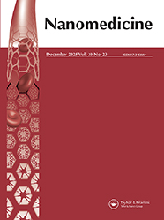

Nanomedicine

ISSN: 1743-5889 (Print) 1748-6963 (Online) Journal homepage: www.tandfonline.com/journals/innm20

Applying click chemistry principles to the design of tumor-targeted nanosystems

J. J. Diaz-Mochon & R. M. Sanchez-Martin

To cite this article: J. J. Diaz-Mochon & R. M. Sanchez-Martin (2025) Applying click chemistry principles to the design of tumor-targeted nanosystems, Nanomedicine, 20:23, 2809-2811, DOI: 10.1080/17435889.2025.2567837

To link to this article: https://doi.org/10.1080/17435889.2025.2567837

Published online: 07 Oct 2025.

Submit your article to this journal 

Article views: 501

View related articles

View Crossmark data

Full Terms & Conditions of access and use can be found at https://www.tandfonline.com/action/journalInformation?journalCode=innm20

NANOMEDICINE

2025, VOL. 20, NO. 23, 2809–2811

https://doi.org/10.1080/17435889.2025.2567837

# EDITORIAL

# Applying click chemistry principles to the design of tumor-targeted nanosystems

J. J. Diaz-Mochon a,b,c  and R. M. Sanchez-Martin a,b,c

aDepartment of Medicinal & Organic Chemistry, Unit of Excellence in Chemistry Applied to Biomedicine and the Environment, Faculty of Pharmacy,  University of Granada, Granada, Spain; bGENYO, Centre for Genomics and Oncological Research, Pfizer, University of Granada, Andalusian Regional  Government, PTS Granada - Avenida de la Ilustración, Granada, Spain; cInstituto de Investigación Biosanitaria ibs.GRANADA, Granada, Spain

# ARTICLE HISTORY

Received 29 June 2025; Accepted 25 September 2025 

For all advances in creating potent anti-cancer agents, their  success  is  consistently  undermined  by  a  fundamental,  and  frankly,  humbling  challenge:  targeted  delivery.  Systemic  administration inevitably leads to off-target toxicity, limiting  safe dosage and harming healthy tissues. Furthermore, tumors  erect formidable physical defenses; their dense microenvironment  and  chaotic  vasculature  create  high  internal  pressure  that  blocks  drug  penetration.  Specialized  anatomical  fortresses,  most  notably  the  blood–brain  barrier,  render  entire  organs  almost  inaccessible  [1,2].  This  failure  to  accumulate  therapeutic concentrations precisely at the site of disease is  not a minor hurdle – it is the central bottleneck that stifles  innovation  and  a  primary  reason  why  many  of  the  most  promising treatments fall short in the clinic.

This development has facilitated the assembly of multifunctional nanosystems with the fidelity of  a molecular  architect,  thereby  transforming  concepts  that  were  once  considered  beyond the limits of what was possible into tangible, reproducible, and highly controlled realities. This transition from a process  of  functionalisation  that  occurred  incidentally  to  one  of  the  assembly that is deliberate and designed has, at last, established  the robust chemical basis necessary to achieve the full potential  of targeted nanomedicine in clinical practice.

This new level of control is already making a profound impact.  We can now construct sophisticated nanosystems with unprecedented accuracy [8,9]. Active targeting ligands, including peptides for brain delivery and complex monoclonal antibodies, can  now be attached site-specifically to, for instance, lipid nanoparticle  surfaces.  This  ensures  optimal  orientation  and preserves  biological function, facilitating systemic mRNA delivery across  the  blood–brain  barrier  [10].  Equally  significant  is  its  role  in  enabling the design of biomimetic extracellular vesicles, as illustrated by the process underlying their production. The mimetics  are first enriched with bioactive ions, then finished with bone-  targeting alendronate ligands, added using metabolic glycoengineering  and  copper-free  Strain-Promoted  Alkyne-Azide  Cycloadditions (SPAAC) ligation [11]. In each case, click chemistry  ensures a uniform product with controlled ligand stoichiometry  and orientation. This process transforms the nanoparticle from  a mixture of elements into a true molecular machine. It is noteworthy that this novel paradigm of precision extends beyond  mere spatial control to encompass kinetic strategy. As the field  matures, it is becoming increasingly recognized that the ‘best’  click reaction is not necessarily the ‘fastest.’ Indeed, the rational  choice of ligation kinetics is itself a critical design parameter [12].  A slower, more deliberate reaction might be optimal for generating exceptionally stable products, such as an imaging probe  designed for long-term tracking. Conversely, the rapid kinetics of  a different reaction class becomes paramount when dealing with  unstable  biomolecules  or  time-sensitive  processes.  This  enhanced understanding has a significant impact on the selection process, as it provides a substantially expanded and synthetically accessible toolbox. Consequently, we are now in a position  to select the optimal reaction rate for a given biological context  [8,9,12].

For decades, the promise of cancer nanomedicine has been  to deliver therapies directly to tumors, sparing healthy tissue.  While researchers have long focused on overcoming biological  hurdles  like  the  Enhanced  Permeability  and  Retention  (EPR)  effect,  stromal  density  and  complex  nano-bio  interfaces,  an  equally significant challenge has been the chemistry itself with  inherent  limitations  on  the  architectural  complexity  and  homogeneity of our designs [3–5].

The  advent  of  click  chemistry,  pioneered  by  K.  Barry  Sharpless,  Morten  Meldal,  and  Carolyn  Bertozzi,  provided  a  revolutionary  solution.  At  its  core,  click  chemistry  is  like  molecular LEGOs: a set of highly reliable, specific, and efficient  reactions  that  allow  scientists  to  “click”  different  molecular  components together. This approach has transformed nanoparticle design from an art of approximation to a science of  precision [6,7]. This synthetic concept is not merely an incremental improvement; it is the arrival of a new chemical paradigm that enables precise molecular engineering and rational  assembly  of  molecularly  defined  therapeutic  systems.  The  principles of  this  chemistry,  namely  modularity,  quantitative  yields,  chemoselectivity,  and  bioorthogonality,  moving  us  beyond the statistical uncertainties of older conjugation methods [8,9]. Although several reactions meet the requirements,  the 1,3-dipolar cycloaddition of terminal alkynes and azides to  1,2,3-triazole has been the most popular.

It  is  important  to  note  that  this  approach  to  precision  extends  beyond  the  field  of  therapeutic  delivery,  reaching  the multimodal theranostic and analytical tools that are defining  the  leading  edge  of  our  field.  The  principle  of  orthogonality,  defined  as  the  capacity  to  execute  multiple,  mutually  exclusive  reactions  within  a  single  vessel,  has  enabled the development of complex platforms [13]. Recent  studies  on  iridium(III)  polypyridine  complexes  illustrate  this,  where  these  luminophores  are  used  as  versatile  click-ready  probes  for  multimodal  bioimaging  [14].  Beyond  this,  we  must also consider that a nanoparticle platform can be precisely  built  through  sequential,  orthogonal  click  reactions,  layering distinct functionalities. This design enables correlative  analyses that combine time-resolved photoluminescence lifetime imaging with high-resolution elemental mapping using  synchrotron-based X-ray fluorescence nanoimaging. Coupled  with bioorthogonal chemistry to detect metabolic reporters in  cells, these integrated datasets provide unprecedented molecular  and  elemental  insight.  This  approach  exemplifies  the  seamless fusion of synthetic chemistry and advanced imaging,  where  the  chemistry  that  constructs  nanoparticles  concurrently  illuminates  their  dynamic  biological  interactions  [15].  Of particular note is that click chemistry’s modular precision  is revolutionizing biomolecular analysis by enabling the selective enrichment of rare targets – such as phosphoinositides –  via “click cluster” constructs on magnetic beads. This powerful  approach streamlines advanced mass spectrometry and brings  a remarkable symmetry to the field: the very chemical principles  enabling  the  assembly  of  sophisticated  nanomedicines  are also harnessed for their interrogation [15].

CONTACT J. J. Diaz-Mochon  juandiaz@go.ugr.es; 

R. M. Sanchez-Martin  rmsanchez@go.ugr.es  Department of Medicinal & Organic Chemistry, Unit of  Excellence in Chemistry Applied to Biomedicine and the Environment, Faculty of Pharmacy, University of Granada, Granada 18071, Spain

© 2025 Informa UK Limited, trading as Taylor & Francis Group

2810 J. J. DIAZ-MOCHON AND R. M. SANCHEZ-MARTIN

Perhaps the most exciting frontier is using click chemistry  inside  the  body.  Instead  of  delivering  a  complete,  complex  drug, we can send in smaller, separate components that find  the tumor and then “click” together to form the active therapeutic  on-site.  This  approach,  known  as  pretargeting  or  in situ self-assembly, promises unprecedented specificity and  could dramatically reduce side effects [13,16]. Liquid biopsy  approach  for  cancer  early  detection  has  been  achieved  by  implementing click chemistry for selective enrichment of cancer-derived extracellular vesicles (EV), enabling sensitive and  specific quantification of tumor-associated EV subpopulations  from plasma samples [17]. On another front, the extraordinary  kinetics  of  the  inverse  electron-demand  Diels-Alder  (IEDDA)  reaction  are  redefining  what’s  possible  in  clinical  imaging  and  therapy.  Pretargeting  strategies,  now  clinically  viable,  exploit this chemistry with precision: a slow-clearing antibody,  equipped with a trans-cyclooctene handle, accumulates at the  tumor  before  a  fast-clearing  tetrazine-bearing  radiopharmaceutical  is  introduced.  The  resulting  in  vivo  ligation  –  swift  and bioorthogonal – yields high-contrast images and exceptional therapeutic specificity, minimizing radiation exposure to  healthy  tissue  while  targeting  malignancy  with  remarkable  accuracy.  This  elegant  interplay  of  timing  and  chemistry  is  setting  new  standards  in  precision  cancer  care  [18].  Recent  studies have demonstrated that large, complex PROTACs (proteolysis-targeting  chimeras),  which  often  suffer  from  poor  pharmacokinetic  properties,  can  be  deconstructed  into  two  smaller, drug-like precursors [19]. These components, tagged  with  complementary  bioorthogonal  handles,  can  be  co-  encapsulated into a single targeted nanocarrier. Upon delivery  to  the  tumor,  they  are  released  and  subsequently  self-  assemble via an IEDDA reaction, forming the active PROTAC  precisely  at  its  site  of  action  [20].  This  strategy  represents  a fundamental shift from simply delivering a drug to delivering the instructions for its final synthesis exactly where it is  needed.

Successful  application  requires  careful  attention  to  the  in  vivo  stability  of  click-derived  linkers  (eg  hydrolysis,  enzymatic  degradation,  and  competitive  exchange)  to  prevent  premature  release  or  detachment  of  targeting  moieties  –  which would compromise tumor selectivity and reduce therapeutic  efficacy.  Therefore,  potential  immunogenicity  from  newly introduced chemical motifs or residual catalysts has to  be considered. Then, the complexities of maintaining reproducibility  and  purity  during  large-scale  synthesis  are  an  additional key point. Addressing these challenges is essential to  translate click-modified nanosystems for clinical applications,  balancing advanced functionality with safety, manufacturability, and regulatory compliance [2–5,21].

The evolution of click chemistry continues to open new  doors for nanomedicine. Beyond the established reactions,  a  powerful  new  suite  of  tools  –  including  Sulfur  fluoride  exchange  (SuFEx),  PFEx,  and  SeNEx  –  is  emerging  [8].  These  chemistries  introduce  unique  reactive  properties  that are highly advantageous for building therapeutic nanosystems. The exceptional stability of SuFEx linkages provides  the  durability  needed  for  in  vivo  applications,  while  PFEx  and SeNEx expand our ability to selectively modify complex  biological  targets.  Perhaps  most  importantly,  their  metal-  free character removes a significant hurdle for clinical translation  by  reducing  potential  toxicity.  In  embracing  these  new reactions, the field is not just adding more tools, but  enhancing its capacity for the modular, efficient, and reproducible  synthesis  of  precisely  targeted,  next-generation  nanotherapeutics.  Ultimately,  click  chemistry  provides  the  robust and versatile foundation that nanomedicine has long  needed.  It  has  shifted  our  focus  from  simply  hoping  a nanoparticle reaches its target to rationally designing it  to  succeed.  By  providing  the  tools  for  precise  molecular  engineering, this chemical paradigm is not just improving  our existing strategies – it is enabling us to build the next  generation of truly targeted cancer therapies and diagnostics. The future of nanomedicine is not just being discovered; it is being deliberately and precisely constructed, one  click at a time.

# Author contributions

RMSM conceived the idea for the editorial, drafted the initial manuscript,  coordinated the revision process, revised the final version of the document  and  assisted  in  structuring  the  text.  JJDM  provided  conceptual  input,  contributed  key  references,  critically  revised  the  content,  and  reviewed and edited the initial version of the manuscript for submission.

# Disclosure statement

The authors have no relevant affiliations or financial involvement with any  organization or entity with a financial interest in or financial conflict with  the subject matter or materials discussed in the manuscript. This includes  employment, consultancies, honoraria, stock ownership or options, expert  testimony, grants or patents received or pending, or royalties.

No writing assistance was utilized in the production of this manuscript.

# Reviewer disclosure

Peer  reviewers  on  this  manuscript  have  no  relevant  financial  or  other  relationships to disclose.

# Funding

The  authors  acknowledge  the  financial  support  by  the  [MCIN/AEI/  10.13039/501100011033]  and  for  the  European  Union  Next  Generation  EU/PRTR  [PDC2022.133913.I00  and  PID2022-141065OB-I00];  the  Andalusian Regional Government-FEDER (Consejeria de Salud y Familia),  [PIP-0232–2021]  and  [PIP-0245–2024].  The  authors  are  members  of  the  NANOCARE  2.0  network  [RED2022-134560-T]  funded  by  MCIN/AEI/  10.13039/501100011033. 

ORCID

J. J. Diaz-Mochon  http://orcid.org/0000-0002-3599-1954 R. M. Sanchez-Martin  http://orcid.org/0000-0001-8912-9799

References

1. Zafar A, Khatoon S, Khan MJ, et al. Advancements and limitations in  traditional anti-cancer therapies: a comprehensive review of surgery,  chemotherapy,  radiation  therapy,  and  hormonal  therapy.  Discov Oncol. 2025;16(1):607. doi: 10.1007/s12672-025-02198-8

2. Ortega-Liebana MC, Sanchez-Martin RM. Nanomedicine basics. ACS  In Focus. 2025. doi: 10.1021/acsinfocus.7e9013

3. Mitchell  M,  Billingsley  M,  Haley  R,  et  al.  Engineering  precision  nanoparticles  for  drug  delivery.  Nat  Rev  Drug  Discov.  2021;20:101–124. doi: 10.1038/s41573-020-0090-8

4. Anchordoquy  T,  Artzi  N,  Balyasnikova  I,  et  al.  Mechanisms  and  barriers  in  nanomedicine:  progress  in  the  field  and  future  directions.  ACS  Nano.  2024;18(22):13983–13999.  doi:  10.1021/acs  nano.4c00182

5. Tiwari R, Kolli M, Chauhan S, et al. Tabletized nanomedicine: from  the  current  scenario  to  developing  future  medicine.  ACS  Nano.  2024;18(18):11503–11524. doi: 10.1021/acsnano.4c00014

6. Devaraj  NK,  Finn  MG.  Introduction:  click  chemistry.  Chem  Rev.  2021;121(12):6697–6698. doi: 10.1021/acs.chemrev.1c00469

7. Wu  P.  The  Nobel  Prize  in  Chemistry  2022:  fulfilling  demanding  applications  with  simple  reactions.  ACS  Chembiol.  2022;17 

(11):2959–2961. doi: 10.1021/acschembio.2c00788

8. Ghosal  K,  Bhattacharyya  SK,  Mishra  V,  et  al.  Click  chemistry  for  biofunctional polymers: from observing to steering cell behavior. 

NANOMEDICINE 2811

Chem  Rev.  2024;124(23):13216–13300.  doi:  10.1021/acs.chemrev.  4c00251

9. Mehak SG, Singh R, Singh R, et al. Clicking in harmony: exploring  the  bio-orthogonal  overlap  in  click  chemistry.  RSC  Adv.  2024;14 

(11):7383–7413. doi: 10.1039/D4RA00494A

10. Han EL, Tang S, Kim D, et al. Peptide-functionalized lipid nanoparticles for targeted systemic mRNA delivery to the brain. Nano Lett.  2025;25(2):800–810. doi: 10.1021/acs.nanolett.4c05186

11. Jiang H, Zhu X, Yu J, et al. Biomimetic extracellular vesicles based  on composite bioactive ions for the treatment of ischemic bone  disease.  ACS  Nano.  2024;18(51):34924–34948.  doi:  10.1021/acs  nano.4c13028

12. Luu T, Gristwood K, Knight JC, et al. Click chemistry: reaction rates and  their  suitability  for  biomedical  applications.  Bioconjugate  Chem.  2024;35(6):715–731. doi: 10.1021/acs.bioconjchem.4c00084

13. Khandelwal D, Bhattacharya A, Kumari V, et al. Leveraging nano-

materials for ultrasensitive biosensors in early cancer detection: a  review.  J  Mater  Chem  B.  2025;13(3):802–820.  doi:  10.1039/  d4tb02107j

14. Rigolot V, Simon C, Bouchet A, et al. Click-ready iridium(III) com-

plexes as versatile bioimaging probes for bioorthogonal metabolic  labeling.  RSC  Chem  Biol.  2025;6(3):364–375.  doi:  10.1039/  d4cb00255e

15. Nguyen DPL, Le HT, Kim DH, et al. Enrichment and MALDI-TOF-MS  /MS analysis of phosphatidylinositol bisphosphates in brain tissue.  Anal Biochem. 2025;698:115749. doi: 10.1016/j.ab.2024.115749 16. Bauer D, Cornejo MA, Hoang T, et al. Click chemistry and radiochemistry: an update. Bioconjugate Chem. 2023;34(11):1925–1950.  doi: 10.1021/acs.bioconjchem.3c00286

17. Zhao C, Wang Z, Kim H, et al. Identification of tumor-specific surface  proteins  enables  quantification  of  extracellular  vesicle  subtypes  for  early  detection  of  pancreatic  ductal  adenocarcinoma.  Adv Sci. 2025;12(21):2414982. doi: 10.1002/advs.202414982

18. Yuen  D,  Feeney  OM,  Noi  L,  et  al.  Nanobody-mediated  cellular  uptake  maximizes  the  potency  of  polylysine  dendrimers  while  preserving  solid  tumor  penetration.  ACS  Nano.  2025;19  (6):6044–6057. doi: 10.1021/acsnano.4c10851

19. Yang C, Tripathia R, Wang B. Click chemistry in the development of  PROTACs.  RSC  Chem  Biol.  2024;5(3):189–197.  doi:  10.1039/  D3CB00199G

20. Xie S, Zhu J, Peng Y, et al. In vivo self-assembly of PROTACs by  bioorthogonal  chemistry  for  precision  cancer  therapy.  Angew  Chem Int Ed. 2025;64(11):e202421713. doi: 10.1002/anie.202421713

21. Baek  M-J,  Hur  W,  Kashiwagi  S,  et  al.  Design  considerations  for  organ-selective  nanoparticles.  ACS  Nano.  2025;15 

(15):14605–14626. doi: 10.1021/acsnano.5c00484

