Received December 6, 2019, accepted December 18, 2019, date of publication December 20, 2019, date of current version December 31, 2019.

Digital Object Identifier 10.1109/ACCESS.2019.2961230

# Smartphone-Based Diagnosis of Parasitic Infections With Colorimetric Assays in Centrifuge Tubes

PABLO ESCOBEDO 1, MIGUEL M. ERENAS 2,3, ANTONIO MARTÍNEZ OLMOS 3,4, MIGUEL A. CARVAJAL 3,4, MAVYS TABRAUE CHÁVEZ 5, M. ANGÉLICA LUQUE GONZÁLEZ 6,7, JUAN J. DÍAZ-MOCHÓN 3,5,6,7,8, SALVATORE PERNAGALLO 5,8, LUIS FERMÍN CAPITÁN-VALLVEY 2,3, AND ALBERTO J. PALMA 3,4

1Bendable Electronics and Sensing Technologies (BEST) Group, Department of Electronics and Nanoscale Engineering, University of Glasgow, Glasgow G128QQ, U.K.

- 2ECsens, Department of Analytical Chemistry, Faculty of Science, University of Granada, 18071 Granada, Spain
- 3Excellence Unit of Chemistry Applied to Biomedicine and Environment, University of Granada, 18071 Granada, Spain
- 4ECsens, Department of Electronics and Computer Technology, Sport and Health University Research Institute (iMUDS), University of Granada, 18071 Granada, Spain 5DestiNA Genomics Ltd., 18016 Granada, Spain 6GENYO Centre for Genomics and Oncological Research, Pfizer, Andalusian Regional Government, University of Granada, 18071 Granada, Spain

- 7Department Medicinal and Organic Chemistry, School of Pharmacy, University of Granada, 18071 Granada, Spain
- 8DestiNA Genomics Ltd., Edinburgh EH3 7PE, U.K. Corresponding author: Alberto J. Palma (ajpalma@ugr.es)

This work was supported in part by the Spanish Ministry of Economics and Competitivity under Project CTQ2016-78754-C2-1-R, in part by the European Regional Development Fund (ERDF), and in part by the DestiNA Genomica SL provided reagents, samples and Spin-Tube devices. The work of P. Escobedo was supported by the Spanish Ministry of Education, Culture and Sport (MECD), under Grant (FPU13/05032).

ABSTRACT A smartphone-based platform for the diagnosis of parasitic infections has been developed, tested and validated. The system is capable of making automatic and accurate analysis of millimetric colorimetric arrays in centrifuge collection tubes, which are well established tools used in clinical analysis. To that end, an Android-based software application has been developed, making use of the smartphone rear camera, enabling precise image processing of the colorimetric spot arrays. A low-cost plastic accessory has been developed using 3D-printing to provide controlled illumination, fixed sample positioning and cell phone attachment. The platform was then tested repeatedly for its size detection, edge blurriness and colour detection capabilities. A minimum spot radius of 175 µm is detectable when using the developed app, with a tolerance of 15%, corresponding to 0.25 % of the area where the spot array is printed. Spot edge definition has been studied up to 40% of blurriness, resulting in a low average percentage error of 1.24%. Colour detection follows the well-known Gamma correction function. Finally, the whole platform was tested and validated using real DNA to analyse for accurate discrimination of Trypanosomatid species, which are responsible for devastating diseases in humans and livestock. The smartphone-based platform can be further extended to other clinical analysis. Its simplicity and reliable performance mean it can be used in remote, limited-resource settings by relatively unskilled technicians/nurses, where diagnostic laboratories are sparsely distributed. The results can however be sent easily via the smartphone to medical experts as well as government health agencies.

INDEX TERMS Smartphone-based platform, parasitic diseases, colorimetric assay, diagnosis, image processing.

### I. INTRODUCTION

Smartphones today are handheld computers, with high performance microprocessors and memories, high quality

The associate editor coordinating the review of this manuscript and approving it for publication was Yakoub Bazi .

CMOS-based cameras and other integrated sensors, multiple communication capabilities (Bluetooth, RFID, 4G, etc.), powerful operating systems and versatile software toolkits for image and signal processing [1]. Because of such powerful hardware and versatile software features, smartphones have become one of the most ubiquitous tools in the human

VOLUME 7, 2019

This work is licensed under a Creative Commons Attribution 4.0 License. For more information, see http://creativecommons.org/licenses/by/4.0/ 185677

development, with around 2.5 billion users worldwide according to recent statistics [2]. These systems are normally cheaper than miniaturized analytical devices, they are globally widespread, easy to use for the non-trained public, and could significantly enhance medical and animal healthdiagnosticabilities,particularlyinsettingswithlimited resources [3]. Moreover, their data sharing capabilities can be used for fast transfer of analysis results to health care personnel to help in the diseases diagnosis.

These devices, mainly via their built-in camera, have been extensively used in bioanalytical and diagnosis applications [4]–[6], in microfluidics and paper-based immunoassays [7], [8] and as spectrometers [9] among many others. Smartphones have also shown powerful application potential using common devices based on colorimetric responsive assays to quantify diagnostic biomarkers [10], [11]. In this field, some important public health applications include tuberculosis [12] and HIV [13] detection. However, various factors can affect the reliability of image processing and as a reliable diagnostic tool. Although accessory-free devices are simpler and cost effective, external attachment is often required to ensure performance specifications are met, as equipment-free methods can suffer from poor repeatability as well as standardization problems due to reflections [14], sensor positioning and size [15] and location of the region of interest (ROI). These shortcoming can be addressed using attachments that provide constant illumination and fixed sample position, to significantly improve the image capture quality, [14], [16], [17] essential for clinical diagnostics where reliability is mandatory [4].

Leishmaniasis and Chagas disease are responsible for devastating diseases in humans as well as livestock, resulting in severe illness, causing millions of deaths per year, and with serious health and economic consequences for many countries [18], [19]. Among all the commercial and noncommercial existing tests for the detection of nucleic acids, our group has recently reported the development of a new ultra-low cost, easy and fast to use colorimetric assay for the diagnosis of Leishmaniasis and Chagas disease [20]. The novel colorimetric molecular assay integrates nucleic acid analysis by dynamic chemistry (Chem-NAT Technology) [21]–[23] with reverse dot-blot hybridization in a novel micro Spin-Tube device. The assay consists of a singleplex PCR step that amplifies a highly homologous DNA sequence that encodes for the RNA component of the large ribosome subunits of Leishmania major (L. major) and Trypanosoma cruzi (T. cruzi) respectively. The amplicons of the two different parasites can be readily identified, as each of them creates a unique spot pattern. The assay allows analyzing samples with relevant sensitivity. In our previous work [20], six different amounts of genomic DNA (50 ng, 5 ng, 0.5 ng, 0.05 ng, 0.005 ng, 0.0005 ng) were PCR amplified and analyzed by Spin-Tube devices. The lowest point that could be detected was 0.05 ng or 8.7 copies/µL of template. No results were observed for the two lowest genomic quantities, respectively 0.05 and 0.005 ng. These results confirmed that the limit of

detection of the assay depends on the PCR yield to provide sufficient template. Amounts ≥ 5 ng of genomic DNA used to generate saturated signals with almost no difference observable by naked eye [20].

In this study, the proposed smartphone-based diagnostic platform has been shown to be capable of making analysis of millimetric colorimetric arrays, as those fitting into the Spin-Tube. Although in the case of the Spin-Tube platform published by our group recently, [20] where the spot pattern recognition was undertaken by naked-eye (due the simplicity of the colorimetric pattern to needing to be analysed), further development of an automatized image capture system, such as a smartphone is an attractive option. Being able to take and process images of colorimetric arrays provides the following benefits: i) Reduction of human errors in pattern recognition when using untrained staff; ii) Creation of a permanent record that can be shared with health experts; iii) To enable not only qualitative pattern recognition, but also quantitative assessments through spot colour intensity measurement. Given the benefits coming from a smartphone-based platform, this has now been successfully developed, characterized and tested using real DNA analysis for parasite detection. A low-cost plastic accessory to provide controlled illumination and fixed sample and cell phone holding was designed and fabricated using a 3D printer. An Android-based software application has been programmed in the smartphone, able to recognize and quantify the colour coordinates of each circular-shaped spot in an array pattern. The entire sensing array has dimensions compatible with the inner diameter of a standard centrifuge collection tube.

#### II. MATERIALS AND METHODS A. SPIN-TUBE DEVICE FOR DIRECT DETECTION OF TRYPANOSOMATIDS PARASITES

The method consists of a single-plex PCR amplification of a highly conserved sequence of DNA, encoding for the RNA component of the large ribosome subunit, and capable of distinguishing single nucleotide variations between two different parasite species – the so-called ‘‘Single Nucleotide Fingerprints’’ (SNF). SNF sequencing analysis by dynamic chemistry is performed on the amplified fragments for species identification, using a simple colorimetric reaction in a novel micro-spin tube device. As reported in our previous work [20], this Spin-Tube device was designed to combine the dynamic chemical approach for nucleic acid reading (ChemNAT technology) with a colorimetric method in a plastic column and nylon membrane (Fig. 1A). As shown inFig.1B, the Spin-Tubeconsists of: i)acentrifuge collection tube; ii) an internal column for the assay with an external diameter of 10 mm; iii) a nylon membrane with a diameter of 0.8 mm (pre-spotted with abasic PNA probes) immobilized onto the bottom of the column via a plastic pressure ring; iv) Abasic molecular probes PNA1 and PNA2 were synthesized with amino-pegylated groups, to enable them to be covalently bonded and immobilized onto the permeable

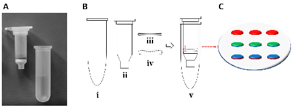

FIGURE 1. A) Spin-Tube device prototype. B) Plastic components for the Spin-Tube fabrication. C) Amide bond formation between pre-activated carboxylic acid groups of nylon membranes and primary amine groups of abasic probes (PNA1 and PNA2). Graphic layout of the array: In red, 3 biotin-labelled DNA oligomer controls; in green, 3 spots of abasic PNA2; in blue, 3 spots of abasic PNA1.

nylon substrate. The probes with fixed concentrations were printed using an automatic nano-plotter onto the nylon membrane within a 3 x 3 array (Fig. 1C). Two abasic probes (PNA1 and PNA2) were printed onto two parallel rows of three spots each (6 features in total, in red and blue in Fig. 1C respectively). Three control biotin-labelled DNA oligomers were also printed on the top row of the array, so as identify array orientation as well as to provide a labelling internal control (in red in Fig. 1 C). The signal pattern generated by the protocol allows the visual or photographic imaging of which species has caused the patient infection. L. major gDNA generated a signal ONLY at the abasic PNA2 probe (in blue in Fig. 1 C), while, T. cruzi gDNA generated signals for both abasic PNA probes (green and blue spots). The spin-tube platform was validated using PCR products from genomic DNA of both parasites and through analysis of the spot patterns. As reported elsewhere [20], PCR products were generated by amplifying aqueous samples containing 20 ng of human genomic DNA mixed with equal amount of either T. cruzi or L. major genomic DNA.

- B. DESIGN OF HARDWARE AND TEST ARRAYS In this study, we developed an innovative mobile phone hardware to accurately acquire, process and transmit the images coming from the Spin-Tube. The hardware consists of two parts: the mobile phone for acquiring and processing the image; and a plastic holder accessory to accurately position the centrifuge collection tube with the mobile phone (Fig. 2A and 2B). In this study a Samsung Galaxy S7 was used, whose rear camera has the following specifications: dual Pixel 12.0 MP (F / 1.7). The Android version installed on the device was 7.1.1 Nougat (level 25 API). The plastic accessory was created using a Witbox 2 desktop 3D printer (BQ, Madrid, Spain) and coal black polylactic acid (PLA) filament with a diameter of 1.75 mm. This low-cost 3D printer can be controlled with any open source software. We used Cura software to command and control the process parameters. The printed plastic accessory ensures the correct alignment and positioning of the mobile phone with the centrifuge collection tube and its membrane surface on which the reaction spots are created. This requires a minimum fixed

TABLE 1. Features of the printed spot arrays for platform evaluation. d refers to diameter in mm and b refers to blurriness in percentage (%).

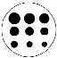

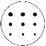

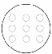

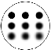

distance to enable a sharp image to be taken, which in this case is 4 cm (Fig. 2A). The support box has 4 white LEDs (NSDW510GS-K1, Nichia Corporation, Tokushima, Japan) that are supplied using standard AA batteries to homogeneously illuminate the centrifuge collection tube and obtain good image resolution (Fig. 2C and 2D). Different plastic holder boxes can be readily designed to cater for mobile phones such as Samsung, Huawei, Apple iPhone and so on.

To characterize the developed system, several 2-dimensional patterned arrays were printed using a Personal

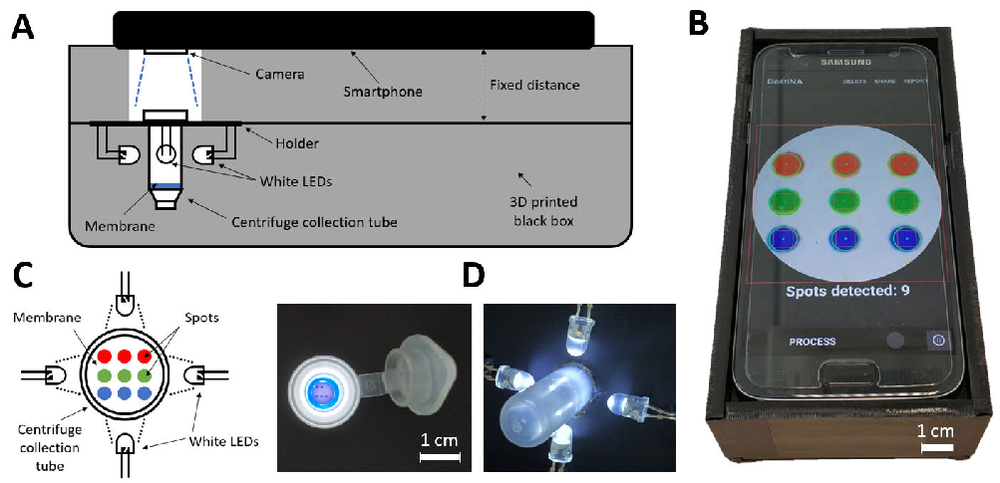

FIGURE 2. A) Lateral schematic view and B) photograph of the complete setup composed of the 3D printed accessory, the illuminated centrifuge collection tube and the smartphone. C) Top schematic view and D) photographs of the centrifuge collection tube with the white LEDs.

Arrayer 16 (CapitalBio Corporation, China) on a porous nylon membrane contained within a micro Spin-Tube device. Table 1 collects the characteristics of the different spot arrays in terms of size, grayscale, blurriness and colour (RGB coordinates). Among all the possible variations of pattern arrays, we have chosen those of Table 1 according to the below evaluation with real sensing arrays formed by a pattern of 3x3 spots (Fig. 2C). Our aim with these test arrays was to analyse the smartphone optical performance in terms of spot size and colour fidelity for different grayscales and blurriness. In this last case, blurriness can simulate imperfect printing conditions and/or an unfocused image.

Six replicas per pattern were taken with the developed app, which computes and stores information about location (x and y coordinates), radius r and RGB colour of each spot in the array. The colour inside each spot is computed using the average colour of the square circumscribed by the detected spot, thus avoiding the edge effect.

When a square is circumscribed by a spot, the diagonal of the square is equal to the spot diameter, as shown in Fig. 3. This is particularly useful in samples where the deposited or printed solution spreads in the substrate, producing an accumulation in the spot edge.

- C. ANDROID APPLICATION The Android application was designed to be particularly ‘user friendly’, recognizing the need for instructions to be as simple and as image-based as possible, rather than being language-based. This has a high important for eventual use in ‘at distance’ locations, where testing may be performed by relatively untrained and inexperienced personnel. The app

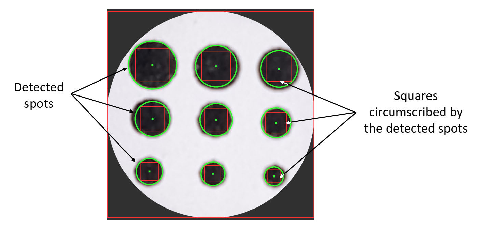

FIGURE 3. Screenshot of the app after processing the photograph of the pattern Black 1, showing the detected spots and the squares circumscribed by them.

consists of several screens that guide the user through the steps required for the acquisition and processing of a test result image. The whole process is summarized in Fig. 4. There is a welcome screen which includes a menu with two options: a) Option 1: Take a picture; b) Option 2: Upload a photo from the gallery. If the first option is chosen, the application starts the camera of the device so that the user can take a photo of the membrane inside the centrifuge collection tube. The app allows the user to easily zoom in and out to align/fit the template grid (a white circle superimposed on the screen) with the centrifuge collection tube array. The app processes the region of interest (ROI) circumscribed by the white circle, discarding the rest of the image, to improve the consistency of the processing. This masked image is then processed on the smartphone by means of the Circle Hough Transform (CHT). CHT is a feature extraction technique used in Digital Image Processing for detecting circular objects in

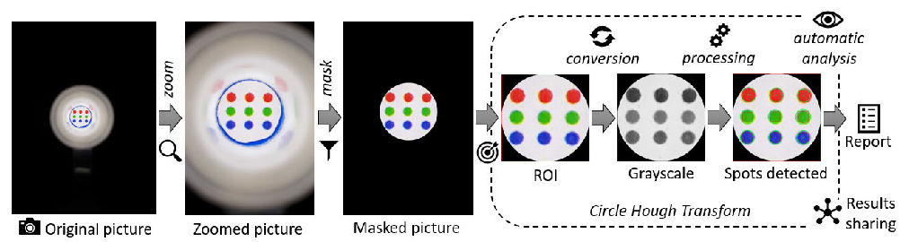

FIGURE 4. Image acquisition and processing workflow in the smartphone application.

imperfect digital image inputs [24]. Prior to the spot detection using CHT, the image is converted to grayscale and then a Gaussian blur filter is applied to reduce the noise and avoid false spot detection. Upon the completion of the processing, the array pattern is identified and the user can visualize either a detailed results view, or simplified view. Additionally, the app provides a report in plain text that is stored in the phone’s memory, and contains information about the specific recognized array. The results (both image and report) can be shared through email and/or different messaging services such as Facebook, Twitter and WhatsApp. For this, a ‘‘Share’’ button was created in the top menu of the application.

The algorithms developed to accomplish the acquisition and image processing tasks are based on open source computer vision OpenCV 3.1.0 Android library [25]. In particular, the function HoughCircles from OpenCV has been used to implement the circle detection in the centrifuge collection tube photograph. In principle, a spot/circle is mathematically represented according to its center coordinates (xcenter,ycenter) and its radius r as:

## (x − xcenter)2 + (y − ycenter)2 = r2 (1)

Since three parameters are necessary to represent a spot, we would need a 3D accumulator to make use of the CHT technique [24]. However, the OpenCV HoughCircles transform makes use of the so-called Hough Gradient method, which employs the gradient information of edges to be more efficient in terms of memory requirements and processing speed [26]. To that end, the image is first passed through a Canny edge detector, which noticeably reduces the amount of data that needs to be processed [27]. Then, the local gradient is computed for all the non-zero points in the result image from the edge detector. This is achieved using the Sobel operator to compute the x- and y-derivatives [28]. After that, every point along the line that this slope indicates is incremented in a two-dimensional accumulator, taking into consideration a specified minimum and maximum distance. Simultaneously, the algorithm stores the location of every one of these nonzero pixels. The centers of the candidate detected spots will be selected from the points in the accumulator. To be selected, these points must be above a given threshold and larger than

their neighbors. Therefore, the candidate centers are arranged in descending order according to their accumulator values. After that, all the non-zero points for each candidate center are sorted based on their distance to this center. Finally, a center is selected in case that: i) it has adequate support from the non-zero points around it, and ii) it is far enough from any previous center.

According to the previous explanation, the Hough Transform function applied in OpenCV to find the circles needs some critical parameters as arguments. The first parameter to be considered is the minimum distance that must exist between two candidate centers so that the algorithm considers them as two separate circles. In our case, this parameter was set to 0.5 mm, which is the result of considering three times the minimum printed radius (0.15 mm, see Table 1), allowing a 20 % of tolerance. This parameter needs to be set in units of pixels, so we have calculated the conversion between actual distance in the printed patterns and pixels in the smartphone screen taking a reference, obtaining that 1 pixel corresponds to 5.8 µm.

The next two parameters (param1 and param2) are the edge threshold that will be used by the Canny edge detector and the accumulator threshold, respectively. In this regard, param1 is related to sensitivity, setting how strong the spot edges need to be. As for param2, it establishes the amount of edge points that are needed to declare that a circle has been detected. Therefore, a compromise must be reached between these two parameters in order to correctly detect the spot for each scenario. The best values experimentally obtained for the correct recognition of each pattern are summarized in Table 2.

It can be observed from the table that edge threshold values need to be reduced as the circles are grayed out, reaching its minimum at the Grayscale 9 pattern. Regarding accumulator threshold value, it only needs to be slightly modified for the edge definition pattern and the different coloured patterns, allowing in these cases a lower number of edge points to detect a spot. The last two parameters that need to be considered when applying the Circle Hough Transform in OpenCV are the minimum and maximum radius of circles that can be detected. In our case, minRadius parameter was set to 0 while

- TABLE 2. Experimentally obtained values for the Canny edge detector threshold and accumulator threshold.

of the estimated radius value with respect to the true radius was below 7 % for all the spots, with a mean relative error of 3.2 % considering the 9 spots in the array. On the other hand, the mean relative error in the Black 2 pattern was 7.7 %, with a maximum error of 15.7 % for the smallest spot (300 µm of diameter). These results indicate that printed spots are more accurately detected for bigger spots (Black 1 pattern) than for smaller spots (Black 2 pattern), which is reasonable considering that spots are increasingly blurred in the photographs as their size decreases.

maxRadius was experimentally set to 1.5 mm as the biggest considered spot.

The OpenCV library is also available for the iOS platform as well as the Android OS, therefore the same algorithms can be potentially implemented on iOS smartphones and tablets. Android Studio 3.2 was used as the integrated development environment (IDE) to implement the mobile phone application. The application was designed and tested against API 25 (Android 7.1.1). However, it supports different Android versions as the lowest API level compatible with the application was API 21, which corresponds to Android 5.0.

### III. RESULTS

Before applying our platform as a diagnostic test, a number of tests were conducted to assess the system performance as developed, and to fully check and characterize the application. To do that, the different spot patterns described in Table 1 were used. Although a 3x3 spot pattern was predefined, we considered that a wide range of detection and functionality parameters needed to be studied in order to assess the fundamental versatility of the tools developed. Our aim was to explore the platform limits in terms of the quantification of spot size, colour and blurriness. Five replicates were tested for each spot pattern. In the cases where all the spots have the same size (i.e. grayscale and RGB patterns), this made a total of 40 replicates to obtain the average results and its standard deviation.

- A. SIZE DETECTION Firstly, patterns Black 1 and Black 2 (see Table 1) were used to find the minimum spot size that the app was able to detect, considering a maximum radius tolerance of 15 %. Our tests proved that a minimum spot size of 350 µm of diameter (175 µm of radius) was detectable by the developed app, with a radius tolerance below the previous defined threshold. This corresponds to 0.25 % of the area of the outer circle where the spot array is printed. The radius recovered in a detected spot has been defined as a figure of merit for characterizing the app. It is the result of dividing the averaged detected radius of each spot by the actual radius of the printed spot. On average for all the cases in these two patterns (Black 1 and Black 2), the radius recovered by our detection app was above 95%. In the case of Black 1 pattern, the relative error

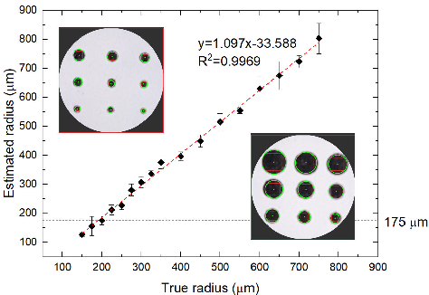

FIGURE 5. Spot radius estimation in comparison with true radius for the cases of Black 1 and Black 2 patterns. Horizontal dashed line indicates the minimum detectable spot size (350 µm of diameter or 175 µm of radius) considering a maximum radius tolerance of 15%.

Fig. 5 shows the spot radius estimation obtained with our system for the different spot sizes in Black 1 and Black 2 patterns in comparison with the true radius of each printed spot. It can be observed a very good correlation between both values for the whole considered range, so we can state that the developed system performs reliably in terms of spot size detection.

- B. EDGE BLURRINESS Edge definition was studied by changing the blurring of the printed circles from 0% (edges perfectly defined) up to 40% (edges quite blurry), as depicted in Table 1. The circles were detected for all the blurriness conditions, resulting in an average recovered spot radius of 506 ± 3 µm. This means a percentage error of 1.24% with respect to the true spot radius (500 µm). Therefore, our system is capable to spot detection even in case of unfocused images or imperfect printed spots, showing high reliability.
- C. COLOUR DETECTION To quantify the colour variation of the detected spots, the R, G and B coordinates given by our application after the image processing were analysed. To that end, five replicates of each Grayscale pattern (see Table 1) were processed with our system, computing the mean value of all the spots in each pattern, so as to obtain the three colour coordinates per pattern.

That means that each colour coordinate is the result of averaging the detected colour inside a total of 45 spots. As show in Table 1, the Grayscale 1 pattern contains the full black spots (R = 0, G = 0, B = 0), while the Grayscale 11 pattern contains the full white-coloured spots (R = 255, G = 255,

- B = 255). These white spots are framed by a solid black line so that the application is able to detect the circles and compute the colour coordinates inside them. The RGB results obtained from these two patterns were used to apply a correction in the colour coordinates resulting from all the grayscale patterns, so that the final RGB coordinates lie between 0 and 255 in all the cases. This correction technique was applied not only to rescale the data, but also with the aim of strengthening this methodology against changes of a smartphone and inevitable camera variations.Variations in colour quantification among cellphones can raise from different colour filters in the image CMOS sensor and/or built-in colour processing software of each manufacturer.

To apply such correction, the following formula was used: Y = 255 · (X − a)/(b − a), (2)

where Y refers to the estimated R, G or B colour coordinate; a and b are the obtained colour coordinates for the full black spots (Grayscale 1 pattern) and the full white spots (Grayscale 11 pattern), respectively; and X represents the designed and printed colour coordinate. The uncertainty in the determination of this value is calculated by taking derivatives in both sides of the equation and approximating these derivatives to increments [29]:

## Y = 255/(b − a) X, (3)

where the error X refers to R, G or B depending on the considered colour coordinate, and it is calculated by taking the standard deviation of the measurements for all the replicas in each case.

Fig. 6 shows the resulting RGB coordinates after the correction and fitting curves as a function of the designed printed colourcoordinates,whereallthevalueshavebeennormalized between 0 and 1 dividing them by 255. The fitting equation in all the cases is an exponential function:

## Y = k · Xγ (4)

This fitting function responds to the so-called Gamma correction [30] Gamma correction is related to the subjective human perception of light and colour, which follows an approximate power function under common illumination conditions, consistent with the Stevens’s power law [31]. Although this correction technique was originally developed to compensate for the input-output characteristic of Cathode Ray Tube (CRT) displays, it has nowadays other purposes and advantages in modern displays and digital cameras, such as luminance compensation and more efficient tones storage [32]. Gamma correction is thus achieved by mapping the input RGB colour components through the previous correction exponential function, as shown in Fig. 6. Although the

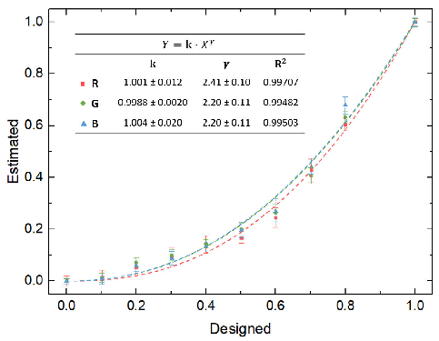

FIGURE 6. Normalized RGB coordinates obtained after the correction with the smartphone-based system for the grayscale patterns from full-black to full-white spot arrays. Fitting equations show the exponential functions responding to the Gamma correction technique.

gamma value (exponent of the correction function) is somewhat dependent on the exact characteristics of the device, it is commonly accepted that the RGB space represents colour values in an approximate gamma 2.2 space [33]. As shown in Fig. 6, the obtained gamma values for the three colour components were around this value, with an average of γ = 2.2 ± 0.2. Therefore, this result provides a full proof of the measurement methodology to camera variation.

#### D. SYSTEM VALIDATION WITH THE PARASITE TEST

For correct array positioning in front of the camera, only two control spots (left and central sites) were printed in the top row, leaving the top right site empty, as shown in Fig. 7. This figure shows several screenshots of the developed smartphone application with the 3 different cases that can be obtained after image processing and pattern recognition of the parasite test: Absence of infection (Fig. 7B), pathogen L. major (Fig. 7C), and pathogen T. cruzi (Fig. 7D). To obtain a good image of the diagnostic parasite test, the user has to position the array correctly, that is, with the two control points in the upper row as shown in Fig. 7C. An automatic protocol has been programmed in the smartphone application to classify the detected spots into rows according to their radius and distance between centers. By doing so, the application is capable of recognizing the different possible patterns and make automated assessment of the diversity of parasite test results. An example of the generated report provided by the application can be seen in Fig. 7E. The report contains information about the date and time of the test, number of spots detected per row, x and y coordinates and colour coordinates (both HSV and RGB) of each detected spot. Finally, the report shows the diagnosis based on the previous information. Fig. 7F shows the sharing option that enables to send the report and the processed images through social networks, email and various messaging services.

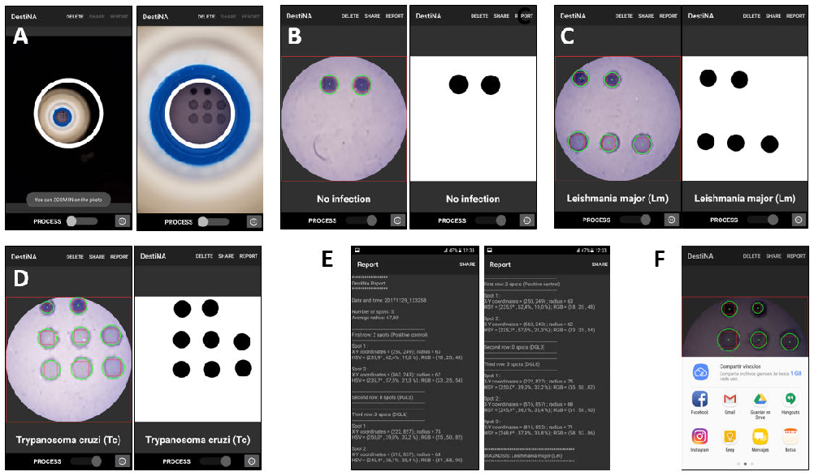

FIGURE 7. A) App screenshots where the user can fit the template grid (white circle) with the centrifuge collection tube after taking a photo. Examples of results of diagnostic recognition (detailed and simplified views) upon the completion of the processing for the three possible cases: B) Absence of infection; C) pathogen Leishmania major; and D) pathogen Trypanosma cruzi. E) Example of report provided by the app containing information about the recognized spot array. The report is presented in a plain text viewer integrated in the app. F) Both the report and the processed image can be shared through social networks, email and various messaging services through the ‘‘Share’’ button in the top menu of the application. In this study the spotting was carried out with 2 controls biotin-labelled DNA oligomer spots rather than the 3 of Fig. 1C.

- TABLE 3. Averaged results of detected radius and RGB coordinates for the different cases of parasite tests.

A set of 5 parasite tests for each of the three possible cases have been processed using the application. Table 3 collects the obtained averaged results in terms of detected spot size and colour coordinates, where the control spots have been differentiated from the rest of the spots in the array. Average time analysis per array can be estimated below 10 s.

Considering the true radius of the deposited spots, which is 400 µm for the control spots and 500 µm for the other spots in the pattern, it can be concluded that the whole area of the spots has been recovered in all the cases. As for the colour recognition, the capability of quantitative colour measurement of each spot in the pattern can provide additional information if needed. In fact, due to the decay in color intensity of the array spots in the parasite kits over time, an intensity threshold was established to approve the test as

fit or not for colorimetric quantification. Thus, a ‘freshness test’ of parasite kit is carried out by the app. It is passed if the intensity of each spot is above half the value of fresh parasite kits. According to Table 3, this threshold has been setup to 100.

### IV. CONCLUSION

A smartphone-based platform has been developed, characterized and validated for accurate acquisition, processing and transmission of images coming from a colorimetric assay inside a centrifuge collection tube. The tool consists of two main parts: a hardware accessory to accurately position the mobile phone with the centrifuge collection tube, providing it with a constant and homogeneous illumination; and a customdeveloped smartphone software application that analyses the image taken from the collection tube, and quantifies the panel of spots in terms of spot size, location and colour coordinates. Spots with diameters from 300 µm can be detected with a 15 % tolerance. Moreover, colour recognition reliability has been improved to use the entire digital span, so that the standard gamma correction of the smartphone camera can be clearly recovered. This system has been tested for detection of parasitic diseases of the family Trypanosomatidae, which are responsible for devastating diseases in humans, dogs as well

as livestock. In this context, the smartphone-based platform that has been developed analyses the image and converts the panel of spots into a Trypanosomatid species. Given the importance of such assays in developing countries, the mobile phone imager application has been designed to be especially user-friendly for its use by untrained personnel. Recorded results can be immediately transmitted to reference clinicians from remote locations for advice and treatment decisions.

### ACKNOWLEDGMENT

The authors would like to thank Hugh Ilyine for proofreading the manuscript and the company DESTINA Genomics Ltd., for funding this project by providing reagents, samples and Spin-Tube devices.

### REFERENCES

- [1] M. Grossi, ‘‘A sensor-centric survey on the development of smartphone measurement and sensing systems,’’ Measurement, vol. 135, pp. 572–592, Mar. 2019.
- [2] Statista. (2019). Number of Smartphone Users Worldwide From 2014 to 2020 (in Billions). [Online]. Available: https://www.statista.com/ statistics/330695/number-of-smartphone-users-worldwide/
- [3] I. Hernández-Neuta, F. Neumann, J. Brightmeyer, T. B. Tis, N. Madaboosi, Q. Wei, A. Ozcan, and M. Nilsson, ‘‘Smartphone-based clinical diagnostics: Towards democratization of evidence-based health care,’’ J. Internal Med., vol. 285, no. 1, pp. 19–39, Jan. 2019.
- [4] S. Kanchi, M. I. Sabela, P. S. Mdluli, Inamuddin, and K. Bisetty, ‘‘Smartphone based bioanalytical and diagnosis applications: A review,’’ Biosensors Bioelectron., vol. 102, pp. 136–149, Apr. 2018. [Online]. Available: https://scholar.google.co.in/citations?user=9xZoPv8AAAAJ&hl=en
- [5] X. Huang, D. Xu, J. Chen, J. Liu, Y. Li, X. Ma, and J. Guo, ‘‘Smartphonebased analytical biosensors,’’ Analyst, vol. 143, no. 22, pp. 5339–5351, Oct. 2018.
- [6] J. Shin, S. Chakravarty, W. Choi, K. Lee, D. Han, H. Hwang, J. Choi, and H.-I. Jung, ‘‘Mobile diagnostics: Next-generation technologies for in vitro diagnostics,’’ Analyst, vol. 143, no. 7, pp. 1515–1525, 2018.
- [7] L. Hárendarčíková and J. Petr, ‘‘Smartphones & microfluidics: Marriage for the future,’’ Electrophoresis, vol. 39, no. 11, pp. 1319–1328, 2018.
- [8] G. Zhu, X. Yin, D. Jin, B. Zhang, Y. Gu, and Y. An, ‘‘Paper-based immunosensors: Current trends in the types and applied detection techniques,’’ TrAC-Trends Anal. Chem., vol. 111, pp. 100–117, 2019.
- [9] A. J. S. McGonigle, T. C. Wilkes, T. D. Pering, J. R. Willmott, J. M. Cook, F. M. Mims, and A. V. Parisi, ‘‘Smartphone spectrometers,’’ Sensors, vol. 18, no. 1, pp. 1–15, 2018.
- [10] S. K. Vashist, T. van Oordt, E. M. Schneider, R. Zengerle, F. von Stetten, and J. H. T. Luong, ‘‘A smartphone-based colorimetric reader for bioanalytical applications using the screen-based bottom illumination provided by gadgets,’’ Biosensors Bioelectron., vol. 67, pp. 248–255, May 2015.
- [11] V. Oncescu, D. O’Dell, and D. Erickson, ‘‘Smartphone based health accessory for colorimetric detection of biomarkers in sweat and saliva,’’ Lab Chip, vol. 13, no. 16, p. 3232, 2013.
- [12] B. Veigas, J. M. Jacob, M. N. Costa, D. S. Santos, M. Viveiros, J. Inácio, R. Martins, P. Barquinha, E. Fortunato, and P. V. Baptista, ‘‘Gold on paper– paper platform for Au-nanoprobe TB detection,’’ Lab Chip, vol. 12, no. 22, pp. 4802–4808, 2012.
- [13] H. Shafiee, S. Wang, F. Inci, M. Toy, T. J. Henrich, D. R. Kuritzkes, and U. Demirci, ‘‘Emerging technologies for point-of-care management of HIV infection,’’ Annu. Rev. Med., vol. 66, no. 1, pp. 387–405, 2014.
- [14] S. C. Kim, U. M. Jalal, S. B. Im, S. Ko, and S. J. Shim, ‘‘A smartphonebased optical platform for colorimetric analysis of microfluidic device,’’ Sens. Actuators B, Chem., vol. 239, pp. 52–59, Feb. 2017.
- [15] L. Shen, J. A. Hagen, and I. Papautsky, ‘‘Point-of-care colorimetric detection with a smartphone,’’ Lab Chip, vol. 12, no. 21, pp. 4240–4243, 2012.
- [16] S. Sumriddetchkajorn, K. Chaitavon, and Y. Intaravanne, ‘‘Mobileplatform based colorimeter for monitoring chlorine concentration in water,’’ Sens. Actuators B, Chem., vol. 191, pp. 561–566, Feb. 2014.
- [17] S. K. Vashist, O. Mudanyali, E. M. Schneider, R. Zengerle, and A. Ozcan, ‘‘Cellphone-based devices for bioanalytical sciences,’’ Anal. Bioanal. Chem., vol. 406, no. 14, pp. 3263–3277, May 2014.

- [18] A. Ricciardi and M. Ndao, ‘‘Diagnosis of parasitic infections,’’ J. Biomol. Screening, vol. 20, no. 1, pp. 6–21, Jan. 2015.
- [19] R. Duncan, ‘‘Advancing molecular diagnostics for trypanosomatid parasites,’’ J. Mol. Diagnostics, vol. 16, no. 4, pp. 379–381, Jul. 2014.
- [20] M. Tabraue-Chávez, M. A. Luque-González, A. Marín-Romero, R. M. Sánchez-Martín, P. Escobedo-Araque, S. Pernagallo, and J. J. Díaz-Mochón, ‘‘A colorimetric strategy based on dynamic chemistry for direct detection of Trypanosomatid species,’’ Sci. Rep., vol. 9, no. 1, Dec. 2019, Art. no. 3696.
- [21] F. R. Bowler, J. J. Diaz-Mochon, M. D. Swift, and M. Bradley, ‘‘DNA Analysis by dynamic chemistry,’’ Angew. Chem. Int. Ed., vol. 49, no. 10, pp. 1809–1812, Mar. 2010.
- [22] S. Pernagallo, G. Ventimiglia, C. Cavalluzzo, E. Alessi, H. Ilyine, M. Bradley, and J. J. Diaz-Mochon, ‘‘Novel biochip platform for nucleic acid analysis,’’ Sensors, vol. 12, no. 6, pp. 8100–8111, Jun. 2012.
- [23] M. A. Luque-González, M. Tabraue-Chávez, B. López-Longarela, R. M. Sánchez-Martín, M. Ortiz-González, M. Soriano-Rodríguez, J. A. García-Salcedo, S. Pernagallo, J. J. Díaz-Mochón, ‘‘Identification of trypanosomatids by detecting single nucleotide fingerprints using dna analysis by dynamic chemistry with MALDI-ToF,’’ Talanta, vol. 176, pp. 299–307, Jan. 2018.
- [24] C. Kimme, D. Ballard, and J. Sklansky, ‘‘Finding circles by an array of accumulators,’’ Commun. ACM, vol. 18, no. 2, pp. 120–122, Feb. 1975.
- [25] G. Bradski, ‘‘The OpenCV library,’’ Dr. Dobb’s J. Softw. Tools, vol. 120, pp. 122–125, 2000.
- [26] G. Bradski and A. Kaehler, Learning OpenCV, 1st ed. Newton, MA, USA: O’Reilly, 2008.
- [27] J. Canny, ‘‘A computational approach to edge detection,’’ IEEE Trans. Pattern Anal. Mach. Intell., vol. PAMI-8, no. 6, pp. 679–698, Nov. 1986.
- [28] I. E. Sobel, Camera Models and Machine Perception. Stanford, CA, USA: Stanford Univ., 1970.
- [29] P. Escobedo, I. M. P. de Vargas-Sansalvador, M. Carvajal, L. F. Capitán-Vallvey, A. J. Palma, and A. Martínez-Olmos, ‘‘Flexible passive tag based on light energy harvesting for gas threshold determination in sealed environments,’’ Sens. Actuators B, Chem., vol. 236, pp. 226–232, Nov. 2016.
- [30] T. Mcreynolds, Advanced Graphics Programming Using OpenGL. San Mateo, CA, USA: Morgan Kaufmann, 2005.
- [31] J. C. Stevens, ‘‘A comparison of ratio scales for the loudness of white noise and the brightness of white light,’’ Ph.D. dissertation, Harvard Univ., Cambridge, MA, USA, 1957.
- [32] C. Poynton, Digital Video and HD: Algorithms and Interfaces, 2nd ed. San Mateo, CA, USA: Morgan Kaufmann, 2012.
- [33] C. A. Poynton, ‘‘Rehabilitation of gamma,’’ Proc. SPIE, vol. 3299, pp. 232–249, Jul. 1998.

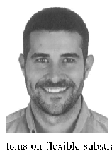

PABLO ESCOBEDO received the bachelor’s degree in telecommunication engineering and the bachelor’s degree in electronics engineering, and the master’s degree in computer and network engineering from the University of Granada, Granada, Spain, in 2012, 2013, and 2014, respectively, and the Ph.D. degree with ECSens, Department of Electronics and Computer Technology, University of Granada, in 2018. His doctoral thesis focused on the design and development of printed sensor sys-

tems on flexible substrates, with special interest in RFID/NFC technology. He is currently a Postdoctoral Research Fellow of the Bendable Electronics and Sensing Technologies (BEST) Group, University of Glasgow, Glasgow, U.K. His current research interests include the development of printed smart labels for environmental, health, and food quality monitoring applications, and electronic skin (eSkin) for applications in the fields of robotics, prosthetics, health diagnostics, and wearable devices.

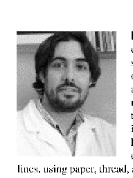

MIGUEL M. ERENAS has been involved in the development of easy-to-use colorimetric optical sensors, using as instrumentation common digital devices such as scanners, photographic cameras, and mobile phones, since 2006. Since the improvement of the mobile phone specifications turning them into the so-called smartphones and combining it together with analytical microfluidicdevices, he has been focused in the development of pointof-need devices that fulfils the ASSURED guide-

lines, using paper, thread, and cloth as support, and portable instrumentation in collaboration with the electronic members of the ECsens, University of Granada, to which he belongs.

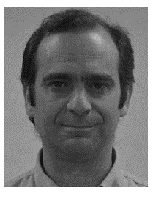

JUAN J. DÍAZ-MOCHÓN received the Ph.D. degree in pharmacy from the University of Granada, in 2001. He is a Professor of organic and pharmaceutical chemistry with the University of Granada and the Director and CSO of DestiNA Genomics Ltd. Over the last 20 years, he has enjoyed a distinguished academic career in Spain, Italy, and in the U.K. He is also the Co-Founder of the International Society of Liquid Biopsy (ISLB), founded in 2017, in Granada, Spain.

ANTONIO MARTÍNEZ OLMOS was born in Granada, Spain, in 1980. He received the M.Sc. and Ph.D. degrees in electronic engineering from the University of Granada, Granada, Spain, in 2003 and 2009, respectively. He is currently an Associate Professor with the University of Granada. His current research interests include the design of tomography sensors and the study of optical sensors for different biological measurements.

SALVATORE PERNAGALLO received the B.Sc. and M.Sc. degrees in cellular and molecular biology and the M.D. degree in genetics from the University of Catania, Italy, and the Ph.D. degree in chemistry from the University of Edinburgh, U.K. He is the Operations Director of DestiNA Genomics Ltd. He held a postdoctoral position in tissue engineering at the University of Edinburgh. He is first author of publications covering novel aspects and methods in several areas of biotech-

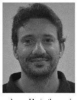

nology. He is the co-inventor on a number of relevant patents.

MIGUEL A. CARVAJAL was born in Granada, Spain, in 1977. He received the M.Sc. degree in physics and the M.Sc. degree in electronic engineering from the University of Granada, in 2000 and 2002, respectively, and the Ph.D. degree in electronic engineering from the University of Granada, in 2007. He was involved in the development a dosimeter system based on commercial MOSFETs with the University of Granada. He is currently a Tenured Professor with

the University of Granada. His research interests include the effects of irradiation and post-irradiation in MOSFET transistors, RFID tags with sensor capabilities, gas sensors and electrochemiluminescent sensors, and their applications to handheld instrumentation.

MAVYS TABRAUE CHÁVEZ received the Ph.D. degree in medicinal chemistry from the University of Granada, Spain. She was involved in chemical synthesis, microencapsulation, biosensors, biomaterials, scale up, and optimization of processes. She joined DestiNA Genomics Ltd., in March 2013, after several years of experience in biotech companies. She has been responsible for the integration and development of DestiNA technology with colorimetric platforms.

M. ANGÉLICA LUQUE GONZÁLEZ received the B.Sc. and M.Sc. degrees in drug discovery and development from the University of Granada, Spain, and the Ph.D. degree from the Centre for Genomics and Oncological Research (GENYO), with Prof. R. M. Sanchez-Martin. She is a Postdoctoral Researcher with the I3Bs-Research Institute on Biomaterials, Biodegradables and Biomimetics, University of Minho, Portugal. During the Ph.D. degree, she was with DestiNA Genomics Ltd., on the development of its technology.

LUIS FERMÍN CAPITÁN-VALLVEY received the B.Sc. degree in chemistry and the Ph.D. degree in chemistry from the Faculty of Sciences, University of Granada, Spain, in 1973 and 1986, respectively. He is a Full Professor of analytical chemistry with the University of Granada. In 1983, he founded the Solid Phase Spectrometry Group (GSB) and the interdisciplinary group ECsens, which includes chemists, physicists and electrical and computer engineers at the University of Granada, together

with Prof. P. López. He is currently interested in printing chemical sensors and capillary-based microfluidic devices. His work has produced nearly 350 peer-reviewed scientific articles, 6 books, 25 book chapters. He holds six patents. His current research interests include the design, development, and fabrication of sensors and portable instrumentation for environmental, health, and food analysis and monitoring.

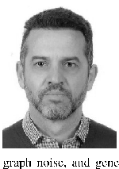

ALBERTO J. PALMA received the B.S. and M.Sc. degrees in physics and the Ph.D. degree from the University of Granada, Granada, Spain, in 1991 and 1995. He is currently a Full Professor with the with the Department of Electronics and Computer Technology, University of Granada. Since 1992, he has been involved in trapping of carriers in different electronic devices (diodes and MOS transistors) including characterization and simulation of capture cross sections, random tele-

graph noise, and generation-recombination noise in devices. Since 2000, ECsens, the interdisciplinary group, he has been involved in design, development, and fabrication of sensors and portable electronic instrumentation for environmental,biomedical,andfoodanalysisandmonitoring.Heiscurrently involved in printing sensors on flexible substrates with processing electronics using inkjet and screen-printing technologies.

