# Time-Gated Luminescence Acquisition for Biochemical Sensing: miRNA Detection

Emilio Garcia-Fernandez, Salvatore Pernagallo, Juan A. González-Vera, María J. Ruedas-Rama, Juan J. Díaz-Mochón, and Angel Orte

Contents

- 1 Introduction .................................................................................. 214

- 1.1 Time-Resolved Luminescence ........................................................ 214
- 1.2 Time-Gated Luminescence ............................................................ 216

- 2 Time-Gated Luminescence .................................................................. 219

- 2.1 Initial Studies .......................................................................... 219
- 2.2 Probes for Time-Gating ............................................................... 221
- 2.3 Applications ........................................................................... 228
- 2.4 The Challenge of Luminescence Detection in Complex Media ..................... 236

- 3 Time-Gated Detection of Luminescence in Industry ....................................... 239
- 4 Detection of miRNA by Luminescence ..................................................... 243

- 4.1 miRNAs as Important Biomarkers .................................................... 243
- 4.2 Steady-State Luminescence Detection of miRNA .................................... 243
- 4.3 Time-Gated Luminescence Detection of miRNA .................................... 245
- 4.4 Time-Gated Detection of miRNAs Using FLIM ..................................... 248

- 5 Outlook ...................................................................................... 252 References ....................................................................................... 253

Abstract Luminescence emission is a multidimensional phenomenon comprising a time-domain layer defined by its excited-state kinetics and corresponding lifetime, which is specific to each luminophore and depends on environmental conditions.

E. Garcia-Fernandez (*), J. A. González-Vera, M. J. Ruedas-Rama, and A. Orte Department of Physical Chemistry, Faculty of Pharmacy, University of Granada, Granada, Spain e-mail: emiliogf@ugr.es

S. Pernagallo DestiNA Genómica S.L., Granada, Spain DestiNA Genomics Ltd., Edinburgh, UK J. J. Díaz-Mochón DestiNA Genómica S.L., Granada, Spain Pfizer-Universidad de Granada-Junta de Andalucía Centre for Genomics and Oncological Research (GENYO), Parque Tecnológico de Ciencias de la Salud (PTS), Granada, Spain Faculty of Pharmacy, University of Granada, Granada, Spain

© Springer Nature Switzerland AG 2019 B. Pedras (ed.), Fluorescence in Industry, Springer Ser Fluoresc (2019) 18: 213–268, https://doi.org/10.1007/4243_2018_4, Published online: 7 March 2019

213

This feature allows for the discrimination of luminescence signals from species with a similar spectral profile but different lifetimes by time-gating (TG) the acquisition of luminescence. This approach represents an efficient tool for removing unwanted, usually short-lived, signals from scattered light and fluorescence interferents using luminophores with a long lifetime. Due to the emergence of time-resolved techniques using rapid excitation and acquisition methods (i.e. pulsed lasers and singlephoton timing acquisition) and new long-lifetime luminophores (i.e. acridones, lanthanide complexes, nanoparticles, etc.), TG analyses can be easily applied to relevant chemical and biochemical issues. The successful application of TG to important biomedical topics has attracted the attention of the R&D industry due to its potential in the development and patenting of new probes, methods and techniques for drug discovery, immunoassays, biomarker discovery and biomolecular interactions, etc. Here, we review the technological efforts of innovative companies in the application of TG-based techniques.

Among the many currently available biomarkers, circulating microRNAs (miRNAs) have received attention since they are highly specific and sensitive to different pathological stages of numerous diseases and easily accessible from biological fluids. qPCR is a powerful and routine technique used for the detection and quantification of miRNAs, but qPCR may introduce numerous artefacts and low reproducibility during the amplification process, particularly using complex samples. Thus, due to the efficiency of TG in separating short-lived sources of fluorescence common in biological fluids, TG is an ideal approach for the direct detection of miRNAs in liquid biopsies. Recently, great efforts in the use of TG have been achieved. Our contribution is the proposal of a direct detection approach using TG-imaging with single-nucleobase resolution.

Keywords FLIM · Fluorescence · Lanthanides · Lifetime · Luminescence · miRNA · Time-gated fluorescence · Time-gating · Time-resolved fluorescence

- 1 Introduction

- 1.1 Time-Resolved Luminescence

Photoluminescence refers to the emission of UV-Vis light after the photoexcitation of a luminophore. Depending on the emitting excited state, photoluminescence is called fluorescence (singlet) or phosphorescence (triplet). The characteristic features of the emission of light depend on the sample and its chemical environment, including the emission spectra, which usually show a specular image of the absorption spectra, Stokes shift, quantum yield, anisotropy, lifetime, etc. [1, 2]. Most of these features are obtained in a steady-state acquisition mode and have been exploited for many decades in numerous applications [3]. However, in the timeresolved mode, luminescence implies an emissive relaxation or de-excitation to the ground state that results in other interesting features. In response to light,

HOMO-electrons become excited to higher energy states; then, they relax to the ground state, followed by the eventual emission of photons, which is clearly depicted in the well-known Jablonski energy diagram. According to the kinetics of this relaxation process, the average time spent by these electrons in the excited state is a characteristic of each luminophore and is called the luminescence lifetime, τ. This lifetime depends on several factors, particularly the chemical environment, and generally follows an exponential kinetic decay according to Eq. (1), where [P*] is the concentration of the sample in the excited state and kr and knr are the radiative and non-radiative decay rate constants, respectively [4].

d ½P

dt ¼ ðkr þ knrÞ ½P ð1Þ The inverse of the sum of the rate constants is called the luminescence lifetime, τ:

1

kr þ knr ð2Þ The integrated Eq. (1) is an exponential law:

τ ¼

t τ

½P ¼ ½P 0 e

ð3Þ

The emitted intensity depends on the concentration of molecules in the excited state. After a single-pulse excitation, the luminescence intensity decays according to the lifetime of the species. Eventually, different species that are de-excited may simultaneously emit light contributing to the total fluorescence intensity:

IðtÞ ¼ XAie t=τ

i

ð4Þ

I(t) is the time-dependent intensity of the fluorescence, Ai is the relative amplitude of the emission of each species i and τi is its lifetime.

Notably, for any particular emission wavelength, we cannot distinguish among different emitters with the same steady-state features, but we can differentiate among emitters in time-resolved mode according to their different lifetime of emission.

The lifetimes of the fluorescence emitted by organic molecules are usually on the nanosecond time scale, while the phosphorescence lifetimes are longer, usually reaching the millisecond and occasionally the second time scale. Other types of luminescent emitters, such as the electronic atom orbitals in lanthanide ions or solid materials, may exhibit other luminescence emission time scales.

The precise acquisition of emission decay traces requires working in timeresolved mode with very fast excitation and acquisition setup. Single-photon timing (SPT) is an efficient technique used for accurate time-resolved acquisition [5]. SPT reconstructs the fluorescence decay of a dye based on the detection of individual

photons after several excitation cycles with a very short pulse of light. This technique is usually known as time-resolved mode in the time domain.

The emission lifetimes can also be obtained in the frequency domain in which the excitation light is sent with a certain time modulation. The phase delay between the excitation radiation and the emitted light can also be related to the emission lifetime [1, 2]. However, measurements in the frequency domain are performed less frequently in time-gated analyses, which is the focus of this chapter. Hence, we focus on time-resolved measurements of emitted light after pulsed excitation.

- 1.2 Time-Gated Luminescence

The luminescence decay trace of a population of excited molecules represents the statistical probability of a photon to be emitted within a certain amount of time. Luminescence emission is a random phenomenon; thus, τ is the average time during which approximately half of the excited molecules have emitted a photon, but τ does not represent the precise time at which a single molecule deactivates via emission. Time-gated (TG) luminescence analyses rely on the fact that not all excited molecules spend the same amount of time in the excited state before emitting a photon; thus, if only photons arriving at the detector within a certain time-window (TW) are analysed, the signal can be filtered, and the contributions of different species can be assessed as shown in Fig. 1.

Thus, according to Eq. (3), when t ¼ τ, ~37% of the population is at the excited state, while ~63% of the population is relaxed to the ground state. Generally, for a time longer than 5τ, most excited molecules are de-excited (>99%), and at 10τ, the excited molecules are completely relaxed (100%). In addition, due to the exponential decay, the abundance of the emitted photons differs over time. While most photons

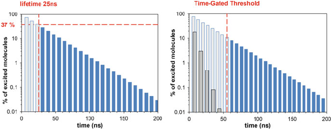

- Fig. 1 (Left) Percentage of luminophores in the excited state for a molecule with a 25 ns luminescence lifetime. When t ¼ τ, ~37% of the molecules are in the excited state (dark blue), and ~63% of the fluorophores are already relaxed (light grey). (Right) Application of a 55 ns TG threshold in a simulated mixture of two molecules with 5 (grey) and 25 (blue) ns lifetimes

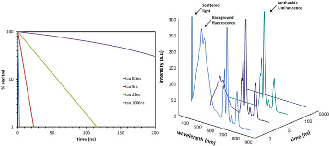

- Fig. 2 (Left) Theoretical relaxation time traces of four different lifetimes: 0.5 ns (IRF), 5 ns, 25 ns and 1000 ns. (Right) Emission spectra as a function of time in a mixture of scattered light (τ ¼ 0.5 ns), background fluorescence (τ ¼ 5 ns) and long-lifetime emitting lanthanide complex (τ ¼ 1000 ns)

(63%) are emitted within τ, the remaining photons (37%) are emitted within 4τ; thus, early photons are less spread over time than late photons.

As shown in Fig. 2, we compare single exponential decay traces with different lifetimes. The shortest trace (0.5 ns) represents a rapid relaxation that is close to an instrument response function (IRF); the 5 ns and 25 ns lifetimes may correspond to a common organic fluorophore and a long-lifetime dye, respectively; finally, the longest trace (1000 ns) could represent the lifetime of a metal-ligand complex. For example, 50 ns after the excitation pulse, the only molecules with populations in the excited state have lifetimes of 25 ns and 1000 ns (approximately 13% and 95%, respectively), whereas no molecules with shorter lifetimes of 0.5 and 5 ns are in the excited state.

According to these simulations, differentiating the emission of different species is possible based on the time the photons are acquired. Identifying the optimal time threshold for removing undesired fluorescence and applying the correct time-gated detection are necessary. TG analyses only consider photons arriving at certain TW and discard the other photons. This feature is very interesting for the separation and discrimination of short- and long-lived components of fluorescence that may overlap in complex media, such as biological media, and strongly hinder the sensing mechanism of certain probes. Therefore, the use of TG to remove unwanted fluorescence requires a luminescent probe with a long lifetime. As illustrated in Fig. 2, during this process, the emission spectra collected at different detection TWs of a mixture of emissive molecules are analysed. The spectral contribution of scattered light rapidly disappears; then, the emission profile of the background fluorescence decays, and after 50 ns, only the emission of the species of interest in this example remains.

Regarding the development of the luminescence-based assays performed in complex media, there are several sources of undesired photons as follows: the

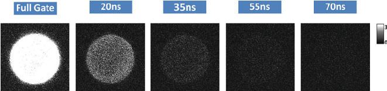

- Fig. 3 Fluorescence microscopy images of a Q Sepharose bead dispersed in phosphate buffer 10 mM at pH 6 using different detection TG. From left to right, TG: 0 ns (full gate), 20 ns, 35 ns, 55 ns and 70 ns. Excitation source: 5 MHz pulsed, 440 nm laser; emission collected using a 550/50 nm bandpass filter. The size of the images is 80 80 μm2

scattering of excitation light, autofluorescence, impurities, etc.; however, most undesired photons have short-lived lifetimes (<10 ns) and are attenuated following excitation at long wavelengths (>500 nm). Autofluorescence [6] refers to background fluorescence due to structural fluorescent groups in proteins (tryptophan <5 ns, tyrosine), cell membranes (lipofuscin), the cytosol (NADH, <1 ns), blood (porphyrins), serum (albumin, <8 ns), chlorophyll (<1 ns), B vitamins, etc. Other sources of background fluorescence from non-biological origins include scattering, impurities and nanotechnological platforms (i.e. surfaces, beads, scaffolds, etc.). Using the TG approach along with long-lived emissive probes may overcome this unwanted fluorescence. As shown in Fig. 3, the autofluorescence (550 nm) of an agarose bead (Q Sepharose, average lifetime of ca. 4 ns) vanishes after applying different acquisition TWs.

Advanced applications of fluorescence sensing require the direct detection of analytes in the working media in which unwanted background fluorescence may interfere with the desired fluorescence of the probe. As previously described, TG detection allows the separation of these two sources of fluorescence based on their differing lifetimes. This separation is particularly interesting for biomedical industries, which use chip-based platforms to perform in situ and rapid diagnoses of several target biomarkers in complex biological media (i.e. blood, serum, saliva and urine) in which autofluorescence has a strong contribution. Hence, in this chapter, we discuss the different uses of TG analyses and particularly focus on the industrial uses of such approaches in the fields of drug discovery and biomedicine. The discovery of novel biomarkers is a hot topic in the biomedical field; in particular, recently, circulating microRNAs (miRNAs) have been proposed as promising biomarkers for several diseases, such as cancer, and physiological dysfunctions. Therefore, we devoted a specific section to the application of TG analyses in the miRNA field.

- 2 Time-Gated Luminescence

- 2.1 Initial Studies

Fluorescence time-resolved techniques have achieved great development and growth due to the emergence of new fast excitation and acquisition methods, such as pulsed laser and single-photon timing (SPT) [5]; however, these techniques were applied to image microscopy only after the introduction of rapid image acquisition, such as streak or charge-coupled device (CCD) cameras, in the 1980–1990s [7, 8].

Parallel to these technical advances, recognition chemistry, including lanthanide cryptates, was seminally introduced by Prof. Jean-Marie Lehn [9], who shared the Nobel Prize for this achievement in 1987 [10]. In particular, Prof. Lehn identified the possible use of such chemistry to design new molecular devices given the distinct properties that were achieved. Subsequently, lanthanide cryptates were considered interesting photochemical supramolecular devices since they exhibited very characteristic luminescence properties [11]. Luminescence emission is characterized by a line-like spectrum and extremely long values of the luminescence lifetime, τ, both of which are caused by the forbidden electronic transition involving the f atom orbitals (see Sect. 2.2). The antenna effect of the organic moiety forming the cryptates enhances the luminescence of the metal, which remains protected within the cryptate cavity. Along with the parallel developments in time-resolved fluorimetry techniques [12, 13], the luminescent properties of lanthanide ions established the basis for new fluoroimmunoassays. The advantages of fluorescence-based techniques over radioimmunoassays, including the simplicity of the former and drawbacks related to radioactivity of the latter, were clear. However, the application of fluorescence techniques in complex matrices, such as serum, was challenging due to the intrinsic fluorescent properties of the matrix and the increased scattered excitation light. Hence, the possibility of using a set of stable luminescent molecules with very long τ values paved the way for the development of time-resolved fluorimetric immunoassays (TR-FIA), which are recognition assays based on a TG filtering analysis. Commercial kits involving Eu(III) chelates and stable antennas became available. The need for better and improved luminophores was evident, which resulted in a very active field seeking new supramolecular luminescent compounds [14, 15]. A few early examples of TR-FIA assays include the use of labelled monoclonal antibodies for the hepatitis B surface antigen [16], human chorionic gonadotrophin [17], human α-fetoprotein [18], steroid hormones [19], testosterone [20], etc.

While the drug discovery industry was highly active, these concepts were rapidly applied to imaging techniques. During the development of time-resolved microscopy, several research groups applied fluorescence time-gated acquisition to microscopy images using probes with long lifetimes to remove scattering and autofluorescence from biological media. Beverloo [21, 22] and collaborators proposed the acquisition of the delayed emission (700 μs) of phosphor crystals as a model of immunocytochemical staining, which obtained luminescence microscopy

images of phosphors adsorbed over functionalized latex beads. Importantly, Marriot and collaborators developed optical microscopes capable of acquiring weak longlived phosphorescence and delayed fluorescence of acridine orange using CCD cameras for stains in biological media [23, 24]. The luminescence of acridine orange in 3T3 cells was processed in each pixel of the image to calculate useful parameters, such as the lifetimes and phosphorescence/fluorescence ratio. Cubeddu and collaborators [25–27] developed an innovative TG fluorescence imaging technique based on a CCD video camera and a subnanosecond pulsed UV/blue excitation and applied this technique to tumour tissues. These authors emphasized the advantages of moving from the “spectral domain” to the “time domain” of fluorescence, particularly in fluorophores with similar emission spectra but different fluorescence lifetimes. For example, hematoporphyrin derivative (HPD), which is used in photodynamic therapy, has a lifetime of 14 ns, while the autofluorescence of the investigated tissues was 2–3 ns. These authors applied a delay of 5–15 ns to the acquisition of HDP fluorescence, which resulted in an increased signal-to-noise ratio in the images due to the elimination of the natural fluorescence of the tissues. Seveus used a modified time-resolved epifluorescence microscope to study the delayed luminescence of europium chelates and localize antigen C242 in malignant mucosa from the human colon [28]. Schneckenburger studied the time-resolved fluorescence of porphyrin derivative photosensitizers for medical diagnosis and biology [29– 31]. These TG luminescence microscopy studies used Photosan 3 in RR1022 epithelial cells, protoporphyrin ALA in human skin and autofluorescence of teeth to detect caries.

The application of time-resolved capabilities to luminescence microscopy rapidly permitted the development of fluorescence lifetime imaging microscopy (FLIM), in which the time-resolved information is layered within the image pixels. For instance, in early studies, Kohl and co-workers proposed the delayed acquisition of fluorescence images to study ovarian carcinoma in rats using the photosensitizers Photofrin II and modified porphyrin and obtained the pseudo-colour fluorescence images shown in Fig. 4 [32]. The Lakowicz and Gadella research groups developed frequency-domain luminescence techniques based on phase-sensitive images, gain-modulated image intensifiers and CCD cameras to acquire FLIM images, thus avoiding the use of raster-scanned images. These authors applied these techniques to fluorescence lifetime images of NADH [33] and known fluorophores [34, 35]. Currently, FLIM microscopy in the time-domain and multidimensional SPT [36] are applied with high accuracy to determine the lifetimes at each pixel, although scanned acquisition is mostly required. Using this technique, accurate decay traces of emitted radiation can be obtained at each pixel, and thus, timegating can be applied post-acquisition.

In addition, the current state-of-the-art instrumentation has paved the way for the development of new luminophores and new assays, including nanotechnological platforms. In the following sections, available materials used for efficient TG analyses and current applications are reviewed with particular emphasis on the role of different companies in the field.

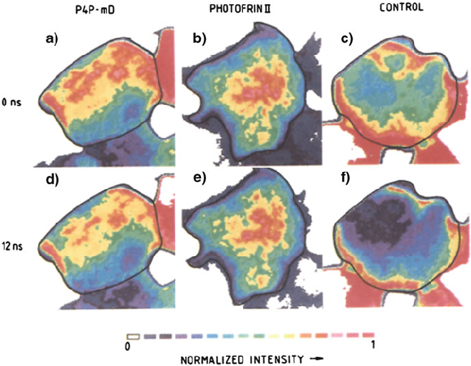

- Fig. 4 Delayed fluorescence images of a tumour (ovarian carcinoma) marked with 0.1 mg of P4P-mD per kg of body weight (a and d), 5 mg of Photofrin II per kg of body weight (b and e) and control (c and f). Images were recorded with delays of 0 ns (a, b and c) and 12 ns (d, e and f). All shown images refer to the same normalized intensity scale given in false colours. Reproduced and modified with permissions from [32]

- 2.2 Probes for Time-Gating

For an efficient TG-based experiment, the emissive species must have a long luminescence lifetime, τ. This feature is not always trivial from the perspective of the rational design of luminophores. Here, we classify and describe the different luminescent molecules and materials that can be employed in TG analyses, which are also presented in Table 1 and Fig. 5.

- 2.2.1 Organic Dyes

The natural product quinine was the first widely studied fluorescent organic molecule. Subsequently, the library of organic dyes has expanded, and currently, a broad arsenal of fluorophores with a wide range of chemical and photophysical properties

Table 1 Long-lifetime luminophores

|Luminophore|Emission range (nm)|Luminescence lifetime|Reference|
|---|---|---|---|
|Organic dyes|400–600|10–825 ns|[6]|
|Pyrene|450–550|90 ns|[37]|
|Acridone|420–500|14.2 ns|[38]|
|PureTime®14|426|15 ns|[39]|
|9-Aminoacridine|429–454|17 ns|[40]|
|Quinacridone|530–630|22.8 ns|[38]|
|Lucigenin|550|19.8 ns|[41]|
|Azaoxatriangulenium dyes|550–600|25 ns|[42, 43]|
|DBD dyesa|490–610|10–20 ns|[44]|
|DBOb|410–425|13–825 ns|[45]|
|EDANS|493|12.7 ns|[46]|
|SeTau-380|480|32.5 ns|[47, 48]|
|SeTau-425|545|26.2 ns|[47, 48]|
|Transition metal complexes|Visible to NIR|100–1000 ns|[49, 50]|
|Ru(bpy)3[PF6]2|605|600 ns|[51]|
|Ru(bpy)2(dcpby)[PF6]2|650|375 ns|[52]|
|Lanthanides|312–1530|From μs (Yb, Nd) to ms (Eu, Tb)|[53, 54]|
|Quantum dots|300 nm–5 μm|5–100 ns|[55, 56]|
|Qdot (CdSe/ZnS)|582|28.4 ns|[55, 56]|
|Carbon nanoparticles|400–700|6–15 ns|[57, 58]|
|Silicon nanoparticles|400–800|10–30 μs|[59]|

aDBD = [1,3]dioxolo[4,5-f]-[1,3]benzodioxole bDBO = 2,3-diazabicyclo[2.2.2]oct-2-ene

is available [60]. These fluorophores are well documented and specific due to the ease of derivatization, e.g. cell-penetrating agents localized in given organelles or bioconjugated chromophores used for antigen detection. Despite their great versatility, the use of organic dyes as luminescent probes is occasionally limited by the low signal-to-noise ratios observed in fluorescence microscopy due to their short emissive lifetimes (in the range 1–5 ns) and the interference from cellular autofluorescence. Although the usual range of τ values in organic fluorophores is only within a few nanoseconds, certain organic dyes exhibit unusually long-lifetime values. Dyes from the family of polyaromatic hydrocarbons, such as pyrene, usually exhibit fluorescence lifetimes greater than 5 ns and, occasionally, even longer than 100 ns. However, these molecules are highly hydrophobic and tend to have poor solubility. Moreover, these molecules can only be excited in the UV and near-UV region of the spectrum, where the autofluorescence and cellular material absorption are the strongest, which limits their potential application in investigations of complex biological systems [37].

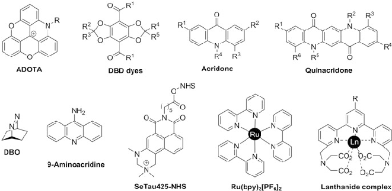

- Fig. 5 Examples of representative long-lifetime luminophores

Several of the best known long-lifetime dyes are based on the acridine and acridone moieties. Dyes, such as acridone [38], 9-aminoacridine [40], lucigenin (a condensed di-acridine) [41] and 6-(9-oxo-9H-acridin-10-yl)-hexanoate (commercialized as PureTime®14) [39], exhibit fluorescence lifetime values larger than 15 ns. AssayMetrics’ PureTime fluorescent dyes cover the UV-NIR spectral range. PureTime UV dyes have a fluorescence lifetime of 325 ns and are available as NHS esters for protein and peptide labelling. PureTime visible dyes have lifetimes ranging from 14 to 22 ns and are also used for labelling. Amersham Biosciences developed a family of acridones and quinacridones with long lifetimes that were specifically designed for FLIM microscopy [38]. 2,3-Diazabicyclo[2.2.2]oct-2-ene (DBO) also belongs to the long-lifetime family of dyes (13–825 ns) and can be used to perform time-resolved luminescence assays. However, DBO shows very low molar absorption coefficients, which reduces its overall sensitivity. Moreover, the absorption and emission wavelengths of DBO are very short, limiting its application in in vitro assays [45]. For instance, this dye has been extensively used as a fluorescent probe to study its inter- and intramolecular fluorescence quenching by a variety of biomolecules.

A new family of dyes based on 1,3-benzodioxole and [1,3]-dioxolo[4.5-f] benzodioxole, which are used as highly sensitive fluorescence lifetime probes, have also been used to describe their microenvironmental polarity. These dyes also exhibit long fluorescence lifetimes and have been employed to develop an assay for the discovery of inhibitors of enzymes belonging to the histone deacetylase family [44]. Similarly, the easily accessible and environment-sensitive EDANS fluorophore possesses a long fluorescence lifetime and has been widely employed in timeresolved luminescence assays [46]. For instance, azadioxatriangulenium dyes (commercialized by KU dyes®) are highly photostable and highly emissive and possess a fluorescence lifetime of approximately 15 ns [42, 43]. Azadioxatriangulenium (ADOTA) and diazaoxatriangulenium (DAOTA) are members of the triangulenium

dye family and have been successfully employed in time-resolved luminescent experiments investigating complex biological systems.

Similarly, the patented SeTau dye family has attracted increasing interest in lifetime-based applications. Commercialized by SETA BioMedicals® (https:// www.setabiomedicals.com), these fluorophores have a naphthalimide heterocyclic core that features a long fluorescence lifetime (in the range of 9 and 32 ns); a large Stokes shift (>100 nm); excellent chemical, thermal and photophysical stability; and water solubility [47, 48].

- 2.2.2 Transition Metal Complexes

During recent decades, luminescent transition metal complexes have emerged as an alternative to organic dyes in creating long-lifetime luminescence probes. These complexes are primarily based on the following d block metal ions: (a) Ru(II), Re(I), Ir(III), Rh(III) and Os(II) complexes with d6 electronic structures; (b) Pt(II) complexes with d8 electronic structures, such as metalloporphyrins [61]; and (c) Au(I) complexes with d10 electronic structures. The broad luminescence bands mostly arise from metal-to-ligand charge-transfer or metal-to-metal charge-transfer states. These dyes have attracted increasing research interest in the biosensing and bioimaging fields due to their advantageous properties, including high luminescence efficiency, tunable luminescence colours, significant Stokes shift, high photostability, relatively long emission lifetimes (100 ns to 10 μs), good water solubility and lack of dye-dye interactions [49, 50].

Metalloporphyrins are typically complexes of platinum or palladium. In particular, platinum is used due to its higher quantum yield in aqueous solutions and room temperature. The metalloporphyrins have reached a rather high level of development. However, the use of metalloporphyrins in time-resolved experiments is not as widespread as that of other dyes. The metalloporphyrins are commonly used as highly sensitive, selective and versatile labels or probes in biosensing applications [62, 63].

- 2.2.3 Lanthanide Complexes

The lanthanides include 14 elements from 58Ce to 71Lu. The spectroscopic properties of lanthanide complexes result from transitions between the states in the 4f sub-shell, which is shielded from the influence of the environment by the higher energy 6s2 and 5p6 orbitals.

Due to this shield, the 4f orbitals do not directly participate in chemical bonding, and lanthanide complexes display similar spectroscopic properties (characteristic of each metal ion) regardless of their chemical environment. Thus, the emission of lanthanides is minimally perturbed by the surrounding environment, resulting in sharp, line-like emission bands with the same fingerprint wavelengths and narrow peak widths of the corresponding free Ln(III) salts. Moreover, the f–f transitions are

formally forbidden by the spin and Laporte rule and, thus, feature exceptionally long luminescence lifetimes—in the order of hundreds of microseconds to millisecondscompared to those of classic organic dyes. Due to these outstanding photophysical properties, the lanthanides have attracted exceptional attention over the prior 30 years, and they continue to be the focus of further developments.

Since lanthanides are poor absorbers (f–f transitions are Laporte-forbidden), sensitizing chromophores (antenna) are required in their vicinity to achieve luminescence through an energy transfer process named the antenna effect [53, 54, 64]. The lanthanides Tb(III) and Eu(III) are commonly used in time-resolved luminescence assays since they can be excited by energy transfer using a variety of organic chromophores and emit relatively efficiently in the visible. The most common luminescent lanthanide probes covalently link the antenna to a chelate group containing the lanthanide (such as EDTA and DOTA) through a linker or spacer named a pendant antenna. An alternative approach involves the use of a chelating group as antennas, named chelating antennas or cryptates, for the excitation of the lanthanide ion. New and improved lanthanide complexes and cryptates are frequently reported in the literature, and researchers continue to search for large brightness and improved stability. By adding aromatic groups acting as antennas to the coordinating cage, the absorptivity and, thus, the luminescent properties of the group are largely enhanced [65]. Many different chelators can act as caging agents of Eu(III) and Tb(III) ions; thus, organic chemists have proposed the use of novel ligands to improve TG-imaging probes [66]. An in-depth understanding of the photophysical processes that govern the luminescence emission of lanthanide cryptates definitively helps in the rational design of new probes [67]. Usually, these new compounds are tested in validated TG fluoroimmunoassays. For example, new Eu(III) cryptates are tested in human C-reactive protein (hCRP) [68] or cardiac troponin I [69] TG immunoassays, among many others. The solubility and stability properties of the cryptates can be tuned to achieve specific aims. For instance, by deliberately decreasing the cell permeability of the probe [70], it can be optimized to study outer cell membrane receptors and their interaction with specific ligands using TG-imaging. The new probes are often patented for TG immunoassays or TG-imaging, such as the so-called EuroTracker dyes [71] and one of the most popular Tb(III)-based probes, i.e. the Lumi4-Tb, which is a 2-hydroxyisophthalamide-based cryptate commercialized by Lumiphore Inc. [65].

- 2.2.4 Luminescent Nanoparticles

The fabrication of materials on the nanometre scale paved the way for nanotechnological applications. Nanomaterials exhibit a variety of interesting features, some of them improved or unusual when compared to macroscopic materials or molecular species. For example, luminescent nanoparticles show the ability to emit radiation due to electronic transitions, with brighter luminescence, higher photostability and higher biocompatibility, compared to classical fluorescent organic dyes. Moreover, these nanoparticles can act as multivalent scaffolds for the realization of

supramolecular assemblies since their high surface-to-volume ratio allows for distinct spatial domains to be functionalized, which can provide a versatile synthetic platform for the application of different sensing schemes. Due to their excellent properties, nanomaterials are among the most useful tools in biomedical research because they enable the intracellular monitoring of many different species for medical and biological purposes.

Semiconductor Quantum Dots (QDs)

Semiconductor quantum dots (QDs) and their bioconjugates consist of nanocrystals with diameters of 2–10 nm and generally contain elements from groups II and VI or groups III and V (e.g. ZnS, CdS, CdSe, PbSe, InAs or InP). If the size of the nanoparticles decreases below a critical value known as the exciton Bohr radius (typically 10 nm), the 3D confinement of charge carriers occurs, which restricts the energy states in the valence and conduction bands and results in optical properties that can be tuned by varying the particle size or internal chemical composition [55, 56]. Their emission wavelength can be finely tuned from 300 nm to 5 μm. QDs feature high quantum yields, resistance to photobleaching (even better than that of organic chromophores), broad absorption spectra and narrow and size-tunable photoluminescence emission spectra with fairly sharp emission bands covering the visible and NIR spectral ranges. Moreover, QDs present unique photoluminescence lifetime properties. QDs show multiexponential luminescence decays and comparatively long lifetimes (typically from five to hundreds of nanoseconds) that are longer than the autofluorescence decay of cells and the fluorescence lifetime of most conventional dyes [72]. Due to these optical properties, QDs are established photoluminescent platforms used for biological and sensing applications. The intracellular delivery of relatively large particles is a challenge in the use of QDs and other luminescent nanoparticles. Moreover, QDs have certain drawbacks, such as blinking of the emission if only a small number of QDs are present in the target material, nanocolloidal behaviour and controversial long-term toxicity issues [56].

Carbon Nanoparticles

Due to the possible toxicity of semiconductor QDs, the potential of carbon nanodots (CND or C-dots [57]) and nanotubes (CNT [73]) has been investigated. Carbon particles present characteristics and preferred benefits, such as no photobleaching, high thermal stability, extraordinary biocompatibility, low toxicity, easy derivatizability and no optical blinking, and their luminescence properties can be finely tuned by varying their size and/or surface. Furthermore, CNDs present large two photon excitation cross sections, paving the way for their use in photodynamic therapy and cell imaging [74]. The C-dots show multiexponential photoluminescence decays with average lifetime values of approximately 6–8 ns [57, 58, 75].

More recently, two emerging luminescent carbon nanomaterials, i.e. graphene oxide (GO) [76] and graphene quantum dots (GQDs) [77], have attracted increasing attention. GO is an atomically thin sheet of graphite that is covalently decorated with oxygen-containing functional groups either on the basal plane or its edges. GQDs are graphene sheets smaller than 100 nm that present unique optical and electronic properties due to their quantum confinement and edge effects. These materials have characteristics and advantages that are similar to those of C-dots, such as their ease of preparation and non-toxicity. Typically, graphene nanoparticles exhibit blue photoluminescence, and the luminescence lifetimes range from 5 to 7 ns [78, 79].

A new addition to the nanocarbon family is the photoluminescent nanoparticles of diamond. Photoluminescent nanodiamonds (PNDs) containing nitrogen-vacancy colour centres are a promising alternative to the family of inorganic photoluminescent probes due to the presence of embedded, perfectly photostable colour centres. These PNDs present a rather long radiative lifetime of nitrogen-vacancy colour centres, most of which is greater than 15 ns [80], rendering the PNDs appropriate for long-term imaging applications in vivo [81, 82].

Silicon Nanoparticles

Silicon nanomaterials constitute an important class of new materials with great application potential as intracellular probes. Photoluminescent porous silicon nanoparticles (SiNPs) have no toxicity due to the favourable biocompatibility of silicon and display interesting photoluminescence properties (e.g. strong luminescence and robust photostability). The luminescence lifetime of nanocrystalline silicon is on the order of microseconds (normally 10–30 μs), which is significantly longer than the nanosecond lifetimes exhibited by organic dyes, QDs and C-dots, allowing for improved visualization of biological systems [59, 83].

Other Nanoparticles

Doping is a broadly employed process that involves incorporating atoms or ions of suitable elements into host lattices to produce materials with tailored functions and properties [84]. The lifetime of dopant emission from lanthanide ions or transition metal ion-doped QDs is normally longer (from μs to ms) than that of the host, offering abundant opportunities to avoid background fluorescence in bioimaging and biosensing. Doped QDs maintain their inherent advantages while avoiding the selfquenching problem due to their considerable large Stokes shift. Two clear advantages of doped QDs, particularly doped ZnS QDs, over classical CdSe@ZnS and CdTe QDs are their longer lifetime and potentially lower cytotoxicity. In bioimaging applications, fluorescent dopants may avoid toxicity problems by generating visible or infrared emission in nanocrystals created with less-harmful elements than those currently used [85].

Neodymium-doped nanoparticles constitute another type of luminescent nanoparticles with fluorescence lifetimes of circa 100 ms that can be employed in fluorescence imaging in vivo [86]. Silica nanoparticles with encapsulated dyes, such

- as lanthanides or ruthenium complexes, have shown great potential as biolabels in various time-gated luminescence biodetection studies since they exhibit a long luminescence lifetime of approximately 350 μs [87, 88].

2.3 Applications

In Sect. 2.1, we described several of the earlier realizations of TG analyses, mainly in fluoroimmunoassays and TG-imaging. In the current and the following section, we focus on state-of-the-art applications using several of the luminophores described above to achieve ultrasensitive assays with multiplexing capabilities usually using nanotechnological approaches to address biologically, biochemically and biomedically relevant problems.

- 2.3.1 Immunoassays

As previously described, TR-FIA assays are among the most important applications of TG analyses that successfully provide physiological information. A major problem in early TR-FIA experiments was that the sensitivity of the assays was occasionally not sufficient for studying systems in which the target was expressed

- at low levels. Therefore, several modifications of the base analysis have been proposed to enhance the luminescence signal. The dissociation-enhanced lanthanide fluoroimmunoassay (DELFIA) method, in which the Eu(III) metal ion is released from the antibody once the reaction with the analyte is completed and protected in a micellar solution that enhances the luminescence emission, is among the most extended approaches used in clinical applications of TR-FIA [89]. The DELFIA assay has been employed to compare the performance of TR-FIA assays with that of conventional ELISAs in the detection of human tetanus antitoxin in serum [90]; the larger dynamic range in the TG analysis and the advantages of the TG approach in analyses of sera were demonstrated.

Similarly, multiplexing was another challenge in TG immunoassays. The initial realization of multiplexing in TR-FIA assays was reported by authors employing specific antibodies labelled with different luminophores. Examples of multiplexing approaches include the simultaneous detection of pregnancy-associated plasma protein A (PAPP-A) and the free β-subunit of human chorionic gonadotrophin [91]; the simultaneous detection of recombinant CP4 EPSPS and Cry3A proteins in plant sample extracts of genetically modified potatoes [92], using Eu(III) and Sm(III) cryptate-labelled antibodies; the simultaneous analysis of free and total prostate-specific antigen (PSA) [93], which is an important biomarker of prostate

cancer; and the multiplex measurement of PSA along with the PSA-α1antichymotrypsin complex [94].

Further advances in TR-FIA assays enhanced the signal and possibility of dualrecognition tests by exploiting Förster resonance energy transfer (FRET) from a donor luminophore to a nearby acceptor in a distance-dependent manner. For instance, a TG analysis of the energy transfer (TG-FRET) from a lanthanide cryptate (Eu(III) or Tb(III)) acting as a donor to a fluorescent acceptor has been commercialized by Cisbio Bioassays and is known as homogeneous time-resolved fluorescence (HTRF) [95]. The TG-FRET enhances the sensitivity and selectivity of the detection method due to the double-band emission and specific distance-dependence acceptor emission [96]. Similarly, the measurement of the luminescence signal at two wavelengths (donor and acceptor) involves an internal reference, which is used as a normalization method to avoid differences between samples or reagents [97]. Several formats have been proposed for the design of TG-FRET immunoassays (Fig. 6), including competitive assays and dual-recognition assays.

Furthermore, since the first realizations of a TG-FRET assay based on QDs acting as FRET acceptors [98, 99], many applications have involved the use of QDs as a central nanoplatform and coassembled with peptides or oligonucleotides that were labelled with either a long-lifetime luminescent lanthanide complex or a fluorescent

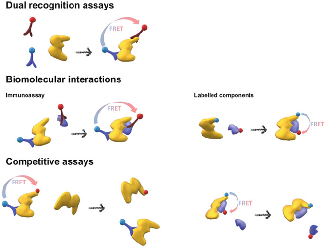

- Fig. 6 Different designs of TG-FRET assays used to study recognition, interactions or relative stability (competitive) using both immunoassays with labelled antibodies or directly labelled components

dye. The emission lifetime of the QD acceptors is drastically enhanced by the excitation of the energy transfer from the lanthanide complex, which permits TG-FRET signal processing for quantification and imaging. These systems also allow multiplexed biosensing based on the spectrotemporal resolution of the FRET process without requiring QDs with multiple colours [100].

- 2.3.2 Drug Discovery

The field of fluoroimmunoassays with clinical implications has been very active, and several companies have developed specific products, reagents and instruments for these experiments (see Sect. 3). However, TG analyses have also been widely applied in the field of drug discovery and high-throughput screening experiments. In particular, Cisbio’s patented HTRF technology [95] was specifically designed for the drug discovery community.

One of the widest applications of TG-FRET and HTRF in drug discovery is related to sensing enzymatic activity, such as proteases or kinases. Kinases have attracted broad attention as validated drug targets; thus, studies investigating their activity in the presence of potential inhibitors are highly active in the field of drug discovery. Among many examples, this technique has been applied to COT kinase [101]; Rho-kinase II [102]; tyrosine kinases [103], such as Tie2 kinase [104]; and extracellular signal-regulated kinases (ERKs) [105]. A serendipitous discovery in the search for protein kinase inhibitors led to the development of kinase binding with turn-on sensors with long luminescence lifetimes without the presence of metals. The conjugates of adenosine analogues and arginine-rich peptides that include a thiophene or selenophene on one end and an energy acceptor on the other end show a striking enhancement in the emission lifetime to the hundreds of microseconds range upon binding to basophilic protein kinases. These probes, which are the so-called ACR-Lum probes, have been employed to detect kinase activity in cell extracts and live cells using TG spectroscopy and imaging [106, 107]. Many other enzymes can be studied using this methodology. For instance, the activity of heparanase, which is an enzyme with hyperactivity in malignant tumours, has been studied using HTRF assays [108]. Other recent examples of TG-FRET-based assays include the discovery of inhibitors of viral cap-methyltransferases as potential antiviral drugs [109] and inhibitors of aromatase enzyme for breast cancer treatment [110]. In an interesting multiplexing approach, the simultaneous activity of trypsin and chymotrypsin was probed using a two-step FRET relay design with FRET from a donor Tb(III) complex to a QD acceptor sensing one of the proteases, and the subsequent FRET from the QD to a red emitting fluorophore, i.e. Alexa Fluor 647, responded to the activity of the second protease [111].

Studies investigating G protein-coupled receptors (GPCRs) constitute another extensive branch that is clearly important for drug development. GPCRs represent the main mechanism of cell signalling and the recognition of extracellular molecules and, thus, have been identified as specific targets for drug development. Many different TR-FIA assays have been reported, including mechanistic and functional

studies of GPCRs and specific inhibitors [95]; however, a thorough review of such reports is beyond the scope of this chapter. As an interesting example of the wide variety of studies, a TR-FIA was developed to understand the mechanistic interactions between specific GPCRs and components of traditional Chinese medicines employed as weight-loss drugs [112], which could establish a basis for metabolic disorder treatments.

An important advance in the study of GPCRs using TG-FRET experiments involves the possibility of directly tagging the studied receptor with an emissive label to avoid the use of antibody-antigen interactions. In particular, the SNAP-tag technology [113] allows for the covalent linkage of a long-lifetime luminescent probe to a functional protein. The SNAP-Lumi4-Tb reagent adds an optimized Tb-cryptate to the N-terminus of a GPCR usually without altering its function [114]. This technology has been used in TG-FRET assays to study ligand binding and competitive experiments in ApelinR [114], which is an important GPCR involved in body fluid homeostasis and cardiovascular functions; chemokine, opioid and cholecystokinin receptors [115]; the arginine-vasopressin V2 receptor, which is a drug target for the potential treatment of hypertension and several renal pathologies; and the growth hormone secretagogue receptor type 1a, which is a target for treating disorders of growth hormone secretion [116], among many other examples. A recent protocol compares the use of TG-FRET assays to study ligand binding in the parathyroid hormone receptor, which is a class B GPCR, using labelled antibodies to the use of the approach of directly using a SNAP-tag-labelled receptor [117].

- 2.3.3 Biomarker Discovery and Analysis

Luminescence spectroscopy offers a sensitive, easy-to-use, versatile and widespread platform for the quantitative determination of any potential analytes and biomarkers of biomedical relevance. Luminescence spectroscopy in the steady-state mode entails the use of a continuous illumination source. Under these conditions, several luminophores are promoted to the excited state and begin the emission process, whereas other molecules are subsequently excited. This approach rapidly reaches a steady situation in which the number of molecules in the excited and the ground states is in equilibrium. Under low absorbance conditions, the emitted intensity follows Kavanagh’s law; thus, the total number of photons emitted is proportional to the concentration of the luminophore. The optimization of luminescent probes for specific targets is a very extensive field with the following common grounds: the emission features of the probes are modified by the presence of the analyte by any physical means in a concentration-dependent fashion. Due to their high sensitivity and versatility and relatively low cost, these techniques are among the first choices in developing sensors. Luminescent sensors can be designed by rendering the properties of such luminescent probes tunable based on the concentration of a secondary species (analyte). If long-lifetime probes are employed, TG analyses can be applied in time-delayed luminescence spectroscopy. This technique can be performed using

most commercial fluorimetry spectrometers and a phosphorescence measurement accessory. The luminescence emission spectra can be obtained with a delay after an excitation pulse that is usually controlled by a mechanical chopper in the TG mode. Thus, sensors based on lanthanide complexes are generally excited by the transfer of intramolecular energy from aromatic residues that are close to the metal. Using this intramolecular transfer strategy, it has been possible to develop numerous sensors to probe a variety of analytes and biomolecules. Multiple sensing strategies have been proposed to design luminescent signals with direct responses to specific analytes. (1) The analyte can be incorporated into the coordination network, causing either an enhancement or quenching of the luminescence emission. (2) Similarly, the analyte may interact with the antenna to enhance the lanthanide excitation either covalently or noncovalently, or (3) the analyte may sequester a quenching group from the coordination network. (4) Moreover, lanthanide complexes whose conformations or structures change in the presence of an analyte can be rendered responsive by judicially positioning the antenna on the ligand. Using these approaches, many different sensors have been proposed in the literature, including sensors for metals; anions, such as fluoride, sulphide, bicarbonate, nitrate or phosphate; other species, such as thiols, ADP, ATP, NADH and hydroxyl radicals; and pH sensors. For excellent recent reviews on lanthanide-based sensors, see references [118, 119].

Sensed analytes that are related to specific biomedical applications may serve as biomarkers. The broad definition of biomarkers entails substances, structures or processes that can be directly measured in the body or its products (fluids or tissue) and used to predict normal biological functions or the outcomes of disease, effects of treatments or environmental exposure to chemicals or nutrients [120]. The search for novel, reliable and robust biomarkers of different pathological states has become the cornerstone of early diagnostics and personalized medicine. Examples of recent studies investigating novel biomarkers can be extensively found in the fields of cancer [121, 122], neurodegenerative disorders [123], cardiovascular disease [124], diabetes [125], renal function and kidney injury [126], etc.

The analysis of such biomarkers requires rapid, optimal point-of-care methodologies to provide timely diagnostics and healthcare. An early example is the use of a TG-based analysis to explore the potential of the pregnancy-associated plasma protein A (PAPP-A) in first-trimester pregnant women as a biomarker of Down syndrome [127]. In addition, a multiplexing method for the joint detection of the PAPP-A protein and free β-subunit of human chorionic gonadotrophin [91] was also proposed as a diagnostic test for Down syndrome. Importantly, these biomarkers were amply validated with several clinical tests in different countries [128, 129]. Interesting clinical applications have been feasible; for instance, plasma procalcitonin was proposed as a marker of postoperative sepsis in transplanted patients [130]. TG-FRET assays have also been employed to directly detect and quantify biomarkers, such as insulin and cortisol, which are directly related to drug discovery. For instance, the promotion of insulin production by potential antidiabetic drugs has been tested using an HTRF assay of insulin [131]. TG-FRET assays of cortisol have been developed to test the activity of the enzyme 11beta-hydroxysteroid dehydrogenase type 1 and inhibitors of that enzyme with therapeutic activity against

type 2 diabetes [132]. Prostaglandin E2 is another biomarker that has been directly detected using a TG-FRET assay aiming to follow the activity of the corresponding synthase enzyme and potential inhibitors [133]. Regarding neurodegenerative diseases, a TG-FRET assay was used to detect amyloid-β peptides in brain tissues using an Eu cryptate as the donor and FRET towards an acceptor fluorophore, and this study confirmed the use of the levels of amyloid-β peptides as a biomarker of vascular dementia [134]. These examples illustrate the potential use of TG analyses for achieving rapid biomarker tests and improving the prospects of personalized medicine.

- 2.3.4 Biomolecular Interactions

TG analyses constitute an invaluable tool for more fundamental physiological and biochemical studies, such as studies involving biomolecular interactions. A variety of lanthanide-based biosensors reporting protein-protein and protein-nucleic acid interactions with increased intramolecular energy transfer and, therefore, luminescence upon binding to a target have been described. For instance, a highly sensitive terbium-based peptide sensor selective to RNA hairpin has been developed. Upon binding to its target, the peptide folds into an α-helical conformation that results in a large increase in luminescence [135]. A similar strategy was applied to the specific sensing of the oncogenic c-Jun transcription factor [136]. The modulation of the antenna effect by a Trp residue donor has also been successfully employed to sense post-translational modifications, such as phosphorylation. A lanthanide peptidebased biosensor has been developed to probe CDK4 kinase activity in complex media, such as melanoma cell extracts, by sensitizing a terbium complex with a unique tryptophan residue in an adjacent phosphoaminoacid binding moiety [137]. Furthermore, the intermolecular sensitization of lanthanide ions has been applied to the development of a terbium-chelating peptide sensor targeting cyclin A. Upon the interaction, the Tb3+ ion is placed close to a well-conserved Trp residue of cyclin A, resulting in efficient intermolecular terbium sensitization and, thus, an increase in luminescence [138].

TG-FRET approaches have been effectively exploited to study biomolecular interactions in many reports. The following basic designs used in these studies are shown in Fig. 6: either using labelled monoclonal antibodies or directly labelled components, i.e. the biomolecular interaction is probed by placing the two units, i.e. the FRET donor and acceptor, close to each other, which leads to an efficient energy transfer. TG analyses enhance the sensitivity and selectivity by discarding potential fluorescent artefacts. Since TG analyses are possible in cellulo, several tests have been developed to study the interaction and oligomerization of cell membrane proteins; in particular, many studies investigating GPCR interactions have been reported [95, 139]. The homo- and hetero-dimerization of GPCRs are important mechanisms for cell signalling by which the dimerized state may be the event that triggers the signalling cascade [140]. For example, protein-protein interaction studies have provided information regarding how certain proteins in the Epstein-Barr

virus capsid interact with chemokine receptors in human B lymphocytes to alter the immunological response [141].

DNA recognition and hybridization assays entail a broad set of experiments involving biomolecular interactions. The TG detection of specific DNA sequences by hybridization using a capturing probe that is labelled with long-lifetime metal complexes was patented by J. R. Lakowicz in 2001 [142] due to the foreseen importance and potential of this type of analysis. Following these concepts, TG-based DNA detection through molecular interactions has rapidly grown.

Although the study of biomolecular interactions using TG spectrometry and TG plate readers has provided a substantial amount of important physiological information, the direct visualization of these interactions using imaging techniques represents an even more appealing approach, which is discussed in the following section.

- 2.3.5 TG-Imaging

In studies using luminescence microscopy, TG filtering has become an important advantage. TG analyses provide an extra layer of specificity to cellular imaging, enabling very high contrast imaging. TG-imaging can be easily performed using commercial microscopy systems, particularly if the luminescent probes are lanthanide-based, since the millisecond-lifetime values provide sufficient collection time because extremely rapid electronics are not required. The early realizations of TG-imaging occurred in the early 1990s [21, 28]. A pulsed light source in kHz repetition rates, a synchronized chopper and a streak camera are sufficient to modify commercial equipment [143, 144] at relatively reduced costs. Even multi-colour capabilities can be implemented with very few alterations [145, 146]. Without any additional instruments, considering the delay produced in raster scanning and mathematically accounting for the blurring effect of long-lifetime lanthanide probes, luminescence lifetimes in the millisecond time range can be obtained under a conventional confocal microscope [147]. However, in addition to the available simple approaches, more sophisticated methodologies have been developed, such as superresolution nanoscopy using TG detection in time-gated stimulated emission depletion (TG-STED) [148]. The characteristic fingerprint of the millisecond luminescence lifetimes of lanthanide complexes has also been exploited for the design of an automated microscope for the fast scanning of large areas to identify spots of interest that show luminescence that is detected at a specific TW. The so-called time-gated orthogonal scanning automated microscopy (TG-OSAM) is capable of automatic, unsupervised microsphere and cell counting [149].

It is important to highlight the differences between TG-imaging and FLIM microscopy because although both techniques use the time-resolved information of the emission decay, their main focus and aim substantially differ. In TG-imaging, the signal analysis focuses on applying the optimized detection TW, discarding the short-lived photons and obtaining the overall number of emitted luminescent photons at a given TW. Hence, the signal is the luminescence intensity but at a specific detection TW. In contrast, FLIM microscopy focuses on the determination of the

luminescence lifetime, τ, at each pixel of the image. The main analytical signal is the concentration-independent τ value. However, FLIM microscopy is inherently a multidimensional technique because the total intensity emitted is the full area (integral) of the luminescence decay trace, and it also allows TG-imaging by reconstructing the intensity image with photons collected at a specific detection TW. Therefore, FLIM microscopy is a more advanced technique, because it contains the capabilities of TG-imaging. In contrast, the FLIM instrumentation is more intricate and expensive, and its use requires in-depth expertise. The advantages of TG-imaging over FLIM include its simplicity and ease of application using conventional, commercial equipment.

TG-imaging is mainly applied for the imaging and analytical sensing in the cellular interior without the problems of intrinsic cellular autofluorescence. Using emissive probes with long luminescence lifetimes, TG image filtering is particularly interesting in intracellular sensing [150]. The potential of semiconductor QD nanoparticles in TG biological imaging was first demonstrated in 2001 [151]. Subsequently, biocompatible QD nanoparticles have been used as time-gated bioimaging probes in different cancer cells [152, 153] to suppress cell autofluorescence and improve the signal. For instance, using specific nanosensors built with QDs, an FLIM imaging methodology was developed to probe the intracellular pH values [72]. Although this approach was a FLIM-based sensing method, the cellular autofluorescence was discarded by performing a TG analysis; thus, the luminescence lifetime values of the sensor were not altered by autofluorescence photons. Other pH sensors designed using mixtures of Eu(III) and Tb(III) cryptates have been applied intracellularly to probe pH changes in the cytoplasm [154] and lysosomes [155] using TG-imaging.

A widely employed method used for the specific sensing of analytes is the design of fluorogenic probes, i.e. probes prepared in a non-luminescent off state that turn into an emissive on state upon reacting with the analyte or a secondary directly related species. Many examples of fluorogenic probes specifically designed to enhance the sensitivity of TG analyses are available in the literature. For example, fluorogenic lanthanide-based probes have been reported for the intracellular detection of hypochlorous acid [156, 157], vitamin C [158], H2S [159], biothiols [160] and singlet oxygen generation [161].

In addition to the intracellular sensing of small molecules, immunostaining techniques and TG-imaging permit the direct visualization and study of biomolecular interactions and functioning in living cells. TG-FRET imaging using lanthanideQD-fluorophore multistep FRET relays has been used to image epidermal growth factor receptors (EFGR) via immunostaining and endosome imaging intracellularly

- [162]. Photoluminescent nanodiamonds have also been used to image HeLa cancer cells [81] and as probes for the intercellular transport of proteins in vivo [82]. Similarly, a multiplex TG-imaging approach was performed with the participation of researchers from PerkinElmer for the simultaneous imaging of oestrogen receptors and human epidermal growth factor receptors in human breast cancer tissue sections. Furthermore, with the participation of the company LumiSands Inc., TG-imaging was performed to discriminate SKOV3 cancer cells from A431 cancer cells

- [163]. SiNPs exhibit long luminescence lifetimes in the microsecond time scale; thus, SiNPs have been conjugated to anti-HER2 antibodies for TG-imaging of SKOV3 cells, which overexpress HER2 membrane receptors. These cells were easily differentiated from A431 cancer cells, which overexpress EGFR receptors, that were immunostained with fluorescein, which is a fluorophore with a short fluorescence τ. Using a short and long detection TW, the different cells were identified in a mixed culture.

Although a comprehensive review is beyond the scope of this chapter, the abovementioned examples are representative of the vast potential of TG-imaging. TG analyses have attracted many researchers’ attention due to their filtering capabilities of undesired interferences. In the following section, this aspect is discussed more in depth.

- 2.4 The Challenge of Luminescence Detection in Complex Media

As demonstrated by the applications described in the previous section, TG analyses performed in all solutions and heterogeneous media and the imaging of live cells have provided an enormous batch of information for biomedical studies that is particularly relevant for drug discovery, biomarker analyses and the understanding of physiological events. A common feature among these studies is that biological samples are particularly challenging due to complex matrix effects and the presence of potential interferences. Many factors can cause the matrix effect, and most causes are due to the high concentrations of multiple species in the solution. One important factor regarding the use of luminescence techniques in complex media is the large contribution of scattered light. Rayleigh and Raman scatter of excitation light inevitably occur in any fluorescence-based experiment. Importantly, if high concentrations of biomolecules and other disperse systems are present, the amount of scattered light is extensive. This extensive scattered light has two consequences. First, the scattered light can be detected by the detection device and mask the real luminescence emission or even saturate the detectors. Second, the matrix can produce scatter of the emitted luminescent photons, hence causing a lower signal than expected. Finally, the presence of species capable of absorbing light at the excitation wavelength should also be considered. If large concentrations of absorbers are present, the number of photons available to excite the probe of interest dramatically decreases, which concomitantly decreases the luminescence emission of such species. This decrease is the so-called inner filter effect.

Chemical interferences, which are species that may absorb the excitation light and emit luminescence radiation, may become a potential interference if spectral overlap occurs with the species of interest, which is another issue in such complex matrices. These emissive species are a constant factor in cellular imaging, overall gathered as the cell autofluorescence [6]. The main species causing cellular autofluorescence

include NADPH, flavins, the emissive amino acids in all proteins (tryptophan and tyrosine residues), collagen, elastin, porphyrins in blood, B vitamins and chlorophyll in plant cells [164]. Interestingly, in-depth studies investigating these autofluorescence patterns in cells have demonstrated their usefulness in identifying different metabolic or pathological cellular states [165]. However, in other cellular imaging studies, these autofluorescence patterns may seriously hinder the application of luminescent sensors or physiological specific studies in live cells.

The selection of the appropriate detection TW in a TG analysis can filter these potential interferents. This time filtering is particularly powerful using lanthanide luminescence as the analytical signal because a long delay usually of several tens of microseconds between the excitation and detection window can be set to ensure that the detected photons are exclusively arising from the probe luminescence. A major advantage of TG analyses is that these analyses allow for homogeneous assays in complex media, such as cellular extracts. Many lanthanide-based sensors of small analytes have been tested in complex matrices, such as solutions containing high concentrations of disperse molecules, cell lysates or real aqueous environmental samples. For instance, lanthanide-based pH sensors have been successfully employed in solutions containing 0.4 mM of human serum albumin and in cell lysates [155]. Other cryptate sensors have been employed for the quantification of hydrogen sulphide in industrial waters and crude oil [166], and the results obtained were better than those obtained using conventional analysis methods, further demonstrating the value of TG analyses in industrial samples.

Another interesting advantage is that sensing luminophores can be included to support active materials, such as hydrogels or paper, in the design of sensing materials. In these applications, the TG approach avoids any interference from the supporting material, providing clean signals. Lanthanide-based sensors embedded in hydrogels have been reported for pH [167] and glutathione [168] TG-sensing. Interestingly, a pH-responsive hydrogel has been employed for the indirect detection of urease activity in biomedical applications [167]. Similarly, Tb-cholate hydrogels containing enzyme substrates have been embedded in paper discs for paper-based quantification of β-galactosidases and lipases [169]. Furthermore, a highly sensitive reactive sensing paper has been developed for the analysis of exhaled hydrogen sulphide using TG detection [170]. Other solid supports, such as quartz, are conventionally used in DNA hybridization and single-nucleotide polymorphism TG assays [171]. Regarding fluoroimmunoassays, several proposed TR-FIA assays could not be directly applied to plasma or whole blood samples. A proposed solution was to employ dry reagents immobilized in the wells [172], ready for the addition of the samples. Using the simple protocol of overnight drying and vacuum sealing, the TR-FIA assay of PAPP-A was successfully applied in serum, plasma and whole blood [127]. The sensing luminophores can also be embedded in polymer films. For instance, a very unique approach was proposed for the preparation of multiparametric sensing polymer films reactive simultaneously to oxygen and temperature. A temperature-sensitive film of poly(vinyl methyl ketone) containing an Eu(III) dye was combined with layers of oxygen-sensitive polystyrene film using a Pt-porphyrin dye. The use of multiple gated windows to discriminate luminescence

decays from two different probes allowed for the multiplexing measurement of oxygen and temperature [173].

Furthermore, TG analyses provide a way to probe biomolecular interactions in solution in a context that is much closer to their real, complex intracellular environment. Even if a molecular interaction can be detected in vitro, the actual functional state may or may not be related to such interaction. Directly probing molecular interactions in a native tissular environment is a challenging task. However, the specificity provided by TG analyses allows these studies to be performed. For instance, a TG-FRET-based study reported the interactions between the protein p53 and different protein partners in cellular extracts [174]. Furthermore, the oligomerization state of oxytocin receptors in mammary glands of lactating rats was described using TG-FRET assays of full tissue [175]. To overcome the large autofluorescence in the full tissues, the assay was performed using a Tb(III) cryptate as the donor in the FRET process due to its very long luminescence lifetime, brightness and quantum yield.

TG-imaging has been shown to be useful for identifying specific targets in very complex matrices; for instance, this technique has been used for the identification of specific microorganisms in water and food safety inspections. In such applications, water dirt or food debris constitute examples of extremely challenging matrices that contain a large excess of particles or microorganisms that may not be the sought targets. In these samples, many microorganisms and interferent substances emit luminescent light across the whole spectral range which could mask the targets using conventional UV excitation. TG-imaging was clearly shown to overcome this problem in the direct identification of the very rare waterborne pathogens Giardia lamblia cysts in environmental water dirt and Cryptosporidium parvum oocysts in fruit juice concentrates; both microorganisms were labelled with an Eu(III) cryptate [144]. In fact, this procedure was automatized for the human-free detection of these microorganisms [176], which improved the efficiency of the current official EPA protocol [177]. Silica-encapsulated Eu(III) nanoparticles have been successfully used for the TG luminescence imaging detection of two environmental pathogens in highly fluorescent grape juice samples [87]. The results demonstrated the practical utility of the new nanoparticles as visible light-excited biolabels in TG luminescence bioassay applications.

Tissular and in vivo imaging directly benefit from the TG approach. Using nanosecond TG-imaging with triangulenium derivatives, Na,K-ATPase channels were imaged within highly autofluorescent retinal tissue sections from brown Norway rats [178]. Even the most challenging task of live organism imaging has been recently accomplished using TG-imaging and different luminophores, such as Eu(III) complexes in Caenorhabditis elegans [179]. An example of live organism sensing is the vitamin C burst detection in live, small planktonic crustacean, Daphnia magna [158], which is shown in Fig. 7. TG-imaging of tumour xenografts in live mice has also been accomplished due to the long luminescence lifetime of silicon nanoparticles [59, 83]. The combination of neodymium-doped nanoparticles and long ( 100 μs) luminescence lifetimes and the incorporation of a pulse delayer into conventional infrared small animal imaging systems have allowed the

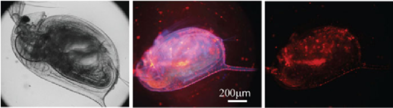

- Fig. 7 Bright-field (left), full window (centre) and TG (right) luminescence images of Daphnia magna loaded with 1 mM vitamin C and incubated with 5.0 μM of a vitamin C, Eu(III)-cryptate sensor for 1 h. Modified from Song et al. [158] under the terms of the Creative Commons Attribution License. Copyright © 2015 Song et al

acquisition of autofluorescence-free live mice in vivo images [86]. The autofluorescence is discarded synergically by the TG-imaging approach, and the background contribution in the near-infrared (NIR) spectral region is negligible. Thus, this type of NIR-emitting nanoparticles with long luminescence lifetimes is a very promising multifunctional optical contrast agent with potential applications in numerous fields, such as in vivo three-dimensional fluorescence tomography, in vivo deep tissue therapies and real-time monitoring of thermal events in animal models.

These examples illustrate the excellent performance of TG analyses in homogeneous and heterogeneous assays and TG-imaging in complex media.

- 3 Time-Gated Detection of Luminescence in Industry

A great proportion of the applications described in the previous section were performed in an academic environment. However, as evidenced by the important challenges of such experiments, many research studies have rapidly transferred to industry. Several companies have been funded to develop novel luminophores, and these compounds are usually protected by exploitation patents [14, 15, 48, 71]. The development of improved luminophores for antibodies and enzyme substrates has introduced several business lines in different companies. For instance, Almac Sciences developed 9-aminoacridine peptide derivatives for a fluorescence lifetimebased assay of the activity of caspase-3, which is a cysteine protease that plays an essential role in apoptosis, using FRET from the fluorophore to a tryptophan sidechain in the peptide substrate [40]. Innotrac Diagnostics Oy developed improved Eu(III) chelates for quantitative TR-FIA assays [180].

Similarly, large worldwide companies dedicated to instrumentation development have focused on expanding the possibilities of fluorescence-based equipment (fluorescence spectrometers, plate readers, etc.) by incorporating time-resolved and TG capabilities. The interest in these techniques in the drug discovery field due to their

pharmaceutical implications has increased the awareness of the possibility of entrepreneurship and business.

Several companies offer instruments based on time-resolved fluorescence for plate readers and spectrometers. PerkinElmer is among the most active companies in the field and has acquired technologies initially developed by Wallac Oy, Finland. PerkinElmer manufactures the VICTOR™ microplate reader series, which includes the benchtop multimode plate reader VICTOR Nivo™ system. PerkinElmer also manufactures the EnVision® 2105 Multimode Plate Reader, which is an ideal instrument for high-throughput screening due to its maximum sensitivity across all detection technologies. Previously, the AIO immunoanalyzer manufactured by Innotrac Diagnostics Oy measured time-resolved europium fluorescence in dried wells. Currently, Innotrac instruments are commercialized by Radiometer Medical Aps, which is located in Denmark. Other relevant instruments used in TG analyses with plate readers are listed in Table 2. Other companies offer time-resolved fluorescence spectroscopy instrumentation, such as Edinburgh Instruments (United Kingdom) with their LifeSpec II, Mini-tau and FLS100 and FS5 spectrofluorometer; Horiba Scientific (Japan), with a wide range of readers and spectrofluorometers; and PicoQuant GmbH (Germany), which is devoted to single-photon timing instrumentation, with the FluoTime series for lifetime measurements and MicroTime instruments for FLIM microscopy. Stanford Computer Optics (United States), Photonic Research Systems Ltd. (United Kingdom), LOT-QuantumDesign (Germany) and Photon Force Ltd. (United Kingdom) specialize in cameras capable of measuring time-resolved fluorescence.

In addition to these instruments, several assays based on TG detection are commercially available. The French company Cisbio commercializes homogeneous time-resolved fluorescence (HTRF®) assays [95, 181] as described above. These assays are broadly used to study kinase and protease activities based on TG-FRET. The so-called KinEASE assay consists of three biotinylated substrates, a monoclonal antibody labelled with an Eu(III) cryptate and FRET acceptor-labelled streptavidin [182]. This general assay has been validated in studies of hundreds of different kinases [181, 183]. For instance, in a joint application note by Cisbio Bioassays, BioTek Instruments Inc. and Enzo Life Sciences, the phosphorylation levels of ERK and the cAMP response element-binding protein (CREB) have been shown to dosedependently decrease in SH-SY5Y cells treated with amyloid-β peptides [184], suggesting a physiological mechanism of cognitive impairment in Alzheimer’s disease.

PerkinElmer commercializes the DELFIA® (dissociation-enhanced lanthanide fluorescence immunoassay), which is a TG intensity technology [185]. These assays were designed to detect the presence of a compound or biomolecule using lanthanide chelate-labelled reagents [186]. PerkinElmer has also developed two other different assays, i.e. the lanthanide chelate energy transfer (LANCE®) and LANCE Ultra TR-FRET assays. These two assays are simple, highly sensitive and highly reproducible immunoassays used to study cell cytotoxicity and cell proliferation. The LANCE assay is primary applied to measure caspase-3 activity using a highthroughput screening approach [187].

## Table 2 Plate readers used for time-resolved luminescence measurements

|Entry|Instrument|Manufacturer|
|---|---|---|
|1|Victor 1420 multilabel plate counter|PerkinElmer Life Sciences, Wallac OY, Turku, Finland|
|2|1230 Arcus fluorometer for time-resolved measurement of DELFIA enhanced fluorescence in tube format|LKB Wallac, Turku, Finland|
|3|1234 DELFIA fluorometer for time-resolved measurement of enhanced fluorescence in plate format|LKB Wallac, Turku, Finland|
|4|DELFIA platewash|PerkinElmer Life Sciences, Wallac OY, Turku, Finland|
|5|AIO® immunoanalyzer|Innotrac Diagnostics Oy, Turku, Finland|
|6|CLARIOstar® spectrofluorimeter|BMG Labtech, Ortenberg, Germany|
|7|PHERAstar® FSX spectrofluorimeter|BMG Labtech, Ortenberg, Germany|
|8|FLUOstar® Omega|BMG Labtech, Ortenberg, Germany|
|9|POLARstar® Omega|BMG Labtech, Ortenberg, Germany|
|10|Nanotaurus®|Edinburgh Instruments, United Kingdom|
|11|LF502 NanoScan® FLT-TRF|IOM, Germany|
|12|Synergy Neo2 Multi-Mode Reader|BioTek, Vermont, USA|
|13|Synergy H1 Multi-Mode Reader|BioTek, Vermont, USA|
|14|Synergy 2 Multi-Mode Microplate Reader|BioTek, Vermont, USA|
|15|Cytation 5 Cell Imaging Multi-Mode Reader|BioTek, Vermont, USA|
|17|EnVision 2105 multimode plate reader|PerkinElmer Life Sciences, Wallac OY, Turku, Finland|
|18|EnSpire™ multimode plate reader|PerkinElmer Life Sciences|
|19|EnSight™ Multimode Plate Reader|PerkinElmer Life Sciences|
|20|EnVision 2105 multimode plate reader|PerkinElmer Life Sciences|
|21|FlexStation 3 Multi-Mode Microplate Reader|Molecular Devices LL, Sunnyvale, California, Estados Unidos|
|22|TUNE-SpectraMax® Paradigm® Multi-Mode Microplate Detection Platform|Molecular Devices LL, Sunnyvale, California, Estados Unidos|
|23|Infinite® 200 PRO|TECAN, Zürich, Switzerland|
|24|Spark® Multi-Mode Microplate Reader|TECAN, Zürich, Switzerland|
|25|Varioskan Lux reader|Thermo Fisher, USA|
|26|SENSE multimodal plate readers|HIDEX (Finland)|
|27|Tristar2 S LB 942 Multimode Microplate Reader|Berthold Technologies GmbH & Co. KG, Bad Wildbad, Germany|
|28|Mithras Multimode Microplate Reader LB 940|Berthold Technologies GmbH & Co. KG, Bad Wildbad, Germany|

PerkinElmer has also developed a homogeneous, PCR-based assay with TG detection to simultaneously amplify and quantify DNA alleles using lanthanide probes and quenchers. This methodology, i.e. the so-called TruPoint-PCR and competitive TruPoint-PCR assays, was commercially released in 2004 [188]. Subsequently, this assay was improved by the company using nonoverlapping FRET acceptors in an anti-Stokes energy transfer [189]. Other companies have also contributed with new assays. For instance, researchers from GlaxoSmithKline have employed an HTRF screening platform to identify inhibitors of the NOD1, which is a receptor involved in several inflammatory disorders, signalling pathway [190]. Edinburgh Instruments proposed an efficient method for data treatment to avoid false positives in time-resolved FRET experiments investigating kinase activity [191]. Both the absolute values of activity and the kinetics of the interactions are important for the pharmaceutical industry in drug discovery [192]. Therefore, the company Bayer HealthCare proposed a TG-FRET-based method to probe drugtarget association and dissociation rates [193] and applied this method in proof-ofconcept experiments to investigate enzymatic activity, protein-protein interactions and G protein-coupled receptors (GPCRs), which are the three main current paradigms in drug discovery.

The company KinaSense LLC developed a family of time-resolved luminescence biosensors of protein kinases based on peptide substrates that enhance lanthanide ion luminescence upon phosphorylation, enabling the rapid, sensitive screening of kinase activity. These substrates chelate lanthanide ions directly upon phosphorylation, eliminating the need for chemical labelling with a separate lanthanide chelate and resulting in a higher lanthanide luminescence intensity and longer luminescence lifetime. These researchers used curated proteomic data from endogenous kinase substrates and known Tb(III)-binding sequences to build a generalizable in silico pipeline using tools that generate, screen, align and select potential phosphorylationdependent Tb(III)-sensitizing substrates that are most likely to be kinase specific. This approach was used to develop several substrates that are selective to specific kinase families and amenable to high-throughput screening applications. Overall, this strategy represents a pipeline for developing efficient and specific assays for virtually any tyrosine kinase using high-throughput screening-compatible lanthanide-based detection. The tools provided in the pipeline also have the potential to be adapted to identify peptides for other purposes, including other enzyme assays or protein-binding ligands [194–197]. Recently, a more flexible strategy for a multiplexed, antibody-free kinase assay was reported using TG-FRET between QD nanoparticles and phosphorylation-dependent lanthanide-sensitizing peptide biosensors [195].

Finally, collaborative studies among companies have enriched the field through the design of novel assays based on TG analyses. For example, collaborations among the companies Biosyntan GmbH, Novartis Pharma AG and AssayMetrics Ltd. created a fluorescence lifetime-FRET-based assay for studying the activity of tyrosine kinases [198] and serine proteases [199] and the identification of protease inhibitors [39]. Amersham Biosciences, and subsequently, GE Healthcare collaborated to create a patented method for measuring enzymatic activity based on timeresolved fluorescence via acridone and quinacridone dyes [200, 201].

- 4 Detection of miRNA by Luminescence

- 4.1 miRNAs as Important Biomarkers

Cancer is a devastating family of diseases involving numerous interconnected biochemical processes and constitutes a medical challenge in our current society. Interestingly, the progress of the disease starts much early than its first clinical symptoms, highlighting the importance of early diagnosis using relevant, accessible and specific biomarkers. Rapid, non-invasive, multi-analyte tests represent a paradigm for early cancer diagnostics [202].

Recently, circulating microRNAs (miRNAs) have attracted much interest as valuable biomarkers due to the following important features: miRNAs are very specific to numerous diseases, their concentration is sensitive to the different pathological stages and they are easily accessible in biological fluids (plasma, serum, urine, etc.) obtained in liquid biopsies. miRNAs are small non-coding RNA fragments (18–22 nucleotides) whose main function is to regulate the expression of certain genes, normally by silencing them, when hybridized with the correspondent region of messenger RNA, resulting in the degradation or repression of the gene [203, 204]. In vertebrate organisms, up to 1000 different miRNAs regulate at least 30% of the genes. Currently, several pathological processes are known to cause miRNA deregulation, and significant differences exist between regular and pathological conditions. miRNA expression levels have been recently studied to identify specific biomarkers for breast [205], lung [206] and prostate cancer [207], diabetes [208] and leukaemia [209].

- 4.2 Steady-State Luminescence Detection of miRNA

Overall, quantitative PCR (qPCR) is the most popular technique used for miRNA profiling mainly due to its high sensitivity. qPCR is used in combination with the retro-transcription reaction (RT) to quantify the expression levels of specific miRNAs of interest. This technique comprises the following two steps: first, a reverse transcription from miRNA to cDNA and second, a qPCR. The following are the two most common strategies used for reverse transcription: polyadenylation of the miRNAs and the use of oligo (dT) primers and miRNA-specific stem-loop primers [210].

qPCR allows for the quantification of the synthesis of the PCR product at each amplification cycle in real time. This process allows for a quantitative analysis of the quantity of the initial product of reverse transcription (cDNA of target miRNA). The signal that is generated and quantified is represented by the fluorescence emitted by fluorescent dyes that bind the DNA molecules produced at each amplification cycle. qPCR signals can be generated using the following two different technologies:

- 1. Molecules intercalate into the synthesized DNA helix and show visible fluorescence staining only after they are incorporated into the neo-synthesized DNA strands. The emitted fluorescence of these molecules increases proportionally to the number of DNA strands produced. Therefore, the quantity of amplified product can be determined at each amplification cycle, and at the end of the phase of extension, the emitted radiation of the fluorophore can be detected. The most commonly used intercalator is SYBR® Green, which is an asymmetrical cyanine dye that is intercalated into the double strand of the DNA during the amplification reaction. The resulting DNA-SYBR® Green complex absorbs blue light at 488 nm and emits green light at 522 nm. During the denaturing phase, SYBR green is free in the reaction mixture; then, during the annealing phase, SYBR green is positioned in a nonspecific manner in the minor grooves of the DNA. During the elongation phase, the dye intercalates into the DNA molecule and, following excitation, emits fluorescence proportional to the number of copies of DNA produced during the amplification [211].
- 2. Fluorescent synthetic oligonucleotide constructs can selectively provide fluorescence to the amplified segments (probes). In this approach, the fluorescent signal is detected only as a result of the probe’s hybridization with the DNA target under interrogation. The following two types of probes are typically used: (1) TaqMan probes and (2) hybridization probes. (1) TaqMan probes comprise dual-labelled oligomers with fluorophores at each end, a reporter and a fluorophore quencher. If the probe hybridized with the target DNA, the quencher is close to the fluorophore and blocks the emission of the fluorescent signal. During the elongation phase, in each amplification cycle, the 50–30 exonuclease activity of Taq polymerase cleaves the dual-labelled probe. Thus, the reporter is released into the reaction mixture and moves away from the quencher, resulting in a fluorescence signal. In qPCR experiments using TaqMan probes, the fluorescent signal depends on the exonuclease activity of the Taq DNA polymerase. (2) Hybridization probes allow for the detection of the signal by hybridizing to the target sequence [212]. There are different models of hybridization probes, including a probe that exploits the energy transfer process. FRET probes are formed using two differently labelled probes, i.e. an oligonucleotide labelled at the 30-end with the donor dye and an oligonucleotide labelled at the 50-end with a FRET acceptor. The two probes are designed to hybridize with the target DNA. The detected signal is proportional to the quantity of hybrid probe; thus, the resulting fluorescence signal enables quantitative measurements of the accumulation of the product during PCR [213]. Other hybridization probe variants consist of beacon and scorpion probes [214, 215].

More recently, techniques that address the challenges of existing miRNA assays and maintain the high analytical sensitivity of qPCR have been reported. A major challenge in the detection of biomedically relevant amounts of miRNAs is the very low concentrations at which they are expressed and detected in bodily fluids. To solve this problem and achieve multiplexing analysis capabilities, Krylov and his team proposed a capillary electrophoresis separation using hybridization DNA

probes labelled with a fluorescent dye and drag tags that vary the mobility of different miRNA targets and allow for the separation [216]. These authors further improved the method and boosted the sensitivity of the fluorimetric-based capillary electrophoresis assay using an isotachophoresis preconcentration step [217].

David M. Rissin and colleagues recently described a PCR-free method for the detection of miRNAs that integrates the dynamic chemical approach developed by DestiNA Genomics Ltd. [218–220] with the Simoa™ (Single Molecule Array) technology (Quanterix). A peptide nucleic acid (PNA) probe complementary to the miRNA sequence of interest was conjugated to superparamagnetic beads. These beads were incubated with the miRNA sample, and a biotinylated reactive nucleobase was added. When a target molecule with an exact match in sequence hybridized to the capture probe, the reactive nucleobase is covalently attached to the backbone of the probe by a dynamic covalent chemical reaction. Then, the single molecules of the biotin-labelled probe were labelled with streptavidinβ-galactosidase, and the beads were resuspended in a fluorogenic enzyme substrate, loaded into an array of femtolitre wells and imaged using zero-mode waveguides for single-molecule fluorescence imaging [221]. This dynamic chemical approach has also been applied to another fluorescent platform (Luminex xMAP®) for the successful detection of miRNAs [222].

Although sufficiently powerful, the examples described above address the problems derived from complex matrices using different approaches. TG analyses offer an additional layer of filtering that has also shown to be useful in miRNA detection, which is discussed in detail in the following section.

- 4.3 Time-Gated Luminescence Detection of miRNA

Routine and conventional analyses of circulating miRNAs are based on qPCR, which may introduce numerous artefacts and low reproducibility during the amplification process [223]. Therefore, identifying a reliable, robust and sensitive method for the quantification of miRNAs in biological fluids is warranted. An extremely sensitive technique, such the fluorimetry, in conjunction with a tool that removes the complex background signal of biological fluids, such as the TG detection method, may contribute to the use of miRNAs as successful biomarkers.

The requirement for simple, homogeneous assays capable of detecting low copy numbers of miRNAs in complex matrices led to the application of the TG approach for enhanced selectivity. A patent placed by J. R. Lakowicz for the detection of specific DNA sequences in complex matrices claimed several approaches under different configurations, including the TG detection of a capturing probe labelled with long-lifetime metal complexes, particularly of Ru, Os, Re, Rh, Ir, W or Pt [142]. However, very few variations of the methods proposed by Lakowicz are required for the application of such technology to miRNA detection.

A direct proof-of-concept experiment investigating the application of TG analyses to miRNAs was reported in 2012 by L. Jiang and colleagues [224]. In this

study, a capturing probe was bound to magnetic beads, and an additional probe containing biotin was added. When the target miRNAs were detected, both the miRNA and the additional tagging probe were captured. Then, Eu(III) complexlabelled streptavidin was added for the TG analysis, which was performed using a time-resolved plate reader. Although not explicitly mentioned, the authors used the DELFIA protocol; thus, the Eu(III) signal was enhanced by the micellar solution [185, 225]. This perhaps could be the main reason for the very low limit of detection reported of 20 fM using clean, optimum solutions. Although the authors of this study mentioned the possibility of differentiating single point mutations, the validity of this claim must be considered carefully. Because a single common capturing probe was used, the multiplexing capability was not implemented. The results showed that at the same concentration, single or triple nucleotide mutants of let-7f miRNA exhibited approximately 20% of the signal of the target sequence. These results were used to support the specificity of the assay. However, because the assay was based on a single dye, this study was only feasible because the concentrations of the target and mutant sequences were previously known. In a real case scenario, using this approach, differentiating a certain concentration of target miRNA from a concentration five times larger in the mutant sequence would be impossible. In fact, the coexistence of different mutants could contribute to the total signal, and discriminating one signal from the others is impossible. Hence, although this study was a preliminary report, the low limit of detection achieved by these authors demonstrated the high potential of the TG analysis in miRNA analysis [224].

An important further step is the possibility of multiplexing several sequences in parallel and identifying single point mutations on the miRNA sequence. In a very powerful approach capable of the multiplex detection of different miRNA sequences in a single step, TG-FRET from a Tb-complex donor to either dye-fluorophore or QD acceptors of different colours has been proposed.

Niko Hildebrandt and his group demonstrated that QDs can act as efficient FRET acceptors from the Tb complex (Lumi4) and that using QDs of different sizes, low amounts of target biomolecules could be detected in parallel [226]. These authors applied this concept to the multiplex detection of three different miRNA sequences, i.e. miRNA-20a, miRNA-20b and miRNA-21 [227]. QDs of three different colours which carried a capturing DNA strand could hybridize to the Tb-complex-labelled reporter strand. Once the target miRNA sequence was also present, the full structure hybridized, and FRET was detected from the Tb complex to the QD (Fig. 8a). Each reporter was specific to an miRNA target, which facilitated the linkage to a specifically coloured QD. Using a parallel approach, the authors employed a similar concept in which the acceptors were cyanine dyes (Cy3.5, Cy5 and Cy5.5) tagging additional probes that could hybridize adaptor probes, connecting the Tb complex donor probe and the target miRNA. A T4 DNA ligase-catalysed reaction could fix the whole complex and achieve stable FRET from the Tb donor to the cyanine acceptor (Fig. 8b) [228]. In both cases, the authors used the FRET ratio, which is defined as the TG-filtered emission of the acceptor over the TG-filtered emission of the Tb complex donor, as the analytical parameter in a similar manner to the use of this parameter in the HTRF approach. The multiplexing determination required a

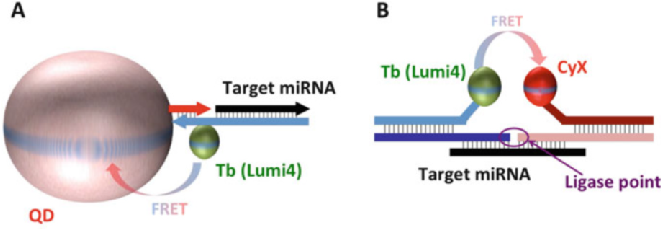

- Fig. 8 TG-FRET approaches used for the detection of miRNAs using probes containing a Tb complex as donor and QD (a) [227] or cyanine dye (b) [228] acceptors

careful accounting of the spectral crosstalk between the different channels [229]. The limits of the detection of the three miRNAs were below 1.5 nM in a multiplexing detection of the three targets in 5% [228] or 10% [227] serum samples. This study confirmed the promising approach for the development of point-of-care, rapid, PCR-free homogeneous assays with potential clinical applications.

One problem in the homogeneous detection and quantification of miRNAs in biological fluids is their low copy numbers (concentration). Hence, the amplification of the luminescent signal is a valid technique to achieve a sensitive analysis that is free of enzymatic amplification reactions. Considering this approach, X. Y. Chen and colleagues reported a method for amplifying the signal of the target sequence using lanthanide-doped nanoparticles. Once the target sequence is detected, the lanthanide ions are released from the nanoparticles using mild acidic conditions, and the signal enhanced in micellar solution containing appropriate antenna moieties [230]. The authors applied this concept to the development of a highly sensitive assay for miRNA21 in which a molecular beacon opened upon binding the miRNA target, and a sensing sequence carrying biotin is also hybridized. Then, avidin and biotinylated Eu(III)-loaded nanoparticles were added to the system. After washing, the acidification and micellar enhancing solution were added, and the signal was read using TG luminescence spectrometry. Because each nanoparticle carries several Eu(III) ions, a single miRNA21 molecule provides a high lanthanide emission signal, allowing for the desired amplification for an ultrasensitive assay [231]. In this study, the authors reported an extraordinary limit of detection in the femtomolar range. However, these results must be carefully considered given the lack of linearity in the semi-log plots of the 10 fM–100 pM region of the miRNA concentrations. The authors also tested the specificity of the assay towards single- and triple-mismatched sequences at 1 nM concentration of all miRNA strands based on a decrease in the fluorescence signal, but differentiating between 0.5 nM of the correct target and 1 nM of the single-nucleotide polymorph is impossible, and the situation could be even more difficult if mixtures of the correct and mismatched sequence coexist. Therefore, further improvements in state-of-the-art methods for the detection and quantification of low concentrations of miRNAs are necessary for actual clinical application.

- 4.4 Time-Gated Detection of miRNAs Using FLIM

In this context, we sought to exploit commercial products with the strengths discussed in the previous sections: the well-known sensitivity of fluorescence techniques along with the ability of TG detection to easily remove background interferences in complex media and the increasing interest in miRNAs as biomarkers for early, accurate and specific diagnosis of several important diseases.

A simple approach to these ideas is to develop a lab-on-a-chip-based application to directly detect miRNA and avoid the use of amplification by polymerases. This application should fulfil the following industrial requirements for final commercialization: detection of relevant biomarkers; affordable materials, technology and distribution; easy application in final research centres, hospitals, etc.; non-expertise in the final user; and optimized usefulness/cost ratio. We suggested a simple design as shown in Fig. 9. The chip used as a platform supports a sample well in which the capturing beads are fixed. After the in situ reaction with hybridization probes (reporters) and subsequent washing steps, the chip may be ready for TG luminescence detection.

To achieve this goal, we collaborated with important companies in the fields of biotechnology (DestiNA Genomics) [232] and optoelectronics detection (Optoi Microelectronics) [233] to further implement these concepts through a collaborative consortium involving universities and companies from Germany, Italy, Spain and Brazil called miRNA-DisEASY [234].

As reported elsewhere, we considered two different approaches for the direct detection of miRNAs by fluorescence lifetime imaging microscopy (FLIM).

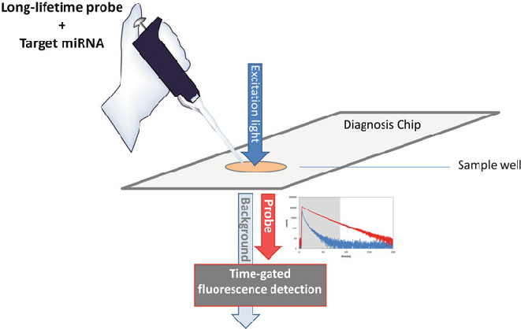

- Fig. 9 Chip-based design for the direct detection of miRNA using a TG analysis

Both approaches employ a chemical reporter (capture probes) of the target miRNA and the use of peptide nucleic acids (PNA) that easily bind to the complementary oligonucleotide strand due to the absence of negative charges in their skeleton. For the fluorescent probe, we used SeTau425 from SETA BioMedicals, which is a chemically and photophysically stable fluorophore with a lifetime of 25 ns. Using the differences in the charges between the negative target miRNA and neutral reporter PNA, we use beads with a positively charged surface, Q Sepharose (QSph, GE Healthcare), to separate the unwanted and unreacted material from the target duplex. Fluorescence was detected by placing the sample over a coverslip in a FLIM confocal microscope (MicroTime 200, PicoQuant GmbH, Germany) using an excitation source of a 5 MHz pulsed, 440 nm laser, and the emission was collected using a 550/50 nm bandpass filter. After the acquisition, TG filtering is performed to eliminate all sources of undesired fluorescence mainly originating from the beads. We focused our attention on miRNA122, which is a miRNA used in vitro to assess the cellular toxicity of new drugs and as a biomarker for the diagnosis of severe liver failure.

In the first approach (A), a PNA probe (Rep1*) labelled with the fluorescent probe SETau425 is used to bind the target miRNA122 by hybridization. After the subsequent washing steps and separation of unreacted materials, the hybridized duplex (D1*: Rep1*-miRNA122) remains bound to the QSph beads. Target duplexes D1* were detected and analysed in the confocal microscope. Figure 10 shows FLIM images of QSph beads incubated in the presence and absence of D1* with different intensities and lifetimes. Expectedly, D1* has an average decay of

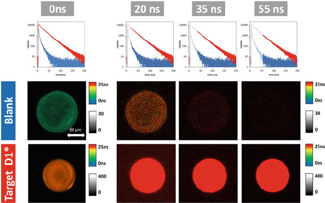

- Fig. 10 Average decays of fluorescence and FLIM images at different TG values for a D1* 1 μM solution and a blank solution (QSph beads in phosphate buffer pH 6). The size of the images is 80 80 μm2

fluorescence that is similar to that of the fluorescent probe, i.e. approximately 25 ns, and the blank solution of QSph autofluorescence. The loading of D1* onto the QSph beads is demonstrated by applying the principles of TG to remove the background fluorescence. Based on the different decay of the fluorescence, we can obtain the photons at a certain TW at which only SeTau425 fluoresces. Notably, the narrower the TW, the lower the number of detected photons. Hence, finding a compromise based on the background levels is recommended. The repetition rate of 5 MHz provides a total TW of 200 ns, and the application of TG from 55 ns completely eliminates the autofluorescence from QSph as shown in Fig. 10, while the D1* FLIM images preserve emission to a certain degree.

We sought to determine the limit of detection using our current FLIM setup in the described approach. The output signal strongly depends on the following parameters: the selected analysis TW as shown in Fig. 10, the time of acquisition per pixel, the loading of duplexes per bead, the time of incubation, etc. We optimized these parameters to achieve a better performance as follows: selection of TG of 55 ns and greater, the use of a single bead, increasing the time of acquisition per pixel and optimizing the time of incubation. Figure 11 shows the incubation of a 10 nM D1* solution without stirring using a single bead for capturing. The changes in the intensity and lifetime indicate the loading of D1* onto QSph beads over time. The detection is clearly visualized by applying different analysis TWs to the acquired photons.

We prepared different solutions of D1* (100 pM–1 μM) and performed an analysis using the described optimized approach with a detection TW of 55 ns onwards. We detected and distinguished up to subnanomolar concentrations of D1* (Fig. 12).

DestiNA Genomics is a company [235] that specializes in nucleic acid testing with proprietary technology. This company has developed methodologies using PNA capture probes combined with aldehyde modified nucleobases, i.e. the so-called SMART bases, to detect oligonucleotides and single-nucleotide

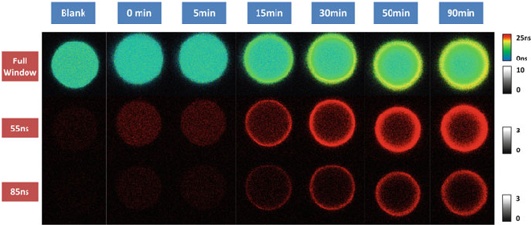

- Fig. 11 FLIM images of a 10 nM D1* solution (PB pH 6) directly incubated with a QSph bead at different times using two different analysis TWs. The size of the images is 80 80 μm2

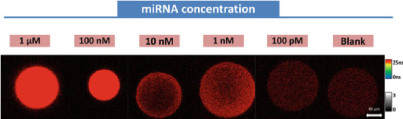

- Fig. 12 TG-FLIM images (detection TW 55 ns onwards) of different D1* solutions compared with a blank solution only containing beads in phosphate buffer at a pH of 6. The size of the images is 80 80 μm2

polymorphism. DestiNA Genomics’ patented dynamic chemistry is capable of not only directly detecting miRNAs but also providing single-base resolution [221, 236], adding an extra source of specificity to analyses of miRNAs. This approach is a differential and unique feature of our method compared to other approaches used for TG-based detection of miRNAs.

Using this approach, we studied the recognition of two different miRNA122 sequences. One sequence, i.e. miRNA122-18G, has a guanidine nucleobase at a certain position of the sequence, while the other, i.e. miRNA122-18A, bears an adenine at the same position. Notably, approach A cannot differentiate among the single point mutations on the miRNA as demonstrated in Fig. 13. However, using the DestiNA advanced methodology, we suggested a different approach (B) in which an unlabelled PNA probe (Rep2) complementary to miRNA122 is modified at a certain position with an absent nucleobase that is substituted for a reactive amine, thus creating a pocket in probe Rep2. In addition, a SMART cytosine nucleobase (SMBC) is labelled with SeTau425 (SMBC*). Rep2 and SMBC* are added in a single step to the solution containing the target miRNA and a reducing agent, i.e. NaBH3CN. In either miRNA122 sequence, Rep2 and miRNA122 hybridize (D2), but only if the target miRNA contains a guanidine position in front of the pocket of Rep2, SMBC* dynamically enters the pocket and covalently is fixed with NaBH3CN to D2*. Hence, the labelled duplex D2* only forms with miRNA12218G but not with miRNA122-18A. Capturing and separating the unreacted material are performed similarly using QSph beads that are subsequently imaged using confocal FLIM microscopy.

In contrast to approach A, our results using approach B demonstrate the ability of SMBC* along with Rep2 to distinguish miRNA122-18G from miRNA122-18A and highlight the challenge of detecting single point mutations using conventional hybridization techniques. As shown in Fig. 13, the TG-FLIM images demonstrate the detection of miRNA122-18G using both methodologies. Similarly, miRNA12218A binds Rep1*, yielding a positive result in approach A, while SMBC* hinders the dynamic incorporation into Rep2, resulting in a negative result in approach B.

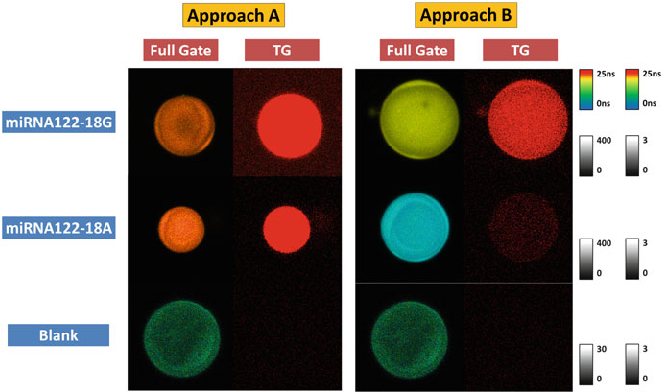

- Fig. 13 Comparison of approaches A and B differentiating single point mutations in miRNA122. Target oligonucleotides, i.e. miRNA122-18G and miRNA122-18A, were reacted with Rep1* (approach A) and Rep2 + SMBC* (approach B) for final D1* and D2 concentrations of 1 μM. FLIM images of the captured duplexes in QSph beads and a control blank solution are shown. FLIM images at the full detection window are compared with TG-FLIM images (detection TW of 55 ns onwards). The size of the images is 80 80 μm2

The combination of advanced chemical recognition and TG fluorescence detection represents a potential and promising methodology for directly detecting low concentrations of miRNAs at a single-nucleobase resolution, which is, indeed, a future pathway for in situ detection kits for liquid biopsies and other sources of low amounts of miRNAs, including complex matrices. In addition, this methodology has the potential to simultaneously interrogate certain positions in oligonucleotides using four different SMART nucleobases functionalized with four different fluorophores, allowing for multiplexing determinations. Thus, four fluorophores with different lifetimes could be required.

- 5 Outlook

The emission of luminescent photons is a multidimensional phenomenon involving several aspects, including emission kinetics. Time-resolved luminescence acquisition allows for the detection of photons depending on the time of emission after an excitation pulse and the discrimination of emitters with similar steady-state profiles but different lifetimes. Thus, time-gated acquisition filters short- and long-lived components of luminescence by applying certain detection TW during the detection, which is particularly useful for analysing species of interest in complex media that

have a usually short-lived background intensity with undesired contribution to the total signal.

Advances in pulsed excitation and ultrafast acquisition techniques have led to the development of time-resolved fluorescence microscopy for the investigation of complex samples, including biological processes in solution, tissues and cells. The resolution and contrast of microscopy images have been improved using TG acquisition approaches due to the elimination of short-lived fluorescence background. Thus, the improvement of long-lived fluorophores is also crucial, and much progress has been achieved using organic, metal-complex, lanthanides, nanoparticles and other luminophores. This progress has attracted much interest in industrial and technological areas, which has led to the development of new instruments, assays and probes for biotechnological applications.

Due to recent advances in TG fluorescence lifetime microscopy, this instrumentation has become widely accessible, allowing for its application to resolve cuttingedge problems of biological interest, in particular, the detection of new precise miRNA biomarkers. The combination of fluorescence imaging sensitivity and the discrimination of background interferences by TG acquisition paves the path for direct and in situ detection of analytes in biological fluids obtained in liquid biopsies. In the future, these technologies could provide breakthrough diagnostic and prognostic methods for early screening of biological samples across the population, allowing for the detection of an eventual cancer and, therefore, increasing the chances of the survival of patients.

Acknowledgements The authors acknowledge funding from the European Union’s Horizon 2020 research and innovation programme under the Marie Sklodowska-Curie grant agreement No 690866 (miRNA-DisEASY) and grants CTQ2017–85658-R from the Spanish Ministry of Economy and Competitiveness and the European Regional Development Fund (ERDF).

References

- 1. Lakowicz JR (2006) Principles of fluorescence spectroscopy3rd edn. Springer, New York. https://doi.org/10.1007/978-0-387-46312-4
- 2. Valeur B, Berberan-Santos MN (2012) Molecular fluorescence: principles and applications. Wiley, Weinheim. https://doi.org/10.1002/9783527650002
- 3. Williams RT, Bridges JW (1964) Fluorescence of solutions: a review. J Clin Pathol 17:371–394
- 4. Demas JN (1983) Excited state lifetime measurements. Academic, New York
- 5. O’Connor DV, Phillips D (1984) Time-correlated single photon counting. Academic, New York
- 6. Berezin MY, Achilefu S (2010) Fluorescence lifetime measurements and biological imaging. Chem Rev 110:2641–2684. https://doi.org/10.1021/cr900343z
- 7. Schneckenburger H (1985) Fluorescence techniques in biotechnology. Trends Biotechnol 3:257–261. https://doi.org/10.1016/0167-7799(85)90025-3
- 8. Schneckenburger H, Seidlitz HK, Eberz J (1988) New trends in photobiology. J Photochem Photobiol B 2:1–19. https://doi.org/10.1016/1011-1344(88)85033-4

- 9. Lehn JM (1978) Cryptates: the chemistry of macropolycyclic inclusion complexes. Acc Chem Res 11:49–57. https://doi.org/10.1021/ar50122a001
- 10. Nobelprize.org. Nobel Media AB (2014) Jean-Marie Lehn - facts. http://www.nobelprize.org/ nobel_prizes/chemistry/laureates/1987/lehn-facts.html. Accessed 28 Dec 2017
- 11. Sabbatini N, Guardigli M, Lehn J-M (1993) Luminescent lanthanide complexes as photochemical supramolecular devices. Coord Chem Rev 123:201–228. https://doi.org/10.1016/ 0010-8545(93)85056-A
- 12. Dickson EF, Pollak A, Diamandis EP (1995) Ultrasensitive bioanalytical assays using timeresolved fluorescence detection. Pharmacol Ther 66:207–235. https://doi.org/10.1016/01637258(94)00078-H
- 13. Gudgin Dickson EF, Pollak A, Diamandis EP (1995) Time-resolved detection of lanthanide luminescence for ultrasensitive bioanalytical assays. J Photochem Photobiol B 27:3–19. https://doi.org/10.1016/1011-1344(94)07086-4
- 14. Mathis G, Lehn JM (1986) Macropolycyclic complexes of rare earth metals and application as fluorescent labels. Patent number: EP0180492 A1
- 15. Lehn JM, Mathis G, Alpha B, Deschenaux R, Jolu E (1996) Rare earth cryptates, processes for their preparation, synthesis intermediates and application as fluorescent tracers. Patent number: US5534622 A
- 16. Siitari H, Hemmilä I, Soini E, Lövgren T, Koistinen V (1983) Detection of hepatitis B surface antigen using time-resolved fluoroimmunoassay. Nature 301:258–260. https://doi.org/10. 1038/301258a0
- 17. Pettersson K, Siitari H, Hemmilä I, Soini E, Lövgren T, Hänninen V, Tanner P, Stenman UH

(1983) Time-resolved fluoroimmunoassay of human choriogonadotropin. Clin Chem 29:60–64

- 18. Suonpää MU, Lavi JT, Hemmilä IA, Lövgren TN (1985) A new sensitive assay of human alpha-fetoprotein using time-resolved fluorescence and monoclonal antibodies. Clin Chim Acta 145:341–348. https://doi.org/10.1016/0009-8981(85)90044-0
- 19. Lövgren TNE (1987) Time-resolved fluoroimmunoassay of steroid hormones. J Steroid Biochem 27:47–51. https://doi.org/10.1016/0022-4731(87)90293-7
- 20. Bertoft E, Eskola JU, Näntö V, Lövgren T (1984) Competitive solid-phase immunoassay of testosterone using time-resolved fluorescence. FEBS Lett 173:213–216. https://doi.org/10. 1016/0014-5793(84)81049-2
- 21. Beverloo HB, van Schadewijk A, van Gelderen-Boele S, Tanke HJ (1990) Inorganic phosphors as new luminescent labels for immunocytochemistry and time-resolved microscopy. Cytometry 11:784–792. https://doi.org/10.1002/cyto.990110704
- 22. Beverloo HB, van Schadewijk A, Bonnet J, van der Geest R, Runia R, Verwoerd NP, Vrolijk J, Ploem JS, Tanke HJ (1992) Preparation and microscopic visualization of multicolor luminescent immunophosphors. Cytometry 13:561–570. https://doi.org/10.1002/cyto. 990130603
- 23. Marriott G, Clegg RM, Arndt-Jovin DJ, Jovin TM (1991) Time resolved imaging microscopy. Phosphorescence and delayed fluorescence imaging. Biophys J 60:1374–1387. https://doi.org/ 10.1016/S0006-3495(91)82175-0
- 24. Marriott G, Heidecker M, Diamandis EP, Yan-Marriott Y (1994) Time-resolved delayed luminescence image microscopy using an europium ion chelate complex. Biophys J 67:957–965. https://doi.org/10.1016/S0006-3495(94)80597-1
- 25. Cubeddu R, Taroni P, Valentini G, Canti G (1992) Use of time-gated fluorescence imaging for diagnosis in biomedicine. J Photochem Photobiol B 12:109–113. https://doi.org/10.1016/ 1011-1344(92)85023-N
- 26. Cubeddu R (1993) Time-gated imaging system for tumor diagnosis. Opt Eng 32:320. https:// doi.org/10.1117/12.60754
- 27. Cubeddu R, Taroni P, Valentini G, Ghetti F, Lenci F (1993) Time-gated fluorescence imaging of Blepharisma red and blue cells. Biochim Biophys Acta 1143:327–331. https://doi.org/10. 1016/0005-2728(93)90204-S

- 28. Seveus L, Väisälä M, Syrjänen S, Sandberg M, Kuusisto A, Harju R, Salo J, Hemmilä I, Kojola H, Soini E (1992) Time-resolved fluorescence imaging of europium chelate label in immunohistochemistry and in situ hybridization. Cytometry 13:329–338. https://doi.org/10. 1002/cyto.990130402
- 29. Schneckenburger H, Feyh J, Götz A, Jocham D, Unsöld E (1986) Time-resolved fluorescence of hematoporphyrin derivative in tumor cells and animal tissues. In: Waidelich W, Kiefhaber P (eds) Laser/optoelectronics in medicine/laser/optoelektronik in der medizin. Springer, Berlin, pp 70–73
- 30. Schneckenburger H, Koenig K, Dienersberger T, Hahn R (1994) Time-gated microscopic imaging and spectroscopy. In: Fercher AF, Lewis A, Podbielska H, Schneckenburger H, Wilson T (eds) Microscopy, holography, and interferometry in biomedicine. SPIE, Budapest, p 124
- 31. Koenig K (1994) Time-gated microscopic imaging and spectroscopy in medical diagnosis and photobiology [also Erratum 33(11)3828(Nov1994)]. Opt Eng 33:2600. https://doi.org/10. 1117/12.177101
- 32. Kohl M, Neukammer J, Sukowski U, Rinneberg H, Wöhrle D, Sinn HJ, Friedrich EA (1993) Delayed observation of laser-induced fluorescence for imaging of tumors. Appl Phys B Lasers Opt 56:131–138. https://doi.org/10.1007/BF00332192
- 33. Lakowicz JR, Szmacinski H, Nowaczyk K, Johnson ML (1992) Fluorescence lifetime imaging of free and protein-bound NADH. Proc Natl Acad Sci U S A 89:1271–1275. https://doi.org/10. 1073/pnas.89.4.1271
- 34. Lakowicz JR, Szmacinski H, Nowaczyk K, Berndt KW, Johnson M (1992) Fluorescence lifetime imaging. Anal Biochem 202:316–330. https://doi.org/10.1016/0003-2697(92)90112K
- 35. Gadella TWJ, Jovin TM, Clegg RM (1993) Fluorescence lifetime imaging microscopy (FLIM): spatial resolution of microstructures on the nanosecond time scale. Biophys Chem 48:221–239. https://doi.org/10.1016/0301-4622(93)85012-7
- 36. Becker W (2012) Fluorescence lifetime imaging--techniques and applications. J Microsc 247:119–136. https://doi.org/10.1111/j.1365-2818.2012.03618.x
- 37. Birks JB, Dyson DJ, Munro IH (1963) ‘Excimer’ fluorescence. II. Lifetime studies of pyrene solutions. Proc R Soc A 275:575–588. https://doi.org/10.1098/rspa.1963.0187
- 38. Smith JA, West RM, Allen M (2004) Acridones and quinacridones: novel fluorophores for fluorescence lifetime studies. J Fluoresc 14:151–171
- 39. Boettcher A, Gradoux N, Lorthiois E, Brandl T, Orain D, Schiering N, Cumin F, Woelcke J, Hassiepen U (2014) Fluorescence lifetime-based competitive binding assays for measuring the binding potency of protease inhibitors in vitro. J Biomol Screen 19:870–877. https://doi.org/ 10.1177/1087057114521295
- 40. Maltman BA, Dunsmore CJ, Couturier SCM, Tirnaveanu AE, Delbederi Z, McMordie RAS, Naredo G, Ramage R, Cotton G (2010) 9-Aminoacridine peptide derivatives as versatile reporter systems for use in fluorescence lifetime assays. Chem Commun 46:6929–6931. https://doi.org/10.1039/c0cc01901a
- 41. Ruedas-Rama MJ, Orte A, Hall EAH, Alvarez-Pez JM, Talavera EM (2012) A chloride ion nanosensor for time-resolved fluorimetry and fluorescence lifetime imaging. Analyst 137:1500–1508. https://doi.org/10.1039/c2an15851e
- 42. Bora I, Bogh SA, Rosenberg M, Santella M, Sørensen TJ, Laursen BW (2016) Diazaoxatriangulenium: synthesis of reactive derivatives and conjugation to bovine serum albumin. Org Biomol Chem 14:1091–1101. https://doi.org/10.1039/c5ob02293b
- 43. Sørensen TJ, Thyrhaug E, Szabelski M, Luchowski R, Gryczynski I, Gryczynski Z, Laursen BW (2013) Azadioxatriangulenium: a long fluorescence lifetime fluorophore for large biomolecule binding assay. Methods Appl Fluoresc 1:025001. https://doi.org/10.1088/20506120/1/2/025001

- 44. Wawrzinek R, Ziomkowska J, Heuveling J, Mertens M, Herrmann A, Schneider E, Wessig P

(2013) DBD dyes as fluorescence lifetime probes to study conformational changes in proteins. Chemistry 19:17349–17357. https://doi.org/10.1002/chem.201302368

- 45. Nau WM, Greiner G, Rau H, Wall J, Olivucci M, Scaiano JC (1999) Fluorescence of 2,3-diazabicyclo[2.2.2]oct-2-ene revisited: solvent-induced quenching of the n,π*-excited state by an aborted hydrogen atom transfer. J Phys Chem A 103:1579–1584. https://doi.org/ 10.1021/jp984303f
- 46. Petersen KJ, Peterson KC, Muretta JM, Higgins SE, Gillispie GD, Thomas DD (2014) Fluorescence lifetime plate reader: resolution and precision meet high-throughput. Rev Sci Instrum 85:113101. https://doi.org/10.1063/1.4900727
- 47. Patsenker LD, Tatarets AL, Povrozin YA, Terpetschnig EA (2011) Long-wavelength fluorescence lifetime labels. Bioanal Rev 3:115–137. https://doi.org/10.1007/s12566-011-0025-2
- 48. Patsenker LD, Yermolenko IG, Fedyunyaeva IA, Obukhova YN, Semenova ON, Terpetschnig EA (2011) Highly water-soluble, cationic luminescent labels. US 2011/0143387A1. https:// patents.google.com/patent/US20110143387A1/en?oq=US+2011%2f0143387A1
- 49. Zhao Q, Huang C, Li F (2011) Phosphorescent heavy-metal complexes for bioimaging. Chem Soc Rev 40:2508–2524. https://doi.org/10.1039/c0cs00114g
- 50. Ma D-L, He H-Z, Leung K-H, Chan DS-H, Leung C-H (2013) Bioactive luminescent transition-metal complexes for biomedical applications. Angew Chem Int Ed Engl 52:7666–7682. https://doi.org/10.1002/anie.201208414
- 51. Browne WR, Coates CG, Brady C, Matousek P, Towrie M, Botchway SW, Parker AW, Vos JG, McGarvey JJ (2003) Isotope effects on the picosecond time-resolved emission spectroscopy of tris(2,20-bipyridine)ruthenium (II). J Am Chem Soc 125:1706–1707. https://doi.org/ 10.1021/ja0289346
- 52. Terpetschnig E, Dattelbaum JD, Szmacinski H, Lakowicz JR (1997) Synthesis and spectral characterization of a thiol-reactive long-lifetime Ru(II) complex. Anal Biochem 251:241–245. https://doi.org/10.1006/abio.1997.2253
- 53. Heffern MC, Matosziuk LM, Meade TJ (2014) Lanthanide probes for bioresponsive imaging. Chem Rev 114:4496–4539. https://doi.org/10.1021/cr400477t
- 54. Eliseeva SV, Bünzli J-CG (2010) Lanthanide luminescence for functional materials and bio-sciences. Chem Soc Rev 39:189–227. https://doi.org/10.1039/b905604c
- 55. Silvi S, Credi A (2015) Luminescent sensors based on quantum dot-molecule conjugates. Chem Soc Rev 44:4275–4289. https://doi.org/10.1039/c4cs00400k
- 56. Wegner KD, Hildebrandt N (2015) Quantum dots: bright and versatile in vitro and in vivo fluorescence imaging biosensors. Chem Soc Rev 44:4792–4834. https://doi.org/10.1039/ c4cs00532e
- 57. Baker SN, Baker GA (2010) Luminescent carbon nanodots: emergent nanolights. Angew Chem Int Ed Engl 49:6726–6744. https://doi.org/10.1002/anie.200906623
- 58. Dekaliuk MO, Viagin O, Malyukin YV, Demchenko AP (2014) Fluorescent carbon nanomaterials: “quantum dots” or nanoclusters? Phys Chem Chem Phys 16:16075–16084. https://doi.org/10.1039/c4cp00138a
- 59. Joo J, Liu X, Kotamraju VR, Ruoslahti E, Nam Y, Sailor MJ (2015) Gated luminescence imaging of silicon nanoparticles. ACS Nano 9:6233–6241. https://doi.org/10.1021/acsnano. 5b01594
- 60. Lavis LD, Raines RT (2008) Bright ideas for chemical biology. ACS Chem Biol 3:142–155. https://doi.org/10.1021/cb700248m
- 61. Soini AE, Seveus L, Meltola NJ, Papkovsky DB, Soini E (2002) Phosphorescent metalloporphyrins as labels in time-resolved luminescence microscopy: effect of mounting on emission intensity. Microsc Res Tech 58:125–131. https://doi.org/10.1002/jemt.10129
- 62. Finikova OS, Cheprakov AV, Vinogradov SA (2005) Synthesis and luminescence of soluble meso-unsubstituted tetrabenzo- and tetranaphtho[2,3]porphyrins. J Org Chem 70:9562–9572. https://doi.org/10.1021/jo051580r

- 63. Papkovsky DB, O’Riordan TC (2005) Emerging applications of phosphorescent metalloporphyrins. J Fluoresc 15:569–584. https://doi.org/10.1007/s10895-005-2830-x
- 64. Bünzli J-CG (2010) Lanthanide luminescence for biomedical analyses and imaging. Chem Rev 110:2729–2755. https://doi.org/10.1021/cr900362e
- 65. Moore EG, Samuel APS, Raymond KN (2009) From antenna to assay: lessons learned in lanthanide luminescence. Acc Chem Res 42:542–552. https://doi.org/10.1021/ar800211j
- 66. Mohamadi A, Miller LW (2016) Brightly luminescent and kinetically inert lanthanide bioprobes based on linear and preorganized chelators. Bioconjug Chem 27(10):2540–2548. https://doi.org/10.1021/acs.bioconjchem.6b00473
- 67. Bünzli J-CG (2015) On the design of highly luminescent lanthanide complexes. Coord Chem Rev 293–294:19–47. https://doi.org/10.1016/j.ccr.2014.10.013
- 68. Wang Q, Nchimi Nono K, Syrjänpää M, Charbonnière LJ, Hovinen J, Härmä H (2013) Stable and highly fluorescent europium(III) chelates for time-resolved immunoassays. Inorg Chem 52:8461–8466. https://doi.org/10.1021/ic400384f
- 69. Sund H, Blomberg K, Meltola N, Takalo H (2017) Design of novel, water soluble and highly luminescent europium labels with potential to enhance immunoassay sensitivities. Molecules 22(10):E1807. https://doi.org/10.3390/molecules22101807
- 70. Delbianco M, Sadovnikova V, Bourrier E, Mathis G, Lamarque L, Zwier JM, Parker D (2014) Bright, highly water-soluble triazacyclononane europium complexes to detect ligand binding with time-resolved FRET microscopy. Angew Chem Int Ed Engl 53:10718–10722. https://doi. org/10.1002/anie.201406632
- 71. Butler SJ, Delbianco M, Lamarque L, McMahon BK, Neil ER, Pal R, Parker D, Walton JW, Zwier JM (2015) EuroTracker® dyes: design, synthesis, structure and photophysical properties of very bright europium complexes and their use in bioassays and cellular optical imaging. Dalton Trans 44:4791–4803. https://doi.org/10.1039/c4dt02785j
- 72. Orte A, Alvarez-Pez JM, Ruedas-Rama MJ (2013) Fluorescence lifetime imaging microscopy for the detection of intracellular pH with quantum dot nanosensors. ACS Nano 7:6387–6395. https://doi.org/10.1021/nn402581q
- 73. Kruss S, Hilmer AJ, Zhang J, Reuel NF, Mu B, Strano MS (2013) Carbon nanotubes as optical biomedical sensors. Adv Drug Deliv Rev 65:1933–1950. https://doi.org/10.1016/j.addr.2013. 07.015
- 74. Liu J-H, Cao L, LeCroy GE, Wang P, Meziani MJ, Dong Y, Liu Y, Luo PG, Sun Y-P (2015) Carbon “quantum” dots for fluorescence labeling of cells. ACS Appl Mater Interfaces 7:19439–19445. https://doi.org/10.1021/acsami.5b05665
- 75. Ortega-Liebana MC, Encabo-Berzosa MM, Ruedas-Rama MJ, Hueso JL (2017) Nitrogeninduced transformation of vitamin C into multifunctional up-converting carbon nanodots in the visible-NIR range. Chemistry 23:3067–3073. https://doi.org/10.1002/chem.201604216
- 76. Eda G, Lin Y-Y, Mattevi C, Yamaguchi H, Chen H-A, Chen I-S, Chen C-W, Chhowalla M

(2010) Blue photoluminescence from chemically derived graphene oxide. Adv Mater 22:505–509. https://doi.org/10.1002/adma.200901996

- 77. Loh KP, Bao Q, Eda G, Chhowalla M (2010) Graphene oxide as a chemically tunable platform for optical applications. Nat Chem 2:1015–1024. https://doi.org/10.1038/nchem.907
- 78. Wang F, Gu Z, Lei W, Wang W, Xia X, Hao Q (2014) Graphene quantum dots as a fluorescent sensing platform for highly efficient detection of copper(II) ions. Sensors Actuators B Chem 190:516–522. https://doi.org/10.1016/j.snb.2013.09.009
- 79. Röding M, Bradley SJ, Nydén M, Nann T (2014) Fluorescence lifetime analysis of graphene quantum dots. J Phys Chem C 118:30282–30290. https://doi.org/10.1021/jp510436r
- 80. Vaijayanthimala V, Cheng P-Y, Yeh S-H, Liu K-K, Hsiao C-H, Chao J-I, Chang H-C (2012) The long-term stability and biocompatibility of fluorescent nanodiamond as an in vivo contrast agent. Biomaterials 33:7794–7802. https://doi.org/10.1016/j.biomaterials.2012.06.084
- 81. Faklaris O, Garrot D, Joshi V, Druon F, Boudou J-P, Sauvage T, Georges P, Curmi PA, Treussart F (2008) Detection of single photoluminescent diamond nanoparticles in cells and

- study of the internalization pathway. Small 4:2236–2239. https://doi.org/10.1002/smll. 200800655
- 82. Kuo Y, Hsu T-Y, Wu Y-C, Chang H-C (2013) Fluorescent nanodiamond as a probe for the intercellular transport of proteins in vivo. Biomaterials 34:8352–8360. https://doi.org/10.1016/ j.biomaterials.2013.07.043
- 83. Gu L, Hall DJ, Qin Z, Anglin E, Joo J, Mooney DJ, Howell SB, Sailor MJ (2013) In vivo timegated fluorescence imaging with biodegradable luminescent porous silicon nanoparticles. Nat Commun 4:2326. https://doi.org/10.1038/ncomms3326
- 84. Bryan JD (2005) Doped semiconductor nanocrystals: synthesis, characterization, physical properties, and applications. In: Karlin KD (ed) Progress in inorganic chemistry. Wiley, Hoboken, pp 47–126
- 85. Wu P, Yan X-P (2013) Doped quantum dots for chemo/biosensing and bioimaging. Chem Soc Rev 42:5489–5521. https://doi.org/10.1039/c3cs60017c
- 86. Del Rosal B, Ortgies DH, Fernández N, Sanz-Rodríguez F, Jaque D, Rodríguez EM (2016) Overcoming autofluorescence: long-lifetime infrared nanoparticles for time-gated in vivo imaging. Adv Mater 28:10188–10193. https://doi.org/10.1002/adma.201603583
- 87. Tian L, Dai Z, Zhang L, Zhang R, Ye Z, Wu J, Jin D, Yuan J (2012) Preparation and timegated luminescence bioimaging applications of long wavelength-excited silica-encapsulated europium nanoparticles. Nanoscale 4:3551–3557. https://doi.org/10.1039/c2nr30233k
- 88. Song C, Ye Z, Wang G, Jin D, Yuan J, Guan Y, Piper J (2009) Preparation and time-gated luminescence bioimaging application of ruthenium complex covalently bound silica nanoparticles. Talanta 79:103–108. https://doi.org/10.1016/j.talanta.2009.03.018
- 89. Wessel D, Flügge UI (1984) A method for the quantitative recovery of protein in dilute solution in the presence of detergents and lipids. Anal Biochem 138:141–143. https://doi. org/10.1016/0003-2697(84)90782-6
- 90. Maple PA, Jones CS, Andrews NJ (2001) Time resolved fluorometric immunoassay, using europium labelled antihuman IgG, for the detection of human tetanus antitoxin in serum. J Clin Pathol 54:812–815
- 91. Qin Q, Christiansen M, Lövgren T, Nørgaard-Pedersen B, Pettersson K (1997) Dual-label time-resolved immunofluorometric assay for simultaneous determination of pregnancyassociated plasma protein A and free beta-subunit of human chorionic gonadotrophin. J Immunol Methods 205:169–175
- 92. Bookout JT, Joaquim TR, Magin KM, Rogan GJ, Lirette RP (2000) Development of a duallabel time-resolved fluorometric immunoassay for the simultaneous detection of two recombinant proteins in potato. J Agric Food Chem 48:5868–5873. https://doi.org/10.1021/ jf000841p
- 93. Mitrunen K, Pettersson K, Piironen T, Björk T, Lilja H, Lövgren T (1995) Dual-label one-step immunoassay for simultaneous measurement of free and total prostate-specific antigen concentrations and ratios in serum. Clin Chem 41:1115–1120
- 94. Zhu L, Leinonen J, Zhang W-M, Finne P, Stenman U-H (2003) Dual-label immunoassay for simultaneous measurement of prostate-specific antigen (PSA)-alpha1-antichymotrypsin complex together with free or total PSA. Clin Chem 49:97–103. https://doi.org/10.1373/49.1.97
- 95. Degorce F, Card A, Soh S, Trinquet E, Knapik GP, Xie B (2009) HTRF: a technology tailored for drug discovery - a review of theoretical aspects and recent applications. Curr Chem Genomics 3:22–32. https://doi.org/10.2174/1875397300903010022
- 96. Bazin H, Trinquet E, Mathis G (2002) Time resolved amplification of cryptate emission: a versatile technology to trace biomolecular interactions. J Biotechnol 82:233–250
- 97. Mabile M, Mathis G, Jolu EJP, Pouyat D, Dumont C (1996) Method of measuring the luminescence emitted in a luminescent assay. Patent number: US5527684 A
- 98. Hildebrandt N, Charbonnière LJ, Beck M, Ziessel RF, Löhmannsröben H-G (2005) Quantum dots as efficient energy acceptors in a time-resolved fluoroimmunoassay. Angew Chem Int Ed Engl 44:7612–7615. https://doi.org/10.1002/anie.200501552
- 99. Charbonnière LJ, Hildebrandt N, Ziessel RF, Löhmannsröben H-G (2006) Lanthanides to quantum dots resonance energy transfer in time-resolved fluoro-immunoassays and luminescence microscopy. J Am Chem Soc 128:12800–12809. https://doi.org/10.1021/ja062693a

- 100. Algar WR, Wegner D, Huston AL, Blanco-Canosa JB, Stewart MH, Armstrong A, Dawson PE, Hildebrandt N, Medintz IL (2012) Quantum dots as simultaneous acceptors and donors in time-gated Förster resonance energy transfer relays: characterization and biosensing. J Am Chem Soc 134:1876–1891. https://doi.org/10.1021/ja210162f
- 101. Jia Y, Quinn CM, Clabbers A, Talanian R, Xu Y, Wishart N, Allen H (2006) Comparative analysis of various in vitro COT kinase assay formats and their applications in inhibitor identification and characterization. Anal Biochem 350:268–276. https://doi.org/10.1016/j.ab. 2005.11.010
- 102. Schröter T, Minond D, Weiser A, Dao C, Habel J, Spicer T, Chase P, Baillargeon P, Scampavia L, Schürer S, Chung C, Mader C, Southern M, Tsinoremas N, LoGrasso P, Hodder P (2008) Comparison of miniaturized time-resolved fluorescence resonance energy transfer and enzyme-coupled luciferase high-throughput screening assays to discover inhibitors of Rho-kinase II (ROCK-II). J Biomol Screen 13:17–28. https://doi.org/10.1177/ 1087057107310806
- 103. Gracias V, Ji Z, Akritopoulou-Zanze I, Abad-Zapatero C, Huth JR, Song D, Hajduk PJ, Johnson EF, Glaser KB, Marcotte PA, Pease L, Soni NB, Stewart KD, Davidsen SK, Michaelides MR, Djuric SW (2008) Scaffold oriented synthesis. Part 2: design, synthesis and biological evaluation of pyrimido-diazepines as receptor tyrosine kinase inhibitors. Bioorg Med Chem Lett 18:2691–2695. https://doi.org/10.1016/j.bmcl.2008.03.021
- 104. Liu J, Lin TH, Cole AG, Wen R, Zhao L, Brescia M-R, Jacob B, Hussain Z, Appell KC, Henderson I, Webb ML (2008) Identification and characterization of small-molecule inhibitors of Tie2 kinase. FEBS Lett 582:785–791. https://doi.org/10.1016/j.febslet.2008.02.003
- 105. Ayoub MA, Trebaux J, Vallaghe J, Charrier-Savournin F, Al-Hosaini K, Gonzalez Moya A, Pin J-P, Pfleger KDG, Trinquet E (2014) Homogeneous time-resolved fluorescence-based assay to monitor extracellular signal-regulated kinase signaling in a high-throughput format. Front Endocrinol (Lausanne) 5:94. https://doi.org/10.3389/fendo.2014.00094
- 106. Vaasa A, Ligi K, Mohandessi S, Enkvist E, Uri A, Miller LW (2012) Time-gated luminescence microscopy with responsive nonmetal probes for mapping activity of protein kinases in living cells. Chem Commun (Camb) 48:8595–8597. https://doi.org/10.1039/c2cc33565d
- 107. Enkvist E, Vaasa A, Kasari M, Kriisa M, Ivan T, Ligi K, Raidaru G, Uri A (2011) Proteininduced long lifetime luminescence of nonmetal probes. ACS Chem Biol 6:1052–1062. https://doi.org/10.1021/cb200120v
- 108. Enomoto K, Okamoto H, Numata Y, Takemoto H (2006) A simple and rapid assay for heparanase activity using homogeneous time-resolved fluorescence. J Pharm Biomed Anal 41:912–917. https://doi.org/10.1016/j.jpba.2006.01.032
- 109. Aouadi W, Eydoux C, Coutard B, Martin B, Debart F, Vasseur JJ, Contreras JM, Morice C, Quérat G, Jung M-L, Canard B, Guillemot J-C, Decroly E (2017) Toward the identification of viral cap-methyltransferase inhibitors by fluorescence screening assay. Antivir Res 144:330–339. https://doi.org/10.1016/j.antiviral.2017.06.021
- 110. Ji J, Lao K, Hu J, Pang T, Jiang Z, Yuan H, Miao J, Chen X, Ning S, Xiang H, Guo Y, Yan M, Zhang L (2014) Discovery of novel aromatase inhibitors using a homogeneous time-resolved fluorescence assay. Acta Pharmacol Sin 35:1082–1092. https://doi.org/10.1038/aps.2014.53
- 111. Algar WR, Malanoski AP, Susumu K, Stewart MH, Hildebrandt N, Medintz IL (2012) Multiplexed tracking of protease activity using a single color of quantum dot vector and a time-gated Förster resonance energy transfer relay. Anal Chem 84:10136–10146. https://doi. org/10.1021/ac3028068
- 112. Zhang S, Ma Y, Li J, Ma J, Yu B, Xie X (2014) Molecular matchmaking between the popular weight-loss herb Hoodia gordonii and GPR119, a potential drug target for metabolic disorder. Proc Natl Acad Sci U S A 111:14571–14576. https://doi.org/10.1073/pnas.1324130111
- 113. Keppler A, Gendreizig S, Gronemeyer T, Pick H, Vogel H, Johnsson K (2003) A general method for the covalent labeling of fusion proteins with small molecules in vivo. Nat Biotechnol 21:86–89. https://doi.org/10.1038/nbt765
- 114. Valencia C, Dujet C, Margathe J-F, Iturrioz X, Roux T, Trinquet E, Villa P, Hibert M, Dupuis E, Llorens-Cortes C, Bonnet D (2017) A time-resolved FRET cell-based binding

- assay for the apelin receptor. ChemMedChem 12:925–931. https://doi.org/10.1002/cmdc. 201700106
- 115. Zwier JM, Roux T, Cottet M, Durroux T, Douzon S, Bdioui S, Gregor N, Bourrier E, Oueslati N, Nicolas L, Tinel N, Boisseau C, Yverneau P, Charrier-Savournin F, Fink M, Trinquet E (2010) A fluorescent ligand-binding alternative using Tag-lite® technology. J Biomol Screen 15:1248–1259. https://doi.org/10.1177/1087057110384611
- 116. Leyris J-P, Roux T, Trinquet E, Verdié P, Fehrentz J-A, Oueslati N, Douzon S, Bourrier E, Lamarque L, Gagne D, Galleyrand J-C, M’kadmi C, Martinez J, Mary S, Banères J-L, Marie J

(2011) Homogeneous time-resolved fluorescence-based assay to screen for ligands targeting the growth hormone secretagogue receptor type 1a. Anal Biochem 408:253–262. https://doi. org/10.1016/j.ab.2010.09.030

- 117. Emami-Nemini A, Roux T, Leblay M, Bourrier E, Lamarque L, Trinquet E, Lohse MJ (2013) Time-resolved fluorescence ligand binding for G protein-coupled receptors. Nat Protoc 8:1307–1320. https://doi.org/10.1038/nprot.2013.073
- 118. Thibon A, Pierre VC (2009) Principles of responsive lanthanide-based luminescent probes for cellular imaging. Anal Bioanal Chem 394:107–120. https://doi.org/10.1007/s00216-0092683-2
- 119. Aulsebrook ML, Graham B, Grace MR, Tuck KL (2017) Lanthanide complexes for luminescence-based sensing of low molecular weight analytes. Coord Chem Rev 375:191–220. https://doi.org/10.1016/j.ccr.2017.11.018
- 120. Strimbu K, Tavel JA (2010) What are biomarkers? Curr Opin HIV AIDS 5:463–466. https:// doi.org/10.1097/COH.0b013e32833ed177
- 121. Detassis S, Grasso M, Del Vescovo V, Denti MA (2017) microRNAs make the call in cancer personalized medicine. Front Cell Dev Biol 5:86. https://doi.org/10.3389/fcell.2017.00086
- 122. Borrebaeck CAK (2017) Precision diagnostics: moving towards protein biomarker signatures of clinical utility in cancer. Nat Rev Cancer 17:199–204. https://doi.org/10.1038/nrc.2016.153
- 123. Jeromin A, Bowser R (2017) Biomarkers in neurodegenerative diseases. Adv Neurobiol 15:491–528. https://doi.org/10.1007/978-3-319-57193-5_20
- 124. Wang J, Tan G-J, Han L-N, Bai Y-Y, He M, Liu H-B (2017) Novel biomarkers for cardiovascular risk prediction. J Geriatr Cardiol 14:135–150. https://doi.org/10.11909/j.issn.16715411.2017.02.008
- 125. Dorcely B, Katz K, Jagannathan R, Chiang SS, Oluwadare B, Goldberg IJ, Bergman M (2017) Novel biomarkers for prediabetes, diabetes, and associated complications. Diabetes Metab Syndr Obes 10:345–361. https://doi.org/10.2147/DMSO.S100074
- 126. Kashani K, Cheungpasitporn W, Ronco C (2017) Biomarkers of acute kidney injury: the pathway from discovery to clinical adoption. Clin Chem Lab Med 55:1074–1089. https://doi. org/10.1515/cclm-2016-0973
- 127. Qin Q-P, Christiansen M, Pettersson K (2002) Point-of-care time-resolved immunofluorometric assay for human pregnancy-associated plasma protein A: use in first-trimester screening for Down syndrome. Clin Chem 48:473–483
- 128. Tsukerman GL, Gusina NB, Cuckle HS (1999) Maternal serum screening for Down syndrome in the first trimester: experience from Belarus. Prenat Diagn 19:499–504. https://doi.org/10. 1002/(SICI)1097-0223(199906)19:6<499::AID-PD555>3.0.CO;2-6
- 129. Niemimaa M, Suonpää M, Perheentupa A, Seppälä M, Heinonen S, Laitinen P, Ruokonen A, Ryynänen M (2001) Evaluation of first trimester maternal serum and ultrasound screening for Down’s syndrome in Eastern and Northern Finland. Eur J Hum Genet 9:404–408. https://doi. org/10.1038/sj.ejhg.5200655
- 130. Prieto B, Llorente E, González-Pinto I, Alvarez FV (2008) Plasma procalcitonin measured by time-resolved amplified cryptate emission (TRACE) in liver transplant patients. A prognosis marker of early infectious and non-infectious postoperative complications. Clin Chem Lab Med 46:660–666

- 131. Tousch D, Lajoix A-D, Hosy E, Azay-Milhau J, Ferrare K, Jahannault C, Cros G, Petit P

(2008) Chicoric acid, a new compound able to enhance insulin release and glucose uptake. Biochem Biophys Res Commun 377:131–135. https://doi.org/10.1016/j.bbrc.2008.09.088

- 132. Wang D-Y, Lu Q, Walsh SL, Payne L, Modha SS, Scott MJ, Sweitzer TD, Ames RS, Krosky DJ, Li H (2008) Development of a high-throughput cell-based assay for 11beta-hydroxysteroid dehydrogenase type 1 using BacMam technology. Mol Biotechnol 39:127–134. https://doi. org/10.1007/s12033-008-9050-y
- 133. Goedken ER, Gagnon AI, Overmeyer GT, Liu J, Petrillo RA, Burchat AF, Tomlinson MJ

(2008) HTRF-based assay for microsomal prostaglandin E2 synthase-1 activity. J Biomol Screen 13:619–625. https://doi.org/10.1177/1087057108321145

- 134. Lewis H, Beher D, Cookson N, Oakley A, Piggott M, Morris CM, Jaros E, Perry R, Ince P, Kenny RA, Ballard CG, Shearman MS, Kalaria RN (2006) Quantification of Alzheimer pathology in ageing and dementia: age-related accumulation of amyloid-beta(42) peptide in vascular dementia. Neuropathol Appl Neurobiol 32:103–118. https://doi.org/10.1111/j.13652990.2006.00696.x
- 135. Penas C, Pazos E, Mascareñas JL, Vázquez ME (2013) A folding-based approach for the luminescent detection of a short RNA hairpin. J Am Chem Soc 135:3812–3814. https://doi. org/10.1021/ja400270a
- 136. Pazos E, Jiménez-Balsa A, Mascareñas JL, Vázquez ME (2011) Sensing coiled-coil proteins through conformational modulation of energy transfer processes—selective detection of the oncogenic transcription factor c-Jun. Chem Sci 2:1984. https://doi.org/10.1039/c1sc00108f
- 137. González-Vera JA, Bouzada D, Bouclier C, Eugenio Vázquez M, Morris MC (2017) Lanthanide-based peptide biosensor to monitor CDK4/cyclin D kinase activity. Chem Commun (Camb) 53:6109–6112. https://doi.org/10.1039/c6cc09948c
- 138. Pazos E, Torrecilla D, Vázquez López M, Castedo L, Mascareñas JL, Vidal A, Vázquez ME

(2008) Cyclin A probes by means of intermolecular sensitization of terbium-chelating peptides. J Am Chem Soc 130:9652–9653. https://doi.org/10.1021/ja803520q

- 139. Newton P, Harrison P, Clulow S (2008) A novel method for determination of the affinity of protein: protein interactions in homogeneous assays. J Biomol Screen 13:674–682. https://doi. org/10.1177/1087057108321086
- 140. Maurel D, Comps-Agrar L, Brock C, Rives M-L, Bourrier E, Ayoub MA, Bazin H, Tinel N, Durroux T, Prézeau L, Trinquet E, Pin J-P (2008) Cell-surface protein-protein interaction analysis with time-resolved FRET and snap-tag technologies: application to GPCR oligomerization. Nat Methods 5:561–567. https://doi.org/10.1038/nmeth.1213
- 141. Vischer HF, Nijmeijer S, Smit MJ, Leurs R (2008) Viral hijacking of human receptors through heterodimerization. Biochem Biophys Res Commun 377:93–97. https://doi.org/10.1016/j. bbrc.2008.09.082
- 142. Lakowicz JR (2001) Method and composition for detecting the presence of a nucleic acid sequence in a sample. US6200752B1. https://patents.google.com/patent/US6200752B1/
- 143. Rajendran M, Miller LW (2015) Evaluating the performance of time-gated live-cell microscopy with lanthanide probes. Biophys J 109:240–248. https://doi.org/10.1016/j.bpj. 2015.06.028
- 144. Jin D, Piper JA (2011) Time-gated luminescence microscopy allowing direct visual inspection of lanthanide-stained microorganisms in background-free condition. Anal Chem 83:2294–2300. https://doi.org/10.1021/ac103207r
- 145. Zhang L, Zheng X, Deng W, Lu Y, Lechevallier S, Ye Z, Goldys EM, Dawes JM, Piper JA, Yuan J, Verelst M, Jin D (2014) Practical implementation, characterization and applications of a multi-colour time-gated luminescence microscope. Sci Rep 4:6597. https://doi.org/10.1038/ srep06597
- 146. Soini AE, Kuusisto A, Meltola NJ, Soini E, Seveus L (2003) A new technique for multiparameter imaging microscopy: use of long decay time photoluminescent labels enables multiple color immunocytochemistry with low channel-to-channel crosstalk. Microsc Res Tech 62:396–407. https://doi.org/10.1002/jemt.10389
- 147. Grichine A, Haefele A, Pascal S, Duperray A, Michel R, Andraud C, Maury O (2014) Millisecond lifetime imaging with a europium complex using a commercial confocal

- microscope under one or two-photon excitation. Chem Sci 5:3475–3485. https://doi.org/10. 1039/C4SC00473F
- 148. Vicidomini G, Moneron G, Han KY, Westphal V, Ta H, Reuss M, Engelhardt J, Eggeling C, Hell SW (2011) Sharper low-power STED nanoscopy by time gating. Nat Methods 8:571–573. https://doi.org/10.1038/nmeth.1624
- 149. Lu Y, Xi P, Piper JA, Huo Y, Jin D (2012) Time-gated orthogonal scanning automated microscopy (OSAM) for high-speed cell detection and analysis. Sci Rep 2:837. https://doi. org/10.1038/srep00837
- 150. Ruedas-Rama MJ, Alvarez-Pez JM, Crovetto L, Paredes JM, Orte A (2015) FLIM strategies for intracellular sensing. In: Kapusta P, Wahl M, Erdmann R (eds) Advanced photon counting. Springer, Cham, pp 191–223
- 151. Dahan M, Laurence T, Pinaud F, Chemla DS, Alivisatos AP, Sauer M, Weiss S (2001) Timegated biological imaging by use of colloidal quantum dots. Opt Lett 26:825–827
- 152. Mandal G, Darragh M, Wang YA, Heyes CD (2013) Cadmium-free quantum dots as timegated bioimaging probes in highly-autofluorescent human breast cancer cells. Chem Commun (Camb) 49:624–626. https://doi.org/10.1039/c2cc37529j
- 153. Bouccara S, Fragola A, Giovanelli E, Sitbon G, Lequeux N, Pons T, Loriette V (2014) Time-gated cell imaging using long lifetime near-infrared-emitting quantum dots for autofluorescence rejection. J Biomed Opt 19:051208. https://doi.org/10.1117/1.JBO.19.5. 051208
- 154. Liu M, Ye Z, Xin C, Yuan J (2013) Development of a ratiometric time-resolved luminescence sensor for pH based on lanthanide complexes. Anal Chim Acta 761:149–156. https://doi.org/ 10.1016/j.aca.2012.11.025
- 155. Smith DG, McMahon BK, Pal R, Parker D (2012) Live cell imaging of lysosomal pH changes with pH responsive ratiometric lanthanide probes. Chem Commun (Camb) 48:8520–8522. https://doi.org/10.1039/c2cc34267g
- 156. Liu X, Guo L, Song B, Tang Z, Yuan J (2017) Development of a novel europium complexbased luminescent probe for time-gated luminescence imaging of hypochlorous acid in living samples. Methods Appl Fluoresc 5:014009. https://doi.org/10.1088/2050-6120/aa61af
- 157. Liu X, Tang Z, Song B, Ma H, Yuan J (2017) A mitochondria-targeting time-gated luminescence probe for hypochlorous acid based on a europium complex. J Mater Chem B 5:2849–2855. https://doi.org/10.1039/C6TB02991D
- 158. Song B, Ye Z, Yang Y, Ma H, Zheng X, Jin D, Yuan J (2015) Background-free in-vivo imaging of vitamin C using time-gateable responsive probe. Sci Rep 5:14194. https://doi.org/ 10.1038/srep14194
- 159. Dai Z, Tian L, Song B, Ye Z, Liu X, Yuan J (2014) Ratiometric time-gated luminescence probe for hydrogen sulfide based on lanthanide complexes. Anal Chem 86:11883–11889. https://doi.org/10.1021/ac503611f
- 160. Dai Z, Tian L, Ye Z, Song B, Zhang R, Yuan J (2013) A lanthanide complex-based ratiometric luminescence probe for time-gated luminescence detection of intracellular thiols. Anal Chem 85:11658–11664. https://doi.org/10.1021/ac403370g
- 161. Sun J, Song B, Ye Z, Yuan J (2015) Mitochondria targetable time-gated luminescence probe for singlet oxygen based on a β-diketonate-europium complex. Inorg Chem 54:11660–11668. https://doi.org/10.1021/acs.inorgchem.5b02458
- 162. Afsari HS, Cardoso Dos Santos M, Lindén S, Chen T, Qiu X, van Bergen En Henegouwen PMP, Jennings TL, Susumu K, Medintz IL, Hildebrandt N, Miller LW (2016) Time-gated FRET nanoassemblies for rapid and sensitive intra- and extracellular fluorescence imaging. Sci Adv 2:e1600265. https://doi.org/10.1126/sciadv.1600265
- 163. Tu C-C, Awasthi K, Chen K-P, Lin C-H, Hamada M, Ohta N, Li Y-K (2017) Time-gated imaging on live cancer cells using silicon quantum dot nanoparticles with long-lived fluorescence. ACS Photonics 4:1306–1315. https://doi.org/10.1021/acsphotonics.7b00188
- 164. Monici M (2005) Cell and tissue autofluorescence research and diagnostic applications. Biotechnol Annu Rev 11:227–256. https://doi.org/10.1016/S1387-2656(05)11007-2
- 165. Zipfel WR, Williams RM, Christie R, Nikitin AY, Hyman BT, Webb WW (2003) Live tissue intrinsic emission microscopy using multiphoton-excited native fluorescence and second

- harmonic generation. Proc Natl Acad Sci U S A 100:7075–7080. https://doi.org/10.1073/pnas. 0832308100
- 166. Thorson MK, Ung P, Leaver FM, Corbin TS, Tuck KL, Graham B, Barrios AM (2015) Lanthanide complexes as luminogenic probes to measure sulfide levels in industrial samples. Anal Chim Acta 896:160–165. https://doi.org/10.1016/j.aca.2015.09.024
- 167. Surender EM, Bradberry SJ, Bright SA, McCoy CP, Williams DC, Gunnlaugsson T (2017) Luminescent lanthanide cyclen-based enzymatic assay capable of diagnosing the onset of catheter-associated urinary tract infections both in solution and within polymeric hydrogels. J Am Chem Soc 139:381–388. https://doi.org/10.1021/jacs.6b11077
- 168. Chen X, Wang Y, Chai R, Xu Y, Li H, Liu B (2017) Luminescent lanthanide-based organic/ inorganic hybrid materials for discrimination of glutathione in solution and within hydrogels. ACS Appl Mater Interfaces 9:13554–13563. https://doi.org/10.1021/acsami.7b02679
- 169. Gorai T, Maitra U (2016) Supramolecular approach to enzyme sensing on paper discs using lanthanide photoluminescence. ACS Sens 1:934–940. https://doi.org/10.1021/acssensors. 6b00341
- 170. Zhang R, Liu S, Wang J, Han G, Yang L, Liu B, Guan G, Zhang Z (2016) Visualization of exhaled hydrogen sulphide on test paper with an ultrasensitive and time-gated luminescent probe. Analyst 141:4919–4925. https://doi.org/10.1039/c6an00830e
- 171. Hashino K, Ikawa K, Ito M, Hosoya C, Nishioka T, Makiuchi M, Matsumoto K (2007) Application of a fluorescent lanthanide chelate label on a solid support device for detecting DNA variation with ligation-based assay. Anal Biochem 364:89–91. https://doi.org/10.1016/j. ab.2007.02.004
- 172. Lövgren T, Meriö L, Mitrunen K, Mäkinen ML, Mäkelä M, Blomberg K, Palenius T, Pettersson K (1996) One-step all-in-one dry reagent immunoassays with fluorescent europium chelate label and time-resolved fluorometry. Clin Chem 42:1196–1201
- 173. Nagl S, Stich MIJ, Schäferling M, Wolfbeis OS (2009) Method for simultaneous luminescence sensing of two species using optical probes of different decay time, and its application to an enzymatic reaction at varying temperature. Anal Bioanal Chem 393:1199–1207. https://doi. org/10.1007/s00216-008-2467-0
- 174. Leblanc V, Delaunay V, Claude Lelong J, Gas F, Mathis G, Grassi J, May E (2002) Homogeneous time-resolved fluorescence assay for identifying p53 interactions with its protein partners, directly in a cellular extract. Anal Biochem 308:247–254
- 175. Albizu L, Cottet M, Kralikova M, Stoev S, Seyer R, Brabet I, Roux T, Bazin H, Bourrier E, Lamarque L, Breton C, Rives M-L, Newman A, Javitch J, Trinquet E, Manning M, Pin J-P, Mouillac B, Durroux T (2010) Time-resolved FRET between GPCR ligands reveals oligomers in native tissues. Nat Chem Biol 6:587–594. https://doi.org/10.1038/nchembio.396
- 176. Lu Y, Jin D, Leif RC, Deng W, Piper JA, Yuan J, Duan Y, Huo Y (2011) Automated detection of rare-event pathogens through time-gated luminescence scanning microscopy. Cytometry A 79:349–355. https://doi.org/10.1002/cyto.a.21045
- 177. U.S. EPA (2005) Method 1623: Cryptosporidium and Giardia in Water by Filtration/IMS/FA. EPA 815-R-05-002
- 178. Rich RM, Stankowska DL, Maliwal BP, Sørensen TJ, Laursen BW, Krishnamoorthy RR, Gryczynski Z, Borejdo J, Gryczynski I, Fudala R (2013) Elimination of autofluorescence background from fluorescence tissue images by use of time-gated detection and the AzaDiOxaTriAngulenium (ADOTA) fluorophore. Anal Bioanal Chem 405:2065–2075. https://doi.org/10.1007/s00216-012-6623-1
- 179. Zhu Z, Song B, Yuan J, Yang C (2016) Enabling the triplet of tetraphenylethene to sensitize the excited state of Europium(III) for protein detection and time-resolved luminescence imaging. Adv Sci 3:1600146. https://doi.org/10.1002/advs.201600146
- 180. Von Lode P, Rosenberg J, Pettersson K, Takalo H (2003) A europium chelate for quantitative point-of-care immunoassays using direct surface measurement. Anal Chem 75:3193–3201

- 181. Jia Y (2008) Current status of HTRF(®) technology in kinase assays. Expert Opin Drug Discov 3:1461–1474. https://doi.org/10.1517/17460440802518171
- 182. Cisbio Bioassays, Codolet, France Application Note: HTRF KinEASE: a universal expanded platform to address Serine/Threonine & Tyrosine kinases. https://www.cisbio.com/drug-discov ery/htrf-kinease-universal-expanded-platform-address-serinethreonine-tyrosine-kinases. Accessed 29 Jan 2018
- 183. Harbert C, Marshall J, Soh S, Steger K (2008) Development of a HTRF kinase assay for determination of Syk activity. Curr Chem Genomics 1:20–26. https://doi.org/10.2174/ 1875397300801010020
- 184. Larson B, Gonzalez-Moya A, Wolff A, Luty W. Application Note: analysis of the effect of aggregated β-amyloid on cellular signaling pathways critical for memory in Alzheimer’s disease. http://www.enzolifesciences.com/about-us/collaborations-at-work/neuroscience/analy sis-of-the-effect-of-aggregated-b-amyloid-on-cellular-signaling-pathways-critical-for-memoryin-alzheimer%27s-disease/. Accessed 29 Jan 2018
- 185. PerkinElmer I (2012) DELFIA assays: flexible and sensitive tools for monoclonal antibody development. Technical note. PerkinElmer, Hopkinton
- 186. Allicotti G, Borras E, Pinilla C (2003) A time-resolved fluorescence immunoassay (DELFIA) increases the sensitivity of antigen-driven cytokine detection. J Immunoassay Immunochem 24:345–358. https://doi.org/10.1081/IAS-120025772
- 187. Karvinen J, Hurskainen P, Gopalakrishnan S, Burns D, Warrior U, Hemmilä I (2002) Homogeneous time-resolved fluorescence quenching assay (LANCE) for caspase-3. J Biomol Screen 7:223–231. https://doi.org/10.1177/108705710200700306
- 188. Ylikoski A, Elomaa A, Ollikka P, Hakala H, Mukkala V-M, Hovinen J, Hemmilä I (2004) Homogeneous time-resolved fluorescence quenching assay (TruPoint) for nucleic acid detection. Clin Chem 50:1943–1947. https://doi.org/10.1373/clinchem.2004.036616
- 189. Laitala V, Hemmilä I (2005) Homogeneous assay based on anti-Stokes’ shift time-resolved fluorescence resonance energy-transfer measurement. Anal Chem 77:1483–1487. https://doi. org/10.1021/ac048414o
- 190. Rickard DJ, Sehon CA, Kasparcova V, Kallal LA, Haile PA, Zeng X, Montoute MN, Poore DD, Li H, Wu Z, Eidam PM, Emery JG, Marquis RW, Gough PJ, Bertin J (2014) Identification of selective small molecule inhibitors of the nucleotide-binding oligomerization domain 1 (NOD1) signaling pathway. PLoS One 9:e96737. https://doi.org/10.1371/journal.pone. 0096737
- 191. Gakamsky DM, Dennis RB, Smith SD (2011) Use of fluorescence lifetime technology to provide efficient protection from false hits in screening applications. Anal Biochem 409:89–97. https://doi.org/10.1016/j.ab.2010.10.017
- 192. De Witte WEA, Wong YC, Nederpelt I, Heitman LH, Danhof M, van der Graaf PH, Gilissen RAHJ, de Lange ECM (2016) Mechanistic models enable the rational use of in vitro drugtarget binding kinetics for better drug effects in patients. Expert Opin Drug Discov 11:45–63. https://doi.org/10.1517/17460441.2016.1100163
- 193. Schiele F, Ayaz P, Fernández-Montalván A (2015) A universal homogeneous assay for highthroughput determination of binding kinetics. Anal Biochem 468:42–49. https://doi.org/10. 1016/j.ab.2014.09.007
- 194. Lipchik AM, Perez M, Bolton S, Dumrongprechachan V, Ouellette SB, Cui W, Parker LL

(2015) KINATEST-ID: a pipeline to develop phosphorylation-dependent terbium sensitizing kinase assays. J Am Chem Soc 137:2484–2494. https://doi.org/10.1021/ja507164a

- 195. Cui W, Parker LL (2016) Modular, antibody-free time-resolved LRET kinase assay enabled by quantum dots and Tb(3+)-sensitizing peptides. Sci Rep 6:28971. https://doi.org/10.1038/ srep28971
- 196. Lipchik AM, Perez M, Cui W, Parker LL (2015) Multicolored, Tb3+-based antibody-free detection of multiple tyrosine kinase activities. Anal Chem 87:7555–7558. https://doi.org/10. 1021/acs.analchem.5b02233

- 197. Cui W, Parker LL (2015) A time-resolved luminescence biosensor assay for anaplastic lymphoma kinase (ALK) activity. Chem Commun (Camb) 51:362–365. https://doi.org/10. 1039/c4cc07453j
- 198. Pritz S, Meder G, Doering K, Drueckes P, Woelcke J, Mayr LM, Hassiepen U (2011) A fluorescence lifetime-based assay for abelson kinase. J Biomol Screen 16:65–72. https://doi. org/10.1177/1087057110385817
- 199. Doering K, Meder G, Hinnenberger M, Woelcke J, Mayr LM, Hassiepen U (2009) A fluorescence lifetime-based assay for protease inhibitor profiling on human kallikrein

7. J Biomol Screen 14:1–9. https://doi.org/10.1177/1087057108327328

- 200. Whateley JG (2003) Fluorescence-based methods for measuring enzyme activity. US20030228646A1
- 201. Whateley JG (2010) Methods for measuring enzyme activity. US7727739B2. https://patents. google.com/patent/US7727739
- 202. Cohen JD, Li L, Wang Y, Thoburn C, Afsari B, Danilova L, Douville C, Javed AA, Wong F, Mattox A, Hruban RH, Wolfgang CL, Goggins MG, Dal Molin M, Wang T-L, Roden R, Klein AP, Ptak J, Dobbyn L, Schaefer J, Silliman N, Popoli M, Vogelstein JT, Browne JD, Schoen RE, Brand RE, Tie J, Gibbs P, Wong H-L, Mansfield AS, Jen J, Hanash SM, Falconi M, Allen PJ, Zhou S, Bettegowda C, Diaz L, Tomasetti C, Kinzler KW, Vogelstein B, Lennon AM, Papadopoulos N (2018) Detection and localization of surgically resectable cancers with a multi-analyte blood test. Science 359(6378):926–930. https://doi.org/10.1126/science.aar3247
- 203. Bartel DP (2004) MicroRNAs: genomics, biogenesis, mechanism, and function. Cell 116:281–297
- 204. Kosaka N, Iguchi H, Ochiya T (2010) Circulating microRNA in body fluid: a new potential biomarker for cancer diagnosis and prognosis. Cancer Sci 101:2087–2092. https://doi.org/10. 1111/j.1349-7006.2010.01650.x
- 205. Zhao H, Shen J, Medico L, Wang D, Ambrosone CB, Liu S (2010) A pilot study of circulating miRNAs as potential biomarkers of early stage breast cancer. PLoS One 5:e13735. https://doi. org/10.1371/journal.pone.0013735
- 206. Hu Z, Chen X, Zhao Y, Tian T, Jin G, Shu Y, Chen Y, Xu L, Zen K, Zhang C, Shen H (2010) Serum microRNA signatures identified in a genome-wide serum microRNA expression profiling predict survival of non-small-cell lung cancer. J Clin Oncol 28:1721–1726. https:// doi.org/10.1200/JCO.2009.24.9342
- 207. Sita-Lumsden A, Dart DA, Waxman J, Bevan CL (2013) Circulating microRNAs as potential new biomarkers for prostate cancer. Br J Cancer 108:1925–1930. https://doi.org/10.1038/bjc. 2013.192
- 208. Guay C, Regazzi R (2013) Circulating microRNAs as novel biomarkers for diabetes mellitus. Nat Rev Endocrinol 9:513–521. https://doi.org/10.1038/nrendo.2013.86
- 209. Cattaneo M, Pelosi E, Castelli G, Cerio AM, D’Angiò A, Porretti L, Rebulla P, Pavesi L, Russo G, Giordano A, Turri J, Cicconi L, Lo-Coco F, Testa U, Biunno I (2015) A miRNA signature in human cord blood stem and progenitor cells as potential biomarker of specific acute myeloid leukemia subtypes. J Cell Physiol 230:1770–1780. https://doi.org/10.1002/jcp. 24876
- 210. Benes V, Castoldi M (2010) Expression profiling of microRNA using real-time quantitative PCR, how to use it and what is available. Methods 50:244–249. https://doi.org/10.1016/j. ymeth.2010.01.026
- 211. Zipper H, Brunner H, Bernhagen J, Vitzthum F (2004) Investigations on DNA intercalation and surface binding by SYBR Green I, its structure determination and methodological implications. Nucleic Acids Res 32:e103. https://doi.org/10.1093/nar/gnh101
- 212. Bustin SA (2000) Absolute quantification of mRNA using real-time reverse transcription polymerase chain reaction assays. J Mol Endocrinol 25:169–193. https://doi.org/10.1677/ jme.0.0250169
- 213. Okamura Y, Kondo S, Sase I, Suga T, Mise K, Furusawa I, Kawakami S, Watanabe Y (2000) Double-labeled donor probe can enhance the signal of fluorescence resonance energy transfer (FRET) in detection of nucleic acid hybridization. Nucleic Acids Res 28:E107

- 214. Tyagi S, Kramer FR (1996) Molecular beacons: probes that fluoresce upon hybridization. Nat Biotechnol 14:303–308. https://doi.org/10.1038/nbt0396-303
- 215. Ng CT, Gilchrist CA, Lane A, Roy S, Haque R, Houpt ER (2005) Multiplex real-time PCR assay using Scorpion probes and DNA capture for genotype-specific detection of Giardia lamblia on fecal samples. J Clin Microbiol 43:1256–1260. https://doi.org/10.1128/JCM.43.3. 1256-1260.2005
- 216. Wegman DW, Krylov SN (2011) Direct quantitative analysis of multiple miRNAs (DQAMmiR). Angew Chem Int Ed Engl 50:10335–10339. https://doi.org/10.1002/anie. 201104693
- 217. Wegman DW, Ghasemi F, Khorshidi A, Yang BB, Liu SK, Yousef GM, Krylov SN (2015) Highly-sensitive amplification-free analysis of multiple miRNAs by capillary electrophoresis. Anal Chem 87:1404–1410. https://doi.org/10.1021/ac504406s
- 218. Pernagallo S, Ventimiglia G, Cavalluzzo C, Alessi E, Ilyine H, Bradley M, Diaz-Mochon JJ

(2012) Novel biochip platform for nucleic acid analysis. Sensors (Basel) 12:8100–8111. https://doi.org/10.3390/s120608100

- 219. Bowler FR, Reid PA, Boyd AC, Diaz-Mochon JJ, Bradley M (2011) Dynamic chemistry for enzyme-free allele discrimination in genotyping by MALDI-TOF mass spectrometry. Anal Methods 3:1656. https://doi.org/10.1039/c1ay05176h
- 220. Bowler FR, Diaz-Mochon JJ, Swift MD, Bradley M (2010) DNA analysis by dynamic chemistry. Angew Chem Int Ed Engl 49:1809–1812. https://doi.org/10.1002/anie.200905699
- 221. Rissin DM, López-Longarela B, Pernagallo S, Ilyine H, Vliegenthart ADB, Dear JW, Díaz-Mochón JJ, Duffy DC (2017) Polymerase-free measurement of microRNA-122 with single base specificity using single molecule arrays: detection of drug-induced liver injury. PLoS One 12:e0179669. https://doi.org/10.1371/journal.pone.0179669
- 222. Venkateswaran S, Luque-González MA, Tabraue-Chávez M, Fara MA, López-Longarela B, Cano-Cortes V, López-Delgado FJ, Sánchez-Martín RM, Ilyine H, Bradley M, Pernagallo S, Díaz-Mochón JJ (2016) Novel bead-based platform for direct detection of unlabelled nucleic acids through Single Nucleobase Labelling. Talanta 161:489–496. https://doi.org/10.1016/j. talanta.2016.08.072
- 223. Del Vescovo V, Meier T, Inga A, Denti MA, Borlak J (2013) A cross-platform comparison of affymetrix and Agilent microarrays reveals discordant miRNA expression in lung tumors of c-Raf transgenic mice. PLoS One 8:e78870. https://doi.org/10.1371/journal.pone.0078870
- 224. Jiang L, Duan D, Shen Y, Li J (2012) Direct microRNA detection with universal tagged probe and time-resolved fluorescence technology. Biosens Bioelectron 34:291–295. https://doi.org/ 10.1016/j.bios.2012.01.035
- 225. Hemmilä I, Dakubu S, Mukkala VM, Siitari H, Lövgren T (1984) Europium as a label in timeresolved immunofluorometric assays. Anal Biochem 137:335–343. https://doi.org/10.1016/ 0003-2697(84)90095-2
- 226. Geissler D, Charbonnière LJ, Ziessel RF, Butlin NG, Löhmannsröben H-G, Hildebrandt N

(2010) Quantum dot biosensors for ultrasensitive multiplexed diagnostics. Angew Chem Int Ed Engl 49:1396–1401. https://doi.org/10.1002/anie.200906399

- 227. Qiu X, Hildebrandt N (2015) Rapid and multiplexed microRNA diagnostic assay using quantum dot-based Förster resonance energy transfer. ACS Nano 9:8449–8457. https://doi. org/10.1021/acsnano.5b03364
- 228. Jin Z, Geißler D, Qiu X, Wegner KD, Hildebrandt N (2015) A rapid, amplification-free, and sensitive diagnostic assay for single-step multiplexed fluorescence detection of microRNA. Angew Chem Int Ed Engl 54:10024–10029. https://doi.org/10.1002/anie.201504887
- 229. Geißler D, Stufler S, Löhmannsröben H-G, Hildebrandt N (2013) Six-color time-resolved Förster resonance energy transfer for ultrasensitive multiplexed biosensing. J Am Chem Soc 135:1102–1109. https://doi.org/10.1021/ja310317n
- 230. Zhou S, Zheng W, Chen Z, Tu D, Liu Y, Ma E, Li R, Zhu H, Huang M, Chen X (2014) Dissolution-enhanced luminescent bioassay based on inorganic lanthanide nanoparticles. Angew Chem Int Ed Engl 53:12498–12502. https://doi.org/10.1002/anie.201405937

- 231. Lu L, Tu D, Liu Y, Zhou S, Zheng W, Chen X (2018) Ultrasensitive detection of cancer biomarker microRNA by amplification of fluorescence of lanthanide nanoprobes. Nano Res 11:1–10. https://doi.org/10.1007/s12274-017-1629-9
- 232. DestiNA Genomics Ltd. http://www.destinagenomics.com. Accessed 24 Jan 2018
- 233. Optoi Microelectronics. http://www.optoi.com/. Accessed 27 Jan 2018
- 234. miRNA-DisEASY: microRNA biomarkers in an innovative biophotonic sensor kit for high-specific diagnosis. https://optoi.com/en/applications/research-and-development/projects/ mirna-diseasy-home-page. Accessed 24 Jan 2018
- 235. Destina Genomics. In: www.destinagenomics.com; http://www.destinagenomics.com. Accessed 27 Jan 2018
- 236. Bradley M, Diaz-Mochon JJ (2009) Nucleobase characterisation. WO2009037473A2. https:// patents.google.com/patent/WO2009037473A2/

