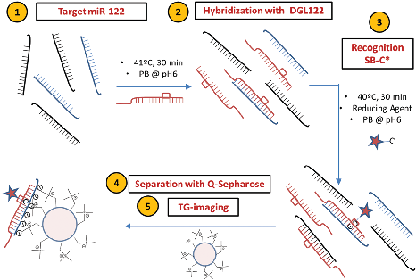
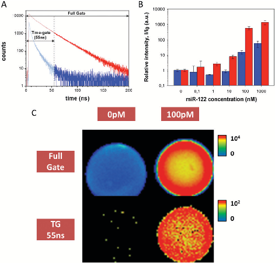
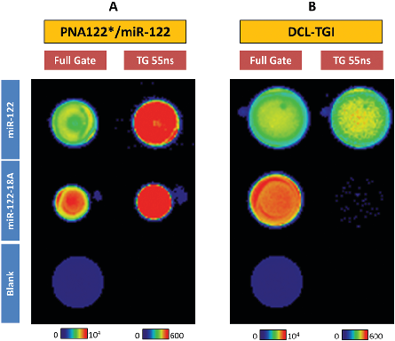
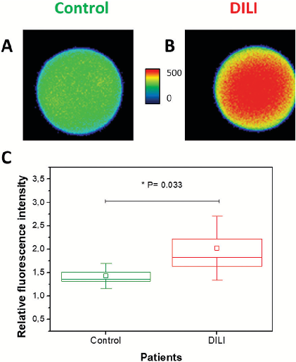

This article is licensed under aCreative Commons Attribution 3.0 Unported Licence.

Open Access Article. Published on 27 November 2019. Downloaded on 3/3/2024 7:27:31 PM.

# ChemComm

| | | |
|---|---|---|
|C|OMMUNICATION View Article Online| |
| |View Journal | View Issue| |

Cite this: Chem. Commun., 2019, 55, 14958

Received 14th October 2019, Accepted 15th November 2019

DOI: 10.1039/c9cc08069d rsc.li/chemcomm

miR-122 direct detection in human serum by time-gated fluorescence imaging†

Emilio Garcia-Fernandez, a M. Carmen Gonzalez-Garcia,a Salvatore Pernagallo,bc Maria J. Ruedas-Rama, a Mario A. Fara,b Francisco J. Lo´pez-Delgado, b James W. Dear,d Hugh Ilyine,c Cristina Ress,e Juan J. Dı´az-Mocho´n bfg and Angel Orte *a

PCR-based technologies, which are still dominating miR profiling, have shown important limitations for detecting miRs and their translation to clinical diagnostics.9 PCR-based methods require laborious sample preparation for the amplification, suffering from technical difficulties to perform robust and comparable analyses, hindering the development of approved clinical diagnostic tests. Hence, there is a clear need to implement amplification-free detection methods for analysis of miRs in clinical samples. Hybridization-based methods use single complementary probes to create specific duplexes, which can then be identified either by modified surfaces10 or proteins that specifically recognise nucleic acid duplexes.11 These hybridizationbased methods for miRs12,13 and other nucleic acids14,15 have often been integrated within multiple detection systems, including fluorescence-based platforms with variable limits of detection ranging from few picomoles to sub-attomole.

A simple method for direct detection of microRNAs (miRs) in human serum without the use of polymerase amplification is presented, achieving low miR-122 concentrations and importantly, discerning effectively single-base sequence mutations. The method is based on the capture of target miRs with synthetic peptide nucleic acid oligomers, dynamic chemical labelling, separation with quaternary amine microplatforms and detection using time-gated fluorescence imaging.

miRs are small non-coding RNAs described for the first time in 1993,1 with functions in RNA silencing and post-transcriptional regulation of gene expression.2 Over the last decades, circulating miRs in blood and other body fluids have been linked to many biological events. Expression studies have identified miRs that are deregulated in pathologic conditions, so that their unique expression patterns can be used as fingerprints for various diseases,3 proposed as promising diagnostic and prognostic biomarkers for many illnesses,4 such as multiple types of cancer,5 chronic neurodegenerative diseases,6 myocardial infarction7 and liver injury.8 However, many technological challenges have limited the use of circulating miRs as valuable diagnostic biomarkers. Due to their short length and low copy numbers, miRs are particularly difficult to be detected and accurately quantified.

Among the fluorescence-based platforms for direct detection of miRs with non-enzymatic reactions, time-gated fluorescence (TG) and FRET developed by Hildebrandt and co-workers16–18 allow for multiplexing of different miRs depending on the acceptor emission colour and/or the donor–acceptor distance. Jiang and col.19 proposed an indirect method with several steps, involving magnetic beads and primers as reaction platforms and biotin-europium tagged streptavidin as a reporter of the target miR. Chen and colleagues20 reported a method that used lanthanidedoped nanoparticles for reporting and micellar luminescence enhancement for the amplification of the signal, allowing for an ultrasensitive assay. However, single base resolution methods are scarce, ineffective and have to be considered carefully.21

- a Departamento de Fisicoquimica. Unidad de Excelencia de Quı´mica aplicada a Biomedicina y Medioambiente, Facultad de Farmacia, Universidad de Granada, Campus de Cartuja s/n, 18071-Granada, Spain. E-mail: angelort@ugr.es
- b DestiNA Genomica S.L., Parque Tecnolo´gico Ciencias de la Salud (PTS), Av. de la Innovacio´n 1, Edificio BIC, Armilla, Granada, Spain
- c DestiNA Genomics Ltd, 7-11 Melville St, Edinburgh EH3 7PE, UK
- d Centre for Cardiovascular Science, University of Edinburgh, The Queen’s Medical Research Institute, 47 Little France Crescent, Edinburgh, EH16 4TJ, UK
- e Optoi Microelectronics, Via Vienna n18, Trento, 38121 Gardolo, Italy
- f GENYO, Centre for Genomics and Oncological Research, Pfizer/University of Granada/Andalusian Regional Government, Av. de la Ilustracio´n, 114, 18016-Granada, Spain
- g Departamento de Quimica Farmaceutica y Organica, Facultad de Farmacia, Universidad de Granada, Campus de Cartuja s/n, 18071-Granada, Spain

A recent approach for PCR-free, direct detection of miRs with single point mutation resolution capabilities has been developed, based on dynamic chemical labelling (DCL) of peptide nucleic acid (PNA) hybridisation probes with reactive nucleobase, so-called SMART bases (SB),22 upon formation of the duplex with the target miR. Then, the labelled PNA-miR duplex is detected using different techniques, from absolute fluorescence emission,23 chemiluminescence detection,24 fluorescence sorting from cell lysates or single-bead counting.13 Herein, we expand and improve

† Electronic supplementary information (ESI) available: Additional experimental details and results. See DOI: 10.1039/c9cc08069d

This article is licensed under aCreative Commons Attribution 3.0 Unported Licence.

Open Access Article. Published on 27 November 2019. Downloaded on 3/3/2024 7:27:31 PM.

the portfolio of detecting platforms, by implementing the DCL detection methodology in TG fluorescence imaging (TGI). TGI filtering allows selecting just specific fluorescence coming from the fluorescent probes, discriminating them from other potential sources of short-lived fluorescence, such as scattered light, autofluorescence and impurities, which may be very high in biological samples, such as blood plasma.25

For our DCL-TGI assay, we have focused on miR-122, a miR used in vitro to assess the cellular toxicity of new drugs and in vivo as a biomarker for the diagnosis of acute liver failure and drug-induced liver injury (DILI).8 The DCL-TGI assay thus requires a specific PNA probe (so-called DGL122) complementary to the target miR-122. The main feature of the DGL122 probe is that it contains a reactive amine instead of a nucleotide at a specific position in the sequence (see ESI,† and Table S1). This ‘abasic pocket’ was designed to match a guanine base in the model miR-122 (Table S2, ESI†), permitting the subsequent interrogation of the hybridized complex by the reactive nucleobase SB. The SB is a modified cytosine labelled with the fluorescent dye SeTau425 (SB-C*, Fig. S1 and S2, ESI†), a fluorophore with a very long fluorescence lifetime aiming to take full advantage of the features of TGI filtering.25 Quaternary amine scaffold beads (Q-Sph, diameter range 45–165 mm) are employed for capturing and preconcentrating the DCL-labelled duplex and separation of unreacted probes before TGI imaging. Fluorescence lifetime imaging microscopy (FLIM) offers an interesting platform for this, as it allows recording full fluorescence decay traces in single photon timing (SPT) mode for the whole image in the field of view, and subsequently applying varied detection timewindows for TGI analysis (Fig. S3–S7, ESI†). Chart 1 displays, in brief, the main stages of the DCL-TGI assay.

Prior to developing the DCL-TGI assay, we optimised all the experimental stages and technical parameters using a simpler approach, designed to check whether the Q-Sph capturing and subsequent TGI may succeed for the direct detection of miR-122 in buffer solution. For this, we employed a complementary PNA oligomer (PNA122*, Table S1, ESI†) labelled with the fluorescent

Chart 1 DCL-TGI assay employed for specific detection of miR-122 by using DGL122 and SB-C* probes. A single step with hybridization and incorporation of SB-C* is followed by a subsequent purification with Q-Sph before TGI imaging.

dye SeTau425. This PNA122* probe will directly hybridize the target miR-122, ending in a labelled duplex, which will serve as a tool for optimization of all the experimental conditions of the assay (PNA122*/miR-122 methodology, Chart S1 in the ESI†). Control experiments demonstrated excellent chemical and photophysical stability of the SeTau425 dye when labelling the different components of the assay (Fig. S8–S12 and Table S3, ESI†), as well as the absence of significant interferences due to Q-Sph autofluorescence (Fig. S13, ESI†) and unspecific adsorption on the Q-Sph beads of the assay components (Fig. S14–S17, ESI†). Just hybridized, double-stranded PNA122*/miR-122 duplexes were captured on the Q-Sph beads by electrostatic forces (Fig. S18, ESI†), these duplexes being the sole source of the detected TGI photons (Fig. 1A). For TGI filtering, the selection of an appropriate detection time-window is a crucial point, so we carried out a systematic optimisation of the analysis timewindow by a maximization study of the signal to noise ratio for the unequivocal detection of the target miR-122 (Fig. S5–S7, ESI†). Other factors were also optimised, such as the acquisition settings and the loading of the target duplex on the Q-Sph (Fig. S19–S21, ESI†). The optimum conditions consisted on the hybridization of the miR with the PNA122* probe in pH 6.0 phosphate buffer and 41 1C during 30 min. Q-Sph beads were added to capture the duplex, then separating unreacted material by washing 3 times with buffer solution, centrifuging, and discarding the supernatant.

Fig. 1 miR-122 detection using the PNA122*/miR-122 methodology. (A) Fluorescence decay traces from images in the absence (blue) and the presence of miR-122 (red). (B) Relative intensity per area of beads of different images from captured miR-122 at different concentrations. Blue bars are obtained for full-gate images, while red bars come from 55–200 ns TGI images. The experiments with concentrations above 10 nM were collected at low excitation laser power, and appropriately scaled (see ESI†). (C) Intensity images of experiments at 0 pM and 100 pM of miR-122, reconstructed with a full gate and using the 55–200 ns time-gate. Images are 80 mm 80 mm2 in size.

This article is licensed under aCreative Commons Attribution 3.0 Unported Licence.

Open Access Article. Published on 27 November 2019. Downloaded on 3/3/2024 7:27:31 PM.

ChemComm Communication

Once this methodology was optimized, we challenged the instrumental limit of detection of miR-122 at several concentrations, ranging from 100 pM to 1 mM. Due to the broad concentration range used, covering 5 orders of magnitude, the acquisition settings, particularly laser power, had to be tuned (Fig. S20 and S21, ESI†). By using appropriate scaling factors between different experimental conditions we built up a calibration curve of the average intensity per area (I), relative to the signal of the blank (I0), to compare the response of detection at different miR-122 concentrations (Fig. 1B). It is worth noting the increase in the signal to noise ratio for the TGI analysis compared with the full-gate analysis. Fig. 1C shows that miR-122 concentrations as low as 100 pM, corresponding to 2 fmole, can be unequivocally detected, in a yes/no manner, using the TGI filtering.

Once the feasibility of the approach was confirmed using the PNA122*/miR-122 methodology, we introduced the dynamic chemical labelling13,22,23 for the DCL-TGI assay (Chart 1), aimed to detect miR-122 with single-base resolution. The DCL-TGI assay entails the single step reaction of the miR with the DGL122, the SB-C* reporting base and NaBH3CN in pH 6.0 phosphate buffer at 41 1C. Capturing and separation of unreacted materials was the same as in the control methodology. The specificity and single-base resolution of this approach was investigated by using a target sequence containing a single nucleotide mismatch (miR-122-18A) (Table S2, ESI†). In this way, both miR-122 and miR-122-18A may be hybridized to the DGL122 probe. However, only the correct miR-122 sequence will allow the SB-C* to get incorporated and covalently fixed. Positive readings of the SB-C* incorporated is an error-free indication of the target miR present in solution.

By comparing the TGI images for the detection of miR-122 and miR-122-18A using the PNA122*/miR-122 methodology (Fig. 2A), one can clearly see that both sequences gave a very similar signal. miR-122 and miR-122-18A targets could not be

Fig. 2 Full-gate and TGI fluorescence images comparing the PNA122*/ miR-122 methodology and the DCL-TGI assay for three solutions: a blank solution, miR-122 and a single point mutation sequence miR-122-18A.

successfully discerned using only the capture PNA122* probe, thus not being possible to distinguish a single mismatch from the perfect matching miR. However, DCL-TGI assay allowed to specifically detect the correct miR-122 sequence to which the SB-C* can incorporate into the pocket and be reduced, fixing its position (Fig. 2B). The mismatched sequence, miR-122-18A, which presents an adenosine in front of the DGL122 interrogation position, only showed negligible fluorescence in the TGI image. We also tested a slightly longer, but correct sequence, miR-122-22G (Table S2 and Fig. S22, ESI†) exhibiting similar positive results. Control experiments demonstrated that unspecific binding to Q-Sph and emission from other components was negligible (Fig. S15–S17, ESI†) so that SB-C* specifically bound after completion of the closing reaction in the presence of the miR/DGL122 duplex.

These results clearly show that we can distinguish the target miR-122 from mutated miR-122-18A, with excellent single base resolution, in contrast to previous reported methods in which unwanted fluorescence from mismatched targets may contribute significantly to mask positive signals. For example, Jiang and col. reported19 that at the same known concentration of target miR, single or triple nucleotide mutants of let-7f miR exhibited significant signal, approximately 20% of the target sequence, making very difficult to differentiate solutions with several mutants or with high ratios mutant/target. Similarly, Chen and col.20,26 reached a decrease of just 50% and 80% of the signal for single and triple mismatched targets, respectively, being difficult to assess mismatch discrimination. Hence, the DCL-TGI assay provides an extra source of specificity, with single-base resolution, in the analysis of miRs. This is a differential and unique feature of our method when compared with previous literature in the detection of miRs by using a TG fluorescence approach.16,17

Finally, we achieved promising results using the DCL-TGI assay in samples of human blood serum with abnormal levels of miR-122 due to DILI (see ESI†). First, we confirmed the absence of interferences to the analysis due to albumins by performing experiments in the presence of 0.4% BSA (w/v) (Fig. S23, ESI†). Second, we confirmed that the limit of detection of the DCL-TGI assay was maintained even when using human serum samples. For this, we performed experiments with human blood serum spiked with miR-122 at 100 pM. These measurements showed that the use of serum samples caused certain unspecific binding of the SB-C* reporting probe, increasing the background signal. Regardless of a higher background, we were capable of unequivocally discriminating the signal of the spiked miR-122 (Fig. S24, ESI†), confirming a limit of detection in the range of 100 pM. Finally, we analysed 12 replicates of serum from a patient with DILI (ALT 4 1000 U L 1 after paracetamol overdose), which has been reported previously (this sample was used by Lo´pez-Longarela et al. to study the stability of miR-122 when serum is left at room temperature).27 Our results clearly permitted to differentiate anomalous, high concentrations of miR-122 (ca. 700 pM)27 in the DILI patient from control, healthy serum. Moreover, the combination of dynamic chemistry and the TG approach significantly improved the results

This article is licensed under aCreative Commons Attribution 3.0 Unported Licence.

Open Access Article. Published on 27 November 2019. Downloaded on 3/3/2024 7:27:31 PM.

Fig. 3 TGI fluorescence images using the DCL-TGI assay for serum samples of (A) control and (B) DILI patients. (C) Box plot of the relative average, time-gated fluorescence intensity in DCL-TGI assays of serum sample of healthy (N = 12, green) and DILI patient (N = 12, red). Boxes and whiskers represent the standard error and standard deviation, respectively. Square symbols and horizontal line represent the average and median, respectively. Non-parametric statistical Mann–Whitney test of the data confirmed the two populations are different at 0.95 confidence level (P = 0.033).

obtained with respect to conventional full-window fluorescence images (Fig. S25, ESI†). This remarkable feature encourages future applications directly in liquid biopsies (Fig. 3).

Herein, we presented a TG fluorescence imaging method capable of sensitively and specifically detecting target miR-122, avoiding the use of further amplification steps that may introduce mistakes in recognition.

The proof of concept methodology (Chart S1, ESI†) allowed us to quantitatively detect target miR-122 at copy number as low as 2 fmole, using just one fluorescent probe, PNA122*. Importantly, the DCL-TGI assay (Chart 1) permitted to discern eventual single point mutations in miR-122. This is a novel and prominent feature point compared to previous TG-based assays.16–18 Likewise, herein we have extended the portfolio of DCL-ready detection platforms to FLIM and TGI imaging, which overcome by photon filtering critical problems of background interferences in clinical samples. The DCL-TGI assay has demonstrated efficiency to detect abnormal miR-122 levels in human serum due to DILI, comprising a promising tool for precisely and directly detecting low concentrations of miRs, opening a future path for in situ detection kits for liquid biopsies and other sources of low amounts of miRs.

This research was funded by grants BIO2016-80519-R and CTQ2017-85658-R (MICIU/AEI/EU ERDF), BIO-1778 (Junta de Andalucı´a), project 322276 CHEMiRNA (EU FP7), and project MSCA-RISE 690866 miR-DisEASY (EU Horizon 2020).

## Conflicts of interest

JJDM and HI are shareholders and Directors of DestiNA Genomics Ltd. SP is a shareholder of DestiNA Genomics Ltd.

## Notes and references

- 1 R. C. Lee, R. L. Feinbaum and V. Ambros, Cell, 1993, 75, 843–854.
- 2 H. Dong, J. Lei, L. Ding, Y. Wen, H. Ju and X. Zhang, Chem. Rev., 2013, 113, 6207–6233.
- 3 L. Zhang, J. Huang, N. Yang, J. Greshock, M. S. Megraw, A. Giannakakis, S. Liang, T. L. Naylor, A. Barchetti, M. R. Ward, G. Yao, A. Medina, A. O’brien-Jenkins, D. Katsaros, A. Hatzigeorgiou, P. A. Gimotty, B. L. Weber and G. Coukos, Proc. Natl. Acad. Sci. U. S. A., 2006, 103, 9136–9141.
- 4 S. Detassis, M. Grasso, V. Del Vescovo and M. A. Denti, Front. Cell Dev. Biol., 2017, 5, 86.
- 5 H. M. Heneghan, N. Miller, A. J. Lowery, K. J. Sweeney, J. Newell and M. J. Kerin, Ann. Surg., 2010, 251, 499–505.
- 6 M. Grasso, P. Piscopo, A. Confaloni and M. A. Denti, Molecules, 2014, 19, 6891–6910.
- 7 M. Mase`, M. Grasso, L. Avogaro, E. D’Amato, F. Tessarolo, A. Graffigna, M. A. Denti and F. Ravelli, Sci. Rep., 2017, 7, 41127.
- 8 P. J. Starkey Lewis, J. Dear, V. Platt, K. J. Simpson, D. G. N. Craig, D. J. Antoine, N. S. French, N. Dhaun, D. J. Webb, E. M. Costello, J. P. Neoptolemos, J. Moggs, C. E. Goldring and B. K. Park, Hepatology, 2011, 54, 1767–1776.
- 9 V. Del Vescovo, T. Meier, A. Inga, M. A. Denti and J. Borlak, PLoS One, 2013, 8, e78870.
- 10 H. Yang, A. Hui, G. Pampalakis, L. Soleymani, F.-F. Liu, E. H. Sargent and S. O. Kelley, Angew. Chem., Int. Ed., 2009, 48, 8461–8464.
- 11 J. Jin, M. Cid, C. B. Poole and L. A. McReynolds, BioTechniques, 2010, 48, xvii–xxiii.
- 12 J. He, J. Zhu, C. Gong, J. Qi, H. Xiao, B. Jiang and Y. Zhao, PLoS One, 2015, 10, e0145160.
- 13 D. M. Rissin, B. Lo´pez-Longarela, S. Pernagallo, H. Ilyine, A. D. B. Vliegenthart, J. W. Dear, J. J. Dı´az-Mocho´n and D. C. Duffy, PLoS One, 2017, 12, e0179669.
- 14 S. E. Ochmann, C. Vietz, K. Trofymchuk, G. P. Acuna, B. Lalkens and P. Tinnefeld, Anal. Chem., 2017, 89, 13000–13007.
- 15 N. Melnychuk and A. S. Klymchenko, J. Am. Chem. Soc., 2018, 140, 10856–10865.
- 16 X. Qiu and N. Hildebrandt, ACS Nano, 2015, 9, 8449–8457.
- 17 X. Qiu, J. Guo, Z. Jin, A. Petreto, I. L. Medintz and N. Hildebrandt, Small, 2017, 13.
- 18 D. Geißler, S. Stufler, H.-G. Lo¨hmannsro¨ben and N. Hildebrandt, J. Am. Chem. Soc., 2013, 135, 1102–1109.
- 19 L. Jiang, D. Duan, Y. Shen and J. Li, Biosens. Bioelectron., 2012, 34, 291–295.
- 20 L. Lu, D. Tu, Y. Liu, S. Zhou, W. Zheng and X. Chen, Nano Res., 2018, 11, 1–10.
- 21 T. D. Canady, N. Li, L. D. Smith, Y. Lu, M. Kohli, A. M. Smith and B. T. Cunningham, Proc. Natl. Acad. Sci. U. S. A., 2019, 116, 19362–19367.
- 22 F. R. Bowler, J. J. Diaz-Mochon, M. D. Swift and M. Bradley, Angew. Chem., Int. Ed., 2010, 49, 1809–1812.
- 23 A. Marı´n-Romero, A. Robles-Remacho, M. Tabraue-Cha´vez, B. Lo´pezLongarela, R. M. Sa´nchez-Martı´n, J. J. Guardia-Monteagudo, M. A. Fara, F. J. Lo´pez-Delgado, S. Pernagallo and J. J. Dı´az-Mocho´n, Analyst, 2018, 143(23), 5676–5682.
- 24 S. Detassis, M. Grasso, M. Tabraue-Cha´vez, A. Marı´n-Romero, B. Lo´pez-Longarela, H. Ilyine, C. Ress, S. Ceriani, M. Erspan, A. Maglione, J. J. Dı´az-Mocho´n, S. Pernagallo and M. A. Denti, Anal. Chem., 2019, 91, 5874–5880.
- 25 E. Garcia-Fernandez, S. Pernagallo, J. A. Gonza´lez-Vera, M. J. Ruedas-Rama, J. J. Dı´az-Mocho´n and A. Orte, Time-Gated Luminescence Acquisition for Biochemical Sensing: miRNA Detection, in Fluorescence in Industry, ed. B. Pedras, Springer Series on Fluorescence (Methods and Applications), Springer, Cham, 2019, vol. 18, pp. 213–268, DOI: 10.1007/978-3-030-20033-6.
- 26 S. Zhou, W. Zheng, Z. Chen, D. Tu, Y. Liu, E. Ma, R. Li, H. Zhu, M. Huang and X. Chen, Angew. Chem., Int. Ed., 2014, 53, 12498–12502.
- 27 B. Lo´pez-Longarela, E. E. Morrison, J. D. Tranter, L. Chahman-Vos, J.-F. Le´onard, J.-C. Gautier, S. Laurent, A. Lartigau, E. Boitier, L. Sautier, P. Carmona-Saez, J. Martorell-Marugan, R. J. Mellanby, S. Pernagallo, H. Ilyine, D. M. Rissin, D. C. Duffy, J. W. Dear and J. J. Dı´az-Mocho´n, BioRxiv, 2019.

