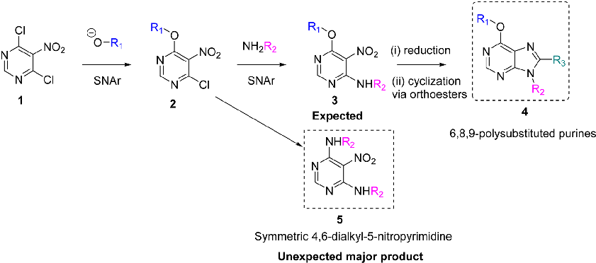
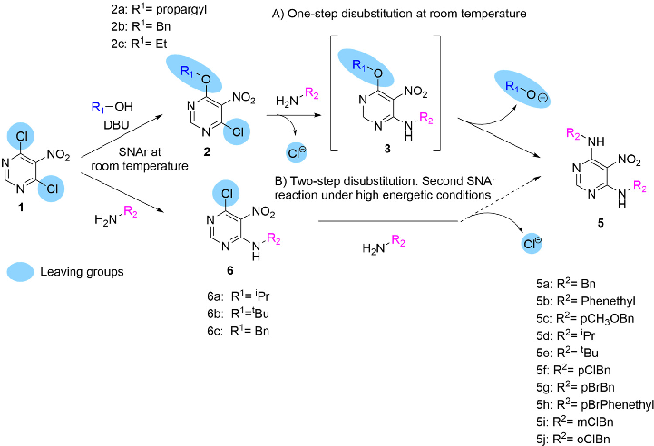
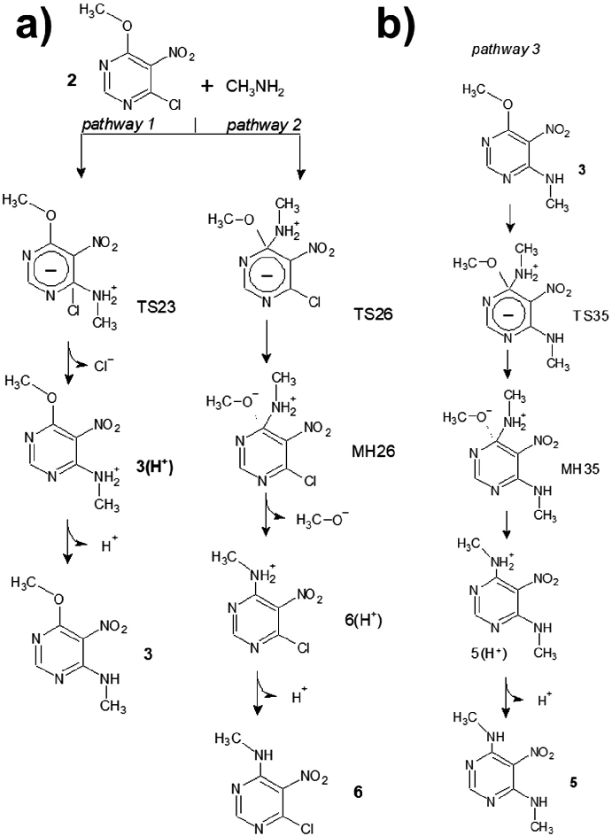
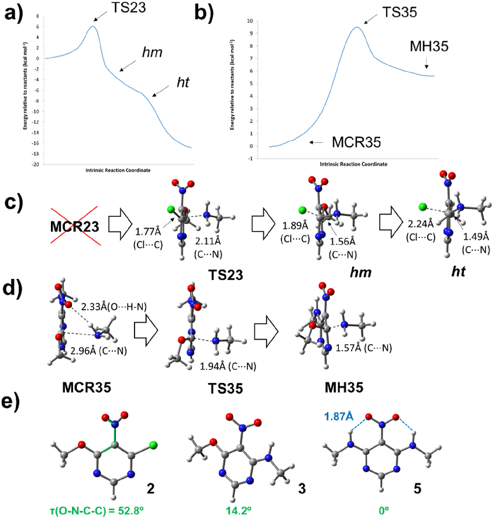

This article is licensed under aCreative Commons Attribution-NonCommercial 3.0 Unported Licence.

Open Access Article. Published on 02 October 2023. Downloaded on 3/3/2024 7:25:59 PM.

# NJC

| | | |
|---|---|---|
|P|APER View Article Online| |
| |View Journal | View Issue| |

Cite this: New J. Chem., 2023, 47, 19138

Symmetric 4,6-dialkyl/arylamino-5nitropyrimidines: theoretical explanation of why aminolysis of alkoxy groups is favoured over chlorine aminolysis in nitro-activated pyrimidines†

Laura Co´rdoba Go´mez,cd Alvaro Lorente-Macias, cd Marı´a Jose´ Pineda de las Infantas y Villatoro,cd Andre´s Garzo´n-Ruiz *a and Juan J. Diaz-Mochon *bcde

Received 26th July 2023, Accepted 2nd October 2023

DOI: 10.1039/d3nj03495j

rsc.li/njc

A new synthetic route to obtain symmetric disubstituted alkyl/arylaminopyrimidines under mild conditions is presented, which can be used to generate new purine libraries for drug discovery. We investigated the unexpected reaction of 6-alkoxy-4-chloro-5-nitropyrimidines with primary amines, which produced disubstituted dialkyl/arylamine pyrimidines instead of the expected 6-alkoxy-4alkylamine-5-nitropyrimidines. To clarify this reaction, a computational study of the reaction mechanism was carried out. Our results suggest that the presence of pre-reactive molecular complexes, a phenomenon rarely reported in SNAr reactions, precedes the transition state and can facilitate the reaction. In addition, Meisenheimer complexes and transition states in the intrinsic reaction coordinate (IRC) configuration, which may influence the understanding of the reaction mechanism, were identified.

## 1. Introduction

routes to obtain structurally diverse purine libraries. The use of polysubstituted pyrimidines as core elements prior to the purine ring formation is one of the most widely used approaches. Polyhalogenated pyrimidines are the preferred starting materials because they allow halogen substitution by a variety of nucleophiles. In particular, pyrimidines activated by electron-withdrawing groups such as nitro and nitroso promote highly efficient aromatic nucleophilic substitutions. Alkoxides are interesting moieties because they act as nucleophiles in the aromatic substitution of substituted pyrimidines3,4 and as leaving groups in these reactions.5–9 However, the latter has not been extensively studied, as it may be counterintuitive, as they are poor leaving groups in standard SN2 reactions.

Purines are among the most widely used structures in medicinal chemistry. This is due to the large number of enzymes that use purine cofactors, known as purine-utilising enzymes (PUEs), which are involved in the catabolism of purines and pyrimidines.1 Additionally, purinergic receptors play a key role in signal transduction following their activation by extracellular purines.

Therefore, purines are considered privileged structures in medicinal chemistry, with more than 15 FDA-approved purine drugs;for example, tecadenoson, and regrelor, to name a few.2 Therefore, medicinal chemists have developed several synthetic

Our group has presented various 6,8,9-polysubstituted purine libraries prepared by a one-pot synthesis starting from 5-amino-4-chloro-6-alkylamino pyrimidines to obtain 6-alkoxy8,9-dialkyl/aryl purines. This one-pot synthesis followed two different pathways depending on the size of the N,N-dialkyl amide used in the reaction.10 Although this reaction is very useful for generating specific purine libraries, it has limitations in introducing structural variability at positions 6 and 8 of the purine ring. To gain more control over these positions, we designed a synthetic pathway starting with 4,6-dichloro-5nitropyrimidine 1 (Scheme 1). The first reaction in this pathway is the aromatic substitution of a chlorine atom with an alkoxy group to give 4-alkoxy-6-chloro-5-nitropyrimidine 2. Because a second substitution reaction involving the remaining halogen

- a Departamento de Quı´mica Fı´sica, Facultad de Farmacia, Universidad de CastillaLa Mancha, C/Jose´ Marı´a Sa´nchez Iba´n˜ez s/n, 02071, Albacete, Spain. E-mail: Andres.Garzon@uclm.es
- b GENYO Centre for Genomics and Oncological Research, Pfizer/University of Granada/Andalusian Regional Government. PTS Granada – Avenida de la Ilustracio´n, 114, 18016, Granada, Spain
- c Department of Medicinal & Organic Chemistry, Faculty of Pharmacy, University of Granada, Campus de Cartuja s/n, Granada, Spain
- d Unit of Excellence in Chemistry Applied to Biomedicine and the Environment of the University of Granada, Granada, Spain
- e Instituto de Investigacio´n Biosanitaria ibs.GRANADA, Granada, Spain. E-mail: juandiaz@go.ugr.es

† Electronic supplementary information (ESI) available: NMR and HRMS spectra for all new compounds and DFT calculations. See DOI: https://doi.org/10.1039/ d3nj03495j

This article is licensed under aCreative Commons Attribution-NonCommercial 3.0 Unported Licence.

Open Access Article. Published on 02 October 2023. Downloaded on 3/3/2024 7:25:59 PM.

Scheme 1 A proposed synthetic pathway designed to obtain 6,8,9 polysubstituted purines 4.

does not proceed under mild conditions, this reaction is very well controlled. The next step would be the aromatic substitution of chlorine at position 4 of the pyrimidine ring with alkylamines, which are very good nucleophiles, to give the expected 6-alkoxy-4-alkylamine-5-nitro-pyrimidine 3. After reducing the nitro group, the ring would be closed with a variety of orthoesters to give the 6,8,9-polysubstituted purines 4. However, under mild conditions, the dialkyl amine disubstituted product 5 was preferentially obtained. This was surprising, as the disubstitution of two chlorine atoms in the reaction of 4,6-dichloro-5-nitropyrimidine 1 with alkylamines requires strong conditions.11

Being curious about this unexpected reaction we went deeper to study this SNAr. In recent years, the mechanism of nucleophilic substitution has come under scrutiny. The previously accepted step-wise mechanism was challenged by the groundbreaking work of Neumann et al. in 2016,12 where they reported the first concerted SNAr reaction to occur under specific conditions. This work has stimulated new research in this area, leading to renewed interest in the field. In addition, the fascinating nature of reactions involving aromatic rings continues to be discovered. This is illustrated, for example, by the recent report by Madler et al.,13 describing a surprising oxidizing nucleophilic aromatic hydrogen (ONSH) substitution.

Therefore, the aim of this work was to elucidate the role of alkoxides as leaving groups in the aromatic substitution of activated aromatic rings and to provide a robust synthetic route to obtain symmetric pyrimidines under mild conditions, which can then be transformed into novel polysubstituted purines.

## 2. Results and discussion

2.1. One-pot synthesis of symmetrical 4,6-dialkylamino-5nitropyrimidines

We first synthesised pyrimidines 2 by the dropwise addition of solutions of prop-2-yn-1-ol, benzylic alcohols, and ethanol

with DBU to a solution of 4,6-dichloro-5-nitropyrimidine 1 in anhydrous THF at 0 1C to give 2a, 2b, and 2c, respectively, in moderate yields. Having obtained 6-alkoxy-4-chloro-5nitropyrimidines, we expected a smooth reaction between pyrimidines 2 and the primary amine at room temperature to give 4-alkylamine-6-alkoxy-5-nitropyrimidines 3. However, when 1.5 equiv. of N-benzylamine was added at room temperature to a solution of pyrimidine 2a in DCM with TEA, and disubstituted product 5a was rapidly identified by MS in the crude reaction. By adding two equivalents of amine to the same reaction vessel, the conversion of 2a to 5a was completed without traces of monosubstituted product 3a being detected. This was surprising because the disubstitution of polyhalogenated pyrimidines with nucleophiles always requires strong conditions.8 Therefore, after purifying and fully characterising the symmetric pyrimidine 5a, we wanted to see if this reaction would also occur when the other two 6-alkoxy-4-chloro-5nitropyrimidines 2b and 2c were reacted with N-benzylamine under the same reaction conditions (Scheme 2). Both reactions afforded symmetrical dibenzylamino-5-nitropyrimidine 5a.

Therefore, we investigated other primary amines as nucleophiles to determine whether this reaction could be widely used to synthesise symmetric 4,6-disubstituted pyrimidines. Eleven other primary amines were used, and in all cases, the corresponding disubstituted purines 5b–5j were obtained in good yield (Scheme 2).

Our results were consistent with those reported by Marchal et al.8 They reported the use of activated 2-amino-4-6-methoxy-5-nitrosopyrimidine as a starting material to obtain symmetrical and asymmetrical 2-amino-4,6-dialkylamino-5-nitro-pyrimidines.

To better understand this reaction, three 4-alkylamino-6chloro-5-nitropyrimidines 6a–c that were synthesised from pyrimidine 1 following a procedure described elsewhere by us10,14 (Scheme 2) were used. This allowed us to compare the leaving group abilities of the chlorine and alkoxy moieties in these systems. As described above, the 6-alkoxy-4-chloro-5nitropyrimidine 2 gave rise to pyrimidines 5 by sequential

This article is licensed under aCreative Commons Attribution-NonCommercial 3.0 Unported Licence.

Open Access Article. Published on 02 October 2023. Downloaded on 3/3/2024 7:25:59 PM.

Scheme 2 Comparison of the leaving group capabilities of alkoxy groups and chlorine atoms when found in the same molecule.

substitution first of the chlorine atom to give the compounds 3 and then, simultaneously, in the same reaction vessel, the second substitution of the alkoxy group to give the compounds 5. However, the nitropyrimidines 6 remained unreactive under these conditions. This could lead to the erroneous conclusion that alkoxy groups are generally better leaving groups than chlorine atoms in SNAr. In the case of compound 2 reacting with primary amines, the chlorine atom rather than the alkoxy group is the preferred leaving group of the two. When benzylamine reacts with pyrimidines 2, the first aromatic substitution of the chlorine atom and the second of the alkoxy groups occur under mild conditions, but when the same benzylamine reacts with pyrimidine 1, the first aromatic substitution of the chlorine atom occurs; however it is then unable to carry out the second substitution of the second chlorine atom under the same mild conditions. Therefore, when both groups are together in the same ring, as in pyrimidines 2, the chlorine atom is a better leaving group when reacting with a primary amine, but then comparing pyrimidines 3 and 6 where both have the same alkylamine at position 6 of the ring, the alkoxy group is a better leaving group.

2.2. Theoretical study

The mechanism of SNAr reactions is a key question which determines the kinetics, product distribution and regioselectivity.15 SNAr reactions proceed through a stepwise mechanism, involving a Meisenheimer complex,16 or a concerted mechanism12,15,17–19 depending on the leaving group as well as the nucleophile and electrophile. Recent studies also have presented the hypothesis that the activated complex and Meisenheimer are overlapped in certain SNAr reactions, resulting in

a later transition state with a great degree of bond formation and high values of activation energy.20,21 With these issues in mind, a theoretical study was carried out to investigate about the mechanism of reactions between chloronitropyrimidine derivatives and primary amines. For simplicity, the hydrocarbon chains of the amine reagent and the alkoxy group were truncated at the a-carbon atom. The transition states (TSij) and other intermediates such as pre-reactive molecular complexes (MCRij), Meisenheimer complexes (MHij) are numbered according to the number of the starting product (i) and the final product (j) of the reaction under investigation.

Scheme 3 shows the reaction steps studied in the reaction from 2 to 5. For the first reaction step – the amine substitution of the product 2 – two different reaction pathways were analysed, where the chlorine atom or the alkoxy moiety is the leaving group (pathways 1 and 2, respectively). The activation barrier of pathway 1 (6.1 kcal mol 1) is lower than that of pathway 2 (8.4 kcal mol 1), indicating that the former is kinetically favoured. This is in agreement with the literature showing that chlorine atoms are better leaving groups than alkoxy chains.22,23 TS23 is the transition state computed for the pathway 1 which follows a concerted mechanism, as shown in the IRC profile (Fig. 1a). Gallardo-Fuentes et al. who also reported that Meisenheimer complexes are not formed when the leaving group is a chlorine atom.24 Nevertheless, the inflexion points marked in Fig. 1a suggest the presence of a ‘‘hidden’’ Meisenheimer complex (hm) and a ‘‘hidden’’ transition state structure (ht) that correspond to the expulsion of chlorine as proposed by Ormaza´bal-Toledo et al.21 These authors observed a similar IRC profile for a SNAr reaction of 2-chloro-1,3,5-triazine in contrast to the same reactions in

This article is licensed under aCreative Commons Attribution-NonCommercial 3.0 Unported Licence.

Open Access Article. Published on 02 October 2023. Downloaded on 3/3/2024 7:25:59 PM.

Scheme 3 (a) Competitive mechanisms for the SNAr reaction between 2 and methylamine (reaction pathways 1 and 2); (b) reaction mechanism for the methylamine substitution of the intermediate products 3 (reaction pathway 3).

heterocycles containing less nitrogen atoms (2-chloropyridine and 4-chloropyrimidine).21

The second reaction step, from 3 to 5 (Scheme 3b), follows a stepwise mechanism with a barrier of 9.5 kcal mol 1. A flatshape region is observed in the IRC profile where the Meisenheimer complex (MH35) was located (Fig. 1b). Interestingly, TS35 is preceded by a molecular complex (MCR35) in which the CH3NH2 reagent interacts with the –NO2 group with a NH ON distance smaller than the sum of van der Waals radii of the oxygen and hydrogen atoms.25 Larger differences were found between the geometrical structures of MCR35 and TS35 than between the transition state and MH35. As shown in Fig. 1d,

the length of the forming C N bond is 2.96, 1.94 and 1.57 Å, for MCR35, TS35 and MH35 respectively. The existence of prereactive molecular complexes has not been commonly reported for SNAr reactions. Here, the presence of the complex MCR35 in the reaction coordinate could facilitate the transition towards 5 and be key in the ‘apparently’ straightforward reaction from 2 to 5, where 3 was not detected experimentally. In Fig. 1e, it is interesting to observe how the nitro group in 2 is highly twisted with respect to the benzene ring (t = 531) and the dihedral angle becomes zero for 5. The molecular structure of 5 is highly stabilised by two intramolecular hydrogen bonds with O H distances of 1.87 Å.25

This article is licensed under aCreative Commons Attribution-NonCommercial 3.0 Unported Licence.

Open Access Article. Published on 02 October 2023. Downloaded on 3/3/2024 7:25:59 PM.

Fig. 1 (a) and (b) Computed IRC profiles for reactions from 2 to 3 and 3 to 5. (c) and (d) Geometry of the interesting points found in IRC profiles. Geometries of the transition states TS23 and TS35, the pre-reactive molecular complex MCR35 and the Meisenheimer complex MH35 were optimized. The structures of the ‘hidden’ complex (hm) and ‘hidden’ transition state were extracted from the IRC profile. (e) Structural planarization observed from compound 2 to 5. All the calculations were performed at the M06-2X/6-31G* level of theory including solvation effects (dichloromethane).

Finally, we calculated the transition states of other SNAr processes where chlorine is the leaving group, such as the

- reaction from 1 to 6 (TS16) and from 6 to 5 (TS65). In all cases the energy barriers are comparable to those calculated for the
- reaction from 2 to 3 (TS23) and no Meisenheimer complexes were found in the reaction coordinate (see ESI† for details). Interestingly, the one-step disubstitution from 1 to 5 is not observed experimentally, although a lower energy barrier is calculated for the second reaction step (from 6 to 5; 4.4 kcal mol 1) than in the case of the reaction from 3 to 5. This shows the complexity of this type of reaction. Further studies are needed to investigate the role of intermediates such as the prereactive and Meisenheimer complex in SNAr reactions.20,21

## 3. Conclusions

During the execution of the original plan to construct polysubstituted purine rings, it was found that when 6-alkoxy-4-chloro5-nitropyrimidine 2 reacted with primary amines at room temperature, the preferred compound was not the expected 6alkoxy-4-alkylamine-5-nitropyrimidine 3, but the disubstituted dialkylamine pyrimidine 5. This unexpected reaction was validated with three alkoxy groups and 12 primary amines, confirming the universality of this reaction. A computational study of the sequential SNAr reactions from 2 to 5 showed that prereactive and Meisenheimer complexes MCR35 and MH35 could play a key role in the reaction mechanism when the leaving

This article is licensed under aCreative Commons Attribution-NonCommercial 3.0 Unported Licence.

Open Access Article. Published on 02 October 2023. Downloaded on 3/3/2024 7:25:59 PM.

group is a methoxy group. In contrast, no molecular complexes were found when the leaving group contained chlorine. These findings explain the role of alkoxides as leaving groups in these SNAr reactions, since, unlike chlorine, they can form preactivated and Meisenheimer complexes, despite their general classification as poor leaving groups due to their strong basicity. The difference in the reaction mechanism when alkoxides are involved would suggest that the first reaction occurs through a concerted mechanism while the second through step-wise one. However, further studies are needed to elucidate the role of pre-reactive and Meisenheimer complexes in the mechanism and kinetics of SNAr reactions. This new synthetic route opens the possibility of generating disubstituted pyrimidines under mild conditions, which can then be used to generate new purine libraries of great interest to the drug discovery industry. This novel chemistry can also be used to explore other nucleophiles, such as thiols, to increase the chemical diversity of the pyrimidine and purine libraries.

## 4. Experimental

- 4.1. General

Reaction courses and product mixtures were routinely monitored by TLC on silica gel Merck 60–200 mesh silica gel. Melting points were determined on a Stuart Scientific SMP3 apparatus and are uncorrected. 1H-NMR spectra were obtained in CDCl3, solution on a Varian Direct Drive (400 MHz and 500 MHz). Chemical shifts (d) are given in ppm downfield from tetramethylsilane. 13C-NMR spectra were obtained in CDCl3, on a Varian Direct Drive (125 MHz). All products reported showed 1H-NMR and 13C-NMR spectra consistent with the assigned structures. High resolution mass spectra were obtained by electrospray (ES+) with a LCT Premier XE Micromass Instrument.

- 4.2. General procedure for the preparation of compounds 2(a– c)

To an ice-cooled solution of commercially available 4,6dichloro-5-nitropyrimidine (0.025 mol, 1 equiv.) in anhydrous THF (20 mL), a solution of the alcohol (1 equiv.) and DBU (5.8 mL, 1.5 equiv.) in THF (20 mL) was added dropwise. The resulting mixture was stirred at 0 1C for about one hour. The addition takes place in cold (0 1C) for about one hour and then the solvent was removed. After two extractions with methylene chloride, the organic phase was washed with an aq. saturated solution of NaCl and dried over Na2SO4. Evaporation under vacuum gave a solid that was purified by column chromatography eluting with ethyl acetate/petroleum ether solutions.

- 4.2.1. 4-chloro-5-nitro-6-(prop-2-ynyloxy)pyrimidine (2a). Yellow solid, yield 51%, m.p.: 75–77 1C. dH (400.45 MHz, CDCl3): 8.69 (1H, s, NCHN), 5.16 (2H, d, J = 2.2, O–CH2–), 2.6 (1H, t, J = 2,4, CRCH). dC (100.70 MHz, CDCl3): 160.38, 157,48, 152.20, 132.74, 77.11, 76.05, 56.72.
- 4.2.2. 4-(benzyloxy)-6-chloro-5-nitropyrimidine (2b). White solid, yield 47%. dH (400.45 MHz, CDCl3): 8.64 (1H, s, NCHN),

7.41–7.34 (5H, m, Ph), 5.59 (2H, s, –CH2–). dC (100.70 MHz, CDCl3): 161.26, 157.55, 151,84, 134.17, 129.09, 128.92, 128.37, 71.01.

4.2.3. 4-chloro-6-ethoxy-5-nitropyrimidine (2c). Yellow solid, yield 16%, m.p.: 52–54 1C. dH (400.45 MHz, CDCl3): 8.61 (1H, s, NCHN), 4.60 (2H, q, J = 7.2, –OCH2–), 1.43 (3H, t, J = 7.2, –OCH2– CH3). dC* (100.70 MHz, CDCl3): 161.45, 157.64, 151,58, 66.17, 14.20.

*In the 13CNMR spectrum of 2c, all carbon signals were identified except for a quaternary carbon that was not resolved. 4.3. General procedure for the preparation of compounds 5(a–l) A solution of 2(a–c) (7 mmol, 1 equiv.) in CH2Cl2 (15 mL) containing TEA (initially 1.5 equivalents of each and in later reactions, when the disubstitution was checked, 2 equivalents). In this solution the different amines (10.54 mmol, 1.5 equiv. and later 2 equivalents) were dissolved in CH2Cl2 (5 mL) and added at room temperature. The addition process took half an hour then it was left at room temperature for 24 hours. Evaporation under vacuum gave a solid that was purified by column chromatography eluting with ethyl acetate/petroleum ether solutions.

- 4.3.1. N4,N6-Dibenzyl-5-nitropyrimidine-4,6-diamine (5a). Yellow solid, yield 55% (from product 2b, the yield is 33%, from product 2c, the yield is 82%), m.p.: 104–106 1C. dH (400.45 MHz, CDCl3): 9.58 (2H, bs, NH x2), 8.17 (1H, s, NCHN), 7.39– 7.31 (10H, m, Ph x2), 4.85 (4H, d, J = 5.6, –CH2–Ph). dC (100.70 MHz, CDCl3): 160.00, 158.80, 157.46, 137.46, 128.96, 127.88, 127.81, 113.14, 45.49. ES + HRMS: Calculated M + H = 336.1461 C18H18N5O2. Obtained: 336.1460.
- 4.3.2. 5-Nitro-N4,N6-diphenethylpyrimidine-4,6-diamine (5b). Yellow solid, yield 41% (from product 2b, the yield is 13%), m.p.: 123–125 1C. dH (400.45 MHz, CDCl3): 8.19 (1H, s, NCHN), 7.36–7.24 (10H, m, Ph x2), 5.02 (2H, t, NH x2), 3.75 (4H, q, J = 6.8 y 6.00 NH–CH2–CH2Ph x2), 2.94 (4H, t, J = 6.8 NH– CH2–CH2Ph x2). dC (100.70 MHz, CDCl3): 157.50, 153.40, 139.53, 128.99, 128.67, 126.48, 101.73 42.41, 36.24. ES + HRMS: Calculated M + H = 364.1774 C20H22N5O2. Obtained: 364.1783.
- 4.3.3. N4,N6-Bis (4-methoxybenzyl)-5-nitropyrimidine-4,6diamine (5c). Yellow solid, yield 72%, m.p.: 157–159 1C. dH (400.45 MHz, CDCl3): 9.57 (2H, bs, NH x2), 8.22 (1H, s, NCHN), 7.30 (8H, d, J = 8.4 Hz, Ph x2), 6.90 (4H, d, J = 8.4 Hz, Ph x2), 4.80 (4H, d, J = 5.2, –CH2–Ph–OCH3), 3.83 (6H, s, –CH2–Ph–OCH3 x2). dC (100.70 MHz, CDCl3): 159.45, 157.00, 129.32, 114.41, 112.90, 55.47, 45.26. ES + HRMS: Calculated M + H = 396.1672 C20H22N5O4. Obtained: 396.1669.
- 4.3.4. N4,N6-Diisopropyl-5-nitropyrimidine-4,6-diamine

- (5d). Yellow solid, yield 92%, (from product 2b, the yield is 60%, from product 2c, the yield is 72%) m.p.: 127–129 1C. dH (400.45 MHz, CDCl3): 9.27 (2H, bs, NH x2), 8.11 (1H, s, NCHN), 4.51 (2H, m, –CH(CH3)2 x2), 1.30 (12H, d, J = 5.2, –CH(CH3)2 x2). dC (100.70 MHz, CDCl3): 159.42, 156.52, 112.41, 43.73, 22.79. ES

+ HRMS: Calculated M + H = 240.1461 C10H18N5O2. Obtained: 240.1467.

4.3.5. N4,N6-Di-tert-butyl-5-nitropyrimidine-4,6-diamine

- (5e). Yellow solid, yield 85%, m.p.: 108–110 1C. dH (400.45 MHz, CDCl3): 9.55 (2H, bs, NH x2), 8.02 (1H, s, NCHN), 1.52 (18H, s,

–(CH3)3 x2). dC (100.70 MHz, CDCl3): 157.87, 157.52, 113.16,

This article is licensed under aCreative Commons Attribution-NonCommercial 3.0 Unported Licence.

Open Access Article. Published on 02 October 2023. Downloaded on 3/3/2024 7:25:59 PM.

53.56, 29.23. ES + HRMS: Calculated M + H = 240.1461 C12H22N5O2. Obtained: 240.1467.

4.3.6. N4,N6-Bis(4-chlorobenzyl)-5-nitropyrimidine-4,6-

diamine (5f). Yellow solid, yield 95%, m.p.: 159–161 1C. dH (400.45 MHz, CDCl3): 9.57 (2H, bs, NH x2), 8.15 (1H, s, NCHN), 7.32 (4H, d, J = 8.4 Hz, Ph x2), 7.27 (4H, d, J = 8.4 Hz, Ph x2), 4.81 (4H, d, J = 6.00, –CH2–Ph–Cl). dC (100.70 MHz, CDCl3): 159.69, 157.32, 135.94, 133.78, 129.22, 129.11, 113.14, 44.84. ES + HRMS: Calculated M + H = 404.0681 C18H16N5O2Cl2. Obtained: 404.0716.

4.3.7. N4,N6-Bis(4-bromobenzyl)-5-nitropyrimidine-4,6-

diamine (35g). Yellow solid, yield 68%, m.p.: 174–176 1C. dH (400.45 MHz, CDCl3): 9.55 (2H, bs, NH x2), 8.15 (1H, s, NCHN), 7.47 (4H, d, J = 8.4 Hz, Ph x2), 7.21 (4H, d, J = 8.4 Hz, Ph x2), 4.78 (4H, d, J = 6.00, –CH2–Ph–Br). dC (100.70 MHz, CDCl3): 159.99, 157.48, 136.59, 132.04, 129.53, 121.78, 44.77. ES + HRMS: Calculated M + H = 491.9671 C18H16N5O2Br2. Obtained: 491.9667.

4.3.8. N4,N6-Bis(4-bromophenethyl)-5-nitropyrimidine-4,6-

- diamine (5h). Yellow solid, yield 30%. dH (400.45 MHz, CDCl3): 9.36 (2H, bs, NH x2), 8.14 (1H, s, NCHN), 7.44 (4H, d, J = 6.8 Hz, Ph x2), 7.12 (4H, d, J = 6.8 Hz, Ph x2), 3.87 (4H, q, J = 5.6, 6.0

–CH2–CH2–Ph–Br x2), 2.93 (4H, t, J = 5.6, –CH2–CH2–Ph–Br x2). dC (100.70 MHz, CDCl3): 159.30, 157.29, 137.59, 132.26, 130.88, 121.10, 113.23, 43.32, 36.17. ES + HRMS: Calculated M + H = 519.9984 C20H20N5O2Br2. Obtained: 519.9981.

4.3.9. N4,N6-Bis(3-chlorobenzyl)-5-nitropyrimidine-4,6-

- diamine (5i). White solid, yield 93%, m.p.: 137–139 1C. dH (400.45 MHz, CDCl3): 9.57 (2H, bs, NH x2), 8.15 (1H, s, NCHN), 7.32–7.21 (8H, m, Ph x2), 4.82 (4H, d, J = 6.00, –CH2–Ph–Cl). dC (100.70 MHz, CDCl3): 159.97, 157.50, 139.62, 134.81, 130.20, 128.06, 127.92, 125.89, 113.29, 44.81. ES + HRMS: Calculated M

+ H = 404.0681 C18H16N5O2Cl2. Obtained: 404.0719. 4.3.10. N4,N6-Bis(2-chlorobenzyl)-5-nitropyrimidine-4,6-

- diamine (5j). Yellow solid, yield quantitative, m.p.: 195–197 1C.

dH (400.45 MHz, CDCl3): 9.68 (2H, bs, NH x2), 8.16 (1H, s, NCHN), 7.43–7.40 (4H, m, Ph), 7.29–7.22 (4H, m, Ph), 4.94 (4H, d, J = 6.00, –CH2–Ph–Cl). dC (100.70 MHz, CDCl3): 159.76, 157.47, 134.99, 133.99, 130.12, 129.86, 129.31, 127.15, 113.32, 43.39. ES + HRMS: Calculated M + H = 404.0681 C18H16N5O2Cl2. Obtained: 404.0684.

- 4.3.11. N4,N6-Diethyl 5-nitropyrimidine-4,6-diamine (5k). Yellow solid, yield 89%, m.p.: 84–86 1C. dH (400.45 MHz, CDCl3): 9.29 (2H, bs, NH x2), 8.09 (1H, s, NCHN), 3.63 (4H, m, –CH2– x2), 1.28 (6H, t, J = 7.3, –CH3 x2). dC (100.70 MHz, CDCl3): 159.59, 157.16, 112.59, 36.38, 14.43. ES + HRMS: Calculated M + H = 212.1147 C8H14N5O2. Obtained: 212.1148.
- 4.3.12. N4,N6-Diisobutyl 5-nitropyrimidine-4,6-diamine (5l). Yellow solid, yield 83%, m.p.: 77–79 1C. dH (400.45 MHz, CDCl3): 9.43 (2H, bs, NH x2), 8.05 (1H, s, NCHN), 3.42 (4H, dd, J = 1.2 and 5.6 –CH2– x2), 1.94 (2H, m, CH x2), 0.97 (12H, d, J = 3.9, –(CH3)2 x2). dC (100.70 MHz, CDCl3): 159.75, 157.67, 112.87, 48.99, 28.28, 20.29. ES + HRMS: Calculated M + H = 268.1774 C12H22N5O2. Obtained: 268.1774.

- 5a and 5d products have been synthesised from the three alcohols 2a, 2b and 2c with yields of 55%, 33% and 82% for 5a and 92%, 60%, and 72% for 5d.

- 4.4. Compounds 6(a–c)

These compounds were synthesised following the procedure described elsewhere by us.10,14

- 4.5. Computational details

Gaussian16 Rev. C.01 has been employed for all the calculations.26 The reagents, transition states (TS), molecular complexes (MC and MH) geometries were optimised at the M06-2X level of theory,27 along with the 6-31G* basis set. M06-2X is especially recommended for thermodynamic and kinetic calculations.28 An initial conformational analysis was carried out for the reagents to obtain the lowest energy conformation. The nature of the stationary points was assessed by means of the normal vibration frequencies calculated from the analytical second derivatives of the energy. First-order saddle points, which are related to transition states, must show an imaginary value for the hessian eigenvector primarily describing the product formation step, whereas the real minima of the potential energy hypersurface, which are related to stable species, have to show positive real values for all of the vibrational frequencies. In addition, intrinsic reaction coordinate (IRC) calculations at the M06-2X/6-31G** level were carried out to assess each reaction pathway. Solvent effects (dichloromethane) were included by using the continuum solvation model CPCM,21 which describes the quantum mechanical charge density of a solute molecule interacting with a continuum description of the solvent. The temperature and pressure of the calculations were 298.15 K and 1 atm, respectively.

## Conflicts of interest

The authors declare no competing financial interest.

## Acknowledgements

This research was partially funded by the Consejerı´a de Universidad, Investigacio´n e Innovacio´n of the Junta de Andalucı´a and FEDER, Una manera de hacer Europa (PT18-TP-4160, BFQM-475-UGR18) and the Spanish Ministry of Economy and Competitiveness (PID2019.110987RB.I00).

## References

- 1 M. Chauan and R. Kumar, Med. Chem. Res., 2015, 24, 2259–2282.
- 2 Z. Huang, N. Xie, P. Illes, F. D. Virgilio, H. Ulrich, A. Semyanov, A. Verkhratsky, B. Sperlagh, S. G. Yu, C. Huang and Y. Tang, Sig. Transduct. Target Ther., 2021, 6, 162.
- 3 G. R. Demina, V. A. Makarov, V. D. Nikitushkin, O. B. Ryabova, G. N. Vostroknutova, E. G. Salina, M. O. Shleeva, A. V. Goncharenko and A. S. Kaprelyants, PLoS One, 2009, 4, e8174.
- 4 Y. Fang, Z. Yang, S. Gundeti, J. Lee and H. Park, Bioorg. Med. Chem., 2017, 25, 254–260.
- 5 A. Quesada, J. N. Low, M. Melguizo, M. Nogueras and C. Glidewell, Acta Cryst, 2002, C58, o355–o358.

This article is licensed under aCreative Commons Attribution-NonCommercial 3.0 Unported Licence.

Open Access Article. Published on 02 October 2023. Downloaded on 3/3/2024 7:25:59 PM.

- 6 A. Quesada, A. Marchal, M. Melguizo, J. N. Low and C. Glidewell, Acta Cryst., 2004, B60, 76–79.
- 7 M. Melguizo, A. Marchal, M. Nogueras, A. Sanchez and J. N. Low, J. Heterocyclic Chem., 2002, 39, 97–103.
- 8 A. Marchal, M. Nogueras, A. Sanchez, J. N. Low, L. Naesens, E. De Clercq and M. Melguizo, Eur. J. Org. Chem., 2010, 3823–3830.
- 9 F. A. Carey and R. J. Sundberg, Advanced Organic Chemistry Part A. Structure and Mechanisms, Springer, 5th edn, 2007.
- 10 M. J. Pineda de las Infantas y Villatoro, J. D. Unciti-Broceta, R. Contreras-Montoya, J. A. Garcia-Salcedo, M. A. Gallo Mezo, A. Unciti-Broceta and J. J. Diaz-Mochon, Sci. Rep., 2015, 5, 9139.
- 11 I. Cikotiene, M. Jonusis and V. Jakubkiene, Beilstein J. Org. Chem., 2013, 9, 1819–1825.
- 12 C. N. Neumann, J. M. Hooker and T. Ritter, Nature, 2016, 534, 369–373.
- 13 M. D. Mandler, N. Suss, A. Ramirez, C. A. Farley, D. Aulakh, Y. Zhu, S. C. Traeger, A. Sarjeant, M. L. Davies, B. A. Ellsworth and A. A. Regueiro-Ren, Org. Lett., 2022, 24, 7643–7648.
- 14 P. G. Baraldi, A. U. Broceta, M. J. Pineda de las Infantas, J. J. Dı´az-Mochon, A. Espinosa and R. Romagnoli, Tetrahedron, 2002, 7607–7611.
- 15 E. E. Kwan, Y. Zeng, H. A. Besser and E. N. Jacobsen, Nature Chem., 2018, 10, 917–923.
- 16 R. O. Al-Kaysi, I. Gallardo and G. Guirado, Molecules, 2008, 13, 1282–1302.
- 17 S. Rohrbach, J. A. Murphy and T. Tuttle, J. Am. Chem. Soc., 2020, 142, 14871–14876.
- 18 S. Rohrbach, A. J. Smith, J. H. Pang, D. L. Poole, T. Tuttle, S. Chiba and J. A. Murphy, Angew. Chem., Int. Ed., 2019, 58, 16368–16388.

- 19 A. Hunter, M. Renfrew, D. Rettura, J. A. Taylor and J. M. J. Whitmore, J. Am. Chem. Soc., 1995, 117, 5484–5491.
- 20 A. J. J. Lennox, Angew. Chem., Int. Ed., 2018, 57, 14686–14688.
- 21 R. Ormaza´bal-Toledo, S. Richter, A. Robles-Navarro, B. Maule´n, R. A. Matute and S. Gallardo-Fuentes, Org. Biomol. Chem., 2020, 18, 4238–4247.
- 22 M. R. Crampton, T. A. Emokpae and C. Isanbor, Eur. J. Org. Chem., 2007, 1378–1383.
- 23 L. L. Han, S. J. Li and D. C. Fang, Phys. Chem. Chem. Phys., 2016, 18, 6182–6190.
- 24 S. Gallardo-Fuentes and R. Ormaza´bal-Toledo, New J. Chem., 2019, 43, 7763–7769.
- 25 S. S. Batsanov, Inorg. Mater., 2001, 37, 1031–1046.
- 26 M. J. Frisch, G. W. Trucks, H. B. Schlegel, G. E. Scuseria, M. A. Robb, J. R. Cheeseman, G. Scalmani, V. Barone, G. A. Petersson, H. Nakatsuji, X. Li, M. Caricato, A. V. Marenich, J. Bloino, B. G. Janesko, R. Gomperts, B. Mennucci, H. P. Hratchian, J. V. Ortiz, A. F. Izmaylov, J. L. Sonnenberg, D. Williams-Young, G. Ding, F. Lipparini, F. Egidi, J. Goings,

- B. Peng, A. Petrone, T. Henderson, D. Ranasinghe, V. G. Zakrzewski, J. Gao, N. Rega, G. Zheng, W. Liang, M. Hada, M. Ehara, K. Toyota, R. Fukuda, J. Hasegawa, M. Ishida, T. Nakajima, Y. Honda, K. Kitao, H. Nakai, T. Vreven, A. Throssell, J. A. Montgomery, A. P. Rendell, J. C. Burant, S. S. Iyengar, J. Tomasi, M. Cossi, J. M. Millam, M. Klene,
- C. Adamo, R. Cammi, J. W. Ochterski, R. L. Martin, K. Morokuma, O. Farkas, J. B. Foresman and D. J. Fox, Gaussian 16, Revision C.01, Gaussian Inc, Wallingford CT, 2016.

- 27 Y. Zhao and D. G. Truhlar, Theor. Chem. Account, 2008, 120, 215–241.
- 28 Y. Zhao and D. G. Truhlar, Chem. Phys. Lett., 2011, 502, 1–13.

