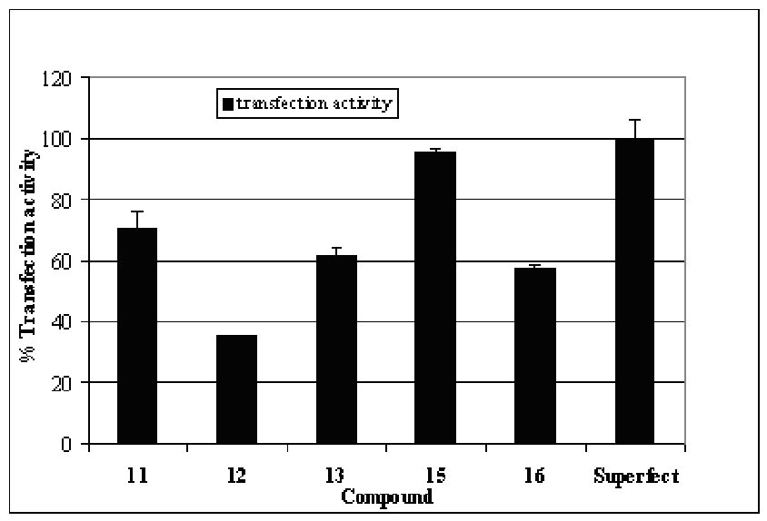
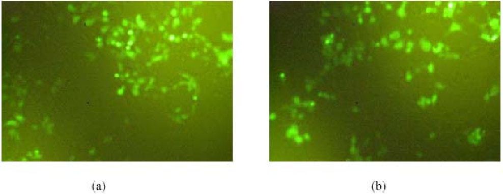
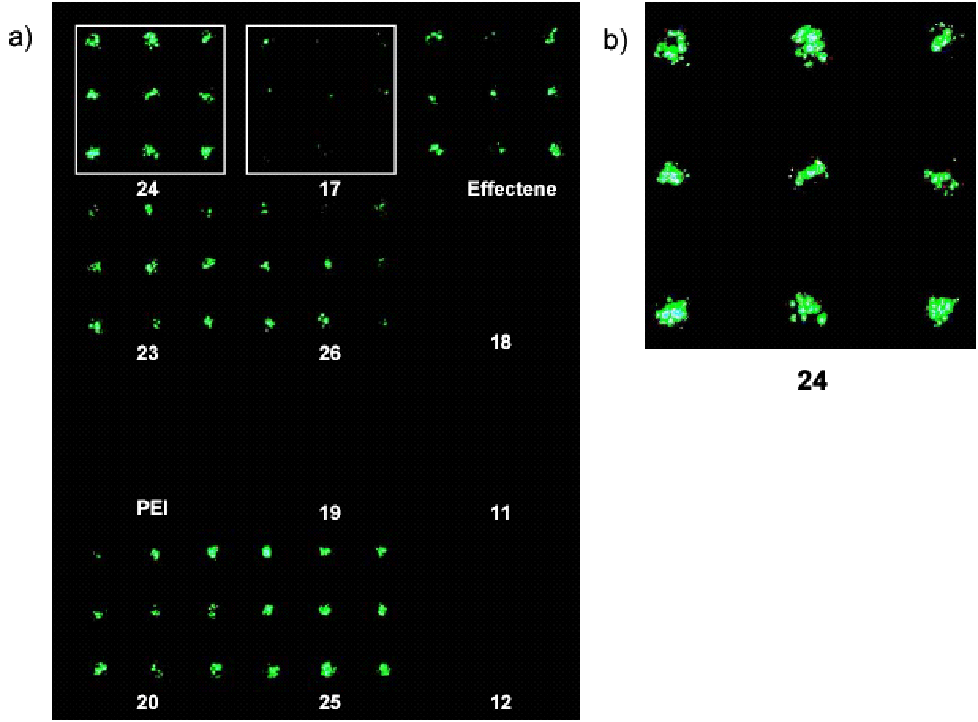

Combinatorial Chemistry & High Throughput Screening, 2004, 7, 423-4430 423

# Polyplexes and Lipoplexes for Mammalian Gene Delivery: From Traditional to Microarray Screening

## S.E. How, B. Yingyongnarongkul†, M.A. Fara, J.J. Díaz-Mochón, S. Mittoo and M. Bradley*

Department of Chemistry, University of Southampton, Southampton, Hampshire SO171BJ, UK †Department of Chemistry, Faculty of Science, University of Ramkhamhaeng, Bangkok 10240, Thailand

Abstract: Gene therapy requires the development of non-toxic and highly efficient delivery systems for DNA. Polycations, especially dendrimers, have shown enormous potential as gene transfer vehicles, displaying minimal toxicity with a broad range of cell lines. In this paper, a total of 13 dendrimers, up to G3.0, were constructed from AB3 type isocyanate monomers using solid phase methodology and evaluated for transfection activity. Among the library of compounds prepared, a G3.0 dendrimer displayed comparable activity to Superfect. Gel retardation assays demonstrated that all of the compounds completely bound plasmid DNA, indicating the efficient formation of complexes between DNA and the dendrimers. A “transfection microarray” approach was developed for screening these compounds as well as a panel of lipoplexes (complexes of DNA with cationic lipids) and polyplexes (complexes of DNA with synthetic polycation polymers). Five cationic lipids with a cholesterol tail showed stronger or comparable transfection activity relative to Effectene. The new screening method was rapid and miniaturized, offering the potential of high throughput screening of large libraries of transfection candidates, with thousands members per array, and the potential to rapidly screen a broad range of cell types.

Keywords: Transfection reagents, gene therapy, dendrimers, polyplexes, liposomes, cell-based microarrays, HTS.

### 1. INTRODUCTION

Gene therapy involves the introduction of the corrective genetic material into cells to alleviate the symptoms of a disease and, with efficient delivery, gene therapy offers a new approach for the treatment of human diseases. However, a major challenge in gene therapy is the development of nontoxic and highly efficient delivery systems. Viral vectors such as retroviruses and adenoviruses are powerful carriers for gene delivery [1], however, there are concerns regarding both the short and long-term risks of viral vectors such as their potential toxicity and immunogenicity [2]. Hence, there have been great efforts to develop a range of non-viral vectors for the intracellular delivery of genetic material [3]. Classical technologies include the direct introduction of nucleic acids by microinjection [4] or electroporation [5] as well as chemical based systems such as calcium phosphate [6] and DEAE-dextran [7] but, they offer no medical opportunities. In recent years, the development of non-viral gene delivery systems based on cationic liposomes-DNA complexes (lipoplexes) [8], cationic polymers-DNA complexes (polyplexes) [9, 10], polymeric vesicles-DNA complexes [11, 12] or a combination of both cationic lipids and cationic polymers-DNA complexes (lipopolyplexes) [13] have emerged. Many modern non-viral transfection technologies are based on cationic liposomes, however, the liposomes are often toxic and transfection results can vary significantly between different cell types [10, 14]. Dendrimers offer great promise in allowing highly efficient gene transfer, minimal cytotoxicity, and use with a broad

*Address correspondence to this author at the Department of Chemistry, University of Southampton, Southampton, Hampshire SO171BJ, UK; Tel: 44-(0)23-8059-3598; Fax: 44-(0)23-8059-6766; E-mail: mb14@soton.ac.uk

range of cell lines [14, 15]. A range of dendrimers, especially polyamidoamine (PAMAM), have been studied extensively for gene delivery [10, 12, 14-19]. PAMAM dendrimers (G5.0 and above) have been shown to display comparable or greater efficiency than either cationic liposomes or other cationic polymers (e.g., polyethylenimine, polylysine) for in vitro gene transfer [15].

DNA microarray technology is the most widely used tool for large-scale genetic analysis and gene expression profiling [20, 21]. This technology has given rise to a large number of different applications, which are based on similar principles, but intended to achieve completely different goals, for example SNP studies [22-24], mutation [24-26], and mapping [27] have been demonstrated in a microarray type format. Microarray technology has also led to cDNA transfection arrays as described by Sabatini [28], who used these arrays for the analysis of gene function in mammalian cells. In this method, different cDNA plasmids contained in an aqueous gelatine solution were printed onto a glass slide using a robotic arrayer. The printed arrays were then exposed to a lipid transfection reagent and mammalian cells added to the slides. Transfected cells expressed properties according to the transfected DNA plasmids contained in each gelatine spot, in the work by Sabatini et al., this corresponded to green fluorescence protein, which gave rise to fluorescently labelled cells.

The use of dendrimers as gene delivery agents has largely focused on high generation dendrimers (G5.0 and above) [15]. A total of 13 dendrimers up to generation 3.0 (G3.0) based on AB3 type isocyanate monomers [29] were constructed using solid phase methodology, and evaluated for transfection activities. A transfection microarray approach was developed for screening these compounds as well as a panel of synthetic cationic lipids [30] and polycationic

1386-2073/04 $45.00+.00 © 2004 Bentham Science Publishers Ltd.

monomer

OCN

X

Y

3

- 1. X= CH2, Y=NHDde
- 2. X=CH2OCH2, Y=NHDde
- 3. X=CH2OCH2, Y=CO2Me

- G1.0 dendrimers
- G2.0 dendrimers

O

Y

HmN N H

N H

X

3 n

- 4. X=CH2OCH2, Y=NH2, m=1, n=2
- 5. X=CH2OCH2, Y=CONH(CH2)2NH2, m=1, n=2
- 6. X=CH2OCH2, Y=CONH(CH2)3NH2, m=1, n=2
- 7. X=CH2OCH2, Y=CONHCH2(CH2CH2O)3CH2CH2CH2NH2, m=1, n=2
- 8. X=CH2OCH2, Y=CONH(CH2)2NH2, m=2, n=1
- 9. X=CH2OCH2, Y=CONH(CH2)4NH2, m=2, n=1

3 3 n

- 10. X=CH2, Y=NH, Z=NH2, m=1, n=2
- 11. X=CH2OCH2, Y=NH2, Z=NH, m=1, n=2
- 12. X=CH2OCH2, Y=CONH(CH2)2NH2, Z=CONH(CH2)2NH, m=1, n=2
- 13. X=CH2OCH2, Y=CONH(CH2)3NH2, Z=CONH(CH2)3NH, m=1, n=2
- 14. X=CH2OCH2, Y=CONH(CH2)2NH2, CONH(CH2)2NH, m=2, n=1
- 3 3 3 2
- 15. X=CH2OCH2, Y=NH2, Z=NH,
- 16. X=CH2OCH2, Y=CONH(CH2)2NH2, Z=CONH(CH2)2NH

O

H N

Z

X

HmN N H

N H

X

Y

O

G3.0 dendrimers

O

O

H N

Y

Z

X

Z N H

X

HN N H

N H

X

O

- Fig. (1). Structure of monomers and dendrimers.

polymers [10, 31, 32], [PAMAM, Superfect, poly-L-Lys [33], poly-L-Arg [34], poly-L-Orn, poly-L-Lys-L-Tyr [34], polyeneimine [33, 35], polyeneimine ethoxylated, poly(diallyldimethylammonium chloride), polyarylamide-codiallyl dimethylammonium chloride and poly(dimethylamine-co-epichlorohydrin-coethylenediamine)].

- 2. EXPERIMENTAL SECTION

- 2.1. Chemicals

Effectene and Superfect were purchased from Qiagen Ltd. (Crawley, West Sussex). PAMAM, poly-L-Lys, poly-L-Arg, poly-L-Orn, poly-L-Lys-L-Tyr, polyeneimine, polyeneimine ethoxylated, poly(diallyldimethylammonium chloride), polyarylamide-co-diallyl dimethylammonium chloride and poly(dimethylamine-co-epichlorohydrin-coethylenediamine)], dioleoylphosphatidyethanolamine (DOPE), 3-(4,5-dimethylthiazol-2-yl)-2,5diphenyltetrazolium bromide (MTT), gelatine type B and

Dulbecco’s modified Eagle’s medium (DMEM) media were purchased from Sigma-Aldrich Company Ltd (Poole, Dorset). Chlorophenol red-β-galactopyranoside (CPRG) was purchased from Roche Diagnostic Cooperation (Indianapolis, USA).

### 2.2. Preparation of Dendrimers

A total of 13 dendrimers (1-5, 10-12, 15-16) up to G3.0

based on AB3 type isocyanate monomers were synthesized using solid phase methodology as described previously [29].

### 2.3. Preparation of Cationic Lipids

Two libraries of cationic lipids were synthesized using solid phase methodology as described previously [30].

### 2.4. Preparation and Purification of Plasmid DNA

pCDNA3.1/Myc-His(+)/lacZ was isolated and purified, using a plasmid mega kit (Qiagen) and quantified by UV

- Fig. (2). Transfection activities of compounds 11 to 16 relative to Superfect on HEK293 cells as determined by a β-galactosidase assay. Exposure time: 24 hr, confluency of cells: 80 %. Total incubation time: 48 hr. The data are presented as a mean ± S.D. (n=2).

absorbance at 260 nm on a Hewlett Packard HP8452A diode array spectrophotometer and analysed by electrophoresis on a 1 % agarose gel and stored in endotoxin-free TE buffer (10 mM Tris-Cl, pH 8.0, 1 mM EDTA). Plasmid pEGFPLuc was isolated and purified using the same procedure.

### 2.5. Formation of DNA/Dendrimer Complexes

DNA/dendrimers complexes were prepared as follows. Diluted dendrimer (1 µg/µL, 10 µL, diluted with serum-free media to 20 µ L) was added to a solution of pCDNA3.1/Myc-His(+)/lacZ, (1 µL, 0.5 µg/µL, diluted with serum-free media to 30 µL) to give DNA/dendrimer weight ratio of 1:20 (w/w). The mixture was vortexed for 10 s and incubated at room temperature for 20 min [10, 19]. pEGFPLuc (1 µL, 0.2 µg/µL)/dendrimer (2 µL, 1 µg/µL) complexes were made up in the same manner to give DNA/dendrimer weight ratio of 1:10 (w/w).

### 2.6. Cell Lines and Cell Culture

Human embryonic kidney (HEK293T) cells were grown in DMEM supplemented with 10% heat inactivated fetal calf serum, penicillin (100 units/mL), streptomycin (100 µg/mL) and L-glutamine (4 mM) at 37 °C under 5% CO2. For transfection, 1.8x104 cells/well were seeded in medium (150 µL) in a 96-well culture plate, to give 70-80% confluence for use the next day.

### 2.7. In Vitro Transfection

The cell culture media was removed and replaced with fresh media (150 µL, containing serum and antibiotics). The

complex (50 µL, section 2.5) was transferred into a well of the 96-well plate, and the cells were exposed to the DNA/dendrimer complex for 24 hr at 37 °C under 5 % CO2 (each assay being performed in duplicate). The media containing the DNA/dendrimer complex was then removed and the cells were incubated with fresh growth medium (200 µL) for a further 24 h. β-Galactosidase expression was analysed using CPRG [36] as a substrate. The transfected cells were incubated with CPRG for 30 min and absorbance was measured at 570 nm. Transfection efficiency was calculated as a percentage relative to Superfect after subtracting the value of untransfected cells. Cells transfected by pEGFPLuc were directly visualized and photographed using a Leica fluorescence microscope (Fig. 3).

2.8. Transfection Microarray 2.8.1. Preparation of Gelatine Solution [28]

Gelatine type B (10 mg) was dissolved in sterile water (10 mL) by gently swirling the mixture at 60 °C in a water bath for 15 minutes to give 0.1 % w/v gelatine solution. The solution was left to cool at room temperature. Where

- sucrose (0.4 M) was incorporated into the gelatine solution,
- sucrose (1.37 g) was mixed with the gelatine before being dissolved in water (10 mL).
- 2.8.2. Preparation of Fix Solution

Sucrose (1.6 g) and PBS (30 mL) were added to a 50-mL centrifuge tube and the mixture was shaken until the sucrose had completely dissolved. Paraformaldehyde (4 mL, 3.7 % solution) was added and made up to a volume of 40 mL with PBS.

- Fig. (3). HEK 293T cells expressing GFP at 1:10 weight ratio of (a) DNA/compound 15 (left); (b) DNA/Superfect complex (right). Exposure time: 24 hr, confluency of cells: 80 %. Total incubation time: 48 hr

### 2.8.3. Preparation of DNA/Effectene Complexes [37]

EC buffer (14.5 µL) was added to pEGFPLuc (0.5 µL, 3 µg/µL) followed by Enhancer (1.5 µL). The solution was mixed by pipetting up and down 5 times followed by a 5minute incubation period. Effectene (5 µL, 1µg/µL) was added and the mixture gently vortexed for a few seconds followed by incubation for 10 minutes. Gelatine solution (21.5 µL, 0.1 %) was added to the lipoplexes, which were then transferred to a 384-well plate.

### 2.8.4. Preparation of DNA/Superfect Complex

Superfect (5.3 µL, 3 µg/µL) and H2O (1.5 µL) were added to pEGFPLuc (3.2 µL, 1 µg/µL). The mixture was gently vortexed and left to incubate for 20 minutes. Gelatine solution (10 µL, 0.1 %) was added to the polyplex and the solution was transferred to a 384-well plate.

### 2.8.5. Preparation of DNA/Liposome Complexes

Liposomes were prepared as previously described [30]. Liposome (4 µL, 4 µg/µL) and H2O (2.8 µL) were added to pEGFPLuc (3.2 µL, 1.0 µg/µL) and the mixture was incubated for 20 minutes. Gelatine solution (0.1%, 10 µL) was added to these lipoplexes and the solution was transferred to a 384-well plate.

### 2.8.6. Preparation of DNA/Dendrimer Complexes

Dendrimer (1.6 µL, 10 µg/µL) and H2O (5.2 µL) were added to pEGFPLuc (3.2 µL, 1 µg/µL). The mixtures were gently vortexed and left to incubate for 20 minutes. Gelatine solution (0.1 %, 10 µL) was added to these polyplexes and the solution was transferred to a 384-well plate.

### 2.8.7. Preparation of DNA/Polycationic PolymersComplexes

1% w/v solution of polycationic polymers [G3.0 and 4.0 PAMAM, poly-L-Lys, poly-L-Arg, poly-L-Orn, poly-L-LysL-Tyr, polyeneimine, polyeneimine ethoxylated, poly(diallyldimethylammonium chloride), polyarylamide-codiallyl dimethylammonium chloride and poly(dimethylamine-co-epichlorohydrin-co-ethylenediamine), 10 µL] were added to pEGFPLuc (1 µL, 3 µg/µL). The

mixture was gently vortexed and left to incubate for 20 minutes. Gelatine solution (0.1 %, 11 µL) was added to these polyplexes and the solutions were transferred to a 384well plate.

### 2.8.8. Printing the Microarray

DNA complexes in gelatine solution were printed onto a glass slide using a microarray spotter (Genetix QMini Array, UK). The slides were printed by solid pins using 300 ms as stamp time and 200 ms as ink time under 55-60 % humidity. Each well was printed using 3x3 patterns. The spot sizes were ca. 300 µm and the distance between spots was 750 µm. The printed slide was dried in vacuo in a desiccator containing anhydrous calcium sulphate for 40 minutes.

### 2.8.9. Preparation of HEK293T Cells for Transfection

Cells were prepared immediately before transfection. Cells were grown in DMEM supplemented with 10% heat inactivated foetal calf serum, penicillin (100 units/mL), streptomycin (100 µg/mL) and L-glutamine (4 mM) at 37 °C under 5 % CO2 to 70-90% confluency. The medium was removed and cells were rinsed with PBS (2 mL), allowing the solution to spread over the entire plate, followed by the immediate removal of this solution. Trypsin-EDTA (1 %, 1 mL) was added to the cells and spread over the entire plate to remove cells from the culture plate surface and this solution was then left to stand for 3-5 minutes. Complete culture medium (10 mL, stored at 37 °C) was added and pipetted up and down 12-15 times to give a final concentration of 9 x 106 cells per 15 mL medium. The suspension was mixed by inverting 3-4 times.

### 2.8.10. Transfection Microarray

A slide was placed in a 100-mm culture petri dish and cell culture containing 9 x 106 cells (15 mL) was added. The dish was placed in an incubator at 37 °C under 5 % CO2 for 40 h.

### 2.8.11. Detection

Following incubation, slides were dipped into PBS buffer at room temperature for 10 seconds. They were then

a) Fatty acids derivatives

H2N NH

HN

O H2N

O

H N

N

N H

N H

N H

R

NH

O

- 17. R =
- 18. R =

O R

NH

NH

O

H N

N

R

H2N

N H

N H

N H

O

O

#### 19. R =

b) Cholesterol derivatives

O

O

H N

H2N

N O H

n m

O

HN

- 20;
- 21;
- 22;
- 23;
- 24;

n = 1, n = 1, n = 1, n = 1, n = 1,

- m = 0
- m = 1
- m = 2
- m = 3 m = 5

- 25;
- 26;
- 27;

n = 2, n = 2, n = 2,

- m = 0
- m = 1
- m = 2

HN NH2

- Fig. (4). Structures of cationic lipids used in the transfection microarray.

placed in fixing solution for 20 minutes and analysed by a CCD camera-based fluorescent scanner that is able to detect cells expressing GFP using a white light source (LaVision BioTech Bioanalyzer 4F Scanner) (Fig. 5).

### 2.9. Agarose Gel Electrophoresis

DNA binding affinities were studied at two DNA/sample ratios (w/w), 1:10 and 1:20, using electrophoresis. DNA/sample complexes at a ratio of 1:10 were made by transferring the sample (2 µL, 1.0 µg/µL) into an Eppendorf tube. Each sample was further diluted with TE buffer (3.6 µL). Plasmid DNA (pCDNA3.1/Myc-His(+)/lacZ, 0.4 µL, 0.5 µg/µL) was added to each sample to make a total volume of 6 µL and the solutions were successively mixed.

The DNA/sample complexes at 1:20 (w/w) were prepared as above except 4 µL of sample and 1.6 µL of TE buffer were used. The DNA complexes were incubated at room temperature for 30 minutes. Bromophenol blue-gel-loading buffer (4 µL, 0.25% bromophenol blue and 40% w/v sucrose in water) was added to each complex sample, mixed, and each sample (10 µL) was loaded onto a 1 % agarose gel (1x TAE buffer). The gel was run at constant voltage (100 V) for 2 hours, and DNA bands were visualized under UV light with ethidium bromide staining.

### 2.10. MTT Assay

MTT assays [38] on samples were performed under the same conditions as for transfection, except that the CPRG

- Fig. (5). a) Microarray containing different transfection reagents. pEGFPLuc/complexes were printed using a final gelatine concentration of 0.05%. Each well was printed using a 3x3 pattern. The microarray was analysed using FIPS software. b) Amplification of the subarray belonging to compound 24.

substrate was replaced by MTT (10 µL, 5 µg/µL), which was added to each well containing 90 µL of phenol red-free media. Following 3h incubation at 37 °C, the resulting formazan crystals were dissolved in 100 µl, 10 % Triton X100 plus 0.1N HCl in anhydrous isopropanol. Absorbance was measured at 570 nm and converted to % viability relative to control (untransfected) cells.

- 3.0. RESULTS AND DISCUSSION

- 3.1. Traditional Screening

A total of 13 dendrimers, up to G3.0, (compound 4-16, Fig. 1) were constructed based on AB3 type isocyanate monomers (compound 1-3, Fig. 1) [29]. These compounds were evaluated for transfection activities relative to Superfect. It has been proposed that DNA and PAMAM dendrimers form complexes on the basis of the electrostatic interactions between negatively charged phosphate groups of the nucleic acid and protonated amino groups of the dendrimers [15]. The charge neutralization of both components or net positive charge of the complex results in changes in the physicochemistry and biological properties of the complexes [14]. In this study, the fraction of amino groups that were protonated at pH 8.0 was unknown, therefore a weight ratio of DNA/dendrimer (w/w) was used.

Gel retardation assays demonstrated that all of the compounds were completely bound by pCDNA3.1/MycHis(+)/lacZ at a DNA/dendrimer complex ratio (w/w) of 1:20, indicating the efficient complex formation between pCDNA3.1/Myc-His(+)/lacZ and the dendrimers. However, compounds 8 and 9 only partially bound pCDNA3.1/MycHis(+)/lacZ at a weight ratio of 1:10 due to low number of amino groups (3 end-groups).

Among the compounds tested, significant transfection efficiencies were shown by compounds 11-13, 15 and 16, which were G2.0 and G3.0 dendrimers respectively. Generally, transfection efficiencies depend on charge ratios, cell type, cell confluency, exposure time, and dose of plasmid, in addition to the structure of transfection agents [10]. Compound 15 was found to be the most efficient agent, resulting in 95 % transfection activity when compared to Superfect, as demonstrated in (Fig. 2). Efficiency of 15 in gene delivery was further supported by GFP expression as displayed in (Fig. 3). In general, an increase in the dendrimer generation (G1.0 to G3.0) resulted an increase in transfection efficiency. This may be ascribed to the increasing number of terminal amino groups, which facilitate the binding of DNA. In terms of structure-activity relationships, dendrimers (11 and 15) constructed from monomer 2 were superior to dendrimers (12, 13 and 16)

constructed from monomer 3 for the delivery of DNA into cells. The differences between these two types of dendrimers were the amide bond construction and the length of branching chain. Dendrimers generated from monomer 2 were shorter than the respective dendrimers generated from monomer 3. This may facilitate the formation of the DNA/dendrimer complexes, thus increasing transfection efficiency.

Generally, exposure of the cells to complexes did not cause significant toxicity. Most samples exhibited survivals above 90% of controls (cells exposed to the reagent free media) as determined by an MTT assay. However, toxicity was observed with compound 15 and Superfect (65% and 73% respectively).

### 3.2. Microarray Screening [39]

Microarray platforms have been successfully used to transfect cells [28, 39]. However, conditions in a microarray platform applicable to all type of transfection agents, regardless of their structures, still need to be developed. In this study, several transfection agents were screened for GFP expression using a microarray approach (Effectene, dendrimer-based transfection agent Superfect, dendrimers, cationic lipids (17-27 (Fig. 4) and polycationic polymers [G3.0 and G4.0 PAMAM, poly-L-Lys, poly-L-Arg, poly-LOrn, poly-L-Lys-L-Tyr, polyeneimine, polyeneimine ethoxylated, poly(diallyldimethylammonium chloride), polyarylamide-co-diallyl dimethylammonium chloride and poly(dimethylamine-co-epichlorohydrin-coethylenediamine)]).

Different conditions were developed for the transfection microarrays for a broad range of compounds. Although Effectene worked better with a high gelatine concentration (0.1 to 0.4 % w/v, results not shown), other compounds showed no significant differences in transfection properties on the microarray with final gelatine concentrations higher than 0.05%. Superfect failed to mediate transfection, irrespective of the gelatine concentration. It should be noted that when 0.4 M sucrose was omitted, Effectene also failed to transfect cells on the microarray. In addition, replacement of gelatine with agarose led to no transfection in the presence of any of the commercially available reagents.

Microarrays of the DNA/compound complexes tested were printed using 0.1% gelatine B/0.4M sucrose (final gelatine concentration 0.05%) and incubated with HEK293T cells (see section 2.8). Following slide scanning (Fig. 5), 5 liposomes, belonging to cholesterol derivatives (20, 23-26), transfected cells and the efficiencies were comparable to or higher than Effectene. No significant transfection was observed with any of the polyplexes and lipoplexes belonging to the fatty acid derivatives.

### 4.0. CONCLUSIONS

In conclusion, 13 dendrimers were evaluated for transfection activities relative to Superfect using GFP and βgalactosidase expression. Among the compounds investigated, a G3.0 dendrimer displayed comparable activity to Superfect on HEK 293T cells. In general, these complexes were nontoxic. Gel retardation assays

demonstrated that all of the compounds completely bound plasmid DNA at a plasmid/dendrimer ratio (w/w) of 1:20, indicating the efficient formation of complexes between DNA and the dendrimers.

A transfection microarray approach was developed for screening 5 dendrimers as well as 11 synthetic cationic lipids and 11 commercially available polycationic polymers. Five cationic lipids with cholesterol tail showed significant transfection activities under this protocol. This highly miniaturized array technique is very rapid and with further research and optimization will offer an ideal screening technique for transfection reagents.

- 5.0. ABBREVIATIONS Arg = Arginine cDNA = Complementary deoxyribose nucleic acids CPRG = Chlorophenol red-β-galactopyranoside DMEM = Dulbecco’s modified Eagle’s medium DNA = Deoxyribose nucleic acids DOPE = Dioleoylphosphatidyethanolamine G = Generation GFP = Green fluorescence protein Lys = Lysine

MTT = 3-(4,5-dimethylthiazol-2-yl)-2,5-diphenyl-

tetrazolium bromide Orn = Ornithine PAMAM = Polyamidoamine S.D. = Standard deviation SNP = Single nucleotide polymorphism Tyr = Tyrosine UV = Ultra-violet

- 6.0. REFERENCES

- [1] Verma, I. M.; Somia, N. Nature, 1997, 389, 239.
- [2] Somia, N.; Verma, I. M. Nat. Rev. Genet., 2000, 1, 91.
- [3] Felgner, P. L. Adv. Drug Delivery Rev., 1990, 5, 163.
- [4] Harland, R.; Weintraub, H. J. Cell Biol., 1985, 101, 1094.
- [5] Heiser, W. C. Methods Mol. Biol., 2000, 130, 117.
- [6] Schenborn, E. T.; Goiffon, V. Methods Mol. Biol., 2000, 130, 135.
- [7] Pagano, J. S. Prog. Med. Virol., 1970, 12, 1.
- [8] Liu, Y.; Liggitt, D.; Zhong, W.; Tu, G.; Gaensler, K.; Debs, R. J. Biol. Chem., 1995, 270, 24864.
- [9] Boussif, O.; Lezoualc'h, F.; Zanta, M. A.; Mergny, M. D.; Sherman, D.; Demeneix, B.; Behr, J. P. Proc. Natl. Acad. Sci. USA., 1995, 92, 7297.
- [10] Gebhart, C. L.; Kabanov, A. V. J. Control. Release 2001, 73, 401.
- [11] Brown, M. D.; Schatzlein, A.; Brownlie, A.; Jack, V.; Wang, W.; Tetley, L.; Gray, A. I.; Uchegbu, I. F. Bionconj. Chem., 2000, 11, 880.
- [12] Brown, M. D.; Schatzlein, A. G.; Uchegbu, I. F. Int. J. Pharm., 2001, 229, 1.
- [13] Guo, W. J.; Lee, R. J. Biosci. Rep., 2000, 20, 419.
- [14] Dennig, J.; Duncan, E. Rev. Mol. Biotechol., 2002, 90, 339.
- [15] Eichman, J. D.; Bielinska, A. U.; Kukowska-Latallo, J. F.; Baker Jr, J. R. Pharm. Sci. Technol., To. 2000, 3, 232.
- [16] Bielinska, A. U.; Kukowska-Latallo, J. F.; Baker Jr., J. R. BBAGene Struct. Expr., 1997, 1353, 180.

- [17] Kukowska-Latallo, J. F.; Chen, C.; Eichman, J.; Bielinska, A. U.; Baker, J.; James R. BBA- Gene Struct. Expr., 1999, 264, 253.
- [18] Shah, D. S.; Sakthivel, T.; Toth, I.; Florence, A. T.; Wilderspin, A. F. Int. J. Pharm., 2000, 208, 41.
- [19] Tang, M. X.; Redemann, C. T.; Jr Szoka, F. C. Bioconjugate Chem., 1996, 7, 703.
- [20] Alizadeh, A. A.; Eisen, M. B.; Davis, R. E.; Ma, C.; Lossos, I. S.; Rosenwald, A.; Boldrick, J. C.; Sabet, H.; Tran, T.; Yu, X.; Powell, J. I.; Yang, L.; Marti, G. E.; Moore, T.; Hudson, J. J.; Lu, L.; Lewis, D. B.; Tibshirani, R.; Sherlock, G.; Chan, W. C.; Greiner, T. C.; Weisenburger, D. D.; Armitage, J. O.; Warnke, R.; Levy, R.; Wilson, W.; Grever, M. R.; Byrd, J. C.; Botstein, D.; Brown, P. O.; Staudt, L. M. Nature, 2000, 403, 503.
- [21] Bittner, M.; Meltzer, P.; Chen, Y.; Jiang, Y.; Seftor, E.; Hendrix, M.; Radmacher, M.; Simon, R.; Yakhinik, Z.; Ben-Dork, A.; Sampask, N.; Dougherty, E.; WangI, E.; MarincolaI, F.; Gooden, C.; J., L.; Glatfelter, A.; Pollock, P.; Carpten, J.; Gillanders, E.; Leja, D.; Dietrich, K.; Beaudry, C.; Berens, M.; Alberts, D.; Sondak, V.; Hayward, N.; Trent, J. Nature, 2000, 406, 536.
- [22] Consolandi, C.; Busti, E.; Pera, C.; Delfino, L.; Ferrara, G. B.; Bordoni, R.; Castiglioni, B.; Rossi Bernardi, L.; Battaglia, C.; De Bellis, G. Human Immunol., 2003, 64, 168.
- [23] Belosludtsev, Y.; Iverson, B.; Lemeshko, S.; Eggers, R.; Wiese, R.; Lee, S.; Powdrill, T.; Hogan, M. Anal. Biochem., 2001, 292, 250.
- [24] Lareu, M.; Sobrino, B.; Phillips, C.; Torres, M.; Brion, M.; Carracedo, A. International Congress Series, 2003, 1239, 21.

- [25] Melis, R.; Pruett, P. B.; Wang, Y.; Longo, N. Biochem. Biophys. Res. Commun., 2003, 307, 1013.
- [26] Gerry, N. P.; Witowski, N. E.; Day, J.; Hammer, R. P.; Barany, G.; Barany, F. J. Molecular Biol., 1999, 292, 251.
- [27] Hayashizaki, Y. Mech. Ageing Devlop., 2003, 124, 93.
- [28] Ziauddin, J.; Sabatini, D. M. Nature, 2001, 411, 107.
- [29] Lebreton, S.; How, S. E.; Buchholz, M.; Yingyongnarongkul, B. E.; Bradley, M. Tetrahedron, 2003, 59, 3945.
- [30] Yingyongnarongkul, B.; Howarth, M.; Elliot, T.; Bradley, M. Chem. Eur J., 2004, 10, 463.
- [31] Anderson, D. G.; Lynn, D. M.; Langer, R. Angew. Chem.-Int. Edit., 2003, 42, 3153.
- [32] Akinc, A.; Lynn, D. M.; Anderson, D. G.; Langer, R. J. Am. Chem. Soc., 2003, 125, 5316.
- [33] Segura, T.; Volk, M. J.; Shea, L. D. J. Control. Release, 2003, 93, 69.
- [34] Haider, M.; Ghandehari, H. J. Bioact. Compat. Polym., 2003, 18, 93.
- [35] Lee, J. H.; Lim, Y. B.; Choi, J. S.; Lee, Y.; Kim, T. I.; Kim, H. J.; Yoon, J. K.; Kim, K.; Park, J. S. Bioconjugate Chem., 2003, 14, 1214.
- [36] Lam, A. M. I.; Cullis, P. R. BBA- Biomembranes, 2000, 1463, 279.
- [37] Qiagen Effectene Transfection Reagent Handbook, 2002.
- [38] Mossman, T. J. Immunol. Methods, 1983, 65, 55.
- [39] Yingyongnarongkul, B.; Fara, M. A.; Mittoo, S.; Díaz-Mochón, J. J.; Bradley, M. Chem. Commun., 2004, Submitted.

