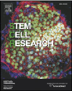
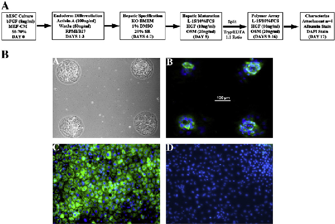
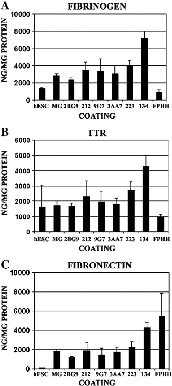
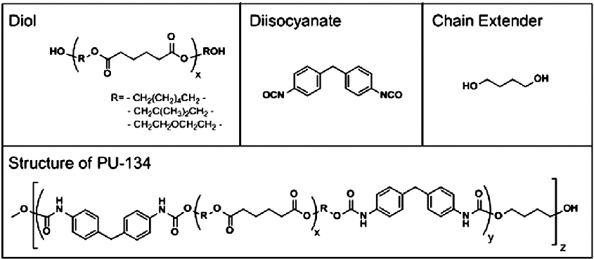
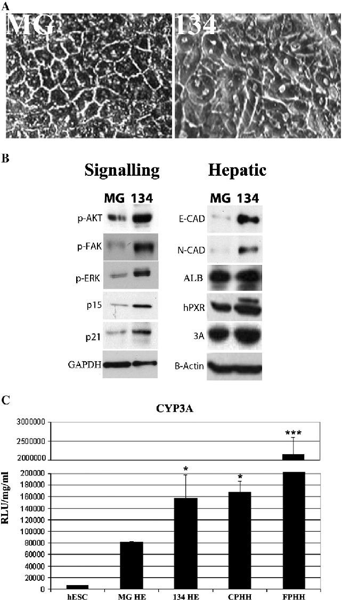
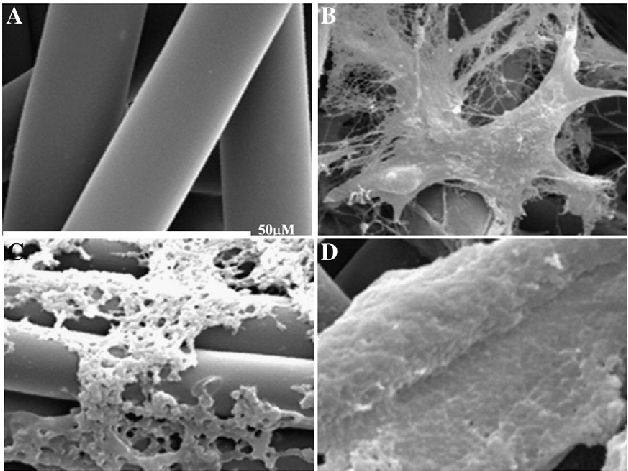
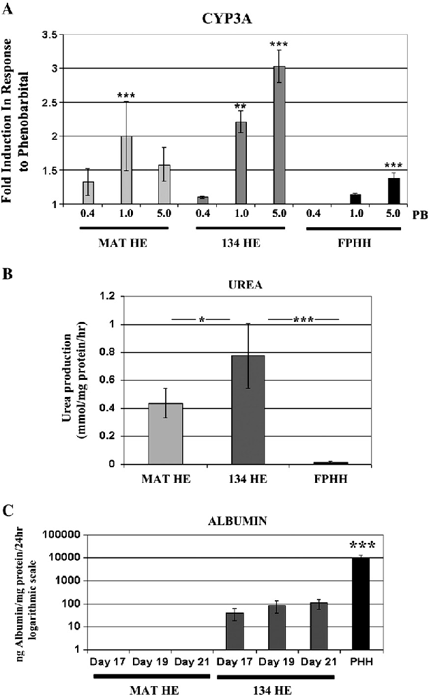

Stem Cell Research (2011) 6, 92–102

available at www.sciencedirect.com

www.elsevier.com/locate/scr

REGULAR ARTICLE

Unbiased screening of polymer libraries to define novel substrates for functional hepatocytes with inducible drug metabolism

David C. Haya,⁎, Salvatore Pernagallob, Juan Jose Diaz-Mochonb, Claire N. Medinea, Sebastian Greenhougha, Zara Hannouna, Joerg Schradera, James R. Blacka, Judy Fletchera, Donna Dalgettya, Alexandra I. Thompsona, Philip N. Newsomec, Stuart J. Forbesa, James A. Rossa, Mark Bradleyb, John P. Iredalea

a MRC Centre for Regenerative Medicine, University of Edinburgh, Chancellor's Building, Edinburgh, EH16 4SB, UK b School of Chemistry, West Mains Road, University of Edinburgh, Edinburgh, EH9 3JJ, UK c Institute of Biomedical Research, University of Birmingham, Birmingham, B15 2TT, UK

Received 30 November 2010; accepted 2 December 2010 Available online 10 December 2010

Abstract Maintaining stable differentiated somatic cell function in culture is essential to a range of biological endeavors. However, current technologies, employing, for example, primary hepatic cell culture (essential to the development of a bio-artificial liver and improveddrugandtoxicologytesting),arelimitedbysupply,expense,andfunctionalinstabilityevenonbiologicalcellculturesubstrata. As such, novel biologically active substrates manufacturable to GMP standards have the potential to improve cell culture-based assay applications.Currentlyhepaticendoderm(HE)generatedfrompluripotentstemcellsisagenotypicallydiverse,cheap,andstablesource of “hepatocytes”; however, HE routine applications are limited due to phenotypic instability in culture. Therefore a manufacturable subcellular matrix capable of supporting long-term differentiated cell function would represent a step forward in developing scalable and phenotypically stable hESC-derived hepatocytes. Adopting an unbiased approach we screened polymer microarrays and identified a polyurethane matrix which promoted HE viability, hepatocellular gene expression, drug-inducible metabolism, and function. Moreover, thepolyurethanesupported,whencoatedonaclinicallyapprovedbio-artificiallivermatrix,long-termhepatocytefunctionandgrowth. In conclusion, our data suggest that an unbiased screening approach can identify cell culture substrate(s) that enhance the phenotypic stability of primary and stem cell-derived cell resources. © 2010 Elsevier B.V. All rights reserved.

⁎ Corresponding author. Fax: +44 131 242 6629. E-mail address: davehay@talktalk.net (D.C. Hay).

1873-5061/$ – see front matter © 2010 Elsevier B.V. All rights reserved. doi:10.1016/j.scr.2010.12.002

Introduction

Maintaining stable differentiated somatic cell function in culture is essential to a range of biological endeavors. This is particularly important if human embryonic stem cells (hESC) and induced pluripotent stem cell (iPSC)-derived differentiated cells are to achieve their full potential as scalable cellular resources. The application of stem cell-derived hepatic endoderm (HE), as predictive in vitro models, is important given the current shortfalls in human liver models employed by Pharma and biotech to date. As such, state of the art drug and toxicology testing is far from perfect with a number of hurdles to overcome.

Liver cells (hepatocytes) metabolise most compounds and therefore can be used to predict liver metabolism and drug toxicity of a drug/compound. However most metabolic models are typically based on rodent liver (for reasons of supply and uniformity) and therefore only approximately predict human drug metabolism (Guillouzo, 1998; Maurel, 1996). As a result many drug trials have had to be terminated because such systems simply failed to predict human drug toxicity. The alternatives to rodent hepatocytes are cryopreserved or freshly isolated primary human hepatocytes. However, their widespread use is limited by supply, expense, variability in quality, and the diminishing function and viability following isolation and cryopreservation. However, despite these limitations they continue to serve as the industrial gold standard. Thus, there is an unmet need for the development of more accurate and predictive toxicity models.

hESCs represent a pluripotent cell population able to generate all primary cell types in vitro (Thomson et al., 1998; Reubinoff et al., 2000). The ability to derive unlimited amounts of human HE from pluripotent stem cells constitutes an attractive and scalable resource which holds great potential. The deployment of this resource in the drug discovery process has the potential to streamline and standardize the predictive process and therefore impacting on the costs of drug attrition. Although very promising (Hay et al., 2008; Basma et al., 2009; Agarwal et al., 2008; Baharvand et al., 2006; Duan et al., 2007; Lavon et al., 2004; Touboul et al., 2010; Hannoun et al., 2010; Greenhough et al., 2010; Payne et al., 2011), hESC-derived HE, like primary human hepatocytes, also demonstrate reduced long-term viability and function in prolonged tissue culture, meaning that the advantages gained in uniformity, supply, integrity, and specificity have to date been offset by inflexibility necessitated by short-term culture models.

The identification of a scalable conventional substrate(s) which facilitates long-term hepatocyte function has the potential to overcome these issues. Additionally, such a resource would aid endeavors to develop a human cell-based bio-artificial liver, which to date have failed because of poor cell availability, viability, and long-term function. Moreover, the development/application of a screening technology, for cellular support matrices, to stem cell-derived differentiated cells would also permit the rapid clinical and industrial translation of stem cell-derived products. With that in mind, and as a proof of concept for our approach, we employed polymer microarrays to identify novel cellular supports and substrates which display subtle properties supporting differentiated cell function.

Using an unbiased approach and capitalising on our recent demonstration that hESCs can be differentiated to form HE in vitro (Hay et al., 2008), we employed the polymer microarray screening approach (Pernagallo et al., 2009; Tourniaire et al., 2006; Thaburet et al., 2004) to discover novel extracellular substrate(s). We identified a simple polyurethane which not only provides long-term hepatic support, but does so in a manner in which the hepatocytes are fully functional and exhibit superior drug inducibility to freshly isolated primary human hepatocytes (FPHH). The data provide proof of concept that a novel and unbiased approach offers a simple and costeffective means of identifying alternatives to complex xenobiotics. Moreover, such polymers provide a scalable resource to support differentiated cell function in research, drug screening, and toxicology and in the longer term, extracorporeal devices.

Results

Polymer library fabrication and screening

Polymer microarrays have been used to identify substrates that modulate or control cell biology (Meredith et al., 2003; How et al., 2004; Pernagallo et al., 2009; Tourniaire et al., 2006; Thaburet et al., 2004). The polymer arrays used in these studies were fabricated by contact printing 380 polyurethanes and polyacrylates onto an agarose-coated glass microscope slide (Pernagalloetal.,2009;Tourniaireetal.,2006).Beforeprinting in quadruplicate, each library member was dissolved in a common, nonvolatile solvent N-methyl-2-pyrrolidinone (NMP). A number of printing parameters, such as inking and printing time, were optimised in this process to ensure uniformity of polymer spot within the array. Once printed, the slides were dried overnight and sterilised by UV irradiation prior to cell plating. The polymer library was screened for stem cell-derived hepatic endoderm attachment and long-term function using the HCS systems and Pathfinder software. Direct differentiation of hESCs to HE was initiated using a highly efficient tissue culture model (Hay et al., 2008) (Fig. 1A). On adopting a hepatic fate (Day 8), HE was detached from the biological extracellular matrix and replated onto the polymer microarray. Following replating onto the array, hESC-derived HE was cultured for a further 9 days under conditions that supported hepatic identity and differentiation in vitro (Hay et al., 2008). At this point cell attachment was recorded using phase microscopy (Fig. 1B, A), with hepatic phenotype assessed by albumin production (Fig. 1B, B), and compared to culture on Matrigel (Fig. 1B, C) and an IgG isotype control (Fig. 1B, D).

In order to study hepatic function in further detail and confirm the results of these experiments, the six hit-selected polymers (three polyurethanes 134, 212, 223 and three polyacrylates 2BG9, 9 G7, 3AA7) that supported HE attachment and identity (Table 1) and function were investigated in detail. Fourteen days following replating (Day 23) onto the identified polymers (coated 13 mm coverslips) HE synthetic function was screenedand definedby theexpressionofa panel of soluble hepatocyte export proteins and compared to hESCs and FPHHs. Using this impartial strategy, polymer 134 was identified, in most cases, as an effective cellular matrix which supported superior hepatic function when compared to hESCs and FPHHs (Figs. 2A–C). hESC-derived HE on polymer 134

94 D.C. Hay et al.

Figure 1 Screening a polymer library. (A) hESCs were differentiated to HE using an efficient differentiation protocol (Hay et al., 2008). Abbreviations: bFGF, basic fibroblast growth factor; MEF-CM, mouse embryonic fibroblast conditioned medium; KO DMEM, knock out Dulbecco's modified Eagle medium; DMSO, dimethyl sulfoxide; SR, serum replacement; L-15, Leibovitz's L-15; FCS, fetal calf serum; HGF, hepatocyte growth factor; OSM, oncostatin M; DAPI, 4′,6-diamidino-2-phenylindole. (B) A, Phase contrast microscopy of cells replated on the polymer library following 8 days culture in hepatocyte culture medium. Magnification×10. B, Immunofluorescence for human albumin expression in hepatic endoderm (HE) replated on the polymer spots. C, Immunofluorescence for human albumin in HE maintained on Matrigel (MG). D, IgG isotype immunostaining control for human albumin staining. Photographs were taken using a Leica DMIRB; scale bar 100 μm.

exhibited similar fibronectin secretion to FPHHs in these experiments (Fig. 2C).

Extensive characterisation of hESC-derived HE on polymer 134 and Matrigel

Our further studies focussed on HE morphology, signaling, gene expression, and drug metabolism on two extracellular matrices, MGandpolymer 134(Fig.3). MGwasusedasour controlasit has previously been shown to improve hepatocyte performance in vitro (Bissel et al., 1987). HE passaged and maintained on MG or polymers 2BG9, 212, 9 G7, 3AA7, and 223 (Day 24), (Fig. 4A, SupplementaryFig.1)weregranular.Incontrast,HEreplatedon 134maintainedaclearhepaticmorphology(Fig.4A).Inlinewith changes in cellular morphology we also observed changes in general cell signaling and hepatic gene expression. hESC-HE

Table 1 Summarises the 6 polymer hits and the criteria we used to assess hepatic identity (n=4) Polymer Attachment Albumin

2BG9 + + 2I2 + + 9G7 + + 3AA7 + + 223 + + 134 + + MG + +

maintained on polymer 134 displayed increased FAK, Akt, and ERK signaling, consistent with the cells becoming firmly attached to the substrate and not undergoing apoptosis. This was not observed in HE maintained on MG. Although HE plated on polymer 134 displayed elevated levels of the promitotic factor ERK and Akt, HE also expressed high levels of cell cycle inhibitors p15 and p21, consistent with metabolically active hepatocellular populations locked in a quiescent and therefore functional state (Fig. 4B). In addition to changes in cell signaling and cell cycle we also observed changes in hepatocyte gene expression. The expressions of both N-cadherin and E-cadherin play important roles in human hepatocyte biology and expressions of both of these were enhanced in hESC-HE maintained on 134 compared with MG. In addition to a more epithelial phenotype on polymer 134, we also observed increased expression of hPXR and phospho-PXR. The increased levels of hPXR were consistent with increased levels of cytochrome P450 (CYP)3AdetectedbyWesternblotting(Fig.4B).Inordertoasses the role that polymer was playing in CYP3A metabolic activity key activities on the different extracellular matrices were analysed compared to cryopreserved primary human hepatocytes (CPHHs) and FPHHs. HE maintained on polymer 134 displayed similar CYP3A function to cryopreserved primary human hepatocytes (PHHs) and increased in CYP3A function over hESCs (~13-fold) and hESC-derived HE maintained on MG or the other polymers tested (~2-fold) (Fig. 4C, Supplementary Fig. 1). While FPHHs demonstrated superior function (10- to 15fold) over both hESC-derived HE on 134 and cryopreserved PHHs (Fig. 4C, Supplementary Fig. 1). In addition to CYP3A, CYP1A2 activity was induced ~3–7-fold on polymer 134 when compared with MG, polymer and hESC cultures (Supplementary Fig. 1).

Figure 2 Characterisation of polymer library “hits.” hESCs were differentiated to hepatic endoderm (HE) using an established method. At Day 23 hESC-derived HE was incubated in 1 ml of hepatocyte culture medium for 24 h. The following morning culture supernatants were harvested and serum protein production was measured by ELISA and quoted as ng/mg of cellular protein. HE cultured on polymer 134 exhibited the greatest effect on hepatic function with an induction of fibrinogen, transthyretin (TTR), and fibronectin when compared to hESCs and HE on polymers 2BG9, 9 G7, 223, 212, and 3AA7 or Matrigel (MG) matrices (n=3). hESC-HE exhibited similar fibronectin production to freshly isolated primary human hepatocytes (FPHH) and greater TTR and fibrinogen production than FPHHs (n=4). Error bars represent 1 standard deviation.

Albumin expression in these experiments was similar between HE maintained on MG and polymer 134 (Fig. 4B).

Attachment of hESC-derived HE onto native and polymer 134-coated bio-artificial liver matrix

The identification of the phospho-form of PXR in HE maintained on polymer 134 indicated that HE may be drug inducible. Therefore in order to assess drug inducibility and

the utility of HE in a directly translatable setting, a polyfiber core (PFC) cell matrix used in a bio-artificial liver (BAL) device was employed (van de Kerkhore et al., 2002). The PFC was tested in both its native form and coated with polymer 134. On adopting an hepatic fate (Day 9), HE was detached from the biological extracellular matrix and replated onto native or polymer-coated PFC (Fig. 5A uncoated and polymer-coated BAL matrix Fig. 5C) and cultured for a further 15 days (Day 24) under conditions that support hepatic identity, prior to fixation and scanning electron microscopy (SEM) analysis. hESC-derived HE maintained on uncoated PFC demonstrated cell attachment and cell processes resembling stress fibers (Fig. 5B) whereas HE maintained on polymer 134-coated PFC exhibited a smooth tissue-like appearance (Fig. 5D) which could be expected to limit the effects of fluid shear stress on HE in the BAL, reducing potential inflammatory mediator production.

hESC-derived HE function on native and polymer 134-coated bio-artificial liver matrix

hESC-derived HE was cultured on the different BAL matrices for 13 days, before assessment of HE drug inducibility (Days 22–24). hESC-derived HE was induced with a range of phenobarbital concentrations (0.4–5 mM) or maintained in control medium for 48 h, changing medium daily. At Day 24 HE maintained on both the PFC support matrices were assessed for CYP3A drug induction. CYP3A was chosen as it has been estimated to play a role in the metabolism of approximately 50% of therapeutic drugs (Keshava et al., 2004) and thereby essential to predictive drug toxicity and extracorporeal support. At Day 24 the native matrix supported hepatocyte attachment and function, with a narrowrangedruginductionofCYP3A(Fig.5B,Fig.6A,lightgray bars). In contrast, hESC-derived HE from both H1 and H9s replated on polymer 134-coated matrix exhibited phenobarbital-inducible CYP3A drug metabolism (Fig. 6A, dark gray bars and Supplementary Fig. 4 black bars) over a broader range. In both cases hESC-derived HE on BAL matrix and 134-coated BAL matrix demonstrated superior drug induction to FPHHs (Fig. 6A, black bars). These data exemplify the value of polymer 134 and hESC-derived HE both in predictive toxicology and in a BAL setting. In addition to P450 drug inducibility, we also studied endocrine and exocrine human liver function by ureagensis (Day 24) and human albumin production (Days 17 to 21) (Figs. 6B and C). Ureagenesis was significantly improved on polymer 134 HE (~55-fold) when compared to FPHHs and MAT HE (~2-fold) (Fig. 6B). Additionally, albumin production in 134 HE was superior to MAT HE, however it was reduced 100-fold in comparison to FPHHs (Fig. 6C).

Discussion

In an attempt to improve the quality of hESC-derived HE we screened polymer libraries for novel and bioactive substrata. Following polymer library screening we identified 6 polymers which supported hepatic attachment and identity in vitro (Fig. 1). In order to study hepatic function in further detail the hit polymers were screened for the expression of a panel of soluble export proteins produced by the liver. From these studies polymer 134 was identified as the most effective cellular support (Fig. 2). In addition to changes

96 D.C. Hay et al.

Figure 3 vMonomers and structure of polyurethane 134. Diol: poly[1,6-hexanediol/neopentyl glycol/diethylene glycol-alt-(adiptic acid)]diol (PHNGAD); diisocyanate: 4,4′-methylenebis(phenylisocyanate) (MDI); chain extender: 1,4-butanediol (BD). Molecular ratio: Diol/diisocyanate/chain extender (0.25/0.50/0.25).

in levels of HE function we also noted gross changes in cellular morphology with hESC HE replated on 134, exhibiting clear hepatic morphology and canaliculi (Fig. 4). In line with changes in cellular morphology we also observed major differences in HE signaling networks, consistent with the cells remaining hepatic and firmly attached to the substrate (Fig. 4). In addition, HE maintained on polymer 134 displayed similar CYP3A function to cryopreserved PHHs which was superior to the all other ECMs tested (Fig. 4, Supplementary Fig. 1). This being said, both hESC-HE and cryopreserved PHHs displayed reduced basal function (~10to 15-fold) when compared to freshly isolated PHHs. Although basal function was reduced in vitro, dosedependent drug induction of CYP3A drug metabolism was superior in hESC-derived HE compared to freshly isolated PHHs (Fig. 6 and Supplementary Fig. 4), indicating that hESC-derived HE was a more sensitive, and therefore predictive, model of human liver function in vitro.

The top polyurethanes identified by our approach, 134, 212 and 223, were structurally related comprising the monomers: (poly[1,6-hexanediol/neopentyl glycol/di(ethyleneglycol)alt-adipic acid] diol (PHNGAD), 4,4′-methylenebis(phenyl isocyanate) (MDI) and 1,4-butanediol (BD)); (poly[1,6-hexanediol/neopentyl glycol-alt-adipic acid] diol (PHNAD), 1,6diisocyanate) (HDI), and propylene glycol (PG) and (poly[1,6hexanediol/neopentyl glycol-alt-adipic acid] diol, 4,4′-methy-

lenebis(phenyl isocyanate) and octafluoro-1,6-hexandiol (OFHD), respectively. The monomers PHNAD and PHNGAD are closely related and thus this common feature appears important for HE binding and control. However, this feature alone was insufficient to dictate binding and control as other polymers in the library containing the monomers PHNAD or PHNGAD were not identified from the microarray screen. In general polyurethanes which did not contain an extender did not bind hepatocyte-like cells. In terms of the three polyacrylates 2BG9, 9 G7, 3AA7 (monomers methyl methacrylate (MMA) and ethyleneglycol methacrylate phosphate (EGMP-H)), (n-butyl methacrylate (BMA) and diethylaminoethyl acrylate (DEAEA)), and (methoxethyl methacrylate (MEMA) and 4-vinylpyridine (VP-4)), respectively, very little correlation can bedrawn.Indeed the polymers are structurally diverse with no commonality between them, with widely variant functionalities, from phosphate (– vely charged) to a secondary amine (+ vely charged) to uncharged. Extensive analysis of the polymer physical parameters and biological response (using the program SpotFire) failed to show any correlation. However, many of these monomers have found applications in cell binding applications; for example, EGMP-H was used in PEG hydrogels to encapsulate hMSCs (Nuttelmana et al., 2006), while DEAEA has been identified as a monomer that promotes cell binding in thermally responsive polymers (Zhang et al., 2009).

Figure 4 Characterisation of HE onpolymer 134 and Matrigel (A) hESC-derived hepatic endoderm (HE) morphology plated on Matrigel (MG) or polyurethane 134. (B) Protein lysates were prepared from HE maintained on MG or 134. Extracts were Western-blotted, blocked, and probed for p-Akt, p-FAK, p-ERK, p15, p21, E-cadherin, N-cadherin,albumin, hPXR, and Cyp3A. hESC-HE maintained on polymer 134, but not MG, displayed increased FAK, Akt, and ERK signaling; cell cycle inhibitors, p15 and p21, expression; adhesion molecule, N-cadherin and Ecadherin, expression, and hPXR and Cyp3A expression. In addition HE maintained on polymer 134 exhibited the presence of an upper band consistent with inducible hPXR protein phophorylation. The levels of albumin remained similar on hepatocyte-like cells maintained on polyurethane 134 and MG. (C) hESC-derived HE was incubated with hepatocyte culture medium supplemented with 50 μM CYP3A pGlo substrate. CYP3A activity was expressed as relative light units (RLU)/mg protein/ml (n=3) for hESC-derived hepatic endoderm and n=6 for cryopreserved (CPHH) and freshly isolated primary human hepatocytes (FPHH). hESC-derived HE and PHHs were significantly different than the hESC control experiment. 134 HE, CPHH, and FPHH were all increased significantly over MG HE. Pb0.05 is denoted * and Pb0.001 is denoted *** measured by Students t test in comparison to MG HE cultures. Error bars represent 1 standard deviation.

Polymer matrix promotes hepatocyte drug metabolism 97

The subtleties of polymer composition, wettability, ability to bind proteins, and direct polymer–cell interactions as well as polymer surface topography all undoubtedly play a role in controlling and modulating cell binding.

Polyurethane 134 was identified as the most effective cellular support compared to Matrigel (MG) and the other polymers tested. The success of polyurethane 134 may be due to the fact that the monomer PHNGAD and the

extender (BD) serve to modulate physical parameters, such as elasticity, wettability (Thaburet et al., 2004), and surface topography, while the hydrophobic nature of MDI helps to absorb extracellular matrix proteins, but this is in reality far too simplistic. There are a myriad of variables that vary during culture and an unbiased screening approach that looks for desired function, akin to mRNA profiling or high-throughout screening of small molecules, is the only practical solution to such a

98 D.C. Hay et al.

Figure 5 Replating of HE onto native and polymer-coated bio-artificial liver matrix. hESC-derived hepatic endoderm (HE) was plated either on an uncoated or a coated polyfiber core (PFC) of the bio-artificial liver (BAL). At Day 24 in culture the cells were fixed and examined by electron microscopy. (A) The uncoated PFC of the BAL, (B) represents uncoated PFC with HE attached, (C) represents the polymer-coated PFC, and (D) represents polymer 134-coated PFC with HE attached. Scale bar in panel is 50 μm.

complex system and in this case gave rise to the discovery of polymer 134.

In conclusion, the ability to derive high-fidelity primary cell types from hESCs represents an attractive strategy to develop a more detailed understanding of human biology in vitro and will undoubtedly play an import role in regenerative medicine. To this end, we have screened polymer libraries to identify novel ECMs which play a supportive role in hepatocyte biology. Using our approach we have identified a simple and scalable culture polymer matrix which enhances hepatic phenotype and sensitivity in vitro.

Materials and methods

Cell culture and differentiation

Human embryonic stem cells (H9 and H1) were cultured and propagated on MG-coated plates with mouse embryonic fibroblast conditioned medium (MEF-CM) supplemented with basic fibroblast growth factor under feeder-free, serum-free conditions as previously described (Hay et al., 2008). Differentiation was initiated at 60–70% confluence, by replacing the MEF-CM with differentiation medium (RPMI

Figure 6 HEfunctiononnativeandpolymer-coatedbio-artificiallivermatrix.PhenobarbitaldruginductionwascarriedoutfromDay22for 48 h, changing medium and phenobarbital on a daily basis. Control cultures did not receive phenobarbital, but had their medium changed daily. For ELISA experiments hepatic endoderm (HE) was cultured in12-well plates with 1 ml L-15 for 24 h before culture supernatants were collected and measured as described (Hay et al., 2008). (A) hESC-derived HE was plated either on the uncoated (light gray bars) or on the coated bio-artificial liver matrix (dark gray bars). Drug inducibility of hESC-derived HE cultures was compared to freshly isolated hepatocytes (black bars) throughout. The cultures were incubated in the presence or absence of a known CYP3A inducer, phenobarbital (0.4–5 mM) prior to measurement of CYP3A activity using the nonlytic pGlo system. At 5 h posttreatment CYP3A activity was measured on a luminometer (POLARstar optima). Units of activity are expressed as relative light units (RLU)/mg protein/ml (n=6). Levels of significance are quoted over uninducedcontrols and measured by astudent'st-testPb0.01isdenoted** and Pb0.001isdenoted***.(B)hESC-derivedHEwasplatedeither on the uncoated (light gray bars) or on coated bio-artificial liver matrix (dark gray bars) and compared to freshly isolated primary human hepatocytes (FPHH) (black bars). The cultures were incubated in the presence of ammonium chloride for 4 h prior to measurement of ureagenesis. Urea production activity is quoted at mmol/mg cell protein/h and was significantly higher in hESC-HE (MAT and 134, n=12) than FPHH (n=4) (C) Prior to drug induction (Days 17–21) hESC-derived HE was incubated in 1 ml of hepatocyte culture medium for 24 h. The following morning culture supernatants were harvested and serum protein production was measured by ELISA and quoted as ng/ml of culture supernatant.HEculturedonpolymer134(134HE)exhibitedsuperiorhumanalbuminproductionwhencomparedtotheuncoatedbio-artificial liver matrix (MAT HE) (n=4). However, human serum albumin production was reduced 100-fold when compared to FPHHs. Pb0.001 is denoted *** and measured by Students t test in comparison to MAT HE and 134 HE. The graph wasplotted using a logarithmic scale. Error bars represent 1 standard deviation.

Polymer matrix promotes hepatocyte drug metabolism 99

1640 containing B27) (both from Invitrogen), 100 ng/ml activin A (Peprotech), and 50 ng/ml Wnt3a (R&D Systems). After 72 h (changing medium every day) differentiating cells were cultured in differentiation medium (SR/DMSO medium: knockout-DMEM containing 20% serum replacement (SR), 1 mM glutamine, 1% nonessential amino acids, 0.1 mM βmercaptoethanol (all from Invitrogen), and 1% dimethyl sulfoxide (DMSO, Sigma)) for 4 days. At Day 8 in the differentiation process the cells were removed from their substrate using a 5 min 37 °C incubation with trypsin/EDTA (Invitrogen). Following this hepatocyte-like cells were plated onto the polymer array, polymer-coated coverslips, or MGcoated plasticware and cultured in maturation medium, L15 medium (Sigma) supplemented with 8.3% fetal calf serum,

8.3% tryptose phosphate broth, 10 μM hydrocortisone 21hemisuccinate, 1 μM insulin (Sigma), and 2 mM glutamine (Invitrogen) containing 10 ng/ml hepatocyte growth factor (Peprotech) and 20 ng/ml oncostatin M (R&D Systems). The medium was changed every second day during maturation till characterisation at Day 17. hESC-derived HE was incubated in the presence or absence of phenobarbital (Sigma) (range 0.4– 5 mM) for 48 h prior to measurement of CYP3A activity.

Primary human hepatocyte thaw and culture

Cryopreserved primary human hepatocytes (Lonza) were thawed and DMSO was removed slowly at 4 °C by doubling

100 D.C. Hay et al.

dilutions of fresh L-15 medium. Cryopreserved PHHs were cultured in the same manner as hESC-derived HE (Hay et al., 2008). PHH basal drug metabolism was measured using the pGlo assay (Promega) described below. FPHHs were purchased from Invitrogen (HMFS01) and maintained as per the manufacturer's instructions (Williams E A1217601 and the supplement pack CM4000) on Matrigel (BD)-coated 12-well plates. Both cryopreserved and freshly isolated cultures were seeded at 105 viable cells/cm2. The cultures were incubated in the presence or absence of phenobarbital (Sigma; range 0.4–5 mM) within 24 h of replating prior to measurement of CYP3A activity.

Immunostaining

Monolayer cultures were fixed in ice-cold methanol at -20 °C for 10 min. After blocking with PBS containing 10% BSA, cells were incubated with primary antibody (human serum albumin 1:500, Sigma) at 4 °C overnight, followed by 30 min incubation with appropriate secondary antibody at room temperature.

Measurement of hepatocyte export proteins

Day 23hESCderivedHE, FPHHs, and hESCs wereculturedin12well plates with 1 ml L-15. Following 24 h culture the supernatants were collected for analysis. Hepatic export proteins were measured by enzyme-linked immunoabsorbant assay (ELISA) as previously described and normalized to total cell protein(mg)(Wheelhouseetal.,2006;O'Riordainetal.,1995).

Cytochrome p450 function

CYP3A and CYP1A2 activities were assessed using the pGlo kit from Promega and carried out as per the manufacturer's instructions for nonlytic CYP450 activity estimation (http:// www.promega.com/tbs/tb325/tb325.pdf). CYP Activities are expressed as relative light units (RLU) per milligram of protein.

Western blotting

Western blotting was carried out as previously described (Hay et al., 2007). Primary and secondary antibody dilutions and suppliers are shown in Table 2.

Polymer microarray fabrication

Three hundred and eighty members of a presynthesised polyurethane and polyacrylate library were “spotted” on aminoalkylsilane-treated glass slides, previously coated with agarose to impede unspecific cell adhesion (Pernagallo et al., 2009; Tourniaire et al., 2006) (for a full list of the polymers used see Supplementary Fig. 2). Coating with agarose was achieved by manually dip-coating the slide in agarose Type I-B (1% w/v in deionisedwaterat65 °C),followedbyremovalofthecoatingon the bottom of the side by wiping with a clean piece of tissue. Subsequently, the slides were dried overnight at room temperature in a dust-free environment. Polymers for contact printing were prepared by dissolving 10 mg of polymer in 1 ml of the nonvolatile solvent N-methyl-2-pyrrolidinone. Polymer microarrays were then fabricated by contact printing (Q-Array

Table 2 Antibodies used in Western blot studies Antigen Company Dilution

p-FAK Epitomics 1:5000 p-Akt Cell Signaling 1:4000 p-Erk Cell Signaling 1:4000 P15 Cell Signaling 1:1000 P21 Santa Cruz 1:500 E-Cad DAKO 1:1000 N-Cad DAKO 1:1000 h-PXR ABCAM 1:250 CYP3A Dundee University 1:250 Albumin Sigma 1:1000 B-Actin Santa Cruz 1:2000 Secondary DAKO Anti Mouse 1:2000 Secondary DAKO Anti Sheep 1:2000 Secondary DAKO Anti Rabbit 1:2000

Mini microarrayer) with 32 aQu solid pins (K2785, Genetix) using the polymer solutions placed in polypropylene 384-well microplates (X7020, Genetix). The 380 members of the polymer libraries were printed following a four-replicate pattern with 1 single field of 32×48 spots containing 4 control (emptied) areas. Printingconditionswereasfollows:5stampingsperspot,200 ms inking time, and 10 ms stamping time. The typical spot size was 300–320 μm indiameter witha pitch distance of 560 μm (y-axis) and 750 μm (x-axis), allowing up to 1520 features to be printed on a standard 25×75 mm slide. Once printed, the slides were dried under vacuum (12 h at 42 °C/200 mbar) and sterilised in a bio-safety cabinet by exposure to UV irradiation for 20 min prior to use.

Polymer library screening

Image capture and analyses were carried out using a highcontent screening (HCS) platform (Nikon 50i fluorescence microscope (x20 objective) with an X-Y-Z stage), equipped with Pathfinder software package as described (Pernagallo et al., 2009; Tourniaire et al., 2006). Cell number (Hoechst 33342: ex/em 355/465 nm) and hepatic function (monoclonal antibody against albumin followed by incubation with a fluoresceinconjugated secondary antibody: ex/em 492/516 nm) (Invitrogen) for each polyurethane and polyacrylate member were determined using fluorescent (DAPI, FITC-like bandpass filters) channel by automated scanning of polymer spots. For largescale analysis of the “hit” polymers 13-mm-diameter glass coverslips (CB00500RA1, Menzel-Gläser) were cleaned with tetrahydrofuran (THF) and coated with the polymer. This was achieved by spotting 100 μl of a solution of the polyurethanes (134, 212, 223) or polyacrylates (2BG9, 9 G7, 3AA7) (2.0% w/v in THF) onto the coverslips and spin-coating for 10 s at 2000 rpm. Coverslips were dried under vacuum (12 h at 45 °C/200 mbar) and irradiated with UV light for 20 min before use as previously reported (Pernagallo et al., 2009; Tourniaire et al., 2006).

Synthesis of polymer 134

Polyurethane 134 was prepared by the reaction of 1.0 eq of poly[1,6-hexanediol/neopentyl glycol/di(ethylene glycol)-alt-

Polymer matrix promotes hepatocyte drug metabolism 101

adipic acid] diol with 2.0 eq of a 4,4′-methylenebis(phenyl isocyanate) in dry THF, followed by the addition of 1.0 eq of a 1,4-butanediol chain extender accordingly to the schematic shown in Supplementary Fig. 3. Polymer 134 was fully characterized (as were all polymers used in the library screen) using GPC (column PLgel HTS-D 150×7.5 mm i.d., Polymer Laboratories, NMP 1 ml minute), Hyper DSC (Diamond, PerkinElmer), wettability measurements (Pernagallo et al., 2009), and FTIR (Mattson instrument).

Scanning electron microscopy

HE was plated and maintained on uncoated and polymer 134coated bio-artificial liver matrix for 15 days. At Day 24 HE maintained on both matrices was fixed with 2.5% glutaraldehyde for 2 h at room temperature and washed twice with 0.1 M cacodylate buffer. Following which the samples were postfixed with 1% osmium tetroxide for 1 h at room temperature, dehydrated through graded ethanol (50, 70, 90, and 100%), critical point-dried in CO2, and gold-coated by sputtering. The samples were visualised using a Philips XL30CP scanning electron microscope.

Acknowledgments

We thank Professor Roland Wolf, University of Dundee, for supplying the antibody to CYP3A and Professor Robert Chamuleau for providing the bio-artificial liver matrix and for comments on the manuscript. These studies were funded by an RCUK Fellowship awarded to Dr. David Hay. Drs. Salvatore PernagalloandClaireMedineweresupportedbyafollowonfund from the EPSRC. Dr. Joerg Schrader was supported by a grant from the German government. Dr. Alexandra Thompson was supported by a grant from British Society for Gastroenterology andFalkPharma.ProfessorJohnIredalewassupportedbyaMRC Programme grant.

Appendix A. Supplementary data

Supplementary data to this article can be found online at doi:10.1016/j.scr.2010.12.002.

References

Agarwal, S., Holton, K., Lanza, R., 2008. Efficient differentiation of functionalhepatocytesfromhumanembryonicstemcells.StemCells 26 (5), 1117–1127.

Baharvand, H., Hashemi, S.M., Kazemi Ashtiani, S., Farrokhi, A., 2006. Differentiation of human embryonic stem cells into hepatocytes in 2D and 3D culture systems in vitro. Int. J. Dev. Biol. 50 (7), 645–652.

Basma,H.,Soto-Gutiérrez,A.,Yannam,G.R.,Liu,L.,Ito,R.,Yamamoto, T., Ellis, E., et al., 2009. Differentiation and transplantation of human embryonic stem cell-derived hepatocytes. Gastroenterology 136 (3), 990–999.

Bissell, D.M., Arenson, D.M., Maher, J.J., Roll, F.J., 1987. Support of cultured hepatocytes by a laminin-rich gel. Evidence for a functionally significant subendothelial matrix in normal rat liver. J. Clin. Invest. 79, 801–812.

Duan, Y., Catana, A., Meng, Y., Yamamoto, N., He, S., Gupta, S., Gambhir, S., Zern, 2007. Differentiation and enrichment of

hepatocyte-like cells from human embryonic stem cells in vitro and in vivo. Stem Cells 25 (12), 3058–3068.

Greenhough, S., Medine, C., Hay, D.C., 2010. Pluripotent stem cell derived hepatocyte like cells and their potential in toxicity screening. Toxicology 278 (3), 288–293. doi: 10.1016/j. tox.2010.07.012.

Guillouzo, A., 1998. Liver cell models in in vitro toxicology. Environ. Health Perspect. 106, 511–532.

Hannoun, Z., Fletcher, J., Greenhough, S., Medine, C.N., Samuel, K., Sharma, R., Pryde, A., Black, J.R., Ross, J.A., Wilmut, I., Iredale, J.P., Hay, D.C., 2010. The comparison between conditioned media and serum free media in human embryonic stem cell culture and differentiation. Cell. Reprogram. 12 (2), 133–140.

Hay, D.C., Zhao, D., Ross, A., Mandalam, R., Lebkowski, J., Cui, W., 2007. Direct differentiation of human embryonic stem cells to hepatocyte-like cells exhibiting functional activities. Cloning Stem Cells 9, 51–62.

Hay, D.C., Fletcher, J., Payne, C., Terrace, J.D., Gallagher, R.C., Snoeys, J., et al., 2008. Highly efficient differentiation of hESCs to functional hepatic endoderm requires activin A and Wnt3a signaling. Proc. Natl Acad. Sci. USA 105, 12301–12306.

How, S.E., Yingyongnarongkul, B., Fara, M.A., Díaz-Mochón, J.J., Mittoo, S., Bradley, M., 2004. Polyplexes and lipoplexes for mammalian gene delivery: from traditional to microarray screening. Comb. Chem. High Throughput Screen. 7 (5), 423–430.

Keshava, C., McCanlies, E.C., Weston, A., 2004. CYP3A4 polymorphisms—potential risk factors for breast and prostate cancer: a HuGE review. Am. J. Epidemiol. 160, 825–841.

Lavon, N., Yanuka, O., Benvenisty, N., 2004. Differentiation and isolation of hepatic-like cells from human embryonic stem cells. Differentiation 72 (5), 230–238.

Maurel, P., 1996. The use of adult human hepatocytes in primary culture and other in vitro systems to investigate drug metabolism in man. Adv. Drug Deliv. Rev. 22, 105–132.

Meredith, J.C., Sormana, J.L., Keselowsky, B.G., García, A.J., Tona, A., Karim, A., et al., 2003. Combinatorial characterization of cell interactions with polymer surfaces. J. Biomed. Mater. Res. A 66 (3), 483–490.

Nuttelmana, C., Benoita, D.S.W., Tripodia, M.C., Anseth, K.S., 2006. The effect of ethylene glycol methacrylate phosphate in PEG hydrogels on mineralization and viability of encapsulated hMSCs. Biomaterials 27, 1377–1386.

O'Riordain, M.G., Ross, J.A., Fearon, K.C., Maingay, J., Farouk, M., Garden, O.J., et al., 1995. Insulin and counterregulatory hormones influence acute phase protein production in human hepatocytes. Am. J. Physiol. 269, 323–330.

Payne C.M., Samuel K., Pryde A., King J., Brownstein D., Schrader J., Medine C.N., Forbes S.J., Iredale J.P., Newsome P.N., Hay D.C., 2011. Persistence of functional hepatocyte like cells in immune compromised mice. Liver Int. 31 (2), 254–262.

Pernagallo, S., Diaz-Mochon, J.J., Bradley, M., 2009. A cooperative polymer-DNA microarray approach to biomaterial investigation. Lab Chip 9 (3), 397–403.

Reubinoff, B.E., Pera, M.F., Fong, C.Y., Trounson, A., Bongso, A.,

2000. Embryonic stem cell lines from human blastocysts: somatic differentiation in vitro. Nat. Biotechnol. 18 (4), 399–404.

Thaburet, J.-F.-O., Mizomoto, H., Bradley, M., 2004. High-throughput evaluation of the wettability of polymer libraries. Macromol. Rapid Commun. 25, 366–370.

Thomson, J.A., Itskovitz-Eldor, J., Shapiro, S.S., Waknitz, M.A., Swiergiel, J.J., Marshall, V.S., et al., 1998. Embryonic stem cell lines derived from human blastocysts. Science 282 (5391), 1145–1147.

Tourniaire, G., Collins, J., Campbell, S., Mizomoto, H., Ogawa, S., Thaburet, J.F., et al., 2006. Polymer microarrays for cellular adhesion. Chem. Commun. 20, 2118–2120.

102 D.C. Hay et al.

Touboul, T., Hannan, N.R., Corbineau, S., Martinez, A., Martinet, C., Branchereau, S., Mainot, S., Strick-Marchand, H., Pedersen, R., Di Santo, J., Weber, A., Vallier, L., 2010. Generation of functional hepatocytes from human embryonic stem cells under chemically defined conditions that recapitulate liver development. Hepatology 51 (5), 1754–1765.

van de Kerkhore, et al., 2002. Phase I clinical trial with the AMCbioartificial liver. International Journal of Artificial Organs 25 (10), 950–959.

Wheelhouse, N.M., Dowidar, N., Dejong, C.H., Garden, O.J., Powell, J.J., Barber, M.D., et al., 2006. The effects of macrophage migratory inhibitory factor on acute-phase protein production in primary human hepatocytes. Int. J. Mol. Med. 18, 957–961.

Zhang, R., Liberski, A., Sanchez-Martin, R., Bradley, M., 2009. Microarrays of over 2000 hydrogels—identification of substrates for cellular trapping and thermally triggered release. Biomaterials 30, 6193–6201.

