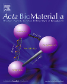
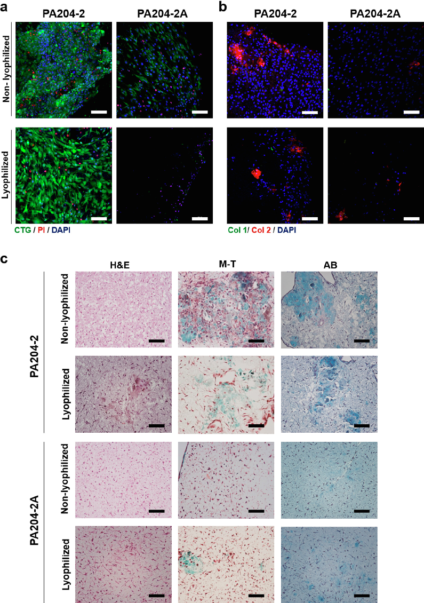
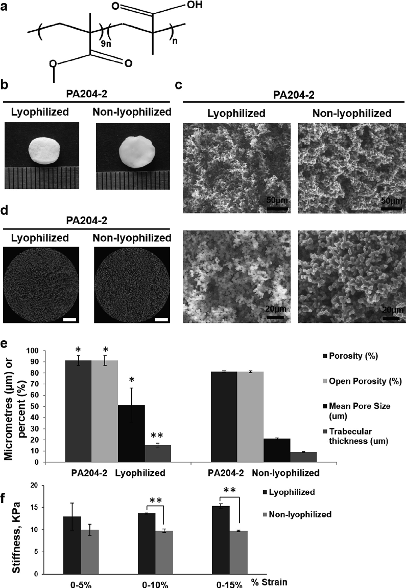
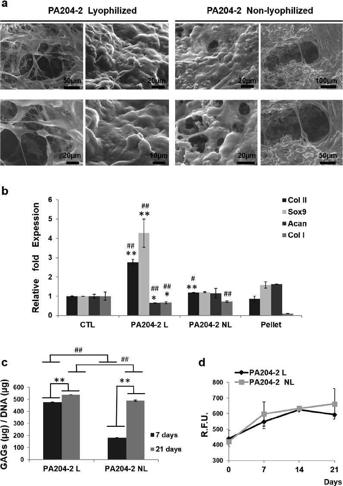
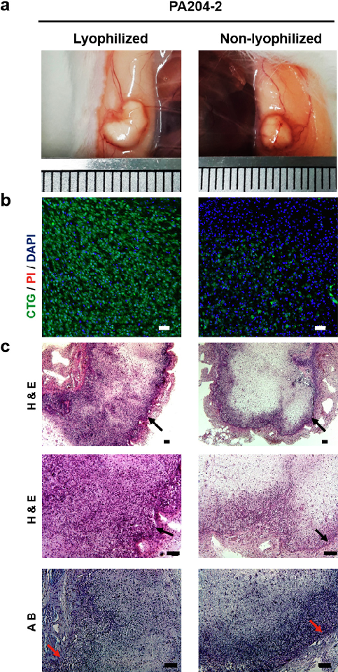
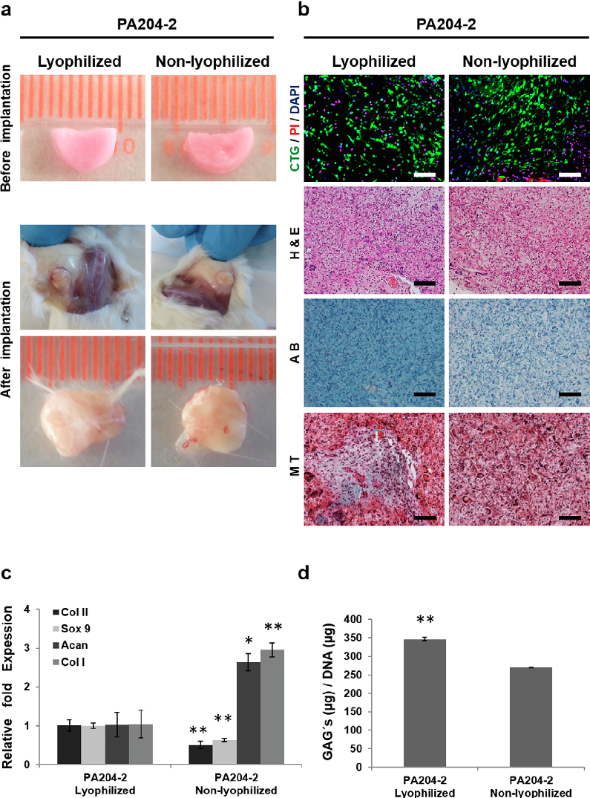

Acta Biomaterialia 90 (2019) 146–156

Contents lists available at ScienceDirect

Acta Biomaterialia

journal homepage: www.elsevier.com/locate/actabiomat

Full length article

A soft 3D polyacrylate hydrogel recapitulates the cartilage niche and allows growth-factor free tissue engineering of human articular cartilage

Gema Jiméneza,b,c,d,1, Seshasailam Venkateswaran e,1, Elena López-Ruiza,c,d,f,1, Macarena Perána,d,f, Salvatore Pernagallo g, Juan J. Díaz-Monchón h,i, Raphael F. Canadasj,k, Cristina Anticha,b,c,d, Joaquím M. Oliveira j,k,l, Anthony Callanan m, Robert Walllace n, Rui L. Reisj,k,l, Elvira Montañez o, Esmeralda Carrillo a,b,c,d, Mark Bradleye,⇑, Juan A. Marchala,b,c,d,⇑

a Biopathology and Regenerative Medicine Institute, Centre for Biomedical Research, University of Granada, 18100 Granada, Spain bInstituto de Investigación Biosanitaria ibs.GRANADA, Universidad de Granada, 18100 Granada, Spain cDepartment of Human Anatomy and Embryology, Faculty of Medicine, University of Granada, 18016 Granada, Spain dExcellence Research Unit ‘‘Modeling Nature” (MNat), University of Granada, Spain e School of Chemistry, EaStCHEM, University of Edinburgh, King’s Buildings, West Mains Road, Edinburgh EH9 3JJ, UK fDepartment of Health Sciences, University of Jaén, Jaén E-23071, Spain g DestiNAGenomica S.L. Parque Tecnológico Ciencias de la Salud, Avenida de la Innovación 1, Edificio Business Innovation Centre, 18016 Granada, Spain hPfizer-Universidad de Granada-Junta de Andalucía Centre for Genomics and Oncological Research (GENYO), Parque Tecnológico de Ciencias de la Salud, 18016 Granada, Spain iFaculty of Pharmacy, University of Granada, 18071 Granada, Spain j3Bs Research Group, Biomaterials, Biodegradables and Biomimetics, University of Minho, Headquarters of the European Institute of Excellence on Tissue Engineering and Regenerative Medicine, AvePark, 4805-017 Barco, Guimarães, Portugal kICVS/3Bs, PT Government Associate Laboratory, Braga, Guimarães, Portugal lThe Discoveries Centre for Regenerative and Precision Medicine, Headquarters at University of Minho, Avepark, 4805-017 Barco, Guimarães, Portugal mInstitute for Bioengineering, School of Engineering, University of Edinburgh, EH93JL Edinburgh, UK nDepartment of Orthopaedics, The University of Edinburgh, EH16 4SB Edinburgh, UK oDepartment of Orthopedic Surgery and Traumatology, Virgen de la Victoria University Hospital, 29010 Málaga, Spain

a r t i c l e i n f o

Article history: Received 28 October 2018 Received in revised form 19 March 2019 Accepted 20 March 2019 Available online 22 March 2019

Keywords: Polyacrylate Poly (methylmethacrylate-co-methacrylic acid) Polymer microarray Hydrogel Cartilage tissue engineering

a b s t r a c t

Cartilage degeneration or damage treatment is still a challenge, but, tissue engineering strategies, which combine cell therapy strategies, which combine cell therapy and scaffolds, and have emerged as a promising new approach. In this regard, polyurethanes and polyacrylates polymers have been shown to have clinical potential to treat osteochondral injuries. Here, we have used polymer microarrays technology to screen 380 different polyurethanes and polyacrylates polymers. The top polymers with potential to maintain chondrocyte viability were selected, with scale-up studies performed to evaluate their ability to support chondrocyte proliferation during long-term culture, while maintaining their characteristic phenotype. Among the selected polymers, poly (methylmethacrylate-co-methacrylic acid), showed the highest level of chondrogenic potential and was used to create a 3D hydrogel. Ultrastructural morphology, microstructure and mechanical testing of this novel hydrogel revealed robust characteristics to support chondrocyte growth. Furthermore, in vitro and in vivo biological assays demonstrated that chondrocytes cultured on the hydrogel had the capacity to produce extracellular matrix similar to hyaline cartilage, as shown by increased expression of collagen type II, aggrecan and Sox9, and the reduced expression of the fibrotic marker’s collagen type I. In conclusion, hydrogels generated from poly (methylmethacrylate-co-methacrylic acid) created the appropriate niche for chondrocyte growth and phenotype maintenance and might be an optimal candidate for cartilage tissue-engineering applications.

Significance Statement

Articular cartilage has limited self-repair ability due to its avascular nature, therefore tissue engineering strategies have emerged as a promising new approach. Synthetic polymers displaygreat potential and are widely used in the clinical setting. In our study, using the polymer microarray technique a novel type of

⇑ Corresponding authors at: School of Chemistry, EaStCHEM, University of Edinburgh, King’s Buildings, West Mains Road, Edinburgh, EH9 3JJ, UK. Tel.: 0131 650 4820 (M. Bradley), Biopathology and Regenerative Medicine Institute, Centre for Biomedical Research, University of Granada, 18100 Granada, Spain (J.A. Marchal).

E-mail address: mark.bradley@ed.ac.uk (M. Bradley). 1 These authors contributed equally to this work.

https://doi.org/10.1016/j.actbio.2019.03.040 1742-7061/� 2019 Acta Materialia Inc. Published by Elsevier Ltd. All rights reserved.

synthetic polyacrylate was identified, that was converted into hydrogels for articular cartilage regeneration studies. The hydrogel based on poly (methylmethacrylate-co-methacrylic acid-co-PEG-diacrylate) had a controlable ultrastructural morphology, microstructure (porosity) and mechanical properties (stiffness) appropriate for cartilage engineering. Our hydrogel created the optimal niche for chondrocyte growth and phenotype maintenance for long-term culture, producing a hyaline-like cartilage extracellular matrix. We propose that this novel polyacrylate hydrogel could be an appropriate support to help in the treatment efficient cartilage regeneration.

� 2019 Acta Materialia Inc. Published by Elsevier Ltd. All rights reserved.

1. Introduction

Hyaline cartilage is subjected to high degrees of wear that is exacerbated by its avascular nature, which limits its regeneration. Its degradation is debilitating to athletes, the elderly and patients suffering from pathologies such as osteoarthritis, leading to severe pain and loss of mobility [1]. In clinical scenarios, autologous chondrocyte implantation is a preferred strategy for repairing articular cartilage damage. However, harvesting of chondrocytes is restricted to small, non-load-bearing areas of the cartilage leading to low yields of cells [2] thus chondrocytes have to be expanded in vitro prior to implantation. Nevertheless, during traditional 2D culture these cells lose their phenotype and become hypertrophic [3]. This is in part due to the fact that the extracellular matrix (ECM) produced by the cells cultured in monolayers lacks the functional cues and characteristics of native cartilage tissue [4]. Interestingly, chondrocytes proliferate and retain their phenotype in 3D culture systems producing cartilage-like ECM [5,6]. Hence, treatment of cartilage lesions is currently based on bioabsorbable 3D matrices [7] of porcine collagen type I and III or hyaluronic acid, which are used to culture autologous chondrocytes in vitro, for subsequent implantation of the cell-laden scaffold. Yet, the clinical outcomes of scaffold-assisted approaches have been shown to be similar to those of scaffold-free autologous chondrocyte implantation [8,9]. This technique also suffers from the disadvantage of applying animal-derived collagen scaffolds with the possibility of adverse immune reactions.

Bioabsorbable synthetic polymers such as poly (lactic acid), poly (glycolic acid) and polycaprolactone have been explored [10,11,12]. Synthetic biodegradable polymers, like their naturalorigin counterparts such as collagen and hyaluronic acid, display markedly different rates of scaffold degradation/remodelling compared to that of the ECM [13]. Hence, slow-bioabsorbable but biocompatible scaffolds allowing cell attachment, proliferation, and triggering the synthesis of appropriate ECM for efficient in vivo tissue regeneration, would be a major advance. In this regard, polyurethanes and polyacrylates have been shown to have clinical potential to treat osteochondral lesions [14,15]. Polyurethanes have been employed to reproduce both soft and hard tissues [16], including cartilage, while polyacrylates have been shown to induce chondrogenesis of mesenchymal stem cells even in the absence of chondrogenic induction factors [14]. Hydrogels represent a good choice as 3D matrices to support chondrocytes and treat cartilage lesions, because these systems can be engineered to exhibit similar mechanical, swelling, and lubricating behaviour as articular cartilage [17]. Moreover, hydrogels can be adapted to the defect shape, and deliver cells for lesion regeneration more efficiently than scaffold-free techniques [18], while the use of esterbased cross-linkers would allow slow degradation.

In this work, we aimed to identify and develop novel hydrogel polymers with chondrogenic cell binding and proliferation properties for tissue engineering applications. Polymer microarrays [19,20,21] were used to parallel screen hundreds of polymers to identify poly(methylmethacrylate-co-methacrylic acid) (PA204) as a potential substrate for adhesion and proliferation of primary

human chondrocytes for use in cartilage tissue engineering. From this lead material, highly porous 3D matrices were fabricated by crosslinking the monomers of PA204 with poly (ethyleneglycol) diacrylate (PEGDA) using a combination of water and polyethyleneglycol (PEG) as porogens. Extensive analyses of the ECM produced in these gels were conducted as were in vivo integration in a mouse model.

2. Materials and methods

2.1. Isolation and culture of human articular chondrocytes

Articular cartilage obtained from patients with knee osteoarthritis (described in detail in Supplementary data) was minced and digested overnight in 0.08% collagenase IV (Sigma) digestion at 37 �C with gentle agitation. Cells were centrifuged and rinsed with buffer to remove the collagenase. The remaining cells were then plated in flasks and cultured in chondrocytes medium: DMEM (Sigma) supplemented with 20% fetal bovine serum (FBS, Gibco), 5 ml of 1% ITS (Insulin-Transferrin-Selenium, Gibco), 100 U/ml penicillin and 100 lg/ml streptomycin at 37 �C in a humidified atmosphere of 5% CO2. After 24 h medium was replaced with fresh medium supplemented with 10% FBS. At 80% of confluency cells were detached with TrypLE (Invitrogen) and subcultured.

2.2. Polymer microarray

2.2.1. Preparation

The polymer library used was prepared on gram-scale by parallel synthesis, and all individual members were fully characterised by gel permeation chromatography (GPC), differential scanning calorimetry (DSC) and contact angle measurements [22]. Three hundred and eighty members of a pre-synthesised polyurethane (PU) and polyacrylate/acrylamide (PA) library were ‘‘spotted” onto aminoalkylsilane-treated glass slides, previously coated with agarose to prevent non-specific cell adhesion [23]. Before printing in a microarray-type format each library member was dissolved in a common, non-volatile solvent 1-methyl-2-pyrrolidinone (NMP). Coating with agarose was achieved by manually dip-coating the slide in agarose Type I-B (1% w/v in deionised water at 65 �C), followed by removal of the coating on the bottom of the side by wiping with a clean piece of tissue. Subsequently, slides were dried overnight at room temperature in a dust-free environment. Polymers for contact printing were prepared by dissolving 10 mg of polymer in 1 ml of the non-volatile solvent N-methyl-2pyrrolidinone. Polymer microarrays were then fabricated by contact printing (Q-Array Mini microarrayer) with 32 aQu solid pins (K2785, Genetix) using the polymer solutions placed in polypropylene 384-well microplates (X7020, Genetix). The 380 members of the polymer libraries were printed following a four-replicate pattern with 1 single field of 32 � 48 spots containing 4 control (emptied) areas. Printing conditions were as follows: 5 stampings per spot, 200 m sinking time, and 10 ms stamping time. The typical

spot size was 300–320 lm diameter with a pitch distance of 560 lm (y-axis) and 750 lm (x-axis), allowing up to 1520 features to be printed on a standard 25 � 75 mm slide. Once printed, the slides were dried under vacuum (12 h at 42 �C/200 mbar) and sterilised in a bio-safety cabinet by exposure to UV irradiation for 20 min prior to use.

2.2.2. Cell culture

For polymer library screening, suspensions of cell populations in 5 ml of media were plated (3 � 105 cells/well) onto two identical polymer microarrays containing 380 polymers (PUs and PAs). Articular chondrocytes were grown in DMEM–high glucose (Sigma) supplemented with 10% FBS (Sigma), 1% penicillin–streptomycin (Sigma) and 1% ITS (Gibco).

2.3. Polymer coating of well plates

2.3.1. Preparation

For large-scale analysis, polymer coating of 12 well plates were prepared by incubating 250 lL of each polymer solutions (2.0% w/v in acetic acid) for 30 min at 4 �C under gentle shaking and left to air-dry overnight in the hood at room temperature. The coated wells were then irradiated with ultraviolet (UV) light for 30 min and washed with PBS two times (5 min per wash) prior to cellular studies.

2.3.2. Cell culture

For large-scale analysis of the hit polymers (see Table S2), cells were seeded at 3x104 cells per well of the polymer-coated 12 well plate. After 10 days in culture, cells were fixed with 4% paraformaldehyde for 20 min and stained with toluidine blue and alizarin red as previously described [24].

2.4. Hydrogels

2.4.1. Preparation

Combinations of the monomers that made up PA204 (90% Methyl methacrylate (MMA) and 10% Methacrylic acid (MA-H) were dissolved in 1-methyl-2-pyrrolidinone (NMP) and a solution of tetramethylethylene diamine (TEMED). Poly(Ethylene Glycol) Diacrylate (PEGDA) (MW = 700 Da) and Poly(Ethylene Glycol) (PEG) (MW = 3000 Da) were added sequentially (see Table 2). Solutions were mixed for 1 min, and polymer hydrogel synthesis was achieved, in syringe barrels, by adding the redox initiator (ammonium persulfate (APS). The reaction mixture was kept at 37 �C overnight. Hydrogels were washed with ethanol three times (30 min) and with PBS four times to remove unreacted material (3x30 min and 1�overnight washes) and stored in water at RT. In order to obtain lyophilised scaffolds, hydrogels were frozen on dry ice for 5 min, transferred to a �80 �C freezer overnight and, then, freeze-dried at 1 mbar and �45 �C. Non-lyophilised and lyophilised hydrogels were cut into 2 mm discs, and were sterilised with 70% (v/v) ethanol 30 min and, then, rinsed three times in PBS, and finally were treated with UV light for 15 min.

2.5. Micro-CT analysis

The scanning of the scaffolds was conducted under 50 keV and 200 lA in a micro-CT (1272 scanner; SkyScan, Kontich, Belgium). The integration time ranged from 0.4 to 0.6 s, the rotation step was 0.1� over a total rotation of 360�. The acquired image pixel resolution ranged from 3.0 to 4.5 lm. Qualitative visualization of the morphology was performed using the CTvox software (Skyscan). The porosity, open porosity, pore size and trabecular thickness were processed in standardized software (CT Analyser, version 1.15.4.0, Skyscan). 3 specimens were used for the quantitative microstructure evaluation.

2.6. Mechanical characterization

Hydrogels with a diameter of 9.5 mm and a height of 8,5 and 6,7 mm for non-lyophilized and lyophilized, respectively, were used for mechanical test. The diameter of the scaffolds was measured using a digital Vernier Caliper. Stiffness of the samples was measured using a stress-controlled rheometer (DHR-2, TA Instruments). Axial compression tests (37 �C) were performed at constant speed (10 mm/s) using a sandblasted plate-plate geometry (diameter 40 mm) to minimize wall slip and normal force (N), stress (N/m2) and strain were determined. The stiffness of the scaffolds (at 0–5%, 0–10% and 0–15% strain) was measured by determining the slope of the plot of stress vs strain.

2.7. Biological characterization

Viability assay, histological and immunohistochemical analysis, real time-PCR analysis, GAGs/DNA contain, and alamar blue assay are described in detail in the Supplementary data section.

2.8. In vivo assays

In vivo experiments were performed in immunocompetent CD1 and immunodeficient NOD SCID (NOD.CB17-Prkdcscid/NcrCrl) (NSG) purchased from Charles River (Barcelona, Spain). In order to evaluate the biocompatibility, control hydrogels without cells were transplanted into the back subcutaneous tissue of CD-1 mice anesthetized (n = 6) by isoflurane inhalation. Also, hydrogels were cultured with cells during 21 days and, then, transplanted into the back subcutaneous tissue of NSG mice anesthetized (n = 6) by isoflurane inhalation. Animals were maintained in a microventilated cage system with a 12-h light/dark cycle with food and water ad libitum. Mice were manipulated within a laminar air-flow to maintain pathogen-free conditions. Three weeks later (CD-1) or four weeks later (NSG), mice were sacrificed via an overdose injection of anaesthetic, and pellets with new tissue formed around them were excised for further analysis. In vivo assays were carried out in accordance with the approved guidelines of University of Granada following institutional and international standards for animal welfare and experimental procedure. All experimental protocols were approved by the Research Ethics Committee of the University of Granada.

2.4.2. Cell culture

Hydrogel (2 mm think disks) were placed overnight in medium and an aliquot of suspended chondrocytes (2x105cells/100 mL) pipetted onto each specimen and incubated for 4 h at 37 �C to allow cell attachment. The cell-seeded scaffolds were transferred into new 24-well culture plates with 1 ml of medium. All samples were incubated under a 5% CO2 atmosphere at 37 �C for 48 h or 21 days. The culture medium was replaced every 2 days and the hydrogels were processed (as above) for subsequent analysis.

2.9. Statistics analysis

All graphed data represent the mean +/-SD from at least three experiments. Differences between treatments were tested using the two-tailed Student´s T test. Assumptions of Student´s T test (homocedasticity and normality) were tested and assured by using transformed data sets [log(dependent variable value + 1)] when necessary. P-values < 0.01 (**, ##) and < 0.05 (*, #,) were considered statistically significant in all cases.

Table 1 Monomers composition of ‘hit’ polymers.

Polymer Monomer (1) Monomer (2) Monomer (3) M (1) M (2) M (3)

PA167 HEMA BAEMA – 50 50 – PA204 MMA MA-H – 90 10 – PA234 MMA MA-H DEAEMA 70 20 10 PA391 EMA DEAEMA – 70 30 – PA202 MMA AES-H – 70 30 – PA410 BMA DEAEA – 50 50 – PA309 MMA GMA DnHA 90 10 – PA520 MEMA DEAEMA St 60 30 10 PA460 MEMA DEAEA THFFMA 60 30 10

Diol DIS Extender ratio (mol)

monomer (1) monomer (2) Extender PU153 PTMG (250 Da) HDI PG 23 52 23

HEMA: 2-hydroxyethylmethacrylate; BAEMA: 2-(tert-butylamino)ethyl methacrylate; MMA: Methyl methacrylate; MA-H: Methacrylic acid; EMA: ethyl methacrylate; DEAEMA: 2-(diethylamino)ethyl methacrylate; AES-H: mono-2-(acryloyoxy)ethyl succinate; BMA: butyl methacrylate; DEAEA: 2-(diethylamino)ethyl acrylate; GMA glycidyl methacrylate; DnHA di-n-hexylamine; MEMA: 2-methoxyethylmethacrylate; THFFMA: tetrahydrofurfuryl methacrylate; St: styrene.

Table 2 Composition of polymerisation solutions used to prepare PA204 gels.

204-2 204-2A

Monomer mix (PA204) 10.0% 10.0% PEGDA700 2.0% 2.0% PEG (porogen) 2.0% 4.0% APS 0.5% 0.5% TEMED 2.0% 2.0% Water 20.0% 30.0% NMP 63.5% 51.5%

Constituent Composition (mL) 20-2 204-2A

TEMED solution (10% w/w in NMP) 500 500 Monomer solution (391 or 204) (50% w/w in

500 500

NMP)

PEGDA700 solution (10% w/w in NMP) 500 500 APS solution (2.5% w/w)* 500 500 PEG solution (20% w/w in water) 250 500 NMP 250 0

PA204 monomer mix: MMA (Methyl methacrylate) and MA-H (Methacrylic acid)

*APS solution was prepared in 50% NMP (w/w in water).

3. Results and discussion

3.1. Polymer microarray screening and polymer-coated plates demonstrate the potential for chondrocytes culture polyacrylate and polyurethane polymers

Freshly isolated chondrocytes were seeded onto a polymer microarray (containing 1536 features, i.e., 380 polymers and 4 controls each in quadruplicate). After 72 h of culture, adhesion of chondrocytes to the polymers was evaluated by counting the average number of DAPI-stained nuclei on each feature. Viability of the cells on the microarrays was confirmed with CellTrackerTM green (CTG) for subsequent scale-up and, hence, the biocompatibility of the polymers (Fig. S1). Ten polymers (Tables 1 and S2) were selected in terms of efficiency of cell binding and solubility in the solvent acetic acid (required to enable coating the polymer onto polystyrene well plates). Scale-up studies were performed to evaluate their ability to support the chondrocyte phenotype, cell proliferation and long-term culture. Thus, well plates were coated with selected polymers (2.0% w/v in acetic acid) and chondrocytes were cultured (2, 4, 7 and 10 days), stained with toluidine blue or alizarin red and analysed by phase-contrast light microscopy (Fig. S2). Toluidine blue staining (to determine the presence of glycosaminoglycans (GAGs) [3]) was low on PU153, PA202 and PA309,

while PA167 did not allow cell attachment and the number of cells on PA460 was low. Consequently, these polymers were excluded from further studies. Alizarin red staining, that stains calcium deposits [24], revealed a potential osteoblast-like phenotype of cells growing on PA410 (Fig. S2) and this polymer was also removed from further evaluation. The remaining 4 polymers (PA204, PA234, PA391 and PA520) showed good cell attachment and maintenance of chondrocyte phenotype, with PA204 providing the best performance (Fig. S2).

Once the PA204 polymer was selected, a 3D experiment was performed in which a commercial polycaprolactone (PCL) scaffold was coated with PA204 since scaffolds coated with polymers to enhance chondrocyte adherence and proliferation have been shown previously [25,26]. Here, we used PA204 (2.0% w/v in acetic acid) to coat the surface of the commercial PCL scaffolds, the ‘‘gold standard” in cartilage tissue engineering [27]. Analysis to test chondrocytes culture viability on the coated surfaces were performed and results showed the coating to be non-cytotoxic and demonstrated increased cell proliferation (Fig. S3a). Others have shown that the coating of PCL scaffolds improves the composition of secreted ECM [28]. In our study, collagen type II expression was similar in coated and non-coated PCL scaffolds, while environmental scanning electron microscope (ESEM) images evidenced a dense ECM secretion that covered the surface, with a good adhesion and homogenous distribution of chondrocytes throughout the entire scaffold (Fig. 3Sb-c).

3.2. Generation and biological validation of poly(methylmethacrylateco-methacrylic acid) (PA204) hydrogels by combination of porogens and a biocompatible cross-linkers.

Based on polymer microarray and polymer-coated well plate results the polymer PA204 was processed into hydrogels by incorporating a hydrophilic and biocompatible cross-linker PEGdiacrylate (PEGDA, 700 Da) and porogens in order to generate gels with an optimal porous structure [29]. Initially, cylindrical gels of the polymer were produced in 2 ml syringes (using ammonium persulphate/tetramethylethylenediamine as initiators) and gave gels, which although offering robust handling were translucent indicating a poorly porous structure. Hydrogels should have an optimal porous structure to allow the diffusion of nutrients and waste products [30]. However, this fact is inversely related with the mechanical properties of the hydrogels [31] and led to the generation of a series of gels that combined a porogen (PEG, 3 kDa) and a ‘poor solvent’ (water), to induce precipitation during polymerisation to give hydrogels with a more porous structure [32]. PEG as a porogen is used to form biocompatible hydrogels with a three-

dimensional structure [33] and PEG of � 3 kDa can provide a narrow pore size distribution and offers good morphological and mechanical characteristics to the hydrogels [34]. It enhances diffusion of macromolecules into the interior of polyacrylamide and PEG hydrogel after the polymerization by creating microfluidic

channels [35]. The numbers and size of microfluidic channels (representing the porosity) can be controlled by several methods, including the use of increasing concentrations of porogens [36]. PA204 based gels lacked large pores until the PEG porogen and water content of the polymerisation solutions was increased to

Fig. 1. Cell viability and chondrogenic markers expression after 21 days of chondrocyte culture on hydrogels. (a) Representative confocal laser scanning microscope images of primary human chondrocytes cultured in 3D hydrogels for 21 days. Live cells show green fluorescence (CTG) and dead cells are labeled with propidium iodide (PI) in red. Scale bar = 100 lm. (b) Cartilage matrix-related markers Col 2 (red) and Col 1 (green) staining of primary human chondrocytes cultured on the hydrogels for 21 days. Scale bar = 100 lm. (c) Histological staining of hydrogels sections by Hematoxylin-Eosin (H&E), Masson´s Trichrome (MT) and Alcian Blue (AB) staining. Magnification 20x. Scale bar = 100 lm. (For interpretation of the references to colour in this figure legend, the reader is referred to the web version of this article.)

>2% and >20% respectively. Although both the water and porogen levels were increased simultaneously, the water content had a more profound effect on inducing porosity. ESEM images revealed that in the absence of precipitation (and hence the globular, inter-

connected structure) induced by the poor solvent, the polymers were not porous. When the water content of the polymerisation solution was increased from 15% to 20% a porous matrix was obtained (data not shown). PA204 based gels offered the capacity

Fig. 2. Structural and mechanical properties of both lyophilised and non-lyophilised PA204-2 hydrogels. (a) Chemical structure of PA204-2. (b) Representative images of PA204-2 hydrogels before cells were seeded. (c) Environmental scanning electron microscopy (ESEM) images of both lyophilised and non-lyophilised PA204-2 hydrogels structure. (d and e) 2-D image (Scale bar = 1 mm) and quantitative analysis of the hydrogel´s microstructure determined by micro-CT. (f) Mechanical testing of the hydrogels.

to contain more water (�95%), perhaps due to the presence of the hydrophilic methacrylic acid monomer units (Table 2). In addition, lyophilisation was used to increase the porosity of the novel PA204 hydrogels. In fact, this method has been used before for the fabrication of porous hydrogels for tissue engineering [37].

Biological characterisation of two hydrogel variants of PA204 (PA204-2 and PA204-2A) (Table 2) was performed to assess their ability to support chondrocyte viability and phenotype. Both PA204 based gels were able to maintain cell viability of freshly isolated human chondrocytes and cultured for 21 days between 98

Fig. 3. Analysis of chondrocyte phenotype of PA204-2 hydrogels after 21 days. (a) ESEM images of chondrocytes cultured on hydrogels. (b) Real-time quantitative PCR analysis of chondrogenic markers. All gene expressions were normalized with values of chondrocytes cultured for 21 days in standard culture medium (CTL). Chondrocytes cultured in a pellet system for 21 days were used as a 3D culture system control. Statistical significant differences were found (*p < 0.05, **p < 0.01) as compared to gene expressions between CTL and PA204-2, and when compared PA204-2 and Pellet (# p < 0.05, ## p < 0.01). (c) Measurement of GAGs content of primary human chondrocytes normalized by DNA content. Significant differences were found when compared 1 and 3 weeks (**p < 0.01), and when compared PA204-2 L and PA204-2 UL hydrogels (##p < 0.01). (d) Metabolic activity/proliferation of chondrocytes examined by Alamar blue assay. PA204-2 L (PA204-2 lyophilised), PA204-2 NL (PA204-2 non-lyophilised).

and 99%, with the exception of PA204-2A lyophilised hydrogel which was approximately 60% (Fig. S4). Cell morphology varied depending on the different matrices, with cells seeded on PA204-2 lyophilised versions having an ellipsoidal shape, which is typical of chondrocytes in the superficial regions of cartilage (Fig. 1a and Fig. S4) [38]. Immunofluorescence analysis on lyophilised and non-lyophilised gels showed that the PA204-2 hydrogel was able to promote the formation of a cartilage tissue-like ECM with higher expression of collagen type II, a characteristic marker of mature chondrocyte phenotype, and without expression of collagen type I (fibrotic marker) (Fig. 1b) [39]. Moreover, histological analysis confirmed the presence of cartilage-specific ECMcomponentsproduced by chondrocytes. Efficient penetration of cells (pink cytoplasm) was found in all the hydrogels, while blue staining of proteoglycans was more abundant for the lyophilised gels (Fig. 1c). Overall, greater levels of cartilage specific ECM components were secreted on the PA204-2basedgels:theacidicdyeintheMasson-trichromestaining showed more collagen fibers (green) and the basic dye, Alcian blue showed more proteoglycan. The biological characterization showed that PA204-2 showed better results compared to PA204-2A and so was used for all further studies.

3.3. Ultrastructural and mechanical characterization showed that lyophilisation of PA204-2 hydrogel improved physical parameters such as porosity and interconnectivity

Based on the previous results, the PA204-2 polymer (Fig. 2a) was processed into 3D hydrogels with rounded shape with a size of 7 mm � 3 mm (W � H) (Fig. 2b). Ultra-morphology and microstructure of the PA204-2 hydrogel were studied by ESEM and X-ray micro-computed tomography (micro-CT) respectively (Fig. 2c and d). Ultra-morphology gave a microstructure interconnected to form a dense fibrillar structure. The hydrogel had a homogenous microporous system in which the pore diametervaried among both the non-lyophilised (20 mm) and the lyophilised materials (50 mm) and were interconnected to form a macroporous structure (Fig. 2c and d). It was found that the percentage of porosity for lyophilised hydrogels was close to 91% with highly interconnected pores (91% of open porosity) with the pore size about 51 mm (in concordance with the ESEM observations), and the trabecular thickness 15 mm. In contrast the non-lyophilised hydrogels showed significant differences, with reduced porosity (81%) and interconnectivity (81%), as well as smaller pore sizes (21 mm) and trabecular thickness (9 mm) (Fig. 2e). Thus our results showed that lyophilisation process induced higher porosity and larger pore size as previously shown by others [37]. Although, it was reported that high porosity and interconnectivity (80–90%) support effective nutrient supply, gas diffusion and metabolic waste removal for cartilage regeneration [40], there is still controversy regarding the appropriate porosity and pore size. Others studies have proposed that hydrogels should have a porosity as high as 90% to facilitate cell attachment, proliferation and matrix deposition [41,42], and a small mean pore size ranged from 20 to 150 mm to enhance the deposition of a hyaline-like ECM and, thus, neo-cartilage formation [43,44]. Additionally, as expected, the stiffness decreased with increasing porogen and water content. The stiffness of lyophilised hydrogels was 14 kPa when a strain between 10 and 15% was applied (p < 0.01), very similar to the non-lyophilised materials that were closer to 10 kPa when subjected to the same strain (Fig. 3f). The stiffness of both hydrogels are thus appropriate to maintain the homeostatic balance between catabolism and anabolism in chondrocytes [45]. The stiffness of these hydrogels was compared after 8 weeks storage in water, to determine how changes in stiffness over time would affect the behaviour of chondrocytes, however, both gels showed no change after 8 weeks (data not shown).

3.4. Biological characterization revealed that PA204-2 lyophilised hydrogel supported long-term chondrocytes culture and the production of an ECM similar to the native cartilage

ESEM revealed that the chondrocytes attached to both lyophilised and non-lyophilised PA204-2 based hydrogels (after 21 days’ culture) actively produced ECM components resulting in a dense matrix that covered the interconnected globules of the gels (Fig. 3a). Gene expression analysis showed elevated expression of chondrocyte markers (collagen type IIand Sox9) [45,46,47] with

Fig. 4. In vivo biocompatibility of PA204-2 hydrogels. (a) Representative images of hydrogels after implantation into immunocompetent CD-1 mice, and integration into surrounding tissue after 3 weeks of in vivo assay. (b) Confocal laser scanning microscope images of hydrogels harvested from mice and stained with CTG (green) and IP (red). Magnification 20x. Scale bar = 100 lm. (c) Histological staining of hydrogels sections by Haematoxilyn-Eosin (H&E) and Alcian Blue (AB). Black and red arrows indicate the boundary between the connective tissue adhered and the hydrogel. Magnification 4x and 10x. Scale bar = 100 lm. (For interpretation of the references to colour in this figure legend, the reader is referred to the web version of this article.)

reduced expression of the markers for the fibroblastic phenotype (collagen type I) [48] on the lyophilised gels when compared to the non-lyophilised gels and the 2D (*p-valor) and 3D controls (#p-valor) (Fig. 3b). GAGs produced by cultured chondrocytes were solubilized by proteolytic digestion and quantificated by the 1,9-

Dimethylmethylene Blue colorimetric method. Both hydrogels showed an increase in the deposition of GAGs after 21 days of culturing, however, the final amount was significantly higher in the PA204-2 lyophilised hydrogel. This fact indicates that the lyophilised hydrogel was advantageous for supporting the maintenance

Fig. 5. In vivo maintenance of cartilage-like characteristics of PA204-2 hydrogels cultured with chondrocytes. (a) Representative images of hydrogels before and after implantation into immunodefient NSG mice, and integration into surrounding tissue after 4 weeks of in vivo assay. (b) Confocal laser scanning microscope images of hydrogels harvested from mice and stained with CTG (green) and IP (red). Scale bar = 100 lm. Histological staining of hydrogels sections by Haematoxilyn-Eosin (H&E), Masson´s Trichrome (MT) and Alcian Blue (AB). Magnification 20x. Scale bar = 100 lm. (c) Real-time quantitative PCR analysis of chondrogenic markers. PA204-2 nonlyophilised gene expressions were normalized with values of PA204-2 Lyophilised. (d) Measurement of GAGs content of hydrogels harvested from mice and normalized by DNA content. Significant differences *p < 0.05 and **p < 0.01. (For interpretation of the references to colour in this figure legend, the reader is referred to the web version of this article.)

of a mature chondrocyte phenotype (Fig. 4c), showing an ECM similar to native cartilage, composed by high amount of GAGs [39].

An adequate proliferative capacity and metabolic activity are necessary to obtain a suitable tissue substitute [49], with these characteristics reducing the level of chondrocyte senescence [50]. In order to quantify the adhesion and proliferation of chondrocytes an Alamar blue assay was performed. Results demonstrated that chondrocyte proliferation was constant and similar in both hydrogels, with a significant increase in cell number throughout 21 days of cultur (Fig. 3d), as described previously [51]. Therefore, the process of lyophilisation did not affect either cell attachment or proliferation.

3.5. In vivo assay demonstrated high biocompatibility of both PA204-2 lyophilised and non-lyophilised hydrogels, but chondrocytes cultured in lyophilised hydrogels showed enhanced expression of chondrogenic markers

Finally, the biocompatibility of the lyophilised and nonlyophilised hydrogels was assessed in vivo in a mouse model. First, with the aim to analyse polymer compatibility, hydrogels without cells were transplanted into subcutaneous tissue on the flanks of immunocompetent mice CD-1. Three weeks later, hydrogels were harvested and showed an adequate integration in the subcutaneous tissue with a layer of connective tissue adhered on the entire surface, maintaining their shape and integrity, without any sign of oedema or inflammatory response to reject it (Fig. 4a) [52]. In addition, mice cells colonized the hydrogels deeply and showed a 100% viability (Fig. 4b and c and Figure S5a). Furthermore, histological analysis revealed ECM produced by the cells (Fig. 4c), that was more significant in lyophilized hydrogel.

Second, in order to evaluate cartilage-like characteristics in vivo, human freshly isolated chondrocytes were cultured and encapsulated into the hydrogels (21 days), and then, cell-laden hydrogels were transplanted into subcutaneous tissue on the flanks of immunodeficient NSG mice and harvested 4 weeks later for subsequent analysis. The implanted cell-laden hydrogels were well accepted by the mice and displayed a significant size increments and excellent cell viability. The results demonstrated the biocompatibility and the integration of both lyophilised and nonlyophilised PA204-2 hydrogels with the surrounding host tissue (Fig. 5a) [53]. The implanted cell-laden hydrogels were well accepted by the mice and displayed a significant size increments and excellent cell viability (94% for non-lyophilised hydrogel and 99% for lyophilised hydrogel) (Fig. 5b and Figure S5b). In addition, ECM composition and chondrogenic mRNA expression were evaluated to analyse if chondrocytes maintained their mature phenotype and secreted characteristic hyaline matrix in vivo. Histological analysis showed a well-organized internal structure with chondrocytes isolated in lacunas (H&E), and an ECM composed of collagen fibers and proteoglycans, as revealed by Masson’s trichrome and Alcian blue staining, respectively (Fig. 5b), all typical of native cartilage tissue [38]. Moreover, immunofluorescence staining with mouse and human CD31 antibodies demonstrated that no blood vessels could be detected within the hydrogels (Figure S6). Gene expression analysis confirmed increased expression for chondrogenic markers, collagen type II and Sox9 (p < 0.01), on lyophilised hydrogels in comparison with non-lyophilised hydrogels. Moreover, nonlyophilised hydrogels showed a 3-fold increase in the expression of dedifferentiation-fibrotic marker collagen type I compared with lyophilised hydrogels (Fig. 5c) [54]. On the other hand, Acan mRNA expression was higher in non-lyophilised hydrogels (p < 0.05), but quantification of GAGs levels was much higher on the lyophilised hydrogels (Fig. 5d). Definitely, both variants of PA204-2 hydrogel showed good in vivo integration, although the lyophilised hydrogel

proved to have a greater potential for the generation of a tissue substitute more similar to the native cartilage tissue.

4. Conclusion

Polyacrylate based polymers that allow attachment and maintenance of chondrocytes were identified using polymer microarray technology. Scale-up studies were performed to evaluate the ability of ten hits polymers to support chondrocyte proliferation in long-term culture while maintaining their characteristic phenotype. One of these polymers, PA204-2 showed better biological and chemical characteristics and it was used to be synthesized as 3D matrices by the preparation of cross-linked hydrogels using poly methylmethacrylate-co-methacrylic acid), poly (ethyleneglycol) diacrylate (as a crosslinker) and polyethyleneglycol (as a porogen). PA204-2 created the appropriate niche for chondrocyte growth and phenotype maintenance for long-term culture and, when studied in a mouse model, supported the maintenance of a differentiated chondrocyte phenotype, promoted cell proliferation and the secretion of a cartilage-like ECM. Hence, the lyophilised PA204-2 hydrogel might be an optimal candidate for cartilage tissue regeneration and can possibly overcome the limitations of the current scaffold-based approaches in osteoarthritis treatment.

Funding

This work was supported by the Consejería de Economía, Innovación y Ciencia (Junta de Andalucía, excellence project number CTS-6568) and by the Ministerio de Economía, Industria y Competitividad (FEDER funds, project RTC-2016-5451-1). We acknowledge the Junta de Andalucía for providing a fellowship granted to G.J. and the MINECO for providing a post-doctoral fellowship to E.L-R (project RTC-2016-5451-1). MBR/SV thank the European Research Council (Advanced Grant ADREEM ERC-2013-340469).

Acknowledgments

The authors also gratefully thank Ana Santos, Mohamed Tassi, Jose Manuel Entrena and Isabel Sánchez from the C.I.C. (University of Granada) for excellent technical assistance, Tomás González Justicia for his support with graphics and Elena Blanco from the University of Edinburgh for her assistance with rheometer.

Disclosures

None of the authors have a conflict of interest to declare.

Appendix A. Supplementary data

Supplementary data to this article can be found online at https://doi.org/10.1016/j.actbio.2019.03.040.

References

[1] . [2]

D.M. Salter, (II) Cartilage, Curr. Orthopaed. 12 (4) (1998) 251–257

M. Brittberg, Autologous chondrocyte implantation–technique and long-term follow-up, Injury 39 (Suppl 1) (2008) S40–S49

. [3]

G. Jiménez, E. López-Ruiz, W. Kwiatkowski, E. Montañez, F. Arrebola, E. Carrillo, P.C. Gray, J.C.I. Belmonte, S. Choe, M. Perán, J.A. Marchal, Activin A/BMP2 chimera AB235 drives efficient redifferentiation of long term cultured autologous chondrocytes, Sci. Rep. 5 (2015) 16400

. [4]

M. Schnabel, S. Marlovits, G. Eckhoff, I. Fichtel, L. Gotzen, V. Vécsei, J. Schlegel, Dedifferentiation-associated changes in morphology and gene expression in primary human articular chondrocytes in cell culture, Osteoarthr. Cartil. 10 (2002) 62–70

.

[5] C.B. Foldager, A.B. Nielsen, S. Munir, M. Ulrich-Vinther, K. Søballe, C. Bünger, M. Lind, Combined 3D and hypoxic culture improves cartilage-specific gene expression in human chondrocytes, Acta Orthop. 82 (2011) 234–240

. [6]

T. Takahashi, T. Ogasawara, Y. Asawa, Y. Mori, E. Uchinuma, T. Takato, K. Hoshi, Three-dimensional microenvironments retain chondrocyte phenotypes during proliferation culture, Tissue Eng. 13 (2007) 1583–1592

. [7]

E.A. Makris, A.H. Gomoll, K.N. Malizos, J.C. Hu, K.A. Athanasiou, Repair and tissue engineering techniques for articular cartilage, Nat. Rev. Rheumatol. 11 (2014) 21–34

. [8]

W. Bartlett, J.A. Skinner, C.R. Gooding, R.W.J. Carrington, A.M. Flanagan, T.W.R. Briggs, G. Bentley, Autologous chondrocyte implantation versus matrixinduced autologous chondrocyte implantation for osteochondral defects of the knee: a prospective, randomised study, J. Bone Joint Surg. Br. 87 (2005) 640–645

. [9]

F. Zeifang, D. Oberle, C. Nierhoff, W. Richter, B. Moradi, H. Schmitt, Autologous chondrocyte implantation using the original periosteum-cover technique versus matrix-associated autologous chondrocyte implantation: a randomized clinical trial, Am. J. Sports Med. 38 (2010) 924–933

. [10]

D.W. Hutmacher, Scaffolds in tissue engineering bone and cartilage, Biomaterials 21 (2000) 2529–2543

. [11]

S.B. Cohen, C.M. Meirisch, H.A. Wilson, D.R. Diduch, The use of absorbable copolymer pads with alginate and cells for articular cartilage repair in rabbits, Biomaterials 24 (2003) 2653–2660

. [12]

S.C. Skaalure, S.O. Dimson, A.M. Pennington, S.J. Bryant, Semi-interpenetrating networks of hyaluronic acid in degradable PEG hydrogels for cartilage tissue engineering, Acta Biomater. 10 (2014) 3409–3420

. [13]

W.R. Coury, A.J. Levy, R.J. Ratner, B.D. Shoen, F.J. Williams, Degradation of Materials in the Biological Environment, Chapter 6, Biomaterials Science, Elsevier Ac. Press, San Diego, 2004

. [14]

L. Glennon-Alty, R. Williams, S. Dixon, P. Murray, Induction of mesenchymal stem cell chondrogenesis by polyacrylate substrates, Acta Biomater. 9 (2013) 6041–6051

. [15]

M. Sancho-Tello, F. Forriol, J.J.M. de Llano, C. Antolinos-Turpin, J.A. GómezTejedor, J.L.G. Ribelles, C. Carda, Biostable Scaffolds of Polyacrylate Polymers Implanted in the Articular Cartilage Induce Hyaline-Like Cartilage Regeneration in Rabbits, Int. J. Artif. Organs. 40 (2017) 350–357

. [16]

M.-C. Tsai, K.-C. Hung, S.-C. Hung, S. Hsu, Evaluation of biodegradable elastic scaffolds made of anionic polyurethane for cartilage tissue engineering, Colloids Surf. B. Biointerfaces. 125 (2015) 34–44

. [17]

D. Seliktar, Designing cell-compatible hydrogels for biomedical applications, Science 336 (2012) 1124–1128

. [18]

Y. Li, J. Rodrigues, H. Tomás, Injectable and biodegradable hydrogels: gelation, biodegradation and biomedical applications, Chem. Soc. Rev. 41 (2012) 2193– 2221

. [19]

F. Khan, R.S. Tare, J.M. Kanczler, R.O.C. Oreffo, M. Bradley, Strategies for cell manipulation and skeletal tissue engineering using high-throughput polymer blend formulation and microarray techniques, Biomaterials 31 (2010) 2216– 2228

. [20]

M.S. Algahtani, D.J. Scurr, A.L. Hook, D.G. Anderson, R.S. Langer, J.C. Burley, M.R. Alexander, M.C. Davies, High throughput screening for biomaterials discovery, J. Control. Release. 190 (2014) 115–126

. [21]

A.L. Hook, D.G. Anderson, R. Langer, P. Williams, M.C. Davies, M.R. Alexander, High throughput methods applied in biomaterial development and discovery, Biomaterials 31 (2010) 187–198

. [22]

J.-F. Thaburet, H. Mizomoto, M. Bradley, High-throughput evaluation of the wettability of polymer libraries, Macromol. Rapid Commun. 25 (2004) 366– 370

. [23]

S. Pernagallo, J.J. Diaz-Mochon, Polymer microarrays for cellular high-content screening, Methods Mol. Biol. (2011) 171–180

. [24]

E. López-Ruiz, M. Perán, J. Cobo-Molinos, G. Jiménez, M. Picón, M. Bustamante, F. Arrebola, M.C. Hernández-Lamas, A.D. Delgado-Martínez, E. Montañez, J.A. Marchal, Chondrocytes extract from patients with osteoarthritis induces chondrogenesis in infrapatellar fat pad-derived stem cells, Osteoarthr. Cartil. 21 (2013) 246–258

. [25]

S. Yashiki, R. Umegaki, M. Kino-Oka, M. Taya, Evaluation of attachment and growth of anchorage-dependent cells on culture surfaces with type I collagen coating, J. Biosci. Bioeng. 92 (2001) 385–388

. [26]

S.-J. Chen, C.-C. Lin, W.-C. Tuan, C.-S. Tseng, R.-N. Huang, Effect of recombinant galectin-1 on the growth of immortal rat chondrocyte on chitosan-coated PLGA scaffold, J. Biomed. Mater. Res. A. 93 (2010) 1482–1492

. [27]

S. Martinez-Diaz, N. Garcia-Giralt, M. Lebourg, J.-A. Gómez-Tejedor, G. Vila, E. Caceres, P. Benito, M.M. Pradas, X. Nogues, J.L.G. Ribelles, J.C. Monllau, In vivo evaluation of 3-dimensional polycaprolactone scaffolds for cartilage repair in rabbits, Am. J. Sports Med. 38 (2010) 509–519

. [28]

M. Lebourg, J.R. Rochina, T. Sousa, J. Mano, J.L.G. Ribelles, Different hyaluronic acid morphology modulates primary articular chondrocyte behavior in hyaluronic acid-coated polycaprolactone scaffolds, J. Biomed. Mater. Res. A. 101 (2013) 518–527

.

[29]

H. Tamagawa, S. Popovic, M. Taya, Pores and diffusion characteristics of porous gels, Polymer (Guildf). 41 (2000) 7201–7207

. [30]

C. Chung, J.A. Burdick, Engineering cartilage tissue, Adv. Drug Deliv. Rev. 60 (2008) 243–262

. [31]

S. Gerecht, S.A. Townsend, H. Pressler, H. Zhu, C.L.E. Nijst, J.P. Bruggeman, J.W. Nichol, R. Langer, A porous photocurable elastomer for cell encapsulation and culture, Biomaterials 28 (2007) 4826–4835

. [32]

S. Yu, F.L. Ng, K.C.C. Ma, F.L. Ng, J. Zhao, S.K.K. Tong, Development of porous polymer monolith by photoinitiated polymerization, J. Appl. Polym. Sci. 120 (2011) 3190–3195

. [33]

N.A. Peppas, J.Z. Hilt, A. Khademhosseini, R. Langer, Hydrogels in biology and medicine: from molecular principles to bionanotechnology, Adv. Mater. 18 (2006) 1345–1360

. [34]

S. Columbus, L.K. Krishnan, V. Kalliyana Krishnan, Relating pore size variation of poly (e-caprolactone) scaffolds to molecular weight of porogen and evaluation of scaffold properties after degradation, J. Biomed. Mater. Res. Part B Appl. Biomater. 102 (2014) 789–796

. [35]

A.G. Lee, C.P. Arena, D.J. Beebe, S.P. Palecek, Development of macroporous poly (ethylene glycol) hydrogel arrays within microfluidic channels, Biomacromolecules 11 (2010) 3316–3324

. [36] O. Okay, Macroporous copolymer networks, n.d. https://web.itu.edu.tr/okayo/

pdf/00review.pdf (accessed 22.01.19). [37]

N. Annabi, J.W. Nichol, X. Zhong, C. Ji, S. Koshy, A. Khademhosseini, F. Dehghani, Controlling the porosity and microarchitecture of hydrogels for tissue engineering, Tissue Eng. Part B. Rev. 16 (2010) 371–383

. [38]

A.M. Bhosale, J.B. Richardson, Articular cartilage: structure, injuries and review of management, Br. Med. Bull. 87 (2008) 77–95

. [39]

S. Marlovits, M. Hombauer, M. Truppe, V. Vècsei, W. Schlegel, Changes in the ratio of type-I and type-II collagen expression during monolayer culture of human chondrocytes, J. Bone Joint Surg. Br. 86 (2004) 286–295

. [40]

S. Yang, K.F. Leong, Z. Du, C.K. Chua, The design of scaffolds for use in tissue engineering. Part I. Traditional factors, Tissue Eng. 7 (2001) 679–689

. [41]

J. Zeltinger, J.K. Sherwood, D.A. Graham, R. Müeller, L.G. Griffith, Effect of pore size and void fraction on cellular adhesion, proliferation, and matrix deposition, Tissue Eng. 7 (2001) 557–572

. [42]

J.K. Sherwood, S.L. Riley, R. Palazzolo, S.C. Brown, D.C. Monkhouse, M. Coates, L. G. Griffith, L.K. Landeen, A. Ratcliffe, A three-dimensional osteochondral composite scaffold for articular cartilage repair, Biomaterials 23 (2002) 4739– 4751

. [43]

S. Nehrer, H.A. Breinan, A. Ramappa, G. Young, S. Shortkroff, L.K. Louie, C.B. Sledge, I.V. Yannas, M. Spector, Matrix collagen type and pore size influence behaviour of seeded canine chondrocytes, Biomaterials 18 (1997) 769–776

. [44]

H. Stenhamre, U. Nannmark, A. Lindahl, P. Gatenholm, M. Brittberg, Influence of pore size on the redifferentiation potential of human articular chondrocytes in poly(urethane urea) scaffolds, J. Tissue Eng. Regen. Med. 5 (2011) 578–588

. [45]

F. Dell’Accio, C. De Bari, F.P. Luyten, Molecular markers predictive of the capacity of expanded human articular chondrocytes to form stable cartilage in vivo, Arthritis Rheum. 44 (2001) 1608–1619

. [46]

S. Lee, D.S. Yoon, S. Paik, K.-M. Lee, Y. Jang, J.W. Lee, microRNA-495 inhibits chondrogenic differentiation in human mesenchymal stem cells by targeting Sox9, Stem Cells Dev. 23 (2014) 1798–1808

. [47]

J. Liao, N. Hu, N. Zhou, L. Lin, C. Zhao, S. Yi, T. Fan, W. Bao, X. Liang, H. Chen, W. Xu, C. Chen, Q. Cheng, Y. Zeng, W. Si, Z. Yang, W. Huang, Sox9 potentiates BMP2-induced chondrogenic differentiation and inhibits BMP2-induced osteogenic differentiation, PLoS ONE 9 (2014). e89025

. [48]

A. Barlic, M. Drobnic, E. Malicev, N. Kregar-Velikonja, Quantitative analysis of gene expression in human articular chondrocytes assigned for autologous implantation, J. Orthop. Res. 26 (2008) 847–853

. [49]

M. Brittberg, A. Lindahl, A. Nilsson, C. Ohlsson, O. Isaksson, L. Peterson, Treatment of deep cartilage defects in the knee with autologous chondrocyte transplantation, N. Engl. J. Med. 331 (1994) 889–895

. [50]

H.J. Kim, S.R. Park, H.J. Park, B.H. Choi, B.-H. Min, Potential predictive markers for proliferative capacity of cultured human articular chondrocytes: PCNA and p21, Artif. Organs. 29 (2005) 393–398

. [51]

J. Walser, K.S. Stok, M.D. Caversaccio, S.J. Ferguson, Direct electrospinning of 3D auricle-shaped scaffolds for tissue engineering applications, Biofabrication 8 (2016) 25007

. [52]

V.P. Ribeiro, A. da Silva Morais, F.R. Maia, R.F. Canadas, J.B. Costa, A.L. Oliveira, J. M. Oliveira, R.L. Reis, Combinatory approach for developing silk fibroin scaffolds for cartilage regeneration, Acta Biomater. 72 (2018) 167–181

. [53]

A.S. Sumayya, G. Muraleedhara Kurup, Biocompatibility of subcutaneously implanted marine macromolecules cross-linked bio-composite scaffold for cartilage tissue engineering applications, J. Biomater. Sci. Polym. Ed. 29 (2018) 257–276

. [54]

J. Zwingmann, A.T. Mehlhorn, N. Südkamp, B. Stark, M. Dauner, H. Schmal, Chondrogenic differentiation of human articular chondrocytes differs in biodegradable PGA/PLA scaffolds, Tissue Eng. 13 (2007) 2335–2343

.

