DOI: 10.1002/adma.200700818

# Flexible Fabrication of Microarrays of Microwells**

By Ferdous Khan, Rong Zhang, Asier Unciti-Broceta, Juan J. Díaz-Mochón, and Mark Bradley*

wells, each of which is individually addressable by the printer. The general approach is shown in Scheme 1 in which a contact-based microarrayer equipped with solid pins was used to deposit organic solvent onto polymer coated substrates, thereby causing local dissolution and microwell formation. For our application the microwells were designed to bind cells and thus the slides used were coated with a base layer of chitosan (thickness ∼1.0 lm) and an upper layer of polystyrene (the thickness of the coated PS layer was either 1.2 lm or 2.4 lm as measured by scanning electron microscopy (SEM)). The chitosan also played an important role as an adherent, preventing the detachment of the PS layer from the glass slide when the slide was used in aqueous environments.

Microwell technology, although in its infancy, has already shown enormous potential. Microwells have for example been applied in a number of optoelectronics-related applications[1,2] where microwells were able to offer fine control over, and manipulation of, crystal nucleation. In the biological arena[3] microwells have been produced that have allowed the selection and immobilization of single cells; while micro-patterned wells that maintain human embryonic stem cells (hESC) undifferentiated for up to three weeks, and limit colony growth have been reported.[4] A number of approaches have been used to generate the required structures. This includes a variety of soft-lithographic techniques,[3–10] often using a combination of polydimethylsiloxane (PDMS) based materials and photolithography[11–18] to produce “stamps” which can be coated with various polymers, biochemicals, gels etc., prior to stamping onto the receiving substrate to yield the desired microwell pattern. Photolithographic methods[11–18] have also been used to transfer images from a mask to a metal surface, with subsequent selective etching to generate the desired microwells.

The process of contact printing and polymer dissolution is clearly solvent dependant and a number of solvents (acetophenone, toluene, and ethyl acetate) were initially selected and analyzed for their potential to generate wells. Microwell formation only occurred with acetophenone, but initially these were non uniform. However, using a mixture of solvents (acetophenone and ethyl acetate) substantially improved the characteristics of the microwells with the best results being observed with a 2:1 ratio of acetophenone/ethyl acetate (see Supporting Information for further details).

Several templating methods, based on self-assembly, have been used to create patterned substrates with sub-micron features. This includes the use of ordered arrays of colloidal particles,[19] microporous materials,[20,21] polymers with rod-coil architecture[22] or honeycomb structures,[23] self-organized surfactants,[24] and microphase-separated block copolymers.[25,26] A very recent approach that has been applied to the process of microwell generation is the deposition of organic solvents onto a solid polymer surface via inkjet printing,[27,28] however only single wells were generated, while in many cases inkjet printing generated wells with major “irregularities or bumps” within the well itself.

Using this solvent combination, well dimension and density of printing could be controlled by the make-up of the coating on the substrate, the sizes of the solid pin heads (150 lm or 100 lm), the amount of solvent printed, as well as subtle features such as contact time (the time the pin is in contact with the slide during printing (for this study this was fixed as 100 ms) and the number of “stampings” (1-10) used to generate the wells. The density of the wells could be controlled by altering the pitch (the distance between the centers of two printed drops from 1500–400 lm) and the number of stamps. Using a 150 lm pin and a pitch distance of 1500 lm the density of the wells was 50 per cm2, but this could be increased up to 600 wells per cm2 area with a 400 lm pitch (Fig. 1A). Using smaller pins (100 lm diameter) and a spacing distance of 220 lm the density of the wells could be increased to generate 12800 addressable wells on a standard glass slide (Fig. 1B). Much greater numbers of stamps and/or decreases in pitch distance lead to merging of the wells. Each stamp deposited about 0.2 nL of solvent (small pin) and 0.5 nL (large pin) per stamping and thus well size, depth and morphology could be finely controlled by varying the number of stamps used during the deposition process. This is shown clearly in Figure 2A-C where increasing the number of stamps gave a controlled increase in well size, although this reached a maximum after about 8–10 stamps.

Here we report the rapid fabrication of arrays of 3D microwells by contact printing various solvents upon dual-polymer layered coated substrates using a microarray printer. This approach offers access to a highly controllable variety of microwells in an array type format, with high densities of

## –

[*] Prof. M. Bradley, Dr. F. Khan, Dr. R. Zhang, Dr. A. Unciti-Broceta, Dr. J. J. Díaz-Mochón School of Chemistry, The University of Edinburgh West Mains Road, Edinburgh EH9 3JJ (UK) E-mail: mark.bradley@ed.ac.uk

[**] F.K. and R.Z. contributed equally to this work. This research was supported by BBSRC (F.K.), EPSRC (R.Z. and J.J.D.-M.), and MRC (A.U.-B.). We thank Azfar A. Syed (Cranfield University, UK) for the surface profiler analysis. Supporting Information is available online from Wiley InterScience or from the authors.

3524 © 2007 WILEY-VCH Verlag GmbH & Co. KGaA, Weinheim Adv. Mater. 2007, 19, 3524–3528

Control of both the inner diameter and depth of the microwells, while generating hundreds to thousands of the desired features on a glass slide (75 mm × 25 mm) could thus be achieved (see Fig. 1 and Fig. 2) using this approach.

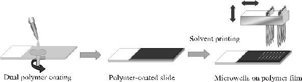

Solvent printing

Figure 1A shows a low-resolution image of an array of 2904 wells fabricated on polystyrene coated glass slide (rhodamine (0.005% w/v) was dissolved in the mixture of solvents to allow fluorescent analysis of microwell formation). Figure 1B gives an SEM image of a small section of an array of microwells with a diameter of 125 lm, while Figure 1C shows wells with a diameter of 280 lm at an angle of 70° offering a clearer view of the internal morphology of the microwells.

Dual polymer coating Polymer-coated slide Microwells on polymer film

Scheme 1. General process of polymer microwell fabrication by contact printing.

|      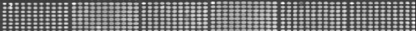  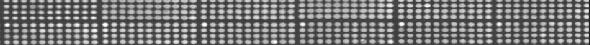  |
|---|

To elucidate the 3D structure of the wells, a MicroXam Surface Mapping Interferometric Microscope was utilized (Fig. 3 and 4). Microwells fabricated on a 1.2 lm thick PS coated film gave wells with significant rim, however upon increasing the film thickness of the PS (2.4 lm) the shape, size and morphology of the microwells dramatically changed (Fig. 3C and D and Fig. 4) to give wells with a much sharper shape, with no appreciable rim observed.

(A) 4.5 mm

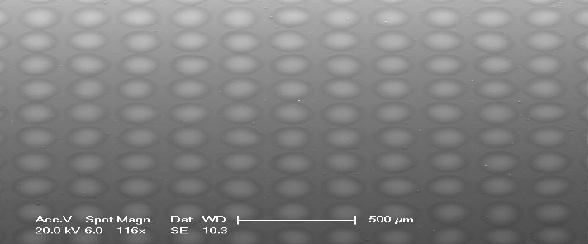

The physical phenomena of microwell fabrication via contact printing of solvents onto polymer film are very different to conventional photolithography, soft-lithography and etching processes. In this case the material is not removed from the substrate by a bulk flow of solvent but is transferred locally from the center region of the microwell to the edge and can be explained by a micro-fluidic flow which has been proposed to explain the formation of a “ring-shaped coffee stain” from a drop of solution onto a solid surface.[27,29] Thus the hypothesis is that the solvent deposited on the polymer surface cause the substrate locally to soften and to dissolve. However, because the evaporation rate of solvent is higher at the edge region than that in the center polymer is transported to the rim of the drop causing a ‘pileup’ at the edge which creates the 3D microstructures seen in Figure 3A and B. However this cannot be the total picture as wells that have essentially no rim can also be generated, as shown in Figure 3C and D and Figure 4. The observed differences in shape of wells with the variation of film thickness could be explained by looking at the physical processes taking place during deposition. Firstly bulk effects are likely to be more important with the thicker film and thus interfacial interactions between PS and chitosan, and PS and air will

- (B)

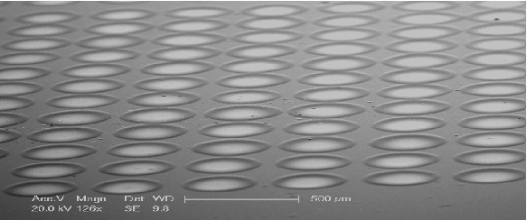

- (C)

- Figure 1. Images of the fabricated microwell arrays. A) Low-resolution image obtained using a BioAnalyzer 4F/4S white light fluorescent-based scanner showing an array of 600 wells/cm2 (PS film thickness = 2.4 lm, printing pin diameter 150 lm). B) SEM of a microwell array at an angle of 0° with 2032 wells/cm2 (PS film thickness = 1.2 lm, printing pin diameter 100 lm). C) SEM image of a microwell array at a 70° angle with 490 wells/cm2 (PS film thickness = 1.2 lm, printing pin diameter 150 lm).

1 stamp 2 stamps 3 stamps

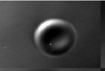

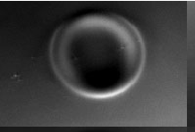

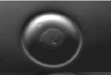

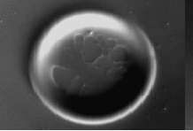

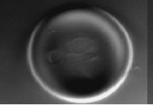

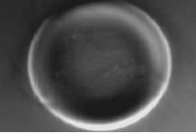

4 stamps 5 stamps 6 stamps (A)

200 µm

350

|(B) Pin diameter 150µm  PS film (1.2 µm)  PS film (2.4 µm) |
|---|

300

250

µDiameter (m)

200

150

100

50

0 2 4 6 8 10 12

Number of Stamps

2.5

|(C) Pin diameter 150 µm  PS film (1.2 µm)  PS film (2.4 µm) |
|---|

2.0

µDepth (m)

1.5

1.0

0.5

0.0

0 2 4 6 8 10 12

Number of Stamps

- Figure 2. A) Variation in microwell size as a function of the number of solvent stamps printed onto the substrate (PS thickness =1.2 lm; images were captured using a LEICA DM IRB microscope). B,C) The diameter and depth of the wells, respectively (determined via ADE Phase Shift using a MicroXAM) were plotted as a function of the number of solvent stamps printed.

be different, secondly the molecular mobility and packing will become more restricted in the case of thicker films and thirdly the stamping process itself may contribute to the well shape by deeper deposition within the deeper (thicker coating) well.

With the aim of exploring the capture of suspension cells within the 3D microstructures, multi-stamp microwell slides were fabricated. The bottom of each well was exposed chitosan thereby facilitating cell binding (chitosan is a well-known biomaterial which has been used for cell capture due to the presence of amino groups). K562 suspension cells, were incubated on the arrays for 120 hours and were clearly viable after one week as demonstrated by a trypan blue assay.[30] As shown in Figure 5 single layers of human leukemia K562 cells bound exceptionally well, displaying excellent cell viability, within the microwells and with no binding taking place outside the wells. Although cells were seeded and grown at various concentrations and times, only monolayers of

cells were observed within the microwells presumably a consequence of the chitosan surface layer, a result which contrasts with the typical behavior of non-adherent cells. It was also possible to control the number of cells binding by varying the dimensions of the microwell (see Supporting Information).

In conclusion, we have demonstrated the practical and highthroughput fabrication of microarrays of microwell by contact printing. This method provides a versatile and high-throughput approach to the generation of arrays with up to 12800 features on a traditional microscopic slide. The fabrication process is easily controllable, allows the generation of different sizes and depths of wells, while allowing each well to be individually addressable. This platform was used successfully to capture and micro-pattern, K562 suspension cells, with the number of cells cleanly controlled by varying the dimensions of the microwells (see supporting information). The ability to constrain cell growth in 3D environment will have several applications, in-

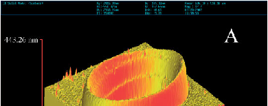

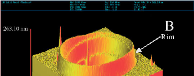

Rim

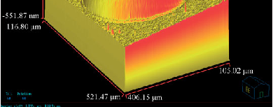

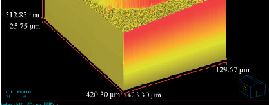

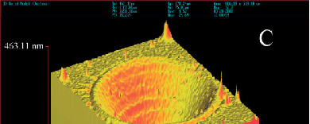

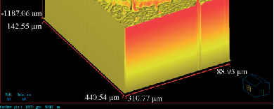

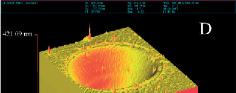

- Figure 3. 3D images of single microwells fabricated on PS films. A,B) Generated using 4 solvent stamps on a 1.2 lm PS film with solid pins of a diameter of 150 lm (K2783) or 100 lm (K2784), respectively. C,D) generated using 4 solvent stamps on a 2.4 lm PS film with solid pins of a diameter of 150 lm (K2783) or 100 lm (K2784), respectively.

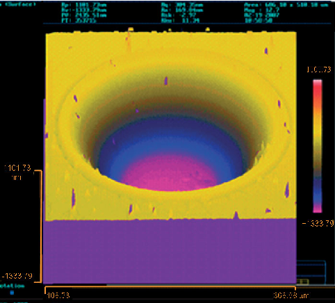

- Figure 4. A single microwell fabricated on a PS film (2.4 lm thickness) by stamping acetophenone/ethyl acetate 8 times with a 150 lm diameter solid pin (K2783).

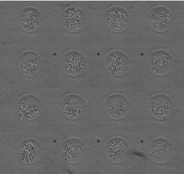

Figure 5. Bright field images of a mosaic of microwells hosting K562 suspension cells. Images were captured using a Nikon microscope equipped with the Pathfinder software (IMSTAR S.A., Paris, France).

cluding enabling the efficient and reproducible culture of undifferentiated cells, and high-throughput screening while the ability to individually address wells (by contact on inkjet printing) provides the basis for well based control of transfection.

## –

Experimental

- [1] J. Aizenberg, A. J. Black, G. M. Whitesides, Nature 1999, 398, 495.
- [2] S. I. Stupp, P. V. Braun, Science 1997, 277, 1242.
- [3] J. C. Love, J. L. Ronan, G. M. Grotenbreg, A. G. van der Veen, H. L. Ploegh, Nat. Biotechnol. 2006, 24, 703.
- [4] J. C. Mohr, J. J. de Pablo, S. P. Palecek, Biomaterials 2006, 27, 6032.
- [5] J. Hyun, A. Chilkoti, J. Am. Chem. Soc. 2001, 123, 6943.
- [6] H. Kim, R. E. Cohen, P. T. Hammond, D. J. Irvine, Adv. Funct. Mater. 2006, 16, 1313.
- [7] J. Fukuda, A. Khademhosseini, Y. Yeo, X. Yang, J. Yeha, G. Eng, J. Blumling, C.-F. Wang, D. S. Kohane, R. Langer, Biomaterials 2006, 27, 5259.
- [8] D.-G. Choi, S. G. Jang, H. K. Yu, S. M Yang, Chem. Mater. 2004, 16, 3410.
- [9] R. J. Jackman, J. L. Wilbur, G. M. Whitesides, Science 1995, 269, 664.
- [10] E. Kim, Y. Xia, G. M. Whitesides, Nature 1995, 376, 581.
- [11] C.-T Chen, F.-G. Tseng, C.-C. Chieng. Sens. Actuators A 2006, 130– 131, 12.
- [12] J. Li, Y. Wang, Z. Lu, Z. M. Chan, Anal. Chim. Acta 2006, 571, 34.
- [13] A. Kumar, H. A. Biebuyck, G. M. Whitesides, Langmuir 1994, 10, 1498.
- [14] N. D. Kalyankar, M. K. Sharma, S. V. Vaidya, D. Calhoun, C. Maldarelli, A. Couzis, L. Gilchrist, Langmuir 2006, 22, 5403.
- [15] E. Ostuni, C. S. Chen, D. E. Ingber, G. M. Whitesides. Langmuir 2001, 17, 2828.
- [16] Z. Yang, A. M. Belu, A. Liebmann-Vinson, H. Sugg, A. Chilkoti, Langmuir 2000, 16, 7482.
- [17] C. M. Nelson, S. Raghavan, J. L. Tan, C. S. Chen, Langmuir 2003, 19(5), 1493.
- [18] T. Leong, Z. Gu, T. Koh, D. H. Gracias, J. Am. Chem. Soc. 2006, 128, 11336.
- [19] P. Jiang, Langmuir 2006, 22, 3955.
- [20] M. E. Abdelsalam, P. N. Bartlett, J. J. Baumberg, S. Coyle, Adv. Mater. 2004, 16, 90.
- [21] F. Sun, W. Cai, Y. Li, B. Cao, Y. Lei, L. Zhang, Adv. Funct. Mater. 2004, 14, 283.
- [22] S. A. Jenekhe, X. L. Chen, Science 1999, 283, 372.
- [23] M. Srinivasarao, D. Collings, A. Philips, S. Patel, Science 2001, 292, 79.
- [24] D. Sun, A. E. Riley, A. J. Cadby, E. K. Richman, S. D. Korlann, S. H. Tolbert, Nature 2006, 44, 1126.
- [25] M. Park, C. Harrison, P. M. Chaikin, R. A. Register, D. H. Adamson, Science 1997, 276, 1401.
- [26] Z. Li, W. Zhao, Y. Liu, M. H. Rafailovich, and J. Sokolov, K. Khougaz, A. Eisenberg, R. B. Lennox, G. Krausch, J. Am. Chem. Soc. 1996, 118, 10892.
- [27] S. Karabasheva, S. Baluschev, K. Graf, Appl. Phys. Lett. 2006, 89, 031110.
- [28] E. Bonaccurso, H.-J. Butt, B. Hankeln, B. Niesenhaus, K. Graf, Appl. Phys. Lett. 2005, 89, 124101.
- [29] R. D. Deegan, O. Bakaljin, T. F. Dupont, G. Huber, S. R. Nagel, T. A. Witten, Nature 1997, 389, 827.
- [30] H. J. Phillips, J. E. Terryberry, Exp. Cell Res. 1957, 13, 341.

Microwell Fabrication: Chitosan (Mw∼300 kDa) and polystyrene (PS) (Mn∼140,000 and Mw∼230 kDa) were purchased from Aldrich. Prior to coating, the glass slides (obtained from Fisher Scientific, Silane-Prep), were treated with oxygen plasma (Europlasma) for 20 min to clean the surface. These slides were then coated at 1500 rpm for 6 s with 1% chitosan (in 2% aqueous acetic acid) using a spin coater (Model: P6708, Speedlines Technologies, IN, USA) and dried for sixteen hours under vacuum at 40°C, and subsequently these slides were coated with PS either 5% (w/v) or 10 % (w/v) in toluene, as above. Finally, these coated slides were dried for 24 h under vacuum at 40°C before contact printing. The microwell arrays were fabricated by contact printing (Genetix QArray mini; Hampshire, UK) with 16 aQu solid pins on the dual-layer-polymer coated slides at 15°C. Multiple stampings of solvent was carried out with a delay of 200 ms between stampings. Solvents were then allowed to evaporate from the polymer surface for at least 48 hours at 40°C before being used for cellular assays. Once the slides were dried, they were sterilized by exposure to UV irradiation for 20 min prior to use.

Scanning Electron Microscopy: Scanning electron microscopy (Philips XL30CP SEM) was used to examine the surface morphology of the microwells. The glass slides containing the wells were covered with a thin layer of Au and glued to a metal-base specimen holder to achieve good electrical contact with the grounded electrode. The micrographs were taken at 10 kV in a secondary electron imaging mode.

A MicroXam Surface Mapping Interferometric Microscope (ADE Phase Shift – MicroXAM) was used with Map Vue Ex surface mapping software. A 3D non-contact surface mapping profiler was used to perform surface analysis and roughness. Height variations were measured with sub-nanometer accuracy, allowing establishment of surface shape, roughness and texture variations in a precise manner in a single measurement.

Cell-Based Assays: K562 cells were grown in RPMI medium supplemented with fetal bovine serum (10%), glutamine (4 mM) and antibiotics (penicillin and streptomycin, 100 units/mL). 105 cells were diluted with 5 mL of supplemented RPMI and seeded onto the microwell slides. Cultures were performed in a 5% CO2 atmosphere at 37°C and maintained in a SteriCult 200 (Hucoa-Erloss) incubator. After 3 days, media with non-immobilized cells was removed, and fresh media added. Finally, after 5 days of incubation, media was removed, cells were washed using an isotonic aqueous solution (8.1 g/L NaCl, 0.2 g/L KCl), nuclei stained with Hoechst-33342 (1 lg/mL of isotonic solution for 30 min), washed again and immersed in this solution for the analysis of the living K562 cells. Cell immobilization was checked using either a Leica or a Zeiss Axiovert 200 fluorescence microscope. Image capture and analyses were carried out using the software Pathfinder (IMSTAR S.A., Paris, France).

Received: April 5, 2007

Revised: June 22, 2007 Published online: October 16, 2007

## ______________________

