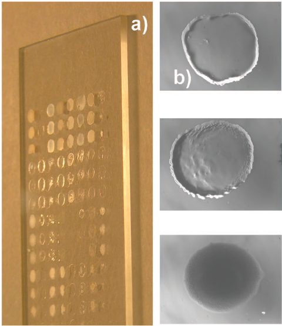
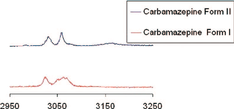
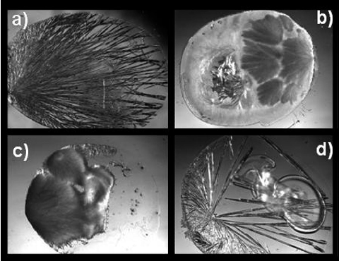
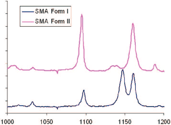
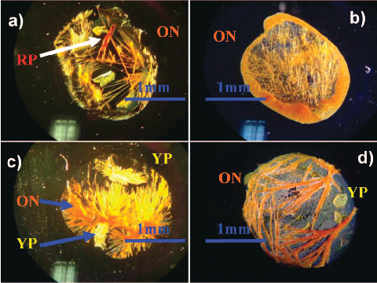
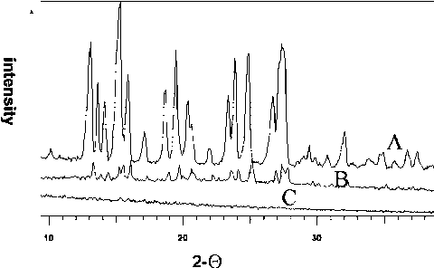

### 24 J. Comb. Chem. 2008, 10, 24–27

See https://pubs.acs.org/sharingguidelines for options on how to legitimately share published articles.

Downloaded via UNIV DE GRANADA on March 4, 2024 at 14:34:48 (UTC).

# Screening for Polymorphs on Polymer Microarrays

Albert R. Liberski,† Graham J. Tizzard,‡ Juan J. Diaz-Mochon,† Michael B. Hursthouse,‡ Phillip Milnes,† and Mark Bradley*,†

School of Chemistry, The UniVersity of Edinburgh, West Mains Road, Edinburgh EH9 3JJ, U.K., and School of Chemistry, UniVersity of Southampton, UniVersity Road, Highfield, Southampton SO17 1BJ, U.K.

ReceiVed June 29, 2007

Introduction. The way in which compounds crystallize has been the subject of study for many centuries with perhaps the most classical example relating to tartaric acid. A current focal point in this area is the phenomenon of polymorphism. This arises because of two main considerations; first in terms of patent law, new crystal forms of a solid compound can be considered as innovations and can be protected as intellectual property (this crucial issue has promoted the intense search for new polymorphs). Second, and of more practical consideration, is the fact that specific crystal forms can alter the dissolution rate of a compound,1 and thus, the pharmokinetics of any drug are partially determined by the specific crystal form, an issue that also supports the patentability of a polymorph.2,3

Many polymorphs have been discovered serendipitously, but traditional methods of discovery and selection of polymorphic forms usually involve the variation of crystallization parameters such as temperature and solvent,4 and current high-throughput screens generally rely on variation of these parameters. Examples of well-known compounds for which new polymorphic forms have been discovered, after many years of work, include maleic acid (120 years after it was first crystallized)5 and aspirin,6 confirming McCrone’s often quoted pronouncement.7 However, fewer than 5% of compounds in the Cambridge Structural Database are reported to be polymorphic,8 whereas it is known from other studies that do not provide a full structure (e.g., spectroscopic, thermal, and microscopy studies) that more than 35% of known compounds show polymorphic behavior. Therefore new developments in high-throughput platforms9 for primary polymorph screening would be a valuable tool for the discovery of, as yet, uncharacterized forms.

The substrates upon which crystals grow play a pivotal role in allowing selective growth. For example, calcium carbonate crystal growth can be easily “tuned” by interaction with different surfaces,10–12 allowing a range of specific structures to be generated. Organic compounds, however, are typically difficult to tune because their “packing” is much more temperamental.4,13 In the approach presented here,

* To whom correspondence should be addressed. Phone: +44(0) 131

650 4820. Fax: +44 (0) 131 650 6453. E-mail: Mark.bradley@ed.ac.uk. † University of Edinburgh. ‡ University of Southampton.

control over specific factors involved in the crystallization processes such as concentration and temperature were used, but the main variable was the surface upon which crystallization occurred. It is well-known that polymers can support the growth of specific types of crystals.4,13 However, the nature of the interactions between the polymer and the compound under investigation are not understood, and it is not possible to predict the specific polymorphic form generated by crystallization on a specific polymeric support. The technique described here provides a tool to better understand these types of interactions, as well as to reduce the amount of material needed to carry out a “fullpolymorphic screen”. The approach developed, related to that described by Kazarian,14 used polymer microarrays onto which solutions of small-molecules were applied and allowed to crystallize, which because of the size of the arrays, required only tiny amounts of solution. The resultant crystals underwent direct characterization on the microarray by optical and Raman microspectroscopy (Raman spectroscopy has been proven to be a valid tool to differentiate between polymorphic forms.).4 It should be noted that even though different crystal habit forms were found within the array these did not always correspond to different polymorphic forms according to Raman shifts. In general, organic materials tend to crystallize in less symmetric space groups than inorganic materials, a phenomenon which makes crystal habit a less efficient indicator of different polymorphic forms in organic materials than it is for inorganic materials.

The first step in the process consisted of fabrication of the polymer microarrays. This approach consisted of hydrophobic patterning of a glass slide into three grids, each consisting of 8 × 16 hydrophilic “features”. A specific polymer was then deposited by piezo jet-printing 800 drops of each of the polymer solutions onto a specific hydrophilic feature (each drop was ∼30 µm in diameter, and therefore, ∼0.9 µL of a 1% polymer solution was deposited, equating to approximately 9 µg of polymer per spot). The polymers used in this study were synthesized or obtained commercially (see Supporting Information for full experimental details). Two solvents were used for inkjet printing: NMP and toluene. NMP was the dominant solvent used because it efficiently dissolved the majority of the library of polymers, whereas toluene was used for the more hydrophobic polymers (see Supporting Information). Each slide thus contained three 8 × 16 grids giving a total of 128 polymer spots with the area of each spot approximately 1.76 mm2.

Three well-known and broadly studied small molecules were used in this study: carbamazepine,15–19 sulfamethoxazole,20–24 and 2-[(2-nitrophenyl)amino]-3-thiophenecarbonitrile25–29 (often termed ROY (red/orange/yellow) from the well-known colors of the different polymorphic forms).30 This choice was the result of the large number of polymorphic studies previously carried out on these compounds, which allowed us to compare our approach to previous reports.4,31,32 Mother liquors of the small molecules were printed onto the polymer

10.1021/cc700107x CCC: $40.75  2008 American Chemical Society Published on Web 01/01/2008

- Figure 1. (a) Optical image of a polymer microarray, printed on a masked 27 × 75 mm glass slide, used for polymorph seeding. (b) Image of a single polymer feature (∼1.5 mm in diameter).

- Figure 2. Analytical bands found in Raman spectra corresponding to carbamazepine (Raman details × 100 objective).

features (again 800 drops per spot, 0.9 µL, taking 1.5 s), and after solvent evaporation, the crystals remaining on the polymer spots were analyzed, initially by optical microscopy (40 min for the analysis of 128 polymers). The solvent can play two roles, passively acting as a carrier for the small molecule, or it can also play more of a role by co-dissolving the polymer. Solvent choice dictates also the evaporation rate, which also influences crystallization. Raman spectroscopy gave excellent results (Figure 2), with 10 Raman spectra (16 scans per spectra) recorded per feature (in triplicate) to ensure robust data reproducibility (with five Raman spectra recorded per minute).

The first compound analyzed was carbamazepine. There are four known polymorphic forms of carbamazepine reported in the Cambridge Structural Database, although to our knowledge form IV of carbamazepine has not been characterized by Raman spectroscopy.33,34 Following the protocol described above, polymer spots containing specific and repeatable crystal habit forms (Figures 2 and 3) were identified using Raman spectroscopy.

In the case of carbamazepine (printed in DMSO), most of the polymers supported specifically polymorphic form I, for

Figure 3. Carbamazepine crystals generated on different polymer features (a) form II on 2,5-furandione-methyl vinyl ether copolymer, (b) form I on poly(vinyl butyral), (c) form I on poly(n-butyl methacrylate), and (d) form II on vinyl chloride-acrylic acid copolymer.

example poly-N-butyl methacrylate. Vinyl chloride-acrylic acid copolymer and 2,5-furandione-methyl vinyl ether copolymer supported selectively and specifically form II. Additional characterization of the crystals obtained was undertaken using thermomicroscopy with analysis of the crystals on a hot-stage, while heating at 10 °C/min, confirming the interpretation of the Raman spectra and matching previous reports.31 These results obtained confirmed the interpretation of the Raman spectra and matched those previously reported.31 In these studies, only 27 µg of each polymer and 6.5 mg of carbamazepine were used, and two different polymorphic forms were detected.

According to the Cambridge Structural Database, four forms of sulfamethoxazole have been discovered to date and all of them have characteristic Raman shifts.4 In this case the 128 polymers were screened in triplicate under two different experimental conditions (ethanol or methanol) giving rise to 768 crystallization experiments!

With ethanol as a solvent, excellent control of crystal habit could be achieved (see Supporting Information). However closer analysis by Raman spectroscopy revealed all of the crystals were polymorphic form I, again confirming that in the case of organic compounds, crystal habit is rarely correlated with polymorphic form. If methanol was used, the results were significantly different. Raman measurements showed that on most of polymers, mixtures of form I and II were present (Figure 4). However, ethyl cellulose supported specifically form II of sulfamethoxazole, while on hydroxybutyl methyl cellulose most of the spot area was occupied by polymorphic form II, but with form I appearing on the polymer edge. Butyl methacrylate/isobutyl methacrylate copolymer and R-Zein35 supported the formation of only form I (see Supporting Information for full set of results).

Finally a challenging small-molecule, from a polymorphic study point of view, 5-methyl-2-[(2-nitrophenyl)amino]-3thiophenecarbo-nitrile (ROY), was analyzed. According to the Cambridge Structural Database, six forms of ROY have been reported to date, all of which have characteristic Raman

### 26 Journal of Combinatorial Chemistry, 2008 Vol. 10, No. 1 Reports

Figure 4. Analytical bands found in the Raman spectrum corresponding to polymorphs of sulfamethoxazole. Two polymorphs were found on the polymer array.

shifts. After a solution of ROY (in NMP/acetone) was printed onto the polymer array (see Supporting Information.) Polymorphic forms could be readily detected by bright field microscopy because the different forms of ROY have different colors. From the six known polymorphic forms, four of them were found within the array (yellow needles (YN), yellow prisms (YP), red prisms (RP), and orange needles (ON), Figure 5. For instance, acrylic acid-ethene copolymer and cellulose hydroxypropyl ether supported four polymorphic forms. Other polymers supported three types of crystals, such as poly(ethyl methacrylate) (yellow prisms, red prisms, and orange needles). Selectivity, in the case of the polymer polyacrylamide carboxyl, was better with just two forms (yellow prisms and orange needles). More selective polymers were also discovered. Thus, poly(isobutyl methacrylate) supported almost exclusively orange needle generation, but in small regions, perfectly shaped yellow prisms were detected, confirming that the polymer impact was rather subtle (see Figure 5d). One of the most selective polymers was poly(2,6-dimethyl-p-phenylene oxide), which supported the growth of only orange needles. These results were confirmed by Raman spectroscopy demonstrating the reliability of the method.

Attempts were made to characterize each of the samples using powder X-ray diffraction (PXRD), but because of the scale of the method, the PXRD response was inadequate (Figure 6).

In conclusion, a high-throughput method for studying polymorphism in small molecules has been presented. The approach uses arrays of polymers to generate or trigger different polymorphic forms. The crystal habit forms of the small molecule solids were demonstrated to be a poor indicator of polymorphic form, and Raman was a very successful technique that was used to characterize different polymorphic forms. PXRD was not suitable because of the small scale of the HT method. While the hydrophilic glass surface (control) yielded just amorphic forms in all three of the compounds studied, many of the polymers were selective in terms of triggering specific polymorphic forms and a few were very selective and specific, demonstrating the role of polymers in the crystallization process. The method is clearly an attractive alternative to screening processes previously reported.36 This method allowed three different small molecule compounds to be screened (in triplicate) with 128 polymers and required

- Figure 5. ROY crystals generated on different polymer SP (a) three polymorphic forms, red prisms, yellow prisms, and orange needles, on hydroxypropyl cellulose, (b) a single polymorph, orange needles, on poly(2,6-dimethyl-p-phenylene oxide), (c) two polymorphic forms, orange needles and yellow prisms, on polyacrylamide, carboxyl-modified, low carboxyl content, and (d) two polymorphic forms, orange needles and yellow prisms, on poly(isobutyl methacrylate).

- Figure 6. PXRD signals for carbamazepine (data collection time 3 min): (A) 12 mm spot diameter, (B) 6 mm spot diameter, and (C) 2 mm spot diameter.

just milligram quantities of compound and 27 µg of each polymer per array, while generating large numbers of polymorphic forms. Polymers triggered different polymorphic forms of small molecules in a very subtle manner, and although the materials on which crystals grow are important, as demonstrated here, there are many other influences such as solvent and control of evaporation.

Acknowledgment. We would like to thank the EPSRC and Ilika Technologies.

Supporting Information Available. Details of polymer microarray preparation, polymer synthesis, Raman data, crystal habit forms obtained, ROY preparation, PXRD sample analysis, and crystal thermal analysis. This information is available free of charge via the Internet at http:// pubs.acs.org.

## References and Notes

(1) Morissette, S. L.; Soukasene, S.; Levinson, D.; Cima, M. J.; Almarsson, Ö. Proc. Natl. Acad. Sci. 2006, 100, 2180–2184.

- (2) Yu, L. X.; Furness, M. S.; Raw, A.; Woodland Outlaw, K. P.; Nashed, N. E.; Ramos, E.; Miller, S. P. F.; Adams, R. C.; Fang, F.; Patel, R. M.; Holcombe, F. O., Jr.; Chiu, Y.; Hussain, A. S Pharm. Res. 2003, 20, 531–536.
- (3) Yu, L. X.; Ellison, C. D.; Hussain, A. S. Predicting human oral bioavailability using in silico models. In Applications of Pharmacokinetic Principles in Drug DeVelopment; Krishna, R. Ed.; Springer: New York, 2003; pp 53–75
- (4) Price, C. P.; Grzesiak, A. L.; Matzger, A. J. J. Am. Chem. Soc. 2005, 127, 5512–5517.
- (5) Day, G. M.; Trask, A. V.; Motherwell, W. D. S.; Jones, W. Chem. Commun. 2006, 1, 54–56.
- (6) Vishweshwar, P.; McMahon, J. A.; Paterson, M. L.; Zawratko, M. J. J. Am. Chem. Soc. 2005, 127, 16802–16803.
- (7) McCrone’s often quoted pronouncement is “The number of forms known for a given compound is proportional to the time and money spent in research on that compound.” See: McCrone, W. C. Polymorphism. In Physics and Chemistry of the Organic Solid State; Fox, D., Ed.; John Wiley & Sons, Inc.: New York, 1965; pp. 726–767.
- (8) Dunitz, J. D.; Bernstein, J. Acc. Chem. Res. 1995, 28, 193– 200.
- (9) Peterson, M. L.; Morissette, S. L.; McNulty, C.; Goldsweig, A.; Shaw, P.; LeQuesne, M.; Monagle, J.; Encina, N.; Marchionna, J.; Johnson, A.; Gonzalez-Zugasti, J.; Lemmo, A. V.; Ellis, S. J.; Cima, M. J.; Almarsson, Ö. J. Am. Chem. Soc. 2002, 124, 10958–10959.
- (10) Aizenberg, J.; Black, A. J.; Whitesides, G. M. J. Am. Chem. Soc. 1999, 121, 4500–4509.
- (11) (a) Han, Y.; Wysocki, L. M.; Thanawala, M. S.; Siegrist, T.; Aizenberg, J. Angew. Chem., Int. Ed. 2005, 44, 2386–2390. (b) Ichikawa, K.; Shimomura, N.; Yamada, M.; Ohkubo, N. Chem.sEur. J. 2003, 9, 3235–3241.
- (12) Aizenberg, J.; Black, A. J.; Whitesides, G. M. Nature 1999, 398, 495–498.
- (13) Lang, M.; Grzesiak, A. L.; Matzger, A. J. J. Am. Chem. Soc. 2002, 124, 14834–14835.
- (14) Chan, K. L. A.; Kazarian, G. J. Comb. Chem. 2005, 185– 189.
- (15) Cabeza, A. J. C.; Day, G. M.; Motherwell, W. D.; Jones, W. Chem. Commun. 2007, 16, 1600–1602.
- (16) Kogermann, K.; Aaltonen, J.; Strachan, C. J.; Pöllänen, K.; Veski, P.; Heinämäki, J.; Yliruusi, J.; Rantane, J. J. Pharm. Sci. 2007, 96, 1802–1820.

- (17) Wyttenbach, N.; Alsenz, J.; Grassmann, O. Pharm. Res. 2007, 24, 888–898.
- (18) Tian, F.; Sandler, N.; Aaltonen, J.; Lang, C.; Saville, D. J.; Gordon, K. C.; Strachan, C. J.; Rantanen, J.; Rades, T. J. Pharm. Sci. 2007, 96, 584–594.
- (19) Kipouros, K.; Kachrimanis, K.; Nikolakakis, I.; Tserki, V.; Malamataris, S. J. Pharm. Sci. 2006, 95, 2419–2431.
- (20) Rama, M. J. R.; López-Sánchez, M.; Ruiz-Medina, A.; MolinaDíaz, A.; Ayora-Cañada, M. J. Analyst 2005, 130, 1617–1623.
- (21) Takasuka, M.; Nakai, H. Vib. Spectrosc. 2001, 25, 197–204.
- (22) Karthikeyan, G.; Mohanraj, K.; Elango, K. P.; Girishkumar, K. Russ. J. Coord. Chem. 2006, 32, 380–385.
- (23) Göbel, A.; Thomsen, A.; Mcardell, C. S.; Joss, A.; Giger, W. EnViron. Sci. Technol. 2005, 39, 3981–3989.
- (24) Zhang, C.-L.; Wang, F.-A.; Wang, Y. J. Chem. Eng. Data 2007, 52, 1563–1566.
- (25) McKinnon, J. J.; Fabbiani, F. P. A.; Spackman, M. A. Cryst. Growth Des. 2007, 7, 755–769.
- (26) Li, H.; Stowell, J. G.; Borchardt, T. B.; Byrn, S. R. Cryst. Growth Des. 2006, 6, 2469–2474.
- (27) Smith, J. R.; Xu, W.; Raftery, D. J. Phys. Chem. B 2006, 110, 7766–7776.
- (28) Chen, S.; Xi, H.; Yu, L. J. Am. Chem. Soc. 2005, 127, 17439– 17444.
- (29) Dunitz, J. D.; Gavezzotti, A. Cryst. Growth Des. 2005, 5, 2180–2189.
- (30) Chen, S.; Guzei, I. A.; Yu, L. J. Am. Chem. Soc. 2005, 127, 9881–9885.
- (31) Grzesiak, A. L.; Lang, M.; Kim, K.; Matzger, A. J. J. Pharm. Sci. 2003, 92, 2260–2271.
- (32) Tian, F.; Zeitler, J. A.; Strachan, C. J.; Saville, D. J.; Gordon, K. C.; Rades, T. J. Pharm. Biomed. Anal. 2006, 40, 271– 280.
- (33) Lang, M.; Kampf, J. W.; Matzger, A. J. J. Pharm. Sci. 2002, 91, 1186–1190.
- (34) O’Brien, L. E.; Timmins, P.; Williams, A. C.; York, P. J. Pharm. Biomed. Anal. 2004, 36, 335–340.
- (35) Momany, F. A.; Sessa, D. J.; Lawton, J. W.; Selling, G. W.; Hamaker, S. A. H.; Willett, J. L. J. Agric. Food Chem. 2006, 54, 543–547.
- (36) Morissette, S. L.; Almarsson, Ö.; Peterson, M. L.; Remenar, J. F.; Read, M. J.; Lemmo, A. V.; Ellis, S.; Cima, M. J.; Gardner, C. R. AdV. Drug DeliVery ReV. 2004, 56, 275–300. CC700107X

