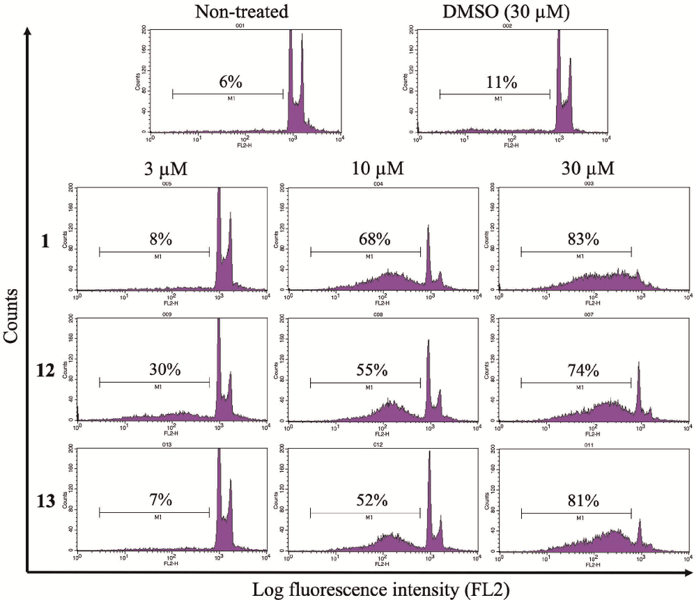
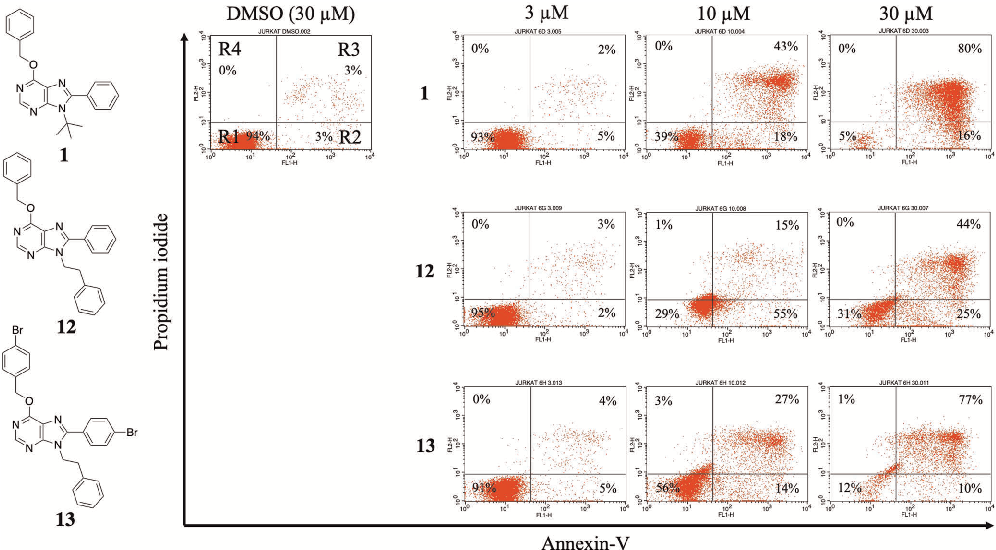
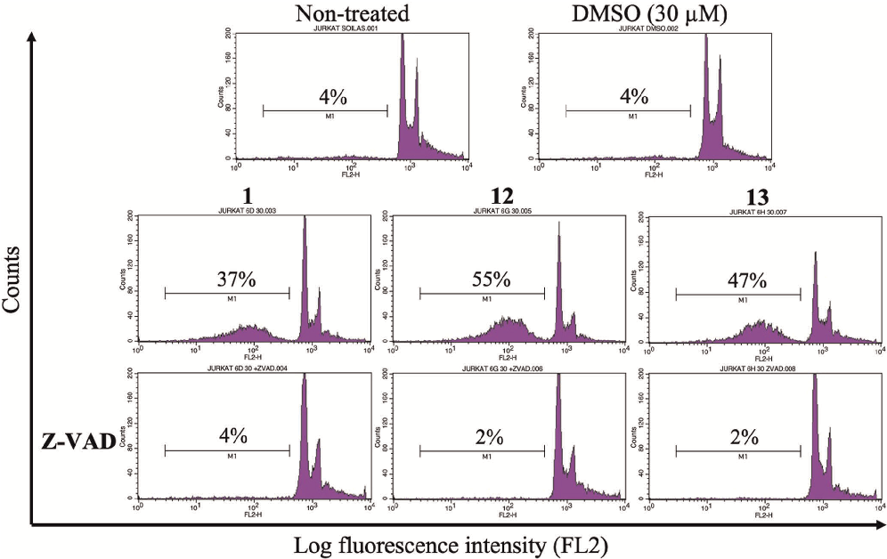

Received: 8 March 2021 | Revised: 23 April 2021 | Accepted: 22 May 2021

DOI: 10.1002/ardp.202100095

- F U L L P A P E R

# Synthesis and screening of 6‐alkoxy purine analogs as cell type‐selective apoptotic inducers in Jurkat cells

Álvaro Lorente‐Macías1,2 | Inmaculada Iañez2 | M. Carmen Jiménez‐López2 | Manuel Benítez‐Quesada1 | Sara Torres‐Rusillo2 | Juan J. Díaz‐Mochón1 | Ignacio J. Molina2 | María J. Pineda de las Infantas1

- 1Department of Medicinal & Organic Chemistry and Excellence Research Unit of “Chemistry Applied to Biomedicine and the Environment”, Faculty of Pharmacy, University of Granada, Granada, Spain
- 2Institute of Biopathology and Regenerative Medicine, University of Granada, Granada, Spain

Abstract

Purines are ubiquitous structures in cell biology involved in a multitude of cellular processes, because of which substituted purines and analogs are considered excellent scaffolds in drug design. In this study, we explored the key structural features of a purine‐based proapoptotic hit, 8‐tert‐butyl‐9‐phenyl‐6‐benzyloxy‐9H‐ purine (1), by setting up a library of 6‐alkoxy purines with the aim of elucidating the structural requirements that govern its biological activity and to study the cell selectivity of this chemotype. This was done by a phenotypic screening approach based on cell cycle analysis of a panel of six human cancer cell lines, including T cell leukemia Jurkat cells. From this study, two derivatives (12 and 13) were identified as Jurkat‐selective proapoptotic compounds, displaying superior potency and cell selectivity than hit 1.

Correspondence Sara Torres‐Rusillo, Institute of Biopathology and Regenerative Medicine, Centre for Biomedical Research, University of Granada, Avda. Del Conocimiento s/n, 18100 Granada, Spain. Email: storres@ugr.es

María J. Pineda de las Infantas, Department of Medicinal & Organic Chemistry and Excellence Research Unit of “Chemistry applied to Biomedicine and the Environment”, Faculty of Pharmacy, University of Granada, Campus de Cartuja s/n, 18071 Granada, Spain. Email: mjpineda@ugr.es

K E Y W O R D S

anticancer drugs, apoptosis, leukemia, phenotypic screening, purine analogs

Funding information Ministerio de Ciencia e Innovación, Grant/Award Number: RTC‐2017‐6620; Ministerio de Educación, Cultura y Deporte, Grant/Award Number: FPU 14/00818

#### 1 | INTRODUCTION

The purine ring system (imidazo[4,5‐d]pyrimidine) is the most abundant nitrogen‐based heterocycle in nature.[1,2] This scaffold is present in adenine and guanine, and, therefore, it is part of nucleic acids and nucleotides (AMP, GMP), which are essential molecules that regulate

cellular energy and intracellular signaling processes (ATP, GTP) and enzyme cofactors (NADH, coenzyme A).[3] The biological ubiquity of this heterocyclic ring makes it an excellent scaffold in drug design. Hence, several purine analogs have been developed for the treatment of different diseases such as leukemias, viral infections, cancer or immune disorders, and many others are currently being studied.[4–6]

This is an open access article under the terms of the Creative Commons Attribution‐NonCommercial‐NoDerivs License, which permits use and distribution in any medium, provided the original work is properly cited, the use is non‐commercial and no modifications or adaptations are made. © 2021 The Authors. Archiv der Pharmazie published by Wiley‐VCH Verlag GmbH on behalf of Deutsche Pharmazeutische Gesellschaft

Arch Pharm. 2021;e2100095. wileyonlinelibrary.com/journal/ardp | 1 of 13

https://doi.org/10.1002/ardp.202100095

Typically, purine analogs are generated by the introduction of substituents at positions C2, C6, C8, and/or N9 using different synthetic methodologies.[7,8] In this respect, our group developed a two‐step synthetic methodology that allows the preparation of purine derivatives substituted at positions C6, C8, and N9.[9] This is achieved using different 6‐chloro‐4,5‐diaminopyrimidines, alcohols, and N,N‐dimethylamides under strong basic conditions.[10,11] Additionally, the compounds generated with this procedure present an ether group attached at C6, which is a less explored structural feature in purine libraries, where C6‐aminated analogs are predominant. The initial compound series generated with this strategy led to the identification of purine 1, an antiproliferative compound that exerts its activity by strong apoptotic induction on Jurkat (acute T cell leukemia) cells.[12]

nonsubstituted purines, whereas sterically hindered N,N‐dimethyl‐ amides, such as dimethylbenzamide (DMB), led the synthesis through route B, where the alcohol provided radicals at both C6 and C8. For compounds containing the 2,5‐diamino pyrimidine core, microwave irradiation at higher temperatures was employed due to the lower reactivity of this core compared with the 5‐amino‐2‐ chloropyrimidine one. In addition to the proposed library, in those cases where DMB was used together with bulky alcohols (benzyl alcohol or 4‐bromobenzyl alcohol), the intermediate imines 12i–16i were also isolated (Table 1). Interestingly, in the preparation of the aminopurine 16, only the corresponding imine 16i was isolated.

2.2 | Pharmacology/biology

- 2 | RESULTS AND DISCUSSION

2.1 | Chemistry

Compounds 9–16, 1i, and 12i–16i were synthesized according to Scheme 1. Dichloropyrimidines 2 and 3 were substituted with different alkylamines at position C4 of the pyrimidine ring, providing intermediates 4–8. These chloropyrimidines were treated with the appropriate alcohol and an excess of the suitable N,N‐dimethylamide under strong basic conditions to simultaneously carry out a displacement at C6 and an annulation reaction, affording purine analogs 9–15. This tandem reaction was controlled by the type of N,N‐ dimethylamide used as a solvent/reagent. Thus, dimethylformamide (DMF) drove the synthesis through route A, generating C8

Cell cycle analysis was chosen as the primary screening output due to the capability of this method to identify active compounds and discriminate whether the new analogs maintain or do not maintain the proapoptotic activity of the lead molecule 1. Thus, the final compound library was tested against a panel of six human cancer cell lines (hematopoietic: Jurkat, acute T cell leukemia; K562, chronic erythroleukemia; nonhematopoietic: HeLa, cervix adenocarcinoma; G361, malignant melanoma; MDA‐MB‐231, breast adenocarcinoma, and HCT116, colorectal adenocarcinoma). Cells were treated with each compound for 48 h at a single dose (30 μM). Cells treated with 1 (30 μM) or DMSO (equivalent amount to that contained in the 30 μM dose) were used as a reference and negative control, respectively, and the cell cycle profiles were determined by flow cytometry after staining of nuclear DNA with propidium iodide (PI) as previously described.[12] The percentages of cells within the sub‐G1 region

| | |
|---|---|
| | |

SCHEME 1 Structure of compound 1 and synthesis of compounds 9–16, 1i, and 12i–16i. Reagents and conditions: (a) H2N‐R1, NaHCO3, THF, 55°C, 18 h, or n‐butanol, 190°C (MW), 2 h, 46–84%; (b) NaH, DMF, 90°C, 18 h or 150°C (MW), 4 h, 7–45%; and (c) DMB, BnOH, or

- 4‐bromobenzyl alcohol, NaH, 1,4‐dioxane, 90°C, 18 h or 150°C (MW), 4 h, 5–19%. a16 was not isolated

- TABLE 1 Compound library Scaffold X R1 R2 R3 MW cLogDa Compound Purine analogs

- 358.45 5.17 1

268.32 2.73 9

- 282.35 3.26 10

406.49 6.13 12 564.28 7.66 13

- 283.34 2.71 11

- 359.43 4.74 14

373.46 5.02 15

421.50 5.98 16b

Pyrimidine Schiff base analogs

- 360.46 5.21 1i

408.51 6.16 12i 566.30 7.70 13i

- 361.45 4.69 14i

375.48 4.97 15i 423.52 5.92 16i

aclogD values were calculated using Chemicalize by ChemAxon Ltd. at pH 7.4.[13] bNot isolated.

- FIGURE 1 Phenotypic screening of compounds 9–15, 1i, and 12i–16i by cell cycle analysis. Cells were incubated for 48 h with the indicated compounds at 30 μM, then stained with propidium iodide and cell cycles were analyzed by flow cytometry. The heatmap represents

changes in the percentage of cells within the sub‐G1 region after subtracting values from negative controls (dimethyl sulfoxide) in each cell line. Compound 1 was used as the reference

(apoptotic cells) were measured and values from negative controls (dimehthyl sulfoxide [DMSO]) were subtracted to show the variation in the apoptotic populations (Figure 1).

Extending the length and bulkiness of the substituent at R1 by the introduction of a phenethyl group afforded compounds with different cellular activities. When these analogs were not substituted in R2 (= H) and also contained alkyloxy groups at the C6 position (9 and 10), the purine analogs did not show any significant activity. In contrast, when both positions were occupied by lipophilic substituents such as the phenyl or 4‐bromophenyl group (12 and 13, respectively), a significant increment in the apoptotic populations in Jurkat cells was detected. Compound 12 showed a 64% increase in this cell line and a moderate activity over MDA‐ MB‐231 cells (23%). Meanwhile, compound 13 showed very selective activity over Jurkat cells with a sub‐G1 cell increment of 51% while being negligible against the rest of the cancer cell lines. The structural similarities between these two compounds to 1 suggest that the presence of bulky aromatic groups at C6 and C8 positions drives the apoptotic activity of these compounds toward Jurkat cells.

Compounds 11, 14, and 15 contained an amino group at the C2 position. None of these compounds showed any significant effect in the cell cycle of the lines tested. Interestingly, the C2 aminated analog of 1, compound 15, was completely inactive. This suggests that the presence of the amino group disrupts the biological interaction of 1 with its biological target.

Imines 1i and 12i–16i were tested next. These molecules were the pyrimidine Schiff base analogs of the corresponding compounds

- 1, 12–16. Among these, only the C2 aminated imine of 1, compound 15i, exhibited a notable activity, inducing a 41% increase in the sub‐

- G1 population of melanoma G361 cells, a phenotypic activity profile only seen with this derivative. Also, moderate activities were observed for compound 16i on Jurkat cells. However, apart from these two imine derivatives, none of the others showed significant activities, not even the corresponding Schiff base analogs of the highly

active Jurkat‐selective compounds 12, 13 (12i and 13i) or the parent compound 1 (1i), probably because of the different spatial arrangement and physicochemical properties of the substituents compared with the purine analogs. On the basis of the data from this phenotypic screening, compounds 12 and 13 were selected as the most active compounds and their activities were further analyzed.

A titration of the activity of the new compounds was performed by culturing the cells with 30, 10, and 3 μM for 48 h, followed by cell cycle analysis (Figure 2). Compound 12 showed a stronger capacity to induce cell death, as observed with the lowest dose of 3 μM compared to the other two compounds.

To confirm the proapoptotic nature of these two molecules, we stained the treated cells with annexin‐V, which selectively binds to the phosphatidyl serine translocated to the cell membrane during the process of apoptosis, followed by flow cytometric

- FIGURE 2 Titration of the proapoptotic activity of compounds 1, 12, and 13. Jurkat cells were treated for 48 h with the indicated doses and percentages of cells within the sub‐G1 region measured by flow cytometry after staining with propidium iodide. DMSO, dimethyl sulfoxide

- FIGURE 3 Membrane phosphatidyl serine expression after treatment of Jurkat cells with compounds 12 and 13. Jurkat cells were treated for 48 h with the indicated doses and the percentages of apoptotic cells were measured by flow cytometry after double staining with propidium iodide (PI) and annexin‐V‐FLUOS. Untreated cells (dimethyl sulfoxide [DMSO], 30 µM) and cells treated with 1 were included as negative and positive controls of apoptosis, respectively. Cell populations (gating regions): R1, viable cells (annexin‐V−/PI−); R2, early apoptotic cells (annexin‐V+/PI−); R3, late apoptotic cells (annexin‐V+/PI+); and R4, necrotic cells (annexin‐V−/PI+)

- analysis as previously described.[12] For this study, Jurkat cells were treated for 48 h with compounds 12 and 13 at 30, 10, and
- 3 μM. DMSO (30 μM) and 1 (30, 10, and 3 μM) were used as negative and positive apoptotic controls, respectively (Figure 3). As expected, untreated Jurkat cells presented a negligible apoptotic population, with the majority of cells gated within the viable cell region (R1). However, when cells were treated with compounds 12 and 13 at the indicated concentrations, a transition behavior from early (R2) to late apoptotic (R3) stages was observed. In addition, this effect was displayed in a dose–dependent manner, and these results are fully coherent with those shown in Figure 2, as compound 12 induced a significantly higher apoptosis

- as revealed in the percentages of R2 and R3 at the lowest concentration of 3 μM in both assays. Finally, no necrotic populations were detected for any of these compounds even at the highest doses. Hence, the unspecific necrotic potential of these molecules was discarded. The cellular activity displayed by compounds 12 and 13 was equivalent to that shown by the parent compound 1, suggesting that the three compounds share the same mechanism of action and that the introduction of the phenethyl group at N9 or

- 4‐bromophenyl groups at C8 and C6 positions does not affect the biological behavior of this chemotype.

To further demonstrate that the observed effect was due to the induction of apoptosis, we carried out assays where Jurkat cells were pretreated for 1 h at 37°C with the pan‐caspase inhibitor Z‐VAD‐

FMK (carbobenzoxy‐valyl‐alanyl‐aspartyl‐(O‐methyl)‐fluoromethylketone). Indicated compounds were then added for 24 h at the dose of 30 μM and subjected thereafter to cell cycle analysis (Figure 4). Whereas untreated cells showed a significant population within the sub‐G1 region, this effect was completely abrogated in Z‐VAD‐FMK‐ pretreated cells. This indicates that induction of cell death mediated by the tested compounds is fully dependent on caspase activation, a hallmark of apoptosis pathways.

Additionally, to further compare the activities of compounds 12 and 13 with the reference molecule 1, cell viability was measured on Jurkat cells using PrestoBlue™ reagent and analyzed by spectrofluorometry. Half‐maximal inhibitory concentration (IC50) values were calculated using a 9‐point half‐log dose–response study (0.78–200 μM). Table 2 shows the IC50 values obtained and the theoretically calculated cLogD values.

The two new analogs exhibited superior activities than the parent compound 1 (15.07 μM), exhibiting a direct correlation between the antiproliferative activity and their lipophilicity nature. Thus, compound 12 showed an IC50 of 9.99 μM, whereas the value for its brominated analog (13) was 7.29 μM. Therefore, even though compound 13 was found to be the most potent compound of the series on inhibition of proliferation, leading to a twofold potency increase over the parent compound 1, compound 12 was the most active in inducing apoptosis, as demonstrated by cell cycle and annexin‐V analysis. These effects were mostly restricted to Jurkat

- FIGURE 4 Caspase‐dependent Jurkat cell death induced by compounds 12 and 13. Cells were either pretreated (bottom panels) or not with the pan‐caspase inhibitor Z‐VAD‐FMK for 1 h and thereafter treated with the indicated compounds (30 µM) for 24 h. DMSO, dimethyl sulfoxide

- TABLE 2 Antiproliferative activities of compounds 1, 12, and 13 on Jurkat cells

Compound IC50 (μM)a cLogDb

|1|15.07|5.17|
|---|---|---|
|12|9.99|6.13|
|13|7.29|7.66|
|aIC50 values|determined by the PrestoBlue™ cell viability assay|after|

treating Jurkat cells with compounds 1 (reference), 12 and 13 for 5 days, nine‐dose range (0.78–200 μM). bcLogD values were calculated using Chemicalize by ChemAxon Ltd. at pH 7.4.[13]

cells, showing a marginally superior selectivity over other cancer cell lines.

#### 3 | CONCLUSION

In summary, we have prepared a library of 6‐alkoxy purine analogs aiming to further explore the previously reported proapoptotic activity of this chemotype over human cancer cells. Our screening campaign revealed that treatment with several of our analogs resulted in increments in the sub‐G1 cell population on the cell cycle,

which were particularly conspicuous for compounds 12 and 13. These effects, however, were restricted to T cell leukemia Jurkat cells, and were fully coherent with induction of apoptosis as demonstrated by annexin‐V and Z‐VAD‐FMK assays. Additionally, this study has informed the design of subsequent analogs to further enhance the cellular activity of this chemotype.[14] Follow‐on studies will aim to identify the target of the analogs to facilitate future medicinal chemistry campaigns.

4 | EXPERIMENTAL

4.1 | Chemistry

4.1.1 | General

Unless otherwise noted, reagents and solvents were obtained from commercial suppliers and were used without further purification. 1H and 13C NMR (nuclear magnetic resonance) spectra (see the Supporting Information) were obtained using Varian Innova Unity (300 MHz), Bruker Nanobay Avance III HD (400 MHz) or Bruker Avance NEO (400 or 500 MHz) spectrometers, and chemical shifts are reported in parts per million (ppm, δ) downfield from tetramethylsilane. Coupling constants (J) are reported in Hz. Spin

multiplicities are described as s (singlet), bs (broad singlet), d (doublet), t (triplet), q (quartet) and m (multiplet). High‐resolution mass spectra (HRMS) were obtained using a Waters LCT Premier XE spectrometer. Analytical thin‐layer chromatography (TLC) was performed using TLC silica gel 60 F254 plates and visualized under a UV lamp. Purifications were carried out by flash chromatography using silica gel 220−440 mesh (Sigma‐Aldrich). All compounds used in the biological experiments were over 95% pure by 1H/13C NMR. Stock solutions (100 mM) were prepared in DMSO and stored at −20°C until used.

The InChI codes of the investigated compounds, together with some biological activity data, are provided in the Supporting Information.

- 4.1.2 | General procedure for the synthesis of compounds 4 and 5

bs, NH2), and 3.01 (2H, t, J = 7.0 Hz, CH2). 13C‐NMR (101 MHz, CDCl3): δ 155.09 (C), 149.60 (CH), 142.57 (C), 138.95 (C), 128.91 (2× CH), 128.80 (2× CH), 126.72 (CH), 122.04 (C), 42.78 (CH2), and 35.54 (CH2). HRMS (ES +ve), C12H14N4Cl (M+H)+: Calculated 249.0907. Obtained 249.0902.

4.1.3 | General procedure for the synthesis of compounds 6–8

A microwave vial was charged with a 0.4 M solution of 4,6‐ dichloropyrimidine‐2,5‐diamine (3) (1 equiv.) in n‐butanol, NaHCO3 (2.5 equiv.), and the appropriate amine (5 equiv.). Then, the mixture was heated at 190°C for 2 h using microwave radiation. The mixture was diluted with dichloromethane, filtered, the solvent was removed under reduced pressure and the crude material was purified by silica gel column chromatography.

To a stirred 0.48 M solution of 5‐amino‐4,6‐dichloropyrimidine (2)

- (1 equiv.) in dry THF, NaHCO3 (2 equiv.) was added. The mixture was then heated to 55°C and at this temperature, a 1.6 M solution of the appropriate amine (2 equiv.) in THF was added dropwise. The mixture was heated at reflux for 18 h and then cooled to room temperature. The mixture was diluted with dichloromethane, filtered, the solvent was removed under reduced pressure and the crude material was purified by silica gel column chromatography.

- 5‐Amino‐4‐(tert‐butylamino)‐6‐chloropyrimidine (4) The crude product was purified via silica gel column chromatography (ethyl acetate/hexane 25%) to provide the title compound as a white solid (851.2 mg, 4.233 mmol, 46% yield). 1H‐NMR (400 MHz, CDCl3): δ 8.05 (1H, s, CH), 4.82 (2H, bs, NH2), 1.92 (1H, bs, NH), and 1.46 (9H, s, 3× CH3). 13C‐NMR (101 MHz, CDCl3): δ 158.11 (C), 152.49 (CH), 135.25 (C), 101.82 (C), 51.47 (C), and 29.86 (3× CH3). HRMS (ES

+ve), C8H14N4Cl (M+H)+: Calculated 201.0907. Obtained 201.0893.

- 5‐Amino‐6‐chloro‐4‐(phenethylamino)pyrimidine (5) The crude product was purified via silica gel column chromatography (ethyl acetate/hexane 33%) to provide the title compound as a yellow solid (1.13 g, 4.533 mmol, 50% yield). 1H‐NMR (400 MHz,

- CDCl3): δ 8.13 (1H, s, CH), 7.37 (2H, t, J = 7.2 Hz, 2× CH), 7.34–7.24

- (3H, m, 3× CH), 5.19 (1H, bs, NH), 3.88–3.78 (2H, m, CH2), 3.25 (2H,

2,5‐Diamino‐6‐chloro‐4‐(isopropylamino)pyrimidine (6)

The crude product was purified via silica gel column chromatography (ethyl acetate/hexane 66%) to provide the title compound as an off‐ white solid (189.7 mg, 0.978 mmol, 58% yield). 1H‐NMR (400 MHz, CDCl3): δ 5.39 (1H, s, CH), 4.79 (2H, bs, NH2), 4.28–4.07 (1H, m, CH), 2.66 (2H, bs, NH2), and 1.23 (6H, d, J = 6.5 Hz, 2× CH3). 13C‐NMR (126 MHz, CDCl3): δ 158.45 (C), 157.37 (C), 146.61 (C), 111.73 (C), 42.92 (CH), and 22.96 (2× CH3). HRMS (ES +ve), C7H13N5Cl (M+H)+: Calculated 202.0859. Obtained 202.0849.

2,5‐Diamino‐4‐(tert‐butylamino)‐6‐chloropyrimidine (7)

The crude product was purified via silica gel column chromatography (ethyl acetate/hexane 20–33%) to provide the title compound as a dark green solid (187 mg, 0.865 mmol, 47 yield%). 1H‐NMR (400 MHz, CDCl3): δ 5.37 (1H, bs, NH), 4.67 (2H, bs, NH2), 2.73 (2H, bs, NH2), and 1.41 (9H, s, 3× CH3). 13C‐NMR (126 MHz, CDCl3): δ 158.91 (C), 157.27 (C), 147.53 (C), 111.80 (C), 51.98 (C), and 28.97 (3× CH3). HRMS (ES +ve), C8H15N5Cl (M+H)+: Calculated 216.1016. Obtained 216.1009.

- 2,5‐Diamino‐6‐chloro‐4‐(phenethylamino)pyrimidine (8) The crude product was purified via silica gel column chromatography (ethyl acetate/hexane 33%) to provide the title compound as a yellow

solid (406.8 mg, 1.54mmol, 84% yield). 1H‐NMR (400MHz, CDCl3): δ 7.32 (2H, t, J= 7.4 Hz, 2× CH), 7.28–7.14 (3H, m, 3× CH), 5.42 (1H, bs, NH), 4.65 (2H, bs, NH2), 3.66 (2H, q, J =6.7Hz, CH2), 2.90 (2H, t, J= 6.7 Hz, CH2), and 2.65 (2H, bs, NH2). 13C‐NMR (101MHz, CDCl3): δ 159.21 (C), 157.91 (C), 148.36 (C), 139.20 (C), 128.91 (2× CH), 128.76

- (2× CH), 126.63 (CH), 111.75 (C), 42.37 (CH2), and 35.76 (CH2). HRMS (ES +ve), C12H15N5Cl (M+H)+: Calculated 264.1016. Obtained 264.1022.

- 4.1.4 | General procedure for the synthesis of compounds 1i, 9, 10, 12, 12i, 13, and 13i

A suspension of NaH (60%) in mineral oil (10 equiv.) was dissolved in a mixture cooled at 0°C constituted both from the appropriate alcohol (10 equiv.) and amide (10 equiv.). When N,N‐dimethylbenzamide was used as the amide source, dioxane was employed as a solvent. The solution was stirred at room temperature for 30 min and then at 90°C for the same time. At 90°C, the corresponding diamino pyrimidine (4, 5) (1 equiv.) dissolved in the appropriate amide (50 equiv.) was added dropwise and the mixture was heated for 18 h. The reaction mixture was quenched to pH 7 with saturated aqueous NH4Cl, extracted with dichloromethane, and washed with saturated brine. The combined organic extracts were dried over anhydrous Na2SO4, filtered, and the solvent was removed under reduced pressure. The residue was purified by silica gel column chromatography.

- 5‐(Benzylideneamino)‐6‐(benzyloxy)‐4‐(tert‐butylamino)‐ pyrimidine (1i) The crude product was purified via silica gel column chromatography (ethyl acetate/hexane 10–33%) to provide the title compound as a yellow solid (15.6 mg, 0.043 mmol, 6% yield). 1H‐NMR (300 MHz, CDCl3): δ 9.17

- (1H, s, CH), 8.15 (1H, s, CH), 7.81–7.71 (2H, m, 2× CH), 7.49–7.33 (8H, m,

- 8× CH), 6.28 (1H, bs, NH), 5.50 (2H, s, OCH2), and 1.54 (9H, s, 3× CH3). HRMS (ES +ve), C22H25N4O (M+H)+: Calculated 361.2028. Obtained 361.2041.

6‐Ethoxy‐9‐phenethyl‐9H‐purine (9)

The crude product was purified via silica gel column chromatography (ethyl acetate/hexane 33–100%) to provide the title compound as a yellow solid (50.4 mg, 0.187 mmol, 45% yield). 1H‐NMR (400 MHz, CDCl3): δ 8.60 (1H, s, CH), 7.58 (1H, s, CH), 7.37–7.24 (3H, m, 3× CH), 7.13–7.07 (2H, m, 2× CH), 4.72 (2H, q, J = 7.1 Hz, OCH2), 4.54 (2H, t, J = 7.0 Hz, CH2), 3.24 (2H, t, J = 7.0 Hz, CH2), and 1.57 (3H, t, J = 7.1 Hz, CH3). 13C‐NMR (101 MHz, CDCl3): δ 160.95 (C), 152.16 (CH), 152.05 (C), 142.15 (CH), 137.34 (C), 128.95 (2× CH), 128.77

- (2× CH), 127.17 (CH), 121.57 (C), 63.21 (CH2), 45.73 (CH2), 36.25 (CH2), and 14.61 (CH3). HRMS (ES +ve), C15H17N4O (M+H)+: Calculated 269.1402. Obtained 269.1402.

9‐Phenethyl‐6‐propoxy‐9H‐purine (10)

The crude product was purified via silica gel column chromatography (ethyl acetate/hexane 50–66%) to provide the title compound as a brown solid (24.9 mg, 0.088 mmol, 19% yield). 1H‐NMR (400 MHz, CDCl3): δ 8.54 (1H, s, CH), 7.54 (1H, s, CH), 7.31–7.18 (3H, m, 3× CH), 7.08–7.01 (2H, m, 2× CH), 4.56 (2H, t, J = 7.0 Hz, OCH2), 4.48 (2H, t, J = 7.0 Hz, CH2), 3.18 (2H, t, J = 7.0 Hz, CH2), 2.00–1.86 (2H, m, CH2), and 1.08 (3H, t, J = 7.5 Hz, CH3). 13C‐NMR (101 MHz, CDCl3): δ 161.18 (C), 152.23 (CH), 152.08 (C), 142.18 (CH), 137.36 (C), 129.02

- (2× CH), 128.84 (2× CH), 127.26 (CH), 121.51 (C), 69.01 (CH2), 45.83 (CH2), 36.32 (CH2), 22.36 (CH2), and 10.57 (CH3). HRMS (ES +ve), C16H19N4O (M+H)+: Calculated 283.1559. Obtained 283.1559.

6‐(Benzyloxy)‐9‐phenethyl‐8‐phenyl‐9H‐purine (12)

The crude product was purified via silica gel column chromatography (ethyl acetate/hexane 25%) to provide the title compound as a white solid (7.6 mg, 0.019 mmol, 5% yield). 1H‐NMR (400 MHz, CDCl3): δ 8.58 (1H, s, CH), 7.60–7.53 (2H, m, 2× CH), 7.52–7.41 (3H, m, 3× CH), 7.39–7.24 (5H, m, 5× CH), 7.21–7.13 (3H, m, 3× CH), 6.96–6.87 (2H, m, 2× CH), 5.71 (2H, s, OCH2), 4.56 (2H, t, J = 7.4 Hz, CH2), and 3.10 (2H, t, J = 7.4 Hz, CH2). 13C‐NMR (126 MHz, CDCl3): δ 161.23 (C), 158.80 (C), 154.40 (CH), 139.32 (C), 137.42 (C), 136.96 (C), 131.17 (CH), 129.89 (C), 129.12 (2× CH), 128.81 (2× CH), 128.78 (2× CH),

128.66 (2× CH), 128.34 (2× CH), 128.13 (CH), 127.85 (2× CH),

- 126.59 (CH), 111.10 (C), 68.25 (CH2), 42.36 (CH2), and 36.18 (CH2). HRMS (ES +ve), C26H23N4O (M+H)+: Calculated 407.1872. Obtained 407.1848.

- 5‐(Benzylideneamino)‐6‐(benzyloxy)‐4‐(phenethylamino)‐ pyrimidine (12i) The crude product was purified via silica gel column chromatography (ethyl acetate/hexane 20%) to provide the title compound as a brown solid (30.1 mg, 0.074 mmol, 19% yield). 1H‐NMR (500 MHz,

CDCl3): δ 9.17 (1H, s, CH), 8.19 (1H, s, CH), 7.68–7.61 (2H, m, 2× CH), 7.47–7.40 (7H, m, 7× CH), 7.40–7.35 (3H, m, 3× CH), 7.34–7.27 (3H, m, 3× CH), 6.30 (1H, bs, NH), 5.51 (2H, s, OCH2), 3.83 (2H, q, J = 6.5 Hz, CH2), and 2.97 (2H, t, J = 6.8 Hz, CH2). 13C‐NMR (126 MHz, CDCl3): δ 161.22 (CH), 158.79 (C), 154.40 (CH), 139.32 (C), 137.42 (C), 136.95 (C), 131.17 (CH), 129.89 (C), 129.12 (2× CH), 128.81 (2× CH), 128.77 (2× CH), 128.66 (2× CH), 128.34 (2× CH),

- 128.12 (CH), 127.84 (2× CH), 126.58 (CH), 111.09 (C), 68.25 (CH2), 42.37 (CH2), and 36.18 (CH2). HRMS (ES +ve), C26H25N4O (M+H)+: Calculated 409.2028. Obtained 409.2039.

6‐(4‐Bromobenzyloxy)‐8‐(4‐bromophenyl)‐9‐phenethyl‐9H‐ purine (13)

The crude product was purified via silica gel column chromatography (ethyl acetate/hexane 25%) to provide the title compound as an orange solid (15.1 mg, 0.027 mmol, 7% yield). 1H‐NMR (500 MHz,

- CDCl3): δ 8.56 (1H, s, CH), 7.58–7.54 (1H, m, CH), 7.53–7.41 (7H, m, 7× CH), 7.31–7.27 (2H, m, 2× CH), 7.20–7.14 (2H, m, 2× CH),

- 6.97–6.89 (1H, m, 1× CH), 5.02 (2H, s, OCH2), 4.56 (2H, t, J = 6.8 Hz, 2× CH), and 3.10 (2H, t, J = 6.8 Hz, 2× CH). 13C‐NMR (126 MHz,

CDCl3): δ 159.93 (C), 158.10 (C), 151.48 (CH), 137.12 (C), 136.01 (C), 135.37 (C), 133.68 (C), 131.72 (2× CH), 130.19 (C), 130.14 (2× CH),

- 129.48 (C), 129.20 (2× CH), 129.02 (2× CH), 128.66 (2× CH), 126.89 (CH), 121.86 (C), 114.93 (2× CH), 69.28 (CH2), 45.52 (CH2), and

35.58 (CH2). HRMS (ES +ve), C26H21N4OBr2 (M+H)+: Calculated 563.0082. Obtained 563.0092.

6‐(4‐Bromobenzyloxy)‐5‐[(4‐bromobenzylidene)amino]‐4‐ (phenethylamino)pyrimidine (13i)

The crude product was purified via silica gel column chromatography (ethyl acetate/hexane 25%) to provide the title compound as an orange solid (9.7 mg, 0.017 mmol, 4% yield). 1H‐NMR (400 MHz, CDCl3): δ 9.11 (1H, s, CH), 9.06 (1H, s, CH), 8.17 (1H, s, CH), 7.69–7.62 (1H, m, CH), 7.58–7.41 (5H, m, 5× CH), 7.38–7.27 (6H, m, 6× CH), 5.45 (2H, s, OCH2), 3.83 (2H, q, J = 6.5 Hz, CH2), and 2.96 (2H, t, J = 6.5 Hz, CH2). 13C‐NMR (126 MHz, CDCl3): δ 159.66 (C), 158.66 (CH), 154.57 (CH), 139.21 (C), 137.24 (C), 136.21 (C), 135.90 (C), 132.09 (2× CH), 131.81 (2× CH), 129.90 (C), 129.61 (2× CH), 129.12 (2× CH), 128.84 (2× CH), 128.38 (2× CH), 126.66 (CH), 122.18 (C), 110.83 (C), 67.50 (CH2), 42.29 (CH2), and 36.09 (CH2). HRMS (ES +ve), C26H23N4OBr2 (M+H)+: Calculated 565.0239. Obtained 565.0245.

4.1.5 | General procedure for the synthesis of compounds 11, 14, 14i, 15, 15i, 16, and 16i

A microwave vial was charged with a suspension of NaH (60%) in mineral oil (10 equiv.), N,N‐dimethylformamide (40 equiv.) and the appropriate alcohol (10 equiv.). Then, the corresponding triaminopyrimidine (6–8) (1 equiv.) dissolved in DMF (80 equiv.) was added dropwise and the mixture was heated at 150°C for 4 h using microwave radiation. When DMB was used as the amide source, dioxane was employed as a solvent. The reaction mixture was quenched to pH 7 with saturated aqueous NH4Cl, extracted with dichloromethane, and washed with saturated brine. The combined organic extracts were dried over anhydrous Na2SO4, filtered, and the solvent was removed under reduced pressure. The residue was purified by silica gel column chromatography.

2‐Amino‐6‐(benzyloxy)‐9‐isopropyl‐9H‐purine (11)

The crude product was purified via silica gel column chromatography (ethyl acetate/hexane 50–100%) to provide the title compound as a red solid (8.5 mg, 0.03 mmol, 7% yield). 1H‐NMR (500 MHz, CDCl3): δ

- 7.68 (1H, s, CH), 7.53–7.47 (2H, m, 2× CH), 7.37–7.27 (3H, m, 3× CH),

- 5.56 (2H, s, OCH2), 4.84 (2H, bs, NH2), 4.73–4.63 (1H, m, CH), and

- 1.54 (6H, d, J = 6.8 Hz, 2× CH3). 13C‐NMR (126 MHz, CDCl3): δ 161.14 (C), 159.00 (C), 153.78 (C), 137.08 (CH), 136.71 (C), 128.49 (2× CH), 128.38 (2× CH), 128.06 (CH), 116.10, 68.10 (CH2), 46.66 (CH), and 22.75 (2× CH3). HRMS (ES +ve), C15H18N5O (M+H)+: Calculated 284.1511. Obtained 284.1510.

2‐Amino‐6‐(benzyloxy)‐9‐isopropyl‐8‐phenyl‐9H‐purine (14)

The crude product was purified via silica gel column chromatography (ethyl acetate/hexane 33%) to provide the title compound

- as a brown solid (11 mg, 0.031 mmol, 6% yield). 1H‐NMR (400 MHz, CDCl3): δ 7.64–7.56 (2H, m, 2× CH), 7.58–7.42 (5H, m, 5× CH), 7.39–7.31 (3H, m, 3× CH), 5.58 (2H, s, OCH2), 4.84

- (2H, bs, NH2), 4.68–4.55 (1H, m, CH), and 1.64 (6H, d, J = 6.8 Hz,

- 2× CH3). 13C‐NMR (126 MHz, CDCl3): δ 160.95 (C), 158.20 (C), 150.34 (C), 136.81 (C), 131.74 (C), 129.74 (CH), 129.61 (2× CH), 128.68 (2× CH), 128.61 (2× CH), 128.45 (2× CH), 128.05 (CH),

- 127.13 (C), 116.15 (C), 68.02 (CH2), 49.31 (CH), and 21.16 (2× CH3). HRMS (ES +ve), C21H22N5O (M+H)+: Calculated 360.1824. Obtained 360.1820.

- 2‐Amino‐5‐(benzylideneamino)‐6‐(benzyloxy)‐4‐(isopropylamino)‐ pyrimidine (14i) The crude product was purified via silica gel column chromatography (ethyl acetate/hexane 33%) to provide the title compound as a yellow solid (29.9 mg, 0.083 mmol, 16% yield). 1H‐NMR (400 MHz,

- CDCl3): δ 9.10 (1H, s, CH), 7.73–7.65 (1H, m, CH), 7.47–7.27 (9H, m,

- 9× CH), 6.22 (1H, bs, NH), 5.43 (2H, s, OCH2), 4.84 (2H, bs, NH2), 4.32–4.19 (1H, m, CH), and 1.27 (6H, d, J = 6.5 Hz, 2× CH3). 13C‐NMR (126 MHz, CDCl3): δ 160.51 (C), 155.24 (CH), 141.04 (C), 138.48 (C), 137.29 (C), 134.60 (C), 129.94 (CH), 128.68 (2× CH), 128.58 (CH),

- 127.96 (CH), 127.82 (CH), 127.76 (CH), 127.55 (CH), 127.11 (2× CH),

103.59 (C), 67.78 (CH2), 42.56 (CH), and 23.38 (2× CH3). HRMS (ES +ve), C21H24N5O (M+H)+: Calculated 362.1981. Obtained 362.1978.

2‐Amino‐6‐(benzyloxy)‐9‐(tert‐butyl)‐8‐phenyl‐9H‐purine (15)

The crude product was purified via silica gel column chromatography (ethyl acetate/hexane 20%) to provide the title compound as a brown solid (10.7 mg, 0.029 mmol, 7% yield). 1H‐NMR (400 MHz, CDCl3): δ 7.58–7.25 (10H, m, 10× CH), 5.54 (2H, s, OCH2), 4.79 (2H, bs, NH2), and 1.58 (9H, s, 3× CH3). 13C‐NMR (101 MHz, CDCl3): δ 161.04 (C), 157.69 (C), 150.44 (C), 136.76 (C), 135.52 (C), 130.20 (2× CH), 129.22 (CH), 128.73 (2× CH), 128.42 (2× CH), 128.04 (CH),

- 127.88 (2× CH), 127.14 (C), 115.92 (C), 68.00 (CH2), 60.10 (C), and 30.88 (3× CH3). HRMS (ES +ve), C22H24N5O (M+H)+: Calculated 374.1981. Obtained 374.1965.

2‐Amino‐5‐(benzylideneamino)‐6‐(benzyloxy)‐4‐(tert‐butylamino)‐ pyrimidine (15i)

The crude product was purified via silica gel column chromatography (ethyl acetate/hexane 20%) to provide the title compound as a yellow solid (7.3mg, 0.019 mmol, 5% yield). 1H‐NMR (500MHz, CDCl3): δ 9.11 (1H, s, CH), 7.72–7.66 (2H, m, 2× CH), 7.48–7.30 (8H, m, 8× CH), 6.50 (1H, bs, NH), 5.45 (2H, s, OCH2), 4.69 (2H, bs, NH2), and 1.53 (9H, s, 3× CH3). 13C‐NMR (126MHz, CDCl3): δ 161.77 (C), 160.22 (C), 159.22 (C), 154.67 (CH), 138.60 (C), 137.49 (C), 129.79 (CH), 128.66 (2× CH),

- 128.54 (2× CH), 127.86 (CH), 127.77 (2× CH), 127.45 (2× CH), 103.94 (C), 67.49 (CH2), 51.41 (C), and 29.47 (3× CH3). HRMS (ES +ve), C22H26N5O (M+H)+: Calculated 376.2137. Obtained 376.2152.

- 2‐Amino‐6‐(benzyloxy)‐9‐phenethyl‐8‐phenyl‐9H‐purine (16) The crude product was purified via silica gel column chromatography (ethyl acetate/hexane 25%) to provide the title compound as an

orange solid (traces). 1H‐NMR (400 MHz, CDCl3): δ 7.51–7.47 (3H, m,

- 3× CH), 7.41 (2H, d, J = 7.2 Hz, 2× CH), 7.38–7.32 (4H, m, 4× CH),

- 7.31–7.27 (2H, m, 2× CH), 7.20–7.17 (2H, m, J = 5.1, 2.0 Hz, 2× CH),

- 6.97–6.93 (2H, m, 2× CH), 5.58 (2H, s, OCH2), 4.70 (2H, bs, NH2), 4.36 (2H, t, J = 7.6 Hz, CH2), and 3.04 (2H, t, J = 7.6 Hz, CH2). 13C‐NMR (101 MHz, CDCl3): δ 160.68 (C), 158.73 (C), 156.00 (C), 137.88 (C), 136.94 (C), 130.41 (C), 129.57 (CH), 129.16 (2× CH),

- 128.87 (2× CH), 128.70 (2× CH), 128.66 (CH), 128.62 (2× CH),

- 128.54 (2× CH), 128.44 (2× CH), 127.68 (CH), 126.81 (C), 115.22 (C), 68.00 (CH2), 46.27 (CH2), and 45.23 (CH2). HRMS (ES +ve), C26H23N5ONa (M+Na)+: Calculated 444.1800. Obtained 444.1814.

2‐Amino‐5‐(benzylideneamino)‐6‐(benzyloxy)‐4‐(phenethylamino)‐ pyrimidine (16i)

The crude product was purified via silica gel column chromatography (ethyl acetate/hexane 25%) to provide the title compound as a yellow solid (21.1 mg, 0.05 mmol, 14% yield). 1H‐NMR (400 MHz, CDCl3): δ 9.08 (1H, s, CH), 7.62–7.54 (2H, m, 2× CH), 7.45–7.25 (12H, m, 12× CH), 7.21–7.13 (1H, m, CH), 6.47 (1H, bs, NH), 5.44 (2H, s, OCH2), 5.20 (2H, bs, NH2), 3.75 (2H, q, J = 6.7 Hz, CH2), and

- 2.92 (2H, t, J = 6.7 Hz, CH2). 13C‐NMR (101 MHz, CDCl3): δ 160.62 (C), 158.99 (C), 153.98 (CH), 140.13 (C), 139.73 (C), 138.73 (C), 137.56 (C), 129.65 (CH), 129.11 (2× CH), 128.75 (2× CH), 128.57 (2× CH), 127.85 (2× CH), 127.70 (2× CH), 127.50 (2× CH), 127.18 (CH), 126.43 (CH), 103.47 (C), 67.58 (CH2), 45.85 (CH2), and 42.27 (CH2). HRMS (ES +ve), C26H26N5O (M+H)+: Calculated 424.2137. Obtained 424.2140.

1% L‐glutamine (Gibco) and incubated at 37°C under 5% CO2. Cell cultures were split at 60–80% confluence. Suspension cells were centrifuged (1500 rpm, 5 min). Cell pellets were resuspended in supplemented RPMI growth media, seeded at a dilution factor of 1:10 (T75–15 ml) and incubated until 60–80% confluence was achieved. Adherent cells were washed with PBS (T75–10 ml) and trypsinized (Trypsin: T75–1 ml, 5 min, 37°C). Trypsin was inactivated with supplemented DMEM growth media (9 ml) and centrifuged (1500 rpm, 5 min). Cell pellets were resuspended in supplemented DMEM growth media, seeded at a dilution factor of 1:10, unless otherwise stated, in the same media (T75–15 ml) and incubated until 60–80% confluence was achieved.

- 4.2.2 | Cell cycle analysis

For the analysis of cell cycle, 250,000 cells/well (Jurkat, K562), 200,000 cells/well (G361), and 150,000 cells/well (MDA‐MB‐231, HCT116) in 24‐well plates or 50,000 cells/well (HeLa) in six‐well plates were cultured in 500 µl (24‐well) or 1.5 ml (six‐well) of the appropriate media and incubated with the chosen compounds at 30 µM for 48 h. Untreated cells were incubated with the maximum DMSO concentration used. Cell cycles were analyzed by staining of cells with PI staining. Thus, after treatment with the corresponding compounds, the cells were collected and washed with 2 ml phosphate‐buffered saline (PBS) at 4°C and fixed with 100 µl of PBS and 900 µl of 70% ethanol on ice for 5 min. After washing with PBS, cells were resuspended in 250 µl of PBS and another 250 µl of a DNA extraction buffer (0.2 M Na2HPO4, 0.1 M C6H8O7, pH 7.8) and incubated at 37°C for 10 min. The supernatant was removed and 200 µl of the staining solution (8 µl PI [1 mg/ml] and 2 µl RNAse 100 [µg/ml]) was added and the samples were incubated for 10 min at 37°C in the dark. Fluorescence was measured in the FL2 detector of the FACSCalibur cytometer (Becton Dickinson & Co.) and the analysis of the sub‐G1 population (apoptotic cells) was done using Cell Quest software (BD Biosciences).

- 4.2.3 | Annexin‐V staining

4.2 | Pharmacological/biological assays

- 4.2.1 | Cell subculture

Jurkat (acute T cell leukemia) and K562 (chronic myelogenous leukemia) cell lines were grown in T75 flasks in Roswell Park Memorial Institute (RPMI) 1640 medium (BioWhittaker) with 10% fetal bovine serum (Gibco), 1% L‐glutamine (Gibco), and incubated

- at 37°C under 5% CO2. HeLa (cervical cancer), G361 (malignant melanoma), MDA‐MB‐231 (breast cancer), and HCT116 (colon cancer) cell lines were grown in T75 flasks in Dulbecco's Modified Eagle Medium (DMEM) with 10% fetal bovine serum (Gibco) and

For the analysis of phosphatidyl serine exposure, Jurkat cells (250,000 cells/well) were cultured in 24‐well plates in 500 µl of supplemented RPMI medium and incubated with the chosen compounds at the indicated doses for 48 h at 37°C and 5% CO2. Etoposide was used as the positive control and untreated cells were used as controls of live cells. After treatment, cells were collected and washed with annexin V binding buffer (10 mM HEPES pH 7.4, 140 mM NaCl, 2.5 mM CaCl2) and resuspended in 100 µl of this buffer. Then, 2.5 µl of annexin‐V‐FLUOS solution (Roche) was added to each sample, followed by incubation for 20 min in the dark at room temperature. After a final wash, the pellet was resuspended in annexin V binding buffer containing 10 µl of PI at 10 µg/ml. Stained samples were immediately analyzed by flow cytometry using a

FACSCalibur flow cytometer and analyzed using Cell Quest software.

- 4.2.4 | Z‐VAD‐FMK treatment

For the study of the induction of caspase‐dependent cell death, Jurkat cells (200,000 cells/well) were cultured in 24‐well plates in 500 µl of supplemented RPMI medium and incubated with Z‐VAD‐ FMK (50 µM) for 1 h at 37°C and 5% CO2. Thereafter, cells were treated with the chosen compounds (30 µM) and incubated for 24 h at 37°C and 5% CO2. 6d and DMSO were used as positive and negative controls, respectively. Cell cycles were analyzed by staining of cells with PI staining. Thus, after treatment with the corresponding compounds, the cells were collected and washed with 2 ml of phosphate‐buffered saline (PBS) at 4°C and fixed with 100 µL of PBS and 900 µl of 70% ethanol on ice for 5 min. After washing with PBS, cells were resuspended in 250 µl of PBS, and another 250 µl of a DNA extraction buffer (0.2 M Na2HPO4, 0.1 M C6H8O7, pH 7.8) and incubated at 37°C for 10 min. The supernatant was removed and 200 µl of the staining solution (8 µl PI [1 mg/ml] and 2 µl RNAse 100 [µg/ml]) was added and the samples were incubated for 10 min at 37°C in the dark. Fluorescence was measured in the FL2 detector of the FACSCalibur cytometer (Becton Dickinson & Co.) and the analysis of the sub‐G1 population (apoptotic cells) was done using Cell Quest software (BD Biosciences).

- 4.2.5 | Dose–response cell viability assays

Hematopoietic cells (Jurkat and K562): Compounds, including DMSO, were prepared as intermediate solutions at 2× in supplemented RPMI medium. The compounds were then added in serial dilution in 96‐well flat‐bottomed plates to give a final volume of 50 μl/well. Then, 50 µl of a previously prepared supplemented RPMI medium at 1000 cells per well (Jurkat, K562) was added to each well and the plates were incubated for 5 days in an incubator at 37°C and 5% CO2. The final compound concentration ranged from 0.05 to 200 μM. Untreated cells were incubated with the maximum DMSO concentration used (0.2% v/v). After 5 days, PrestoBlue™ cell viability reagent (10 µl) was added to each well and the plates were incubated for 90–120 min. Fluorescence emission was detected using a Synergy™ HTX Multi‐Mode Microplate Reader (excitation 530/20 nm, emission 590/35 nm).

Nonhematopoietic (G361, MDA‐MB‐231, HCT116, HeLa): Cells were seeded in 96‐well flat‐bottomed plates at 500 cells/well (G361 and HCT116 cells), 1000 cells/well (HeLa cells) and 2000 cells/well (MDA‐MB‐231 cells) in 50 μl of supplemented medium and incubated for 24 h in an incubator at 37°C and 5% CO2. After 24 h, the medium was aspirated from each well and replaced with 100 μl of fresh medium. Compounds, including DMSO, were prepared as intermediate solutions at 2× in supplemented DMEM medium. Then, compounds were added in serial dilution to give a final volume of

100 μl/well. The final compound concentration ranged from 0.05 to 200 μM. Untreated cells were incubated with the maximum DMSO concentration used (0.2% v/v). After 5 days, PrestoBlue™ cell viability reagent (10 µl) was added to each well and the plates were incubated for 90–120 min. Fluorescence emission was detected using an Envision® fluorescence plate reader (excitation 530/20 nm, emission 590/35 nm).

All conditions were normalized to the untreated cells (100%) and curves were fitted using a four‐parameter logistic fit with the minimum value constrained to zero using GraphPad Prism software to calculate half‐maximal inhibitory concentration (IC50) values. IC50 values are expressed as the mean of three independent experiments.

4.3 | cLogD determinations

Calculated distribution coefficients (clogD) were determined using Chemicalize by ChemAxon Ltd.[13] at the pH of 7.4.

ACKNOWLEDGMENTS

Álvaro Lorente‐Macías acknowledges support from the Spanish MECD (FPU 14/00818). This study was supported by grant RTC‐ 2017‐6620 from the Spanish Ministry of Science and Innovation. Funding for open access charge: Universidad de Granada/CBUA.

CONFLICT OF INTERESTS The authors declare that there are no conflicts of interest.

ORCID Álvaro Lorente‐Macías http://orcid.org/0000-0001-9510-714X María J. Pineda de las Infantas http://orcid.org/0000-00020617-6408

REFERENCES

- [1] H. Rosemeyer, Chem. Biodivers. 2004, 1, 361. https://doi.org/10. 1002/cbdv.200490033
- [2] M. E. Welsch, S. A. Snyder, B. R. Stockwell, Curr. Opin. Chem. Biol. 2010, 14, 347. https://doi.org/10.1016/j.cbpa.2010.02.018
- [3] A. M. Pedley, S. J. Benkovic, Trends Biochem. Sci. 2017, 42, 141. https://doi.org/10.1016/j.tibs.2016.09.009
- [4] C. Benson, J. White, J. de Bono, A. O'Donnell, F. Raynaud, C. Cruickshank, H. McGrath, M. Walton, P. Workman, S. Kaye, J. Cassidy, A. Gianella‐Borradori, I. Judson, C. Twelves, Br. J. Cancer 2007, 96, 29. https://doi.org/10.1038/sj.bjc.6603509
- [5] E. de Clercq, J. Med. Chem. 2019, 62, 7322. https://doi.org/10.1021/ acs.jmedchem.9b00175
- [6] S. Sharma, J. Singh, R. Ojha, H. Singh, M. Kaur, P. M. S. Bedi, K. Nepali, Eur. J. Med. Chem. 2016, 112, 298. https://doi.org/10. 1016/j.ejmech.2016.02.018
- [7] C. R. Coxon, E. Anscombe, S. J. Harnor, M. P. Martin, B. Carbain,

- B. T. Golding, I. R. Hardcastle, L. K. Harlow, S. Korolchuk,
- C. J. Matheson, D. R. Newell, M. E. M. Noble, M. Sivaprakasam, S. J. Tudhope, D. M. Turner, L. Z. Wang, S. R. Wedge, C. Wong, R. J. Griffin, J. A. Endicott, C. Cano, J. Med. Chem. 2017, 60, 1746. https://doi.org/10.1021/acs.jmedchem.6b01254

- [8] N. S. Gray, S. Kwon, P. G. Schultz, Tetrahedron Lett. 1997, 38, 1161. https://doi.org/10.1016/S0040-4039(97)00014-2

- [9] Á. Lorente‐Macías, M. Benítez‐Quesada, I. J. Molina, A. Unciti‐Broceta, J. J. Díaz‐Mochón, M. J. Pineda de las Infantas Villatoro, Magn. Reson. Chem. 2018, 56, 852. https://doi.org/10.1002/mrc.4743
- [10] P. G. Baraldi, A. U. Broceta, M. J. P. D. Las Infantas, J. J. D. Mochun, A. Espinosa, R. Romagnoli, Tetrahedron 2002, 58, 7607. https://doi. org/10.1016/S0040-4020(02)00867-0
- [11] M. J. Pineda De Las Infantas Y Villatoro, J. D. Unciti‐Broceta, R. Contreras‐Montoya, J. A. Garcia‐Salcedo, M. A. G. Mezo, A. Unciti‐Broceta, J. J. Diaz‐Mochon, Sci. Rep. 2015, 5, 2. https://doi. org/10.1038/srep09139
- [12] M. J. Pineda de las Infantas, S. Torres‐Rusillo, J.D. Unciti‐Broceta, P. Fernandez‐Rubio, M.A. Luque‐Gonzalez, M. Gallo, A. Unciti‐ Broceta, I. J. Molina, J. J. Diaz‐Mochon, Org. Biomol. Chem. 2015, 13,

5224. https://doi.org/10.1039/C5OB00230C

- [13] M. Swain, J. Chem. Inf. Model. 2012, 52, 613. https://doi.org/10. 1021/ci300046g
- [14] Á. Lorente‐Macías, Doctoral Thesis, Universidad de Granada (Granada, Spain) 2019.

SUPPORTING INFORMATION Additional Supporting Information may be found online in the supporting information tab for this article.

|How to cite this article: Á. Lorente‐Macías, I. Iañez, M. C. Jiménez‐López, M. Benítez‐Quesada, S. Torres‐Rusillo, J. J. Díaz‐Mochón, I. J. Molina, M. J. Pineda de las Infantas. Synthesis and screening of 6‐alkoxy purine analogs as cell type‐selective apoptotic inducers in Jurkat cells. Arch. Pharm. 2021, e2100095. https://doi.org/10.1002/ardp.202100095|
|---|

