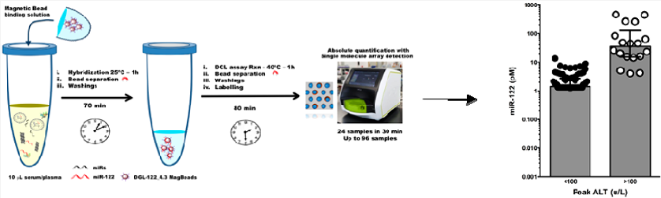
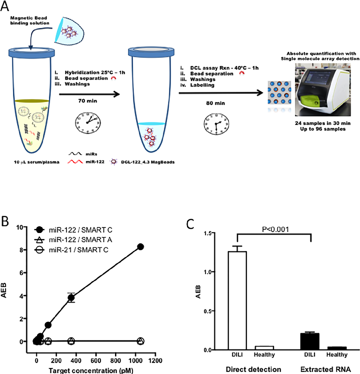
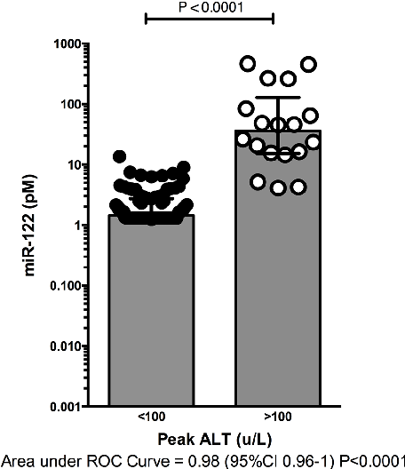
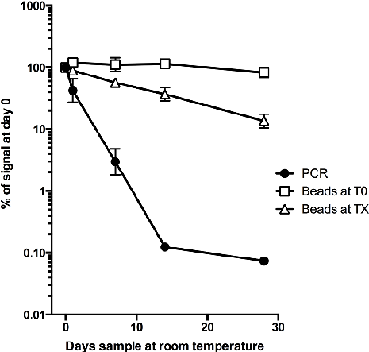
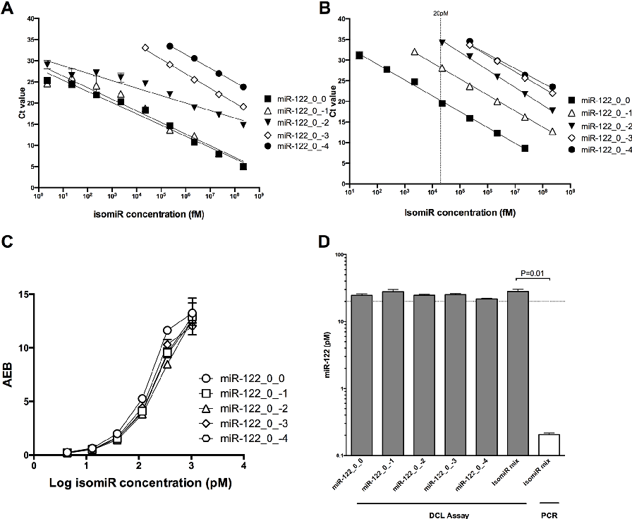

pubs.acs.org/ac Article

Direct Detection of miR-122 in Hepatotoxicity Using Dynamic Chemical Labeling Overcomes Stability and isomiR Challenges

Barbara Lopez-Longarela,́ △ Emma E. Morrison,△ John D. Tranter, Lianne Chahman-Vos, Jean-Francoiş Leonard,́ Jean-Charles Gautier, Sebastień Laurent, Aude Lartigau, Eric Boitier, Lucile Sautier, Pedro Carmona-Saez, Jordi Martorell-Marugan, Richard J. Mellanby, Salvatore Pernagallo, Hugh Ilyine, David M. Rissin, David C. Duffy, James W. Dear,* and Juan J. Díaz-Mochoń *

Cite This: https://dx.doi.org/10.1021/acs.analchem.9b05449 Read Online

See https://pubs.acs.org/sharingguidelines for options on how to legitimately share published articles.

ACCESS Metrics & More Article Recommendations *sı Supporting Information

Downloaded via UNIV DE GRANADA on January 27, 2020 at 20:11:22 (UTC).

ABSTRACT: Circulating microRNAs are biomarkers reported to be stable and translational across species. MicroRNA-122 (miR122) is a hepatocyte-specific microRNA biomarker for drug-induced liver injury (DILI). We developed a single molecule, dynamic chemical labeling (DCL) assay to directly detect miR-122 in blood. The DCL assay specifically measured miR-122 directly from 10 μL of serum or plasma without any extraction steps, with a limit of detection of 1.32 pM that enabled the identification of DILI. Testing of 192 human serum samples showed that DCL accurately identified patients at risk of DILI after acetaminophen overdose (area under ROC curve 0.98 (95% CI; 0.96−1), P < 0.0001). The DCL assay also identified liver injury in rats and dogs. The use of specific captured beads had the additional benefit of stabilizing miR-122 after sample collection, with no signal loss after 14 days at room temperature, in contrast to PCR that showed significant loss of signal. RNA sequencing demonstrated the presence of multiple miR-122 isomiRs in the serum of patients with DILI that were at low concentration or not present in healthy individuals. Sample degradation over time produced more isomiRs, particularly rapidly with DILI. PCR was inaccurate when analyzing miR-122 isomiRs, whereas the DCL assay demonstrated accurate quantification. We conclude that the DCL assay can accurately measure miR-122 to diagnose liver injury in humans and other species and can overcome microRNA stability and isomiR challenges.

## M

(paracetamol) overdose, the most common cause of druginduced liver injury (DILI) in the Western world.5 miR-122 also has potential to aid the process of preclinical and clinical drug development. This point was acknowledged by regulatory support from the US Food and Drug Administration (FDA) and the European Medicines Agency (EMA) for miR-122 to be used as an exploratory DILI biomarker in clinical trials. The clinical development of miR-122 as a biomarker has been challenged, however, because the reference interval in healthy subjects is wide when miR-122 is measured using standard

icroRNAs are nonprotein coding RNAs consisting of approximately 22 nucleotides. They have a key role in

post-transcriptional regulation of gene expression in diverse biological processes such as cell differentiation and proliferation, metabolism, and apoptosis.1 MicroRNA-122 (miR-122, miR-122-5p) is a microRNA species that is highly expressed in, and highly specific for, hepatocytes, with little to no expression in other tissues (∼40 000 copies per hepatocyte).2 In liver injury, miR-122 is released from necrotic hepatocytes, resulting in substantially elevated miR-122 concentrations in the bloodstream.3 In patients with acute liver injury, we reported that the circulating concentration of miR-122 is increased 100−1000 fold compared to controls.4 In over 1000 patients, we recently demonstrated in the Markers and Paracetamol Poisoning (MAPP) study that miR-122 is a sensitive and specific biomarker of acute liver injury after acetaminophen

Received: December 2, 2019 Accepted: January 15, 2020 Published: January 15, 2020

© XXXX American Chemical Society

A

https://dx.doi.org/10.1021/acs.analchem.9b05449 Anal. Chem. XXXX, XXX, XXX−XXX

- Figure 1. Direct detection and quantification of microRNA in serum by dynamic chemistry labeling (DCL assay) using single molecule arrays. (A) DCL protocol. (B) Plot of active enzyme per bead (AEB) against the concentration of miR-122 or miR-21 spiked into healthy human serum. The biotinylated reactive nucleobase added was cytosine (C) or adenine (A). Error bars (±1 s.d.) are generated from triplicate measurements. (C) miR122 quantification by DCL assay using the extraction-free protocol described in panel A (direct detection) or RNA extracted from serum as per PCR protocol (extracted RNA). Error bars (±1 s.d.) based on triplicate measurements. P value calculated by t-test.

PCR techniques.6 It is vital for the field to understand whether this variability is due to biological or analytical factors. Our goal has been to develop a simple and robust assay for miR122 that minimizes analytical variability.

or both, thereby increasing the complexity of correctly identifying and quantifying specific microRNA species. Specific isomiR patterns have been reported to stratify diseases, such as cancer,9 suggesting that accurate measurement of specific isomiRs may have clinical utility. At present, RNA sequencing is the only technique able to accurately detect and quantify isomiRs.

Quantification of microRNA presents unique analytical challenges that has limited their adoption as biomarkers in clinical practice. The gold standard method for quantification of circulating microRNA is RT-qPCR. Technical challenges for using PCR to measure microRNA include preanalysis degradation of the target microRNA, variability in the extraction of microRNAs from plasma or serum, matrix effects exemplified by heparin inhibition of polymerases, operator variability, and a lack of consistency across studies regarding the optimal methods used to normalize data. Furthermore, PCR requires technically skilled personnel, and is often too slow to provide the rapid turnaround results needed to inform acute clinical decision-making.

The adoption of miR-122 in clinical practice would be galvanized by the development of a simple, quantitative, and reproducible testing protocol for the detection of circulating microRNAs with single base resolution, a fast turnaround time, and operator independence. To start to address this challenge, we previously developed a PCR-free, sensitive, and specific assay for measuring microRNA.10,11 This dynamic chemical labeling (DCL) assay was based on microRNA hybridization to an abasic peptide nucleic acid probe, containing a reactive amine instead of a nucleotide at a specific position in the sequence, attached to superparamagnetic beads, followed by specific incorporation of a biotinylated reactive nucleobase. While showing promise, this approach still had the main limitation of PCR, i.e., requiring purification of miR-122 from the sample. In the work reported here, we sought to develop an

The quantification of microRNA is further complicated because multiple isoforms of differing sequence, known as isomiRs,7,8 are produced during biogenesis, rather than a single mature microRNA. isomiRs from the same precursor microRNA differ slightly in their lengths at the 5′ termini, 3′ termini,

B

assay that did not require purification of miRNA from the sample, had a simple workflow, and would allow direct detection in a range of preclinical and clinical samples. The development of this assay enabled key insights into the impact of miR-122 stability on analysis and the effect of isomiRs on quantification for different analytical techniques.

# ■ EXPERIMENTALSECTION

Materials. RNA target molecules were purchased desalted from Integrated DNA Technologies. Superparamagnetic beads (2.8-μm diameter) presenting carboxylic acid groups (Dynabeads M-270) were obtained from ThermoFisher Scientific. Streptavidin-β-galactosidase (SβG), resorufin-β-D-galactopyranoside (RGP), Simoa disks, the Simoa microplate shaker, the Simoa Washer, and SR-X reader were obtained from Quanterix Corporation. Abasic PNA probes, superparamagnetic capture probe beads (DGL-122_4.3), and biotinylated reactive cytosine nucleobase were prepared as reported elsewhere.10 Sample lysis buffer (Stabiltech Buffer) was obtained from DestiNA. Reaction buffer for the DCL reaction was 10% w/v PEG-10K, in a buffered solution of 30 mM trisodium citrate and 300 mM sodium chloride, pH adjusted to 6.0 using HCl. Concentrations of stock solutions of RNA and DNA were determined using a ThermoFisher NanoDrop1000 spectrophotometer.

Collection and Preparation of Human and Animal Samples. Patient serum samples were obtained as part of the MAPP study.5 In brief, adult patients (16 years old and over) were recruited if they fulfilled the study inclusion and exclusion criteria. Full informed consent was obtained from every participant, and ethical approval was given by the South East Scotland Research Ethics Committee and the East of Scotland Research Ethics Committee via the South East Scotland Human Bioresource. The inclusion criteria were as follows: a history of acetaminophen overdose that the treating clinician judged to warrant treatment with the antidote (intravenous acetylcysteine) as per the contemporaneous UK guidelines; the first blood sample collected within 24 h of last acetaminophen ingestion and the patient had capacity to consent. The exclusion criteria were detention under the Mental Health Act, documented cognitive impairment, inability to provide informed consent for any reason, or an unreliable overdose history. Demographic information was recorded for the study participants, and their blood sample taken at first presentation to hospital was stored at −80 °C as plasma/serum. The primary end point for the MAPP study was acute liver injury, predefined as a peak hospital stay serum alanine transaminase activity (ALT) greater than 100 U/L. Details of the rat model of drug-induced liver injury and the dogs with clinical liver disease are presented in Supporting Information.

DCL Assay. The DCL assay (Figure 1A) was performed in three steps: target capture on magnetic beads, dynamic chemical labeling, and detection using single molecule arrays (Simoa). Ten microliters of test solution (either samples or calibrators) was mixed with 25 μL of Stabiltech Buffer containing 100 000 capture beads (sequence of capture probe DGL 122_4.3 in Supporting Information Table S-1). Capture reactions were performed in wells of a 96-well microtiter plate placed on a microplate orbital shaker at 800 rpm for 1 h at 25 °C. Samples were analyzed immediately, or, in specified experiments, kept at room temperature for up to 28 days. After capture, the beads were washed three times with wash buffer, and 50 μL of 5 μM aldehyde-modified

biotinylated cytosine and 1 mM sodium cyanoborohydride in reaction buffer was added to perform the dynamic chemical labeling step (reaction scheme shown in Supporting Information Figure S-1). The microtiter plate was shaken at 800 pm at 40 °C for 1 h. Beads were washed three times and incubated with 100 μL of 25 pM SβG for 10 min at 30 °C while being shaken at 800 rpm. The beads were then washed and analyzed on the SR-X reader to determine the average enzymes per bead (AEB). The SR-X enables reading of single SβG labels on the beads using the Simoa technology.12

Stability Study Protocol. Supporting Information describes the design of the stability study. Sample analysis was performed in two laboratories: the University of Edinburgh Medical School and DestiNA Genomica (Spain). All the experiments were conducted on the same dates at the two locations with an identical blood serum sample prepared from a single blood sample taken from a patient presenting at the Royal Infirmary of Edinburgh Emergency Department in Edinburgh, with DILI due to acetaminophen overdose (ALT > 1000 U/L).

Other Methods. The methods used for conventional analysis of microRNA, such as PCR, digital droplet PCR, and sequencing, are described in Supporting Information.

# ■ RESULTSANDDISCUSSION

Analytical Performance of the DCL Assay. Figure 1A shows a schematic of the DCL assay. Beads coated with a capture probe specific to miR-122 were directly added to serum samples or calibrator solutions without any RNA extraction or amplification. After hybridization of target miR122 to the beads, a biotin group was incorporated into duplexes between the probe and miR-122 via dynamic chemical labeling as described previously.10 The biotin was then labeled with an enzyme, and single enzyme labels were counted using Simoa. The sensitivity and dynamic range of the DCL assay was evaluated using synthetic miR-122 (sequence in Table S-1) spiked into serum containing no endogenous miR-122 (Table 1). In control experiments, no signal was

Table 1. Performance Characteristics of the DCL Assaya

parameters concentration (pM) native LOD (2.5 s.d.) 1.32 LLOQ (concentration CV < 20%) 2.72 ULOQ (concentration CV < 20%) 1578 assay dynamic range (logs) 2.77

aParameters were determined from four calibration curves. LOD = limit of detection. LLOQ = lower limit of quantification. ULOQ = upper limit of quantification.

observed from samples spiked with miR-21 or from miR-122 when the biotinylated reactive nucleobase was adenine rather than the correct base (cytosine) (Figure 1B).

We compared direct detection of miR-122 in human serum (with no RNA extraction step) with our previous method that required extraction of miR-122 from the sample (Figure 1C) using serum samples from a representative DILI patient and a healthy individual. The signal from a serum sample of a DILI patient was significantly greater in the direct detection assay compared to the extraction-based assay. Furthermore, the direct detection assay produced better discrimination between DILI and healthy patients, showing a 27-fold higher signal

C

from the DILI patient compared to 6-fold following RNA extraction (Figure 1C).

Measurement of miR-122 in Human Clinical Samples Using the DCL Assay. To evaluate the direct detect DCL assay as a potential clinical diagnostic assay, we analyzed samples from the MAPP study. The MAPP study prospectively recruited patients at risk of DILI due to taking an acetaminophen overdose that required treatment with the antidote acetylcysteine. In derivation and validation cohorts, this study reported that miR-122, measured by Taqman-base PCR, predicted acute liver injury (predefined as peak ALT activity >100 U/L) at hospital presentation, with high sensitivity and specificity (area under ROC curve 0.97 (95% CI: 0.95−0.98), sensitivity 0.79 (95% CI: 0.70−0.87) at 0.95 specificity).5 In the current study, we used 192 sequential serum samples from two hospital sites in the MAPP study to determine whether miR-122 retained high sensitivity and specificity when measured using the DCL assay. Demographic and laboratory data are presented in Supporting Information Table S-2. The concentrations of miR-122 measured by DCL and PCR were correlated (Supporting Information Figure S2). Patients who subsequently developed acute liver injury could be discriminated from those patients without injury by miR-122 measurements using DCL (Figure 2). The concentration of miR-122 was higher in those study participants who developed liver injury, compared to those who did not (no

- Figure 2. Measurement of miR-122 using the DCL assay can accurately identify patients who will subsequently develop acute liver injury at first presentation to hospital after acetaminophen overdose. In 192 participants from the MAPP study, the DCL assay was used to measure serum miR-122. Acute liver injury was predefined in MAPP

- as a peak serum alanine transaminase (ALT) activity of greater than 100 U/L. Each point represents a participant, the bars represent the median, and error bars the interquartile range. Values below the LOD are reported as the LOD value (1.32 pM). The groups were compared by Mann−Whitney test and using a receiver operator characteristic (ROC) curve.

injury median 1.4 pM (IQR 0.6−2.7); acute liver injury 35.8 pM (15.3−128)). ROC analysis demonstrated that sensitivity and specificity was comparable to using PCR (area under ROC curve 0.98 (95% CI: 0.96−1), sensitivity 0.83 (95% CI: 0.59− 0.96) at 0.95 specificity).

The data from these 192 patients indicate that the DCL assay for miR-122 could be fit-for-purpose with regard to the stratification of DILI patients after acetaminophen overdose. This clinical scenario is common: in the United Kingdom alone around 50 000 patients require emergency antidote treatment every year and, despite treatment, around 3 people die every week from acetaminophen-induced acute liver failure.13,14 Currently, all patients deemed to need treatment receive the same dose of acetylcysteine, a practice which results in significant patient numbers being under- or overtreated.15 If adopted into clinical practice, the measurement of miR-122 using the DCL assay could facilitate earlier decision-making regarding both the stopping of unnecessary treatment and addition of new therapeutic agents currently being developed.

Measurement of miR-122 in Animal Samples Using the DCL Assay. MicroRNAs are conserved across species, and miR-122 accurately reports liver injury in a range of animal models.16 In a rat model of acetaminophen-induced liver injury, miR-122 concentration, determined using the DCL assay from 10 μL of plasma from rats treated with acetaminophen, was significantly higher in the treated rats compared to controls (vehicle: median 8.4 pM (IQR 6−15.3); acetaminophen: 825.1 pM (335−3365)) (Supporting Information Table S-3). miR-122 concentrations were correlated to plasma ALT and GLDH activities, and the severity of histopathological lesions in the liver (Table S-3). We also compared the concentrations determined by digital droplet PCR (ddPCR) and the DCL assay. There was a strong linear relationship between the two methods, but the concentrations determined from ddPCR were around 3 orders of magnitude lower than those from the DCL assay (Supporting Information Figure S-3). To further explore this discrepancy, three concentrations of miR-122 calibrator at 10 pM, 100 pM, and 500 pM in naivë male rat plasma were measured by ddPCR and DCL (Supporting Information Table S-4). Values obtained by ddPCR were more than 3 orders of magnitude lower than expected from the spiked concentrations, while concentrations calculated by the DCL assay were as expected. These discrepant results are likely explained by the sensitivity of the two methods to the distribution of miR-122 isomiRs (see below).

We also measured miR-122 in the serum of healthy dogs and dogs with a range of biopsy diagnosed liver diseases (n = 12 per group; Supporting Information Table S-5). Consistent with our previous published data using PCR,17 miR-122 was significantly higher in the liver disease group when measured using the DCL assay (Supporting Information Figure S-4).

miR-122 is used as a biomarker of hepatocellular injury in short-term rat toxicology studies, and its use adds benefit in detecting hepatotoxicity in this species.18 miR-122 is also a new biomarker for liver disease in dogs that is gaining traction in clinical veterinary practice.17 The data presented here indicate that the DCL miR-122 assay is suitable for detecting liver toxicity in both these species.

Stabilization of miR-122 Molecules in the DCL Assay. To explore the effect of adding DCL assay beads on the stability of miR-122, we used serum from a patient with DILI (ALT > 1000 U/L after acetaminophen overdose) that was

D

stored at room temperature, with serial measurements of miR122 by both DCL assay and PCR (Figure 3). Blood was drawn,

- Figure 3. Degradation in the measurement of miR-122 is attenuated by adding DCL beads to serum. Serum from a patient with DILI had miR-122 measured by DCL assay and PCR at day 0. The serum was then stored at room temperature with beads added at day 0, and DCL assay was performed at days 1, 7, 14, and 28 (open square: beads at T0). Alternatively, the serum was stored at room temperature, and PCR (closed circle) or DCL (open triangle) was performed with the beads added on days 1, 7, 14, or 28 (beads at TX). The data are presented as the percentage of measurement at day 0 (mean, error bars represent 95% CI, N = 3).

immediately processed to separate the serum, and then frozen

- at −80 °C. On day 0 of the experiment, the serum was thawed, and miR-122 was immediately measured in triplicate by PCR (median 1.7 pM (range 1.6−1.8)) and DCL (711 pM (686− 737)). The samples were subsequently stored at room temperature and measured using both DCL assay and PCR. When the beads were added to the serum on day 0, the measurement of miR-122 by DCL remained constant until day 28, when there was an 18% loss. By contrast, when beads were not added, there was a substantial reduction in the measured concentration of miR-122 (day 28 miR-122 PCR: 1.3 fM (0.7−1.8); DCL: 96 pM (84−111)). The reduction in miR122 was greater when PCR was used to measure miR-122, compared with bead addition/DCL on days 1−28 (day 1 reduction in miR-122 concentration: PCR assay 58%, DCL assay 11%; day 7 reduction in miR-122 concentration: PCR assay 97%, DCL assay 43%).

We believe that the stabilization of miR-122 ex vivo in the DCL assay is because the target molecules hybridize to the capture beads to form a more stable complex. The formation of a double-stranded complex between the target RNA and PNA probe protects the target molecule from both enzymatic19 and autohydrolysis degradation, leading to stabilization. This observation is consistent with other studies that have reported rapid degradation of miR-122 after sample collection.20

Impact of Sequences of isomiRs on Quantification of miR-122. To understand the ex vivo kinetics of serum miR122 degradation, we performed small RNA sequencing on healthy serum and serum from the patient with DILI

immediately after thawing, and at 1 and 7 days after storage at room temperature. At time 0, miR-122 was present in high concentration in the form of multiple isomiRs in the DILI patient sample (Supporting Information Figure S-5). The read counts are presented in Supporting Information Table S-6. The canonical form of miR-122 was not the most abundant in both the healthy individual and DILI patient: miR-122_0_-1 was most common in the serum. This isomiR increased around 1100-fold with DILI to become the most abundant overall microRNA species in the circulation. Multiple other miR-122 isomiRs that had read counts less than 10 in the healthy serum increased substantially following DILI (Table S-6). The canonical miR-122 species decreased when sample processing was delayed with a concurrent increase in isomiRs, consistent with microRNA degradation. This degradation was faster in the serum from the patient with DILI compared to the healthy serum (Supporting Information Figure S-6).

The presence of isomiRs likely explains the discrepancy between miR-122 quantification by DCL and PCR assays. To demonstrate this effect, we performed PCR and DCL on synthetic oligonucleotides corresponding to the canonical 22 base miR-122 human sequences, and sequences with bases missing from the 3′ end (the most common isomiRs reported by sequencing in DILI). In both Taqman and SYBR-green, PCR efficiency was substantially reduced for the truncated sequences (Figure 4). The removal of a single base (the most common human miR-122 circulating species: hsa-miR-122− 5p_0_-1) substantially reduced the efficiency of Taqman PCR (at 23 pM concentration Ct values: canonical miR-122:19.5 (19.2 to 19.8), miR-122−5p_0_-1:28 (28 to 28.2) P < 0.0001, N = 8). By contrast, with the DCL assay the efficiency was unaffected across all the isomiRs (Figure 4). To determine the impact of the presence of isomiRs on clinical analysis of miR122, we created a “virtual patient” using synthetic miR-122 isomiRs mixed in the same ratio as the RNA sequencing results to a final total microRNA concentration of 20 pM. Quantification by DCL produced a range of 21.7−28.1 pM across the isomiRs and the virtual patient. By contrast, with the virtual patient isomiR mix, Taqman-based PCR reported a concentration of 0.2 pM (0.19 to 0.21, N = 6, using the miR122_0_0 canonical standard curve) (Figure 4), consistent with the reduced concentrations measured in the human and animal samples. These data confirm the work of Magee et al.,21 who demonstrated the impact of isomiRs on the quantification of microRNA using PCR.

These data showing that miR-122 isomiRs are present at high concentration in DILI are consistent with previous studies. In healthy humans, miR-122 isomiRs have been demonstrated to be present in the circulation with a similar profile to our data.22 Krauskopf et al. also used RNA sequencing and reported substantially increased circulating isomiRs with DILI in humans.23 In mice, Chowdhary et al. performed Northern blotting to demonstrate miR-122 isomiRs in the circulation following acetaminophen toxicity.24 In our study, the concentration of isomiRs increased with sample degradation and, importantly, microRNA degradation was substantially increased with DILI. We speculate that the increased degradation with DILI may be because there is a release of RNA digesting enzymes from the liver into the circulation when injured and/or microRNA released from the injured liver is not protected from degradation by being bound to protein carriers or encapsulated in extracellular vesicles. A differential in degradation rate between health and disease has

E

- Figure 4. Standard curves for the quantification of miR-122 isomiRs by SYBR-green based PCR (A), Taqman based PCR (B), and DCL assay (C). AEB = Active enzyme per bead. (D) A “virtual patient” was created based on the sequencing results from Table S-5 using synthetic isomiRs (“isomiR mix”). The final isomiR concentration for all groups was 20 pM (dotted line). The DCL assay was used to measure the concentration across individual isomiRs and the virtual patient isomiR mix. Taqman PCR was also used to quantify the microRNA concentration in the virtual patient using the miR-122_0_0 standard curve in panel B. In panel B 20 pM concentration is indicated by the dotted line. P value generated by Mann−Whitney Test (N = 6).

also been reported in patients with chronic kidney disease,25 and highlights the importance of robustly validated sample preparation protocols and approaches to prevent degradation.

paradigm. Our data demonstrated that direct detection with the DCL assay identified DILI with high sensitivity and specificity that was comparable to the gold standard assay, PCR. Assay development revealed important insights regarding the biology of circulating microRNA that need to be carefully considered if researchers are to successfully qualify microRNAs as clinical biomarkers. In the presence of DILI, microRNAs were not stable ex vivo in serum and were present at high concentrations in the form of isomiRs. These isomiRs rendered analysis by commonly used “off-the-shelf” PCR inaccurate. The DCL assay stabilized the microRNA target and prevented degradation and accurately reported the total concentration of serum miR-122 isomiRs. The field should urgently re-evaluate the methods used in miR-122 quantification.

These data indicate that the use of standard, “off the shelf” PCR is not a reliable method for quantifying miR-122 as a biomarker of liver toxicity. The relevance of isomiRs is not limited to DILI and miR-122: microRNA targets are, for example, being actively developed as biomarkers for cancer. Researchers should consider whether their PCR assay is accurate in their experiments and the presence of isomiRs should be evaluated. The inaccuracy of PCR in the presence of variable isomiR concentrations may explain the intersubject variability in miR-122 reported in the literature.6

# ■ CONCLUSIONS

# ■ ASSOCIATEDCONTENT

We have described a new assay for the direct quantification of microRNA from serum and plasma without the need for microRNA extraction or amplification and applied this assay to successfully discriminate DILI patients from healthy controls. The properties of this assay meet our published target product profile for microRNA diagnostics in the liver injury space.26 We used miR-122 in the context of DILI as the clinical

*sı Supporting Information

The Supporting Information is available free of charge at https://pubs.acs.org/doi/10.1021/acs.analchem.9b05449.

Additional details as noted in text (PDF)

F

Accession Codes

RNA-Seq data is publicly available at GEO-NCBI with accession number GSE140833.

# ■ AUTHORINFORMATION

Corresponding Authors

James W. Dear − Pharmacology, Therapeutics and Toxicology, Centre for Cardiovascular Science, University of Edinburgh, The Queen’s Medical Research Institute, Edinburgh EH16 4TJ, U.K.; Email: james.dear@ed.ac.uk

Juan J. Díaz-Mochón − DestiNA Genomics Ltd., Edinburgh, U.K.; DestiNA Genomica S.L. Parque Tecnologicó Ciencias de la Salud (PTS), Granada, Spain; Bioinformatics Unit, Centre for Genomics and Oncological Research: Pfizer/University of Granada/Andalusian Regional Government, PTS, Granada, Spain; orcid.org/0000-0002-3599-1954; Email: juan@ destinagenomics.com

Authors

Barbara López-Longarela − DestiNA Genomics Ltd., Edinburgh, U.K.; DestiNA Genomica S.L. Parque Tecnologicó Ciencias de la Salud (PTS), Granada, Spain

Emma E. Morrison − Pharmacology, Therapeutics and Toxicology, Centre for Cardiovascular Science, University of Edinburgh, The Queen’s Medical Research Institute, Edinburgh EH16 4TJ, U.K.

John D. Tranter − Pharmacology, Therapeutics and Toxicology, Centre for Cardiovascular Science, University of Edinburgh, The Queen’s Medical Research Institute, Edinburgh EH16 4TJ, U.K.

Lianne Chahman-Vos − Pharmacology, Therapeutics and Toxicology, Centre for Cardiovascular Science, University of Edinburgh, The Queen’s Medical Research Institute, Edinburgh EH16 4TJ, U.K.

Jean-Francoiş Leonard́ − Sanofi R&D, 94400 Vitry-sur-Seine, France Jean-Charles Gautier − Sanofi R&D, 94400 Vitry-sur-Seine,

France Sebastień Laurent − Sanofi R&D, 34184 Montpellier, France Aude Lartigau − Sanofi R&D, 94400 Vitry-sur-Seine, France Eric Boitier − Sanofi R&D, 94400 Vitry-sur-Seine, France Lucile Sautier − Sanofi R&D, 34184 Montpellier, France Pedro Carmona-Saez − Bioinformatics Unit, Centre for

Genomics and Oncological Research: Pfizer/University of Granada/Andalusian Regional Government, PTS, Granada, Spain

Jordi Martorell-Marugan − Bioinformatics Unit, Centre for Genomics and Oncological Research: Pfizer/University of Granada/Andalusian Regional Government, PTS, Granada, Spain; orcid.org/0000-0002-5186-0735

Richard J. Mellanby − The Royal (Dick) School of Veterinary Studies and the Roslin Institute, The Hospital for Small Animals, University of Edinburgh, Edinburgh, U.K.

Salvatore Pernagallo − DestiNA Genomics Ltd., Edinburgh, U.K.; DestiNA Genomica S.L. Parque Tecnologicó Ciencias de la Salud (PTS), Granada, Spain

Hugh Ilyine − DestiNA Genomics Ltd., Edinburgh, U.K.; DestiNA Genomica S.L. Parque Tecnologicó Ciencias de la Salud (PTS), Granada, Spain

David M. Rissin − Quanterix Corporation, Billerica, Massachusetts 01821, United States

David C. Duffy − Quanterix Corporation, Billerica, Massachusetts 01821, United States; orcid.org/0000-00031971-2270

Complete contact information is available at: https://pubs.acs.org/10.1021/acs.analchem.9b05449

Author Contributions

△B.L.-L. and E.E.M. contributed equally.

Notes

The authors declare the following competing financial interest(s): J.J.D. and H.I. are both shareholders and Executive Directors of DestiNA, S.P. is a shareholder and Operation Director of DestiNA, B.L. is an employee of DestiNA. D.D. and D.R. are employees of Quanterix Corporation and own stock in Quanterix. Quanterix and DestiNA have a pending patent application covering some aspects of the technology described in the manuscript. J.W.D. is a member of the expert advisory group for the EU IMI funded TransBioLine Consortium.

# ■ ACKNOWLEDGMENTS

J.D.T. was supported by a Ph.D. studentship from The Cunningham Trust. J.W.D. was supported by an NHS Research Scotland (NRS) Career Research Fellowship through NHS Lothian and acknowledges the contribution of the British Heart Foundation Centre of Research Excellence Award (RE/ 08/001). This research was partially supported by the Ministry of Economy and Competitiveness, Spain (BIO2016-80519-R) and Health Insitute Carlos III (ISCIII) (Projects of technological development in health - ref DTS18/00121).

# ■ REFERENCES

- (1) Bartel, D. P. Cell 2018, 173 (1), 20−51.
- (2) de Rie, D.; Abugessaisa, I.; Alam, T.; Arner, E.; Arner, P.;

Ashoor, H.; Astrom, G.; Babina, M.; Bertin, N.; Burroughs, A. M.; Carlisle, A. J.; Daub, C. O.; Detmar, M.; Deviatiiarov, R.; Fort, A.; Gebhard, C.; Goldowitz, D.; Guhl, S.; Ha, T. J.; Harshbarger, J.; Hasegawa, A.; Hashimoto, K.; Herlyn, M.; Heutink, P.; Hitchens, K.

- J.; Hon, C. C.; Huang, E.; Ishizu, Y.; Kai, C.; Kasukawa, T.; Klinken, P.; Lassmann, T.; Lecellier, C. H.; Lee, W.; Lizio, M.; Makeev, V.; Mathelier, A.; Medvedeva, Y. A.; Mejhert, N.; Mungall, C. J.; Noma, S.; Ohshima, M.; Okada-Hatakeyama, M.; Persson, H.; Rizzu, P.; Roudnicky, F.; Saetrom, P.; Sato, H.; Severin, J.; Shin, J. W.; Swoboda, R. K.; Tarui, H.; Toyoda, H.; Vitting-Seerup, K.; Winteringham, L.; Yamaguchi, Y.; Yasuzawa, K.; Yoneda, M.; Yumoto, N.; Zabierowski, S.; Zhang, P. G.; Wells, C. A.; Summers,
- K. M.; Kawaji, H.; Sandelin, A.; Rehli, M.; Consortium, F.; Hayashizaki, Y.; Carninci, P.; Forrest, A. R. R.; de Hoon, M. J. L. Nat. Biotechnol. 2017, 35 (9), 872−878.

(3) Wang, K.; Zhang, S.; Marzolf, B.; Troisch, P.; Brightman, A.; Hu, Z.; Hood, L. E.; Galas, D. J. Proc. Natl. Acad. Sci. U. S. A. 2009, 106

(11), 4402−7.

- (4) Starkey Lewis, P. J.; Dear, J.; Platt, V.; Simpson, K. J.; Craig, D.

G.; Antoine, D. J.; French, N. S.; Dhaun, N.; Webb, D. J.; Costello, E.

- M.; Neoptolemos, J. P.; Moggs, J.; Goldring, C. E.; Park, B. K. Hepatology 2011, 54 (5), 1767−76.

- (5) Dear, J. W.; Clarke, J. I.; Francis, B.; Allen, L.; Wraight, J.; Shen, J.; Dargan, P. I.; Wood, D.; Cooper, J.; Thomas, S. H. L.; Jorgensen, A. L.; Pirmohamed, M.; Park, B. K.; Antoine, D. J. Lancet Gastroenterol Hepatol 2018, 3 (2), 104−113.
- (6) Church, R. J.; Kullak-Ublick, G. A.; Aubrecht, J.; Bonkovsky, H. L.; Chalasani, N.; Fontana, R. J.; Goepfert, J. C.; Hackman, F.; King,

- N. M. P.; Kirby, S.; Kirby, P.; Marcinak, J.; Ormarsdottir, S.; Schomaker, S. J.; Schuppe-Koistinen, I.; Wolenski, F.; Arber, N.; Merz, M.; Sauer, J. M.; Andrade, R. J.; van Bommel, F.; Poynard, T.; Watkins, P. B. Hepatology 2019, 69 (2), 760−773.

- (7) Rigoutsos, I.; Londin, E.; Kirino, Y. Curr. Opin. Biotechnol. 2019,

58, 202−210.

G

- (8) Lee, L. W.; Zhang, S.; Etheridge, A.; Ma, L.; Martin, D.; Galas,

D.; Wang, K. RNA 2010, 16 (11), 2170−80.

- (9) Telonis, A. G.; Magee, R.; Loher, P.; Chervoneva, I.; Londin, E.;

Rigoutsos, I. Nucleic Acids Res. 2017, 45 (6), 2973−2985.

- (10) Rissin, D. M.; Lopez-Longarela, B.; Pernagallo, S.; Ilyine, H.;

Vliegenthart, A. D. B.; Dear, J. W.; Diaz-Mochon, J. J.; Duffy, D. C. PLoS One 2017, 12 (7), No. e0179669.

- (11) Detassis, S.; Grasso, M.; Tabraue-Chavez, M.; Marin-Romero,

A.; Lopez-Longarela, B.; Ilyine, H.; Ress, C.; Ceriani, S.; Erspan, M.; Maglione, A.; Diaz-Mochon, J. J.; Pernagallo, S.; Denti, M. A. Anal. Chem. 2019, 91 (9), 5874−5880.

- (12) Rissin, D. M.; Kan, C. W.; Campbell, T. G.; Howes, S. C.;

Fournier, D. R.; Song, L.; Piech, T.; Patel, P. P.; Chang, L.; Rivnak, A. J.; Ferrell, E. P.; Randall, J. D.; Provuncher, G. K.; Walt, D. R.; Duffy, D. C. Nat. Biotechnol. 2010, 28 (6), 595−9.

- (13) Bateman, D. N.; Carroll, R.; Pettie, J.; Yamamoto, T.; Elamin,

- M. E.; Peart, L.; Dow, M.; Coyle, J.; Cranfield, K. R.; Hook, C.; Sandilands, E. A.; Veiraiah, A.; Webb, D.; Gray, A.; Dargan, P. I.; Wood, D. M.; Thomas, S. H.; Dear, J. W.; Eddleston, M. Br. J. Clin.

- Pharmacol. 2014, 78 (3), 610−8.

- (14) Hawton, K.; Bergen, H.; Simkin, S.; Dodd, S.; Pocock, P.; Bernal, W.; Gunnell, D.; Kapur, N. BMJ. 2013, 346, f403.
- (15) Pettie, J. M.; Caparrotta, T. M.; Hunter, R. W.; Morrison, E. E.; Wood, D. M.; Dargan, P. I.; Thanacoody, R. H.; Thomas, S. H. L.; Elamin, M.; Francis, B.; Webb, D. J.; Sandilands, E. A.; Eddleston, M.; Dear, J. W. EClinicalMedicine 2019, 11, 11−17.
- (16) Starkey Lewis, P. J.; Merz, M.; Couttet, P.; Grenet, O.; Dear, J.; Antoine, D. J.; Goldring, C.; Park, B. K.; Moggs, J. G. Clin. Pharmacol. Ther. 2012, 92 (3), 291−293.
- (17) Oosthuyzen, W.; Ten Berg, P. W. L.; Francis, B.; Campbell, S.; Macklin, V.; Milne, E.; Gow, A. G.; Fisher, C.; Mellanby, R. J.; Dear, J. W. J. Vet. Intern. Med. 2018, 32 (5), 1637−1644.
- (18) Sharapova, T.; Devanarayan, V.; LeRoy, B.; Liguori, M. J.; Blomme, E.; Buck, W.; Maher, J. Vet. Pathol. 2016, 53 (1), 211−21.
- (19) Komiyama, M.; Ye, S.; Liang, X.; Yamamoto, Y.; Tomita, T.; Zhou, J. M.; Aburatani, H. J. Am. Chem. Soc. 2003, 125 (13), 3758− 62.
- (20) Koberle, V.; Pleli, T.; Schmithals, C.; Augusto Alonso, E.; Haupenthal, J.; Bonig, H.; Peveling-Oberhag, J.; Biondi, R. M.; Zeuzem, S.; Kronenberger, B.; Waidmann, O.; Piiper, A. PLoS One 2013, 8 (9), No. e75184.
- (21) Magee, R.; Telonis, A. G.; Cherlin, T.; Rigoutsos, I.; Londin, E. Noncoding RNA 2017, 3 (2), 18.
- (22) Umu, S. U.; Langseth, H.; Bucher-Johannessen, C.; Fromm, B.; Keller, A.; Meese, E.; Lauritzen, M.; Leithaug, M.; Lyle, R.; Rounge, T. B. RNA Biol. 2018, 15 (2), 242−250.
- (23) Krauskopf, J.; de Kok, T. M.; Schomaker, S. J.; Gosink, M.; Burt, D. A.; Chandler, P.; Warner, R. L.; Johnson, K. J.; Caiment, F.; Kleinjans, J. C.; Aubrecht, J. PLoS One 2017, 12 (5), No. e0177928.
- (24) Chowdhary, V.; Teng, K. Y.; Thakral, S.; Zhang, B.; Lin, C. H.; Wani, N.; Bruschweiler-Li, L.; Zhang, X.; James, L.; Yang, D.; Junge, N.; Bruschweiler, R.; Lee, W. M.; Ghoshal, K. Am. J. Pathol. 2017, 187 (12), 2758−2774.
- (25) Neal, C. S.; Michael, M. Z.; Pimlott, L. K.; Yong, T. Y.; Li, J. Y.; Gleadle, J. M. Nephrol., Dial., Transplant. 2011, 26 (11), 3794−802.
- (26) Vliegenthart, A. D.; Antoine, D. J.; Dear, J. W. Br. J. Clin.

- Pharmacol. 2015, 80 (3), 351−62.

H

