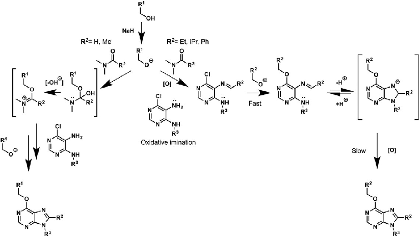
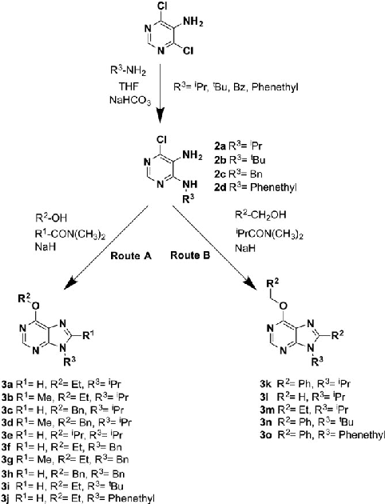
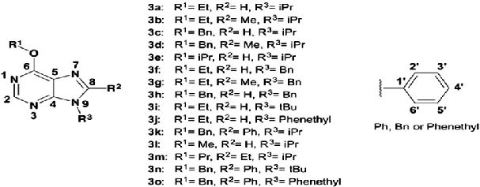

Received: 11 May 2017 Revised: 25 January 2018 Accepted: 19 March 2018 DOI: 10.1002/mrc.4743

L E T T E R S P E C T R A L A S S I G N M E N T S

# 1H and 13C assignments of 6‐, 8‐, 9‐ substituted purines

- 1 | INTRODUCTION

Purines are heterocyclic aromatic organic compounds consisting of two 5‐ and 6‐membered fused rings containing nitrogen. They are present in numerous compounds, including natural products, with potent biological activity. Purine analogs are used for the treatment of acute leukemias. Thiopurine derivatives are effective antiviral (acyclovir and ganciclovir) or antitumor agents such as vidarabine, among other clinical uses.[1]

Over the years, the purine nucleus has become one important pharmacophoric group. It is capable of interfering in the synthesis and function of enzymes and nucleic acids. It is also frequently used in the development of protein kinase inhibitors.[2]

Our research group has developed new routes to produce purine libraries. One of such routes is the one‐pot synthesis[3] to obtain 6‐, 8‐, and 9‐substituted purines from 4‐alkylamino‐5‐amino‐6‐chloropirimidines, alcohols, and N,N‐dimethylamides. We also presented a new approach,[4] to obtain trisubstituted purines. We were able to prepare a library of polysubstituted purines. Some compounds from this library were found to be specific inhibitors of the death‐associated protein kinase‐1.[5] The leading compounds of this library are potent inducers of apoptosis in tumor lymphocytes and also reduce viability of trypanosomes.[4,6]

We herein report the unambiguous assignment of 1H and 13C of a subset of these new purine derivatives. Assignments were carried out in compounds 3 k and 3n which have, as substituents, phenyl and benzyl at Positions 6 and 8, respectively. We also characterize compound 3o, which has benzyl, phenyl, and phenethyl substituents at positions 6, 8, and 9, respectively. We therefore provide better knowledge of the molecular structure of our compounds, while obtaining further insight for future structure–activity studies and for improving the structural determination of other purine derivatives.

- 2 | EXPERIMENTAL

## 2.1 | Synthesis

Purines were prepared as described elsewhere [4,5]

Scheme 1 shows the previously reported synthetic pathway to obtain the novel family of purine derivatives 3a o. Trisubstituted purines at Positions 6, 8, and 9 were prepared starting from 6‐chloro‐4,5‐diaminopyrimidine, alcohols, and N, N dimethylamides in basic conditions without metal catalysis. Depending on the size of the R1 substituent of the amides (Scheme 1), two different synthetic routes may occur. Route A results in purine analogs whose C8 substituents are derived from the amide, whereas Route B gives rise to purines with C8 substituents coming from the alcohol. Route A proceeds via in situ generation of N‐alkylimidate species, which are created by reaction between amides and alkoxides leading to purine derivatives with either H or methyl in C8 when using N,N‐dimethylformamide or N,N‐ dimethylacetamide, respectively. When steric hindrance of amides increases, such as in the cases of N,N‐ dimethylbenzamide or N,N‐dimethylpropionamide, Route A is then impeded and a metal‐free tandem alcohol oxidation/annulation reaction occurs giving rise to Route B products. Therefore, competition between N‐ alkylimidate formation and metal‐free oxidative coupling of primary alkoxides and diaminopyrimidines with Schiff base formation and subsequent annulation can be controlled. In both routes SNAr of the chloro atom at C6 by alkoxides takes place and along with the R3 group of exocyclic nitrogen located at C4 of the starting pyrimidine, increases structural diversity of these one‐pot synthesis.

This synthetic platform, therefore, allows the creation of a diversity of purine analogues in a parallel and straightforward fashion using a variety of amides and alcohols with different pyrimidines under the same reaction conditions. Scheme 2 shows the set of 15 purines presented here, which were obtained through either Route A or B.

2.2 | Nuclear magnetic resonance techniques

1H and 13C NMR data (chemical shifts multiplicity and coupling constants) for compounds 3a n are shown in Tables below. Unambiguous assignments for all NMR signals were accomplished by combined analysis of 1H, 13C,

852 Copyright © 2018 John Wiley & Sons, Ltd. wileyonlinelibrary.com/journal/mrc Magn Reson Chem. 2018;56:852–859.

- SCHEME 1 Proposed mechanisms of action for Routes A and B

- SCHEME 2 Synthetic routes to generate purine types “A” or “B” and set of 15 purines prepared through either route a or B

90° distortionless enhancement by polarization transfer (DEPT), heteronuclear single quantum coherence (HSQC) and heteronuclear multiple bond coherence

(HMBC), correlation spectroscopy (COSY), and total correlation spectroscopy (TOCSY) NMR experiments.

1H Nuclear magnetic resonance spectra were recorded on a Varian Inova Unity (300 MHz), Varian Direct Drive (400 MHz), and/or Varian Direct Drive (500 MHz). Chemical shifts (δ) are referenced to the residual solvent peak: CDCl3, δ 7.26 (1H), δ 77.16 (13C). Spin multiplicities are given as s (singlet), bs (broad singlet), d (doublet), dd (double doublet), ddd (double double doublet), t (triplet), dt (double triplet), pt (pseudotriplet), q (quadruplet), and m (multiplet). Coupling constants (J) are given in Hz. 13C NMR were recorded on a Varian Direct Drive (400 MHz) and Varian Direct Drive (500 MHz). DEPT experiments were carried out using the standard pulse sequence.[7] The HMBC, HSQC, H2BC, COSY, TOCSY, and DEPT spectra were measured with a pulse sequence gc2hmbc, gc2hsqcse, gc2h2bc, gCOSY, gTOCSY, and gDEPT, respectively (Standard sequence Agilent Vnmrj 4.2A software), CRISIS type.[8]

## 3 | RESULTS AND DISCUSSION 3.1 | Analysis of 1H and 13C‐NMR spectra

To facilitate the analysis of all purines, NMR data are presented in tables. Substituent at 6, 8, and 9 positions of the purine ring are named as R1, R2, and R3, respectively. Table 1 and 2 show 1H and 13C‐NMR chemical shifts (δ) for compounds 3a o.

Table 3 shows the family of compounds derived from purine as well as the number scheme of the compounds used.

1097458xa, 2018, 9, Downloaded from https://analyticalsciencejournals.onlinelibrary.wiley.com/doi/10.1002/mrc.4743 by Universidad De Granada, Wiley Online Library on [10/03/2024]. See the Terms and Conditions (https://onlinelibrary.wiley.com/terms-and-conditions) on Wiley Online Library for rules of use; OA articles are governed by the applicable Creative Commons License

- TABLE 1 1H‐NMR chemical shifts (δ) and coupling constants (J, Hz) of purine derivatives (3a o)

Compound H 2 H 8 R1 R2 R3

- 3a

8.48 (s) 7.96 (s) 4.63 (q, 7), 1.47 (t, 7)

— 4.85 (m), 1.59 (d, 7)

- 3b

8.42 (s) — 4.62 (q, 7), 1.49 (t, 7)

2.64 (s) 4.74 (m), 1.68 (d, 6.5)

- 3c

8.54 (s) 7.99 (s) 5.68 (s), 7.54 (H2´‐6′, d, 7.5), 7.36 (H3´‐5′, dd, 7.5, 1.5), 7.31 (H4´, dd, 7.5, 1.5)

— 4.89 (m), 1.63 (d, 7)

- 3d

8.46 (s) — 5.64 (s), 7.53 (H2´‐6′, d, 7.5), 7.34 (H3´‐5′, dd, 7.5, 2), 7.30 (H4´, dd, 7.5, 2)

2.64 (s) 4.74 (m), 1.68 (d, 7)

- 3e

8.51 (s) 7.95 (s) 5.67 (m), 1.62 (d, 6.90)

— 4.88 (m), 1.47 (d, 6)

- 3f

8.55 (s) 7.88(s) 4.66 (q, 7), 1.51 (t, 7)

— 5.40 (s), 7.35–7.30 (m), 7.27 (dd, 8)

- 3 g

8.50 (s) — 4.65 (q, 7), 1.51 (t, 7)

2.51 (s) 5.40 (s), 7.32 (H4´, dd, 6, 2), 7.28 (H3´‐5′, dd, 6, 2), 7.14 (H2´‐6′, dd, 6, 2)

- 3 h

8.58 (s) 7.89 (s) 5.69 (s), 7.54 (d, 7.5), 7.38–7.34 (m)

— 5.41 (s), 7.34–7.30 (m), 7.26 (dd, 8)

1097458xa, 2018, 9, Downloaded from https://analyticalsciencejournals.onlinelibrary.wiley.com/doi/10.1002/mrc.4743 by Universidad De Granada, Wiley Online Library on [10/03/2024]. See the Terms and Conditions (https://onlinelibrary.wiley.com/terms-and-conditions) on Wiley Online Library for rules of use; OA articles are governed by the applicable Creative Commons License

Compound H‐2 H‐8 R1 R2 R3

- 3i

8.50 (s) 7.98 (s) 4.65 (q, 7.2), 1.51 (t, 7.2)

— 1.81 (s)

- 3j

8.52 (s) 7.50 (s) 4.64 (q, 7.21), 1.49 (t, 7.21)

— 7.25–7.17 (m), 7.02 (dd, 8.41), 4.46 (t, 7.21), 3.16 (t, 7.21)

- 3 k

8.54 (s) — 5.69 (s), 7.66 (m), 7.37–7.29 (m)

7.57–7.50 (m) 4.76 (m), 1.73 (d, 6.90)

- 3 l

8.53 (s) 7.98 (s) 4.18 (s) — 4.89 (m), 1.62 (d, 6.5)

- 3 m

8.43 (s) — 4.52 (t, 7.20), 1.26 (m), 1.05 (t, 7.50)

2.94 (q,7.2), 1.43 (t, 7.2)

4.69 (m), 1.70 (d, 6.90)

- 3n

8.55 (s) — 5.65 (s), 7.54 (d, 7.5), 7.35–7.27 (m)

7.46 (d, 7.5), 7.45–7.38 (m)

1.66 (s)

- 3o

8.58 (s) — 5.71 (s), 7.55 (d, 5.2), 7.37–7.31 (m)

7.48 (d, 4.4), 7.45–7.43 (m)

7.25–7.17 (m), 6.91 (dd, 2.4), 4.56 (t, 4.8), 3.10 (t, 4.8)

Note: NMR = nuclear magnetic resonance.

In particular, we focused the analysis in protons belonging to phenyl, benzyl, and phenethyl aromatic rings within a same molecule, as for compounds 3o,

- 3 k, and 3n. TOCSY method was used to identify

unequivocally these aromatic protons of our compounds. Purine 3o was firstly analyzed. Irradiation frequency of δ 7.55 presents an associated spin system that corresponds with aromatic protons of the R1 benzyl

1097458xa, 2018, 9, Downloaded from https://analyticalsciencejournals.onlinelibrary.wiley.com/doi/10.1002/mrc.4743 by Universidad De Granada, Wiley Online Library on [10/03/2024]. See the Terms and Conditions (https://onlinelibrary.wiley.com/terms-and-conditions) on Wiley Online Library for rules of use; OA articles are governed by the applicable Creative Commons License

- TABLE 2 13C‐NMR chemical shifts (δ) of purine derivatives (3a o)

Compound C2 C4 C5 C6 C8 R1 R2 R3

- 3a

151.8 152.0 122.0 160.9 139.7 14.6 (CH3), 63.1 (CH2)

— 47.5 (CH), 22.7 (CH3)

- 3b

150.7 150.6 120.9 159.9 133.2 14.7 (CH3), 62.8 (CH2)

15.4 48.5 (CH), 21.4 (CH3)

- 3c

151.8 152.1 122.0 160.7 139.9 CH2 (68.5), C‐1´ph (136.4),

- C‐2′,6´ph (128.6),
- C‐3′,5´ph (128.5), C‐4´ph(128.2)

— 47,6 (CH), 22,8 (CH3)

- 3d

150.5 150.9 120.9 159.6 140.0 CH2 (68.23), C‐1´ph (136.59),

- C‐2′,6´ph (128.60),
- C‐3′,5´ph (128.52), C‐4´ph(128.15)

15.4 48.5 (CH), 21.4 (CH3)

- 3e

152.0 150.2 122.2 160.8 139.5 70.3 (CH), 22.8 (CH3)

— 47.5 (CH), 22.2 (CH3)

- 3f

152.5 152.3 121.5 161.1 142.0 14.7 (CH3), 63.3 (CH2)

— CH2 (47.6), C‐1´ph (135.5),

- C‐2′,6´ph (129.2),
- C‐3′,5´ph (127.9), C‐4´ph(128.6)

- 3 g

14.7 CH2 (46.2), C‐1´ph (135.7),

151.7 151.6 120.5 160.0 153.7 14.5 (CH3), 63.1 (CH2)

- C‐2′,6´ph (129.1),
- C‐3′,5´ph (127.1), C‐4´ph(128.3)

— CH2 (47.6), C‐1´ph (135.4),

152.4 152.5 121.6 160.8 142.2 CH2 (68.6), C‐1´ph (136.3),

- C‐2′,6´ph (128.6),
- C‐3′,5´ph (128.5), C‐4´ph(128.3)

- C‐2′,6´ph (129.3),
- C‐3′,5´ph (127.9), C‐4´ph(128.7)

3 h

1097458xa, 2018, 9, Downloaded from https://analyticalsciencejournals.onlinelibrary.wiley.com/doi/10.1002/mrc.4743 by Universidad De Granada, Wiley Online Library on [10/03/2024]. See the Terms and Conditions (https://onlinelibrary.wiley.com/terms-and-conditions) on Wiley Online Library for rules of use; OA articles are governed by the applicable Creative Commons License

Compound C2 C4 C5 C6 C8 R1 R2 R3

- 3i

151.1 152.4 123.1 161.1 139.8 14.7 (CH3), 63.0 (CH2)

— 57.7 (C4°), 29.2 (CH3)

- 3j

— N‐CH2(45.7) CH2(36.3), C‐1´ph (137.3),

152.2 152.0 121.6 160.9 142.1 14.6 (CH3), 63.2 (CH2)

- C‐2′,6´ph (128.9),
- C‐3′,5´ph (128.8), C‐4´ph (127.2)

- 3 k

150.9 153.7 122.0 160.4 153.0 CH2 (68.3), C‐1´ph (136.6),

- C‐2′,6´ph (128.7),
- C‐3′,5´ph (128.5), C‐4´ph(128.2)

C‐1´ph (135.5),

- C‐2′,6´ph (129.7),
- C‐3′,5´ph (128.9), C‐4´ph(130.3)

49.9 (CH), 21.4 (CH3)

- 3 l

151.9 148.8 122.0 161.2 139.9 54.3 — 47.6 (CH), 22.8 (CH3)

- 3 m

150.6 150.2 133.9 160.2 155.2 OCH2(68.6)

- CH2 (22.4)
- CH3(10.5)

12.4 (CH3), 22.1 (CH2)

48.5 (CH), 21.4 (CH3)

- 3n

150.3 154.4 121.7 160.5 153.3 CH2 (68.3), C‐1´ph (136.5),

- C‐2′,6´ph (128.8),
- C‐3′,5´ph (128.5), C‐4´ph(128.18)

C‐1´ph (134.9), C‐2′,6´ph (130.0), C‐3′,5´ph (128.0), C‐4´ph(129.6)

60.9 (C4°), 31.0 (CH3)

- 3o

C‐1´ph (129.7),

151.7 154.0 121.4 160.3 153.3 CH2 (68.5), C‐1´ph (136.4),

N‐CH2(45.6) CH2(35.7), C‐1´ph (137.2),

- C‐2′,6´ph (129.3),
- C‐3′,5´ph (129.8), C‐4´ph(130.3)

- C‐2′,6´ph (128.6),
- C‐3′,5´ph (128.5), C‐4´ph(128.2)

- C‐2′,6´ph (128.8),
- C‐3′,5´ph (128.8), C‐4´ph (127.0)

Note: NMR = nuclear magnetic resonance.

substituent located at C6 of the purine ring. In the case of irradiation frequency of δ 7.50, the associated spin system corresponds to protons of the aromatic ring appearing at Position 8 of the purine ring (R2), a phenyl substituent. Finally, irradiation frequency of δ 7.19 present an

associated spin system that corresponds to protons of the R3 substituent located at C9 of the purine ring, a phenethyl group.

Once chemical shifts of the protons of the three types of aromatic rings at purine substituents were identified,

1097458xa, 2018, 9, Downloaded from https://analyticalsciencejournals.onlinelibrary.wiley.com/doi/10.1002/mrc.4743 by Universidad De Granada, Wiley Online Library on [10/03/2024]. See the Terms and Conditions (https://onlinelibrary.wiley.com/terms-and-conditions) on Wiley Online Library for rules of use; OA articles are governed by the applicable Creative Commons License

TABLE 3 Summary of 13C‐NMR chemical shifts (δ) of purine derivatives (3a o)

Compound C2 C4 C5 C6 C8 3i o 151.9–152.2 148.8–154.4 121.4–133.9 160.2–161.2 139.8–155.2

Note: NMR = nuclear magnetic resonance.

coupling techniques to identify C–H and H–H interactions (HSQC, HMBC, COSY, TOCSY, and H2BC) were used to unequivocally assign protons of the three different aromatic rings at 6, 8, and 9 positions of compound

- 3o as shown in Table 1. Therefore, by means of TOCSY studies, we unequivocally assigned the protons of the aromatic rings, which appear in Positions 6, 8, and 9 of the purine ring (Table 1). A similar procedure was carried out to assign the aromatic protons of compounds 3 k and 3n.

Table 2 and 3 shows the 13C‐NMR data. Similar to our 1H‐NMR analysis, unambiguous assignment of 13C chemical shifts was performed for the three aromatic rings, phenyl, benzyl, and phenethyl substituents at positions 6, 8, and 9 of purine 3o, as well as for carbons of the aromatic substituents, benzyl, and phenyl, located at C6 and C8 of purines 3 k and 3n.

For compound 3o, quaternary carbons were assigned using 90° DEPT and 13C‐NMR spectra. Chemical shifts at δ 160.32, 153.96, 153.34, 137.27, 136.40, 129.66, and 121.40 correspond to C4, C5, C6, and C8 of the purine ring of phenyl, benzyl, and phenethyl rings, located at C6, C8, and N9. These assignments were confirmed by analysis of HSQC spectra. HMBC spectrum indicated that the methylene protons of the benzyl substituent located at C6 of the purine ring showed coupling with the quaternary carbon appearing at δ 160.32, corresponding to C6. The same methylene protons were coupled to the quaternary carbon of the aromatic ring substituent at C6. Carbon C1’ was at δ 136.40. The proton at C2 of the purine ring (δ 8.58) is coupled long distance with C6 and with C4 at δ 153.96. The methylene protons of the phenethyl group (δ 5.71), substituent at C9 are coupled to C1’ (δ 137.27) and with C4. The quaternary carbon at δ 121.40 was assigned to C5, since was not coupled with any hydrogen. The quaternary carbon δ 153.34 was

assigned to C8, since in the HMBC spectrum it showed coupling to the aromatic protons of the substituent phenyl ring. The signal of the quaternary carbon at δ 129.66 was assigned to C1 of the phenyl group of the substituent at C8 of the purine ring.

ACKNOWLEDGEMENTS

ALM is the recipient of a FPU fellowship from the Ministry of Education, Culture and Sports, Spain.

This work was supported by grant number CS2016.4 from Consejería de Salud, Regional Government of Andalucia, Spain, and a philanthropic donation.

ORCID María José Pineda de las Infantas Villatoro http://orcid. org/0000-0002-0617-6408

Álvaro Lorente‐Macías1,2 Manuel Benítez‐Quesada1 Ignacio J. Molina2,3

Asier Unciti‐Broceta4 Juan José Díaz‐Mochón1,5

María José Pineda de las Infantas Villatoro1

1Departamento de Química Farmacéutica y Orgánica, Facultad de Farmacia, Campus de Cartuja, Universidad de Granada, Granada, Spain 2Instituto de Biopatología y Medicina Regenerativa, Centro

de Investigación Biomedica, Parque Tecnológico de Ciencias de la Salud, Universidad de Granada, 18016

Granada, Spain 3Instituto de Investigación Biosanitaria ibs.GRANADA,

Granada University Hospitals and University of Granada, Spain

1097458xa, 2018, 9, Downloaded from https://analyticalsciencejournals.onlinelibrary.wiley.com/doi/10.1002/mrc.4743 by Universidad De Granada, Wiley Online Library on [10/03/2024]. See the Terms and Conditions (https://onlinelibrary.wiley.com/terms-and-conditions) on Wiley Online Library for rules of use; OA articles are governed by the applicable Creative Commons License

4Ediburgh Cancer Research UK Centre MBC Institute of Genetics and Molecular Medicine, University of Edinburgh, Crewe Road South, Edinburgh EH4,

2XR, UK 5Avenida de la Ilustración 114, Parque Tecnológico de

Ciencias de la Salud, Centro Pfizer Universidad de Granada Junta de Andalucía de Genómica e Investigación

Oncológica (GENYO), 18016 Granada, Spain

Correspondence

Juan José Díaz Mochón, Departamento de Química Farmacéutica y Orgánica, Facultad de Farmacia, Campus

de Cartuja, Universidad de Granada, Granada, Spain. Email: juandiaz@ugr.es

María José Pineda de las Infantas Villatoro, Departamento

de Química Farmacéutica y Orgánica, Facultad de Farmacia, Campus de Cartuja, Universidad de Granada,

Granada, Spain. Email: mjpineda@ugr.es

REFERENCES

- [1] Z. O'Brien, M. Moghaddam, Expert Opin. Drug Metab. Toxicol. 2013, 9, 1597.
- [2] L. Meijer, E. Raymond, Acc. Chem. Res. 2003, 36, 417.
- [3] P. G. Baraldi, A. Unciti‐Broceta, M. J. Pineda de las Infantas, J. J. Díaz‐Mochón, A. Espinosa, R. Romagnoli, Tetrahedron 2002, 58, 7607.
- [4] M. J. Pineda de las Infantas, J. D. Unciti‐Broceta, R. Contreras, J. A. García, M. A. Gallo, A. Unciti‐Broceta, J. J. Díaz‐Mochón, Sci. Rep. 2015, 5, 9139.
- [5] M. J. Pineda de las Infantas, S. Torres‐Rusillo, J. D. Unciti‐ Broceta, P. Fernández‐Rubio, M. A. Luque‐González, M. A. Gallo, A. Unciti‐Broceta, I. J. Molina, J. J. Díaz‐Mochón, Org. Biomol. Chem. 2015, 13, 5234.
- [6] L. Harmse, R. van Zyl, N. Gray, P. Schultz, S. Leclerc, L. Meijer, C. Doerig, I. Havlik, Biochem. Pharmacol. 2001, 62, 341.
- [7] D. M. Doddrell, D. T. Pegg, M. R. Bendall, J. Magn. Reson. 1969, 1982.
- [8] R. Boyer, R. Johnson, K. Krishnamurthy, J. Magn .Reson. 2003, 2, 165.

Received: 26 February 2018 Revised: 23 April 2018 Accepted: 5 May 2018 DOI: 10.1002/mrc.4750

DOI: 10.1002/mrc.4750

# Stereochemistry and complete 1H and 13C NMR signal assignment of C‐20‐oxime derivatives of posterone 2,3‐ acetonide in solution state

## 1 | INTRODUCTION

sensitizing activity.[1] In particular, several poststerone derivatives, containing a substituted dioxolane (e.g., acetonide) moiety connected to their A‐ring, were found to be free from the efflux pump inhibitory activity, while acting as strong chemo‐sensitizers in combination with doxorubicin.[3] In addition to this, ecdysteroid 6‐oximes and oxime ethers demonstrated markedly increased ABCB1 inhibitory activity, while acting as similarly potent chemo‐sensitizers as their corresponding 6‐oxo analogs.[4]

Less polar derivatives of ecdysteroids, and particularly their acetonides and other dioxolane analogs, were previously shown by our group to exert a strong chemo‐ sensitizing activity on cancer cells to common chemotherapeutics, including doxorubicin, vincristine, and paclitaxel.[1,2] While this sensitizing activity could also be observed on drug‐susceptible cancer cells, a high selectivity was found towards multidrug resistant (MDR) cancer cell lines transfected to overexpress the ABCB1 multidrug transporter.[2,3] Interestingly, the chemo‐ sensitizing activity was independent of a functional efflux inhibition: even though some of the tested compounds showed a mild to moderate ABCB1 inhibitory activity; structure–activity relationships for efflux inhibition were significantly different to those describing chemo‐

Self‐assembling nanoparticles provide a promising novel approach against cancer.[5] These can be prepared by functionalizing a potential antitumor agent with a long lipophilic side‐chain through functional group(s) hydrolysable in a biological environment (e.g., ester), which will make them working as prodrugs once released. The role of the side‐chain in such a conjugate is to induce the self‐assembly to nanoparticles in aqueous

Magn Reson Chem. 2018;56:859–866. wileyonlinelibrary.com/journal/mrc Copyright © 2018 John Wiley & Sons, Ltd. 859

1097458xa, 2018, 9, Downloaded from https://analyticalsciencejournals.onlinelibrary.wiley.com/doi/10.1002/mrc.4743 by Universidad De Granada, Wiley Online Library on [10/03/2024]. See the Terms and Conditions (https://onlinelibrary.wiley.com/terms-and-conditions) on Wiley Online Library for rules of use; OA articles are governed by the applicable Creative Commons License

