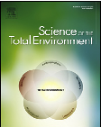
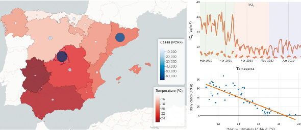
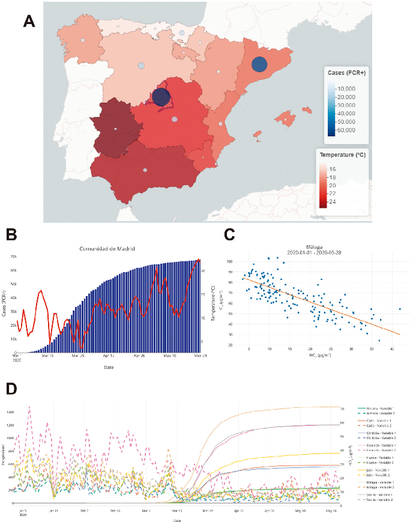
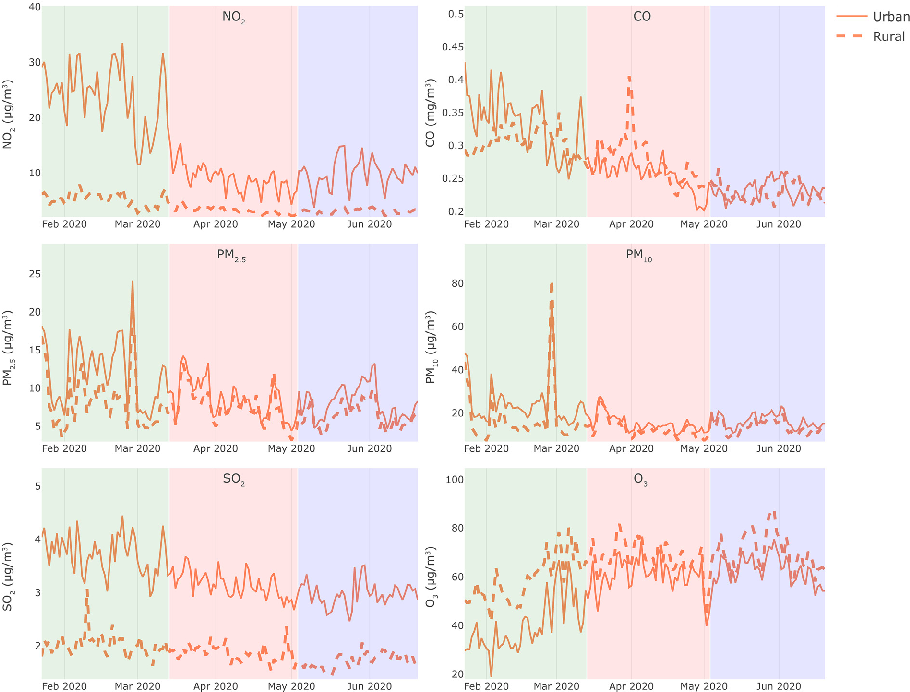

Since January 2020 Elsevier has created a COVID-19 resource centre with  free information in English and Mandarin on the novel coronavirus COVID19. The COVID-19 resource centre is hosted on Elsevier Connect, the  company's public news and information website. 

Elsevier hereby grants permission to make all its COVID-19-related  research that is available on the COVID-19 resource centre - including this  research content - immediately available in PubMed Central and other  publicly funded repositories, such as the WHO COVID database with rights  for unrestricted research re-use and analyses in any form or by any means  with acknowledgement of the original source. These permissions are  granted for free by Elsevier for as long as the COVID-19 resource centre  remains active. 

Science of the Total Environment 750 (2021) 141424

Contents lists available at ScienceDirect

Science of the Total Environment

journal homepage: www.elsevier.com/locate/scitotenv

DatAC: A visual analytics platform to explore climate and air quality indicators associated with the COVID-19 pandemic in Spain

Jordi Martorell-Marugána,b,1, Juan Antonio Villatoro-Garcíaa,1, Adrián García-Morenoa, Raúl López-Domíngueza, Francisco Requenac, Juan Julián Merelod, Marina Lacasañae,f,g, Juan de Dios Lunah, Juan J. Díaz-Mochóna, Jose A. Lorentea, Pedro Carmona-Sáeza,h,⁎

a GENYO, Centre for Genomics and Oncological Research: Pfizer/University of Granada/Andalusian Regional Government, PTS Granada, 18016 Granada, Spain b Atrys Health S.A., Barcelona, Spain c Imagine Institute of Genetic Diseases, INSERM, 75015 Paris, France d Department of Computer Architecture and Technology, Universidad de Granada, 18071 Granada, Spain e Andalusian School of Public Health (EASP), 18011 Granada, Spain f Ciber de Epidemiología y Salud Pública (CIBERESP), Spain g Instituto de Investigación Biosanitaria ibs.GRANADA, Granada, Spain h Department of Statistics, University of Granada, 18071 Granada, Spain

H I G H L I G H T S

• DatAC integrates spatio-temporal data of weather, air quality and COVID-19. • NO2, CO, SO2, PM2.5 and PM10 declined

after lockdown, while O3 levels rose.

• The lockdown impact on rural air quality is smaller than in urban environments.

• Current data does not support climatic factors as driving factors of thepandemic.

G R A P H I C A L A B S T R A C T

a r t i c l e i n f o a b s t r a c t

Article history: Received 23 June 2020 Received in revised form 30 July 2020 Accepted 31 July 2020 Available online 4 August 2020

Editor: Dr. Jay Gan

Keywords: SARS-CoV-2 Pollution Weather variables

The coronavirus disease 2019 (COVID-19) pandemic has caused an unprecedented global health crisis, with several countries imposing lockdowns to control the coronavirus spread. Important research efforts are focused on evaluating the association of environmental factors with the survival and spread of the virus and different works have been published, with contradictory results in some cases. Data with spatial and temporal information is a key factor to get reliable results and, although there are some data repositories for monitoring the disease both globally and locally, an application that integrates and aggregates data from meteorological and air quality variables with COVID-19 information has not been described so far to the best of our knowledge. Here, we present DatAC (Data Against COVID-19), a data fusion project with an interactive web frontend that integratesCOVID-19and environmental data inSpain. DatAC is providedwith powerful data analysisand statistical capabilities that allow users to explore and analyze individual trends and associations among the provided data.

Abbreviations: CFR, case fatality rate; CO, carbon monoxide; CRR, case recovery rate; COVID-19, Coronavirus disease 2019; FDR, false discovery rate; ICU, intensive care unit; NO2, nitrogen dioxide; O3, ozone; PCR, polymerase chain reaction; PM2.5, particulate matter 2.5 μm or less in diameter; PM10, particulate matter 10 μm or less in diameter; SARS-CoV-2, severe acute respiratory syndrome coronavirus 2; SD, standard deviation; SO2, sulfur dioxide; VOC, volatile organic compound.

⁎ Corresponding author at: GENYO, Centre for Genomics and Oncological Research: Pfizer/University of Granada/Andalusian Regional Government, PTS Granada, 18016 Granada, Spain. E-mail address: pedro.carmona@genyo.es (P. Carmona-Sáez). 1The authors wish it to be known that, in their opinion, the first two authors should be regarded as Joint First Authors.

https://doi.org/10.1016/j.scitotenv.2020.141424 0048-9697/© 2020 Elsevier B.V. All rights reserved.

RStudio Shiny framework Spatio-temporal analysis

Using the application, we have evaluated the impact of the Spanish lockdown on the air quality, observing that NO2, CO, PM2.5, PM10 and SO2 levels decreased drastically in the entire territory, while O3 levels increased. We observedsimilar trends inurbanand rural areas, although theimpact has been more important inthe former. Moreover, the application allowed us to analyze correlations among climate factors, such as ambient temperature, and the incidence of COVID-19 in Spain. Our results indicate that temperature is not the driving factor and without effective control actions, outbreaks will appear and warm weather will not substantially limit the growth of the pandemic. DatAC is available at https://covid19.genyo.es.

© 2020 Elsevier B.V. All rights reserved.

1. Introduction

In December 2019, Coronavirus disease 2019 (COVID-19) caused by severe acute respiratory syndrome coronavirus 2 (SARS-CoV-2) wasdescribed in Wuhan, China (Guan et al., 2020). The spread of the disease has presented an extreme challenge to the international community and different countries have implemented different strategies depending on social, economic and political factors. Coronavirus infection spreads in clusters and some of the oldest and most effective containment measures such as social distancing, quarantine and isolation have been adopted to control the disease outbreak. In Spain, the Government declared the state of alarm and strict lockdown on March 14th, 2020. This lockdown was even stricter during the period March 30th to April 8th, when non-essential activities were totally prohibited. Between April 9th and May 3rd, the initial lockdown conditions were restored. Since May 4th, lockdown restrictions had been relaxed asymmetrically depending on the pandemic indicators of each region. On June 21st, the alarm finished along with the majority of the restrictions in most of the country.

Early detection of new cases and the identification of factors associated with the spread of SARS-CoV-2 are important aspects to control the pandemic. In this context, a research focus is on studying the role that environment factors play in the propagation of the disease. Previous studies have reported significant associations among air quality and meteorological variables and the amount or severity of new cases. In fact, Dr. Coccia reported the poor air quality in the North of Italy as one of the factors for the quick diffusion of SARS-CoV-2 in this region (Coccia, 2020). Furthermore, particulate matter 2.5 μm or less in diameter (PM2.5), particulate matter 10 μm or less in diameter (PM10), sulfur dioxide (SO2), nitrogen dioxide (NO2), carbon monoxide (CO) or ozone (O3) have been also associated with COVID-19 incidence (Bashir et al., 2020b; Fronza et al., 2020; Jiang et al., 2020; Ogen, 2020; Zhu et al., 2020), but it remains unclear if these correlations are actually related to causation (Riccò et al., 2020). Regarding weather conditions, there are several studies that have been published during recent months reporting negative correlation between temperature and COVID-19 cases (see for example Luo et al., 2020; Pequeno et al., 2020; Wang et al., 2020), humidity and death counts (Ma et al., 2020) or rainfall and new daily cases (Menebo, 2020). A recent study followed almost 7000 hospitalized patients from Europe and China and reported that the increase in ambient temperature is linked to less severe symptoms (Kifer et al., 2020).

However, most of these studies are still preliminary and they are focused on specific regions. There are also some contradictory findings (e.g. a study of 122 Chinese cities reported that temperature was positively correlated with cases (Xie and Zhu, 2020)), and the analyses are based on a short period of time, which generally covers the first peak of cases. More data is needed to derive more conclusive results and to elucidate the actual impact of ambient factors on COVID-19 pandemic.

A more robust evidence supports that lockdowns imposed by the governments in order to fight the SARS-CoV-2 spreading resulted in an improvement of air quality in major urban areas like Barcelona (Tobías et al., 2020), São Paulo (Nakada and Urban, 2020) or Northern China (Bao and Zhang, 2020), where SO2, PM2.5, PM10, NO2, and CO air concentration dropped. On the contrary, O3 levels have increased

significantly in these regions. This rise has been observed also in other Southern European cities (Rome, Valencia, Turin and Nice) as well as Wuhan (Sicard et al., 2020). Such phenomenon can be explained by a combination of factors, such as the higher volatile organic compounds (VOCs)-NOx ratio, the reduction of O3 titration due to the drop of NOx or the reduction of PM2.5 and PM10 (Sicard et al., 2020).

In this work we have processed and curated data from COVID-19 cases, meteorological and air quality data in Spain since January 1st, 2020. We have implemented a web-based software, named DatAC (Data Against COVID-19), that integrates all these data and provides spatial-temporal aggregation of all these sources of information. The application includes visual analytics capabilities that allow users to explore temporal and regional evolution of variables as well as an easy interactive exploration of data relationships and associations. Using this application, we have analyzed the impact of the lockdown in Spain on the air quality in urban, suburban and rural areas. In addition, we have evaluated the relationship between meteorological variables and COVID-19 incidence in the entire Spanish territory.

We are confident that DatAC would be very useful to assess how all these variables are interacting and the actual impact of environmental factors on COVID-19 spread. DatAC has a free license and it is available at https://covid19.genyo.es.

2. Methods

2.1. Data collection

Daily COVID-19 total cases and cases diagnosed with polymerase chain reaction (PCR) from the autonomous communities and provinces have been obtained from the Ministry of Health of Spain (MISAN, 2020). Dates of these data refer to the onset of symptoms.

The number of daily deaths, cumulative hospitalized patients, cumulative patients translated to intensive care units (ICUs) and cumulative recovered patients from the autonomous communities were obtained from Datadista repository (Datadista, 2020). For provinces data, we obtained these variables from the Andalusian Institute of Statistic and Cartography (IECA, 2020) for the Andalusian provinces and from Escovid19data repository (Escovid19data, 2020) for the rest of the provinces.

Climatological information was downloaded from the Spanish State Meteorological Agency (AEMET, 2020). The daily data for each of the monitoring stations in Spain was downloaded. These data were processed to obtain the average daily temperature, rainfall, wind speed and hours of solar radiation for each province and community.

Air quality data from the different Andalusian monitoring stations were obtained from the Andalusian Office of Agriculture, Livestock, Fisheries and Sustainable Development (Junta de Andalucía, 2020). The air quality data from the rest of the Spanish monitoring stations were downloaded from theEuropean Air QualityPortal(European Environment Agency, 2020). All this information was processed to obtain the daily mean concentrations of NO2, CO, PM2.5, PM10, SO2 and O3 for each province. Furthermore, this information was stratified according to three types of monitoring stations: urban, suburban and rural.

Finally, population information was obtained from the Municipal Register compiled by theSpanishStatistics Institute, updatedon January 1st, 2020 (INE, 2020).

2.2. Metrics, data aggregation and statistical analysis

The collected information was processed to calculate other variables and carry out different analyses. Specifically, when daily data was available, cumulative data was calculated by making a cumulative sum of the data from the previous days. In the same way, if cumulative information wasavailable, it wasused to obtain daily data bysubtracting the value of the previous day from the value of the reference day. Cumulative mortality rates and cumulative incidence rates were calculated for each day dividing the number of cumulative cases or cumulative deaths by the total population of the territory. Case fatality rates (CFRs) have been also calculated in order to assess the lethality of the disease over time, dividing the number of deaths by cases. However, this approach has been criticized due to the possible bias produced by the rapid expansion of the number of infected by COVID-19 (Baud et al., 2020; Spychalski et al., 2020). To take this potential bias into account we have also obtained case recovery rates (CRRs), which are calculated as the division of the cumulative recovered patients by cumulative cases. Furthermore, a 7-daysand 14-days cumulative incidencewascalculated as well as the percentage of daily increase of cases. Finally, 3-days, 7days and 14-days rolling averages were obtained for daily variables in order to improve the observation of the trends. These rolling averages are calculated as the average of the value of a day and the previous n1 days.

All the analyses described in this manuscript were performed using the DatAC data and analytical functionalities. For correlation analysis we chose the Spearman coefficient because there may not be a linear relationship between the analyzed variables. In order to take into account the lockdown effect on the COVID-19 incidence, partial correlation was applied (Ahmadi et al., 2020) correcting by the number of lockdown days. We used the 7-day rolling average for climatic variables and a 7-day lag for the number of lockdown days, because the time between the infection and the appearance of the first symptoms is usually 5–6 days (up to 14 days) (Lauer et al., 2020; Xie and Zhu, 2020). Correlation P-values were adjusted to correct for multiple testing with false discovery rate (FDR) method (Benjamini and Hochberg, 1995).

2.3. DatAC tool for easy data exploration and interactive analysis

DatAC has been developed with the RStudio Shiny framework. Internally, the application uses R packages to perform all the plots and calculations. Leaflet package (Cheng et al., 2019) is used to generate the interactive map. Interactive plots are generated with plotly package (Sievert, 2020). Partial correlations are calculated with ppcor package (Kim, 2015). The tool runs on a dedicated server with Ubuntu 18.04 operating system, 16 processors and 32 Gb of RAM memory. The source code as well as all the data contained in the application is available with a free license through GENyO Bioinformatics Unit GitHub repository (https://github.com/GENyO-BioInformatics/DatAC).

We collected and curated data since January 1st, 2020 and it is being updated daily with the new data reported by the different sources. As epidemiological data we collected total and PCR+ cases, deaths, recovered patients, hospitalized patients and patients transferred toICU, all of them as cumulative and daily data. In addition, we calculated the incidence and deaths rates, the percentage of recovered and deaths, the cumulative incidence rate per 100,000 habitants in 14 and 7 days and the percentage increase in the number of daily positive cases. Regarding meteorological data, we collected daily data for temperature, rainfall, wind speed and solar radiation. For air quality data, we included daily measures for NO2, CO, PM2.5, PM10, SO2 and O3 pollutants. There are different levels of geographical aggregation, including autonomous

communities and provinces. Environmental data is also available for urban, suburban and rural monitoring stations.

The application is structured in three main modules, including a Map, Trend analysis and Time trends panels. The Map panel aggregates and visualizes data with spatial information (Fig. 1A). Different variables can be selected and the map and visualization panel are updated dynamically to show and generate reactive plots (Fig. 1A and B). More advanced analyses can be performed in the Trend analysis tab, where different models (polynomial models and correlation with adjustable parameters) can be applied to study the relationship between two variables (Fig. 1C). A lag between the two variables can be applied in order to explore potential relationships between variables with some time difference. Finally, the temporal trends of the different variables can be represented at the Time trends page, comparing two variables for all the desired regions (Fig. 1D).

In the following sections we cover the results from analyses carried out with the application to explore the evolution of contaminants during the lockdown and the effect of environment variables on the COVID-19 cases.

3. Results

The data and visual analytics capabilities included in DatAC can be very useful to explore trends and associations among climate and air quality variables and COVID-19 indicators, with a layer of spatiotemporal information. In this work we have used the tool to analyze the air quality evolution during the lockdown aswell as the potential association of climatic factors with COVID-19 data. In the following sections we provide a detailed analysis of the obtained results.

3.1. Air quality improved after lockdown in urban and suburban environments

Taking the different phases of the COVID-19 pandemic in Spain (see Introduction section) into account, we analyzed the pollutants levels in 3 periods: prior to lockdown (January 23rd to March 13th, 50 days), strict lockdown (March 14th to May 3rd, 50 days) and relaxed lockdown (May 4th to June 20th, 47 days).

We analyzed all the Spanish territory except Ceuta and Melilla autonomous cities, where no official air quality monitoring stations are installed.We also excludedthe Canary Islands fromthe analysis because we detected some outlier values,likely because of measuring errors. The results for the rest of the autonomous communities in urban environments are compiled in Supplementary Table 1. Average values for Spain are shown in Table 1 and Fig. 2. As expected, all the analyzed pollutants except O3 dropped significantly during the strict lockdown, specially NO2 and PM10. O3 levels rose more than 50% in this same period. During the relaxed lockdown, NO2 and PM10 levels increased compared to the strict lockdown period, but the levels of all pollutants except O3 are still significantly lower than prior to lockdown. Interestingly, CO, SO2 and PM2.5 levels continued to fall moderately in spite of the relaxation of the lockdown measures, while O3 continued to rise. The trends for suburban environments are similar (Supplementary Tables 2 and 3).

3.2. Lockdown had a significantly lower impact on air quality in rural areas

We analyzed the pollutants trends in Spain in rural monitoring stations (see Table 2 for a summary and Supplementary Table 4 for the complete results). As can be observed, the trends for strict and relaxed lockdowns periods are similar to those observed in urban stations, but the variations between periods are smaller in rural environments. The major differences are found in NO2 (−62.39% and −38.16% variation between strict lockdown and prior to lockdown in urban and rural stations respectively) and in O3 (+50.09% and +15.58% variation between strict lockdown and prior to lockdown in urban and rural stations

Fig. 1. DatAC sample outputs, including:A)Mapwith theCOVID-19 cases confirmedbyPCR test (blue circles)and meantemperature(backgroundcolor) for theautonomous communities ofSpain onMay 24th, 2020.B)Longitudinalplotwith the same variables asA)for theComunidaddeMadrid regionfrom March1st to May24th,2020,representing the caseswith barsand the temperature with the red line. C) Correlation plot between NO2 and O3 concentrations for Málaga province from January 1st to May 28th, 2020. D) Longitudinal plot representing hospitalized patients (solid lines) and NO2 concentration (semi continuous lines) for all the Andalusian provinces from January 1st to May 24th, 2020.

respectively). Many differences can be found in the variations between relaxed and strict lockdowns: CO, SO2 and PM2.5 levels dropped in both urban and rural environments, but in rural stations the differences are greater. On the other hand, both PM10 and O3 levels have risen during

the relaxed lockdown but more in urban areas than in rural stations. Regarding NO2 we observed a difference in the trend: it raised 10.86% in urban stations during the relaxed lockdown but dropped 4.34% in rural stations. All these trends can be observed in Fig. 2.

Table 1 Average air pollutants levels in urban environments of Spain during the 3 periods and the variation between periods.

Difference between relaxed lockdown and strict lockdown (% change)

Difference between relaxed lockdown and prior to lockdown (% change)

Difference between strict lockdown and prior to lockdown (% change)

Relaxed lockdown mean (SD)

Strict lockdown mean (SD)

Pollutant Prior to lockdown mean (SD)

NO2 (μg/m3) 23.8 (5.67) 8.95 (2.4) 9.93 (2.55) −14.85 (−62.39%) −13.88 (−58.31%) 0.97 (10.86%) CO (mg/m3) 0.33 (0.04) 0.26 (0.02) 0.23 (0.01) −0.08 (−22.88%) −0.1 (−30%) −0.02 (−9.24%) PM2.5 (μg/m3) 12.06 (4.13) 8.48 (2.47) 8.05 (2.16) −3.58 (−29.67%) −4.01 (−33.24%) −0.43 (−5.09%) PM10 (μg/m3) 24.9 (10.91) 15.14 (3.93) 16.33 (3.12) −9.75 (−39.18%) −8.57 (−34.41%) 1.19 (7.84%) SO2 (μg/m3) 3.72 (0.36) 3.15 (0.24) 2.97 (0.23) −0.57 (−15.38%) −0.75 (−20.04%) −0.17 (−5.51%) O3 (μg/m3) 40.22 (10.97) 60.37 (6.87) 62.88 (5.73) 20.15 (50.09%) 22.66 (56.33%) 2.51 (4.16%)

Fig. 2. Average pollutants levels in Spain across time during the three periods of the COVID-19 pandemic. Green, red and blue backgrounds represent prior to lockdown, strict lockdown and relaxed lockdown periods respectively.

3.3. Analysis of the association among climatic variables and COVID-19 incidence

There are previous studies that associate temperature, solar radiation, wind speed or rainfall with COVID-19 cases or deaths in different regions (Bashir et al., 2020a; Guasp et al., 2020; Kifer et al., 2020; Liu et al., 2020; Luo et al., 2020; Pequeno et al., 2020; Rosario et al., 2020; Tosepu et al., 2020; Wang et al., 2020). However, generally there are contradictory and/or inconclusive findings. We calculated the Spearman correlation among temperature, solar radiation, wind speed, rainfall and daily cases (Supplementary Table 5). These correlations were analyzed in all the Spanish communities during the period from March 7th to June 20th (end of the state of alarm in Spain). As can be observed, correlations among wind speed and rainfall with cases are very heterogeneous and non-significant for most of the Spanish communities, indicating that these variables were not correlated with the COVID-19 incidence in Spain. On the other hand, temperature and

solar radiation are negatively correlated with cases and these correlations are significant for the majority of communities.

However, considering that a strict lockdown was imposed at the beginning of the analyzed period, it is expected that social distancing measures were the actual factor causing the decrease in cases. Therefore, when we calculated partial correlations between temperature, solar radiation and daily detected COVID-19 cases controlling the influence of the lockdown (Table 3), correlation coefficients were low and nonsignificant for most of the communities.

In order to check if lockdown was linked to the decrease in daily cases regardless of temperature and solar radiation, we calculated the correlation between lockdown days and daily cases controlling for the effect of these two variables (Table 3). As can be observed, days of lockdown were very negatively correlated with the daily cases and these correlations are significant for the entire territory. These results indicate that although temperature and solar radiation may have a role in COVID-19 incidence, they are not the main factors and long-term data

Table 2 Average air pollutants levels in rural environments of Spain during the 3 periods and the variation between periods.

Difference between relaxed lockdown and strict lockdown (% change)

Difference between relaxed lockdown and prior to lockdown (% change)

Difference between strict lockdown and prior to lockdown (% change)

Relaxed lockdown mean (SD)

Strict lockdown mean (SD)

Pollutant Prior to lockdown mean (SD)

NO2 (μg/m3) 5.26 (1.26) 3.25 (0.63) 3.11 (0.43) −2.01 (−38.16%) −2.15 (−40.84%) −0.14 (−4.34%) CO (mg/m3) 0.31 (0.02) 0.28 (0.04) 0.23 (0.02) −0.03 (−9.8%) −0.08 (−25.22%) −0.05 (−17.09%) PM2.5 (μg/m3) 8.35 (3.64) 7.47 (2.27) 6.34 (1.65) −0.88 (−10.57%) −2 (−24.01%) −1.12 (−15.04%) PM10 (μg/m3) 17.46 (12.95) 12.66 (4.34) 13.49 (3.43) −4.8 (−27.49%) −3.96 (−22.69%) 0.84 (6.61%) SO2 (μg/m3) 2.01 (0.22) 1.86 (0.16) 1.72 (0.14) −0.15 (−7.34%) −0.29 (−14.63%) −0.15 (−7.86%) O3 (μg/m3) 58.86 (9.47) 68.02 (7.01) 70.15 (7.55) 9.17 (15.58%) 11.3 (19.2%) 2.13 (3.13%)

Table 3 Partial correlations among temperature, solar radiation, lockdown days and daily cases during the period March 7th to June 20th for the Spanish autonomous communities. Lockdown correlation was corrected for both temperature and solar radiation variables.

Temperature vs. cases controlling lockdown

Solar radiation vs. cases controlling lockdown

Lockdown vs. cases controlling temperature

Lockdown vs. cases controlling solar radiation

P-value FDR

P-value FDR Spearman partial correlation

P-value FDR Spearman partial correlation

P-value FDR Spearman partial correlation

Autonomous community Spearman partial correlation

Andalucía −0.2321 0.0172 0.0544 −0.1791 0.0675 0.1603 −0.7216 <0.0001 <0.0001 −0.8404 <0.0001 <0.0001 Aragón −0.2520 0.0095 0.0452 −0.3455 0.0003 0.0058 −0.5837 <0.0001 <0.0001 −0.7800 <0.0001 <0.0001 Canarias 0.0527 0.5934 0.6392 −0.3269 0.0007 0.0063 −0.6385 <0.0001 <0.0001 −0.8253 <0.0001 <0.0001 Cantabria −0.3078 0.0014 0.0133 −0.0314 0.7508 0.7925 −0.5224 <0.0001 <0.0001 −0.8168 <0.0001 <0.0001 Castilla-La Mancha −0.1262 0.1996 0.2917 −0.0852 0.3875 0.5663 −0.6711 <0.0001 <0.0001 −0.8179 <0.0001 <0.0001 Castilla y León −0.1144 0.2452 0.2953 −0.2217 0.0231 0.0864 −0.6499 <0.0001 <0.0001 −0.8335 <0.0001 <0.0001 Cataluña −0.2055 0.0355 0.0963 −0.2155 0.0273 0.0864 −0.5500 <0.0001 <0.0001 −0.8194 <0.0001 <0.0001 Ciudad de Ceuta −0.1210 0.2188 0.2953 −0.1558 0.1125 0.2376 −0.279 0.0039 0.0039 −0.3638 0.0001 0.0001 Ciudad de Melilla −0.0463 0.6392 0.6392 0.1251 0.2034 0.3513 −0.4719 <0.0001 <0.0001 −0.7144 <0.0001 <0.0001 Comunidad de Madrid −0.1541 0.1166 0.2215 −0.0763 0.4393 0.5961 −0.7518 <0.0001 <0.0001 −0.8489 <0.0001 <0.0001 Comunidad Foral de Navarra −0.1814 0.064 0.1351 0.0086 0.9303 0.9303 −0.7700 <0.0001 <0.0001 −0.8994 <0.0001 <0.0001 Comunitat Valenciana −0.1426 0.1468 0.2340 −0.1810 0.0646 0.1603 −0.6896 <0.0001 <0.0001 −0.8349 <0.0001 <0.0001 Extremadura −0.1422 0.1478 0.2340 −0.2907 0.0026 0.0166 −0.6078 <0.0001 <0.0001 −0.7672 <0.0001 <0.0001 Galicia −0.2387 0.0142 0.0539 −0.0338 0.7320 0.7925 −0.6863 <0.0001 <0.0001 −0.8915 <0.0001 <0.0001 Illes Balears −0.2579 0.0079 0.0452 −0.2755 0.0044 0.0211 −0.3692 0.0001 0.0001 −0.6951 <0.0001 <0.0001 La Rioja −0.3769 0.0001 0.0014 −0.1110 0.2597 0.4111 −0.6312 <0.0001 <0.0001 −0.8897 <0.0001 <0.0001 País Vasco −0.1883 0.0544 0.1291 −0.1500 0.1268 0.2408 −0.8306 <0.0001 <0.0001 −0.9161 <0.0001 <0.0001 Principado de Asturias −0.0488 0.6209 0.6392 −0.0489 0.6202 0.7364 −0.8376 <0.0001 <0.0001 −0.9202 <0.0001 <0.0001 Región de Murcia −0.1136 0.2487 0.2953 −0.0608 0.5380 0.6815 −0.5420 <0.0001 <0.0001 −0.7492 <0.0001 <0.0001

is required in order to have conclusive results. The evolution of the pandemic during this year will be very important to really understand climatic factors that can be important for the spread, incidence and severity of the virus.

4. Discussion and conclusions

During COVID-19 pandemic, real-time data availability and accurate quality data repositories are essential in order to get insights into the possible effect of different factors in the SARS-CoV-2 spread and disease incidence. This might help to assess government decisions, for early temporal and geographic detection of new focuses of infection or to make predictions about the evolution of the pandemic.

In this context, large efforts have been made to develop software tools to collect COVID-19 global pandemic data, like the dashboard developed by the John Hopkins University (Dong et al., 2020) or HealthMap (Xu et al., 2020). Nevertheless, to the best of our knowledge, DatAC is the first application that integrates epidemiological data with meteorological and air quality information. Although the first release of the application is based on Spain, we have made the code publicly available so it can be adapted for other regions.

Using the data and analyses implemented in DatAC we evaluated the impact of the lockdown measures in Spain on the air quality in urban and rural environments. NO2, CO, PM2.5, PM10 and SO2 declined after lockdown in all the Spanish territory, especially in urban environments. This observation is coherent with previous local studies in Spain and other countries (Bao and Zhang, 2020; Nakada and Urban, 2020; Tobías et al., 2020). NO2 is the pollutant with the major reduction in both urban and rural areas. This is expected due to outdoor NO2 main source is traffic (IARC Working Group on the Evaluation of Carcinogenic Risk to Humans, 2016), which was very limited during lockdown. For the other pollutants,although the decrease is also significant, other natural and anthropogenic sources may be maintaining certain emissions even during lockdown. For instance, SO2 anthropogenic emissions main sources are industry and power sectors (IARC Working Group on the Evaluation of Carcinogenic Risk to Humans, 2016). On the other hand, O3 is the only analyzed pollutant with higher concentration during lockdown. This was also observed in other regions (Sicard et al., 2020) and can be explained by the reduction of NOx, PM2.5 and PM10 and by a higher VOCsNOx ratio (Sicard et al., 2020). Interestingly, CO, PM2.5 and SO2 levels

have continued decreasing in Spain after relaxation of the lockdown constraints. CO and PM2.5 are produced in the incomplete combustion of carbon-containing fuels (Cheng et al., 2017; Elbayoumi et al., 2014). High temperatures facilitate the complete combustion of fuels, so the effect of the rising temperatures during the relaxed lockdown (which started in May) may be influencing more than the traffic back during this period (Rozante et al., 2017). In addition, usage of heating sources like stoves, fires, etc., which are another important source of CO and PM2.5, drops with warm weather, reducing even more the concentration of these pollutants when temperature rises. Regarding SO2, its main source is the coal combustion in electrical power plants (MITECO, 2020; Schreifels et al., 2012), given that the main gaseous residue produced by coal burning is SO2 (Miller, 2017). During the relaxed lockdown the production of electricity from this source dropped 11% (REData, 2020), so we hypothesize that the reduction of the main SO2 production source is the cause of the SO2 concentration decrease during this period.

We also used DatAC to explore the relationship between meteorological variables and the amount of daily COVID-19 cases, finding heterogeneous and non-significant correlation for wind speed and rainfall, but large and significant negative correlation for temperature and solar radiation in almost all Spanish communities. After correcting these correlations for the lockdown effect on the pandemic, these are basically lost. On the contrary, we found that correlation between lockdown and cases is substantial and statistically significant after correcting for temperature and solar radiation effects. These results indicate that lockdown, and not temperature nor solar radiation, was the driving factor of the COVID-19 pandemic evolution in Spain. This is in agreement with previous studies which reported no correlation between temperature and cases in Spain (Briz-Redón and Serrano-Aroca, 2020).

More data and longer records are required to derive more conclusive results. DatAC will be also a very valuable resource in this context, as the application will be updated periodically and it will contain the historical registry since the appearance of the pandemic. We are sure that DatAC will be very useful for monitoring possible future outbreaks, as well as trends in air quality data and weather. In addition, the inclusion of more data in the next months will provide more reliable results about evolution of environmental factors and their impact on the spread of the disease, by means of using the analytic functionalities provided

within the application or downloading the data that it is also publicly available to use with third party software.

CRediT authorship contribution statement

Jordi Martorell-Marugán: Software, Methodology, Writing original draft. Juan Antonio Villatoro-García: Methodology, Formal analysis, Data curation, Writing - review & editing. Adrián GarcíaMoreno: Software, Writing - review & editing. Raúl López-Domínguez: Software, Writing - review & editing. Francisco Requena: Software. Juan Julián Merelo: Formal analysis, Data curation. Marina Lacasaña: Validation, Writing - review & editing. Juan de Dios Luna: Validation, Writing - review & editing. Juan J. Díaz-Mochón: Data curation, Writing - review & editing. Jose A. Lorente: Validation, Writing review & editing. Pedro Carmona-Sáez: Conceptualization, Supervision, Funding acquisition, Writing - original draft.

Declaration of competing interest

The authors declare that they have no known competing financial interests or personal relationships that could have appeared to influence the work reported in this paper.

Acknowledgements

We would like to thank Alberto Ramírez and Manuel Orcera for their technical support during the implementation. This work is part of the Jordi Martorell-Marugán's and Juan Antonio Villatoro-García's PhD theses. Jordi Martorell-Marugán is enrolled in the PhD program in Biomedicine at the University of Granada, Spain. Juan Antonio Villatoro-García is enrolled in the PhD program in Mathematical and Applied Statistics at the University of Granada, Spain.

Funding sources

Jordi Martorell-Marugán is partially funded by Ministerio de Economía, Industria y Competitividad. This work was partially supported by Consejería de Economia, Conocimiento, Empresas y Universidad, Junta de Andalucía [grant number CV20-36723].

Appendix A. Supplementary data

Supplementary data to this article can be found online at https://doi. org/10.1016/j.scitotenv.2020.141424.

References

AEMET, 2020. AEMET OpenData. [WWW Document]. URL. https://opendata.aemet.es/ centrodedescargas/inicio. (Accessed 6 September 2020).

Ahmadi, M., Sharifi, A., Dorosti, S., Jafarzadeh Ghoushchi, S., Ghanbari, N., 2020. Investigation of effective climatology parameters on COVID-19 outbreak in Iran. Sci. Total Environ. 729, 138705. https://doi.org/10.1016/j.scitotenv.2020.138705.

Bao, R., Zhang, A., 2020. Does lockdown reduce air pollution? Evidence from 44 cities in northern China. Sci. Total Environ. 731, 139052. https://doi.org/10.1016/ j.scitotenv.2020.139052.

Bashir, M.F., Ma, B., Bilal, Komal, B., Bashir, M.A., Tan, D., Bashir, M., 2020a. Correlation between climate indicators and COVID-19 pandemic in New York, USA. Sci. Total Environ. 728, 138835. https://doi.org/10.1016/j.scitotenv.2020.138835.

Bashir, M.F., Ma, B.J., Bilal, Komal, B., Bashir, M.A., Farooq, T.H., Iqbal, N., Bashir, M., 2020b. Correlation between environmental pollution indicators and COVID-19 pandemic: a brief study in Californian context. Environ. Res. 187, 109652. https://doi.org/10.1016/ j.envres.2020.109652.

Baud, D., Qi, X., Nielsen-Saines, K., Musso, D., Pomar, L., Favre, G., 2020. Real estimates of mortality following COVID-19 infection. Lancet Infect. Dis. https://doi.org/10.1016/ S1473-3099(20)30195-X.

Benjamini, Y., Hochberg, Y., 1995. Controlling the false discovery rate: a practical and powerful approach to multiple testing. J. R. Stat. Soc. 57, 289–300.

Briz-Redón, Á., Serrano-Aroca, Á., 2020. A spatio-temporal analysis for exploring the effect of temperature on COVID-19 early evolution in Spain. Sci. Total Environ. 728, 138811. https://doi.org/10.1016/j.scitotenv.2020.138811.

Cheng, N., Zhang, D., Li, Y., Xie, X., Chen, Z., Meng, F., Gao, B., He, B., 2017. Spatio-temporal variations of PM2.5 concentrations and the evaluation of emission reduction

measures during two red air pollution alerts in Beijing. Sci. Rep. 7, 8220. https:// doi.org/10.1038/s41598-017-08895-x.

Cheng, J., Karambelkar, B., Xie, Y., 2019. leaflet: Create Interactive Web Maps With the JavaScript “Leaflet” Library.

Coccia, M., 2020. Factors determining the diffusion of COVID-19 and suggested strategy to prevent future accelerated viral infectivity similar to COVID. Sci. Total Environ. 729,

138474. https://doi.org/10.1016/j.scitotenv.2020.138474. Datadista, 2020. Datadista. WWW Document. GitHub URL. https://github.com/datadista. (Accessed 6 September 2020).

Dong, E., Du, H., Gardner, L., 2020. An interactive web-based dashboard to track COVID-19 in real time. Lancet Infect. Dis. 20, 533–534. https://doi.org/10.1016/S1473-3099(20) 30120-1.

Elbayoumi, M., Ramli, N.A., Md Yusof, N.F.F., Madhoun, W.A., 2014. The effect of seasonal variation on indoor and outdoor carbon monoxide concentrations in Eastern Mediterraneanclimate.Atmos. Pollut. Res. 5,315–324.https://doi.org/10.5094/APR.2014.037.

Escovid19data, 2020. Escovid19data: Capturando datos de COVID-19 por provincias en España. [WWW Document]. URL. https://github.com/montera34/escovid19data. (Accessed 6 September 2020).

European Environment Agency, 2020. European Air Quality Portal – e-Reporting. URL. https://aqportal.discomap.eea.europa.eu/. (Accessed 6 September 2020).

Fronza, R., Lusic, M., Schmidt, M., Lucic, B., 2020. Spatial-temporal variations in atmospheric factors contribute to SARS-CoV-2 outbreak. Viruses 12. https://doi.org/ 10.3390/v12060588.

Schreifels, J.J., Fu, Y., Wilson, E.J., 2012. Sulfur dioxide control in China: policy evolution during the 10th and 11th Five-year Plans and lessons for the future. Energy Policy 48, 779–789. https://doi.org/10.1016/j.enpol.2012.06.015.

Guan, W.-J., Ni, Z.-Y., Hu, Y., Liang, W.-H., Ou, C.-Q., He, J.-X., Liu, L., Shan, H., Lei, C.-L., Hui, D.S.C., Du, B., Li, L.-J., Zeng, G., Yuen, K.-Y., Chen, R.-C., Tang, C.-L., Wang, T., Chen, P.-Y., Xiang, J., Li, S.-Y., Wang, J.-L., Liang, Z.-J., Peng, Y.-X., Wei, L., Liu, Y., Hu, Y.-H., Peng, P., Wang, J.-M., Liu, J.-Y., Chen, Z., Li, G., Zheng, Z.-J., Qiu, S.-Q., Luo, J., Ye, C.-J., Zhu, S.-Y., Zhong, N.-S., China Medical Treatment Expert Group for Covid-19, 2020. Clinical characteristics of coronavirus disease 2019 in China. N. Engl. J. Med. https://doi.org/ 10.1056/NEJMoa2002032.

Guasp, M., Laredo, C., Urra, X., 2020. Higher solar irradiance is associated with a lower incidence of coronavirus disease 2019. Clin. Infect. Dis. https://doi.org/10.1093/cid/ ciaa575.

IARC Working Group on the Evaluation of Carcinogenic Risk to Humans, 2016. Sources of Air Pollutants, Outdoor Air Pollution. International Agency for Research on Cancer.

IECA, 2020. Instituto de Estadística y Cartografía de Andalucía. [WWW Document]. URL. http://www.juntadeandalucia.es/institutodeestadisticaycartografia. (Accessed 6 September 2020).

INE, 2020. INEbase/Demography and Population. WWW Document. INE URL. https://www.ine.es/dyngs/INEbase/en/categoria.htm?c=Estadistica_P&cid= 1254734710984 (accessed 6.22.20).

Jiang, Y., Wu, X.-J., Guan, Y.-J., 2020. Effect of ambient air pollutants and meteorological variables on COVID-19 incidence. Infect. Control Hosp. Epidemiol., 1–11 https://doi. org/10.1017/ice.2020.222.

Junta de Andalucía, 2020. Informes diarios de calidad del aire:: Red de Información Ambiental deAndalucía:: Consejeríade MedioAmbiente y Ordenacióndel Territorio:: Junta de Andalucía. [WWW Document]. URL. http://www.juntadeandalucia.es/ medioambiente/site/rediam/ (accessed 6.17.20).

Kifer, D., Bugada, D., Villar-Garcia, J., Gudelj, I., Menni, C., Sudre, C.H., Vuckovic, F., Ugrina, I., Lorini, L.F., Bettinelli, S., Ughi, N., Maloberti, A., Epis, O., Giannattasio, C., Rossetti, C., Kalogjera, L., Persec, J., Ollivere, L., Ollivere, B., Yan, H., Cai, T., Aithal, G., Steves, C., Kantele, A., Kajova, M., Vapalahti, O., Sajantila, A., Wojtowicz, R., Wierzba, W., Krol, Z., Zaczynski, A., Zycinska, K., Postula, M., Luksic, I., Civljak, R., Markotic, A., Mahnkopf, C., Markl, A., Brachmann, J., Murray, B., Ourselin, S., Pascual, J., Valdes, A.M., Posso, M., Horcajada, J., Castells, X., Allegri, M., Primorac, D., Spector, T., Barrios, C., Lauc, G., 2020. Effects of environmental factors on severity and mortality of COVID-19. medRxiv https:// doi.org/10.1101/2020.07.11.20147157 (2020.07.11.20147157).

Kim, S., 2015. ppcor: an R package for a fast calculation to semi-partial correlation coefficients. Commun. Stat. Appl. Methods 22, 665–674. https://doi.org/10.5351/ CSAM.2015.22.6.665.

Lauer, S.A., Grantz, K.H., Bi, Q., Jones, F.K., Zheng, Q., Meredith, H.R., Azman, A.S., Reich, N.G., Lessler, J., 2020. The incubation period of coronavirus disease 2019 (COVID19) from publicly reported confirmed cases: estimation and application. Ann. Intern. Med. https://doi.org/10.7326/M20-0504.

Liu, J., Zhou, J., Yao, J., Zhang, X., Li, L., Xu, X., He, X., Wang, B., Fu, S., Niu, T., Yan, J., Shi, Y., Ren, X., Niu, J., Zhu, W., Li, S., Luo, B., Zhang, K., 2020. Impact of meteorological factors on the COVID-19 transmission: a multi-city study in China. Sci. Total Environ. 726, 138513. https://doi.org/10.1016/j.scitotenv.2020.138513.

Luo, W., Majumder, M.S., Liu, D., Poirier, C., Mandl, K.D., Lipsitch, M., Santillana, M., 2020. The role of absolute humidity on transmission rates of the COVID-19 outbreak. medRxiv https://doi.org/10.1101/2020.02.12.20022467 (2020.02.12.20022467). Ma, Y., Zhao, Y., Liu, J., He, X., Wang, B., Fu, S., Yan, J., Niu, J., Zhou, J., Luo, B., 2020. Effects of temperature variation and humidity on the death of COVID-19 in Wuhan, China. Sci. Total Environ. 724, 138226. https://doi.org/10.1016/j.scitotenv.2020.138226.

Menebo, M.M., 2020. Temperature and precipitation associate with Covid-19 new daily cases: a correlation study between weather and Covid-19 pandemic in Oslo, Norway. Sci. Total Environ. 737, 139659. https://doi.org/10.1016/j.scitotenv.2020.139659.

Miller, B.G., 2017. 3 - the effect of coal usage on human health and the environment. In: Miller, B.G. (Ed.), Clean Coal Engineering Technology, Second edition ButterworthHeinemann, pp. 105–144 https://doi.org/10.1016/B978-0-12-811365-3.00003-X. MISAN, 2020. COVID-19 Panel. [WWW Document]. URL. https://cnecovid.isciii.es/

covid19/ (accessed 6.17.20). MITECO, 2020. Informative Inventory Report. Edition 2020.

Nakada, L.Y.K., Urban, R.C., 2020. COVID-19 pandemic: impacts on the air quality during the partial lockdown in São Paulo state, Brazil. Sci. Total Environ. https://doi.org/ 10.1016/j.scitotenv.2020.139087.

Ogen, Y., 2020. Assessing nitrogen dioxide (NO2) levels as a contributing factor to coronavirus (COVID-19) fatality. Sci. Total Environ. 726, 138605. https://doi.org/10.1016/j. scitotenv.2020.138605.

Pequeno, P., Mendel, B., Rosa, C., Bosholn, M., Souza, J.L., Baccaro, F., Barbosa, R., Magnusson, W., 2020. Air transportation, population density and temperature predict the spread of COVID-19 in Brazil. PeerJ 8, e9322. https://doi.org/10.7717/peerj.9322.

REData, 2020. Red Eléctrica de España. [WWW Document]. URL. https://www.ree.es/es/ datos/generacion/estructura-generacion (accessed 7.16.20).

Riccò, M., Ranzieri, S., Balzarini, F., Bragazzi, N.L., Corradi, M., 2020. SARS-CoV-2 infection and air pollutants: correlation or causation? Sci. Total Environ. https://doi.org/ 10.1016/j.scitotenv.2020.139489.

Rosario, D.K.A., Mutz, Y.S., Bernardes, P.C., Conte-Junior, C.A., 2020. Relationship between COVID-19 and weather: case study in a tropical country. Int. J. Hyg. Environ. Health 229, 113587. https://doi.org/10.1016/j.ijheh.2020.113587.

Rozante, J.R., Rozante, V., Souza Alvim, D., Ocimar Manzi, A., Barboza Chiquetto, J., Siqueira D'Amelio, M.T., Moreira, D.S., 2017. Variations of carbon monoxide concentrations in the megacity of São Paulo from 2000 to 2015 in different time scales. Atmosphere 8, 81. https://doi.org/10.3390/atmos8050081.

Sicard, P., De Marco, A., Agathokleous, E., Feng, Z., Xu, X., Paoletti, E., Rodriguez, J.J.D., Calatayud, V., 2020. Amplified ozone pollution in cities during the COVID-19 lockdown. Sci. Total Environ. 735, 139542. https://doi.org/10.1016/j.scitotenv.2020.139542.

Sievert, C., 2020. Interactive Web-Based Data Visualization With R, plotly, and shiny. 1 edition. Chapman and Hall/CRC, Boca Raton, FL.

Spychalski, P., Błażyńska-Spychalska, A., Kobiela, J., 2020. Estimating case fatality rates of COVID-19. Lancet Infect. Dis. https://doi.org/10.1016/S1473-3099(20) 30246-2.

Tobías, A., Carnerero, C., Reche, C., Massagué, J., Via, M., Minguillón, M.C., Alastuey, A., Querol, X., 2020. Changes in air quality during the lockdown in Barcelona (Spain) one month into the SARS-CoV-2 epidemic. Sci. Total Environ. https://doi.org/ 10.1016/j.scitotenv.2020.138540.

Tosepu, R., Gunawan, J., Effendy, D.S., Ahmad, L.O.A.I., Lestari, H., Bahar, H., Asfian, P., 2020. Correlation between weather and Covid-19 pandemic in Jakarta, Indonesia. Sci. Total Environ. 725, 138436. https://doi.org/10.1016/j.scitotenv.2020.138436.

Wang, J., Tang, K., Feng, K., Lv, W., 2020. High Temperature and High Humidity Reduce the Transmission of COVID-19. https://doi.org/10.2139/ssrn.3551767.

Xie, J., Zhu, Y., 2020. Association between ambient temperature and COVID-19 infection in 122 cities from China. Sci. Total Environ. 724, 138201. https://doi.org/10.1016/j. scitotenv.2020.138201.

Xu, B., Kraemer, M.U.G., Open COVID-19 Data Curation Group, 2020. Open access epidemiological data from the COVID-19 outbreak. Lancet Infect. Dis. 20, 534. https://doi. org/10.1016/S1473-3099(20)30119-5.

Zhu, Y., Xie, J., Huang, F., Cao, L., 2020. Association between short-term exposure to air pollution and COVID-19 infection: evidence from China. Sci. Total Environ. 727,

138704. https://doi.org/10.1016/j.scitotenv.2020.138704.

