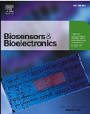
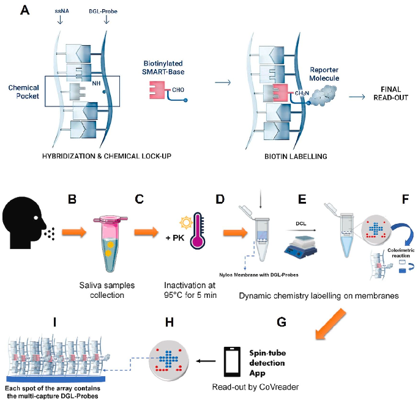
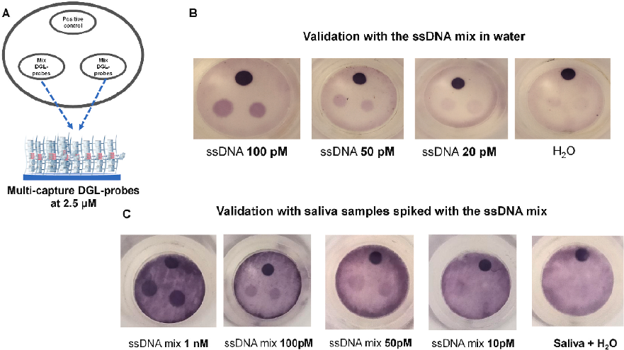
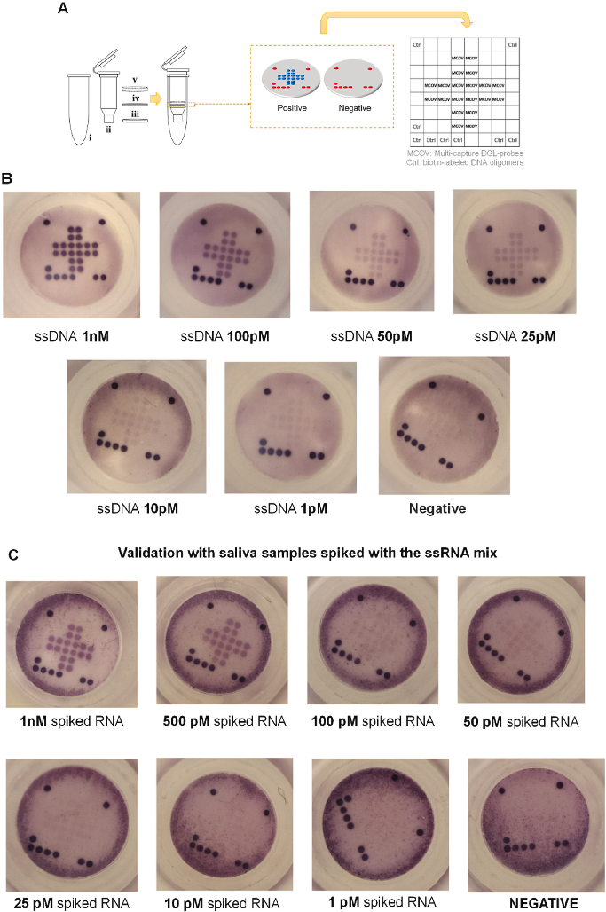
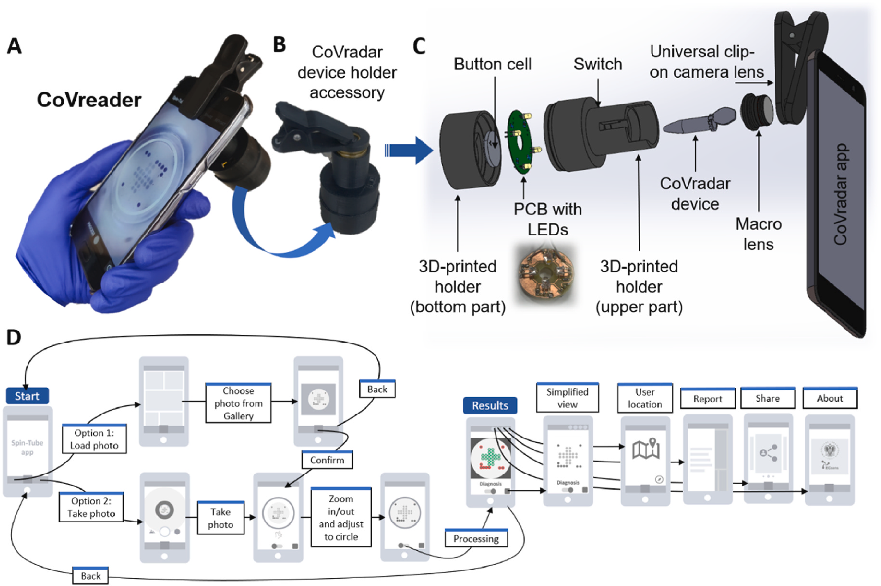
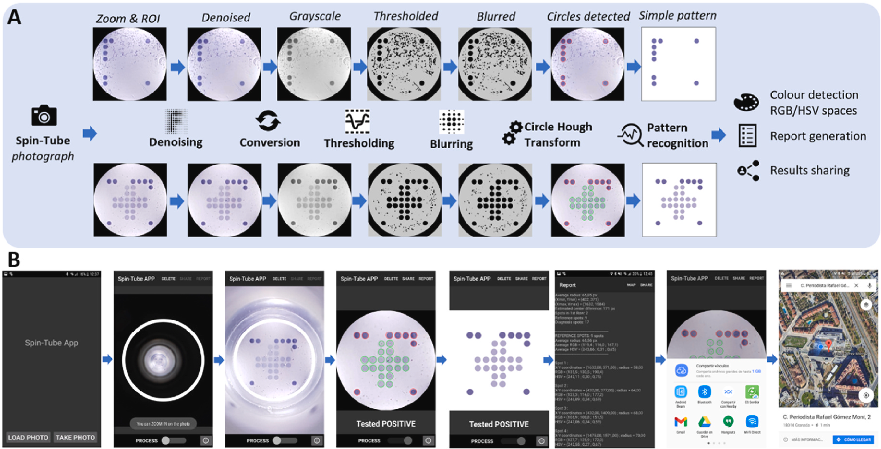

Biosensors and Bioelectronics 230 (2023) 115268

Contents lists available at ScienceDirect 

Biosensors and Bioelectronics 

journal homepage: www.elsevier.com/locate/bios 

SARS-CoV-2 viral RNA detection using the novel CoVradar device  associated with the CoVreader smartphone app 

Carmen Martín-Sierraa,b,c,f,g,1, Mavys Tabraue Chaveza,1, Pablo Escobedod,f,  Victor García-Cabreraa, Francisco Javier Lopez-Delgado´ a, Juan Jose Guardia-Monteagudoa,  Isidoro Ruiz-Garcíad,f, Miguel M. Erenase,f, Rosario Maria Sanchez-Martinb,c,f,g,  Luis Fermín Capitan-Vallvey´ e,f, Alberto J. Palmad,f,**, Salvatore Pernagalloa,***,  Juan Jose Diaz-Mochonb,c,f,g,* 

a DESTINA Genomica S.L. Parque Tecnologico Ciencias de la Salud (PTS), Avenida de la Innovaci´ on 1, Edificio BIC, 18016, Armilla, Granada, Spain ´ b GENYO Centre for Genomics and Oncological Research, Pfizer/University of Granada/Andalusian Regional Government, PTS Granada - Avenida de la Ilustracion, ´ 114– 18016, Granada, Spain  c Department of Medicinal & Organic Chemistry, Faculty of Pharmacy, University of Granada, Campus de Cartuja s/n, Granada, Spain  d ECsens, CITIC-UGR, Department of Electronics and Computer Technology, University of Granada, 18071, Granada, Spain  e ECsens, Department of Analytical Chemistry, University of Granada, 18071, Granada, Spain  f Unit of Excellence in Chemistry Applied to Biomedicine and the Environment of the University of Granada, Granada, Spain  g Instituto de Investigaci´on Biosanitaria ibs.GRANADA, Granada, Spain   

A R T I C L E  I N F O    

Keywords:  Severe Acute Respiratory Syndrome  coronavirus 2 (SARS-CoV-2)  Coronavirus disease 19 (COVID-19)  Colourimetric assay  Dynamic chemistry labelling (DCL)  Image processing system (IPS) 

A B S T R A C T    

The COVID-19 pandemic has highlighted the need for innovative approaches to its diagnosis. Here we present  CoVradar, a novel and simple colorimetric method that combines nucleic acid analysis with dynamic chemical  labeling (DCL) technology and the Spin-Tube device to detect SARS-CoV-2 RNA in saliva samples. The assay  includes a fragmentation step to increase the number of RNA templates for analysis, using abasic peptide nucleic  acid probes (DGL probes) immobilized to nylon membranes in a specific dot pattern to capture RNA fragments.  Duplexes are formed by labeling complementary RNA fragments with biotinylated SMART bases, which act as  templates for DCL. Signals are generated by recognizing biotin with streptavidin alkaline phosphatase and  incubating with a chromogenic substrate to produce a blue precipitate. CoVradar results are analysed by CoVreader, a smartphone-based image processing system that can display and interpret the blotch pattern. CoVradar  and CoVreader provide a unique molecular assay capable of detecting SARS-CoV-2 viral RNA without the need  for extraction, preamplification, or pre-labeling steps, offering advantages in terms of time (~3 h/test), cost  (~€1/test manufacturing cost) and simplicity (does not require large equipment). This solution is also promising  for developing assays for other infectious diseases.   

1. Introduction 

Over the course of the COVID-19 crisis, the importance of reliable,  accessible testing to screen for the disease has become increasingly  apparent. Depending on the target detected, there are three main types  of tests relevant for COVID-19 detection: a) nucleic acid tests, based on 

reverse transcription polymerase chain reaction (RT-qPCR), allowing to  detect and analyze of the viral genome of SARS-CoV-2 (Jiang et al.,  2021; Tombuloglu et al., 2022); b) lateral flow antigen tests detect the  presence of a viral antigen (surface proteins) on SARS-CoV-2 (Agui-

lar-Shea et al., 2021; Pekosz et al., 2021); c) antibody tests by serological  methods that detect antibodies generated against SARS-CoV-2 (James 

* Corresponding author. GENYO Centre for Genomics and Oncological Research, Pfizer/University of Granada/Andalusian Regional Government, PTS Granada -  Avenida de la Ilustracion, 114´ – 18016, Granada, Spain 

** Corresponding author. ECsens, CITIC-UGR, Department of Electronics and Computer Technology, University of Granada, 18071 Granada, Spain. 

*** Corresponding author. DESTINA Genomica S.L. Avenida de la Innovacion 1, 18016 Granada, Spain ´

E-mail addresses: ajpalma@ugr.es (A.J. Palma), salvatore.pernagallo@destinagenomics.com (S. Pernagallo), juandiaz@go.ugr.es (J.J. Diaz-Mochon).    1  These authors have contributed equally to this work. 

https://doi.org/10.1016/j.bios.2023.115268  Received 5 March 2023; Accepted 25 March 2023   

Available online 30 March 2023 0956-5663/© 2023 The Authors. Published by Elsevier B.V. This is an open access article under the CC BY-NC-ND license (http://creativecommons.org/licenses/bync-nd/4.0/).

C. Martín-Sierra et al.                                                                                                                                                                                                                         

Fig. 1. (A) Dynamic Chemical Labelling workflow:  DGL-Probe captures the complementary single-strand  nucleic acid (ssNA) forming the Chemical Pocket.  When the target ssNA hybridisation is complete, the  biotinylated SMART-Base is covalently attached to  the backbone of the DGL-Probe (Chemical Lock-up).  The duplex is read using a Reporter Molecule that  recognizes the biotin tag. (B–I) Schematic diagram of  CoVradar assay. (B) Saliva samples collection in plastic  tubes. (C) Addition of proteinase K, inactivation of Proteinase  K  at  95◦C  for  5  min  (fragmentation).  (D)  Addition to CoVradar detection system. (E) Nucleic acid  analysis by DCL technology. (F) Detection by a colourimetric reaction (blue precipitate) in spots. (G) Read-out  by CoVreader. (H) Defined array layout. (I) schematic  representation  of  the  multi-capture  DGL-probes  spots  included  in  the  nylon  membranes  of  the  CoVradar  detection system. DCL: Dynamic Chemistry Labelling; PK:  Proteinase K.   

et al., 2021). Antibodies can persist in the blood for many months, but  there is insufficient evidence to know how long they last. Therefore,  antibody testing is not recommended to assess immunity to SARS-CoV-2  after COVID-19 vaccination or to assess the need for immunisation in an  unvaccinated person. 

RT-qPCR is considered the gold standard for COVID-19 testing as it  provides a more definitive answer as to whether an individual has the  virus in their body, and genomic sequencing has become vital for  tracking variants (Budd et al., 2023). However, although RT-qPCR is a  precious test, its demanding high complexity requires skilled operators  working in properly equipped laboratories with significant lag times to  provide a result (>24 h), and therefore, it is not suitable for its  deployment and use in many primary care centres (Yüce et al., 2021).  RT-qPCR faces a range of significant limitations, including: i) RNA  extraction variability, with loss of target RNA; ii) RNA instability with  variable degradation of viral RNA, resulting in false negatives; iii)  Longish time to obtain results (Parupudi et al., 2021) and (iv) contamination due to high level of amplicons found within labs established to  run RT-qPCR assays in large numbers per day. 

Among the molecular technologies commonly used, RNA analysis by  Dynamic Chemistry Labelling (DCL) is one of the most promising and  game-changing for nucleic acid testing. DCL technology is based on  combining biotinylated aldehyde-modified nucleobases (SMART-Bases)  with modified PNA capture probes synthesised with an abasic position  (DGL-Probes) to interrogate single-strand nucleic acid (ssNA). As shown  in  Fig. 1A, DCL uses a single biotinylated SMART-Base to label the  duplex formation with the ssNA sequence. The DGL-Probe captures the  complementary ssNA sequence, forming the Chemical Pocket (Fig. 1A).  When  the  target  ssNA  hybridization  is  complete,  the  biotinylated  SMART-Base is covalently attached to the backbone of the DGL-Probe  Chemical Lock-up (Fig. 1A). The duplex is read using a Reporter Molecule that recognizes the biotin tag. DCL technology has been successfully 

demonstrated in various studies (Bowler et al., 2010; Pernagallo et al.,  2012; Venkateswaran et al., 2016; Luque-Gonzalez et al., 2018; Delgado-Gonzalez et al., 2019; Robles-Remacho et al., 2023) (Marin-Romero  et al., 2018; Detassis et al., 2019). 

In this work, our group has tackled the need for novel nucleic acid  testing solutions to interrogate SARS-CoV-2 viral RNA by developing the  “CoVradar” assay (Fig. 1B–I). The methodology behind CoVradar lies in  implementing DCL technology with the Spin-Tube device, a simple  micro-tube with a nylon membrane, where the principle of reverse-dot  blot hybridization can be performed upon DCL reaction to give rise to  a colourimetric end-point assay for nucleic acid testing. Our group first  designed, constructed, and used the Spin-Tube device to detect and  identify trypanosomatid parasites (Tabraue-Ch´avez et al., 2019). More  recently,  the  Spin-Tube  was  also  the  platform  chosen  by  the  multi-million-euro EU-funded ARREST-TB project to deliver accurate,  low-cost, portable and easy-to-use tests for the detection of tuberculosis  (Grant agreement ID: 825,931) (Smirnova et al., 2020). 

Within the framework of this work, we have also developed “CoVreader”, a dedicated portable Image Processing System (IPS) for interpreting CoVradar’s results (Fig. 1G). CoVreader is an implementation of  our previous smartphone-based system for Spin-Tube devices (Escobedo  et al., 2019). It is the combination of hardware and software elements  which enables a digital image processing of CoVradar results by a mobile  phone. CoVreader allows the acquisition, process and transmission of  the images coming from the CoVradar to reference clinicians in remote  locations for advice and treatment decisions with the vision of removing  the need for centralised facilities. 

C. Martín-Sierra et al.                                                                                                                                                                                                                         

2. Material and methods 

2.1. Materials and reagents 

All  chemicals  were  obtained  from  Sigma  Aldrich  and  used  as  received. SCD buffer was prepared from 2x saline sodium citrate (SSC)  and 0.1% sodium dodecyl sulphate (SDS) with the pH adjusted to 6.0  using HCl. All synthetic DNA oligomers (desalted) were purchased from  Integrated  DNA  Technologies,  BV  (Leuven,  Belgium).  Abasic  PNA  probes (DGL-probes) were provided by DESTINA Genomica SL (Granada, Spain), HPLC purified. The concentration of DGL-probes was  determined using the FLUOstar Omega multidetector microplate reader  from BMG LABTECH (Offenburg, Germany) using extinction coefficient  values (Ɛ260) either 6.6, 8.8, 13.7 and 11.7 (mM� 1cm� 1) for C, T, A,  G, respectively. As reported elsewhere, SMART-C-Biotin was prepared  by DESTINA Genomica SL (Granada, Spain) (Bowler et al., 2010).  Buffers and dilution reagents I to III were provided by DESTINA  Genomica SL (Granada, Spain) and buffers IV to VI were purchased from  Vitro SA. (Granada, Spain). Biodyne C Membranes were purchased from  Pall Corporation (US). Membranes were preactivated by DESTINA  Genomica SL (Granada, Spain) using proprietary chemistry. Spin-Tube  plastic elements were purchased from Ciro Manufacturing Corporation  (FL, US). Spin-Tube devices were manually assembled by DESTINA  Genomica SL (Granada, Spain). 

2.2. DGL-probes to target SARS-CoV-2 genomic RNA 

Fifteen DGL-probes were synthesised with amino-PEGylated groups  at their N-terminal end using Fmoc/Bhoc solid phase chemistry and  purified by reverse HPLC. DGL-probes presented in certain positions  units containing propanoic acid residues at their gamma positions  (Venkateswaran et al., 2016; Rissin et al., 2017). DGL-probes’ design  was made to target different regions of SARS-CoV-2 genomic RNA  sequence published by the WHO and available at GenBank: MN908947.  Targeted regions were determined considering optimal hybridization  matching stability of DGL-Probe versus complementary sequences (see  Table S1 in supplementary data). 

N-amino-pegylated DGL-Probes were covalently immobilized onto  the preactivated Biodyne C nylon membranes as previously described by  Tabraue-Chavez et al. (2019)´ . DGL-Probes were solubilised in NaHCO3  buffer (pH 8.3, 0.125M) with amaranth dye (0.2025 mg/mL) and DMSO  (30%) as additives and dispensed by solution into the preactivated nylon  membranes either by (a) manual spotting with a P2 Gilson Pipette or (b)  an  automatic  immobilisation  with  a  piezoelectric  dispenser  (sciFlexarrayer) by SCIENION AG (Berlin, Germany). 

2.3. In vitro generation of ssRNA templates for the assay development 

A library of five single-stranded RNA (or ssRNA) fragments of  different sizes (0.9–2.2 Kb) containing the complementary regions of the  ten selected DGL-probes was generated in vitro. The library was created  from viral genomic RNA extracted from a COVID-19 positive patient  saliva sample. Twelve saliva samples from healthy adult subjects were  used as controls for spiking-in experiments. Saliva samples were provided by the Biobank of the Public Health System of Andalusia (reference S2000262). Informed consent was given by all the individuals  enrolled in this study. The library generation is described in supplementary data “C. A library of five single-stranded RNA”. 

(NaBH3CN) - 20 mM in water; and (iv) 165 μL of SCD buffer. 

2. The protocol carried out consisted of a) Blocking of nylon membranes containing DGL-Probes with 400 μL of reagent I; b) Washing of  membranes with 600 μL of reagent II; c) Incubation of the membranes  for 2 min at 45 ◦C with 200 μL of SCD buffer; d) Incubation of the reaction mixture (from point 1) with the membranes (or CoVradar) at  45 ◦C for 60 min to perform the dynamic chemistry labelling (DCL); e)  Washing of the membranes using 600 μL of reagent II (pre-heated at  45 ◦C); f) A blocking step in which membranes were incubated with 200  μL of reagent III for 5 min at room temperature (RT); g) Incubation of the  membranes with 200 μL of reagent IV at RT for 5 min; h) One post-  enzymatic reaction washing step with 600 μL of reagent V; i) Incubation with 200 μL of the chromogenic substrate (reagent VI) at 45 ◦C for  10 min; j) Finally, one post-chromogen washing step with 200 μL of  reagent II. In all steps, the Spin-Tubes were centrifuged at 6000 rpm for  15 s to discard the solutions between each step. 

2.4.2. Spike-in studies 

Saliva samples from healthy adult subjects were treated with Proteinase K (Sigma Aldrich) to a final concentration of 0.5 mg/mL, 1 mg/  mL and 2 mg/mL, vortex for 1 min at 3000–5000 RPM and heated at  95 ◦C for 5 min to inactivate the proteinase K (untreated saliva sample  was also included). Samples were spiked with the complementary DNA  oligomer (ssDNA) mix at a ratio of 1:10 in saliva and were kept on ice  until the moment of adding them to the reaction to a final concentration  of 100pM. In addition, different concentrations of spike-in ssDNA were  studied (1 nM, 100pM, 50pM, 25pM, 10pM and 1pM) using the optimized Proteinase K concentration of 1 mg/mL at the same experimental  conditions. The same process was carried out for spiking the ssRNA mix  produced by  in vitro  transcription but with a fragmentation step of  ssRNA spiked samples ahead of the incubation. For the fragmentation  process, the ssRNA mix was incubated at 95 ◦C for either 5 min, 15 min  or 30 min and analysed by capillary electrophoresis using the Agilent  2100 Bioanalyzer and the Agilent RNA 6000 Nano Kit (Agilent Technologies). Moreover, the samples spiked with the ssRNA mix were also  incubated at 95 ◦C for either 5 min, 15 min or 30 min and analysed by  DCL on membranes with colourimetric readout. The DCL was carried out  using saliva samples spiked with the ssRNA fragments of the produced  library mixed at a final concentration of 400 pM. 

2.5. Design of CoVreader’s hardware and software 

Our group fabricated a custom-designed accessory to accommodate  the CoVradar device by combining a commercial camera lens clip-on  plus a 3D-printed holder manufactured by our group. The lens coupled  to the clip-on accessory is a macro lens of 12x with a wide lens of 0.67x.  The 3D holder was designed using the open-source software Wings 3D  v2.2.9 and fabricated with a 3D printer Creality3D model CR-X using  black PLA filament. The 3D holder is integrated with a small Printed  Circuit Board (PCB) with four white LEDs (NSDL570GS-K1, Nichia  Corporation, Tokushima, Japan). Android Studio Artic Fox 2020.3.1  Patch 3 was the Integrated Development Environment (IDE) used to  program the mobile phone application. Three different smartphones  were used to test the developed application so that it was verified  running on devices with different Android versions and distinct camera  specifications: a Samsung Galaxy S7, a Xiaomi Mi6, and a OnePlus 8  mobile phone. More information can be found in the supplementary  data. 

2.4. Assay validation 

3. Results 

2.4.1. Dynamic chemistry labelling (DCL) with SMART-C-biotin 

1. The reaction mixture (final volume of 200 μL) was prepared by  combining: i) 20 μL of template in water or saliva (either ssDNA or  ssRNA) - only water or saliva with water for negative controls; ii) 5 μL of  SMART-C-Biotin (200  μM); iii) 10  μL of sodium cyanoborohydride 

3.1. Design and synthesis of DGL-probes 

In an antiparallel fashion, we designed and synthesised fifteen DGL-  Probes  with  sequences  complementary  to  SARS-CoV-2  RNA  viral  genome (N-terminal end of the DGL-Probes face 3′-end of the target RNA 

C. Martín-Sierra et al.                                                                                                                                                                                                                         

Fig. 2. Multi-capture DGL-probes study. (A) Spotting layout: arrays with two side spots with the ten multi-capture DGL-Probes spotted at 2.5 μM concentration and  a middle spot with the solution of biotin-labelled DNA oligomers to control the colourimetric reaction. (B) Sensitivity in water: three decreasing concentrations of  ssDNA in water, respectively 100 pM, 50 pM and 20 pM. Only H2O as negative control. (C) Sensitivity in saliva: four decreasing concentrations of ssDNA in saliva,  respectively 1 nM, 100 pM, 50 pM and 10 pM. Only saliva with H2O as negative control. 

and the C-terminal the 5’end). The fifteen DGL-Probes targeted SARS-  CoV-2 regions are listed in the supplementary data (Table S1). The  performance of the produced fifteen DGL-probes was initially checked  on nylon membranes by dynamic chemistry labelling (DCL) with the  cytosine SMART-Base (SMART-C-Biotin) incorporation followed by a  colourimetric read-out (data not shown). The ten best-performant DGL-  probes (indicated with a YES in Table S1 and Fig. S1) were selected for  the subsequent experimental validation (section 3.2). 

To create CoVradar, DGL-Probes, were covalently immobilized onto  nylon membranes of the Spin-Tube device following specific spot patterns. For this implementation, several DGL-Probes were designed to  hybridize multi regions of SARS-CoV-2 viral genomic RNA. The assay  uses a saliva specimen’s pre-treatment to isolate and fragment the viral  RNA (Fig. 1B–C). The solution with RNA fragments is added into the  Spin-Tube device and interrogated with DCL reaction (Fig. 1D–E). DGL-  Probes hybridize with complementary RNA fragments, the duplexes are  formed and DCL reaction takes place between the secondary amine of  the DGL-probe and the aldehyde group of SMART-Base which is covalently linked to the DGL-Probe (Marin-Romero et al., 2020;  Marín-Romero  et  al.,  2021:  Marín-Romero  et  al., 2022). Remarkably,  CoVradar demonstrates high specificity. The DCL technology requires  two  specific  molecular  events  for  a  signal  generation:  (i)  perfect  hybridisation between RNA fragment and DGL-Probe, and (ii) specific  molecular recognition through Watson–Crick base-pairing rules between the cytosine SMART Nucleobase and the complementary guanine  on the RNA fragment template. Therefore, in the absence of the targeted  RNA fragment or if the RNA fragment lacks guanine on the Chemical  Pocket, the DCL reaction does not occur (Lopez-Longarela et al., 2020´ ;  Garcia-Fernandez et al., 2019; Rissin et al., 2017). 

3.2. Multi-capture DGL-Probes to boost the colourimetric signal 

The ten selected DGL-Probes were mixed into a single solution and  spotted together (multi-capture DGL-probes spot) manually, as indicated in section 2.2. As shown in Fig. S2, arrays containing spots with  individual DGL-Probes and multi-capture DGL-Probes at 2.5 μM and 10 

μM were prepared. The study was carried out following the protocol  described in section  2.4.1. The performances of multi-capture DGL-  probes spots were compared with individual DGL-Probe spots within the  same concentrations (see Fig. S2). It was observed in all membranes  tested that the signal obtained with the multi-capture DGL-probes spots  showed a greater intensity than spots with individual DGL-Probes. A  concentration of 2.5 μM multi-capture DGL-Probes spots was selected  based on its best signal-to-background ratio. 

3.3. Signal intensity study of multi-capture DGL-Probes 

The array layout for studying the assay’s sensitivity is shown in  Fig. 2A. As shown in Fig. 2B, within the two multi-capture DGL-Probes  spots, signal intensities lowered while the ssDNA mix concentration  decreased. A substantial difference was observed for multi-capture DGL-  probes spots in which 100 pM and 50 pM of ssDNA mixtures were used  as templates, whereas the signal for 20 pM was pretty similar to the  background (signal with only water). Signal intensity was also challenged by spiking complementary ssDNAs in saliva samples. Saliva  samples  from  healthy  individuals  were  treated  with  Proteinase  K  (Fig. S3) and spiked with four decreasing concentrations of ssDNA  oligomer mixes, respectively 1 nM, 100 pM, 50 pM and 10 pM. As shown  in  Fig. 2C, a progressive reduction of the colourimetric signals was  observed as a coherent decrease in target ssDNA concentrations. This  indicates that the complex matrix (saliva) is not impacting the DCL assay  or the platform’s sensitivity but improving it since the background signals (only saliva) are almost absent. 

3.4. CoVradar device fabrication 

The novel CoVradar tool was created by implementing the Spin-Tube  device previously developed by our group (Tabraue-Chavez et al., 2019´ )  with a new set of reagents specific for interrogating the SARS-CoV-2  viral genome. As shown in Fig. 3A, it consists of: i) a centrifuge collection tube; ii) an internal column for the assay; iii) a frit; and iv) a nylon  membrane, pre-spotted with DGL-Probes, onto the bottom of the column 

C. Martín-Sierra et al.                                                                                                                                                                                                                         

Fig. 3. Implementation and validation of CoVradar assay. (A) The Spin-Tube device structure: i) a centrifuge collection tube; ii) an internal column for the assay;  iii) a frit; iv) a nylon membrane (pre-spotted with abasic PNA probes) immobilized onto the bottom of the column via a plastic pressure ring (v). (B) Validation of the  assay with saliva samples spiked with a mix of ssDNA templates. (C) Validation of the assay with saliva samples spiked with a mix of ssRNA templates. 

via a plastic pressure ring (v). Multi-capture DGL-Probes were printed  with an automatic dispenser on the nylon membrane to create an array  (Fig. 3A). The array consists of two perpendicular rows of twelve dots  each  (containing  the  multi-capture  DGL-Probes).  In  addition,  biotin-labelled DNA oligomers were printed at the four corners of the  array (nine dots) to control the array’s orientation and the colourimetric  reaction. 

3.5. CoVradar assay validation 

The validation step with the ssDNA mix spiked in saliva samples  provided similar results compared to the results obtained with the 

manual spotting of the multi-capture DGL-probes solution (section 3.3).  We also observed a slight signal lowering as the ssDNA mix amounts  decreased (Fig. 3B). In addition, CoVradar was validated using ssRNA  templates generated in-house from RNA extracted from COVID-19 positive patients (see supplementary data). CoVradar performance for  ssRNA detection was validated with and without a fragmentation step.  Results in Fig. S5 indicated that the fragmentation of the ssRNA mix  samples ahead of the incubation in CoVradar provided the highest intensity  signal  after  the  DCL  and  colourimetric  readout  (Fig.  S5).  Furthermore, different concentrations of the ssRNA fragments mix  ranging from 1 nM to 1 pM were spiked into saliva samples to check the  sensitivity  of  CoVradar.  The  effect  observed  was  similar  to  the 

C. Martín-Sierra et al.                                                                                                                                                                                                                         

Fig. 4. CoVreader for the reading of CoVradar. (A) Smartphone with a clip-on accessory. (B) Photograph of the complete CoVradar holder accessory. (C) Deployed  view of the hardware platform with all components. (D) Software with application user flow showing the user’s path through the smartphone app interface for the  acquisition and processing of CoVradar. 

experimental validation with the saliva samples spiked with the ssDNA  mix (Fig. 3C). As the ssRNA mix amounts decreased, we observed a  lowering of the signal provided after the colourimetric readout. However, signal intensities were slightly lower in the ssRNA mix spiked  samples than in ssDNA mix spiked samples. 

3.6. The CoVradar data processing system 

For accurate data collection and analysis of CoVradar results, we  have developed a dedicated system of image capture and processing  called CoVreader. CoVreader is made of hardware and software parts.  The hardware part consists of two components: i) the mobile phone for  acquiring the image using the rear phone camera (Fig. 4A), and ii) a  custom-designed  accessory  to  accommodate  the  CoVradar  device  aligned with the mobile phone camera (Fig. 4B). This accessory consists  of a camera lens clip-on plus a 3D-printed holder where the CoVradar is  inserted and integrated with the clip-on (Fig. 4C). Combined with the  lens clip-on, the 3D-printed holder ensures correct alignment and positioning of the mobile phone with the CoVradar. The 3D-printed holder  contains four white LEDs to illuminate the CoVradar (Fig. 4C). While the  opaque plastic accessory is useful to block ambient light, the LEDs are  used to provide constant illumination so that the platform can be used  regardless of the external lighting conditions. The software consists of a  ‘user-friendly’ mobile phone app. It has several screens that guide the  user through the steps required to acquire and process a test result  image. The whole process is depicted in the application user flow of  Fig. 4D. In the first place; there is a welcome screen with a menu with  two options: a) Option 1: Load a picture from the gallery; b) Option 2:  Take a picture. If the latter option is chosen, the application starts the  device’s camera so that the user can photograph the CoVradar device. To  obtain correct processing, the user needs to position the CoVradar array  properly, with the reference points aligned vertically/horizontally, in  either of the four possible positions that meet this requirement. Image 

processing has been implemented and optimized based on multiple  CoVradar and samples simulating different conditions regarding signal  intensity, positioning, and background noise. 

4. Discussion 

Our research group has developed CoVradar, a diagnostic test for  SARS-CoV-2 viral RNA detection. The critical drivers to create CoVradar  have been the need for test speed, ease of use, robustness, accuracy of  the results, and affordability to address WHO criteria and expectations  for the ideal diagnostic test. 

CoVradar uses a set of novel DGL-probes to interrogate different  regions of the SARS-CoV-2 viral genome, improving the platform’s  sensitivity. We studied using a mixture of the ten best DGL-probes  immobilized onto the same spot (multi-capture DGL-Probes spot) to  simultaneously target multiple regions of the viral RNA. We have coined  it “inverse amplification”, in which the signal amplification is not given  by enzymatic amplification but by using multiple RNA regions within  the same RNA molecule targeted after a fragmentation step. Using multi-  capture DGL-probes immobilized within the same spot leads to an inverse amplification by a factor of 10 (an order of magnitude). Multi-  capture DGL-Probes spots hybridizes to ten complementary regions of  targeted RNA, thus enabling ten other template molecules from a viral  RNA copy to incorporate SMART-C-biotin tags via DCL rather than one  per viral RNA copy. 

We have selected saliva as the sample of choice for CoVradar. It offers the advantage of being easy, non-invasive, more acceptable for  repeated testing, and can be performed by non-healthcare professionals  or individuals who are properly instructed. Several studies have shown  that SARS-CoV-2 can be detected in the saliva of asymptomatic individuals and outpatients (Kojima et al., 2021; Pasomsub et al., 2021;  Williams et al., 2020). Clinical studies are warranted on the sensitivity of  saliva as sample material for testing symptomatic and asymptomatic 

C. Martín-Sierra et al.                                                                                                                                                                                                                         

Fig. 5. CoVreader for reading the CoVradar device. (A) Flow diagram describing the image processing sequence conducted by the smartphone application. (B)  Screen captures of the smartphone application corresponding to different steps of the related user flow. 

individuals and to standardize the sampling collection methods. We  studied the behaviour of the saliva matrix in our CoVradar assay. When  saliva is enrolled for our spike-in studies, a reduction of background  signals in negative controls is observed compared to using water as a  matrix for the study (Figs. 2C and 3B). This gave us the confidence to  continue developing CoVradar by using saliva as a diagnostic specimen. 

CoVradar was optimized and validated using long ssRNA to mimic  viral genomic RNA. To have sufficient fragments of ssRNA for the  development of CoVradar, we generated a library of in vitro transcribed  ssRNA molecules containing sequences complementary to our multi-  capture DGL-probes (Fig. S1). We designed and set up the conditions  for medium-scale production of five specific ssRNA molecules. Afterwards, gradient concentrations of ssRNA molecules were spiked in saliva  samples and used to validate the CoVradar assay (Fig. 3C). 

We also designed the scheme of an array layout to create a cross-  shaped array considering the membrane diameter of 8 mm, indicating  the positive symbol for SARS-CoV-2 infected patients (Fig. 3A). Moreover, reference spots at the four corners of the array with biotin-labelled  DNA oligomers were printed to control both the orientation of the array  and the colorimetric protocol, acting as a positive control for the  colorimetric reaction as well as reference spots for the orientation of the  array for a correct readout. 

To analyze the results of CoVradar, we developed CoVreader, a  dedicated IPS for the analysis of CoVradar. CoVreader consists of  hardware and software parts. The hardware part includes a mobile  phone for acquiring the image and an accessory to accommodate the  CoVradar device aligned with the mobile phone camera (Fig. 4A–C).  While the software consists of a user-friendly mobile phone app with  simple imagery instructions to facilitate its use given language diversity  across countries (Fig. 4D). The app allows the user to pinch-to-zoom in  and out to align/fit the template grid (white circle) with the CoVradar  array. To obtain correct processing, the user needs to position the  CoVradar array properly, hence why CoVradar was constructed with  biotin-labelled DNA oligomer spots at the four corners of the array (nine  spots) to allow the orientation and good alignment for CoVreader  (Fig. 5A. CoVreader processes the area of interest, discarding the rest of  the image to improve the reliability of the processing. Image processing  has been implemented and optimized based on multiple CoVradar  testing with different signal intensity, positioning, and background noise  characteristics. CoVreader detects, stores in the report, and displays the 

user geolocation. The results can be shared through social networks,  email, messaging, and/or cloud services. 

5. Conclusions 

In this proof of concept, we have developed CoVradar, a colourimetric molecular assay for testing SARS-CoV-2 RNA in saliva specimens.  The limit of detection was the lowest concentration of RNA that could be  observed from colourimetric images with reasonable confidence. CoVradar is the first step COVID-19 detection method based on the detection  of viral RNA without the need for prior RNA extraction or the use of  polymerases to pre-amplify. CoVradar can be adapted to detect new  variants of SARS-CoV-2 by re-designing and changing the sequences of  DGL-Probes. CoVradar result analysis is straightforward and unambiguous thanks to its dedicated CoVreader, a portable smartphone-based  IPS to acquire and process results from CoVradar. CoVreader offers  remote primary care diagnosis and telemetry for "cloud-based" notification to ensure the public health and surveillance interventions. We  believe that the combination of CoVradar and CoVreader represents a  unique solution for testing SARS-CoV-2 viral RNA that offers benefits in  terms of time-to-results (~3 h/test), cost (~€1/test manufacturing cost)  and simplicity (no large equipment required). This new solution opens  the possibility of a repertoire of assays for other infectious diseases, such  as malaria and tuberculosis. 

Declaration of competing interest 

The authors declare the following financial interests/personal re-

lationships which may be considered as potential competing interests:  JJDM is a founder, shareholder and Director of DESTINA Genomics Ltd.  SP is a shareholder of DESTINA Genomics Ltd. DESTINA Genomica SL is  a wholly owned subsidiary of DESTINA Genomics Ltd. DESTINA is  interested in the exploitation of the technology developed here. 

Data availability 

Data will be made available on request. 

C. Martín-Sierra et al.                                                                                                                                                                                                                         

Acknowledgements 

This research work has been funded by FEDER/Junta de Andalucía-  Consejería de Economía y Conocimiento/Project CV20-77741. This  study was also partially funded by: (i) Spanish MCIN/AEI/10.13039/  501100011033/Projects  PID  2019-110987RB-I00  and  PID  2019-  103938RB-I00; (ii) FEDER/Junta de Andalucía-Consejería de Economía  y Conocimiento/Projects P18-RT-2961, P18-TP-4160 and A-FQM-760-  UGR20 and (iii) FEDER/Junta de Andalucía-Consejería de Salud y  Familias/Project PIP-0232-2021. The European Regional Development  Funds (ERDF) partially supported the projects. C. Martin-Sierra and P.  Escobedo thank, respectively grants PTQ 2020-011388 and IJC 2020-  043307-I, both of them funded by MCIN/AEI/10.13039/501100011033  and by “European Union NextGenerationEU/PRTR”. 

Appendix A. Supplementary data 

Supplementary data to this article can be found online at https://doi.  org/10.1016/j.bios.2023.115268. 

References 

Aguilar-Shea, A.L., Vera-García, M., Güerri-Fern´andez, R., 2021. Rapid antigen tests for  the detection of SARS-CoV-2: a narrative review. Atencion Primaria 53. ´ https://doi.  org/10.1016/J.APRIM.2021.102127. 

Bowler, F.R., Diaz-Mochon, J.J., Swift, M.D., Bradley, M., 2010. DNA analysis by  dynamic chemistry. Angew Chem. Int. Ed. Engl. 49, 1809–1812. https://doi.org/  10.1002/ANIE.200905699. 

Budd, J., Miller, B.S., Weckman, N.E., et al., 2023. Lateral flow test engineering and  lessons learned from COVID-19. Nat. Rev. Bioeng. 1, 13–31. https://doi.org/  10.1038/s44222-022-00007-3. 

Delgado-Gonzalez, A., Robles-Remacho, A., Marin-Romero, A., Detassis, S., Lopez-  Longarela, B., Lopez-Delgado, F.J., Miguel-Perez, D., Guardia-Monteagudo, J.J.,  Fara, M.A., Tabraue-Chavez, M., Pernagallo, S., Sanchez-Martin, R.M., Diaz-  Mochon, J.J., 2019. PCR-free and chemistry-based technology for miR-21 rapid  detection directly from tumour cells. Talanta 200, 51–56. https://doi.org/10.1016/j.  talanta.2019.03.039. 

Detassis, S., Grasso, M., Tabraue-Ch´avez, M., Marín-Romero, A., Lopez-Longarela, B., ´ Ilyine, H., Ress, C., Ceriani, S., Erspan, M., Maglione, A., Díaz-Mochon, J.J., ´ Pernagallo, S., Denti, M.A., 2019. New platform for the direct profiling of microRNAs  in. Biofluids Anal. Chem. 91 (9), 5874–5880. https://doi.org/10.1021/acs.  analchem.9b00213. 

Escobedo, P., Erenas, M.M., Martinez Olmos, A., Carvajal, M.A., Tabraue Chavez, M.,  Luque Gonzalez, A., Diaz-Mochon, J.J., Pernagallo, S., Capitan-Vallvey, L.F.,  Palma, A.J., 2019. Smartphone-based diagnosis of parasitic infections with  colorimetric assays in centrifuge tubes. IEEE Access 7, 185677–185686. https://do  i:10.1109/ACCESS.2019.2961230. 

Garcia-Fernandez, E., Gonzalez-Garcia, M.C., Pernagallo, S., Ruedas-Rama, M.J., 

Fara, M.A., Lopez-Delgado, F.J., Dear, J.W., Ilyine, H., Ress, C., Diaz-Mochon, J.J.,  Orte, A., 2019. miR-122 direct detection in human serum by time-gated fluorescence  imaging. Chem. Commun. 55 (99), 14958–14961. https://doi.org/10.1039/ 

C9CC08069D. 

James, J., Rhodes, S., Ross, C.S., Skinner, P., Smith, S.P., Shipley, R., Warren, C.J.,  Goharriz, H., McElhinney, L.M., Temperton, N., Wright, E., Fooks, A.R., Clark, T.W.,  Brookes, S.M., Brown, I.H., Banyard, A.C., 2021. Comparison of serological assays  for the detection of SARS-CoV-2 antibodies. Viruses. https://doi.org/10.3390/  v13040713. 

Jiang, Y., Zhang, S., Qin, H., Meng, S., Deng, X., Lin, H., Xin, X., Liang, Y., Chen, B.,  Cui, Y., Su, Y.H., Liang, P., Zhou, G.Z., Hu, H., 2021. Establishment of a quantitative  RT-PCR detection of SARS-CoV-2 virus. Eur. J. Med. Res. 26, 1–7. https://doi.org/  10.1186/s40001-021-00608-5. 

Kojima, N., Turner, F., Slepnev, V., Bacelar, A., Deming, L., Kodeboyina, S., Klausner, J.  D., 2021. Self-collected oral fluid and nasal swabs demonstrate comparable  sensitivity to clinician collected nasopharyngeal swabs for coronavirus disease 2019  detection. Clin. Infect. Dis. 73 https://doi.org/10.1093/CID/CIAA1589  e3106–e3109.  

Lopez-Longarela, B., Morrison, E.E., Tranter, J.D., Chahman-Vos, L., L´ ´eonard, J.-F.,  Gautier, J.-C., Laurent, S., Lartigau, A., Boitier, E., Sautier, L., Carmona-Saez, P.,  Martorell-Marugan, J., Mellanby, R.J., Pernagallo, S., Ilyine, H., Rissin, D.M.,  Duffy, D.C., Dear, J.W., Díaz-Mochon, J.J., 2020. Direct detection of miR-122 in ´ hepatotoxicity using dynamic chemical labeling overcomes stability and isomiR 

challenges. Anal. Chem. 92 (4), 3388–3395. https://doi.org/10.1021/acs.  analchem.9b05449. 

Luque-Gonzalez, M.A., Tabraue-Chavez, M., Lopez-Longarela, B., Sanchez-Martin, R.M.,  Ortiz-Gonzalez, M., Soriano-Rodriguez, M., Garcia-Salcedo, J.A., Pernagallo, S.,  Diaz-Mochon, J.J., 2018. Identification of Trypanosomatids by detecting Single  Nucleotide Fingerprints using DNA analysis by dynamic chemistry with MALDI-ToF.  Talanta 176, 299–307. https://doi.org/10.1016/j.talanta.2017.07.059. 

Marin-Romero, A., Robles-Remacho, A., Tabraue-Chavez, M., Lopez-Longarela, B.,  Sanchez-Martin, R.M., Guardia-Monteagudo, J.J., Fara, M.A., Lopez-Delgado, F.J.,  Pernagallo, S., Diaz-Mochon, J.J., 2018. A PCR-free technology to detect and  quantify microRNAs directly from human plasma. Analyst 143 (23), 5676–5682.  https://doi.org/10.1039/C8AN01397G. 

Marin-Romero, A., Tabraue-Chavez, M., Dear, J.W., Sanchez-Martin, R.M., Ilyine, H.,  Guardia-Monteagudo, J.J., Fara, M.A., Lopez-Delgado, F.J., Diaz-Mochon, J.J.,  Pernagallo, S., 2020. Amplification-free profiling of microRNA-122 biomarker in  DILI patient serums, using the luminex MAGPIX system. Talanta 219, 121265.  https://doi.org/10.1016/j.talanta.2020.121265. 

Marín-Romero, A., Tabraue-Chavez, M., L´ opez-Longarela, B., Fara, M.A., S´ ´anchez-  Martín, R.M., Dear, J.W., Ilyine, H., Díaz-Mochon, J.J., Pernagallo, S., 2021. ´ Simultaneous detection of drug-induced liver injury protein and microRNA  biomarkers using dynamic chemical labelling on a luminex MAGPIX system.  Analytica 2 (4), 130–139. https://doi.org/10.3390/analytica2040013. 

Marín-Romero, A., Tabraue-Chavez, M., Dear, J.W., Díaz-Moch´ on, J.J., Pernagallo, S., ´

2022. Open a new window on the world of circulating microRNAs by merging  ChemiRNA tech with luminex platform. Sens. Diagn. 1, 1243–1251. https://doi.org/  10.1039/d2sd00111j. 

Parupudi, T., Panchagnula, N., Muthukumar, S., Prasad, S., 2021. Evidence-based point-  of-care technology development during the COVID-19 pandemic. Biotechniques 70,  59–67. https://doi.org/10.2144/BTN-2020-0096. 

Pasomsub, E., Watcharananan, S.P., Boonyawat, K., Janchompoo, P., Wongtabtim, G.,  Suksuwan, W., Sungkanuparph, S., Phuphuakrat, A., 2021. Saliva sample as a non-  invasive specimen for the diagnosis of coronavirus disease 2019: a cross-sectional  study. Clin. Microbiol. Infection 27, 285.e1–285.e4. https://doi.org/10.1016/J.  CMI.2020.05.001. 

Pekosz, A., Parvu, V., Li, M., Andrews, J.C., Manabe, Y.C., Kodsi, S., Gary, D.S., Roger-  Dalbert, C., Leitch, J., Cooper, C.K., 2021. Antigen-based testing but not real-time  polymerase chain reaction correlates with severe acute respiratory syndrome  coronavirus 2 viral culture. Clin. Infect. Dis. 73 https://doi.org/10.1093/CID/  CIAA1706 e2861–e2866.  

Pernagallo, S., Ventimiglia, G., Cavalluzzo, C., Alessi, E., Ilyine, H., Bradley, M., Diaz-  Mochon, J.J., 2012. Novel biochip platform for nucleic acid analysis. Sensors 12 (6),  8100–8111. https://doi.org/10.3390/s120608100. 

Rissin, D.M., Lopez-Longarela, B., Pernagallo, S., Ilyine, H., Vliegenthart, B., Dear, J.W.,  Diaz-Mochon, J.J., Duffy, D.C., 2017. Polymerase-free measurement of microRNA-  122 with single base specificity using single molecule arrays: detection of drug-  induced liver injury. PLoS One 12 (7) e0179669–e0179669.  

Robles-Remacho, A., Luque-Gonzalez, M.A., Lopez-Delgado, F.J., Guardia- ´ Monteagudo, J.J., Fara, M.A., Pernagallo, S., Sanchez-Martín, R.M., Diaz-Mochon, J. ´ J., 2023. Direct detection of alpha satellite DNA with single-base resolution by using  abasic Peptide Nucleic Acids and Fluorescent in situ Hybridization. Biosens.  Bioelectron. 219, 114770 https://doi.org/10.1016/j.bios.2022.114770. 

Smirnova, T., Andreevskaya, S., Larionova, E., Andrievskaya, I., Kiseleva, E.,  Chernousova, L., Ergeshov, A., Mochon, J.D., Trabue, M., Pernagallo, S., Fara, M.A.,  Martínez-Murcia, A., Sirera, A.G., Garcia, A.N., Manganelli, R., Barzon, L.,  Sinigaglia, A., Bradley, M., Norman, D., Venkateswaran, S., 2020. Evaluation of  DestiNA ‘spin-tube’ technology – a novel test for the diagnosis of tuberculosis and  mycobacteriosis. Eur. Respir. J. 56, 526. https://doi.org/10.1183/13993003.  CONGRESS-2020.526. 

Tabraue-Ch´avez, M., Luque-Gonz´alez, M.A., Marín-Romero, A., S´anchez-Martín, R.M.,  Escobedo-Araque, P., Pernagallo, S., Díaz-Mochon, J.J., 2019. A colorimetric ´ strategy based on dynamic chemistry for direct detection of Trypanosomatid species.  Sci. Rep. 9 https://doi.org/10.1038/S41598-019-39946-0. 

Tombuloglu, H., Sabit, H., Al-Khallaf, H., Kabanja, J.H., Alsaeed, M., Al-Saleh, N., Al-  Suhaimi, E., 2022. Multiplex real-time RT-PCR method for the diagnosis of SARS-  CoV-2 by targeting viral N, RdRP and human RP genes. Sci. Rep. 12 (1 12), 1–10.  https://doi.org/10.1038/s41598-022-06977-z, 2022.  

Venkateswaran, S., Luque-Gonzalez, M.A., Tabraue-Chavez, M., Fara, M.A., Lopez-  Longarela, B., Cano-Cortes, V., Lopez-Delgado, F.J., Sanchez-Martin, R.M., Ilyine, H.,  Bradley, M., Pernagallo, S., Díaz-Mochon, J.J., 2016. Novel bead-based platform for ´ direct detection of unlabelled nucleic acids through Single Nucleobase Labelling.  Talanta 161, 489–496. https://doi.org/10.1016/j.talanta.2016.08.072. 

Williams, E., Bond, K., Zhang, B., Putland, M., Williamson, D.A., 2020. Saliva as a  noninvasive specimen for detection of SARS-CoV-2. J. Clin. Microbiol. 58 https://  doi.org/10.1128/JCM.00776-20. 

Yüce, M., Filiztekin, E., Ozkaya, K.G., 2021. COVID-19 diagnosis ¨ —a review of current  methods. Biosens. Bioelectron. 172, 112752 https://doi.org/10.1016/J.  BIOS.2020.112752. 

