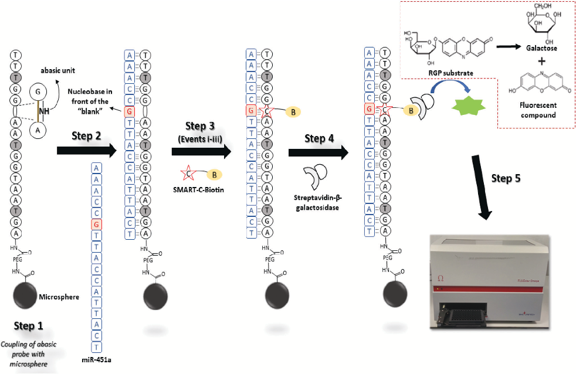
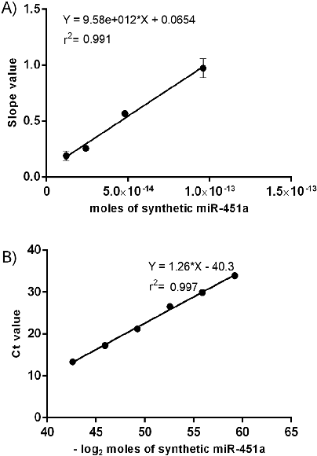
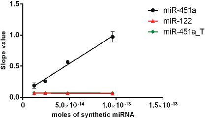
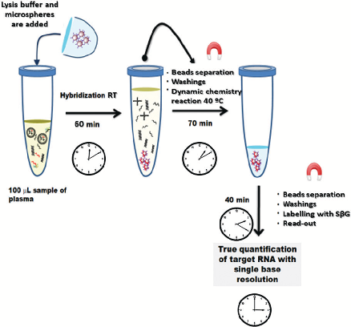
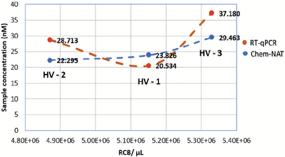

Published on 27 September 2018. Downloaded by Universidad de Granada on 3/3/2024 7:27:35 PM.

# Analyst

|COMMUNICATION View Article OnlineView Journal| View Issue|
|---|

Cite this: Analyst, 2018, 143, 5676

Received 24th July 2018, Accepted 25th September 2018

DOI: 10.1039/c8an01397g rsc.li/analyst

## A PCR-free technology to detect and quantify microRNAs directly from human plasma†

Antonio Marín-Romero,a,b,c Agustín Robles-Remacho,b,c Mavys Tabraue-Chávez,a Bárbara López-Longarela,a Rosario M. Sánchez-Martín, b,c Juan J. Guardia-Monteagudo,a Mario A. Fara,a Francisco J. López-Delgado, a Salvatore Pernagallo *a and Juan J. Díaz-Mochón *b,c

A novel sensitive, specific and rapid method for the detection and quantification of microRNAs without requiring extraction from their biological sources is now available using a novel chemical based, PCR-free technology for nucleic acid testing. In this study, we both demonstrate how this method can be used to profile miR-451a, an important miRNA in erythropoiesis, and compare with the gold standard RT-qPCR.

MicroRNAs (miRNAs) are small non-coding RNA molecules (about 22–24 nucleotides) which function as post-transcriptional regulators of gene expression, by inhibiting the translation of their complementary messenger RNA (mRNA).1,2 Scientific evidence demonstrates that miRNAs play essential roles in major physiological and pathological processes, such as cell differentiation, growth, apoptosis, cycle, angiogenesis and metabolism.3–6 Abnormal expression of miRNAs has been demonstrated to be associated with the development of a broad range of diseases, including cancers.7–9 Understanding the role of miRNAs in pathological processes is key to investigate the genotype–phenotype correlations in pathology, caused by deregulation of miRNA expression.10,11 miRNA signatures may be used for clinical diagnostics as well as the assessment of disease progression.12–15

In this regard, several technologies for miRNA profiling have been developed to date. Most of the tools available are typically based on DNA genotyping methods, relying on polymerase chain reaction (PCR) for the exponential amplification

aDestiNA Genomica S.L. Parque Tecnológico Ciencias de la Salud (PTS), Avenida de la Innovación 1, Edificio BIC, Armilla, Granada 18100, Spain. E-mail: salvatore@destinagenomics.com bGENYO. Centre for Genomics and Oncological Research: Pfizer/University of Granada/Andalusian Regional Government, PTS Granada - Avenida de la Ilustración, 114 - 18016 GRANADA, Spain. E-mail: juanjose.diaz@genyo.es cUniversidad de Granada. Facultad de Farmacia. Departamento de Quimica Farmacéutica y Orgánica, Campus Cartuja s/n, 18071 Granada, Spain

†Electronic supplementary information (ESI) available: Information about materials and methods, instrumentations and sequences employed in this study. See DOI: 10.1039/c8an01397g

of target nucleic acid molecules. Hence, most of the efforts to perform miRNA analysis have been based on implementing PCR based methodologies. Despite advances, these tools are not particularly suitable to investigate small RNA species, such as miRNAs. The detection of miRNAs from clinical samples is challenging and error prone for assays that require laborious sample preparation, such as the elongation of the target molecules (ligation step with an extension sequence), conversion of target molecules into cDNA, and steps for the amplification.16,17 In addition, PCR based methodologies also suffer from bias and sample contamination risk from the production of high concentrations of amplicons.18,19 As a result, miRNA profiling has serious analytical challenges when highly precise and accurate quantification is required for diagnostic purposes. Current tools struggle to offer the innovation required to translate the use of miRNAs from the research sphere into reliable and practical clinical diagnostic assays.20 These unmet innovations have been and remain the major obstacle to developing miRNAs as diagnostic and prognostic biomarkers for cancer, acute organ disease and toxicity testing. As Lowe and Lujambio stated recently “further advances in the technology of miRNA profiling could help to revolutionize molecular pathology”.21 There has been a clear unmet need up to now to develop new, innovative methods that enable reliable, direct profiling and absolute quantification of miRNAs.

Among the several nucleic acid testing (NAT) available, a unique PCR-free method for the direct detection of nucleic acids, the so-called Chemical Nucleic Acid Testing (ChemNAT), which is based on dynamic chemistry, was presented by Bowler et al. in 2010.22 The approach combines the specific labelling of an immobilized abasic peptide nucleic acid (PNA) capture probe with a biotinylated reactive nucleobase, through the templating action of target RNA molecules. Nucleic acid analysis by dynamic chemistry22,23 harnesses Watson–Crick base pairing to template a dynamic reductive amination reaction on an abasic unit of a PNA complementary to the target miR-451a (Fig. S1†), a reaction which is thermodynamically controlled. Complementary nucleic acid strands also act as

Published on 27 September 2018. Downloaded by Universidad de Granada on 3/3/2024 7:27:35 PM.

catalysts to accelerate the rate of reductive amination. Therefore, when there are non-complementary nucleic strands, reactions do not occur within the assay timeframe, as we have shown previously.22,24–28 Assay signals are generated through specific hapten-binding events which allow target quantification. Chem-NAT has been validated by genotyping cystic fibrosis patients,24 distinguishing high homologous DNA sequences from different parasite species25 and profiling, with single base resolution accuracy, the expression of circulating miR-122 in drug-induced liver injury (DILI) patients.27,28

Herein, Chem-NAT was applied to the direct detection of miR-451a in human plasma without performing RNA extraction. miR-451a is an erythroid cell-specific miRNA,29,30 and associated with human erythroid and maturation.29–32 In addition, several studies have provided evidence about the potential use of miR-451a as a biomarker for cancer diagnosis, prognosis, and treatment.33–37

To show the feasibility of this approach, Chem-NAT was used with a conventional multi-mode micro-plate reader (FLUOstar OMEGA instrument) in order to develop a novel

cost-effective manner for quantifying miRNAs, that we have called “Chem-NAT ELISA”. An abasic PNA probe (Table S1 – ID: 1†) complementary to target miR-451a (Table S1 – ID: 2†) was synthesised and covalently bound to microspheres (Fig. 1, Step 1 and ESI, section S1†). Assay signals were then created as described elsewhere.27 Briefly, after abasic probes were conjugated to magnetic microspheres, the miR-451a was hybridised (Fig. 1, Step 2), templating the incorporation of aldehyde-modified cytosine with biotin (SMART-C-Biotin) (Fig. 1, Step 3), whose structure is included in ESI, Fig. S2.† The microspheres were labelled with streptavidin-β-galactosidase (SβG) (Fig. 1, Step 4). Following streptavidin–biotin recognition, a resorufinβ-D-galactopyranoside (RGP) fluorogenic substrate was added to prepare a fluorescent solution upon enzymatic hydrolysis of RGP by β-galactosidase, which gives rise to the fluorescent molecule, resorufin. Relative fluorescence units (RFU) were recorded during a 9 minute period with a FLUOstar OMEGA instrument (Fig. 1, Step 5) equipped with 544 ± 10 nm excitation and 590 ± 10 nm emission filters and the slope of the linear region of the reaction time course was calculated.

Fig. 1 Chem-NAT ELISA to profile miR-451a expression in blood samples. Step 1: Abasic PNA probe complementary to miR-451a is coupled to magnetic microspheres. Step 2: Abasic PNA probe hybridises miR-451a. Step 3: Covalent modification of the abasic PNA probe with SMART-C-Biotin through the templating role of miR-451a. This covalent modification requires three events to take place: (i) perfect hybridisation between the abasic probe and miR-451a; (ii) generation of a reversible iminium species between the secondary amine of the “abasic unit” and the aldehyde group of the SMART-C-Biotin which is driven by the templating “G” nucleobase at the 6th position from the 5’-end of miR-451a; (iii) reduction of the iminium species by sodium cyanoborohydride to lock-up the SMART-C-Biotin covalently into the duplex. Step 4: Microsphere labelling with streptavidinβ-galactosidase (SβG); Step 5: Addition of RGP substrate and fluorescence detection using a FLUOstar OMEGA instrument.

Published on 27 September 2018. Downloaded by Universidad de Granada on 3/3/2024 7:27:35 PM.

The analytical sensitivity of Chem-NAT ELISA was determined by creating a calibration curve (for protocols details see ESI, section S2†) using known quantities of synthetic miR-451a molecules: 96, 48, 24 and 12 fmoles in a total hybridization volume of 300 µL, equal to 320, 160, 80 and 40 pM respectively (water was used as a negative control). Experiments were performed in triplicate with coefficients of variants for each condition below 10%, except for the negative control which has shown a CV value of ∼25% (ESI – Table S2†). The average slope values obtained for the four quantities of template RNA were, respectively, 0.973 ± 0.06 RFU s−1, 0.567 ± 0.09 RFU s−1, 0.257 ± 0.02 RFU s−1 and 0.17 ± 0.02 RFU s−1 and 0.070 ± 0.02 RFU s−1 for the control. The curve was obtained by plotting the slope values versus the quantity of synthetic RNA molecules (Fig. 2A). To determine the limit of detection (LoD), we used the formula based on the standard deviation of the blank and the slope (formula (1)).

3:3 SDblank slope ð1Þ

LoD ¼

The LoD was calculated as 6.89 fmoles in a total hybridization volume of 300 µL which is equal to 22.97 pM (4.15 × 109 molecules).

Fig. 2 Calibration curves generated using both methodologies. (A) Plot of slope values of fluorescent signals vs. number of moles of synthetic miR-451a; (B) plot of Ct values vs. −log2 of moles of miR-451a spiked-in. Error bars (±1 s.d.) based on triplicate measurements; in Fig. 2B, the error bars are smaller than the size of data points. n = 3.

In parallel, a comparative calibration curve was created using RT-qPCR, plotting the Ct values versus −log2 of synthetic miR-451a quantities (Fig. 2B).

Seven quantities of synthetic miR-451a: 15, 1.5, 0.15, 0.015, 1.5 × 10−4, 1.5 × 10−5 and 1.5 × 10−6 fmoles in a total reverse transcription reaction volume of 15 µL, thus equal to 1, 0.1,

- 0.01, 0.001, 0.0001, 0.00001 and 0.000001 nM were used. As described in section S3 of the ESI,† the amplification was carried out using 2.5 µL of cDNA in a final volume of 20 µL. The Ct values obtained presented coefficients of variance below 1.5% (ESI, Table S3†). The average Ct signals obtained for the seven quantities were respectively 17.252 ± 0.1, 21.254 ±
- 0.2, 26.590 ± 0.2, 29.907 ± 0.2, 36.627 ± 0.3, 37.958 ± 0.3 and not detectable for the lowest concentration of miRNA (1.5 × 10−6 fmoles). To estimate the LoD, the Ct values obtained with the two lowest detectable quantities (1.5 × 10−5 and 1.5 × 10−4 fmoles) were averaged and the standard deviation was determined. The Ct value at 3 SD below the average was 36.250, resulting in a LoD of 4.741 × 10−4 fmoles in a total volume of 15 µL (volume related to the generation of cDNA), thus equal to 31.60 fM (2.85 × 10 molecules).

The specificity of Chem-NAT ELISA was investigated using a non-complementary synthetic miR-122 as well as a target containing a single nucleotide mismatch (miR-451a_T) which presents a thymine in front of the abasic probe position instead of a guanine (Table S1†). As shown in Fig. 3, when the perfectly complementary target miR-451a was used the signal showed a linear correlation with miR-451a concentration while with miR-122 and miR-451a_T the signals were unaffected. These results show the high discrimination capability offered by this approach, which can be exploited to analyse isomiRNAs.

Upon the generation of calibration curves and the determination of sensitivity (LoD) and specificity, both methods were employed for the direct detection of miR-451a in blood samples of three healthy volunteers (HVs). All experiments were performed in accordance with the Guidelines of Spain, and approved by the ethics committee at the Centro de Investigación de Granada, Servicio Andaluz de Salud.

Fig. 3 Plot of slope values of fluorescent signals vs. number of moles (96, 48, 24 and 12 fmoles in a total hybridization volume of 300 µL) of synthetic miRNAs. ●: Full-complementary target miR-451a; ▲: Noncomplementary miR-122; ◆: miR-451a_T target containing a single nucleotide mismatch. n = 3.

Published on 27 September 2018. Downloaded by Universidad de Granada on 3/3/2024 7:27:35 PM.

Informed consents were obtained from the human participants of this study. The samples were haemolysed in order to liberate intra-erythropoietic miR-451a (haemolysed samples). Briefly, 1 mL of whole blood was incubated for 10 min with 19 mL of red blood cell (RBC) lysis buffer (dilution 1 : 20) to breakup red blood cells (Fig. S3-A†). The solution was then centrifuged at 1500g for 10 min at room temperature in order to obtain the haemolysed plasma with free miR-451a. Haemolysis was validated by microscopy as shown in the ESI (section 4†). Control samples (without free miR-451a) were prepared using whole blood without haemolysis. In this case, 3 mL of whole blood was centrifuged at 1500g for 10 min at room temperature. The supernatant plasma was collected and diluted 20 times with RBC lysis buffer to obtain the non-haemolysed plasma (Fig. S3-B†).

Plasma samples containing RBC lysis buffer (1 : 20) with/ without free miR-451a were then tested using the Chem-NAT ELISA technology and compared with the RT-qPCR. As shown in Fig. 4 with the Chem-NAT ELISA, 100 µL of plasma samples containing RBC lysis buffer (1 : 20) samples were then incubated with a lysis buffer for both protein denaturation and exosome lysis containing microspheres (250 000) functionalised with abasic PNA probes complementary to miR-451a for 1 h, in a final volume of 300 μL, to capture the free miR-451a. For the reaction, the microspheres were firstly pelleted down and then re-suspended in a reaction buffer containing SMART-C-Biotin and a reducing agent with a final volume of 50 μL. The fluorescent signal was created by incubating the microspheres with SβG and adding an RGP substrate (see ESI,

Fig. 4 Chem-NAT ELISA workflow. A mixture containing lysis buffer (200 µL) and microspheres (2.5 × 105) functionalized with the abasic PNA probe complementary to miR-451a is added to 100 µL of plasma sample containing RBC lysis buffer (1 : 20) to capture miR-451a for 1 h at RT. Microspheres were pelleted down, washed three times and resuspended in 50 µL of reaction buffer containing SMART-C-Biotin. Microspheres were labelled with SβG which trigger a fluorescence reaction for a final read out.

section S5†). Signals were read-out using FLUOstar OMEGA and the slopes were calculated.

With the haemolysed samples containing RBC lysis buffer (1 : 20), Chem-NAT ELISA was able to detect and quantify the free miR-451a. However, in the non-haemolysed plasma, the low concentration of miR-451a did not allow detection.

The absolute quantification was possible by extrapolating from the calibration curve (Fig. 2A) the number of moles of miR-451a using the slope values measured and reported in ESI, Table S4.† The measurements were made in triplicates on two different days (day 1 and day 2). Concentrations of

- miR-451a for all samples are reported in Table 1. The number of moles (in the total 100 µL added) was extrapolated by using the calibration curve shown in Fig. 2A. To calculate the concentration of the plasma sample, the dilution factor 1 : 20 provided by the RBC lysis buffer plus the dilution factor 1 : 3 provided by the exosomal lysis buffer were taken into account. This means that the concentration of miR-451a in the solution containing both lysis buffers was 60 times lower than the sample concentration shown in the table. Controls are represented by non-haemolysed plasmas.

The RT-qPCR analysis was carried out on RNA isolated from plasma samples of the three HVs (ESI, section S6†). Reverse transcription and amplification were carried out according to the manufacturer’s protocols as described in ESI, section S7.† The absolute quantification was possible by extrapolating from the calibration curve (Fig. 2B) the number of moles of miR-451a using the Ct values measured and reported in ESI, Table S5.† The measurements were made in triplicate at two different days (day 1 and day 2). Concentrations of

- miR-451a for all samples are reported in Table 2. Controls are represented by non-haemolysed plasmas (NHP).

In Table S6,† we report the comparative analysis between the average concentrations at day 1 vs. day 2 to measure the inter-experiment variability between the two technologies. The comparative analysis was not undertaken for the non-haemolysed plasmas. As shown in Table S6,† Chem-NAT ELISA shows CV values between 2–4%, indicating a high inter-experimental repeatability through the two experiment days, whereas RT-qPCR shows CV values of 7%, 33% and 83% respectively for HV1, HV2 and HV3.

Table 1 Absolute quantification of miR-451a by Chem-NAT ELISA

Average slope (RFU s−1) Sample moles

Sample concentration (nM)

Sample code

- HV 1 – HP 1.234 ± 0.04 1.220 × 10−13 24.40
- HV 2 – HP 1.160 ± 0.04 1.143 × 10−13 22.86
- HV 3 – HP 1.512 ± 0.05 1.510 × 10−13 30.20

- HV 1 – NHP 0.074 ± 0.03 n.d n.d
- HV 2 – NHP 0.068 ± 0.01 n.d n.d
- HV 3 – NHP 0.085 ± 0.01 n.d n.d

The average slope was calculated using the six measurements made at two different days (day 1 and day 2), see Table S4. HV: Healthy volunteer; HP: Haemolysed plasma; NHP: Non-haemolysed plasma; n. d: non-detected.

Published on 27 September 2018. Downloaded by Universidad de Granada on 3/3/2024 7:27:35 PM.

Table 2 Absolute quantification of miR-451a by RT-qPCR

Sample concentration (nM)

Sample code Average Ct Sample moles

- HV 1 – HP 14.158 ± 0.132 9.756 × 10−14 19.513
- HV 2 – HP 13.884 ± 0.606 1.134 × 10−13 22.687
- HV 3 – HP 14.212 ± 1.733 9.471 × 10−13 18.942

- HV 1 – NHP 23.328 ± 0.129 6.287 × 10−16 0.126
- HV 2 – NHP 22.859 ± 0.037 8.138 × 10−16 0.163
- HV 3 – NHP 23.472 ± 0.593 5.808 × 10−16 0.116

The average Ct was calculated using the six measurements made on two different days (day 1 and day 2), see Table S5. The number of moles was extrapolated by using the calibration curve shown in Fig. 2B. Moles were calculated making the anti-logarithm in base 2 of the data in Fig. 2B. The concentration was calculated in a final volume of 100 µL, taking also into account the factor of dilution 1 : 20 with the RBC lysis buffer. HV: Healthy volunteer; HP: Haemolysed plasma; NHP: Non-haemolysed plasma; n.d: non-detected.

Fig. 5 Plot of correlation between the number of RBC per µL vs. the miR-451a concentration (nM). Only the Chem-NAT method shows this correlation, i.e. the higher the number of RBC per µL, the higher the concentration of miR-451a.

In addition, we studied the correlation between the two technologies (ESI, Fig. S4†), as well as the relative signal measured according the number of RBC per μL (hemograms of each volunteers are included in ESI, Fig. S5†). Fig. 5 shows the correlation between the numbers of RBC per µL and the concentration measured using Chem-NAT ELISA. Higher levels of miR-451a were detected in those samples with a higher RBC per µL. Whereas the RT-qPCR results did not show the same correlation, HV2 with the lowest RBC per µL showed the second highest concentration of miR-451a, instead of the expected lowest concentration.

### Conclusions

To facilitate the use of miRNA biomarkers in clinical diagnostics, we have developed a method to quantify directly miRNA which is different to all other systems for nucleic acid testing. Our Chem-NAT reagents were combined with a conventional multi-mode micro-plate reader, creating a novel cost-effective ELISA-type system that we have coined as Chem-NAT ELISA. This system allows profiling of miRNAs with a single base,

without the need for extracting RNA molecules, amplifying them (PCR-free) or adding modification to native mature miRNA (label-free). This direct detection method overcomes the various limitations of conventional methods for analysing miRNAs, such as: (a) the challenges associated with the preextraction of RNAs and; (b) the problems related to both the reverse transcription and amplification.

Here, the novel Chem-NAT ELISA was used for an accurate quantification of miR-451a. In a first instance, the system was used to generate a calibration curve so as to determine the instrumental LoD, resulting in about 20 pM. The calibration curve was also used to quantify the level of miR-451a expression in three HV blood samples. The samples used for this proof of concept study were haemolysed in order to liberate intra-erythropoietic miR-451a, while non-haemolysed plasma samples were used as controls.

For the three HV samples, miR-451a was detected respectively at 24.40, 22.86 and 30.20 nM, while it was not detected (n.d.) in non-haemolysed plasma. When using RT-qPCR, miR-451a was also detected in the non-haemolysed plasmas

- (Table 2). This indicated that there is free miR-451a also in non-haemolysed plasmas, which were not detectable via the plate reader due to insufficient sensitivity. To address the issue related to the sensitivity, our group has used an innovative single molecule resolution platform (SIMOA HD-1) which allows up to 1000-fold better sensitivity in comparison with conventional reader systems. Recently, using the Chem-NAT approach, we were able to profile the expression of circulating miRNA-122 in drug-induced liver injury (DILI) patients within a LoD of about 500 fM.28 Hence, by using more sensitive detection platforms such as SIMOA HD-1 instead of a plate reader, the presented chemistry and protocols will be able to address the issue concerning the sensitivity. In that way, the detection of miR-451a whose levels in non-haemolysed plasmas are about 5000–10 000 fM will be possible.

The presented detection system has shown superior: (a) inter-experimental repeatability through the two experiment days and (b) correlation between the RBC per µL and measured concentration of miR-451a. This is most likely due to our method not being affected by the common issues associated with RT-qPCR, such as extraction of RNAs, generation of cDNA and amplification. Generally, for quantification by RT-qPCR, it is assumed that all the sample preparation steps are effective at 100%. Unfortunately, in practice this is rarely the case, due to variable recovery rates of RNAs during an extraction, as well as a poor reverse transcription in generating cDNA. This can result in a misreading of absolute initial mature miRNAs, not being translated to cDNA and therefore being amplified, whereas with the Chem-NAT system there are no longer laborious sample preparation steps with errors/variability, being a direct method that allows read-outs of the absolute number of mature miRNAs, requiring neither pre-amplification nor prelabelling of target nucleic acids.

Chem-NAT ELISA delivers a number of advantages over RTqPCR for the detection of miRNA in the research environment

- (Table 3). Chem-NAT ELISA provides a consistent method to

Published on 27 September 2018. Downloaded by Universidad de Granada on 3/3/2024 7:27:35 PM.

Table 3 Comparison between Chem-NAT ELISA and RT-qPCR. Mod.: Moderate

Interexperiment repeatability

Specimen collection flexibility

Time to result

Extraction required

Amplification required

Direct quantification

Overall test cost

Sample Size required Sensitivity Specificity

Method

≥ 2 µL Mod. High RT-qPCR ≈6 h Yes Yes No Mod. High EDTA Only ≥ 100 µL High Mod.

≈3 h No No Yes High Mod. All collection tubes

Chem-NAT ELISA

detect not only intra-erythropoietic miR-451a, but also other relevant miRNAs with a level of expressions comparable to the sensitivity achieved in this study. By reducing the dilution of biological fluids to release free-miRs, if compared to this proof of concept, plus using more advanced platforms with higher sensitivity (e.g. SIMOA HD-1),28 Chem-NAT ELISA will be able to detect miRNA found in biological fluids at low concentrations.

### Conflicts of interest

JJDM is a shareholder and Director of DestiNA Genomics Ltd. SP is a shareholder of DestiNA Genomics Ltd.

### Acknowledgements

This research was partially supported by the Consejería de Economía, Innovación, Ciencia y Empleo de la Junta de Andalucía (Convocatoria de Proyectos de Investigación de Excelencia para el año 2012, Project reference BIO-1778) and the Ministry of Economy and Competitiveness (National Programme for Research Aimed at the Challenges of Society, BIO2016-80519-R). A. Marin-Romero thanks DestiNA Genomics and the University of Granada for a PhD scholarship (P26 program – Industrial PhD of the Research and Knowledge Transfer Programme). F. J. López-Delgado thanks Spanish Ministerio de Economía y Competitividad for a Torres Quevedo fellowship (PTQ-16-08597). J. J. Díaz-Mochón thanks FP7 for its support under the project 322276 CHEMiRNA. We kindly acknowledge Maria Luz Bellido and María Alcalá from UGC Laboratorios Campus de la Salud (Granada) for assisting us with the erythrocytes counting. Thanks to Hugh Ilyine for his valuable proof reading.

### Notes and references

- 1 D. P. Bartel, MicroRNAs: genomics, biogenesis, mechanism, and function, Cell, 2004, 116(2), 281–297.
- 2 V. Ambros, The functions of animal microRNAs, Nature,

- 2004, 431(7006), 350–355.

3 E. Wienholds, W. P. Kloosterman, E. Miska, E. AlvarezSaavedra, E. Berezikov, E. de Bruijn, et al., MicroRNA expression in zebrafish embryonic development, Science,

- 2005, 309(5732), 310–311.

- 4 M. Zhan, C. P. Miller, T. Papayannopoulou, G. Stamatoyannopoulos and C. Z. Song, MicroRNA

expression dynamics during murine and human erythroid differentiation, Exp. Hematol., 2007, 35(7), 1015–1025.

- 5 D. P. Bartel, MicroRNAs: target recognition and regulatory functions, Cell, 2009, 136(2), 215–233.
- 6 M. Kim, Y. S. Tan, W. C. Cheng, T. J. Kingsbury, S. Heimfeld and C. I. Civin, MIR144 and MIR451 regulate human erythropoiesis via RAB14, Br. J. Haematol., 2015, 168(4), 583–597.
- 7 S. L. Romero-Cordoba, I. Salido-Guadarrama, M. Rodriguez-Dorantes and A. Hidalgo-Miranda, miRNA biogenesis: biological impact in the development of cancer, Cancer Biol. Ther., 2014, 15(11), 1444–1455.
- 8 S. Bajan and G. Hutvagner, Regulation of miRNA processing and miRNA mediated gene repression in cancer, Microrna, 2014, 3(1), 10–17.
- 9 G. Van Peer, E. Mets, S. Claeys, I. De Punt, S. Lefever, M. Ongenaert, et al., A high-throughput 3′ UTR reporter screening identifies microRNA interactomes of cancer genes, PLoS One, 2018, 13(3), e0194017.
- 10 Y. Shen, J. M. Gong, L. L. Zhou and J. H. Sheng, MiR-451 as a new tumor marker for gastric cancer, Oncotarget, 2017, 8(34), 56542–56545.
- 11 P. LArki, A. Ahadi, A. Zare, S. Tarighi, M. Zaheri, M. Souri, et al., Up-Regulation of miR-21, miR-25, miR-93, and miR-106b in Gastric Cancer, Iran. Biomed. J., 2018, 22(6), 367–373.
- 12 I. Berindan-Neagoe, M. PeC, B. Pasculli and G. A. Calin, MicroRNAome genome: a treasure for cancer diagnosis and therapy, Ca–Cancer J. Clin., 2014, 64(5), 311–336.
- 13 J. Du and L. Zhang, Analysis of salivary microRNA expression profiles and identification of novel biomarkers in esophageal cancer, Oncol. Lett., 2017, 14(2), 1387–1394.
- 14 E. K. Ng, R. Li, V. Y. Shin, H. C. Jin, C. P. Leung, E. S. Ma, et al., Circulating microRNAs as specific biomarkers for breast cancer detection, PLoS One, 2013, 8(1), e53141.
- 15 H. Fayyad-Kazan, N. Bitar, M. Najar, P. Lewalle, M. FayyadKazan, R. Badran, et al., Circulating miR-150 and miR-342 in plasma are novel potential biomarkers for acute myeloid leukemia, J. Transl. Med., 2013, 11, 31.
- 16 K. Kang, X. Peng, J. Luo and D. Gou, Identification of circulating miRNA biomarkers based on global quantitative realtime PCR profiling, J. Anim. Sci. Biotechnol., 2012, 3(1), 4.
- 17 Y. Chen, J. A. Gelfond, L. M. McManus and P. K. Shireman, Reproducibility of quantitative RT-PCR array in miRNA expression profiling and comparison with microarray analysis, BMC Genomics, 2009, 10, 407.
- 18 L. Moldovan, K. E. Batte, J. Trgovcich, J. Wisler, C. B. Marsh and M. Piper, Methodological challenges in

Published on 27 September 2018. Downloaded by Universidad de Granada on 3/3/2024 7:27:35 PM.

utilizing miRNAs as circulating biomarkers, J. Cell. Mol. Med., 2014, 18(3), 371–390.

- 19 D. Poel, T. E. Buffart, J. Oosterling-Jansen, H. M. Verheul and J. Voortman, Evaluation of several methodological challenges in circulating miRNA qPCR studies in patients with head and neck cancer, Exp. Mol. Med., 2018, 50(3), e454.
- 20 P. Tiberio, M. Callari, V. Angeloni, M. G. Daidone and V. Appierto, Challenges in using circulating miRNAs as cancer biomarkers, BioMed Res. Int., 2015, 2015, 731479.
- 21 A. Lujambio and S. W. Lowe, The microcosmos of cancer, Nature, 2012, 482(7385), 347–355.
- 22 F. R. Bowler, J. J. Diaz-Mochon, M. D. Swift and M. Bradley, DNA analysis by dynamic chemistry, Angew. Chem., Int. Ed., 2010, 49(10), 1809–1812.
- 23 F. R. Bowler, P. A. Reid, A. C. Boyd, J. J. Diaz-Mochon and M. Bradley, Dynamic chemistry for enzyme-free allele discrimination in genotyping by MALDI-TOF mass spectrometry, Anal. Methods, 2011, 2656–1663.
- 24 J. M. Heemstra and D. R. Liu, Templated synthesis of peptide nucleic acids via sequence-selective base-filling reactions, J. Am. Chem. Soc., 2009, 131(32), 11347–11349.
- 25 M. Angélica Luque-González, M. Tabraue-Chávez, B. LópezLongarela, S. María, R. ánchez-Martín, M. Ortiz-González, M. Soriano-Rodríguez, et al., Identification of Trypanosomatids by detecting Single Nucleotide Fingerprints using DNA analysis by dynamic chemistry with MALDI-ToF, Talanta, 2018, 176, 299–307.
- 26 S. Pernagallo, G. Ventimiglia, C. Cavalluzzo, E. Alessi, H. Ilyine, M. Bradley, et al., Novel biochip platform for nucleic acid analysis, Sensors, 2012, 12(6), 8100–8111.
- 27 S. Venkateswaran, M. A. Luque-González, M. TabraueChávez, M. A. Fara, B. López-Longarela, V. Cano-Cortes, et al., Novel bead-based platform for direct detection of unlabelled nucleic acids through Single Nucleobase Labelling, Talanta, 2016, 161, 489–496.
- 28 D. M. Rissin, B. López-Longarela, S. Pernagallo, H. Ilyine, A. D. B. Vliegenthart, J. W. Dear, et al., Polymerase-free

- measurement of microRNA-122 with single base specificity using single molecule arrays: Detection of drug-induced liver injury, PLoS One, 2017, 12(7), e0179669.
- 29 D. M. Patrick, C. C. Zhang, Y. Tao, H. Yao, X. Qi, R. J. Schwartz, et al., Defective erythroid differentiation in miR-451 mutant mice mediated by 14-3-3zeta, Genes Dev., 2010, 24(15), 1614–1619.
- 30 K. D. Rasmussen, S. Simmini, C. Abreu-Goodger, N. Bartonicek, M. Di Giacomo, D. Bilbao-Cortes, et al., The miR-144/451 locus is required for erythroid homeostasis, J. Exp. Med., 2010, 207(7), 1351–1358.
- 31 S. Svasti, S. Masaki, T. Penglong, Y. Abe, P. Winichagoon, S. Fucharoen, et al., Expression of microRNA-451 in normal and thalassemic erythropoiesis, Ann. Hematol., 2010, 89(10), 953–958.
- 32 L. Pase, J. E. Layton, W. P. Kloosterman, D. Carradice, P. M. Waterhouse and G. J. Lieschke, miR-451 regulates zebrafish erythroid maturation in vivo via its target gata2, Blood, 2009, 113(8), 1794–1804.
- 33 X. Pan, R. Wang and Z. X. Wang, The potential role of miR-451 in cancer diagnosis, prognosis, and therapy, Mol. Cancer Ther., 2013, 12(7), 1153–1162.
- 34 S. Tsuchiya, M. Oku, Y. Imanaka, R. Kunimoto, Y. Okuno, K. Terasawa, et al., MicroRNA-338–3p and microRNA-451 contribute to the formation of basolateral polarity in epithelial cells, Nucleic Acids Res., 2009, 37(11), 3821–3827.
- 35 Â. Ribeiro-dos-Santos, A. S. Khayat, A. Silva, D. O. Alencar, J. Lobato, L. Luz, et al., Ultra-deep sequencing reveals the microRNA expression pattern of the human stomach, PLoS One, 2010, 5(10), e13205.
- 36 R. Wang, Z. X. Wang, J. S. Yang, X. Pan, W. De and L. B. Chen, MicroRNA-451 functions as a tumor suppressor in human non-small cell lung cancer by targeting ras-related protein 14 (RAB14), Oncogene, 2011, 30(23), 2644–2658.
- 37 H. B. Bian, X. Pan, J. S. Yang, Z. X. Wang and W. De, Upregulation of microRNA-451 increases cisplatin sensitivity of non-small cell lung cancer cell line (A549), J. Exp. Clin. Cancer Res., 2011, 30, 20.

