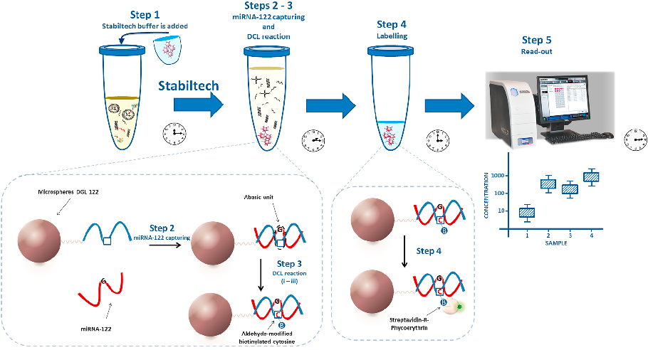
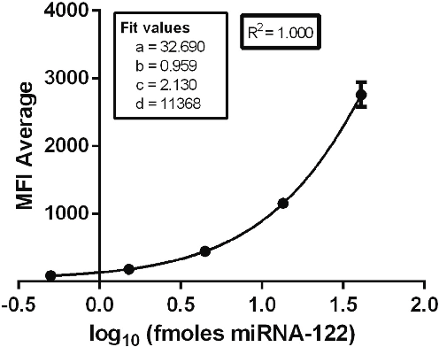
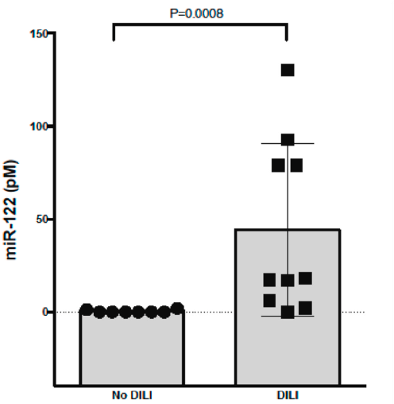
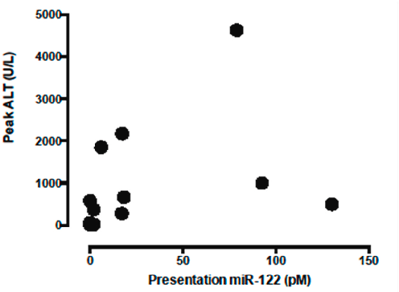
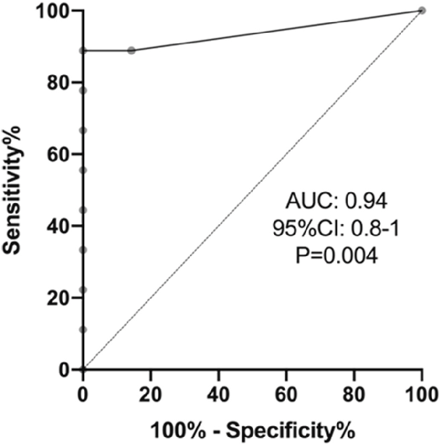

Talanta 219 (2020) 121265

Contents lists available at ScienceDirect

# Talanta

journal homepage: www.elsevier.com/locate/talanta

Short communication

## Amplification-free profiling of microRNA-122 biomarker in DILI patient serums, using the luminex MAGPIX system

### T

Antonio Marín-Romeroa,b,c, Mavys Tabraue-Cháveza, James W. Deard, Rosario M. Sánchez-Martínb,c, Hugh Ilyinee, Juan J. Guardia-Monteagudoa, Mario A. Faraa, Francisco J. López-Delgadoa, Juan J. Díaz-Mochónb,c,∗, Salvatore Pernagalloa,∗∗

- a DESTINA Genomica S.L. Parque Tecnológico Ciencias de la Salud (PTS), Avenida de la Innovación 1, Edificio BIC, Armilla, Granada, 18100, Spain
- b GENYO. Centre for Genomics and Oncological Research: Pfizer / University of Granada, Andalusian Regional Government, PTS Granada - Avenida de la Ilustración, 114

- 18016, GRANADA, Spain

- c Universidad de Granada. Facultad de Farmacia. Departamento de Quimica Farmacéutica y Orgánica, Campus Cartuja s/n, 18071, Granada, Spain
- d Pharmacology,Therapeutics and Toxicology, Centre for Cardiovascular Science, University of Edinburgh, The Queen's Medical Research Institute, 47, Little France Crescent, Edinburgh, EH16, 4TJ, UK
- e DESTINA Genomics Ltd, 7-11 Melville St, Edinburgh, EH3 7PE, UK

##### A R T I C L E I N F O

A B S T R A C T

Dynamic chemical labelling is a single-base specific method to enable detection and quantification of microRibonucleic Acids in biological fluids without extraction and pre-amplification. In this study, dynamic chemical labelling was combined with the Luminex MAGPIX system to profile levels of microRNA-122 biomarker in serum from patients with Drug-Induced Liver Injury.

Keywords: Dynamic chemical labelling (DCL) Drug-induced liver injury (DILI) miRNA-122 Luminex MAGPIX Liquid biopsy

#### 1. Introduction

In critical care medicine, there is still today an urgent need for valid biomarkers to enable early and accurate diagnosis of life-threatening disorders such as sepsis or organ failure [1–4]. In order to improve diagnosis and clinical decision making there has been a growing interest in the use of microRNAs (miRNAs), a new class of biomarkers for multiple human diseases [5–8]. MiRNAs are small non-coding RNAs of 19–24 nucleotides in length that play a major role in fine-tuning the expression of protein-coding genes within the human organism as well as performing a crucial role in the development and maintenance of numerous pathological processes [9–11]. It is well known that a substantial number of miRNAs are present outside cells, circulating in blood and other body fluids [12–14].

More recently, there has been significant interest within the research community to discover and validate circulating miRNA biomarkers [15,16]. However, conventional measurement methods have not yet been able to deliver the requisite combination of high sensitivity and specificity needed for such clinical tests [17,18]. MiRNA concentrations in body fluids are low, and existing miRNA detection

methods are not particularly suited for in vitro diagnostic (IVD) use. Consequently, this has limited investment into novel miRNA based biomarker assays. Conventional methods for miRNA profiling include technologies such as: reverse transcription-quantitative polymerase chain reaction (RT-qPCR) [19], miRNA profiling microarrays [20], next-generation sequencing (NGS) [21] and surface plasmon resonance (SPR) biosensors [22]. Each of these methods have unique strengths and weaknesses, but none are able to deliver the reliability required in clinical settings. The major challenges with current miRNA quantification technologies include: a) RNA instability and degradation in specimens from the time of collection to analysis, if not rapidly chilled or stabilised [23]; b) RNA extraction variability and loss of target – no standardised protocols; c) Clinical sensitivity and specificity; d) Time to test result; e) Complicated workflows with many individual protocol steps needing experienced laboratory technicians to perform the analysis.

Drug-induced liver injury (DILI) is the most common cause for acute liver failure in the USA and Europe. According to surveys in France and Iceland, DILI occurs with an annual incidence of about 14–19 per 100,000 inhabitants [24]. Paracetamol (acetaminophen) overdose is

∗ Corresponding author. ∗∗ Corresponding author.

E-mail addresses: juan@destinagenomics.com (J.J. Díaz-Mochón), salvatore@destinagenomics.com (S. Pernagallo).

https://doi.org/10.1016/j.talanta.2020.121265 Received 10 February 2020; Received in revised form 4 June 2020; Accepted 7 June 2020

Available online 29 June 2020 0039-9140/ © 2020 Elsevier B.V. All rights reserved.

one of the most common poisonings worldwide. Although it is safe in small doses, paracetamol can be dangerous or even deadly if taken in larger quantities. In the United States, paracetamol is the most common cause of acute liver failure, and the second most common cause of liver failure requiring a transplant. In Europe, paracetamol poisoning is still the most common cause of listing for a liver transplant after drug overdose, involving about the 96% of such cases. In the UK, it is estimated that paracetamol overdose accounts for 48% of all poisoning admissions to hospitals [25]. In Asian countries like China, DILI is believed to be significantly underdiagnosed. The high frequency of DILI cases is associated with an extensive use of traditional Chinese medicines, herbal and dietary supplements and anti-tuberculosis drugs. In a recent retrospective study, it has been estimated an annual incidence in the general population to be 23.80 per 100,000 persons [26], much higher than in Western countries. The unmet need going forward is, therefore, to develop an assay that enables a more rapid and accurate identification of DILI, so as to make improved and earlier clinical decisions on whether to start antidote therapy and therefore optimise therapies to reduce adverse events [27]. Current diagnosis of DILI depends on expert opinion that is based on patient data and the typical ‘signatures’ associated with certain drugs. Causality scores such as the Roussel-Uclaf Causality Assessment Method (RUCAM) [28] are intended to confirm or exclude the suspicion of DILI [25]. Although the RUCAM approach is the current screening gold standard, the initial screening (RUCAM) comes along with several drawbacks, listed in Table 1.

MicroRNA-122 (miRNA-122) is a well-known liver specific miRNA expressed in high concentration in hepatocytes, making it an ideal biomarker for testing for liver disease [25]. As we described elsewhere [29], miRNA‐122 is released into the circulation when hepatocytes are injured [30]. In humans, miRNA‐122 is found around 100–1000‐fold higher in patient serum following paracetamol overdose [8]. Comparing with alanine transaminase (ALT) in the context of DILI, miRNA122 has advantages to be used as biomarker. Firstly, miRNA-122 is highly specific for the liver [31–33]. In fact, muscle injury commonly results in an elevation in serum ALT activity without liver injury. By contrast, circulating miRNA-122 is not increased. This property can aid drug development by enhancing specificity. Secondly, miRNA-122 increases in the circulation soon after liver injury starts, before ALT increases. This has been repeatedly demonstrated in pre-clinical rodent models, where miRNA-122 peaks at 6 h after overdose in comparison with ALT peaking at 24 h, and also demonstrated in human studies [33]. This enhanced sensitivity early in the disease process allows early rule in/rule out of liver injury after a toxic insult. Circulating miRNA122 is also increased in patients with cholestyramine‐induced liver injury [34], ischemic hepatitis [35], viral hepatitis [36] and cholestatic liver injury [37].

In this study, we used our dynamic chemical labelling (DCL) technology [23,38–46] in combination with the Luminex MAGPIX system [43] to generate a unique assay for the direct measurement of miRNA122 in DILI patients. The Luminex MAGPIX was chosen as it is a validated system for clinical use. The DCL protocol includes a unique buffer ‘Stabiltech’ that enables lysing, liberation and stabilization of the miRNA under interrogation, without requiring the samples to be prepared, transported and stored under refrigerated conditions.

Particularly, our group has recently reported a stability study of miRNA-122, using serum from a patient with DILI (ALT > 1000 U/L after acetaminophen overdose) [23].

#### 2. Experimental

- 2.1. Materials

Synthetic mimic miRNA-122 oligomer was purchased from Integrated DNA Technologies (ESI, Table S1). Concentrations of RNA and DNA solutions were determined using a ThermoFisher NanoDrop1000 Spectrophotometer. MagPlex microspheres were purchased from Luminex Corporation (1.25 × 107/mL). Streptavidin-R-Phycoerythrin (SA-PE, 1 mg/mL) was purchased from Moss Biotech Inc. Chemicals for couplings were purchased from Sigma-Aldrich. DGL 122 abasic PNA probe (ESI, Table S1), the aldehyde-modified biotinylated cytosine nucleobase (ESI, Figure S1) and buffers (including the Stabiltech buffer) for DCL reactions were provided by DESTINA Genomica S.L. (see ESI, section S1). DGL 122 was coupled with the Luminex MagPlex microspheres (capture microspheres DGL 122) according to the protocol optimised by DESTINA Genomica S.L. and reported in ESI, section S2.

- 2.2. Clinical samples

Alanine transaminase (ALT) activity in clinical samples were analysed elsewhere [25], using a commercial serum ALT kit (Alpha Laboratories Ltd., Eastleigh, UK) adapted for use on either a Cobas Fara or Cobas Mira analyser (Roche Diagnostics Ltd, Welwyn Garden City, UK). Adult patients (16 years old and over) were recruited if they fulfilled the study inclusion and exclusion criteria [24]. Full informed consent was obtained from every participant, and ethical approval was given by the South East Scotland Research Ethics Committee and the East of Scotland Research Ethics Committee, via the South East Scotland Human Bioresource. Blood samples were taken at first presentation to hospital and centrifuged immediately at 11,000×g for 15 min at 4 °C. Then, serum was separated into aliquots and stored at −80 °C. Just prior to analysis, serum aliquots were thawed at room temperature for approximately 30 min. The primary endpoint for the study was acute liver injury, pre-defined as a peak hospital stay serum ALT activity greater than 100U/L.

- 2.3. Assay reaction

A volume of 10 μL of test solution (either serum sample or calibrator) was mixed with 25 μL of Stabiltech buffer containing 1250 microspheres DGL 122. This first step, to hybridise the miRNA-122, was performed in a 96-well plate using a microplate orbital shaker (VWR) at 700 rpm for 1 h at 40 °C. After the hybridization, microspheres DGL 122 were washed 3 times with the wash buffer (see ESI, Section S1 for buffer details). Microspheres DGL 122 were resuspended in 50 μL of reaction buffer (see ESI, Section S1 for buffer details) containing 5 μM aldehydemodified biotinylated cytosine and 1 mM sodium cyanoborohydride. The 96-well plate was shaken at 700 rpm at 40 °C for 1 h. Microspheres were washed 3 further times and incubated with 70 μL of 2 μg/mL SA-

Table 1 RUCAM main drawbacks.

Problem Description of the problem Consequences

No specific screening examination

Early symptoms are generally non-specific, while early diagnoses are crucial to the treatment of drug overdoses

May limit the time in which results for analytical studies can be obtained

Arbitrary and complex scoring RUCAM has limitations that include poor inter-rater reliability and arbitrary scoring. Besides, is difficult to apply in the clinical context due to its complexity [47]

Consensus opinion carries the risk of overruling a more insightful minority opinion [25]

Cost of examination Toxicology investigation cost (€154) and Ingestion poisoning investigation in-patient episode cost (€644), giving a total of €798 [48]

Diagnosis is expensive due to the lack of a specific screening method to study DILI

Fig. 1. Merging of dynamic chemical labelling assay with Luminex MAGPIX system. Fluorescence microspheres are read out by measuring the values of Median Fluorescence Intensity (MFI) – Phycoerythrin with λ¬excitation 488 nm and λ¬emission 585 nm.

PE for 5 min at 40 °C while being shaken at 700 rpm. Microspheres were then washed with the wash buffer and analysed on the Luminex MAGPIX system to determine the Mean of Fluorescence Intensity (MFI) values.

#### 3. Results

- 3.1. Dynamic chemical labelling assay on Luminex MAGPIX

As shown in Fig. 1, the assay works in five main steps: 1 – Stabiltech buffer along with microspheres DGL 122 are added to serum samples; 2

- – The microsphere DGL 122 hybridises the miRNA-122; 3 – Aldehydemodified biotinylated cytosine is covalently attached to the backbone of the DGL 122. This covalent reaction requires three events to take place: (i) perfect hybridization between the DGL 122 and miRNA-122; (ii) generation of a reversible iminium species between the secondary amine of the “abasic unit” and the aldehyde group of the biotinylated cytosine, which is driven by the templating “G” nucleotide on the miRNA-122; (iii) reduction of the iminium species by sodium cyanoborohydride to lock-up the aldehyde-modified biotinylated cytosine covalently into the duplex; 4 – Microspheres are labelled with SA-PE; 5
- – Read-out with MAGPIX instrument.

- 3.2. Assay sensitivity

The analytical sensitivity of the assay was determined by creating a calibration curve using known quantities of spike-ins (synthetic miRNA122 oligomers) as follow: 40.5, 13.5, 4.5, 1.5 and 0.5 fmoles, in hybridization volumes of 35 μL, equal to 115.7, 38.6, 12.9, 4.3, and 1.4 pM respectively. Non spike-in was added as the negative control and experiments were performed in triplicate. The MFI values obtained for the five quantities of spike-ins were, respectively, 2763.3 ± 180.3 FI, 1154.8 ± 38.5 FI, 449.8 ± 16.5 FI, 181.0 ± 6.1 FI, 86.7 ± 2.5, and 32.0 ± 2.0 for the negative control (ESI, Table S2).

The curves were obtained by plotting the MFI Average values versus the logarithm with the base of 10 of the quantity of spike-in(s) in fmoles, see Fig. 2. The limit of detection (LoD) was determined according to the formula reported below [formula [1,2]]. It was

Fig. 2. Calibration curve. Using a 4PL non-lineal regression model, the MFI Average values were plotted vs the logarithm base of 10 of the quantity of synthetic miRNA-122 fmoles. Error bars ( ± 1 s.d.) based on triplicate measurements; Fit values used for the LoD calculation al represented. R2 = 1.000. The error bars are smaller than the size of some data points. n = 3.

calculated the Limit of Blank (LoB), formula [1] and it was substituted to the y value in the 4PL regression formula, [2]. The resultant LoD was of 11.1 amoles in a sample volume of 10 μL equal to 1.11 pM (6.68 × 105 molecules).

LoB = Average of blank + 3 X SD of blank (1)

y = c ((a + d)/(y d) 1) ˆ(1/b) (2)

3.3. Analysis of DILI patients

The assay was employed for profiling levels of miRNA-122 in nine serum samples of patients with DILI, and seven samples from healthy

- Fig. 3. Levels of miRNA-122 in DILI and No DILI patients. Those with liver injury after paracetamol overdose (ALT > 100 - predefined in protocol of trial) and those without liver injury. Note: The samples analysed were from first presentation to hospital whereas the diagnosis of DILI was subsequent to first presentation. P calculated by Mann-Whitney. Bar = mean, error bars are SD.

- Fig. 4. Plot of first presentation to hospital miR-122 against peak ALT. Spearman r = 0.71 (95% CI 0.34 to 0.89). P = 0.001.

volunteers (as controls). For this study, the samples were treated as described in the section Assay reaction. The assay enabled us to profile levels of miRNA-122 in DILI patients (ESI, Table S3). As shown in Fig. 3, most of the patients with DILI have increased levels of miRNA-122, while, and as expected, control healthy volunteers do not show significant level of miRNA-122. The absolute miRNA-122 quantification was possible by extrapolating respective concentration levels (number of moles) from the calibration curve of Fig. 2. Concentrations of miRNA-122 for all samples are reported in ESI, Table S4. Additionally, in Fig. 4 was studied the correlation between levels of miRNA-122 and ALT for the nine DILI patients. When both molecules were compared by receiver operating characteristic (ROC), area under the curve (AUC) value was very high (0.94). This indicated that both tests were able to distinguish between negative and positive serum samples using ROC

Fig. 5. ROC curves of miR-122 and ALT. The AUC were 0.94 (95% CI 0.8–1). ROC, receiver operating curve; ALT, alanine aminotransferase;; AUC, area under the curve.

analysis (Fig. 5), demonstrating the high accuracy of miRNA-122.

#### 4. Conclusions

Current assays for the diagnosis of DILI are essentially based on exclusion methods that require quantification of several circulating proteins, some of them non-specific, lengthening the time until physicians can complete a diagnosis. In this study, we report a unique assay that allows the detection and quantification of the liver specific miRNA122, a liver biomarker found to be substantially elevated in the serum of patients with DILI. The assay presented here is based on the integration of the above described DCL method with Luminex MAGPIX system. Used in combination, the new assay enables profiling of miRNA-122 with high specificity. The assay includes the unique Stabiltech buffer that allows liberation and stabilization of miRNA-122 in serum samples with advantage of sample preparation, shipment and storage through to analysis at room temperatures [23]. As described elsewhere [23], the stabilization of miRNA-122 is achieved through its hybridization with the DGL 122 capture microspheres, forming a high stability complex. The formation of this double-stranded complex between the target RNA and DGL probe protects the miRNA-122 molecules from enzymatic degradation, and thus its protection and stabilization. This novel assay overcomes the various limitations of current methods for analysing miRNAs, such as: (a) the challenges associated with the pre-extraction of RNAs and; (b) the problems related to both reverse transcription and amplification of miRNAs.

In the current study, the assay has been validated using spike-ins into serum samples, reaching a LoD of 11.1 amoles (1.11 pM in 10 μL of sample), a LoD sufficient to interrogate levels of miRNA-122 in clinical samples for patients with DILI. DILI serum samples from patients recruited at the Royal Infirmary of Edinburgh were tested using the new assay. MiRNA-122 was detected in all samples, as shown in Fig. 3, with concentrations ranging from 1.3 to 130.3 pM. MiRNA-122 was nondetected (n.d.) in the healthy volunteers. The assay was also compared with the ALT test, as shown in Fig. 4.

In conclusion, the assay was successfully used for an accurate, direct quantification of miRNA-122 in serum samples of DILI patients. It was

free of errors in distinguishing DILI patients vs. healthy volunteers. The study was carried out in parallel and compared with the gold standard ALT test. With these features and results in mind, we propose this assay can be reliably used for direct detection and quantification of miRNA122 in DILI patients. This new method could also be used to detect other circulating miRNA biomarkers of research and clinical importance, using the multiplex assay capability of the Luminex MAGPIX system.

#### Author contributions

S.P., J.J.D.M, R.M.S.M. and A.M.R. contributed to the design of the experiments of this work. A.M.R., M.T.C. and J.W.D performed the experiments. J.J.G.M., M.A.F. and F.J.L.D performed the synthesis of chemical reagents. S.P. and A.M.R. wrote the manuscript. H.I., J.W.D. and J.J.D.M. critically revised the manuscript.

#### Declaration of competing interest

The authors declare the following financial interests/personal relationships which may be considered as potential competing interests: Juan José Díaz-Mochón and Hugh Ilyine are co-directors and shareholder of DESTINA Genomics Ltd.

#### Acknowledgements

A. Marin-Romero thanks DESTINA Genomica S.L. and the University of Granada for a PhD scholarship (P26 program – Industrial PhD of the Research and Knowledge Transfer Programme).

#### Appendix A. Supplementary data

Supplementary data to this article can be found online at https:// doi.org/10.1016/j.talanta.2020.121265.

#### References

- [1] I. Bersani, C. Auriti, M.P. Ronchetti, G. Prencipe, D. Gazzolo, A. Dotta, Use of early biomarkers in neonatal brain damage and sepsis: state of the art and future perspectives, BioMed Res. Int. 2015 (2015) 253520.
- [2] Y. Tu, H. Wang, R. Sun, Y. Ni, L. Ma, F. Xv, et al., Urinary netrin-1 and KIM-1 as early biomarkers for septic acute kidney injury, Ren. Fail. 36 (10) (2014) 1559–1563.
- [3] M. Rodríguez-Yáñez, T. Sobrino, S. Arias, F. Vázquez-Herrero, D. Brea, M. Blanco, et al., Early biomarkers of clinical-diffusion mismatch in acute ischemic stroke, Stroke 42 (10) (2011) 2813–2818.
- [4] A.N. Chandrakala, P. Kwiatkowski, C.B. Sai-Sudhakar, B. Sun, A. Phillips, S. Parthasarathy, Induction of early biomarkers in a thrombus-induced sheep model of ischemic heart failure, Tex. Heart Inst. J. 40 (5) (2013) 511–520.
- [5] J. Krauskopf, T.M. de Kok, S.J. Schomaker, M. Gosink, D.A. Burt, P. Chandler, et al., Serum microRNA signatures as "liquid biopsies" for interrogating hepatotoxic mechanisms and liver pathogenesis in human, PloS One 12 (5) (2017) e0177928.
- [6] G.H. Liu, Z.G. Zhou, R. Chen, M.J. Wang, B. Zhou, Y. Li, et al., Serum miR-21 and miR-92a as biomarkers in the diagnosis and prognosis of colorectal cancer, Tumour Biol. 34 (4) (2013) 2175–2181.
- [7] J.C. McCrae, N. Sharkey, D.J. Webb, A.D. Vliegenthart, J.W. Dear, Ethanol consumption produces a small increase in circulating miR-122 in healthy individuals, Clin. Toxicol. 54 (1) (2016) 53–55.
- [8] P.J. Starkey Lewis, J. Dear, V. Platt, K.J. Simpson, D.G. Craig, D.J. Antoine, et al., Circulating microRNAs as potential markers of human drug-induced liver injury, Hepatology 54 (5) (2011) 1767–1776.
- [9] D.P. Bartel, MicroRNAs: genomics, biogenesis, mechanism, and function, Cell 116

(2) (2004) 281–297.

- [10] D.P. Bartel, MicroRNAs: target recognition and regulatory functions, Cell 136 (2)

(2009) 215–233.

- [11] C. Price, J. Chen, MicroRNAs in cancer biology and therapy: current status and perspectives, Genes Dis. 1 (1) (2014) 53–63.
- [12] H. Ogata-Kawata, M. Izumiya, D. Kurioka, Y. Honma, Y. Yamada, K. Furuta, et al., Circulating exosomal microRNAs as biomarkers of colon cancer, PloS One 9 (4)

(2014) e92921.

- [13] X. Zhang, S. Shi, B. Zhang, Q. Ni, X. Yu, J. Xu, Circulating biomarkers for early diagnosis of pancreatic cancer: facts and hopes, Am. J. Cancer Res. 8 (3) (2018) 332–353.
- [14] M. Zhang, Y. Zhang, W. Pang, Z. Zhai, C. Wang, Circulating biomarkers in chronic

- thromboembolic pulmonary hypertension, Pulm. Circ. 9 (2) (2019) 2045894019844480.
- [15] L. Nandagopal, G. Sonpavde, Circulating biomarkers in bladder cancer, Bladder Cancer 2 (4) (2016) 369–379.
- [16] K.W. Witwer, Circulating microRNA biomarker studies: pitfalls and potential solutions, Clin. Chem. 61 (1) (2015) 56–63.
- [17] L. Moldovan, K.E. Batte, J. Trgovcich, J. Wisler, C.B. Marsh, M. Piper, Methodological challenges in utilizing miRNAs as circulating biomarkers, J. Cell Mol. Med. 18 (3) (2014) 371–390.
- [18] D. Poel, T.E. Buffart, J. Oosterling-Jansen, H.M. Verheul, J. Voortman, Evaluation of several methodological challenges in circulating miRNA qPCR studies in patients with head and neck cancer, Exp. Mol. Med. 50 (3) (2018) e454.
- [19] M. Lundegard, K. Nylander, K. Danielsson, Difficulties detecting miRNA-203 in human whole saliva by the use of PCR, Med. Oral Patol. Oral Cir. Bucal 20 (2)

(2015) e130–e134.

- [20] B. Wang, Y. Xi, Challenges for MicroRNA microarray data analysis, Microarrays (Basel) 2 (2) (2013).
- [21] S. Rahmann, M. Martin, J.H. Schulte, J. Köster, T. Marschall, A. Schramm, Identifying transcriptional miRNA biomarkers by integrating high-throughput sequencing and real-time PCR data, Methods 59 (1) (2013) 154–163.
- [22] A.W. Wark, H.J. Lee, R.M. Corn, Multiplexed detection methods for profiling microRNA expression in biological samples, Angew Chem. Int. Ed. Engl. 47 (4)

(2008) 644–652.

- [23] B. López-Longarela, E.E. Morrison, J.D. Tranter, L. Chahman-Vos, J.F. Léonard, J.C. Gautier, et al., Direct detection of miR-122 in hepatotoxicity using dynamic chemical labeling overcomes stability and isomiR challenges, Anal. Chem. (2020) 3388–3395.
- [24] G.A. Kullak-Ublick, R.J. Andrade, M. Merz, P. End, A. Benesic, A.L. Gerbes, et al., Drug-induced liver injury: recent advances in diagnosis and risk assessment, Gut 66

(6) (2017) 1154–1164.

- [25] J.W. Dear, J.I. Clarke, B. Francis, L. Allen, J. Wraight, J. Shen, et al., Risk stratification after paracetamol overdose using mechanistic biomarkers: results from two prospective cohort studies, Lancet Gastroenterol. Hepatol. 3 (2) (2018) 104–113.
- [26] T. Shen, Y. Liu, J. Shang, Q. Xie, J. Li, M. Yan, et al., Incidence and etiology of druginduced liver injury in mainland China, Gastroenterology 156 (8) (2019) 2230–2241 e11.
- [27] K. Tajiri, Y. Shimizu, Practical guidelines for diagnosis and early management of drug-induced liver injury, World J. Gastroenterol. 14 (44) (2008) 6774–6785.
- [28] G. Danan, C. Benichou, Causality assessment of adverse reactions to drugs–I. A novel method based on the conclusions of international consensus meetings: application to drug-induced liver injuries, J. Clin. Epidemiol. 46 (11) (1993) 1323–1330.
- [29] A.D.B. Vliegenthart, C. Berends, C.M.J. Potter, M. Kersaudy-Kerhoas, J.W. Dear, MicroRNA-122 can be measured in capillary blood which facilitates point-of-care testing for drug-induced liver injury, Br. J. Clin. Pharmacol. 83 (9) (2017) 2027–2033.
- [30] A.D. Vliegenthart, P. Starkey Lewis, C.S. Tucker, J. Del Pozo, S. Rider, D.J. Antoine, et al., Retro-orbital blood acquisition facilitates circulating microRNA measurement in zebrafish with paracetamol hepatotoxicity, Zebrafish 11 (3) (2014) 219–226.
- [31] A.D. Vliegenthart, J.M. Shaffer, J.I. Clarke, L.E. Peeters, A. Caporali, D.N. Bateman, et al., Comprehensive microRNA profiling in acetaminophen toxicity identifies novel circulating biomarkers for human liver and kidney injury, Sci. Rep. 5 (2015) 15501.
- [32] D.J. Antoine, J.W. Dear, P.S. Lewis, V. Platt, J. Coyle, M. Masson, et al., Mechanistic biomarkers provide early and sensitive detection of acetaminophen-induced acute liver injury at first presentation to hospital, Hepatology 58 (2) (2013) 777–787.
- [33] J.W. Dear, D.J. Antoine, P. Starkey-Lewis, C.E. Goldring, B.K. Park, Early detection of paracetamol toxicity using circulating liver microRNA and markers of cell necrosis, Br. J. Clin. Pharmacol. 77 (5) (2014) 904–905.
- [34] R. Singhal, A.H. Harrill, F. Menguy-Vacheron, Z. Jayyosi, H. Benzerdjeb, P.B. Watkins, Benign elevations in serum aminotransferases and biomarkers of hepatotoxicity in healthy volunteers treated with cholestyramine, BMC Pharmacol. Toxicol. 15 (2014) 42.
- [35] J. Ward, C. Kanchagar, I. Veksler-Lublinsky, R.C. Lee, M.R. McGill, H. Jaeschke, et al., Circulating microRNA profiles in human patients with acetaminophen hepatotoxicity or ischemic hepatitis, Proc. Natl. Acad. Sci. U. S. A. 111 (33) (2014) 12169–12174.
- [36] Y. Zhang, Y. Jia, R. Zheng, Y. Guo, Y. Wang, H. Guo, et al., Plasma microRNA-122 as a biomarker for viral-, alcohol-, and chemical-related hepatic diseases, Clin. Chem. 56 (12) (2010) 1830–1838.
- [37] H. Shifeng, W. Danni, C. Pu, Y. Ping, C. Ju, Z. Liping, Circulating liver-specific miR122 as a novel potential biomarker for diagnosis of cholestatic liver injury, PloS One 8 (9) (2013) e73133.
- [38] F.R. Bowler, J.J. Diaz-Mochon, M.D. Swift, M. Bradley, DNA analysis by dynamic chemistry, Angew Chem. Int. Ed. Engl. 49 (10) (2010) 1809–1812.
- [39] S. Pernagallo, G. Ventimiglia, C. Cavalluzzo, E. Alessi, H. Ilyine, M. Bradley, et al., Novel biochip platform for nucleic acid analysis, Sensors 12 (6) (2012) 8100–8111.
- [40] M. Angélica Luque-González, M. Tabraue-Chávez, B. López-Longarela, R. María Sánchez-Martín, M. Ortiz-González, M. Soriano-Rodríguez, et al., Identification of Trypanosomatids by detecting Single Nucleotide Fingerprints using DNA analysis by dynamic chemistry with MALDI-ToF, Talanta 176 (2018) 299–307.
- [41] A. Marín-Romero, A. Robles-Remacho, M. Tabraue-Chávez, B. López-Longarela, R.M. Sánchez-Martín, J.J. Guardia-Monteagudo, et al., A PCR-free technology to detect and quantify microRNAs directly from human plasma, Analyst (2018) 5676–5682.
- [42] D.M. Rissin, B. López-Longarela, S. Pernagallo, H. Ilyine, A.D.B. Vliegenthart,

- J.W. Dear, et al., Polymerase-free measurement of microRNA-122 with single base specificity using single molecule arrays: detection of drug-induced liver injury, PloS One 12 (7) (2017) e0179669.
- [43] S. Venkateswaran, M.A. Luque-González, M. Tabraue-Chávez, M.A. Fara, B. LópezLongarela, V. Cano-Cortes, et al., Novel bead-based platform for direct detection of unlabelled nucleic acids through Single Nucleobase Labelling, Talanta 161 (2016) 489–496.
- [44] S. Detassis, M. Grasso, M. Tabraue-Chávez, A. Marín-Romero, B. López-Longarela, H. Ilyine, et al., New platform for the direct profiling of microRNAs in biofluids, Anal. Chem. 91 (9) (2019) 5874–5880.
- [45] E. Garcia-Fernandez, M.C. Gonzalez-Garcia, S. Pernagallo, M.J. Ruedas-Rama, M.A. Fara, F.J. López-Delgado, et al., miR-122 direct detection in human serum by

- time-gated fluorescence imaging, Chem. Commun. 55 (99) (2019) 14958–14961.
- [46] A. Delgado-Gonzalez, A. Robles-Remacho, A. Marin-Romero, S. Detassis, B. LopezLongarela, F.J. Lopez-Delgado, et al., PCR-free and chemistry-based technology for miR-21 rapid detection directly from tumour cells, Talanta 200 (2019) 51–56.
- [47] S.E. Gulmez, D. Larrey, G.P. Pageaux, J. Bernuau, F. Bissoli, Y. Horsmans, et al., Liver transplant associated with paracetamol overdose: results from the sevencountry SALT study, Br. J. Clin. Pharmacol. 80 (3) (2015) 599–606.
- [48] D.N. Bateman, R. Carroll, J. Pettie, T. Yamamoto, M.E. Elamin, L. Peart, et al., Effect of the UK's revised paracetamol poisoning management guidelines on admissions, adverse reactions and costs of treatment, Br. J. Clin. Pharmacol. 78 (3) (2014) 610–618.

