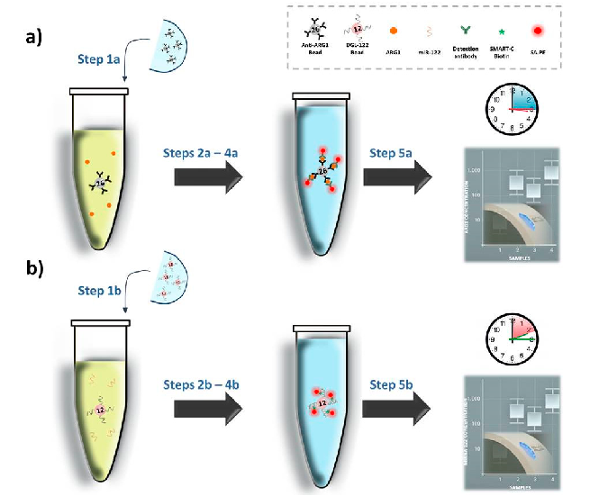
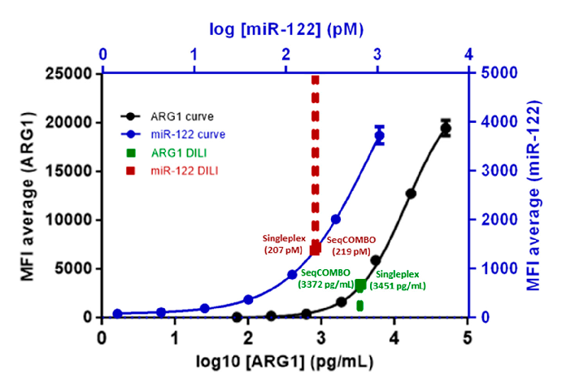
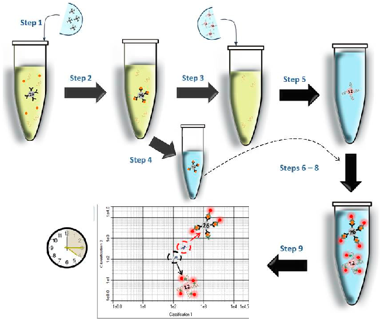

Article

# Simultaneous Detection of Drug-Induced Liver Injury Protein and microRNA Biomarkers Using Dynamic Chemical Labelling on a Luminex MAGPIX System

### Antonio Marín-Romero 1,2,3 , Mavys Tabraue-Chávez 1, Bárbara López-Longarela 1, Mario A. Fara 1, Rosario M. Sánchez-Martín 2,3 , James W. Dear 4, Hugh Ilyine 5, Juan J. Díaz-Mochón 2,3,* and Salvatore Pernagallo 1,*

Citation: Marín-Romero, A.; Tabraue-Chávez, M.; López-Longarela, B.; Fara, M.A.; Sánchez-Martín, R.M.; Dear, J.W.; Ilyine, H.; Díaz-Mochón, J.J.; Pernagallo, S. Simultaneous Detection of Drug-Induced Liver Injury Protein and microRNA Biomarkers Using Dynamic Chemical Labelling on a Luminex MAGPIX System. Analytica 2021, 2, 130–139. https://doi.org/ 10.3390/analytica2040013

- 1 DESTINA Genomica S.L. Parque Tecnológico Ciencias de la Salud (PTS), Avenida de la Innovación 1, Edificio BIC, Armilla, 18100 Granada, Spain; antonio.marin@destinagenomics.com (A.M.-R.); mavys@destinagenomics.com (M.T.-C.); barbara@destinagenomics.com (B.L.-L.); afara@destinagenomics.com (M.A.F.)
- 2 GENYO, Centre for Genomics and Oncological Research: Pfizer/University of Granada/Andalusian Regional Government, 18016 Granada, Spain; rmsanchez@go.ugr.es
- 3 Departamento de Quimica Farmacéutica y Orgánica, Facultad de Farmacia, Universidad de Granada, Campus Cartuja s/n, 18071 Granada, Spain
- 4 Pharmacology, Therapeutics and Toxicology, Centre for Cardiovascular Science, The Queen’s Medical Research Institute, University of Edinburgh, 47 Little France Crescent, Edinburgh EH16 4TJ, UK; james.dear@ed.ac.uk
- 5 DESTINA Genomics Ltd., 7-11 Melville St., Edinburgh EH3 7PE, UK; hugh@destinagenomics.com

* Correspondence: juan@destinagenomics.com (J.J.D.-M.); salvatore@destinagenomics.com (S.P.)

Abstract: Drug-induced liver injury (DILI) is a potentially fatal adverse event and a leading cause for pre- and post-marketing drug withdrawal. Several multinational DILI initiatives have now recommended a panel of protein and microRNA (miRNA) biomarkers that can detect early liver injury and inform about mechanistic basis. This manuscript describes the development of seqCOMBO, a unique combo-multiplexed assay which combines the dynamic chemical labelling approach and an antibody-dependant method on the Luminex MAGPIX system. SeqCOMBO enables a versatile multiplexing platform to perform qualitative and quantitative analysis of proteins and miRNAs in patient serum samples simultaneously. To the best of our knowledge, this is the first method to profile protein and miRNA biomarkers to diagnose DILI in a single-step assay.

Academic Editor: Sibel A. Ozkan

Received: 17 August 2021 Accepted: 29 September 2021 Published: 3 October 2021

Publisher’s Note: MDPI stays neutral with regard to jurisdictional claims in published maps and institutional affiliations.

Copyright: © 2021 by the authors. Licensee MDPI, Basel, Switzerland. This article is an open access article distributed under the terms and conditions of the Creative Commons Attribution (CC BY) license (https:// creativecommons.org/licenses/by/ 4.0/).

Keywords: dynamic chemical labelling (DCL); drug-induced liver injury (DILI); miRNA-122; Luminex MAGPIX; liquid biopsy; antibody-dependant method

### 1. Introduction

Adverse drug reactions (ADRs) are a significant concern for patients, healthcare professionals and the pharmaceutical industry, with an estimated annual cost to the EU of EUR 79 billion [1]. Drug-induced liver injury (DILI) is the second-most common ADR [2] and a leading cause of acute liver failure (ALF) in the western world [3]. ALF is a lifethreatening condition, and identifying patients at risk for ALF is a priority task. DILI incidence depends on the drug itself and host/patient-specific factors such as sex, ethnicity and genetic polymorphism in the detoxification of drugs [4]. For instance, for the antibiotic amoxicillin-clavulanate, approximately 1 out of 2300 patients will develop DILI [5]. Additionally, DILI is one of the leading causes of drug attrition throughout all stages of the drug discovery process. In early development, 50% of all pre-clinical candidate drugs display effects upon the liver at supra-therapeutic doses. Over the last 50 years, DILI was responsible for 18% of all medicines retracted post-marketing (the main reason for the drug withdrawals) [6,7]. From 1997 to 2016, in the EU and USA, eight drugs were withdrawn due to DILI-related incidents, which have led to liver transplants and deaths [8]. The

Analytica 2021, 2, 130–139. https://doi.org/10.3390/analytica2040013 https://www.mdpi.com/journal/analytica

interpretation of laboratory findings of suspected hepatotoxicity cases in clinical trials is complex, as increased levels of hepatic enzymes are not necessarily a signal of impending DILI, but may be due to hepatic adaption, other underlying liver diseases or non-hepatic sources of the enzymes [9]. Therefore, a method capable of predicting and clearly diagnosing drug-induced hepatotoxicity before market authorization, as well as to support the clinical management of DILI, would be highly desirable.

To date, DILI assessment and drug toxicity evaluation has relied on the analysis of a panel of serum biomarkers such as alanine aminotransferase (ALT), aspartate aminotransferase (AST), alkaline phosphatase (ALP), lactate dehydrogenase (LDH), glutamyl transpeptidase (GT), albumin and bilirubin [10]. This panel is commonly used in DILI assessment but has limitations [11]. None of the markers offers true mechanistic insight into the basis of DILI, and some are less liver-specific or detected late after DILI onset, when liver injury is already advanced, limiting the potential treatment options [9]. Therefore, there is an urgent need for better DILI biomarkers to improve risk assessment and patient management.

The discovery of microRNAs (miRNAs) as a new class of gene expression regulators has triggered an explosion of research, particularly the measurement of miRNAs in various body fluids, valuable as biomarkers for many human diseases [11,12]. The properties of miRNA-based biomarkers, such as tissue specificity and high stability and sensitivity, suggest they could be used as novel, minimally invasive and stable DILI biomarkers. Over the past several years, many animal and clinical studies have been published, routinely showing that miRNAs have an advantage over conventional biomarkers for DILI [13,14]. They are relatively stable [15], can be highly liver-specific [16], are significantly altered in pathologic states [12], are readily detectable in easily accessible bodily fluids [17–20] and are strictly conserved between species [21]. In particular, liver-specific miRNA-122 (miR-122) is a key liver miRNA, involved in various processes of liver development, differentiation, metabolism and stress responses [7,20]. Compared with conventional hepatotoxic markers, circulating miR-122 can effectively and consistently distinguish intrahepatic from extrahepatic damage with higher sensitivity and specificity. Thus, miR122 is expected to be a valuable pre-clinical and clinical biomarker of DILI [22].

Several international initiatives such as the Safer and Faster Evidence-based Translation (SAFE-T) consortium or, more recently, TransBioLine and the Pro-Euro DILI NETWORK have been seeking and validating DILI biomarkers as means to better diagnose DILI [23,24]. A recent letter of support from the EMA [25] established that the lack of sensitive and specific assays to diagnose, predict and monitor idiosyncratic DILI remains a severe hurdle in drug development. All the scientific evidence points out that an innovative combination of biomarkers combining proteins and miRNAs would probably be optimal to clearly identify DILI and predict the course of the liver injury, and may help in assigning causality.

To analyse proteins and miRNAs using conventional technologies, the clinical sample has to: (i) be split in two; (ii) use the 1st split for testing proteins by an antibody-dependant method or immunological assay (about 2 h); (iii) use the 2nd split for testing miRNAs by RT-qPCR (extraction, enrichment of small RNAs, reverse transcription and real-time amplification—about 5 to 6 h). In 2020, Wang et al. reported a new method to interrogate protein and miRNA spike-ins [26]. However, and to the best of our knowledge, a simultaneous detection of both molecules from clinical samples has not been yet reported. This aspect is critical as endogenous miRNAs are found in circulation within vesicles and/or bound to argonaute (AGO) proteins while spike-in miRNAs are free molecules. Hence, the protocol needed to simultaneously detect natural miRNAs and proteins is very different from the protocol used to detect spike-in miRNAs and proteins. With the advances made by our team with dynamic chemical labelling (DCL) technology for the direct detection of nucleic acids, the deliverable of simultaneous detection of protein and miRNA in clinical samples is now possible. The DCL approach [17–20,27–33] is particularly well suited to deliver consistent and reliable quantitative readings of miRNAs in clinical samples when merged

with bead-based systems. By simplifying the workflow, especially removing extraction, isolation and amplification steps, DCL was able to direct detect miRNAs in enzyme-linked immunosorbent assay (ELISA)-type format without affecting protein co-analytes, overcoming the current limitation issues that inhibit the development of simultaneous detection of proteins and miRNAs with high specificity and accuracy.

In this study, the DCL approach and an antibody-dependant method were combined with the Luminex MAGPIX system to deliver the simultaneous detection of DILI-related protein and miRNA with sensitivity and high specificity. This combined system, named “seqCOMBO”, was applied to profile levels of liver-type arginase 1 (ARG1) and miR-122 in a serum sample from a DILI patient. Serum samples from no DILI patient were used as controls. ARG1 is a highly abundant protein found in liver cytosol, used to improve the sensitivity of ALT to detect liver injury [34]. Among all protein biomarkers, ARG1 was used for this study since it is part of the commercially available MILIPLEX MAP Human Liver Injury Magnetic Bead Panel. As stated above, multiple studies have already demonstrated the sensitivity and specificity of miR-122 as a valuable circulating biomarker of liver injury, including DILI [7], hepatitis C [35] and ethanol consumption [36].

### 2. Materials and Methods

- 2.1. Materials

MILLIPLEX MAP reagents for analysing ARG1 were purchased from Merck (MILIPLEX MAP Human Liver Injury Magnetic Bead Panel—Toxicity Multiplex Assay, Cat # HLINJMAG-75K) and were used as received. The MILIPLEX MAP kit includes anti-ARG1 beads with colour region 26 [37], assay buffer and detection antibody. Luminex MagPlex® carboxylated beads from colour region 12 were purchased from Luminex Corporation (1.25 × 107/mL).

The DGL 122 abasic PNA probe (Table S1), aldehyde-modified biotinylated cytosine nucleobase (SMART-C biotin; Figure S1) and buffers (inluding the Stabiltech lysis buffer) for interrogating miR-122 were provided by DESTINA Genomica S.L. (Section S1). Luminex MagPlex® carboxylated beads from colour region 12 [37] were functionalised with DGL 122 abasic PNA, using the protocol optimised by DESTINA Genomica S.L. (Section S2), to generate the DGL-122 beads. Synthetic mimic miR-122 oligomer was purchased from Integrated DNA Technologies (Table S1). Concentrations of DNA solutions were determined using a ThermoFisher NanoDrop1000 spectrophotometer. Streptavidin-R-Phycoerythrin (SA-PE, 1 mg/mL) was purchased from Moss Biotech Inc. Chemicals for bead coupling were purchased from Sigma-Aldrich, and 96-well plates were purchased from Thermo Fisher (Cat. # 249570). Incubations and reactions were carried out in a microplate orbital shaker (VWR Micro Plate Shaker, Cat. # 12620-926).

- 2.2. Clinical Samples

An adult DILI patient was recruited, fulfilling the study inclusion and exclusion criteria [38]. A no DILI patient was included in the study as control. Full informed consent was obtained from the patient, and ethical approval was given by the South East Scotland Research Ethics Committee and the East of Scotland Research Ethics Committee, via the South East Scotland Human Bioresource. Blood samples were taken at first presentation to hospital and centrifuged immediately at 11,000× g for 15 min at 4 ◦C. Then, serum was separated into aliquots and stored at −80 ◦C. Just prior to analysis, serum aliquots were thawed at room temperature for approximately 30 min. The primary endpoint for the study was acute liver injury, pre-defined as a peak hospital stay serum ALT activity greater than 100 U/L. ALT activity in clinical samples were analysed elsewhere [22], using a commercial serum ALT kit (Alpha Laboratories Ltd., Eastleigh, UK) adapted for use on either a Cobas Fara or Cobas Mira analyser (Roche Diagnostics Ltd., Welwyn Garden City, UK). Ct values levels of miR-122 in clinical samples were analysed elsewhere by RT-qPCR using the normalizer C. elegans miR-39 spike-in [17]. No DILI patient was human

serum from male AB clotted whole blood and was purchased from Sigma-Aldrich, Cat. No. H6914-20ML.

- 2.3. Calibration Curves for ARG1 and miR-122 Assays Two calibration curves were generated for ARG1 and miR-122 as described below.

- 2.3.1. Calibration Curve for ARG1 Assay

The calibration curve was generated according to the manufacturer’s instructions for MILIPLEX MAP. MFI measurements were performed in triplicate as shown in Table S2.

- 2.3.2. Calibration Curve for miR-122 Assay

Standard solutions were prepared by dissolving varying quantities of synthetic mimic miR-122 in 24 µL of lysis buffer (see Table S3). Lysis buffer only was used for 0 pM standard. A volume of 10 µL of serum matrix solution and 1 µL of DGL-122 beads, respectively, were added to each well containing the standard. This first step, to hybridise the miR-122, was performed in a 96-well plate using a microplate orbital at 700 rpm for 1 h at 40 ◦C. After the hybridization, the DGL-122 beads were washed three times with the wash buffer. The DGL-122 beads were resuspended in 50 µL of assay buffer containing 5 µM SMART-C biotin and 1 mM sodium cyanoborohydride [17–20,27–33]. The 96-well plate was shaken at 700 rpm at 40 ◦C for 1 h. The beads were washed three more times and incubated with 70 µL of 2 µg/mL SA-PE for 5 min at 40 ◦C while being shaken at 700 rpm. The beads were then washed two times with the wash buffer and analysed on the Luminex MAGPIX system to determine the MFI values. MFI measurements were performed in triplicate as

- shown in Table S3.

2.4. ARG1 Singleplex Assay

A volume of 10 µL of serum sample was mixed with 25 µL of assay buffer and 7.5 µL of anti-ARG1 beads 1:6 diluted from the stock. This first step, to capture the ARG1, was performed in a 96-well plate using a microplate orbital shaker at 700 rpm for 2 h at 25 ◦C. After the capturing of ARG1, the anti-ARG1 beads were washed three times with the wash buffer. The anti-ARG1 beads were resuspended in 50 µL of detection antibody diluted 1:2 with assay buffer. The 96-well plate was shaken at 700 rpm at 25 ◦C for 1 h. The beads were washed three more times and incubated with 70 µL of 2 µg/mL SA-PE for 5 min at 40 ◦C while being shaken at 700 rpm. The beads were then washed two times with the wash buffer and analysed on the Luminex MAGPIX system to determine the mean of fluorescence intensity (MFI) values. MFI measurements were performed in triplicate as

- shown in Table S4.

- 2.5. miR-122 Singleplex Assay

A volume of 10 µL of serum sample was mixed with 30 µL of assay buffer and 80 µL of lysis buffer (Stabiltech buffer) [17,30] containing DGL-122 beads functionalized with DGL-122. This first step, to hybridise the miR-122, was performed in a 96-well plate using a microplate orbital shaker at 700 rpm for 1 h at 40 ◦C. SMART-C biotin incorporation and SA-PE labelling were carried out as described in Section 2.3.2. MFI measurements were performed in triplicate as shown in Table S4.

- 2.6. SeqCOMBO Assay

A volume of 10 µL of serum sample was mixed with 25 µL of assay buffer and 7.5 µL of anti-ARG1 beads 1:6 diluted from the stock. This first step allows capturing the ARG1 and was performed in a 96-well plate using a microplate orbital shaker at 700 rpm for 2 h at 25 ◦C. After the capturing, the supernatant was removed and kept for the subsequent miR-122 hybridization. The anti-ARG1 beads’ pellet was washed three times with the wash buffer, resuspended in 100 µL of assay buffer and reserved at 4 ◦C. The supernatant containing miR-122 was treated by adding 80 µL of Stabiltech buffer containing 1250 DGL-

- Analytica 2021, 2, FOR PEER REVIEW 5

Analytica 2021, 2 134

wash buffer, resuspended in 100 µL of assay buffer and reserved at 4 °C. The supernatant containing miR-122 was treated by adding 80 µL of Stabiltech buffer containing 1,250 DGL-122 beads. The hybridization of miR-122 was performed at 700 rpm for 1 h at 40 °C. After the hybridization, the DGL-122 beads were washed three times with the wash buffer. The DGL-122 beads were resuspended in 100 µL of wash buffer and merged with the reserved 100 µL solution containing anti-ARG1 beads. Once both set of beads were mixed, the supernatant was removed and resuspended in 25 µL of detection antibody and 25 µL of assay buffer containing 5 µM of SMART-C biotin and 1 mM sodium cyanoborohydride. The 96-well plate was shaken at 700 rpm at 40 °C for 1 h. The beads were washed three times and incubated with 70 µL of 2 µg/mL SA-PE for 5 min at 40 °C while being shaken at 700 rpm. The beads were then washed two times with the wash buffer and analysed on the Luminex MAGPIX system to determine the MFI values. MFI measurements were performed in triplicate as shown in Table S4.

122 beads. The hybridization of miR-122 was performed at 700 rpm for 1 h at 40 ◦C. After the hybridization, the DGL-122 beads were washed three times with the wash buffer. The DGL-122 beads were resuspended in 100 µL of wash buffer and merged with the reserved 100 µL solution containing anti-ARG1 beads. Once both set of beads were mixed, the supernatant was removed and resuspended in 25 µL of detection antibody and 25 µL of assay buffer containing 5 µM of SMART-C biotin and 1 mM sodium cyanoborohydride. The 96-well plate was shaken at 700 rpm at 40 ◦C for 1 h. The beads were washed three times and incubated with 70 µL of 2 µg/mL SA-PE for 5 min at 40 ◦C while being shaken at 700 rpm. The beads were then washed two times with the wash buffer and analysed on the Luminex MAGPIX system to determine the MFI values. MFI measurements were performed in triplicate as shown in Table S4.

3. Results and Discussion 3.1. Singleplex Assay—Analysis of ARG1 and miR-122

3. Results and Discussion 3.1. Singleplex Assay—Analysis of ARG1 and miR-122

DILI and no DILI patient samples were tested individually to analyse ARG1 and miR-122 levels. The Ct value levels of miR-122 in DILI and no DILI samples were analysed elsewhere [17]. The average Ct signals obtained for the DILI sample was 19.5 ± 0.03 (data refer to the canonical miR-122). The individual analysis was carried out by the workflows illustrated in Figure 1 and as described in Sections 2.4 and 2.5. The MILIPLEX assay for the detection of ARG1 and the DCL method for miR-122 require, respectively, 3 h 15 min and 2 h 15 min. Both workflows consist of five main steps.

DILI and no DILI patient samples were tested individually to analyse ARG1 and miR-122 levels. The Ct value levels of miR-122 in DILI and no DILI samples were analysed elsewhere [17]. The average Ct signals obtained for the DILI sample was 19.5 ± 0.03 (data refer to the canonical miR-122). The individual analysis was carried out by the workflows illustrated in Figure 1 and as described in section 2.4 and 2.5. The MILIPLEX assay for the detection of ARG1 and the DCL method for miR-122 require, respectively, 3 h 15 min and 2 h 15 min. Both workflows consist of five main steps.

Figure 1. Singleplex workflows. (a) Analysis of ARG1: Step 1a—anti-ARG1 beads are added to the sample; Step 2a—anti-ARG1 beads capture ARG1; Step 3a—detection antibody is added, recognizing the captured ARG1; Step 4a—beads are labelled using SA-PE; Step 5a—beads are read out by measuring the values of MFI into the Luminex MAGPIX system. (b) Analysis of miR-122: Step 1b—DGL-122 beads are added to the sample; Step 2b—DGL-122 beads hybridise miR-122; Step 3b—DCL reagents are added into the solution to incorporate the SMART-C biotin; Step 4b—beads are labelled using SA-PE; Step 5b—beads are read out by measuring the values of MFI into the Luminex MAGPIX system. Phycoerythrin with excitation at 488 nm and emission at 585 nm.

Figure 1. Singleplex workflows. (a) Analysis of ARG1: Step 1a—anti-ARG1 beads are added to the sample; Step 2a—anti-ARG1 beads capture ARG1; Step 3a—detection antibody is added, recognizing the captured ARG1; Step 4a—beads are labelled using SA-PE; Step 5a—beads are read out by measuring the values of MFI into the Luminex MAGPIX system. (b) Analysis of miR-122: Step 1bDGL-122 beads are added to the sample; Step 2b—DGL-122 beads hybridise miR-122; Step 3bDCL reagents are added into the solution to incorporate the SMART-C biotin; Step 4b—beads are labelled using SA-PE; Step 5b—beads are read out by measuring the values of MFI into the Luminex MAGPIX system. Phycoerythrin with excitation at 488 nm and emission at 585 nm.

- Analytica 2021, 2, FOR PEER REVIEW 6

Analytica 2021, 2 135

The two assays enabled us to profile levels of ARG1 and miR-122 in a DILI patient. As reported in Table S4, the patient with DILI presented high levels of both ARG1 and miR-122, while, and as expected, the no DILI patient did not show significant levels of either ARG1 or miR-122. ARG1 and miR-122 levels were quantified using the two calibration curves generated with the data reported in Tables S2 and S3, respectively. Levels of ARG1 and miR-122 were extrapolated and reported in Table S4 and shown in Figure 2.

The two assays enabled us to profile levels of ARG1 and miR-122 in a DILI patient. As reported in Table S4, the patient with DILI presented high levels of both ARG1 and miR-122, while, and as expected, the no DILI patient did not show significant levels of either ARG1 or miR-122. ARG1 and miR-122 levels were quantified using the two calibration curves generated with the data reported in Tables S2 and S3, respectively. Levels of ARG1 and miR-122 were extrapolated and reported in Table S4 and shown in Figure 2.

Figure 2. ARG1 and miR-122 calibration curves with interpolated ARG1 and miR-122 from DILI samples. Error bars (±1 s.d.) based on triplicate measurements. The error bars are smaller than the size of some data points. n = 3.

Figure 2. ARG1 and miR-122 calibration curves with interpolated ARG1 and miR-122 from DILI samples. Error bars (±1 s.d.) based on triplicate measurements. The error bars are smaller than the size of some data points. n = 3.

3.2. SeqCOMBO Assay—Analysis of ARG1 and miR-122 Simultaneously

3.2. SeqCOMBO Assay—Analysis of ARG1 and miR-122 simultaneously

The two individual assays described in Figure 1a,b were combined delivering the seqCOMBO to profile at the same time the levels of ARG1 and miR-122 in the serum sample of a DILI patient. As shown in Figure 3, the seqCOMBO workflow consists of nine main steps.

The two individual assays described in Figure 1a,b were combined delivering the seqCOMBO to profile at the same time the levels of ARG1 and miR-122 in the serum sample of a DILI patient. As shown in Figure 3, the seqCOMBO workflow consists of nine main steps.

The seqCOMBO enables profiling levels of ARG1 and miR-122 in the DILI patient. As reported in Table S4 and shown in Figure 2, the patient with DILI presented high levels of both ARG1 and miR-122, while, and as expected, the no DILI control did not show significant levels of ARG1 or miR-122. No signal loss was observed when both protein and miRNA were analysed via seqCOMBO at the same time.

The seqCOMBO enables profiling levels of ARG1 and miR-122 in the DILI patient. As reported in Table S4 and shown in Figure 2, the patient with DILI presented high levels of both ARG1 and miR-122, while, and as expected, the no DILI control did not show significant levels of ARG1 or miR-122. No signal loss was observed when both protein and miRNA were analysed via seqCOMBO at the same time.

To compare how the signal varies when singleplex or seqCOMBO is used, an interCV study was generated, comparing the MFI signals obtained for individual analysis vs. seqCOMBO, as shown in Table 1. These results indicate that the MILIPLEX xMAP kit can be merged with the DCL method to analyse ARG1 and miR-122 simultaneously from the same sample, thereby demonstrating that analysis of proteins and nucleic acids can be performed without differences compared with individual tests.

To compare how the signal varies when singleplex or seqCOMBO is used, an interCV study was generated, comparing the MFI signals obtained for individual analysis vs. seqCOMBO, as shown in Table 1. These results indicate that the MILIPLEX xMAP kit can be merged with the DCL method to analyse ARG1 and miR-122 simultaneously from the same sample, thereby demonstrating that analysis of proteins and nucleic acids can be performed without differences compared with individual tests.

AnalyticaAnalytica20212021,,22, FOR PEER REVIEW 1367

Figure 3. SeqCOMBO workflow. Step 1—anti-ARG1 beads are added to the serum sample; Step 2—anti-ARG1 beads capture the ARG1 and separated from the supernatant (see Step 4); Step 3— the supernatant is added with Stabiltech buffer containing DGL-122 beads; Step 4— anti-ARG1 beads are reserved in assay buffer; Step 5—DGL-122 beads hybridize miR-122; Step 6—both sets of beads are merged; Step 7—the detection antibody and SMART-C biotin are added to the mixture of anti-ARG1 and DGL-122 beads; Step 8—beads are labelled with SA-PE; Step 9—the two regions are read out with the MAGPIX instrument. Phycoerythrin with excitation at 488 nm and emission at 585 nm.

Figure 3. SeqCOMBO workflow. Step 1—anti-ARG1 beads are added to the serum sample; Step 2anti-ARG1 beads capture the ARG1 and separated from the supernatant (see Step 4); Step 3— the supernatant is added with Stabiltech buffer containing DGL-122 beads; Step 4— anti-ARG1 beads are reserved in assay buffer; Step 5—DGL-122 beads hybridize miR-122; Step 6—both sets of beads are merged; Step 7—the detection antibody and SMART-C biotin are added to the mixture of antiARG1 and DGL-122 beads; Step 8—beads are labelled with SA-PE; Step 9—the two regions are read out with the MAGPIX instrument. Phycoerythrin with excitation at 488 nm and emission at 585 nm.

Table 1. Inter-CV comparative analysis for singleplex vs. seqCOMBO.

Table 1. Inter-CV comparative analysis for singleplex vs. seqCOMBO.

Singleplex miR-122 MFI Average

seqCOMBO ARG1 MFI Average

seqCOMBO miR-122 MFI Average

Singleplex ARG1 MFI Average

Singleplex miR-122 MFI Average

seqCOMBO ARG1 MFI Average

seqCOMBO miR-122 MFI Average

Singleplex ARG1 MFI Average

* MFI Average

* MFI Average

SD CV

SD CV

ARG1 3340.5 ---- 3256.0 ---- 3298.0 59.8 1.81% miR-122 ---- 1376.8 ---- 1436.5 1406.3 42.2 3.00%

ARG1 3340.5 ---- 3256.0 ---- 3298.0 59.8 1.81% miR-122 ---- 1376.8 ---- 1436.5 1406.3 42.2 3.00%

* This represents an inter-average calculated using the average values of singleplex MFI and seqCOMBO MFI for both ARG1 and miR-122.

* This represents an inter-average calculated using the average values of singleplex MFI and seqCOMBO MFI for both ARG1 and miR-122.

### 4. Conclusions

To date, it has not been possible to analyse proteins and nucleic acids of clinical relevance into a single assay on the same analytical platform. This is due to the technical peculiarities of handling RNA without affecting protein analytes. miRNAs are present in body fluids contained in complexes such as lipidic membranes and/or AGO proteins. To liberate the miRNA targets, current technologies use lysis buffers containing proteases to release the target from complexes in order to be interrogated [39]. While treatments with lysis buffers enable the release of miRNAs, this can impact the downstream protein analysis and characterization. Prompted by these current analytical limitations, our group developed seqCOMBO, a new method to overcome the inability of current technology to analyse miRNAs without affecting proteins. In seqCOMBO, our DCL transformative technology to interrogate miRNAs [17–20,27–33] was combined with an antibody-dependant method on the Luminex MAGPIX system.

## 4. Conclusions

To date, it has not been possible to analyse proteins and nucleic acids of clinical relevance into a single assay on the same analytical platform. This is due to the technical peculiarities of handling RNA without affecting protein analytes. miRNAs are present in body fluids contained in complexes such as lipidic membranes and/or AGO proteins. To liberate the miRNA targets, current technologies use lysis buffers containing proteases to release the target from complexes in order to be interrogated [39]. While treatments with lysis buffers enable the release of miRNAs, this can impact the downstream protein analysis and characterization. Prompted by these current analytical limitations, our group developed seqCOMBO, a new method to overcome the inability of current technology to analyse miRNAs without affecting proteins. In seqCOMBO, our DCL transformative technology to interrogate miRNAs [17–20,27–33] was combined with an antibody-dependant method on the Luminex MAGPIX system.

SeqCOMBO consists of a sequential interrogation of analytes, including: (i) capturing the protein biomarker first; (ii) centrifuging and reserving the pellet that contains the

protein; (iii) treating the remaining supernatant with the Stabiltech buffer to release miRNA (Figure 3). Once the miRNA is released and captured, protein and miRNA beads are mixed again to finalise the process and read the results. SeqCOMBO is able to determine the levels of DILI-related protein and miRNA simultaneously. SeqCOMBO was validated using clinical samples from a patient with liver injury, determining the levels of ARG1 and miR-122 successfully. When MFI values between both singleplex and seqCOMBO were compared, no signal differences were observed, thus demonstrating the high compatibility of the antibody-dependant method with DCL reagents on the Luminex system.

Embedded in its combined technologies, seqCOMBO is a radical diagnostic approach that shows the practicality of using the same patient sample to analyse both protein and nucleic acid biomarkers of clinical importance. Notwithstanding seqCOMBO’s total focus on DILI diagnostics, the method developed will clearly find significant new diagnostic opportunities beyond DILI. One example would be viral diseases, where rapid and accurate identification of proteins and nucleic acids simultaneously will deliver high specificity/sensitivity assays, well beyond current capabilities. The current Covid-19 pandemic crisis needs reliable and error-free testing for both genomic RNA and antibodies generated in infected patients. SeqCOMBO could also prove highly valuable in cancer diagnostics and monitoring of the disease.

SeqCOMBO shows the way forward to simplified, more cost-effective and robust multiplex tests in the future, with optimized protein/RNA biomarker combinations.

Supplementary Materials: The following are available online at https://www.mdpi.com/article/ 10.3390/analytica2040013/s1: Table S1: Sequences; Figure S1: Chemical structure of aldehydemodified biotinylated cytosine; Section S1: Reagents for reaction; Section S2: Luminex MagPlex beads coupling with DGL-122; Table S2: ARG1 calibration curve data; Table S3: miR-122 calibration curve data; Table S4: MFI measurement (in triplicate) of ARG1 and miR-122 in singleplex analysis and seqCOMBO; Figure S2: Levels of ARG1 and miR-122 in a DILI patient when measured via singleplex and seqCOMBO assays. Inter-CV values between singleplex and seqCOMBO.

Author Contributions: S.P., J.J.D.-M., R.M.S.-M., A.M.-R., B.L.-L. and M.A.F. contributed to the design of the experiments of this work. A.M.-R. and M.T.-C. performed the experiments. S.P. and A.M.-R. wrote the manuscript. H.I., J.W.D. and J.J.D.-M. critically revised the manuscript. All authors have read and agreed to the published version of the manuscript.

Funding: This research received no external funding.

Acknowledgments: A. Marín-Romero thanks DESTINA Genómica S.L. and the University of Granada for a PhD scholarship (P26 programme—Industrial PhD of the Research and Knowledge Transfer Programme).

Conflicts of Interest: J.J.D.M. and H.I. are shareholders and directors of DESTINA Genomics Ltd. S.P. is a shareholder of DESTINA Genomics Ltd. J.W.D. is a member of the expert advisory group for the EU IMI-funded TransBioLine Consortium.

### References

- 1. European Comission. Strengthening Pharmacovigilance to Reduce Adverse Effects of Medicines. 2008. Available online: https://ec.europa.eu/commission/presscorner/detail/en/MEMO_08_782 (accessed on 14 July 2021).
- 2. Juntti-Patinen, L.; Neuvonen, P.J. Drug-related deaths in a university central hospital. Eur. J. Clin. Pharmacol. 2002, 58, 479–482.
- 3. Devarbhavi, H. An Update on Drug-induced Liver Injury. J. Clin. Exp. Hepatol. 2012, 2, 247–259. [CrossRef] [PubMed]
- 4. Chen, M.; Suzuki, A.; Borlak, J.; Andrade, R.J.; Lucena, M.I. Drug-induced liver injury: Interactions between drug properties and host factors. J. Hepatol. 2015, 63, 503–514. [CrossRef] [PubMed]
- 5. Björnsson, E.S. Drug-induced liver injury: An overview over the most critical compounds. Arch. Toxicol. 2015, 89, 327–334. [CrossRef] [PubMed]
- 6. Howell, L.S.; Ireland, L.; Park, B.K.; Goldring, C.E. MiR-122 and other microRNAs as potential circulating biomarkers of drug-induced liver injury. Expert Rev. Mol. Diagn. 2018, 18, 47–54. [CrossRef] [PubMed]
- 7. Onakpoya, I.J.; Heneghan, C.J.; Aronson, J.K. Correction to: Post-marketing withdrawal of 462 medicinal products because of adverse drug reactions: A systematic review of the world literature. BMC Med. 2019, 17, 56. [CrossRef] [PubMed]
- 8. Babai, S.; Auclert, L.; Le-Louët, H. Safety data and withdrawal of hepatotoxic drugs. Therapie 2018. [CrossRef] [PubMed]

- 9. Robles-Díaz, M.; Medina-Caliz, I.; Stephens, C.; Andrade, R.J.; Lucena, M.I. Biomarkers in DILI: One More Step Forward. Front. Pharmacol. 2016, 7, 267. [CrossRef]
- 10. Fu, S.; Wu, D.; Jiang, W.; Li, J.; Long, J.; Jia, C.; Zhou, T. Molecular Biomarkers in Drug-Induced Liver Injury: Challenges and Future Perspectives. Front. Pharmacol. 2019, 10, 1667. [CrossRef]
- 11. Kosaka, N.; Iguchi, H.; Ochiya, T. Circulating microRNA in body fluid: A new potential biomarker for cancer diagnosis and prognosis. Cancer Sci. 2010, 101, 2087–2092. [CrossRef]
- 12. Ortiz-Quintero, B. Cell-free microRNAs in blood and other body fluids, as cancer biomarkers. Cell Prolif. 2016, 49, 281–303. [CrossRef]
- 13. Gloor, Y.; Schvartz, D.F.; Samer, C. Old problem, new solutions: Biomarker discovery for acetaminophen liver toxicity. Expert Opin. Drug Metab. Toxicol. 2019, 15, 659–669. [CrossRef]
- 14. Lin, H.; Ewing, L.E.; Koturbash, I.; Gurley, B.J.; Miousse, I.R. MicroRNAs as biomarkers for liver injury: Current knowledge, challenges and future prospects. Food Chem. Toxicol. 2017, 110, 229–239. [CrossRef]
- 15. Glinge, C.; Clauss, S.; Boddum, K.; Jabbari, R.; Jabbari, J.; Risgaard, B.; Tomsits, P.; Hildebrand, B.; Kääb, S.; Wakili, R.; et al. Stability of Circulating Blood-Based MicroRNAs—Pre-Analytic Methodological Considerations. PLoS ONE 2017, 12, e0167969. [CrossRef] [PubMed]
- 16. Jopling, C. Liver-specific microRNA-122: Biogenesis and function. RNA Biol. 2012, 9, 137–142. [CrossRef] [PubMed]
- 17. López-Longarela, B.; Morrison, E.E.; Tranter, J.D.; Chahman-Vos, L.; Léonard, J.F.; Gautier, J.C.; Laurent, S.; Lartigau, A.; Boitier, E.; Sautier, L.; et al. Direct Detection of miR-122 in Hepatotoxicity Using Dynamic Chemical Labeling Overcomes Stability and isomiR Challenges. Anal. Chem. 2020, 92, 3388–3395. [CrossRef] [PubMed]
- 18. Detassis, S.; Grasso, M.; Tabraue-Chávez, M.; Marín-Romero, A.; López-Longarela, B.; Ilyine, H.; Ress, C.; Ceriani, S.; Erspan, M.; Maglione, A.; et al. New Platform for the Direct Profiling of microRNAs in Biofluids. Anal. Chem. 2019, 91, 5874–5880. [CrossRef] [PubMed]
- 19. Marín-Romero, A.; Robles-Remacho, A.; Tabraue-Chávez, M.; López-Longarela, B.; Sánchez-Martín, R.M.; Guardia-Monteagudo, J.J.; Fara, M.A.; López-Delgado, F.J.; Pernagallo, S.; Díaz-Mochón, J.J. A PCR-free technology to detect and quantify microRNAs directly from human plasma. Analyst 2018, 143, 5676–5682. [CrossRef] [PubMed]
- 20. Rissin, D.M.; López-Longarela, B.; Pernagallo, S.; Ilyine, H.; Vliegenthart, A.D.B.; Dear, J.W.; Díaz-Mochón, J.J.; Duffy, D.C. Polymerase-free measurement of microRNA-122 with single base specificity using single molecule arrays: Detection of druginduced liver injury. PLoS ONE 2017, 12, e0179669. [CrossRef] [PubMed]
- 21. McCreight, J.C.; Schneider, S.E.; Wilburn, D.B.; Swanson, W.J. Evolution of microRNA in primates. PLoS ONE 2017, 12, e0176596. [CrossRef]
- 22. Dear, J.W.; Clarke, J.I.; Francis, B.; Allen, L.; Wraight, J.; Shen, J.; Dargan, P.I.; Wood, D.; Cooper, J.; Thomas, S.H.; et al. Risk stratification after paracetamol overdose using mechanistic biomarkers: Results from two prospective cohort studies. Lancet Gastroenterol. Hepatol. 2018, 3, 104–113. [CrossRef]
- 23. SAFE-T Consortium. Novel Clinical Biomarkers of Drug-Induced Liver Injury. 2016. Available online: http://www.imi-safet.eu/files/files-inline/DILI%20BM%20Summary%20Data%20Package%20-%2020170105_final_updated.pdf (accessed on 14 April 2021).
- 24. Comission, E. Translational Safety Biomarker Pipeline (TransBioLine): Enabling Development and Implementation of Novel Safety Biomarkers in Clinical Trials and Diagnosis of Disease. 2019. Available online: https://cordis.europa.eu/project/id/821283 (accessed on 14 April 2021).
- 25. (FDA) FaDA. Letter of Support for Drug-Induced Liver Injury (DJU) Biomarker(s). 2016. Available online: https://www.fda. gov/media/99532/download (accessed on 14 July 2021).
- 26. Wang, X.; Walt, D.R. Simultaneous detection of small molecules, proteins and microRNAs using single molecule arrays. Chem. Sci. 2020, 11, 7896–7903. [CrossRef]
- 27. Venkateswaran, S.; Luque-González, M.A.; Tabraue-Chávez, M.; Fara, M.A.; López-Longarela, B.; Cano-Cortes, V.; López-Delgado, F.J.; Sánchez-Martín, R.M.; Ilyine, H.; Bradley, M.; et al. Novel bead-based platform for direct detection of unlabelled nucleic acids through Single Nucleobase Labelling. Talanta 2016, 161, 489–496. [CrossRef]
- 28. Delgado-Gonzalez, A.; Robles-Remacho, A.; Marin-Romero, A.; Detassis, S.; Lopez-Longarela, B.; Lopez-Delgado, F.J.; de Miguel-Perez, D.; Guardia-Monteagudo, J.J.; Fara, M.A.; Tabraue-Chavez, M.; et al. PCR-free and chemistry-based technology for miR-21 rapid detection directly from tumour cells. Talanta 2019, 200, 51–56. [CrossRef]
- 29. Garcia-Fernandez, E.; Gonzalez-Garcia, M.C.; Pernagallo, S.; Ruedas-Rama, M.J.; Fara, M.A.; López-Delgado, F.J.; Dear, J.W.; Ilyine, H.; Ress, C.; Díaz-Mochón, J.J.; et al. miR-122 direct detection in human serum by time-gated fluorescence imaging. Chem. Commun. (Camb.) 2019, 55, 14958–14961. [CrossRef]
- 30. Marín-Romero, A.; Tabraue-Chávez, M.; Dear, J.W.; Sánchez-Martín, R.M.; Ilyine, H.; Guardia-Monteagudo, J.J.; Fara, M.A.; López-Delgado, F.J.; Díaz-Mochón, J.J.; Pernagallo, S. Amplification-free profiling of microRNA-122 biomarker in DILI patient serums, using the luminex MAGPIX system. Talanta 2020, 219, 121265. [CrossRef] [PubMed]
- 31. Luque-González, M.A.; Tabraue-Chávez, M.; López-Longarela, B.; Sánchez-Martín, R.M.; Ortiz-González, M.; Soriano-Rodríguez, M.; García-Salcedo, J.A.; Pernagallo, S.; Díaz-Mochón, J.J. Identification of Trypanosomatids by detecting Single Nucleotide Fingerprints using DNA analysis by dynamic chemistry with MALDI-ToF. Talanta 2018, 176, 299–307. [CrossRef] [PubMed]

- 32. Pernagallo, S.; Ventimiglia, G.; Cavalluzzo, C.; Alessi, E.; Ilyine, H.; Bradley, M.; Diaz-Mochon, J.J. Novel biochip platform for nucleic acid analysis. Sensors 2012, 12, 8100–8111. [CrossRef] [PubMed]
- 33. Bowler, F.R.; Diaz-Mochon, J.J.; Swift, M.D.; Bradley, M. DNA analysis by dynamic chemistry. Angew. Chem. Int. Ed. Engl. 2010, 49, 1809–1812. [CrossRef] [PubMed]
- 34. Bailey, W.J.; Holder, D.; Patel, H.; Devlin, P.; Gonzalez, R.J.; Hamilton, V.; Muniappa, N.; Hamlin, D.M.; Thomas, C.E.; Sistare, F.D.; et al. A performance evaluation of three drug-induced liver injury biomarkers in the rat: Alpha-glutathione S-transferase, arginase 1, and 4-hydroxyphenyl-pyruvate dioxygenase. Toxicol. Sci. 2012, 130, 229–244. [CrossRef] [PubMed]
- 35. El-Ahwany, E.G.; Mourad, L.; Zoheiry, M.M.; Abu-Taleb, H.; Hassan, M.; Atta, R.; Hassanien, M.; Zada, S. MicroRNA-122a as a non-invasive biomarker for HCV genotype 4-related hepatocellular carcinoma in Egyptian patients. Arch. Med. Sci. 2019, 15, 1454–1461. [CrossRef] [PubMed]
- 36. McCrae, J.C.; Sharkey, N.; Webb, D.J.; Vliegenthart, A.D.; Dear, J.W. Ethanol consumption produces a small increase in circulating miR-122 in healthy individuals. Clin. Toxicol. (Phila.) 2016, 54, 53–55. [CrossRef] [PubMed]
- 37. Perraut, R.; Richard, V.; Varela, M.-L.; Trape, J.-F.; Guillotte, M.; Tall, A.; Toure, A.; Sokhna, C.; Vigan-Womas, I.; MercereauPuijalon, O. Comparative analysis of IgG responses to Plasmodium falciparum MSP1p19 and PF13-DBL1α1 using ELISA and a magnetic bead-based duplex assay (MAGPIX®-Luminex) in a Senegalese meso-endemic community. Malar. J. 2014, 13, 410. [CrossRef]
- 38. Patino, C.M.; Ferreira, J.C. Inclusion and exclusion criteria in research studies: Definitions and why they matter. J. Bras. Pneumol. 2018, 44, 84. [CrossRef] [PubMed]
- 39. Nagaso, H.; Murata, T.; Day, N.; Yokoyama, K.K. Simultaneous detection of RNA and protein by in situ hybridization and immunological staining. J. Histochem. Cytochem. 2001, 49, 1177–1182. [CrossRef] [PubMed]

