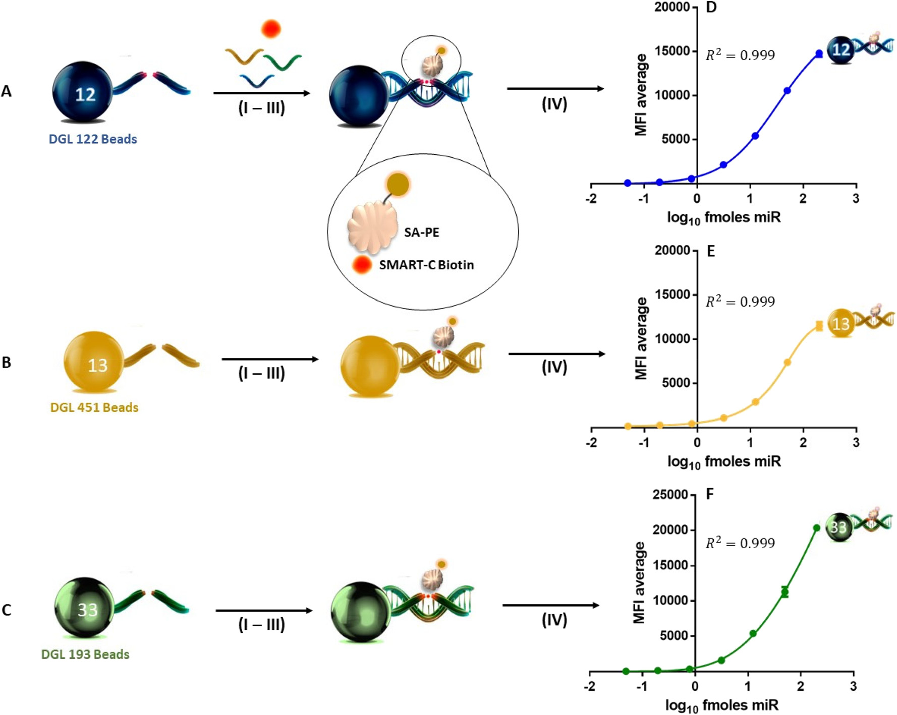
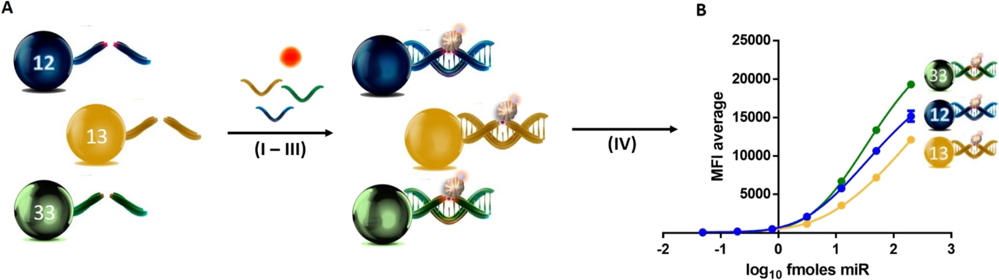
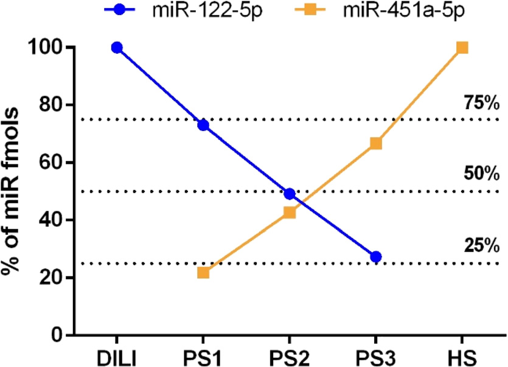

This article is licensed under aCreative Commons Attribution 3.0 Unported Licence.

Open Access Article. Published on 05 October 2022. Downloaded on 11/20/2024 9:14:10 AM.

# Sensors & Diagnostics

| | | |
|---|---|---|
| | | |

#### View Article Online

## PAPER

View Journal | View Issue

Cite this: Sens. Diagn., 2022, 1, 1243

## Open a new window in the world of circulating microRNAs by merging ChemiRNA Tech with a Luminex platform†

Antonio Marín-Romero, a Mavys Tabraue-Chávez, a James W. Dear, b Juan José Díaz-Mochón *cde and Salvatore Pernagallo *a

Received 29th June 2022, Accepted 19th September 2022

DOI: 10.1039/d2sd00111j

rsc.li/sensors

microRNAs are small noncoding RNA molecules showing huge promise as biomarkers and diagnostic tools for illnesses, as significant changes in their expression occur in response to pathological states. However, multiplex detection of microRNAs represents a major challenge towards the use of microRNA signatures. Hence, our group has tackled this need by developing an accurate and PCR-free approach to detect multiple microRNAs in serum samples. ChemiRNA Tech has been refined to be merged with a Luminex xMAP system. The combination of these two technologies has created a unique bead-based multiplex assay capable of simultaneously measuring miR-122-5p, miR-451a-5p and miR-193a-5p in only 10 μL of serum. This novel multiplex assay for the direct quantitative measurement of circulating microRNA signatures offers benefits over gold standard singleplex assay techniques in terms of cost, time savings and ease of use.

### Introduction

and severe physicochemical conditions such as extreme pH levels. Furthermore, they are (a) specific to the disease or pathology of interest; (b) reliable to indicate the disease's emergence before clinical symptoms appear (early detection); (c) sensitive to changes in the pathology stage (disease progression or therapeutic response); (d) easy to obtain from biological fluids; (e) easily translatable from model systems to humans. All those characteristics are greatly enhancing miR's translation in clinical applications attracting more and more interest in the medical scientific community with tens of thousands of peer-reviewed articles.8–15

microRNAs (miRs) are small non-coding RNAs of 19–24 nucleotides in length that regulate gene expression by base pairing with the 3′-untranslated region of target gene's messenger RNAs (mRNAs), leading to degradation and/or translational repression of those genes. miRs are implicated in many biological events, and their deregulation is associated with serious illnesses.1–4

miRs circulate in biological fluids (e.g., serum, plasma, urine and saliva) in a stable fashion and the unique expression patterns can be used as fingerprints for various diseases.5–8 They fulfil most of the characteristics to be considered as ideal biomarkers. They are remarkably stable in body fluids while in circulation, resisting ribonucleases

Traditional methods for miR analysis include amplification based strategies, such as the RT-qPCR,16 rolling circle amplification,17 exponential amplification reaction,18 and duplex-specific nucleic signal amplification,19 and also amplification free techniques, such as hybridization chain reaction20 and catalysed hairpin amplification.21 Unfortunately, most of the above-mentioned methods are time-consuming, have demanding assay workflows and, mainly, lack multiplexing capability. Thus, despite the extensive academic research, the current analytical methods remain less than satisfactory, and their complexity limits their use of miRs as diagnostic tools.22–25 Hence, it is necessary to provide novel, simple, sensitive and reliable methods for the direct detection of such molecules from body fluids.

aDESTINA Genomica S.L. Parque Tecnológico Ciencias de la Salud (PTS), Avenida de la Innovación 1, Edificio BIC, Armilla, Granada, 18100, Spain. E-mail: salvatore@destinagenomics.com bPharmacology, Therapeutics and Toxicology, Centre for Cardiovascular Science, University of Edinburgh, The Queen's Medical Research Institute, 47, Little France Crescent, Edinburgh, EH16 4TJ, UK cGENYO, Centre for Genomics and Oncological Research: Pfizer/University of Granada, Andalusian Regional Government, PTS Granada, Avenida de la Ilustración, 114 - 18016, Granada, Spain. E-mail: juandiaz@ugr.es dUniversidad de Granada, Facultad de Farmacia, Departamento de Quimica Farmacéutica y Orgánica, Campus Cartuja s/n, 18071, Granada, Spain eBiosanitary Research Institute of Granada (ibs.GRANADA), University Hospitals of Granada-University of Granada, Granada, Spain † Electronic supplementary information (ESI) available. See DOI: https://doi.org/ 10.1039/d2sd00111j

Due to the need, over the last years, our group has been extensively working on the development of ChemiRNA Tech.26 This is a novel chemical approach for Nucleic Acid Testing (NAT) particularly well suited to directly quantify

This article is licensed under aCreative Commons Attribution 3.0 Unported Licence.

Open Access Article. Published on 05 October 2022. Downloaded on 11/20/2024 9:14:10 AM.

circulating miRs. It combines SMART-Base with a biotin tag and modified peptide nucleic acid (PNA) capture probes with an abasic position (DGL-Probes) to interrogate miRs. This technology uses the power of the Watson–Crick base pairing rules (C-G/A-T) that enable the dynamic covalent chemical reaction between the aldehyde group of the SMART Bases and the secondary amine on the abasic position of the DGLProbe.25,27–39

In our previous studies, ChemiRNA Tech has been combined with some of the most advanced ultra-sensitive immunoassay platforms (such as Merck SMCxPro, Quanterix SIMOA and Luminex xMAP technology) to develop the socalled LiverAce™, the first platform-agnostic and PCR-free molecular assay for the direct detection and quantification of miR-122-5p, a biomarker for hepatotoxicity and DrugInduced Liver Injury (DILI) diagnostics.25,38–40

However, and as also stated above, multiplex detection of miRs remains a major challenge in the use of miR signatures. Therefore, in this proof of concept (PoC) study, our group has faced this need by implementing the “multiChemiRNA Tech” by the merging of ChemiRNA Tech with Luminex xMAP technology. Luminex technology uses different color-coded microspheres that allow the simultaneous detection of multiple analytes using a fluorescent reporter. This technology has been widely used for multiplex detection of proteins and genomic DNAs,41–45 although reports on the application of this technology to miR analysis have been sparse.

The multi-ChemiRNA Tech is a unique tool capable of detecting and quantifying simultaneously the circulating miRs. In this PoC study, to develop the multi-ChemiRNA Tech, three miRs with important roles in diverse biological processes were interrogated, namely miR-122-5p, miR-451a and miR-193a-5p from few microliter volumes of serum samples. miR-122-5p is a liver specific miR, involved in various processes of liver development, differentiation, metabolism and stress responses.46,47 Compared with conventional hepatotoxic markers, circulating miR-122-5p can effectively and consistently distinguish intrahepatic damage from extrahepatic damage with higher sensitivity and specificity. miR-122-5p is expected to be a valuable preclinical and clinical biomarker of DILI.48–51 Our group has broadly demonstrated the feasibility of miR-122-5p as a biomarker for DILI.25,38–40 miR-451a-5p is an erythroid cellspecific miRNA and is associated with human erythroid and maturation.52–56 Several studies have provided evidence about the potential use of miR-451a-5p as a biomarker for cancer diagnosis, prognosis, and treatment.57–60 In 2019, our group has reported the direct singleplex detection of miR-451a-5p in haemolysed plasma using ChemiRNA Tech in combination with a conventional microplate reader.32 miR-193a-5p is dysregulated in the tumour cells. Several studies have evaluated the expression level of miR-193a-5p such that it is up-regulated in prostate cancer while it has a decreased expression in colorectal cancer cells which shows its dual role in carcinogenesis.61,62 In addition, our group has recently

reported that the circulating miR-193a-5p level increases in the serum of patients with liver injury.63

### Experimental

Apparatus

The Luminex MAGPIX was used for multiplex assaying and fluorescence signal detection (Mean of Fluorescence Intensity – MFI). The platform was associated with dedicate software xPONENT. An automatic 96-well plate washer was used for washing (Biotek 405 TS). A 96-well plate shaker was used to perform incubations (VWR® Microplate Shaker).

Materials and reagents

Carboxylated MagPlex® (Luminex beads) were purchased from Luminex Corporation (1.25 × 107 mL−1). DGL-Probe 122, DGL-Probe 451 and DGL-Probe 193 and aldehyde-modified biotinylated cytosine nucleobase (SMART-C Biotin) were provided by DESTINA Genomica S.L. (Table S1 and Fig. S1†). A wash buffer and Stabiltech buffer were prepared as described elsewhere.38 An assay buffer and bead diluent were purchased from Merck. Chemicals for beads' functionalization were purchased from Sigma-Aldrich. Synthetic mimic miR-122-5p, miR-451a-5p and miR-193a-5p DNA oligomers were purchased from Integrated DNA Technologies (Table S1†). Concentrations of DNA oligomer solutions were determined using a ThermoFisher NanoDrop1000 spectrophotometer. Streptavidin-Rphycoerythrin (SA-PE) was purchased from Moss Biotech (SAPE-001, SA-PE-001E, SA-PE-001 16P, SA-PE-001 4P, SA-PE-003) and ThermoFisher Inc (#S21388) at the concentration of 1 mg mL−1.

Clinical samples

The DILI sample was provided by Professor James W. Dear from the University of Edinburgh (UK). A sample was collected from a DILI patient (over 16 years old). Full informed consent was obtained from the participant and ethical approval was given by the South East Scotland Research Ethics Committee and the East of Scotland Research Ethics Committee via the South East Scotland Human Bioresource. Blood sample was taken and centrifuged immediately at 11000× g for 15 min at 4 °C. The serum was separated into aliquots and stored at −80 °C. The primary endpoint for the study was acute liver injury, pre-defined as a peak hospital stay serum ALT activity greater than 100 U L−1 as shown elsewhere.64

Blood samples were collected from a healthy volunteer (HV). Full informed consent was obtained from the HV ahead of the study. As shown in Fig. S2-A,† the samples were chemically haemolysed to liberate intra-erythropoietic miR451a-5p. Briefly, 2 mL of whole blood was incubated for 10 min with 2 mL of RBC lysis buffer (dilution 1:2) to break up red blood cells. The solution was then centrifuged at 1500 g

This article is licensed under aCreative Commons Attribution 3.0 Unported Licence.

Open Access Article. Published on 05 October 2022. Downloaded on 11/20/2024 9:14:10 AM.

for 10 min at room temperature to obtain the haemolysed serum (HS).

Pool samples (PS 1–PS 3) were prepared by mixing DILI and haemolysed samples (Table S2†). Control samples were prepared using whole blood from the HV without haemolysis. In this case, 2 mL of whole blood was centrifuged at 1500 g for 10 min at room temperature. The supernatant serum was collected and diluted 2 times with RBC lysis buffer to obtain the non-haemolysed serum (Fig. S2-B†).

DGL-Probes coupling to beads

Magplex® (Luminex) beads from colour regions 12, 13 and 33 (ref. 44) were functionalized respectively with DGL 122, DGL 451 and DGL 193 abasic PNAs as described in the ESI,† section S2, to generate DGL 122 beads, DGL 451 beads and DGL 193 beads.

Coupling confirmation

Luminex beads' coupling efficiency was determined by hybridization with complementary synthetic biotinylated DNA oligomers. This study was carried out using DGL 122 beads. Briefly, in a 96-well plate format, 45 μL of assay buffer containing 1250 DGL 122 beads was pipetted into the wells. A volume of 5 μL containing 15 fmols of biotinylated DNA oligomer (positive) and 5 μL of water (blank) were added into the wells (positives and negatives were run in duplicate). The

- 96-well plate was incubated for 1 h at 40 °C using a microplate shaker shaking at 700 rpm. DGL 122 beads were washed 3 times with the wash buffer and incubated with 50 μL of 2 μg mL−1 SA-PE for 30 min at 30 °C while being shaken at 700 rpm. DGL 122 beads were washed 3 times with the wash buffer and finally resuspended in a volume of 120 μL of wash buffer to be analysed with the Luminex MAGPIX system by using an injection volume of 100 μL. MFI values were recorded.

Singleplex DGL bead sensitivity study

DGL beads for each miR were validated with ChemiRNA Tech with complementary oligomers to analyse coupling efficiency and sensitivity.

The following protocol was used to generate three parallel calibration curves associated respectively with DGL 122 beads, DGL 451 beads and DGL 193 beads. In a 96-well plate format, 55 μL of Stabiltech buffer containing a pool of complementary synthetic DNA oligomer mimicking miR-1225p, miR-451a-5p and miR-193a-5p (0.2 to 200 fmols) and 55 μL of only Stabiltech buffer as the blank were pipetted into the wells. A volume of 10 μL of DGL beads at 125 beads per μL (1250 beads in total) was added to the wells, followed by the addition of 10 μL of serum matrix (control samples). The

- 96-well plate was incubated for 2 h at 30 °C using a microplate shaker shaking at 700 rpm. After the incubation, DGL beads were washed 3 times with the wash buffer. DGL beads were resuspended in 50 μL of assay buffer containing 5 μM SMART-C Biotin and 1 mM sodium cyanoborohydride

and incubated for further 1 h at 40 °C under 700 rpm shaking. Beads were washed 3 times with the wash buffer and incubated with 50 μL of 2 μg mL−1 SA-PE for 30 min at 30 °C while being shaken at 700 rpm. Beads were washed 3 times with the wash buffer and finally resuspended in a volume of 120 μL of wash buffer to be analysed on the Luminex MAGPIX system to determine the MFI values (injection volume of 100 μL). Experiments were performed in duplicate.

Multiplex DGL bead sensitivity study

The three sets of DGL beads were mixed to perform the multiplex testing. A volume of 100 μL of DGL 122 beads (3750 beads per μL) was mixed respectively with 100 μL of DGL 451 beads (3750 beads per μL) and 100 μL of DGL 193 beads (3750 beads per μL). The 300 μL bead mixture was added to 700 μL of bead diluent. The following protocol was used to generate the multiplex calibration curve. In a 96-well plate format, 55 μL of Stabiltech buffer containing a pool of complementary synthetic miR mimic miR-122-5p, miR-451a5p and miR-193a-5p (0.2 to 200 fmols) and 55 μL of only Stabiltech buffer as the blank were pipetted into the wells. A volume of 10 μL of DGL bead mixture (125 beads per μL for each set of DGL bead) was added to the wells (total 1250 × 3 = 3750), followed by the addition of 10 μL of serum matrix (control samples). The protocol is described in “Singleplex DGL bead sensitivity study”.

Multiplex assay in clinical samples

The three sets of DGL beads were mixed as described in the “Multiplex DGL beads sensitivity study”. The following protocol was used to interrogate clinical samples. In a 96-well plate format, 55 μL of Stabiltech buffer was pipetted into the wells. A volume of 10 μL of DGL bead mixture (125 beads per μL for each set of DGL bead) was added to the wells (total 1250 × 3 = 3750), followed by the addition of 10 μL of the clinical sample (DILI, HS or PS). The protocol followed is described in “Singleplex DGL bead sensitivity study”.

### Results and discussion

Reagents for multi-ChemiRNA Tech

Three DGL-Probes complementary to the three miRs (DGLProbe 122, DGL-Probe 451 and DGL-Probe 193) were prepared with propanoic acid at the gamma position modifications in the backbone of sequences (ESI,† Table S1). As described elsewhere by our group,30 the presence of these modifications enhanced DGL-Probes' performance being more readily available to hybridise complementary miRs, hence, allowing more efficient dynamic incorporation of the aldehydemodified biotinylated nucleobase (SMART-Base). DGL-Probe 122, DGL-Probe 451 and DGL-Probe 193 were conjugated to Luminex beads with colour regions 12, 13 and 33 respectively to generate DGL 122 beads, DGL 451 beads and DGL 193 beads using the conjugation chemistry reported elsewhere.30

This article is licensed under aCreative Commons Attribution 3.0 Unported Licence.

Open Access Article. Published on 05 October 2022. Downloaded on 11/20/2024 9:14:10 AM.

The coupling efficiency was determined by running a hybridization with a complementary synthetic biotinylated DNA oligomer that mimics the target miR-122-5p sequence (data not shown). SMART-Base with a biotin tag was used for the study (Fig. S1†).

Selection of SA-PE

To improve the detection sensitivity, different streptavidin-Rphycoerythrin (SA-PE) conjugations were tested on DGL 122 beads in a singleplex format. The study was carried out with six different commercially available SA-PE molecules: a) SAPE from ThermoFisher and b) from MossBio, namely SA-PE 001, SA-PE 001E, SA-PE 001 16P, SA-PE 001 4P and SA-PE 003. Performances were determined by interrogating spike-in oligomers mimicking miR-122-5p (as the positive) and only water (as the blank). The protocol used for the study is described in the experimental section ‘Singleplex DGL bead sensitivity study’. As shown in Fig. S3,† all SA-PEs from MossBio improved the S/B ratio when compared with the SAPE from ThermoFisher. Due to the overall good performances

of all the MossBio SA-PEs, SA-PE 001 16P was selected for the present study because it is slightly better in terms of performance (Fig. S3†).

Singleplex assay

DGL beads were used in a singleplex format to perform analytical sensitivity studies by creating three parallel calibration curves using known quantities of DNA oligomers mimicking miR targets (miR-122-5p, miR-451a-5p and miR193a-5p). A pool of miR targets in the serum was prepared by spiking seven known quantities of oligomers, respectively, with the calibration points: 200.00, 50.00, 12.50, 3.13, 0.78, 0.20 and 0.05 fmols (each in duplicate). No spike-in oligomers were added to the blank (water instead). As shown in Fig. 1A–C, the singleplex workflow is a multistep comprised of four main steps (I–IV): I) DGL beads hybridise to a complementary DNA oligomer; II) SMART-C Biotin is specifically incorporated into the duplex by a chemical dynamic reaction. This specific incorporation is ensured by the three events required: (a) perfect hybridisation between

Fig. 1 Singleplex workflow. A–C) Analysis of miR-122-5p, miR-451a-5p and miR-193a-5p in a singleplex format: I) DGL bead hybridization with a complementary target; II) ChemiRNA Tech reaction with SMART-C Biotin incorporation; III) DGL bead labelling with SA-PE; IV) Bead read-out by measuring values of MFI using the Luminex MAGPIX system. MFI values are plotted versus the logarithm base 10 quantity of oligomers to create three calibration curves, respectively: D) miR-122-5p, E) miR-451a-5p and F) miR-193a-5p. n = 2. Error bar = standard deviation.

This article is licensed under aCreative Commons Attribution 3.0 Unported Licence.

Open Access Article. Published on 05 October 2022. Downloaded on 11/20/2024 9:14:10 AM.

the DGL-Probe and complementary oligomer; (b) generation of a reversible iminium species between the secondary amine of the “abasic position” and the aldehyde group of a cytosine SMART-Base with a biotin tag (SMART-C Biotin), which is driven by the templating “G” nucleotide on the complementary oligomer; (c) reduction of the iminium species by sodium cyanoborohydride to lock-up the SMART-C Biotin covalently into the duplex; III) DGL beads are labelled with SA-PE; IV) read-out with the Luminex MAGPIX system.

Experiments were performed in duplicate, resulting in a coefficient of variance for each assay below 5% (Tables S3– S5†). Curves were prepared by plotting the mean of fluorescence intensity (MFI) values versus the logarithm base 10 quantity of oligomers (Fig. 1D–F). MFI values are reported in the ESI,† Tables S3–S5 and curve equations are reported in the ESI,† section S3.

Determination of the signal-to-blank ratio was performed by comparing measured signals from spike-in calibration points with those of blanks and establishing the minimum concentration at which the spike-in calibration point can be reliably detected. A signal-to-blank ratio of 2:1 was considered for estimating the limit of detection (LOD), as described elsewhere.65 As a result, DGL 122 beads and DGL 451 beads show LODs between 0.05 and 0.20 fmols while DGL 193 beads show below 0.05 fmols.

Multiplex assay

The three singleplex assays described in Fig. 1A–C were combined to deliver a multiplex assay capable of profiling miR-122-5p, miR-451a-5p and miR-193a-5p simultaneously.

The three sets of DGL beads were mixed to perform the multiplex testing. This study allowed the multiplex and singleplex assays to be compared for the detection of ultralow prevalence miRs in spiked serums.

The analytical sensitivity study was carried out by creating calibration curves to determine the sensitivity of DGL beads in a multiplex format. The same calibration points used for the singleplex assay were interrogated: 200.00, 50.00, 12.50,

3.13, 0.78, 0.20 and 0.05 fmols of each DNA oligomer, mimicking respectively miR-122-5p, miR-451a-5p and miR193a-5p. The workflow described in Fig. 2A for the multiplex is essentially the same as described for the singleplex assay with the only difference that instead of a single DGL bead (1250 beads), an equal mix of DGL beads corresponding to the three target DNA oligomers (1250 × 3 = 3750 beads) was used. As for the singleplex assay, experiments were performed in duplicate, resulting in a coefficient of variance for each condition also below 5% (Table S6†). The curve was prepared by plotting the MFI values versus logarithm base 10 quantity of DNA oligomers (Fig. 2B). MFI values are reported in the ESI,† Table S6. DGL 122 beads and DGL 451 beads show an LOD between 0.05 and 0.20 fmols and DGL 193 beads show below 0.05 fmols.

Inter-assay variability

Table S7 in the ESI† shows the comparative analysis between the singleplex and multiplex assays. By comparing the MFI average signals obtained for each calibration curve, it was possible to determine the inter-assay variability between the two assays. Inter-CV values were below 10% for miR-122-5p and miR-451a-5p measurements and 15% for miR-193a-5p measurement. This shows the robustness of the multiplex assay in comparison with the singleplex assays. In addition, no signal loss nor cross reactivity was observed when the multiplex analysis was performed.

Assay validation using serum samples

The multiplex assay was challenged by profiling different levels of miR-122-5p, miR-451a-5p and miR-193a-5p in serum samples. For the study, five types of serums were analysed:

- a) DILI – a serum from a DILI patient rich in miR-122-5p;
- b) HS – a serum from haemolysed blood rich in miR-

451a-5p;

- c) PS 1 – a pool sample generated by the mixture of a + b

with a ratio of 75%/25%;

Fig. 2 Multiplex workflow. A) Analysis of miR-122-5p, miR-451a-5p and miR-193a-5p in the multiplex format: I) DGL bead hybridization with complementary targets; II) ChemiRNA Tech reactions with SMART-C Biotin incorporations; III) DGL bead labelling with SA-PE; IV) DGL beads are read-out by measuring the values of MFI using the Luminex MAGPIX system. B) Calibration curves for each miR in the multiplex format by plotting the MFI values versus the logarithm base 10 quantity of oligomers. n = 2. Error bar = standard deviation.

This article is licensed under aCreative Commons Attribution 3.0 Unported Licence.

Open Access Article. Published on 05 October 2022. Downloaded on 11/20/2024 9:14:10 AM.

- d) PS 2 – a pool sample generated by the mixture of a + b

with a ratio of 50%/50%;

- e) PS 3 – a pool sample generated by the mixture of a + b

with a ratio of 25%/75%.

A serum sample obtained from a healthy volunteer (HV) without significant levels of circulating miR-122-5p, miR451a-5p or miR-193a-5p at the time of the study was used as a control. DGL beads were mixed to interrogate the five types of serums described from a to e (see above).

The multiplex assay has included the Stabiltech buffer. As described by our group elsewhere,25 this buffer has been developed to lysate the serum samples and lead to the miR release from protein complexes and/or extracellular vesicles. MFI values obtained from samples (Table S8†) were used to make an absolute quantification of miRNA-122-5p, miR451a-5p and miR-193a-5p by extrapolating the fmols from the calibration curves in Fig. 2B. As shown in Table S9,† the assay obtained the profiling levels (quantity in fmols) of: a) the only miRNA-122-5p in the DILI patient (quantity n.d. of miR-451a); b) the only miR-451a-5p in the HS sample (quantity n.d. of miR-122-5p); c–e) both miRNA-122-5p and miR-451a-5p in PS 1–3 samples (see Table S9†). None of the above shows levels of miR-193a-5p (quantity n.d.), because either it is not present or its amounts fall below the assay's LOD. As shown in Fig. 3, PS 1–PS 3 show levels of miR-1225p versus mir-451a-5p coherent with volume ratios (% described in c to e) of DILI versus HS serums. In Fig. 3, % of miR is calculated assuming: a) 100% of miR-122-5p = the average quantity measured for DILI (6.27 fmols, see Table S9†); b) 100% of miR-451a-5p = the average quantity measured for HS (78.40 fmols, see Table S9†). % of PS 1, PS 2 and PS 3 was calculated dividing the average quantities of miR-122-5p and miR-451a-5p respectively for PS 1 (4.58 and 17.12 fmols, see Table S9†), PS 2 (3.09 and 33.50 fmols, see Table S9†) and PS 3 (1.71 and 52.31 fmols, see Table S9†) by the average quantities measured respectively for DILI (6.27 fmols, see Table S9†) and HS (78.40 fmols, see Table S9†).

Fig. 3 Serum sample analysis (n = 2). miR-122-5p and miR-451a-5p detection in DILI, PS1, PS2, PS3 and HS samples. y-Axis: % of miR is calculated as described in the main text.

### Conclusions

Many studies have shown that circulating miRNAs could play potential roles as diagnostic and prognostic biomarkers. Combinations of miR biomarkers can identify diseases, predict the course of pathology and help in assigning drug treatment.

However, and as stated above, despite the extensive academic research the translation of miR biomarkers to clinical practice remains a challenge. Current analysis platforms require workflows which include extraction, elongation, reverse transcription and quantitative PCR which make the quantification of miRs with the standard analytical platforms very challenging and not scalable. On top of that, multiplexing is another complexity that current systems cannot easily overcome. Hence, there is a need to develop new technologies to accurately detect and measure multi-miR signatures in clinical settings.

To tackle the issue, in this PoC study, our group has developed multi-ChemiRNA Tech, a novel assay capable of interrogating multi-miRs simultaneously without the need of extracting or amplifying target miRs. The novel assay was created by merging the ChemiRNA Tech with the Luminex xMAP system.

The manuscript describes an overview of the PoC for testing the integration of the two technologies and its validation using serum samples. All the key PoC objectives were achieved, including effective DGL-Probe coupling with Luminex beads and ChemiRNA Tech reactions in singleplex and multiplex formats, demonstrating successful translation of ChemiRNA Tech reagents onto the Luminex xMAP platform.

The novel assay was evaluated and validated for detecting miR-122-5p, miR-451a-5p and miR-193a-5p. The presence of miR-122-5p as a hepatic toxicity biomarker enables the assay to be used as a drug development tool with wide applications in the field of drug development.66–69 In fact, miR-122-5p has received an endorsement from the Food and Drug Administration (FDA) as a biomarker of liver specific injury based on its performance in patients with acute DILI, including patients with DILI due to acetaminophen overdose, compared to non-DILI controls.70

In the first instance, both singleplex and multiplex formats were implemented by spiking DNA oligomers (mimicking the three miRs) in serum samples successfully. MFI values between both singleplex and multiplex were compared, and no signal differences were observed, thus demonstrating the high compatibility of the multi-ChemiRNA Tech reagents (see Table 1). It has demonstrated that the multiplexed measurement does not differ from the singleplex assay in terms of sensitivity and accuracy.

Once the development with DNA oligomers was completed, the novel multi-ChemiRNA Tech was validated using biological samples. A serum from (a) a patient with liver injury, (b) haemolysed blood and (c) pool of serums of a + b at three different ratios (PS 1–PS 3) were interrogated to

This article is licensed under aCreative Commons Attribution 3.0 Unported Licence.

Open Access Article. Published on 05 October 2022. Downloaded on 11/20/2024 9:14:10 AM.

Table 1 Assay sensitivity and precision

Singleplex assay Multiplex assay Sensitivity Precision Sensitivity Precision

miR ID

miR-122-5p 0.05–0.20 <5% 0.05–0.20 <5% miR-451a-5p 0.05–0.20 <5% 0.05–0.20 <5% miR-193a-5p Below 0.05 <5% Below 0.05 <5%

determine the levels of miRs. miR-122-5p and miR-451a-5p were detected and quantified successfully. Meanwhile, miR193a-5p was not detected and this is, perhaps, because its level falls below the LOD of the assay.

The novel assay has included the Stabiltech buffer, a lysing buffer that allowed the liberation and capture of miRs in serum samples.25 As shown in Fig. 3, miR-122-5p and miR451a-5p were detected and resulted in quantities corresponding to the ratio of the percentage of DILI versus HS samples. No miR detection was reported for the control HV.

To the best of our knowledge, this is the first use of Luminex xMAP technology for a direct (PCR-free) multi miR profiling from serum samples (without pre-extraction of RNAs). This novel assay used a small sample volume (10 μL), which is particularly useful for testing paediatric samples, precious samples such as cerebrospinal fluid or even samples from small animals such as rats in preclinical testing.

The multi-ChemiRNA Tech is very promising and potentially suitable for developing a highly innovative nextgeneration system to multiplex the analysis of miRs. It shows the way forward to simplified, more cost effective and robust multiplex tests in the future, to interrogate multi-miR biomarkers with predictive value in pathologies such as liver injury, cancer, but as well as to evaluate drug-induced injuries affecting other organs such as kidney and heart.

### Author contributions

S. P., J. J. D. M. and A. M. R. contributed to the design of the experiments of this work. A. M. R. and M. T. C. performed the experiments. S. P. and A. M. R. wrote the manuscript. J. W. D. and J. J. D. M. critically revised the manuscript.

### Conflicts of interest

J. J. D. M. is a shareholder and director of DESTINA Genomica S.L. S. P. is a shareholder of DESTINA Genomica S.L.

### Acknowledgements

The authors thank the staff of DESTINA Genomica S.L. for their important technical support. This study was funded by the Estars 2 programme under the grant number 114589.

### Notes and references

1 D. P. Bartel, MicroRNAs: genomics, biogenesis, mechanism, and function, Cell, 2004, 116(2), 281–297.

- 2 D. P. Bartel, MicroRNAs: target recognition and regulatory functions, Cell, 2009, 136(2), 215–233.
- 3 A. Drusco and C. M. Croce, MicroRNAs and Cancer: A Long Story for Short RNAs, Adv. Cancer Res., 2017, 135, 1–24.
- 4 C. Price and J. Chen, MicroRNAs in Cancer Biology and Therapy: Current Status and Perspectives, Genes Dis., 2014, 1(1), 53–63.
- 5 K. Kang, X. Peng, J. Luo and D. Gou, Identification of circulating miRNA biomarkers based on global quantitative real-time PCR profiling, J. Anim. Sci. Biotechnol., 2012, 3(1), 4.
- 6 A. Izzotti, S. Carozzo, A. Pulliero, D. Zhabayeva, J. L. Ravetti and R. Bersimbaev, Extracellular MicroRNA in liquid biopsy: applicability in cancer diagnosis and prevention, Am. J. Cancer Res., 2016, 6(7), 1461–1493.
- 7 N. Kosaka, H. Iguchi and T. Ochiya, Circulating microRNA in body fluid: a new potential biomarker for cancer diagnosis and prognosis, Cancer Sci., 2010, 101(10), 2087–2092.
- 8 K. W. Witwer, Circulating microRNA biomarker studies: pitfalls and potential solutions, Clin. Chem., 2015, 61(1), 56–63.
- 9 J. Krauskopf, T. M. de Kok, S. J. Schomaker, M. Gosink, D. A. Burt and P. Chandler, et al., Serum microRNA signatures as “liquid biopsies” for interrogating hepatotoxic mechanisms and liver pathogenesis in human, PLoS One, 2017, 12(5), e0177928.
- 10 G. H. Liu, Z. G. Zhou, R. Chen, M. J. Wang, B. Zhou and Y. Li, et al., Serum miR-21 and miR-92a as biomarkers in the diagnosis and prognosis of colorectal cancer, Tumor Biol., 2013, 34(4), 2175–2181.
- 11 J. C. McCrae, N. Sharkey, D. J. Webb, A. D. Vliegenthart and J. W. Dear, Ethanol consumption produces a small increase in circulating miR-122 in healthy individuals, Clin. Toxicol., 2016, 54(1), 53–55.
- 12 P. J. Starkey Lewis, J. Dear, V. Platt, K. J. Simpson, D. G. Craig and D. J. Antoine, et al., Circulating microRNAs as potential markers of human drug-induced liver injury, Hepatology, 2011, 54(5), 1767–1776.
- 13 H. Ogata-Kawata, M. Izumiya, D. Kurioka, Y. Honma, Y. Yamada and K. Furuta, et al., Circulating exosomal microRNAs as biomarkers of colon cancer, PLoS One, 2014, 9(4), e92921.
- 14 X. Zhang, S. Shi, B. Zhang, Q. Ni, X. Yu and J. Xu, Circulating biomarkers for early diagnosis of pancreatic cancer: facts and hopes, Am. J. Cancer Res., 2018, 8(3), 332–353.
- 15 L. Nandagopal and G. Sonpavde, Circulating Biomarkers in Bladder Cancer, Bladder Cancer, 2016, 2(4), 369–379.
- 16 C. Chen, R. Tan, L. Wong, R. Fekete and J. Halsey, Quantitation of microRNAs by real-time RT-qPCR, Methods Mol. Biol., 2011, 687, 113–134.
- 17 N. I. Goo and D. E. Kim, Rolling circle amplification as isothermal gene amplification in molecular diagnostics, BioChip J., 2016, 10(4), 262–271.
- 18 R. D. Li, B. C. Yin and B. C. Ye, Ultrasensitive, colorimetric detection of microRNAs based on isothermal exponential amplification reaction-assisted gold nanoparticle amplification, Biosens. Bioelectron., 2016, 86, 1011–1016.

This article is licensed under aCreative Commons Attribution 3.0 Unported Licence.

Open Access Article. Published on 05 October 2022. Downloaded on 11/20/2024 9:14:10 AM.

- 19 E. Tan, J. Wong, D. Nguyen, Y. Zhang, B. Erwin and L. K. Van Ness, et al., Isothermal DNA amplification coupled with DNA nanosphere-based colorimetric detection, Anal. Chem., 2005, 77(24), 7984–7992.
- 20 Z. Ge, M. Lin, P. Wang, H. Pei, J. Yan and J. Shi, et al., Hybridization chain reaction amplification of microRNA detection with a tetrahedral DNA nanostructure-based electrochemical biosensor, Anal. Chem., 2014, 86(4), 2124–2130.
- 21 Y. H. Yuan, Y. D. Wu, B. Z. Chi, S. H. Wen, R. P. Liang and J. D. Qiu, Simultaneously electrochemical detection of microRNAs based on multifunctional magnetic nanoparticles probe coupling with hybridization chain reaction, Biosens. Bioelectron., 2017, 97, 325–331.
- 22 L. Moldovan, K. E. Batte, J. Trgovcich, J. Wisler, C. B. Marsh and M. Piper, Methodological challenges in utilizing miRNAs as circulating biomarkers, J. Cell. Mol. Med., 2014, 18(3), 371–390.
- 23 B. Wang and Y. Xi, Challenges for MicroRNA Microarray Data Analysis, Microarrays, 2013, 2(2), 34–50.
- 24 H. Lin, L. E. Ewing, I. Koturbash, B. J. Gurley and I. R. Miousse, MicroRNAs as biomarkers for liver injury: Current knowledge, challenges and future prospects, Food Chem. Toxicol., 2017, 110, 229–239.
- 25 B. López-Longarela, E. E. Morrison, J. D. Tranter, L. Chahman-Vos, J. F. Léonard and J. C. Gautier, et al., Direct Detection of miR-122 in Hepatotoxicity Using Dynamic Chemical Labeling Overcomes Stability and isomiR Challenges, Anal. Chem., 2020, 92(4), 3388–3395.
- 26 Destina GL. DESTINA - ChemiRNA Tech, YouTube, 2019, https://www.youtube.com/watch?v=7jX0uZn3YpM.
- 27 F. R. Bowler, J. J. Diaz-Mochon, M. D. Swift and M. Bradley, DNA analysis by dynamic chemistry, Angew. Chem., Int. Ed., 2010, 49(10), 1809–1812.
- 28 F. R. Bowler, P. A. Reid, A. C. Boyd, J. J. Díaz-Mochón and M. Bradley, Dynamic chemistry for enzyme-free allele discrimination in genotyping by MALDI-TOF mass spectrometry, Anal. Methods, 2011, 3(7), 1656–1663.
- 29 S. Pernagallo, G. Ventimiglia, C. Cavalluzzo, E. Alessi, H. Ilyine and M. Bradley, et al., Novel biochip platform for nucleic acid analysis, Sensors, 2012, 12(6), 8100–8111.
- 30 S. Venkateswaran, M. A. Luque-González, M. TabraueChávez, M. A. Fara, B. López-Longarela and V. Cano-Cortes, et al., Novel bead-based platform for direct detection of unlabelled nucleic acids through Single Nucleobase Labelling, Talanta, 2016, 161, 489–496.
- 31 M. Angélica Luque-González, M. Tabraue-Chávez, B. LópezLongarela, R. María Sánchez-Martín, M. Ortiz-González and M. Soriano-Rodríguez, et al., Identification of Trypanosomatids by detecting Single Nucleotide Fingerprints using DNA analysis by dynamic chemistry with MALDI-ToF, Talanta, 2018, 176, 299–307.
- 32 A. Marín-Romero, A. Robles-Remacho, M. Tabraue-Chávez, B. López-Longarela, R. M. Sánchez-Martín and J. J. GuardiaMonteagudo, et al., A PCR-free technology to detect and quantify microRNAs directly from human plasma, Analyst, 2018, 143(23), 5676–5682.

- 33 S. Detassis, M. Grasso, M. Tabraue-Chávez, A. MarínRomero, B. López-Longarela and H. Ilyine, et al., New Platform for the Direct Profiling of microRNAs in Biofluids, Anal. Chem., 2019, 91(9), 5874–5880.
- 34 A. Delgado-Gonzalez, A. Robles-Remacho, A. Marin-Romero, S. Detassis, B. Lopez-Longarela and F. J. Lopez-Delgado, et al., PCR-free and chemistry-based technology for miR-21 rapid detection directly from tumour cells, Talanta, 2019, 200, 51–56.
- 35 M. Tabraue-Chávez, M. A. Luque-González, A. MarínRomero, R. M. Sánchez-Martín, P. Escobedo-Araque and S. Pernagallo, et al., A colorimetric strategy based on dynamic chemistry for direct detection of Trypanosomatid species, Sci. Rep., 2019, 9(1), 3696.
- 36 E. Garcia-Fernandez, M. C. Gonzalez-Garcia, S. Pernagallo, M. J. Ruedas-Rama, M. A. Fara and F. J. López-Delgado, et al., miR-122 direct detection in human serum by timegated fluorescence imaging, Chem. Commun., 2019, 55(99), 14958–14961.
- 37 A. Robles-Remacho, M. A. Luque-González, R. A. GonzálezCasín, M. V. Cano-Cortés, F. J. Lopez-Delgado and J. J. Guardia-Monteagudo, et al., Development of a nanotechnology-based approach for capturing and detecting nucleic acids by using flow cytometry, Talanta, 2021, 226, 122092.
- 38 A. Marín-Romero, M. Tabraue-Chávez, B. López-Longarela, M. A. Fara, R. M. Sánchez Martín and J. W. Dear, et al., Simultaneous Detection of Drug-Induced Liver Injury Protein and microRNA Biomarkers Using Dynamic Chemical Labelling on a Luminex MAGPIX System, Analytica, 2021, 2, 130–139.
- 39 A. Marín-Romero, M. Tabraue-Chávez, J. W. Dear, R. M. Sánchez-Martín, H. Ilyne and J. J. Guardia-Monteagudo, et al., Amplification-free profiling of microRNA-122 biomarker in DILI patient serums, using the luminex MAGPIX system, Talanta, 2020, 219, 121265.
- 40 D. M. Rissin, B. López-Longarela, S. Pernagallo, H. Ilyine, A. D. B. Vliegenthart and J. W. Dear, et al., Polymerase-free measurement of microRNA-122 with single base specificity using single molecule arrays: Detection of drug-induced liver injury, PLoS One, 2017, 12(7), e0179669.
- 41 F. Chowdhury, A. Williams and P. Johnson, Validation and comparison of two multiplex technologies, Luminex and Mesoscale Discovery, for human cytokine profiling, J. Immunol. Methods, 2009, 340(1), 55–64.
- 42 S. Esposito, A. Scala, S. Bianchini, M. L. Presicce, A. Mori and C. S. Sciarrabba, et al., Partial comparison of the NxTAG Respiratory Pathogen Panel Assay with the Luminex xTAG Respiratory Panel Fast Assay V2 and singleplex real-time polymerase chain reaction for detection of respiratory pathogens, Diagn. Microbiol. Infect. Dis., 2016, 86(1), 53–57.
- 43 J. Gray and L. J. Coupland, The increasing application of multiplex nucleic acid detection tests to the diagnosis of syndromic infections, Epidemiol. Infect., 2014, 142(1), 1–11.
- 44 R. Perraut, V. Richard, M. L. Varela, J. F. Trape, M. Guillotte and A. Tall, et al., Comparative analysis of IgG responses to

This article is licensed under aCreative Commons Attribution 3.0 Unported Licence.

Open Access Article. Published on 05 October 2022. Downloaded on 11/20/2024 9:14:10 AM.

Plasmodium falciparum MSP1p19 and PF13-DBL1α1 using ELISA and a magnetic bead-based duplex assay (MAGPIX®Luminex) in a Senegalese meso-endemic community, Malar. J., 2014, 13, 410.

- 45 N. G. Satterly, M. A. Voorhees, A. D. Ames and R. J. Schoepp, Comparison of MagPix Assays and Enzyme-Linked Immunosorbent Assay for Detection of Hemorrhagic Fever Viruses, J. Clin. Microbiol., 2017, 55(1), 68–78.
- 46 Y. Zhang, Y. Jia, R. Zheng, Y. Guo, Y. Wang and H. Guo, et al., Plasma microRNA-122 as a biomarker for viral-, alcohol-, and chemical-related hepatic diseases, Clin. Chem., 2010, 56(12), 1830–1838.
- 47 D. J. Antoine, J. W. Dear, P. S. Lewis, V. Platt, J. Coyle and M. Masson, et al., Mechanistic biomarkers provide early and sensitive detection of acetaminophen-induced acute liver injury at first presentation to hospital, Hepatology, 2013, 58(2), 777–787.
- 48 D. N. Bateman, Changing the Management of Paracetamol Poisoning, Clin. Ther., 2015, 37(9), 2135–2141.
- 49 M. I. Danjuma, J. Sajid, H. Fatima and A. N. Elzouki, Novel biomarkers for potential risk stratification of drug induced liver injury (DILI): A narrative perspective on current trends, Medicine, 2019, 98(50), e18322.
- 50 S. Fu, D. Wu, W. Jiang, J. Li, J. Long and C. Jia, et al., Molecular Biomarkers in Drug-Induced Liver Injury: Challenges and Future Perspectives, Front. Pharmacol., 2019, 10, 1667.
- 51 D. J. Antoine and J. W. Dear, Transformative biomarkers for drug-induced liver injury: are we there yet?, Biomarkers Med., 2017, 11(2), 103–106.
- 52 S. Masaki, R. Ohtsuka, Y. Abe, K. Muta and T. Umemura, Expression patterns of microRNAs 155 and 451 during normal human erythropoiesis, Biochem. Biophys. Res. Commun., 2007, 364(3), 509–514.
- 53 L. Pase, J. E. Layton, W. P. Kloosterman, D. Carradice, P. M. Waterhouse and G. J. Lieschke, miR-451 regulates zebrafish erythroid maturation in vivo via its target gata2, Blood,

- 2009, 113(8), 1794–1804.

54 D. M. Patrick, C. C. Zhang, Y. Tao, H. Yao, X. Qi and R. J. Schwartz, et al., Defective erythroid differentiation in miR451 mutant mice mediated by 14-3-3zeta, Genes Dev.,

- 2010, 24(15), 1614–1619.

- 55 K. D. Rasmussen, S. Simmini, C. Abreu-Goodger, N. Bartonicek, M. Di Giacomo and D. Bilbao-Cortes, et al., The miR-144/451 locus is required for erythroid homeostasis, J. Exp. Med., 2010, 207(7), 1351–1358.
- 56 S. Svasti, S. Masaki, T. Penglong, Y. Abe, P. Winichagoon and S. Fucharoen, et al., Expression of microRNA-451 in normal and thalassemic erythropoiesis, Ann. Hematol., 2010, 89(10), 953–958.

- 57 H. B. Bian, X. Pan, J. S. Yang, Z. X. Wang and W. De, Upregulation of microRNA-451 increases cisplatin sensitivity of non-small cell lung cancer cell line (A549), J. Exp. Clin. Cancer Res., 2011, 30, 20.
- 58 M. Khordadmehr, F. Jigari-Asl, H. Ezzati, R. Shahbazi, S. Sadreddini and S. Safaei, et al., A comprehensive review on miR-451: A promising cancer biomarker with therapeutic potential, J. Cell. Physiol., 2019, 234(12), 21716–21731.
- 59 X. Pan, R. Wang and Z. X. Wang, The potential role of miR451 in cancer diagnosis, prognosis, and therapy, Mol. Cancer Ther., 2013, 12(7), 1153–1162.
- 60 R. Wang, Z. X. Wang, J. S. Yang, X. Pan, W. De and L. B. Chen, MicroRNA-451 functions as a tumor suppressor in human non-small cell lung cancer by targeting ras-related protein 14 (RAB14), Oncogene, 2011, 30(23), 2644–2658.
- 61 M. Khordadmehr, R. Shahbazi, S. Sadreddini and B. Baradaran, miR-193: A new weapon against cancer, J. Cell. Physiol., 2019, 234(10), 16861–16872.
- 62 J. H. Xu, J. X. Zhao, M. Y. Jiang, L. P. Yang, M. L. Sun and H. W. Wang, MiR-193 promotes cell proliferation and invasion by ING5/PI3K/AKT pathway of triple-negative breast cancer, Riv. Eur. Sci. Med. Farmacol., 2020, 24(6), 3122–3129.
- 63 A. D. Vliegenthart, J. M. Shaffer, J. I. Clarke, L. E. Peeters, A. Caporali and D. N. Bateman, et al., Comprehensive microRNA profiling in acetaminophen toxicity identifies novel circulating biomarkers for human liver and kidney injury, Sci. Rep., 2015, 5, 15501.
- 64 J. W. Dear, J. I. Clarke, B. Francis, L. Allen, J. Wraight and J. Shen, et al., Risk stratification after paracetamol overdose using mechanistic biomarkers: results from two prospective cohort studies, Lancet Gastroenterol. Hepatol., 2018, 3(2), 104–113.
- 65 Administration UFaD, Q2 (R1) Validation of Analytical Procedures: Text and Methodology Guidance for Industry, 2021.
- 66 W. J. Bailey and W. E. Glaab, Accessible miRNAs as Novel Toxicity Biomarkers, Int. J. Toxicol., 2018, 37(2), 116–120.
- 67 A. L. Schofield, J. P. Brown, J. Brown, A. Wilczynska, C. Bell and W. E. Glaab, et al., Systems analysis of miRNA biomarkers to inform drug safety, Arch. Toxicol., 2021, 95(11), 3475–3495.
- 68 E. Schraml, M. Hackl and J. Grillari, MicroRNAs and toxicology: A love marriage, Toxicol. Rep., 2017, 4, 634–636.
- 69 R. Blanco-Domínguez, R. Sánchez-Díaz, H. de la Fuente, L. J. Jiménez-Borreguero, A. Matesanz-Marín and M. Relaño, et al., A Novel Circulating MicroRNA for the Detection of Acute Myocarditis, N. Engl. J. Med., 2021, 384(21), 2014–2027.
- 70 FDA, Letter of Support for Drug-Induced Liver Injury (DILI) Biomarker(s) to the “Safer and Faster Evidence-based Translation (SAFE-T) Consortium”, 2016, [Available from: https://www.fda.gov/media/99532/download].

