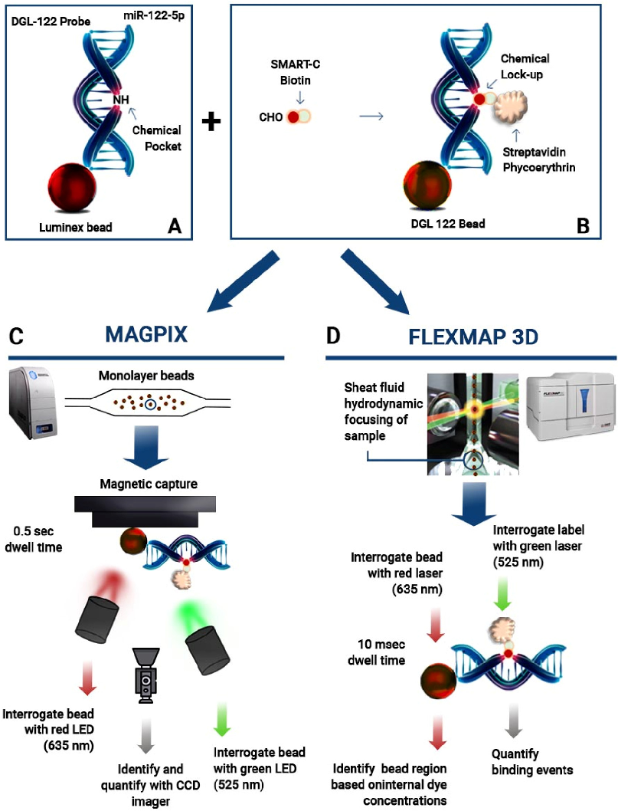
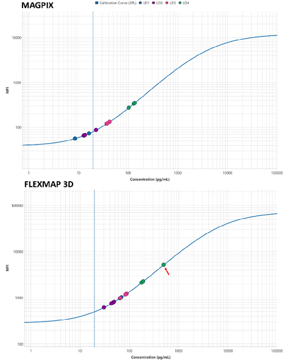
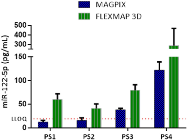
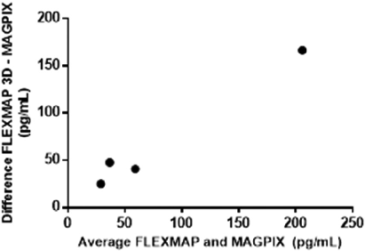

Published on 03 October 2023. Downloaded by Universidad de Granada on 3/3/2024 7:25:56 PM.

# Analyst

|PAPER View Article OnlineView Journal| View Issue|
|---|

Cite this: Analyst, 2023, 148, 5658

## MAGPIX and FLEXMAP 3D Luminex platforms for direct detection of miR-122-5p through dynamic chemical labelling†

Antonio Marín-Romero, a Valerie Regele,b Dajana Kolanovic,b Manuela Hofner,b Juan José Díaz-Mochón, c,d,e,f Christa Nöhammerb and Salvatore Pernagallo *a

Received 21st July 2023, Accepted 3rd October 2023

DOI: 10.1039/d3an01250f rsc.li/analyst

MicroRNAs (miRs) have emerged as promising biomarkers for diagnosing and predicting the prognosis of liver injury. This study aimed to compare the performance of two Luminex platforms, MAGPIX and FLEXMAP 3D, utilizing the innovative Dynamic Chemical Labelling (DCL) technology for direct detection and analysis of miR-122-5p in serum samples from patients with liver injury. Serum samples were collected from four patients with liver injury and four healthy controls. The levels of miR-122-5p were measured using the DCL method on both MAGPIX and FLEXMAP 3D platforms. The performance evaluation included the limit of detection (LOD), intra-assay and inter-assay precision, as well as accuracy. The results demonstrated that both platforms exhibited high sensitivity and specificity in detecting miR-1225p in serum samples from patients with liver injury. However, FLEXMAP 3D indicated a lower LOD compared to MAGPIX. The precision of miR-122-5p detection was similar between the two platforms. In conclusion, both MAGPIX and FLEXMAP 3D Luminex platforms, in conjunction with DCL reagents, proved to be reliable and sensitive tools for detecting miR-122-5p in serum samples from patients with liver injury. Although both platforms were effective, FLEXMAP 3D exhibited slightly better performance, suggesting its preference for miR detection in clinical settings. These findings offer valuable insights for selecting the appropriate Luminex platform for miR detection in patients with liver injury and beyond.

### Introduction

Despite extensive research, Drug-Induced Liver Injury (DILI) remains a significant concern in clinical medicine and drug development.1–3 It represents a major challenge due to its potential to cause significant morbidity, mortality, and economic burden. DILI has attracted considerable attention due to its unpredictable nature and potential for severe adverse out-

aDESTINA Genomica S.L. Parque Tecnológico Ciencias de la Salud (PTS), Edificio BIC, Avenida de la Innovación 1, Granada 18016, Spain. E-mail: salvatore@destinagenomics.com bAustrian Institute of Technology GmbH, Center for Health and Bioresources, Competence Unit Molecular Diagnostics, Vienna, Austria cDepartment of Medicinal & Organic Chemistry, Faculty of Pharmacy, University of Granada, Campus de Cartuja s/n, Granada, Spain dGENYO Centre for Genomics and Oncological Research, Pfizer/University of Granada/Andalusian Regional Government., PTS Granada - Avenida de la Ilustración, 114, 18016, Granada, Spain eUnit of Excellence in Chemistry Applied to Biomedicine and the Environment of the University of Granada, Granada, Spain fInstituto de Investigación Biosanitaria ibs.GRANADA, Granada, Spain

†Electronic supplementary information (ESI) available. See DOI: https://doi.org/ 10.1039/d3an01250f

comes. DILI encompasses a heterogeneous spectrum of liver injury caused by exposure to drugs or xenobiotics.4 Despite advancements in understanding the mechanisms underlying DILI, its diagnosis and management remain complex tasks for clinicians. Traditional diagnostic methods for DILI are primarily centred on the clinical judgment of clinicians, relying on patient history, laboratory data with Liver Function Tests (LFTs), and the exclusion of other possible causes of liver disease.5–7 Liver biopsy may be useful in certain cases where the diagnosis is unclear or to differentiate DILI from other forms of liver disease. However, liver biopsies are invasive procedures associated with potential risks and limited patient acceptance.8

These diagnostic methods, while useful, have their limitations and uncertainties, which highlight the need for improved diagnostic biomarkers and strategies to enhance the early detection, diagnosis, and monitoring of DILI.

MicroRNAs (miRs) are small non-coding RNA molecules that have emerged as promising candidates as circulating biomarkers.9–13 They play critical roles in various physiological and pathological processes, including DILI.14–17 Among the miRs implicated in DILI, miR-122-5p has garnered significant attention.18 miR-122-5p is abundantly expressed in hepatocytes

Published on 03 October 2023. Downloaded by Universidad de Granada on 3/3/2024 7:25:56 PM.

and represents approximately 70% of the total miRs in the liver.19 It is involved in key hepatic functions, including lipid metabolism, viral infection response, and modulation of drug metabolism pathways. Importantly, several groups have demonstrated the utility of miR-122-5p as a sensitive and specific biomarker for liver injury, including DILI.20–22 The unique characteristics of miR-122-5p make it an attractive candidate for improving the diagnosis and monitoring of DILI.23 Its stability in various biological fluids, including serum and plasma, and its high specificity to hepatocytes, contribute to its potential as a non-invasive biomarker. Furthermore, miR-122-5p exhibits early elevations in circulation upon liver injury, allowing for prompt detection and intervention.23

During the last years, our group demonstrated the advantages of detecting miR-122-5p by merging the Luminex xMAP technology with the Dynamic Chemical Labelling (DCL) technology.24–27

Luminex xMAP technology is known to be a powerful and versatile platform for the multiplexed detection of various biomarkers within biological fluids.28–30 The core of the Luminex technology lies in utilising Luminex microspheres, which are micro-beads made of a paramagnetic material. These microspheres are dyed with a combination of two or three fluorochromes, resulting in a vast array of up to 500 distinct coloured beads.31 Each bead can be conjugated with specific capture molecules to capture and detect specific analytes of interest. One of the advantages of Luminex technology is its remarkable multiplexing capability, which allows for the simultaneous detection of multiple analytes in a single reaction. The number of analytes that can be detected depends on the specific Luminex platform employed. For instance, MAGPIX, a compact and user-friendly instrument, utilises light-emitting diodes (LEDs) for detection and can discriminate up to 50 analytes. On the other hand, the more advanced FLEXMAP system combines flow cytometer technology with lasers to detect up to 500 analytes, offering exceptional multiplexing capacity. The high level of multiplexing provided by Luminex technology offers researchers tremendous advantages in biomarker discovery and validation. It enables the simultaneous examination of multiple analytes in a single assay, significantly saving time, resources, and precious sample volumes. Additionally, the multiplexing capability reduces the need for conducting separate individual assays, streamlining experimental workflows, and increasing cost-effectiveness. Luminex technology has demonstrated remarkable reliability and sensitivity, besides its exceptional multiplexing capacity.30

While Luminex technology has transformed protein biomarker detection and quantification of circulating proteins,32–34 it is essential to admit that conventional Luminex assays for short RNAs in general and in particular miR analysis have certain limitations.35 These include the requirement for pre-extraction and pre-amplification to achieve detectable signals, which can introduce potential biases and affect quantification accuracy. Furthermore, challenges related to low specificity and the possibility of crossreactivity with closely related miR sequences, such as trun-

cated and isomiRs, have been observed since they are basically based on hybridisation and stringency methods.36 Nevertheless, improvements in assay design, probe selection, and optimisation strategies have significantly enhanced the performance and reliability of Luminex-based miR detection methods. Ongoing research and development efforts continue to address these limitations and improve the sensitivity, specificity, and robustness of miR analysis using Luminex technology.

To address these needs, our team has devoted substantial effort to integrate our unique DCL technology with the Luminex MAGPIX system over the years.24–27 DCL technology enables the direct detection of miRs, eliminating the requirement for pre-extraction and pre-amplification while maintaining specificity and sensitivity.37,38 DCL leverages a merge of biotinylated aldehyde-modified nucleobases, referred to as SMART-C Biotin and modified peptide nucleic acid (PNA) capture probes synthesised with an abasic position, known as DGL-Probes. For the testing of miR-122-5p, the DGL-122 Probe on the Luminex bead, which forms the DGL 122 bead, captures the complementary miR-122-5p sequence, creating the chemical pocket (Fig. 1A). Once the target miR-122-5p fully hybridises, the biotinylated SMART-C Biotin becomes integrated and covalently bonded to the backbone of the DGL-Probe, resulting in the chemical lock-up (Fig. 1B). The duplex is subsequently detected using the streptavidin phycoerythrin reporter molecule, which specifically recognises the biotin tag (Fig. 1B). The final readout of the DCL reaction is obtained through the utilisation of Luminex platforms (Fig. 1C and D). This facilitates the efficient examination of complementary miR-122-5p by applying dynamic chemistry reactions.

One of the standout features of DCL technology is its unique specificity. Compared to other enzymatic approaches for analysing miRs, DCL offers an exceptional capability to distinguish between miR sequences at the single-base level. The superior specificity was extensively demonstrated in a 2016 study conducted by our research group.24 The study aimed to showcase the method’s specificity on the Luminex MAGPIX platform. We examined three distinct sequences: a fully complementary target sequence (miR-122-5p), a non-complementary sequence (miR-21-5p), and a target containing a single nucleotide mismatch (miR-122-5p-A). The results demonstrated that only miR-122-5p was detectable when the DGL 122 bead was used. Neither miR-21-5p nor miR-122-5p-A were detected due to their lack of complementarity (miR-21-5p) or the presence of an ‘A’ instead of a ‘G’ within miR-122-5p.24 The high specificity of the DCL technology has been demonstrated on other read-out platforms, such as the Simoa bead-based platform from Quanterix.39 In this context, the specificity of DCL technology in probing miR-122-5p compared to other miR-122 isomiRs was rigorously examined. The study confirmed 100% specificity in measuring miR-122-5p against other isomiRs.36 Additionally, the DCL specificity in interrogating miR-21-5p was studied by our group in a new chemiluminescence platform (ODG platform), including the use of SMART-nucleo-

Published on 03 October 2023. Downloaded by Universidad de Granada on 3/3/2024 7:25:56 PM.

Fig. 1 Analysis of miR-122-5p by dynamic chemical labelling with Luminex MAGPIX and FLEXMAP 3D. (A) DGL 122 bead hybridisation with complementary miR-122-5p target; (B) dynamic chemistry reaction with SMART-C Biotin incorporation and labelling with SA-PE; (C) DGL 122 bead readout with MAGPIX by measuring values of MFI with LEDs; (D) DGL 122 bead read-out with FLEXMAP 3D via flow cytometer technology with lasers.

bases that do not template the nucleotide in front of the abasic position.37

In this study, we employed DCL reagents to implement the miR-122-5p assay on FLEXMAP 3D, another Luminex platform (Fig. 1D). Additionally, we conducted an exhaustive comparative study using both the MAGPIX and the

FLEXMAP 3D Luminex platforms to detect miR-122-5p in serum samples. This comparison provided valuable insights into the capabilities of these platforms for miR-122-5p biomarker detection in patients suffering from liver injury. Moreover, this study demonstrates the availability of the miR-122-5p test on this alternative platform, expanding the

Published on 03 October 2023. Downloaded by Universidad de Granada on 3/3/2024 7:25:56 PM.

applicability range of the assay across all Luminex xMAP technology systems.

### Materials and methods

Apparatus

Luminex MAGPIX and FLEXMAP 3D were used to analyse the corresponding assays by detecting fluorescent signals (Median of Fluorescence Intensity – MFI). Platforms were associated with a dedicated software xPONENT. A 96-well plate shaker was used to perform incubations (VWR® Microplate Shaker). The Luminex MAGPIX was installed at DESTINA Genomica S.L. facilities (Granada, Spain) while the FLEXMAP 3D was installed at the AIT Austrian Institute of Technology (Vienna, Austria).

Materials and reagents

Carboxylated MagPlex® beads (Luminex beads) were purchased from Luminex Corporation (1.25 × 107 mL−1). Luminex beads were functionalised with DGL-Probe 122 (provided by DESTINA Genomica S.L.) to obtain the DGL 122 beads. Functionalisation was carried out as described elsewhere.25 Aldehyde-modified biotinylated cytosine nucleobase, called SMART-C Biotin (Table S1 and Fig. S1†) as well as wash and Stabiltech buffer were provided by DESTINA Genomica S.L. Sodium cyanoborohydride was purchased from Sigma (cat. number #156159). Assay buffer and bead diluent were purchased from Merck (cat. numbers are respectively: #LE-ABGLP and #LHE-BD). Chemicals for bead functionalization were purchased from Sigma-Aldrich. Synthetic mimic miR-122-5p DNA oligomers were purchased from Integrated DNA Technologies (Table S1†). DNA oligomer solution concentration was determined using a Thermo Fisher NanoDrop 1000 Spectrophotometer. Streptavidin-R-Phycoerythrin (SA-PE) was purchased from Moss Biotech (SA-PE-001 16P) at the concentration of 1 mg mL−1.

Clinical samples

Serum samples were provided by DESTINA Genomica S.L. through the University of Edinburgh. Samples were collected from patients and healthy volunteers. Full informed consent was obtained from the participants and ethical approval was given by the Southeast Scotland Research Ethics Committee and the East of Scotland Research Ethics Committee via the Southeast Scotland Human Bioresource. Samples were collected and prepared as described elsewhere.25

Assay sensitivity study

Four calibration curves were constructed, consisting of 9 calibration points each, across two sites (DESTINA and AIT) in two separate experiments (Experiment 1 and Experiment 2). Experiment 1 evaluated the sensitivity, intra- and inter-assay precision, and accuracy of the two assays using spike-in samples, as described below. On the other hand, Experiment 2 not only examined sensitivity, intra- and inter-assay precision,

and accuracy but also included an inter-platform comparison by analysing clinical samples. The following protocol generated the calibration curve associated with DGL 122 beads. In a 96-well plate format, 75 µL of Stabiltech buffer containing 1250 DGL 122 beads was pipetted into wells, followed by the addition of 25 µL of serum matrix with 9 concentrations of complementary synthetic DNA oligomer mimicking miR-1225p (1.22 to 80 000 pg mL−1) and 1 blank (serum non-spikedin). The 96-well plate was incubated for 2 h at 30 °C using a microplate shaker with shaking at 800 rpm. After the incubation, DGL 122 beads were washed 3 times with the wash buffer. DGL 122 beads were resuspended in 50 μL of assay buffer containing 5 μM SMART-C Biotin and 1 mM sodium cyanoborohydride and incubated for 1 h at 40 °C under 800 rpm shaking. DGL 122 beads were washed 3 times with the wash buffer and incubated with 50 μL of 2 µg mL−1 SA-PE for 30 min at 30 °C with shaking at 800 rpm. DGL 122 beads were washed 3 times with the wash buffer and, finally, resuspended in a volume of 120 μL of wash buffer to be analysed on both Luminex MAGPIX and FLEXMAP 3D systems, to determine MFI values (injection volume of 100 μL). Experiments were performed in triplicates.

Calculation of sensitivity

Limit of Detection (LOD) and Lower Limit of Quantification (LLOQ) were calculated by the Belysa® software. In the case of the LOD, the following formula was used:

LOD ¼ L   ðμðblank responseÞ þ C σðblank responseÞÞ

where L is the inverse of the function defined by the least squares regression line that best fits the first three standard points (starting from the blank), µ refers to the average and C is a user-configurable coefficient (it was set at 2.5 for this study). The term containing the blank response’s standard deviation (σ) is added to the mean.

The LLOQ is defined as the standard with the lowest concentration satisfying three conditions:

- (a) The CV of back-calculated analyte concentration is less

than or equal to 25%.

- (b) The recovery rate of back-calculated analyte concen-

tration is in [75, 125]%.

- (c) All the standards above the LLOQ that also satisfy con-

ditions (a) and (b). Intra- and inter-assay precision

The intra-assay precision for both platforms was determined by calculating the mean % CV from triplicate runs of each standard point above the LLOQ concentration point. This analysis was performed in two independent experiments. Acceptable precision was defined as an intra-CV% lower than 15% as the Food and Drug Administration (FDA) recommended.

The inter-assay precision was determined by calculating the mean % CV from triplicate runs of each standard point above the LLOQ concentration point, across two independent experiments. Therefore, this calculation involved considering a total

Published on 03 October 2023. Downloaded by Universidad de Granada on 3/3/2024 7:25:56 PM.

of six replicates, with three replicates from each experiment. Acceptable precision was defined as an inter-CV% lower than 25% as recommended by the FDA.

Accuracy

The accuracy was evaluated on the MAGPIX and FLEXMAP 3D platforms by analysing the calibration points above the LLOQ concentration point. To determine accuracy, the back-calculated concentrations of each calibration point were divided by the known spiked amounts and then multiplied by 100 to obtain the % spike recovery (% recovery). For each platform, the accuracy was determined by calculating the mean % recovery from triplicate runs of each standard point above the LLOQ concentration point. Accuracy rates within the 75% to 125% range were considered acceptable as the FDA recommended.

Assay with clinical samples

The following protocol interrogated four patient samples (PS1–4) and four healthy volunteers (HV1–4). In a 96-well plate format, 75 µL of Stabiltech buffer containing 1250 DGL 122 beads was pipetted into wells, followed by the addition of 25 µL of clinical sample and healthy volunteer for 2 hours. The Stabiltech buffer allows the liberation of the target miR-122-5p to be captured by the DGL 122 beads. Once the hybridisation of the target miR-122-5p is complete, the biotinylated SMART-Base becomes covalently attached to the backbone of the DGL-Probe 122, forming the chemical lock-up and biotinylating the duplex. The resulting duplex is labelled with Streptavidin-Phycoerythrin (SA-PE) and is detected using both the MAGPIX and FLEXMAP 3D systems. Further assay details are reported in the ‘Assay sensitivity study’ section.

Inter-platform comparisons

Serum samples from four patients with liver injury were assessed using the MAGPIX and FLEXMAP 3D platforms. The concentration of the liver-specific miR-122-5p was determined by extrapolating the values from the curves generated by each platform. To compare the results obtained from both platforms, a Bland–Attman plot was created (Fig. 4). This plot allows for the evaluation of the agreement between the two methods by analysing the mean difference and the limits of agreement between the measurements.

### Results and discussion

DGL-Probe 122 was successfully functionalised onto Luminex beads to directly detect miR-122-5p using both Luminex platforms (Fig. 1). This study represents the first implementation of DCL on the FLEXMAP 3D platform, showcasing its versatility. The introduction of these innovative reagents facilitated a comparative analysis of the performance of the two platforms in detecting the miR-122-5p biomarker in patient samples.

Key parameters, including the LOD, LLOQ, intra-assay and inter-assay precision, and accuracy, were assessed using standard spike-in within the serum matrix (Table 1). Moreover,

Table 1 Assay characteristics on the platforms

Experiment 1 Experiment 2

FLEXMAP 3D MAGPIX

FLEXMAP 3D

MAGPIX

LOD (pg mL−1) 10.22 0.10 0.65 2.94 LLOQ (pg mL−1) 19.53 19.53 19.53 19.53 Intra-assay precision (%)

6.47 2.90 6.96 8.59

Inter-assay precision (%)

5.88 (MAGPIX); 9.35 (FLEXMAP 3D) Assay accuracy (%) 100.39 99.16 98.29 99.10

this comprehensive comparison offered valuable insights into the capabilities of these platforms in identifying miR-122-5p in clinical samples from individuals with liver injury, enabling effective differentiation from control samples.

Merging of DCL with the FLEXMAP 3D platform

The DCL reagents, which had previously been effectively utilised on the MAGPIX platform, were seamlessly adapted for use with the FLEXMAP 3D without any modifications to their composition. This successful integration facilitated the first application of the DCL on the FLEXMAP 3D platform, enabling a performance comparison with existing assays. By maintaining consistency in the reagent composition, merging the DCL with the FLEXMAP 3D platform ensured accurate and reliable measurements. We fine-tuned the assay conditions for miR-122-5p detection on both platforms and evaluated their performance based on key parameters: LOD, LLOQ, intra- and inter-assay precision, and accuracy. This development provides a valuable tool for detecting and quantifying miR-122-5p biomarker on both platforms in clinical samples of patients with liver injury, as described below.

Assessment of sensitivity

The sensitivity of both platforms was evaluated by calculating the LOD and LLOQ using the formula described in the Materials and Methods section under “Sensitivity.” Four calibration curves were generated using the 9 calibration points in two independent experiments. The two curves for Experiment

- 1 are reported in ESI (Fig. S2†). The two curves for Experiment
- 2 are reported in Fig. 2. The LOD and LLOQ values for the MAGPIX and FLEXMAP 3D platforms across the two independent experiments are presented in Table 1.

Intra-assay precision

Intra-assay precision was studied to determine the consistency and reproducibility of results obtained within the miR-122-5p assay within each experiment. It measures the variation between multiple measurements of the same calibration point under identical conditions. In other words, it assesses the degree of agreement or closeness of values obtained from repeated measurements within the same miR-122-5p assay with Luminex MAGPIX and FLEXMAP 3D. Intra-assay precision was expressed as the coefficient of variation (% CV), which cal-

Published on 03 October 2023. Downloaded by Universidad de Granada on 3/3/2024 7:25:56 PM.

Fig. 2 Calibration curves. Calibration curves were constructed by utilising a 5PL non-linear regression model, where MFI average values were plotted against the concentration of synthetic miRNA-122-5p. The curve generated using the MAGPIX platform for Experiment 2 is depicted above, while the curve generated using the FLEXMAP 3D platform for Experiment 2 is displayed below. To signify the LLOQ, a vertical line is indicated on each curve. Each measurement was conducted in triplicate; PS: patient sample; the red arrow indicates the outlier.

culates the relative variation as a percentage of the mean. A lower % CV indicates higher precision and less variability in the measurements, indicating a more reliable and accurate assay.

Within Experiment 1, the intra-assay % CV values were calculated to be 6.47% for the MAGPIX system and 6.96% for the FLEXMAP 3D system as calculated in the “Materials and Methods section. These values indicate a relatively low variability within the replicates tested on each system. Within Experiment 2, the intra-assay % CV values were determined to be 2.90% for the MAGPIX system and 8.59% for the FLEXMAP 3D system. Although there is a slightly higher variability observed in the FLEXMAP 3D system during Experiment 2, all the calculated % CV values for both systems fall within the acceptance criteria for a typical Luminex commercially available assay typically lower than 25%, such as the MILLIPLEX MAP Human Liver Injury Magnetic Bead Panel – Toxicity Multiplex Assay. This suggests that the precision of the assay is maintained consistently across different experiments and that both systems can reliably measure the target analyte miR-122-5p.

Inter-assay precision

Inter-assay precision was studied to measure the variation between measurements of the same calibration point in the two experiments under the same conditions. Inter-assay precision assessed the miR-122-5p assay’s ability to produce consistent and comparable results across the two different experiments. It is an important parameter to evaluate the reliability and robustness of an assay. Similar to the intra-assay precision, inter-assay precision was expressed as the % CV, which calculates the relative variation as a percentage of the mean.

The experiments with MAGPIX and FLEXMAP 3D systems were assessed separately to evaluate the inter-assay precision. The inter-assay % CV values for the MAGPIX system were calculated to be 5.88%. Similarly, the FLEXMAP 3D system yielded inter-assay % CV values of 9.35%. The relatively low % CV values demonstrate that the MAGPIX and FLEXMAP 3D systems maintain precision and reproducibility over repeated measurements, ensuring reliable quantification of the target miR-122-5p. These results highlight the robustness of the MAGPIX and FLEXMAP 3D systems in providing consistent inter-assay precision, meeting the necessary requirements for accurate and reliable quantification of the target miR-122-5p.

Assay accuracy

We added nine known amounts of miR-122-5p spike-in to the serum matrix as calibration points to determine the accuracy. The miR-122-5p assay was then conducted on these spiked samples, and the concentration of miR-122-5p was calculated. The % recovery for each calibration point was calculated by dividing the back-calculated concentration by the known concentration (spike amount) and multiplying by 100. Accuracy was calculated as indicated in Materials and Methods.

An accuracy close to 100% indicates that the assay accurately detects and quantifies the analyte (miR-122-5p). Deviations from 100% accuracy, whether lower or higher, may suggest potential limitations or inefficiencies in the assay. Therefore, accuracy is an important parameter for evaluating the performance and reliability of assay development.

The obtained accuracy percentages for the MAGPIX and FLEXMAP 3D platforms are presented in Table 1. These accuracy percentages meet the criteria of 75–125% accuracy, demonstrating the robust performance of the assay on both platforms.

miR-122-5p profile in clinical samples

Both the MAGPIX and FLEXMAP 3D platforms were used to assess the expression profiling of miR-122-5p. In the study, four serum samples from liver disease patients (PS1–4) and four serum samples from healthy controls (HV1–4) were tested, as illustrated in Fig. 3. To provide a quantitative analysis, it was necessary to quantify the data using the calibration curves of Experiment 2, provided above in Fig. 2.

The results showed a trend in which FLEXMAP 3D was more sensitive than the MAGPIX platform, reporting higher miR-122-5p concentrations (Fig. 3). Healthy controls are not

Published on 03 October 2023. Downloaded by Universidad de Granada on 3/3/2024 7:25:56 PM.

- Fig. 3 miR-122-5p quantification with MAGPIX and FLEXMAP 3D platforms. On the x axis is shown the ID for the samples, whereas the y-axis reports the miR-122-5p concentration in pg mL−1. PS means patient sample; blue columns refer to MAGPIX; green columns refer to FLEXMAP 3D.

- Fig. 4 Bland–Altman plot illustrating the disparities in miR-122-5p quantification between MAGPIX and FLEXMAP 3D platforms. The y-axis displays the mean differences between FLEXMAP 3D and MAGPIX, while the x-axis represents the average pg mL−1 measurement obtained from both platforms.

shown because they were not detected. However, it is important to note that as the miR concentration increases, the FLEXMAP 3D platform exhibits a higher error level than MAGPIX (Fig. 3, PS4). This shows the need to expand the study by including a larger set of clinical samples and encompassing a wider concentration range to determine the effective measurement range for both instruments. Furthermore, it is worth mentioning that an outlier was observed within the triplicate for PS4, and we decided to include it in the representation of Fig. 2 (indicated within a red arrow). In this regard, we anticipate that we are currently engaged in a comprehensive comparative study involve 50 clinical samples within the framework of the E! 114589 – LiverAce EU project.

Inter-platform comparison

To evaluate the agreement between the two platforms in measuring miR-122-5p concentrations in serum samples, a Bland–Altman plot was generated (Fig. 4). The plot revealed a

consistent trend where the MAGPIX platform consistently reported lower concentrations of miR-122-5p compared to the concentrations measured by the FLEXMAP 3D platform. This difference is visually depicted in Fig. 3, demonstrating the variations in miR-122-5p levels between the two platforms.

The observed disparity emphasises the importance of careful consideration and potential calibration adjustments when comparing miR-122-5p concentrations obtained from different Luminex platforms. To gain a comprehensive understanding of the underlying factors contributing to this discrepancy and establish a standardised approach for accurate miR-122-5p quantification across platforms, further investigations and comparative studies may be necessary.

### Conclusions

This study represents significant progress in the field of miR-122-5p analysis by leveraging the powerful combination of DCL technology and the FLEXMAP 3D platform for investigating liver injury. Importantly, this is the first successful application of DCL technology on a Luminex platform other than MAGPIX for detecting and profiling miR-122-5p. The findings of this study demonstrate the robustness and reliability of DCL technology, also in conjunction with the FLEXMAP 3D system, for accurately interrogating the expression levels of miR-122-5p in serum samples from patients with liver injury.

Through successfully conjugating DGL-Probe 122 onto Luminex microspheres, we achieved direct detection and precise quantification of miR-122-5p in a streamlined and efficient manner using both the MAGPIX and FLEXMAP 3D platforms. Our results reveal that both platforms when utilising DCL technology, exhibit comparable sensitivities and reliable quantification of miR-122-5p. The intra-assay precision and recoveries of quality controls met the acceptable range for both systems, ensuring consistent and reproducible results (Table 1).

Importantly, the combination of DCL technology with the FLEXMAP 3D system demonstrated a higher quantification of miR-122-5p compared to the MAGPIX system. This improvement in sensitivity enables better discrimination between liver-diseased and non-diseased samples, emphasising the clinical relevance and diagnostic potential of miR-122-5p as a biomarker for liver disease.

The successful validation of DCL technology on the FLEXMAP 3D platform opens up exciting possibilities for future research and clinical applications focused on miR-1225p testing. It further emphasises the value of combining DCL technology and Luminex platforms to interrogate miR-122-5p in samples from patients with liver injury effectively. Additionally, our study highlights the potential to use DCL technology interchangeably across the entire group of Luminex platforms without complications or modifications. Furthermore, the study demonstrated that operators at different locations, using different Luminex platforms,

Published on 03 October 2023. Downloaded by Universidad de Granada on 3/3/2024 7:25:56 PM.

obtained comparable results using the same reagents initially developed solely for the MAGPIX platform.

In summary, the study demonstrates the versatility of DCL technology across all Luminex platforms without complications or modifications, emphasising its flexibility. Furthermore, it underscores the significant potential of this method for miR-122-5p analysis. This innovative approach holds promise for advancing our understanding of liver disease and promoting precision diagnostics in hepatology and other fields.

### Author contributions

S. P., J. J. D. M., C. N., M. H. and A. M.-R. contributed to the design of the experiments of this work. A. M.-R., V. R. and D. K. performed the experiments. S. P. and A. M.-R. wrote the manuscript.

### Conflicts of interest

JJDM is a shareholder and Director of DESTINA Genomics Ltd. SP is a shareholder and Operations Director of DESTINA Genomics Ltd.

### Acknowledgements

This study is co-founded by EUREKA member countries (CDTI and FFG, respectively in Spain and Austria) and the European Union Horizon 2020 Framework Programme. The project code is: E! 114589 - LiverAce. Additionally, the authors thank you to Prof. James Dear for his invaluable scientific guidance on the miR-122 biomarker.

### Notes and references

- 1 H. Devarbhavi, An Update on Drug-induced Liver Injury, J. Clin. Exp. Hepatol., 2012, 2(3), 247–259.
- 2 K. T. Suk and D. J. Kim, Drug-induced liver injury: present and future, Clin. Mol. Hepatol., 2012, 18(3), 249–257.
- 3 K. Tajiri and Y. Shimizu, Practical guidelines for diagnosis and early management of drug-induced liver injury, World J. Gastroenterol., 2008, 14(44), 6774–6785.
- 4 N. Chalasani, R. J. Fontana, H. L. Bonkovsky, P. B. Watkins, T. Davern, J. Serrano, et al., Causes, clinical features, and outcomes from a prospective study of drug-induced liver injury in the United States, Gastroenterology, 2008, 135(6), 1924–1934, 34.e1–4.
- 5 J. S. Au, V. J. Navarro and S. Rossi, Review article: Druginduced liver injury – its pathophysiology and evolving diagnostic tools, Aliment. Pharmacol. Ther., 2011, 34(1), 11– 20.
- 6 M. I. Danjuma, J. Sajid, H. Fatima and A. N. Elzouki, Novel biomarkers for potential risk stratification of drug induced

- liver injury (DILI): A narrative perspective on current trends, Medicine, 2019, 98(50), e18322.
- 7 A. Hassan and R. J. Fontana, The diagnosis and management of idiosyncratic drug-induced liver injury, Liver Int., 2019, 39(1), 31–41.
- 8 J. Neuberger, J. Patel, H. Caldwell, S. Davies, V. Hebditch, C. Hollywood, et al., Guidelines on the use of liver biopsy in clinical practice from the British Society of Gastroenterology, the Royal College of Radiologists and the Royal College of Pathology, Gut, 2020, 69(8), 1382–1403.
- 9 F. Precazzini, S. Detassis, A. S. Imperatori, M. A. Denti and P. Campomenosi, Measurements Methods for the Development of MicroRNA-Based Tests for Cancer Diagnosis, Int. J. Mol. Sci., 2021, 22(3), 1176.
- 10 D. Han, L. Li, X. Ge, D. Li and X. Zhang, MicroRNA expression integrated analysis and identification of novel biomarkers in small cell lung cancer: a meta-analysis, Transl. Cancer Res., 2020, 9(5), 3339–3353.
- 11 A. Izzotti, S. Carozzo, A. Pulliero, D. Zhabayeva, J. L. Ravetti and R. Bersimbaev, Extracellular MicroRNA in liquid biopsy: applicability in cancer diagnosis and prevention, Am. J. Cancer Res., 2016, 6(7), 1461–1493.
- 12 K. W. Witwer, Circulating microRNA biomarker studies: pitfalls and potential solutions, Clin. Chem., 2015, 61(1), 56– 63.
- 13 J. Wang, S. K. Huang, M. Zhao, M. Yang, J. L. Zhong, Y. Y. Gu, et al., Identification of a circulating microRNA signature for colorectal cancer detection, PLoS One, 2014, 9(4), e87451.
- 14 A. L. Schofield, J. P. Brown, J. Brown, A. Wilczynska, C. Bell, W. E. Glaab, et al., Systems analysis of miRNA biomarkers to inform drug safety, Arch. Toxicol., 2021, 95(11), 3475– 3495.
- 15 G. A. Kullak-Ublick, R. J. Andrade, M. Merz, P. End, A. Benesic, A. L. Gerbes, et al., Drug-induced liver injury: recent advances in diagnosis and risk assessment, Gut, 2017, 66(6), 1154–1164.
- 16 A. D. B. Vliegenthart, C. Berends, C. M. J. Potter, M. Kersaudy-Kerhoas and J. W. Dear, MicroRNA-122 can be measured in capillary blood which facilitates point-of-care testing for drug-induced liver injury, Br. J. Clin. Pharmacol., 2017, 83(9), 2027–2033.
- 17 P. Thulin, G. Nordahl, M. Gry, G. Yimer, E. Aklillu, E. Makonnen, et al., Keratin-18 and microRNA-122 complement alanine aminotransferase as novel safety biomarkers for drug-induced liver injury in two human cohorts, Liver Int., 2014, 34(3), 367–378.
- 18 L. S. Howell, L. Ireland, B. K. Park and C. E. Goldring, MiR-122 and other microRNAs as potential circulating biomarkers of drug-induced liver injury, Expert Rev. Mol. Diagn., 2018, 18(1), 47–54.
- 19 C. Jopling, Liver-specific microRNA-122: Biogenesis and function, RNA Biol., 2012, 9(2), 137–142.
- 20 S. Fu, D. Wu, W. Jiang, J. Li, J. Long, C. Jia, et al., Molecular Biomarkers in Drug-Induced Liver Injury: Challenges and Future Perspectives, Front. Pharmacol., 2019, 10, 1667.

Published on 03 October 2023. Downloaded by Universidad de Granada on 3/3/2024 7:25:56 PM.

- 21 D. J. Antoine and J. W. Dear, Transformative biomarkers for drug-induced liver injury: are we there yet?, Biomarkers Med., 2017, 11(2), 103–106.
- 22 M. Robles-Díaz, I. Medina-Caliz, C. Stephens, R. J. Andrade and M. I. Lucena, Biomarkers in DILI: One More Step Forward, Front. Pharmacol., 2016, 7, 267.
- 23 J. W. Dear, J. I. Clarke, B. Francis, L. Allen, J. Wraight, J. Shen, et al., Risk stratification after paracetamol overdose using mechanistic biomarkers: results from two prospective cohort studies, Lancet Gastroenterol. Hepatol., 2018, 3(2), 104–113.
- 24 S. Venkateswaran, M. A. Luque-González, M. TabraueChávez, M. A. Fara, B. López-Longarela, V. Cano-Cortes, et al., Novel bead-based platform for direct detection of unlabelled nucleic acids through Single Nucleobase Labelling, Talanta, 2016, 161, 489–496.
- 25 A. Marín-Romero, M. Tabraue-Chávez, J. W. Dear, J. J. DíazMochón and S. Pernagallo, Open a new window in the world of circulating microRNAs by merging ChemiRNA Tech with a Luminex platform, Sens. Diagn., 2022, 1(6), 1243–1251.
- 26 A. Marín-Romero, M. Tabraue-Chávez, B. López-Longarela, M. A. Fara, R. M. Sánchez Martín, J. W. Dear, et al., Simultaneous Detection of Drug-Induced Liver Injury Protein and microRNA Biomarkers Using Dynamic Chemical Labelling on a Luminex MAGPIX System, Analytica, 2021, 2, 130–139.
- 27 A. Marín-Romero, M. Tabraue-Chávez, J. W. Dear, R. M. Sánchez-Martín, H. Ilyne, J. J. Guardia-Monteagudo, et al., Amplification-free profiling of microRNA-122 biomarker in DILI patient serums, using the luminex MAGPIX system, Talanta, 2020, 219, 121265.
- 28 E. O. Hansen, N. S. Dias, I. C. B. Burgos, M. V. Costa, A. T. Carvalho, A. L. Teixeira, et al., Millipore xMap® Luminex (HATMAG-68K): An Accurate and Cost-Effective Method for Evaluating Alzheimer’s Biomarkers in Cerebrospinal Fluid, Front. Psychiatry, 2021, 12, 716686.
- 29 Y. Zhang, X. Li and Y. P. Di, Fast and Efficient Measurement of Clinical and Biological Samples Using Immunoassay-Based Multiplexing Systems, Methods Mol. Biol., 2020, 2102, 129–147.

- 30 F. Chowdhury, A. Williams and P. Johnson, Validation and comparison of two multiplex technologies, Luminex and Mesoscale Discovery, for human cytokine profiling, J. Immunol. Methods, 2009, 340(1), 55–64.
- 31 Y. Zhang, R. Birru and Y. P. Di, Analysis of clinical and biological samples using microsphere-based multiplexing Luminex system, Methods Mol. Biol., 2014, 1105, 43–57.
- 32 A. King, G. King, C. Weiss, S. Dunbar and S. Das, Detection of IgG Antibodies to SARS-CoV-2 and Neutralizing Capabilities Using the Luminex, Methods Mol. Biol., 2022, 2511, 257–271.
- 33 A. Cameron, J. L. Bohrhunter, C. A. Porterfield, R. Mangat, M. H. Karasick, Z. Pearson, et al., Simultaneous Measurement of IgM and IgG Antibodies to SARS-CoV-2 Spike, RBD, and Nucleocapsid Multiplexed in a Single Assay on the xMAP INTELLIFLEX DR-SE Flow Analyzer, Microbiol. Spectrum, 2022, 10(2), e0250721.
- 34 K. G. Mountjoy, ELISA versus LUMINEX assay for measuring mouse metabolic hormones and cytokines: sharing the lessons I have learned, J. Immunoassay Immunochem., 2021, 42(2), 154–173.
- 35 T. Jet, G. Gines, Y. Rondelez and V. Taly, Advances in multiplexed techniques for the detection and quantification of microRNAs, Chem. Soc. Rev., 2021, 50(6), 4141–4161.
- 36 B. López-Longarela, E. E. Morrison, J. D. Tranter, L. Chahman-Vos, J. F. Léonard, J. C. Gautier, et al., Direct Detection of miR-122 in Hepatotoxicity Using Dynamic Chemical Labeling Overcomes Stability and isomiR Challenges, Anal. Chem., 2020, 3388–3395.
- 37 S. Detassis, M. Grasso, M. Tabraue-Chávez, A. MarínRomero, B. López-Longarela, H. Ilyine, et al., New Platform for the Direct Profiling of microRNAs in Biofluids, Anal. Chem., 2019, 91(9), 5874–5880.
- 38 F. R. Bowler, J. J. Diaz-Mochon, M. D. Swift and M. Bradley, DNA analysis by dynamic chemistry, Angew. Chem., Int. Ed., 2010, 49(10), 1809–1812.
- 39 D. M. Rissin, B. López-Longarela, S. Pernagallo, H. Ilyine, A. D. B. Vliegenthart, J. W. Dear, et al., Polymerase-free measurement of microRNA-122 with single base specificity using single molecule arrays: Detection of drug-induced liver injury, PLoS One, 2017, 12(7), e0179669.

