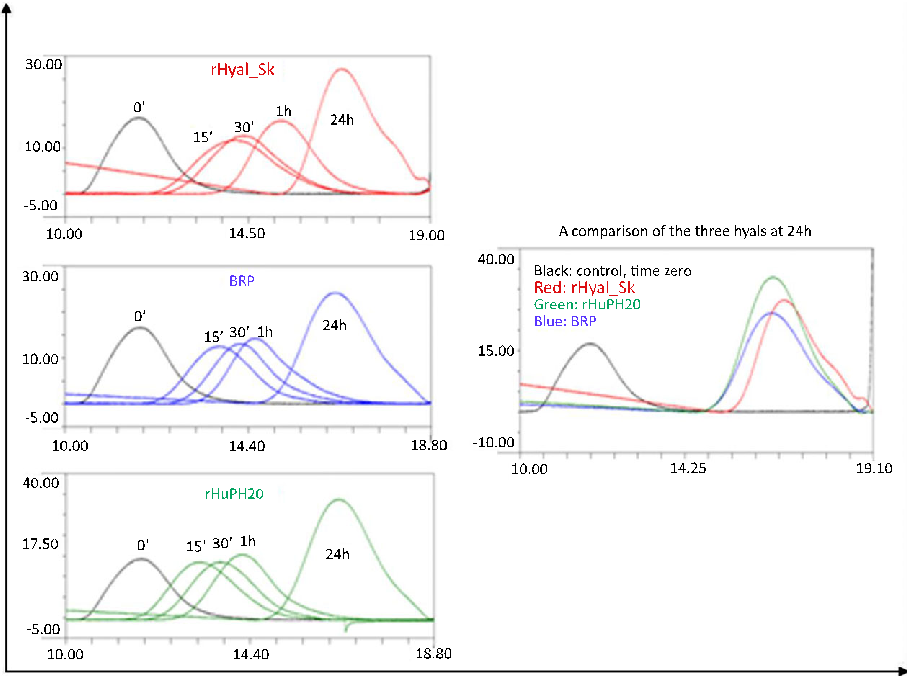
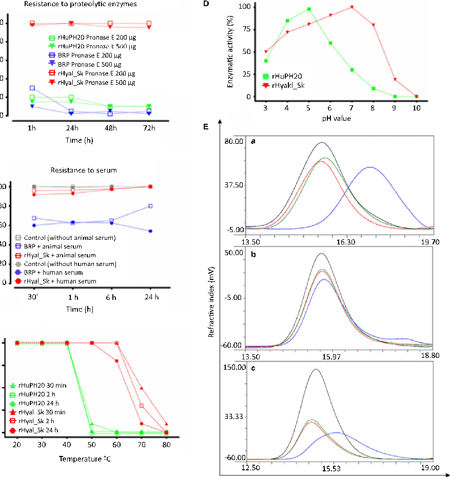
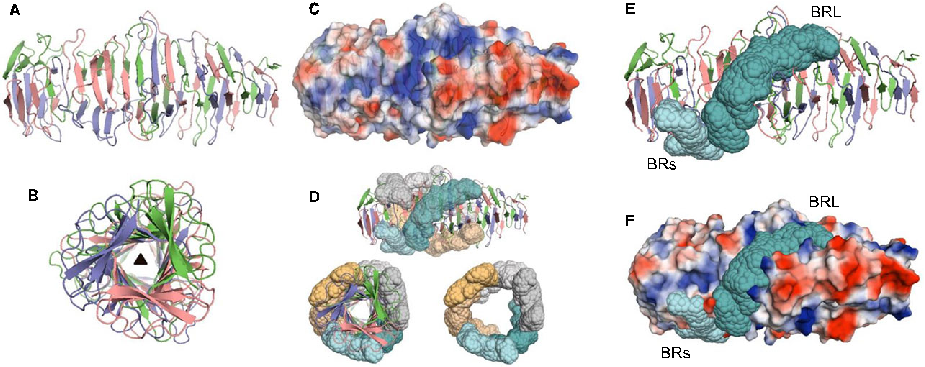

# Identification and characterization of a bacterial hyaluronidase and its production in recombinant form

Luciano Messina1, Jose A. Gavira2, Salvatore Pernagallo3, Juan D. Unciti-Broceta4, Rosario M. Sanchez Martin3,4,5, Juan J. Diaz-Mochon3,5, Susanna Vaccaro1, Mayte Conejero-Muriel2, Estela Pineda-Molina2, Salvatore Caruso1, Luca Musumeci1, Roberta Di Pasquale1, Angela Pontillo6, Francesca Sincinelli6, Mauro Pavan7 and Cynthia Secchieri7

- 1 Local Unit Fidia Research Sud, Fidia Farmaceutici S.p.A., Noto, Italy
- 2 Laboratorio de Estudios Cristalogr aficos, Instituto Andaluz de Ciencias de la Tierra (Consejo Superior de Investigaciones Cient ıficasUniversidad de Granada), Armilla, Spain
- 3 GENYO – Centre for Genomics and Oncological Research: Pfizer/University of Granada/Andalusian Regional Government, PTS Granada, Spain
- 4 NanoGetic S.L., PTS Granada, Armilla, Spain
- 5 Facultad de Farmacia, Universidad de Granada, Spain
- 6 Primm S.r.l, Milano, Italy
- 7 Fidia Farmaceutici S.p.A., Abano Terme, Italy

Correspondence L. Messina, Fidia Farmaceutici S.p.A., Local Unit Fidia Research Sud, Contrada Pizzuta snc, Noto, Siracusa 96017, Italy Fax: +390931812020 Tel: +390931812802 E-mail: lmessina@fidiapharma.it

(Received 4 April 2016, revised 12 June 2016, accepted 13 June 2016, available online 4 July 2016)

doi:10.1002/1873-3468.12258

Edited by Stuart Ferguson

[Correction Note: This article was first published online on 4 July 2016 and was corrected on 19 July 2016. In the original publication the captions of Figures 2B and 2E contained some inaccuracies and have subsequently been corrected.]

Hyaluronidases (Hyals) are broadly used in medical applications to facilitate the dispersion and/or absorption of fluids or medications. This study reports the isolation, cloning, and industrial-scale recombinant production, purification and full characterization, including X-ray structure determination at 1.45 A, of an extracellular Hyal from the nonpathogenic bacterium Streptomyces koganeiensis. The recombinant S. koganeiensis Hyal (rHyal_Sk) has a novel bacterial catalytic domain with high enzymatic activity, compared with commercially available Hyals, and is more thermostable and presents higher proteolytic resistance, with activity over a broad pH range. Moreover, rHyal_Sk exhibits remarkable substrate specificity for hyaluronic acid (HA) and poses no risk of animal cross-infection.

Keywords: hyaluronic acid or hyaluronan; hyaluronidase; Streptomyces koganeiensis

Hyaluronidases (Hyals) are a family of hydrolytic enzymes that degrade hyaluronic acid (hyaluronan, HA). In nature, Hyals are widely utilized as a delivery

instrument to facilitate the dispersion of venoms, toxins, bacteria and spermatozoa through interstitial spaces [1–3]. In humans, Hyals play essential roles in

Abbreviations

CSK, crystallization screening kit; EMBL-EBI, the European Bioinformatics Institute; ESRF, European synchrotron radiation facility; FDA, Food and Drug Administration; GCB, Granada crystallization box; HA, hyaluronic acid; Hyal, hyaluronidase; MAD, multiwavelength anomalous dispersion; MICINN, the Ministerio de Ciencia e Innovacion; PBS, phosphate-buffered saline; PEG, poly(ethylene glycol); rHuPH20, recombinant human hyaluronidase; rHyal_Sk, recombinant S. koganeiensis hyaluronidase; SEC, size exclusion chromatography; Se-Met, seleno-methionine.

the daily turnover of HA; the products of HA are essential in maintaining and enabling a number of physiological processes such as cell division, cell connection, germ cell activity, DNA transfection, embryonic development, tissue repair and cell proliferation [4,5]. HA levels are maintained under very tight control, and elevated HA levels are directly correlated with various types of diseases. Studies of many cancer types, including pancreas, breast, colon and prostate cancer, have reported an abnormal accumulation of HA that generates a protective network surrounding and supporting cancer development [6–8].

Hyal has been used in clinical practice for more than 50 years to increase tissue permeability and promote the spread or dispersion of other coinjected drugs, particularly local anaesthetics [9]; for use in the treatment of oedema, local inflammatory states, haemorrhoids, and chilblains; and as an adjunct to induce a significant reduction in the size of myocardial infarction [10–17]. These commercial, clinical formulations employ animal-derived Hyals (bovine or ovine testicular Hyal) [18,19] whose hydrolysis mechanisms have been studied extensively [20,21]. A bovine-derived Hyal (Amphadase) and ovine-derived Hyal injection (Vitrase) were first approved by the Food and Drug Administration (FDA) in 2004, followed by approval of a second bovine-derived Hyal (Hydase) in 2005 [22]. However, although animal-derived Hyals are regularly used, their production is generally reported to be limited due to low purity, variable potency and uncertain safety. Such preparations are frequently contaminated with proteases, immunoglobulin and factors that increase capillary permeability and can induce IgEmediated allergic reactions upon repeated administration, generally precluding their repeated use [23,24]. Notably, many case reports of adverse events have been published in the literature regarding the use of animal-derived Hyals with subsequence blocks [22].

In addition to animal-derived sources, a recombinant human Hyal called recombinant human hyaluronidase (rHuPH20) derived from the human sperm protein PH-20 and produced by mammalian cells was approved by the FDA in 2005 (Hylenex) [22]. Although rHuPH20 is a highly purified and highly potent Hyal with a preferable safety profile, recombinant bacterial Hyals from nonpathogenic microorganisms have also attracted much interest within the medical industry. Bacterial Hyals, such as Amano HY-1 obtained from Streptomyces hyalurolyticus, are commercially available, but rHuPH20 and animal-derived Hyals remain the only FDA-approved Hyals [22].

The production of microbial Hyals is not adequate for industrial requirements; the highest yield, reported

by Mahesh, is 591 U mL 1 [25,26]. Consequently, the development of a novel recombinant bacterial Hyal merits consideration to improve the safety and quality of Hyals.

This study reports the identification and isolation of a Hyal with high enzymatic activity from the nonpathogenic microbial strain Streptomyces koganeiensis. This enzyme was produced by a recombinant pathway in a nonpathogenic microorganism with outstanding safety levels [27]. The recombinant S. koganeiensis Hyal (rHyal_Sk) was fully characterized. X-ray structure determination revealed an unprecedented bacterial catalytic domain with advantageous properties compared with commercially available Hyals.

Material and methods

Autologous Hyal was obtained from S. koganeiensis and characterized as described in Data S1 – Section 1. S. koganeiensis Hyal gene prediction, cloning and expression as rHyal_Sk, as well as industrial-scale production, purification and full characterization, were performed as described in Data S1 – Sections 2–3.

Crystallization and structure determination

The 3D structure was resolved after analysing crystals of rHyal_Sk containing a single selenomethionyl residue by multiwavelength anomalous dispersion (MAD). Briefly, for the crystallization, the rHyal_Sk buffer (PBS) was exchanged for 25 mM Hepes/NaOH, pH 7.0 and 150 mM NaCl, in which the protein could be concentrated to 1.3 mg mL 1. Initial crystallization screening was performed by the counter-diffusion method [28] in capillaries with a 0.1 mm inner diameter and a 50 mm length (390 nL) using prefilled GCB crystallization kits (Triana S&T, Granada, Spain; GCB-CSK, with 24 conditions in capillaries) as well as ammonium sulphate (KIT-AS-49) and a polyethylene glycol mixture (KIT-PEG448-49), both in the range of pH 4.0–9.0. A total of 72 experiments were carried out (36 assays at 20 °C and 36 assays at 4 °C). A typical pattern of crystallization obtained using the counter-diffusion technique is shown in Fig. S1A. Crystals appeared in several conditions, with all of them containing ammonium sulphate as the precipitant. Using KIT-AS-49 (3.0 M ammonium sulphate), crystals were obtained at pH 6.0, 7.0 and 8.0 at 4 °C and at pH 7.0 and 8.0 at 20 °C, showing that both temperature and pH play a role in protein solubility. Hits were also observed in conditions C5 (1.7 M ammonium sulphate, 3.5% poly(ethylene glycol)400 and 0.1 M Hepes/NaOH (pH 7.5), C7 (2 M ammonium sulphate and 0.1 M Tris/HCl (pH 8.5) and C9 (30% v/v poly (ethylene glycol)8K and 0.2 M ammonium sulphate) after

18733468, 2016, 14, Downloaded from https://febs.onlinelibrary.wiley.com/doi/10.1002/1873-3468.12258 by Universidad De Granada, Wiley Online Library on [03/03/2024]. See the Terms and Conditions (https://onlinelibrary.wiley.com/terms-and-conditions) on Wiley Online Library for rules of use; OA articles are governed by the applicable Creative Commons License

2 weeks. Crystals were soaked in situ with the mother liquor, containing 20% (v/v) glycerol, for 24 h and then flash cooled in liquid nitrogen. Data collection was carried out at beam lines ID23 and ID29 of the European Synchrotron Radiation Facility (ESRF, Grenoble, France). The best crystals grown in condition C9 diffracted X-rays to a maximum resolution of 1.5 A (Fig. S1B). All attempts to find a molecular replacement solution using different models (such as PDB ID 2C3F, 2PE4, and 2WHT) and predicted models failed.

Next, we produced the Se-Met rHyal_Sk derivative following the already described protocol for expression and purification. Protein at 1.3 or 2.6 mg mL 1 was subject to crystallization screening using the counter-diffusion kits, but with capillaries of 0.2 9 50 mm (1.6 lL). Hits were obtained under similar conditions as for the native protein but also in C3 (20% v/v poly(ethylene glycol)8K, 0.2 M magnesium acetate and 0.1 M sodium cacodylate) and C8 (26% v/v poly(ethylene glycol)4K, 0.32 M lithium sulphate and 0.1 M Tris/HCl (pH 8.5). Because the crystals were still of small size (less than 50 lm in their longer dimension), the protein concentration was increased to 6.0 mg mL 1 to improve the final size. Rhombohedral crystals of approximately 100 lm in length were obtained in condition C9 and were used for MAD data collection at the Xaloc beam line of the ALBA spanish synchrotron radiation source (Granada, Spain) on a Pilatus 6M detector (Fig. S1C). Data were indexed and integrated using XDS and reduced with SCALA (39) of the CCP4 program suite [29]. The structure was determined using the MAD method routine, as implemented in the AUTO-RICKSHAW package [30]. In short, SHELXD [31] was able to find the two selenium sites located in the ASU, corresponding to the single methionine present in each monomer. The correct handedness for the substructure was determined with SHELXE [32] and the initial phases were calculated using MLPHARE [29], and improved by density modification with DM [33]. The partial model built automatically by ARP/ WARP [34] located 255 amino acids (58% of the total unit cell content). Manual model building using COOT [35] and refinement using PHENIX [36] were employed to extend and improve the model, including several cycles of refinement using TLS parameterization [37]. Model quality was assessed with MOLPROBITY [38]. Statistics of data collection and refinement and properties of the final models are summarized in Table S1. All structure representations were generated with PYMOL [39].

Data deposition

rHyal_Sk sequence data generated in this study were submitted to GenBank under the accession number: KP313606. Protein 3D structure was deposited in EMBLEBI, Protein Data Bank (http://www.ebi.ac.uk/pdbe/) under accession number: PDB ID 4UFQ.

Results and Discussion

Autologous Hyal from S. koganeiensis

An initial screen of nonpathogenic bacterial strains for Hyal activity [40] revealed the high extracellular Hyal activity of S. koganeiensis (Data S1 – Sections 1.1–1.2), confirming a previous study from 1978 in which the extracellular Hyal activity of S. koganeiensis was described [41]. Autologous extracellular Hyal was purified from S. koganeiensis (Hyal_Sk) culture supernatants (Data S1 – Section 1.3) and exhibited a molecular weight of 21.6 kDa, a pI of approximately 5.0 and an enzymatic activity of approximately 40 000 units mg 1 (Data S1 – Section 1.4).

S. koganeiensis Hyal gene prediction

Protease digestion of Hyal_Sk produced five peptide fragments, which were analysed by MALDI-ToF MS and Edman sequenced. A homology study of the five identified peptide fragments of Hyal_Sk against the GenBank database produced a match with a predicted protein (protein_id = ZP_06911952.1) of Streptomyces pristinaespiralis ATCC 25486. On the basis of the hypothetical protein (protein_id = ZP_06911952.1), a pair of degenerate primers was designed and used to amplify cDNA of the mRNA of S. koganeiensis (Data S1 – Section 2.1). Following several rounds of primer refinement, the final set produced a DNA encoding a predicted amino acid sequence matching that identified by Edman sequencing of the autologous Hyal_Sk (Data S1 – Sections 2.1–2.2).

Cloning and expression of rHyal_Sk

Cloning, protein expression and final purification of rHyal_Sk were performed and optimized in BL21 Escherichia coli. This process is detailed in Data S1 – Sections 2.3–2.6. The rHyal_Sk protein exhibited the same specific activity as the autologous Hyal_Sk (Data S1 – Section 2.7), but with higher protein yields, based on fed-batch fermentation of E. coli clones [BL21 (DE3)-pHyal_sk_SL] in 20 L reactors. The recombinant protein was found in the periplasm of E coli BL21. This location is determined by the native N-terminal sequence which corresponded to the aminoacidic sequence amino acid sequence AGENGATTTFDGPVA. In the case of the autologous protein produced by S. koganeiensis, it displays at its N terminus a signal sequence (signal peptide) of 30 amino acids (amino acid position 1–30) (Data S1 – Section 2.2 and Appendix S3) which is cleaved

18733468, 2016, 14, Downloaded from https://febs.onlinelibrary.wiley.com/doi/10.1002/1873-3468.12258 by Universidad De Granada, Wiley Online Library on [03/03/2024]. See the Terms and Conditions (https://onlinelibrary.wiley.com/terms-and-conditions) on Wiley Online Library for rules of use; OA articles are governed by the applicable Creative Commons License

before being released in the supernatant, presenting at this point the following N-terminal part: AGENGATTTFDGPVA. This N-terminal sequence, which is thus found in the mature form of the protein in the S. koganeiensis culture supernatant, is not a typical sec-dependent recognition sequence. The above mentioned N-terminal sequences is not part of either the members of the post-translational (secB) or cotranslational (SRP or TAT) pathways (including mal, gIII, ompA, pelB, phoA, ompC, ompT, dsbA, torT, sufI, torA, STII, EOX, lamb, MglB, SfmC, TolB and MmAp). Furthermore, our N-terminal sequence is not a peptidase signal. However, as the rHyal_Sk is isolated with high yields from the periplasmic soluble portion, this sequence could be a sec-independent periplasmic protein translocation pathway in E. coli. The gold standard method for extracting specific periplasmic portions, osmotic shocks was used (Data S1 – Section 2.7). The rHyal_Sk in the periplasmic soluble portion was thus produced at a final concentration of approximately 2 g L 1 of culture medium with very high functional activity (more than 40 000 units mg 1), 670- to 750-

fold higher than the autologous Hyal produced by fermentation. Moreover, rHyal_Sk exhibited a substantially improved purity and safety profile compared with autologous Hyal_Sk, thus meeting the parameters required for pharmaceutical use (Data S1 – Section 3). Table 1 summarizes the main features of the novel rHyal_Sk.

rHyal_Sk characterization

Comparative functional tests were performed using rHyal_Sk and two commercially available Hyals approved by the FDA: Hyal BRP from bovine testis (EDQM, FIP Hyaluronidase, H1115000) and rHuPH20, a recombinant human enzyme (Hylenex) (Data S1 – Sections 3.14–3.19). A functional screening based on the measurement of HA cleavage using size exclusion chromatography (SEC) was first conducted (Data S1 – Section 3.16).

SEC analysis of HA cleavage by the three enzymes at different time points demonstrated that the catalytic efficiency of rHyal_Sk against HA was fully comparable to those of the commercial Hyals (Fig. 1).

Table 1. Summary of the main features of the new recombinant S. koganeiensis hyaluronidase (rHyal_Sk). Protein original source Bacterial Technology Recombinant Gene expression host cell Safe Bacterial cells Expressed protein localization Periplasmic space Property Soluble Polypeptide chains 217 amino acids Molecular weight (mass spectrometry) theoretical Mw: 21679.96 21679.98 0.82 Daltons Formula C933H1508N276O316S1 Protein concentration (mg mL 1) by Lowry/bicinchoninic acid method Pure form: ~ 0.8 mg mL 1 Purity (SDS/PAGE) first dimension Pure form: > 99% Purity (SDS/PAGE) second dimension 96% Storage 4 °C; 20 °C Post-translational characteristics Nonglycosylated Tertiary structure Cysteine disulphide bond free Secondary structure (CD) Same structure Peptide mapping (by LC-MS)

92% (> 90%)

Identity by reference amino acid sequence

Isoelectric point (theoretical pI: 5.5) pI 5.2 0.4 Purity by IEF > 86% N-terminal sequencing AGENGA Purity by SEC-HPLC > 99% Purity by RP-HPLC > 99% Proprietary HCP assays for E. coli (limit < 100 ppm) 6.5–8.8 ppm DNA threshold system (limit ≤ 300 pg mg 1) 19 pg mg 1 Chromo-LAL < 0.5 U mg 1 Extinction coefficient 12 383 L 9 mol 1 9 cm 1 ABS 280 (=1 g L 1) 0.570 Capillary (Zone) electrophoresis purity > 99% Molecular aggregate (UV 250–350 nm analysis) No aggregate pH solution (in PBS 19) ~ 7.9 Conducibility (in PBS 19 ~ 15 mS cm 1) ~ 7 mS cm 1 Turbidimetric hyaluronidase activity assay of Dorfman ~ 437 249.1 IU mL 1

18733468, 2016, 14, Downloaded from https://febs.onlinelibrary.wiley.com/doi/10.1002/1873-3468.12258 by Universidad De Granada, Wiley Online Library on [03/03/2024]. See the Terms and Conditions (https://onlinelibrary.wiley.com/terms-and-conditions) on Wiley Online Library for rules of use; OA articles are governed by the applicable Creative Commons License

30.00

## rHyal_Sk

0’

1h 30’

24h

15’

10.00

-5.00

A comparison of the three hyals at 24h

10.00 14.50

19.00

40.00

Black: control,  me zero

30.00

Refrac ve index (mV)

BRP

Red: rHyal_Sk

Green: rHuPH20 Blue: BRP

0’

15’ 30’ 1h 24h

15.00

10.00

-5.00

-10.00

14.40 18.80

10.00

10.00 14.25 19.10

40.00

rHuPH20

0’ 15’ 30’ 1h

17.50

24h

-5.00

18.80

10.00 14.40

Reten on volume (mL)

Fig. 1. Comparative functional assays of rHyal_Sk vs. BRP-Hyal and rHuPH20. Screening based on the measurement of HA cleavage using size exclusion chromatography (SEC).

rHyal_Sk, BRP-Hyal and rHuPH20 were treated with two different doses of Pronase E (a mixture of proteases isolated from the extracellular fluid of Streptomyces griseus), and the activities of the Hyals were measured at different time points. The enzymatic activity of rHyal_Sk was not altered at any analysed point, whereas BRPHyal and rHuPH20 exhibited reductions of activity of up to 40% compared with the initial time (Fig. 2A).

The stability of the two nonhuman Hyals, rHyal_Sk and BRP-Hyal, was evaluated in the presence of human or animal serum, which is known to effect the enzymatic activity of Hyals [42]. BRP-Hyal activity decreased by up to 40% after only 1 h of incubation with human or animal serum, whereas rHyal_Sk activity was unaffected (Fig. 2B).

These results suggest that rHyal_Sk may be effective for systemic applications, particularly cardiovascular and cerebro-vascular therapies [43,44]. A comparison of other physicochemical properties demonstrated that rHyal_Sk exhibited higher thermal stability and a

broader pH functionality range than either rHuPH20 or BRP-Hyal (Fig. 2C,D).

Finally, substrate specificity was also analysed. In contrast to BRP-Hyal, which hydrolyses both HA and other mucopolysaccharides (chondroitin sulphate, heparan sulphate), rHyal_Sk exhibited higher specificity and selectivity towards HA. The specificities of rHyal_Sk and rHuPH20 were similar (Fig. 2E and Data S1 – Section 3.17). Moreover, rHyal_Sk exhibits remarkable thermostability and activity over a broad pH range (Data S1 – Sections 3.18–3.19).

3D structure of rHyal_Sk

The 3D structure was resolved at 1.45 A resolution after analysing crystals of rHyal_Sk containing a single selenomethionyl residue by MAD. This approach was adopted after the failure of all attempts to solve the structure by molecular replacement. Data were collected at the ALBA spanish synchrotron radiation

18733468, 2016, 14, Downloaded from https://febs.onlinelibrary.wiley.com/doi/10.1002/1873-3468.12258 by Universidad De Granada, Wiley Online Library on [03/03/2024]. See the Terms and Conditions (https://onlinelibrary.wiley.com/terms-and-conditions) on Wiley Online Library for rules of use; OA articles are governed by the applicable Creative Commons License

- A Resistance to proteoly c enzymes
- B
- C

D

100

Enzyma c ac vity (%)

100 80 60 40

75

rHuPH20 Pronase E 200 μg

Residual ac vity (%)

rHuPH20 Pronase E 500 μg

50

BRP Pronase E 200 μg BRP Pronase E 500 μg rHyal_Sk Pronase E 200 μg rHyal_Sk Pronase E 500 μg

25 rHuPH20 rHyakl_Sk

0

20 0

8 9 10

3 4 5 6 7 pH value

E

1h 24h 48h 72h Time (h)

- a
- b
- c

80.00

Resistance to serum

100% rela ve 40 units/mL enzyme

100 80 60 40

Enzyma c ac vity

- -60.00

37.50

- -5.00
- -5.00

Control (without animal serum) rHyal_Sk + animal serum Control (without human serum) BRP + human serum rHyal_Sk + human serum

16.30 19.70

13.50

BRP + animal serum

50.00

20 0

Refrac ve index (mV)

30’ 1 h 6 h 24 h Time (h)

100

18.80

13.50 150.00

15.97

Enzyma c ac vity (%)

75

rHuPH20 30 min

50

rHuPH20 2 h

rHuPH20 24 h

25

rHyal_Sk 30 min

33.33

rHyal_Sk 2 h

rHyal_Sk 24 h

0

20 30 40 50 Temperature -°C

60 70 80

-60.00 12.50

19.00

15.53 Reten on volume (mL)

Fig. 2. Comparative functional assays of rHyal_Sk vs. BRP-Hyal and rHuPH20. Stability studies of rHyal_Sk vs. BRP-Hyal and rHuPH20 incubated with (A) Pronase E or (B) human and animal serum. (C) Evaluation of the enzyme activity at different temperatures. (D) Evaluation of the enzyme activity at different pH values. (E) Evaluation of the substrate specificity using (a) chondroitin sulphate A, (b) dermatan sulphate from porcine intestinal mucosa and (c) dermatan sulphate from shark cartilage (in black: control, red: rHyal_Sk, green: rHuPH20 and blue: BRP).

source (Spain). Two chains, A (residues 6–217) and B (residues 7–217), were located in the asymmetric unit with good definition of all amino acids. The 3D structure of rHyal_Sk includes a triple-stranded b-helix formed by three intertwined polypeptide chains around the threefold crystallographic axis (Fig. 3). Each chain forms 121 hydrogen bonds covering a total surface of approximately 12 379 A2. This fold has previously

been observed in other bacteriophages and phages encoding Hyals belonging to the PL16 Hyal family

- [45]. A unique feature of rHyal_Sk is the absence of the a-helix and capping domains observed in HylP1
- [46], HylP2 [47] and the truncated forms of HylP2 and HylP3 [48] from Streptococcus pyogenes; rHyal_Sk exhibits only the central b-helix containing the active site for catalysis of HA degradation.

18733468, 2016, 14, Downloaded from https://febs.onlinelibrary.wiley.com/doi/10.1002/1873-3468.12258 by Universidad De Granada, Wiley Online Library on [03/03/2024]. See the Terms and Conditions (https://onlinelibrary.wiley.com/terms-and-conditions) on Wiley Online Library for rules of use; OA articles are governed by the applicable Creative Commons License

### A C

- E
- F

BRL

BRs

### B

D

BRL

BRs

Fig. 3. Ribbon representation of the triple-stranded b-helix arrangement of rHyal_Sk. (A) Three intertwined polypeptide chains around the (B) threefold crystallographic axis. (C) Concentration of positively charged residues (blue) at the concave groove along the face of the triangular tube, where the HA chain may sit. In (D), the calculated cleft volume is represented as spheres in perspectives identical to those in (A) and (B). (E, F) Ribbon representation of the triple-stranded b-helix arrangement of rHyal_Sk, showing the putative binding regions, with one along the intertwined b-sheet (BRL) and a smaller one sitting on top of that one (BRs), represented as spheres. (B) shows the electrostatic surface representation of the trimer (the positively and negatively charged residues are coloured in blue and red respectively).

The right-handed b-helix is formed by b-strands grouped into four sheets: two consisting of intertwined strands of each monomer and the other two formed by each single chain in such a way that an almost continuous concave surface is created, interrupted only by several loops. The groove is rich in the positively charged amino acids arginine and lysine as well as asparagine, generating an electrostatic surface that complements the charge distribution of polysaccharides such as HA (Fig. 3C). The ligand-binding region is clearly observed when the cleft volumes are calculated. Two consecutive binding regions, one along the intertwined b-sheet (BRL) topped by the other, smaller (BRs approximately 27 A), can be identified (Fig. 3D) [28,30,36–38,49–59].

Although both DLS and SEC data (Data S1 – Section 2.7 and Fig. S7) pointed to the monomeric species to be stable in solution, the X-ray structure shows that the active biological oligomerization state is an homotrimer. The observed deviation in DLS and SEC data can be explained due to the elongated-rod shape of rHyal_Sk, while standard calculations for DLS and SEC are based on globular shape proteins.

Conclusions

In summary, a novel extracellular Hyal of S. koganeiensis (Hyal_Sk) has been described for the first time. After analysing supernatants of a number of nonpathogenic bacterial strains, S. koganeiensis was selected because its supernatant exhibited high Hyal activity. Through a

clustering proteomic approach, the nucleotide sequence encoding the Hyal_Sk polypeptide was determined, which revealed that the encoded protein did not exhibit homology with known proteins. Upon cloning of the coding sequence, a novel soluble rHyal_Sk was expressed in the periplasmic portion of nonpathogenic BL21 E. coli cells at an industrial scale with a purity, activity and stability profile favourable for achieving high yields at competitive costs. Compared with commercially available Hyals, rHyal_Sk exhibits superior thermal and proteolytic resistance, a broader pH range of functionality and higher substrate specificity. In addition, the use of rHyal_Sk does not pose any risk of animal cross-infection. Therefore, due to its high stability, rHyal_Sk can be used not only for the preparation of pharmaceutical formulations to facilitate the subcutaneous administration of active substances but also for clinical medical treatments (such as surgery, ophthalmology, internal medicine, thrombotic events and tumours). The 3D modelling study revealed a new Hyal catalytic domain typical of the Streptomyces family (Fig. 3E,F); rHya1_Sk is the first and only bacterial Hyal to be fully described and characterized.

Acknowledgements

This research was funded by the MICINN (Spain) projects BIO2010-16800 (JAG), ‘Factor ıa Espanola~ de Cristalizaci on’ Consolider-Ingenio 2010 (JAG) and Feder Funds (JAG). JJDM thanks MICINN for a

18733468, 2016, 14, Downloaded from https://febs.onlinelibrary.wiley.com/doi/10.1002/1873-3468.12258 by Universidad De Granada, Wiley Online Library on [03/03/2024]. See the Terms and Conditions (https://onlinelibrary.wiley.com/terms-and-conditions) on Wiley Online Library for rules of use; OA articles are governed by the applicable Creative Commons License

Ramon y Cajal Fellowship. We are very grateful to the staff at beam-line XALOC of ALBA synchrotron radiation sources (Spain), ID23-1, -2 and ID29 of the ESRF synchrotron radiation sources (France) for support during data collection. We thank Prof Mark Bradley and Prof Paul Lizardi for their support and proofreading. These studies were approved and supported by Fidia Farmaceutici S.p.A. and NanoGetic S.L.

Author contributions

LM, SV, JAG and CS conceived and designed the experiments. LM, JAG, AP, FS, MP performed the experiments. LM, JAG, SaC, LuM, RDiP, MP and SC analysed and interpretated the data. EP-M, MCM, AP and FS contributed reagents/materials/analysis tools. EP-M, MC-M, AP and FS performed the computation work. LM, SP, JDUB, RMSM, JJD-M wrote the paper, prepared figures and/or tables. LM, JAG, SP and JJD-M reviewed drafts of the paper. CS approved the article for publication.

References

- 1 Meyer K (1971) Hyaluronidases. In The Enzymes (Boyer PD and Rapport MM, eds), pp. 307–320. Academic Press, New York.
- 2 Kreil G (1995) Hyaluronidases – a group of neglected enzymes. Protein Sci 4, 1666–1669.
- 3 Menzel EJ and Farr C (1998) Hyaluronidase and its substrate hyaluronan: biochemistry, biological activities and therapeutic uses. Cancer Lett 131, 3–11.
- 4 Lee A, Grummer SE, Kriegel D and Marmur E (2010) Hyaluronidase. Dermatol Surg 36, 1071–1077.
- 5 Girish KS and Kemparaju K (2007) The magic glue hyaluronan and its eraser hyaluronidase: a biological overview. Life Sci 80, 1921–1943.
- 6 Chao KL, Muthukumar L and Herzberg O (2007) Structure of human hyaluronidase-1, a hyaluronan hydrolyzing enzyme involved in tumor growth and angiogenesis. Biochemistry (Mosc) 46, 6911–6920.
- 7 Jiang D, Liang J and Noble PW (2011) Hyaluronan as an immune regulator in human diseases. Physiol Rev 91, 221–264.
- 8 Benitez A, Yates TJ, Lopez LE, Cerwinka WH, Bakkar A and Lokeshwar VB (2011) Targeting hyaluronidase for cancer therapy: antitumor activity of sulfated hyaluronic acid in prostate cancer cells. Cancer Res 71, 4085–4095.
- 9 Bookbinder LH, Hofer A, Haller MF, Zepeda ML, Keller GA, Lim JE, Edgington TS, Shepard HM, Patton JS and Frost GI (2006) A recombinant human enzyme for enhanced interstitial transport of therapeutics. J Control Release 114, 230–241.

- 10 Hilton S, Schrumpf H, Buhren BA, Bolke€ E and Gerber PA (2014) Hyaluronidase injection for the treatment of eyelid edema: a retrospective analysis of 20 patients. Eur J Med Res 19, 30.
- 11 Litzky GM (1997) Reduction of paraphimosis with hyaluronidase. Urology 50, 160.
- 12 Brody HJ (2005) Use of hyaluronidase in the treatment of granulomatous hyaluronic acid reactions or unwanted hyaluronic acid misplacement. Dermatol Surg 31, 893–897.
- 13 Glassman JM, Blumenthal A, Beckfield WJ and Seifter J (1953) Effect of hyaluronidase on inflammation. Proc Soc Exp Biol Med 82, 323–328.
- 14 Sanchez C and Chinn B (2011) Hemorrhoids. Clin Colon Rect Surg 24, 5–13.
- 15 Zamborsky EJ and Trimpi HD (1963) Hyaluronidase in local anesthesia for severe hermorrhoids and procidentia. Dis Colon Rectum 6, 411–414.
- 16 Iwasaki T, Ribeiro LG, Faria DB, Cheung WM and Maroko PR (1981) Importance of the source of hyaluronidase preparations in determining protective effect on ischemic heart muscle in acute myocardial infarction. Am Heart J 102, 324–329.
- 17 Maclean D, Fishbein M, Maroko P and Braunwald E

(1976) Hyaluronidase-induced reductions in myocardial infarct size. Science 194, 199–200.

- 18 Wohlrab J, Finke R, Franke WG and Wohlrab A

(2012) Efficacy study of hyaluronidase as a diffusion promoter for lidocaine in infiltration analgesia of skin. Plast Reconstr Surg 129, 771e–772e.

- 19 Wohlrab J, Finke R, Franke WG and Wohlrab A

(2012) Clinical trial for safety evaluation of hyaluronidase as diffusion enhancing adjuvant for infiltration analgesia of skin with lidocaine. Dermatol Surg 38, 91–96.

- 20 Williams RG (1955) The effects of continuous local injection of hyaluronidase on skin and subcutaneous tissue in rats. Anat Rec 122, 349–361.
- 21 Eberhart AH, Weiler CR and Erie JC (2004) Angioedema related to the use of hyaluronidase in cataract surgery. Am J Ophthalmol 138, 142–143.
- 22 Silverstein SM, Greenbaum S and Stern R

(2012) Hyaluronidase in ophthalmology. J Appl Res 12, 1.

- 23 Keiser HD and Hatcher VB (1979) The effect of contaminant proteases in testicular hyaluronidase preparations on the immunological properties of bovine nasal cartilage proteoglycan. Connect Tissue Res 6, 229– 233.
- 24 Frost GI (2007) Recombinant human hyaluronidase (rHuPH20): an enabling platform for subcutaneous drug and fluid administration. Expert Opin Drug Deliv 4, 427–440.
- 25 Suzuki K, Terasaki Y and Uyeda M (2002) Inhibition of hyaluronidases and chondroitinases by fatty acids. J Enzyme Inhib Med Chem 17, 183–186.

18733468, 2016, 14, Downloaded from https://febs.onlinelibrary.wiley.com/doi/10.1002/1873-3468.12258 by Universidad De Granada, Wiley Online Library on [03/03/2024]. See the Terms and Conditions (https://onlinelibrary.wiley.com/terms-and-conditions) on Wiley Online Library for rules of use; OA articles are governed by the applicable Creative Commons License

- 26 Mahesh N, Balakumar S, Parkavi R, Ayyadurai A and Rangarajan V (2012) Optimization and production of hyaluronidase by Streptococcus mitis MTCC 2695. Biomolecules 1, 101.
- 27 Messina L, Musumeci L and Vaccaro S (2014) Bacteria hyaluronidase and process for its purification. Patent number: WO 2014203133 A1.
- 28 Ot alora F, Gavira JA, Ng JD and Garc ıa-Ruiz JM

(2009) Counterdiffusion methods applied to protein crystallization. Prog Biophys Mol Biol 101, 26–37.

- 29 Collaborative Computational Project, Number 4

(1994) The CCP4 suite: programs for protein crystallography. Acta Crystallogr D Biol Crystallogr 50, 760–763.

- 30 Panjikar S, Parthasarathy V, Lamzin VS, Weiss MS and Tucker PA (2005) Auto-rickshaw: an automated crystal structure determination platform as an efficient tool for the validation of an X-ray diffraction experiment. Acta Crystallogr D Biol Crystallogr 61, 449–457.
- 31 Schneider TR and Sheldrick GM (2002) Substructure solution with SHELXD. Acta Crystallogr D Biol Crystallogr 58, 1772–1779.
- 32 Scheldrick GM (2002) Macromolecular phasing with SHELXE. Zeitschr Kristallogr/Int J Struct Phys Chem Aspects Crystal Mater 217, 644–650.
- 33 Cowtan K (1994) An automated procedure for phase improvement by density modification. Jt. CCP4 ESFEACBM Newsl. Protein Crystallogr 31, 34–38.
- 34 Perrakis A, Morris R and Lamzin VS (1999) Automated protein model building combined with iterative structure refinement. Nat Struct Biol 6, 458–463.
- 35 Emsley P and Cowtan K (2004) Coot: model-building tools for molecular graphics. Acta Crystallogr D Biol Crystallogr 60, 2126–2132.
- 36 Adams PD, Afonine PV, Bunk oczi G, Chen VB, Davis IW, Echols N, Headd JJ, Hung L-W, Kapral GJ, Grosse-Kunstleve RW et al. (2010) PHENIX: a comprehensive Python-based system for macromolecular structure solution. Acta Crystallogr D Biol Crystallogr D66, 213–221.
- 37 Painter J and Merritt EA (2006) Optimal description of a protein structure in terms of multiple groups undergoing TLS motion. Acta Crystallogr D Biol Crystallogr 62, 439–450.
- 38 Chen VB, Arendall WB III, Headd JJ, Keedy DA, Immormino RM, Kapral GJ, Murray LW, Richardson JS and Richardson DC (2010) MolProbity: all-atom structure validation for macromolecular crystallography. Acta Crystallogr D Biol Crystallogr 66, 12–21.
- 39 Schrodinger€ L (2010) The PyMOL molecular graphics system, Version 1.3r1.
- 40 Sahoo S, Mishra S, Nayak A, Patel SK, Panda PK, Dash SK and Ellaiah P (2009) Isolation, screening and

- characterization of hyaluronidase producing Bacteria. Iran J Pharm Sci 5, 95–102.
- 41 Yoshida K, Fujii T and Kikuchi H (1981) Novel hyaluronidase BMP-8231 and production thereof. Patent number: US4258134 A.
- 42 Mio K, Carrette O, Maibach HI and Stern R (2000) Evidence that the serum inhibitor of hyaluronidase may be a member of the inter-alpha-inhibitor family. J Biol Chem 275, 32413–32421.
- 43 Nilsson JE, Sjogren€ C and S€awe U (1984) The effects of a highly purified hyaluronidase preparation on experimental myocardial infarction in the rat. Acta Med Scand 216, 209–213.
- 44 Dorfman A, Ott ML and Whitney R (1948) The hyaluronidase inhibitor of human blood. J Biol Chem 174, 621–629.
- 45 Garron M-L and Cygler M (2010) Structural and mechanistic classification of uronic acidcontaining polysaccharide lyases. Glycobiology 20, 1547–1573.
- 46 Smith NL, Taylor EJ, Lindsay AM, Charnock SJ, Turkenburg JP, Dodson EJ, Davies GJ and Black GW

(2005) Structure of a group A streptococcal phageencoded virulence factor reveals a catalytically active triple-stranded beta-helix. Proc Natl Acad Sci USA 102, 17652–17657.

- 47 Mishra P, Prem Kumar R, Ethayathulla AS, Singh N, Sharma S, Perbandt M, Betzel C, Kaur P, Srinivasan A, Bhakuni V et al. (2009) Polysaccharide binding sites in hyaluronate lyase–crystal structures of native phage-encoded hyaluronate lyase and its complexes with ascorbic acid and lactose. FEBS J 276, 3392–3402.
- 48 Martinez-Fleites C, Smith NL, Turkenburg JP, Black GW and Taylor EJ (2009) Structures of two truncated phage-tail hyaluronate lyases from Streptococcus pyogenes serotype M1. Acta Crystallogr Sect F Struct Biol Cryst Commun 65, 963–966.
- 49 Morris RJ, Zwart PH, Cohen S, Fernandez FJ, Kakaris M, Kirillova O, Vonrhein C, Perrakis A and Lamzin VS (2004) Breaking good resolutions with ARP/wARP. J Synchrotron Radiat 11, 56–59.
- 50 Evans P (2006) Scaling and assessment of data quality. Acta Crystallogr D Biol Crystallogr 62, 72–82.
- 51 Kelley LA and Sternberg MJE (2009) Protein structure prediction on the Web: a case study using the Phyre server. Nat Protoc 4, 363–371.
- 52 Kabsch W (2010) XDS. Acta Crystallogr D Biol Crystallogr 66, 125–132.
- 53 Cowtan K (2010) Recent developments in classical density modification. Acta Crystallogr D Biol Crystallogr 66, 470–478.
- 54 Emsley P, Lohkamp B, Scott WG and Cowtan K

(2010) Features and development of coot. Acta Crystallogr D Biol Crystallogr 66, 486–501.

18733468, 2016, 14, Downloaded from https://febs.onlinelibrary.wiley.com/doi/10.1002/1873-3468.12258 by Universidad De Granada, Wiley Online Library on [03/03/2024]. See the Terms and Conditions (https://onlinelibrary.wiley.com/terms-and-conditions) on Wiley Online Library for rules of use; OA articles are governed by the applicable Creative Commons License

- 55 Roy A, Kucukural A and Zhang Y (2010) ITASSER: a unified platform for automated protein structure and function prediction. Nat Protoc 5, 725– 738.
- 56 Sheldrick GM (2010) Experimental phasing with SHELXC/D/E: combining chain tracing with density modification. Acta Crystallogr D Biol Crystallogr 66, 479–485.
- 57 Benkert P, Biasini M and Schwede T (2011) Toward the estimation of the absolute quality of individual protein structure models. Bioinformatics 27, 343–350.
- 58 Winn MD, Ballard CC, Cowtan KD, Dodson EJ, Emsley P, Evans PR, Keegan RM, Krissine EB, Leslie AGW, McCoy A et al. (2011) Overview of the CCP4 suite and current developments. Acta Crystallogr D Biol Crystallogr 67, 235–242.
- 59 De Beer TAP, Berka K, Thornton JM and Laskowski RA (2014) PDBsum additions. Nucleic Acids Res 42, D292–D296.

Supporting information

Additional Supporting Information may be found online in the supporting information tab for this article:

- Fig. S1. Crystallization experiments of recombinant S. koganeiensis hyaluronidase (rHyal_Sk) in capillaries using 30% v/v poly(ethylene glycol)8K, 0.2 M ammonium sulphate as precipitant (A). Isolated crystals of rHyal_Sk and the seleno-methionine (Se-Met) derivative crystals are shown in (B) and (C) respectively. Table S1. Statistics of data collection and refinement and properties of the final models. Data S1. Supporting Materials and methods.
- Fig. S2. Hyal units measure per milliliter of S. koganeiensis culture at different time points.
- Fig. S3. SDS/PAGE (12%) protein pattern of the fractions obtained at the end of each purification step compared with supernatant protein pattern.
- Fig. S4. Schematic illustration of inverse PCR (IPCR).
- Fig. S5. Recombinant protein expressed by E. coli, in the different fermentation parameters, analysed by electrophoresis in SDS/PAGE (12%) after staining with Coomassie Brilliant Blue G-250 (Bio-Rad, 161-0406).
- Fig. S6. Analysis of the protein content after each purification step by electrophoresis in SDS/PAGE (12%) after staining with Coomassie Brilliant Blue G-250 (BioRad, 161-0406).
- Fig. S7. Extract of the Viscotek-TDA chromatogram obtained for rHyal_Sk L.002/11.
- Fig. S8. Analysis on agarose gels of HA depolarization.

- Fig. S9. Circular dichroism measurements of autologous Hyal vs rHyal_Sk.
- Fig. S10. Mass spectrometry analysis of rHyal_Sk after separation in Reverse phase (RP)-HPLC.
- Fig. S11. The isoelectric point determined by comparison with the reference standards’ isoelectric points (pH 3-10 IEF Marker, SERVA).
- Fig. S12. Chromatogram of rHyal_Sk by HPLC.
- Fig. S13. Chromatogram of rHyal_Sk by RP-HPLC.

- Table S2. Summary of the substrate specificity and selectivity of rHyal_Sk vs BRP-Hyal (EDQM, FIP Hyaluronidase, H1115000) and rHuPH20 (recombinant human enzyme; Hylenex).
- Table S3. Substrate specificities of rHyal_Sk, Hylenex and BRP against other polysaccharides.

- Appendix S1. In silico amino acid sequence of the ~ 550 bp band amplified from S. koganeiensis genomic DNA.
- Appendix S2. Nucleic acids: In lower case, the noncoding region located in the 50 and 30; In italics, the coding region 50 and 30 identified with the latter processing steps; In bold, the START and STOP codons; Underlined, sequences corresponding to the oligonucleotide in 50 MesFor2 (in bold conservative nucleotide differences) and MesINTf / MesINTr; and Underlined and in bold, restriction sites for KpnI. Aminoacids: Highlighted in bold, regions corresponding to the results of previous protein sequencing.
- Appendix S3. In silico amino acid sequence of sequenced hyal gene after amplification from S. koganeiensis genomic DNA.
- Appendix S4. CLUSTAL 2.1 Multiple Sequence Alignments of Hyaluronoglucosaminidase protein (genomic locus code YP_006266806.1) of Actinoplanes sp.; Predicted protein ZP_06911952.1 (genomic locus code ZP_06911952.1) of Streptomyces pristinaespiralis ATCC 25486; STSU_30255 hypothetical protein (genomic locus code ZP_10072726.1) of Streptomyces tsukubaensis NRRL18488; and In silico amino acid sequence of sequenced hyal gene after amplification from S. koganeiensis genomic DNA.
- Appendix S5. The map of the pHyal_sk_SL plasmid: ori origin of replication of E. coli, Ap gene for ampicillin resistance, T7 promoter, lacI gene (lacI repressor), hyaluronidase (Hyal) gene encoding the S. koganeiensis Hyal, NdeI and EcoRI unique restriction sites used for cloning the hyal.
- Appendix S6. The nucleotide sequence of the ORF encoding the hyal protein of S. koganeiensis cloned into vector pET21b(+) (Novagen) and expressed in Escherichia coli.

18733468, 2016, 14, Downloaded from https://febs.onlinelibrary.wiley.com/doi/10.1002/1873-3468.12258 by Universidad De Granada, Wiley Online Library on [03/03/2024]. See the Terms and Conditions (https://onlinelibrary.wiley.com/terms-and-conditions) on Wiley Online Library for rules of use; OA articles are governed by the applicable Creative Commons License

