International Journal of Nanomedicine

Dovepress

open access to scientific and medical research

M e t h o d o l o g y

open Access Full text Article

Study of antitumor activity in breast cell lines  using silver nanoparticles produced by yeast 

International Journal of Nanomedicine downloaded from https://www.dovepress.com/

For personal use only.

Francisco g ortega1

Abstract: In the present article, we describe a study of antitumor activity in breast cell lines  using silver nanoparticles (Ag NPs) synthesized by a microbiological method. These Ag NPs  were tested for their antitumor activity against MCF7 and T47D cancer cells and MCF10-A  normal breast cell line. We analyzed cell viability, apoptosis induction, and endocytosis activity  of those cell lines and we observed that the effects of the biosynthesized Ag NPs were directly  related with the endocytosis activity. Moreover, Ag NPs had higher inhibition efficacy in tumor  lines than in normal lines of breast cells, which is due to the higher endocytic activity of tumor  cells compared to normal cells. In this way, we demonstrate that biosynthesized Ag NPs can  be an alternative for the treatment of tumors.

Martín A Fernández-Baldo2

Jorge g Fernández2

María J Serrano1

María I Sanz2

Juan J diaz-Mochón1

José A lorente1

Julio Raba2

1geNyo, Centre for genomics  and oncological Research: PfizerUniversity of granada, Andalusian  Regional government, PtS granada,  Avenida de Ilustración, granada,  Spain; 2INQUISAl, departamento  de Química, CoNICet, Universidad  Nacional de San luis, San luis,  Argentina

Keywords: apoptosis, biosynthesized silver nanoparticles, breast cancer, microbiological  synthesis

# Introduction

Breast cancer is the most frequently diagnosed malignancy in women.1 Despite  considerable advances in early detection, diagnosis, and treatment, breast cancer is  among the leading causes of cancer-related death in women.2

Silver nanoparticles (Ag NPs) have gained interest in the field of nanomedicine due  to their unique properties and obvious therapeutic potential in the diagnosis and treatment  of some human cancer types.3 Numerous studies have used Ag NPs to induce apoptosis  in tumor cell lines, but so far, no study has been able to reliably observe a significant  difference in the effect of the Ag NPs between tumor and nontumor cell lines.4–6

The Ag NPs can be synthesized by chemical or microbiological methods. During  the past few years, the microbiological alternative has gained importance because it  presents some important advantages over chemical synthesis such as higher production,  faster production, lower costs, and being eco-friendly.7–19 Other relevant advantages  have been observed in the different functional groups conjugated with the surface of  biosynthesized Ag NPs, which could play an important role in various biomedical  applications.5,16

In the search for specific mechanisms which focus on discriminating tumor and  nontumor cells, recent studies have reported that the endocytosis activity of tumor cells  is largely increased compared to nontumor cells.20 Considering that the mechanism by  which Ag NPs are uptaken by cells may be endocytosis,21,22 and due to endocytosis being  increased in tumor cells, we hypothesized that Ag NPs produced by microbiological  methods will be uptaken in a higher proportion by tumor cells than nontumor cells and  will therefore be capable of inducing higher apoptosis rates in those cells.

Correspondence: José A lorente

geNyo, Centre for genomics and  Oncological Research, Pfizer-University  of granada , Andalusian Regional  government, PtS granada, Avenida de  Ilustración, 114 18016 granada, Spain

In the present work, Ag NPs synthesized by a microbiological method were tested  as antitumoral agents using two breast cancer cell lines. Fluorescent microscopy was  used to measure endocytosis, showing the differences in  apoptosis rates and cell viability between tumor and nontumor cells.20

email jose.lorente@genyo.es

submit your manuscript | www.dovepress.com

Dovepress 

http://dx.doi.org/10.2147/IJN.S75835

2021

International Journal of Nanomedicine 2015:10 2021–2031

© 2015 Ortega et al. This work is published by Dove Medical Press Limited, and licensed under Creative Commons Attribution – Non Commercial (unported, v3.0)  License. The full terms of the License are available at http://creativecommons.org/licenses/by-nc/3.0/. Non-commercial uses of the work are permitted without any further  permission from Dove Medical Press Limited, provided the work is properly attributed. Permissions beyond the scope of the License are administered by Dove Medical Press Limited. Information on  how to request permission may be found at: http://www.dovepress.com/permissions.php

Journal name: International Journal of Nanomedicine

Article Designation: Methodology

Year: 2015

Volume: 10

Running head verso: Ortega et al

Running head recto: Antitumor activity using silver nanoparticles produced by yeast

DOI: http://dx.doi.org/10.2147/IJN.S75835

ortega et al

Dovepress

The MTT (3-(4,5-dimethylthiazol-2-yl)-2,5-diphenyltetrazolium bromide) assay is a colorimetric assay for assessing  cell viability. The NAD(P)H oxidoreductase enzymes may  reflect the number of viable cells present. These enzymes  are capable of reducing the tetrazolium dye MTT to purple  insoluble formazan.24 MTT assay was used to determine  cellular mitochondrial dehydrogenase activity, in order to  reflect cell death.

# Materials and methods

The cells were plated in 96-well plates at an initial density  of 1×104 cells per well and cultured for 12 hours. Following  this, different concentrations of Ag NPs were added and  incubated for another 12 hours. Then, a total of 50 μL of MTT  solution 2 mg⋅mL-1 in phosphate buffered saline (PBS) was  added to each well and incubated for 4 hours. After careful  removal of the culture media, 150 μL dimethyl sulfoxide per  well was added to dissolve the precipitate for 30 minutes.  Plates were read on a microplate reader (NanoQuant, Infinite  M200 pro; Tecan, San Jose, CA, USA) at a wavelength of  570 nm and a reference wavelength of 690 nm.

Silver nanoparticles

The Ag NPs used in the present study were synthesized and  characterized in the Laboratory of Industrial Microbiology  of FQByF (Universidad Nacional de San Luis, [UNSL])  (unpublished data). These nanoparticles were obtained  by microbiological synthesis from culture supernatants of  the yeast Cryptococcus laurentii (BNM 0525). Moreover,  chemical Ag NPs from Sigma-Aldrich Co. (St Louis, MO,  USA) were used as control. The principal characteristics of  Ag NPs are presented in Table 1.

## Annexin assay

## Cell culture

Annexin A5 is used as a test to detect phosphatidylserine  and phosphatidylethanolamine expression on cell surface,  an event found in apoptosis as well as other forms of cell  death.25–27 The three cell lines were incubated for 12 hours  with 0, 2.5, and 5 μg⋅mL-1 of Ag NPs. After that, the cells  were unstuck with trypsin and apoptosis detection was  made using the Annexin V-FITC Apoptosis Detection Kit  (Abcam, Cambridge, UK). Cells were labeled with annexin  V fluorescein isothiocyanate (FITC) and counted by flow  cytometry (Becton, Dickinson and Company, Franklin  Lakes, NJ, USA).

MCF7 and T47D human breast cancer cells and MCF10-A  normal breast cells were kindly provided by Scientific  Implementation Center, University of Granada, Granada,  Spain. Breast cancer cell lines were grown adherently and  maintained in Dulbecco’s Modified Eagle’s Medium containing 10% fetal bovine serum, and 1% antibiotic solution  containing penicillin and streptomycin at 37°C in 5% CO2.  MCF10-A line cells were grown adherently and maintained  in Mammary Epithelial Cell Growth Medium (without fetal  bovine serum), 1% antibiotic solution containing penicillin  and streptomycin, and 100 ng⋅mL-1 of choleric toxin, which  has an enhanced mitogenic effect on epithelial cells.23 All  experiments were performed in six-well plates, unless stated  otherwise. Cells were seeded onto the plates at a density of  1×106 cells per well and incubated for 24 hours prior to the  experiments. 

## Western blotting

To determine procaspase-9 and Bcl-2, the culture cells were  exposed to 5 μg⋅mL-1 of Ag NPs. Cells were collected at  12 hours and lysed with buffer lysis (Cell Signaling Technology, Boston, MA, USA). Proteins were extracted and  quantified by Pierce® BCA-Protein assay kit (Thermo Fisher  Scientific, Waltham, MA, USA) and 20 μg of proteins per  well were placed in polyacrylamide gel (Bio-Rad Laboratories Inc., Hercules, CA, USA) and transferred to membrane  (Bio-Rad Laboratories Inc.) by fast transference trans blot® Turbo (Bio-Rad Laboratories Inc.). Membranes were blocked  with nonfat milk for 1 hour and incubated with their corresponding primary antibodies overnight. Then, membranes  were cleaned in PBS Tween 0.2% and incubated with corresponding secondary antibodies conjugated with horseradish  peroxidase for 1 hour. After the cleaning of the membranes,  they were revealed (GE Healthcare Ltd, Little Chalfont, UK)  and observed in the photocamera (ImageQuant LAS 4000;  GE Healthcare).

## Cell viability assay

|Table 1 Principal characteristics of used Ag NPs of different origins| | |
|---|---|---|
|Origin|aSize (nm)|bFunctional groups conjugated  with the surface of Ag NPs|
|Chemical |30±10|None|
|Cryptococcus laurentii|35±10|–oh, –Nh–, aliphatic Ch,   C=o, CN, CC, C-oh, C-o-C|
|Notes: atransmission electron microscopy; bFourier transformed infrared characteri zations.  Abbreviation: Ag NPs, silver nanoparticles.| | |

2022

submit your manuscript | www.dovepress.com

Dovepress 

International Journal of Nanomedicine 2015:10

Dovepress

Antitumor activity using silver nanoparticles produced by yeast

## Caspase-3/7 and -8 activities

To check that the Ag NPs are endocyted by the cells,  a FITC conjugation was realized thanks to NH2 groups  associated to NPs. (Figure S1). On milliliter of the Ag  NPs suspension was added to a solution of FITC in  0.1 M carbonate–bicarbonate buffer and vortexed for  1 minute, and the vial reaction was covered with aluminum foil and incubated for 2 hours at room temperature.  To finish, the Ag NPs were washed with cold PBS. The  cell lines were incubated with conjugated FITC Ag NPs  for 15 minutes. After the incubation, the  cells were  washed with cold PBS and fixed as described previously,  followed by a fluorescent identification of the early  endosome marker EEA1. The cells were incubated for  30 minutes with blocking reagent, then incubated overnight with anti-EEA1 antibody (Abcam), and finally  for 1 hour with alexa fluor 568 conjugated secondary  antibody (Figure S2). The slides were mounted using  mounting medium with DAPI (Vector, Cambridgeshire,  UK). Finally, the analysis was performed with confocal  microscope (Zeiss LSM710; Carl Zeiss Meditec AG,  Jena, Germany).

Caspase-3/7  and  -8  activities  were  measured  using  Caspase-Glo®  3/7  and  Caspase-Glo®  8  Assay  kits  ( Promega  Corporation, Fitchburg, WI, USA) according to  manufacturer’s instructions. (Caspase-Glo® 3/7 kit use a  substrate to caspase-3 and caspase-7, detect activity of each  one is not possible) Briefly, MCF7, T47D, and MCF10-A  cells were seeded at 5×104 cells/well in 96-well plates and  grown for 12 hours. After incubation for 6 hours with 0,  2.5, and 5 μg⋅mL-1 of Ag NPs, Caspase-Glo® reagent was  added in each well. These plates were incubated for 1 hour,  and the luminescence was determined by luminometer.  We present the data as the mean ± standard deviation from  three replicates.

## endocytosis inhibition

To see if the Ag NPs endocytosis is related to the cell activity loss, we performed a comparison between treated and  untreated cells with dynasore. Dynasore is a dynamin inhibitor and dynamin is essential for clathrin-dependent coated  vesicle formation. It is required for membrane budding at a  late stage during the transition from a fully formed pit to a  pinched-off vesicle.28 The cells were cultured in a 96-well  plate for 12 hours, then they were incubated with dynasore for  6 hours, and finally were incubated with 0, 2.5, and 5 μg⋅mL-1 of Ag NPs for 12 hours. To detect the cell viability, an MTT  assay was performed as described previously. 

## FItC-dextran assay

Endocytosis  differences  between  MCF7,  T47D,  and  MCF10-A cell lines were measured using FITC-dextran  (FD10S, average molar weight: 10.000; Sigma-Aldrich Co.).  Cells were grown in 24-well plates over poly-l-lysine-coated  coverslips for 12 hours, then treated with FITC-dextran  at 0.5 mg⋅mL-1 and incubated for 0, 6, and 12 hours in  culture conditions. After washing with cold PBS and fixing  with 4% paraformaldehyde, the coverslips were mounted  onto slides, using mounting medium with 4′,6-diamidino2-phenylindole (DAPI). The samples were analyzed by  fluorescence confocal microscope and quantification was  performed using ImageJ 1.47t software (National institutes  of Health, Bethesda, MD, USA).

## Statistical analysis

Experiments were performed in triplicates. Data are expressed  as mean ± standard error. Statistical analyses were performed  using independent t-tests for two-group comparisons and a  one-way analysis of variance, after checking homogeneity  of variance using Levene’s test, in case of multiple comparisons. Analysis of variance was followed by post-hoc  Scheffé’s test. Differences at P0.05 were considered to  be statistically significant.

# Results

Previous studies

## Ag NPs endocytosis

Prior to the present work, our previous studies of antitumor  activity using chemical Ag NPs from Sigma-Aldrich Co.  as control were been carried out. The chemical Ag NPs  showed antitumor activity. But these did not show significant  differences between tumor and nontumor cells (Figure S3;  Table S1).

## Antitumoral activity

To determinate cytotoxicity of Ag NPs, MTT assays were  carried out. We observed that cell viability reduction was  correlated to Ag NP concentrations so that, at higher Ag NP  concentrations, there was higher cell viability inhibition.  A key aspect in this research was to see if tumor cells (MCF7  and T47D) were more sensitive than nontumor cells to the  presence of Ag NPs. Figure 1 and Table S1 show that cell  viability was significantly reduced in tumor cells following 12 hours’ incubation and using concentrations above  2.5 μg⋅mL-1, while in the case of MCF10-A, cell viability  was just slightly reduced. Therefore, these data confirm  that tumor cells are more sensitive than nontumor cells to  biosynthetic Ag NPs treatment.

International Journal of Nanomedicine 2015:10

submit your manuscript | www.dovepress.com

Dovepress 

2023

MTT assay

To observe if apoptosis was induced via either extrinsic  or intrinsic pathways, as the result of mitochondrial toxicity  generated by Ag ions inside of mitochondria,4–6 we analyzed  caspase-9 and Bcl-2 concentrations by Western blotting,  and caspase-8 and caspase-3/7 concentrations by luciferase  assay from cell lysates. The results showed that caspase-9  was overexpressed and caspase-3/7 activity was increased  in MCF7 and T47D cells treated with Ag NPs, and those  increases were proportional to Ag NP concentrations.  Moreover, Bcl-2 expression proportionally decreased as Ag  NP concentrations increased, while caspase-8 activity was  unaffected. On the other hand, in nontumoral MCF10-A cells,  caspase levels and activities presented only subtle changes,  and Bcl-2 concentration was also maintained at constant  levels (Figures 3 and 4).

0.7

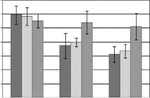

0.6 0.5 0.4 0.3 0.2 0.1

OD 480–690 nm

MCF7 T47D MCF10-A

0

5 µg·mL–1

2.5 µg·mL–1

0 µg·mL–1

Biosynthesized Ag NPs concentration

Bcl-2

Figure  1  Antiproliferative  efficacies  of  biosynthesized  Ag  NPs  produced  by  Cryptococcus laurentii at different concentrations. 

1.2

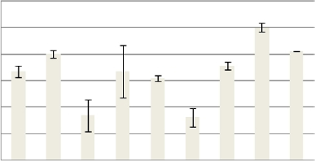

Notes:  Mtt  assay  was  used  on  MCF7,  t47d,  and  MCF10-A.  All  values  are  expressed as the means of the difference between optical density at 480 and 690  nm ± standard deviation. 

1 0.8 0.6 0.4 0.2

Abbreviations: Ag NPs, silver nanoparticles; od, optical density; Mtt, 3-(4,5dimethylthiazol-2-yl)-2,5-diphenyltetrazolium bromide.

0

0 2.5 5

0 2.5 5

0 2.5 5

To see if the cell viability was reduced via apoptotic  pathways, we performed annexin V affinity assay, which  labels cells found in apoptosis so they can be detected by  flow cytometry analysis. Following 6 hours’ incubation and  using 5 μg⋅mL-1 Ag NPs, 61% and 57% of the total number of MCF7 and T47D cells were found in the apoptosis  process, respectively, while in the case of MCF10-A, the  apoptotic population corresponded to just approximately  17% ( Figures 2 and S4; Table S2).

(µg·mL–1) MCF7

(µg·mL–1) T47D

(µg·mL–1) MCF10-A

Caspase-9

1.2

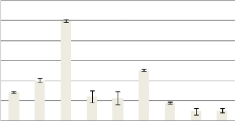

1 0.8 0.6 0.4 0.2

0

P1 Annexin – P2 Annexin +

0 2.5 5 0 2.5 5 0 2.5 5

100.00 90.00 80.00 70.00 60.00 50.00 40.00 30.00 20.00 10.00

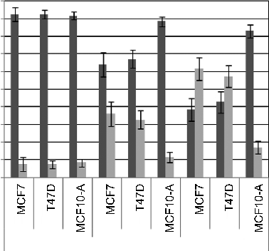

(µg·mL–1) MCF7

(µg·mL–1) T47D

(µg·mL–1) MCF10-A

Flow cytometry

Actin

1.2

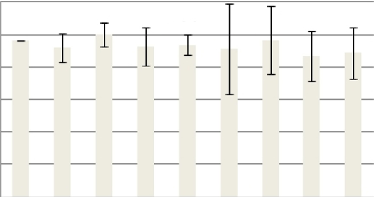

1 0.8 0.6 0.4 0.2

0.00

T47D

T47D

MCF7

MCF7

T47D

MCF7

MCF10-A

MCF10-A

MCF10-A

0

0 2.5 5 0 2.5 5 0 2.5 5

(µg·mL–1) MCF7

(µg·mL–1) T47D

(µg·mL–1) MCF10-A

0 µg·mL–1 2.5 µg·mL–1 5 µg·mL–1

Figure 3 Western-blot quantification of Bcl-2 and caspase-9 by ImageJ software. 

Figure 2 Annexin V-FITC flow cytometry assay. 

Notes: to  determine  relative  intensity  values,  the  maximum  value  for  each  protein was assigned as 100%. Caspase-8 and caspase-3/7 activities were assigned  by chemiluminescent assay following 6 hours’ incubation with 0, 1, and 2 mg⋅ml-1 Ag NP concentrations.

Notes: Negative annexin V populations are presented in P1 columns while positive  populations are presented in P2 columns. Bar chart comparing effect of 0, 2.5, and  5 μg⋅ml-1 Ag NPs produced by Cryptococcus laurentii after 12 hours’ incubation.

Abbreviations: FITC, fluorescein isothiocyanate; Ag NPs, silver nanoparticles.

Abbreviation: Ag NPs, silver nanoparticles.

MCF7

600,000

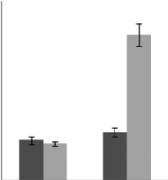

400,000

200,000

0

0 µg·mL–1 5 µg·mL–1

T47D

600,000 Caspase-8 Caspase-3/7

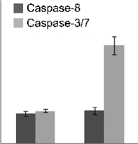

400,000

200,000

0

0 µg·mL–1 5 µg·mL–1

MCF10-A

600,000

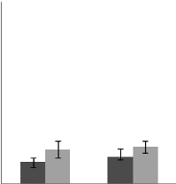

400,000

200,000

0

0 µg·mL–1 5 µg·mL–1

Figure 4 Caspase-8 and caspase-3/7 activities were assigned by chemiluminescent assay following 12 hours’ incubation with 0, and 5 μg⋅ml-1 Ag NP concentrations.

Abbreviation: Ag NPs, silver nanoparticles.

To assess endocytosis activity, we performed a FITC-dextran  assay, where we observed that tumor cells uptake dextran  particles faster than MCF10-A cells (Figures 5 and S5).  When we used FITC-conjugated Ag NPs, we observed that  the Ag NPs enter into the tumor cells through endosomes.  The colocalization between EEA 1 and Ag NPs was observed  in the confocal analysis (Figure 6). The inhibition of endocytosis with dynasore showed an increase in cell viability  in treated cells relative to untreated cells in the MTT assay  results (Figure 7).

## endocytosis activity

# Discussion

The aim of this work was to apply Ag NPs previously  synthesized by a microbiological method in order to assess  their cytotoxic activity and sensitivity in tumor and nontumor  cell lines of breast cancer. 

0 hour

4 hours 8 hours

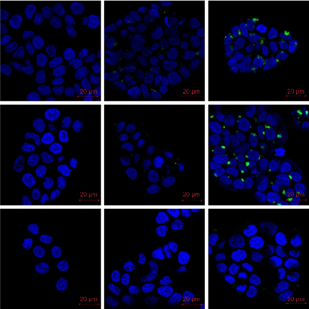

MCF7

20 µm 20 µm 20 µm

T47D

20 µm 20 µm 20 µm

MCF10-A

20 µm 20 µm 20 µm

Figure 5 Fluorescent microscopy images of endocytosis assay using FItC-dextran. 

Notes: MCF7, t47d, and MCF10-A incubated with FItC-dextran 10.000 kd (0.5 mg⋅ml-1) at 37°C for 0, 4, and 8 hours. Nuclear fluorescence was obtained by DAPI.

Abbreviations: dAPI, 4′,6-diamidino-2-phenylindole; FITC, fluorescein isothiocyanate.

Nucleus DAPI

EEA1 Cy3 Ag NPs FITC Merge

A

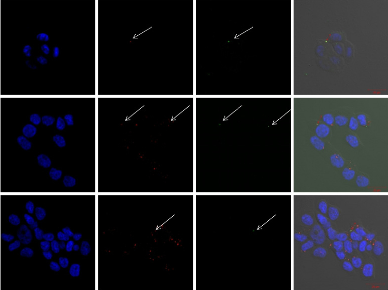

B

C

Figure 6 Fluorescent microscopy images to identify Ag NPs and eeA1.

Notes: The colocalization between EEA1 and AgNPs was observed in the confocal analysis. The arrows show the points with colocalization. Nuclear fluorescence was  obtained with dAPI. A and B are MCF7 cells; C are t47d cells.

Abbreviations: dAPI, 4′,6-diamidino-2-phenylindole; FITC, fluorescein isothiocyanate; Ag NPs, silver nanoparticles.

On the other hand, according to assays of the functional  groups conjugated with the surface of Ag NPs and Fourier  transformed infrared studies (unpublished data), we can  confirm the presence of yeast proteins and polymeric carbohydrates perhaps of arabinogalactan type surrounding this  nanoparticle, which would not allow their passing through  cytoplasmic membranes by simple diffusion. Therefore,  big parts of biosynthesized Ag NPs are uptaken by cells via  endocytosis, and they enter into the cytosol within endosomes. These endosomes then fuse with lysosomes to give  rise to endolysosomes characterized by an acidic environment. Then, inside the endolysosomes, the biosynthesized  Ag NPs are catabolized forming amino acids and Ag ions.30 These ions produce increments of reactive oxygen species  that, at mitochondrial levels, generate a dysfunction and  the activation of caspases involved in apoptotic intrinsic  pathways.31

The cytotoxicity assays of biosynthesized Ag NPs  from culture supernatants of C. laurentii showed that these  Ag NPs reduced cell viability of two cell lines related to  breast cancer. We observed that cell viability of breast  tumor lines MCF7 and T47D was considerably decreased  when cells were exposed to Ag NPs at concentration levels  from and above 2.5 μg⋅mL-1. Moreover, apoptotic assays  demonstrated that cell viability was induced by apoptotic  mechanisms generated through the intrinsic pathway of  caspase activation.29

MTT assay

0.7

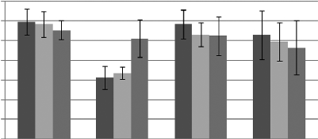

0.6 0.5

OD 480–690 nm

0.4

0.3

0.2

0.1

0

0 µg·mL–1 Treated 0 µg·mL–1

Treated 5 µg·mL–1

5 µg·mL–1

Ag NPs concentration in treated and  non-treated cells with dynasore MCF7 T47D MCF10-A

Figure 7 Antiproliferative efficacy of biosynthesized Ag NPs produced by Cryptococcus laurentii at different concentrations after 12 hours. 

Notes: Mtt assay was used on dynasore treated and non-treated MCF7, t47d,  and MCF10-A. All values are expressed as the means of the difference between  optical density at 480 and 690 nm ± standard deviation. 

Abbreviations: Ag NPs, silver nanoparticles; od, optical density; Mtt, 3-(4,5dimethylthiazol-2-yl)-2,5-diphenyltetrazolium bromide.

Moreover, by comparing apoptosis induction by Ag  NPs in the MCF10-A nontumor cell line and MCF7 and  T47D tumor cell lines, it can be clearly seen that the impact  of biosynthesized Ag NPs from C. laurentii was significantly lower in the nontumor cells than in the tumor cells.  We also observed, through utilization of FITC-dextran  endocytosis assay, that MCF10-A has a lower endocytosis  capability than MCF7 and T47D. These differences in  endocytic capabilities between tumor and nontumor cells  could explain why tumor cells are induced into apoptosis  at lower Ag NPs concentrations than nontumor cells. For  this reason, biosynthesized Ag NPs from C. laurentii,  which are associated with proteins, can be an alternative to  tackle, in a selective manner, tumor cells versus nontumor  cells where differences in endocytosis activity acts as the  targeting mechanism.

# Conclusion

In conclusion, we have shown that biosynthesized Ag  NPs from culture supernatants of C. laurentii induce  apoptosis in breast cancer cell lines while having a much  milder effect in nontumor cell lines. Previous studies  demonstrated that those Ag NPs were capped by yeast  proteins and polymeric carbohydrates of arabinogalactan  type, which is pivotal to avoid passive penetration through  cytoplasmatic membranes by NPs into mammalian cells.  Therefore, these biosynthesized Ag NPs were uptaken  by breast cell lines via endocytosis, which is increased in  tumor cells compared to nontumor cells. This has allowed  us to present endocytic activity differences between tumor  and nontumor cells as a targeting mechanism for selective  antitumor treatments. These results can help to advance the  design of new functionalized Ag NPs for direction towards  specific tumor markers. 

# Acknowledgments

Support from Universidad Nacional de San Luis, to the  Agencia Nacional de Promoción Científica y Tecnológica,  from Consejo Nacional de Investigaciones Científicas  y Técnicas (CONICET) (Argentina), and from GENYO,  Centre for Genomics and Oncological Research: PfizerUniversity of Granada, Andalusian Regional Government,  Granada, Spain are acknowledged.

# Disclosure

The authors report no conflicts of interest in this work.

References 

1.  Jemal A, Siegel R, Xu J, Ward E. Cancer statistics, 2010. CA Cancer  J Clin. 2010;60(5):277–300.

2.  Nadal R, Fernandez A, Sanchez-Rovira P, et al. Biomarkers characterization of circulating tumour cells in breast cancer patients. Breast  Cancer Res. 2012;14(3):R71.

3.  Yezhelyev MV, Gao X, Xing Y, Hajj AA, Nie S, O’Regan RM. Emerging use of nanoparticles in diagnosis and treatment of breast cancer.  Lancet Oncol. 2006;7(8):657–667.

4.  Gurunathan S, Raman J, Abd Malek SN, John PA, Vikineswary S. Green  synthesis of silver nanoparticles using Ganoderma neo-japonicum Imazeki: a potential cytotoxic agent against breast cancer cells. Int  J Nanomedicine. 2013;8:4399–4413.

5.  Gopinath P, Gogoi SK, Sanpui P, Paul A, Chattopadhyay A, Ghosh  SS. Signaling gene cascade in silver nanoparticle induced apoptosis.  Colloids Surf B Biointerfaces. 2010;77(2):240–245.

6.  Hekmat A, Saboury AA, Divsalar A. The effects of silver nanoparticles  and doxorubicin combination on DNA structure and its antiproliferative  effect against T47D and MCF7 cell lines. J Biomed Nanotechnol. 2012; 8(6):968–982.

7.  Blanco-Andujar C, Tung LD, Thanh NTK. Synthesis of nanoparticles  for biomedical applications. Annual Reports Section “A” (Inorganic  Chemistry). 2010;106:553–568.

8.  Durán N, Marcato PD, Ingle A, Gade A, Rai M. Fungi-Mediated  Synthesis of Silver Nanoparticles: Characterization Processes and  Applications. In: Rai M, Kövics G, editors. Progress in Mycology.  Scientific Publishers, Jodhpur, India. 2010:425–449.

9.  Gade A, Ingle A, Whiteley C, Rai M. Mycogenic metal nanoparticles:  progress and applications. Biotechnol Lett. 2010;32(5):593–600.

10.  Gaikwad S, Ingle A, Gade A, et al. Antiviral activity of mycosynthesized  silver  nanoparticles  against  herpes  simplex  virus  and  human  parainfluenza virus type 3. Int J Nanomedicine. 2013;8:4303–4314.

11.  Marcato PD, Nakasato G, Brocchi M, et al. Biogenic silver nanoparticles: antibacterial and cytotoxicity applied to textile fabrics. Journal  of Nano Research. 2012;20:69–76.

12.  Singh R, Wagh P, Wadhwani S, et al. Synthesis, optimization, and  characterization of silver nanoparticles from Acinetobacter calcoaceticus and their enhanced antibacterial activity when combined with  antibiotics. Int J Nanomedicine. 2013;8:4277–4290.

13.  Zhang X, Yan S, Tyagi RD, Surampalli RY. Synthesis of nanoparticles  by microorganisms and their application in enhancing microbiological  reaction rates. Chemosphere. 2011;82(4):489–494.

14.  Kumar RR, Priyadharsani KP, Thamaraiselvi K. Mycogenic synthesis of  silver nanoparticles by the Japanese environmental isolate Aspergillus  tamarii. J Nanopart Res. 2012;14:860–865.

15.  Rodriguez AG, Ping LY, Marcato PD, et al. Biogenic antimicrobial  silver nanoparticles produced by fungi. Appl Microbiol Biotechnol. 2013;97(2):775–782. 

16.  Durán N, Marcato PD, Durán M, Yadav A, Gade A, Rai M. Mechanistic  aspects in the biogenic synthesis of extracellular metal nanoparticles  by peptides, bacteria, fungi, and plants. Appl Microbiol Biotechnol. 2011;90:1609–1624.

17.  Subramanian M, Alikunhi NM, Kandasamy K. In Vitro Synthesis of  Silver Nanoparticles by Marine Yeasts from Coastal Mangrove Sediment. Adv Sci Lett. 2010;3(4):428–433.

18.  Mishra A, Tripathy SK, Yun SI. Bio-synthesis of gold and silver nanoparticles  from Candida guilliermondii and their antimicrobial effect against pathogenic bacteria. J Nanosci Nanotechnol. 2011;11(1):243–248.

19.  Namasivayam SKR, Ganesh S, Avimanyu. Evaluation of anti-bacterial  activity of silver nanoparticles synthesized from Candida glabrata and  Fusarium oxysporum. Int J Med Res. 2011;1(3):131–136.

20.  Levine MN, Hoang TT, Raines RT. Fluorogenic probe for constitutive  cellular endocytosis. Chem Biol. 2013;20:614–618.

21.  dos Santos T, Varela J, Lynch I, Salvati A, Dawson KA. Quantitative  assessment of the comparative nanoparticle-uptake efficiency of a range  of cell lines. Small. 2011;7(23):3341–3349.

22.  Wall DA, Maack T. Endocytic uptake, transport, and catabolism of proteins by epithelial cells. Am J Physiol. 1985;248(1 Pt 1):C12–C20.

23.  Taylor-Papadimitriou J, Purkis P, Fentiman IS. Cholera toxin and analogues of cyclic AMP stimulate the growth of cultured human mammary  epithelial cells. J Cell Physiol. 1980;102:317–321.

24.  Mosmann T. Rapid colorimetric assay for cellular growth and survival:  application to proliferation and cytotoxicity assays. J Immunol Methods. 1983;65(1–2):55–63.

25.  Huber R, Berendes R, Burger A, et al. Crystal and molecular structure of human annexin V after refinement. Implication for structure,  membrane binding and ion channel formation of the annexin family of  proteins. J Mol Biol. 1992;223(3):683–704.

26.  Zhou T, Rosen BP. Tryptophan fluorescence reports nucleotide-induced  conformational changes in a domain of the ArsA ATPase. J Biol Chem. 1997;272(32):19731–19737.

27.  van Engleland M, Nieland LJ, Ramaekers FC, Schutte B, Reutelingsperger CP.  Annexin V-affinity assay: a review on an apoptosis detection system based  on phosphatidylserine exposure. Cytometry. 1998;31(1):1–9.

28.  Macia  E,  Ehrlich  M,  Massol  R,  Boucrot  E,  Brunner  C,  Kirchhausen T. Dynasore, a cell-permeable inhibitor of dynamin. Dev  Cell. 2006;10(6):839–850.

29.  Hileman EO, Liu J, Albitar M, Keating MJ, Huang P. Intrinsic oxidative  stress in cancer cells: a biochemical basis for therapeutic selectivity.  Cancer Chemother Pharmacol. 2004;53(3):209–219. 

30.  Sundaramoorthi C, Kalaivani M, Mathews DM, Palanisamy S,  Kalaiselvan V, Rajasekaran A. Biosynthesis of silver nanoparticles  from Aspergillus niger and evaluation of its wound healing activity in  experimental rat model. International Journal of PharmTech Research.  2009;1(4):1523–1529.

31.  Vertelov  GK,  Krutyakov  YA,  Efremenkova  OV,  Olenin  AY,  Lisichkin GV. A versatile synthesis of highly bactericidal Myramistin® stabilized silver nanoparticles.  Nanotechnology. 2008;19(35): 355707.

# Supplementary materials

�����

�

� �����

�� ��

�����

���������� ����

�� � � �� � � ���� ����

Figure S1 graphic representation of conjugation reaction between Ag NPs and FItC molecules.

Abbreviations: FITC, fluorescein isothiocyanate; Ag NPs, silver nanoparticles.

����������������������

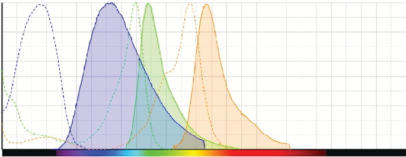

���

��

��

��

�

��� ��� ���

��� ��� ��� ���

���������������

Figure S2 Absorption and emission spectrums of used fluorochromes. 

Notes: dAPI: blue; FItC: green; and Alexa Fluor 568: red.

Abbreviations: dAPI, 4′,6-diamidino-2-phenylindole; FITC, fluorescein isothiocyanate.

�������������

���������

��� ��� ��� ��� ��� ��� ���

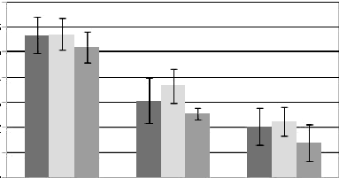

�

��������� �����������

���������

�����������������������������

���� ���� �������

Figure S3 Antiproliferative efficacy of the Ag NPs produced by synthetic methods at different concentrations.

Notes: Mtt assay was used on MCF7, t47d, and MCF10-A. All values are expressed as the means of the difference between optical density at 570 and 690 nm ± standard  deviation.

Abbreviations: Ag NPs, silver nanoparticles; od, optical density; Mtt, 3-(4,5-dimethylthiazol-2-yl)-2,5-diphenyltetrazolium bromide.

|Table S1 Numeric table comparing cell viability of 0, 2.5, and 5 μg⋅ml-1 Ag NPs produced by Cryptococcus laurentii and by synthetic  methods| | | | | | | | | | | | | | | | | | |
|---|---|---|---|---|---|---|---|---|---|---|---|---|---|---|---|---|---|---|
| | |0 µg/mL| |SD| |P-value| |2.5 µg/mL| |SD| |P-value| |5 µg/mL| |SD| |P-value|
|Ag NPs produced by Cryptococcus laurentii| | | | | | | | | | | | | | | | | | |
|MCF7| |0.59| |0.065| |N/S| |0.37| |0.091| |0.038| |0.31| |0.057| |0.019|
|t47d| |0.58| |0.065| |N/S| |0.39| |0.031| |0.024| |0.33| |0.049| |0.023|
|MCF10-A| |0.55| |0.048| |N/S| |0.54| |0.081| |N/S| |0.51| |0.094| |N/S|
|Chemical Ag NPs| | | | | | | | | | | | | | | | | | |
|MCF7| |0.56| |0.071| |N/S| |0.31| |0.091| |N/S| |0.20| |0.074| |N/S|
|t47d| |0.57| |0.063| |N/S| |0.37| |0.068| |N/S| |0.22| |0.056| |N/S|
|MCF10-A| |0.52| |0.061| |N/S| |0.25| |0.024| |N/S| |0.14| |0.072| |N/S|
|Notes: After 12 hours’ incubation. Values are expressed as the means of the difference between optical density at 570 and 690 nm; P-value is shown when the differences  are statistically significant with respect to MCF10-A.  Abbreviations: Ag NPs, silver nanoparticles; N/S, nonsignificant; SD, standard deviation.| | | | | | | | | | | | | | | | | | |

� � �

������������������������� �������������������������

����������������������������

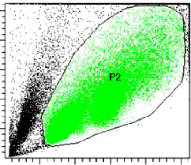

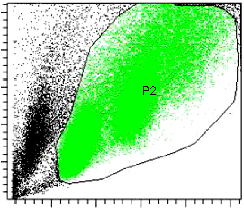

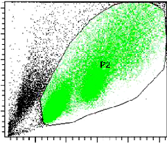

��������

��������

��������

���

���

���

���

���

���

�����

�����

�����

���

���

���

�� �� ��

���

���

���

��

��

��

��

�� ��� ��� ��� �� ��� ��� ��� ���

��� ��� ��� ��� ��� ��������

�������� ��������

�����

����� �����

� � �

���������������������������� ������������������������� �������������������������

�����

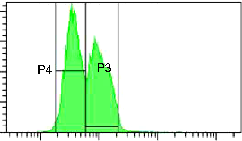

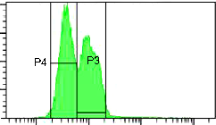

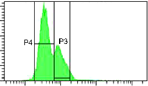

����� ����� ����� �����

�����

�����

���

�����

�����

�����

�� �� �� �� �� ��

�����

���

���

���

��� �

�

�

���

��� ��� ��� ��� ��� ��� ��� ��� ��� ���

���

���������������� ���������������� ����������������

� � �

����������������

����������������

����������������

���������� ���������� ���������� ����

���������� ���������� ����������� ����

���������� ���������� ���������� ����

��

������ ���� ��� �� ������ ���� ��� �� ������ ���� ��� �� ������ ���� ����� �� ������ ���� ����� �� ������ ���� ����� �� ������ ���� ��� �� ������ ���� ��� �� ������ ���� ���

Figure S4 Typical figure of flow cytometry that shows annexin V expression between MCF7, T47D, and MCF10-A cell lines.

Notes: A, B, and C show the dot plot of cytometry analysis, the population 2 (P2)  included the single epithelial cells. D, E, and F show the histogram plot of P2 that  separates between P3 (positive annexin) and P4 (negative annexin). G, H, and I show the estatistic parameters of the three populations.

Abbreviations: FITC, fluorescein isothiocyanate; FSC-A, forward scatter area; SSC-A, side scatter area.

|Table S2 Numeric table comparing effect of 0, 2.5, and 5 μg⋅ml-1 of Ag NPs produced by Cryptococcus laurentii after 12 hours’  incubation| | | | | | | | | | | | | | | | | | |
|---|---|---|---|---|---|---|---|---|---|---|---|---|---|---|---|---|---|---|
|Negative and  positive populations| |0 µg⋅mL-1| | | | | |2.5 µg⋅mL-1| | | | | |5 µg⋅mL-1| | | | |
| | |MCF7| |T47D| |MCF10-A| |MCF7| |T47D| |MCF10-A| |MCF7| |T47D| |MCF10-A|
|P1 | |92.73| |92.67| |91.733| |64| |67.2| |88.5| |38.633| |42.7| |83.066|
|P2 | |7.27| |7.33| |8.2666| |36| |32.8| |11.5| |61.366| |57.3| |16.933|
|Note: Negative annexin V populations are presented in P1 row while positive populations are in presented P2 row.| | | | | | | | | | | | | | | | | | |

�������������������

������������������

� � � � � � � �

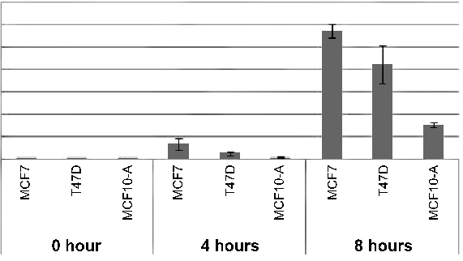

����

����

����

����

����

����

�������

�������

�������

������ �������

�������

Figure S5 endocytosis assay using FItC-dextran. 

Notes: Fluorescent intensity of cells was measured in eight fields per sample and is presented as mean ± standard deviation.

Abbreviation: FITC, fluorescein isothiocyanate.

Dovepress

International Journal of Nanomedicine

Publish your work in this journal

The International Journal of Nanomedicine is an international, peerreviewed journal focusing on the application of nanotechnology  in diagnostics, therapeutics, and drug delivery systems throughout  the biomedical field. This journal is indexed on PubMed Central,  MedLine, CAS, SciSearch®, Current Contents®/Clinical Medicine,  Journal Citation Reports/Science Edition, EMBase, Scopus and the  Elsevier Bibliographic databases. The manuscript management system  is completely online and includes a very quick and fair peer-review  system, which is all easy to use. Visit http://www.dovepress.com/ testimonials.php to read real quotes from published authors.

Submit your manuscript here: http://www.dovepress.com/international-journal-of-nanomedicine-journal

