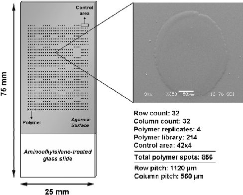
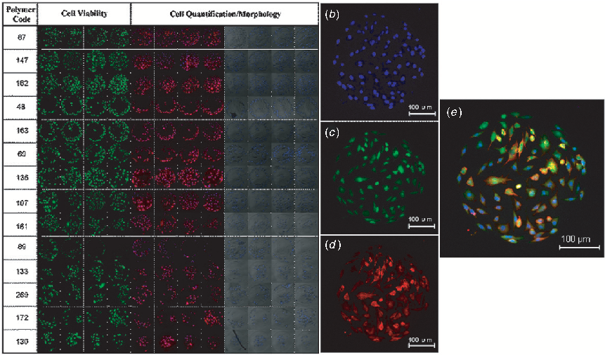
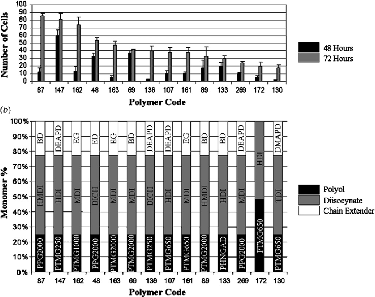
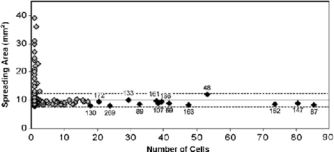
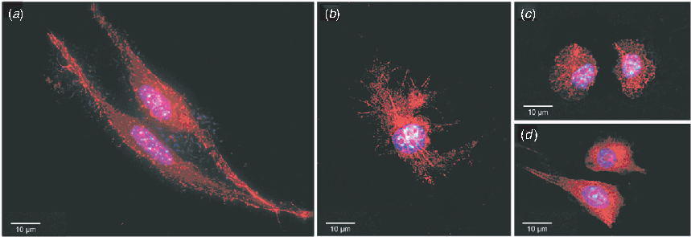

Home Search Collections Journals About Contact us My IOPscience

## Deciphering cellular morphology and biocompatibility using polymer microarrays

This content has been downloaded from IOPscience. Please scroll down to see the full text.

2008 Biomed. Mater. 3 034112 (http://iopscience.iop.org/1748-605X/3/3/034112)

View the table of contents for this issue, or go to the journal homepage for more

Download details:

IP Address: 130.56.64.29 This content was downloaded on 07/07/2016 at 04:42

Please note that terms and conditions apply.

IOP PUBLISHING BIOMEDICAL MATERIALS Biomed. Mater. 3 (2008) 034112 (6pp) doi:10.1088/1748-6041/3/3/034112

# Deciphering cellular morphology and biocompatibility using polymer microarrays

### Salvatore Pernagallo1, Asier Unciti-Broceta1, Juan Jos´e D´ıaz-Moch´on and Mark Bradley

School of Chemistry, King’s Buildings, West Mains Road, Edinburgh EH9 3JJ, UK E-mail: Mark.Bradley@ed.ac.uk

Received 21 September 2007 Accepted for publication 1 February 2008 Published 15 August 2008 Online at stacks.iop.org/BMM/3/034112

Abstract A quantitative and qualitative analysis of cellular adhesion, morphology and viability is essential in understanding and designing biomaterials such as those involved in implant surfaces or as tissue-engineering scaffolds. As a means to simultaneously perform these studies in a high-throughput (HT) manner, we report a normalized protocol which allows the rapid analysis of a large number of potential cell binding substrates using polymer microarrays and high-content fluorescence microscopy. The method was successfully applied to the discovery of optimal polymer substrates from a 214-member polyurethane library with mouse fibroblast cells (L929), as well as simultaneous evaluation of cell viability and cellular morphology. Analysis demonstrated high biocompatibility of the binding polymers and permitted the identification of several different cellular morphologies, showing that specific polymer interactions may provoke changes in cell shape. In addition, SAR studies showed a clear correspondence between cellular adhesion and polymer structure. The approach can be utilized to perform multiple experiments (up to 1024 single experiments per slide) in a highly reproducible manner, leading to the generation of vast amounts of data in a short time period (48–72 h) while reducing dramatically the quantities of polymers, reagents and cells used.

(Some figures in this article are in colour only in the electronic version)

#### 1. Introduction

Intensive research efforts in biomaterial science have provided a significant number of polymers for potential applications in medicine [1, 2]. As a consequence, the clinical use of polymers has been expanded from traditional uses (catheters, syringes, etc) to other emerging areas such as drug delivery [3–5] and tissue-engineering scaffolds [6–9]. Although specific material requirements will differ according to the nature of the application, it is a universal condition that the biopolymer displays adequate so-called biocompatibility. HT technologies are gaining relevance in this field as an efficient way of screening new materials [10–13].

- 1 These authors contributed equally to this work.

Due to their unique mechanical properties and their excellent tolerance in the human body, polyurethanes (PUs) have been extensively used as biomedical materials for half a century [14, 15]. This kind of material belongs to the family of urethane copolymers which are characterized by a carbamate or urethane linkage (–NH–CO–O–) in their structure. Numerous physical parameters (such as elasticity, wettability and surface topography [16]) and biochemical properties (in particular the ability to adsorb extracellular matrix (ECM) proteins [17]) are expected to play a relevant role in the cellular adhesion and biocompatibility of the polymers. In addition, the surface of the biomaterial often changes the conformation of the adsorbed ECM proteins which may partially or completely lose their bioactivity [18]. All these factors, while being dependent on the chemical structure, are not easy to predict. Consequently,

1748-6041/08/034112+06$30.00 1 © 2008 IOP Publishing Ltd Printed in the UK

(a)

|DIISOCYANATE|POLYOL|EXTENDER|
|---|---|---|
|OCN NCO PDI|HO O xH PEG400,900,2000|H2N NH2 ED|
|OCN  NCO TDI|HO O xH PPG425,1000,2000|HO OH BD|
|MDI OCN NCO|HO O xH PTMG250,650,1000,2000|N  DMAPD OH  HO|
|OCN NCO HDI|O  HO O ROH R O x  O|N  DEAPD OH  HO|
|OCN NCO  BICH  OCN NCO HMDI|R= -CH2(CH2)4CH2- PHNAGD1800  -CH2C(CH3)2CH2- -CH2CH2OCH2CH2-   R= -CH2(CH2)4CH2-  PHNAD900  -CH2C(CH3)2CH2-|O O HO  DHM OH  O O|

(b)

|O  O  H N  H N  O  O  OH PU-87  50% HMDI 25% PPG2000 25% BD  O  x  y  O  N H  N H  O   O  z|
|---|

Figure 1. Chemical components of the PU library. (a) Monomers used in the PU library synthesis and (b) structure of PU-87.

the traditional studies for developing new biomaterials are highly time-consuming processes involving the rational design of biomaterials for specific needs and subsequent individual examination of the polymer properties. As a way to speed up the modus operandi, several research groups have recently developed high-content screening technologies for the study of cell–biomaterial interactions [11, 12, 19, 20]. These 2D micropatterned surfaces allow a variety of in vitro studies (cellular attachment, differentiation, phagocytosis, etc) whilst being easy to prepare, inexpensive and suitable for all kinds of adherent cell lines and importantly require only limited amounts of reagents and cells.

Herein, we describe a normalized fluorescence-based, high-throughput methodology, for the rapid screening of potential biomaterials in a microarray format. Cell binding studies were realized using a library of PUs (composed of 214 members), prepared by a combinatorial approach, and the novel microarray platform recently developed in house [12]. The presented protocol was successfully applied to find optimal polymer supports for mouse connective tissue fibroblast cells (L929), which are cells of great interest in biomedical research since fibroblasts provide a structural framework (stroma) for many tissues and play a critical role in wound healing [21]. This versatile method allowed the simultaneous study of both cellular morphology and cell viability in relation to the polymer on which the cells were adhered.

#### 2. Materials and methods

##### 2.1. Synthesis of PU library [22]

Twelve parallel reactions were carried out in a Stem block on a mmol scale by a typical two-stage poly-addition reaction.

In brief, a pre-polymer was prepared by the reaction of 1.0 equiv of a polyol with 2.0 equiv of a diisocyanate in dry THF, followed (after titration) by the addition of 1.0 equiv of the same polyol or another chain extender (monomers used are shown in figure 1(a)). The library was tailored by varying the nature of the polyol (from 250 to 2000 Da and different compositions)andthediisocyanate, andsubstitutingthepolyol by a bifunctional small molecule as chain extender. Polymers were named using an identical format to that previously reported [12, 22]. A representative PU structure is shown in figure 1(b). The 214 polymers of the library were all characterized using high-throughput methods such as GPC (column PLgel HTS-D 150 mm × 7.5 mm ID, Polymer Laboratories, NMP 1 mL min−1), Hyper DSC (Diamond, Perkin-Elmer) and FT-IR (Mattson instrument) [22].

##### 2.2. L929 cell culture

Media, serum and antibiotics were purchased from Gibco or Sigma–Aldrich. Cultures were performed in a 5% CO2 atmosphere at 37 ◦C in a SteriCult 200 (Hucoa-Erloss) incubator. L929 cells were cultured in DMEM supplemented with 10% fetal bovine serum (FBS), glutamine (4 mM) and antibiotics (penicillin and streptomycin, 100 units mL–1).

##### 2.3. Polymer microarray fabrication

Polymers were ‘spotted’ on aminoalkylsilane-treated glass slides (Sigma–Aldrich), previously coated with agarose to impede unspecific cell adhesion [12, 13, 23, 24]. Slides were coated by dipping once into a 1% agarose aqueous solution at 60 ◦C. Subsequently, polymer arrays were fabricated by contact printing (QArraymini, Genetix) with 32 aQu solid

single field of 32 × 32 spots containing 42 control emptied areas (see figure 2). Once printed, the slides were dried under vacuum (24 h at 42 ◦C/200 mbar) and sterilized in a biosafety cabinet (HERAsafe KS 18 class II Heraeus) by exposure to UV irradiation for 20 min prior to use.

(a) (b)

##### 2.4. Cell-based microarrays

L929 cells were washed with phosphate buffered saline (PBS), detached with trypsin/EDTA, counted and diluted with media to a final concentration of 105 cells per mL. 5 mL of this dilution were gently added onto the polymer microarray contained in a sterile four-well plate (Nunc) and incubated for different periods of time (48 and 72 h). Cell labeling was done as follows: (i) incubation with CellTracker Green CMFDA (5 µM in PBS, Molecular Probes Inc.) at 37 ◦C and 5% CO2 for 15 min; (ii) slides were then gently washed and fixedwith4%(w/v)formaldehydeinPBSatroomtemperature for 15 min; (iii) incubation with Hoechst-33342 (1 µg mL–1 in PBS, Sigma–Aldrich) for 15 min at room temperature; and subsequently, (iv) incubation with Alexa fluor568 phalloidin (0.2 µM in 1% in PBS containing 1% FBS, Invitrogen) for 15 min at room temperature. The polymer microarray slides were then rinsed in deionized water and air dried before scanning.

- Figure 2. Polymer microarray design: (a) slide template and (b) SEM of a representative polymer spot.

pins (K2785, Genetix) using polymer solutions (1% w/v in NMP) placed in polypropylene 384-well microplates; printing conditions: 5 stamps per spot, 200 ms inking time and 100 ms stamping time. The typical spot size was 300–320 µm in diameterwithapitchdistanceof1120 µm(y-axis)and560µm (x-axis), allowing up to 1024 features to be printed on a standard 25 mm × 75 mm slide. The 214 members of the PU library were printed following a four-replicate pattern with one

(a)

- (b)
- (c)
- (d)

(e)

- Figure 3. L929 cells grown on polymer microarrays after 72 h incubation. (a) Best polymer substrates for L929 cells. All polymers supported a minimum average of 20 cells. FITC channel images are shown in the Cell viability column. Rhodamine /DAPI merged images and brightfield/DAPI composites are shown in the Cell Quantification/Morphology column. (b)–(e) Fluorescent pictures of L929 cells grown on a representative spot of PU-87: (b) DAPI channel; (c) FITC channel; (d) rhodamine channel; (e) merged image.

##### 2.5. Fluorescence-based HT screening

Image capture and analyses were carried out using an IMSTAR high-content screening (HCS) device equipped with the

- (a)
- (b)

Figure 4. (a) Cell numbers after 48 and 72 h and (b) composition of the polymers.

PathfinderTM software package (IMSTAR S.A., Paris, France). Cell number (Hoechst-33342: excitation/emission 350/461 nm), biocompatibility (CellTracker Green: excitation/ emission 492/516 nm) and morphology (Alexa fluor 568: excitation/emission 578/603 nm) of each PU member were determined using fluorescent (DAPI, FITC and Rhodaminelike band-pass filters) and brightfield channels by automated scanning (×20 objective) of the polymer spots.

- 2.6. Analysis of cell morphology

Cell morphology was analyzed by confocal microscopy after 48 and 72 h of culture. Image capture was performed by a DeltaVision RT microscope (×63 objective) using DAPI and Rhodamine channels.

- 3. Results and discussion

- 3.1. High-content screening of L929

Cell-adhesion experiments were carried out with the mouse fibrosarcoma cell line, L929, incubating the 214-member polymer microarrays for 48 h and 72 h. In order to study the biocompatibility of the polymer support, micropatterned cells were incubated with CellTracker Green CMFDA. This probe composed of 5-chloromethylfluorescein diacetate is nonfluorescent and able to freely diffuse through the membrane of live cells. Once inside the cell, intracellular esterases cleave the acetate groups to produce cells that are fluorescent, viable for at least 24 h after loading and covalent modification.

Subsequently, the micropatterned cells were fixed, and cell nuclei and cytoskeleton stained with Hoechst-33342 and Alexa fluor568, respectively. Cell permeable Hoechst-33342 is an adenine–thymine-specific dye that binds to the minor groove of DNA, and Alexa fluor568 phalloidin is a fluorescent bicyclic peptide with a high affinity for F-actin, which is an important component of the cytoskeleton. This fluorescent probe does not cross the membrane of living cells and thus requires fixation of the cells in order to increase membrane permeability. Once the cells are fixed, the staining of the cells with Hoechst-33342 is also accelerated.

The HT analysis of the fixed cells was realized using three fluorescent channels and brightfield (see figure 3).

##### 3.2. Analysis of cell viability

Cell viability was qualitatively evaluated by the fluorescence emission of the content of each spot through the FITC-like channel (see figure 3). Generally speaking, all polymers with the ability to support L929 cells were found to have high biocompatibility with this cell line.

##### 3.3. Analysis of cell adhesion and competitive affinity

In order to quantify cellular adhesion on each polymer, the average numbers of cells across the four spots and standard deviation were used. These values were recorded at two time points, 48 and 72 h, which allowed scoring for cellular binding of L929 cells (see figures 3(a) and (b)). This was done

first 48 h and then showed a ‘burst’ of growth in the following 24 h. Interestingly, the 160 series (PU-161, PU-162 and PU163), which have the same type of monomers, only differing in the molecular weight of the polyol used (PTMG650, PTMG1000 and PTMG2000, respectively), showed similar cell attachment trends. Low cell binding was observed within the first 48 h followed by a vigorous growth in the remaining 24 h. On the other hand, polymers PU-147, PU-69 and PU-48 showed steady cell numbers over time, associated with rapid cell immobilization achieved by these polymers. Similarly, the number of cells quantified on PU69 for both observation times showed an identical number of cells, which indicated the high grade of affinity of this polymer for L929 cells. In fact, after 48 h every single spot of PU-69 was completely covered with cells, hindering further cellular proliferation on the spot.

- Figure 5. Analysis of polymer wettability in relation to the average number of cells found per polymer spot. Polymer wettability is expressed as the area over which a droplet of water of defined size spreads over a cover slip spin coated with the polymer (and was determined in this case after a contact time of 20 s). The hit polymers described in figure 4 are shown above the black diamonds ( ).

by fluorescence analysis of images from the DAPI channel. PathfinderTM software package was used to automatically detect and quantify cell nuclei.

In general, significant cellular adhesion was supported by a number of the library members (figure 4(a)). PU-87 was the best substrate, providing an average (over the four identical polymer spots) of 82 mouse fibroblast cells. 13 out of the 14 best polymer supports were synthesized using as a chain extender, a small molecule instead of the corresponding polyol (see figure 3(b)). The polyol PTMG, although with different molecular weights, was a common component of ten of the hit polymers (14), thus demonstrating a certain correlation between polymer structure and cell binding.

Althoughtwodifferentpolymersdidhavesimilarcapacity forbindingaspecificcellline, thecellbindingprocesscouldbe faster on one polymer than on the other. Consequently, within a competitive assay (as the polymer microarray platform is) better polymer substrates will immobilize higher numbers of cells during the first hours. A comparative analysis of cell number per polymer over time would thus be a measure of the grade of affinity of L929 to the polymer. Data analysis revealed different behaviors for the polymers (figure 4(a)). For example, some polymers showed low cell binding after the

(a) (b) (c)

(d)

- Figure 6. Confocal images of L929 cells on polymer microarrays. Cells were imaged under excitation at 555/28 nm and 360/40 nm using a DeltaVision RT microscope (×63 objective) and then merged: (a) PU-87; (b) PU-133; (c) PU-161; and (d) PU-107.

##### 3.4. Correlation study between polymer wettabilityand cell adhesion abilities

We previously reported a HT method for evaluating the wettability of polymer libraries by measuring the spreading area of water droplets deposited onto spin-coated films of the polymer [21]. The entire polyurethane library, was, therefore characterized with spreading areas determined after a contact time of 20 s. Analysis showed that 90% of the PU library members were relatively hydrophobic, with a spreading area ranging from 8 to 12 mm2 (equivalent to a contact angle from 90◦ to 70◦, respectively [22]). These values were shown to be strongly correlated with the cell binding (see figure 5) with all hydrophilic polymers (having a spreading area > 15 mm2, equivalent to contact angle <50◦) found to impede cell adhesion. This analysis emphasizes the significant role of the polymer’s physical properties on cell adhesion and indicates that L929 cells require a relatively hydrophobic substrate for adherence.

##### 3.5. Analysis of cell morphology

Cells in contact with a binding surface will first attach and then spread according to the interactions created among the surface,

- [7] Alsberg E, Anderson K W, Albeiruti A, Rowley J A and Mooney D J 2002 Engineering growing tissues Proc. Natl Acad. Sci. USA 99 12025–30
- [8] Lendlein A and Langer R 2002 Biodegradable, elastic shape-memory polymers for potential biomedical applications Science 296 1673–6
- [9] Halstenberg S, Panitch A, Rizzi S, Hall H and Hubbell J A 2002 Biologically engineered protein-graftpoly(ethylene glycol) hydrogels: a cell adhesive and plasmin-degradable biosynthetic material for tissue repair Biomacromolecules 3 710–23
- [10] Pepperkok R and Ellenberg J 2006 High-throughput fluorescence microscopy for systems biology Nat. Rev. Mol. Cell Biol. 7 690–6
- [11] Anderson D G, Levenberg S and Langer R 2004 Nanoliter-scale synthesis of arrayed biomaterials and application to human embryonic stem cells Nat. Biotech. 22 863–6
- [12] Tourniaire G et al 2006 Polymer microarrays for cellular adhesion Chem. Commun. 2118–20
- [13] Mant A, Tourniaire G, Diaz-Mochon J J, Elliott T J, Williams A P and Bradley M 2006 Polymer microarrays: identification of substrates for phagocytosis assays Biomaterials 27 5299–306
- [14] Boretos J W and Pierce W S 1967 Segmented polyurethane: a new elastomer for biomedical applications Science 158 1481–2
- [15] Zdrahala R J and Zdrahala I J 1999 Biomedical applications of polyurethanes: a review of past promises, present realities, and a vibrant future J. Biomater. Appl. 14 67–90
- [16] Shin H, Jo S and Mikos A G 2003 Biomimetic materials for tissue engineering Biomaterials 24 4353–64
- [17] Gallagher W M, Lynch I, Allen L T, Miller I, Penney S C, O’Connor D P, Pennington S, Keenan A K and Dawson K A 2006 Molecular basis of cell–biomaterial interaction: insights gained from transcriptomic and proteomic studies Biomaterials 27 5871–82
- [18] Sherratt M J, Baldock C, Morgan A and Kielty C M 2007 The morphology of adsorbed extracellular matrix assemblies is critically dependent on solution calcium concentration Matrix Biol. 26 156–66 and references cited therein
- [19] Derda R, Li L, Orner B P, Lewis R L, Thomson J A and Kiessling L L 2007 Defined substrates for human embryonic stem cell growth identified from surface arrays ACS Chem. Biol. 2 347–55
- [20] Unciti-Broceta A, D´ıaz-Moch´on J J, Mizomoto H and Bradley M 2008 Combining nebulization-mediated transfection and polymer microarrays for the rapid determination of optimal transfection substrates J. Comb. Chem. 10 179–84
- [21] Chang H Y et al 2002 Diversity, topographic differentiation, and positional memory in human fibroblasts Proc. Natl Acad. Sci. USA 99 12877–82
- [22] Thaburet J-F-O, Mizomoto H and Bradley M 2004 High-throughput evaluation of the wettability of polymer libraries Macromol. Rapid Commun. 25 366–70
- [23] Folch A and Toner M 2000 Microengineering of cellular interactions Ann. Rev. Biomed. Eng 2 227–56
- [24] Roth E A, Xu T, Das M, Gregory C, Hickman J J and Boland T 2004 Inkjet printing for high-throughput cell patterning Biomaterials 25 3707–15
- [25] Garc´ıa A J 2006 Interfaces to control cell-biomaterial adhesive interactions Advances in Polymer Science (Berlin/ Heidelberg: Springer) pp 171–90
- [26] Li P-T, Lee Y-C, Elangovan N and Chu S-T 2007 Mouse 24p3 Protein has an effect on L929 cell viability Int. J. Biol. Sci. 3 100–7

the proteins from the growth serum and the ECM proteins [25]. The nature of this adhesion will influence their morphology and their capacity for proliferation and differentiation [17]. Fibroblasts are slow-moving cells in which the cytoskeleton plays a very important role in the cell motility and shape, among others. To observe the effects of PUs on the typical morphology of this cell type, confocal microscopy studies were carried out on cultured L929 fibroblasts.

Cellsculturedonthemajorityofthespotsmaintainedtheir characteristic morphology [26] (see figure 6(a)). However, on some polymers there was a tendency to form highly spreadout cells (see figure 6(b)). Moreover, closer analysis revealed alternative cell morphologies such as those in figures 6(c) and (d). In spots containing a low density of cell binding, a rounded morphology was typically observed (figure 6(c)), due to the lack of a suitable attachment points needed for the development of a normal phenotype.

#### 4. Conclusions

A fluorescence-based high-throughput microarray methodology has been developed to facilitate the rapid screening of combinatorial libraries of potential biomaterials. The normalized protocol was successfully applied to the identification of optimal polymeric supports for the L929 cells from amongst a library of 214 PUs. The application of this method simultaneously allowed the influence of polymer structure to be related to cellular binding and cellular morphology, demonstrating that specific cellular morphology and hence cellular behavior will be fundamentally altered by the substrate upon which the cell adheres. The approach presented allows hundreds of experiments to be performed in a highly reproducible and time-efficient manner, whilst both generating vast amounts of data and consuming tiny amounts of material.

#### Acknowledgments

We thank EPSRC (SP and JJD-M) and MRC (AU-B) for funding. We are very grateful to Prof. Tim Elliot for supplying the L929 cell line.

#### References

- [1] Langer R and Tirrell D A 2004 Designing materials for biology and medicine Nature 428 487–92
- [2] Anderson D G, Burdick J A and Langer R 2004 Smart biomaterials Science 305 1923–4
- [3] Luo D and Saltzman W M 2000 Synthetic DNA delivery systems Nature Biotechnol. 18 33–7
- [4] Mathiowitz E et al 1997 Biologically erodable microspheres as potential oral drug delivery systems Nature

386 410–14

- [5] Grayson A et al 2003 Multi-pulse drug delivery from a resorbable polymeric microchip device Nature Mater. 2 767–72
- [6] Vacanti J P and Langer R 1999 Tissue engineering: the design and fabrication of living replacement devices for surgical reconstruction and transplantation Lancet 354 32–4

