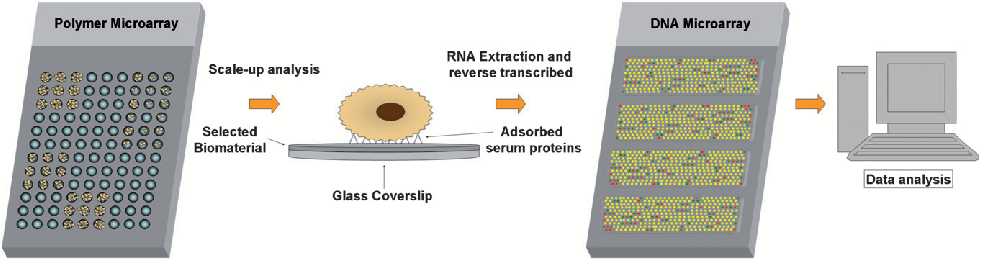
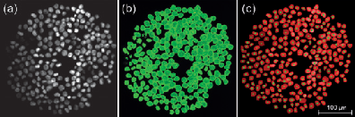
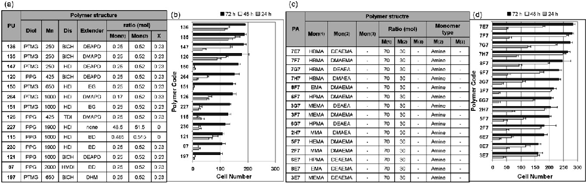
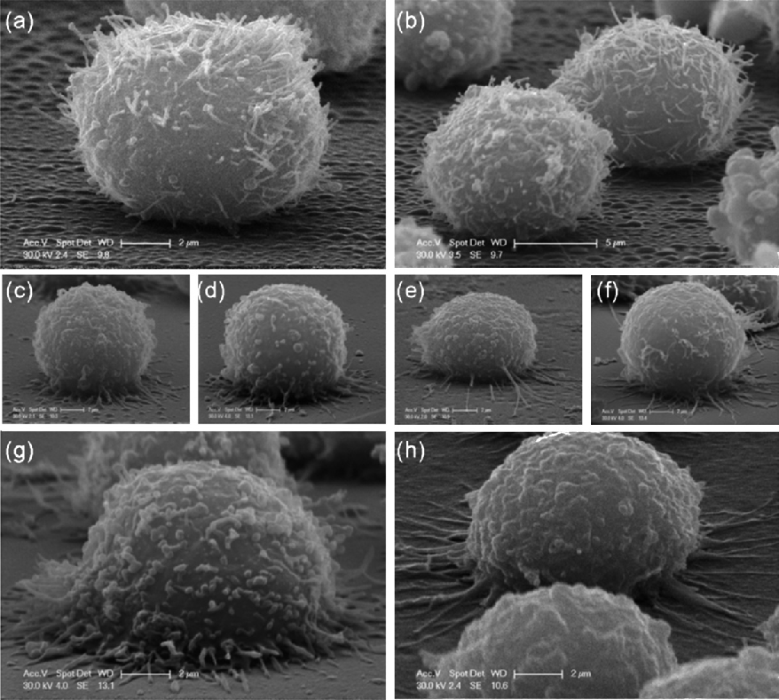
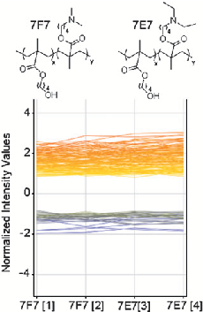
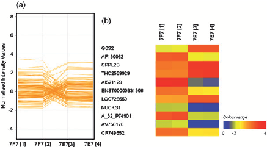
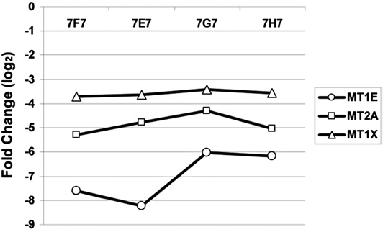

Published on 14 November 2008. Downloaded by New York University on 09/10/2014 11:16:11.

View Article Online / Journal Homepage / Table of Contents for this issue

PAPER www.rsc.org/loc | Lab on a Chip

# A cooperative polymer-DNA microarray approach to biomaterial investigation†

Salvatore Pernagallo, Juan Jose Diaz-Mochon and Mark Bradley*

Received 19th May 2008, Accepted 6th October 2008 First published as an Advance Article on the web 14th November 2008 DOI: 10.1039/b808363k

In this study, polymer microarrays were used for the rapid identification of polymer substrates upon which a suspension cell line would both adhere and proliferate giving a detailed and rapid understanding of cell-biomaterial interactions. Analysis demonstrated that suspension K562 human erythroleukemic cells, which normally grow in suspension, adhered and proliferated on several different polymers. Phenotypic and transcriptomic analysis techniques allowed examination of the interaction between cells and polymers permitting the elucidation of putative links between phenotypic responses to cell-biomaterial interactions and global gene expression.

Introduction

cellular binding on some 268 polymers using a polymer microarray format developed by our group.15–20

Biomaterials have been defined as ‘‘materials intended to interface with biological systems to evaluate, treat, augment or replace any tissue, organ or function of the body.’’1 As such, biomaterials have become an integral part of medicinal technology, with applications ranging from the implantation of devices and prostheses to the controlled delivery of drugs and as scaffolds for tissue engineering.2–4

The protocol was applied to the discovery of polymer supports for the adhesion of K562 suspension cells (K562 cells do not need to be attached to Extra Cellular Matrix (ECM) proteins in order to survive and grow23,24 and therefore do not normally undergo the same adhesion process as anchorage-dependent cells).25,26

Following adhesion of K562 cells onto coverslips coated with the identified polymers, total RNA was isolated and used for transcriptomic analysis, to further understand the adhesion phenomena and the complex cascade of events surrounding cell binding.

Polymers are currently the material of choice for thousands of medical applications since they can be prepared in a variety of forms (solids, fibres, fabrics, films and gels) and they can be readily fabricated giving various shapes and structures. Additionally, they are easily functionalised and, depending on the polymeric building blocks, may also be degraded in the body after a desired period.5–7

As a result, a dual polymer-microarray-co-DNA-microarray approach (Fig.1) allowed us to comprehensively map the cellular alterations in gene expression following cellular binding and interaction with the polymers,27–31 interactions that were also characterised by Scanning Electron Microscopy (SEM).

As a consequence of the considerable success of biomedical polymers, research has begun to move from traditional methods of discovery towards high-throughput (HT) approaches8–10 and include the polymer microarrays developed by two independent research groups, Langer11–14 and Bradley,15–20 which have started to play an important role in understanding these interactions and their consequential effects.

Materials and methods

Synthesis of polymers

Polymer libraries were synthesised via radical polymerization on a mmol scale as previously reported15,20,32 (see Table S1 in ESI†).

However, moves towards high-throughput approaches bring with them, not only the need to be able to rapidly analyse and access vast numbers of data, but to do so in a manner that is biologically relevant.21,22

Polymer microarray fabrication

Herein, we describe a highly robust fluorescence-based highthroughput methodology for studying, in a high-content manner,

Polyurethane (PU) and polyacrylate (PA) arrays were fabricated by contact printing (QArraymini, Genetix, UK) with 32 aQu solid pins (K2785, Genetix) using 1% w/v polymer solutions in Nmethylpyrrolidone (NMP) placed in polypropylene 384-well microplates.

School of Chemistry, University of Edinburgh, Joseph Black Buildings, King’s Building, West Main Road, EH9 3JJ Edinburgh, UK. E-mail: Mark.Bradley@ed.ac.uk; Fax: +44(0)1316506453; Tel: + 44 (0)131 651 3307

The printing conditions used were 5 stamps per spot, with a 200 ms inking time and a 100 ms stamping time on aminoalkylsilane-treated glass slides (Sigma-Aldrich, UK), previously coated with agarose Type I-B (Sigma-Aldrich, UK). Typical spot diameters were 300–320 mm.

† Electronic supplementary information (ESI) available: Monomers details (Table S1), primer sequences (Table S2), full polymers analysis (Table S3), list of significantly genes (Table S4), and pathway analysis (Table S5). See DOI: 10.1039/b808363k. Data deposition: Gene expression data has been deposited in ArrayExpress EBI (www.ebi.ac.uk/arrayexpress) under accession number E-MEXP-1570.

The 210 members of the PU library were printed following a four-replicate pattern with 1 single field of 32 32 spots containing 46 control (empty) areas.

Published on 14 November 2008. Downloaded by New York University on 09/10/2014 11:16:11.

Fig. 1 Dual polymer-microarray-co-DNA-microarray strategy for the assessment of cell-biomaterial interaction.

The 58 members of the PA library were printed following a nine-replicate pattern within 1 single field of 24 24 spots containing 6 control (empty) areas.

K562 cell cultures

Human erythroleukemic cells were grown in RPMI 1640 growth medium supplemented with heat inactivated Fetal Bovine Serum (FBS) (10% v/v), penicillin (100 U mL 1), streptomycin (100 mg mL 1) and L-glutamine (4 mM) at 37 C with 5% CO2. Media, serum and antibiotics were purchased from (Gibco, UK) or (Sigma-Aldrich, UK).

Scanning for cell binding

0.1 M cacodylate buffer (pH 7.4) at room temperature for 2 h. After washing twice (0.1 M cacodylate buffer), the cells were seeded on coverslips coated with polyacrylate 7E7. For polymer treated samples, cells were grown for 24 h and 72 h directly on glass coverslips coated with the selected polymer (7E7, 7F7, 7G7 and 7H7) and were fixed with 2.5% glutaraldehyde for 2 h at room temperature and washed as above. All samples were post fixed with 1% osmium tetroxide for 1 h at room temperature, dehydrated through graded ethanol (50, 70, 90 and 100%), critical point dried in CO2 and gold coated by sputtering. The samples were examined with a Philips XL30CP Scanning Electron Microscope.

K562 cells were washed with phosphate buffered saline (PBS) (Sigma-Aldrich, UK), counted and diluted with media to a final concentration of 105 cells per mL.

An aliquot of 6 mL of this dilution was gently added to each of the three polymer microarrays contained in a four well-plate (Nunc, Germany) and incubated for 24, 48 or 72 h.

Thirty minutes before screening, slides were washed with PBS and then incubated for 30 min with fresh media and Hoechst 33342 (1 mg/mL) nuclei stain (Invitrogen, UK).

The polymer microarray slides were then rinsed in an isotonic solution (8.1 g/L NaCl, 0.2 g/L KCl) (Sigma-Aldrich, UK) and immersed in this solution to facilitate K562 live cell analysis. Image capture was carried out via a Nikon 50i fluorescence microscope ( 20 objective) with an automated X–Y–Z stage, using IMSTAR Pathfinder software package (IMSTAR S.A., Paris, France).

Polymer coating of coverslips

24 mm diameter glass coverslips (Menzel-Gla¨ser, Germany) were cleaned with tetrahydrofuran (THF). 200 mL of the polymer solutions (2.0% w/v in THF) were placed onto the coverslips and spin coated for 2 s at 2000 rpm (P6708 spin coater, Speedlines Technologies, Indiana, USA). Coverslips were dried under vacuum (12 h at 45 C/200 mbar) and irradiated with UV light for 20 min before

Scanning electron microscopy

As controls, K562 cells were collected, centrifuged for 5 min (300 g at 20 C) and fixed in suspension with 2.5% glutaraldehyde in

RNA isolation

Total RNA was isolated from both K562 cells grown adhesively on coated coverslips and in suspension.

RNA extraction was performed using a SV Total Isolation Kit according to the manufacturer’s protocol (Promega, UK). The integrity and concentration of total RNA were determined using RNA 6000 Nano Assay Kit and Bioanalyzer 2100 according to the manufacturer’s protocols (Agilent, UK).

cRNA labelling

cRNA synthesis and labelling reactions (fluorophores Cy3 and Cy5 both from PerkinElmer/NEN Life Sciences, UK) were performed using a Low RNA Input Linear Amplification Kit according to the manufacturer’s protocol (Agilent, UK). cRNA was assessed using a NanoDrop ND-3300 Fluorospectrometer (Agilent, UK).

Hybridization and scanning

Array hybridization was performed using 4 44K Whole Human Genome microarray (design 014850 Agilent).

Array hybridization was performed using a Gene Expression Hybridization Kit (Agilent, UK). The hybridized array was washed following the post-hybridization washing step according to the manufacturer’s Gene Expression Wash Buffer Kit protocol (Agilent, UK). The dried slide was scanned with an Agilent DNA microarray scanner (G2565AA).

Published on 14 November 2008. Downloaded by New York University on 09/10/2014 11:16:11.

Data analysis

Datasets pre-processed from Agilent Feature Extraction software (FE performs a lowess normalization) were analysed by Genespring GX 9. Datasets were firstly filtered by flags given by FE software (present, marginal and absent). Two different data analyses were performed.

Firstly, the four datasets were grouped together and assigned as a unique condition to analyse the interaction between polyacrylates (7E7 and 7F7) and K562.

A second analysis was performed by grouping the four datasets in a different way than before in order to see gene expression differences between cells grown on 7E7 and cells grown on 7F7. Two different T Test statistical analyses were carried out, for the first type of analysis a T Test against zero was used while for the second one a T Test unpaired, with the conditions pair being [7E7] Vs. [7F7] was performed. p-values were computed asymptotically in both cases. Genes with p-values < 0.01 were considered significant, meaning a probability of real changes in expression of 99.9%. The genes differentially altered were also subjected to a gene ontology (GO) enrichment study performed using GeneSpring GX 9 GO browser.

Gene expression data has been deposited in ArrayExpress EBI (www.ebi.ac.uk/arrayexpress) under accession number E-MEXP-1570.

Quantitative real-time PCR analysis

Quantitative real-time PCR was used to validate the effect of cellpolymer interaction on the gene expression profile. Total RNA was isolated from K562 cells grown adhesively on coated coverslips and K562 grown in suspension.

RNA extraction was performed using SV Total Isolation Kit according to the manufacturer’s protocol (Promega, UK). The integrity and concentration of total RNA were determined using RNA 6000 Nano Assay Kit and Bioanalyzer 2100 (Agilent, UK). 0.5 mg of total RNA was used as a template for cDNA synthesis using Superscript III (Invitrogen, UK).

Real-time PCR was performed using LightCycler 480 (Roche, UK) and LightCycler 480 SYBR Green 1 Master (Roche, UK). The following conditions were used: an initial denaturation at 95 C 5 min; then 45 cycles of denaturation 95 C 5 sec, annealing

Fig. 2 Pathfinder software automated cell quantification. Fluorescent images of K562 cells grown on a representative polymer (PU-136): (a) DAPI channel; (b and c) Pathfinder software automatic quantification.

58 C 10 sec and extension at 72 C 20 sec during which the fluorescence produced by SYBR Green was recorded. Samples were normalized to human ring finger protein 7 (hRNF7) expression levels. Forward and reverse primer sequences were purchased from Microsynth AG (Switzerland) (0.04 mmol HPLC.purified) and are shown in Table S2 in ESI.†

Results and discussion

Analysis of cell attachment and proliferation

Polymer microarrays were prepared as previously reported.18 The identification of polymers that bound K562 cells via the polymer microarrays targeted not only the measurement of polymer binding capacities but also cellular proliferation.33,34 In order to quantify both cellular adhesion and proliferation on each polymer the average number of cells and the standard deviation across the replicates were determined at three different incubation times (24, 48 and 72 h) on three different polymer microarrays with real time cellular analysis. Consequently, with parallel analysis of three arrays, it was possible to profile the polymer libraries in terms of cellular binding and proliferation, through the analysis of fluorescence images coming from nuclei stained using Hoechst 33342, with cell nuclei automatically recognized and quantified by the Pathfinder software (Fig. 2).

Two microarrays of polymers were studied containing either 210 different polyurethanes32 or 58 polyacrylates15,20 and were used to identify materials onto which K562 cells could be cultured in an adhered state.

Analysis revealed a set of polyurethanes with high cell binding (Fig. 3 a,b). The illustrated fourteen polyurethanes attached

Fig. 3 Polyurethane and polyacrylate cell binding. (a) Composition of the best 14 polyurethanes; (b) Cell numbers after 24, 48 and 72 hours. (c) Composition of the best 15 polyacrylates (d) Cell numbers after 24, 48 and 72 hours. (Full polymers analysis Table S3 in ESI†.)

Published on 14 November 2008. Downloaded by New York University on 09/10/2014 11:16:11.

more than 100 cells on average (on each 300–350 mm diameter spot) after 72 h. Interestingly, the polyols poly(tetramethylene glycol) (PTMG) and poly(propylene glycol) (PPG) (see Table S1 in ESI†), were a common component of all the hit polymers, whereas more than half of the chain extender components were either 3-diethylamino-1,2-propanediol (DEAPD) or 3-dimethylamino-1,2-propanediol (DMAPD), both of which contained a tertiary amino group, which may be a factor in cellular adhesion activity, underlining that the positive surface charge of biomaterials plays a relevant role in cellular immobilization, with the best 3 polyurethanes being PU-135, 136 and 147. Moreover, data analysis revealed the unique proliferation behaviour for cells adhering on the polymers (Fig. 3b). Cells adhering on specific polymers showed a steady proliferation over the 72 h, while on others they showed only low cell binding for the first 24 and 48 hours but then underwent a ‘burst’ of proliferation over the following 24 hours. Cells adhering on PU-151 and 150, which have the same type of monomers, differing only in the molecular weight of the polyol used (PTMG 650 and 1000 respectively),

showed similar behaviour. Low cell binding was observed during the first 48 h followed by a vigorous proliferation for the remaining 24 h. As in previous work,18 PU-87 confirmed its high cellular affinity for K562 cells. (In all cases data were the average of the four replicates. For full polymer analysis see Table S3 in ESI†.)

A library of polyacrylates15,20was also evaluated (Fig. 3c,d). All the co-polymers with amino groups within monomer B induced significant cellular adhesion possibly due to the overall positive surface charge. The polyacrylates, which showed the highest number of adhered cells (more than 250 cells per spot) after 72 hours were 7E7, 7F7, 7H7 and 7G7 (Fig. 3c,d). The best binding was observed when polymers were composed of hydroxybutylmethacrylate (HBMA), which has the longest hydroxyalkyl chain when compared to methyl methacrylate (MMA), ethyl methacrylate (EMA), butyl methacrylate (BMA) and hydroxypropylmethacrylate (HPMA). The proliferation behaviour of K562 cells on these polymers (Fig. 3d) followed a uniform pattern of growth (full polymers analysis Table S3 in ESI†).

Fig. 4 Scanning electron micrographs. (a,b) Control K562 cells after 24 h; (c–f) Cells grown on polyacrylates 7E7, 7F7, 7G7, 7H7 after 24 h; (g,h) Cells grown on polyacrylates 7E7 and 7F7 after 72 h.

Published on 14 November 2008. Downloaded by New York University on 09/10/2014 11:16:11.

SEM analysis

In view of the results achieved with the high-throughput analysis, scanning electron microscopy studies were undertaken so that the effect of the different polymers on the cells could be assessed in relation to the nature of the cells on the polymer surface. Analysis suggested a morphologic cellular rearrangement, with control cells (see Material and Methods for details) (Fig. 4a,b) appearing well-rounded with numerous microvilli on their surfaces. The surfaces of cells grown on the 4 polyacrylates for 24 h (Fig. 4c–f) appeared different with numerous contact points with the substratum, forcing them to take a flatter morphology, presumably as a consequence of the forced adhesive growth onto a positively charged surface.35 This is particularly evident after 72 h with cells grown on 7E7 (Fig. 4g) and cells on 7F7 (Fig. 4h).

Gene expression profiling

Gene expression analysis was carried out to study interactions between polyacrylates and non-stained K562 cells using Agilent 4 44K Whole Human Genome. Analysis gave 709 genes with a p-value < 0.01, which were then subjected to a fold change analysis to determine which genes were up and down-regulated using 2 fold increase or decrease as a cut-off value. 34 genes appeared to be up-regulated while 135 were down-regulated. The quality of the data across each repeat is shown in (Fig. 5) with the profile plot of these genes.

An ulterior refinement was done by increasing the cut-off value to identify genes which show greater changes in expression. Thus, using a 3 fold change as cut-off value just 3 genes were identified as being up-regulated and 74 down-regulated genes (see Table S4 in ESI†). This shows that when K562 cells become immobilized on polyacrylates, a chain of cellular changes is triggered, most notably resulting in down- regulation.

Fig. 5 Structure of polymer 7E7 (top left) and polymer 7E7 (top right) and profile plot of up and down-regulated genes across the 4 polymer samples (normalized values in log2 scale). [1]–[4] represent analysis on the four different subarrays. [1] and [2] represent subarrays hybridised with total RNA obtained from cells growth on 7F7, and [3] and [4] from cells growth on 7E7. Up-regulated genes showed a negative value as the control genes were labelled with Cy5. In this case, GeneSpring GX 9.0.2 software assumed that control genes are labelled with Cy3.

This set of genes was subjected to a gene ontology enrichment study performed using GeneSpring GX 9 GO browser to analyze their roles in biological processes. This analysis showed an overrepresentation of one molecular function category, cadmium ion binding (GO:0046870, p ¼ 0.0000838, 10 genes are found on the 4

44K Whole Human Genome belonging to this GO term). Five genes (MT1X, MT1B, MT1H, MT1G, MT1E), which belong to the metallothionein family, appeared to be down-regulated when K562 cells adhered onto the ‘‘hit’’ polyacrylate.36

Pathway analysis using the KEGG database was also performed, allowing the identification of gene products which form part of known biological pathways. Importantly, just downregulated genes were identified within these relevant pathways (see Table S5 in ESI†). This suggests that the process by which K562 cells adhere alters the cellular membrane producing a significant down-regulation of membrane receptors, channels and ligands.

The 3 up-regulated genes (see Table S4 in ESI†) were individually checked.

Firstly, MED18 is a component of the mediator complex and a co-activator involved in the regulated transcription of nearly all RNA polymerase II-dependent genes. Mediator itself functions as a bridge to convey information from gene-specific regulatory proteins to the basal RNA polymerase II transcription machinery.37

Secondly, XPR1 xenotropic and polytropic retrovirus receptor 1 is widely expressed and is potentially involved in G/proteincoupled signal transduction. This receptor is used by polytropic leukaemia viruses to enter into cells, interestingly adhesion on surfaces induces an over-expression of this receptor.38

Thirdly, HMGCS1 is known to stimulate lipid synthesis and uptake and is part of the sterol-regulatory element binding proteins (SREBPs), which is essential in cholesterol metabolism regulation, showing the need for the cells to increase membrane lipid content.39

A second analysis was performed in order to see different levels of expression when cells were grown on 7E7 and 7F7 (Fig. 6).

Fig. 6 (a) Profile plot of genes with different expression levels in 7E7 and 7F7. p # 0.01, 2 fold change between conditions, number of genes shown is 141. Normalized values in log2 scale. (b) Heat map of genes expressed differently in cells growth on 7E7 and 7F7. [1] and [2] represent subarrays hybridised with total RNA obtained from cells growth on 7F7 and [3] and [4] from cells growth on 7E7. Colour range represents fold change in log2 versus zero. Up-regulated gene showed a negative value as the control genes were labelled with Cy5. In this case, GeneSpring software assumed that control genes are labelled with Cy3.

Published on 14 November 2008. Downloaded by New York University on 09/10/2014 11:16:11.

Fig. 7 Real-time PCR for three members of the metallothionein family (MT1E, MT2A, and MT1X) on the four polymers (7F7, 7E7, 7G7 and 7H7). Fold change (in log2) of the genes expression levels is reported compared to samples grown in suspension. All values are normalized against ring finger protein 7 (hRNF7) expression levels.

141 genes showed at least a 2 fold increase or decrease between the two different polymers (Fig. 6). Within this dataset, 11 genes were either up or down-regulated overall with a 2 fold change between conditions (see heat map in Fig. 6b). As shown, the gene AI571129 appears clearly to be up-regulated when K562 cells are grown on 7E7 (2.08 fold increase) and down-regulated when they are grown on 7F7 (3.40 fold decrease). This probe corresponds to a cDNA clone IMAGE: 2176344, which has no known function. The other 10 genes appear to be either up or down-regulated on one polymer and unmodified on the other.

Data validation

In order to validate the observed expression profiles for the down regulated genes MT1X, MT2A and MT1E, quantitative real time PCR on K562 cells grown on polymers 7F7, 7E7, 7G7, 7H7 and in suspension as a control was performed. The gene expression was normalised with respect to the expression of a housekeeping gene (hRNF7). The relative mRNA level for each gene (as the fold change) is showed in Fig.7.

The mRNA levels obtained clearly confirmed the data obtained via microarray analysis providing proof of the effect on gene expression in response to polymer-cell interactions. Moreover, an extension of real-time quantitative PCR analysis to cells grown on polymers 7G7 and 7H7 (where microarray analysis was not performed), suggested behaviour similar to 7E7 and 7F7.

Conclusions

Polymer microarrays were successfully used for the identification of a family/group of polymers that enabled adhesion and proliferation of a suspension cell line with scanning of live cells across the polymer microarray allowing elucidation of the effects of the tertiary amino groups in promoting adhesion. These interactions were studied by SEM showing cells with numerous contact points with the substratum, as consequence of adhesive growth onto the positively charged surface, a process that is undoubtedly modulated by the adhesion of extracellular proteins onto the polymeric substrate. Finally, gene expression profiling demonstrated that interactions between cells and materials induce a number of changes in the transcriptom. In this particular case, a remarkable down-regulation of predominantly

membrane receptors, ligands and channels was observed to take place. Furthermore, validation by quantitative real-time PCR confirmed the gene expression analysis.

Acknowledgements

This research was supported by the EPSRC. The authors thank Dr Josh Brickman, Dr Alessandra Livigni and Dr Theodora Tzanavari from the Institute for Stem Cell Research, Edinburgh, UK, for their help in the validation of the data by real time PCR. The authors thank Dr Colin Campbell from the School of Chemistry, Edinburgh, UK and Alan Ross from the Division of Pathway Medicine, Edinburgh, UK, for their support in the use of the Agilent technology.

References

- 1 P. J. Doherty, R. L. Williams, D. Williams, A. J. C. Lee, editors. Biomaterial-Tissue Interfaces: Second Consensus Conference on Definitions in Biomaterials, Chester 1991. Amsterdam: Elsevier, 1992.
- 2 Q.-Z. Chen, S. E. Harding, N. N. Ali, A. R. Lyon and A. R. Boccaccini, Mater. Sci. Eng. R., 2008, 59, 1–37.
- 3 P. X. Ma, Adv. Drug. Deliver. Rev., 2008, 60, 184–198.
- 4 Z. Ma, Z. Mao and C. Gao, Colloid Surface B., 2007, 60, 137–157.
- 5 S. Chaterji, I. K. Kwon and K. Park, Prog. Polym. Sci., 2007, 32, 1083–1122.
- 6 V. Nadeau, G. Leclair, S. Sant, J.-M. Rabanel, R. Quesnel and P. Hildgen, Polymer, 2005, 46, 11263–11272.
- 7 B. L. Seal, T. C. Otero and A. Panitch, Mat. Sci. Eng. R., 2001, 34, 147–230.
- 8 R. Zhang, A. Liberski, F. Khan, J. J. Diaz-Mochon and M. Bradley, Chem. Commun., 2008, 11, 1317–1319.
- 9 H. Zhang, M. W. M. Fijten, R. Hoogenboom, R. Reinierkens and U. S. Schubert, Macromol. Rapid Commun., 2003, 24, 81–86.
- 10 J. D. Hewes and L. A. Bendersky, Appl. Surf. Sci., 2002, 189, 196–204.
- 11 D. G. Anderson, S. Levenberg and R. Langer, Nat. Biotechnol., 2004, 22, 863–866.
- 12 J. A. Hubbell, Nat. Biotechnol., 2004, 22, 828–829.
- 13 D. G. Anderson, J. A. Burdick and R. Langer, Science, 2004, 305, 1923–1924.
- 14 D. G. Anderson, D. Putnam, E. B. Lavik, T. A. Mahmood and R. Langer, Biomaterials, 2005, 26, 4892–4897.
- 15 H. Mizomoto, PhD. Thesis, University of Southampton, 2004.
- 16 G. Tourniaire, J. Collins, S. Campbell, H. Mizomoto, S. Ogawa, J. F. Thaburet and M. Bradley, Chem. Commun., 2006, 20, 2118–2120.
- 17 A. Mant, G. Tourniaire, J. J. Diaz-Mochon, T. J. Elliott, A. P. Williams and M. Bradley, Biomaterials, 2006, 27, 5299–5306.
- 18 S. Pernagallo, A. Unciti-Broceta, J. J. Diaz-Mochon and M. Bradley, Biomed. Mater., 2008, 3, 034112 (6pp).
- 19 J. J. Diaz-Mochon, G. Tourniaire and M. Bradley, Chem. Soc. Rev., 2007, 36, 449–457.
- 20 A. Unciti-Broceta, J. J. Diaz-Mochon, H. Mizomoto and M. Bradley, J. Comb. Chem., 2008, 10, 179–184.
- 21 J. Ziauddin and D. M. Sabatini, Nature, 2001, 411, 107–110.
- 22 D. B. Wheeler, A. E. Carpenter and D. M. Sabatini, Nat. Genet., 2005, 37, 25–30.
- 23 C. B. Lozzio and B. B. Lozzio, Blood, 1975, 45, 321–334.
- 24 E. Klein, H. Ben-Bassat, H. Neumann, P. Ralph, J. Zeuthen, A. Polliack and F. Va´nky, Int. J. Cancer, 1976, 18, 421–431.
- 25 B. Greiger, A. Bershadsky, R. Pankov and K. M. Yamada, Nat. Rev. Mol. Cell Biol., 2001, 2, 793–805.
- 26 N. Mefti, B. Haussy and J. F. Ganghoffer, Int. J. Solids. Struct., 2006, 43, 7378–7392.
- 27 C.-H. Ku, M. Browne, P. J. Gregson, J. Corbeil and D. P. Pioletti, Biomaterials, 2002, 23, 4193–4202.
- 28 F. Carinci, S. Volinia, F. Pezzetti, F. Francioso, L. Tosi and A. Piattelli, J. Biomed. Mater. Res. B., 2003, 66, 341–346.
- 29 C. M. Klapperich and C. R. Bertozzi, Biomaterials, 2004, 25, 5631–41.
- 30 L. T. Allen, E. J. P. Fox, I. Blute, Z. D. Kelly, Y. Rochev, A. K. Kenneth, K. A. Dawson and W. M. Gallagher, Proc. Natl. Acad. Sci. USA, 2003, 100, 6331–6336.

Published on 14 November 2008. Downloaded by New York University on 09/10/2014 11:16:11.

- 31 G. E. Garrigues, D. R. Cho, H. E. Rubash, S. R. Goldring, J. H. Herndon and A. S. Shanbhag, Biomaterials, 2005, 26, 2933– 2945.
- 32 J. F. O. Thaburet, H. Mizomoto and M. Bradley, Macromol. Rapid Commun., 2004, 25, 366–370.
- 33 J.-H. Wang, C.-H. Hung and T.-H. Young, Biomaterials, 2006, 27, 3441–3450.
- 34 C. Itthichaisri, M. Wiedmann-Al-Ahmad, U. Huebner, A. AlAhmad, R. Schoen, R. Schmelzeisen and N.-C. Gellrich, J. Biomed. Mater. Res. A., 2007, 82, 777–787.

- 35 A. Calcabrini, G. Rainaldi and M. T. Santini, J. Mater. Sci-Mater. M., 1999, 10, 613–620.
- 36 M. Karin and R. I. Richards, Environ. Health Persp., 1984, 54, 111– 115.
- 37 L. Larivie`re, S. Geiger, S. Hoeppner, S. Ro¨ther, K. Stra¨ßer and P. Cramer, Nat. Struct. Mol. Biol., 2006, 13, 895–901.
- 38 J. W. Hartley, N. K. Wolford, L. J. Old and W P. Rowe, Proc. Natl. Acad. Sci. USA, 1977, 74, 789–792.
- 39 J.-B. Demoulin, J. Ericsson, A. Kallin, C. Rorsman, L. Roennstrand and C.-H. Heldin, J. Biol. Chem., 2004, 279(34), 35392–35402.

